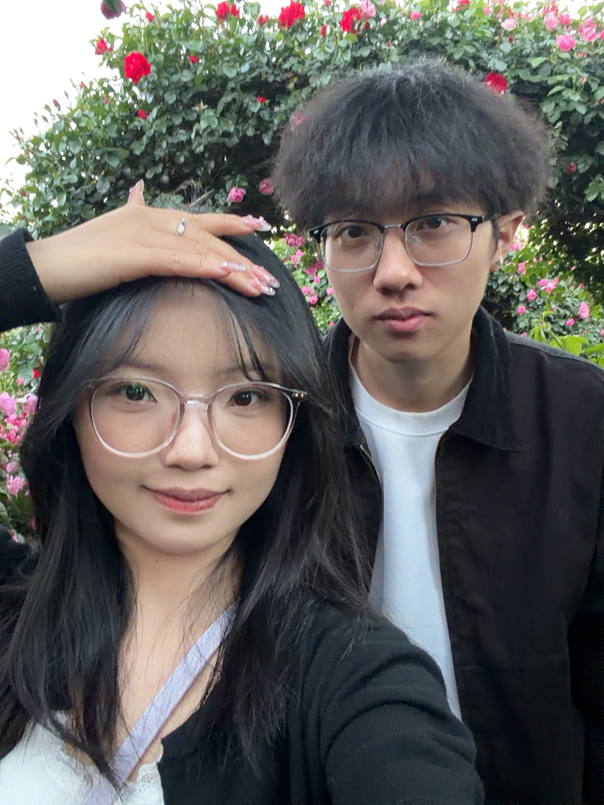
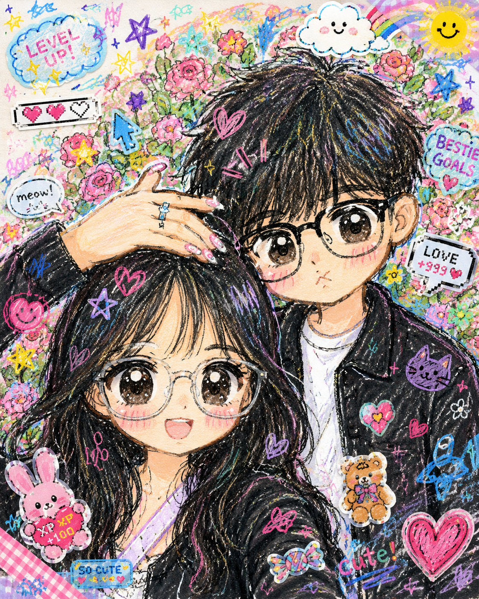
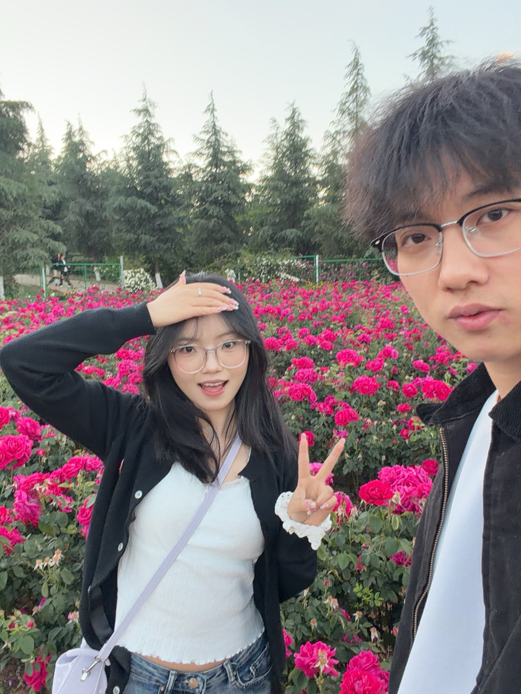
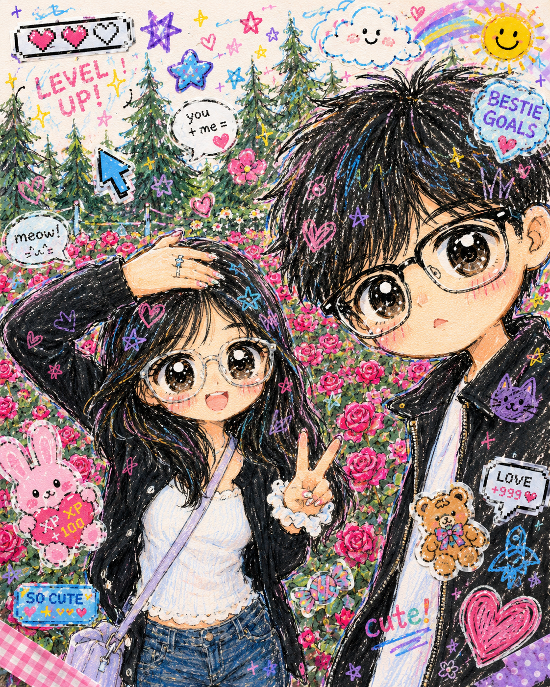

# 可爱混乱插画风格

> 来源：[ChatGPT](https://chatgpt.com/c/6a09e550-1644-83a8-af51-12a82d9193ae)
> 归档时间：2026-05-20 19:50:54

## 我的对话目录

1. [\[图片：image\]](#turn-001)
2. [\[图片：image\]](#turn-002)

---

## 对话正文

## 对话 001

**我：**

把上传照片转化成一种可爱混乱的儿童蜡笔涂鸦插画风格。整体像是彩铅＋蜡笔+ 手账贴纸+MS Paint 涂鸦的结合。 使用：粗糙线条、抖动边缘、不均匀上色、纸张纹理、彩铅叠色、蜡笔颗粒感、故意幼稚但很有灵气的画风。人物变成Q版萌系二次元风格，大眼睛，夸张表情，可爱活泼。 背景加入大量 doodle： 爱心、星星、糖果、笑脸云朵、小花、贴纸、游戏UI元素、乱涂乱画符号。 颜色以：粉色、蓝色、紫色、黄色、薄荷色为主。 整体氛围：可爱、混乱、梦幻、少女感、游戏宅手账风、互联网 kawaii,Kawaii aesthetic 不要精致，不要高级商业插画感，不要真实渲染，不要干净线稿，保留“手绘失败感”和“乱涂鸦感”。

**GPT：**

**tool：**

{"prompt":"Edit Image A, the uploaded couple photo, and transform it into a cute chaotic children's crayon-doodle illustration. Preserve the composition and the fact that it is a selfie of two people together, keeping both people recognizable from Image A while converting them into chibi, moe anime-style characters with oversized eyes, adorable lively expressions, simplified proportions, and playful energy. Keep the girl's hand resting on the other person's head as an important pose detail.\n\nRender the whole image in a deliberately messy handmade mixed-media style that looks like colored pencils + wax crayons + scrapbook stickers + MS Paint doodles combined. Use rough sketchy outlines, jittery edges, uneven coloring, visible paper texture, layered colored-pencil strokes, crayon grain, scribbly fills, and intentionally childish but spirited drawing quality. Avoid realism, avoid polished commercial illustration, avoid clean line art, and avoid refined rendering. Embrace a charming hand-drawn failure feeling and chaotic doodle feeling.\n\nAdd a busy doodle-filled background inspired by the flower setting in Image A, but reinterpret it in a whimsical kawaii way with lots of playful doodles and stickers: hearts, stars, candy, smiley clouds, tiny flowers, stickers, sparkles, game UI elements, arrows, speech bubbles, scribbles, and random cute symbols. Keep the mood dreamy, internet-kawaii, gamer-scrapbook, girly, playful, and adorably chaotic.\n\nUse a palette focused on pink, blue, purple, yellow, and mint, while still allowing the dark hair, glasses, and black clothing from Image A to remain readable. Make the image feel cute, messy, dreamy, youthful, and full of doodle energy.","reference_image_paths":["/mnt/data/ghostwriter_images/context/99d5267b-0341-55f5-bbc6-3672e04f078b.jpg"],"aspect_ratio":"4:5"}

**tool：**

Model caption: A colorful kawaii anime/chibi illustration in a messy crayon/colored-pencil mixed-media style, like a scrapbook doodle selfie. **Overall scene:** Close-up portrait composition of two young people (anime/chibi style) in the foreground, framed like a selfie with a busy, sticker-and-doodle-filled background. The whole image looks like a hand-drawn crayon/colored-pencil collage with glittery/marker accents, pastel colors, scribbles, and many cute stickers (hearts, stars, flowers, smiley faces, candy, arrows). The background is a riot of flowers and doodles (roses/flowers and leaves in pink/green), clouds, hearts, stars, and tiny icons, with a paper texture and sticker cutout aesthetic, layered like a scrapbook page. **Subjects and pose:** Two young (teen/young adult-looking) East Asian–appearing/chibi-style characters with fair/light skin, huge shiny brown/black anime eyes, rosy blush and cute expressions. They look like a couple or close friends taking a selfie. On the left/front is a girl with long black hair, wearing oversized clear/transparent roundish glasses, big sparkling brown eyes with highlights, blushing cheeks, and a cheerful open smile. She has straight/soft bangs and long hair drawn with crayon texture and purple/blue highlights; little doodles in/around her hair (a pink heart, a purple star clip/doodle, scribbles). She wears a black jacket/cardigan over a light/lilac strap or top (a pale/lavender strap-like detail visible), and her skin is pale peach with crayon blush. Her hand (with pink/white nail polish and tiny star/heart decoration) is on top of the boy’s head, patting his hair; she wears a ring with a little blue/white gem or blue ring detail. Near her are pink hearts and doodles; a large pixel/cute vibe. In the bottom-left sticker area a pink bunny sticker holds a heart sign that says “XP +100” (pixel/badge style). Near her is a speech-bubble doodle that says “meow!” with a little cat face “^_^” style or tiny cat mouth/whisker marks (appears like “meow!” with small cat doodle). **On the right/back is a boy with short, messy black/dark brown hair (crayon-textured with scribbled highlights), wearing black–dark framed glasses, with large brown eyes and a slightly pouty/neutral but cute expression, faint blush marks on the cheeks. He looks like a teen/young adult as well, light/fair skin (matching the girl). He wears a black jacket or coat over a white shirt (simple tee), and stands/leans behind or beside the girl so both fit in the selfie. The girl’s hand rests on his head, with little pink “pat” marks and a pink heart doodle near the hair. **Accents and background doodles:** The whole scene is packed with doodles, stickers, and scribbles: top-left has a cloud/rounded speech-bubble-like sticker with “LEVEL UP!” in hand-drawn pink/purple letters with sparkles; nearby there is a pixel/retro element showing three hearts (two pink filled hearts and one outlined/empty) like a health bar; a blue arrow/cursor pointer; many stars (yellow, purple, blue); flowers and a big pink rose-like scribble background. Near the top center/right is a white cloud with a smiling face and pink cheeks and a tiny rainbow; a small yellow sun circle with a smiley face in the upper right. A sticker-like text bubble on the right says “BESTIE GOALS” in colorful hand-drawn letters with a heart. Below/right is a pixelated speech bubble sticker reading “LOVE +999” (black text with “+999” in pink/red and a small heart). Around the right side are doodles: a purple cat face sticker doodle, hearts, a little flower, a spiral/squiggle line, and a blue scribble. There are many tiny sparkles, plus signs, and scribbled stars across the whole page. Bottom right has a cute teddy-bear sticker holding something (or with a bow), small candy sticker, and the word “cute!” in colorful letters with a little heart and underline scribble. A large pink heart doodle sits near the bottom right corner. Bottom left includes a blue/green doodle flower, yellow star, and a blue label/sticker reading “SO CUTE” with tiny hearts. There is also a pink smiley blob/drippy sticker on the left side and many pastel scribbles, checkered tape or washi-like pattern (pink gingham) in the lower-left corner. Top-left area also has little stars and scribbles and the “LEVEL UP!” scalloped bubble, plus a pink/purple scribble “!!” feel and some arrow-ish marks. Little texts and symbols everywhere: “meow!” (in a speech bubble near left), “LEVEL UP!” (top left), pixel hearts bar (top left), “BESTIE GOALS” (top right), “LOVE +999” (right), “XP +100” (on bunny sticker bottom left), “SO CUTE” (bottom left), and “cute!” (bottom right). Additional doodles include hearts, pluses, stars, tiny flowers, a spiral scribble, and pastel scribbled backgrounds (pink, blue, yellow, mint). The style is crayon/colored-pencil with sticker cutout outlines, childlike messy lines, and a scrapbook/diary vibe, very busy and cute with layered doodles and a heartfelt “kawaii sticker collage” aesthetic.<|has_watermark|>

**tool：**

Generated images from the last `image_gen.text2im` call were saved at:
- /mnt/data/ghostwriter_images/generated/a_colorful_kawaii_anime_chibi_illustration_in_a_me_1.png (wxh = 1122 x 1402, exact aspect ratio 561:701, close to aspect ratio 4:5)

You can visually inspect the generated image directly in the tool result above. Only reopen the saved path if you need programmatic processing or want to pass the image into another tool call.

---

## 对话 002

**我：**

继续生成

**GPT：**

**tool：**

{"prompt":"Create a new illustration based on the uploaded photo, transforming it into the same cute chaotic children’s crayon doodle style as before. Image A is the new source photo and should provide the two people, their clothing, pose, glasses, hair, and the flower-field setting. Image B is a style reference showing the desired visual language. Recreate the scene from Image A as a Q-version chibi anime illustration with large sparkling eyes, exaggerated cute expressions, and lively poses, while keeping the two people recognizable as the same pair from the photo. Preserve the girl standing in the rose garden with one hand on her head and the other making a peace sign, wearing round glasses, a white top, black cardigan, jeans, and a light lavender crossbody bag. Preserve the boy on the right side with messy dark hair, rectangular glasses, black jacket, and white shirt, framed close to the camera. Keep the bright pink rose field and trees in the background, but convert everything into a playful messy hand-drawn scrapbook illustration.\n\nUse a mixed media kawaii look: colored pencil plus wax crayon plus diary stickers plus MS Paint doodles. Use rough sketchy outlines, jittery edges, uneven coloring, visible paper texture, layered colored-pencil strokes, crayon grain, and an intentionally naive childlike handmade feel. Do not make it polished, elegant, realistic, or like clean commercial illustration. Keep the charming ‘failed hand-drawn’ messy doodle energy.\n\nFill the background and empty areas with lots of cute doodles and stickers: hearts, stars, smiley clouds, candy, tiny flowers, bows, sparkles, pixel game UI icons, arrows, speech bubbles, scribbled symbols, washi tape, stickers, and random cute notes. Use a palette dominated by pink, blue, purple, yellow, and mint. Overall mood: cute, chaotic, dreamy, girly, internet kawaii, scrapbook gamer-girl aesthetic. Make the final image dense, lively, hand-drawn, and adorably messy.","reference_image_paths":["/mnt/data/ghostwriter_images/context/1e2568bf-6bf3-5c51-adfd-9c77c8848814.jpg","/mnt/data/ghostwriter_images/generated/a_colorful_kawaii_anime_chibi_illustration_in_a_me_1.png"],"aspect_ratio":"4:5"}

**tool：**

Model caption: A colorful kawaii doodle / crayon / colored-pencil illustration scene: overall a vibrant, heavily decorated, scribbly “photo” style selfie in a flower field with many cute sticker-like doodles and text everywhere. Overall scene: a bright, pastel, hand-drawn chibi anime/manga style couple selfie in a rose garden with conifer trees in the background, filled with stars, hearts, clouds, rainbows, pixel/retro UI stickers, and lots of handwritten doodle text, as if drawn in a scrapbook sticker page. Background: lots of pink roses/flowers filling the midground and foreground, leafy greenery and tall evergreen trees behind them, a pale paper texture with crayon/colored-pencil strokes, and a sky area filled with doodles (stars, tiny hearts, clouds, rainbow, sun). Two humans (chibi/young looks, possibly East Asian-ish appearance implied by style, light skin tones): LEFT foreground is a cute young woman girl-like character with big sparkling brown eyes and blush, long dark/black hair with colorful highlights scribbled in, wearing round/large clear glasses, smiling with an open mouth and cheerful expression. She has one hand on her head (palm/hand on top of her hair/scalp) and the other hand flashing a peace sign (V sign) toward the camera. She wears a white/crochet-ish or lacy-trim camisole/top or tank with scalloped edge under a black cardigan/jacket, blue jeans, and a light lavender/purple crossbody bag strap across her chest with a cute bag (lavender) and small bow charm. She has nail polish or decorated nails and a ring (small jewelry) on her finger; a scrunchie or lacy wrist accessory (white ruffle) on the wrist making the peace sign. Her face is round and chibi with huge shiny eyes, rosy cheeks, cute excited look. Her hair has doodle accents like stars, hearts, little scribbles, and a pink heart mark near her head. RIGHT foreground is a young man/boy-like character with big brown sparkly eyes, rosy cheeks, slightly pouty/cute neutral expression, wearing rectangular/rounded glasses (clear/black frames), and messy dark/black hair with drawn highlights and small doodles around it. He is positioned close to the camera at the right side (selfie angle), looking toward the viewer. He wears a black jacket or zip-up coat over a white shirt; the jacket has a zipper and doodles on it including a purple cat face patch/drawing and other tiny scribbles; he is angled so his face fills the right side of the frame. Both look like teenagers/young adults, light-skinned, anime chibi style, and they appear in a selfie composition with the guy nearer the right edge and the girl to the left, between them a sea of roses and greenery. Accessories and decorations: both wear glasses; the girl’s glasses are round, the boy’s are more rectangular; both have cute highlights and rosy blush. Many sticker/doodle elements all over the image: top left has a pixelated game-life bar with three hearts (two pink hearts and one white/empty heart) in a pixel UI box; near it “LEVEL UP!” written in big pink crayon letters with sparkles; many stars (yellow, purple, blue), hearts (pink/purple), and doodle marks. A cloud doodle with a smiling face and blush near the top; a rainbow and a sun doodle at the top right with a smiling face and rays; tiny hearts and sparkle marks scattered. A speech-bubble / doodle bubble near upper left says “you + me =” plus a pink heart (written “you + me =” with a heart). Nearby is a pixel-style arrow/cursor doodle in blue/black. A purple/blue star sticker doodle and many small plus signs and crosses. Top right has a scalloped cloud-shaped sticker reading “BESTIE GOALS” with a pink heart. Left side has a speech bubble with “meow!” and a little cat face emoticon “=^.^=” style (the text shows “meow!” and a small cat face). Left-lower side has a pink bunny plush-like doodle holding a heart-shaped sign “XP +100” (the bunny is cute with blush). Bottom left has a blue pixel-art style box that reads “SO CUTE” with small hearts and plus-like icons (e.g., “SO CUTE” with hearts like “+ ♥”/small pixel hearts). Bottom right has a speech bubble with “LOVE +999” and a small heart (pixel style). Nearby is a teddy bear sticker holding a bow (brown teddy with pink/blue bow). Near the lower right is the word “cute!” in colorful crayon letters with underlines and scribbles. There is a large pink heart doodle near the bottom right. Around the characters are many small doodles: stars, hearts, flowers, plus signs, scribble accents, a candy doodle near the lower middle, a blue rocket doodle on the right, small bows and flowers, and a purple cat face doodle on the boy’s jacket area. Also many tiny hearts and pastel scribble textures, and a strip/patch of pink gingham tape-like pattern in the bottom left corner and a purple polka-dot tape-like area in the bottom right edge. The entire picture has a hand-drawn crayon/colored-pencil texture, with scribbly outlines, thick sketchy strokes, pastel pinks, purples, blues, yellows, greens, and a scrapbook/cute sticker aesthetic. All text visible: “LEVEL UP!”, “you + me =” (with a heart), “BESTIE GOALS”, “meow!”, “XP +100”, “SO CUTE”, “LOVE +999”, and “cute!” plus the heart/life UI and many symbols. The composition feels like a decorated sticker photo with two adorable chibi people in a rose garden, selfie-style, with tons of kawaii, pastel, scrapbook doodles and text.<|has_watermark|>

**tool：**

Generated images from the last `image_gen.text2im` call were saved at:
- /mnt/data/ghostwriter_images/generated/a_colorful_kawaii_doodle_crayon_colored_pencil_1.png (wxh = 1122 x 1402, exact aspect ratio 561:701, close to aspect ratio 4:5)

You can visually inspect the generated image directly in the tool result above. Only reopen the saved path if you need programmatic processing or want to pass the image into another tool call.
