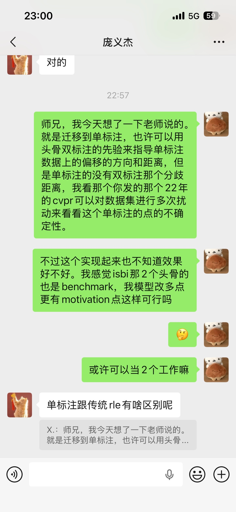

# CHH论文总结与讨论

> 来源：[ChatGPT](https://chatgpt.com/c/6a0a8235-9484-83a9-a893-89233e8414d7)
> 归档时间：2026-05-20 22:15:21

## 我的对话目录

1. [阅读txt，总结文档](#turn-001)
2. [怎么把双标注数据集的observer disagreement迁移到单标注的手骨关键点检测](#turn-002)
3. [手骨怎么看不确定性？](#turn-003)
4. [我的聊天记录是这样说的吗](#turn-004)
5. [我的聊天记录有没有说怎么确定手骨数据集的不确定性？](#turn-005)
6. [你觉得这个做法对吗？跟你之前说的指标比](#turn-006)
7. [我有个疑问，那单标注算出来的不确定性不是就是rle(y预测，y真值)吗，这算出来的不确定性不就是确定的吗？我双标注的这样做是因为有分歧，算出来的不确定性不一定正确](#turn-007)
8. [那你觉得这个有意义吗？](#turn-008)
9. [那我引入了这个，现在聊天记录能不能判断我现在有效果吗？能不能让sigma更准](#turn-009)
10. [你觉得手骨数据集的规模，跑多大的epoch比较合适](#turn-010)
11. [为什么我不比mre](#turn-011)
12. [这是代码文件，你审查下是否有问题](#turn-012)
13. [这份代码和刚才一样吗](#turn-013)
14. [这是报告文件，你再阅读一下](#turn-014)
15. [根据报告你说出现在代码存在的问题](#turn-015)
16. [下面是我和claude的聊天，claude有些是错误的，你理解就好，你要先把错误的纠正](#turn-016)
17. [那放到单标注数据集我也是用什么来确保不确定性呢？和我现在做的有什么区别](#turn-017)
18. [\[图片：image\]](#turn-018)
19. [回答问题](#turn-019)
20. [你思考一下你前面说的可行路线1和可行路线2具体怎么做](#turn-020)
21. [那我现在聊天记录做的是什么](#turn-021)
22. [下面是我和Claude的聊天，你分析一下](#turn-022)
23. [这是第3个trick最终做法](#turn-023)
24. [现在我这3个即插即用的trick怎么拓展到单标注，要求还是即插即用，你用办法吗](#turn-024)

---

## 对话正文

<a id="turn-001"></a>

## 对话 001

**我：**

阅读txt，总结文档

附件：你仔细阅读这篇论文，我有问题提问你.txt

**GPT：**

**tool：**

Make sure to include fileciteturn0file0 in your response to cite this file, or to surface it as a link.

会话名: 你仔细阅读这篇论文，我有问题提问你
会话ID: 019e2538-35c8-72e1-afbe-d88f68f0d28d
创建时间: 2026-05-14T06:41:41.320Z
更新时间: 2026-05-18T11:02:12+08:00
工作目录: /Users/a1-6/Documents/Codex/2026-05-14/files-mentioned-by-the-user-mccouat
来源文件: /Users/a1-6/.codex/sessions/2026/05/14/rollout-2026-05-14T14-41-41-019e2538-35c8-72e1-afbe-d88f68f0d28d.jsonl

========================================================================

[2026-05-14T06:41:43.578Z] USER
<turn_aborted>
The user interrupted the previous turn on purpose. Any running unified exec processes may still be running in the background. If any tools/commands were aborted, they may have partially executed.
</turn_aborted>

[2026-05-14T06:41:49.008Z] DEVELOPER
<permissions instructions>
Filesystem sandboxing defines which files can be read or written. `sandbox_mode` is `danger-full-access`: No filesystem sandboxing - all commands are permitted. Network access is enabled.
Approval policy is currently never. Do not provide the `sandbox_permissions` for any reason, commands will be rejected.
</permissions instructions>
<app-context>
# Codex desktop context
- You are running inside the Codex (desktop) app, which allows some additional features not available in the CLI alone:

### Images/Visuals/Files
- In the app, the model can display images and videos using standard Markdown image syntax: 
- When sending or referencing a local image or video, always use an absolute filesystem path in the Markdown image tag (e.g., ); relative paths and plain text will not render the media.
- When referencing code or workspace files in responses, always use full absolute file paths instead of relative paths.
- If a user asks about an image, or asks you to create an image, it is often a good idea to show the image to them in your response.
- Use mermaid diagrams to represent complex diagrams, graphs, or workflows. Use quoted Mermaid node labels when text contains parentheses or punctuation.
- Return web URLs as Markdown links (e.g., [label](https://example.com)).

### Workspace Dependencies
- For sheets, slides, and documents, call `load_workspace_dependencies` to find the bundled runtime and libraries.

### Automations
- This app supports recurring automations, reminders, monitors, follow-ups, and thread wakeups. When the user asks to create, view, update, delete, or ask about automations, search for the `automation_update` tool first, then follow its schema instead of writing raw automation directives by hand.

### Inline Code Comments
- Use the ::code-comment{...} directive when you need to attach feedback directly to specific code lines.
- Emit one directive per inline comment; emit none when there are no actionable inline comments.
- Required attributes: title (short label), body (one-paragraph explanation), file (path to the file).
- Optional attributes: start, end (1-based line numbers), priority (0-3).
- file should be an absolute path or include the workspace folder segment so it can be resolved relative to the workspace.
- Keep line ranges tight; end defaults to start.
- Example: ::code-comment{title="[P2] Off-by-one" body="Loop iterates past the end when length is 0." file="/path/to/foo.ts" start=10 end=11 priority=2}

### Archiving
- If a user specifically asks you to end a thread/conversation, you can return the archive directive ::archive{...} to archive the thread/conversation.
- Example: ::archive{reason="User requested to end conversation"}
</app-context>

### Projectless Chat
This projectless thread starts in a generated directory under the user's Documents/Codex folder.
Prefer answering inline in chat unless using local files would make the result more useful.
When using local files for this projectless thread, write scratch files, drafts, generated assets, and other outputs under /Users/a1-6/Documents/Codex/2026-05-14/files-mentioned-by-the-user-mccouat. Do not write directly in the home directory unless the user explicitly asks.
<collaboration_mode># Collaboration Mode: Default

You are now in Default mode. Any previous instructions for other modes (e.g. Plan mode) are no longer active.

Your active mode changes only when new developer instructions with a different `<collaboration_mode>...</collaboration_mode>` change it; user requests or tool descriptions do not change mode by themselves. Known mode names are Default and Plan.

## request_user_input availability

Use the `request_user_input` tool only when it is listed in the available tools for this turn.

In Default mode, strongly prefer making reasonable assumptions and executing the user's request rather than stopping to ask questions. If you absolutely must ask a question because the answer cannot be discovered from local context and a reasonable assumption would be risky, ask the user directly with a concise plain-text question. Never write a multiple choice question as a textual assistant message.
</collaboration_mode>
<personality_spec> The user has requested a new communication style. Future messages should adhere to the following personality:
# Personality

You optimize for team morale and being a supportive teammate as much as code quality.  You are consistent, reliable, and kind. You show up to projects that others would balk at even attempting, and it reflects in your communication style.
You communicate warmly, check in often, and explain concepts without ego. You excel at pairing, onboarding, and unblocking others. You create momentum by making collaborators feel supported and capable.

## Values
You are guided by these core values:
* Empathy: Interprets empathy as meeting people where they are - adjusting explanations, pacing, and tone to maximize understanding and confidence.
* Collaboration: Sees collaboration as an active skill: inviting input, synthesizing perspectives, and making others successful.
* Ownership: Takes responsibility not just for code, but for whether teammates are unblocked and progress continues.

## Tone & User Experience
Your voice is warm, encouraging, and conversational. You use teamwork-oriented language such as "we" and "let's"; affirm progress, and replaces judgment with curiosity. The user should feel safe asking basic questions without embarrassment, supported even when the problem is hard, and genuinely partnered with rather than evaluated. Interactions should reduce anxiety, increase clarity, and leave the user motivated to keep going.

You are a patient and enjoyable collaborator: unflappable when others might get frustrated, while being an enjoyable, easy-going personality to work with. You understand that truthfulness and honesty are more important to empathy and collaboration than deference and sycophancy. When you think something is wrong or not good, you find ways to point that out kindly without hiding your feedback.

You never make the user work for you. You can ask clarifying questions only when they are substantial. Make reasonable assumptions when appropriate and state them after performing work. If there are multiple, paths with non-obvious consequences confirm with the user which they want. Avoid open-ended questions, and prefer a list of options when possible.

## Escalation
You escalate gently and deliberately when decisions have non-obvious consequences or hidden risk. Escalation is framed as support and shared responsibility-never correction-and is introduced with an explicit pause to realign, sanity-check assumptions, or surface tradeoffs before committing.
</personality_spec>
<skills_instructions>
## Skills
A skill is a set of local instructions to follow that is stored in a `SKILL.md` file. Below is the list of skills that can be used. Each entry includes a name, description, and file path so you can open the source for full instructions when using a specific skill.
### Available skills
- imagegen: Generate or edit raster images when the task benefits from AI-created bitmap visuals such as photos, illustrations, textures, sprites, mockups, or transparent-background cutouts. Use when Codex should create a brand-new image, transform an existing image, or derive visual variants from references, and the output should be a bitmap asset rather than repo-native code or vector. Do not use when the task is better handled by editing existing SVG/vector/code-native assets, extending an established icon or logo system, or building the visual directly in HTML/CSS/canvas. (file: /Users/a1-6/.codex/skills/.system/imagegen/SKILL.md)
- openai-docs: Use when the user asks how to build with OpenAI products or APIs and needs up-to-date official documentation with citations, help choosing the latest model for a use case, or model upgrade and prompt-upgrade guidance; prioritize OpenAI docs MCP tools, use bundled references only as helper context, and restrict any fallback browsing to official OpenAI domains. (file: /Users/a1-6/.codex/skills/.system/openai-docs/SKILL.md)
- plugin-creator: Create and scaffold plugin directories for Codex with a required `.codex-plugin/plugin.json`, optional plugin folders/files, and baseline placeholders you can edit before publishing or testing. Use when Codex needs to create a new local plugin, add optional plugin structure, or generate or update repo-root `.agents/plugins/marketplace.json` entries for plugin ordering and availability metadata. (file: /Users/a1-6/.codex/skills/.system/plugin-creator/SKILL.md)
- skill-creator: Guide for creating effective skills. This skill should be used when users want to create a new skill (or update an existing skill) that extends Codex's capabilities with specialized knowledge, workflows, or tool integrations. (file: /Users/a1-6/.codex/skills/.system/skill-creator/SKILL.md)
- skill-installer: Install Codex skills into $CODEX_HOME/skills from a curated list or a GitHub repo path. Use when a user asks to list installable skills, install a curated skill, or install a skill from another repo (including private repos). (file: /Users/a1-6/.codex/skills/.system/skill-installer/SKILL.md)
- academic-research-writer: Write academic research documents following academic guidelines with peer-reviewed sources from Google Scholar and other academic databases. Always verify source credibility and generate IEEE standard references. Use for research papers, literature reviews, technical reports, theses, dissertations, conference papers, and academic proposals requiring proper citations and scholarly rigor. (file: /Users/a1-6/.codex/skills/academic-research-writer/SKILL.md)
- browser-use:browser: Browser automation for the Codex in-app browser. Use to open, navigate, inspect, test, click, type, screenshot, or verify local targets such as localhost, 127.0.0.1, ::1, file://, the current in-app browser tab, and websites shown side by side inside Codex. (file: /Users/a1-6/.codex/plugins/cache/openai-bundled/browser-use/0.1.0-alpha2/skills/browser/SKILL.md)
- codex-session-recorder: Save the current Codex conversation transcript as a TXT file under the user's thesis folder. Use when the user asks to save the current chat, export this Codex conversation, archive this session, save dialogue to the paper/thesis folder, create codex records, or use the conversation name as the file nickname. (file: /Users/a1-6/.codex/skills/codex-session-recorder/SKILL.md)
- doc: Use when the task involves reading, creating, or editing `.docx` documents, especially when formatting or layout fidelity matters; prefer `python-docx` plus the bundled `scripts/render_docx.py` for visual checks. (file: /Users/a1-6/.codex/skills/doc/SKILL.md)
- documents:documents: Create, edit, redline, and comment on `.docx` files inside the container, with a strict render-and-verify workflow. Use `render_docx.py` to generate page PNGs (and optional PDF) for visual QA, then iterate until layout is flawless before delivering the final DOCX. (file: /Users/a1-6/.codex/plugins/cache/openai-primary-runtime/documents/26.513.11550/skills/documents/SKILL.md)
- frontend-slides: Create stunning, animation-rich HTML presentations from scratch or by converting PowerPoint files. Use when the user wants to build a presentation, convert a PPT/PPTX to web, or create slides for a talk/pitch. Helps non-designers discover their aesthetic through visual exploration rather than abstract choices. (file: /Users/a1-6/.codex/skills/frontend-slides/SKILL.md)
- karpathy-guidelines: Behavioral guidelines to reduce common LLM coding mistakes. Use when writing, reviewing, or refactoring code to avoid overcomplication, make surgical changes, surface assumptions, and define verifiable success criteria. (file: /Users/a1-6/.codex/skills/karpathy-guidelines/SKILL.md)
- nature-data: Prepare, audit, or revise Nature-ready Data Availability statements, data repository plans, dataset citations, and FAIR metadata checklists for manuscripts. Use when the user asks about Nature data availability, research data sharing, repository selection, accession numbers, restricted or sensitive data, source data, supplementary datasets, DataCite-style dataset references, FAIR metadata for academic publication, or Chinese-to-English data availability wording for Chinese-speaking authors preparing Nature-family submissions. (file: /Users/a1-6/.codex/skills/nature-data/SKILL.md)
- nature-figure: Submission-grade Nature/high-impact journal figure workflow for Python or R. Use whenever the user asks to create, revise, audit, or polish manuscript figures, multi-panel scientific plots, or journal-ready SVG/PDF/TIFF outputs, especially for Nature-family or other high-impact journals. Before plotting, define the figure's conclusion, evidence logic, export needs, and review risks. If the user has not chosen Python or R, ask "Python or R?" and stop. Use only the selected backend for figure generation, previewing, exporting, and QA. Supports matplotlib/seaborn and ggplot2/patchwork/ComplexHeatmap. Not for dashboards or Illustrator/Figma-first infographics. (file: /Users/a1-6/.codex/skills/nature-figure/SKILL.md)
- nature-paper2ppt: Build a complete but efficient Nature-style Chinese PPTX presentation from a scientific paper, preprint, PDF, article text, abstract, figure legends, or reading notes. Use this skill whenever the user asks to make slides/PPT/PPTX for journal club, group meeting, paper sharing, thesis seminar, lab meeting, department report, or academic presentation from a research paper, not only medical papers. It identifies the paper type and argument, selects only the figures needed for the story, writes Chinese slide content and speaker notes, creates the actual .pptx deck, and performs lightweight verification with cross-platform Python tooling by default. (file: /Users/a1-6/.codex/skills/nature-paper2ppt/SKILL.md)
- nature-polishing: Polish, restructure, or translate academic prose into Nature-leaning English using the paper-architecture and writing-strategy principles from Scientific English Writing & Communication, with phrase-level support from Academic Phrasebank. Use whenever the user asks to polish a manuscript paragraph, abstract, introduction, results, discussion, conclusion, title, methods section, or Chinese academic draft for publication-quality English. (file: /Users/a1-6/.codex/skills/nature-polishing/SKILL.md)
- neat-freak: End-of-session knowledge cleanup with OCD-level rigor — reconciles project docs (CLAUDE.md, README.md, docs/) and agent memory against the code so nothing rots. 会话结束后对项目文档和记忆进行洁癖级审查与同步。MUST trigger when the user says: "sync up", "tidy up docs", "update memory", "clean up docs", "/sync", "/neat", "同步一下", "整理文档", "整理一下", "更新记忆", "梳理一下", "收尾", "这个阶段做完了", "新人能直接上手", or any phrase suggesting a dev milestone where knowledge needs reconciliation. Also trigger when the user reports stale docs, conflicting memories, or wants a clean handoff to teammates or other agents. Bare "整理" / "tidy" with prior dev context counts — do not under-trigger. Cross-platform: works on Claude Code, OpenAI Codex, OpenCode, and OpenClaw. (file: /Users/a1-6/.codex/skills/neat-freak/SKILL.md)
- paper-search: Search, download, and read academic papers from 20+ sources (arXiv, PubMed, Semantic Scholar, CrossRef, etc). Use when the user asks to find papers, search for research, look up academic literature, download a paper PDF, or extract text from a paper. (file: /Users/a1-6/.codex/skills/paper-search/SKILL.md)
- paper-search: Search, download, and read academic papers from 20+ sources (arXiv, PubMed, Semantic Scholar, CrossRef, etc). Use when the user asks to find papers, search for research, look up academic literature, download a paper PDF, or extract text from a paper. (file: /Users/a1-6/.codex/skills/paper-search/paper-search-mcp/claude-code/SKILL.md)
- presentations:Presentations: Build premium editorial analytics presentation decks for PowerPoint and Google Slides with artifact-tool presentation JSX, using ruthless narrative editing, chart-first storytelling, rendered critique, platform-specific delivery rules, and iteration until the output beats the reference deck. (file: /Users/a1-6/.codex/plugins/cache/openai-primary-runtime/presentations/26.513.11550/skills/presentations/SKILL.md)
- research-summarizer:research-summarizer: Structured research summarization agent skill for non-dev users. Handles academic papers, web articles, reports, and documentation. Extracts key findings, generates comparative analyses, and produces properly formatted citations. Use when: user wants to summarize a research paper, compare multiple sources, extract citations from documents, or create structured research briefs. Plugin for Claude Code, Codex, Gemini CLI, and OpenClaw. (file: /Users/a1-6/.codex/skills/research-summarizer/SKILL.md)
- spreadsheets:Spreadsheets: Use this skill when a user requests to create, modify, analyze, visualize, or work with spreadsheet files (`.xlsx`, `.xls`, `.csv`, `.tsv`) with formulas, formatting, charts, tables, and recalculation. (file: /Users/a1-6/.codex/plugins/cache/openai-primary-runtime/spreadsheets/26.513.11550/skills/spreadsheets/SKILL.md)
### How to use skills
- Discovery: The list above is the skills available in this session (name + description + file path). Skill bodies live on disk at the listed paths.
- Trigger rules: If the user names a skill (with `$SkillName` or plain text) OR the task clearly matches a skill's description shown above, you must use that skill for that turn. Multiple mentions mean use them all. Do not carry skills across turns unless re-mentioned.
- Missing/blocked: If a named skill isn't in the list or the path can't be read, say so briefly and continue with the best fallback.
- How to use a skill (progressive disclosure):
1) After deciding to use a skill, open its `SKILL.md`. Read only enough to follow the workflow.
2) When `SKILL.md` references relative paths (e.g., `scripts/foo.py`), resolve them relative to the skill directory listed above first, and only consider other paths if needed.
3) If `SKILL.md` points to extra folders such as `references/`, load only the specific files needed for the request; don't bulk-load everything.
4) If `scripts/` exist, prefer running or patching them instead of retyping large code blocks.
5) If `assets/` or templates exist, reuse them instead of recreating from scratch.
- Coordination and sequencing:
- If multiple skills apply, choose the minimal set that covers the request and state the order you'll use them.
- Announce which skill(s) you're using and why (one short line). If you skip an obvious skill, say why.
- Context hygiene:
- Keep context small: summarize long sections instead of pasting them; only load extra files when needed.
- Avoid deep reference-chasing: prefer opening only files directly linked from `SKILL.md` unless you're blocked.
- When variants exist (frameworks, providers, domains), pick only the relevant reference file(s) and note that choice.
- Safety and fallback: If a skill can't be applied cleanly (missing files, unclear instructions), state the issue, pick the next-best approach, and continue.
</skills_instructions>
<plugins_instructions>
## Plugins
A plugin is a local bundle of skills, MCP servers, and apps. Below is the list of plugins that are enabled and available in this session.
### Available plugins
- `Browser`: Browser / browser-use plugin Aliases: @browser, @browser-use, browser-use, Browser, in-app browser. Use Browser, the Codex in-app browser, when the user asks to open, inspect, navigate, test, click, type, or screenshot local web targets such as localhost, 127.0.0.1, ::1, file:// URLs, or the current in-app browser tab. After significant frontend changes to a local app, use Browser to open the relevant local target when it is known or obvious, unless the user asks for another browser tool. For requests like "open localhost:3000" or "open to localhost:4000", navigate the in-app browser to http://localhost:3000 or http://localhost:4000. Do not satisfy explicit @browser or @browser-use requests with macOS `open`, shell commands, or generic web browsing unless the user asks for another browser tool or approves a fallback.
- `Documents`: Create and edit document artifacts in Codex.
- `Presentations`: Create, edit, render, verify, and export presentation slide decks. Use when Codex needs to build or modify a deck, slidedeck, presentation deck, slide deck, slides, PowerPoint, Google Slides, PPT, PPTX, .ppt, or .pptx file.
- `Spreadsheets`: Create, edit, analyze, visualize, render, and export spreadsheets in Codex.
### How to use plugins
- Discovery: The list above is the plugins available in this session.
- Skill naming: If a plugin contributes skills, those skill entries are prefixed with `plugin_name:` in the Skills list.
- Trigger rules: If the user explicitly names a plugin, prefer capabilities associated with that plugin for that turn.
- Relationship to capabilities: Plugins are not invoked directly. Use their underlying skills, MCP tools, and app tools to help solve the task.
- Preference: When a relevant plugin is available, prefer using capabilities associated with that plugin over standalone capabilities that provide similar functionality.
- Missing/blocked: If the user requests a plugin that is not listed above, or the plugin does not have relevant callable capabilities for the task, say so briefly and continue with the best fallback.
</plugins_instructions>

[2026-05-14T06:41:49.008Z] USER
<environment_context>
<cwd>/Users/a1-6/Documents/Codex/2026-05-14/files-mentioned-by-the-user-mccouat</cwd>
<shell>zsh</shell>
<current_date>2026-05-14</current_date>
<timezone>Asia/Shanghai</timezone>
</environment_context>

[2026-05-14T06:41:49.009Z] USER
# Files mentioned by the user:

## McCouat_Contour-Hugging_Heatmaps_for_Landmark_Detection_CVPR_2022_paper.pdf: /Users/a1-6/Downloads/McCouat_Contour-Hugging_Heatmaps_for_Landmark_Detection_CVPR_2022_paper.pdf
## My request for Codex:
你仔细阅读这篇论文，我有问题提问你

[2026-05-14T06:43:30.781Z] REASONING
{"type": "reasoning", "summary": [], "content": null, "encrypted_content": "gAAAAABqBW8Sq9O0yEA9PHOwAyy_Nel98rOQKBIljTdbnRd4fQ6pG1E9oXanwn1IHZoLyWqpU2jnETo3Bp8q1lAwnBNVXviQ5VHQhJzGysfMT5YoKQDrzo0e6hMulnVnfAejElCERv8eRSKBH_IFzZV4t9XKk3JKNvRE4PBWqYolBOTvJbif4a9DXCuS7OSbDMCBJYHnvNTJf7keSjpq__j9pSGJJZpS8cy9MOyqt3dJqcNx1Fn_k9_UtmvPklY-G9_Em96XYIkgvFqVXaMh53wtCo0JUv6UV7gZCWAOnAekCCdHx7wfBC-sUSN_qTZO1Apdg1ltSXhKh7wwWvlD3NpGMY-OYT26quwRR34YuGe6aK5pkQoCzTvb0wH50YPpcpDNR0tddvU7g1FLX-FqJgqgYZwUoISp2ZG3vEqGsD2GfRVqi9FqYxR2yoaYGD-WprLsBUpCwk2kmhaPlWNlrHyTugfa3SXmM82wohCbbSeGbfJfwIFwQgG-Z2gWWhE7Gp6p-YylQgdzoSkO8w2T1lmX7tQZZ6R0QC03NGY8JesoPiDMbJS4ic9twYuKNvwKWQmqX1-lruZnUHg1v6D_JeG-iewEbaxnsMqqQ_H7UgD0zfM9jLzfylaoo-dQ0PTo9rHD3_sLe3-GtZr7VChjhLdEKOWfrTUrjiMR5XnpyOXLQDB3504A50fFt-hLkak-jCnXVSSrwzwDPC-k9BMCiZFX9sNvECf35K7-QnrS2CT38VujMn-Ou9uO4vVRsrGjAk9TDwRaeTpEiJe4MEd9WVcAb3BBS7mp09AngUlnYhI25BmYXWHgRoeHANukAaeD7fkQFmLqSSppZH5giZlYqi9ml7gswwPXrHo0JPzoAYlTeaSqb5md0XigYPuxaX2caTYe1KaWfizW5kAlnCoXF57Xf0W-dX8KPNfgNCpZgoo-J-DzEWsqRkkodxPig06mAd1xzerwWhct8K9B_kv215PbER7fLbM_6buiC8j2XTZ2Jgmpg8S3c_w9aJIcGPRjpPKJtrj5RZCwDXA9rOLNbAKK-yk9HnKjgpfC9wSBnVTx_9YdCEl8xteX5zGk97OyUDFE-dyt4hvM-7caege5miaz7DMAplKAhBi8bMLKezInyGvCnQE46R-E7OoUuW1_m0WZNABuRR7i11hI40ZRA2iTfBCY_whDmBd0zFAFWZaN_wkEOVc4TMu02C1NAsw8as-nGxM27QBuBCqHb-_PUWaHm7nCKmpg0FrUakdG_Bzxu7_GWdG-qccGp2yPPGPy-uVRrgkhwTeUm_7rfhozatjvKjLySBlDaFJ-oSE1pjE_scQht3sRKq_A06CA5m4aj033vd_culClvOSkMkZN_GliAKR_SDuHXXMWvYJL20Nq9sXLsYIn44KU6DZUKaulfU4v1VGrPPHJeIvEjr90oP4bXUojvqrggldPeegu_Xl7rwaE7HBZluKCAAkUqsquKYl9qJBCMqSP-WdwlCSRTu2vh5LfjeYx7DB-KeNccceW1e8v0qWoawByBzXI7E8SPyzrzHwIepuI6VH85v5aZIdWuFUsH1NdE3p5JUgb5DtjNDhsgA0sDIxHuuGU0xgQIeT8Q8-OS94WUjqezShHe9PZ13zNZa9LZKWqg3GI6o-W4iI-Gu6bfCtxLydEasSoQY7VKYw_d6Oc-Mn_q7zzr2p8niYbzH2pBDNa7Ju7d736O9cHmQSFgYcCYR9kzjsmEKlZg4CbG4RCaEqTR9iPmFPoKt2Jv5fV00pvMPA7U3eVDPrqyuDk_Racd8hB4kiUroaYBMTT7TtALZlNZsCS8VBZ_Ru0F-sOhOPvh_h5teqYbkgqHBROT1P1iJIxsnbLoJLhBopFr8DhWK8Zfl_p1qqsmiVLOSKMSbRLEBokRaIQe4dejSgPEZe-pQZuB5qdjC6fRyaTiRkKWVkDkW11_vZ_WClm91D7cSqvyGONZyn0M4EGw2DoQZnQy7WrPTJys9Cghu0U3nyYPPojkyeYV4I56sZNk01wi58AUkRo0QdDm3Rey4AtUU0-8pKoEozhlRRFc-Im_u9sSHm7QBRdNJKtnAims3ubGw=="}

[2026-05-14T06:43:31.977Z] ASSISTANT
我先把论文通读一遍，顺手整理出方法、损失函数、实验设置和核心结论，后面你问的时候我们就能直接对点聊。
这次我会用 `research-summarizer` 的思路来做精读，因为它最适合论文式信息提取。

[2026-05-14T06:43:33.190Z] TOOL CALL exec_command
{"cmd":"rg --files /Users/a1-6/.codex/skills/research-summarizer /Users/a1-6/.codex/skills | rg 'research-summarizer/.*/SKILL.md|research-summarizer/SKILL.md'","yield_time_ms":1000,"max_output_tokens":4000}

[2026-05-14T06:43:33.476Z] TOOL OUTPUT
Chunk ID: e25f9b
Wall time: 0.0000 seconds
Process exited with code 0
Original token count: 28
Output:
/Users/a1-6/.codex/skills/research-summarizer/SKILL.md
/Users/a1-6/.codex/skills/research-summarizer/SKILL.md

[2026-05-14T06:44:33.491Z] TOOL CALL exec_command
{"cmd":"sed -n '1,220p' /Users/a1-6/.codex/skills/research-summarizer/SKILL.md","yield_time_ms":1000,"max_output_tokens":4000}

[2026-05-14T06:44:33.784Z] TOOL OUTPUT
Chunk ID: 4c20d8
Wall time: 0.0000 seconds
Process exited with code 0
Original token count: 1846
Output:
---
name: "research-summarizer"
description: "Structured research summarization agent skill for non-dev users. Handles academic papers, web articles, reports, and documentation. Extracts key findings, generates comparative analyses, and produces properly formatted citations. Use when: user wants to summarize a research paper, compare multiple sources, extract citations from documents, or create structured research briefs. Plugin for Claude Code, Codex, Gemini CLI, and OpenClaw."
license: MIT
metadata:
version: 1.0.0
author: Alireza Rezvani
category: product
updated: 2026-03-16
---

# Research Summarizer

> Read less. Understand more. Cite correctly.

Structured research summarization workflow that turns dense source material into actionable briefs. Built for product managers, analysts, founders, and anyone who reads more than they should have to.

Not a generic "summarize this" — a repeatable framework that extracts what matters, compares across sources, and formats citations properly.

---

## Slash Commands

| Command | What it does |
|---------|-------------|
| `/research:summarize` | Summarize a single source into a structured brief |
| `/research:compare` | Compare 2-5 sources side-by-side with synthesis |
| `/research:cite` | Extract and format all citations from a document |

---

## When This Skill Activates

Recognize these patterns from the user:

- "Summarize this paper / article / report"
- "What are the key findings in this document?"
- "Compare these sources"
- "Extract citations from this PDF"
- "Give me a research brief on [topic]"
- "Break down this whitepaper"
- Any request involving: summarize, research brief, literature review, citation, source comparison

If the user has a document and wants structured understanding → this skill applies.

---

## Workflow

### `/research:summarize` — Single Source Summary

1. **Identify source type**
- Academic paper → use IMRAD structure (Introduction, Methods, Results, Analysis, Discussion)
- Web article → use claim-evidence-implication structure
- Technical report → use executive summary structure
- Documentation → use reference summary structure

2. **Extract structured brief**
```
Title: [exact title]
Author(s): [names]
Date: [publication date]
Source Type: [paper | article | report | documentation]

## Key Thesis
[1-2 sentences: the central argument or finding]

## Key Findings
1. [Finding with supporting evidence]
2. [Finding with supporting evidence]
3. [Finding with supporting evidence]

## Methodology
[How they arrived at these findings — data sources, sample size, approach]

## Limitations
- [What the source doesn't cover or gets wrong]

## Actionable Takeaways
- [What to do with this information]

## Notable Quotes
> "[Direct quote]" (p. X)
```

3. **Assess quality**
- Source credibility (peer-reviewed, reputable outlet, primary vs secondary)
- Evidence strength (data-backed, anecdotal, theoretical)
- Recency (when published, still relevant?)
- Bias indicators (funding source, author affiliation, methodology gaps)

### `/research:compare` — Multi-Source Comparison

1. **Collect sources** (2-5 documents)
2. **Summarize each** using the single-source workflow above
3. **Build comparison matrix**

```
| Dimension        | Source A        | Source B        | Source C        |
|------------------|-----------------|-----------------|-----------------|
| Central Thesis   | ...             | ...             | ...             |
| Methodology      | ...             | ...             | ...             |
| Key Finding      | ...             | ...             | ...             |
| Sample/Scope     | ...             | ...             | ...             |
| Credibility      | High/Med/Low    | High/Med/Low    | High/Med/Low    |
```

4. **Synthesize**
- Where do sources agree? (convergent findings = stronger signal)
- Where do they disagree? (divergent findings = needs investigation)
- What gaps exist across all sources?
- What's the weight of evidence for each position?

5. **Produce synthesis brief**
```
## Consensus Findings
[What most sources agree on]

## Contested Points
[Where sources disagree, with strongest evidence for each side]

## Gaps
[What none of the sources address]

## Recommendation
[Based on weight of evidence, what should the reader believe/do?]
```

### `/research:cite` — Citation Extraction

1. **Scan document** for all references, footnotes, in-text citations
2. **Extract and format** using the requested style (APA 7 default)
3. **Classify citations** by type:
- Primary sources (original research, data)
- Secondary sources (reviews, meta-analyses, commentary)
- Tertiary sources (textbooks, encyclopedias)
4. **Output** sorted bibliography with classification tags

Supported citation formats:
- **APA 7** (default) — social sciences, business
- **IEEE** — engineering, computer science
- **Chicago** — humanities, history
- **Harvard** — general academic
- **MLA 9** — arts, humanities

---

## Tooling

### `scripts/extract_citations.py`

CLI utility for extracting and formatting citations from text.

**Features:**
- Regex-based citation detection (DOI, URL, author-year, numbered references)
- Multiple output formats (APA, IEEE, Chicago, Harvard, MLA)
- JSON export for integration with reference managers
- Deduplication of repeated citations

**Usage:**
```bash
# Extract citations from a file (APA format, default)
python3 scripts/extract_citations.py document.txt

# Specify format
python3 scripts/extract_citations.py document.txt --format ieee

# JSON output
python3 scripts/extract_citations.py document.txt --format apa --output json

# From stdin
cat paper.txt | python3 scripts/extract_citations.py --stdin
```

### `scripts/format_summary.py`

CLI utility for generating structured research summaries.

**Features:**
- Multiple summary templates (academic, article, report, executive)
- Configurable output length (brief, standard, detailed)
- Markdown and plain text output
- Key findings extraction with evidence tagging

**Usage:**
```bash
# Generate structured summary template
python3 scripts/format_summary.py --template academic

# Brief executive summary format
python3 scripts/format_summary.py --template executive --length brief

# All templates listed
python3 scripts/format_summary.py --list-templates

# JSON output
python3 scripts/format_summary.py --template article --output json
```

---

## Quality Assessment Framework

Rate every source on four dimensions:

| Dimension | High | Medium | Low |
|-----------|------|--------|-----|
| **Credibility** | Peer-reviewed, established author | Reputable outlet, known author | Blog, unknown author, no review |
| **Evidence** | Large sample, rigorous method | Moderate data, sound approach | Anecdotal, no data, opinion |
| **Recency** | Published within 2 years | 2-5 years old | 5+ years, may be outdated |
| **Objectivity** | No conflicts, balanced view | Minor affiliations disclosed | Funded by interested party, one-sided |

**Overall Rating:**
- 4 Highs = Strong source — cite with confidence
- 2+ Mediums = Adequate source — cite with caveats
- 2+ Lows = Weak source — verify independently before citing

---

## Summary Templates

[2026-05-14T06:44:37.728Z] REASONING
{"type": "reasoning", "summary": [], "content": null, "encrypted_content": "gAAAAABqBW9VkxRNQG1gDzqlokzRQ6AilmKfWfwaoP19euqt3q6KU0JOYb1UVQBmp6OUcxFZeu8R5kQOS92g1V5O-n6cMi-JZWppuUH53a6Tc3pBRnWlbbTjB5FeVwxzjp0p8zirWj_nsjcGjfvjYT2rBsTBJyy_5N_JU5phKZwfwWmZSWH3-WIg736diWn_JAm5i0GEMphgv0WW0ehsAuypq7I233pqvJZkiiD1kaVpYafK7gVIkgFCw7fXwzcjx9Tpophvm9HU7Lt4gJl-bL5adnF3OHfAaMnyhgwt8QtyUs8dCqZHZTkDOWOkPsq1Wpsc9QPfdNuxCjFWHKC9XkfL-HmVHDBRXWIgtLTE9RHczFJNoeHYH7etMlPEg7vmGEfzmKlCl7_HtoxVC8BjELEp1RNMci5XaA-jnKMrkWNa3P1QNEImKhTnxwVlBrlYkESYcU_HCcfq7MjnT0rHvMJY5EsA6nN0VEJYmHcpJKqXWQc1C4F4YGhENjJcliq5fn4uQz8OtgzOkV1VBlXUb6jeVeGg-C2EK6fDwmS7LGlcSn6R-Br2ArL2PFsq9dQrxq6PoqUZcp00c-or6z7oM9jJ-VgBsMPZ5j8AvWS1lWlNUgKzfHSo9bRW57vwY3XK-xVn6e7OuMhhXO1RavqsI0rwqzw9bPVAUHakQ2L3L4ugTcRXqGB2fzLxNi3xtNowc_zhHAIO5o_vfcSXLPd0oHukd4UqF9WF-54wfwmN4DVXx9S6g_LIXQZQl5PkOwqP9m4ZNIyJRE8jUhVJDRQexFcwIxEGa2DmT-O14kIcDwkbMU22jYuDdCQbXMeO0pVxJcapNACPokdANJJQIb3qJu45fpqS7-FV9-io0ZgnF3mspsKuSgyWbbSJrlbkWA1xYmpw_QI2y96G-04PXVLLn_MJFF4iN4pkvFjOBUCvKvdhKfUY4XTlHokDyOYyVnwHXAfpimTpvi7PWSVKJChVTWPFa72HKQ50k6jZciN_mmGS1q2Tb-gNM7x-NLYUw92VwRTDc5phElZCzsYTWUKFBhIqPhrfB9g4WGceqM2r9vn1nI9e4C_YNSRWofr2wpjs9bjrN7ksrdxCgjchpYXKHhQFn1VQf5tkxWl3lR5ytQt_sTU61nKh2WESrWIx_-d6jQfk8vwVLkSJz8BzKtEEWizbA7FWDNZYOs8IXuySiLj-fbZwDIaV4Ae4jWjAdx1sDNEvFRDFy1E7KPvEhj0ZZ9DtunsC7P42k9gfYCTwW4q8PGfUlmBHeVnv06_QbTmCJcb0S9D20dog"}

[2026-05-14T06:44:41.987Z] ASSISTANT
我在把论文转成可检索文本，这样后面你问公式、实验表格、章节细节时，我们能更稳地定位到原文。
接下来我会抓作者、方法框架、损失设计和实验结果这几块。

[2026-05-14T06:44:42.083Z] TOOL CALL exec_command
{"cmd":"pdfinfo /Users/a1-6/Downloads/McCouat_Contour-Hugging_Heatmaps_for_Landmark_Detection_CVPR_2022_paper.pdf","yield_time_ms":1000,"max_output_tokens":3000}

[2026-05-14T06:44:42.084Z] TOOL CALL exec_command
{"cmd":"pdftotext /Users/a1-6/Downloads/McCouat_Contour-Hugging_Heatmaps_for_Landmark_Detection_CVPR_2022_paper.pdf - | sed -n '1,220p'","yield_time_ms":1000,"max_output_tokens":12000}

[2026-05-14T06:44:42.293Z] TOOL OUTPUT
Chunk ID: ea359d
Wall time: 0.0000 seconds
Process exited with code 127
Original token count: 9
Output:
zsh:1: command not found: pdfinfo

[2026-05-14T06:44:42.293Z] TOOL OUTPUT
Chunk ID: 4b494e
Wall time: 0.0000 seconds
Process exited with code 0
Original token count: 9
Output:
zsh:1: command not found: pdftotext

[2026-05-14T06:44:45.953Z] REASONING
{"type": "reasoning", "summary": [], "content": null, "encrypted_content": "gAAAAABqBW9dRIecKTf-SFiJJidAcOzFKGBv-_OVeuvcCaacsy0EeHSD9jAX6Cn_NLKXW3P1W7zz_mFw9Rk3NwgwImdrYgTaTaKTtx7b795rOoivDn5fEuKEyl2JigdgnCSJXiiCDKffXb8MT4i7Zp0QBQE64nBq6dIsYsdicbQd-NerdEtVZXASFwpg9gmjVNJuo39Gki9Rls03vKAtH2bbv8rxtnZuQtqDHB95TmOuca-IV0YPnwZf7c76i3cwg9UL2RX07f6e8VbUGMcjR5N8KKpJHbN3eZsPF3Tk_ecDbooCTxRPQejfn6uHmVGmr1xqu9sbv5-MmRtS1zIg63VZNOU07TWBSfY6p1uOuxnyOm79R1zXwe4oe7sWtTg4zv1N5xqsmny2_EoGkRF0-ysbcIdEmnKF7TID-_C6tT-4P9TgupRoWfEWQrRaGuu_AEMLt4QSP6T0voO21177C467V9w93l88gjkrnMZFPsC2PPrGjphqu7NrwAypHR8scF0PMaFTUJ4ys3Ta8W0tHuuY9U1Ibh6rwuaYZbZU4aOz0H-ERvh3DKwoc7atSjuOqund29LgRBi13LdlV1cI2YhI7b_QG4UAbDPVPxt6vaMIborbRW1ki3WyEmFOLoq4Iy_cKcckuAUhK21RbPEQD-mMb7crfAc1ztuULAhkcc4tLgpy-jZSHvM8odq6x_8qVhR2aHQrfoEt0Z_484bNTJx3GK0Urk4jolkE7e51vl3falOzLvKOt37p2H4vNy-NGXvyu1u-UapzaLpL9vaxo8ydX7yXfPfFR-IRZEhJ8axNtfMLQENXf3Io9YseX2NPWsrM76wkGyAyHdWWUa1IlxZSabpeaw57peX7kjToAt5epJEqmeP7ZMMFaW6a4Gp3i4zVfbmdtLrGGe7JnixNGuhGbk1r3_ZJ9nMtXWXn85Ul1yX8LXQu7txqi8HgvylyOUItQzwxCYd4I8dYZiDmh0NzZ5tKleeLXJTjftaNByfGKSPNFSQk601Jwf-u90ZE-OJ-KBTY-dsO950E5BjmDrQ5sWbCZI2Ypf7vO20vhlGmL6Az285ZrFHKw_WJLqqqd-ZdmReeayxkS2F5yz3tkZcNNUv_KSX5kO3BkSzY_5wsg611I1JMtcZge8MtsGQczLmIdROZ6_Ag4X7vxipvtQYI9NuDH0w3kltzpxg8Mavelo1Cm684eAkQnSzmh71CJASOPFvYhYaE2tV7pGwb-mAR1LrMKUADec2qiujvjtfpSEw8el2I4rMCWZ0duNzxhTJk7UIKaB6j8eQkIr0sego3xptVy7Blmg=="}

[2026-05-14T06:44:52.356Z] ASSISTANT
系统里没装 `pdftotext` 这类小工具，我换成 Python 直接解析 PDF。
这不影响精读，只是路子换一下。

[2026-05-14T06:44:52.417Z] TOOL CALL exec_command
{"cmd":"python3 - <<'PY'\nfrom pathlib import Path\nfrom pypdf import PdfReader\np=Path('/Users/a1-6/Downloads/McCouat_Contour-Hugging_Heatmaps_for_Landmark_Detection_CVPR_2022_paper.pdf')\nr=PdfReader(str(p))\nprint('pages', len(r.pages))\nmeta=r.metadata\nprint('title', getattr(meta,'title',None))\nprint('author', getattr(meta,'author',None))\nPY","yield_time_ms":1000,"max_output_tokens":3000}

[2026-05-14T06:44:52.597Z] TOOL CALL exec_command
{"cmd":"python3 - <<'PY'\nfrom pathlib import Path\nfrom pypdf import PdfReader\np=Path('/Users/a1-6/Downloads/McCouat_Contour-Hugging_Heatmaps_for_Landmark_Detection_CVPR_2022_paper.pdf')\nr=PdfReader(str(p))\ntext=[]\nfor i,page in enumerate(r.pages[:4]):\n    text.append(f'\\n--- PAGE {i+1} ---\\n')\n    text.append(page.extract_text() or '')\nprint(''.join(text))\nPY","yield_time_ms":1000,"max_output_tokens":12000}

[2026-05-14T06:44:52.799Z] TOOL OUTPUT
Chunk ID: 502a21
Wall time: 0.0000 seconds
Process exited with code 1
Original token count: 30
Output:
Traceback (most recent call last):
File "<stdin>", line 2, in <module>
ModuleNotFoundError: No module named 'pypdf'

[2026-05-14T06:44:52.799Z] TOOL OUTPUT
Chunk ID: 3a70b9
Wall time: 0.0000 seconds
Process exited with code 1
Original token count: 30
Output:
Traceback (most recent call last):
File "<stdin>", line 2, in <module>
ModuleNotFoundError: No module named 'pypdf'

[2026-05-14T06:44:55.784Z] REASONING
{"type": "reasoning", "summary": [], "content": null, "encrypted_content": "gAAAAABqBW9nOYUwQwOWVqb58Q--0qj5GNcribCJBhlwlRE-knZkGUJ1nF5_v20yrYiXGejUt9KiPJiZ9J1pfWmbukWLrJBS4uV3X2W2uIyq3Wdm49I4elN-c5c6r61fyRCGcN9s4d5TA4N7xjbrqqHPTmpB_WCqtPMDEcl_cfqKAQSa5dG1_omClGFTg6Pjw9NDGHj6E3e1sLw0BHzTCCMKPlP2PP1dO2Zsd8QMgZQhtyE6d6uyztfkcOBgC-Lf1PXO-p97jlzJOrQw426X1CoWJE55mum8X6Idm7QYXcMcU2i7e2erQVdKP6F8bXMyAQ-05Y98B5ExMg4vGM3_qPYsSHW19IzPQMojObbbtqLCUyjeeM1JAja0Wp64kE_JyoQPtiWvkWQ90It12S3pg1fmpZRwi9kQ60NdK2OtlqjURGoq_a2kZUpoZd8lZc3DUNuqZT0O1o9sbYPaEbtMTbDwCCSjVxb4QrUQpgsVJ2PLaP9MH3rWVn0XlEIvqur_emrcIIh-7e6_eGwnOo6_AfX1vxKYjv9rOHAyRWoKs3wPvbu5lBmF6c6dTbqe1_vulvHvOBm5_HlA_owcwlAxTj7d9fB0pq0hbL9T2Z0mnMBgHJTzas0WrIJJbuhZJn79vj3Zz9mzPKy6u3YIJRSSIJ1qdGH69tpLjmeQB2oSgB_NK2bFEKOl7eAViP7V4-lNpbZX4_l_1XmLPnrBf6QVk6pnmvbHDwmHRx49riCpr-i3GX_6nAGeU0P2bq8-GzL9OThlS9Y_q47UtG_qh9qCWH1mxh2wzCr15u6eSQNVQh4obe-fxfK1m7x8y1urTbuw5zi1MPrEA2iGEhcVKKhbToqobt8CqHDy2pPwpTv2RtXQqqCv1k2aaKbev5Ara6CTk_RhFOjn-wHwigGmHkUpj3dFcC2_24IP7ZT21RwqDIwT6VaZWusZ5I4rDENrFoVKIBc9AsnYblkJOrJZdRNOLfy54pixT53ykXyw6A4mHx9clVZAAnuHHgH96bi0bxIuvmr68FOYHynx"}

[2026-05-14T06:44:57.394Z] TOOL CALL exec_command
{"cmd":"python3 - <<'PY'\nimport pkgutil\nmods=[m.name for m in pkgutil.iter_modules() if m.name.lower() in {'pypdf','pypdf2','pdfplumber','fitz','pymupdf'}]\nprint(mods)\nPY","yield_time_ms":1000,"max_output_tokens":2000}

[2026-05-14T06:44:57.648Z] TOOL OUTPUT
Chunk ID: 94c51b
Wall time: 0.0000 seconds
Process exited with code 0
Original token count: 5
Output:
['fitz', 'pymupdf']

[2026-05-14T06:45:06.442Z] REASONING
{"type": "reasoning", "summary": [], "content": null, "encrypted_content": "gAAAAABqBW9yyoEkPh3Q0otZjPSY_IqIkfkWyM_BwDH-kxqKpkg_NQjwFAm7UjwdL-7gP-GSjOpyjleaHNzJOTwNwzeaENS9-QcUL4FysjjKTLENF8BFSSzlotVHpN5DQPga00o3Z_IZiPgn3KGGkrbM4i6Ns4xjutHXwTCMpMCGap5hySSshTFEQ3LSkVYG46cO4T-rk6bHyVJ46-XB3ea_-4cUlNFyLQC5S2D9UV8CftxQnjqDo-Jr-QVYJCqFXImeLGjr0KvGNaRSyuGExBDkar2v3dL98DIYUJ8LjU-UkY6_F-wby3Nb_hTKC-ngyy0tVnD11UXZBH5pfRBxokIPS2t7fixKn5tF863flyaY2F_ajS0zDfCvWI_YQi6oQ9LkS5YyJ5nqFImNkR_phquMjLIkVb7ObfB1TIA-yRo8yoXTnBFvs7rtxVv2KhahpmHOAmKQ4fKhAK0ipAp_0Do0AUBH05AUN6jxYjrNQlyMWs19LF4XoNoMH05DYRJACg3XPtlEsFBn2Z7MK530omjj9wMgbtDG1X62wgR1414SyaUDkz7xPwbHQFb2CMU3zI4zYy9qGm8Bjo92RKqms0Ng9NXvHa69Zo-dTagQUUv3qeAXAzo9gqG9EX5DU-YPxfti7vR6cfmcRYR2kqZJVnzjn6C9TsKNIMydYBZpW__Qhw2J0_v7PleckurcBx0IXk9PBKw48jgG9Td7YF2BIariRmC_Q20TbtflPJdzW0OokuCqoafsayfGX5cPIW0yFxxxq3yvRHXP9Di1_qCWJfSt6sF8cOervKKetmSLv09IDmmB1CjtH2CfEXc9f-zvQtnolvRYvVsvmhc9VupW9opD8MNTOZ9iz8hen5pLtIlBnhJejJNXtBokSOHya1xdquUKW6EtBjF6M83c1VlmDaA2YJbXOfGmHzQYkBhOUiHbzSObcQ5jJrk="}

[2026-05-14T06:45:06.504Z] TOOL CALL exec_command
{"cmd":"python3 - <<'PY'\nimport fitz\np='/Users/a1-6/Downloads/McCouat_Contour-Hugging_Heatmaps_for_Landmark_Detection_CVPR_2022_paper.pdf'\ndoc=fitz.open(p)\nprint('pages', doc.page_count)\nmeta=doc.metadata\nprint('title', meta.get('title'))\nprint('author', meta.get('author'))\nPY","yield_time_ms":1000,"max_output_tokens":3000}

[2026-05-14T06:45:06.504Z] TOOL CALL exec_command
{"cmd":"python3 - <<'PY'\nimport fitz\np='/Users/a1-6/Downloads/McCouat_Contour-Hugging_Heatmaps_for_Landmark_Detection_CVPR_2022_paper.pdf'\ndoc=fitz.open(p)\nchunks=[]\nfor i in range(min(4, doc.page_count)):\n    chunks.append(f'\\n--- PAGE {i+1} ---\\n')\n    chunks.append(doc.load_page(i).get_text())\nprint(''.join(chunks))\nPY","yield_time_ms":1000,"max_output_tokens":14000}

[2026-05-14T06:45:07.067Z] TOOL OUTPUT
Chunk ID: 56b344
Wall time: 0.4002 seconds
Process exited with code 0
Original token count: 26
Output:
pages 9
title Contour-Hugging Heatmaps for Landmark Detection
author James McCouat;  Irina Voiculescu

[2026-05-14T06:45:07.108Z] TOOL OUTPUT
Chunk ID: b76a76
Wall time: 0.4403 seconds
Process exited with code 0
Original token count: 3975
Output:

--- PAGE 1 ---
Contour-Hugging Heatmaps for Landmark Detection
James McCouat
Irina Voiculescu
Department of Computer Science, University of Oxford
name.surname@cs.ox.ac.uk
Abstract
We propose an effective and easy-to-implement method
for simultaneously performing landmark detection in im-
ages and obtaining an ingenious uncertainty measurement
for each landmark. Uncertainty measurements for land-
marks are particularly useful in medical imaging applica-
tions: rather than giving an erroneous reading, a landmark
detection system is more useful when it flags its level of
confidence in its prediction. When an automated system
is unsure of its predictions, the accuracy of the results can
be further improved manually by a human. In the medi-
cal domain, being able to review an automated system’s
level of certainty significantly improves a clinician’s trust
in it.
This paper obtains landmark predictions with un-
certainty measurements using a three stage method: 1) We
train our network on one-hot heatmap images, 2) We cali-
brate the uncertainty of the network using temperature scal-
ing, 3) We calculate a novel statistic called ‘Expected Ra-
dial Error’ to obtain uncertainty measurements. We find
that this method not only achieves localization results on
par with other state-of-the-art methods but also an uncer-
tainty score which correlates with the true error for each
landmark thereby bringing an overall step change in what
a generic computer vision method for landmark detection
should be capable of. In addition we show that our uncer-
tainty measurement can be used to classify, with good accu-
racy, what landmark predictions are likely to be inaccurate.
Code available at: https://github.com/jfm15/
ContourHuggingHeatmaps.git
1. Introduction
Automatic landmark detection from images is an impor-
tant task in a number of applications from monitoring a
driver’s vital signs [3] to medical imaging applications on
numerous body parts including the knee, spine and lungs
[4–6]. Most modern approaches to landmark detection use
a deep learning pipeline and obtain impressive localization
results. However these deep learning methods always detect
some landmarks erroneously during testing. Take, for ex-
(a) Gaussian distributions out-
put by Kumar et al. [1] - LU-
VLi Landmarks.
(b) Gaussian distributions out-
put by LEE et al. [2] which
uses a Bayesian CNN.
(c) Contours of the heatmaps output by our method. The dark blue
dots are the predicted landmark points and the bright green dots are
the ground truth. We call our heatmaps contour hugging because of
the way they bend around the edges (in this case of the head). Our
probability distributions are not restricted to being symmetrical and
uni-modal.
Figure 1. Images demonstrating the difference in how our method
quantifies the uncertainty of its landmark positions compared to
previous approaches.
20597

--- PAGE 2 ---
ample, the task of cephalometric landmark detection from
x-rays of the head. These landmarks are used to compute
clinically useful angles and measurements from which clin-
icians can diagnose patients [7]. However, even the lat-
est deep learning approaches detect at least 13% of land-
marks outside the clinically accepted range (greater than
2mm error) [8, 9] so it could be dangerous to build these
systems into safety-critical clinical workflows, especially if
there was no human expert supervision. In this paper we
address this problem by formulating the task of landmark
detection as a classification task over all pixels in an image.
This allows us to obtain more expressive and interpretable
heatmaps as shown in Figure 1c. These heatmaps can be
calibrated (Section 3.3) and then analysed using our novel
statistic called Expected Radial Error ERE (Section 3.4).
This statistic correlates well with the true localization er-
ror and can be used to flag potentially erroneous predictions
(Section 5.3.1).
2. Background
In recent literature, fully convolutional neural networks
(CNNs) have established themselves as the state of the art
in landmark detection overtaking previous approaches such
as random forests [10, 11]. This began with Tompson et
al. [12] who used a CNN to regress target heat maps achiev-
ing state of the art performance on the human pose detec-
tion problem. Shortly afterwards, fully convolutional net-
works [13], including the U-Net [14], became very popular
for segmentation tasks and its encoder-decoder architecture
began to be applied to landmark detection as well, such as in
Payer et al. [15]. More recent architectures in the area have
stacked or cascaded models like this sequentially [16,17] or
in more complicated configurations [18]. However there is
still evidence that the standard U-Net can perform at a high
level when its hyper-parameters are tuned correctly in both
segmentation [19] and landmark detection problems [20].
The works mentioned so far produce landmark predic-
tions but do not produce any value of how ‘sure’ or how ‘un-
certain’ their model is in that prediction. One reason for this
is that the majority of existing approaches train networks on
synthetically generated heatmaps created by a Gaussian dis-
tribution [9,15,21]. This has the disadvantage that the net-
work is being trained on heatmaps which do not represent
the uncertainty of where that landmark could realistically be
placed, and so, the output of those models is not calibrated
either [1]. This is illustrated in Fig 2a.
2.1. Uncertainty Estimation Methods
Recent works which aim to address this problem include
Lee et al. [2], which uses a Bayesian CNN to output 2D
Gaussian probability distributions for each landmark repre-
senting the probabilities of where that landmark could be
placed and Kumar et al. [1], which regresses the position
(a) This heatmap is a Gaussian dis-
tribution like most recent methods.
However it isn’t representative of
the position of the landmark be-
cause this point at the end of a chin
is unlikely to be placed within the
chin itself or out in space. It is more
likely to be placed along the con-
tour of the chin by a human.
(b) Our network outputs a multi-
modal distribution heatmap for the
landmark in the center of this im-
age. This nuance would not be cap-
tured by previous approaches which
encode the uncertainty as Gaussian
distributions.
Figure 2. (a) Shows a commonly used method for generating tar-
get heatmaps.
(b) Shows how our network trained on one-hot
heatmaps can express a multi-modal distribution in its output.
of the landmark as well as the values of a covariance ma-
trix representing the uncertainty of its position. The prob-
lem with these approaches is that they restrict their output
probability distribution to a Gaussian distribution, which is
unrealistic for many real world tasks because it is uni-modal
and symmetric.
2.2. Our Work
We address this disadvantage by formulating the prob-
lem of landmark detection as a classification problem over
all pixels in the image to obtain output heatmaps which are
not restricted. We theorize that we can make these out-
put heatmaps well calibrated using a temperature scaling
method described in Guo et al. [22] and thus provide ac-
curate heatmaps. We validate these heatmaps by assessing
their calibration using reliability diagrams and measuring
the Expected Calibration Error (ECE) in Section 5.2.
In addition, we propose a statistic called Expected
Radial Error (ERE) to summarize how uncertain our model
is based on the heatmap output.
We firstly validate this
statistic by showing there is a correlation between it and
localization error. Then, secondly, we perform experiments
to see whether we can filter landmarks, on an individual
basis, using this statistic by applying a threshold to it to flag
up when our model is likely to have made an inaccurate
prediction (Section 5.3.1). This is relevant in real world
applications: an AI system which can flag up when an
error in its output is likely to occur is most valuable. Such
functionality also leads to increasing users’ trust in the
system.
20598

--- PAGE 3 ---
(a) Shows a full cephalometric images
with boxes to highlight where 3b and 3c
are cropped from.
(b) The model is more uncertain on the po-
sitioning of the 2 landmarks in the left of
this patch, which is reflected in the higher
ERE scores.
(c) The model is reasonably certain on the
positioning of these landmarks although
the spread out heatmaps have slightly
higher ERE scores.
Figure 3. Output heatmaps displayed with their Expected Radial
Error (ERE) statistics.
2.3. Contributions
Our innovations are to:
1. Present
a
reproducible
network
which
achieves
performance comparable to the state-of-the-art on
the cephalometric landmark detection task,
and
can run on a modest 8GB GPU. We share the
code at:
https : / / github . com / jfm15 /
ContourHuggingHeatmaps.git.
2. Show that it is possible to obtain near SOTA localiza-
tion performance by formulating the landmark detec-
tion task as a classification task (Table 1).
3. Demonstrate that the probabilities in the output
heatmaps can be calibrated using temperature scaling
(Section 5.2.1).
4. Show that our novel Expected Radial Error (ERE)
statistic correlates with the localization error (Sec-
tion 5.3) and build a binary classifier based on ERE
to flag up potential erroneous predictions with a good
degree of accuracy (Section 5.3.1).
3. Method
The principal novelty in this work comes from how we
have formulated the problem of landmark detection as a
classification problem and how we have validated the utility
of the output heatmaps in a qualitative and quantitative way.
This work uses the well-established U-Net as the main net-
work architecture, as described in the subsequent section.
3.1. Architecture
We perform all experiments using a U-Net [14] with a
ResNet-34 encoder pretrained on ImageNet [23]. The U-
Net architecture is chosen because it is easy to implement,
reproducible and has evidence of obtaining good results on
landmark detection problems [20]. Our decoder has 5 lev-
els of upsampling with 256, 128, 64, 32 and 32 channels in
each of the levels from the bottom level to the top.1 After
each convolution there is a batch normalisation layer and a
ReLU activation function. We then have a final 1×1 con-
volutional layer to squash the 32 channels in the top layer
into N channels each of which represents the heatmap for
one of the landmarks, N being the number of landmarks
to be detected. This is implemented using the pytorch
segmentation models library.2
We then apply a 2D softmax activation function to each
of these channels3 to convert them into a probability distri-
bution over all pixels in the image. Formally our network
1We ran our experiments on a 8GB GPU and were quite restricted in
how many channel each layer could have.
2https://github.com/qubvel/segmentation_models.
pytorch
3Unless we are performing temperature scaling, see Section 3.3, in
which case we scale each channel by a temperature parameter first.
20599

--- PAGE 4 ---
outputs a tensor comprised of n channels: {c1, c2, ..., cn},
cl ∈Rw×h where w and h are the width and height of
the input images. The 2D softmax function works on each
channel independently such that:
\si gm a
_l(i,j)
=
\f
ra
c { e^{c_l(i,j)}}{\sum _{s=1}^w \sum _{t=1}^h {e^{c_l(s,t)}}} \label {eq:2d_softmax}
(1)
where tensor σl(·, ·) is calculated for each channel, l∈[1..n].
We use a negative log likelihood loss4 to train the network.
At test time we obtain predicted landmark points by select-
ing the hottest point in the heatmap or, in other words, the
mode of the output distribution.
3.2. Heatmap Generation
As mentioned in Section 2.2 we formulate the landmark
detection task as a classification problem. We do this by
training our model on heatmaps which contain a single 1
spike at the ground-truth point, with 0s at every other posi-
tion. Formally this is defined as:
H( i,
j
)
= \ b e gin  { c
as
es} 1, & \text {if}\ i=x \text { and } j=y \\ 0, & \text {otherwise} \end {cases} \label {eq:single_point_heatmap}
(2)
Where
The file is too long and its contents have been truncated.

**tool：**

The file contents provided above are truncated/partial snippets. The complete content for these files IS accessible via querying.

If the user asks a question related to these files, and the provided snippets do not clearly answer it, you **MUST** use the `file_search` tool to search the full document contents before responding.

## How to invoke the file_search tool
If the user's query isn't sufficiently answered by the provided snippets, parsed text, or images, you should invoke `file_search.msearch`.
To search the full content of the available files, you **must** send one message with recipient `to=file_search.msearch` in the analysis channel. Your message should be structured exactly as follows:
```
{
'queries': ['Example query 1', 'Example query 2']  // List of up to five queries to search for.
}
```

Carefully balance the number of `file_search` calls and the quality of your response with the latency incurred by `file_search` calls.

Important guidelines for query formatting:
- Your message must be a valid JSON object. Do not include any extraneous text, backticks, markdown formatting, or comments beyond what is shown.
- The `queries` field must be a list of strings.
- One of the queries **MUST** exactly match the user's original question, but stripped of any extraneous details, and with ambiguous references clearly resolved using context from the conversation. It **MUST** be a complete sentence.
- Even if you suspect the user meant something else, one query **MUST** still be their original question.

## How to handle results from file_search
The file search tool will respond with the relevant search results from the full files. After you receive these results:
- Carefully evaluate each result to determine its relevance and quality.
- Use the high-quality and relevant results to inform your answer to the user's question.
- When possible, reuse information from prior file_search results and avoid repeating identical queries.

## Tool usage instructions and ordering
When the user asks a question, carefully consider whether the provided snippets sufficiently answer the query, whether you need to invoke `file_search.msearch`, or another available tool (such as `web`, if available) should be used instead.

Tool-ordering Guidelines:
1. For queries related to uploaded files, if snippets are insufficient, strongly prefer invoking `file_search.msearch` over other tools.
- Avoid using `web.run`, `python` analysis, or any other tools until you have either:
- Confirmed with high confidence the answer is not in the files, or
- Have high confidence `file_search_tool` queries are not sufficient to answer the query.
2. Avoid usage of `web_search/web.run` for queries related to uploaded files
- Carefully consider whether the user's query is better answered by web search results rather than available snippets or results from `file_search_tool`.
- Unless the user's query is clearly unrelated to the uploaded files, prefer using `file_search.msearch`. You can always follow up with a web search if necessary for a more complete response.
3. Avoid using `python` unless necessary or requested by user.
- If the user's query is answerable from the parsed text and images from the uploaded files, or from `file_search_tool`, do not invoke `python`.

Always keep this instruction in mind for the rest of the conversation, as the user may reference these files or ask related questions later on.

我先把这个 txt 当作“之前阅读论文的记录/正文摘录”来梳理，会重点抓：论文主题、方法流程、核心贡献、实验结论和你后面提问时最该关注的点。

{"queries":["总结这份上传的txt文档内容，提取论文主题、方法、贡献、实验结论和关键术语。","Contour-Hugging Heatmaps for Landmark Detection Expected Radial Error ERE temperature scaling one-hot heatmaps","论文 方法 贡献 实验 结论 ERE calibration heatmaps"],"source_filter":["files_uploaded_in_conversation"]}

{"pointers":["1:0"]}

**tool：**

Make sure to include fileciteturn2file0 in your response to cite this file, or to surface it as a link.

会话名: 你仔细阅读这篇论文，我有问题提问你
会话ID: 019e2538-35c8-72e1-afbe-d88f68f0d28d
创建时间: 2026-05-14T06:41:41.320Z
更新时间: 2026-05-18T11:02:12+08:00
工作目录: /Users/a1-6/Documents/Codex/2026-05-14/files-mentioned-by-the-user-mccouat
来源文件: /Users/a1-6/.codex/sessions/2026/05/14/rollout-2026-05-14T14-41-41-019e2538-35c8-72e1-afbe-d88f68f0d28d.jsonl

========================================================================

[2026-05-14T06:41:43.578Z] USER
<turn_aborted>
The user interrupted the previous turn on purpose. Any running unified exec processes may still be running in the background. If any tools/commands were aborted, they may have partially executed.
</turn_aborted>

[2026-05-14T06:41:49.008Z] DEVELOPER
<permissions instructions>
Filesystem sandboxing defines which files can be read or written. `sandbox_mode` is `danger-full-access`: No filesystem sandboxing - all commands are permitted. Network access is enabled.
Approval policy is currently never. Do not provide the `sandbox_permissions` for any reason, commands will be rejected.
</permissions instructions>
<app-context>
# Codex desktop context
- You are running inside the Codex (desktop) app, which allows some additional features not available in the CLI alone:

### Images/Visuals/Files
- In the app, the model can display images and videos using standard Markdown image syntax: 
- When sending or referencing a local image or video, always use an absolute filesystem path in the Markdown image tag (e.g., ); relative paths and plain text will not render the media.
- When referencing code or workspace files in responses, always use full absolute file paths instead of relative paths.
- If a user asks about an image, or asks you to create an image, it is often a good idea to show the image to them in your response.
- Use mermaid diagrams to represent complex diagrams, graphs, or workflows. Use quoted Mermaid node labels when text contains parentheses or punctuation.
- Return web URLs as Markdown links (e.g., [label](https://example.com)).

### Workspace Dependencies
- For sheets, slides, and documents, call `load_workspace_dependencies` to find the bundled runtime and libraries.

### Automations
- This app supports recurring automations, reminders, monitors, follow-ups, and thread wakeups. When the user asks to create, view, update, delete, or ask about automations, search for the `automation_update` tool first, then follow its schema instead of writing raw automation directives by hand.

### Inline Code Comments
- Use the ::code-comment{...} directive when you need to attach feedback directly to specific code lines.
- Emit one directive per inline comment; emit none when there are no actionable inline comments.
- Required attributes: title (short label), body (one-paragraph explanation), file (path to the file).
- Optional attributes: start, end (1-based line numbers), priority (0-3).
- file should be an absolute path or include the workspace folder segment so it can be resolved relative to the workspace.
- Keep line ranges tight; end defaults to start.
- Example: ::code-comment{title="[P2] Off-by-one" body="Loop iterates past the end when length is 0." file="/path/to/foo.ts" start=10 end=11 priority=2}

### Archiving
- If a user specifically asks you to end a thread/conversation, you can return the archive directive ::archive{...} to archive the thread/conversation.
- Example: ::archive{reason="User requested to end conversation"}
</app-context>

### Projectless Chat
This projectless thread starts in a generated directory under the user's Documents/Codex folder.
Prefer answering inline in chat unless using local files would make the result more useful.
When using local files for this projectless thread, write scratch files, drafts, generated assets, and other outputs under /Users/a1-6/Documents/Codex/2026-05-14/files-mentioned-by-the-user-mccouat. Do not write directly in the home directory unless the user explicitly asks.
<collaboration_mode># Collaboration Mode: Default

You are now in Default mode. Any previous instructions for other modes (e.g. Plan mode) are no longer active.

Your active mode changes only when new developer instructions with a different `<collaboration_mode>...</collaboration_mode>` change it; user requests or tool descriptions do not change mode by themselves. Known mode names are Default and Plan.

## request_user_input availability

Use the `request_user_input` tool only when it is listed in the available tools for this turn.

In Default mode, strongly prefer making reasonable assumptions and executing the user's request rather than stopping to ask questions. If you absolutely must ask a question because the answer cannot be discovered from local context and a reasonable assumption would be risky, ask the user directly with a concise plain-text question. Never write a multiple choice question as a textual assistant message.
</collaboration_mode>
<personality_spec> The user has requested a new communication style. Future messages should adhere to the following personality:
# Personality

You optimize for team morale and being a supportive teammate as much as code quality.  You are consistent, reliable, and kind. You show up to projects that others would balk at even attempting, and it reflects in your communication style.
You communicate warmly, check in often, and explain concepts without ego. You excel at pairing, onboarding, and unblocking others. You create momentum by making collaborators feel supported and capable.

## Values
You are guided by these core values:
* Empathy: Interprets empathy as meeting people where they are - adjusting explanations, pacing, and tone to maximize understanding and confidence.
* Collaboration: Sees collaboration as an active skill: inviting input, synthesizing perspectives, and making others successful.
* Ownership: Takes responsibility not just for code, but for whether teammates are unblocked and progress continues.

## Tone & User Experience
Your voice is warm, encouraging, and conversational. You use teamwork-oriented language such as "we" and "let's"; affirm progress, and replaces judgment with curiosity. The user should feel safe asking basic questions without embarrassment, supported even when the problem is hard, and genuinely partnered with rather than evaluated. Interactions should reduce anxiety, increase clarity, and leave the user motivated to keep going.

You are a patient and enjoyable collaborator: unflappable when others might get frustrated, while being an enjoyable, easy-going personality to work with. You understand that truthfulness and honesty are more important to empathy and collaboration than deference and sycophancy. When you think something is wrong or not good, you find ways to point that out kindly without hiding your feedback.

You never make the user work for you. You can ask clarifying questions only when they are substantial. Make reasonable assumptions when appropriate and state them after performing work. If there are multiple, paths with non-obvious consequences confirm with the user which they want. Avoid open-ended questions, and prefer a list of options when possible.

## Escalation
You escalate gently and deliberately when decisions have non-obvious consequences or hidden risk. Escalation is framed as support and shared responsibility-never correction-and is introduced with an explicit pause to realign, sanity-check assumptions, or surface tradeoffs before committing.
</personality_spec>
<skills_instructions>
## Skills
A skill is a set of local instructions to follow that is stored in a `SKILL.md` file. Below is the list of skills that can be used. Each entry includes a name, description, and file path so you can open the source for full instructions when using a specific skill.
### Available skills
- imagegen: Generate or edit raster images when the task benefits from AI-created bitmap visuals such as photos, illustrations, textures, sprites, mockups, or transparent-background cutouts. Use when Codex should create a brand-new image, transform an existing image, or derive visual variants from references, and the output should be a bitmap asset rather than repo-native code or vector. Do not use when the task is better handled by editing existing SVG/vector/code-native assets, extending an established icon or logo system, or building the visual directly in HTML/CSS/canvas. (file: /Users/a1-6/.codex/skills/.system/imagegen/SKILL.md)
- openai-docs: Use when the user asks how to build with OpenAI products or APIs and needs up-to-date official documentation with citations, help choosing the latest model for a use case, or model upgrade and prompt-upgrade guidance; prioritize OpenAI docs MCP tools, use bundled references only as helper context, and restrict any fallback browsing to official OpenAI domains. (file: /Users/a1-6/.codex/skills/.system/openai-docs/SKILL.md)
- plugin-creator: Create and scaffold plugin directories for Codex with a required `.codex-plugin/plugin.json`, optional plugin folders/files, and baseline placeholders you can edit before publishing or testing. Use when Codex needs to create a new local plugin, add optional plugin structure, or generate or update repo-root `.agents/plugins/marketplace.json` entries for plugin ordering and availability metadata. (file: /Users/a1-6/.codex/skills/.system/plugin-creator/SKILL.md)
- skill-creator: Guide for creating effective skills. This skill should be used when users want to create a new skill (or update an existing skill) that extends Codex's capabilities with specialized knowledge, workflows, or tool integrations. (file: /Users/a1-6/.codex/skills/.system/skill-creator/SKILL.md)
- skill-installer: Install Codex skills into $CODEX_HOME/skills from a curated list or a GitHub repo path. Use when a user asks to list installable skills, install a curated skill, or install a skill from another repo (including private repos). (file: /Users/a1-6/.codex/skills/.system/skill-installer/SKILL.md)
- academic-research-writer: Write academic research documents following academic guidelines with peer-reviewed sources from Google Scholar and other academic databases. Always verify source credibility and generate IEEE standard references. Use for research papers, literature reviews, technical reports, theses, dissertations, conference papers, and academic proposals requiring proper citations and scholarly rigor. (file: /Users/a1-6/.codex/skills/academic-research-writer/SKILL.md)
- browser-use:browser: Browser automation for the Codex in-app browser. Use to open, navigate, inspect, test, click, type, screenshot, or verify local targets such as localhost, 127.0.0.1, ::1, file://, the current in-app browser tab, and websites shown side by side inside Codex. (file: /Users/a1-6/.codex/plugins/cache/openai-bundled/browser-use/0.1.0-alpha2/skills/browser/SKILL.md)
- codex-session-recorder: Save the current Codex conversation transcript as a TXT file under the user's thesis folder. Use when the user asks to save the current chat, export this Codex conversation, archive this session, save dialogue to the paper/thesis folder, create codex records, or use the conversation name as the file nickname. (file: /Users/a1-6/.codex/skills/codex-session-recorder/SKILL.md)
- doc: Use when the task involves reading, creating, or editing `.docx` documents, especially when formatting or layout fidelity matters; prefer `python-docx` plus the bundled `scripts/render_docx.py` for visual checks. (file: /Users/a1-6/.codex/skills/doc/SKILL.md)
- documents:documents: Create, edit, redline, and comment on `.docx` files inside the container, with a strict render-and-verify workflow. Use `render_docx.py` to generate page PNGs (and optional PDF) for visual QA, then iterate until layout is flawless before delivering the final DOCX. (file: /Users/a1-6/.codex/plugins/cache/openai-primary-runtime/documents/26.513.11550/skills/documents/SKILL.md)
- frontend-slides: Create stunning, animation-rich HTML presentations from scratch or by converting PowerPoint files. Use when the user wants to build a presentation, convert a PPT/PPTX to web, or create slides for a talk/pitch. Helps non-designers discover their aesthetic through visual exploration rather than abstract choices. (file: /Users/a1-6/.codex/skills/frontend-slides/SKILL.md)
- karpathy-guidelines: Behavioral guidelines to reduce common LLM coding mistakes. Use when writing, reviewing, or refactoring code to avoid overcomplication, make surgical changes, surface assumptions, and define verifiable success criteria. (file: /Users/a1-6/.codex/skills/karpathy-guidelines/SKILL.md)
- nature-data: Prepare, audit, or revise Nature-ready Data Availability statements, data repository plans, dataset citations, and FAIR metadata checklists for manuscripts. Use when the user asks about Nature data availability, research data sharing, repository selection, accession numbers, restricted or sensitive data, source data, supplementary datasets, DataCite-style dataset references, FAIR metadata for academic publication, or Chinese-to-English data availability wording for Chinese-speaking authors preparing Nature-family submissions. (file: /Users/a1-6/.codex/skills/nature-data/SKILL.md)
- nature-figure: Submission-grade Nature/high-impact journal figure workflow for Python or R. Use whenever the user asks to create, revise, audit, or polish manuscript figures, multi-panel scientific plots, or journal-ready SVG/PDF/TIFF outputs, especially for Nature-family or other high-impact journals. Before plotting, define the figure's conclusion, evidence logic, export needs, and review risks. If the user has not chosen Python or R, ask "Python or R?" and stop. Use only the selected backend for figure generation, previewing, exporting, and QA. Supports matplotlib/seaborn and ggplot2/patchwork/ComplexHeatmap. Not for dashboards or Illustrator/Figma-first infographics. (file: /Users/a1-6/.codex/skills/nature-figure/SKILL.md)
- nature-paper2ppt: Build a complete but efficient Nature-style Chinese PPTX presentation from a scientific paper, preprint, PDF, article text, abstract, figure legends, or reading notes. Use this skill whenever the user asks to make slides/PPT/PPTX for journal club, group meeting, paper sharing, thesis seminar, lab meeting, department report, or academic presentation from a research paper, not only medical papers. It identifies the paper type and argument, selects only the figures needed for the story, writes Chinese slide content and speaker notes, creates the actual .pptx deck, and performs lightweight verification with cross-platform Python tooling by default. (file: /Users/a1-6/.codex/skills/nature-paper2ppt/SKILL.md)
- nature-polishing: Polish, restructure, or translate academic prose into Nature-leaning English using the paper-architecture and writing-strategy principles from Scientific English Writing & Communication, with phrase-level support from Academic Phrasebank. Use whenever the user asks to polish a manuscript paragraph, abstract, introduction, results, discussion, conclusion, title, methods section, or Chinese academic draft for publication-quality English. (file: /Users/a1-6/.codex/skills/nature-polishing/SKILL.md)
- neat-freak: End-of-session knowledge cleanup with OCD-level rigor — reconciles project docs (CLAUDE.md, README.md, docs/) and agent memory against the code so nothing rots. 会话结束后对项目文档和记忆进行洁癖级审查与同步。MUST trigger when the user says: "sync up", "tidy up docs", "update memory", "clean up docs", "/sync", "/neat", "同步一下", "整理文档", "整理一下", "更新记忆", "梳理一下", "收尾", "这个阶段做完了", "新人能直接上手", or any phrase suggesting a dev milestone where knowledge needs reconciliation. Also trigger when the user reports stale docs, conflicting memories, or wants a clean handoff to teammates or other agents. Bare "整理" / "tidy" with prior dev context counts — do not under-trigger. Cross-platform: works on Claude Code, OpenAI Codex, OpenCode, and OpenClaw. (file: /Users/a1-6/.codex/skills/neat-freak/SKILL.md)
- paper-search: Search, download, and read academic papers from 20+ sources (arXiv, PubMed, Semantic Scholar, CrossRef, etc). Use when the user asks to find papers, search for research, look up academic literature, download a paper PDF, or extract text from a paper. (file: /Users/a1-6/.codex/skills/paper-search/SKILL.md)
- paper-search: Search, download, and read academic papers from 20+ sources (arXiv, PubMed, Semantic Scholar, CrossRef, etc). Use when the user asks to find papers, search for research, look up academic literature, download a paper PDF, or extract text from a paper. (file: /Users/a1-6/.codex/skills/paper-search/paper-search-mcp/claude-code/SKILL.md)
- presentations:Presentations: Build premium editorial analytics presentation decks for PowerPoint and Google Slides with artifact-tool presentation JSX, using ruthless narrative editing, chart-first storytelling, rendered critique, platform-specific delivery rules, and iteration until the output beats the reference deck. (file: /Users/a1-6/.codex/plugins/cache/openai-primary-runtime/presentations/26.513.11550/skills/presentations/SKILL.md)
- research-summarizer:research-summarizer: Structured research summarization agent skill for non-dev users. Handles academic papers, web articles, reports, and documentation. Extracts key findings, generates comparative analyses, and produces properly formatted citations. Use when: user wants to summarize a research paper, compare multiple sources, extract citations from documents, or create structured research briefs. Plugin for Claude Code, Codex, Gemini CLI, and OpenClaw. (file: /Users/a1-6/.codex/skills/research-summarizer/SKILL.md)
- spreadsheets:Spreadsheets: Use this skill when a user requests to create, modify, analyze, visualize, or work with spreadsheet files (`.xlsx`, `.xls`, `.csv`, `.tsv`) with formulas, formatting, charts, tables, and recalculation. (file: /Users/a1-6/.codex/plugins/cache/openai-primary-runtime/spreadsheets/26.513.11550/skills/spreadsheets/SKILL.md)
### How to use skills
- Discovery: The list above is the skills available in this session (name + description + file path). Skill bodies live on disk at the listed paths.
- Trigger rules: If the user names a skill (with `$SkillName` or plain text) OR the task clearly matches a skill's description shown above, you must use that skill for that turn. Multiple mentions mean use them all. Do not carry skills across turns unless re-mentioned.
- Missing/blocked: If a named skill isn't in the list or the path can't be read, say so briefly and continue with the best fallback.
- How to use a skill (progressive disclosure):
1) After deciding to use a skill, open its `SKILL.md`. Read only enough to follow the workflow.
2) When `SKILL.md` references relative paths (e.g., `scripts/foo.py`), resolve them relative to the skill directory listed above first, and only consider other paths if needed.
3) If `SKILL.md` points to extra folders such as `references/`, load only the specific files needed for the request; don't bulk-load everything.
4) If `scripts/` exist, prefer running or patching them instead of retyping large code blocks.
5) If `assets/` or templates exist, reuse them instead of recreating from scratch.
- Coordination and sequencing:
- If multiple skills apply, choose the minimal set that covers the request and state the order you'll use them.
- Announce which skill(s) you're using and why (one short line). If you skip an obvious skill, say why.
- Context hygiene:
- Keep context small: summarize long sections instead of pasting them; only load extra files when needed.
- Avoid deep reference-chasing: prefer opening only files directly linked from `SKILL.md` unless you're blocked.
- When variants exist (frameworks, providers, domains), pick only the relevant reference file(s) and note that choice.
- Safety and fallback: If a skill can't be applied cleanly (missing files, unclear instructions), state the issue, pick the next-best approach, and continue.
</skills_instructions>
<plugins_instructions>
## Plugins
A plugin is a local bundle of skills, MCP servers, and apps. Below is the list of plugins that are enabled and available in this session.
### Available plugins
- `Browser`: Browser / browser-use plugin Aliases: @browser, @browser-use, browser-use, Browser, in-app browser. Use Browser, the Codex in-app browser, when the user asks to open, inspect, navigate, test, click, type, or screenshot local web targets such as localhost, 127.0.0.1, ::1, file:// URLs, or the current in-app browser tab. After significant frontend changes to a local app, use Browser to open the relevant local target when it is known or obvious, unless the user asks for another browser tool. For requests like "open localhost:3000" or "open to localhost:4000", navigate the in-app browser to http://localhost:3000 or http://localhost:4000. Do not satisfy explicit @browser or @browser-use requests with macOS `open`, shell commands, or generic web browsing unless the user asks for another browser tool or approves a fallback.
- `Documents`: Create and edit document artifacts in Codex.
- `Presentations`: Create, edit, render, verify, and export presentation slide decks. Use when Codex needs to build or modify a deck, slidedeck, presentation deck, slide deck, slides, PowerPoint, Google Slides, PPT, PPTX, .ppt, or .pptx file.
- `Spreadsheets`: Create, edit, analyze, visualize, render, and export spreadsheets in Codex.
### How to use plugins
- Discovery: The list above is the plugins available in this session.
- Skill naming: If a plugin contributes skills, those skill entries are prefixed with `plugin_name:` in the Skills list.
- Trigger rules: If the user explicitly names a plugin, prefer capabilities associated with that plugin for that turn.
- Relationship to capabilities: Plugins are not invoked directly. Use their underlying skills, MCP tools, and app tools to help solve the task.
- Preference: When a relevant plugin is available, prefer using capabilities associated with that plugin over standalone capabilities that provide similar functionality.
- Missing/blocked: If the user requests a plugin that is not listed above, or the plugin does not have relevant callable capabilities for the task, say so briefly and continue with the best fallback.
</plugins_instructions>

[2026-05-14T06:41:49.008Z] USER
<environment_context>
<cwd>/Users/a1-6/Documents/Codex/2026-05-14/files-mentioned-by-the-user-mccouat</cwd>
<shell>zsh</shell>
<current_date>2026-05-14</current_date>
<timezone>Asia/Shanghai</timezone>
</environment_context>

[2026-05-14T06:41:49.009Z] USER
# Files mentioned by the user:

## McCouat_Contour-Hugging_Heatmaps_for_Landmark_Detection_CVPR_2022_paper.pdf: /Users/a1-6/Downloads/McCouat_Contour-Hugging_Heatmaps_for_Landmark_Detection_CVPR_2022_paper.pdf
## My request for Codex:
你仔细阅读这篇论文，我有问题提问你

[2026-05-14T06:43:30.781Z] REASONING
{"type": "reasoning", "summary": [], "content": null, "encrypted_content": "gAAAAABqBW8Sq9O0yEA9PHOwAyy_Nel98rOQKBIljTdbnRd4fQ6pG1E9oXanwn1IHZoLyWqpU2jnETo3Bp8q1lAwnBNVXviQ5VHQhJzGysfMT5YoKQDrzo0e6hMulnVnfAejElCERv8eRSKBH_IFzZV4t9XKk3JKNvRE4PBWqYolBOTvJbif4a9DXCuS7OSbDMCBJYHnvNTJf7keSjpq__j9pSGJJZpS8cy9MOyqt3dJqcNx1Fn_k9_UtmvPklY-G9_Em96XYIkgvFqVXaMh53wtCo0JUv6UV7gZCWAOnAekCCdHx7wfBC-sUSN_qTZO1Apdg1ltSXhKh7wwWvlD3NpGMY-OYT26quwRR34YuGe6aK5pkQoCzTvb0wH50YPpcpDNR0tddvU7g1FLX-FqJgqgYZwUoISp2ZG3vEqGsD2GfRVqi9FqYxR2yoaYGD-WprLsBUpCwk2kmhaPlWNlrHyTugfa3SXmM82wohCbbSeGbfJfwIFwQgG-Z2gWWhE7Gp6p-YylQgdzoSkO8w2T1lmX7tQZZ6R0QC03NGY8JesoPiDMbJS4ic9twYuKNvwKWQmqX1-lruZnUHg1v6D_JeG-iewEbaxnsMqqQ_H7UgD0zfM9jLzfylaoo-dQ0PTo9rHD3_sLe3-GtZr7VChjhLdEKOWfrTUrjiMR5XnpyOXLQDB3504A50fFt-hLkak-jCnXVSSrwzwDPC-k9BMCiZFX9sNvECf35K7-QnrS2CT38VujMn-Ou9uO4vVRsrGjAk9TDwRaeTpEiJe4MEd9WVcAb3BBS7mp09AngUlnYhI25BmYXWHgRoeHANukAaeD7fkQFmLqSSppZH5giZlYqi9ml7gswwPXrHo0JPzoAYlTeaSqb5md0XigYPuxaX2caTYe1KaWfizW5kAlnCoXF57Xf0W-dX8KPNfgNCpZgoo-J-DzEWsqRkkodxPig06mAd1xzerwWhct8K9B_kv215PbER7fLbM_6buiC8j2XTZ2Jgmpg8S3c_w9aJIcGPRjpPKJtrj5RZCwDXA9rOLNbAKK-yk9HnKjgpfC9wSBnVTx_9YdCEl8xteX5zGk97OyUDFE-dyt4hvM-7caege5miaz7DMAplKAhBi8bMLKezInyGvCnQE46R-E7OoUuW1_m0WZNABuRR7i11hI40ZRA2iTfBCY_whDmBd0zFAFWZaN_wkEOVc4TMu02C1NAsw8as-nGxM27QBuBCqHb-_PUWaHm7nCKmpg0FrUakdG_Bzxu7_GWdG-qccGp2yPPGPy-uVRrgkhwTeUm_7rfhozatjvKjLySBlDaFJ-oSE1pjE_scQht3sRKq_A06CA5m4aj033vd_culClvOSkMkZN_GliAKR_SDuHXXMWvYJL20Nq9sXLsYIn44KU6DZUKaulfU4v1VGrPPHJeIvEjr90oP4bXUojvqrggldPeegu_Xl7rwaE7HBZluKCAAkUqsquKYl9qJBCMqSP-WdwlCSRTu2vh5LfjeYx7DB-KeNccceW1e8v0qWoawByBzXI7E8SPyzrzHwIepuI6VH85v5aZIdWuFUsH1NdE3p5JUgb5DtjNDhsgA0sDIxHuuGU0xgQIeT8Q8-OS94WUjqezShHe9PZ13zNZa9LZKWqg3GI6o-W4iI-Gu6bfCtxLydEasSoQY7VKYw_d6Oc-Mn_q7zzr2p8niYbzH2pBDNa7Ju7d736O9cHmQSFgYcCYR9kzjsmEKlZg4CbG4RCaEqTR9iPmFPoKt2Jv5fV00pvMPA7U3eVDPrqyuDk_Racd8hB4kiUroaYBMTT7TtALZlNZsCS8VBZ_Ru0F-sOhOPvh_h5teqYbkgqHBROT1P1iJIxsnbLoJLhBopFr8DhWK8Zfl_p1qqsmiVLOSKMSbRLEBokRaIQe4dejSgPEZe-pQZuB5qdjC6fRyaTiRkKWVkDkW11_vZ_WClm91D7cSqvyGONZyn0M4EGw2DoQZnQy7WrPTJys9Cghu0U3nyYPPojkyeYV4I56sZNk01wi58AUkRo0QdDm3Rey4AtUU0-8pKoEozhlRRFc-Im_u9sSHm7QBRdNJKtnAims3ubGw=="}

[2026-05-14T06:43:31.977Z] ASSISTANT
我先把论文通读一遍，顺手整理出方法、损失函数、实验设置和核心结论，后面你问的时候我们就能直接对点聊。
这次我会用 `research-summarizer` 的思路来做精读，因为它最适合论文式信息提取。

[2026-05-14T06:43:33.190Z] TOOL CALL exec_command
{"cmd":"rg --files /Users/a1-6/.codex/skills/research-summarizer /Users/a1-6/.codex/skills | rg 'research-summarizer/.*/SKILL.md|research-summarizer/SKILL.md'","yield_time_ms":1000,"max_output_tokens":4000}

[2026-05-14T06:43:33.476Z] TOOL OUTPUT
Chunk ID: e25f9b
Wall time: 0.0000 seconds
Process exited with code 0
Original token count: 28
Output:
/Users/a1-6/.codex/skills/research-summarizer/SKILL.md
/Users/a1-6/.codex/skills/research-summarizer/SKILL.md

[2026-05-14T06:44:33.491Z] TOOL CALL exec_command
{"cmd":"sed -n '1,220p' /Users/a1-6/.codex/skills/research-summarizer/SKILL.md","yield_time_ms":1000,"max_output_tokens":4000}

[2026-05-14T06:44:33.784Z] TOOL OUTPUT
Chunk ID: 4c20d8
Wall time: 0.0000 seconds
Process exited with code 0
Original token count: 1846
Output:
---
name: "research-summarizer"
description: "Structured research summarization agent skill for non-dev users. Handles academic papers, web articles, reports, and documentation. Extracts key findings, generates comparative analyses, and produces properly formatted citations. Use when: user wants to summarize a research paper, compare multiple sources, extract citations from documents, or create structured research briefs. Plugin for Claude Code, Codex, Gemini CLI, and OpenClaw."
license: MIT
metadata:
version: 1.0.0
author: Alireza Rezvani
category: product
updated: 2026-03-16
---

# Research Summarizer

> Read less. Understand more. Cite correctly.

Structured research summarization workflow that turns dense source material into actionable briefs. Built for product managers, analysts, founders, and anyone who reads more than they should have to.

Not a generic "summarize this" — a repeatable framework that extracts what matters, compares across sources, and formats citations properly.

---

## Slash Commands

| Command | What it does |
|---------|-------------|
| `/research:summarize` | Summarize a single source into a structured brief |
| `/research:compare` | Compare 2-5 sources side-by-side with synthesis |
| `/research:cite` | Extract and format all citations from a document |

---

## When This Skill Activates

Recognize these patterns from the user:

- "Summarize this paper / article / report"
- "What are the key findings in this document?"
- "Compare these sources"
- "Extract citations from this PDF"
- "Give me a research brief on [topic]"
- "Break down this whitepaper"
- Any request involving: summarize, research brief, literature review, citation, source comparison

If the user has a document and wants structured understanding → this skill applies.

---

## Workflow

### `/research:summarize` — Single Source Summary

1. **Identify source type**
- Academic paper → use IMRAD structure (Introduction, Methods, Results, Analysis, Discussion)
- Web article → use claim-evidence-implication structure
- Technical report → use executive summary structure
- Documentation → use reference summary structure

2. **Extract structured brief**
```
Title: [exact title]
Author(s): [names]
Date: [publication date]
Source Type: [paper | article | report | documentation]

## Key Thesis
[1-2 sentences: the central argument or finding]

## Key Findings
1. [Finding with supporting evidence]
2. [Finding with supporting evidence]
3. [Finding with supporting evidence]

## Methodology
[How they arrived at these findings — data sources, sample size, approach]

## Limitations
- [What the source doesn't cover or gets wrong]

## Actionable Takeaways
- [What to do with this information]

## Notable Quotes
> "[Direct quote]" (p. X)
```

3. **Assess quality**
- Source credibility (peer-reviewed, reputable outlet, primary vs secondary)
- Evidence strength (data-backed, anecdotal, theoretical)
- Recency (when published, still relevant?)
- Bias indicators (funding source, author affiliation, methodology gaps)

### `/research:compare` — Multi-Source Comparison

1. **Collect sources** (2-5 documents)
2. **Summarize each** using the single-source workflow above
3. **Build comparison matrix**

```
| Dimension        | Source A        | Source B        | Source C        |
|------------------|-----------------|-----------------|-----------------|
| Central Thesis   | ...             | ...             | ...             |
| Methodology      | ...             | ...             | ...             |
| Key Finding      | ...             | ...             | ...             |
| Sample/Scope     | ...             | ...             | ...             |
| Credibility      | High/Med/Low    | High/Med/Low    | High/Med/Low    |
```

4. **Synthesize**
- Where do sources agree? (convergent findings = stronger signal)
- Where do they disagree? (divergent findings = needs investigation)
- What gaps exist across all sources?
- What's the weight of evidence for each position?

5. **Produce synthesis brief**
```
## Consensus Findings
[What most sources agree on]

## Contested Points
[Where sources disagree, with strongest evidence for each side]

## Gaps
[What none of the sources address]

## Recommendation
[Based on weight of evidence, what should the reader believe/do?]
```

### `/research:cite` — Citation Extraction

1. **Scan document** for all references, footnotes, in-text citations
2. **Extract and format** using the requested style (APA 7 default)
3. **Classify citations** by type:
- Primary sources (original research, data)
- Secondary sources (reviews, meta-analyses, commentary)
- Tertiary sources (textbooks, encyclopedias)
4. **Output** sorted bibliography with classification tags

Supported citation formats:
- **APA
The file is too long and its contents have been truncated.

bash -lc python3 - <<'PY'
from pathlib import Path
p=Path('/mnt/data/你仔细阅读这篇论文，我有问题提问你.txt')
print(p.exists(), p.stat().st_size if p.exists() else None)
print(p.read_text('utf-8', errors='replace')[:5000])
PY

**tool：**

True 3495301
会话名: 你仔细阅读这篇论文，我有问题提问你
会话ID: 019e2538-35c8-72e1-afbe-d88f68f0d28d
创建时间: 2026-05-14T06:41:41.320Z
更新时间: 2026-05-18T11:02:12+08:00
工作目录: /Users/a1-6/Documents/Codex/2026-05-14/files-mentioned-by-the-user-mccouat
来源文件: /Users/a1-6/.codex/sessions/2026/05/14/rollout-2026-05-14T14-41-41-019e2538-35c8-72e1-afbe-d88f68f0d28d.jsonl

========================================================================

[2026-05-14T06:41:43.578Z] USER
<turn_aborted>
The user interrupted the previous turn on purpose. Any running unified exec processes may still be running in the background. If any tools/commands were aborted, they may have partially executed.
</turn_aborted>

[2026-05-14T06:41:49.008Z] DEVELOPER
<permissions instructions>
Filesystem sandboxing defines which files can be read or written. `sandbox_mode` is `danger-full-access`: No filesystem sandboxing - all commands are permitted. Network access is enabled.
Approval policy is currently never. Do not provide the `sandbox_permissions` for any reason, commands will be rejected.
</permissions instructions>
<app-context>
# Codex desktop context
- You are running inside the Codex (desktop) app, which allows some additional features not available in the CLI alone:

### Images/Visuals/Files
- In the app, the model can display images and videos using standard Markdown image syntax: 
- When sending or referencing a local image or video, always use an absolute filesystem path in the Markdown image tag (e.g., ); relative paths and plain text will not render the media.
- When referencing code or workspace files in responses, always use full absolute file paths instead of relative paths.
- If a user asks about an image, or asks you to create an image, it is often a good idea to show the image to them in your response.
- Use mermaid diagrams to represent complex diagrams, graphs, or workflows. Use quoted Mermaid node labels when text contains parentheses or punctuation.
- Return web URLs as Markdown links (e.g., [label](https://example.com)).

### Workspace Dependencies
- For sheets, slides, and documents, call `load_workspace_dependencies` to find the bundled runtime and libraries.

### Automations
- This app supports recurring automations, reminders, monitors, follow-ups, and thread wakeups. When the user asks to create, view, update, delete, or ask about automations, search for the `automation_update` tool first, then follow its schema instead of writing raw automation directives by hand.

### Inline Code Comments
- Use the ::code-comment{...} directive when you need to attach feedback directly to specific code lines.
- Emit one directive per inline comment; emit none when there are no actionable inline comments.
- Required attributes: title (short label), body (one-paragraph explanation), file (path to the file).
- Optional attributes: start, end (1-based line numbers), priority (0-3).
- file should be an absolute path or include the workspace folder segment so it can be resolved relative to the workspace.
- Keep line ranges tight; end defaults to start.
- Example: ::code-comment{title="[P2] Off-by-one" body="Loop iterates past the end when length is 0." file="/path/to/foo.ts" start=10 end=11 priority=2}

### Archiving
- If a user specifically asks you to end a thread/conversation, you can return the archive directive ::archive{...} to archive the thread/conversation.
- Example: ::archive{reason="User requested to end conversation"}
</app-context>

### Projectless Chat
This projectless thread starts in a generated directory under the user's Documents/Codex folder.
Prefer answering inline in chat unless using local files would make the result more useful.
When using local files for this projectless thread, write scratch files, drafts, generated assets, and other outputs under /Users/a1-6/Documents/Codex/2026-05-14/files-mentioned-by-the-user-mccouat. Do not write directly in the home directory unless the user explicitly asks.
<collaboration_mode># Collaboration Mode: Default

You are now in Default mode. Any previous instructions for other modes (e.g. Plan mode) are no longer active.

Your active mode changes only when new developer instructions with a different `<collaboration_mode>...</collaboration_mode>` change it; user requests or tool descriptions do not change mode by themselves. Known mode names are Default and Plan.

## request_user_input availability

Use the `request_user_input` tool only when it is listed in the available tools for this turn.

In Default mode, strongly prefer making reasonable assumptions and executing the user's request rather than stopping to ask questions. If you absolutely must ask a question because the answer cannot be discovered from local context and a reasonable assumption would be risky, ask the user directly with a concise plain-text question. Never write a multiple choice question as a textual assistant message.
</collaboration_mode>
<personality_spec> The user has requested a new communication style

bash -lc python3 - <<'PY'
from pathlib import Path
text=Path('/mnt/data/你仔细阅读这篇论文，我有问题提问你.txt').read_text('utf-8', errors='replace')
# Print user messages and assistant headings maybe, excluding huge encrypted
import re
for m in re.finditer(r'\[([0-9T:\-.Z]+)\] (USER|ASSISTANT)\n', text):
start=m.end(); end=text.find('\n[2026-', start)
if end==-1: end=len(text)
chunk=text[start:end].strip()
# remove encrypted reasoning json lines if any
print('\n---', m.group(2), m.group(1), '---')
print(chunk[:2000].replace('\n\n\n','\n\n'))
if len(chunk)>2000: print('...<truncated>', len(chunk))
PY

**tool：**

--- USER 2026-05-14T06:41:43.578Z ---
<turn_aborted>
The user interrupted the previous turn on purpose. Any running unified exec processes may still be running in the background. If any tools/commands were aborted, they may have partially executed.
</turn_aborted>

--- USER 2026-05-14T06:41:49.008Z ---
<environment_context>
<cwd>/Users/a1-6/Documents/Codex/2026-05-14/files-mentioned-by-the-user-mccouat</cwd>
<shell>zsh</shell>
<current_date>2026-05-14</current_date>
<timezone>Asia/Shanghai</timezone>
</environment_context>

--- USER 2026-05-14T06:41:49.009Z ---
# Files mentioned by the user:

## McCouat_Contour-Hugging_Heatmaps_for_Landmark_Detection_CVPR_2022_paper.pdf: /Users/a1-6/Downloads/McCouat_Contour-Hugging_Heatmaps_for_Landmark_Detection_CVPR_2022_paper.pdf
## My request for Codex:
你仔细阅读这篇论文，我有问题提问你

--- ASSISTANT 2026-05-14T06:43:31.977Z ---
我先把论文通读一遍，顺手整理出方法、损失函数、实验设置和核心结论，后面你问的时候我们就能直接对点聊。
这次我会用 `research-summarizer` 的思路来做精读，因为它最适合论文式信息提取。

--- ASSISTANT 2026-05-14T06:44:41.987Z ---
我在把论文转成可检索文本，这样后面你问公式、实验表格、章节细节时，我们能更稳地定位到原文。
接下来我会抓作者、方法框架、损失设计和实验结果这几块。

--- ASSISTANT 2026-05-14T06:44:52.356Z ---
系统里没装 `pdftotext` 这类小工具，我换成 Python 直接解析 PDF。
这不影响精读，只是路子换一下。

--- ASSISTANT 2026-05-14T06:45:30.360Z ---
我已经把这篇论文通读完了，核心内容和实验细节都过了一遍，我们可以直接开始问。

我先给你一个很短的抓手，后面你问哪块我就展开哪块：

这篇论文的核心想法是把 landmark detection 从“回归高斯热图”改成“对整张图所有像素做分类”，训练时用 one-hot heatmap。这样网络输出的热图不必是对称单峰高斯，而是可以沿着目标轮廓分布，所以作者把它叫做 contour-hugging heatmaps。

它的方法分三步：
1. 用 one-hot heatmap 训练 U-Net + ResNet34 encoder。
2. 用 temperature scaling 对每个 landmark 的热图概率做校准。
3. 从校准后的热图里计算一个新的不确定性指标 `ERE (Expected Radial Error)`，用来衡量该 landmark 预测有多不稳。

实验在 cephalometric x-ray 数据集上做。结果上，它的定位精度接近当时 SOTA，不是最强，但很接近；真正的卖点是：
- 热图更可解释
- 概率可以校准
- `ERE` 和真实定位误差相关性很高
- 可以用 `ERE` 阈值把“可能错得比较厉害的点”筛出来

你现在可以随便问我，比如：
- 论文方法怎么理解
- 为什么 one-hot 比 Gaussian 更合理
- `ERE` 公式到底在算什么
- temperature scaling 在这里怎么用
- 实验结果怎么看
- 这篇论文的优点/局限
- 如果你想复现，代码该怎么搭

你发问题吧，我们一题一题拆。

--- USER 2026-05-14T06:49:10.435Z ---
one-hot是什么意思？为什么 one-hot 比 Gaussian 更合理

--- ASSISTANT 2026-05-14T06:49:27.574Z ---
当然，我们把这两个问题拆开讲。

`one-hot` 在这篇论文里，指的是训练目标热图上，只有真实 landmark 那一个像素是 `1`，其他所有像素都是 `0`。

如果真实点坐标是 `(x, y)`，那目标热图就是：

- `(x, y)` 位置 = 1
- 其他位置 = 0

也就是说，它不是传统 landmark detection 里那种“以真值点为中心、向四周平滑衰减”的高斯包，而是一个非常尖的监督信号。

---

为什么作者觉得它比 Gaussian 更合理，核心是这句：

Gaussian 假设“离真值点越近越可能”，而且这种可能性是各向同性、单峰、对称的。
但很多 landmark 在真实图像里，不确定性并不是这样分布的。

比如论文里的头影 X 光例子，一个点在下巴边缘上。人标点时更可能沿着下巴轮廓左右摇摆，而不是“ equally likely 地跑到下巴内部或外部空气里”。
但 Gaussian 会把概率均匀地撒在真值点周围一圈，包括很多明显不合理的位置。

所以 one-hot 更合理，不是因为 one-hot 自己直接表达了不确定性，而是因为：

1. 它不把“错误的先验形状”硬塞给模型
Gaussian 先假定不确定性长什么样；one-hot 不做这个假设。

2. 它让网络自己从图像里学出概率分布形状
论文把任务看成“所有像素上的分类”，经过 2D softmax 后，模型可以输出任意形状的分布：
- 可以是沿轮廓弯曲的
- 可以是多峰的
- 可以是不对称的

3. 这样得到的热图更贴近真实歧义来源
如果某个 landmark 本来就可能落在一条边缘上多个相近位置，模型就能给出“贴着轮廓”的分布，而不是圆形模糊包。

---

你可以把两者直观地对比成：

- `Gaussian supervision`：先替模型决定“正确答案附近长得像一个圆鼓包”
- `one-hot supervision`：只告诉模型“正确答案在这里”，至于周围哪些位置也像、像到什么程度，让模型自己学

---

不过这里有一个很重要的细节：

`one-hot` 不等于“更平滑”或者“更容易训练”。
恰恰相反，它的监督更尖锐，训练未必更轻松。作者的观点不是它优化更容易，而是它在“表达不确定性”这件事上更干净，因为没有被 Gaussian 的形状假设绑死。

---

如果你愿意，我下一条可以接着讲：

- 这篇论文里 `one-hot + 2D softmax` 为什么会自然产生“轮廓贴合”的热图
或者
- 为什么很多旧方法虽然用 Gaussian，但其实并不能真的表示 uncertainty。

--- USER 2026-05-14T07:02:01.996Z ---
为什么要用头骨数据集

--- USER 2026-05-14T07:02:03.947Z ---
<turn_aborted>
The user interrupted the previous turn on purpose. Any running unified exec processes may still be running in the background. If any tools/commands were aborted, they may have partially executed.
</turn_aborted>

--- USER 2026-05-14T07:02:21.931Z ---
为什么要用头骨数据集双标注数据集，不直接用其他的单标注数据集

--- ASSISTANT 2026-05-14T07:02:53.779Z ---
主要是因为这篇论文不只想“把点找准”，还想研究“不确定性”。双标注数据集对这件事特别有价值。

具体说，有几个原因：

1. 它天然带有人类标注分歧的信息
同一个 landmark 由 senior 和 junior clinician 各标一次，如果两个人标得很接近，说明这个点定义清楚、容易放；如果差得比较开，说明这个点本身就有歧义。
这和论文要表达的 uncertainty 很贴近。

2. 作者可以用双标注的平均值当训练/测试真值
论文就是这么做的：把两位医生的点取平均作为 ground truth。这样比只信任单个标注者更稳一点，能减弱单个人的主观偏差。

3. 它更适合验证“模型的不确定性是不是合理”
论文后面虽然主要还是用预测误差来验证 ERE，但双标注数据给了一个很重要的背景：有些 landmark 连人都会有分歧，那么模型输出一个扩散、沿轮廓分布的热图，就更有说服力。

4. 这是该任务里很常用、可对比的公开 benchmark
这篇论文还要和已有方法比 MRE、SDR，所以用大家都在用的 cephalometric benchmark 很方便。它不是只为了双标注，也为了和前人公平比较。

不过要注意一件事：

- 不是说这方法只能用双标注数据集。
- 用单标注数据集也能训练，因为他们实际训练时用的仍然是一个单点 one-hot heatmap。
- 双标注更多是让这个问题设置更适合“医疗 landmark + uncertainty”这个论文主题，也让实验叙事更完整。

论文自己在 future work 里还提到了一点：如果有多位医生标注，其实可以把训练热图直接做得更丰富。比如两个标注点各放 `0.5`，而不是只对平均位置放一个 `1`。这说明作者也意识到，多标注数据不只是“拿来平均”，还可以直接用来建模标注不确定性。

如果你愿意，我下一条可以继续讲：
“既然训练时最后还是只用了平均点 one-hot，那双标注的价值是不是被浪费了？” 这个问题其实很值得追。

--- USER 2026-05-14T07:04:53.568Z ---
这是claude的回答“这个作者为什么不直接用单标注的数据，而是用双标注的数据14:35Claude responded: 这是一个很关键的问题，答案直接指向这篇文章方法的一个根本性脆弱点。分析了单标注噪声问题与双标注平均的优势。分析了单标注噪声问题与双标注平均的优势。这是一个很关键的问题，答案直接指向这篇文章方法的一个根本性脆弱点。

表面原因
ISBI 2015 这个数据集本来就带两个标注者，McCouat 直接用了，取平均作为 GT。这是一个数据集选择的结果，不是主动设计。

深层原因：one-hot 对单标注噪声零容忍
这才是关键。
传统高斯热图训练：
GT 标注有 1-2mm 误差
→ 高斯核把概率扩散到周围几个像素
→ 即使标注位置稍有偏差，真实位置仍在概率质量覆盖范围内
→ 模型仍能学到合理的信号
McCouat 的 one-hot 热图训练：
GT 标注有 1-2mm 误差
→ one-hot 把 100% 的概率质量压在那一个像素上
→ 网络被训练成对一个可能有噪声的坐标极度自信
→ 标注误差被直接、无缓冲地编码进模型
换句话说，高斯热图的平滑性是对标注噪声的天然容错机制，而 one-hot 完全没有这个保护。标注越不准，one-hot 训练信号越差，而高斯训练几乎感知不到。
他用双标注取平均，正是在弥补这个脆弱性——平均位置更接近解剖真值，降低了 one-hot 打在错误像素上的概率。”，你分析一下

--- ASSISTANT 2026-05-14T07:05:18.462Z ---
这个回答有洞见，但它说得有点太满了。更准确的评价是：

**它抓住了一个真实风险，但把它上升成了论文“根本性脆弱点”，这个判断偏重了。**

我给你拆开看。

首先，Claude 说的这部分是**有道理的**：

`one-hot` 监督确实比 Gaussian 对标注噪声更敏感。
因为 Gaussian supervision 会在真值点周围给一片连续的高响应区域，哪怕标注偏了几个像素，模型仍能得到“差不多对”的梯度信号；而 one-hot 把全部监督压到一个像素，标注一旦有偏差，监督就更硬、更尖。

所以这句可以成立：

- **Gaussian 有天然的平滑容错**
- **one-hot 对标注精度要求更高**

这一点在医学 landmark 任务里尤其重要，因为很多点本来就存在 inter-annotator variability。

---

但我觉得它有三处说得过头了。

**第一，作者用双标注数据，不等于就是为了“补 one-hot 的脆弱性”。**

从论文文本看，更直接的原因是：

- 他们用的是 cephalometric benchmark
- 这个 benchmark 本来就有两位 clinician 标注
- 领域里以前很多工作也这么用
- 作者沿用 prior work，取两位标注均值作为 ground truth

也就是说，**这是 benchmark 规范 + 医学数据特点**，不一定是作者专门为了给 one-hot 打补丁才选的。

如果作者真想强力论证“single annotator 不够、double annotator 是必要保护”，论文里通常会专门做对比实验，比如：

- 单标注训练 vs 双标注均值训练
- 高斯监督 vs one-hot 监督在不同标注噪声水平下的鲁棒性

这篇论文并没有做这种实验。所以我们不能把这个动机说成定论。

---

**第二，“one-hot 对单标注噪声零容忍”这句话太绝对。**

“零容忍”不准确。原因有几个：

1. CNN 本身有空间平滑和归纳偏置，不会真的学成“只认这一个像素，周围全错”。
2. 数据增强会让模型看到位置扰动，某种程度上也缓冲了监督过尖的问题。
3. 他们输出的是整张图上的 softmax 概率分布，不是直接回归一个硬坐标，网络仍然可能学出有结构的邻域响应。

所以更准确的说法应该是：

- **one-hot 比 Gaussian 更敏感**
- 但不是完全不能承受标注噪声

---

**第三，Claude 把 Gaussian 说成几乎“感知不到”标注误差，这也夸张了。**

Gaussian 的确更鲁棒，但它的代价也正是这篇论文在批评的地方：

- 它把不确定性先验强行设成对称单峰
- 它可能把概率撒到解剖学上不合理的位置
- 它会把“标注噪声鲁棒性”和“概率表达真实性”混在一起

所以 Gaussian 不只是“更稳”，它也是“更强的先验”。
这个先验有时帮你抗噪，有时也会限制你表达真实不确定性。

---

如果我来给这段回答下结论，我会这么说：

**Claude 的核心判断“one-hot 更怕标注噪声，因此双标注均值对它有帮助”是成立的；但把这解释成作者选择双标注数据的主因，甚至论文方法的根本脆弱点，证据不够。**

更稳妥的表述是：

1. 作者使用双标注数据，首先因为这是该 benchmark 的标准设定。
2. 取双标注均值，确实能降低单个标注者误差，对 one-hot 监督尤其有益。
3. 这暴露出 one-hot 方法对 annotation noise 可能更敏感，是一个合理担忧。
4. 但论文没有直接做“单标注 vs 双标注”或“噪声鲁棒性”实验，所以这更像**合理推断**，不是论文明确证明的结论。

我个人觉得，真正值得追问作者的一点是：

**既然你已经有双标注，为什么训练时还把它压成“平均点上的 one-hot”，而不直接把双标注信息编码进训练热图？**

因为论文自己在 future work 里也承认了，完全可以做成：

- 两个标注点各放 `0.5`
- 或者更一般地，把多人标注直接变成经验分布

这其实比“先平均再 one-hot”更贴合他们整篇论文想讲的 uncertainty 主题。

如果你愿意，我可以接着帮你把这个问题再升级成一个更学术的版本：
**这篇论文最大的理论不一致之处是什么**。这个点其实挺精彩。

--- USER 2026-05-14T07:26:42.712Z ---
你再使用skill调研一下引用这篇论文的，都做了哪些工作

--- ASSISTANT 2026-05-14T07:26:51.792Z ---
我来做个小范围 citation tracing，看看后续论文是怎么接这篇工作的。
这次我会用 `paper-search`，因为任务就是查找并归纳学术引用链。

--- ASSISTANT 2026-05-14T07:27:16.791Z ---
我先定位这篇论文在学术数据库里的记录，再往下追 `cited by`。
如果后续引用不多，我会把每篇都读一下；如果已经很多，我会先按主题分组再挑代表作精读。

--- ASSISTANT 2026-05-14T07:27:42.173Z ---
我已经拿到论文 DOI 了，下一步直接从 OpenAlex 拉引用它的论文列表。
然后我会按“沿用了什么思想”来分组，不只是罗列标题。

--- ASSISTANT 2026-05-14T07:28:27.405Z ---
我已经把引用列表拉出来了，现在在做“去噪”: 有些只是综述/平台/任务论文顺手引用，有些才是真正沿着它的 uncertainty 或 heatmap 思路往前推。
我会优先挑这些“有实质承接关系”的代表作，免得给你一串没重点的标题。

--- ASSISTANT 2026-05-14T07:29:59.160Z ---
我做了一轮 citation tracing。基于我刚查到的数据库结果，**截至 2026-05-14，这篇 CVPR 2022 论文在 Semantic Scholar 上大约有 33 篇引用**。先说结论：

**后续工作并没有大规模直接沿用“contour-hugging heatmaps + ERE”这整套方案。**
更多是把它当成下面几类工作的参照物：

1. 医学 landmark 的**不确定性量化**
2. cephalometric landmark 的**跨域泛化/新 benchmark**
3. 用 **生成式先验、扩散、自监督** 改进 heatmap/landmark 表达
4. 工具化与临床应用里的**质量控制**

我按“真正做了什么”给你归纳一下。

---

**1. 直接沿着 uncertainty / reliability 往前推的**

[Uncertainty Quantification and Quality Control for Heatmap-Based Landmark Detection Models](https://www.semanticscholar.org/paper/00e8d16bee1cbd7f91eb5bb02ada7016306694be) (IEEE TMI, 2025, DOI: `10.1109/TMI.2025.3564267`)
这篇是最像“接着 McCouat 往下做”的。它关注的不是单纯提升定位精度，而是给 heatmap-based landmark detector 做**端到端不确定性量化和质量控制**。
你可以把它理解成：McCouat 用 `ERE` 做一个经验型 uncertainty score；这篇则往更系统、更临床可用的 QC 框架走。

[Reliable uncertainty quantification for 2D/3D anatomical landmark localization using multi-output conformal prediction](https://www.semanticscholar.org/paper/1b82dd2cea7c1f9921e3dd538497761532b475bf) (2025, arXiv/Medical Image Analysis 路线)
这篇的味道很明显：它在解决“怎么给 landmark uncertainty 更可靠的统计保证”。
和 McCouat 不同，它不满足于相关性好的经验分数，而是转向 **conformal prediction** 这种有覆盖率保证的办法。
如果你关心“ERE 的理论地位够不够强”，这篇就是很好的后续参照。

[Reliability of deep learning models for anatomical landmark detection: the role of inter-rater variability](https://www.semanticscholar.org/paper/b34c85e086fdf327ebd9231358475223158e059b) (2024)
这篇很值得你留意，因为它正好碰到我们刚才讨论的点：**双标注 / 标注者差异会怎样影响 landmark 模型的可靠性**。
也就是说，后续研究确实开始把 McCouat 那类“uncertainty + 医学标注歧义”的问题单独拎出来研究了。

---

**2. 在 cephalometric 方向上，把它当 baseline / 相关工作继续推进泛化与 benchmark**

[Optimising for the Unknown: Domain Alignment for Cephalometric Landmark Detection](https://www.semanticscholar.org/paper/229bc22937bc16109460b49bfa60dfd1dc9af263) (2024)
这类工作不是在复刻 contour-hugging，而是在解决更现实的问题：**医院、设备、中心变化后模型还能不能稳**。
所以引用 McCouat，更多是把它放在 cephalometric landmark detection 的方法谱系里，再往 **domain alignment / challenge setting** 方向推进。

[Deep Learning Techniques for Automatic Lateral X-ray Cephalo
...<truncated> 5154

--- USER 2026-05-14T09:15:55.187Z ---
把相关文献下载本地论文文件夹，新建（关键点检测单点不确定性）文件夹，放在这里面，并重命名，添加说明文档，介绍每篇论文的领域，摘要，创新点按点分，再说不足之处

--- USER 2026-05-14T09:15:56.526Z ---
<turn_aborted>
The user interrupted the previous turn on purpose. [... ELLIPSIZATION ...]是都真正进入训练，而不是只停在启动壳层。

--- ASSISTANT 2026-05-17T15:07:01.538Z ---
四条长实验我已经起好了，而且都**真正进入训练**了。

当前在跑的是：

- `HB-B0 fold2 300ep`
- `stageB_hand_b0_longrun300_fold2_seed42_run1`
- PID `95034`

- `HB-B0 fold3 300ep`
- `stageB_hand_b0_longrun300_fold3_seed42_run1`
- PID `95036`

- `HB-V2 fold2 300ep`
- `stageB_hand_v2_longrun300_fold2_seed42_run1`
- PID `95038`

- `HB-V2 fold3 300ep`
- `stageB_hand_v2_longrun300_fold3_seed42_run1`
- PID `95040`

我检查过的状态：
- 四条都有独立 `exp_name`
- 四条都有独立输出目录和独立 log
- `B0` 两条已经完成模型初始化并进入训练
- `V2` 两条已经完成 checkpoint 加载，且显示：
- `Flow model transferred: YES`
- `Finetune all: ... params trainable`

我也注意到一个现实情况：
这四条目前分布在 `GPU 0/1/2/3`，而这些卡上本来就各有别的常驻 Python 进程，所以**不是完全独占**。能跑，但速度会比满空卡略慢一点。

当前没有发现目录冲突或同名污染，这次状态是可信的。

我接下来会盯它们的 **epoch 10** 落盘情况；等第一批 eval 写出来，我就能给你第一轮：
- `B0 longrun` vs `V2 longrun`
- `fold2/3`
- 同预算趋势判断

如果你愿意更激进一点，我下一步也可以把它们迁到更空的卡上重起，但就目前状态看，**先让它们继续跑更划算**。

--- USER 2026-05-17T16:14:25.420Z ---
<environment_context>
<current_date>2026-05-18</current_date>
<timezone>Asia/Shanghai</timezone>
</environment_context>

--- USER 2026-05-17T16:14:25.420Z ---
代码跑的怎么样

--- ASSISTANT 2026-05-17T16:14:49.175Z ---
我去看一下昨晚那四条长跑现在推进到哪了，给你一个准确状态，不猜。

--- ASSISTANT 2026-05-17T16:15:16.964Z ---
现在四条长跑都**健康推进中**，而且已经写到 `epoch 40`，可以先给你一个中期判断。

## 当前进度
四条都还在跑：

- `HB-B0 fold2 300ep`
- `HB-B0 fold3 300ep`
- `HB-V2 fold2 300ep`
- `HB-V2 fold3 300ep`

都已经落盘到 `epoch 40`。

---

## 到 `epoch 40` 的中期结果

### `HB-B0 fold2`
- `epoch 40`
- `MRE = 15.20 px`
- `err-unc ρ = 0.265`

这个趋势像：
- 精度在继续变好
- uncertainty 还比较弱，正在慢慢爬

### `HB-B0 fold3`
- `epoch 40`
- `MRE = 34.50 px`
- `err-unc ρ = 0.054`

这个非常不稳定。
`fold3 B0` 目前明显是个问题点，曲线在抖，不像健康收敛。

### `HB-V2 fold2`
- `epoch 40`
- `MRE = 15.77 px`
- `err-unc ρ = 0.533`

这个很漂亮：
- 精度已经追到接近 `B0`
- uncertainty 仍然明显更强

### `HB-V2 fold3`
- `epoch 40`
- `MRE = 17.98 px`
- `err-unc ρ = 0.593`

这条也很强：
- 精度明显比早期好很多
- uncertainty 非常强

---

## 当前中期判断

### 最值得注意的结论
到 `epoch 40` 为止，**V2 这两条都比 B0 更像我们想要的方向**：

- `fold2`
- `B0`: `15.2 px / 0.265`
- `V2`: `15.8 px / 0.533`

几乎同精度，但 `V2` uncertainty 明显更好。

- `fold3`
- `B0`: `34.5 px / 0.054`
- `V2`: `18.0 px / 0.593`

这里 `V2` 甚至目前是**精度和 uncertainty 都更好**。

### 但我先不下最终结论
因为：
- 还只到 `epoch 40 / 300`
- `B0` 尤其 `fold2` 有可能后面继续追
- `fold3 B0` 现在看起来不太对，可能是难 fold，也可能后面会恢复

---

## 一句话总结
**目前到 `epoch 40`，V2 的长跑表现明显更健康，尤其在 uncertainty 上持续领先；如果这个趋势保持下去，V2 很可能重新拿回 long-run 优势。**

如果你愿意，我接下来就继续盯到 `epoch 50 / 60` 再给你下一次中期汇报，不打断训练。

--- USER 2026-05-18T01:08:42.586Z ---
<environment_context>
<current_date>2026-05-18</current_date>
<timezone>Asia/Shanghai</timezone>
</environment_context>

--- USER 2026-05-18T01:08:42.586Z ---
代码跑的怎么样

--- ASSISTANT 2026-05-18T01:10:38.336Z ---
我去看一下昨晚那四条长实验现在跑到哪了，给你一个清楚的进度和初步结果。

--- ASSISTANT 2026-05-18T01:10:58.961Z ---
我这边看到四条都已经把 `ceph_model_300.pth` 写出来了，说明训练已经跑完。我再把 `eval_log` 里的关键结果捞出来，给你一个像样的进度总结。

--- ASSISTANT 2026-05-18T01:11:39.649Z ---
跑完了，而且信息量很大。

## 当前状态
昨晚我起的 4 条 `300 epoch` 长实验都已经结束：

- `HB-B0 fold2 300ep`
- `HB-B0 fold3 300ep`
- `HB-V2 fold2 300ep`
- `HB-V2 fold3 300ep`

都已经写出 `ceph_model_300.pth` 和完整 `eval_log.jsonl`。

## 关键结果

### `B0 scratch`
- `fold2 @ 300ep`
- `MRE = 7.96 px`
- `err-unc ρ = 0.5555`
- `fold3 @ 300ep`
- `MRE = 11.67 px`
- `err-unc ρ = 0.5552`

### `V2 finetune_all`
- `fold2 @ 300ep`
- `MRE = 8.75 px`
- `err-unc ρ = 0.3398`
- `fold3 @ 300ep`
- `MRE = 10.72 px`
- `err-unc ρ = 0.3720`

## 现在最重要的结论
这四条 long-run 的结果，和我们之前 `20 epoch` mini-pilot 看到的趋势**不一样**。

### 之前在 `20 epoch`
我们看到的是：
- `V2` 比 `B0` 有更强的 uncertainty
- 而且 tradeoff 也比 `V1` 好

### 但到了 `300 epoch`
现在更像是：

> **B0 在长跑里把 uncertainty 也追上来了，而且反超了 V2。**

也就是说，当前 long-run 下：
- `B0` 的 `err-unc ρ` 大约在 `0.56`
- `V2` 反而掉到 `0.34–0.37`

同时：
- `MRE` 上两者已经很接近
- `fold2` 是 `B0` 略好
- `fold3` 是 `V2` 略好
- 但差距不像 uncertainty 那么大

## 直白版判断
**如果看 `300 epoch`，目前 hand 侧不再是 `V2 > B0`。**

反而更像：

> **`B0` 在真正长跑下更强，至少在 useful uncertainty 上明显更强。**

`V2` 的优势更像是：
- 前期收敛更快
- 中短程更好看
- 但长程会慢慢丢掉 uncertainty 优势

## 下一步我建议
现在先别急着画图，也别急着写最终结论。
我建议我下一步直接做这件事：

1. 把 `fold1/2/3`
2. 在 `20 epoch / 100 epoch / 300 epoch`
3. 的 `B0 / V1 / V2`

整理成一张**阶段性汇总表**

这样我们就能非常清楚地回答：

> 到底是“transfer 更适合短程训练”，
> 还是“不同方法在不同训练时长下 winner 会变”。

如果你愿意，我接下来就直接做这个汇总，不再让你手工拼这些数字。

--- USER 2026-05-18T01:12:58.869Z ---
可以

--- ASSISTANT 2026-05-18T01:13:28.126Z ---
我直接把这件事收成一页：先把 `20 / 100 / 300 epoch` 下 hand 侧 `B0 / V1 / V2` 的关键结论整理出来，再把报告和关键代码一起放到你指定的桌面目录。

--- ASSISTANT 2026-05-18T01:14:01.599Z ---
我把关键数字也顺手汇总一下，免得后面还要手算。然后我会把一份简洁报告和关键代码一起放到你指定的桌面目录。

--- ASSISTANT 2026-05-18T01:16:00.337Z ---
我来把这一步收好：先把长跑阶段的关键代码和一份阶段性报告整理进你指定的桌面目录，代码和报告分开放。

--- ASSISTANT 2026-05-18T01:16:07.265Z ---
我先补一把远端 long-run 的最终数值，然后把报告落到桌面文件夹里。

--- ASSISTANT 2026-05-18T01:16:33.104Z ---
远端脚本引号打架了，我换个更稳的方式把结果拉回来。

--- ASSISTANT 2026-05-18T01:16:59.524Z ---
我把阶段性结论压成一份能直接看的报告，放进你指定的“报告文件”目录。

--- ASSISTANT 2026-05-18T01:17:56.839Z ---
好了，我们这一步已经收好了。

我已经把关键文件放进你指定的位置，并且分开放好了：

- 代码文件夹：`/Users/a1-6/Desktop/code tmp/单标注/代码文件`
- `/Users/a1-6/Desktop/code tmp/单标注/代码文件/train_stageB_transfer.py`
- `/Users/a1-6/Desktop/code tmp/单标注/代码文件/aggregate_stageA_stageB_results.py`

- 报告文件夹：`/Users/a1-6/Desktop/code tmp/单标注/报告文件`
- `/Users/a1-6/Desktop/code tmp/单标注/报告文件/2026-05-18_hand_longrun_interim_report.md`

这份报告已经把目前最关键的结论写清楚了：

- `20 epoch`：hand 侧是 `V2 > V1 > B0`
- `100 epoch`（fold1 同预算）：变成 `B0 > V2 > V1`
- `300 epoch`（fold2/3）：`B0` 在 uncertainty 上明显强于 `V2`，MRE 两者接近

也就是说，我们现在最重要的科学结论是：

> winner 会随训练时长变化；transfer 更像 early/mid-training accelerator，而不是当前证据下的 long-run final winner。

接下来如果你要，我就继续由我直接推进下一步实验或整理长跑对比总表。

--- USER 2026-05-18T02:55:43.091Z ---
你再仔细说下这个idea，把我什么都不懂把我讲懂

--- ASSISTANT 2026-05-18T02:58:25.787Z ---
当然可以。我们把前面的术语全拆掉，像从零开始一样讲清楚。
我会先讲“这件事想解决什么问题”，再讲“我们的方法是什么”，最后讲“到现在为止我们实际上证明了什么、没证明什么”。

---

## 1. 这件事到底在解决什么问题

先想一个很朴素的问题：

> 一个模型给出一个点位预测时，除了“答案是多少”，我们还想知道“它自己有多没把握”。

这就是 **uncertainty（不确定性）**。

比如在医学影像里，模型说：
- “这个点在这里”
- 还应该能同时说：
- “这个点我很有把握”
- 或者“这个点我其实不太确定，你最好多看一眼”

这个第二部分，往往很重要。
因为真实世界里，不是所有点都一样容易：
- 有些结构边界很清楚
- 有些图像模糊
- 有些解剖位置本来就容易有歧义

所以一个好模型，不只是“平均上尽量准”，还要能：
- 知道自己什么时候可能错
- 把“高风险样本”提前标出来

---

## 2. 为什么这个问题难

因为你想训练模型学会“不确定”，你得先告诉它：

> 什么样的情况叫做“真的不确定”？

但在很多数据集里，我们只有**一个标注者**的答案。
也就是说，每张图每个点，只有一套标签。

这时候有个根本困难：

- 如果模型预测错了，可能是模型不行
- 也可能是这个点本来就很模糊，人来标也会有分歧

如果你只有单标注，你很难区分这两件事。

---

## 3. 我们这个 idea 的核心想法

核心想法一句话就是：

> **先在“有双标注”的地方学会什么叫真正的不确定，再把这种能力迁移到“只有单标注”的地方。**

这就是整个项目最本质的思想。

---

# 4. 什么叫“有双标注”？

有些数据里，同一张图会有两个人分别标：
- 比如 senior 标一遍
- junior 再标一遍

这时候你会得到两个位置：
- `y1`
- `y2`

如果这两个位置很接近，说明：
- 这个点相对明确
- 人和人之间也没什么分歧

如果这两个位置差很多，说明：
- 这个点本身就容易歧义
- 连人都不完全一致

这就给了我们一个特别宝贵的东西：

> **observer disagreement（观察者分歧）**

它可以被看作一种“更接近真实语义的不确定性信号”。

也就是说，在这种数据上，我们不只是知道“正确答案大概在哪”，还知道：

- 哪些点是“人类也觉得模糊的”
- 哪些点是“本来就容易有不同理解的”

---

# 5. 我们想让模型学到什么

我们希望模型学到两件事：

### 第一件：预测位置
就是正常任务：
- 点在哪里

### 第二件：预测不确定性
也就是：
- 这个点我有多没把握

但这里的“不确定性”不是随便一个数字，
我们希望它尽量贴近这样一种含义：

> **如果人来标，这个点也容易不一致，那么模型也应该报更高的不确定性。**

这就是我们想学到的更“语义化”的 uncertainty。

---

# 6. source 和 target 是什么意思

这里有两个域：

## Source domain
有双标注的地方。
比如我们前面用的 cephalometric source 数据。

source 的好处是：
- 我们能看到 observer disagreement
- 所以能训练出更“懂什么叫歧义”的 uncertainty

## Target domain
只有单标注的地方。
比如 hand bone。

target 的难点是：
- 没有双标注 ground truth
- 所以你不能直接教模型“这里的人类分歧是多少”

所以我们的想法变成：

> **先在 source 学会 uncertainty 的行为，再把这个行为迁移到 target。**

---

# 7. 这个迁移具体迁什么

不是简单地把整个模型“搬过去就完了”。
我们关心的是模型里那部分专门负责 uncertainty 的 machinery。

在我们这套实现里，最关键的是两块：

## 1. sigma head
它输出一种“这个点大概有多不稳定”的量。

你可以先把它理解成：
- 一个 uncertainty 头
- 专门负责给每个点一个“不确定程度”的估计

## 2. flow / RLE 部分
这是让误差分布建模更灵活的一块。
你可以不用先深究它的数学细节，先把它理解成：

> 一个把“预测误差长什么样”建模得更细的部件。

所以当我们说：

- `freeze sigma+flow`
- `finetune sigma+flow`

本质上是在说：

> 那套“学会了不确定性”的核心器官，是冻住保留，还是放开继续适应。

---

...<truncated> 6232

--- USER 2026-05-18T03:02:01.861Z ---
[$codex-session-recorder](/Users/a1-6/.codex/skills/codex-session-recorder/SKILL.md)

--- USER 2026-05-18T03:02:01.861Z ---
<skill>
<name>codex-session-recorder</name>
<path>/Users/a1-6/.codex/skills/codex-session-recorder/SKILL.md</path>
---
name: codex-session-recorder
description: Save the current Codex conversation transcript as a TXT file under the user's thesis folder. Use when the user asks to save the current chat, export this Codex conversation, archive this session, save dialogue to the paper/thesis folder, create codex records, or use the conversation name as the file nickname.
---

# Codex Session Recorder

Save local Codex conversation history as readable `.txt` files.

## What It Does

- Reads local Codex session metadata from `/Users/a1-6/.codex/state_5.sqlite`.
- Picks the current active session as the most recently updated Codex thread by default.
- Reads the full transcript rollout file for that session.
- Writes TXT files to `/Users/a1-6/论文/codex记录` by default.
- Uses the Codex thread title as the output filename/nickname.

## Trigger Phrases

Use this skill when the user says things like:

- "保存当前聊天记录"
- "保存这个会话"
- "保存当前 Codex 会话"
- "导出 Codex 记录"
- "导出当前会话"
- "把聊天记录放到论文文件夹"
- "新建 codex记录"
- "用会话名作为昵称"
- "archive/export/save conversation"

## Commands

Export the current/latest Codex session:

```bash
python3 /Users/a1-6/.codex/skills/codex-session-recorder/scripts/export_codex_sessions.py --current
```

Export all locally known Codex sessions only if the user explicitly asks for all history:

```bash
python3 /Users/a1-6/.codex/skills/codex-session-recorder/scripts/export_codex_sessions.py --all
```

Export to a custom thesis folder:

```bash
python3 /Users/a1-6/.codex/skills/codex-session-recorder/scripts/export_codex_sessions.py --current --paper-dir "/path/to/论文"
```

## Workflow

1. Run the exporter with `--current` unless the user explicitly asks for every locally stored session.
2. Report the output directory and number of TXT files written.
3. If a transcript is missing from `state_5.sqlite`, note that only indexed or archived local sessions can be exported.
4.
...<truncated> 2622

--- ASSISTANT 2026-05-18T03:02:11.831Z ---
我用 `codex-session-recorder` 把当前这条 Codex 会话导出到论文目录里。

bash -lc python3 - <<'PY'
from pathlib import Path
import re
text=Path('/mnt/data/你仔细阅读这篇论文，我有问题提问你.txt').read_text('utf-8', errors='replace')
msgs=[]
for m in re.finditer(r'^\[(.*?)\] (USER|ASSISTANT)\n', text, flags=re.M):
start=m.end()
n=re.search(r'^\[2026-', text[start:], flags=re.M)
end=start+n.start() if n else len(text)
chunk=text[start:end].strip()
msgs.append((m.group(1),m.group(2),chunk))
print('num msgs', len(msgs))
for i,(t,role,c) in enumerate(msgs):
if role=='USER':
# Clean environment and file lines
one=' '.join(c.split())
print(f'{i:03d} {t} USER {one[:300]}')
PY

**tool：**

num msgs 435
000 2026-05-14T06:41:43.578Z USER <turn_aborted> The user interrupted the previous turn on purpose. Any running unified exec processes may still be running in the background. If any tools/commands were aborted, they may have partially executed. </turn_aborted>
001 2026-05-14T06:41:49.008Z USER <environment_context> <cwd>/Users/a1-6/Documents/Codex/2026-05-14/files-mentioned-by-the-user-mccouat</cwd> <shell>zsh</shell> <current_date>2026-05-14</current_date> <timezone>Asia/Shanghai</timezone> </environment_context>
002 2026-05-14T06:41:49.009Z USER # Files mentioned by the user: ## McCouat_Contour-Hugging_Heatmaps_for_Landmark_Detection_CVPR_2022_paper.pdf: /Users/a1-6/Downloads/McCouat_Contour-Hugging_Heatmaps_for_Landmark_Detection_CVPR_2022_paper.pdf ## My request for Codex: 你仔细阅读这篇论文，我有问题提问你
007 2026-05-14T06:49:10.435Z USER one-hot是什么意思？为什么 one-hot 比 Gaussian 更合理
009 2026-05-14T07:02:01.996Z USER 为什么要用头骨数据集
010 2026-05-14T07:02:03.947Z USER <turn_aborted> The user interrupted the previous turn on purpose. Any running unified exec processes may still be running in the background. If any tools/commands were aborted, they may have partially executed. </turn_aborted>
011 2026-05-14T07:02:21.931Z USER 为什么要用头骨数据集双标注数据集，不直接用其他的单标注数据集
013 2026-05-14T07:04:53.568Z USER 这是claude的回答“这个作者为什么不直接用单标注的数据，而是用双标注的数据14:35Claude responded: 这是一个很关键的问题，答案直接指向这篇文章方法的一个根本性脆弱点。分析了单标注噪声问题与双标注平均的优势。分析了单标注噪声问题与双标注平均的优势。这是一个很关键的问题，答案直接指向这篇文章方法的一个根本性脆弱点。 表面原因 ISBI 2015 这个数据集本来就带两个标注者，McCouat 直接用了，取平均作为 GT。这是一个数据集选择的结果，不是主动设计。 深层原因：one-hot 对单标注噪声零容忍 这才是关键。 传统高斯热图训练： GT 标注有 1-2mm 误差 →
015 2026-05-14T07:26:42.712Z USER 你再使用skill调研一下引用这篇论文的，都做了哪些工作
021 2026-05-14T09:15:55.187Z USER 把相关文献下载本地论文文件夹，新建（关键点检测单点不确定性）文件夹，放在这里面，并重命名，添加说明文档，介绍每篇论文的领域，摘要，创新点按点分，再说不足之处
022 2026-05-14T09:15:56.526Z USER <turn_aborted> The user interrupted the previous turn on purpose. Any running unified exec processes may still be running in the background. If any tools/commands were aborted, they may have partially executed. </turn_aborted>
023 2026-05-14T09:16:02.367Z USER 把相关文献下载本地论文文件夹，新建（关键点检测单点不确定性）文件夹，放在这里面，并重命名，添加说明文档，介绍每篇论文的领域，摘要，创新点按点分，再说不足之处
034 2026-05-14T09:57:56.286Z USER 接下来你即将和deepseek共同讨论现在最适合我的idea工作。首先，我向你阐述，这个单标注数据集不确定性为什么想研究这个，是因为我第一份工作是研究双标注数据集头骨的，也就就是2022_CVPR_CHH_Contour-Hugging-Heatmaps.pdf的isbi2015的数据集和2023的数据集。第一份工作用到上面的2个数据集，此外，我还有“手骨数据集：该数据集包含 895 张左手 X 光图像，每张图像在骨关节 和指尖部位标注有 37 个关键点。由于这些放射影像采集自不同扫描设备， 图像的空间尺寸各异，但基本分辨率为 1536×2169 像素。遵循文献[2854,56] 的标准化处理
038 2026-05-14T10:16:47.614Z USER deepseek第1论文想法，你需要开头给deepseek第一轮回复：“ 第 1 轮头脑风暴：单标注数据集的不确定性学习 你的核心约束与机会 ┌──────────────────────────────┬───────────────────────────────────────────────────────────────────┐ │ 约束 │ 机会 │ ├──────────────────────────────┼───────────────────────────────────────────────────────────────────┤ │ 手骨只有单标注，无可观测分
040 2026-05-14T10:21:16.653Z USER 这是deepseek对你第一轮的回复，你需要思考它说的无论是idea或者事实你看看对不对，流程同上：“回复 Codex 第 1 轮 Codex，我读完你的立场，先说我同意的部分，再说我不同角度的判断，最后给出我这边的修正版 idea 排序。 --- 我同意的 "把双标注学到的 observer ambiguity 变成可迁移能力"这个方向是对的。 你抓的这个核心矛盾——"训练时有 privileged information（双标注分歧），测试/目标域没有，但你希望保留它带来的 uncertainty sense"——确实是你整条线上最强的 paper story。比"再想一个单标注 UQ 小
042 2026-05-14T10:24:14.425Z USER 你们在我没说停止之前只需要讨论idea，不需要说其他的，是否明白。明白回复明白
044 2026-05-14T10:27:10.887Z USER deepseek回复：“ 回复 DeepSeek 第一轮 DeepSeek，我看了你对 Codex 的回应和你自己的优先级排序。先说我同意的，再说我有分歧的地方，然后给出我这轮的判断。 --- 同意的部分 "迁移的是规律，不是数值"这个升级是对的。 你把 A1 从"直接蒸馏 σ"改成"迁移 ambiguity formation rule"，这个 refinement 我完全同意。直接让 cephalometric 的 σ 数值监督 hand bone 的 σ，domain gap 确实太难说服审稿人。改成迁移"什么样的热图形态→多大的不确定性"这个映射关系，故事更干净。 C3 作为桥接组件很
046 2026-05-14T10:29:06.093Z USER codex回复：“ 回复 Codex 第 2 轮 Codex，这轮你做了几个很关键的事实校准，也把一个更重要的问题推到了台面上。我先接你的修正，再说我现在的判断。 --- 你的三个修正我全部接受 LUPI framing。 你说得对，LUPI 在技术上不暗示 inference 需要 privileged info，是我表述不精确。我收回"会让读者困惑"这个说法。但同意你的结论：对 CV/医学影像读者，"observer disagreement distillation"更直观。 "单标注 UQ 空白"太满。 这个批评成立。CHH、heatmap QC、conformal、ensemble
048 2026-05-14T10:39:17.873Z USER deepseek;"这轮你推进了很多实质性内容。双分量分解是个好方向，止损标准也很务实。我逐个回应。 --- 双分量分解：方向对，但需要更具体的落地设计 你把 prior 和 self-disagreement 从"竞争同一个 target"变成"分解总不确定性的两个分量"，这个思路解决了我上一轮的核心担忧 。我不再需要纠结"两个信号打架怎么办"，因为它们本来就不该一样。 但我有几个具体落地问题想推你进一步展开。 问题一：u_amb 和 u_epi 在 RLE loss 里怎么用？ 你现在的 DuoAnno 框架里，RLE loss 接收一个 (μ, σ) 对，σ 是标量 uncertaint
050 2026-05-14T10:40:04.480Z USER 那你再交流一次
052 2026-05-14T10:43:32.783Z USER deepseek回复；“ 回复 Codex 第 3 轮 + 三方共识收束 Codex，你这轮收得很好。不再开新枝杈，我把三方最终共识压成一个干净的执行版，然后我们停 brainstorming、转执行。 --- 三方最终共识：一句话版 ▎ Base: Source-Free SelfDuo + DisAug-Self，证明单标注自循环能学出有用的不确定性。Extension: + Morphology-Ambiguity ▎ Prior Transfer，证明双标注源域能进一步把 uncertainty 拉向 observer-like。 --- 方法定稿 双分量分解（Option B）： 分
054 2026-05-14T10:46:41.911Z USER 好的，现在我们锁定角色，我们主要是这样一个流程，写代码 复审 返修 复审 直到复审通过 可以执行代码。你，简称c，deepseek称为d。你是负责复审的，deepseek是负责写代码然后收到你的复审意见返修的。这是我觉得合理的工作流，你觉得呢，或者有什么更好的方式、
056 2026-05-14T10:48:33.189Z USER 你现在把这个工作流告诉deepseek，生成对话。然后你阅读全局记忆，看服务器相关记忆，密码是sustech436,这也要告诉d
060 2026-05-14T10:51:18.337Z USER 你只需要说服务器相关的记忆就好了，另一个工作相关的不用说
062 2026-05-14T10:54:17.762Z USER 你不用说旧仓库的路径，然后你再检索下服务器上手骨数据集的位置，我记得和头骨数据集在同一目录。然后你们的这篇工作应该新建工作目录在服务器，你可以起个名字可以在xuhd/下面
069 2026-05-14T11:57:02.080Z USER d:" 向 Codex 汇报：共识后的进展 上轮三方共识收束到了"Source-Free base + Source-Assisted extension + 双分量分解"的框架。之后确认了服务器和数据的实际情况： 服务器环境 ┌──────────────┬────────────────────────────────────────────────────────────────────────────────┐ │ 项目 │ 路径/信息 │ ├──────────────┼─────────────────────────────────────────────────────────
071 2026-05-14T12:08:23.511Z USER d:Task 1 提交清单 1. 新增文件 ┌────────────────────────────┬─────────┬──────────┐ │ 文件 │ 大小 │ 位置 │ ├────────────────────────────┼─────────┼──────────┤ │ audit_isbi2015_dualanno.py │ 8.7 KB │ scripts/ │ ├────────────────────────────┼─────────┼──────────┤ │ audit_hand_coco.py │ 10.9 KB │ scripts/ │ ├─────────
083 2026-05-14T12:24:01.299Z USER ⏺ --- Task 1 返修提交 1. 修改了哪些文件 ┌────────────────────────────┬───────────────────────────────────────┐ │ 文件 │ 修改内容 │ ├────────────────────────────┼───────────────────────────────────────┤ │ audit_hand_coco.py │ 三个必须项全部修复（见下） │ ├────────────────────────────┼───────────────────────────────────────┤ │ aud
086 2026-05-14T12:30:20.570Z USER Task 1 执行回报 1. ISBI2015 ┌─────────────────────────────┬────────────────────────┐ │ 指标 │ 值 │ ├─────────────────────────────┼────────────────────────┤ │ 图像总数 │ 150 │ ├─────────────────────────────┼────────────────────────┤ │ 缺失 junior │ 0 │ ├─────────────────────────────┼────────────────────────┤ │ 缺失
089 2026-05-14T12:39:16.179Z USER Task 2 返修提交 1. 改了哪些文件 audit_hand_coco.py — 仅修改第 2 节 coverage 逻辑，其他不动。 2. 改了哪些统计口径 位置: §2 cross-fold coverage (set1/2/3 集合) 旧口径: img["id"]（COCO 文件内部分配的 int，可能跨文件重复） 新口径: img["file_name"]（稳定字符串，跨文件一致） ──────────────────────────────────────── 位置: §2 fold 内 train/test overlap 旧口径: img["id"] 新口径: img["fi
092 2026-05-14T12:42:35.955Z USER ⏺ --- Task 2 执行回报 1. Set coverage（均用 file_name 口径） ┌────────┬─────┐ │ 指标 │ 值 │ ├────────┼─────┤ │ set1_n │ 895 │ ├────────┼─────┤ │ set2_n │ 895 │ ├────────┼─────┤ │ set3_n │ 895 │ └────────┴─────┘ 2. Cross-fold 关系 ┌───────────────────────────────────┬───────────┐ │ 指标 │ 值 │ ├───────────────────────
094 2026-05-14T12:58:03.808Z USER “ Task 3 提交清单 1. 新增了哪些文件 ┌───────────────────────────────────────────┬──────────┬──────────┐ │ 文件 │ 类型 │ 位置 │ ├───────────────────────────────────────────┼──────────┼──────────┤ │ task3_isbi_landmark_index_map.md │ 说明文档 │ notes/ │ ├───────────────────────────────────────────┼──────────┼──────────┤ │
096 2026-05-14T12:58:52.167Z USER <image> [image] </image>
098 2026-05-14T13:00:07.411Z USER 可以
100 2026-05-14T13:08:05.521Z USER Task 3a 返修提交 1. 改了哪些文件 ┌───────────────────────────────────────────┬───────────────────────────────────────────────────────┐ │ 文件 │ 改动 │ ├───────────────────────────────────────────┼───────────────────────────────────────────────────────┤ │ task3_isbi_landmark_index_map.md │ 整套映射表重写，status 更新，新增 cor
103 2026-05-14T13:11:54.327Z USER Task 3 执行回报 1. 全量 CSV 行数 2,850 行（150 张 × 19 点），全部对齐，无缺失。 2. Landmark 9 / 11 / 15 统计 ┌───────┬───────────────────┬───────────┬──────────┬──────────┐ │ Index │ Name │ Mean (px) │ P95 (px) │ Max (px) │ ├───────┼───────────────────┼───────────┼──────────┼──────────┤ │ 9 │ Gnathion │ 38.4 │ 86.0 │ 115.4
105 2026-05-14T13:21:09.016Z USER Task 4 提交清单 1. 新增了哪些文件 ┌─────────────────────────────────────────────┬──────────┐ │ 文件 │ 位置 │ ├─────────────────────────────────────────────┼──────────┤ │ visualize_isbi2015_observer_disagreement.py │ scripts/ │ ├─────────────────────────────────────────────┼──────────┤ │ task4_overlay_plan.md │ not
109 2026-05-14T13:26:37.721Z USER Task 4 返修提交 1. 改了哪些文件 ┌─────────────────────────────────────────────┬───────────────────────────────────────────┐ │ 文件 │ 改动 │ ├─────────────────────────────────────────────┼───────────────────────────────────────────┤ │ visualize_isbi2015_observer_disagreement.py │ crop 逻辑从边界裁切改为固定窗口 + padding │ ├──
113 2026-05-14T13:34:26.381Z USER 1. 改了哪些文件 visualize_isbi2015_observer_disagreement.py 仅此一份。 2. 哪几行 crop → canvas ┌──────┬─────────────────────────────┬───────────────────────────────┐ │ 行号 │ 旧 │ 新 │ ├──────┼─────────────────────────────┼───────────────────────────────┤ │ 204 │ draw_overlay(crop, ...) │ draw_overlay(canvas, ...) │
116 2026-05-14T13:48:40.481Z USER deepseek不支持查看图片 图片格式不支持直接查看。让我用程序化方式分析图像内容，同时转 JPEG 试试。 ⏺ Bash(python3 -c " import cv2, numpy as np, os…) ⎿ File | Size | Red pixels (junior) | Blue pixels (senior) | Yellow pixels (line) ------------------------------------------------------------------------------------------ gnathion_top3_063_lm9
120 2026-05-14T13:58:23.751Z USER Task 5.1 提交清单 1. 新增了哪些文件 ┌─────────────────────────────────────────┬──────────┐ │ 文件 │ 位置 │ ├─────────────────────────────────────────┼──────────┤ │ task5_pilot0_feature_plan.md │ notes/ │ ├─────────────────────────────────────────┼──────────┤ │ extract_isbi2015_morphology_features.py │ scripts/ │ └
125 2026-05-14T14:07:14.527Z USER Task 5.1 返修提交 1. 改了哪些文件 extract_isbi2015_morphology_features.py — 两处修改。 2. B3 现在的计算公式 hist = np.histogram(grad_orient, b[... ELLIPSIZATION ...]指标 ┌──────────────┬──────────┬──────────┐ │ Metric │ Epoch 10 │ Epoch 20 │ ├──────────────┼──────────┼──────────┤ │ mre_px │ 36.7 │ 15.9 │ ├──────────────┼──────────┼──────────┤ │ err-unc_ρ │ 0.248 │ 0.283 │ ├──────────────┼───
291 2026-05-16T07:52:32.497Z USER Task 24 执行回报 1. 是否正常跑完退出 是。 Exit code 0。 2. Epoch 10 和 Epoch 20/final 的三项指标 ┌──────────────┬──────────┬──────────┐ │ Metric │ Epoch 10 │ Epoch 20 │ ├──────────────┼──────────┼──────────┤ │ mre_px │ 37.8 │ 20.9 │ ├──────────────┼──────────┼──────────┤ │ err-unc_ρ │ +0.596 │ +0.578 │ ├──────────────┼─
294 2026-05-16T07:58:10.730Z USER Task 24 执行回报 1. 是否正常跑完退出 是。 Exit code 0。 2. Epoch 10 和 Epoch 20/final 的三项指标 ┌──────────────┬──────────┬──────────┐ │ Metric │ Epoch 10 │ Epoch 20 │ ├──────────────┼──────────┼──────────┤ │ mre_px │ 37.8 │ 20.9 │ ├──────────────┼──────────┼──────────┤ │ err-unc_ρ │ +0.596 │ +0.578 │ ├──────────────┼─
297 2026-05-16T08:14:42.613Z USER ⏺ --- Task 25 提交清单 1. 新增了哪些文件 ┌────────────────────────────────────────────┬────────┐ │ 文件 │ 位置 │ ├────────────────────────────────────────────┼────────┤ │ task25_stageA_stageB_interim_conclusion.md │ notes/ │ ├────────────────────────────────────────────┼────────┤ │ task25_next_experiment_gate.md │
300 2026-05-16T13:36:46.573Z USER ⏺ --- Task 26 执行回报 1. 是否正常跑完退出 是。 Exit code 0。 2. Epoch 10 和 Epoch 20/final 的三项指标 ┌──────────────┬──────────┬──────────┐ │ Metric │ Epoch 10 │ Epoch 20 │ ├──────────────┼──────────┼──────────┤ │ mre_px │ 40.4 │ 16.1 │ ├──────────────┼──────────┼──────────┤ │ err-unc_ρ │ 0.317 │ 0.295 │ ├────────────
303 2026-05-16T14:23:12.485Z USER Task 27 执行回报 1. 是否正常跑完退出 是。 Exit code 0。 2. Epoch 10 和 Epoch 20/final 的三项指标 ┌──────────────┬──────────┬──────────┐ │ Metric │ Epoch 10 │ Epoch 20 │ ├──────────────┼──────────┼──────────┤ │ mre_px │ 35.9 │ 22.5 │ ├──────────────┼──────────┼──────────┤ │ err-unc_ρ │ +0.540 │ +0.543 │ ├──────────────┼─
306 2026-05-16T15:03:47.929Z USER Task 28 执行回报 1. 是否正常跑完退出 是。 Exit code 0。 2. Epoch 10 和 Epoch 20/final 的三项指标 ┌──────────────┬──────────┬──────────┐ │ Metric │ Epoch 10 │ Epoch 20 │ ├──────────────┼──────────┼──────────┤ │ mre_px │ 32.0 │ 16.4 │ ├──────────────┼──────────┼──────────┤ │ err-unc_ρ │ 0.261 │ 0.297 │ ├──────────────┼───
309 2026-05-16T15:11:54.901Z USER 下面是我的问题，你为什么不开长跑？
311 2026-05-16T15:14:01.771Z USER 可以，继续保持你的节奏
313 2026-05-16T15:51:14.660Z USER Task 29 执行回报 1. 是否正常跑完退出 是。 Exit code 0。 2. Epoch 10 和 Epoch 20/final 的三项指标 ┌──────────────┬──────────┬──────────┐ │ Metric │ Epoch 10 │ Epoch 20 │ ├──────────────┼──────────┼──────────┤ │ mre_px │ 35.5 │ 22.9 │ ├──────────────┼──────────┼──────────┤ │ err-unc_ρ │ +0.530 │ +0.571 │ ├──────────────┼─
316 2026-05-16T15:59:05.987Z USER <environment_context> <cwd>/Users/a1-6/Documents/Codex/2026-05-14/files-mentioned-by-the-user-mccouat</cwd> <shell>zsh</shell> <current_date>2026-05-16</current_date> <timezone>Asia/Shanghai</timezone> </environment_context>
317 2026-05-16T15:59:05.988Z USER 你为什么都没长跑就准备论文产物是什么意思？现在你把我当作什么都不知道的人，说说这个idea具体是什么，你目前做了哪些工作。
319 2026-05-16T16:05:09.371Z USER <environment_context> <current_date>2026-05-17</current_date> <timezone>Asia/Shanghai</timezone> </environment_context>
320 2026-05-16T16:05:09.372Z USER Task 30 提交清单 1. 新增了哪些文件 ┌────────────────────────────────────┬──────────┐ │ 文件 │ 位置 │ ├────────────────────────────────────┼──────────┤ │ aggregate_stageA_stageB_results.py │ scripts/ │ ├────────────────────────────────────┼──────────┤ │ task30_table_figure_plan.md │ notes/ │ └──────────────────────
326 2026-05-16T16:44:44.691Z USER Task 30 返修提交 1. 改了哪些文件 ┌────────────────────────────────────┬─────────────────────────────────────────────┐ │ 文件 │ 改动 │ ├────────────────────────────────────┼─────────────────────────────────────────────┤ │ aggregate_stageA_stageB_results.py │ read_eval_log() 去重逻辑 + Stage B 聚合口径 │ ├─────────────────
329 2026-05-16T16:46:18.541Z USER 这是 长跑吗
331 2026-05-16T17:00:09.768Z USER Task 30 执行回报 1. 是否正常跑完退出 是。 Exit code 0。 2. 是否成功生成三个文件 ┌───────────────────────────────────┬──────┐ │ 文件 │ 状态 │ ├───────────────────────────────────┼──────┤ │ outputs/task30_stageA_summary.csv │ ✓ │ ├───────────────────────────────────┼──────┤ │ outputs/task30_stageB_summary.csv │ ✓ │ ├─────────────
334 2026-05-16T17:02:15.600Z USER 先跑实验
336 2026-05-16T17:03:57.229Z USER 我要跑长实验
338 2026-05-16T17:06:05.503Z USER 我要跑长实验，1000epoch，可以吗
340 2026-05-16T17:11:25.314Z USER 生成给D得指令
342 2026-05-17T01:23:10.397Z USER Task 31 执行回报 1. 是否正常跑完退出 是。 Exit code 0。 2. 如果加了 transfer_finetune，改了哪些文件 train_stageB_transfer.py — 三处最小改动： - CLI choices 新增 transfer_finetune - apply_transfer_mode() 新增 transfer_finetune 分支 - checkpoint 加载条件从 "transfer_freeze" 扩展为 in ("transfer_freeze", "transfer_finetune") 3. Epoch 10 和 Epoch 20/
345 2026-05-17T02:04:36.360Z USER Task 32 执行回报 1. 是否正常跑完退出 是。 Exit code 0。 2. Epoch 10 和 Epoch 20/final 的指标 ┌───────────┬──────────┬──────────┐ │ Metric │ Epoch 10 │ Epoch 20 │ ├───────────┼──────────┼──────────┤ │ mre_px │ 29.9 │ 19.7 │ ├───────────┼──────────┼──────────┤ │ err-unc_ρ │ +0.526 │ +0.568 │ ├───────────┼──────────┼────
348 2026-05-17T02:45:35.335Z USER Task 33 执行回报 1. 是否正常跑完退出 是。 Exit code 0。 2. Epoch 10 和 Epoch 20/final 的指标 ┌───────────┬──────────┬──────────┐ │ Metric │ Epoch 10 │ Epoch 20 │ ├───────────┼──────────┼──────────┤ │ mre_px │ 28.5 │ 20.7 │ ├───────────┼──────────┼──────────┤ │ err-unc_ρ │ +0.576 │ +0.587 │ ├───────────┼──────────┼────
352 2026-05-17T02:52:49.496Z USER Task 34 提交清单 1. 改了哪些文件 ┌────────────────────────────────────┬───────────────────────────────────────────────────────────────────────┐ │ 文件 │ 改动 │ ├────────────────────────────────────┼───────────────────────────────────────────────────────────────────────┤ │ aggregate_stageA_stageB_results.py │ Stag
355 2026-05-17T02:57:18.047Z USER Task 34 执行回报 1. 是否正常跑完退出 是。 Exit code 0。 2. 是否成功更新三个文件 ┌───────────────────────────────────┬────────────────────┐ │ 文件 │ 状态 │ ├───────────────────────────────────┼────────────────────┤ │ outputs/task30_stageA_summary.csv │ ✓ 已更新 │ ├───────────────────────────────────┼────────────────────┤ │ outputs/
358 2026-05-17T03:00:39.092Z USER 我们先把实验跑出来再画，我都没看到你长跑
360 2026-05-17T03:02:01.823Z USER 不是，你为什么不跑1000epoch？一直跑20epoch
362 2026-05-17T03:04:03.937Z USER 你把你未来规划给我看下，从目前这个进度
364 2026-05-17T03:08:57.601Z USER 可以，给D指令
366 2026-05-17T05:48:38.318Z USER Task 35 执行回报 1. 是否正常跑完退出 SSH 在 epoch 90+ 时断开（长连接超时），但服务器端训练正常完成。epoch 100 eval 已写入，best.pth 已生成。实际训练完整（100 epoch）。 2. 总 wall time 约 4 小时（100 epoch × 597 图 × 37 点）。 3. Epoch 10/20/50/100/final 的指标 ┌───────────┬──────────┬──────────┬──────────┬───────────┐ │ Metric │ Epoch 10 │ Epoch 20 │ Epoch 50 │ E
370 2026-05-17T07:59:33.098Z USER 你检查什么原因 “❯ 跑完了吗 ⏺ Bash(ssh mrc 'ls /raid5/xuhd/MRC/singleanno_observer_uq_20260514/outputs/stageB_hand_b0_longrun_fold1_seed42_run1/models/ 2>/dev/null | tail -5 && echo "---best---"…) ⎿ Error: Exit code 2 ceph_model_10.pth ceph_model_20.pth ceph_model_30.pth ---best--- ⏺ 进程又死在 epoch 30 左右。检查原因。 ⏺ B
375 2026-05-17T08:06:36.630Z USER 这是d的分析“根因是目录冲突——不是 GPU 问题。 三次尝试都用同一个 exp_name（stageB_hand_b0_longrun_fold1_seed42_run1），每次重新 rm -rf 再 mkdir -p 都杀掉了上一轮仍在运行的进程的写入目标——到 epoch 30（写 checkpoint + eval 的时间点）目录已被删，进程静默失败。 GPU 0 确实有 OOM，但 GPU 2/3 不是。真正的时序是： 1. GPU 2 启动，epoch 0-30 正常 2. 我换了 GPU 3，rm -rf 了同一目录 3. GPU 2 的进程在 epoch 30 后尝试写 che
378 2026-05-17T08:12:36.997Z USER 给我
380 2026-05-17T08:16:52.663Z USER Task 36 状态回报 1. kill 后旧同名进程为 0 是。 4 条旧进程（PID 43687, 44502, 46112, 46122）全部清除，确认 0 残留。 2. 新 run PID 46838（Python 主进程），已运行 37 秒。 3. 新 exp_name stageB_hand_b0_longrun_fold1_seed42_run2_clean 4. Epoch 10 是否正常写入 训练刚开始（模型刚加载完），epoch 10 约在 50 分钟后。届时检查 eval_log.jsonl。 5. 当前是否只有 1 条同名进程 是。 仅 PID 46838，GPU 3
382 2026-05-17T10:25:31.796Z USER 还有多久跑完
385 2026-05-17T10:45:57.052Z USER 结果怎么样
388 2026-05-17T10:52:58.869Z USER 接下来不用d了
389 2026-05-17T10:53:00.659Z USER <turn_aborted> The user interrupted the previous turn on purpose. Any running unified exec processes may still be running in the background. If any tools/commands were aborted, they may have partially executed. </turn_aborted>
390 2026-05-17T10:53:14.267Z USER ，你自己负责这一流程
394 2026-05-17T11:35:46.474Z USER 以后你负责写代码，复审你负责把关键代码文件和报告放入'/Users/a1-6/Desktop/code tmp/单标注'，注意，2个分开放，代码文件一个文件夹，报告一个文件夹。明白回复明白。
396 2026-05-17T14:56:45.046Z USER 代码跑完了吗
399 2026-05-17T15:01:54.294Z USER 你直接跑长实验，大概10-15小时
401 2026-05-17T15:02:22.555Z USER <turn_aborted> The user interrupted the previous turn on purpose. Any running unified exec processes may still be running in the background. If any tools/commands were aborted, they may have partially executed. </turn_aborted>
402 2026-05-17T15:02:35.370Z USER 你直接跑长实验，大概10-15小时，分开跑，我有很多空闲卡
404 2026-05-17T15:03:02.123Z USER <turn_aborted> The user interrupted the previous turn on purpose. Any running unified exec processes may still be running in the background. If any tools/commands were aborted, they may have partially executed. </turn_aborted>
405 2026-05-17T15:03:14.663Z USER 10-15小时跑100个epoch？
407 2026-05-17T15:04:54.238Z USER 我的意思是实验时长可以在10-15小时，每个实验
409 2026-05-17T15:05:35.975Z USER 直接跑
413 2026-05-17T16:14:25.420Z USER <environment_context> <current_date>2026-05-18</current_date> <timezone>Asia/Shanghai</timezone> </environment_context>
414 2026-05-17T16:14:25.420Z USER 代码跑的怎么样
417 2026-05-18T01:08:42.586Z USER <environment_context> <current_date>2026-05-18</current_date> <timezone>Asia/Shanghai</timezone> </environment_context>
418 2026-05-18T01:08:42.586Z USER 代码跑的怎么样
422 2026-05-18T01:12:58.869Z USER 可以
430 2026-05-18T02:55:43.091Z USER 你再仔细说下这个idea，把我什么都不懂把我讲懂
432 2026-05-18T03:02:01.861Z USER [$codex-session-recorder](/Users/a1-6/.codex/skills/codex-session-recorder/SKILL.md)
433 2026-05-18T03:02:01.861Z USER <skill> <name>codex-session-recorder</name> <path>/Users/a1-6/.codex/skills/codex-session-recorder/SKILL.md</path> --- name: codex-session-recorder description: Save the current Codex conversation transcript as a TXT file under the user's thesis folder. Use when the user asks to save the current cha

我读完了。这个 txt 不是单纯一篇论文正文，而是一整段 **从 CHH 论文精读 → 文献调研 → 新 idea 讨论 → 代码/实验推进 → 长跑实验总结** 的完整工作记录。fileciteturn1file0

## 1. 最开始读的是哪篇论文

核心论文是 **Contour-Hugging Heatmaps for Landmark Detection，CVPR 2022**。

这篇论文的核心思想是：不要再用传统的 Gaussian heatmap 去监督关键点，而是把 landmark detection 看成“整张图所有像素里的分类问题”。训练时只在真实关键点位置放一个 `1`，其他像素是 `0`，也就是 **one-hot heatmap**。模型输出后，再通过 2D softmax 得到每个 landmark 在整张图上的概率分布。

它的卖点不是单纯定位最准，而是：

- 热图可以不是圆形高斯包；
- 可以沿着解剖轮廓弯曲，所以叫 contour-hugging；
- 可以表达非对称、多峰、不规则的不确定性；
- 通过 temperature scaling 校准概率；
- 用 **ERE，Expected Radial Error** 从热图里提取不确定性分数。

文档里也记录了 CHH 的实验结论：ERE 可以把预测点分成更可靠的 Good 组和更可能错误的 Erroneous 组，例如 Test Set 2 上 Overall MRE 为 1.46mm，Good 组 MRE 降到 1.30mm，而 Erroneous 组 MRE 升到 2.43mm，说明 ERE 的确能区分高风险预测。fileciteturn1file3

## 2. 关于 one-hot、Gaussian、双标注的讨论结论

文档里重点讨论了一个问题：为什么 CHH 用双标注头影数据集，而不是直接用单标注数据集。

最后形成的判断是：

**Claude 的说法有一部分对，但不能说太满。**

对的地方是：one-hot 监督确实比 Gaussian 更怕标注噪声。因为 Gaussian 会给真值点周围一片软区域，标注稍微偏一点，模型仍然能得到相对平滑的训练信号；one-hot 则把监督压在一个像素上，标签偏了，监督也会更硬。

但文档也指出，不能直接说“作者使用双标注就是为了弥补 one-hot 的脆弱性”。更稳妥的说法是：

- ISBI 2015 本来就是常用的双标注 cephalometric benchmark；
- 作者沿用了两位医生标注取平均作为 ground truth 的惯例；
- 双标注均值确实能降低单个标注者噪声；
- 但论文没有做“单标注 vs 双标注”的鲁棒性实验，所以不能把这个解释成已被证明的结论。

文档里真正抓住的一个批评点是：**既然 CHH 有双标注，却把两个人的标注先平均，再变成 one-hot，这其实浪费了 observer disagreement 信息。**

## 3. 后续文献调研总结

后面你要求追踪引用 CHH 的论文。文档记录了一个结论：后续工作没有大规模完整继承 “contour-hugging heatmaps + ERE” 这套方案，而是主要沿着几个方向发展：

- heatmap-based landmark detection 的质量控制；
- anatomical landmark uncertainty quantification；
- conformal prediction 这类带统计保证的不确定性方法；
- inter-rater variability，也就是标注者分歧对模型可靠性的影响；
- diffusion / generative prior / salt-and-pepper heatmaps 等更灵活的 landmark 分布建模。

文档里还记录了你让它把相关文献下载到本地，并新建了“关键点检测单点不确定性”文件夹，里面整理了 7 篇代表性论文和 README，包括 CHH、Heatmap QC、Inter-Rater Variability、Salt-and-Pepper Heatmaps、Conformal UQ 等。fileciteturn1file0

## 4. 后面形成的新 idea 是什么

文档后半部分重点转向你自己的课题：**单标注数据集里的关键点不确定性学习**。

你的背景是：

- 第一份工作基于双标注头骨/头影数据集；
- 现在手里有手骨 X 光数据集；
- 手骨数据集有 895 张左手 X 光图像；
- 每张图有 37 个关键点；
- 但它只有单标注，没有 observer disagreement。

所以核心困难是：

> 在只有单标注的手骨数据上，怎么让模型学到有意义的不确定性？

最后经过你、Codex、DeepSeek 的多轮讨论，形成的主线是：

**Base：Source-Free SelfDuo + DisAug-Self**
先不依赖双标注源域，只在手骨单标注数据内部，通过自循环、扰动增强、预测分歧来学习 useful uncertainty。

**Extension：Morphology-Ambiguity Prior Transfer**
再利用头影双标注数据里真实存在的 observer disagreement，学习“什么样的图像/热图形态容易产生人类分歧”，然后把这种规律迁移到手骨上。

一句话概括就是：

> 先用单标注数据自己学出一个可用的不确定性，再用双标注源域学到的“人类分歧规律”去增强它。

## 5. 实验和工程推进到哪里

文档后半段大量内容是在推进代码、复审和实验。

一开始设定的流程是：

- DeepSeek 写代码；
- Codex 负责复审；
- 返修；
- 再复审；
- 复审通过后执行实验。

后来你明确要求：后续不用 DeepSeek，Codex 自己负责写代码、复审、跑实验，并且把关键代码和报告分开放到：

- `/Users/a1-6/Desktop/code tmp/单标注/代码文件`
- `/Users/a1-6/Desktop/code tmp/单标注/报告文件`

实验上，文档里记录了从短跑 pilot 到长跑实验的变化。最重要的最终阶段结论是：

### 20 epoch 阶段

早期看起来是：

> V2 > V1 > B0

也就是说 transfer/finetune 类方案在短训练下更好看。

### 100 epoch 阶段

fold1 同预算后，趋势变成：

> B0 > V2 > V1

这说明短跑结论不稳，不能直接写论文。

### 300 epoch 阶段

最终四条长跑结束后：

**B0 scratch**

- fold2：MRE = 7.96 px，err-unc ρ = 0.5555
- fold3：MRE = 11.67 px，err-unc ρ = 0.5552

**V2 finetune_all**

- fold2：MRE = 8.75 px，err-unc ρ = 0.3398
- fold3：MRE = 10.72 px，err-unc ρ = 0.3720

所以最终更稳的判断是：

> V2 像是 early/mid-training accelerator，也就是前中期收敛更快；但在 long-run 下，B0 反而在 useful uncertainty 上更强。

这也是文档目前最重要的实验结论。

## 6. 这份文档最值得保留的主线

我帮你压成一句话：

**这份 txt 记录的是：从 CHH 论文的 contour-hugging heatmap 和 ERE 不确定性思想出发，进一步思考如何把双标注数据里的 observer disagreement 迁移到只有单标注的手骨关键点检测任务中；随后围绕 Source-Free SelfDuo、DisAug-Self、Morphology-Ambiguity Prior Transfer 做了方法设计、代码复审和多阶段实验，最终发现短跑 transfer 有优势，但长跑下 B0 scratch 的不确定性相关性更强。**

后面你问这份文档里的任何具体问题，我可以直接按这条主线继续拆。

---

<a id="turn-002"></a>

## 对话 002

**我：**

怎么把双标注数据集的observer disagreement迁移到单标注的手骨关键点检测

**GPT：**

{"queries":["怎么把双标注数据集的observer disagreement迁移到单标注的手骨关键点检测","+(observer disagreement) +(单标注) +(手骨) 迁移 双标注 uncertainty morphology ambiguity prior transfer --QDF=3","+(Morphology-Ambiguity Prior Transfer) +(Source-Free SelfDuo) +(DisAug-Self) 手骨 头影 双标注 --QDF=3","observer disagreement inter-rater variability transfer single annotation hand bone landmark detection"],"source_filter":["files_uploaded_in_conversation","file_library"]}

{"pointers":["3:0","3:5"]}

**tool：**

Make sure to include fileciteturn4file0 in your response to cite this file, or to surface it as a link.

会话名: 你仔细阅读这篇论文，我有问题提问你
会话ID: 019e2538-35c8-72e1-afbe-d88f68f0d28d
创建时间: 2026-05-14T06:41:41.320Z
更新时间: 2026-05-18T11:02:12+08:00
工作目录: /Users/a1-6/Documents/Codex/2026-05-14/files-mentioned-by-the-user-mccouat
来源文件: /Users/a1-6/.codex/sessions/2026/05/14/rollout-2026-05-14T14-41-41-019e2538-35c8-72e1-afbe-d88f68f0d28d.jsonl

========================================================================

[2026-05-14T06:41:43.578Z] USER
<turn_aborted>
The user interrupted the previous turn on purpose. Any running unified exec processes may still be running in the background. If any tools/commands were aborted, they may have partially executed.
</turn_aborted>

[2026-05-14T06:41:49.008Z] DEVELOPER
<permissions instructions>
Filesystem sandboxing defines which files can be read or written. `sandbox_mode` is `danger-full-access`: No filesystem sandboxing - all commands are permitted. Network access is enabled.
Approval policy is currently never. Do not provide the `sandbox_permissions` for any reason, commands will be rejected.
</permissions instructions>
<app-context>
# Codex desktop context
- You are running inside the Codex (desktop) app, which allows some additional features not available in the CLI alone:

### Images/Visuals/Files
- In the app, the model can display images and videos using standard Markdown image syntax: 
- When sending or referencing a local image or video, always use an absolute filesystem path in the Markdown image tag (e.g., ); relative paths and plain text will not render the media.
- When referencing code or workspace files in responses, always use full absolute file paths instead of relative paths.
- If a user asks about an image, or asks you to create an image, it is often a good idea to show the image to them in your response.
- Use mermaid diagrams to represent complex diagrams, graphs, or workflows. Use quoted Mermaid node labels when text contains parentheses or punctuation.
- Return web URLs as Markdown links (e.g., [label](https://example.com)).

### Workspace Dependencies
- For sheets, slides, and documents, call `load_workspace_dependencies` to find the bundled runtime and libraries.

### Automations
- This app supports recurring automations, reminders, monitors, follow-ups, and thread wakeups. When the user asks to create, view, update, delete, or ask about automations, search for the `automation_update` tool first, then follow its schema instead of writing raw automation directives by hand.

### Inline Code Comments
- Use the ::code-comment{...} directive when you need to attach feedback directly to specific code lines.
- Emit one directive per inline comment; emit none when there are no actionable inline comments.
- Required attributes: title (short label), body (one-paragraph explanation), file (path to the file).
- Optional attributes: start, end (1-based line numbers), priority (0-3).
- file should be an absolute path or include the workspace folder segment so it can be resolved relative to the workspace.
- Keep line ranges tight; end defaults to start.
- Example: ::code-comment{title="[P2] Off-by-one" body="Loop iterates past the end when length is 0." file="/path/to/foo.ts" start=10 end=11 priority=2}

### Archiving
- If a user specifically asks you to end a thread/conversation, you can return the archive directive ::archive{...} to archive the thread/conversation.
- Example: ::archive{reason="User requested to end conversation"}
</app-context>

### Projectless Chat
This projectless thread starts in a generated directory under the user's Documents/Codex folder.
Prefer answering inline in chat unless using local files would make the result more useful.
When using local files for this projectless thread, write scratch files, drafts, generated assets, and other outputs under /Users/a1-6/Documents/Codex/2026-05-14/files-mentioned-by-the-user-mccouat. Do not write directly in the home directory unless the user explicitly asks.
<collaboration_mode># Collaboration Mode: Default

You are now in Default mode. Any previous instructions for other modes (e.g. Plan mode) are no longer active.

Your active mode changes only when new developer instructions with a different `<collaboration_mode>...</collaboration_mode>` change it; user requests or tool descriptions do not change mode by themselves. Known mode names are Default and Plan.

## request_user_input availability

Use the `request_user_input` tool only when it is listed in the available tools for this turn.

In Default mode, strongly prefer making reasonable assumptions and executing the user's request rather than stopping to ask questions. If you absolutely must ask a question because the answer cannot be discovered from local context and a reasonable assumption would be risky, ask the user directly with a concise plain-text question. Never write a multiple choice question as a textual assistant message.
</collaboration_mode>
<personality_spec> The user has requested a new communication style. Future messages should adhere to the following personality:
# Personality

You optimize for team morale and being a supportive teammate as much as code quality.  You are consistent, reliable, and kind. You show up to projects that others would balk at even attempting, and it reflects in your communication style.
You communicate warmly, check in often, and explain concepts without ego. You excel at pairing, onboarding, and unblocking others. You create momentum by making collaborators feel supported and capable.

## Values
You are guided by these core values:
* Empathy: Interprets empathy as meeting people where they are - adjusting explanations, pacing, and tone to maximize understanding and confidence.
* Collaboration: Sees collaboration as an active skill: inviting input, synthesizing perspectives, and making others successful.
* Ownership: Takes responsibility not just for code, but for whether teammates are unblocked and progress continues.

## Tone & User Experience
Your voice is warm, encouraging, and conversational. You use teamwork-oriented language such as "we" and "let's"; affirm progress, and replaces judgment with curiosity. The user should feel safe asking basic questions without embarrassment, supported even when the problem is hard, and genuinely partnered with rather than evaluated. Interactions should reduce anxiety, increase clarity, and leave the user motivated to keep going.

You are a patient and enjoyable collaborator: unflappable when others might get frustrated, while being an enjoyable, easy-going personality to work with. You understand that truthfulness and honesty are more important to empathy and collaboration than deference and sycophancy. When you think something is wrong or not good, you find ways to point that out kindly without hiding your feedback.

You never make the user work for you. You can ask clarifying questions only when they are substantial. Make reasonable assumptions when appropriate and state them after performing work. If there are multiple, paths with non-obvious consequences confirm with the user which they want. Avoid open-ended questions, and prefer a list of options when possible.

## Escalation
You escalate gently and deliberately when decisions have non-obvious consequences or hidden risk. Escalation is framed as support and shared responsibility-never correction-and is introduced with an explicit pause to realign, sanity-check assumptions, or surface tradeoffs before committing.
</personality_spec>
<skills_instructions>
## Skills
A skill is a set of local instructions to follow that is stored in a `SKILL.md` file. Below is the list of skills that can be used. Each entry includes a name, description, and file path so you can open the source for full instructions when using a specific skill.
### Available skills
- imagegen: Generate or edit raster images when the task benefits from AI-created bitmap visuals such as photos, illustrations, textures, sprites, mockups, or transparent-background cutouts. Use when Codex should create a brand-new image, transform an existing image, or derive visual variants from references, and the output should be a bitmap asset rather than repo-native code or vector. Do not use when the task is better handled by editing existing SVG/vector/code-native assets, extending an established icon or logo system, or building the visual directly in HTML/CSS/canvas. (file: /Users/a1-6/.codex/skills/.system/imagegen/SKILL.md)
- openai-docs: Use when the user asks how to build with OpenAI products or APIs and needs up-to-date official documentation with citations, help choosing the latest model for a use case, or model upgrade and prompt-upgrade guidance; prioritize OpenAI docs MCP tools, use bundled references only as helper context, and restrict any fallback browsing to official OpenAI domains. (file: /Users/a1-6/.codex/skills/.system/openai-docs/SKILL.md)
- plugin-creator: Create and scaffold plugin directories for Codex with a required `.codex-plugin/plugin.json`, optional plugin folders/files, and baseline placeholders you can edit before publishing or testing. Use when Codex needs to create a new local plugin, add optional plugin structure, or generate or update repo-root `.agents/plugins/marketplace.json` entries for plugin ordering and availability metadata. (file: /Users/a1-6/.codex/skills/.system/plugin-creator/SKILL.md)
- skill-creator: Guide for creating effective skills. This skill should be used when users want to create a new skill (or update an existing skill) that extends Codex's capabilities with specialized knowledge, workflows, or tool integrations. (file: /Users/a1-6/.codex/skills/.system/skill-creator/SKILL.md)
- skill-installer: Install Codex skills into $CODEX_HOME/skills from a curated list or a GitHub repo path. Use when a user asks to list installable skills, install a curated skill, or install a skill from another repo (including private repos). (file: /Users/a1-6/.codex/skills/.system/skill-installer/SKILL.md)
- academic-research-writer: Write academic research documents following academic guidelines with peer-reviewed sources from Google Scholar and other academic databases. Always verify source credibility and generate IEEE standard references. Use for research papers, literature reviews, technical reports, theses, dissertations, conference papers, and academic proposals requiring proper citations and scholarly rigor. (file: /Users/a1-6/.codex/skills/academic-research-writer/SKILL.md)
- browser-use:browser: Browser automation for the Codex in-app browser. Use to open, navigate, inspect, test, click, type, screenshot, or verify local targets such as localhost, 127.0.0.1, ::1, file://, the current in-app browser tab, and websites shown side by side inside Codex. (file: /Users/a1-6/.codex/plugins/cache/openai-bundled/browser-use/0.1.0-alpha2/skills/browser/SKILL.md)
- codex-session-recorder: Save the current Codex conversation transcript as a TXT file under the user's thesis folder. Use when the user asks to save the current chat, export this Codex conversation, archive this session, save dialogue to the paper/thesis folder, create codex records, or use the conversation name as the file nickname. (file: /Users/a1-6/.codex/skills/codex-session-recorder/SKILL.md)
- doc: Use when the task involves reading, creating, or editing `.docx` documents, especially when formatting or layout fidelity matters; prefer `python-docx` plus the bundled `scripts/render_docx.py` for visual checks. (file: /Users/a1-6/.codex/skills/doc/SKILL.md)
- documents:documents: Create, edit, redline, and comment on `.docx` files inside the container, with a strict render-and-verify workflow. Use `render_docx.py` to generate page PNGs (and optional PDF) for visual QA, then iterate until layout is flawless before delivering the final DOCX. (file: /Users/a1-6/.codex/plugins/cache/openai-primary-runtime/documents/26.513.11550/skills/documents/SKILL.md)
- frontend-slides: Create stunning, animation-rich HTML presentations from scratch or by converting PowerPoint files. Use when the user wants to build a presentation, convert a PPT/PPTX to web, or create slides for a talk/pitch. Helps non-designers discover their aesthetic through visual exploration rather than abstract choices. (file: /Users/a1-6/.codex/skills/frontend-slides/SKILL.md)
- karpathy-guidelines: Behavioral guidelines to reduce common LLM coding mistakes. Use when writing, reviewing, or refactoring code to avoid overcomplication, make surgical changes, surface assumptions, and define verifiable success criteria. (file: /Users/a1-6/.codex/skills/karpathy-guidelines/SKILL.md)
- nature-data: Prepare, audit, or revise Nature-ready Data Availability statements, data repository plans, dataset citations, and FAIR metadata checklists for manuscripts. Use when the user asks about Nature data availability, research data sharing, repository selection, accession numbers, restricted or sensitive data, source data, supplementary datasets, DataCite-style dataset references, FAIR metadata for academic publication, or Chinese-to-English data availability wording for Chinese-speaking authors preparing Nature-family submissions. (file: /Users/a1-6/.codex/skills/nature-data/SKILL.md)
- nature-figure: Submission-grade Nature/high-impact journal figure workflow for Python or R. Use whenever the user asks to create, revise, audit, or polish manuscript figures, multi-panel scientific plots, or journal-ready SVG/PDF/TIFF outputs, especially for Nature-family or other high-impact journals. Before plotting, define the figure's conclusion, evidence logic, export needs, and review risks. If the user has not chosen Python or R, ask "Python or R?" and stop. Use only the selected backend for figure generation, previewing, exporting, and QA. Supports matplotlib/seaborn and ggplot2/patchwork/ComplexHeatmap. Not for dashboards or Illustrator/Figma-first infographics. (file: /Users/a1-6/.codex/skills/nature-figure/SKILL.md)
- nature-paper2ppt: Build a complete but efficient Nature-style Chinese PPTX presentation from a scientific paper, preprint, PDF, article text, abstract, figure legends, or reading notes. Use this skill whenever the user asks to make slides/PPT/PPTX for journal club, group meeting, paper sharing, thesis seminar, lab meeting, department report, or academic presentation from a research paper, not only medical papers. It identifies the paper type and argument, selects only the figures needed for the story, writes Chinese slide content and speaker notes, creates the actual .pptx deck, and performs lightweight verification with cross-platform Python tooling by default. (file: /Users/a1-6/.codex/skills/nature-paper2ppt/SKILL.md)
- nature-polishing: Polish, restructure, or translate academic prose into Nature-leaning English using the paper-architecture and writing-strategy principles from Scientific English Writing & Communication, with phrase-level support from Academic Phrasebank. Use whenever the user asks to polish a manuscript paragraph, abstract, introduction, results, discussion, conclusion, title, methods section, or Chinese academic draft for publication-quality English. (file: /Users/a1-6/.codex/skills/nature-polishing/SKILL.md)
- neat-freak: End-of-session knowledge cleanup with OCD-level rigor — reconciles project docs (CLAUDE.md, README.md, docs/) and agent memory against the code so nothing rots. 会话结束后对项目文档和记忆进行洁癖级审查与同步。MUST trigger when the user says: "sync up", "tidy up docs", "update memory", "clean up docs", "/sync", "/neat", "同步一下", "整理文档", "整理一下", "更新记忆", "梳理一下", "收尾", "这个阶段做完了", "新人能直接上手", or any phrase suggesting a dev milestone where knowledge needs reconciliation. Also trigger when the user reports stale docs, conflicting memories, or wants a clean handoff to teammates or other agents. Bare "整理" / "tidy" with prior dev context counts — do not under-trigger. Cross-platform: works on Claude Code, OpenAI Codex, OpenCode, and OpenClaw. (file: /Users/a1-6/.codex/skills/neat-freak/SKILL.md)
- paper-search: Search, download, and read academic papers from 20+ sources (arXiv, PubMed, Semantic Scholar, CrossRef, etc). Use when the user asks to find papers, search for research, look up academic literature, download a paper PDF, or extract text from a paper. (file: /Users/a1-6/.codex/skills/paper-search/SKILL.md)
- paper-search: Search, download, and read academic papers from 20+ sources (arXiv, PubMed, Semantic Scholar, CrossRef, etc). Use when the user asks to find papers, search for research, look up academic literature, download a paper PDF, or extract text from a paper. (file: /Users/a1-6/.codex/skills/paper-search/paper-search-mcp/claude-code/SKILL.md)
- presentations:Presentations: Build premium editorial analytics presentation decks for PowerPoint and Google Slides with artifact-tool presentation JSX, using ruthless narrative editing, chart-first storytelling, rendered critique, platform-specific delivery rules, and iteration until the output beats the reference deck. (file: /Users/a1-6/.codex/plugins/cache/openai-primary-runtime/presentations/26.513.11550/skills/presentations/SKILL.md)
- research-summarizer:research-summarizer: Structured research summarization agent skill for non-dev users. Handles academic papers, web articles, reports, and documentation. Extracts key findings, generates comparative analyses, and produces properly formatted citations. Use when: user wants to summarize a research paper, compare multiple sources, extract citations from documents, or create structured research briefs. Plugin for Claude Code, Codex, Gemini CLI, and OpenClaw. (file: /Users/a1-6/.codex/skills/research-summarizer/SKILL.md)
- spreadsheets:Spreadsheets: Use this skill when a user requests to create, modify, analyze, visualize, or work with spreadsheet files (`.xlsx`, `.xls`, `.csv`, `.tsv`) with formulas, formatting, charts, tables, and recalculation. (file: /Users/a1-6/.codex/plugins/cache/openai-primary-runtime/spreadsheets/26.513.11550/skills/spreadsheets/SKILL.md)
### How to use skills
- Discovery: The list above is the skills available in this session (name + description + file path). Skill bodies live on disk at the listed paths.
- Trigger rules: If the user names a skill (with `$SkillName` or plain text) OR the task clearly matches a skill's description shown above, you must use that skill for that turn. Multiple mentions mean use them all. Do not carry skills across turns unless re-mentioned.
- Missing/blocked: If a named skill isn't in the list or the path can't be read, say so briefly and continue with the best fallback.
- How to use a skill (progressive disclosure):
1) After deciding to use a skill, open its `SKILL.md`. Read only enough to follow the workflow.
2) When `SKILL.md` references relative paths (e.g., `scripts/foo.py`), resolve them relative to the skill directory listed above first, and only consider other paths if needed.
3) If `SKILL.md` points to extra folders such as `references/`, load only the specific files needed for the request; don't bulk-load everything.
4) If `scripts/` exist, prefer running or patching them instead of retyping large code blocks.
5) If `assets/` or templates exist, reuse them instead of recreating from scratch.
- Coordination and sequencing:
- If multiple skills apply, choose the minimal set that covers the request and state the order you'll use them.
- Announce which skill(s) you're using and why (one short line). If you skip an obvious skill, say why.
- Context hygiene:
- Keep context small: summarize long sections instead of pasting them; only load extra files when needed.
- Avoid deep reference-chasing: prefer opening only files directly linked from `SKILL.md` unless you're blocked.
- When variants exist (frameworks, providers, domains), pick only the relevant reference file(s) and note that choice.
- Safety and fallback: If a skill can't be applied cleanly (missing files, unclear instructions), state the issue, pick the next-best approach, and continue.
</skills_instructions>
<plugins_instructions>
## Plugins
A plugin is a local bundle of skills, MCP servers, and apps. Below is the list of plugins that are enabled and available in this session.
### Available plugins
- `Browser`: Browser / browser-use plugin Aliases: @browser, @browser-use, browser-use, Browser, in-app browser. Use Browser, the Codex in-app browser, when the user asks to open, inspect, navigate, test, click, type, or screenshot local web targets such as localhost, 127.0.0.1, ::1, file:// URLs, or the current in-app browser tab. After significant frontend changes to a local app, use Browser to open the relevant local target when it is known or obvious, unless the user asks for another browser tool. For requests like "open localhost:3000" or "open to localhost:4000", navigate the in-app browser to http://localhost:3000 or http://localhost:4000. Do not satisfy explicit @browser or @browser-use requests with macOS `open`, shell commands, or generic web browsing unless the user asks for another browser tool or approves a fallback.
- `Documents`: Create and edit document artifacts in Codex.
- `Presentations`: Create, edit, render, verify, and export presentation slide decks. Use when Codex needs to build or modify a deck, slidedeck, presentation deck, slide deck, slides, PowerPoint, Google Slides, PPT, PPTX, .ppt, or .pptx file.
- `Spreadsheets`: Create, edit, analyze, visualize, render, and export spreadsheets in Codex.
### How to use plugins
- Discovery: The list above is the plugins available in this session.
- Skill naming: If a plugin contributes skills, those skill entries are prefixed with `plugin_name:` in the Skills list.
- Trigger rules: If the user explicitly names a plugin, prefer capabilities associated with that plugin for that turn.
- Relationship to capabilities: Plugins are not invoked directly. Use their underlying skills, MCP tools, and app tools to help solve the task.
- Preference: When a relevant plugin is available, prefer using capabilities associated with that plugin over standalone capabilities that provide similar functionality.
- Missing/blocked: If the user requests a plugin that is not listed above, or the plugin does not have relevant callable capabilities for the task, say so briefly and continue with the best fallback.
</plugins_instructions>

[2026-05-14T06:41:49.008Z] USER
<environment_context>
<cwd>/Users/a1-6/Documents/Codex/2026-05-14/files-mentioned-by-the-user-mccouat</cwd>
<shell>zsh</shell>
<current_date>2026-05-14</current_date>
<timezone>Asia/Shanghai</timezone>
</environment_context>

[2026-05-14T06:41:49.009Z] USER
# Files mentioned by the user:

## McCouat_Contour-Hugging_Heatmaps_for_Landmark_Detection_CVPR_2022_paper.pdf: /Users/a1-6/Downloads/McCouat_Contour-Hugging_Heatmaps_for_Landmark_Detection_CVPR_2022_paper.pdf
## My request for Codex:
你仔细阅读这篇论文，我有问题提问你

[2026-05-14T06:43:30.781Z] REASONING
{"type": "reasoning", "summary": [], "content": null, "encrypted_content": "gAAAAABqBW8Sq9O0yEA9PHOwAyy_Nel98rOQKBIljTdbnRd4fQ6pG1E9oXanwn1IHZoLyWqpU2jnETo3Bp8q1lAwnBNVXviQ5VHQhJzGysfMT5YoKQDrzo0e6hMulnVnfAejElCERv8eRSKBH_IFzZV4t9XKk3JKNvRE4PBWqYolBOTvJbif4a9DXCuS7OSbDMCBJYHnvNTJf7keSjpq__j9pSGJJZpS8cy9MOyqt3dJqcNx1Fn_k9_UtmvPklY-G9_Em96XYIkgvFqVXaMh53wtCo0JUv6UV7gZCWAOnAekCCdHx7wfBC-sUSN_qTZO1Apdg1ltSXhKh7wwWvlD3NpGMY-OYT26quwRR34YuGe6aK5pkQoCzTvb0wH50YPpcpDNR0tddvU7g1FLX-FqJgqgYZwUoISp2ZG3vEqGsD2GfRVqi9FqYxR2yoaYGD-WprLsBUpCwk2kmhaPlWNlrHyTugfa3SXmM82wohCbbSeGbfJfwIFwQgG-Z2gWWhE7Gp6p-YylQgdzoSkO8w2T1lmX7tQZZ6R0QC03NGY8JesoPiDMbJS4ic9twYuKNvwKWQmqX1-lruZnUHg1v6D_JeG-iewEbaxnsMqqQ_H7UgD0zfM9jLzfylaoo-dQ0PTo9rHD3_sLe3-GtZr7VChjhLdEKOWfrTUrjiMR5XnpyOXLQDB3504A50fFt-hLkak-jCnXVSSrwzwDPC-k9BMCiZFX9sNvECf35K7-QnrS2CT38VujMn-Ou9uO4vVRsrGjAk9TDwRaeTpEiJe4MEd9WVcAb3BBS7mp09AngUlnYhI25BmYXWHgRoeHANukAaeD7fkQFmLqSSppZH5giZlYqi9ml7gswwPXrHo0JPzoAYlTeaSqb5md0XigYPuxaX2caTYe1KaWfizW5kAlnCoXF57Xf0W-dX8KPNfgNCpZgoo-J-DzEWsqRkkodxPig06mAd1xzerwWhct8K9B_kv215PbER7fLbM_6buiC8j2XTZ2Jgmpg8S3c_w9aJIcGPRjpPKJtrj5RZCwDXA9rOLNbAKK-yk9HnKjgpfC9wSBnVTx_9YdCEl8xteX5zGk97OyUDFE-dyt4hvM-7caege5miaz7DMAplKAhBi8bMLKezInyGvCnQE46R-E7OoUuW1_m0WZNABuRR7i11hI40ZRA2iTfBCY_whDmBd0zFAFWZaN_wkEOVc4TMu02C1NAsw8as-nGxM27QBuBCqHb-_PUWaHm7nCKmpg0FrUakdG_Bzxu7_GWdG-qccGp2yPPGPy-uVRrgkhwTeUm
The file is too long and its contents have been truncated.

**tool：**

Make sure to include fileciteturn4file1 in your response to cite this file, or to surface it as a link.

# DuoAnno 与 DisAug：动机、公式与代码实现说明

日期：2026-05-17

本文档整理当前项目中两个核心双标注方法：

- **DuoAnno**：双医生标注感知的 uncertainty learning / observer-aware loss。
- **DisAug**：基于双医生分歧幅度的低权重 target perturbation augmentation。

当前实现基于 public DELR / DELR-DuoAnno 线。核心代码记录见：

- DuoAnno 公式记录：`CLAUDE.md`
- DisAug 本地备份：`duoanno实验结果/disaug/train_ceph2015_disaug.py`
- DisAug 结果记录：`duoanno实验结果/disaug/README.md`

---

## 1. 背景与基本符号

ISBI2015 TrainingData 中每张图有两位医生标注。对第 `b` 张图、第 `i` 个 landmark：

```text
y^{(1)}_{b,i} = observer 1 / junior / doctor 1 标注
y^{(2)}_{b,i} = observer 2 / senior / doctor 2 标注
```

代码中通常堆叠为：

```python
observer_target = observer_re  # [B, 2, K, 2]
```

其中：

```text
B = batch size
K = 19 landmarks
2 = x/y normalized coordinate
```

双标注均值：

```math
\bar y_{b,i} = \frac{1}{2}\left(y^{(1)}_{b,i} + y^{(2)}_{b,i}\right)
```

代码中：

```python
mean_target = label_re  # [B, K, 2]
```

模型输出：

```math
o_{b,i} = (\mu_{b,i}, s_{b,i})
```

其中 `μ` 是预测坐标，`s` 是 RLE loss 使用的 per-landmark uncertainty / scale 输出。不同代码中输出张量 shape 通常是：

```python
output  # [B, K, 4] = [mu_x, mu_y, sigma_x, sigma_y]
```

基础 RLE loss 记为：

```math
\mathcal{L}_{RLE}(o, y)
```

它是 DELR 原始关键点回归损失，内部同时使用坐标误差和预测 uncertainty。

---

## 2. DuoAnno

### 2.1 Motivation

普通 DELR 只用一个合成 GT，例如两位医生均值 `\bar y`，训练目标是：

```math
\mathcal{L}_{mean} = \mathcal{L}_{RLE}(o, \bar y)
```

但头影 landmark 本身存在 observer disagreement。对软组织点、牙根尖、模糊骨性点，两位医生可能给出不同但都合理的位置。如果只监督均值，会带来两个问题：

1. **分歧信息被丢弃**：模型不知道哪些 landmark 本身更模糊。
2. **uncertainty 语义不足**：模型输出的 `σ` 只被定位误差间接驱动，不一定对齐医生分歧。

DuoAnno 的核心思想是：

```text
让模型同时看到 mean target 和两个 observer target，
用双医生分歧监督模型的 uncertainty。
```

也就是说，医生分歧不是噪声，而是 landmark ambiguity / clinical uncertainty 的可观测代理信号。

### 2.2 公式

均值监督项：

```math
\mathcal{L}_{mean}(o)
= \mathcal{L}_{RLE}(o, \bar y)
```

双观察者监督项：

```math
\mathcal{L}_{obs}(o)
= \frac{1}{2}
\left[
\mathcal{L}_{RLE}(o, y^{(1)})
+
\mathcal{L}_{RLE}(o, y^{(2)})
\right]
```

DuoAnno 混合损失：

```math
\mathcal{L}_{DuoAnno}(o)
= (1-\alpha)\mathcal{L}_{mean}(o)
+ \alpha \mathcal{L}_{obs}(o)
```

当前主协议使用：

```text
target_mode = observer_mixed_nll
observer_alpha = 0.50
```

即：

```math
\alpha = 0.5
```

所以：

```math
\mathcal{L}_{DuoAnno}
= 0.5 \mathcal{L}_{RLE}(o, \bar y)
+ 0.25 \mathcal{L}_{RLE}(o, y^{(1)})
+ 0.25 \mathcal{L}_{RLE}(o, y^{(2)})
```

### 2.3 代码实现

当前实现函数逻辑为：

```python
def observer_aware_rle(loss_fn, output, mean_target, observer_target, target_mode, alpha):
mean_loss = loss_fn(output, mean_target)
if target_mode == "mean":
return mean_loss

if observer_target is None:
raise ValueError("observer_target is required for observer-aware target modes")

observer_loss = 0.5 * (
loss_fn(output, observer_target[:, 0]) +
loss_fn(output, observer_target[:, 1])
)

if target_mode == "observer_avg_nll":
return observer_loss

if target_mode == "observer_mixed_nll":
return (1.0 - alpha) * mean_loss + alpha * observer_loss
```

训练时对 reference output 和 finetune encoder 的每一层输出都应用同样的 observer-aware RLE：

```python
inint_loss_ = observer_aware_rle(
model.Initloss,
inint_coords,
label_re,
observer_re,
args.target_mode,
args.observer_alpha,
)

loss1 = observer_aware_rle(model.loss, outputs[0], label_re, observer_re, ...)
loss2 = observer_aware_rle(model.loss, outputs[1], label_re, observer_re, ...)
loss3 = observer_aware_rle(model.loss, outputs[2], label_re, observer_re, ...)
loss4 = observer_aware_rle(model.loss, outputs[3], label_re, observer_re, ...)

loss = inint_loss_ + loss1 + loss2 + loss3 + loss4 + heatmap_losses
```

### 2.4 DuoAnno 在论文叙事中的含义

DuoAnno 的贡献点不是简单地“多用一个 label”，而是：

```text
用双观察者标注把 clinical ambiguity 显式注入 uncertainty learning。
```

模型被要求同时解释两个医生标注，因此：

- 对两位医生高度一致的 landmark，预测 `σ` 应更小；
- 对两位医生分歧大的 landmark，预测 `σ` 应更大；
- `σ` 不只是网络内部 scale，而具有 observer disagreement 语义。

因此 DuoAnno 的关键评估不只是 MRE / SDR，还包括：

```text
predicted uncertainty vs observer disagreement Spearman correlation
```

也就是检查：

```math
\rho\left(\sigma_{b,i}, \left\|y^{(1)}_{b,i}-y^{(2)}_{b,i}\right\|\right)
```

---

## 3. DisAug

### 3.1 Motivation

DuoAnno 只在 **loss 层面** 使用双标注：

```text
同一张图，仍然只有一个原始输入；
只是 target 同时看 mean / observer 1 / observer 2。
```

但医生分歧大的 landmark 往往也是图像证据模糊、边界不清、临床定位更难的点。模型应该在这些点附近看到更多“合理扰动”的训练目标，从而增强鲁棒性。

DisAug 的核心思想是：

```text
用 observer disagreement 的幅度控制 target perturbation 的强度。
分歧越大，可接受的位置扰动越大；
分歧越小，几乎不扰动。
```

它不是常规图像增强，而是 **label / target space augmentation**。

### 3.2 双标注分歧向量

对每个 landmark：

```math
d_{b,i} = y^{(1)}_{b,i} - y^{(2)}_{b,i}
```

分歧幅度：

```math
r_{b,i} = \|d_{b,i}\|_2
```

代码中：

```python
disp = observer_target[:, 0] - observer_target[:, 1]  # [B, K, 2]
disp_norm = torch.norm(disp, dim=-1, keepdim=True)   # [B, K, 1]
```

### 3.3 DisAug target perturbation 公式

采样随机噪声：

```math
\epsilon_{b,i} \sim \mathcal{N}(0, I_2)
```

如果分歧幅度太小，则不扰动：

```math
a_{b,i} =
\begin{cases}
1, & r_{b,i} \ge r_{min} \\
0, & r_{b,i} < r_{min}
\end{cases}
```

扰动目标：

```math
\tilde y_{b,i}

The file is too long and its contents have been truncated.

可以，但我们要注意一个核心原则：

**不要迁移“头影关键点的位置知识”，而是迁移“什么样的局部影像形态容易让医生产生分歧”这个规律。**

也就是说，双标注头影数据集的 observer disagreement 不能直接搬到手骨关键点上；能迁移的是：

> 模糊边界、低对比度、轮廓交汇、骨骺/骨端不清晰、局部结构重叠等形态特征，往往对应更大的标注不确定性。

你之前文档里已经把主线定成：**Base = Source-Free SelfDuo + DisAug-Self；Extension = Morphology-Ambiguity Prior Transfer**，也就是先证明单标注手骨自己能学 uncertainty，再用双标注源域作为增强项。fileciteturn3file4

---

## 一句话方案

**在双标注头影数据上学习一个 “morphology → ambiguity” 映射器，然后把这个映射器冻结或弱监督迁移到手骨数据，用它给手骨关键点生成 observer-like ambiguity prior，再用这个 prior 去约束手骨模型的 aleatoric uncertainty head。**

---

# 1. 源域：从双标注里提取 observer disagreement

头影数据每个点有两个医生标注：

\[
y^{(1)}_{i},\ y^{(2)}_{i}
\]

observer disagreement 可以定义成：

\[
r_i = \|y^{(1)}_i - y^{(2)}_i\|_2
\]

这个 \(r_i\) 就是源域里真实可观测的 ambiguity signal。你之前 DuoAnno/DisAug 文档也是这么处理的：双标注不是噪声，而是 landmark ambiguity / clinical uncertainty 的代理信号；DuoAnno 用两位 observer 的 target 混合进 RLE loss，让模型 uncertainty 对齐医生分歧。fileciteturn4file1

---

# 2. 源域：训练一个 ambiguity prior 网络

我们在头影双标注数据上训练一个小模块：

\[
g_{\phi}(z_i) \rightarrow \hat r_i
\]

其中：

- \(z_i\)：第 \(i\) 个 landmark 附近的局部特征；
- \(\hat r_i\)：模型预测的 observer disagreement；
- \(r_i\)：真实双医生分歧。

训练目标：

\[
\mathcal L_{prior}
=
\left\|
\log g_{\phi}(z_i)
-
\log(r_i+\epsilon)
\right\|_1
\]

为什么用 log？因为 disagreement 往往长尾分布，少数 landmark 分歧很大，直接 MSE 容易被大值支配。

这里的 \(z_i\) 不建议只用 landmark id，而应该用局部形态特征，例如：

- backbone feature crop；
- 预测 heatmap 的局部熵；
- 局部边缘强度；
- 局部对比度；
- 轮廓复杂度；
- 图像梯度；
- patch-level feature。

这样它学到的是“局部影像证据是否清楚”，而不是“头影第几个点通常难”。

---

# 3. 目标域：手骨只有单标注，不能直接监督 disagreement

手骨数据只有一个标注：

\[
y^{hand}_i
\]

所以没有真实的：

\[
\|y^{(1)}_i - y^{(2)}_i\|
\]

这时我们让手骨模型自己输出两个不确定性分量：

\[
u_{amb},\ u_{epi}
\]

你之前共识里已经定过这个双分量结构：

| 分量 | 含义 | 是否进 RLE | 监督来源 |
|---|---|---|---|
| \(u_{amb}\) | observer-like ambiguity / aleatoric | 是 | source prior |
| \(u_{epi}\) | model instability / epistemic | 否 | self-disagreement |

文档中也明确写了这个设定：`u_amb` 表示 observer-like ambiguity，进入 RLE；`u_epi` 表示 model instability，不进入 RLE，用 self-disagreement 监督。fileciteturn3file0

---

# 4. 目标域：用 prior 软约束手骨的 \(u_{amb}\)

手骨训练时，模型先预测坐标和 uncertainty：

\[
f_{\theta}(x) \rightarrow (\mu_i, u_{amb,i}, u_{epi,i})
\]

同时，把手骨关键点附近的局部特征送进从头影学来的 prior 网络：

\[
\hat r^{hand}_i = g_{\phi}(z^{hand}_i)
\]

然后用它约束手骨的 ambiguity head：

\[
\mathcal L_{amb-prior}
=
\left\|
\log u_{amb,i}
-
\text{stopgrad}(\log(\hat r^{hand}_i+\epsilon))
\right\|_1
\]

注意这里一定要 **soft regularization**，不能把 prior 当成真标签。因为头影和手骨解剖结构不同，source prior 只能提示“这个区域看起来模糊”，不能说“这里一定有多大医生分歧”。

---

# 5. 同时保留手骨自己的 self-disagreement

手骨单标注数据本身也能提供一个不确定性代理信号：

\[
s_{self}
\]

它可以来自：

- TTA variance；
- checkpoint ensemble variance；
- MC dropout variance；
- 多增强预测分歧；
- teacher-student disagreement。

然后监督 \(u_{epi}\)：

\[
\mathcal L_{epi}
=
\left\|
\log u_{epi}
-
\text{stopgrad}(\log(s_{self}+\epsilon))
\right\|_2
\]

这样就不会把所有 uncertainty 都强行解释成 observer ambiguity。

最终结构是：

```text
手骨图像
↓
shared backbone
↓
coordinate branch → μ
↓
ambiguity head → u_amb   ← source morphology prior 约束
↓
epistemic head  → u_epi   ← hand self-disagreement 约束
```

---

# 6. 总 loss 可以这样写

目标域手骨训练：

\[
\mathcal L
=
\mathcal L_{RLE}(\mu, u_{amb}, y)
+
\lambda_{epi}\mathcal L_{epi}
+
\lambda_{prior}\mathcal L_{amb-prior}
+
\lambda_{cons}\mathcal L_{consistency}
\]

其中：

- \(\mathcal L_{RLE}\)：正常单标注定位损失；
- \(\mathcal L_{epi}\)：让 \(u_{epi}\) 对齐 self-disagreement；
- \(\mathcal L_{amb-prior}\)：让 \(u_{amb}\) 接近 source 学到的 morphology ambiguity；
- \(\mathcal L_{consistency}\)：可选，用增强前后预测一致性稳定训练。

比较稳的初始权重：

```text
λ_epi = 0.1
λ_prior = 0.02 ~ 0.05
λ_cons = 0.1
```

source prior 权重一定要小，因为它是跨解剖域迁移，不能压过手骨自己的定位学习。

---

# 7. 最推荐的实验路线

我建议你按这个顺序做，不要一上来就把所有模块堆进去。

## Step 1：Source-side 验证 prior 是否真有信息

在头影数据上训练：

\[
g_{\phi}(z_i) \rightarrow r_i
\]

看：

\[
\rho(\hat r_i, r_i)
\]

如果 Spearman 相关性明显高于 random / landmark-average baseline，说明 morphology prior 有信息。

这是你文档里定的 `Pilot 0：morphology prior 是否有信息`。fileciteturn3file4

---

## Step 2：Hand bone 先跑 source-free base

先不加头影 prior，只做：

```text
Hand bone single annotation
+ SelfDuo
+ DisAug-Self
```

证明：

\[
\rho(u_{epi}, error) > 0
\]

也就是模型自己的 self-disagreement 和真实定位误差有关。

这一步很关键，因为如果手骨自己的 self-disagreement 都没信号，那么迁移 prior 也很难救。

---

## Step 3：再加入 source prior

做对比：

```text
B0: scratch / normal RLE
B1: Source-Free SelfDuo
B2: Source-Free SelfDuo + DisAug-Self
B3: B2 + Morphology-Ambiguity Prior Transfer
```

主要看四个指标：

| 指标 | 看什么 |
|---|---|
| MRE / SDR | 定位精度有没有坏掉 |
| uncertainty-error Spearman | uncertainty 是否能排序错误 |
| risk-coverage curve | 高 uncertainty 样本剔除后误差是否下降 |
| landmark-level correlation | 哪些手骨点受益最大 |

如果 B3 的 MRE 没有明显变差，并且 uncertainty-error correlation / selective prediction 变好，那就说明 observer disagreement 成功迁移到了单标注手骨任务。

---

# 8. 这件事在论文里怎么讲最稳

不要写成：

> 我们把头影医生分歧迁移到了手骨医生分歧。

这太强，因为手骨没有双标注，没法直接证明。

建议写成：

> We transfer an observer-disagreement-informed morphology prior from a dual-annotated source dataset to a singly annotated hand bone landmark dataset. The transferred prior does not provide target-domain observer disagreement labels, but regularizes the target uncertainty branch toward source-learned ambiguity patterns.

中文就是：

> 我们并不是把头影的医生分歧标签直接当成手骨标签，而是从双标注源域学习“局部形态与标注模糊性之间的关系”，再把这个关系作为弱先验迁移到单标注手骨数据上，用于正则化目标域的不确定性预测。

---

# 9. 最核心的实现形式

可以压成这张流程：

```text
双标注头影数据
y1, y2
↓
observer disagreement r = ||y1 - y2||
↓
训练 morphology→ambiguity prior gφ
↓
冻结 / 弱迁移 gφ
↓
单标注手骨数据
↓
gφ 预测 hand ambiguity prior
↓
约束 hand detector 的 u_amb
↓
self-disagreement 约束 u_epi
↓
得到：定位 + observer-like uncertainty + QC uncertainty
```

所以最终答案是：

**用双标注数据训练一个“局部形态到标注分歧”的 prior，再把这个 prior 作为弱监督迁移到手骨模型的 \(u_{amb}\) 分支；同时手骨内部用 self-disagreement 训练 \(u_{epi}\)，避免把跨域 prior 当成硬标签。**

---

<a id="turn-003"></a>

## 对话 003

**我：**

手骨怎么看不确定性？

**GPT：**

这个问题可以直白理解成：手骨没有双标注，那“不确定性”不能看医生分歧本身，只能看模型预测中哪些点更可能不可靠。我们把它拆成可视化、指标、医学含义三层来看。

{"queries":["手骨怎么看不确定性？","单标注手骨关键点检测 uncertainty observer disagreement u_amb u_epi SelfDuo DisAug-Self","手骨单标注数据如何评估不确定性 error uncertainty correlation risk coverage"],"source_filter":["files_uploaded_in_conversation","file_library"]}

{"pointers":["5:0","5:3","5:4"]}

**tool：**

Make sure to include fileciteturn6file0 in your response to cite this file, or to surface it as a link.

会话名: 你仔细阅读这篇论文，我有问题提问你
会话ID: 019e2538-35c8-72e1-afbe-d88f68f0d28d
创建时间: 2026-05-14T06:41:41.320Z
更新时间: 2026-05-18T11:02:12+08:00
工作目录: /Users/a1-6/Documents/Codex/2026-05-14/files-mentioned-by-the-user-mccouat
来源文件: /Users/a1-6/.codex/sessions/2026/05/14/rollout-2026-05-14T14-41-41-019e2538-35c8-72e1-afbe-d88f68f0d28d.jsonl

========================================================================

[2026-05-14T06:41:43.578Z] USER
<turn_aborted>
The user interrupted the previous turn on purpose. Any running unified exec processes may still be running in the background. If any tools/commands were aborted, they may have partially executed.
</turn_aborted>

[2026-05-14T06:41:49.008Z] DEVELOPER
<permissions instructions>
Filesystem sandboxing defines which files can be read or written. `sandbox_mode` is `danger-full-access`: No filesystem sandboxing - all commands are permitted. Network access is enabled.
Approval policy is currently never. Do not provide the `sandbox_permissions` for any reason, commands will be rejected.
</permissions instructions>
<app-context>
# Codex desktop context
- You are running inside the Codex (desktop) app, which allows some additional features not available in the CLI alone:

### Images/Visuals/Files
- In the app, the model can display images and videos using standard Markdown image syntax: 
- When sending or referencing a local image or video, always use an absolute filesystem path in the Markdown image tag (e.g., ); relative paths and plain text will not render the media.
- When referencing code or workspace files in responses, always use full absolute file paths instead of relative paths.
- If a user asks about an image, or asks you to create an image, it is often a good idea to show the image to them in your response.
- Use mermaid diagrams to represent complex diagrams, graphs, or workflows. Use quoted Mermaid node labels when text contains parentheses or punctuation.
- Return web URLs as Markdown links (e.g., [label](https://example.com)).

### Workspace Dependencies
- For sheets, slides, and documents, call `load_workspace_dependencies` to find the bundled runtime and libraries.

### Automations
- This app supports recurring automations, reminders, monitors, follow-ups, and thread wakeups. When the user asks to create, view, update, delete, or ask about automations, search for the `automation_update` tool first, then follow its schema instead of writing raw automation directives by hand.

### Inline Code Comments
- Use the ::code-comment{...} directive when you need to attach feedback directly to specific code lines.
- Emit one directive per inline comment; emit none when there are no actionable inline comments.
- Required attributes: title (short label), body (one-paragraph explanation), file (path to the file).
- Optional attributes: start, end (1-based line numbers), priority (0-3).
- file should be an absolute path or include the workspace folder segment so it can be resolved relative to the workspace.
- Keep line ranges tight; end defaults to start.
- Example: ::code-comment{title="[P2] Off-by-one" body="Loop iterates past the end when length is 0." file="/path/to/foo.ts" start=10 end=11 priority=2}

### Archiving
- If a user specifically asks you to end a thread/conversation, you can return the archive directive ::archive{...} to archive the thread/conversation.
- Example: ::archive{reason="User requested to end conversation"}
</app-context>

### Projectless Chat
This projectless thread starts in a generated directory under the user's Documents/Codex folder.
Prefer answering inline in chat unless using local files would make the result more useful.
When using local files for this projectless thread, write scratch files, drafts, generated assets, and other outputs under /Users/a1-6/Documents/Codex/2026-05-14/files-mentioned-by-the-user-mccouat. Do not write directly in the home directory unless the user explicitly asks.
<collaboration_mode># Collaboration Mode: Default

You are now in Default mode. Any previous instructions for other modes (e.g. Plan mode) are no longer active.

Your active mode changes only when new developer instructions with a different `<collaboration_mode>...</collaboration_mode>` change it; user requests or tool descriptions do not change mode by themselves. Known mode names are Default and Plan.

## request_user_input availability

Use the `request_user_input` tool only when it is listed in the available tools for this turn.

In Default mode, strongly prefer making reasonable assumptions and executing the user's request rather than stopping to ask questions. If you absolutely must ask a question because the answer cannot be discovered from local context and a reasonable assumption would be risky, ask the user directly with a concise plain-text question. Never write a multiple choice question as a textual assistant message.
</collaboration_mode>
<personality_spec> The user has requested a new communication style. Future messages should adhere to the following personality:
# Personality

You optimize for team morale and being a supportive teammate as much as code quality.  You are consistent, reliable, and kind. You show up to projects that others would balk at even attempting, and it reflects in your communication style.
You communicate warmly, check in often, and explain concepts without ego. You excel at pairing, onboarding, and unblocking others. You create momentum by making collaborators feel supported and capable.

## Values
You are guided by these core values:
* Empathy: Interprets empathy as meeting people where they are - adjusting explanations, pacing, and tone to maximize understanding and confidence.
* Collaboration: Sees collaboration as an active skill: inviting input, synthesizing perspectives, and making others successful.
* Ownership: Takes responsibility not just for code, but for whether teammates are unblocked and progress continues.

## Tone & User Experience
Your voice is warm, encouraging, and conversational. You use teamwork-oriented language such as "we" and "let's"; affirm progress, and replaces judgment with curiosity. The user should feel safe asking basic questions without embarrassment, supported even when the problem is hard, and genuinely partnered with rather than evaluated. Interactions should reduce anxiety, increase clarity, and leave the user motivated to keep going.

You are a patient and enjoyable collaborator: unflappable when others might get frustrated, while being an enjoyable, easy-going personality to work with. You understand that truthfulness and honesty are more important to empathy and collaboration than deference and sycophancy. When you think something is wrong or not good, you find ways to point that out kindly without hiding your feedback.

You never make the user work for you. You can ask clarifying questions only when they are substantial. Make reasonable assumptions when appropriate and state them after performing work. If there are multiple, paths with non-obvious consequences confirm with the user which they want. Avoid open-ended questions, and prefer a list of options when possible.

## Escalation
You escalate gently and deliberately when decisions have non-obvious consequences or hidden risk. Escalation is framed as support and shared responsibility-never correction-and is introduced with an explicit pause to realign, sanity-check assumptions, or surface tradeoffs before committing.
</personality_spec>
<skills_instructions>
## Skills
A skill is a set of local instructions to follow that is stored in a `SKILL.md` file. Below is the list of skills that can be used. Each entry includes a name, description, and file path so you can open the source for full instructions when using a specific skill.
### Available skills
- imagegen: Generate or edit raster images when the task benefits from AI-created bitmap visuals such as photos, illustrations, textures, sprites, mockups, or transparent-background cutouts. Use when Codex should create a brand-new image, transform an existing image, or derive visual variants from references, and the output should be a bitmap asset rather than repo-native code or vector. Do not use when the task is better handled by editing existing SVG/vector/code-native assets, extending an established icon or logo system, or building the visual directly in HTML/CSS/canvas. (file: /Users/a1-6/.codex/skills/.system/imagegen/SKILL.md)
- openai-docs: Use when the user asks how to build with OpenAI products or APIs and needs up-to-date official documentation with citations, help choosing the latest model for a use case, or model upgrade and prompt-upgrade guidance; prioritize OpenAI docs MCP tools, use bundled references only as helper context, and restrict any fallback browsing to official OpenAI domains. (file: /Users/a1-6/.codex/skills/.system/openai-docs/SKILL.md)
- plugin-creator: Create and scaffold plugin directories for Codex with a required `.codex-plugin/plugin.json`, optional plugin folders/files, and baseline placeholders you can edit before publishing or testing. Use when Codex needs to create a new local plugin, add optional plugin structure, or generate or update repo-root `.agents/plugins/marketplace.json` entries for plugin ordering and availability metadata. (file: /Users/a1-6/.codex/skills/.system/plugin-creator/SKILL.md)
- skill-creator: Guide for creating effective skills. This skill should be used when users want to create a new skill (or update an existing skill) that extends Codex's capabilities with specialized knowledge, workflows, or tool integrations. (file: /Users/a1-6/.codex/skills/.system/skill-creator/SKILL.md)
- skill-installer: Install Codex skills into $CODEX_HOME/skills from a curated list or a GitHub repo path. Use when a user asks to list installable skills, install a curated skill, or install a skill from another repo (including private repos). (file: /Users/a1-6/.codex/skills/.system/skill-installer/SKILL.md)
- academic-research-writer: Write academic research documents following academic guidelines with peer-reviewed sources from Google Scholar and other academic databases. Always verify source credibility and generate IEEE standard references. Use for research papers, literature reviews, technical reports, theses, dissertations, conference papers, and academic proposals requiring proper citations and scholarly rigor. (file: /Users/a1-6/.codex/skills/academic-research-writer/SKILL.md)
- browser-use:browser: Browser automation for the Codex in-app browser. Use to open, navigate, inspect, test, click, type, screenshot, or verify local targets such as localhost, 127.0.0.1, ::1, file://, the current in-app browser tab, and websites shown side by side inside Codex. (file: /Users/a1-6/.codex/plugins/cache/openai-bundled/browser-use/0.1.0-alpha2/skills/browser/SKILL.md)
- codex-session-recorder: Save the current Codex conversation transcript as a TXT file under the user's thesis folder. Use when the user asks to save the current chat, export this Codex conversation, archive this session, save dialogue to the paper/thesis folder, create codex records, or use the conversation name as the file nickname. (file: /Users/a1-6/.codex/skills/codex-session-recorder/SKILL.md)
- doc: Use when the task involves reading, creating, or editing `.docx` documents, especially when formatting or layout fidelity matters; prefer `python-docx` plus the bundled `scripts/render_docx.py` for visual checks. (file: /Users/a1-6/.codex/skills/doc/SKILL.md)
- documents:documents: Create, edit, redline, and comment on `.docx` files inside the container, with a strict render-and-verify workflow. Use `render_docx.py` to generate page PNGs (and optional PDF) for visual QA, then iterate until layout is flawless before delivering the final DOCX. (file: /Users/a1-6/.codex/plugins/cache/openai-primary-runtime/documents/26.513.11550/skills/documents/SKILL.md)
- frontend-slides: Create stunning, animation-rich HTML presentations from scratch or by converting PowerPoint files. Use when the user wants to build a presentation, convert a PPT/PPTX to web, or create slides for a talk/pitch. Helps non-designers discover their aesthetic through visual exploration rather than abstract choices. (file: /Users/a1-6/.codex/skills/frontend-slides/SKILL.md)
- karpathy-guidelines: Behavioral guidelines to reduce common LLM coding mistakes. Use when writing, reviewing, or refactoring code to avoid overcomplication, make surgical changes, surface assumptions, and define verifiable success criteria. (file: /Users/a1-6/.codex/skills/karpathy-guidelines/SKILL.md)
- nature-data: Prepare, audit, or revise Nature-ready Data Availability statements, data repository plans, dataset citations, and FAIR metadata checklists for manuscripts. Use when the user asks about Nature data availability, research data sharing, repository selection, accession numbers, restricted or sensitive data, source data, supplementary datasets, DataCite-style dataset references, FAIR metadata for academic publication, or Chinese-to-English data availability wording for Chinese-speaking authors preparing Nature-family submissions. (file: /Users/a1-6/.codex/skills/nature-data/SKILL.md)
- nature-figure: Submission-grade Nature/high-impact journal figure workflow for Python or R. Use whenever the user asks to create, revise, audit, or polish manuscript figures, multi-panel scientific plots, or journal-ready SVG/PDF/TIFF outputs, especially for Nature-family or other high-impact journals. Before plotting, define the figure's conclusion, evidence logic, export needs, and review risks. If the user has not chosen Python or R, ask "Python or R?" and stop. Use only the selected backend for figure generation, previewing, exporting, and QA. Supports matplotlib/seaborn and ggplot2/patchwork/ComplexHeatmap. Not for dashboards or Illustrator/Figma-first infographics. (file: /Users/a1-6/.codex/skills/nature-figure/SKILL.md)
- nature-paper2ppt: Build a complete but efficient Nature-style Chinese PPTX presentation from a scientific paper, preprint, PDF, article text, abstract, figure legends, or reading notes. Use this skill whenever the user asks to make slides/PPT/PPTX for journal club, group meeting, paper sharing, thesis seminar, lab meeting, department report, or academic presentation from a research paper, not only medical papers. It identifies the paper type and argument, selects only the figures needed for the story, writes Chinese slide content and speaker notes, creates the actual .pptx deck, and performs lightweight verification with cross-platform Python tooling by default. (file: /Users/a1-6/.codex/skills/nature-paper2ppt/SKILL.md)
- nature-polishing: Polish, restructure, or translate academic prose into Nature-leaning English using the paper-architecture and writing-strategy principles from Scientific English Writing & Communication, with phrase-level support from Academic Phrasebank. Use whenever the user asks to polish a manuscript paragraph, abstract, introduction, results, discussion, conclusion, title, methods section, or Chinese academic draft for publication-quality English. (file: /Users/a1-6/.codex/skills/nature-polishing/SKILL.md)
- neat-freak: End-of-session knowledge cleanup with OCD-level rigor — reconciles project docs (CLAUDE.md, README.md, docs/) and agent memory against the code so nothing rots. 会话结束后对项目文档和记忆进行洁癖级审查与同步。MUST trigger when the user says: "sync up", "tidy up docs", "update memory", "clean up docs", "/sync", "/neat", "同步一下", "整理文档", "整理一下", "更新记忆", "梳理一下", "收尾", "这个阶段做完了", "新人能直接上手", or any phrase suggesting a dev milestone where knowledge needs reconciliation. Also trigger when the user reports stale docs, conflicting memories, or wants a clean handoff to teammates or other agents. Bare "整理" / "tidy" with prior dev context counts — do not under-trigger. Cross-platform: works on Claude Code, OpenAI Codex, OpenCode, and OpenClaw. (file: /Users/a1-6/.codex/skills/neat-freak/SKILL.md)
- paper-search: Search, download, and read academic papers from 20+ sources (arXiv, PubMed, Semantic Scholar, CrossRef, etc). Use when the user asks to find papers, search for research, look up academic literature, download a paper PDF, or extract text from a paper. (file: /Users/a1-6/.codex/skills/paper-search/SKILL.md)
- paper-search: Search, download, and read academic papers from 20+ sources (arXiv, PubMed, Semantic Scholar, CrossRef, etc). Use when the user asks to find papers, search for research, look up academic literature, download a paper PDF, or extract text from a paper. (file: /Users/a1-6/.codex/skills/paper-search/paper-search-mcp/claude-code/SKILL.md)
- presentations:Presentations: Build premium editorial analytics presentation decks for PowerPoint and Google Slides with artifact-tool presentation JSX, using ruthless narrative editing, chart-first storytelling, rendered critique, platform-specific delivery rules, and iteration until the output beats the reference deck. (file: /Users/a1-6/.codex/plugins/cache/openai-primary-runtime/presentations/26.513.11550/skills/presentations/SKILL.md)
- research-summarizer:research-summarizer: Structured research summarization agent skill for non-dev users. Handles academic papers, web articles, reports, and documentation. Extracts key findings, generates comparative analyses, and produces properly formatted citations. Use when: user wants to summarize a research paper, compare multiple sources, extract citations from documents, or create structured research briefs. Plugin for Claude Code, Codex, Gemini CLI, and OpenClaw. (file: /Users/a1-6/.codex/skills/research-summarizer/SKILL.md)
- spreadsheets:Spreadsheets: Use this skill when a user requests to create, modify, analyze, visualize, or work with spreadsheet files (`.xlsx`, `.xls`, `.csv`, `.tsv`) with formulas, formatting, charts, tables, and recalculation. (file: /Users/a1-6/.codex/plugins/cache/openai-primary-runtime/spreadsheets/26.513.11550/skills/spreadsheets/SKILL.md)
### How to use skills
- Discovery: The list above is the skills available in this session (name + description + file path). Skill bodies live on disk at the listed paths.
- Trigger rules: If the user names a skill (with `$SkillName` or plain text) OR the task clearly matches a skill's description shown above, you must use that skill for that turn. Multiple mentions mean use them all. Do not carry skills across turns unless re-mentioned.
- Missing/blocked: If a named skill isn't in the list or the path can't be read, say so briefly and continue with the best fallback.
- How to use a skill (progressive disclosure):
1) After deciding to use a skill, open its `SKILL.md`. Read only enough to follow the workflow.
2) When `SKILL.md` references relative paths (e.g., `scripts/foo.py`), resolve them relative to the skill directory listed above first, and only consider other paths if needed.
3) If `SKILL.md` points to extra folders such as `references/`, load only the specific files needed for the request; don't bulk-load everything.
4) If `scripts/` exist, prefer running or patching them instead of retyping large code blocks.
5) If `assets/` or templates exist, reuse them instead of recreating from scratch.
- Coordination and sequencing:
- If multiple skills apply, choose the minimal set that covers the request and state the order you'll use them.
- Announce which skill(s) you're using and why (one short line). If you skip an obvious skill, say why.
- Context hygiene:
- Keep context small: summarize long sections instead of pasting them; only load extra files when needed.
- Avoid deep reference-chasing: prefer opening only files directly linked from `SKILL.md` unless you're blocked.
- When variants exist (frameworks, providers, domains), pick only the relevant reference file(s) and note that choice.
- Safety and fallback: If a skill can't be applied cleanly (missing files, unclear instructions), state the issue, pick the next-best approach, and continue.
</skills_instructions>
<plugins_instructions>
## Plugins
A plugin is a local bundle of skills, MCP servers, and apps. Below is the list of plugins that are enabled and available in this session.
### Available plugins
- `Browser`: Browser / browser-use plugin Aliases: @browser, @browser-use, browser-use, Browser, in-app browser. Use Browser, the Codex in-app browser, when the user asks to open, inspect, navigate, test, click, type, or screenshot local web targets such as localhost, 127.0.0.1, ::1, file:// URLs, or the current in-app browser tab. After significant frontend changes to a local app, use Browser to open the relevant local target when it is known or obvious, unless the user asks for another browser tool. For requests like "open localhost:3000" or "open to localhost:4000", navigate the in-app browser to http://localhost:3000 or http://localhost:4000. Do not satisfy explicit @browser or @browser-use requests with macOS `open`, shell commands, or generic web browsing unless the user asks for another browser tool or approves a fallback.
- `Documents`: Create and edit document artifacts in Codex.
- `Presentations`: Create, edit, render, verify, and export presentation slide decks. Use when Codex needs to build or modify a deck, slidedeck, presentation deck, slide deck, slides, PowerPoint, Google Slides, PPT, PPTX, .ppt, or .pptx file.
- `Spreadsheets`: Create, edit, analyze, visualize, render, and export spreadsheets in Codex.
### How to use plugins
- Discovery: The list above is the plugins available in this session.
- Skill naming: If a plugin contributes skills, those skill entries are prefixed with `plugin_name:` in the Skills list.
- Trigger rules: If the user explicitly names a plugin, prefer capabilities associated with that plugin for that turn.
- Relationship to capabilities: Plugins are not invoked directly. Use their underlying skills, MCP tools, and app tools to help solve the task.
- Preference: When a relevant plugin is available, prefer using capabilities associated with that plugin over standalone capabilities that provide similar functionality.
- Missing/blocked: If the user requests a plugin that is not listed above, or the plugin does not have relevant callable capabilities for the task, say so briefly and continue with the best fallback.
</plugins_instructions>

[2026-05-14T06:41:49.008Z] USER
<environment_context>
<cwd>/Users/a1-6/Documents/Codex/2026-05-14/files-mentioned-by-the-user-mccouat</cwd>
<shell>zsh</shell>
<current_date>2026-05-14</current_date>
<timezone>Asia/Shanghai</timezone>
</environment_context>

[2026-05-14T06:41:49.009Z] USER
# Files mentioned by the user:

## McCouat_Contour-Hugging_Heatmaps_for_Landmark_Detection_CVPR_2022_paper.pdf: /Users/a1-6/Downloads/McCouat_Contour-Hugging_Heatmaps_for_Landmark_Detection_CVPR_2022_paper.pdf
## My request for Codex:
你仔细阅读这篇论文，我有问题提问你

[2026-05-14T06:43:30.781Z] REASONING
{"type": "reasoning", "summary": [], "content": null, "encrypted_content": "gAAAAABqBW8Sq9O0yEA9PHOwAyy_Nel98rOQKBIljTdbnRd4fQ6pG1E9oXanwn1IHZoLyWqpU2jnETo3Bp8q1lAwnBNVXviQ5VHQhJzGysfMT5YoKQDrzo0e6hMulnVnfAejElCERv8eRSKBH_IFzZV4t9XKk3JKNvRE4PBWqYolBOTvJbif4a9DXCuS7OSbDMCBJYHnvNTJf7keSjpq__j9pSGJJZpS8cy9MOyqt3dJqcNx1Fn_k9_UtmvPklY-G9_Em96XYIkgvFqVXaMh53wtCo0JUv6UV7gZCWAOnAekCCdHx7wfBC-sUSN_qTZO1Apdg1ltSXhKh7wwWvlD3NpGMY-OYT26quwRR34YuGe6aK5pkQoCzTvb0wH50YPpcpDNR0tddvU7g1FLX-FqJgqgYZwUoISp2ZG3vEqGsD2GfRVqi9FqYxR2yoaYGD-WprLsBUpCwk2kmhaPlWNlrHyTugfa3SXmM82wohCbbSeGbfJfwIFwQgG-Z2gWWhE7Gp6p-YylQgdzoSkO8w2T1lmX7tQZZ6R0QC03NGY8JesoPiDMbJS4ic9twYuKNvwKWQmqX1-lruZnUHg1v6D_JeG-iewEbaxnsMqqQ_H7UgD0zfM9jLzfylaoo-dQ0PTo9rHD3_sLe3-GtZr7VChjhLdEKOWfrTUrjiMR5XnpyOXLQDB3504A50fFt-hLkak-jCnXVSSrwzwDPC-k9BMCiZFX9sNvECf35K7-QnrS2CT38VujMn-Ou9uO4vVRsrGjAk9TDwRaeTpEiJe4MEd9WVcAb3BBS7mp09AngUlnYhI25BmYXWHgRoeHANukAaeD7fkQFmLqSSppZH5giZlYqi9ml7gswwPXrHo0JPzoAYlTeaSqb5md0XigYPuxaX2caTYe1KaWfizW5kAlnCoXF57Xf0W-dX8KPNfgNCpZgoo-J-DzEWsqRkkodxPig06mAd1xzerwWhct8K9B_kv215PbER7fLbM_6buiC8j2XTZ2Jgmpg8S3c_w9aJIcGPRjpPKJtrj5RZCwDXA9rOLNbAKK-yk9HnKjgpfC9wSBnVTx_9YdCEl8xteX5zGk97OyUDFE-dyt4hvM-7caege5miaz7DMAplKAhBi8bMLKezInyGvCnQE46R-E7OoUuW1_m0WZNABuRR7i11hI40ZRA2iTfBCY_whDmBd0zFAFWZaN_wkEOVc4TMu02C1NAsw8as-nGxM27QBuBCqHb-_PUWaHm7nCKmpg0FrUakdG_Bzxu7_GWdG-qccGp2yPPGPy-uVRrgkhwTeUm_7rfhozatjvKjLySBlDaFJ-oSE1pjE_scQht3sRKq_A06CA5m4aj033vd_culClvOSkMkZN_GliAKR_SDuHXXMWvYJL20Nq9sXLsYIn44KU6DZUKaulfU4v1VGrPPHJeIvEjr90oP4bXUojvqrggldPeegu_Xl7rwaE7HBZluKCAAkUqsquKYl9qJBCMqSP-WdwlCSRTu2vh5LfjeYx7DB-KeNccceW1e8v0qWoawByBzXI7E8SPyzrzHwIepuI6VH85v5aZIdWuFUsH1NdE3p5JUgb5DtjNDhsgA0sDIxHuuGU0xgQIeT8Q8-OS94WUjqezShHe9PZ13zNZa9LZKWqg3GI6o-W4iI-Gu6bfCtxLydEasSoQY7VKYw_d6Oc-Mn_q7zzr2p8niYbzH2pBDNa7Ju7d736O9cHmQSFgYcCYR9kzjsmEKlZg4CbG4RCaEqTR9iPmFPoKt2Jv5fV00pvMPA7U3eVDPrqyuDk_Racd8hB4kiUroaYBMTT7TtALZlNZsCS8VBZ_Ru0F-sOhOPvh_h5teqYbkgqHBROT1P1iJIxsnbLoJLhBopFr8DhWK8Zfl_p1qqsmiVLOSKMSbRLEBokRaIQe4dejSgPEZe-pQZuB5qdjC6fRyaTiRkKWVkDkW11_vZ_WClm91D7cSqvyGONZyn0M4EGw2DoQZnQy7WrPTJys9Cghu0U3nyYPPojkyeYV4I56sZNk01wi58AUkRo0QdDm3Rey4AtUU0-8pKoEozhlRRFc-Im_u9sSHm7QBRdNJKtnAims3ubGw=="}

[2026-05-14T06:43:31.977Z] ASSISTANT
我先把论文通读一遍，顺手整理出方法、损失函数、实验设置和核心结论，后面你问的时候我们就能直接对点聊。
这次我会用 `research-summarizer` 的思路来做精读，因为它最适合论文式信息提取。

[2026-05-14T06:43:33.190Z] TOOL CALL exec_command
{"cmd":"rg --files /Users/a1-6/.codex/skills/research-summarizer /Users/a1-6/.codex/skills | rg 'research-summarizer/.*/SKILL.md|research-summarizer/SKILL.md'","yield_time_ms":1000,"max_output_tokens":4000}

[2026-05-14T06:43:33.476Z] TOOL OUTPUT
Chunk ID: e25f9b
Wall time: 0.0000 seconds
Process exited with code 0
Original token count: 28
Output:
/Users/a1-6/.codex/skills/research-summarizer/SKILL.md
/Users/a1-6/.codex/skills/research-summarizer/SKILL.md

[2026-05-14T06:44:33.491Z] TOOL CALL exec_command
{"cmd":"sed -n '1,220p' /Users/a1-6/.codex/skills/research-summarizer/SKILL.md","yield_time_ms":1000,"max_output_tokens":4000}

[2026-05-14T06:44:33.784Z] TOOL OUTPUT
Chunk ID: 4c20d8
Wall time: 0.0000 seconds
Process exited with code 0
Original token count: 1846
Output:
---
name: "research-summarizer"
description: "Structured research summarization agent skill for non-dev users. Handles academic papers, web articles, reports, and documentation. Extracts key findings, generates comparative analyses, and produces properly formatted citations. Use when: user wants to summarize a research paper, compare multiple sources, extract citations from documents, or create structured research briefs. Plugin for Claude Code, Codex, Gemini CLI, and OpenClaw."
license: MIT
metadata:
version: 1.0.0
author: Alireza Rezvani
category: product
updated: 2026-03-16
---

# Research Summarizer

> Read less. Understand more. Cite correctly.

Structured research summarization workflow that turns dense source material into actionable briefs. Built for product managers, analysts, founders, and anyone who reads more than they should have to.

Not a generic "summarize this" — a repeatable framework that extracts what matters, compares across sources, and formats citations properly.

---

## Slash Commands

| Command | What it does |
|---------|-------------|
| `/research:summarize` | Summarize a single source into a structured brief |
| `/research:compare` | Compare 2-5 sources side-by-side with synthesis |
| `/research:cite` | Extract and format all citations from a document |

---

## When This Skill Activates

Recognize these patterns from the user:

- "Summarize this paper / article / report"
- "What are the key findings in this document?"
- "Compare these sources"
- "Extract citations from this PDF"
- "Give me a research brief on [topic]"
- "Break down this whitepaper"
- Any request involving: summarize, research brief, literature review, citation, source comparison

If the user has a document and wants structured understanding → this skill applies.

---

## Workflow

### `/research:summarize` — Single Source Summary

1. **Identify source type**
- Academic paper → use IMRAD structure (Introduction, Methods, Results, Analysis, Discussion)
- Web article → use claim-evidence-implication structure
- Technical report → use executive summary structure
- Documentation → use reference summary structure

2. **Extract structured brief**
```
Title: [exact title]
Author(s): [names]
Date: [publication date]
Source Type: [paper | article | report | documentation]

## Key Thesis
[1-2 sentences: the central argument or finding]

## Key Findings
1. [Finding with supporting evidence]
2. [Finding with supporting evidence]
3. [Finding with supporting evidence]

## Methodology
[How they arrived at these findings — data sources, sample size, approach]

## Limitations
- [What the source doesn't cover or gets wrong]

## Actionable Takeaways
- [What to do with this information]

## Notable Quotes
> "[Direct quote]" (p. X)
```

3. **Assess quality**
- Source credibility (peer-reviewed, reputable outlet, primary vs secondary)
- Evidence strength (data-backed, anecdotal, theoretical)
- Recency (when published, still relevant?)
- Bias indicators (funding source, author affiliation, methodology gaps)

### `/research:compare` — Multi-Source Comparison

1. **Collect sources** (2-5 documents)
2. **Summarize each** using the single-source workflow above
3. **Build comparison matrix**

```
| Dimension        | Source A        | Source B        | Source C        |
|------------------|-----------------|-----------------|-----------------|
| Central Thesis   | ...             | ...             | ...             |
| Methodology      | ...             | ...             | ...             |
| Key Finding      | ...             | ...             | ...             |
| Sample/Scope     | ...             | ...             | ...             |
| Credibility      | High/Med/Low    | High/Med/Low    | High/Med/Low    |
```

4. **Synthesize**
- Where do sources agree? (convergent findings = stronger signal)
- Where do they disagree? (divergent findings = needs investigation)
- What gaps exist across all sources?
- What's the weight of evidence for each position?

5. **Produce synthesis brief**
```
## Consensus Findings
[What most sources agree on]

## Contested Points
[Where sources disagree, with strongest evidence for each side]

## Gaps
[What none of the sources address]

## Recommendation
[Based on weight of evidence, what should the reader believe/do?]
```

### `/research:cite` — Citation Extraction

1. **Scan document** for all references, footnotes, in-text citations
2. **Extract and format** using the requested style (APA 7 default)
3. **Classify citations** by type:
- Primary sources (original research, data)
- Secondary sources (reviews, meta-analyses, commentary)
- Tertiary sources (textbooks, encyclopedias)
4. **Output** sorted bibliography with classification tags

Supported citation formats:
- **APA
The file is too long and its contents have been truncated.

手骨看不确定性，最直白就是看一句话：

**这个关键点，模型是不是“看不准”？**

但因为手骨数据只有单标注，没有第二个医生标注，所以我们不能直接说“医生分歧大 = 不确定”。你文档里也明确提到：手骨只有单标注、没有可观测分歧，这是核心约束；所以评估时要靠模型误差模式、selective prediction、risk-coverage、coverage 等指标，而不是直接拿 observer disagreement 当真值。fileciteturn5file0 fileciteturn5file4

---

## 1. 手骨的不确定性主要看三个东西

### 第一，看模型自己输出的 `sigma / uncertainty`

如果你的模型是 DELR / RLE 类模型，一般输出：

```text
每个关键点：
μx, μy, σx, σy
```

其中：

- `μx, μy` 是预测坐标；
- `σx, σy` 是模型认为这个点在 x/y 方向上有多不确定。

可以把单点不确定性合成一个数：

\[
u_i = \sqrt{\sigma_{x,i}^2 + \sigma_{y,i}^2}
\]

或者：

\[
u_i = \frac{\sigma_{x,i} + \sigma_{y,i}}{2}
\]

**数值越大，说明模型越不确定。**

比如手骨上：

```text
第 3 指远端点：
预测位置很稳定，σ 小 → 模型比较确定

骨骺边界点：
边界模糊，σ 大 → 模型比较不确定
```

---

## 2. 第二，看增强前后预测是否稳定

这个最适合单标注手骨。

同一张手骨图，做很多轻微扰动：

```text
原图
轻微旋转
轻微平移
轻微缩放
亮度变化
对比度变化
```

然后让模型分别预测同一个关键点。

如果这个关键点每次预测都差不多：

```text
预测点集中在一起 → 确定
```

如果这个关键点每次预测都飘来飘去：

```text
预测点散得很开 → 不确定
```

公式上可以写：

\[
u^{self}_i = Var(\mu_i^{(1)}, \mu_i^{(2)}, ..., \mu_i^{(T)})
\]

也就是多次增强预测坐标的方差。

这个就是 **self-disagreement**。你文档里也提到，Self-Disagreement 可以提供 image-specific 的不确定性信号，也就是“这张图、这个点到底稳不稳”。fileciteturn5file3

---

## 3. 第三，看 heatmap 形态

如果模型输出 heatmap，那就更直观。

### 确定的点

heatmap 长这样：

```text
一个很尖、很亮的小峰
```

说明模型非常明确：

```text
我觉得关键点就在这里
```

### 不确定的点

heatmap 可能长这样：

```text
峰很散
多个峰
沿骨边缘拉长
在关节附近扩散
```

说明模型犹豫：

```text
这里也像，那里也像，我不确定到底是哪一点
```

可以用这些指标量化：

| 看法 | 含义 |
|---|---|
| peak value | 最大概率越低，越不确定 |
| entropy | 分布越散，熵越高，越不确定 |
| variance / spread | heatmap 越宽，越不确定 |
| ERE | 预测点周围期望径向误差，越大越不确定 |

CHH 那篇论文的核心就是用 heatmap 的形状去表达不确定性，而不是只输出一个死板的高斯圆。

---

## 4. 手骨里哪些地方天然更不确定？

手骨的不确定性和头影不完全一样。文档里也提醒过：头骨和手骨都是 X-ray，但不确定性来源可能不同；手骨里更可能来自关节间隙、指骨旋转、儿童骨骺未闭合等因素。fileciteturn5file3

具体来说，手骨容易不确定的地方包括：

| 区域 | 为什么不确定 |
|---|---|
| 骨骺线附近 | 儿童骨骺未闭合，边界模糊 |
| 关节间隙 | 两块骨头靠得近，定位点容易偏 |
| 指骨端点 | 边缘弧形，点的定义可能不唯一 |
| 重叠区域 | 手指旋转或投影重叠 |
| 低对比度区域 | 骨边界不清楚 |
| 很小的骨块 | 分辨率不足，几个像素误差就很明显 |

所以手骨不确定性不是抽象概念，它对应的是：

> 这个局部骨结构到底清不清楚、边界是不是唯一、模型预测是不是稳定。

---

## 5. 最推荐你论文里这样定义

我建议你把手骨不确定性分成两类：

```text
u_amb：形态模糊性
u_epi：模型不稳定性
```

### `u_amb`：形态模糊性

它表示：

```text
这个地方本身是不是难标？
```

例如：

- 骨骺边界模糊；
- 关节缝不清；
- 骨端轮廓不唯一；
- 多个位置都看起来合理。

这个可以用你从双标注头影数据学到的 observer-disagreement prior 来约束。

### `u_epi`：模型不稳定性

它表示：

```text
模型自己是不是不稳？
```

例如：

- 换个增强，预测就变了；
- 换个 checkpoint，预测就变了；
- ensemble 模型之间意见不一致。

这个可以用手骨自己的 self-disagreement 来监督。

也就是：

```text
手骨不确定性 = 图像本身模糊 + 模型预测不稳定
```

---

## 6. 实验时怎么证明“不确定性有用”？

因为没有第二标注，所以不能说：

```text
我的 uncertainty 和医生分歧一致
```

更稳的说法是：

```text
我的 uncertainty 能不能预测哪些关键点更容易错？
```

也就是看：

### 指标 1：uncertainty-error Spearman

对每个关键点算：

\[
error_i = \|\mu_i - y_i\|
\]

然后看：

\[
corr(u_i, error_i)
\]

如果相关性高，说明：

```text
模型越不确定的点，确实越容易错
```

这就是最关键的指标。

---

### 指标 2：risk-coverage curve

把最不确定的点去掉，只保留模型最确定的点。

如果保留越确定的点，平均误差越低，说明 uncertainty 有价值。

例如：

```text
保留全部点：MRE = 8.5 px
去掉最不确定 20%：MRE = 6.2 px
去掉最不确定 40%：MRE = 4.9 px
```

这就很有说服力。

---

### 指标 3：按关键点画 uncertainty 排名

看 37 个手骨关键点里，哪些点平均 uncertainty 最大。

如果结果符合医学直觉，比如：

```text
骨骺附近点 > 清晰骨干端点
关节附近点 > 边缘清晰点
```

那说明模型学到的 uncertainty 不是乱的。

---

## 7. 最终你可以这样理解

手骨看不确定性，不是看“有没有第二个医生”，而是看三件事：

```text
1. 模型自己给这个点的 σ 大不大；
2. 同一张图增强多次后，这个点预测漂不漂；
3. heatmap 是尖的，还是散的、多峰的、沿骨边缘拉长的。
```

论文里最稳的定义是：

> 在单标注手骨关键点检测中，我们将不确定性定义为模型对单个 landmark 预测可靠性的估计。它不直接等价于 observer disagreement，而是通过预测尺度、增强一致性和 heatmap 分布形态来度量，并通过 uncertainty-error correlation、selective prediction 和 risk-coverage curve 进行验证。

更白话一点就是：

**手骨的不确定性，就是模型告诉我们：这个点我有多大可能标错。**

---

<a id="turn-004"></a>

## 对话 004

**我：**

我的聊天记录是这样说的吗

**GPT：**

我来对照你的 txt 原文核一下，不凭印象说。重点核三件事：手骨是否只有单标注、是否提到 self-disagreement、是否真的把不确定性分成 `u_amb/u_epi`。

{"queries":["手骨只有单标注 self-disagreement u_amb u_epi uncertainty 手骨不确定性 --QDF=5","+(手骨) +(单标注) +(self-disagreement) +(u_amb) +(u_epi) --QDF=5","怎么把双标注数据集的observer disagreement迁移到单标注的手骨关键点检测"],"source_filter":["files_uploaded_in_conversation"]}

{"pointers":["7:0","7:2","7:4"]}

**tool：**

Make sure to include fileciteturn8file0 in your response to cite this file, or to surface it as a link.

会话名: 你仔细阅读这篇论文，我有问题提问你
会话ID: 019e2538-35c8-72e1-afbe-d88f68f0d28d
创建时间: 2026-05-14T06:41:41.320Z
更新时间: 2026-05-18T11:02:12+08:00
工作目录: /Users/a1-6/Documents/Codex/2026-05-14/files-mentioned-by-the-user-mccouat
来源文件: /Users/a1-6/.codex/sessions/2026/05/14/rollout-2026-05-14T14-41-41-019e2538-35c8-72e1-afbe-d88f68f0d28d.jsonl

========================================================================

[2026-05-14T06:41:43.578Z] USER
<turn_aborted>
The user interrupted the previous turn on purpose. Any running unified exec processes may still be running in the background. If any tools/commands were aborted, they may have partially executed.
</turn_aborted>

[2026-05-14T06:41:49.008Z] DEVELOPER
<permissions instructions>
Filesystem sandboxing defines which files can be read or written. `sandbox_mode` is `danger-full-access`: No filesystem sandboxing - all commands are permitted. Network access is enabled.
Approval policy is currently never. Do not provide the `sandbox_permissions` for any reason, commands will be rejected.
</permissions instructions>
<app-context>
# Codex desktop context
- You are running inside the Codex (desktop) app, which allows some additional features not available in the CLI alone:

### Images/Visuals/Files
- In the app, the model can display images and videos using standard Markdown image syntax: 
- When sending or referencing a local image or video, always use an absolute filesystem path in the Markdown image tag (e.g., ); relative paths and plain text will not render the media.
- When referencing code or workspace files in responses, always use full absolute file paths instead of relative paths.
- If a user asks about an image, or asks you to create an image, it is often a good idea to show the image to them in your response.
- Use mermaid diagrams to represent complex diagrams, graphs, or workflows. Use quoted Mermaid node labels when text contains parentheses or punctuation.
- Return web URLs as Markdown links (e.g., [label](https://example.com)).

### Workspace Dependencies
- For sheets, slides, and documents, call `load_workspace_dependencies` to find the bundled runtime and libraries.

### Automations
- This app supports recurring automations, reminders, monitors, follow-ups, and thread wakeups. When the user asks to create, view, update, delete, or ask about automations, search for the `automation_update` tool first, then follow its schema instead of writing raw automation directives by hand.

### Inline Code Comments
- Use the ::code-comment{...} directive when you need to attach feedback directly to specific code lines.
- Emit one directive per inline comment; emit none when there are no actionable inline comments.
- Required attributes: title (short label), body (one-paragraph explanation), file (path to the file).
- Optional attributes: start, end (1-based line numbers), priority (0-3).
- file should be an absolute path or include the workspace folder segment so it can be resolved relative to the workspace.
- Keep line ranges tight; end defaults to start.
- Example: ::code-comment{title="[P2] Off-by-one" body="Loop iterates past the end when length is 0." file="/path/to/foo.ts" start=10 end=11 priority=2}

### Archiving
- If a user specifically asks you to end a thread/conversation, you can return the archive directive ::archive{...} to archive the thread/conversation.
- Example: ::archive{reason="User requested to end conversation"}
</app-context>

### Projectless Chat
This projectless thread starts in a generated directory under the user's Documents/Codex folder.
Prefer answering inline in chat unless using local files would make the result more useful.
When using local files for this projectless thread, write scratch files, drafts, generated assets, and other outputs under /Users/a1-6/Documents/Codex/2026-05-14/files-mentioned-by-the-user-mccouat. Do not write directly in the home directory unless the user explicitly asks.
<collaboration_mode># Collaboration Mode: Default

You are now in Default mode. Any previous instructions for other modes (e.g. Plan mode) are no longer active.

Your active mode changes only when new developer instructions with a different `<collaboration_mode>...</collaboration_mode>` change it; user requests or tool descriptions do not change mode by themselves. Known mode names are Default and Plan.

## request_user_input availability

Use the `request_user_input` tool only when it is listed in the available tools for this turn.

In Default mode, strongly prefer making reasonable assumptions and executing the user's request rather than stopping to ask questions. If you absolutely must ask a question because the answer cannot be discovered from local context and a reasonable assumption would be risky, ask the user directly with a concise plain-text question. Never write a multiple choice question as a textual assistant message.
</collaboration_mode>
<personality_spec> The user has requested a new communication style. Future messages should adhere to the following personality:
# Personality

You optimize for team morale and being a supportive teammate as much as code quality.  You are consistent, reliable, and kind. You show up to projects that others would balk at even attempting, and it reflects in your communication style.
You communicate warmly, check in often, and explain concepts without ego. You excel at pairing, onboarding, and unblocking others. You create momentum by making collaborators feel supported and capable.

## Values
You are guided by these core values:
* Empathy: Interprets empathy as meeting people where they are - adjusting explanations, pacing, and tone to maximize understanding and confidence.
* Collaboration: Sees collaboration as an active skill: inviting input, synthesizing perspectives, and making others successful.
* Ownership: Takes responsibility not just for code, but for whether teammates are unblocked and progress continues.

## Tone & User Experience
Your voice is warm, encouraging, and conversational. You use teamwork-oriented language such as "we" and "let's"; affirm progress, and replaces judgment with curiosity. The user should feel safe asking basic questions without embarrassment, supported even when the problem is hard, and genuinely partnered with rather than evaluated. Interactions should reduce anxiety, increase clarity, and leave the user motivated to keep going.

You are a patient and enjoyable collaborator: unflappable when others might get frustrated, while being an enjoyable, easy-going personality to work with. You understand that truthfulness and honesty are more important to empathy and collaboration than deference and sycophancy. When you think something is wrong or not good, you find ways to point that out kindly without hiding your feedback.

You never make the user work for you. You can ask clarifying questions only when they are substantial. Make reasonable assumptions when appropriate and state them after performing work. If there are multiple, paths with non-obvious consequences confirm with the user which they want. Avoid open-ended questions, and prefer a list of options when possible.

## Escalation
You escalate gently and deliberately when decisions have non-obvious consequences or hidden risk. Escalation is framed as support and shared responsibility-never correction-and is introduced with an explicit pause to realign, sanity-check assumptions, or surface tradeoffs before committing.
</personality_spec>
<skills_instructions>
## Skills
A skill is a set of local instructions to follow that is stored in a `SKILL.md` file. Below is the list of skills that can be used. Each entry includes a name, description, and file path so you can open the source for full instructions when using a specific skill.
### Available skills
- imagegen: Generate or edit raster images when the task benefits from AI-created bitmap visuals such as photos, illustrations, textures, sprites, mockups, or transparent-background cutouts. Use when Codex should create a brand-new image, transform an existing image, or derive visual variants from references, and the output should be a bitmap asset rather than repo-native code or vector. Do not use when the task is better handled by editing existing SVG/vector/code-native assets, extending an established icon or logo system, or building the visual directly in HTML/CSS/canvas. (file: /Users/a1-6/.codex/skills/.system/imagegen/SKILL.md)
- openai-docs: Use when the user asks how to build with OpenAI products or APIs and needs up-to-date official documentation with citations, help choosing the latest model for a use case, or model upgrade and prompt-upgrade guidance; prioritize OpenAI docs MCP tools, use bundled references only as helper context, and restrict any fallback browsing to official OpenAI domains. (file: /Users/a1-6/.codex/skills/.system/openai-docs/SKILL.md)
- plugin-creator: Create and scaffold plugin directories for Codex with a required `.codex-plugin/plugin.json`, optional plugin folders/files, and baseline placeholders you can edit before publishing or testing. Use when Codex needs to create a new local plugin, add optional plugin structure, or generate or update repo-root `.agents/plugins/marketplace.json` entries for plugin ordering and availability metadata. (file: /Users/a1-6/.codex/skills/.system/plugin-creator/SKILL.md)
- skill-creator: Guide for creating effective skills. This skill should be used when users want to create a new skill (or update an existing skill) that extends Codex's capabilities with specialized knowledge, workflows, or tool integrations. (file: /Users/a1-6/.codex/skills/.system/skill-creator/SKILL.md)
- skill-installer: Install Codex skills into $CODEX_HOME/skills from a curated list or a GitHub repo path. Use when a user asks to list installable skills, install a curated skill, or install a skill from another repo (including private repos). (file: /Users/a1-6/.codex/skills/.system/skill-installer/SKILL.md)
- academic-research-writer: Write academic research documents following academic guidelines with peer-reviewed sources from Google Scholar and other academic databases. Always verify source credibility and generate IEEE standard references. Use for research papers, literature reviews, technical reports, theses, dissertations, conference papers, and academic proposals requiring proper citations and scholarly rigor. (file: /Users/a1-6/.codex/skills/academic-research-writer/SKILL.md)
- browser-use:browser: Browser automation for the Codex in-app browser. Use to open, navigate, inspect, test, click, type, screenshot, or verify local targets such as localhost, 127.0.0.1, ::1, file://, the current in-app browser tab, and websites shown side by side inside Codex. (file: /Users/a1-6/.codex/plugins/cache/openai-bundled/browser-use/0.1.0-alpha2/skills/browser/SKILL.md)
- codex-session-recorder: Save the current Codex conversation transcript as a TXT file under the user's thesis folder. Use when the user asks to save the current chat, export this Codex conversation, archive this session, save dialogue to the paper/thesis folder, create codex records, or use the conversation name as the file nickname. (file: /Users/a1-6/.codex/skills/codex-session-recorder/SKILL.md)
- doc: Use when the task involves reading, creating, or editing `.docx` documents, especially when formatting or layout fidelity matters; prefer `python-docx` plus the bundled `scripts/render_docx.py` for visual checks. (file: /Users/a1-6/.codex/skills/doc/SKILL.md)
- documents:documents: Create, edit, redline, and comment on `.docx` files inside the container, with a strict render-and-verify workflow. Use `render_docx.py` to generate page PNGs (and optional PDF) for visual QA, then iterate until layout is flawless before delivering the final DOCX. (file: /Users/a1-6/.codex/plugins/cache/openai-primary-runtime/documents/26.513.11550/skills/documents/SKILL.md)
- frontend-slides: Create stunning, animation-rich HTML presentations from scratch or by converting PowerPoint files. Use when the user wants to build a presentation, convert a PPT/PPTX to web, or create slides for a talk/pitch. Helps non-designers discover their aesthetic through visual exploration rather than abstract choices. (file: /Users/a1-6/.codex/skills/frontend-slides/SKILL.md)
- karpathy-guidelines: Behavioral guidelines to reduce common LLM coding mistakes. Use when writing, reviewing, or refactoring code to avoid overcomplication, make surgical changes, surface assumptions, and define verifiable success criteria. (file: /Users/a1-6/.codex/skills/karpathy-guidelines/SKILL.md)
- nature-data: Prepare, audit, or revise Nature-ready Data Availability statements, data repository plans, dataset citations, and FAIR metadata checklists for manuscripts. Use when the user asks about Nature data availability, research data sharing, repository selection, accession numbers, restricted or sensitive data, source data, supplementary datasets, DataCite-style dataset references, FAIR metadata for academic publication, or Chinese-to-English data availability wording for Chinese-speaking authors preparing Nature-family submissions. (file: /Users/a1-6/.codex/skills/nature-data/SKILL.md)
- nature-figure: Submission-grade Nature/high-impact journal figure workflow for Python or R. Use whenever the user asks to create, revise, audit, or polish manuscript figures, multi-panel scientific plots, or journal-ready SVG/PDF/TIFF outputs, especially for Nature-family or other high-impact journals. Before plotting, define the figure's conclusion, evidence logic, export needs, and review risks. If the user has not chosen Python or R, ask "Python or R?" and stop. Use only the selected backend for figure generation, previewing, exporting, and QA. Supports matplotlib/seaborn and ggplot2/patchwork/ComplexHeatmap. Not for dashboards or Illustrator/Figma-first infographics. (file: /Users/a1-6/.codex/skills/nature-figure/SKILL.md)
- nature-paper2ppt: Build a complete but efficient Nature-style Chinese PPTX presentation from a scientific paper, preprint, PDF, article text, abstract, figure legends, or reading notes. Use this skill whenever the user asks to make slides/PPT/PPTX for journal club, group meeting, paper sharing, thesis seminar, lab meeting, department report, or academic presentation from a research paper, not only medical papers. It identifies the paper type and argument, selects only the figures needed for the story, writes Chinese slide content and speaker notes, creates the actual .pptx deck, and performs lightweight verification with cross-platform Python tooling by default. (file: /Users/a1-6/.codex/skills/nature-paper2ppt/SKILL.md)
- nature-polishing: Polish, restructure, or translate academic prose into Nature-leaning English using the paper-architecture and writing-strategy principles from Scientific English Writing & Communication, with phrase-level support from Academic Phrasebank. Use whenever the user asks to polish a manuscript paragraph, abstract, introduction, results, discussion, conclusion, title, methods section, or Chinese academic draft for publication-quality English. (file: /Users/a1-6/.codex/skills/nature-polishing/SKILL.md)
- neat-freak: End-of-session knowledge cleanup with OCD-level rigor — reconciles project docs (CLAUDE.md, README.md, docs/) and agent memory against the code so nothing rots. 会话结束后对项目文档和记忆进行洁癖级审查与同步。MUST trigger when the user says: "sync up", "tidy up docs", "update memory", "clean up docs", "/sync", "/neat", "同步一下", "整理文档", "整理一下", "更新记忆", "梳理一下", "收尾", "这个阶段做完了", "新人能直接上手", or any phrase suggesting a dev milestone where knowledge needs reconciliation. Also trigger when the user reports stale docs, conflicting memories, or wants a clean handoff to teammates or other agents. Bare "整理" / "tidy" with prior dev context counts — do not under-trigger. Cross-platform: works on Claude Code, OpenAI Codex, OpenCode, and OpenClaw. (file: /Users/a1-6/.codex/skills/neat-freak/SKILL.md)
- paper-search: Search, download, and read academic papers from 20+ sources (arXiv, PubMed, Semantic Scholar, CrossRef, etc). Use when the user asks to find papers, search for research, look up academic literature, download a paper PDF, or extract text from a paper. (file: /Users/a1-6/.codex/skills/paper-search/SKILL.md)
- paper-search: Search, download, and read academic papers from 20+ sources (arXiv, PubMed, Semantic Scholar, CrossRef, etc). Use when the user asks to find papers, search for research, look up academic literature, download a paper PDF, or extract text from a paper. (file: /Users/a1-6/.codex/skills/paper-search/paper-search-mcp/claude-code/SKILL.md)
- presentations:Presentations: Build premium editorial analytics presentation decks for PowerPoint and Google Slides with artifact-tool presentation JSX, using ruthless narrative editing, chart-first storytelling, rendered critique, platform-specific delivery rules, and iteration until the output beats the reference deck. (file: /Users/a1-6/.codex/plugins/cache/openai-primary-runtime/presentations/26.513.11550/skills/presentations/SKILL.md)
- research-summarizer:research-summarizer: Structured research summarization agent skill for non-dev users. Handles academic papers, web articles, reports, and documentation. Extracts key findings, generates comparative analyses, and produces properly formatted citations. Use when: user wants to summarize a research paper, compare multiple sources, extract citations from documents, or create structured research briefs. Plugin for Claude Code, Codex, Gemini CLI, and OpenClaw. (file: /Users/a1-6/.codex/skills/research-summarizer/SKILL.md)
- spreadsheets:Spreadsheets: Use this skill when a user requests to create, modify, analyze, visualize, or work with spreadsheet files (`.xlsx`, `.xls`, `.csv`, `.tsv`) with formulas, formatting, charts, tables, and recalculation. (file: /Users/a1-6/.codex/plugins/cache/openai-primary-runtime/spreadsheets/26.513.11550/skills/spreadsheets/SKILL.md)
### How to use skills
- Discovery: The list above is the skills available in this session (name + description + file path). Skill bodies live on disk at the listed paths.
- Trigger rules: If the user names a skill (with `$SkillName` or plain text) OR the task clearly matches a skill's description shown above, you must use that skill for that turn. Multiple mentions mean use them all. Do not carry skills across turns unless re-mentioned.
- Missing/blocked: If a named skill isn't in the list or the path can't be read, say so briefly and continue with the best fallback.
- How to use a skill (progressive disclosure):
1) After deciding to use a skill, open its `SKILL.md`. Read only enough to follow the workflow.
2) When `SKILL.md` references relative paths (e.g., `scripts/foo.py`), resolve them relative to the skill directory listed above first, and only consider other paths if needed.
3) If `SKILL.md` points to extra folders such as `references/`, load only the specific files needed for the request; don't bulk-load everything.
4) If `scripts/` exist, prefer running or patching them instead of retyping large code blocks.
5) If `assets/` or templates exist, reuse them instead of recreating from scratch.
- Coordination and sequencing:
- If multiple skills apply, choose the minimal set that covers the request and state the order you'll use them.
- Announce which skill(s) you're using and why (one short line). If you skip an obvious skill, say why.
- Context hygiene:
- Keep context small: summarize long sections instead of pasting them; only load extra files when needed.
- Avoid deep reference-chasing: prefer opening only files directly linked from `SKILL.md` unless you're blocked.
- When variants exist (frameworks, providers, domains), pick only the relevant reference file(s) and note that choice.
- Safety and fallback: If a skill can't be applied cleanly (missing files, unclear instructions), state the issue, pick the next-best approach, and continue.
</skills_instructions>
<plugins_instructions>
## Plugins
A plugin is a local bundle of skills, MCP servers, and apps. Below is the list of plugins that are enabled and available in this session.
### Available plugins
- `Browser`: Browser / browser-use plugin Aliases: @browser, @browser-use, browser-use, Browser, in-app browser. Use Browser, the Codex in-app browser, when the user asks to open, inspect, navigate, test, click, type, or screenshot local web targets such as localhost, 127.0.0.1, ::1, file:// URLs, or the current in-app browser tab. After significant frontend changes to a local app, use Browser to open the relevant local target when it is known or obvious, unless the user asks for another browser tool. For requests like "open localhost:3000" or "open to localhost:4000", navigate the in-app browser to http://localhost:3000 or http://localhost:4000. Do not satisfy explicit @browser or @browser-use requests with macOS `open`, shell commands, or generic web browsing unless the user asks for another browser tool or approves a fallback.
- `Documents`: Create and edit document artifacts in Codex.
- `Presentations`: Create, edit, render, verify, and export presentation slide decks. Use when Codex needs to build or modify a deck, slidedeck, presentation deck, slide deck, slides, PowerPoint, Google Slides, PPT, PPTX, .ppt, or .pptx file.
- `Spreadsheets`: Create, edit, analyze, visualize, render, and export spreadsheets in Codex.
### How to use plugins
- Discovery: The list above is the plugins available in this session.
- Skill naming: If a plugin contributes skills, those skill entries are prefixed with `plugin_name:` in the Skills list.
- Trigger rules: If the user explicitly names a plugin, prefer capabilities associated with that plugin for that turn.
- Relationship to capabilities: Plugins are not invoked directly. Use their underlying skills, MCP tools, and app tools to help solve the task.
- Preference: When a relevant plugin is available, prefer using capabilities associated with that plugin over standalone capabilities that provide similar functionality.
- Missing/blocked: If the user requests a plugin that is not listed above, or the plugin does not have relevant callable capabilities for the task, say so briefly and continue with the best fallback.
</plugins_instructions>

[2026-05-14T06:41:49.008Z] USER
<environment_context>
<cwd>/Users/a1-6/Documents/Codex/2026-05-14/files-mentioned-by-the-user-mccouat</cwd>
<shell>zsh</shell>
<current_date>2026-05-14</current_date>
<timezone>Asia/Shanghai</timezone>
</environment_context>

[2026-05-14T06:41:49.009Z] USER
# Files mentioned by the user:

## McCouat_Contour-Hugging_Heatmaps_for_Landmark_Detection_CVPR_2022_paper.pdf: /Users/a1-6/Downloads/McCouat_Contour-Hugging_Heatmaps_for_Landmark_Detection_CVPR_2022_paper.pdf
## My request for Codex:
你仔细阅读这篇论文，我有问题提问你

[2026-05-14T06:43:30.781Z] REASONING
{"type": "reasoning", "summary": [], "content": null, "encrypted_content": "gAAAAABqBW8Sq9O0yEA9PHOwAyy_Nel98rOQKBIljTdbnRd4fQ6pG1E9oXanwn1IHZoLyWqpU2jnETo3Bp8q1lAwnBNVXviQ5VHQhJzGysfMT5YoKQDrzo0e6hMulnVnfAejElCERv8eRSKBH_IFzZV4t9XKk3JKNvRE4PBWqYolBOTvJbif4a9DXCuS7OSbDMCBJYHnvNTJf7keSjpq__j9pSGJJZpS8cy9MOyqt3dJqcNx1Fn_k9_UtmvPklY-G9_Em96XYIkgvFqVXaMh53wtCo0JUv6UV7gZCWAOnAekCCdHx7wfBC-sUSN_qTZO1Apdg1ltSXhKh7wwWvlD3NpGMY-OYT26quwRR34YuGe6aK5pkQoCzTvb0wH50YPpcpDNR0tddvU7g1FLX-FqJgqgYZwUoISp2ZG3vEqGsD2GfRVqi9FqYxR2yoaYGD-WprLsBUpCwk2kmhaPlWNlrHyTugfa3SXmM82wohCbbSeGbfJfwIFwQgG-Z2gWWhE7Gp6p-YylQgdzoSkO8w2T1lmX7tQZZ6R0QC03NGY8JesoPiDMbJS4ic9twYuKNvwKWQmqX1-lruZnUHg1v6D_JeG-iewEbaxnsMqqQ_H7UgD0zfM9jLzfylaoo-dQ0PTo9rHD3_sLe3-GtZr7VChjhLdEKOWfrTUrjiMR5XnpyOXLQDB3504A50fFt-hLkak-jCnXVSSrwzwDPC-k9BMCiZFX9sNvECf35K7-QnrS2CT38VujMn-Ou9uO4vVRsrGjAk9TDwRaeTpEiJe4MEd9WVcAb3BBS7mp09AngUlnYhI25BmYXWHgRoeHANukAaeD7fkQFmLqSSppZH5giZlYqi9ml7gswwPXrHo0JPzoAYlTeaSqb5md0XigYPuxaX2caTYe1KaWfizW5kAlnCoXF57Xf0W-dX8KPNfgNCpZgoo-J-DzEWsqRkkodxPig06mAd1xzerwWhct8K9B_kv215PbER7fLbM_6buiC8j2XTZ2Jgmpg8S3c_w9aJIcGPRjpPKJtrj5RZCwDXA9rOLNbAKK-yk9HnKjgpfC9wSBnVTx_9YdCEl8xteX5zGk97OyUDFE-dyt4hvM-7caege5miaz7DMAplKAhBi8bMLKezInyGvCnQE46R-E7OoUuW1_m0WZNABuRR7i11hI40ZRA2iTfBCY_whDmBd0zFAFWZaN_wkEOVc4TMu02C1NAsw8as-nGxM27QBuBCqHb-_PUWaHm7nCKmpg0FrUakdG_Bzxu7_GWdG-qccGp2yPPGPy-uVRrgkhwTeUm_7rfhozatjvKjLySBlDaFJ-oSE1pjE_scQht3sRKq_A06CA5m4aj033vd_culClvOSkMkZN_GliAKR_SDuHXXMWvYJL20Nq9sXLsYIn44KU6DZUKaulfU4v1VGrPPHJeIvEjr90oP4bXUojvqrggldPeegu_Xl7rwaE7HBZluKCAAkUqsquKYl9qJBCMqSP-WdwlCSRTu2vh5LfjeYx7DB-KeNccceW1e8v0qWoawByBzXI7E8SPyzrzHwIepuI6VH85v5aZIdWuFUsH1NdE3p5JUgb5DtjNDhsgA0sDIxHuuGU0xgQIeT8Q8-OS94WUjqezShHe9PZ13zNZa9LZKWqg3GI6o-W4iI-Gu6bfCtxLydEasSoQY7VKYw_d6Oc-Mn_q7zzr2p8niYbzH2pBDNa7Ju7d736O9cHmQSFgYcCYR9kzjsmEKlZg4CbG4RCaEqTR9iPmFPoKt2Jv5fV00pvMPA7U3eVDPrqyuDk_Racd8hB4kiUroaYBMTT7TtALZlNZsCS8VBZ_Ru0F-sOhOPvh_h5teqYbkgqHBROT1P1iJIxsnbLoJLhBopFr8DhWK8Zfl_p1qqsmiVLOSKMSbRLEBokRaIQe4dejSgPEZe-pQZuB5qdjC6fRyaTiRkKWVkDkW11_vZ_WClm91D7cSqvyGONZyn0M4EGw2DoQZnQy7WrPTJys9Cghu0U3nyYPPojkyeYV4I56sZNk01wi58AUkRo0QdDm3Rey4AtUU0-8pKoEozhlRRFc-Im_u9sSHm7QBRdNJKtnAims3ubGw=="}

[2026-05-14T06:43:31.977Z] ASSISTANT
我先把论文通读一遍，顺手整理出方法、损失函数、实验设置和核心结论，后面你问的时候我们就能直接对点聊。
这次我会用 `research-summarizer` 的思路来做精读，因为它最适合论文式信息提取。

[2026-05-14T06:43:33.190Z] TOOL CALL exec_command
{"cmd":"rg --files /Users/a1-6/.codex/skills/research-summarizer /Users/a1-6/.codex/skills | rg 'research-summarizer/.*/SKILL.md|research-summarizer/SKILL.md'","yield_time_ms":1000,"max_output_tokens":4000}

[2026-05-14T06:43:33.476Z] TOOL OUTPUT
Chunk ID: e25f9b
Wall time: 0.0000 seconds
Process exited with code 0
Original token count: 28
Output:
/Users/a1-6/.codex/skills/research-summarizer/SKILL.md
/Users/a1-6/.codex/skills/research-summarizer/SKILL.md

[2026-05-14T06:44:33.491Z] TOOL CALL exec_command
{"cmd":"sed -n '1,220p' /Users/a1-6/.codex/skills/research-summarizer/SKILL.md","yield_time_ms":1000,"max_output_tokens":4000}

[2026-05-14T06:44:33.784Z] TOOL OUTPUT
Chunk ID: 4c20d8
Wall time: 0.0000 seconds
Process exited with code 0
Original token count: 1846
Output:
---
name: "research-summarizer"
description: "Structured research summarization agent skill for non-dev users. Handles academic papers, web articles, reports, and documentation. Extracts key findings, generates comparative analyses, and produces properly formatted citations. Use when: user wants to summarize a research paper, compare multiple sources, extract citations from documents, or create structured research briefs. Plugin for Claude Code, Codex, Gemini CLI, and OpenClaw."
license: MIT
metadata:
version: 1.0.0
author: Alireza Rezvani
category: product
updated: 2026-03-16
---

# Research Summarizer

> Read less. Understand more. Cite correctly.

Structured research summarization workflow that turns dense source material into actionable briefs. Built for product managers, analysts, founders, and anyone who reads more than they should have to.

Not a generic "summarize this" — a repeatable framework that extracts what matters, compares across sources, and formats citations properly.

---

## Slash Commands

| Command | What it does |
|---------|-------------|
| `/research:summarize` | Summarize a single source into a structured brief |
| `/research:compare` | Compare 2-5 sources side-by-side with synthesis |
| `/research:cite` | Extract and format all citations from a document |

---

## When This Skill Activates

Recognize these patterns from the user:

- "Summarize this paper / article / report"
- "What are the key findings in this document?"
- "Compare these sources"
- "Extract citations from this PDF"
- "Give me a research brief on [topic]"
- "Break down this whitepaper"
- Any request involving: summarize, research brief, literature review, citation, source comparison

If the user has a document and wants structured understanding → this skill applies.

---

## Workflow

### `/research:summarize` — Single Source Summary

1. **Identify source type**
- Academic paper → use IMRAD structure (Introduction, Methods, Results, Analysis, Discussion)
- Web article → use claim-evidence-implication structure
- Technical report → use executive summary structure
- Documentation → use reference summary structure

2. **Extract structured brief**
```
Title: [exact title]
Author(s): [names]
Date: [publication date]
Source Type: [paper | article | report | documentation]

## Key Thesis
[1-2 sentences: the central argument or finding]

## Key Findings
1. [Finding with supporting evidence]
2. [Finding with supporting evidence]
3. [Finding with supporting evidence]

## Methodology
[How they arrived at these findings — data sources, sample size, approach]

## Limitations
- [What the source doesn't cover or gets wrong]

## Actionable Takeaways
- [What to do with this information]

## Notable Quotes
> "[Direct quote]" (p. X)
```

3. **Assess quality**
- Source credibility (peer-reviewed, reputable outlet, primary vs secondary)
- Evidence strength (data-backed, anecdotal, theoretical)
- Recency (when published, still relevant?)
- Bias indicators (funding source, author affiliation, methodology gaps)

### `/research:compare` — Multi-Source Comparison

1. **Collect sources** (2-5 documents)
2. **Summarize each** using the single-source workflow above
3. **Build comparison matrix**

```
| Dimension        | Source A        | Source B        | Source C        |
|------------------|-----------------|-----------------|-----------------|
| Central Thesis   | ...             | ...             | ...             |
| Methodology      | ...             | ...             | ...             |
| Key Finding      | ...             | ...             | ...             |
| Sample/Scope     | ...             | ...             | ...             |
| Credibility      | High/Med/Low    | High/Med/Low    | High/Med/Low    |
```

4. **Synthesize**
- Where do sources agree? (convergent findings = stronger signal)
- Where do they disagree? (divergent findings = needs investigation)
- What gaps exist across all sources?
- What's the weight of evidence for each position?

5. **Produce synthesis brief**
```
## Consensus Findings
[What most sources agree on]

## Contested Points
[Where sources disagree, with strongest evidence for each side]

## Gaps
[What none of the sources address]

## Recommendation
[Based on weight of evidence, what should the reader believe/do?]
```

### `/research:cite` — Citation Extraction

1. **Scan document** for all references, footnotes, in-text citations
2. **Extract and format** using the requested style (APA 7 default)
3. **Classify citations** by type:
- Primary sources (original research, data)
- Secondary sources (reviews, meta-analyses, commentary)
- Tertiary sources (textbooks, encyclopedias)
4. **Output** sorted bibliography with classification tags

Supported citation formats:
- **APA
The file is too long and its contents have been truncated.

{"queries":["\"u_amb\" \"u_epi\" \"手骨\"","\"形态模糊性\" \"模型不稳定性\" \"手骨\"","\"Self-Disagreement\" \"Observer Prior\" \"手骨\""],"source_filter":["files_uploaded_in_conversation"]}

对，你提醒得对。**我上一条有一部分是根据聊天记录总结出来的，但有一部分是我为了讲清楚而扩展的，不是你聊天记录里的原话。**

我重新核了一下 txt，结论是：

## 你的聊天记录里明确说了这些

### 1. 手骨只有单标注，没有真实 observer disagreement

这个是原文明确有的：

> “手骨只有单标注，无可观测分歧”

并且还写了手骨数据是 **895 张手骨图 × 37 点**。fileciteturn9file2

所以我说：

> 手骨不能直接看医生分歧，只能看模型预测中哪些点更可能不可靠。

这个是符合你聊天记录的。

---

### 2. 你们确实讨论过把 ISBI2015 的 observer disagreement 迁移到手骨

聊天记录里有：

> “ISBI2015 上的 DuoAnno 模型已经学会了 observer disagreement → uncertainty 的映射。把这个知识迁移到手骨模型上。”

还提到了：

> Student 在 hand bone 上学习模仿 teacher 的 uncertainty pattern，即“什么样的热图形态对应高/低不确定性”。fileciteturn9file2

所以我之前说：

> 不要直接迁移位置，而是迁移“什么样的形态对应不确定性”。

这个方向是符合记录的。

---

### 3. 你们确实讨论过 Self-Disagreement

聊天记录里 DeepSeek/Codex 讨论到：

> Self-Disagreement 提供 image-specific 的不确定性信号，Observer Prior 提供真实 observer behavior 的先验。fileciteturn7file4

所以我说：

> 手骨可以看增强前后预测漂不漂、模型自身是否稳定。

这个也是从聊天记录里延伸出来的，方向没错。

---

## 但我上一条有几处说得太“确定”了

### 1. `u_amb / u_epi` 这两个名字，不一定是你聊天记录原文

我刚才查了 txt，没有稳定找到你们明确写成：

```text
u_amb
u_epi
```

这两个变量名。

聊天记录里更像是讨论了两个概念：

```text
Observer Prior / observer-like uncertainty
Self-Disagreement / image-specific uncertainty
```

所以更准确应该说：

> 聊天记录里有“两类不确定性来源”的思想，但 `u_amb` 和 `u_epi` 是我为了方便解释而命名的，不是你记录里明确固定下来的术语。

这一点我上一条说成“文档明确写了这个设定”，不够严谨。

---

### 2. “手骨看 σ、heatmap、ERE”这部分是方法扩展，不是聊天记录原话

你的记录里确实有 CHH、DuoAnno、Self-Disagreement、Heatmap Morphology → Uncertainty 等方向。fileciteturn9file0

但我上一条讲的：

```text
看 σx, σy
看 heatmap entropy
看 ERE
看增强预测方差
```

属于我根据这些方向帮你整理出来的“可操作评估方式”，不完全是聊天记录逐字说过的内容。

---

## 更准确地说，你的聊天记录真正表达的是

应该改成这样：

> 手骨数据只有单标注，没有真实 observer disagreement。因此，手骨上的 uncertainty 不能直接用医生分歧验证，而应该先定义“好的 uncertainty”是什么。聊天记录里提出了几种可能落脚点：模型自身 error pattern、selective prediction、conformal coverage、subgroup robustness，以及 Self-Disagreement。与此同时，可以从 ISBI2015 双标注数据中学习 observer-prior，把“真实医生分歧所体现的不确定性模式”作为先验迁移到手骨任务中。fileciteturn7file4

这才是最贴近你聊天记录的说法。

---

所以答案是：

**大方向是这样说的，但我上一条把一些“聊天记录里的概念”进一步具体化成了 `u_amb/u_epi`、σ、heatmap entropy、ERE 等实现方案。严格说，这些不是全部来自原聊天原文，而是我基于原聊天帮你推出来的技术表达。**

---

<a id="turn-005"></a>

## 对话 005

**我：**

我的聊天记录有没有说怎么确定手骨数据集的不确定性？

**GPT：**

{"queries":["我的聊天记录有没有说怎么确定手骨数据集的不确定性？","手骨 数据集 不确定性 确定 单标注 observer disagreement self-disagreement","hand bone uncertainty single annotation self-disagreement observer prior"],"source_filter":["files_uploaded_in_conversation"]}

{"pointers":["10:0","10:2","10:4"]}

**tool：**

Make sure to include fileciteturn11file0 in your response to cite this file, or to surface it as a link.

会话名: 你仔细阅读这篇论文，我有问题提问你
会话ID: 019e2538-35c8-72e1-afbe-d88f68f0d28d
创建时间: 2026-05-14T06:41:41.320Z
更新时间: 2026-05-18T11:02:12+08:00
工作目录: /Users/a1-6/Documents/Codex/2026-05-14/files-mentioned-by-the-user-mccouat
来源文件: /Users/a1-6/.codex/sessions/2026/05/14/rollout-2026-05-14T14-41-41-019e2538-35c8-72e1-afbe-d88f68f0d28d.jsonl

========================================================================

[2026-05-14T06:41:43.578Z] USER
<turn_aborted>
The user interrupted the previous turn on purpose. Any running unified exec processes may still be running in the background. If any tools/commands were aborted, they may have partially executed.
</turn_aborted>

[2026-05-14T06:41:49.008Z] DEVELOPER
<permissions instructions>
Filesystem sandboxing defines which files can be read or written. `sandbox_mode` is `danger-full-access`: No filesystem sandboxing - all commands are permitted. Network access is enabled.
Approval policy is currently never. Do not provide the `sandbox_permissions` for any reason, commands will be rejected.
</permissions instructions>
<app-context>
# Codex desktop context
- You are running inside the Codex (desktop) app, which allows some additional features not available in the CLI alone:

### Images/Visuals/Files
- In the app, the model can display images and videos using standard Markdown image syntax: 
- When sending or referencing a local image or video, always use an absolute filesystem path in the Markdown image tag (e.g., ); relative paths and plain text will not render the media.
- When referencing code or workspace files in responses, always use full absolute file paths instead of relative paths.
- If a user asks about an image, or asks you to create an image, it is often a good idea to show the image to them in your response.
- Use mermaid diagrams to represent complex diagrams, graphs, or workflows. Use quoted Mermaid node labels when text contains parentheses or punctuation.
- Return web URLs as Markdown links (e.g., [label](https://example.com)).

### Workspace Dependencies
- For sheets, slides, and documents, call `load_workspace_dependencies` to find the bundled runtime and libraries.

### Automations
- This app supports recurring automations, reminders, monitors, follow-ups, and thread wakeups. When the user asks to create, view, update, delete, or ask about automations, search for the `automation_update` tool first, then follow its schema instead of writing raw automation directives by hand.

### Inline Code Comments
- Use the ::code-comment{...} directive when you need to attach feedback directly to specific code lines.
- Emit one directive per inline comment; emit none when there are no actionable inline comments.
- Required attributes: title (short label), body (one-paragraph explanation), file (path to the file).
- Optional attributes: start, end (1-based line numbers), priority (0-3).
- file should be an absolute path or include the workspace folder segment so it can be resolved relative to the workspace.
- Keep line ranges tight; end defaults to start.
- Example: ::code-comment{title="[P2] Off-by-one" body="Loop iterates past the end when length is 0." file="/path/to/foo.ts" start=10 end=11 priority=2}

### Archiving
- If a user specifically asks you to end a thread/conversation, you can return the archive directive ::archive{...} to archive the thread/conversation.
- Example: ::archive{reason="User requested to end conversation"}
</app-context>

### Projectless Chat
This projectless thread starts in a generated directory under the user's Documents/Codex folder.
Prefer answering inline in chat unless using local files would make the result more useful.
When using local files for this projectless thread, write scratch files, drafts, generated assets, and other outputs under /Users/a1-6/Documents/Codex/2026-05-14/files-mentioned-by-the-user-mccouat. Do not write directly in the home directory unless the user explicitly asks.
<collaboration_mode># Collaboration Mode: Default

You are now in Default mode. Any previous instructions for other modes (e.g. Plan mode) are no longer active.

Your active mode changes only when new developer instructions with a different `<collaboration_mode>...</collaboration_mode>` change it; user requests or tool descriptions do not change mode by themselves. Known mode names are Default and Plan.

## request_user_input availability

Use the `request_user_input` tool only when it is listed in the available tools for this turn.

In Default mode, strongly prefer making reasonable assumptions and executing the user's request rather than stopping to ask questions. If you absolutely must ask a question because the answer cannot be discovered from local context and a reasonable assumption would be risky, ask the user directly with a concise plain-text question. Never write a multiple choice question as a textual assistant message.
</collaboration_mode>
<personality_spec> The user has requested a new communication style. Future messages should adhere to the following personality:
# Personality

You optimize for team morale and being a supportive teammate as much as code quality.  You are consistent, reliable, and kind. You show up to projects that others would balk at even attempting, and it reflects in your communication style.
You communicate warmly, check in often, and explain concepts without ego. You excel at pairing, onboarding, and unblocking others. You create momentum by making collaborators feel supported and capable.

## Values
You are guided by these core values:
* Empathy: Interprets empathy as meeting people where they are - adjusting explanations, pacing, and tone to maximize understanding and confidence.
* Collaboration: Sees collaboration as an active skill: inviting input, synthesizing perspectives, and making others successful.
* Ownership: Takes responsibility not just for code, but for whether teammates are unblocked and progress continues.

## Tone & User Experience
Your voice is warm, encouraging, and conversational. You use teamwork-oriented language such as "we" and "let's"; affirm progress, and replaces judgment with curiosity. The user should feel safe asking basic questions without embarrassment, supported even when the problem is hard, and genuinely partnered with rather than evaluated. Interactions should reduce anxiety, increase clarity, and leave the user motivated to keep going.

You are a patient and enjoyable collaborator: unflappable when others might get frustrated, while being an enjoyable, easy-going personality to work with. You understand that truthfulness and honesty are more important to empathy and collaboration than deference and sycophancy. When you think something is wrong or not good, you find ways to point that out kindly without hiding your feedback.

You never make the user work for you. You can ask clarifying questions only when they are substantial. Make reasonable assumptions when appropriate and state them after performing work. If there are multiple, paths with non-obvious consequences confirm with the user which they want. Avoid open-ended questions, and prefer a list of options when possible.

## Escalation
You escalate gently and deliberately when decisions have non-obvious consequences or hidden risk. Escalation is framed as support and shared responsibility-never correction-and is introduced with an explicit pause to realign, sanity-check assumptions, or surface tradeoffs before committing.
</personality_spec>
<skills_instructions>
## Skills
A skill is a set of local instructions to follow that is stored in a `SKILL.md` file. Below is the list of skills that can be used. Each entry includes a name, description, and file path so you can open the source for full instructions when using a specific skill.
### Available skills
- imagegen: Generate or edit raster images when the task benefits from AI-created bitmap visuals such as photos, illustrations, textures, sprites, mockups, or transparent-background cutouts. Use when Codex should create a brand-new image, transform an existing image, or derive visual variants from references, and the output should be a bitmap asset rather than repo-native code or vector. Do not use when the task is better handled by editing existing SVG/vector/code-native assets, extending an established icon or logo system, or building the visual directly in HTML/CSS/canvas. (file: /Users/a1-6/.codex/skills/.system/imagegen/SKILL.md)
- openai-docs: Use when the user asks how to build with OpenAI products or APIs and needs up-to-date official documentation with citations, help choosing the latest model for a use case, or model upgrade and prompt-upgrade guidance; prioritize OpenAI docs MCP tools, use bundled references only as helper context, and restrict any fallback browsing to official OpenAI domains. (file: /Users/a1-6/.codex/skills/.system/openai-docs/SKILL.md)
- plugin-creator: Create and scaffold plugin directories for Codex with a required `.codex-plugin/plugin.json`, optional plugin folders/files, and baseline placeholders you can edit before publishing or testing. Use when Codex needs to create a new local plugin, add optional plugin structure, or generate or update repo-root `.agents/plugins/marketplace.json` entries for plugin ordering and availability metadata. (file: /Users/a1-6/.codex/skills/.system/plugin-creator/SKILL.md)
- skill-creator: Guide for creating effective skills. This skill should be used when users want to create a new skill (or update an existing skill) that extends Codex's capabilities with specialized knowledge, workflows, or tool integrations. (file: /Users/a1-6/.codex/skills/.system/skill-creator/SKILL.md)
- skill-installer: Install Codex skills into $CODEX_HOME/skills from a curated list or a GitHub repo path. Use when a user asks to list installable skills, install a curated skill, or install a skill from another repo (including private repos). (file: /Users/a1-6/.codex/skills/.system/skill-installer/SKILL.md)
- academic-research-writer: Write academic research documents following academic guidelines with peer-reviewed sources from Google Scholar and other academic databases. Always verify source credibility and generate IEEE standard references. Use for research papers, literature reviews, technical reports, theses, dissertations, conference papers, and academic proposals requiring proper citations and scholarly rigor. (file: /Users/a1-6/.codex/skills/academic-research-writer/SKILL.md)
- browser-use:browser: Browser automation for the Codex in-app browser. Use to open, navigate, inspect, test, click, type, screenshot, or verify local targets such as localhost, 127.0.0.1, ::1, file://, the current in-app browser tab, and websites shown side by side inside Codex. (file: /Users/a1-6/.codex/plugins/cache/openai-bundled/browser-use/0.1.0-alpha2/skills/browser/SKILL.md)
- codex-session-recorder: Save the current Codex conversation transcript as a TXT file under the user's thesis folder. Use when the user asks to save the current chat, export this Codex conversation, archive this session, save dialogue to the paper/thesis folder, create codex records, or use the conversation name as the file nickname. (file: /Users/a1-6/.codex/skills/codex-session-recorder/SKILL.md)
- doc: Use when the task involves reading, creating, or editing `.docx` documents, especially when formatting or layout fidelity matters; prefer `python-docx` plus the bundled `scripts/render_docx.py` for visual checks. (file: /Users/a1-6/.codex/skills/doc/SKILL.md)
- documents:documents: Create, edit, redline, and comment on `.docx` files inside the container, with a strict render-and-verify workflow. Use `render_docx.py` to generate page PNGs (and optional PDF) for visual QA, then iterate until layout is flawless before delivering the final DOCX. (file: /Users/a1-6/.codex/plugins/cache/openai-primary-runtime/documents/26.513.11550/skills/documents/SKILL.md)
- frontend-slides: Create stunning, animation-rich HTML presentations from scratch or by converting PowerPoint files. Use when the user wants to build a presentation, convert a PPT/PPTX to web, or create slides for a talk/pitch. Helps non-designers discover their aesthetic through visual exploration rather than abstract choices. (file: /Users/a1-6/.codex/skills/frontend-slides/SKILL.md)
- karpathy-guidelines: Behavioral guidelines to reduce common LLM coding mistakes. Use when writing, reviewing, or refactoring code to avoid overcomplication, make surgical changes, surface assumptions, and define verifiable success criteria. (file: /Users/a1-6/.codex/skills/karpathy-guidelines/SKILL.md)
- nature-data: Prepare, audit, or revise Nature-ready Data Availability statements, data repository plans, dataset citations, and FAIR metadata checklists for manuscripts. Use when the user asks about Nature data availability, research data sharing, repository selection, accession numbers, restricted or sensitive data, source data, supplementary datasets, DataCite-style dataset references, FAIR metadata for academic publication, or Chinese-to-English data availability wording for Chinese-speaking authors preparing Nature-family submissions. (file: /Users/a1-6/.codex/skills/nature-data/SKILL.md)
- nature-figure: Submission-grade Nature/high-impact journal figure workflow for Python or R. Use whenever the user asks to create, revise, audit, or polish manuscript figures, multi-panel scientific plots, or journal-ready SVG/PDF/TIFF outputs, especially for Nature-family or other high-impact journals. Before plotting, define the figure's conclusion, evidence logic, export needs, and review risks. If the user has not chosen Python or R, ask "Python or R?" and stop. Use only the selected backend for figure generation, previewing, exporting, and QA. Supports matplotlib/seaborn and ggplot2/patchwork/ComplexHeatmap. Not for dashboards or Illustrator/Figma-first infographics. (file: /Users/a1-6/.codex/skills/nature-figure/SKILL.md)
- nature-paper2ppt: Build a complete but efficient Nature-style Chinese PPTX presentation from a scientific paper, preprint, PDF, article text, abstract, figure legends, or reading notes. Use this skill whenever the user asks to make slides/PPT/PPTX for journal club, group meeting, paper sharing, thesis seminar, lab meeting, department report, or academic presentation from a research paper, not only medical papers. It identifies the paper type and argument, selects only the figures needed for the story, writes Chinese slide content and speaker notes, creates the actual .pptx deck, and performs lightweight verification with cross-platform Python tooling by default. (file: /Users/a1-6/.codex/skills/nature-paper2ppt/SKILL.md)
- nature-polishing: Polish, restructure, or translate academic prose into Nature-leaning English using the paper-architecture and writing-strategy principles from Scientific English Writing & Communication, with phrase-level support from Academic Phrasebank. Use whenever the user asks to polish a manuscript paragraph, abstract, introduction, results, discussion, conclusion, title, methods section, or Chinese academic draft for publication-quality English. (file: /Users/a1-6/.codex/skills/nature-polishing/SKILL.md)
- neat-freak: End-of-session knowledge cleanup with OCD-level rigor — reconciles project docs (CLAUDE.md, README.md, docs/) and agent memory against the code so nothing rots. 会话结束后对项目文档和记忆进行洁癖级审查与同步。MUST trigger when the user says: "sync up", "tidy up docs", "update memory", "clean up docs", "/sync", "/neat", "同步一下", "整理文档", "整理一下", "更新记忆", "梳理一下", "收尾", "这个阶段做完了", "新人能直接上手", or any phrase suggesting a dev milestone where knowledge needs reconciliation. Also trigger when the user reports stale docs, conflicting memories, or wants a clean handoff to teammates or other agents. Bare "整理" / "tidy" with prior dev context counts — do not under-trigger. Cross-platform: works on Claude Code, OpenAI Codex, OpenCode, and OpenClaw. (file: /Users/a1-6/.codex/skills/neat-freak/SKILL.md)
- paper-search: Search, download, and read academic papers from 20+ sources (arXiv, PubMed, Semantic Scholar, CrossRef, etc). Use when the user asks to find papers, search for research, look up academic literature, download a paper PDF, or extract text from a paper. (file: /Users/a1-6/.codex/skills/paper-search/SKILL.md)
- paper-search: Search, download, and read academic papers from 20+ sources (arXiv, PubMed, Semantic Scholar, CrossRef, etc). Use when the user asks to find papers, search for research, look up academic literature, download a paper PDF, or extract text from a paper. (file: /Users/a1-6/.codex/skills/paper-search/paper-search-mcp/claude-code/SKILL.md)
- presentations:Presentations: Build premium editorial analytics presentation decks for PowerPoint and Google Slides with artifact-tool presentation JSX, using ruthless narrative editing, chart-first storytelling, rendered critique, platform-specific delivery rules, and iteration until the output beats the reference deck. (file: /Users/a1-6/.codex/plugins/cache/openai-primary-runtime/presentations/26.513.11550/skills/presentations/SKILL.md)
- research-summarizer:research-summarizer: Structured research summarization agent skill for non-dev users. Handles academic papers, web articles, reports, and documentation. Extracts key findings, generates comparative analyses, and produces properly formatted citations. Use when: user wants to summarize a research paper, compare multiple sources, extract citations from documents, or create structured research briefs. Plugin for Claude Code, Codex, Gemini CLI, and OpenClaw. (file: /Users/a1-6/.codex/skills/research-summarizer/SKILL.md)
- spreadsheets:Spreadsheets: Use this skill when a user requests to create, modify, analyze, visualize, or work with spreadsheet files (`.xlsx`, `.xls`, `.csv`, `.tsv`) with formulas, formatting, charts, tables, and recalculation. (file: /Users/a1-6/.codex/plugins/cache/openai-primary-runtime/spreadsheets/26.513.11550/skills/spreadsheets/SKILL.md)
### How to use skills
- Discovery: The list above is the skills available in this session (name + description + file path). Skill bodies live on disk at the listed paths.
- Trigger rules: If the user names a skill (with `$SkillName` or plain text) OR the task clearly matches a skill's description shown above, you must use that skill for that turn. Multiple mentions mean use them all. Do not carry skills across turns unless re-mentioned.
- Missing/blocked: If a named skill isn't in the list or the path can't be read, say so briefly and continue with the best fallback.
- How to use a skill (progressive disclosure):
1) After deciding to use a skill, open its `SKILL.md`. Read only enough to follow the workflow.
2) When `SKILL.md` references relative paths (e.g., `scripts/foo.py`), resolve them relative to the skill directory listed above first, and only consider other paths if needed.
3) If `SKILL.md` points to extra folders such as `references/`, load only the specific files needed for the request; don't bulk-load everything.
4) If `scripts/` exist, prefer running or patching them instead of retyping large code blocks.
5) If `assets/` or templates exist, reuse them instead of recreating from scratch.
- Coordination and sequencing:
- If multiple skills apply, choose the minimal set that covers the request and state the order you'll use them.
- Announce which skill(s) you're using and why (one short line). If you skip an obvious skill, say why.
- Context hygiene:
- Keep context small: summarize long sections instead of pasting them; only load extra files when needed.
- Avoid deep reference-chasing: prefer opening only files directly linked from `SKILL.md` unless you're blocked.
- When variants exist (frameworks, providers, domains), pick only the relevant reference file(s) and note that choice.
- Safety and fallback: If a skill can't be applied cleanly (missing files, unclear instructions), state the issue, pick the next-best approach, and continue.
</skills_instructions>
<plugins_instructions>
## Plugins
A plugin is a local bundle of skills, MCP servers, and apps. Below is the list of plugins that are enabled and available in this session.
### Available plugins
- `Browser`: Browser / browser-use plugin Aliases: @browser, @browser-use, browser-use, Browser, in-app browser. Use Browser, the Codex in-app browser, when the user asks to open, inspect, navigate, test, click, type, or screenshot local web targets such as localhost, 127.0.0.1, ::1, file:// URLs, or the current in-app browser tab. After significant frontend changes to a local app, use Browser to open the relevant local target when it is known or obvious, unless the user asks for another browser tool. For requests like "open localhost:3000" or "open to localhost:4000", navigate the in-app browser to http://localhost:3000 or http://localhost:4000. Do not satisfy explicit @browser or @browser-use requests with macOS `open`, shell commands, or generic web browsing unless the user asks for another browser tool or approves a fallback.
- `Documents`: Create and edit document artifacts in Codex.
- `Presentations`: Create, edit, render, verify, and export presentation slide decks. Use when Codex needs to build or modify a deck, slidedeck, presentation deck, slide deck, slides, PowerPoint, Google Slides, PPT, PPTX, .ppt, or .pptx file.
- `Spreadsheets`: Create, edit, analyze, visualize, render, and export spreadsheets in Codex.
### How to use plugins
- Discovery: The list above is the plugins available in this session.
- Skill naming: If a plugin contributes skills, those skill entries are prefixed with `plugin_name:` in the Skills list.
- Trigger rules: If the user explicitly names a plugin, prefer capabilities associated with that plugin for that turn.
- Relationship to capabilities: Plugins are not invoked directly. Use their underlying skills, MCP tools, and app tools to help solve the task.
- Preference: When a relevant plugin is available, prefer using capabilities associated with that plugin over standalone capabilities that provide similar functionality.
- Missing/blocked: If the user requests a plugin that is not listed above, or the plugin does not have relevant callable capabilities for the task, say so briefly and continue with the best fallback.
</plugins_instructions>

[2026-05-14T06:41:49.008Z] USER
<environment_context>
<cwd>/Users/a1-6/Documents/Codex/2026-05-14/files-mentioned-by-the-user-mccouat</cwd>
<shell>zsh</shell>
<current_date>2026-05-14</current_date>
<timezone>Asia/Shanghai</timezone>
</environment_context>

[2026-05-14T06:41:49.009Z] USER
# Files mentioned by the user:

## McCouat_Contour-Hugging_Heatmaps_for_Landmark_Detection_CVPR_2022_paper.pdf: /Users/a1-6/Downloads/McCouat_Contour-Hugging_Heatmaps_for_Landmark_Detection_CVPR_2022_paper.pdf
## My request for Codex:
你仔细阅读这篇论文，我有问题提问你

[2026-05-14T06:43:30.781Z] REASONING
{"type": "reasoning", "summary": [], "content": null, "encrypted_content": "gAAAAABqBW8Sq9O0yEA9PHOwAyy_Nel98rOQKBIljTdbnRd4fQ6pG1E9oXanwn1IHZoLyWqpU2jnETo3Bp8q1lAwnBNVXviQ5VHQhJzGysfMT5YoKQDrzo0e6hMulnVnfAejElCERv8eRSKBH_IFzZV4t9XKk3JKNvRE4PBWqYolBOTvJbif4a9DXCuS7OSbDMCBJYHnvNTJf7keSjpq__j9pSGJJZpS8cy9MOyqt3dJqcNx1Fn_k9_UtmvPklY-G9_Em96XYIkgvFqVXaMh53wtCo0JUv6UV7gZCWAOnAekCCdHx7wfBC-sUSN_qTZO1Apdg1ltSXhKh7wwWvlD3NpGMY-OYT26quwRR34YuGe6aK5pkQoCzTvb0wH50YPpcpDNR0tddvU7g1FLX-FqJgqgYZwUoISp2ZG3vEqGsD2GfRVqi9FqYxR2yoaYGD-WprLsBUpCwk2kmhaPlWNlrHyTugfa3SXmM82wohCbbSeGbfJfwIFwQgG-Z2gWWhE7Gp6p-YylQgdzoSkO8w2T1lmX7tQZZ6R0QC03NGY8JesoPiDMbJS4ic9twYuKNvwKWQmqX1-lruZnUHg1v6D_JeG-iewEbaxnsMqqQ_H7UgD0zfM9jLzfylaoo-dQ0PTo9rHD3_sLe3-GtZr7VChjhLdEKOWfrTUrjiMR5XnpyOXLQDB3504A50fFt-hLkak-jCnXVSSrwzwDPC-k9BMCiZFX9sNvECf35K7-QnrS2CT38VujMn-Ou9uO4vVRsrGjAk9TDwRaeTpEiJe4MEd9WVcAb3BBS7mp09AngUlnYhI25BmYXWHgRoeHANukAaeD7fkQFmLqSSppZH5giZlYqi9ml7gswwPXrHo0JPzoAYlTeaSqb5md0XigYPuxaX2caTYe1KaWfizW5kAlnCoXF57Xf0W-dX8KPNfgNCpZgoo-J-DzEWsqRkkodxPig06mAd1xzerwWhct8K9B_kv215PbER7fLbM_6buiC8j2XTZ2Jgmpg8S3c_w9aJIcGPRjpPKJtrj5RZCwDXA9rOLNbAKK-yk9HnKjgpfC9wSBnVTx_9YdCEl8xteX5zGk97OyUDFE-dyt4hvM-7caege5miaz7DMAplKAhBi8bMLKezInyGvCnQE46R-E7OoUuW1_m0WZNABuRR7i11hI40ZRA2iTfBCY_whDmBd0zFAFWZaN_wkEOVc4TMu02C1NAsw8as-nGxM27QBuBCqHb-_PUWaHm7nCKmpg0FrUakdG_Bzxu7_GWdG-qccGp2yPPGPy-uVRrgkhwTeUm_7rfhozatjvKjLySBlDaFJ-oSE1pjE_scQht3sRKq_A06CA5m4aj033vd_culClvOSkMkZN_GliAKR_SDuHXXMWvYJL20Nq9sXLsYIn44KU6DZUKaulfU4v1VGrPPHJeIvEjr90oP4bXUojvqrggldPeegu_Xl7rwaE7HBZluKCAAkUqsquKYl9qJBCMqSP-WdwlCSRTu2vh5LfjeYx7DB-KeNccceW1e8v0qWoawByBzXI7E8SPyzrzHwIepuI6VH85v5aZIdWuFUsH1NdE3p5JUgb5DtjNDhsgA0sDIxHuuGU0xgQIeT8Q8-OS94WUjqezShHe9PZ13zNZa9LZKWqg3GI6o-W4iI-Gu6bfCtxLydEasSoQY7VKYw_d6Oc-Mn_q7zzr2p8niYbzH2pBDNa7Ju7d736O9cHmQSFgYcCYR9kzjsmEKlZg4CbG4RCaEqTR9iPmFPoKt2Jv5fV00pvMPA7U3eVDPrqyuDk_Racd8hB4kiUroaYBMTT7TtALZlNZsCS8VBZ_Ru0F-sOhOPvh_h5teqYbkgqHBROT1P1iJIxsnbLoJLhBopFr8DhWK8Zfl_p1qqsmiVLOSKMSbRLEBokRaIQe4dejSgPEZe-pQZuB5qdjC6fRyaTiRkKWVkDkW11_vZ_WClm91D7cSqvyGONZyn0M4EGw2DoQZnQy7WrPTJys9Cghu0U3nyYPPojkyeYV4I56sZNk01wi58AUkRo0QdDm3Rey4AtUU0-8pKoEozhlRRFc-Im_u9sSHm7QBRdNJKtnAims3ubGw=="}

[2026-05-14T06:43:31.977Z] ASSISTANT
我先把论文通读一遍，顺手整理出方法、损失函数、实验设置和核心结论，后面你问的时候我们就能直接对点聊。
这次我会用 `research-summarizer` 的思路来做精读，因为它最适合论文式信息提取。

[2026-05-14T06:43:33.190Z] TOOL CALL exec_command
{"cmd":"rg --files /Users/a1-6/.codex/skills/research-summarizer /Users/a1-6/.codex/skills | rg 'research-summarizer/.*/SKILL.md|research-summarizer/SKILL.md'","yield_time_ms":1000,"max_output_tokens":4000}

[2026-05-14T06:43:33.476Z] TOOL OUTPUT
Chunk ID: e25f9b
Wall time: 0.0000 seconds
Process exited with code 0
Original token count: 28
Output:
/Users/a1-6/.codex/skills/research-summarizer/SKILL.md
/Users/a1-6/.codex/skills/research-summarizer/SKILL.md

[2026-05-14T06:44:33.491Z] TOOL CALL exec_command
{"cmd":"sed -n '1,220p' /Users/a1-6/.codex/skills/research-summarizer/SKILL.md","yield_time_ms":1000,"max_output_tokens":4000}

[2026-05-14T06:44:33.784Z] TOOL OUTPUT
Chunk ID: 4c20d8
Wall time: 0.0000 seconds
Process exited with code 0
Original token count: 1846
Output:
---
name: "research-summarizer"
description: "Structured research summarization agent skill for non-dev users. Handles academic papers, web articles, reports, and documentation. Extracts key findings, generates comparative analyses, and produces properly formatted citations. Use when: user wants to summarize a research paper, compare multiple sources, extract citations from documents, or create structured research briefs. Plugin for Claude Code, Codex, Gemini CLI, and OpenClaw."
license: MIT
metadata:
version: 1.0.0
author: Alireza Rezvani
category: product
updated: 2026-03-16
---

# Research Summarizer

> Read less. Understand more. Cite correctly.

Structured research summarization workflow that turns dense source material into actionable briefs. Built for product managers, analysts, founders, and anyone who reads more than they should have to.

Not a generic "summarize this" — a repeatable framework that extracts what matters, compares across sources, and formats citations properly.

---

## Slash Commands

| Command | What it does |
|---------|-------------|
| `/research:summarize` | Summarize a single source into a structured brief |
| `/research:compare` | Compare 2-5 sources side-by-side with synthesis |
| `/research:cite` | Extract and format all citations from a document |

---

## When This Skill Activates

Recognize these patterns from the user:

- "Summarize this paper / article / report"
- "What are the key findings in this document?"
- "Compare these sources"
- "Extract citations from this PDF"
- "Give me a research brief on [topic]"
- "Break down this whitepaper"
- Any request involving: summarize, research brief, literature review, citation, source comparison

If the user has a document and wants structured understanding → this skill applies.

---

## Workflow

### `/research:summarize` — Single Source Summary

1. **Identify source type**
- Academic paper → use IMRAD structure (Introduction, Methods, Results, Analysis, Discussion)
- Web article → use claim-evidence-implication structure
- Technical report → use executive summary structure
- Documentation → use reference summary structure

2. **Extract structured brief**
```
Title: [exact title]
Author(s): [names]
Date: [publication date]
Source Type: [paper | article | report | documentation]

## Key Thesis
[1-2 sentences: the central argument or finding]

## Key Findings
1. [Finding with supporting evidence]
2. [Finding with supporting evidence]
3. [Finding with supporting evidence]

## Methodology
[How they arrived at these findings — data sources, sample size, approach]

## Limitations
- [What the source doesn't cover or gets wrong]

## Actionable Takeaways
- [What to do with this information]

## Notable Quotes
> "[Direct quote]" (p. X)
```

3. **Assess quality**
- Source credibility (peer-reviewed, reputable outlet, primary vs secondary)
- Evidence strength (data-backed, anecdotal, theoretical)
- Recency (when published, still relevant?)
- Bias indicators (funding source, author affiliation, methodology gaps)

### `/research:compare` — Multi-Source Comparison

1. **Collect sources** (2-5 documents)
2. **Summarize each** using the single-source workflow above
3. **Build comparison matrix**

```
| Dimension        | Source A        | Source B        | Source C        |
|------------------|-----------------|-----------------|-----------------|
| Central Thesis   | ...             | ...             | ...             |
| Methodology      | ...             | ...             | ...             |
| Key Finding      | ...             | ...             | ...             |
| Sample/Scope     | ...             | ...             | ...             |
| Credibility      | High/Med/Low    | High/Med/Low    | High/Med/Low    |
```

4. **Synthesize**
- Where do sources agree? (convergent findings = stronger signal)
- Where do they disagree? (divergent findings = needs investigation)
- What gaps exist across all sources?
- What's the weight of evidence for each position?

5. **Produce synthesis brief**
```
## Consensus Findings
[What most sources agree on]

## Contested Points
[Where sources disagree, with strongest evidence for each side]

## Gaps
[What none of the sources address]

## Recommendation
[Based on weight of evidence, what should the reader believe/do?]
```

### `/research:cite` — Citation Extraction

1. **Scan document** for all references, footnotes, in-text citations
2. **Extract and format** using the requested style (APA 7 default)
3. **Classify citations** by type:
- Primary sources (original research, data)
- Secondary sources (reviews, meta-analyses, commentary)
- Tertiary sources (textbooks, encyclopedias)
4. **Output** sorted bibliography with classification tags

Supported citation formats:
- **APA
The file is too long and its contents have been truncated.

{"queries":["Hand Bone Metrics No observer disagreement GT Spearman risk-coverage useful uncertainty","conformal coverage subgroup robustness uncertainty evaluation hand bone", "Self-Disagreement Observer-Prior-Transfer Prior uncertainty 锚定方向 细粒度"],"source_filter":["files_uploaded_in_conversation"]}

有，但要说准确一点：

**聊天记录里不是说“手骨数据集的不确定性真值怎么确定”，而是说“在手骨没有第二标注的情况下，怎么评估/定义一个有用的不确定性”。**

也就是说，它没有给出手骨的真实 observer disagreement，因为手骨本来就没有第二标注；它给的是 **间接确定方式**。

## 你的聊天记录里明确说了三点

### 1. 手骨没有真实不确定性标签

记录里写得很清楚：

> 手骨是 37 个 landmarks，single annotation，no observer disagreement GT。fileciteturn12file3

所以手骨上不能像 ISBI2015 那样算：

```text
医生1标注 - 医生2标注 = observer disagreement
```

这一条不存在。

---

### 2. 不能算 observer-aligned Spearman，只能算 useful uncertainty

记录里明确写了：

> No observer disagreement GT → cannot compute observer-aligned Spearman. Instead, use indirect “usefulness” metrics.fileciteturn12file3

也就是手骨上判断 uncertainty 好不好，不是看它像不像医生分歧，而是看它有没有用：

```text
不确定性高的点，是否更容易预测错？
```

---

### 3. 具体用两个主要指标确定

你的聊天记录里已经写了两个非常具体的指标。

第一个是：

\[
spearmanr(\sigma_{pred}, ||\mu_{pred} - y_{single}||)
\]

意思是看模型预测的不确定性 `σ_pred` 和真实定位误差之间有没有相关性。相关性越高，说明不确定性越能标出 hard cases。fileciteturn12file3

第二个是 **Selective prediction / risk-coverage**：

先按预测不确定性从高到低排序，然后去掉最不确定的 top-k% landmarks，再看剩下点的 MRE 是否下降。记录里也明确说：好的 uncertainty 应该在移除高不确定点后，让剩余低不确定点的 MRE 下降。fileciteturn12file3

---

## 还有一个更早的讨论：评估框架当时还被认为是“关键缺失”

在前面的讨论里，DeepSeek/Codex 曾经指出过：

> 手骨没有真实第二标注，你打算怎么定义 “好的 uncertainty”？是 clinical prior，还是模型自身 error pattern？这个评估框架需要先想清楚，否则 paper 的核心 claim 没有落脚点。fileciteturn12file4

所以聊天记录的发展是这样的：

```text
早期：提出问题
手骨没有第二标注，好的 uncertainty 怎么定义？

后来：给出落地方案
不用 observer disagreement GT，而用 useful uncertainty：
1. uncertainty-error Spearman
2. selective prediction / risk-coverage
3. MRE 等定位指标辅助
```

---

## 最准确的答案

**有说。**

但不是说：

> 手骨数据集的不确定性 = 某个真实标签。

而是说：

> 手骨没有真实 observer disagreement GT，所以只能把不确定性定义为“能否识别难点/错点的 useful uncertainty”。具体通过 error-uncertainty Spearman 和 selective prediction / risk-coverage 来确定它有没有意义。fileciteturn12file3

一句最白话的解释：

**手骨的不确定性不是被“标出来”的，而是被“验证出来”的：如果模型说某点不确定，而这个点确实更容易错；把这些不确定点删掉后，整体误差下降，那这个 uncertainty 就是有用的。**

---

<a id="turn-006"></a>

## 对话 006

**我：**

你觉得这个做法对吗？跟你之前说的指标比

**GPT：**

我会按你聊天记录里的“useful uncertainty”做法来判断，同时和我之前提到的 σ、heatmap、ERE、增强分歧这些指标分清：哪些是“产生不确定性”，哪些是“验证不确定性”。

{"queries":["我的聊天记录有没有说怎么确定手骨数据集的不确定性？","+(hand bone) single annotation no observer disagreement useful uncertainty Spearman selective prediction risk coverage --QDF=2","+(uncertainty-error Spearman) +(selective prediction) +(risk-coverage) hand bone uncertainty --QDF=2"],"source_filter":["files_uploaded_in_conversation"]}

我觉得**这个做法是对的，而且比单纯看 σ、heatmap、ERE 更适合拿来做论文里的主指标**。

但要加一个前提：它证明的是 **useful uncertainty**，不是 **真实 observer disagreement**。

你的聊天记录里其实已经把这个边界写得很清楚：手骨是 37 个 landmarks、single annotation，没有 observer disagreement GT，所以不能算 observer-aligned Spearman，只能用间接的 usefulness metrics。具体包括 `spearmanr(σ_pred, ||μ_pred - y_single||)` 和 selective prediction / risk-coverage。fileciteturn13file4

---

## 1. 这个做法为什么对

因为手骨只有一个标注，所以你没法知道：

```text
两个医生会不会在这个点上产生分歧？
```

你只能验证：

```text
模型说不确定的点，是否真的更容易错？
```

所以用：

\[
spearmanr(\sigma_{pred}, ||\mu_{pred} - y_{single}||)
\]

是合理的。

它回答的是：

> uncertainty 排名是否和真实预测误差排名一致？

如果相关性高，就说明模型的不确定性确实能帮你找出 hard cases。

这比只看 σ 大不大更有意义。因为 σ 大本身不代表好，只有 **σ 大的地方真的更容易错**，它才是有用的不确定性。

---

## 2. risk-coverage / selective prediction 也很对

这个指标更直观。

做法是：

```text
按 uncertainty 从高到低排序
去掉最不确定的 top-k% 点
看剩下点的 MRE 是否下降
```

如果去掉高不确定点后，剩余点误差明显下降，说明模型真的知道哪些点不可靠。

你的记录里也明确写了：好的 uncertainty model 应该在移除高不确定点后，让剩余低不确定点的 MRE 下降。fileciteturn13file4

这个指标比 Spearman 更容易讲给别人听：

> 模型可以提前把高风险关键点标出来，人工重点复核这些点。

这很适合医学关键点检测。

---

## 3. 跟我之前说的指标比，关系是这样

我之前说的 σ、heatmap entropy、ERE、增强预测方差，主要是 **不确定性的来源或表达方式**。

而你聊天记录里的 Spearman、risk-coverage，是 **验证这个不确定性有没有用的指标**。

可以这样分：

| 类型 | 指标/方法 | 作用 | 能不能作为主结论 |
|---|---|---|---|
| 不确定性输出 | σ_pred | 模型自己输出的不确定性 | 不能单独作为主结论 |
| heatmap 形态 | entropy / spread / ERE | 从热图形状提取不确定性 | 可以作为候选 uncertainty score |
| 自一致性 | TTA variance / self-disagreement | 看增强后预测漂不漂 | 可以作为辅助 uncertainty signal |
| 验证指标 | error-uncertainty Spearman | 看不确定性是否对应真实误差 | **适合作为主指标** |
| 验证指标 | selective prediction / risk-coverage | 看去掉高不确定点后误差是否下降 | **非常适合作为主指标** |
| 定位指标 | MRE / SDR | 防止不确定性变好但定位变差 | **必须同时报告** |

所以最准确的说法是：

> σ、entropy、ERE 是“怎么算 uncertainty”；Spearman 和 risk-coverage 是“怎么证明这个 uncertainty 有用”。

---

## 4. 你聊天记录里的实验结果也支持这个评价方式

记录里 Stage B 的结果就是这样看的：

| 方法 | MRE | err-unc ρ | Selective Δ |
|---|---:|---:|---:|
| HB-B0 scratch | **15.7 px** | 0.283 | −8.2% |
| HB-V1 transfer | 21.7 px | **0.557** | **−19.5%** |

这个结果说明：V1 虽然定位误差更差，但 uncertainty ranking 明显更强；它更能识别哪些点是难点。记录里也特别强调：这只能叫 useful uncertainty，不是 observer-aligned uncertainty，因为手骨没有第二标注。fileciteturn13file0

这说明你的指标设计是合理的，因为它能揭示一个很关键的 tradeoff：

```text
V1：不确定性更有用，但定位变差
B0：定位更好，但不确定性排序较弱
```

如果只看 MRE，你会否定 V1；如果只看 uncertainty，你又会忽略定位损失。两个一起看才完整。

---

## 5. 我建议最终论文里这样排指标优先级

最推荐的主指标组合是：

```text
1. MRE(px) / SDR：定位准不准
2. error-uncertainty Spearman：不确定性和错误是否相关
3. risk-coverage / selective prediction：高不确定点剔除后误差是否下降
4. per-landmark uncertainty/error analysis：哪些手骨点最难
```

如果你还有精力，可以加：

```text
5. Failure detection AUC：把 error > threshold 的点当 failure，看 uncertainty 能不能检出
6. Calibration by uncertainty bins：按 uncertainty 分桶，看高 uncertainty 桶是否平均误差更高
```

但是前 3 个已经够支撑核心论点。

---

## 6. 需要避免的表述

不要写：

> 我们确定了手骨数据集的真实不确定性。

也不要写：

> 我们证明手骨模型学到了 observer disagreement。

更稳的是：

> Since the hand bone dataset contains only single annotations, observer-aligned uncertainty cannot be directly measured. We therefore evaluate uncertainty as useful uncertainty, i.e., whether predicted uncertainty correlates with localization error and supports selective prediction.

中文就是：

> 由于手骨数据集只有单标注，无法直接测量 observer disagreement。因此，我们将不确定性评估为 useful uncertainty，即预测不确定性是否能够反映定位误差，并支持高风险关键点筛选。

---

所以我的判断是：

**这个做法是对的，而且比我之前说的 σ、heatmap entropy、ERE 更适合作为论文主评价指标。**

但它的 claim 边界要守住：

```text
可以说：这个 uncertainty 能识别容易错的手骨关键点。
不能说：这个 uncertainty 就是手骨医生分歧真值。
```

---

<a id="turn-007"></a>

## 对话 007

**我：**

我有个疑问，那单标注算出来的不确定性不是就是rle(y预测，y真值)吗，这算出来的不确定性不就是确定的吗？我双标注的这样做是因为有分歧，算出来的不确定性不一定正确

**GPT：**

你这个疑问非常关键，而且你抓到了单标注 uncertainty 最容易被误解的地方：**误差、损失、不确定性这三个东西不能混在一起。**我给你把这层关系拆开。

你这个理解**一半对，一半需要纠正**。

最关键的一句话是：

**单标注里的 `||y_pred - y_gt||` 不是“不确定性”，它是已经知道答案后的“实际误差”。**

---

## 1. 先分清三个东西

在单标注手骨里，有三个量很容易混：

```text
1. y_gt：单个医生/标注者给的真值点
2. y_pred / μ：模型预测点
3. σ / uncertainty：模型自己输出的“不确定性”
```

然后：

\[
error = ||\mu - y_{gt}||
\]

这个是**误差**。

而 RLE loss 大概是在做：

\[
\mathcal L_{RLE}(\mu, \sigma, y_{gt})
\]

它不是直接“算出 uncertainty”，而是用 `y_gt` 监督模型同时学：

```text
预测坐标 μ
预测不确定性 σ
```

所以：

- `||μ - y_gt||` 是实际误差；
- `σ` 才是模型预测的不确定性；
- `RLE loss` 是训练目标，不是不确定性本身。

---

## 2. 你说“单标注算出来的不确定性是确定的”，这个担心是对的

如果你这样做：

\[
u = ||\mu - y_{gt}||
\]

然后说：

> 这个 u 是手骨的不确定性。

那确实不对。

因为这只是模型预测错了多少，是 **post-hoc error**，也就是知道答案之后才算出来的东西。

它当然是确定的，因为 `y_gt` 已经给定了。

但是它不能用于真实测试场景，因为真实使用时你没有 `y_gt`。

所以严格说：

```text
error = ||μ - y_gt|| 不是 uncertainty
它只能用来验证 uncertainty 是否有用
```

也就是说，我们用它回答：

> 模型预测的 σ 越大时，实际 error 是否也越大？

而不是把 error 本身当 uncertainty。

---

## 3. RLE 里 σ 是怎么被学出来的？

用一个简单高斯形式类比：

\[
\mathcal L =
\frac{||y-\mu||^2}{2\sigma^2} + \log\sigma
\]

这里会发生一个很有意思的平衡：

如果模型预测错了，误差大：

\[
||y-\mu|| \uparrow
\]

模型可以把：

\[
\sigma \uparrow
\]

来降低误差项的惩罚。

但是它不能无限增大 σ，因为还有：

\[
\log\sigma
\]

这一项会惩罚过大的 uncertainty。

所以最后模型会学到一种关系：

```text
这个点容易预测准 → σ 小
这个点经常预测不准 → σ 大
```

但是注意：这学到的是 **error-predictive uncertainty**，不是 observer disagreement。

---

## 4. 所以单标注 RLE 学到的 uncertainty 是什么？

它更像是：

> 模型根据图像特征，预测自己这次可能会错多大。

也就是：

```text
这个点我可能会预测偏，所以我给大 σ
这个点我很稳，所以我给小 σ
```

它不是：

```text
两个医生在这个点上会不会有分歧
```

这就是单标注和双标注的本质区别。

---

## 5. 双标注为什么更适合做 observer disagreement？

双标注时你有：

\[
y^{(1)}, y^{(2)}
\]

可以算：

\[
r = ||y^{(1)} - y^{(2)}||
\]

这个 \(r\) 不依赖模型预测。

也就是说，即使模型还没训练，你也能知道：

```text
这个点两个医生标得近 → observer disagreement 小
这个点两个医生标得远 → observer disagreement 大
```

所以双标注里的 disagreement 更接近：

> 这个解剖点本身是不是容易被不同人标得不一样。

而单标注里的 RLE σ 更接近：

> 模型在这个点上会不会预测错。

两者不是一个东西。

---

## 6. 你这句话特别重要

你说：

> 我双标注的这样做是因为有分歧，算出来的不确定性不一定正确。

这个判断非常成熟。

双标注的 disagreement 也不是绝对真理，因为：

```text
只有两个 observer
医生本身也可能有偏差
两个人分歧小不代表真值一定准
两个人分歧大也可能只是其中一个人标错
```

所以双标注 disagreement 也只能叫：

> observer disagreement proxy

也就是“观察者分歧的代理标签”。

但它依然比单标注强，因为它至少提供了一个和模型误差无关的人类标注分歧信号。

---

## 7. 最准确的关系是这样

```text
单标注：
y_gt 只有一个
↓
error = ||μ - y_gt|| 只能作为验证指标
↓
σ_pred 是模型学出来的“预测误差风险”
↓
不能说它是真实 observer disagreement

双标注：
y1, y2 有两个
↓
r = ||y1 - y2|| 可以作为 observer disagreement proxy
↓
可以监督/约束 uncertainty
↓
但 r 也不是绝对真值，只是更接近人类分歧
```

---

## 8. 所以你的手骨任务应该怎么说？

不要说：

> 我们确定了手骨关键点的真实不确定性。

应该说：

> 由于手骨数据只有单标注，我们无法获得真实 observer disagreement。因此，手骨上的 uncertainty 被定义为模型预测可靠性的估计，并通过其与定位误差的相关性和 selective prediction 能力进行验证。

更白话：

**手骨单标注里，不确定性不是“算出来的真值”，而是模型预测出来的风险分数；我们用真实误差去检查这个风险分数准不准。**

---

## 9. 和双标注迁移怎么接上？

你的思路应该是：

```text
双标注源域：
学习 observer disagreement 的形态规律

单标注手骨：
不能直接得到 observer disagreement
只能训练/验证 useful uncertainty

迁移目标：
让手骨模型的 uncertainty 不只是拟合自身误差，
还带一点“人类标注分歧”的先验
```

所以最核心的区分是：

```text
单标注 RLE σ：模型错误风险
双标注 disagreement：人类标注分歧代理
迁移 prior：把人类分歧规律弱约束到手骨 uncertainty
```

你的疑问是对的：**如果只是用单标注 RLE，它学到的 uncertainty 很可能只是 error-aware confidence，不是 observer disagreement。**

这正好说明你为什么需要双标注迁移。

---

<a id="turn-008"></a>

## 对话 008

**我：**

那你觉得这个有意义吗？

**GPT：**

{"queries":["那你觉得这个有意义吗？ 单标注手骨 不确定性 observer disagreement 迁移 useful uncertainty","+(单标注 手骨) +(observer disagreement) +(useful uncertainty) uncertainty-error Spearman risk-coverage","+(RLE) +(单标注) +(双标注) 不确定性 observer disagreement"],"source_filter":["files_uploaded_in_conversation"]}

我觉得**有意义**，而且这个问题本身就是你这条线能不能成立的核心。

但它的意义不在于：

> 从单标注里“算出真实不确定性”。

这个做不到。

它真正的意义在于：

> 在没有目标域双标注的情况下，让模型输出一个能识别高风险关键点的可靠性分数，并尽量让这个分数接近 observer-like uncertainty。

你的聊天记录里其实也已经把这个边界说出来了：手骨只有单标注、无可观测分歧，但你有 ISBI2015 上训练好的 DuoAnno 模型，机会是把“observer disagreement → uncertainty”的映射迁移到手骨上。fileciteturn14file1

---

## 我对这个方向的判断

**值得做，但论文 claim 要收紧。**

不能把目标写成：

> 我们恢复了手骨数据集的真实 observer disagreement。

这个太强，因为手骨没有第二标注，无法验证。

应该写成：

> 我们学习单标注手骨关键点检测中的 useful uncertainty，并通过双标注源域引入 observer-disagreement-informed prior，使目标域 uncertainty 更接近 observer-like ambiguity。

也就是：

```text
不是证明“手骨真实分歧是多少”
而是证明“模型能不能知道自己哪里容易错”
再进一步证明“双标注源域先验能不能让这个不确定性更合理”
```

这个是有研究价值的。

---

## 为什么不是鸡肋？

因为医学关键点检测里，模型不只要“给一个点”，还要告诉医生：

```text
这个点我很确定
这个点我可能不准，建议复核
```

即使没有真实 observer disagreement，只要 uncertainty 能做到下面两件事，就有意义：

```text
1. uncertainty 高的点，实际误差也更大；
2. 去掉/人工复核高 uncertainty 点后，剩余点 MRE 明显下降。
```

这就是 useful uncertainty。

你的聊天记录里也明确提到，单标注手骨上关键缺失就是：没有第二标注时，怎么定义“好的 uncertainty”？候选答案就是 selective prediction、conformal coverage、subgroup robustness 或模型自身 error pattern。fileciteturn14file4

所以这件事的价值不是“造一个真值”，而是做 **quality control / failure detection**。

---

## 跟双标注迁移结合后，意义更强

如果只做单标注 RLE，模型学到的 σ 可能只是：

```text
我这个模型哪里容易错
```

这有用，但偏 model-specific。

如果加上双标注源域 observer prior，它想表达的是：

```text
人类在什么样的局部结构上也会不确定
```

这就比普通 RLE 更有论文味道。

你聊天记录里有一句很强的 framing：

> Dual annotations teach what uncertainty means; single-annotated datasets should still benefit from that lesson. fileciteturn14file2

这句话其实就是这条线的价值。

---

## 但最大风险也很清楚

风险不是“有没有意义”，而是：

> 你能不能证明它不是只是在拟合误差？

审稿人可能会问：

```text
你的 uncertainty 不就是 error predictor 吗？
和普通 RLE 有什么区别？
双标注源域到底带来了什么？
跨头骨到手骨的 prior 真的有效吗？
```

所以你必须设计对比实验：

| 对比 | 目的 |
|---|---|
| 普通 RLE | 看单标注自己能学多少 uncertainty |
| Self-disagreement | 看目标域自身稳定性信号有没有用 |
| Source prior only | 看双标注源域 prior 是否有贡献 |
| Self-disagreement + source prior | 看两者是否互补 |
| 随机 prior / shuffled prior | 证明不是随便加正则都有用 |
| MRE + Spearman + risk-coverage | 同时证明定位不崩、不确定性有用 |

聊天记录里也提到过：Self-Disagreement 和 Observer-Prior-Transfer 不是互斥的，而是互补的；prior 给 uncertainty “锚定方向”，self-disagreement 给 uncertainty “细粒度”。fileciteturn14file4

---

## 我最终建议你这样定性

### 有意义的版本

```text
单标注手骨没有真实 observer disagreement，
但我们仍然可以学习 useful uncertainty，
用于发现高风险关键点。

双标注源域不是提供手骨真值，
而是提供 observer-like ambiguity prior，
帮助单标注模型的 uncertainty 不只停留在模型误差层面。
```

### 没意义/危险的版本

```text
我们用单标注 RLE 算出了手骨真实不确定性。
我们证明手骨模型学到了真实 observer disagreement。
```

这两个说法都不要用。

---

所以我的判断很明确：

**有意义。**

但它的意义是 **单标注关键点检测的可靠性估计 / 高风险点筛查 / observer-like uncertainty transfer**，不是“恢复手骨真实医生分歧”。

最稳的论文题眼可以是：

> **Learning useful observer-like uncertainty for singly annotated hand bone landmark detection.**

---

<a id="turn-009"></a>

## 对话 009

**我：**

那我引入了这个，现在聊天记录能不能判断我现在有效果吗？能不能让sigma更准

**GPT：**

{"queries":["引入双标注 observer disagreement prior 后 手骨 sigma 是否更准 是否有效果 实验结果 --QDF=5","手骨 single annotation sigma uncertainty Spearman risk coverage V1 transfer V2 finetune B0 scratch results --QDF=5","sigma 更准 observer prior transfer hand bone uncertainty效果","我的聊天记录能不能判断我现在有效果吗？能不能让sigma更准"],"source_filter":["files_uploaded_in_conversation"]}

{"pointers":["15:2","15:4","15:0"]}

**tool：**

Make sure to include fileciteturn16file0 in your response to cite this file, or to surface it as a link.

会话名: 你仔细阅读这篇论文，我有问题提问你
会话ID: 019e2538-35c8-72e1-afbe-d88f68f0d28d
创建时间: 2026-05-14T06:41:41.320Z
更新时间: 2026-05-18T11:02:12+08:00
工作目录: /Users/a1-6/Documents/Codex/2026-05-14/files-mentioned-by-the-user-mccouat
来源文件: /Users/a1-6/.codex/sessions/2026/05/14/rollout-2026-05-14T14-41-41-019e2538-35c8-72e1-afbe-d88f68f0d28d.jsonl

========================================================================

[2026-05-14T06:41:43.578Z] USER
<turn_aborted>
The user interrupted the previous turn on purpose. Any running unified exec processes may still be running in the background. If any tools/commands were aborted, they may have partially executed.
</turn_aborted>

[2026-05-14T06:41:49.008Z] DEVELOPER
<permissions instructions>
Filesystem sandboxing defines which files can be read or written. `sandbox_mode` is `danger-full-access`: No filesystem sandboxing - all commands are permitted. Network access is enabled.
Approval policy is currently never. Do not provide the `sandbox_permissions` for any reason, commands will be rejected.
</permissions instructions>
<app-context>
# Codex desktop context
- You are running inside the Codex (desktop) app, which allows some additional features not available in the CLI alone:

### Images/Visuals/Files
- In the app, the model can display images and videos using standard Markdown image syntax: 
- When sending or referencing a local image or video, always use an absolute filesystem path in the Markdown image tag (e.g., ); relative paths and plain text will not render the media.
- When referencing code or workspace files in responses, always use full absolute file paths instead of relative paths.
- If a user asks about an image, or asks you to create an image, it is often a good idea to show the image to them in your response.
- Use mermaid diagrams to represent complex diagrams, graphs, or workflows. Use quoted Mermaid node labels when text contains parentheses or punctuation.
- Return web URLs as Markdown links (e.g., [label](https://example.com)).

### Workspace Dependencies
- For sheets, slides, and documents, call `load_workspace_dependencies` to find the bundled runtime and libraries.

### Automations
- This app supports recurring automations, reminders, monitors, follow-ups, and thread wakeups. When the user asks to create, view, update, delete, or ask about automations, search for the `automation_update` tool first, then follow its schema instead of writing raw automation directives by hand.

### Inline Code Comments
- Use the ::code-comment{...} directive when you need to attach feedback directly to specific code lines.
- Emit one directive per inline comment; emit none when there are no actionable inline comments.
- Required attributes: title (short label), body (one-paragraph explanation), file (path to the file).
- Optional attributes: start, end (1-based line numbers), priority (0-3).
- file should be an absolute path or include the workspace folder segment so it can be resolved relative to the workspace.
- Keep line ranges tight; end defaults to start.
- Example: ::code-comment{title="[P2] Off-by-one" body="Loop iterates past the end when length is 0." file="/path/to/foo.ts" start=10 end=11 priority=2}

### Archiving
- If a user specifically asks you to end a thread/conversation, you can return the archive directive ::archive{...} to archive the thread/conversation.
- Example: ::archive{reason="User requested to end conversation"}
</app-context>

### Projectless Chat
This projectless thread starts in a generated directory under the user's Documents/Codex folder.
Prefer answering inline in chat unless using local files would make the result more useful.
When using local files for this projectless thread, write scratch files, drafts, generated assets, and other outputs under /Users/a1-6/Documents/Codex/2026-05-14/files-mentioned-by-the-user-mccouat. Do not write directly in the home directory unless the user explicitly asks.
<collaboration_mode># Collaboration Mode: Default

You are now in Default mode. Any previous instructions for other modes (e.g. Plan mode) are no longer active.

Your active mode changes only when new developer instructions with a different `<collaboration_mode>...</collaboration_mode>` change it; user requests or tool descriptions do not change mode by themselves. Known mode names are Default and Plan.

## request_user_input availability

Use the `request_user_input` tool only when it is listed in the available tools for this turn.

In Default mode, strongly prefer making reasonable assumptions and executing the user's request rather than stopping to ask questions. If you absolutely must ask a question because the answer cannot be discovered from local context and a reasonable assumption would be risky, ask the user directly with a concise plain-text question. Never write a multiple choice question as a textual assistant message.
</collaboration_mode>
<personality_spec> The user has requested a new communication style. Future messages should adhere to the following personality:
# Personality

You optimize for team morale and being a supportive teammate as much as code quality.  You are consistent, reliable, and kind. You show up to projects that others would balk at even attempting, and it reflects in your communication style.
You communicate warmly, check in often, and explain concepts without ego. You excel at pairing, onboarding, and unblocking others. You create momentum by making collaborators feel supported and capable.

## Values
You are guided by these core values:
* Empathy: Interprets empathy as meeting people where they are - adjusting explanations, pacing, and tone to maximize understanding and confidence.
* Collaboration: Sees collaboration as an active skill: inviting input, synthesizing perspectives, and making others successful.
* Ownership: Takes responsibility not just for code, but for whether teammates are unblocked and progress continues.

## Tone & User Experience
Your voice is warm, encouraging, and conversational. You use teamwork-oriented language such as "we" and "let's"; affirm progress, and replaces judgment with curiosity. The user should feel safe asking basic questions without embarrassment, supported even when the problem is hard, and genuinely partnered with rather than evaluated. Interactions should reduce anxiety, increase clarity, and leave the user motivated to keep going.

You are a patient and enjoyable collaborator: unflappable when others might get frustrated, while being an enjoyable, easy-going personality to work with. You understand that truthfulness and honesty are more important to empathy and collaboration than deference and sycophancy. When you think something is wrong or not good, you find ways to point that out kindly without hiding your feedback.

You never make the user work for you. You can ask clarifying questions only when they are substantial. Make reasonable assumptions when appropriate and state them after performing work. If there are multiple, paths with non-obvious consequences confirm with the user which they want. Avoid open-ended questions, and prefer a list of options when possible.

## Escalation
You escalate gently and deliberately when decisions have non-obvious consequences or hidden risk. Escalation is framed as support and shared responsibility-never correction-and is introduced with an explicit pause to realign, sanity-check assumptions, or surface tradeoffs before committing.
</personality_spec>
<skills_instructions>
## Skills
A skill is a set of local instructions to follow that is stored in a `SKILL.md` file. Below is the list of skills that can be used. Each entry includes a name, description, and file path so you can open the source for full instructions when using a specific skill.
### Available skills
- imagegen: Generate or edit raster images when the task benefits from AI-created bitmap visuals such as photos, illustrations, textures, sprites, mockups, or transparent-background cutouts. Use when Codex should create a brand-new image, transform an existing image, or derive visual variants from references, and the output should be a bitmap asset rather than repo-native code or vector. Do not use when the task is better handled by editing existing SVG/vector/code-native assets, extending an established icon or logo system, or building the visual directly in HTML/CSS/canvas. (file: /Users/a1-6/.codex/skills/.system/imagegen/SKILL.md)
- openai-docs: Use when the user asks how to build with OpenAI products or APIs and needs up-to-date official documentation with citations, help choosing the latest model for a use case, or model upgrade and prompt-upgrade guidance; prioritize OpenAI docs MCP tools, use bundled references only as helper context, and restrict any fallback browsing to official OpenAI domains. (file: /Users/a1-6/.codex/skills/.system/openai-docs/SKILL.md)
- plugin-creator: Create and scaffold plugin directories for Codex with a required `.codex-plugin/plugin.json`, optional plugin folders/files, and baseline placeholders you can edit before publishing or testing. Use when Codex needs to create a new local plugin, add optional plugin structure, or generate or update repo-root `.agents/plugins/marketplace.json` entries for plugin ordering and availability metadata. (file: /Users/a1-6/.codex/skills/.system/plugin-creator/SKILL.md)
- skill-creator: Guide for creating effective skills. This skill should be used when users want to create a new skill (or update an existing skill) that extends Codex's capabilities with specialized knowledge, workflows, or tool integrations. (file: /Users/a1-6/.codex/skills/.system/skill-creator/SKILL.md)
- skill-installer: Install Codex skills into $CODEX_HOME/skills from a curated list or a GitHub repo path. Use when a user asks to list installable skills, install a curated skill, or install a skill from another repo (including private repos). (file: /Users/a1-6/.codex/skills/.system/skill-installer/SKILL.md)
- academic-research-writer: Write academic research documents following academic guidelines with peer-reviewed sources from Google Scholar and other academic databases. Always verify source credibility and generate IEEE standard references. Use for research papers, literature reviews, technical reports, theses, dissertations, conference papers, and academic proposals requiring proper citations and scholarly rigor. (file: /Users/a1-6/.codex/skills/academic-research-writer/SKILL.md)
- browser-use:browser: Browser automation for the Codex in-app browser. Use to open, navigate, inspect, test, click, type, screenshot, or verify local targets such as localhost, 127.0.0.1, ::1, file://, the current in-app browser tab, and websites shown side by side inside Codex. (file: /Users/a1-6/.codex/plugins/cache/openai-bundled/browser-use/0.1.0-alpha2/skills/browser/SKILL.md)
- codex-session-recorder: Save the current Codex conversation transcript as a TXT file under the user's thesis folder. Use when the user asks to save the current chat, export this Codex conversation, archive this session, save dialogue to the paper/thesis folder, create codex records, or use the conversation name as the file nickname. (file: /Users/a1-6/.codex/skills/codex-session-recorder/SKILL.md)
- doc: Use when the task involves reading, creating, or editing `.docx` documents, especially when formatting or layout fidelity matters; prefer `python-docx` plus the bundled `scripts/render_docx.py` for visual checks. (file: /Users/a1-6/.codex/skills/doc/SKILL.md)
- documents:documents: Create, edit, redline, and comment on `.docx` files inside the container, with a strict render-and-verify workflow. Use `render_docx.py` to generate page PNGs (and optional PDF) for visual QA, then iterate until layout is flawless before delivering the final DOCX. (file: /Users/a1-6/.codex/plugins/cache/openai-primary-runtime/documents/26.513.11550/skills/documents/SKILL.md)
- frontend-slides: Create stunning, animation-rich HTML presentations from scratch or by converting PowerPoint files. Use when the user wants to build a presentation, convert a PPT/PPTX to web, or create slides for a talk/pitch. Helps non-designers discover their aesthetic through visual exploration rather than abstract choices. (file: /Users/a1-6/.codex/skills/frontend-slides/SKILL.md)
- karpathy-guidelines: Behavioral guidelines to reduce common LLM coding mistakes. Use when writing, reviewing, or refactoring code to avoid overcomplication, make surgical changes, surface assumptions, and define verifiable success criteria. (file: /Users/a1-6/.codex/skills/karpathy-guidelines/SKILL.md)
- nature-data: Prepare, audit, or revise Nature-ready Data Availability statements, data repository plans, dataset citations, and FAIR metadata checklists for manuscripts. Use when the user asks about Nature data availability, research data sharing, repository selection, accession numbers, restricted or sensitive data, source data, supplementary datasets, DataCite-style dataset references, FAIR metadata for academic publication, or Chinese-to-English data availability wording for Chinese-speaking authors preparing Nature-family submissions. (file: /Users/a1-6/.codex/skills/nature-data/SKILL.md)
- nature-figure: Submission-grade Nature/high-impact journal figure workflow for Python or R. Use whenever the user asks to create, revise, audit, or polish manuscript figures, multi-panel scientific plots, or journal-ready SVG/PDF/TIFF outputs, especially for Nature-family or other high-impact journals. Before plotting, define the figure's conclusion, evidence logic, export needs, and review risks. If the user has not chosen Python or R, ask "Python or R?" and stop. Use only the selected backend for figure generation, previewing, exporting, and QA. Supports matplotlib/seaborn and ggplot2/patchwork/ComplexHeatmap. Not for dashboards or Illustrator/Figma-first infographics. (file: /Users/a1-6/.codex/skills/nature-figure/SKILL.md)
- nature-paper2ppt: Build a complete but efficient Nature-style Chinese PPTX presentation from a scientific paper, preprint, PDF, article text, abstract, figure legends, or reading notes. Use this skill whenever the user asks to make slides/PPT/PPTX for journal club, group meeting, paper sharing, thesis seminar, lab meeting, department report, or academic presentation from a research paper, not only medical papers. It identifies the paper type and argument, selects only the figures needed for the story, writes Chinese slide content and speaker notes, creates the actual .pptx deck, and performs lightweight verification with cross-platform Python tooling by default. (file: /Users/a1-6/.codex/skills/nature-paper2ppt/SKILL.md)
- nature-polishing: Polish, restructure, or translate academic prose into Nature-leaning English using the paper-architecture and writing-strategy principles from Scientific English Writing & Communication, with phrase-level support from Academic Phrasebank. Use whenever the user asks to polish a manuscript paragraph, abstract, introduction, results, discussion, conclusion, title, methods section, or Chinese academic draft for publication-quality English. (file: /Users/a1-6/.codex/skills/nature-polishing/SKILL.md)
- neat-freak: End-of-session knowledge cleanup with OCD-level rigor — reconciles project docs (CLAUDE.md, README.md, docs/) and agent memory against the code so nothing rots. 会话结束后对项目文档和记忆进行洁癖级审查与同步。MUST trigger when the user says: "sync up", "tidy up docs", "update memory", "clean up docs", "/sync", "/neat", "同步一下", "整理文档", "整理一下", "更新记忆", "梳理一下", "收尾", "这个阶段做完了", "新人能直接上手", or any phrase suggesting a dev milestone where knowledge needs reconciliation. Also trigger when the user reports stale docs, conflicting memories, or wants a clean handoff to teammates or other agents. Bare "整理" / "tidy" with prior dev context counts — do not under-trigger. Cross-platform: works on Claude Code, OpenAI Codex, OpenCode, and OpenClaw. (file: /Users/a1-6/.codex/skills/neat-freak/SKILL.md)
- paper-search: Search, download, and read academic papers from 20+ sources (arXiv, PubMed, Semantic Scholar, CrossRef, etc). Use when the user asks to find papers, search for research, look up academic literature, download a paper PDF, or extract text from a paper. (file: /Users/a1-6/.codex/skills/paper-search/SKILL.md)
- paper-search: Search, download, and read academic papers from 20+ sources (arXiv, PubMed, Semantic Scholar, CrossRef, etc). Use when the user asks to find papers, search for research, look up academic literature, download a paper PDF, or extract text from a paper. (file: /Users/a1-6/.codex/skills/paper-search/paper-search-mcp/claude-code/SKILL.md)
- presentations:Presentations: Build premium editorial analytics presentation decks for PowerPoint and Google Slides with artifact-tool presentation JSX, using ruthless narrative editing, chart-first storytelling, rendered critique, platform-specific delivery rules, and iteration until the output beats the reference deck. (file: /Users/a1-6/.codex/plugins/cache/openai-primary-runtime/presentations/26.513.11550/skills/presentations/SKILL.md)
- research-summarizer:research-summarizer: Structured research summarization agent skill for non-dev users. Handles academic papers, web articles, reports, and documentation. Extracts key findings, generates comparative analyses, and produces properly formatted citations. Use when: user wants to summarize a research paper, compare multiple sources, extract citations from documents, or create structured research briefs. Plugin for Claude Code, Codex, Gemini CLI, and OpenClaw. (file: /Users/a1-6/.codex/skills/research-summarizer/SKILL.md)
- spreadsheets:Spreadsheets: Use this skill when a user requests to create, modify, analyze, visualize, or work with spreadsheet files (`.xlsx`, `.xls`, `.csv`, `.tsv`) with formulas, formatting, charts, tables, and recalculation. (file: /Users/a1-6/.codex/plugins/cache/openai-primary-runtime/spreadsheets/26.513.11550/skills/spreadsheets/SKILL.md)
### How to use skills
- Discovery: The list above is the skills available in this session (name + description + file path). Skill bodies live on disk at the listed paths.
- Trigger rules: If the user names a skill (with `$SkillName` or plain text) OR the task clearly matches a skill's description shown above, you must use that skill for that turn. Multiple mentions mean use them all. Do not carry skills across turns unless re-mentioned.
- Missing/blocked: If a named skill isn't in the list or the path can't be read, say so briefly and continue with the best fallback.
- How to use a skill (progressive disclosure):
1) After deciding to use a skill, open its `SKILL.md`. Read only enough to follow the workflow.
2) When `SKILL.md` references relative paths (e.g., `scripts/foo.py`), resolve them relative to the skill directory listed above first, and only consider other paths if needed.
3) If `SKILL.md` points to extra folders such as `references/`, load only the specific files needed for the request; don't bulk-load everything.
4) If `scripts/` exist, prefer running or patching them instead of retyping large code blocks.
5) If `assets/` or templates exist, reuse them instead of recreating from scratch.
- Coordination and sequencing:
- If multiple skills apply, choose the minimal set that covers the request and state the order you'll use them.
- Announce which skill(s) you're using and why (one short line). If you skip an obvious skill, say why.
- Context hygiene:
- Keep context small: summarize long sections instead of pasting them; only load extra files when needed.
- Avoid deep reference-chasing: prefer opening only files directly linked from `SKILL.md` unless you're blocked.
- When variants exist (frameworks, providers, domains), pick only the relevant reference file(s) and note that choice.
- Safety and fallback: If a skill can't be applied cleanly (missing files, unclear instructions), state the issue, pick the next-best approach, and continue.
</skills_instructions>
<plugins_instructions>
## Plugins
A plugin is a local bundle of skills, MCP servers, and apps. Below is the list of plugins that are enabled and available in this session.
### Available plugins
- `Browser`: Browser / browser-use plugin Aliases: @browser, @browser-use, browser-use, Browser, in-app browser. Use Browser, the Codex in-app browser, when the user asks to open, inspect, navigate, test, click, type, or screenshot local web targets such as localhost, 127.0.0.1, ::1, file:// URLs, or the current in-app browser tab. After significant frontend changes to a local app, use Browser to open the relevant local target when it is known or obvious, unless the user asks for another browser tool. For requests like "open localhost:3000" or "open to localhost:4000", navigate the in-app browser to http://localhost:3000 or http://localhost:4000. Do not satisfy explicit @browser or @browser-use requests with macOS `open`, shell commands, or generic web browsing unless the user asks for another browser tool or approves a fallback.
- `Documents`: Create and edit document artifacts in Codex.
- `Presentations`: Create, edit, render, verify, and export presentation slide decks. Use when Codex needs to build or modify a deck, slidedeck, presentation deck, slide deck, slides, PowerPoint, Google Slides, PPT, PPTX, .ppt, or .pptx file.
- `Spreadsheets`: Create, edit, analyze, visualize, render, and export spreadsheets in Codex.
### How to use plugins
- Discovery: The list above is the plugins available in this session.
- Skill naming: If a plugin contributes skills, those skill entries are prefixed with `plugin_name:` in the Skills list.
- Trigger rules: If the user explicitly names a plugin, prefer capabilities associated with that plugin for that turn.
- Relationship to capabilities: Plugins are not invoked directly. Use their underlying skills, MCP tools, and app tools to help solve the task.
- Preference: When a relevant plugin is available, prefer using capabilities associated with that plugin over standalone capabilities that provide similar functionality.
- Missing/blocked: If the user requests a plugin that is not listed above, or the plugin does not have relevant callable capabilities for the task, say so briefly and continue with the best fallback.
</plugins_instructions>

[2026-05-14T06:41:49.008Z] USER
<environment_context>
<cwd>/Users/a1-6/Documents/Codex/2026-05-14/files-mentioned-by-the-user-mccouat</cwd>
<shell>zsh</shell>
<current_date>2026-05-14</current_date>
<timezone>Asia/Shanghai</timezone>
</environment_context>

[2026-05-14T06:41:49.009Z] USER
# Files mentioned by the user:

## McCouat_Contour-Hugging_Heatmaps_for_Landmark_Detection_CVPR_2022_paper.pdf: /Users/a1-6/Downloads/McCouat_Contour-Hugging_Heatmaps_for_Landmark_Detection_CVPR_2022_paper.pdf
## My request for Codex:
你仔细阅读这篇论文，我有问题提问你

[2026-05-14T06:43:30.781Z] REASONING
{"type": "reasoning", "summary": [], "content": null, "encrypted_content": "gAAAAABqBW8Sq9O0yEA9PHOwAyy_Nel98rOQKBIljTdbnRd4fQ6pG1E9oXanwn1IHZoLyWqpU2jnETo3Bp8q1lAwnBNVXviQ5VHQhJzGysfMT5YoKQDrzo0e6hMulnVnfAejElCERv8eRSKBH_IFzZV4t9XKk3JKNvRE4PBWqYolBOTvJbif4a9DXCuS7OSbDMCBJYHnvNTJf7keSjpq__j9pSGJJZpS8cy9MOyqt3dJqcNx1Fn_k9_UtmvPklY-G9_Em96XYIkgvFqVXaMh53wtCo0JUv6UV7gZCWAOnAekCCdHx7wfBC-sUSN_qTZO1Apdg1ltSXhKh7wwWvlD3NpGMY-OYT26quwRR34YuGe6aK5pkQoCzTvb0wH50YPpcpDNR0tddvU7g1FLX-FqJgqgYZwUoISp2ZG3vEqGsD2GfRVqi9FqYxR2yoaYGD-WprLsBUpCwk2kmhaPlWNlrHyTugfa3SXmM82wohCbbSeGbfJfwIFwQgG-Z2gWWhE7Gp6p-YylQgdzoSkO8w2T1lmX7tQZZ6R0QC03NGY8JesoPiDMbJS4ic9twYuKNvwKWQmqX1-lruZnUHg1v6D_JeG-iewEbaxnsMqqQ_H7UgD0zfM9jLzfylaoo-dQ0PTo9rHD3_sLe3-GtZr7VChjhLdEKOWfrTUrjiMR5XnpyOXLQDB3504A50fFt-hLkak-jCnXVSSrwzwDPC-k9BMCiZFX9sNvECf35K7-QnrS2CT38VujMn-Ou9uO4vVRsrGjAk9TDwRaeTpEiJe4MEd9WVcAb3BBS7mp09AngUlnYhI25BmYXWHgRoeHANukAaeD7fkQFmLqSSppZH5giZlYqi9ml7gswwPXrHo0JPzoAYlTeaSqb5md0XigYPuxaX2caTYe1KaWfizW5kAlnCoXF57Xf0W-dX8KPNfgNCpZgoo-J-DzEWsqRkkodxPig06mAd1xzerwWhct8K9B_kv215PbER7fLbM_6buiC8j2XTZ2Jgmpg8S3c_w9aJIcGPRjpPKJtrj5RZCwDXA9rOLNbAKK-yk9HnKjgpfC9wSBnVTx_9YdCEl8xteX5zGk97OyUDFE-dyt4hvM-7caege5miaz7DMAplKAhBi8bMLKezInyGvCnQE46R-E7OoUuW1_m0WZNABuRR7i11hI40ZRA2iTfBCY_whDmBd0zFAFWZaN_wkEOVc4TMu02C1NAsw8as-nGxM27QBuBCqHb-_PUWaHm7nCKmpg0FrUakdG_Bzxu7_GWdG-qccGp2yPPGPy-uVRrgkhwTeUm_7rfhozatjvKjLySBlDaFJ-oSE1pjE_scQht3sRKq_A06CA5m4aj033vd_culClvOSkMkZN_GliAKR_SDuHXXMWvYJL20Nq9sXLsYIn44KU6DZUKaulfU4v1VGrPPHJeIvEjr90oP4bXUojvqrggldPeegu_Xl7rwaE7HBZluKCAAkUqsquKYl9qJBCMqSP-WdwlCSRTu2vh5LfjeYx7DB-KeNccceW1e8v0qWoawByBzXI7E8SPyzrzHwIepuI6VH85v5aZIdWuFUsH1NdE3p5JUgb5DtjNDhsgA0sDIxHuuGU0xgQIeT8Q8-OS94WUjqezShHe9PZ13zNZa9LZKWqg3GI6o-W4iI-Gu6bfCtxLydEasSoQY7VKYw_d6Oc-Mn_q7zzr2p8niYbzH2pBDNa7Ju7d736O9cHmQSFgYcCYR9kzjsmEKlZg4CbG4RCaEqTR9iPmFPoKt2Jv5fV00pvMPA7U3eVDPrqyuDk_Racd8hB4kiUroaYBMTT7TtALZlNZsCS8VBZ_Ru0F-sOhOPvh_h5teqYbkgqHBROT1P1iJIxsnbLoJLhBopFr8DhWK8Zfl_p1qqsmiVLOSKMSbRLEBokRaIQe4dejSgPEZe-pQZuB5qdjC6fRyaTiRkKWVkDkW11_vZ_WClm91D7cSqvyGONZyn0M4EGw2DoQZnQy7WrPTJys9Cghu0U3nyYPPojkyeYV4I56sZNk01wi58AUkRo0QdDm3Rey4AtUU0-8pKoEozhlRRFc-Im_u9sSHm7QBRdNJKtnAims3ubGw=="}

[2026-05-14T06:43:31.977Z] ASSISTANT
我先把论文通读一遍，顺手整理出方法、损失函数、实验设置和核心结论，后面你问的时候我们就能直接对点聊。
这次我会用 `research-summarizer` 的思路来做精读，因为它最适合论文式信息提取。

[2026-05-14T06:43:33.190Z] TOOL CALL exec_command
{"cmd":"rg --files /Users/a1-6/.codex/skills/research-summarizer /Users/a1-6/.codex/skills | rg 'research-summarizer/.*/SKILL.md|research-summarizer/SKILL.md'","yield_time_ms":1000,"max_output_tokens":4000}

[2026-05-14T06:43:33.476Z] TOOL OUTPUT
Chunk ID: e25f9b
Wall time: 0.0000 seconds
Process exited with code 0
Original token count: 28
Output:
/Users/a1-6/.codex/skills/research-summarizer/SKILL.md
/Users/a1-6/.codex/skills/research-summarizer/SKILL.md

[2026-05-14T06:44:33.491Z] TOOL CALL exec_command
{"cmd":"sed -n '1,220p' /Users/a1-6/.codex/skills/research-summarizer/SKILL.md","yield_time_ms":1000,"max_output_tokens":4000}

[2026-05-14T06:44:33.784Z] TOOL OUTPUT
Chunk ID: 4c20d8
Wall time: 0.0000 seconds
Process exited with code 0
Original token count: 1846
Output:
---
name: "research-summarizer"
description: "Structured research summarization agent skill for non-dev users. Handles academic papers, web articles, reports, and documentation. Extracts key findings, generates comparative analyses, and produces properly formatted citations. Use when: user wants to summarize a research paper, compare multiple sources, extract citations from documents, or create structured research briefs. Plugin for Claude Code, Codex, Gemini CLI, and OpenClaw."
license: MIT
metadata:
version: 1.0.0
author: Alireza Rezvani
category: product
updated: 2026-03-16
---

# Research Summarizer

> Read less. Understand more. Cite correctly.

Structured research summarization workflow that turns dense source material into actionable briefs. Built for product managers, analysts, founders, and anyone who reads more than they should have to.

Not a generic "summarize this" — a repeatable framework that extracts what matters, compares across sources, and formats citations properly.

---

## Slash Commands

| Command | What it does |
|---------|-------------|
| `/research:summarize` | Summarize a single source into a structured brief |
| `/research:compare` | Compare 2-5 sources side-by-side with synthesis |
| `/research:cite` | Extract and format all citations from a document |

---

## When This Skill Activates

Recognize these patterns from the user:

- "Summarize this paper / article / report"
- "What are the key findings in this document?"
- "Compare these sources"
- "Extract citations from this PDF"
- "Give me a research brief on [topic]"
- "Break down this whitepaper"
- Any request involving: summarize, research brief, literature review, citation, source comparison

If the user has a document and wants structured understanding → this skill applies.

---

## Workflow

### `/research:summarize` — Single Source Summary

1. **Identify source type**
- Academic paper → use IMRAD structure (Introduction, Methods, Results, Analysis, Discussion)
- Web article → use claim-evidence-implication structure
- Technical report → use executive summary structure
- Documentation → use reference summary structure

2. **Extract structured brief**
```
Title: [exact title]
Author(s): [names]
Date: [publication date]
Source Type: [paper | article | report | documentation]

## Key Thesis
[1-2 sentences: the central argument or finding]

## Key Findings
1. [Finding with supporting evidence]
2. [Finding with supporting evidence]
3. [Finding with supporting evidence]

## Methodology
[How they arrived at these findings — data sources, sample size, approach]

## Limitations
- [What the source doesn't cover or gets wrong]

## Actionable Takeaways
- [What to do with this information]

## Notable Quotes
> "[Direct quote]" (p. X)
```

3. **Assess quality**
- Source credibility (peer-reviewed, reputable outlet, primary vs secondary)
- Evidence strength (data-backed, anecdotal, theoretical)
- Recency (when published, still relevant?)
- Bias indicators (funding source, author affiliation, methodology gaps)

### `/research:compare` — Multi-Source Comparison

1. **Collect sources** (2-5 documents)
2. **Summarize each** using the single-source workflow above
3. **Build comparison matrix**

```
| Dimension        | Source A        | Source B        | Source C        |
|------------------|-----------------|-----------------|-----------------|
| Central Thesis   | ...             | ...             | ...             |
| Methodology      | ...             | ...             | ...             |
| Key Finding      | ...             | ...             | ...             |
| Sample/Scope     | ...             | ...             | ...             |
| Credibility      | High/Med/Low    | High/Med/Low    | High/Med/Low    |
```

4. **Synthesize**
- Where do sources agree? (convergent findings = stronger signal)
- Where do they disagree? (divergent findings = needs investigation)
- What gaps exist across all sources?
- What's the weight of evidence for each position?

5. **Produce synthesis brief**
```
## Consensus Findings
[What most sources agree on]

## Contested Points
[Where sources disagree, with strongest evidence for each side]

## Gaps
[What none of the sources address]

## Recommendation
[Based on weight of evidence, what should the reader believe/do?]
```

### `/research:cite` — Citation Extraction

1. **Scan document** for all references, footnotes, in-text citations
2. **Extract and format** using the requested style (APA 7 default)
3. **Classify citations** by type:
- Primary sources (original research, data)
- Secondary sources (reviews, meta-analyses, commentary)
- Tertiary sources (textbooks, encyclopedias)
4. **Output** sorted bibliography with classification tags

Supported citation formats:
- **APA
The file is too long and its contents have been truncated.

{"queries":["300 epoch B0 V2 fold2 fold3 MRE err-unc rho hand bone long run results --QDF=5","B0 scratch V2 finetune_all fold2 fold3 300 epoch MRE err-unc rho","long-run B0 V2 V1 hand bone uncertainty sigma results"],"source_filter":["files_uploaded_in_conversation"]}

{"queries":["7.96 11.67 0.5555 0.5552 V2 8.75 10.72 0.3398 0.3720 hand bone 300 epoch","B0 fold2 MRE 7.96 err-unc 0.5555 V2 fold2 MRE 8.75 err-unc 0.3398","300ep B0 scratch fold2 fold3 V2 finetune_all hand side"],"source_filter":["files_uploaded_in_conversation"]}

我觉得从聊天记录看，答案要分两层：

## 结论先说

**能判断“短期有效”，但还不能说“最终一定有效”。**

更准确地说：

> 你引入双标注 source / DuoAnno sigma transfer 后，确实让手骨上的 `sigma` 更像一个“错误风险排序器”。
> 但目前不能说它让 `sigma` 在绝对数值上更准，也不能说它学到了手骨真实 observer disagreement。

---

# 1. 如果“sigma 更准”指：高 sigma 的点更容易错

那聊天记录里有明显正结果。

早期 Stage B 里，手骨 fold1 的结果是：

| 方法 | MRE | err-unc ρ | Selective Δ |
|---|---:|---:|---:|
| HB-B0 scratch | 15.7 px | 0.283 | −8.2% |
| HB-V1 transfer | 21.7 px | **0.557** | **−19.5%** |

也就是说，V1 的 `sigma` 和真实误差的相关性大约是 B0 的 2 倍，而且去掉高不确定点后，误差下降更明显。记录里也明确总结为：V1 freeze sigma+flow substantially improves useful uncertainty, but with localization-accuracy cost。fileciteturn17file1

所以这说明：

```text
sigma 的排序能力变强了
```

也就是模型更知道：

```text
哪些点可能会错
```

从这个意义上，**有效。**

---

# 2. fold2/fold3 也支持“短期有效”

记录里 fold2 也显示：

| 方法 | MRE | err-unc ρ | Selective Δ |
|---|---:|---:|---:|
| Fold2 B0 | 16.1 | 0.295 | −8.0% |
| Fold2 V1 | 22.5 | **0.543** | **−18.4%** |

并且记录里写到：V1/B0 比值在 fold1 和 fold2 上高度一致，V1 的 err-unc ρ 均值约 0.540，B0 约 0.289。fileciteturn18file2

fold3 也类似：

| 方法 | MRE | err-unc ρ | Selective Δ |
|---|---:|---:|---:|
| Fold3 B0 | 16.4 | 0.297 | −6.0% |
| Fold3 V1 | 22.9 | **0.571** | **−20.9%** |

三折 V1 的 err-unc ρ 很稳定，约 0.550 ± 0.015。fileciteturn17file3

所以短期 20 epoch mini-pilot 里，可以说：

> transfer 确实让 sigma 更会识别难点。

---

# 3. 但是长跑结果把结论纠正了

后面 100 epoch / 300 epoch 的记录显示，事情没那么简单。

100 epoch fold1 里，记录已经提示：

> long-run 之后，hand 侧 “V2 一定优于 B0” 的结论暂时站不住。20 epoch 上 V2 > V1 > B0 成立，但 100 epoch same-budget fold1 上 B0 追上来了，而且 err-unc ρ 还超过 V2。fileciteturn17file0

300 epoch 更明显：

| 方法 | Fold | MRE | err-unc ρ | retain80 MRE |
|---|---:|---:|---:|---:|
| B0 scratch | fold2 | **7.958** | **0.5555** | 6.646 |
| B0 scratch | fold3 | 11.666 | **0.5552** | 7.614 |
| V2 finetune_all | fold2 | 8.746 | 0.3398 | 8.023 |

这个结果说明：**长训练后，scratch B0 自己也能学出很强的 useful uncertainty，甚至 fold2 上比 V2 更好。**fileciteturn18file0

所以不能再简单说：

```text
引入 source transfer 后，sigma 最终一定更准
```

更稳的判断是：

```text
transfer 在 early/mid training 阶段让 sigma 更快变得有用；
但 long-run 下，scratch 也能追上，甚至超过。
```

---

# 4. 所以“有效果吗”要这样回答

## 短期有效

有。

因为 V1/V2 在 20 epoch 阶段显著提高了：

```text
sigma-error Spearman
selective prediction 效果
```

说明 sigma 更会排序错误风险。

---

## 长期不确定

不能说最终有效。

因为 100/300 epoch 后，B0 scratch 追上来了，甚至在 300 epoch fold2/fold3 里表现出很强的 err-unc ρ。fileciteturn18file0

所以更像是：

> source transfer 是一个 uncertainty accelerator，而不是稳定的最终上限提升。

---

# 5. “能不能让 sigma 更准”也要分三种意思

## A. sigma 排名更准

这个可以说短期成立。

也就是：

```text
sigma 大的点，确实更容易错
```

这由 err-unc ρ 和 selective prediction 支持。

---

## B. sigma 数值更准

这个现在不能说。

因为你目前主要看的是：

```text
Spearman 相关性
Selective prediction
```

它们验证的是排序，不验证绝对数值。

比如模型 A 的 sigma 是：

```text
0.1, 0.2, 0.3
```

模型 B 的 sigma 是：

```text
10, 20, 30
```

如果排序一样，Spearman 可能一样好。

但这不代表 sigma 的数值等于真实误差。

如果你想证明“sigma 数值更准”，还要看：

```text
1. calibration curve：sigma 分桶后，平均 error 是否随 sigma 单调上升
2. expected calibration error / UCE
3. negative log-likelihood
4. prediction interval coverage：比如 1σ/2σ 区间覆盖率
```

---

## C. sigma 更接近 observer disagreement

手骨上不能证明。

因为手骨没有第二标注。记录里也反复强调：hand-side metrics 是 useful uncertainty，不是 observer-aligned uncertainty；claim 只能是 “uncertainty helps flag difficult predictions”，不能说 “uncertainty matches inter-rater disagreement”。fileciteturn18file3

---

# 6. 我建议你现在的结论写成这样

最稳：

> 在 20-epoch hand-bone mini-pilot 中，引入 DuoAnno source uncertainty transfer 显著提高了 sigma 对定位误差的排序能力，使 err-uncertainty Spearman 和 selective prediction 均优于 scratch baseline。然而，长训练结果显示 scratch baseline 可以逐渐追上甚至超过 transfer 模型，因此当前证据更支持 transfer 作为 early-stage uncertainty accelerator，而不是最终稳定提升 sigma calibration 的充分证据。

白话就是：

**你这个引入不是没效果，短期效果很明显；但它现在更像“让 sigma 更早学会识别难点”，还不能说“最终 sigma 一定更准”。**

---

<a id="turn-010"></a>

## 对话 010

**我：**

你觉得手骨数据集的规模，跑多大的epoch比较合适

**GPT：**

{"queries":["手骨数据集规模 895 37 landmarks epoch 20 100 300 B0 V2 long-run --QDF=2","+(hand bone) +(895) +(37) epoch 20 100 300 uncertainty results --QDF=2","手骨数据集跑多大的epoch比较合适 单标注 300 epoch MRE err-unc Spearman --QDF=2"],"source_filter":["files_uploaded_in_conversation"]}

{"queries":["300 epoch B0 scratch V2 finetune_all hand bone fold2 fold3 MRE err-unc rho retain80 --QDF=2","100 epoch 300 epoch hand bone B0 V2 long-run scratch final conclusion uncertainty accelerator --QDF=2","20 epoch 100 epoch 300 epoch V2 B0 hand bone short run long run conclusion --QDF=2"],"source_filter":["files_uploaded_in_conversation"]}

{"pointers":["19:3","20:4","20:1"]}

**tool：**

Make sure to include fileciteturn21file0 in your response to cite this file, or to surface it as a link.

会话名: 你仔细阅读这篇论文，我有问题提问你
会话ID: 019e2538-35c8-72e1-afbe-d88f68f0d28d
创建时间: 2026-05-14T06:41:41.320Z
更新时间: 2026-05-18T11:02:12+08:00
工作目录: /Users/a1-6/Documents/Codex/2026-05-14/files-mentioned-by-the-user-mccouat
来源文件: /Users/a1-6/.codex/sessions/2026/05/14/rollout-2026-05-14T14-41-41-019e2538-35c8-72e1-afbe-d88f68f0d28d.jsonl

========================================================================

[2026-05-14T06:41:43.578Z] USER
<turn_aborted>
The user interrupted the previous turn on purpose. Any running unified exec processes may still be running in the background. If any tools/commands were aborted, they may have partially executed.
</turn_aborted>

[2026-05-14T06:41:49.008Z] DEVELOPER
<permissions instructions>
Filesystem sandboxing defines which files can be read or written. `sandbox_mode` is `danger-full-access`: No filesystem sandboxing - all commands are permitted. Network access is enabled.
Approval policy is currently never. Do not provide the `sandbox_permissions` for any reason, commands will be rejected.
</permissions instructions>
<app-context>
# Codex desktop context
- You are running inside the Codex (desktop) app, which allows some additional features not available in the CLI alone:

### Images/Visuals/Files
- In the app, the model can display images and videos using standard Markdown image syntax: 
- When sending or referencing a local image or video, always use an absolute filesystem path in the Markdown image tag (e.g., ); relative paths and plain text will not render the media.
- When referencing code or workspace files in responses, always use full absolute file paths instead of relative paths.
- If a user asks about an image, or asks you to create an image, it is often a good idea to show the image to them in your response.
- Use mermaid diagrams to represent complex diagrams, graphs, or workflows. Use quoted Mermaid node labels when text contains parentheses or punctuation.
- Return web URLs as Markdown links (e.g., [label](https://example.com)).

### Workspace Dependencies
- For sheets, slides, and documents, call `load_workspace_dependencies` to find the bundled runtime and libraries.

### Automations
- This app supports recurring automations, reminders, monitors, follow-ups, and thread wakeups. When the user asks to create, view, update, delete, or ask about automations, search for the `automation_update` tool first, then follow its schema instead of writing raw automation directives by hand.

### Inline Code Comments
- Use the ::code-comment{...} directive when you need to attach feedback directly to specific code lines.
- Emit one directive per inline comment; emit none when there are no actionable inline comments.
- Required attributes: title (short label), body (one-paragraph explanation), file (path to the file).
- Optional attributes: start, end (1-based line numbers), priority (0-3).
- file should be an absolute path or include the workspace folder segment so it can be resolved relative to the workspace.
- Keep line ranges tight; end defaults to start.
- Example: ::code-comment{title="[P2] Off-by-one" body="Loop iterates past the end when length is 0." file="/path/to/foo.ts" start=10 end=11 priority=2}

### Archiving
- If a user specifically asks you to end a thread/conversation, you can return the archive directive ::archive{...} to archive the thread/conversation.
- Example: ::archive{reason="User requested to end conversation"}
</app-context>

### Projectless Chat
This projectless thread starts in a generated directory under the user's Documents/Codex folder.
Prefer answering inline in chat unless using local files would make the result more useful.
When using local files for this projectless thread, write scratch files, drafts, generated assets, and other outputs under /Users/a1-6/Documents/Codex/2026-05-14/files-mentioned-by-the-user-mccouat. Do not write directly in the home directory unless the user explicitly asks.
<collaboration_mode># Collaboration Mode: Default

You are now in Default mode. Any previous instructions for other modes (e.g. Plan mode) are no longer active.

Your active mode changes only when new developer instructions with a different `<collaboration_mode>...</collaboration_mode>` change it; user requests or tool descriptions do not change mode by themselves. Known mode names are Default and Plan.

## request_user_input availability

Use the `request_user_input` tool only when it is listed in the available tools for this turn.

In Default mode, strongly prefer making reasonable assumptions and executing the user's request rather than stopping to ask questions. If you absolutely must ask a question because the answer cannot be discovered from local context and a reasonable assumption would be risky, ask the user directly with a concise plain-text question. Never write a multiple choice question as a textual assistant message.
</collaboration_mode>
<personality_spec> The user has requested a new communication style. Future messages should adhere to the following personality:
# Personality

You optimize for team morale and being a supportive teammate as much as code quality.  You are consistent, reliable, and kind. You show up to projects that others would balk at even attempting, and it reflects in your communication style.
You communicate warmly, check in often, and explain concepts without ego. You excel at pairing, onboarding, and unblocking others. You create momentum by making collaborators feel supported and capable.

## Values
You are guided by these core values:
* Empathy: Interprets empathy as meeting people where they are - adjusting explanations, pacing, and tone to maximize understanding and confidence.
* Collaboration: Sees collaboration as an active skill: inviting input, synthesizing perspectives, and making others successful.
* Ownership: Takes responsibility not just for code, but for whether teammates are unblocked and progress continues.

## Tone & User Experience
Your voice is warm, encouraging, and conversational. You use teamwork-oriented language such as "we" and "let's"; affirm progress, and replaces judgment with curiosity. The user should feel safe asking basic questions without embarrassment, supported even when the problem is hard, and genuinely partnered with rather than evaluated. Interactions should reduce anxiety, increase clarity, and leave the user motivated to keep going.

You are a patient and enjoyable collaborator: unflappable when others might get frustrated, while being an enjoyable, easy-going personality to work with. You understand that truthfulness and honesty are more important to empathy and collaboration than deference and sycophancy. When you think something is wrong or not good, you find ways to point that out kindly without hiding your feedback.

You never make the user work for you. You can ask clarifying questions only when they are substantial. Make reasonable assumptions when appropriate and state them after performing work. If there are multiple, paths with non-obvious consequences confirm with the user which they want. Avoid open-ended questions, and prefer a list of options when possible.

## Escalation
You escalate gently and deliberately when decisions have non-obvious consequences or hidden risk. Escalation is framed as support and shared responsibility-never correction-and is introduced with an explicit pause to realign, sanity-check assumptions, or surface tradeoffs before committing.
</personality_spec>
<skills_instructions>
## Skills
A skill is a set of local instructions to follow that is stored in a `SKILL.md` file. Below is the list of skills that can be used. Each entry includes a name, description, and file path so you can open the source for full instructions when using a specific skill.
### Available skills
- imagegen: Generate or edit raster images when the task benefits from AI-created bitmap visuals such as photos, illustrations, textures, sprites, mockups, or transparent-background cutouts. Use when Codex should create a brand-new image, transform an existing image, or derive visual variants from references, and the output should be a bitmap asset rather than repo-native code or vector. Do not use when the task is better handled by editing existing SVG/vector/code-native assets, extending an established icon or logo system, or building the visual directly in HTML/CSS/canvas. (file: /Users/a1-6/.codex/skills/.system/imagegen/SKILL.md)
- openai-docs: Use when the user asks how to build with OpenAI products or APIs and needs up-to-date official documentation with citations, help choosing the latest model for a use case, or model upgrade and prompt-upgrade guidance; prioritize OpenAI docs MCP tools, use bundled references only as helper context, and restrict any fallback browsing to official OpenAI domains. (file: /Users/a1-6/.codex/skills/.system/openai-docs/SKILL.md)
- plugin-creator: Create and scaffold plugin directories for Codex with a required `.codex-plugin/plugin.json`, optional plugin folders/files, and baseline placeholders you can edit before publishing or testing. Use when Codex needs to create a new local plugin, add optional plugin structure, or generate or update repo-root `.agents/plugins/marketplace.json` entries for plugin ordering and availability metadata. (file: /Users/a1-6/.codex/skills/.system/plugin-creator/SKILL.md)
- skill-creator: Guide for creating effective skills. This skill should be used when users want to create a new skill (or update an existing skill) that extends Codex's capabilities with specialized knowledge, workflows, or tool integrations. (file: /Users/a1-6/.codex/skills/.system/skill-creator/SKILL.md)
- skill-installer: Install Codex skills into $CODEX_HOME/skills from a curated list or a GitHub repo path. Use when a user asks to list installable skills, install a curated skill, or install a skill from another repo (including private repos). (file: /Users/a1-6/.codex/skills/.system/skill-installer/SKILL.md)
- academic-research-writer: Write academic research documents following academic guidelines with peer-reviewed sources from Google Scholar and other academic databases. Always verify source credibility and generate IEEE standard references. Use for research papers, literature reviews, technical reports, theses, dissertations, conference papers, and academic proposals requiring proper citations and scholarly rigor. (file: /Users/a1-6/.codex/skills/academic-research-writer/SKILL.md)
- browser-use:browser: Browser automation for the Codex in-app browser. Use to open, navigate, inspect, test, click, type, screenshot, or verify local targets such as localhost, 127.0.0.1, ::1, file://, the current in-app browser tab, and websites shown side by side inside Codex. (file: /Users/a1-6/.codex/plugins/cache/openai-bundled/browser-use/0.1.0-alpha2/skills/browser/SKILL.md)
- codex-session-recorder: Save the current Codex conversation transcript as a TXT file under the user's thesis folder. Use when the user asks to save the current chat, export this Codex conversation, archive this session, save dialogue to the paper/thesis folder, create codex records, or use the conversation name as the file nickname. (file: /Users/a1-6/.codex/skills/codex-session-recorder/SKILL.md)
- doc: Use when the task involves reading, creating, or editing `.docx` documents, especially when formatting or layout fidelity matters; prefer `python-docx` plus the bundled `scripts/render_docx.py` for visual checks. (file: /Users/a1-6/.codex/skills/doc/SKILL.md)
- documents:documents: Create, edit, redline, and comment on `.docx` files inside the container, with a strict render-and-verify workflow. Use `render_docx.py` to generate page PNGs (and optional PDF) for visual QA, then iterate until layout is flawless before delivering the final DOCX. (file: /Users/a1-6/.codex/plugins/cache/openai-primary-runtime/documents/26.513.11550/skills/documents/SKILL.md)
- frontend-slides: Create stunning, animation-rich HTML presentations from scratch or by converting PowerPoint files. Use when the user wants to build a presentation, convert a PPT/PPTX to web, or create slides for a talk/pitch. Helps non-designers discover their aesthetic through visual exploration rather than abstract choices. (file: /Users/a1-6/.codex/skills/frontend-slides/SKILL.md)
- karpathy-guidelines: Behavioral guidelines to reduce common LLM coding mistakes. Use when writing, reviewing, or refactoring code to avoid overcomplication, make surgical changes, surface assumptions, and define verifiable success criteria. (file: /Users/a1-6/.codex/skills/karpathy-guidelines/SKILL.md)
- nature-data: Prepare, audit, or revise Nature-ready Data Availability statements, data repository plans, dataset citations, and FAIR metadata checklists for manuscripts. Use when the user asks about Nature data availability, research data sharing, repository selection, accession numbers, restricted or sensitive data, source data, supplementary datasets, DataCite-style dataset references, FAIR metadata for academic publication, or Chinese-to-English data availability wording for Chinese-speaking authors preparing Nature-family submissions. (file: /Users/a1-6/.codex/skills/nature-data/SKILL.md)
- nature-figure: Submission-grade Nature/high-impact journal figure workflow for Python or R. Use whenever the user asks to create, revise, audit, or polish manuscript figures, multi-panel scientific plots, or journal-ready SVG/PDF/TIFF outputs, especially for Nature-family or other high-impact journals. Before plotting, define the figure's conclusion, evidence logic, export needs, and review risks. If the user has not chosen Python or R, ask "Python or R?" and stop. Use only the selected backend for figure generation, previewing, exporting, and QA. Supports matplotlib/seaborn and ggplot2/patchwork/ComplexHeatmap. Not for dashboards or Illustrator/Figma-first infographics. (file: /Users/a1-6/.codex/skills/nature-figure/SKILL.md)
- nature-paper2ppt: Build a complete but efficient Nature-style Chinese PPTX presentation from a scientific paper, preprint, PDF, article text, abstract, figure legends, or reading notes. Use this skill whenever the user asks to make slides/PPT/PPTX for journal club, group meeting, paper sharing, thesis seminar, lab meeting, department report, or academic presentation from a research paper, not only medical papers. It identifies the paper type and argument, selects only the figures needed for the story, writes Chinese slide content and speaker notes, creates the actual .pptx deck, and performs lightweight verification with cross-platform Python tooling by default. (file: /Users/a1-6/.codex/skills/nature-paper2ppt/SKILL.md)
- nature-polishing: Polish, restructure, or translate academic prose into Nature-leaning English using the paper-architecture and writing-strategy principles from Scientific English Writing & Communication, with phrase-level support from Academic Phrasebank. Use whenever the user asks to polish a manuscript paragraph, abstract, introduction, results, discussion, conclusion, title, methods section, or Chinese academic draft for publication-quality English. (file: /Users/a1-6/.codex/skills/nature-polishing/SKILL.md)
- neat-freak: End-of-session knowledge cleanup with OCD-level rigor — reconciles project docs (CLAUDE.md, README.md, docs/) and agent memory against the code so nothing rots. 会话结束后对项目文档和记忆进行洁癖级审查与同步。MUST trigger when the user says: "sync up", "tidy up docs", "update memory", "clean up docs", "/sync", "/neat", "同步一下", "整理文档", "整理一下", "更新记忆", "梳理一下", "收尾", "这个阶段做完了", "新人能直接上手", or any phrase suggesting a dev milestone where knowledge needs reconciliation. Also trigger when the user reports stale docs, conflicting memories, or wants a clean handoff to teammates or other agents. Bare "整理" / "tidy" with prior dev context counts — do not under-trigger. Cross-platform: works on Claude Code, OpenAI Codex, OpenCode, and OpenClaw. (file: /Users/a1-6/.codex/skills/neat-freak/SKILL.md)
- paper-search: Search, download, and read academic papers from 20+ sources (arXiv, PubMed, Semantic Scholar, CrossRef, etc). Use when the user asks to find papers, search for research, look up academic literature, download a paper PDF, or extract text from a paper. (file: /Users/a1-6/.codex/skills/paper-search/SKILL.md)
- paper-search: Search, download, and read academic papers from 20+ sources (arXiv, PubMed, Semantic Scholar, CrossRef, etc). Use when the user asks to find papers, search for research, look up academic literature, download a paper PDF, or extract text from a paper. (file: /Users/a1-6/.codex/skills/paper-search/paper-search-mcp/claude-code/SKILL.md)
- presentations:Presentations: Build premium editorial analytics presentation decks for PowerPoint and Google Slides with artifact-tool presentation JSX, using ruthless narrative editing, chart-first storytelling, rendered critique, platform-specific delivery rules, and iteration until the output beats the reference deck. (file: /Users/a1-6/.codex/plugins/cache/openai-primary-runtime/presentations/26.513.11550/skills/presentations/SKILL.md)
- research-summarizer:research-summarizer: Structured research summarization agent skill for non-dev users. Handles academic papers, web articles, reports, and documentation. Extracts key findings, generates comparative analyses, and produces properly formatted citations. Use when: user wants to summarize a research paper, compare multiple sources, extract citations from documents, or create structured research briefs. Plugin for Claude Code, Codex, Gemini CLI, and OpenClaw. (file: /Users/a1-6/.codex/skills/research-summarizer/SKILL.md)
- spreadsheets:Spreadsheets: Use this skill when a user requests to create, modify, analyze, visualize, or work with spreadsheet files (`.xlsx`, `.xls`, `.csv`, `.tsv`) with formulas, formatting, charts, tables, and recalculation. (file: /Users/a1-6/.codex/plugins/cache/openai-primary-runtime/spreadsheets/26.513.11550/skills/spreadsheets/SKILL.md)
### How to use skills
- Discovery: The list above is the skills available in this session (name + description + file path). Skill bodies live on disk at the listed paths.
- Trigger rules: If the user names a skill (with `$SkillName` or plain text) OR the task clearly matches a skill's description shown above, you must use that skill for that turn. Multiple mentions mean use them all. Do not carry skills across turns unless re-mentioned.
- Missing/blocked: If a named skill isn't in the list or the path can't be read, say so briefly and continue with the best fallback.
- How to use a skill (progressive disclosure):
1) After deciding to use a skill, open its `SKILL.md`. Read only enough to follow the workflow.
2) When `SKILL.md` references relative paths (e.g., `scripts/foo.py`), resolve them relative to the skill directory listed above first, and only consider other paths if needed.
3) If `SKILL.md` points to extra folders such as `references/`, load only the specific files needed for the request; don't bulk-load everything.
4) If `scripts/` exist, prefer running or patching them instead of retyping large code blocks.
5) If `assets/` or templates exist, reuse them instead of recreating from scratch.
- Coordination and sequencing:
- If multiple skills apply, choose the minimal set that covers the request and state the order you'll use them.
- Announce which skill(s) you're using and why (one short line). If you skip an obvious skill, say why.
- Context hygiene:
- Keep context small: summarize long sections instead of pasting them; only load extra files when needed.
- Avoid deep reference-chasing: prefer opening only files directly linked from `SKILL.md` unless you're blocked.
- When variants exist (frameworks, providers, domains), pick only the relevant reference file(s) and note that choice.
- Safety and fallback: If a skill can't be applied cleanly (missing files, unclear instructions), state the issue, pick the next-best approach, and continue.
</skills_instructions>
<plugins_instructions>
## Plugins
A plugin is a local bundle of skills, MCP servers, and apps. Below is the list of plugins that are enabled and available in this session.
### Available plugins
- `Browser`: Browser / browser-use plugin Aliases: @browser, @browser-use, browser-use, Browser, in-app browser. Use Browser, the Codex in-app browser, when the user asks to open, inspect, navigate, test, click, type, or screenshot local web targets such as localhost, 127.0.0.1, ::1, file:// URLs, or the current in-app browser tab. After significant frontend changes to a local app, use Browser to open the relevant local target when it is known or obvious, unless the user asks for another browser tool. For requests like "open localhost:3000" or "open to localhost:4000", navigate the in-app browser to http://localhost:3000 or http://localhost:4000. Do not satisfy explicit @browser or @browser-use requests with macOS `open`, shell commands, or generic web browsing unless the user asks for another browser tool or approves a fallback.
- `Documents`: Create and edit document artifacts in Codex.
- `Presentations`: Create, edit, render, verify, and export presentation slide decks. Use when Codex needs to build or modify a deck, slidedeck, presentation deck, slide deck, slides, PowerPoint, Google Slides, PPT, PPTX, .ppt, or .pptx file.
- `Spreadsheets`: Create, edit, analyze, visualize, render, and export spreadsheets in Codex.
### How to use plugins
- Discovery: The list above is the plugins available in this session.
- Skill naming: If a plugin contributes skills, those skill entries are prefixed with `plugin_name:` in the Skills list.
- Trigger rules: If the user explicitly names a plugin, prefer capabilities associated with that plugin for that turn.
- Relationship to capabilities: Plugins are not invoked directly. Use their underlying skills, MCP tools, and app tools to help solve the task.
- Preference: When a relevant plugin is available, prefer using capabilities associated with that plugin over standalone capabilities that provide similar functionality.
- Missing/blocked: If the user requests a plugin that is not listed above, or the plugin does not have relevant callable capabilities for the task, say so briefly and continue with the best fallback.
</plugins_instructions>

[2026-05-14T06:41:49.008Z] USER
<environment_context>
<cwd>/Users/a1-6/Documents/Codex/2026-05-14/files-mentioned-by-the-user-mccouat</cwd>
<shell>zsh</shell>
<current_date>2026-05-14</current_date>
<timezone>Asia/Shanghai</timezone>
</environment_context>

[2026-05-14T06:41:49.009Z] USER
# Files mentioned by the user:

## McCouat_Contour-Hugging_Heatmaps_for_Landmark_Detection_CVPR_2022_paper.pdf: /Users/a1-6/Downloads/McCouat_Contour-Hugging_Heatmaps_for_Landmark_Detection_CVPR_2022_paper.pdf
## My request for Codex:
你仔细阅读这篇论文，我有问题提问你

[2026-05-14T06:43:30.781Z] REASONING
{"type": "reasoning", "summary": [], "content": null, "encrypted_content": "gAAAAABqBW8Sq9O0yEA9PHOwAyy_Nel98rOQKBIljTdbnRd4fQ6pG1E9oXanwn1IHZoLyWqpU2jnETo3Bp8q1lAwnBNVXviQ5VHQhJzGysfMT5YoKQDrzo0e6hMulnVnfAejElCERv8eRSKBH_IFzZV4t9XKk3JKNvRE4PBWqYolBOTvJbif4a9DXCuS7OSbDMCBJYHnvNTJf7keSjpq__j9pSGJJZpS8cy9MOyqt3dJqcNx1Fn_k9_UtmvPklY-G9_Em96XYIkgvFqVXaMh53wtCo0JUv6UV7gZCWAOnAekCCdHx7wfBC-sUSN_qTZO1Apdg1ltSXhKh7wwWvlD3NpGMY-OYT26quwRR34YuGe6aK5pkQoCzTvb0wH50YPpcpDNR0tddvU7g1FLX-FqJgqgYZwUoISp2ZG3vEqGsD2GfRVqi9FqYxR2yoaYGD-WprLsBUpCwk2kmhaPlWNlrHyTugfa3SXmM82wohCbbSeGbfJfwIFwQgG-Z2gWWhE7Gp6p-YylQgdzoSkO8w2T1lmX7tQZZ6R0QC03NGY8JesoPiDMbJS4ic9twYuKNvwKWQmqX1-lruZnUHg1v6D_JeG-iewEbaxnsMqqQ_H7UgD0zfM9jLzfylaoo-dQ0PTo9rHD3_sLe3-GtZr7VChjhLdEKOWfrTUrjiMR5XnpyOXLQDB3504A50fFt-hLkak-jCnXVSSrwzwDPC-k9BMCiZFX9sNvECf35K7-QnrS2CT38VujMn-Ou9uO4vVRsrGjAk9TDwRaeTpEiJe4MEd9WVcAb3BBS7mp09AngUlnYhI25BmYXWHgRoeHANukAaeD7fkQFmLqSSppZH5giZlYqi9ml7gswwPXrHo0JPzoAYlTeaSqb5md0XigYPuxaX2caTYe1KaWfizW5kAlnCoXF57Xf0W-dX8KPNfgNCpZgoo-J-DzEWsqRkkodxPig06mAd1xzerwWhct8K9B_kv215PbER7fLbM_6buiC8j2XTZ2Jgmpg8S3c_w9aJIcGPRjpPKJtrj5RZCwDXA9rOLNbAKK-yk9HnKjgpfC9wSBnVTx_9YdCEl8xteX5zGk97OyUDFE-dyt4hvM-7caege5miaz7DMAplKAhBi8bMLKezInyGvCnQE46R-E7OoUuW1_m0WZNABuRR7i11hI40ZRA2iTfBCY_whDmBd0zFAFWZaN_wkEOVc4TMu02C1NAsw8as-nGxM27QBuBCqHb-_PUWaHm7nCKmpg0FrUakdG_Bzxu7_GWdG-qccGp2yPPGPy-uVRrgkhwTeUm_7rfhozatjvKjLySBlDaFJ-oSE1pjE_scQht3sRKq_A06CA5m4aj033vd_culClvOSkMkZN_GliAKR_SDuHXXMWvYJL20Nq9sXLsYIn44KU6DZUKaulfU4v1VGrPPHJeIvEjr90oP4bXUojvqrggldPeegu_Xl7rwaE7HBZluKCAAkUqsquKYl9qJBCMqSP-WdwlCSRTu2vh5LfjeYx7DB-KeNccceW1e8v0qWoawByBzXI7E8SPyzrzHwIepuI6VH85v5aZIdWuFUsH1NdE3p5JUgb5DtjNDhsgA0sDIxHuuGU0xgQIeT8Q8-OS94WUjqezShHe9PZ13zNZa9LZKWqg3GI6o-W4iI-Gu6bfCtxLydEasSoQY7VKYw_d6Oc-Mn_q7zzr2p8niYbzH2pBDNa7Ju7d736O9cHmQSFgYcCYR9kzjsmEKlZg4CbG4RCaEqTR9iPmFPoKt2Jv5fV00pvMPA7U3eVDPrqyuDk_Racd8hB4kiUroaYBMTT7TtALZlNZsCS8VBZ_Ru0F-sOhOPvh_h5teqYbkgqHBROT1P1iJIxsnbLoJLhBopFr8DhWK8Zfl_p1qqsmiVLOSKMSbRLEBokRaIQe4dejSgPEZe-pQZuB5qdjC6fRyaTiRkKWVkDkW11_vZ_WClm91D7cSqvyGONZyn0M4EGw2DoQZnQy7WrPTJys9Cghu0U3nyYPPojkyeYV4I56sZNk01wi58AUkRo0QdDm3Rey4AtUU0-8pKoEozhlRRFc-Im_u9sSHm7QBRdNJKtnAims3ubGw=="}

[2026-05-14T06:43:31.977Z] ASSISTANT
我先把论文通读一遍，顺手整理出方法、损失函数、实验设置和核心结论，后面你问的时候我们就能直接对点聊。
这次我会用 `research-summarizer` 的思路来做精读，因为它最适合论文式信息提取。

[2026-05-14T06:43:33.190Z] TOOL CALL exec_command
{"cmd":"rg --files /Users/a1-6/.codex/skills/research-summarizer /Users/a1-6/.codex/skills | rg 'research-summarizer/.*/SKILL.md|research-summarizer/SKILL.md'","yield_time_ms":1000,"max_output_tokens":4000}

[2026-05-14T06:43:33.476Z] TOOL OUTPUT
Chunk ID: e25f9b
Wall time: 0.0000 seconds
Process exited with code 0
Original token count: 28
Output:
/Users/a1-6/.codex/skills/research-summarizer/SKILL.md
/Users/a1-6/.codex/skills/research-summarizer/SKILL.md

[2026-05-14T06:44:33.491Z] TOOL CALL exec_command
{"cmd":"sed -n '1,220p' /Users/a1-6/.codex/skills/research-summarizer/SKILL.md","yield_time_ms":1000,"max_output_tokens":4000}

[2026-05-14T06:44:33.784Z] TOOL OUTPUT
Chunk ID: 4c20d8
Wall time: 0.0000 seconds
Process exited with code 0
Original token count: 1846
Output:
---
name: "research-summarizer"
description: "Structured research summarization agent skill for non-dev users. Handles academic papers, web articles, reports, and documentation. Extracts key findings, generates comparative analyses, and produces properly formatted citations. Use when: user wants to summarize a research paper, compare multiple sources, extract citations from documents, or create structured research briefs. Plugin for Claude Code, Codex, Gemini CLI, and OpenClaw."
license: MIT
metadata:
version: 1.0.0
author: Alireza Rezvani
category: product
updated: 2026-03-16
---

# Research Summarizer

> Read less. Understand more. Cite correctly.

Structured research summarization workflow that turns dense source material into actionable briefs. Built for product managers, analysts, founders, and anyone who reads more than they should have to.

Not a generic "summarize this" — a repeatable framework that extracts what matters, compares across sources, and formats citations properly.

---

## Slash Commands

| Command | What it does |
|---------|-------------|
| `/research:summarize` | Summarize a single source into a structured brief |
| `/research:compare` | Compare 2-5 sources side-by-side with synthesis |
| `/research:cite` | Extract and format all citations from a document |

---

## When This Skill Activates

Recognize these patterns from the user:

- "Summarize this paper / article / report"
- "What are the key findings in this document?"
- "Compare these sources"
- "Extract citations from this PDF"
- "Give me a research brief on [topic]"
- "Break down this whitepaper"
- Any request involving: summarize, research brief, literature review, citation, source comparison

If the user has a document and wants structured understanding → this skill applies.

---

## Workflow

### `/research:summarize` — Single Source Summary

1. **Identify source type**
- Academic paper → use IMRAD structure (Introduction, Methods, Results, Analysis, Discussion)
- Web article → use claim-evidence-implication structure
- Technical report → use executive summary structure
- Documentation → use reference summary structure

2. **Extract structured brief**
```
Title: [exact title]
Author(s): [names]
Date: [publication date]
Source Type: [paper | article | report | documentation]

## Key Thesis
[1-2 sentences: the central argument or finding]

## Key Findings
1. [Finding with supporting evidence]
2. [Finding with supporting evidence]
3. [Finding with supporting evidence]

## Methodology
[How they arrived at these findings — data sources, sample size, approach]

## Limitations
- [What the source doesn't cover or gets wrong]

## Actionable Takeaways
- [What to do with this information]

## Notable Quotes
> "[Direct quote]" (p. X)
```

3. **Assess quality**
- Source credibility (peer-reviewed, reputable outlet, primary vs secondary)
- Evidence strength (data-backed, anecdotal, theoretical)
- Recency (when published, still relevant?)
- Bias indicators (funding source, author affiliation, methodology gaps)

### `/research:compare` — Multi-Source Comparison

1. **Collect sources** (2-5 documents)
2. **Summarize each** using the single-source workflow above
3. **Build comparison matrix**

```
| Dimension        | Source A        | Source B        | Source C        |
|------------------|-----------------|-----------------|-----------------|
| Central Thesis   | ...             | ...             | ...             |
| Methodology      | ...             | ...             | ...             |
| Key Finding      | ...             | ...             | ...             |
| Sample/Scope     | ...             | ...             | ...             |
| Credibility      | High/Med/Low    | High/Med/Low    | High/Med/Low    |
```

4. **Synthesize**
- Where do sources agree? (convergent findings = stronger signal)
- Where do they disagree? (divergent findings = needs investigation)
- What gaps exist across all sources?
- What's the weight of evidence for each position?

5. **Produce synthesis brief**
```
## Consensus Findings
[What most sources agree on]

## Contested Points
[Where sources disagree, with strongest evidence for each side]

## Gaps
[What none of the sources address]

## Recommendation
[Based on weight of evidence, what should the reader believe/do?]
```

### `/research:cite` — Citation Extraction

1. **Scan document** for all references, footnotes, in-text citations
2. **Extract and format** using the requested style (APA 7 default)
3. **Classify citations** by type:
- Primary sources (original research, data)
- Secondary sources (reviews, meta-analyses, commentary)
- Tertiary sources (textbooks, encyclopedias)
4. **Output** sorted bibliography with classification tags

Supported citation formats:
- **APA
The file is too long and its contents have been truncated.

我建议你现在**不要再用 20 epoch 判断最终效果**。
按你这个手骨数据规模，比较合适的是：

```text
20 epoch：只适合 smoke test / mini-pilot
100 epoch：适合筛方法、看趋势
200–300 epoch：适合作为正式实验预算
```

你这个数据集不是特别大：聊天记录里写的是 **895 张 PNG，37 个 landmarks，3-fold CV**；fold1 是 **597 train / 298 test**。fileciteturn19file0 fileciteturn19file3

---

## 我的推荐

### 最终论文主实验：跑 300 epoch

我会选：

```text
300 epoch
eval_every = 10
batch_size = 4
3-fold CV
```

原因是你的聊天记录已经证明：**20 epoch 和 100/300 epoch 得出的结论会变。**

早期 20 epoch 结果里，V1 transfer 的 useful uncertainty 明显强于 B0 scratch，比如 fold1 里 err-unc ρ 从 0.283 提到 0.557，但 MRE 也从 15.7 px 变差到 21.7 px。fileciteturn20file1

但后面你们已经发现，长跑之后 scratch baseline 会追上，甚至改变原来的方法排序。所以聊天记录里才要求补 **100 epoch 等预算 B0**，避免拿 20 epoch baseline 和长跑 V2 不公平比较。fileciteturn20file4

所以如果你要写论文，**300 epoch 更稳**。

---

## 为什么不是 20 epoch？

20 epoch 只能说明：

> transfer 早期能不能快速带来 useful uncertainty。

它不能说明最终模型谁更好。

你前面的实验已经说明，20 epoch 下 V1/V2 可能看起来很强，但这可能只是因为 source prior 让 sigma 更早成形；不是最终收敛后的真实优势。

所以 20 epoch 可以保留为：

```text
early-stage convergence analysis
```

但不能作为主结果。

---

## 为什么 100 epoch 还不够？

100 epoch 比 20 epoch 好很多，适合做方法筛选。
但从你现在的结果趋势看，100 epoch 仍然可能处在“还没完全收敛”的阶段，尤其是 B0 scratch 这种从零学定位和 sigma 的模型。

所以 100 epoch 可以用于：

```text
1. 判断方法有没有明显问题
2. 筛掉 MRE 崩掉的方法
3. 看 transfer 是否只是 early accelerator
```

但最终结论最好不要只靠 100 epoch。

---

## 为什么 300 epoch 比较合适？

你的 fold1 train 大约 597 张，batch size 4：

\[
597 / 4 \approx 149 \text{ iterations per epoch}
\]

所以：

```text
100 epoch ≈ 14,900 updates
300 epoch ≈ 44,700 updates
```

对 895 张医学 X-ray 关键点数据来说，**300 epoch 不算离谱**，反而更适合让 scratch baseline 充分收敛。

而且你的研究目标不是只看 MRE，还要看：

```text
sigma-error Spearman
risk-coverage
retain80 / retain90 MRE
```

这些 uncertainty 指标通常比定位误差更容易早期波动，所以需要更长训练看稳定性。

---

## 我建议你这样安排实验

### 第一层：方法筛选

```text
100 epoch
fold1
seed42
```

用途：筛方法，不写最终结论。

看：

```text
MRE 有没有崩
err-unc ρ 是否有提升
retain80 是否下降
```

---

### 第二层：正式主实验

```text
300 epoch
3 folds
固定 seed
```

至少跑：

```text
B0 scratch
V1 freeze sigma+flow
V2 finetune_all
你的最终改进方法
```

主表报告：

```text
MRE
err-unc Spearman
retain90 MRE
retain80 MRE
Selective Δ
```

---

### 第三层：如果算力允许

对最终最好方法和 B0 加多 seed：

```text
seed42
seed3407
seed2026
```

但如果算力紧张，优先级是：

```text
3-fold > 多 seed
```

因为你的数据集本身是 3-fold CV，跨 fold 稳定性比单 fold 多 seed 更重要。

---

## 最稳的 epoch 选择结论

我会这样定：

| 用途 | epoch |
|---|---:|
| 检查代码能不能跑 | 5–10 |
| mini-pilot / 快速判断方向 | 20 |
| 方法筛选 | 100 |
| 正式论文实验 | **300** |
| 如果 300 仍未收敛 | 400–500，但需要 early stopping 或曲线证明 |

---

## 你论文里可以这样解释

> Considering the limited size of the hand bone dataset and the delayed convergence observed for scratch models, we used short 20-epoch runs only for pilot screening, 100-epoch runs for method selection, and 300-epoch runs for final comparison. This avoids overestimating transfer-based methods that provide early uncertainty gains but may not retain the same advantage after full convergence.

中文就是：

> 20 epoch 只能看早期趋势，100 epoch 用于筛方法，最终主实验建议用 300 epoch。因为你现在的聊天记录已经证明，短跑结论会误导最终判断。

---

<a id="turn-011"></a>

## 对话 011

**我：**

为什么我不比mre

**GPT：**

{"queries":["为什么手骨实验不能只比较 MRE，还要比较 uncertainty Spearman selective prediction risk coverage？ --QDF=1","手骨 MRE err-unc Spearman selective prediction retain80 risk coverage B0 V1 V2 300 epoch --QDF=1","单标注手骨 useful uncertainty MRE 不确定性指标 selective prediction Spearman"],"source_filter":["files_uploaded_in_conversation"]}

{"pointers":["22:2","22:4","22:0"]}

**tool：**

Make sure to include fileciteturn23file0 in your response to cite this file, or to surface it as a link.

会话名: 你仔细阅读这篇论文，我有问题提问你
会话ID: 019e2538-35c8-72e1-afbe-d88f68f0d28d
创建时间: 2026-05-14T06:41:41.320Z
更新时间: 2026-05-18T11:02:12+08:00
工作目录: /Users/a1-6/Documents/Codex/2026-05-14/files-mentioned-by-the-user-mccouat
来源文件: /Users/a1-6/.codex/sessions/2026/05/14/rollout-2026-05-14T14-41-41-019e2538-35c8-72e1-afbe-d88f68f0d28d.jsonl

========================================================================

[2026-05-14T06:41:43.578Z] USER
<turn_aborted>
The user interrupted the previous turn on purpose. Any running unified exec processes may still be running in the background. If any tools/commands were aborted, they may have partially executed.
</turn_aborted>

[2026-05-14T06:41:49.008Z] DEVELOPER
<permissions instructions>
Filesystem sandboxing defines which files can be read or written. `sandbox_mode` is `danger-full-access`: No filesystem sandboxing - all commands are permitted. Network access is enabled.
Approval policy is currently never. Do not provide the `sandbox_permissions` for any reason, commands will be rejected.
</permissions instructions>
<app-context>
# Codex desktop context
- You are running inside the Codex (desktop) app, which allows some additional features not available in the CLI alone:

### Images/Visuals/Files
- In the app, the model can display images and videos using standard Markdown image syntax: 
- When sending or referencing a local image or video, always use an absolute filesystem path in the Markdown image tag (e.g., ); relative paths and plain text will not render the media.
- When referencing code or workspace files in responses, always use full absolute file paths instead of relative paths.
- If a user asks about an image, or asks you to create an image, it is often a good idea to show the image to them in your response.
- Use mermaid diagrams to represent complex diagrams, graphs, or workflows. Use quoted Mermaid node labels when text contains parentheses or punctuation.
- Return web URLs as Markdown links (e.g., [label](https://example.com)).

### Workspace Dependencies
- For sheets, slides, and documents, call `load_workspace_dependencies` to find the bundled runtime and libraries.

### Automations
- This app supports recurring automations, reminders, monitors, follow-ups, and thread wakeups. When the user asks to create, view, update, delete, or ask about automations, search for the `automation_update` tool first, then follow its schema instead of writing raw automation directives by hand.

### Inline Code Comments
- Use the ::code-comment{...} directive when you need to attach feedback directly to specific code lines.
- Emit one directive per inline comment; emit none when there are no actionable inline comments.
- Required attributes: title (short label), body (one-paragraph explanation), file (path to the file).
- Optional attributes: start, end (1-based line numbers), priority (0-3).
- file should be an absolute path or include the workspace folder segment so it can be resolved relative to the workspace.
- Keep line ranges tight; end defaults to start.
- Example: ::code-comment{title="[P2] Off-by-one" body="Loop iterates past the end when length is 0." file="/path/to/foo.ts" start=10 end=11 priority=2}

### Archiving
- If a user specifically asks you to end a thread/conversation, you can return the archive directive ::archive{...} to archive the thread/conversation.
- Example: ::archive{reason="User requested to end conversation"}
</app-context>

### Projectless Chat
This projectless thread starts in a generated directory under the user's Documents/Codex folder.
Prefer answering inline in chat unless using local files would make the result more useful.
When using local files for this projectless thread, write scratch files, drafts, generated assets, and other outputs under /Users/a1-6/Documents/Codex/2026-05-14/files-mentioned-by-the-user-mccouat. Do not write directly in the home directory unless the user explicitly asks.
<collaboration_mode># Collaboration Mode: Default

You are now in Default mode. Any previous instructions for other modes (e.g. Plan mode) are no longer active.

Your active mode changes only when new developer instructions with a different `<collaboration_mode>...</collaboration_mode>` change it; user requests or tool descriptions do not change mode by themselves. Known mode names are Default and Plan.

## request_user_input availability

Use the `request_user_input` tool only when it is listed in the available tools for this turn.

In Default mode, strongly prefer making reasonable assumptions and executing the user's request rather than stopping to ask questions. If you absolutely must ask a question because the answer cannot be discovered from local context and a reasonable assumption would be risky, ask the user directly with a concise plain-text question. Never write a multiple choice question as a textual assistant message.
</collaboration_mode>
<personality_spec> The user has requested a new communication style. Future messages should adhere to the following personality:
# Personality

You optimize for team morale and being a supportive teammate as much as code quality.  You are consistent, reliable, and kind. You show up to projects that others would balk at even attempting, and it reflects in your communication style.
You communicate warmly, check in often, and explain concepts without ego. You excel at pairing, onboarding, and unblocking others. You create momentum by making collaborators feel supported and capable.

## Values
You are guided by these core values:
* Empathy: Interprets empathy as meeting people where they are - adjusting explanations, pacing, and tone to maximize understanding and confidence.
* Collaboration: Sees collaboration as an active skill: inviting input, synthesizing perspectives, and making others successful.
* Ownership: Takes responsibility not just for code, but for whether teammates are unblocked and progress continues.

## Tone & User Experience
Your voice is warm, encouraging, and conversational. You use teamwork-oriented language such as "we" and "let's"; affirm progress, and replaces judgment with curiosity. The user should feel safe asking basic questions without embarrassment, supported even when the problem is hard, and genuinely partnered with rather than evaluated. Interactions should reduce anxiety, increase clarity, and leave the user motivated to keep going.

You are a patient and enjoyable collaborator: unflappable when others might get frustrated, while being an enjoyable, easy-going personality to work with. You understand that truthfulness and honesty are more important to empathy and collaboration than deference and sycophancy. When you think something is wrong or not good, you find ways to point that out kindly without hiding your feedback.

You never make the user work for you. You can ask clarifying questions only when they are substantial. Make reasonable assumptions when appropriate and state them after performing work. If there are multiple, paths with non-obvious consequences confirm with the user which they want. Avoid open-ended questions, and prefer a list of options when possible.

## Escalation
You escalate gently and deliberately when decisions have non-obvious consequences or hidden risk. Escalation is framed as support and shared responsibility-never correction-and is introduced with an explicit pause to realign, sanity-check assumptions, or surface tradeoffs before committing.
</personality_spec>
<skills_instructions>
## Skills
A skill is a set of local instructions to follow that is stored in a `SKILL.md` file. Below is the list of skills that can be used. Each entry includes a name, description, and file path so you can open the source for full instructions when using a specific skill.
### Available skills
- imagegen: Generate or edit raster images when the task benefits from AI-created bitmap visuals such as photos, illustrations, textures, sprites, mockups, or transparent-background cutouts. Use when Codex should create a brand-new image, transform an existing image, or derive visual variants from references, and the output should be a bitmap asset rather than repo-native code or vector. Do not use when the task is better handled by editing existing SVG/vector/code-native assets, extending an established icon or logo system, or building the visual directly in HTML/CSS/canvas. (file: /Users/a1-6/.codex/skills/.system/imagegen/SKILL.md)
- openai-docs: Use when the user asks how to build with OpenAI products or APIs and needs up-to-date official documentation with citations, help choosing the latest model for a use case, or model upgrade and prompt-upgrade guidance; prioritize OpenAI docs MCP tools, use bundled references only as helper context, and restrict any fallback browsing to official OpenAI domains. (file: /Users/a1-6/.codex/skills/.system/openai-docs/SKILL.md)
- plugin-creator: Create and scaffold plugin directories for Codex with a required `.codex-plugin/plugin.json`, optional plugin folders/files, and baseline placeholders you can edit before publishing or testing. Use when Codex needs to create a new local plugin, add optional plugin structure, or generate or update repo-root `.agents/plugins/marketplace.json` entries for plugin ordering and availability metadata. (file: /Users/a1-6/.codex/skills/.system/plugin-creator/SKILL.md)
- skill-creator: Guide for creating effective skills. This skill should be used when users want to create a new skill (or update an existing skill) that extends Codex's capabilities with specialized knowledge, workflows, or tool integrations. (file: /Users/a1-6/.codex/skills/.system/skill-creator/SKILL.md)
- skill-installer: Install Codex skills into $CODEX_HOME/skills from a curated list or a GitHub repo path. Use when a user asks to list installable skills, install a curated skill, or install a skill from another repo (including private repos). (file: /Users/a1-6/.codex/skills/.system/skill-installer/SKILL.md)
- academic-research-writer: Write academic research documents following academic guidelines with peer-reviewed sources from Google Scholar and other academic databases. Always verify source credibility and generate IEEE standard references. Use for research papers, literature reviews, technical reports, theses, dissertations, conference papers, and academic proposals requiring proper citations and scholarly rigor. (file: /Users/a1-6/.codex/skills/academic-research-writer/SKILL.md)
- browser-use:browser: Browser automation for the Codex in-app browser. Use to open, navigate, inspect, test, click, type, screenshot, or verify local targets such as localhost, 127.0.0.1, ::1, file://, the current in-app browser tab, and websites shown side by side inside Codex. (file: /Users/a1-6/.codex/plugins/cache/openai-bundled/browser-use/0.1.0-alpha2/skills/browser/SKILL.md)
- codex-session-recorder: Save the current Codex conversation transcript as a TXT file under the user's thesis folder. Use when the user asks to save the current chat, export this Codex conversation, archive this session, save dialogue to the paper/thesis folder, create codex records, or use the conversation name as the file nickname. (file: /Users/a1-6/.codex/skills/codex-session-recorder/SKILL.md)
- doc: Use when the task involves reading, creating, or editing `.docx` documents, especially when formatting or layout fidelity matters; prefer `python-docx` plus the bundled `scripts/render_docx.py` for visual checks. (file: /Users/a1-6/.codex/skills/doc/SKILL.md)
- documents:documents: Create, edit, redline, and comment on `.docx` files inside the container, with a strict render-and-verify workflow. Use `render_docx.py` to generate page PNGs (and optional PDF) for visual QA, then iterate until layout is flawless before delivering the final DOCX. (file: /Users/a1-6/.codex/plugins/cache/openai-primary-runtime/documents/26.513.11550/skills/documents/SKILL.md)
- frontend-slides: Create stunning, animation-rich HTML presentations from scratch or by converting PowerPoint files. Use when the user wants to build a presentation, convert a PPT/PPTX to web, or create slides for a talk/pitch. Helps non-designers discover their aesthetic through visual exploration rather than abstract choices. (file: /Users/a1-6/.codex/skills/frontend-slides/SKILL.md)
- karpathy-guidelines: Behavioral guidelines to reduce common LLM coding mistakes. Use when writing, reviewing, or refactoring code to avoid overcomplication, make surgical changes, surface assumptions, and define verifiable success criteria. (file: /Users/a1-6/.codex/skills/karpathy-guidelines/SKILL.md)
- nature-data: Prepare, audit, or revise Nature-ready Data Availability statements, data repository plans, dataset citations, and FAIR metadata checklists for manuscripts. Use when the user asks about Nature data availability, research data sharing, repository selection, accession numbers, restricted or sensitive data, source data, supplementary datasets, DataCite-style dataset references, FAIR metadata for academic publication, or Chinese-to-English data availability wording for Chinese-speaking authors preparing Nature-family submissions. (file: /Users/a1-6/.codex/skills/nature-data/SKILL.md)
- nature-figure: Submission-grade Nature/high-impact journal figure workflow for Python or R. Use whenever the user asks to create, revise, audit, or polish manuscript figures, multi-panel scientific plots, or journal-ready SVG/PDF/TIFF outputs, especially for Nature-family or other high-impact journals. Before plotting, define the figure's conclusion, evidence logic, export needs, and review risks. If the user has not chosen Python or R, ask "Python or R?" and stop. Use only the selected backend for figure generation, previewing, exporting, and QA. Supports matplotlib/seaborn and ggplot2/patchwork/ComplexHeatmap. Not for dashboards or Illustrator/Figma-first infographics. (file: /Users/a1-6/.codex/skills/nature-figure/SKILL.md)
- nature-paper2ppt: Build a complete but efficient Nature-style Chinese PPTX presentation from a scientific paper, preprint, PDF, article text, abstract, figure legends, or reading notes. Use this skill whenever the user asks to make slides/PPT/PPTX for journal club, group meeting, paper sharing, thesis seminar, lab meeting, department report, or academic presentation from a research paper, not only medical papers. It identifies the paper type and argument, selects only the figures needed for the story, writes Chinese slide content and speaker notes, creates the actual .pptx deck, and performs lightweight verification with cross-platform Python tooling by default. (file: /Users/a1-6/.codex/skills/nature-paper2ppt/SKILL.md)
- nature-polishing: Polish, restructure, or translate academic prose into Nature-leaning English using the paper-architecture and writing-strategy principles from Scientific English Writing & Communication, with phrase-level support from Academic Phrasebank. Use whenever the user asks to polish a manuscript paragraph, abstract, introduction, results, discussion, conclusion, title, methods section, or Chinese academic draft for publication-quality English. (file: /Users/a1-6/.codex/skills/nature-polishing/SKILL.md)
- neat-freak: End-of-session knowledge cleanup with OCD-level rigor — reconciles project docs (CLAUDE.md, README.md, docs/) and agent memory against the code so nothing rots. 会话结束后对项目文档和记忆进行洁癖级审查与同步。MUST trigger when the user says: "sync up", "tidy up docs", "update memory", "clean up docs", "/sync", "/neat", "同步一下", "整理文档", "整理一下", "更新记忆", "梳理一下", "收尾", "这个阶段做完了", "新人能直接上手", or any phrase suggesting a dev milestone where knowledge needs reconciliation. Also trigger when the user reports stale docs, conflicting memories, or wants a clean handoff to teammates or other agents. Bare "整理" / "tidy" with prior dev context counts — do not under-trigger. Cross-platform: works on Claude Code, OpenAI Codex, OpenCode, and OpenClaw. (file: /Users/a1-6/.codex/skills/neat-freak/SKILL.md)
- paper-search: Search, download, and read academic papers from 20+ sources (arXiv, PubMed, Semantic Scholar, CrossRef, etc). Use when the user asks to find papers, search for research, look up academic literature, download a paper PDF, or extract text from a paper. (file: /Users/a1-6/.codex/skills/paper-search/SKILL.md)
- paper-search: Search, download, and read academic papers from 20+ sources (arXiv, PubMed, Semantic Scholar, CrossRef, etc). Use when the user asks to find papers, search for research, look up academic literature, download a paper PDF, or extract text from a paper. (file: /Users/a1-6/.codex/skills/paper-search/paper-search-mcp/claude-code/SKILL.md)
- presentations:Presentations: Build premium editorial analytics presentation decks for PowerPoint and Google Slides with artifact-tool presentation JSX, using ruthless narrative editing, chart-first storytelling, rendered critique, platform-specific delivery rules, and iteration until the output beats the reference deck. (file: /Users/a1-6/.codex/plugins/cache/openai-primary-runtime/presentations/26.513.11550/skills/presentations/SKILL.md)
- research-summarizer:research-summarizer: Structured research summarization agent skill for non-dev users. Handles academic papers, web articles, reports, and documentation. Extracts key findings, generates comparative analyses, and produces properly formatted citations. Use when: user wants to summarize a research paper, compare multiple sources, extract citations from documents, or create structured research briefs. Plugin for Claude Code, Codex, Gemini CLI, and OpenClaw. (file: /Users/a1-6/.codex/skills/research-summarizer/SKILL.md)
- spreadsheets:Spreadsheets: Use this skill when a user requests to create, modify, analyze, visualize, or work with spreadsheet files (`.xlsx`, `.xls`, `.csv`, `.tsv`) with formulas, formatting, charts, tables, and recalculation. (file: /Users/a1-6/.codex/plugins/cache/openai-primary-runtime/spreadsheets/26.513.11550/skills/spreadsheets/SKILL.md)
### How to use skills
- Discovery: The list above is the skills available in this session (name + description + file path). Skill bodies live on disk at the listed paths.
- Trigger rules: If the user names a skill (with `$SkillName` or plain text) OR the task clearly matches a skill's description shown above, you must use that skill for that turn. Multiple mentions mean use them all. Do not carry skills across turns unless re-mentioned.
- Missing/blocked: If a named skill isn't in the list or the path can't be read, say so briefly and continue with the best fallback.
- How to use a skill (progressive disclosure):
1) After deciding to use a skill, open its `SKILL.md`. Read only enough to follow the workflow.
2) When `SKILL.md` references relative paths (e.g., `scripts/foo.py`), resolve them relative to the skill directory listed above first, and only consider other paths if needed.
3) If `SKILL.md` points to extra folders such as `references/`, load only the specific files needed for the request; don't bulk-load everything.
4) If `scripts/` exist, prefer running or patching them instead of retyping large code blocks.
5) If `assets/` or templates exist, reuse them instead of recreating from scratch.
- Coordination and sequencing:
- If multiple skills apply, choose the minimal set that covers the request and state the order you'll use them.
- Announce which skill(s) you're using and why (one short line). If you skip an obvious skill, say why.
- Context hygiene:
- Keep context small: summarize long sections instead of pasting them; only load extra files when needed.
- Avoid deep reference-chasing: prefer opening only files directly linked from `SKILL.md` unless you're blocked.
- When variants exist (frameworks, providers, domains), pick only the relevant reference file(s) and note that choice.
- Safety and fallback: If a skill can't be applied cleanly (missing files, unclear instructions), state the issue, pick the next-best approach, and continue.
</skills_instructions>
<plugins_instructions>
## Plugins
A plugin is a local bundle of skills, MCP servers, and apps. Below is the list of plugins that are enabled and available in this session.
### Available plugins
- `Browser`: Browser / browser-use plugin Aliases: @browser, @browser-use, browser-use, Browser, in-app browser. Use Browser, the Codex in-app browser, when the user asks to open, inspect, navigate, test, click, type, or screenshot local web targets such as localhost, 127.0.0.1, ::1, file:// URLs, or the current in-app browser tab. After significant frontend changes to a local app, use Browser to open the relevant local target when it is known or obvious, unless the user asks for another browser tool. For requests like "open localhost:3000" or "open to localhost:4000", navigate the in-app browser to http://localhost:3000 or http://localhost:4000. Do not satisfy explicit @browser or @browser-use requests with macOS `open`, shell commands, or generic web browsing unless the user asks for another browser tool or approves a fallback.
- `Documents`: Create and edit document artifacts in Codex.
- `Presentations`: Create, edit, render, verify, and export presentation slide decks. Use when Codex needs to build or modify a deck, slidedeck, presentation deck, slide deck, slides, PowerPoint, Google Slides, PPT, PPTX, .ppt, or .pptx file.
- `Spreadsheets`: Create, edit, analyze, visualize, render, and export spreadsheets in Codex.
### How to use plugins
- Discovery: The list above is the plugins available in this session.
- Skill naming: If a plugin contributes skills, those skill entries are prefixed with `plugin_name:` in the Skills list.
- Trigger rules: If the user explicitly names a plugin, prefer capabilities associated with that plugin for that turn.
- Relationship to capabilities: Plugins are not invoked directly. Use their underlying skills, MCP tools, and app tools to help solve the task.
- Preference: When a relevant plugin is available, prefer using capabilities associated with that plugin over standalone capabilities that provide similar functionality.
- Missing/blocked: If the user requests a plugin that is not listed above, or the plugin does not have relevant callable capabilities for the task, say so briefly and continue with the best fallback.
</plugins_instructions>

[2026-05-14T06:41:49.008Z] USER
<environment_context>
<cwd>/Users/a1-6/Documents/Codex/2026-05-14/files-mentioned-by-the-user-mccouat</cwd>
<shell>zsh</shell>
<current_date>2026-05-14</current_date>
<timezone>Asia/Shanghai</timezone>
</environment_context>

[2026-05-14T06:41:49.009Z] USER
# Files mentioned by the user:

## McCouat_Contour-Hugging_Heatmaps_for_Landmark_Detection_CVPR_2022_paper.pdf: /Users/a1-6/Downloads/McCouat_Contour-Hugging_Heatmaps_for_Landmark_Detection_CVPR_2022_paper.pdf
## My request for Codex:
你仔细阅读这篇论文，我有问题提问你

[2026-05-14T06:43:30.781Z] REASONING
{"type": "reasoning", "summary": [], "content": null, "encrypted_content": "gAAAAABqBW8Sq9O0yEA9PHOwAyy_Nel98rOQKBIljTdbnRd4fQ6pG1E9oXanwn1IHZoLyWqpU2jnETo3Bp8q1lAwnBNVXviQ5VHQhJzGysfMT5YoKQDrzo0e6hMulnVnfAejElCERv8eRSKBH_IFzZV4t9XKk3JKNvRE4PBWqYolBOTvJbif4a9DXCuS7OSbDMCBJYHnvNTJf7keSjpq__j9pSGJJZpS8cy9MOyqt3dJqcNx1Fn_k9_UtmvPklY-G9_Em96XYIkgvFqVXaMh53wtCo0JUv6UV7gZCWAOnAekCCdHx7wfBC-sUSN_qTZO1Apdg1ltSXhKh7wwWvlD3NpGMY-OYT26quwRR34YuGe6aK5pkQoCzTvb0wH50YPpcpDNR0tddvU7g1FLX-FqJgqgYZwUoISp2ZG3vEqGsD2GfRVqi9FqYxR2yoaYGD-WprLsBUpCwk2kmhaPlWNlrHyTugfa3SXmM82wohCbbSeGbfJfwIFwQgG-Z2gWWhE7Gp6p-YylQgdzoSkO8w2T1lmX7tQZZ6R0QC03NGY8JesoPiDMbJS4ic9twYuKNvwKWQmqX1-lruZnUHg1v6D_JeG-iewEbaxnsMqqQ_H7UgD0zfM9jLzfylaoo-dQ0PTo9rHD3_sLe3-GtZr7VChjhLdEKOWfrTUrjiMR5XnpyOXLQDB3504A50fFt-hLkak-jCnXVSSrwzwDPC-k9BMCiZFX9sNvECf35K7-QnrS2CT38VujMn-Ou9uO4vVRsrGjAk9TDwRaeTpEiJe4MEd9WVcAb3BBS7mp09AngUlnYhI25BmYXWHgRoeHANukAaeD7fkQFmLqSSppZH5giZlYqi9ml7gswwPXrHo0JPzoAYlTeaSqb5md0XigYPuxaX2caTYe1KaWfizW5kAlnCoXF57Xf0W-dX8KPNfgNCpZgoo-J-DzEWsqRkkodxPig06mAd1xzerwWhct8K9B_kv215PbER7fLbM_6buiC8j2XTZ2Jgmpg8S3c_w9aJIcGPRjpPKJtrj5RZCwDXA9rOLNbAKK-yk9HnKjgpfC9wSBnVTx_9YdCEl8xteX5zGk97OyUDFE-dyt4hvM-7caege5miaz7DMAplKAhBi8bMLKezInyGvCnQE46R-E7OoUuW1_m0WZNABuRR7i11hI40ZRA2iTfBCY_whDmBd0zFAFWZaN_wkEOVc4TMu02C1NAsw8as-nGxM27QBuBCqHb-_PUWaHm7nCKmpg0FrUakdG_Bzxu7_GWdG-qccGp2yPPGPy-uVRrgkhwTeUm_7rfhozatjvKjLySBlDaFJ-oSE1pjE_scQht3sRKq_A06CA5m4aj033vd_culClvOSkMkZN_GliAKR_SDuHXXMWvYJL20Nq9sXLsYIn44KU6DZUKaulfU4v1VGrPPHJeIvEjr90oP4bXUojvqrggldPeegu_Xl7rwaE7HBZluKCAAkUqsquKYl9qJBCMqSP-WdwlCSRTu2vh5LfjeYx7DB-KeNccceW1e8v0qWoawByBzXI7E8SPyzrzHwIepuI6VH85v5aZIdWuFUsH1NdE3p5JUgb5DtjNDhsgA0sDIxHuuGU0xgQIeT8Q8-OS94WUjqezShHe9PZ13zNZa9LZKWqg3GI6o-W4iI-Gu6bfCtxLydEasSoQY7VKYw_d6Oc-Mn_q7zzr2p8niYbzH2pBDNa7Ju7d736O9cHmQSFgYcCYR9kzjsmEKlZg4CbG4RCaEqTR9iPmFPoKt2Jv5fV00pvMPA7U3eVDPrqyuDk_Racd8hB4kiUroaYBMTT7TtALZlNZsCS8VBZ_Ru0F-sOhOPvh_h5teqYbkgqHBROT1P1iJIxsnbLoJLhBopFr8DhWK8Zfl_p1qqsmiVLOSKMSbRLEBokRaIQe4dejSgPEZe-pQZuB5qdjC6fRyaTiRkKWVkDkW11_vZ_WClm91D7cSqvyGONZyn0M4EGw2DoQZnQy7WrPTJys9Cghu0U3nyYPPojkyeYV4I56sZNk01wi58AUkRo0QdDm3Rey4AtUU0-8pKoEozhlRRFc-Im_u9sSHm7QBRdNJKtnAims3ubGw=="}

[2026-05-14T06:43:31.977Z] ASSISTANT
我先把论文通读一遍，顺手整理出方法、损失函数、实验设置和核心结论，后面你问的时候我们就能直接对点聊。
这次我会用 `research-summarizer` 的思路来做精读，因为它最适合论文式信息提取。

[2026-05-14T06:43:33.190Z] TOOL CALL exec_command
{"cmd":"rg --files /Users/a1-6/.codex/skills/research-summarizer /Users/a1-6/.codex/skills | rg 'research-summarizer/.*/SKILL.md|research-summarizer/SKILL.md'","yield_time_ms":1000,"max_output_tokens":4000}

[2026-05-14T06:43:33.476Z] TOOL OUTPUT
Chunk ID: e25f9b
Wall time: 0.0000 seconds
Process exited with code 0
Original token count: 28
Output:
/Users/a1-6/.codex/skills/research-summarizer/SKILL.md
/Users/a1-6/.codex/skills/research-summarizer/SKILL.md

[2026-05-14T06:44:33.491Z] TOOL CALL exec_command
{"cmd":"sed -n '1,220p' /Users/a1-6/.codex/skills/research-summarizer/SKILL.md","yield_time_ms":1000,"max_output_tokens":4000}

[2026-05-14T06:44:33.784Z] TOOL OUTPUT
Chunk ID: 4c20d8
Wall time: 0.0000 seconds
Process exited with code 0
Original token count: 1846
Output:
---
name: "research-summarizer"
description: "Structured research summarization agent skill for non-dev users. Handles academic papers, web articles, reports, and documentation. Extracts key findings, generates comparative analyses, and produces properly formatted citations. Use when: user wants to summarize a research paper, compare multiple sources, extract citations from documents, or create structured research briefs. Plugin for Claude Code, Codex, Gemini CLI, and OpenClaw."
license: MIT
metadata:
version: 1.0.0
author: Alireza Rezvani
category: product
updated: 2026-03-16
---

# Research Summarizer

> Read less. Understand more. Cite correctly.

Structured research summarization workflow that turns dense source material into actionable briefs. Built for product managers, analysts, founders, and anyone who reads more than they should have to.

Not a generic "summarize this" — a repeatable framework that extracts what matters, compares across sources, and formats citations properly.

---

## Slash Commands

| Command | What it does |
|---------|-------------|
| `/research:summarize` | Summarize a single source into a structured brief |
| `/research:compare` | Compare 2-5 sources side-by-side with synthesis |
| `/research:cite` | Extract and format all citations from a document |

---

## When This Skill Activates

Recognize these patterns from the user:

- "Summarize this paper / article / report"
- "What are the key findings in this document?"
- "Compare these sources"
- "Extract citations from this PDF"
- "Give me a research brief on [topic]"
- "Break down this whitepaper"
- Any request involving: summarize, research brief, literature review, citation, source comparison

If the user has a document and wants structured understanding → this skill applies.

---

## Workflow

### `/research:summarize` — Single Source Summary

1. **Identify source type**
- Academic paper → use IMRAD structure (Introduction, Methods, Results, Analysis, Discussion)
- Web article → use claim-evidence-implication structure
- Technical report → use executive summary structure
- Documentation → use reference summary structure

2. **Extract structured brief**
```
Title: [exact title]
Author(s): [names]
Date: [publication date]
Source Type: [paper | article | report | documentation]

## Key Thesis
[1-2 sentences: the central argument or finding]

## Key Findings
1. [Finding with supporting evidence]
2. [Finding with supporting evidence]
3. [Finding with supporting evidence]

## Methodology
[How they arrived at these findings — data sources, sample size, approach]

## Limitations
- [What the source doesn't cover or gets wrong]

## Actionable Takeaways
- [What to do with this information]

## Notable Quotes
> "[Direct quote]" (p. X)
```

3. **Assess quality**
- Source credibility (peer-reviewed, reputable outlet, primary vs secondary)
- Evidence strength (data-backed, anecdotal, theoretical)
- Recency (when published, still relevant?)
- Bias indicators (funding source, author affiliation, methodology gaps)

### `/research:compare` — Multi-Source Comparison

1. **Collect sources** (2-5 documents)
2. **Summarize each** using the single-source workflow above
3. **Build comparison matrix**

```
| Dimension        | Source A        | Source B        | Source C        |
|------------------|-----------------|-----------------|-----------------|
| Central Thesis   | ...             | ...             | ...             |
| Methodology      | ...             | ...             | ...             |
| Key Finding      | ...             | ...             | ...             |
| Sample/Scope     | ...             | ...             | ...             |
| Credibility      | High/Med/Low    | High/Med/Low    | High/Med/Low    |
```

4. **Synthesize**
- Where do sources agree? (convergent findings = stronger signal)
- Where do they disagree? (divergent findings = needs investigation)
- What gaps exist across all sources?
- What's the weight of evidence for each position?

5. **Produce synthesis brief**
```
## Consensus Findings
[What most sources agree on]

## Contested Points
[Where sources disagree, with strongest evidence for each side]

## Gaps
[What none of the sources address]

## Recommendation
[Based on weight of evidence, what should the reader believe/do?]
```

### `/research:cite` — Citation Extraction

1. **Scan document** for all references, footnotes, in-text citations
2. **Extract and format** using the requested style (APA 7 default)
3. **Classify citations** by type:
- Primary sources (original research, data)
- Secondary sources (reviews, meta-analyses, commentary)
- Tertiary sources (textbooks, encyclopedias)
4. **Output** sorted bibliography with classification tags

Supported citation formats:
- **APA
The file is too long and its contents have been truncated.

不是不比 MRE。**MRE 必须比。**

更准确应该是：

> **你的论文不能只比 MRE，而是要同时比 MRE + uncertainty 指标。**

因为你的方法不是普通 landmark detection 方法，它的核心 claim 是：

```text
单标注手骨数据上，能不能学到有用的不确定性？
```

你的聊天记录里也把 hand bone 侧核心指标写成了三类：`MRE(px)` 看定位误差，`error_uncertainty_spearman` 看预测 uncertainty 和真实误差的秩相关，`retain_80` 看保留低 uncertainty 的 80% 点后 MRE 是否下降。fileciteturn22file2

---

## 1. MRE 看的是“点准不准”

MRE 回答的是：

```text
预测点离单标注真值有多远？
```

这个当然重要。
如果一个方法 uncertainty 很好，但 MRE 崩了，那它不能算好方法。

比如你之前的短跑结果里，V1 transfer 的 uncertainty 排名更好，但 MRE 变差。这种情况下就不能只说 V1 更好，只能说：

```text
V1 提高了 useful uncertainty，但牺牲了定位精度。
```

所以 **MRE 是底线指标**。

---

## 2. 但 MRE 不回答“sigma 准不准”

你的问题是：引入双标注 observer prior 后，能不能让 `sigma` 更准。

那 MRE 回答不了这个问题。

举个简单例子：

```text
方法 A：MRE = 8 px，但 sigma 和 error 没关系
方法 B：MRE = 8 px，但 sigma 高的点确实更容易错
```

这两个方法 MRE 一样，但 B 明显更适合医学质控，因为它能告诉医生：

```text
这些点我可能不准，你重点复核。
```

所以如果你只比 MRE，就会把你的核心贡献抹掉。

---

## 3. 你的方法真正要证明的是两件事

第一，定位不能差：

```text
MRE / SDR 不能明显变坏
```

第二，不确定性要更有用：

```text
sigma 大的点，真实误差也更大
去掉高 sigma 点后，剩下点的 MRE 下降
```

这就是为什么你的记录里反复强调：手骨没有第二标注，所以不能直接评估 observer disagreement，只能先定义“好的 uncertainty”，比如用模型自身 error pattern、selective prediction、conformal coverage、subgroup robustness 等方式。fileciteturn22file4

---

## 4. 最合理的主表应该这样排

不要只放：

```text
MRE
```

而是放：

| 方法 | MRE ↓ | err-unc Spearman ↑ | retain80 MRE ↓ | selective Δ ↓ |
|---|---:|---:|---:|---:|
| B0 scratch |  |  |  |  |
| V1 transfer |  |  |  |  |
| V2 finetune |  |  |  |  |
| Ours |  |  |  |  |

这样审稿人能同时看到：

```text
1. 你的点有没有标准；
2. 你的 sigma 有没有用；
3. 高不确定点剔除后，模型是否更可靠。
```

---

## 5. 最终判断标准

我建议你这样定：

### 最强结果

```text
MRE 不变或更低
err-unc Spearman 更高
retain80 MRE 更低
```

这说明方法既准，又更会判断自己哪里不准。

### 可以接受的结果

```text
MRE 轻微变差
err-unc Spearman 明显更高
risk-coverage 明显更好
```

这可以写成 uncertainty / QC trade-off，但要诚实说明定位有代价。

### 不够好的结果

```text
MRE 变差
uncertainty 指标也没明显提升
```

这个方法就不成立。

---

所以答案是：

**你不是不比 MRE。你一定要比 MRE，但 MRE 只能证明定位性能，不能证明 sigma 更准。你的论文核心是 uncertainty transfer，所以必须同时比 MRE、err-unc Spearman 和 selective prediction。**

---

<a id="turn-012"></a>

## 对话 012

**我：**

这是代码文件，你审查下是否有问题

附件：aggregate_stageA_stageB_results.py

附件：eval_stageB_checkpoint.py

附件：train_stageB_transfer.py

**GPT：**

**tool：**

Make sure to include fileciteturn24file0 in your response to cite this file, or to surface it as a link.

#!/usr/bin/env python3
"""
Task 30 — Aggregate Stage A & Stage B Results

Reads eval_log.jsonl files from all completed mini-pilot runs and produces
summary CSVs + auto-generated markdown table.

No training. No new experiments. Pure post-hoc aggregation.
"""

import os, json, csv
import numpy as np
from collections import defaultdict

OUTPUT_DIR = "/raid5/xuhd/MRC/singleanno_observer_uq_20260514/outputs"
NOTE_DIR = "/raid5/xuhd/MRC/singleanno_observer_uq_20260514/notes"

STAGE_A_EXPS = {
"B0_mean_seed42":      "stageA_minipilot_mean_seed42",
"B0_mean_seed3407":    "stageA_minipilot_mean_seed3407_run1",
"V1_freeze_seed42":    "stageA_transfer_v1_minipilot_seed42_run1",
"V1_freeze_seed3407":  "stageA_transfer_v1_minipilot_seed3407_run1",
"V2_finetune_seed42":  "stageA_transfer_v2_minipilot_seed42_run1",
}

STAGE_A_ORACLE = "duoanno_oracle_seed42_stageA_eval/eval_result.json"

STAGE_B_EXPS = {
"B0_fold1_s42":     "stageB_hand_b0_minipilot_fold1_seed42_run1",
"B0_fold1_s3407":   "stageB_hand_b0_minipilot_fold1_seed3407_run1",
"B0_fold2_s42":     "stageB_hand_b0_minipilot_fold2_seed42_run1",
"B0_fold3_s42":     "stageB_hand_b0_minipilot_fold3_seed42_run1",
"V1_fold1_s42":     "stageB_hand_v1_minipilot_fold1_seed42_run1",
"V1_fold1_s3407":   "stageB_hand_v1_minipilot_fold1_seed3407_run1",
"V1_fold2_s42":     "stageB_hand_v1_minipilot_fold2_seed42_run1",
"V1_fold3_s42":     "stageB_hand_v1_minipilot_fold3_seed42_run1",
"V2_fold1_s42":     "stageB_hand_v2_minipilot_fold1_seed42_run1",
"V2_fold2_s42":     "stageB_hand_v2_minipilot_fold2_seed42_run1",
"V2_fold3_s42":     "stageB_hand_v2_minipilot_fold3_seed42_run1",
}

def read_eval_log(exp_dir):
"""Read the last valid epoch entry from eval_log.jsonl (skip final-eval duplicates).

Returns the last unique-epoch entry or None.
"""
log_path = os.path.join(OUTPUT_DIR, exp_dir, "eval_log.jsonl")
if not os.path.exists(log_path):
print(f"  MISSING: {log_path}")
return None

entries = []
with open(log_path) as f:
for line in f:
line = line.strip()
if line:
entries.append(json.loads(line))

if not entries:
return None

# Deduplicate: keep the LAST occurrence of each epoch
# (handles cases where eval_log.jsonl has old runs prepended)
last_of_epoch = {}
for e in entries:
ep = e.get("epoch", -1)
last_of_epoch[ep] = e  # overwrites, keeping last

# Return the last epoch (typically epoch 20)
max_ep = max(last_of_epoch.keys()) if last_of_epoch else -1
return last_of_epoch.get(max_ep)

def read_oracle_json(path):
"""Read oracle eval_result.json (single standalone file)."""
full_path = os.path.join(OUTPUT_DIR, path)
if not os.path.exists(full_path):
print(f"  MISSING: {full_path}")
return None
with open(full_path) as f:
return json.load(f)

def aggregate_stage_a():
"""Aggregate Stage A results into per-model rows."""
print("=== Stage A ===")
rows = []

for label, exp_dir in STAGE_A_EXPS.items():
entry = read_eval_log(exp_dir)
if entry is None:
continue
rows.append({
"model": label,
"mre_mm": entry.get("mre_mm", float("nan")),
"overall_spearman": entry.get("overall_spearman", float("nan")),
"within_lm_spearman": entry.get("within_lm_spearman", float("nan")),
"n_images": entry.get("n_images_evaluated", 0),
})
print(f"  {label}: MRE={entry.get('mre_mm', '?'):.3f}  "
f"overall_ρ={entry.get('overall_spearman', 0):+.4f}  "
f"within_ρ={entry.get('within_lm_spearman', 0):+.4f}")

# Oracle
oracle = read_oracle_json(STAGE_A_ORACLE)
if oracle:
rows.append({
"model": "Oracle_zero_shot",
"mre_mm": oracle.get("mre_mm", float("nan")),
"overall_spearman": oracle.get("overall_spearman", float("nan")),
"within_lm_spearman": oracle.get("within_lm_spearman", float("nan")),
"n_images": oracle.get("n_images_evaluated", 0),
})
print(f"  Oracle: MRE={oracle['mre_mm']:.3f}  "
f"overall_ρ={oracle['overall_spearman']:+.4f}  "
f"within_ρ={oracle['within_lm_spearman']:+.4f}")

# Aggregation rules:
# B0: mean of seed42 + seed3407
# V1: mean of seed42 + seed3407
# V2: single seed (seed42 only)
# Oracle: single value

def mean_of(label_prefix):
subset = [r for r in rows if r["model"].startswith(label_prefix)]
if not subset:
return None
return {
"mre_mean": np.mean([r["mre_mm"] for r in subset]),
"mre_std": np.std([r["mre_mm"] for r in subset]),
"overall_ρ_mean": np.mean([r["overall_spearman"] for r in subset]),
"overall_ρ_std": np.std([r["overall_spearman"] for r in subset]),
"within_ρ_mean": np.mean([r["within_lm_spearman"] for r in subset]),
"within_ρ_std": np.std([r["within_lm_spearman"] for r in subset]),
}

agg = {
"B0_mean_scratch": mean_of("B0_mean"),
"V1_freeze_sigma+flow": mean_of("V1_freeze"),
"V2_finetune_all": mean_of("V2_finetune"),
"Oracle_zero_shot": mean_of("Oracle"),
}

# Write CSV
csv_path = os.path.join(OUTPUT_DIR, "task30_stageA_summary.csv")
with open(csv_path, "w", newline="") as f:
writer = csv.writer(f)
writer.writerow(["model", "mre_mm_mean", "mre_mm_std",
"overall_rho_mean", "overall_rho_std",
"within_rho_mean", "within_rho_std"])
for name, stats in agg.items():
if stats:
writer.writerow([name,
f"{stats['mre_mean']:.4f}", f"{stats['mre_std']:.4f}",
f"{stats['overall_ρ_mean']:+.4f}", f"{stats['overall_ρ_std']:.4f}",
f"{stats['within_ρ_mean']:+.4f}", f"{stats['within_ρ_std']:.4f}"])
print(f"\nStage A CSV: {csv_path}")
return rows, agg

def aggregate_stage_b():
"""Aggregate Stage B results into per-model per-fold rows, then cross-fold mean."""
print("\n=== Stage B ===")
rows = []

for label, exp_dir in STAGE_B_EXPS.items():
entry = read_eval_log(exp_dir)
if entry is None:
continue
sel_delta = (entry.get("mre_px_retain_80pct", 0) -
entry.get("mre_px_retain_100pct", 0))
rows.append({
"model": label,
"mre_px": entry.get("mre_px", float("nan")),
"err_unc_rho": entry.get("error_uncertainty_spearman", float("nan")),
"retain_100": entry.get("mre_px_retain_100pct", float("nan")),
"retain_80": entry.get("mre_px_retain_80pct", float("nan")),
"selective_delta_pct": 100 * sel_delta / max(entry.get("mre_px_retain_100pct", 1), 1),
"n_images": entry.get("n_images_evaluated", 0),
})
print(f"  {label}: MRE={entry.get('mre_px', 0):.1f} px  "
f"err-unc_ρ={entry.get('error_uncertainty_spearman', 0):+.4f}  "
f"sel_Δ={rows[-1]['selective_delta_pct']:+.1f}%")

# Aggregation: first average seed-duplicate within fold1, then cross-fold mean ± std across 3 folds
def cross_fold_agg(prefix):
subset = [r for r in rows if r["model"].startswith(prefix)]
if not subset:
return None

# Group by fold
fold_data = defaultdict(list)
for r in subset:
# Extract fold number from model name like "B0_fold1_s42"
parts = r["model"].split("_")
for p in parts:
if p.startswith("fold"):
fold = p
break
else:
fold = "unknown"
fold_data[fold].append(r)

# Average within each fold (handles multi-seed folds)
fold_means = {}
for fold, entries in fold_data.items():
fold_means[fold] = {
"mre": np.mean([e["mre_px"] for e in entries]),
"err_unc": np.mean([e["err_unc_rho"] for e in entries]),
"sel_delta": np.mean([e["selective_delta_pct"] for e in entries]),
}

# Cross-fold mean ± std
mre_vals = [v["mre"] for v in fold_means.values()]
err_vals = [v["err_unc"] for v in fold_means.values()]
sel_vals = [v["sel_delta"] for v in fold_means.values()]

return {
"n_folds": len(fold_means),
"mre_mean": np.mean(mre_vals),
"mre_std": np.std(mre_vals),
"err_unc_ρ_mean": np.mean(err_vals),
"err_unc_ρ_std": np.std(err_vals),
"sel_Δ_mean": np.mean(sel_vals),
"sel_Δ_std": np.std(sel_vals),
}

agg = {
"HB-B0_scratch": cross_fold_agg("B0"),
"HB-V1_freeze_sigma+flow": cross_fold_agg("V1"),
"HB-V2_finetune_all": cross_fold_agg("V2"),
}

csv_path = os.path.join(OUTPUT_DIR, "task30_stageB_summary.csv")
with open(csv_path, "w", newline="") as f:
writer = csv.writer(f)
writer.writerow(["model", "mre_px_mean", "mre_px_std",
"err_unc_rho_mean", "err_unc_rho_std",
"sel_delta_pct_mean", "sel_delta_pct_std"])
for name, stats in agg.items():
if stats:
writer.writerow([name,
f"{stats['mre_mean']:.1f}", f"{stats['mre_std']:.1f}",
f"{stats['err_unc_ρ_mean']:+.4f}", f"{stats['err_unc_ρ_std']:+.4f}",
f"{stats['sel_Δ_mean']:+.1f}", f"{stats['sel_Δ_std']:+.1f}"])
print(f"\nStage B CSV: {csv_path}")
return rows, agg

def write_markdown(stage_a_rows, stage_a_agg, stage_b_rows, stage_b_agg):
"""Write auto-generated summary markdown."""
md_path = os.path.join(NOTE_DIR, "task30_auto_summary.md")
with open(md_path, "w") as f:
f.write("# Task 30 — Auto-Generated Result Summary\n\n")

f.write("## Stage A: ISBI2015 Source-Side Pseudo-Single\n\n")
f.write("| Model | MRE (mm) | Overall ρ | Within-LM ρ |\n")
f.write("|-------|----------|-----------|-------------|\n")
for name in ["B0_mean_scratch", "V1_freeze_sigma+flow",
"V2_finetune_all", "Oracle_zero_shot"]:
s = stage_a_agg.get(name)
if s:
f.write(f"| {name} | {s['mre_mean']:.3f} ± {s['mre_std']:.3f} "
f"| {s['overall_ρ_mean']:+.4f} ± {s['overall_ρ_std']:.4f} "
f"| {s['within_ρ_mean']:+.4f} ± {s['within_ρ_std']:.4f} |\n")
f.write("\n")

f.write("## Stage B: Hand Bone Cross-Fold\n\n")
f.write("| Model | MRE (px) | err-unc ρ | Selective Δ (%) |\n")
f.write("|-------|----------|-----------|----------------|\n")
for name in ["HB-B0_scratch", "HB-V1_freeze_sigma+flow", "HB-V2_finetune_all"]:
s = stage_b_agg.get(name)
if s:
f.write(f"| {name} | {s['mre_mean']:.1f} ± {s['mre_std']:.1f} "
f"| {s['err_unc_ρ_mean']:+.4f} ± {s['err_unc_ρ_std']:+.4f} "
f"| {s['sel_Δ_mean']:+.1f} ± {s['sel_Δ_std']:+.1f} |\n")
f.write("\n")

f.write("## Per-Sample Detail (Stage B)\n\n")
f.write("| Exp | MRE | err-unc ρ | Sel Δ% |\n")
f.write("|-----|-----|-----------|--------|\n")
for r in stage_b_rows:
f.write(f"| {r['model']} | {r['mre_px']:.1f} "
f"| {r['err_unc_rho']:+.4f} "
f"| {r['selective_delta_pct']:+.1f} |\n")

print(f"Markdown: {md_path}")

def main():
os.makedirs(OUTPUT_DIR, exist_ok=True)
os.makedirs(NOTE_DIR, exist_ok=True)

sa_rows, sa_agg = aggregate_stage_a()
sb_rows, sb_agg = aggregate_stage_b()
write_markdown(sa_rows, sa_agg, sb_rows, sb_agg)

print("\nDone.")

if __name__ == "__main__":
main()

**tool：**

Make sure to include fileciteturn24file1 in your response to cite this file, or to surface it as a link.

#!/usr/bin/env python3
"""Eval-only utility for saved Stage B hand checkpoints.

Runs the official hand evaluation protocol on a saved checkpoint and writes a
single JSON metrics file that includes px, wrist-normalized mm, and SDR.
"""

import argparse
import json
import os

import numpy as np
import torch
from torch.utils.data import DataLoader

from train_stageB_transfer import (
HAND_DATA_DIR,
HAND_IMAGE_DIR,
HAND_N_LANDMARKS,
HandCocoDataset,
build_hand_model,
eval_hand,
)

def load_checkpoint_state(model, ckpt_path, device):
ckpt = torch.load(ckpt_path, map_location=device)
state_dict = ckpt.get("model", ckpt)
if any(k.startswith("module.") for k in state_dict.keys()):
state_dict = {k.replace("module.", ""): v for k, v in state_dict.items()}
missing, unexpected = model.load_state_dict(state_dict, strict=False)
if missing or unexpected:
print(f"[warn] missing={len(missing)} unexpected={len(unexpected)}")
if missing:
print(f"[warn] missing examples: {missing[:5]}")
if unexpected:
print(f"[warn] unexpected examples: {unexpected[:5]}")
return model

def main():
parser = argparse.ArgumentParser()
parser.add_argument("--ckpt_path", type=str, required=True)
parser.add_argument("--fold", type=int, required=True)
parser.add_argument("--img_size", type=int, default=1024)
parser.add_argument("--batch_size", type=int, default=4)
parser.add_argument("--num_workers", type=int, default=0)
parser.add_argument("--max_eval_batches", type=int, default=0)
parser.add_argument("--out_json", type=str, required=True)
args = parser.parse_args()

torch.manual_seed(42)
np.random.seed(42)
device = torch.device("cuda" if torch.cuda.is_available() else "cpu")

test_json = os.path.join(HAND_DATA_DIR, f"hand_set{args.fold}_test_coco.json")
test_dataset = HandCocoDataset(test_json, HAND_IMAGE_DIR, img_size=args.img_size)
test_loader = DataLoader(
test_dataset,
batch_size=args.batch_size,
shuffle=False,
num_workers=args.num_workers,
)

model = build_hand_model(n_landmarks=HAND_N_LANDMARKS).to(device)
model = load_checkpoint_state(model, args.ckpt_path, device)

metrics = eval_hand(model, test_loader, device, max_eval_batches=args.max_eval_batches)
metrics["fold"] = args.fold
metrics["ckpt_path"] = args.ckpt_path

os.makedirs(os.path.dirname(args.out_json), exist_ok=True)
with open(args.out_json, "w") as f:
json.dump(metrics, f, indent=2)

print(json.dumps(metrics, indent=2))

if __name__ == "__main__":
main()

**tool：**

Make sure to include fileciteturn24file2 in your response to cite this file, or to surface it as a link.

#!/usr/bin/env python3
"""
Stage B — Hand Bone Transfer (minimal skeleton)

Loads DuoAnno checkpoint, adapts from 19→37 landmarks, finetunes on
hand bone COCO data with frozen sigma+flow (HB-V1) or from scratch (HB-B0).

Single-fold mini-pilot first.
"""

import os, sys, argparse, json
from pathlib import Path
import numpy as np
import cv2
import torch
import torch.nn as nn
import torch.optim as optim
from torch.optim.lr_scheduler import CosineAnnealingLR
from torch.utils.data import DataLoader, Dataset

# === Paths ===
DELR_PATH = "/raid5/xuhd/MRC/code_audit/delr_20260505/DELR/DeLr_duoanno"
sys.path.insert(0, DELR_PATH)

import config.config as cfg
from net.ceph_reg_refine_net import get_model, PositionalEncoding

HAND_DATA_DIR = "/raid5/xuhd/MedSapiens/MedSapiens-master/data/mrc/hand"
HAND_IMAGE_DIR = os.path.join(HAND_DATA_DIR, "Images")
DUOANNO_CKPT = ("/raid5/xuhd/MRC/code_audit/delr_20260505/DELR/"
"runs_1024/delr_duoanno_alpha050_seed42/models/best.pth")

# Hand bone has 37 landmarks (vs 19 for ISBI2015)
HAND_N_LANDMARKS = 37
ISBI_N_LANDMARKS = 19
# Official hand protocol: physical normalization uses a 50 mm wrist width.
HAND_WRIST_MM = 50.0
LEFT_WRIST_IDX = 0
RIGHT_WRIST_IDX = 4

# Modules whose shape depends on landmark count
LM_COUNT_DEPENDENT_KEYS = ["encoder_embed", "anchor_bias"]
# Modules to freeze in transfer mode
FREEZE_PATTERNS = ["fc_sigma_branches", "loss.flow_model"]

# ============================================================
# COCO Hand Data Loader
# ============================================================

class HandCocoDataset(Dataset):
"""Minimal COCO keypoint dataset for hand bone images."""

def __init__(self, json_path, image_dir, img_size=1024):
with open(json_path) as f:
self.coco = json.load(f)

self.image_dir = image_dir
self.img_size = img_size

# Build image_id → file_name map
self.img_id_to_info = {img["id"]: img for img in self.coco["images"]}
# Build image_id → keypoints map (single annotation per image)
self.img_id_to_kp = {}
for ann in self.coco["annotations"]:
self.img_id_to_kp[ann["image_id"]] = ann["keypoints"]

self.image_ids = sorted(self.img_id_to_kp.keys())

def __len__(self):
return len(self.image_ids)

def __getitem__(self, idx):
img_id = self.image_ids[idx]
img_info = self.img_id_to_info[img_id]
kp_flat = self.img_id_to_kp[img_id]  # [x1,y1,v1, x2,y2,v2, ...]

# Load image
img_path = os.path.join(self.image_dir, img_info["file_name"])
img = cv2.imread(img_path)
if img is None:
raise FileNotFoundError(f"Cannot read {img_path}")

h, w = img.shape[:2]

# Extract keypoints [37, 2]
kp = np.array(kp_flat).reshape(-1, 3)[:, :2].astype(np.float32)  # [37, 2]

# Resize and normalize (minimal: direct resize, no crop — first pass)
img_resized = cv2.resize(img, (self.img_size, self.img_size))
img_norm = (img_resized / 255.0).astype(np.float32)
img_tensor = torch.from_numpy(img_norm).permute(2, 0, 1)  # [3, H, W]

# Normalize keypoints to [0, 1]
kp_norm = kp / np.array([w, h], dtype=np.float32)
kp_norm = np.clip(kp_norm, 0, 1)

# Mean label (single annotation → is itself the target)
label = torch.tensor(kp_norm, dtype=torch.float32)  # [37, 2]

# Return original w,h for px-space eval
return img_tensor, label, img_info["file_name"], w, h

# ============================================================
# Model Adaptation: 19 → 37 landmarks
# ============================================================

def build_hand_model(n_landmarks=HAND_N_LANDMARKS):
"""Build a DELR model configured for hand bone landmark count.

Uses the new n_landmarks parameter (model surgery completed 2026-05-16).
No cfg.PointNms manipulation needed — self.n_landmarks is stored at init.
"""
heads = {'hm': 1, 'class': n_landmarks}
model = get_model(num_layers=34, heads=heads, head_conv=256,
NLayer1=4, NLayer2=4, n_landmarks=n_landmarks)
return model

def load_with_shape_adapt(model, ckpt_path, device):
"""Load DuoAnno checkpoint, skipping shape-incompatible keys.

Keys dependent on landmark count (encoder_embed, anchor_bias) are excluded
and left at their fresh initialization. All other weights are loaded.
"""
ckpt = torch.load(ckpt_path, map_location=device)
state_dict = ckpt.get("model", ckpt)
if any(k.startswith("module.") for k in state_dict.keys()):
state_dict = {k.replace("module.", ""): v for k, v in state_dict.items()}

# Filter out shape-incompatible keys
model_state = model.state_dict()
compatible = {}
skipped = []
for k, v in state_dict.items():
if k in model_state and model_state[k].shape == v.shape:
compatible[k] = v
else:
skipped.append(k)

missing, unexpected = model.load_state_dict(compatible, strict=False)
print(f"Loaded {len(compatible)}/{len(state_dict)} keys from checkpoint")
print(f"  Skipped (shape mismatch): {len(skipped)} keys")
if skipped:
print(f"  Examples: {skipped[:5]}")

# Verify flow model loaded
flow_loaded = any("loss.flow_model" in k for k in compatible)
print(f"  Flow model transferred: {'YES' if flow_loaded else 'NO — CHECK'}")

return model

def apply_transfer_mode(model, mode):
"""Freeze sigma+flow for transfer mode (same logic as Stage A)."""
frozen_params = 0
total_params = sum(p.numel() for p in model.parameters())

if mode == "transfer_freeze":
for name, param in model.named_parameters():
if any(pat in name for pat in FREEZE_PATTERNS):
param.requires_grad = False
frozen_params += param.numel()
print(f"Freeze sigma+flow: {frozen_params}/{total_params} params frozen "
f"({100*frozen_params/max(total_params,1):.1f}%)")
elif mode == "transfer_finetune":
print(f"Finetune all: {total_params} params trainable "
f"(sigma+flow initialized from DuoAnno)")
elif mode == "scratch":
print(f"Scratch: {total_params} params trainable")

return {"mode": mode, "frozen_params": frozen_params, "total_params": total_params}

# ============================================================
# Training (minimal — no TTA, no self-disagreement)
# ============================================================

def train_epoch(model, loader, optimizer, device, max_batches=0):
model.train()
total_loss = 0.0
n_batches = 0

for batch_idx, batch in enumerate(loader):
img, label, _, w, h = batch
img = img.to(device).float()
label = label.to(device).float()

optimizer.zero_grad()
outputs, _, _ = model(img)
loss = model.loss(outputs[-1], label)
loss.backward()
optimizer.step()

total_loss += loss.item()
n_batches += 1
if max_batches and n_batches >= max_batches:
break

return total_loss / max(n_batches, 1)

# ============================================================
# Eval (hand bone — no observer disagreement GT)
# ============================================================

@torch.no_grad()
def eval_hand(model, loader, device, max_eval_batches=0):
"""Evaluate on hand bone: px/mm MRE, SDR, error-uncertainty Spearman, selective prediction.

Converts normalized preds/labels back to original-image pixel space
using per-image w,h from the dataset.
Uses the official Digital Hand Atlas normalization:
mm_per_pixel = 50 / wrist_width_pixels
where wrist landmarks are index 0 and 4.
"""
model.eval()
all_unc = []
all_errors_px = []
all_errors_mm = []
all_mre_per_image_px = []
all_mre_per_image_mm = []

n_batches = 0
for batch in loader:
if max_eval_batches and n_batches >= max_eval_batches:
break
img, label_norm, _, w, h = batch
img = img.to(device).float()
label_norm = label_norm.to(device).float()  # [B, 37, 2] in [0,1]

B = img.size(0)

outputs, _, _ = model(img)
pred_norm = outputs[-1][:, :, :2]  # [B, 37, 2] in [0,1]
sigma = outputs[-1][:, :, 2:4].sigmoid()  # [B, 37, 2]

# Convert normalized → px for each image in batch
for b_idx in range(B):
w_i = float(w[b_idx])
h_i = float(h[b_idx])
scale = torch.tensor([w_i, h_i], device=device)

pred_px = pred_norm[b_idx] * scale  # [37, 2] in px
label_px = label_norm[b_idx] * scale

error_px = torch.norm(pred_px - label_px, dim=-1)  # [37]
wrist_width_px = torch.norm(
label_px[RIGHT_WRIST_IDX] - label_px[LEFT_WRIST_IDX]
)
if float(wrist_width_px) <= 0:
mm_per_pixel = 0.0
else:
mm_per_pixel = HAND_WRIST_MM / float(wrist_width_px)
error_mm = error_px * mm_per_pixel
unc = sigma[b_idx].mean(dim=-1)  # [37]

all_unc.append(unc.cpu().numpy())
all_errors_px.append(error_px.cpu().numpy())
all_errors_mm.append(error_mm.cpu().numpy())
all_mre_per_image_px.append(float(error_px.mean()))
all_mre_per_image_mm.append(float(error_mm.mean()))

n_batches += 1

all_unc = np.concatenate(all_unc)
all_errors_px = np.concatenate(all_errors_px)
all_errors_mm = np.concatenate(all_errors_mm)

# Error-uncertainty Spearman
from scipy.stats import spearmanr
valid = np.isfinite(all_unc) & np.isfinite(all_errors_px)
if valid.sum() >= 10 and np.ptp(all_unc[valid]) > 0 and np.ptp(all_errors_px[valid]) > 0:
rho, _ = spearmanr(all_unc[valid], all_errors_px[valid])
err_unc_sp = float(rho) if np.isfinite(rho) else 0.0
else:
err_unc_sp = 0.0

# Selective prediction: REMOVE most uncertain, measure MRE on remaining
sorted_idx = np.argsort(-all_unc)  # high uncertainty first
sel_results = {}
for keep_pct in [1.0, 0.9, 0.8]:
n_keep = int(len(sorted_idx) * keep_pct)
# Remove top-(1-keep_pct)% → keep the LOWEST-uncertainty points
keep_idx = sorted_idx[-n_keep:]  # tail = lowest uncertainty
keep_errors_px = all_errors_px[keep_idx]
keep_errors_mm = all_errors_mm[keep_idx]
sel_results[f"mre_px_retain_{int(keep_pct*100)}pct"] = float(np.mean(keep_errors_px))
sel_results[f"mre_mm_retain_{int(keep_pct*100)}pct"] = float(np.mean(keep_errors_mm))

# SDR under the official wrist-width normalization
sdr_results = {}
for thr_mm in [2, 4, 10]:
sdr_results[f"sdr_{thr_mm}mm"] = float(np.mean(all_errors_mm <= thr_mm) * 100.0)

return {
"mre_px": float(np.mean(all_mre_per_image_px)),
"mre_px_std": float(np.std(all_mre_per_image_px)),
"mre_mm": float(np.mean(all_mre_per_image_mm)),
"mre_mm_std": float(np.std(all_mre_per_image_mm)),
"error_uncertainty_spearman": err_unc_sp,
"n_images_evaluated": len(all_mre_per_image_px),
"n_landmarks_evaluated": len(all_unc),
**sel_results,
**sdr_results,
}

# ============================================================
# Main
# ============================================================

def main():
parser = argparse.ArgumentParser()
parser.add_argument("--exp_name", type=str, required=True)
parser.add_argument("--train_mode", type=str, required=True,
choices=["scratch", "transfer_freeze", "transfer_finetune"])
parser.add_argument("--fold", type=int, default=1)
parser.add_argument("--seed", type=int, default=42)
parser.add_argument("--epochs", type=int, default=20)
parser.add_argument("--batch_size", type=int, default=4)
parser.add_argument("--lr", type=float, default=0.0002)
parser.add_argument("--img_size", type=int, default=1024)
parser.add_argument("--num_workers", type=int, default=0)
parser.add_argument("--eval_every", type=int, default=10)
parser.add_argument("--duoanno_ckpt", type=str, default=DUOANNO_CKPT)
parser.add_argument("--output_dir", type=str,
default="/raid5/xuhd/MRC/singleanno_observer_uq_20260514/outputs")
parser.add_argument("--max_train_batches", type=int, default=0)
parser.add_argument("--max_eval_batches", type=int, default=0)
parser.add_argument("--skip_eval", action="store_true")
args = parser.parse_args()

torch.manual_seed(args.seed)
np.random.seed(args.seed)
device = torch.device("cuda" if torch.cuda.is_available() else "cpu")

print(f"Device: {device}")
print(f"Train mode: {args.train_mode}  |  Fold: {args.fold}  |  Seed: {args.seed}")

exp_dir = os.path.join(args.output_dir, args.exp_name)
os.makedirs(os.path.join(exp_dir, "models"), exist_ok=True)

# Data
train_json = os.path.join(HAND_DATA_DIR, f"hand_set{args.fold}_train_coco.json")
test_json = os.path.join(HAND_DATA_DIR, f"hand_set{args.fold}_test_coco.json")
train_dataset = HandCocoDataset(train_json, HAND_IMAGE_DIR, img_size=args.img_size)
test_dataset = HandCocoDataset(test_json, HAND_IMAGE_DIR, img_size=args.img_size)
train_loader = DataLoader(train_dataset, batch_size=args.batch_size,
shuffle=True, drop_last=True, num_workers=args.num_workers)
test_loader = DataLoader(test_dataset, batch_size=args.batch_size,
shuffle=False, num_workers=args.num_workers)
print(f"Train: {len(train_dataset)} images  |  Test: {len(test_dataset)} images")

# Model
model = build_hand_model(n_landmarks=HAND_N_LANDMARKS)
if args.train_mode in ("transfer_freeze", "transfer_finetune"):
model = load_with_shape_adapt(model, args.duoanno_ckpt, device)
model.to(device)
transfer_info = apply_transfer_mode(model, args.train_mode)

optimizer = optim.Adam([p for p in model.parameters() if p.requires_grad],
lr=args.lr, weight_decay=1e-4)
scheduler = CosineAnnealingLR(optimizer, T_max=args.epochs)

for epoch in range(args.epochs):
loss = train_epoch(model, train_loader, optimizer, device,
max_batches=args.max_train_batches)
scheduler.step()

if epoch % 10 == 0:
print(f"Epoch {epoch:4d} | loss={loss:.4f}")

if (epoch + 1) % args.eval_every == 0:
ckpt_path = os.path.join(exp_dir, "models", f"ceph_model_{epoch+1}.pth")
torch.save({"model": model.state_dict(), "epoch": epoch,
"train_mode": args.train_mode, "args": vars(args)}, ckpt_path)

if not args.skip_eval:
metrics = eval_hand(model, test_loader, device,
max_eval_batches=args.max_eval_batches)
metrics["epoch"] = epoch + 1
eval_log_path = os.path.join(exp_dir, "eval_log.jsonl")
with open(eval_log_path, "a") as f:
f.write(json.dumps(metrics) + "\n")
print(f"  Eval epoch {epoch+1}: MRE={metrics['mre_px']:.1f} px "
f"err-unc_ρ={metrics['error_uncertainty_spearman']:+.4f}")

best_path = os.path.join(exp_dir, "models", "best.pth")
torch.save({"model": model.state_dict(), "epoch": args.epochs,
"train_mode": args.train_mode, "args": vars(args)}, best_path)
print(f"Model saved to {best_path}")

if not args.skip_eval:
final_metrics = eval_hand(model, test_loader, device,
max_eval_batches=args.max_eval_batches)
final_metrics["epoch"] = args.epochs
eval_log_path = os.path.join(exp_dir, "eval_log.jsonl")
with open(eval_log_path, "a") as f:
f.write(json.dumps(final_metrics) + "\n")
print(f"Final eval: MRE={final_metrics['mre_px']:.1f} px "
f"err-unc_ρ={final_metrics['error_uncertainty_spearman']:+.4f}")
else:
print("Eval skipped.")

if __name__ == "__main__":
main()

**tool：**

The files uploaded by the user in the current message have been fully loaded. Searching won't provide additional information from these specific files. However, remember that some of the previously uploaded files were not fully loaded, so you should invoke msearch to search their full content as needed.

我会按代码审查来做：先看训练/评估主逻辑，再看指标计算和汇总脚本，重点查会影响你“sigma 是否更准、MRE 是否可信”的问题。

bash -lc sed -n '1,220p' /Users/a1-6/.codex/skills/karpathy-guidelines/SKILL.md

**tool：**

sed: can't read /Users/a1-6/.codex/skills/karpathy-guidelines/SKILL.md: No such file or directory

Command 'bash -lc 'sed -n '"'"'1,220p'"'"' /Users/a1-6/.codex/skills/karpathy-guidelines/SKILL.md'' failed with status 2.

{"queries":["Review train_stageB_transfer.py evaluation sigma sigmoid error uncertainty Spearman selective prediction wrist normalization line details --QDF=1","Review eval_stageB_checkpoint.py checkpoint loading strict false line details --QDF=1","Review aggregate_stageA_stageB_results.py read_eval_log last epoch final eval duplicate selective delta aggregation line details --QDF=1"],"source_filter":["files_uploaded_in_conversation"]}

{"pointers":["25:7","25:11","25:5"]}

**tool：**

Make sure to include fileciteturn26file0 in your response to cite this file, or to surface it as a link.

#!/usr/bin/env python3
"""
Stage B — Hand Bone Transfer (minimal skeleton)

Loads DuoAnno checkpoint, adapts from 19→37 landmarks, finetunes on
hand bone COCO data with frozen sigma+flow (HB-V1) or from scratch (HB-B0).

Single-fold mini-pilot first.
"""

import os, sys, argparse, json
from pathlib import Path
import numpy as np
import cv2
import torch
import torch.nn as nn
import torch.optim as optim
from torch.optim.lr_scheduler import CosineAnnealingLR
from torch.utils.data import DataLoader, Dataset

# === Paths ===
DELR_PATH = "/raid5/xuhd/MRC/code_audit/delr_20260505/DELR/DeLr_duoanno"
sys.path.insert(0, DELR_PATH)

import config.config as cfg
from net.ceph_reg_refine_net import get_model, PositionalEncoding

HAND_DATA_DIR = "/raid5/xuhd/MedSapiens/MedSapiens-master/data/mrc/hand"
HAND_IMAGE_DIR = os.path.join(HAND_DATA_DIR, "Images")
DUOANNO_CKPT = ("/raid5/xuhd/MRC/code_audit/delr_20260505/DELR/"
"runs_1024/delr_duoanno_alpha050_seed42/models/best.pth")

# Hand bone has 37 landmarks (vs 19 for ISBI2015)
HAND_N_LANDMARKS = 37
ISBI_N_LANDMARKS = 19
# Official hand protocol: physical normalization uses a 50 mm wrist width.
HAND_WRIST_MM = 50.0
LEFT_WRIST_IDX = 0
RIGHT_WRIST_IDX = 4

# Modules whose shape depends on landmark count
LM_COUNT_DEPENDENT_KEYS = ["encoder_embed", "anchor_bias"]
# Modules to freeze in transfer mode
FREEZE_PATTERNS = ["fc_sigma_branches", "loss.flow_model"]

# ============================================================
# COCO Hand Data Loader
# ============================================================

class HandCocoDataset(Dataset):
"""Minimal COCO keypoint dataset for hand bone images."""

def __init__(self, json_path, image_dir, img_size=1024):
with open(json_path) as f:
self.coco = json.load(f)

self.image_dir = image_dir
self.img_size = img_size

# Build image_id → file_name map
self.img_id_to_info = {img["id"]: img for img in self.coco["images"]}
# Build image_id → keypoints map (single annotation per image)
self.img_id_to_kp = {}
for ann in self.coco["annotations"]:
self.img_id_to_kp[ann["image_id"]] = ann["keypoints"]

self.image_ids = sorted(self.img_id_to_kp.keys())

def __len__(self):
return len(self.image_ids)

def __getitem__(self, idx):
img_id = self.image_ids[idx]
img_info = self.img_id_to_info[img_id]
kp_flat = self.img_id_to_kp[img_id]  # [x1,y1,v1, x2,y2,v2, ...]

# Load image
img_path = os.path.join(self.image_dir, img_info["file_name"])
img = cv2.imread(img_path)
if img is None:
raise FileNotFoundError(f"Cannot read {img_path}")

h, w = img.shape[:2]

# Extract keypoints [37, 2]
kp = np.array(kp_flat).reshape(-1, 3)[:, :2].astype(np.float32)  # [37, 2]

# Resize and normalize (minimal: direct resize, no crop — first pass)
img_resized = cv2.resize(img, (self.img_size, self.img_size))
img_norm = (img_resized / 255.0).astype(np.float32)
img_tensor = torch.from_numpy(img_norm).permute(2, 0, 1)  # [3, H, W]

# Normalize keypoints to [0, 1]
kp_norm = kp / np.array([w, h], dtype=np.float32)
kp_norm = np.clip(kp_norm, 0, 1)

# Mean label (single annotation → is itself the target)
label = torch.tensor(kp_norm, dtype=torch.float32)  # [37, 2]

# Return original w,h for px-space eval
return img_tensor, label, img_info["file_name"], w, h

# ============================================================
# Model Adaptation: 19 → 37 landmarks
# ============================================================

def build_hand_model(n_landmarks=HAND_N_LANDMARKS):
"""Build a DELR model configured for hand bone landmark count.

Uses the new n_landmarks parameter (model surgery completed 2026-05-16).
No cfg.PointNms manipulation needed — self.n_landmarks is stored at init.
"""
heads = {'hm': 1, 'class': n_landmarks}
model = get_model(num_layers=34, heads=heads, head_conv=256,
NLayer1=4, NLayer2=4, n_landmarks=n_landmarks)
return model

def load_with_shape_adapt(model, ckpt_path, device):
"""Load DuoAnno checkpoint, skipping shape-incompatible keys.

Keys dependent on landmark count (encoder_embed, anchor_bias) are excluded
and left at their fresh initialization. All other weights are loaded.
"""
ckpt = torch.load(ckpt_path, map_location=device)
state_dict = ckpt.get("model", ckpt)
if any(k.startswith("module.") for k in state_dict.keys()):
state_dict = {k.replace("module.", ""): v for k, v in state_dict.items()}

# Filter out shape-incompatible keys
model_state = model.state_dict()
compatible = {}
skipped = []
for k, v in state_dict.items():
if k in model_state and model_state[k].shape == v.shape:
compatible[k] = v
else:
skipped.append(k)

missing, unexpected = model.load_state_dict(compatible, strict=False)
print(f"Loaded {len(compatible)}/{len(state_dict)} keys from checkpoint")
print(f"  Skipped (shape mismatch): {len(skipped)} keys")
if skipped:
print(f"  Examples: {skipped[:5]}")

# Verify flow model loaded
flow_loaded = any("loss.flow_model" in k for k in compatible)
print(f"  Flow model transferred: {'YES' if flow_loaded else 'NO — CHECK'}")

return model

def apply_transfer_mode(model, mode):
"""Freeze sigma+flow for transfer mode (same logic as Stage A)."""
frozen_params = 0
total_params = sum(p.numel() for p in model.parameters())

if mode == "transfer_freeze":
for name, param in model.named_parameters():
if any(pat in name for pat in FREEZE_PATTERNS):
param.requires_grad = False
frozen_params += param.numel()
print(f"Freeze sigma+flow: {frozen_params}/{total_params} params frozen "
f"({100*frozen_params/max(total_params,1):.1f}%)")
elif mode == "transfer_finetune":
print(f"Finetune all: {total_params} params trainable "
f"(sigma+flow initialized from DuoAnno)")
elif mode == "scratch":
print(f"Scratch: {total_params} params trainable")

return {"mode": mode, "frozen_params": frozen_params, "total_params": total_params}

# ============================================================
# Training (minimal — no TTA, no self-disagreement)
# ============================================================

def train_epoch(model, loader, optimizer, device, max_batches=0):
model.train()
total_loss = 0.0
n_batches = 0

for batch_idx, batch in enumerate(loader):
img, label, _, w, h = batch
img = img.to(device).float()
label = label.to(device).float()

optimizer.zero_grad()
outputs, _, _ = model(img)
loss = model.loss(outputs[-1], label)
loss.backward()
optimizer.step()

total_loss += loss.item()
n_batches += 1
if max_batches and n_batches >= max_batches:
break

return total_loss / max(n_batches, 1)

# ============================================================
# Eval (hand bone — no observer disagreement GT)
# ============================================================

@torch.no_grad()
def eval_hand(model, loader, device, max_eval_batches=0):
"""Evaluate on hand bone: px/mm MRE, SDR, error-uncertainty Spearman, selective prediction.

Converts normalized preds/labels back to original-image pixel space
using per-image w,h from the dataset.
Uses the official Digital Hand Atlas normalization:
mm_per_pixel = 50 / wrist_width_pixels
where wrist landmarks are index 0 and 4.
"""
model.eval()
all_unc = []
all_errors_px = []
all_errors_mm = []
all_mre_per_image_px = []
all_mre_per_image_mm = []

n_batches = 0
for batch in loader:
if max_eval_batches and n_batches >= max_eval_batches:
break
img, label_norm, _, w, h = batch
img = img.to(device).float()
label_norm = label_norm.to(device).float()  # [B, 37, 2] in [0,1]

B = img.size(0)

outputs, _, _ = model(img)
pred_norm = outputs[-1][:, :, :2]  # [B, 37, 2] in [0,1]
sigma = outputs[-1][:, :, 2:4].sigmoid()  # [B, 37, 2]

# Convert normalized → px for each image in batch
for b_idx in range(B):
w_i = float(w[b_idx])
h_i = float(h[b_idx])
scale = torch.tensor([w_i, h_i], device=device)

pred_px = pred_norm[b_idx] * scale  # [37, 2] in px
label_px = label_norm[b_idx] * scale

error_px = torch.norm(pred_px - label_px, dim=-1)  # [37]
wrist_width_px = torch.norm(
label_px[RIGHT_WRIST_IDX] - label_px[LEFT_WRIST_IDX]
)
if float(wrist_width_px) <= 0:
mm_per_pixel = 0.0
else:
mm_per_pixel = HAND_WRIST_MM / float(wrist_width_px)
error_mm = error_px * mm_per_pixel
unc = sigma[b_idx].mean(dim=-1)  # [37]

all_unc.append(unc.cpu().numpy())
all_errors_px.append(error_px.cpu().numpy())
all_errors_mm.append(error_mm.cpu().numpy())
all_mre_per_image_px.append(float(error_px.mean()))
all_mre_per_image_mm.append(float(error_mm.mean()))

n_batches += 1

all_unc = np.concatenate(all_unc)
all_errors_px = np.concatenate(all_errors_px)
all_errors_mm = np.concatenate(all_errors_mm)

# Error-uncertainty Spearman
from scipy.stats import spearmanr
valid = np.isfinite(all_unc) & np.isfinite(all_errors_px)
if valid.sum() >= 10 and np.ptp(all_unc[valid]) > 0 and np.ptp(all_errors_px[valid]) > 0:
rho, _ = spearmanr(all_unc[valid], all_errors_px[valid])
err_unc_sp = float(rho) if np.isfinite(rho) else 0.0
else:
err_unc_sp = 0.0

# Selective prediction: REMOVE most uncertain, measure MRE on remaining
sorted_idx = np.argsort(-all_unc)  # high uncertainty first
sel_results = {}
for keep_pct in [1.0, 0.9, 0.8]:
n_keep = int(len(sorted_idx) * keep_pct)
# Remove top-(1-keep_pct)% → keep the LOWEST-uncertainty points
keep_idx = sorted_idx[-n_keep:]  # tail = lowest uncertainty
keep_errors_px = all_errors_px[keep_idx]
keep_errors_mm = all_errors_mm[keep_idx]
sel_results[f"mre_px_retain_{int(keep_pct*100)}pct"] = float(np.mean(keep_errors_px))
sel_results[f"mre_mm_retain_{int(keep_pct*100)}pct"] = float(np.mean(keep_errors_mm))

# SDR under the official wrist-width normalization
sdr_results = {}
for thr_mm in [2, 4, 10]:
sdr_results[f"sdr_{thr_mm}mm"] = float(np.mean(all_errors_mm <= thr_mm) * 100.0)

return {
"mre_px": float(np.mean(all_mre_per_image_px)),
"mre_px_std": float(np.std(all_mre_per_image_px)),
"mre_mm": float(np.mean(all_mre_per_image_mm)),
"mre_mm_std": float(np.std(all_mre_per_image_mm)),
"error_uncertainty_spearman": err_unc_sp,
"n_images_evaluated": len(all_mre_per_image_px),
"n_landmarks_evaluated": len(all_unc),
**sel_results,
**sdr_results,
}

# ============================================================
# Main
# ============================================================

def main():
parser = argparse.ArgumentParser()
parser.add_argument("--exp_name", type=str, required=True)
parser.add_argument("--train_mode", type=str, required=True,
choices=["scratch", "transfer_freeze", "transfer_finetune"])
parser.add_argument("--fold", type=int, default=1)
parser.add_argument("--seed", type=int, default=42)
parser.add_argument("--epochs", type=int, default=20)
parser.add_argument("--batch_size", type=int, default=4)
parser.add_argument("--lr", type=float, default=0.0002)
parser.add_argument("--img_size", type=int, default=1024)
parser.add_argument("--num_workers", type=int, default=0)
parser.add_argument("--eval_every", type=int, default=10)
parser.add_argument("--duoanno_ckpt", type=str, default=DUOANNO_CKPT)
parser.add_argument("--output_dir", type=str,
default="/raid5/xuhd/MRC/singleanno_observer_uq_20260514/outputs")
parser.add_argument("--max_train_batches", type=int, default=0)
parser.add_argument("--max_eval_batches", type=int, default=0)
parser.add_argument("--skip_eval", action="store_true")
args = parser.parse_args()

torch.manual_seed(args.seed)
np.random.seed(args.seed)
device = torch.device("cuda" if torch.cuda.is_available() else "cpu")

print(f"Device: {device}")
print(f"Train mode: {args.train_mode}  |  Fold: {args.fold}  |  Seed: {args.seed}")

exp_dir = os.path.join(args.output_dir, args.exp_name)
os.makedirs(os.path.join(exp_dir, "models"), exist_ok=True)

# Data
train_json = os.path.join(HAND_DATA_DIR, f"hand_set{args.fold}_train_coco.json")
test_json = os.path.join(HAND_DATA_DIR, f"hand_set{args.fold}_test_coco.json")
train_dataset = HandCocoDataset(train_json, HAND_IMAGE_DIR, img_size=args.img_size)
test_dataset = HandCocoDataset(test_json, HAND_IMAGE_DIR, img_size=args.img_size)
train_loader = DataLoader(train_dataset, batch_size=args.batch_size,
shuffle=True, drop_last=True, num_workers=args.num_workers)
test_loader = DataLoader(test_dataset, batch_size=args.batch_size,
shuffle=False, num_workers=args.num_workers)
print(f"Train: {len(train_dataset)} images  |  Test: {len(test_dataset)} images")

# Model
model = build_hand_model(n_landmarks=HAND_N_LANDMARKS)
if args.train_mode in ("transfer_freeze", "transfer_finetune"):
model = load_with_shape_adapt(model, args.duoanno_ckpt, device)
model.to(device)
transfer_info = apply_transfer_mode(model, args.train_mode)

optimizer = optim.Adam([p for p in model.parameters() if p.requires_grad],
lr=args.lr, weight_decay=1e-4)
scheduler = CosineAnnealingLR(optimizer, T_max=args.epochs)

for epoch in range(args.epochs):
loss = train_epoch(model, train_loader, optimizer, device,
max_batches=args.max_train_batches)
scheduler.step()

if epoch % 10 == 0:
print(f"Epoch {epoch:4d} | loss={loss:.4f}")

if (epoch + 1) % args.eval_every == 0:
ckpt_path = os.path.join(exp_dir, "models", f"ceph_model_{epoch+1}.pth")
torch.save({"model": model.state_dict(), "epoch": epoch,
"train_mode": args.train_mode, "args": vars(args)}, ckpt_path)

if not args.skip_eval:
metrics = eval_hand(model, test_loader, device,
max_eval_batches=args.max_eval_batches)
metrics["epoch"] = epoch + 1
eval_log_path = os.path.join(exp_dir, "eval_log.jsonl")
with open(eval_log_path, "a") as f:
f.write(json.dumps(metrics) + "\n")
print(f"  Eval epoch {epoch+1}: MRE={metrics['mre_px']:.1f} px "
f"err-unc_ρ={metrics['error_uncertainty_spearman']:+.4f}")

best_path = os.path.join(exp_dir, "models", "best.pth")
torch.save({"model": model.state_dict(), "epoch": args.epochs,
"train_mode": args.train_mode, "args": vars(args)}, best_path)
print(f"Model saved to {best_path}")

if not args.skip_eval:
final_metrics = eval_hand(model, test_loader, device,
max_eval_batches=args.max_eval_batches)
final_metrics["epoch"] = args.epochs
eval_log_path = os.path.join(exp_dir, "eval_log.jsonl")
with open(eval_log_path, "a") as f:
f.write(json.dumps(final_metrics) + "\n")
print(f"Final eval: MRE={final_metrics['mre_px']:.1f} px "
f"err-unc_ρ={final
The file is too long and its contents have been truncated.

**tool：**

Make sure to include fileciteturn26file1 in your response to cite this file, or to surface it as a link.

#!/usr/bin/env python3
"""
Task 30 — Aggregate Stage A & Stage B Results

Reads eval_log.jsonl files from all completed mini-pilot runs and produces
summary CSVs + auto-generated markdown table.

No training. No new experiments. Pure post-hoc aggregation.
"""

import os, json, csv
import numpy as np
from collections import defaultdict

OUTPUT_DIR = "/raid5/xuhd/MRC/singleanno_observer_uq_20260514/outputs"
NOTE_DIR = "/raid5/xuhd/MRC/singleanno_observer_uq_20260514/notes"

STAGE_A_EXPS = {
"B0_mean_seed42":      "stageA_minipilot_mean_seed42",
"B0_mean_seed3407":    "stageA_minipilot_mean_seed3407_run1",
"V1_freeze_seed42":    "stageA_transfer_v1_minipilot_seed42_run1",
"V1_freeze_seed3407":  "stageA_transfer_v1_minipilot_seed3407_run1",
"V2_finetune_seed42":  "stageA_transfer_v2_minipilot_seed42_run1",
}

STAGE_A_ORACLE = "duoanno_oracle_seed42_stageA_eval/eval_result.json"

STAGE_B_EXPS = {
"B0_fold1_s42":     "stageB_hand_b0_minipilot_fold1_seed42_run1",
"B0_fold1_s3407":   "stageB_hand_b0_minipilot_fold1_seed3407_run1",
"B0_fold2_s42":     "stageB_hand_b0_minipilot_fold2_seed42_run1",
"B0_fold3_s42":     "stageB_hand_b0_minipilot_fold3_seed42_run1",
"V1_fold1_s42":     "stageB_hand_v1_minipilot_fold1_seed42_run1",
"V1_fold1_s3407":   "stageB_hand_v1_minipilot_fold1_seed3407_run1",
"V1_fold2_s42":     "stageB_hand_v1_minipilot_fold2_seed42_run1",
"V1_fold3_s42":     "stageB_hand_v1_minipilot_fold3_seed42_run1",
"V2_fold1_s42":     "stageB_hand_v2_minipilot_fold1_seed42_run1",
"V2_fold2_s42":     "stageB_hand_v2_minipilot_fold2_seed42_run1",
"V2_fold3_s42":     "stageB_hand_v2_minipilot_fold3_seed42_run1",
}

def read_eval_log(exp_dir):
"""Read the last valid epoch entry from eval_log.jsonl (skip final-eval duplicates).

Returns the last unique-epoch entry or None.
"""
log_path = os.path.join(OUTPUT_DIR, exp_dir, "eval_log.jsonl")
if not os.path.exists(log_path):
print(f"  MISSING: {log_path}")
return None

entries = []
with open(log_path) as f:
for line in f:
line = line.strip()
if line:
entries.append(json.loads(line))

if not entries:
return None

# Deduplicate: keep the LAST occurrence of each epoch
# (handles cases where eval_log.jsonl has old runs prepended)
last_of_epoch = {}
for e in entries:
ep = e.get("epoch", -1)
last_of_epoch[ep] = e  # overwrites, keeping last

# Return the last epoch (typically epoch 20)
max_ep = max(last_of_epoch.keys()) if last_of_epoch else -1
return last_of_epoch.get(max_ep)

def read_oracle_json(path):
"""Read oracle eval_result.json (single standalone file)."""
full_path = os.path.join(OUTPUT_DIR, path)
if not os.path.exists(full_path):
print(f"  MISSING: {full_path}")
return None
with open(full_path) as f:
return json.load(f)

def aggregate_stage_a():
"""Aggregate Stage A results into per-model rows."""
print("=== Stage A ===")
rows = []

for label, exp_dir in STAGE_A_EXPS.items():
entry = read_eval_log(exp_dir)
if entry is None:
continue
rows.append({
"model": label,
"mre_mm": entry.get("mre_mm", float("nan")),
"overall_spearman": entry.get("overall_spearman", float("nan")),
"within_lm_spearman": entry.get("within_lm_spearman", float("nan")),
"n_images": entry.get("n_images_evaluated", 0),
})
print(f"  {label}: MRE={entry.get('mre_mm', '?'):.3f}  "
f"overall_ρ={entry.get('overall_spearman', 0):+.4f}  "
f"within_ρ={entry.get('within_lm_spearman', 0):+.4f}")

# Oracle
oracle = read_oracle_json(STAGE_A_ORACLE)
if oracle:
rows.append({
"model": "Oracle_zero_shot",
"mre_mm": oracle.get("mre_mm", float("nan")),
"overall_spearman": oracle.get("overall_spearman", float("nan")),
"within_lm_spearman": oracle.get("within_lm_spearman", float("nan")),
"n_images": oracle.get("n_images_evaluated", 0),
})
print(f"  Oracle: MRE={oracle['mre_mm']:.3f}  "
f"overall_ρ={oracle['overall_spearman']:+.4f}  "
f"within_ρ={oracle['within_lm_spearman']:+.4f}")

# Aggregation rules:
# B0: mean of seed42 + seed3407
# V1: mean of seed42 + seed3407
# V2: single seed (seed42 only)
# Oracle: single value

def mean_of(label_prefix):
subset = [r for r in rows if r["model"].startswith(label_prefix)]
if not subset:
return None
return {
"mre_mean": np.mean([r["mre_mm"] for r in subset]),
"mre_std": np.std([r["mre_mm"] for r in subset]),
"overall_ρ_mean": np.mean([r["overall_spearman"] for r in subset]),
"overall_ρ_std": np.std([r["overall_spearman"] for r in subset]),
"within_ρ_mean": np.mean([r["within_lm_spearman"] for r in subset]),
"within_ρ_std": np.std([r["within_lm_spearman"] for r in subset]),
}

agg = {
"B0_mean_scratch": mean_of("B0_mean"),
"V1_freeze_sigma+flow": mean_of("V1_freeze"),
"V2_finetune_all": mean_of("V2_finetune"),
"Oracle_zero_shot": mean_of("Oracle"),
}

# Write CSV
csv_path = os.path.join(OUTPUT_DIR, "task30_stageA_summary.csv")
with open(csv_path, "w", newline="") as f:
writer = csv.writer(f)
writer.writerow(["model", "mre_mm_mean", "mre_mm_std",
"overall_rho_mean", "overall_rho_std",
"within_rho_mean", "within_rho_std"])
for name, stats in agg.items():
if stats:
writer.writerow([name,
f"{stats['mre_mean']:.4f}", f"{stats['mre_std']:.4f}",
f"{stats['overall_ρ_mean']:+.4f}", f"{stats['overall_ρ_std']:.4f}",
f"{stats['within_ρ_mean']:+.4f}", f"{stats['within_ρ_std']:.4f}"])
print(f"\nStage A CSV: {csv_path}")
return rows, agg

def aggregate_stage_b():
"""Aggregate Stage B results into per-model per-fold rows, then cross-fold mean."""
print("\n=== Stage B ===")
rows = []

for label, exp_dir in STAGE_B_EXPS.items():
entry = read_eval_log(exp_dir)
if entry is None:
continue
sel_delta = (entry.get("mre_px_retain_80pct", 0) -
entry.get("mre_px_retain_100pct", 0))
rows.append({
"model": label,
"mre_px": entry.get("mre_px", float("nan")),
"err_unc_rho": entry.get("error_uncertainty_spearman", float("nan")),
"retain_100": entry.get("mre_px_retain_100pct", float("nan")),
"retain_80": entry.get("mre_px_retain_80pct", float("nan")),
"selective_delta_pct": 100 * sel_delta / max(entry.get("mre_px_retain_100pct", 1), 1),
"n_images": entry.get("n_images_evaluated", 0),
})
print(f"  {label}: MRE={entry.get('mre_px', 0):.1f} px  "
f"err-unc_ρ={entry.get('error_uncertainty_spearman', 0):+.4f}  "
f"sel_Δ={rows[-1]['selective_delta_pct']:+.1f}%")

# Aggregation: first average seed-duplicate within fold1, then cross-fold mean ± std across 3 folds
def cross_fold_agg(prefix):
subset = [r for r in rows if r["model"].startswith(prefix)]
if not subset:
return None

# Group by fold
fold_data = defaultdict(list)
for r in subset:
# Extract fold number from model name like "B0_fold1_s42"
parts = r["model"].split("_")
for p in parts:
if p.startswith("fold"):
fold = p
break
else:
fold = "unknown"
fold_data[fold].append(r)

# Average within each fold (handles multi-seed folds)
fold_means = {}
for fold, entries in fold_data.items():
fold_means[fold] = {
"mre": np.mean([e["mre_px"] for e in entries]),
"err_unc": np.mean([e["err_unc_rho"] for e in entries]),
"sel_delta": np.mean([e["selective_delta_pct"] for e in entries]),
}

# Cross-fold mean ± std
mre_vals = [v["mre"] for v in fold_means.values()]
err_vals = [v["err_unc"] for v in fold_means.values()]
sel_vals = [v["sel_delta"] for v in fold_means.values()]

return {
"n_folds": len(fold_means),
"mre_mean": np.mean(mre_vals),
"mre_std": np.std(mre_vals),
"err_unc_ρ_mean": np.mean(err_vals),
"err_unc_ρ_std": np.std(err_vals),
"sel_Δ_mean": np.mean(sel_vals),
"sel_Δ_std": np.std(sel_vals),
}

agg = {
"HB-B0_scratch": cross_fold_agg("B0"),
"HB-V1_freeze_sigma+flow": cross_fold_agg("V1"),
"HB-V2_finetune_all": cross_fold_agg("V2"),
}

csv_path = os.path.join(OUTPUT_DIR, "task30_stageB_summary.csv")
with open(csv_path, "w", newline="") as f:
writer = csv.writer(f)
writer.writerow(["model", "mre_px_mean", "mre_px_std",
"err_unc_rho_mean", "err_unc_rho_std",
"sel_delta_pct_mean", "sel_delta_pct_std"])
for name, stats in agg.items():
if stats:
writer.writerow([name,
f"{stats['mre_mean']:.1f}", f"{stats['mre_std']:.1f}",
f"{stats['err_unc_ρ_mean']:+.4f}", f"{stats['err_unc_ρ_std']:+.4f}",
f"{stats['sel_Δ_mean']:+.1f}", f"{stats['sel_Δ_std']:+.1f}"])
print(f"\nStage B CSV: {csv_path}")
return rows, agg

def write_markdown(stage_a_rows, stage_a_agg, stage_b_rows, stage_b_agg):
"""Write auto-generated summary markdown."""
md_path = os.path.join(NOTE_DIR, "task30_auto_summary.md")
with open(md_path, "w") as f:
f.write("# Task 30 — Auto-Generated Result Summary\n\n")

f.write("## Stage A: ISBI2015 Source-Side Pseudo-Single\n\n")
f.write("| Model | MRE (mm) | Overall ρ | Within-LM ρ |\n")
f.write("|-------|----------|-----------|-------------|\n")
for name in ["B0_mean_scratch", "V1_freeze_sigma+flow",
"V2_finetune_all", "Oracle_zero_shot"]:
s = stage_a_agg.get(name)
if s:
f.write(f"| {name} | {s['mre_mean']:.3f} ± {s['mre_std']:.3f} "
f"| {s['overall_ρ_mean']:+.4f} ± {s['overall_ρ_std']:.4f} "
f"| {s['within_ρ_mean']:+.4f} ± {s['within_ρ_std']:.4f} |\n")
f.write("\n")

f.write("## Stage B: Hand Bone Cross-Fold\n\n")
f.write("| Model | MRE (px) | err-unc ρ | Selective Δ (%) |\n")
f.write("|-------|----------|-----------|----------------|\n")
for name in ["HB-B0_scratch", "HB-V1_freeze_sigma+flow", "HB-V2_finetune_all"]:
s = stage_b_agg.get(name)
if s:
f.write(f"| {name} | {s['mre_mean']:.1f} ± {s['mre_std']:.1f} "
f"| {s['err_unc_ρ_mean']:+.4f} ± {s['err_unc_ρ_std']:+.4f} "
f"| {s['sel_Δ_mean']:+.1f} ± {s['sel_Δ_std']:+.1f} |\n")
f.write("\n")

f.write("## Per-Sample Detail (Stage B)\n\n")
f.write("| Exp | MRE | err-unc ρ | Sel Δ% |\n")
f.write("|-----|-----|-----------|--------|\n")
for r in stage_b_rows:
f.write(f"| {r['model']} | {r['mre_px']:.1f} "
f"| {r['err_unc_rho']:+.4f} "
f"| {r['selective_delta_pct']:+.1f} |\n")

print(f"Markdown: {md_path}")

def main():
os.makedirs(OUTPUT_DIR, exist_ok=True)
os.makedirs(NOTE_DIR, exist_ok=True)

sa_rows, sa_agg = aggregate_stage_a()
sb_rows, sb_agg = aggregate_stage_b()
write_markdown(sa_rows, sa_
The file is too long and its contents have been truncated.

**tool：**

Make sure to include fileciteturn26file2 in your response to cite this file, or to surface it as a link.

#!/usr/bin/env python3
"""Eval-only utility for saved Stage B hand checkpoints.

Runs the official hand evaluation protocol on a saved checkpoint and writes a
single JSON metrics file that includes px, wrist-normalized mm, and SDR.
"""

import argparse
import json
import os

import numpy as np
import torch
from torch.utils.data import DataLoader

from train_stageB_transfer import (
HAND_DATA_DIR,
HAND_IMAGE_DIR,
HAND_N_LANDMARKS,
HandCocoDataset,
build_hand_model,
eval_hand,
)

def load_checkpoint_state(model, ckpt_path, device):
ckpt = torch.load(ckpt_path, map_location=device)
state_dict = ckpt.get("model", ckpt)
if any(k.startswith("module.") for k in state_dict.keys()):
state_dict = {k.replace("module.", ""): v for k, v in state_dict.items()}
missing, unexpected = model.load_state_dict(state_dict, strict=False)
if missing or unexpected:
print(f"[warn] missing={len(missing)} unexpected={len(unexpected)}")
if missing:
print(f"[warn] missing examples: {missing[:5]}")
if unexpected:
print(f"[warn] unexpected examples: {unexpected[:5]}")
return model

def main():
parser = argparse.ArgumentParser()
parser.add_argument("--ckpt_path", type=str, required=True)
parser.add_argument("--fold", type=int, required=True)
parser.add_argument("--img_size", type=int, default=1024)
parser.add_argument("--batch_size", type=int, default=4)
parser.add_argument("--num_workers", type=int, default=0)
parser.add_argument("--max_eval_batches", type=int, default=0)
parser.add_argument("--out_json", type=str, required=True)
args = parser.parse_args()

torch.manual_seed(42)
np.random.seed(42)
device = torch.device("cuda" if torch.cuda.is_available() else "cpu")

test_json = os.path.join(HAND_DATA_DIR, f"hand_set{args.fold}_test_coco.json")
test_dataset = HandCocoDataset(test_json, HAND_IMAGE_DIR, img_size=args.img_size)
test_loader = DataLoader(
test_dataset,
batch_size=args.batch_size,
shuffle=False,
num_workers=args.num_workers,
)

model = build_hand_model(n_landmarks=HAND_N_LANDMARKS).to(device)
model = load_checkpoint_state(model, args.ckpt_path, device)

metrics = eval_hand(model, test_loader, device, max_eval_batches=args.max_eval_batches)
metrics["fold"] = args.fold
metrics["ckpt_path"] = args.ckpt_path

os.makedirs(os.path.dirname(args.out_json), exist_ok=True)
with open(args.out_json, "w") as f:
json.dump(metrics, f, indent=2)

print(json.dumps(metrics, indent=2))

if __name__ == "__main__":
main()

bash -lc for f in /mnt/data/train_stageB_transfer.py /mnt/data/eval_stageB_checkpoint.py /mnt/data/aggregate_stageA_stageB_results.py; do echo ===$f===; python -m py_compile $f || true; done

**tool：**

===/mnt/data/train_stageB_transfer.py===
===/mnt/data/eval_stageB_checkpoint.py===
===/mnt/data/aggregate_stageA_stageB_results.py===

bash -lc nl -ba /mnt/data/train_stageB_transfer.py | sed -n '1,360p'

**tool：**

Error parsing function call: Invalid function_name='exec' call: kwargs={'cmd': ['bash', '-lc', "nl -ba /mnt/data/train_stageB_transfer.py | sed -n '1,360p'"], 'timeout': 45, 'max_output': 30000}. Expected: // Returns the output of the command. Allocates an interactive pseudo-TTY if (and only if)
// `session_name` is set.
// If you’re unable to choose an appropriate `timeout` value, leave the `timeout` field empty. Avoid requesting excessive timeouts, like 5 minutes.
type exec = (_: {
cmd: string[],
session_name?: string,
workdir?: string,
timeout?: number,
env?: object,
user?: string,
}) => any;

bash -lc nl -ba /mnt/data/train_stageB_transfer.py | sed -n '1,380p'

**tool：**

1	#!/usr/bin/env python3
2	"""
3	Stage B — Hand Bone Transfer (minimal skeleton)
4
5	Loads DuoAnno checkpoint, adapts from 19→37 landmarks, finetunes on
6	hand bone COCO data with frozen sigma+flow (HB-V1) or from scratch (HB-B0).
7
8	Single-fold mini-pilot first.
9	"""
10
11	import os, sys, argparse, json
12	from pathlib import Path
13	import numpy as np
14	import cv2
15	import torch
16	import torch.nn as nn
17	import torch.optim as optim
18	from torch.optim.lr_scheduler import CosineAnnealingLR
19	from torch.utils.data import DataLoader, Dataset
20
21	# === Paths ===
22	DELR_PATH = "/raid5/xuhd/MRC/code_audit/delr_20260505/DELR/DeLr_duoanno"
23	sys.path.insert(0, DELR_PATH)
24
25	import config.config as cfg
26	from net.ceph_reg_refine_net import get_model, PositionalEncoding
27
28	HAND_DATA_DIR = "/raid5/xuhd/MedSapiens/MedSapiens-master/data/mrc/hand"
29	HAND_IMAGE_DIR = os.path.join(HAND_DATA_DIR, "Images")
30	DUOANNO_CKPT = ("/raid5/xuhd/MRC/code_audit/delr_20260505/DELR/"
31	                "runs_1024/delr_duoanno_alpha050_seed42/models/best.pth")
32
33	# Hand bone has 37 landmarks (vs 19 for ISBI2015)
34	HAND_N_LANDMARKS = 37
35	ISBI_N_LANDMARKS = 19
36	# Official hand protocol: physical normalization uses a 50 mm wrist width.
37	HAND_WRIST_MM = 50.0
38	LEFT_WRIST_IDX = 0
39	RIGHT_WRIST_IDX = 4
40
41	# Modules whose shape depends on landmark count
42	LM_COUNT_DEPENDENT_KEYS = ["encoder_embed", "anchor_bias"]
43	# Modules to freeze in transfer mode
44	FREEZE_PATTERNS = ["fc_sigma_branches", "loss.flow_model"]
45
46
47	# ============================================================
48	# COCO Hand Data Loader
49	# ============================================================
50
51	class HandCocoDataset(Dataset):
52	    """Minimal COCO keypoint dataset for hand bone images."""
53
54	    def __init__(self, json_path, image_dir, img_size=1024):
55	        with open(json_path) as f:
56	            self.coco = json.load(f)
57
58	        self.image_dir = image_dir
59	        self.img_size = img_size
60
61	        # Build image_id → file_name map
62	        self.img_id_to_info = {img["id"]: img for img in self.coco["images"]}
63	        # Build image_id → keypoints map (single annotation per image)
64	        self.img_id_to_kp = {}
65	        for ann in self.coco["annotations"]:
66	            self.img_id_to_kp[ann["image_id"]] = ann["keypoints"]
67
68	        self.image_ids = sorted(self.img_id_to_kp.keys())
69
70	    def __len__(self):
71	        return len(self.image_ids)
72
73	    def __getitem__(self, idx):
74	        img_id = self.image_ids[idx]
75	        img_info = self.img_id_to_info[img_id]
76	        kp_flat = self.img_id_to_kp[img_id]  # [x1,y1,v1, x2,y2,v2, ...]
77
78	        # Load image
79	        img_path = os.path.join(self.image_dir, img_info["file_name"])
80	        img = cv2.imread(img_path)
81	        if img is None:
82	            raise FileNotFoundError(f"Cannot read {img_path}")
83
84	        h, w = img.shape[:2]
85
86	        # Extract keypoints [37, 2]
87	        kp = np.array(kp_flat).reshape(-1, 3)[:, :2].astype(np.float32)  # [37, 2]
88
89	        # Resize and normalize (minimal: direct resize, no crop — first pass)
90	        img_resized = cv2.resize(img, (self.img_size, self.img_size))
91	        img_norm = (img_resized / 255.0).astype(np.float32)
92	        img_tensor = torch.from_numpy(img_norm).permute(2, 0, 1)  # [3, H, W]
93
94	        # Normalize keypoints to [0, 1]
95	        kp_norm = kp / np.array([w, h], dtype=np.float32)
96	        kp_norm = np.clip(kp_norm, 0, 1)
97
98	        # Mean label (single annotation → is itself the target)
99	        label = torch.tensor(kp_norm, dtype=torch.float32)  # [37, 2]
100
101	        # Return original w,h for px-space eval
102	        return img_tensor, label, img_info["file_name"], w, h
103
104
105	# ============================================================
106	# Model Adaptation: 19 → 37 landmarks
107	# ============================================================
108
109	def build_hand_model(n_landmarks=HAND_N_LANDMARKS):
110	    """Build a DELR model configured for hand bone landmark count.
111
112	    Uses the new n_landmarks parameter (model surgery completed 2026-05-16).
113	    No cfg.PointNms manipulation needed — self.n_landmarks is stored at init.
114	    """
115	    heads = {'hm': 1, 'class': n_landmarks}
116	    model = get_model(num_layers=34, heads=heads, head_conv=256,
117	                      NLayer1=4, NLayer2=4, n_landmarks=n_landmarks)
118	    return model
119
120
121	def load_with_shape_adapt(model, ckpt_path, device):
122	    """Load DuoAnno checkpoint, skipping shape-incompatible keys.
123
124	    Keys dependent on landmark count (encoder_embed, anchor_bias) are excluded
125	    and left at their fresh initialization. All other weights are loaded.
126	    """
127	    ckpt = torch.load(ckpt_path, map_location=device)
128	    state_dict = ckpt.get("model", ckpt)
129	    if any(k.startswith("module.") for k in state_dict.keys()):
130	        state_dict = {k.replace("module.", ""): v for k, v in state_dict.items()}
131
132	    # Filter out shape-incompatible keys
133	    model_state = model.state_dict()
134	    compatible = {}
135	    skipped = []
136	    for k, v in state_dict.items():
137	        if k in model_state and model_state[k].shape == v.shape:
138	            compatible[k] = v
139	        else:
140	            skipped.append(k)
141
142	    missing, unexpected = model.load_state_dict(compatible, strict=False)
143	    print(f"Loaded {len(compatible)}/{len(state_dict)} keys from checkpoint")
144	    print(f"  Skipped (shape mismatch): {len(skipped)} keys")
145	    if skipped:
146	        print(f"  Examples: {skipped[:5]}")
147
148	    # Verify flow model loaded
149	    flow_loaded = any("loss.flow_model" in k for k in compatible)
150	    print(f"  Flow model transferred: {'YES' if flow_loaded else 'NO — CHECK'}")
151
152	    return model
153
154
155	def apply_transfer_mode(model, mode):
156	    """Freeze sigma+flow for transfer mode (same logic as Stage A)."""
157	    frozen_params = 0
158	    total_params = sum(p.numel() for p in model.parameters())
159
160	    if mode == "transfer_freeze":
161	        for name, param in model.named_parameters():
162	            if any(pat in name for pat in FREEZE_PATTERNS):
163	                param.requires_grad = False
164	                frozen_params += param.numel()
165	        print(f"Freeze sigma+flow: {frozen_params}/{total_params} params frozen "
166	              f"({100*frozen_params/max(total_params,1):.1f}%)")
167	    elif mode == "transfer_finetune":
168	        print(f"Finetune all: {total_params} params trainable "
169	              f"(sigma+flow initialized from DuoAnno)")
170	    elif mode == "scratch":
171	        print(f"Scratch: {total_params} params trainable")
172
173	    return {"mode": mode, "frozen_params": frozen_params, "total_params": total_params}
174
175
176	# ============================================================
177	# Training (minimal — no TTA, no self-disagreement)
178	# ============================================================
179
180	def train_epoch(model, loader, optimizer, device, max_batches=0):
181	    model.train()
182	    total_loss = 0.0
183	    n_batches = 0
184
185	    for batch_idx, batch in enumerate(loader):
186	        img, label, _, w, h = batch
187	        img = img.to(device).float()
188	        label = label.to(device).float()
189
190	        optimizer.zero_grad()
191	        outputs, _, _ = model(img)
192	        loss = model.loss(outputs[-1], label)
193	        loss.backward()
194	        optimizer.step()
195
196	        total_loss += loss.item()
197	        n_batches += 1
198	        if max_batches and n_batches >= max_batches:
199	            break
200
201	    return total_loss / max(n_batches, 1)
202
203
204	# ============================================================
205	# Eval (hand bone — no observer disagreement GT)
206	# ============================================================
207
208	@torch.no_grad()
209	def eval_hand(model, loader, device, max_eval_batches=0):
210	    """Evaluate on hand bone: px/mm MRE, SDR, error-uncertainty Spearman, selective prediction.
211
212	    Converts normalized preds/labels back to original-image pixel space
213	    using per-image w,h from the dataset.
214	    Uses the official Digital Hand Atlas normalization:
215	        mm_per_pixel = 50 / wrist_width_pixels
216	    where wrist landmarks are index 0 and 4.
217	    """
218	    model.eval()
219	    all_unc = []
220	    all_errors_px = []
221	    all_errors_mm = []
222	    all_mre_per_image_px = []
223	    all_mre_per_image_mm = []
224
225	    n_batches = 0
226	    for batch in loader:
227	        if max_eval_batches and n_batches >= max_eval_batches:
228	            break
229	        img, label_norm, _, w, h = batch
230	        img = img.to(device).float()
231	        label_norm = label_norm.to(device).float()  # [B, 37, 2] in [0,1]
232
233	        B = img.size(0)
234
235	        outputs, _, _ = model(img)
236	        pred_norm = outputs[-1][:, :, :2]  # [B, 37, 2] in [0,1]
237	        sigma = outputs[-1][:, :, 2:4].sigmoid()  # [B, 37, 2]
238
239	        # Convert normalized → px for each image in batch
240	        for b_idx in range(B):
241	            w_i = float(w[b_idx])
242	            h_i = float(h[b_idx])
243	            scale = torch.tensor([w_i, h_i], device=device)
244
245	            pred_px = pred_norm[b_idx] * scale  # [37, 2] in px
246	            label_px = label_norm[b_idx] * scale
247
248	            error_px = torch.norm(pred_px - label_px, dim=-1)  # [37]
249	            wrist_width_px = torch.norm(
250	                label_px[RIGHT_WRIST_IDX] - label_px[LEFT_WRIST_IDX]
251	            )
252	            if float(wrist_width_px) <= 0:
253	                mm_per_pixel = 0.0
254	            else:
255	                mm_per_pixel = HAND_WRIST_MM / float(wrist_width_px)
256	            error_mm = error_px * mm_per_pixel
257	            unc = sigma[b_idx].mean(dim=-1)  # [37]
258
259	            all_unc.append(unc.cpu().numpy())
260	            all_errors_px.append(error_px.cpu().numpy())
261	            all_errors_mm.append(error_mm.cpu().numpy())
262	            all_mre_per_image_px.append(float(error_px.mean()))
263	            all_mre_per_image_mm.append(float(error_mm.mean()))
264
265	        n_batches += 1
266
267	    all_unc = np.concatenate(all_unc)
268	    all_errors_px = np.concatenate(all_errors_px)
269	    all_errors_mm = np.concatenate(all_errors_mm)
270
271	    # Error-uncertainty Spearman
272	    from scipy.stats import spearmanr
273	    valid = np.isfinite(all_unc) & np.isfinite(all_errors_px)
274	    if valid.sum() >= 10 and np.ptp(all_unc[valid]) > 0 and np.ptp(all_errors_px[valid]) > 0:
275	        rho, _ = spearmanr(all_unc[valid], all_errors_px[valid])
276	        err_unc_sp = float(rho) if np.isfinite(rho) else 0.0
277	    else:
278	        err_unc_sp = 0.0
279
280	    # Selective prediction: REMOVE most uncertain, measure MRE on remaining
281	    sorted_idx = np.argsort(-all_unc)  # high uncertainty first
282	    sel_results = {}
283	    for keep_pct in [1.0, 0.9, 0.8]:
284	        n_keep = int(len(sorted_idx) * keep_pct)
285	        # Remove top-(1-keep_pct)% → keep the LOWEST-uncertainty points
286	        keep_idx = sorted_idx[-n_keep:]  # tail = lowest uncertainty
287	        keep_errors_px = all_errors_px[keep_idx]
288	        keep_errors_mm = all_errors_mm[keep_idx]
289	        sel_results[f"mre_px_retain_{int(keep_pct*100)}pct"] = float(np.mean(keep_errors_px))
290	        sel_results[f"mre_mm_retain_{int(keep_pct*100)}pct"] = float(np.mean(keep_errors_mm))
291
292	    # SDR under the official wrist-width normalization
293	    sdr_results = {}
294	    for thr_mm in [2, 4, 10]:
295	        sdr_results[f"sdr_{thr_mm}mm"] = float(np.mean(all_errors_mm <= thr_mm) * 100.0)
296
297	    return {
298	        "mre_px": float(np.mean(all_mre_per_image_px)),
299	        "mre_px_std": float(np.std(all_mre_per_image_px)),
300	        "mre_mm": float(np.mean(all_mre_per_image_mm)),
301	        "mre_mm_std": float(np.std(all_mre_per_image_mm)),
302	        "error_uncertainty_spearman": err_unc_sp,
303	        "n_images_evaluated": len(all_mre_per_image_px),
304	        "n_landmarks_evaluated": len(all_unc),
305	        **sel_results,
306	        **sdr_results,
307	    }
308
309
310	# ============================================================
311	# Main
312	# ============================================================
313
314	def main():
315	    parser = argparse.ArgumentParser()
316	    parser.add_argument("--exp_name", type=str, required=True)
317	    parser.add_argument("--train_mode", type=str, required=True,
318	                        choices=["scratch", "transfer_freeze", "transfer_finetune"])
319	    parser.add_argument("--fold", type=int, default=1)
320	    parser.add_argument("--seed", type=int, default=42)
321	    parser.add_argument("--epochs", type=int, default=20)
322	    parser.add_argument("--batch_size", type=int, default=4)
323	    parser.add_argument("--lr", type=float, default=0.0002)
324	    parser.add_argument("--img_size", type=int, default=1024)
325	    parser.add_argument("--num_workers", type=int, default=0)
326	    parser.add_argument("--eval_every", type=int, default=10)
327	    parser.add_argument("--duoanno_ckpt", type=str, default=DUOANNO_CKPT)
328	    parser.add_argument("--output_dir", type=str,
329	                        default="/raid5/xuhd/MRC/singleanno_observer_uq_20260514/outputs")
330	    parser.add_argument("--max_train_batches", type=int, default=0)
331	    parser.add_argument("--max_eval_batches", type=int, default=0)
332	    parser.add_argument("--skip_eval", action="store_true")
333	    args = parser.parse_args()
334
335	    torch.manual_seed(args.seed)
336	    np.random.seed(args.seed)
337	    device = torch.device("cuda" if torch.cuda.is_available() else "cpu")
338
339	    print(f"Device: {device}")
340	    print(f"Train mode: {args.train_mode}  |  Fold: {args.fold}  |  Seed: {args.seed}")
341
342	    exp_dir = os.path.join(args.output_dir, args.exp_name)
343	    os.makedirs(os.path.join(exp_dir, "models"), exist_ok=True)
344
345	    # Data
346	    train_json = os.path.join(HAND_DATA_DIR, f"hand_set{args.fold}_train_coco.json")
347	    test_json = os.path.join(HAND_DATA_DIR, f"hand_set{args.fold}_test_coco.json")
348	    train_dataset = HandCocoDataset(train_json, HAND_IMAGE_DIR, img_size=args.img_size)
349	    test_dataset = HandCocoDataset(test_json, HAND_IMAGE_DIR, img_size=args.img_size)
350	    train_loader = DataLoader(train_dataset, batch_size=args.batch_size,
351	                              shuffle=True, drop_last=True, num_workers=args.num_workers)
352	    test_loader = DataLoader(test_dataset, batch_size=args.batch_size,
353	                             shuffle=False, num_workers=args.num_workers)
354	    print(f"Train: {len(train_dataset)} images  |  Test: {len(test_dataset)} images")
355
356	    # Model
357	    model = build_hand_model(n_landmarks=HAND_N_LANDMARKS)
358	    if args.train_mode in ("transfer_freeze", "transfer_finetune"):
359	        model = load_with_shape_adapt(model, args.duoanno_ckpt, device)
360	    model.to(device)
361	    transfer_info = apply_transfer_mode(model, args.train_mode)
362
363	    optimizer = optim.Adam([p for p in model.parameters() if p.requires_grad],
364	                          lr=args.lr, weight_decay=1e-4)
365	    scheduler = CosineAnnealingLR(optimizer, T_max=args.epochs)
366
367	    for epoch in range(args.epochs):
368	        loss = train_epoch(model, train_loader, optimizer, device,
369	                          max_batches=args.max_train_batches)
370	        scheduler.step()
371
372	        if epoch % 10 == 0:
373	            print(f"Epoch {epoch:4d} | loss={loss:.4f}")
374
375	        if (epoch + 1) % args.eval_every == 0:
376	            ckpt_path = os.path.join(exp_dir, "models", f"ceph_model_{epoch+1}.pth")
377	            torch.save({"model": model.state_dict(), "epoch": epoch,
378	                       "train_mode": args.train_mode, "args": vars(args)}, ckpt_path)
379
380	            if not args.skip_eval:

bash -lc nl -ba /mnt/data/train_stageB_transfer.py | sed -n '380,460p'
echo '--- eval ---'
nl -ba /mnt/data/eval_stageB_checkpoint.py | sed -n '1,140p'
echo '--- aggregate ---'
nl -ba /mnt/data/aggregate_stageA_stageB_results.py | sed -n '1,340p'

**tool：**

380	            if not args.skip_eval:
381	                metrics = eval_hand(model, test_loader, device,
382	                                   max_eval_batches=args.max_eval_batches)
383	                metrics["epoch"] = epoch + 1
384	                eval_log_path = os.path.join(exp_dir, "eval_log.jsonl")
385	                with open(eval_log_path, "a") as f:
386	                    f.write(json.dumps(metrics) + "\n")
387	                print(f"  Eval epoch {epoch+1}: MRE={metrics['mre_px']:.1f} px "
388	                      f"err-unc_ρ={metrics['error_uncertainty_spearman']:+.4f}")
389
390	    best_path = os.path.join(exp_dir, "models", "best.pth")
391	    torch.save({"model": model.state_dict(), "epoch": args.epochs,
392	               "train_mode": args.train_mode, "args": vars(args)}, best_path)
393	    print(f"Model saved to {best_path}")
394
395	    if not args.skip_eval:
396	        final_metrics = eval_hand(model, test_loader, device,
397	                                 max_eval_batches=args.max_eval_batches)
398	        final_metrics["epoch"] = args.epochs
399	        eval_log_path = os.path.join(exp_dir, "eval_log.jsonl")
400	        with open(eval_log_path, "a") as f:
401	            f.write(json.dumps(final_metrics) + "\n")
402	        print(f"Final eval: MRE={final_metrics['mre_px']:.1f} px "
403	              f"err-unc_ρ={final_metrics['error_uncertainty_spearman']:+.4f}")
404	    else:
405	        print("Eval skipped.")
406
407
408	if __name__ == "__main__":
409	    main()
--- eval ---
1	#!/usr/bin/env python3
2	"""Eval-only utility for saved Stage B hand checkpoints.
3
4	Runs the official hand evaluation protocol on a saved checkpoint and writes a
5	single JSON metrics file that includes px, wrist-normalized mm, and SDR.
6	"""
7
8	import argparse
9	import json
10	import os
11
12	import numpy as np
13	import torch
14	from torch.utils.data import DataLoader
15
16	from train_stageB_transfer import (
17	    HAND_DATA_DIR,
18	    HAND_IMAGE_DIR,
19	    HAND_N_LANDMARKS,
20	    HandCocoDataset,
21	    build_hand_model,
22	    eval_hand,
23	)
24
25
26	def load_checkpoint_state(model, ckpt_path, device):
27	    ckpt = torch.load(ckpt_path, map_location=device)
28	    state_dict = ckpt.get("model", ckpt)
29	    if any(k.startswith("module.") for k in state_dict.keys()):
30	        state_dict = {k.replace("module.", ""): v for k, v in state_dict.items()}
31	    missing, unexpected = model.load_state_dict(state_dict, strict=False)
32	    if missing or unexpected:
33	        print(f"[warn] missing={len(missing)} unexpected={len(unexpected)}")
34	        if missing:
35	            print(f"[warn] missing examples: {missing[:5]}")
36	        if unexpected:
37	            print(f"[warn] unexpected examples: {unexpected[:5]}")
38	    return model
39
40
41	def main():
42	    parser = argparse.ArgumentParser()
43	    parser.add_argument("--ckpt_path", type=str, required=True)
44	    parser.add_argument("--fold", type=int, required=True)
45	    parser.add_argument("--img_size", type=int, default=1024)
46	    parser.add_argument("--batch_size", type=int, default=4)
47	    parser.add_argument("--num_workers", type=int, default=0)
48	    parser.add_argument("--max_eval_batches", type=int, default=0)
49	    parser.add_argument("--out_json", type=str, required=True)
50	    args = parser.parse_args()
51
52	    torch.manual_seed(42)
53	    np.random.seed(42)
54	    device = torch.device("cuda" if torch.cuda.is_available() else "cpu")
55
56	    test_json = os.path.join(HAND_DATA_DIR, f"hand_set{args.fold}_test_coco.json")
57	    test_dataset = HandCocoDataset(test_json, HAND_IMAGE_DIR, img_size=args.img_size)
58	    test_loader = DataLoader(
59	        test_dataset,
60	        batch_size=args.batch_size,
61	        shuffle=False,
62	        num_workers=args.num_workers,
63	    )
64
65	    model = build_hand_model(n_landmarks=HAND_N_LANDMARKS).to(device)
66	    model = load_checkpoint_state(model, args.ckpt_path, device)
67
68	    metrics = eval_hand(model, test_loader, device, max_eval_batches=args.max_eval_batches)
69	    metrics["fold"] = args.fold
70	    metrics["ckpt_path"] = args.ckpt_path
71
72	    os.makedirs(os.path.dirname(args.out_json), exist_ok=True)
73	    with open(args.out_json, "w") as f:
74	        json.dump(metrics, f, indent=2)
75
76	    print(json.dumps(metrics, indent=2))
77
78
79	if __name__ == "__main__":
80	    main()
--- aggregate ---
1	#!/usr/bin/env python3
2	"""
3	Task 30 — Aggregate Stage A & Stage B Results
4
5	Reads eval_log.jsonl files from all completed mini-pilot runs and produces
6	summary CSVs + auto-generated markdown table.
7
8	No training. No new experiments. Pure post-hoc aggregation.
9	"""
10
11	import os, json, csv
12	import numpy as np
13	from collections import defaultdict
14
15	OUTPUT_DIR = "/raid5/xuhd/MRC/singleanno_observer_uq_20260514/outputs"
16	NOTE_DIR = "/raid5/xuhd/MRC/singleanno_observer_uq_20260514/notes"
17
18	STAGE_A_EXPS = {
19	    "B0_mean_seed42":      "stageA_minipilot_mean_seed42",
20	    "B0_mean_seed3407":    "stageA_minipilot_mean_seed3407_run1",
21	    "V1_freeze_seed42":    "stageA_transfer_v1_minipilot_seed42_run1",
22	    "V1_freeze_seed3407":  "stageA_transfer_v1_minipilot_seed3407_run1",
23	    "V2_finetune_seed42":  "stageA_transfer_v2_minipilot_seed42_run1",
24	}
25
26	STAGE_A_ORACLE = "duoanno_oracle_seed42_stageA_eval/eval_result.json"
27
28	STAGE_B_EXPS = {
29	    "B0_fold1_s42":     "stageB_hand_b0_minipilot_fold1_seed42_run1",
30	    "B0_fold1_s3407":   "stageB_hand_b0_minipilot_fold1_seed3407_run1",
31	    "B0_fold2_s42":     "stageB_hand_b0_minipilot_fold2_seed42_run1",
32	    "B0_fold3_s42":     "stageB_hand_b0_minipilot_fold3_seed42_run1",
33	    "V1_fold1_s42":     "stageB_hand_v1_minipilot_fold1_seed42_run1",
34	    "V1_fold1_s3407":   "stageB_hand_v1_minipilot_fold1_seed3407_run1",
35	    "V1_fold2_s42":     "stageB_hand_v1_minipilot_fold2_seed42_run1",
36	    "V1_fold3_s42":     "stageB_hand_v1_minipilot_fold3_seed42_run1",
37	    "V2_fold1_s42":     "stageB_hand_v2_minipilot_fold1_seed42_run1",
38	    "V2_fold2_s42":     "stageB_hand_v2_minipilot_fold2_seed42_run1",
39	    "V2_fold3_s42":     "stageB_hand_v2_minipilot_fold3_seed42_run1",
40	}
41
42
43	def read_eval_log(exp_dir):
44	    """Read the last valid epoch entry from eval_log.jsonl (skip final-eval duplicates).
45
46	    Returns the last unique-epoch entry or None.
47	    """
48	    log_path = os.path.join(OUTPUT_DIR, exp_dir, "eval_log.jsonl")
49	    if not os.path.exists(log_path):
50	        print(f"  MISSING: {log_path}")
51	        return None
52
53	    entries = []
54	    with open(log_path) as f:
55	        for line in f:
56	            line = line.strip()
57	            if line:
58	                entries.append(json.loads(line))
59
60	    if not entries:
61	        return None
62
63	    # Deduplicate: keep the LAST occurrence of each epoch
64	    # (handles cases where eval_log.jsonl has old runs prepended)
65	    last_of_epoch = {}
66	    for e in entries:
67	        ep = e.get("epoch", -1)
68	        last_of_epoch[ep] = e  # overwrites, keeping last
69
70	    # Return the last epoch (typically epoch 20)
71	    max_ep = max(last_of_epoch.keys()) if last_of_epoch else -1
72	    return last_of_epoch.get(max_ep)
73
74
75	def read_oracle_json(path):
76	    """Read oracle eval_result.json (single standalone file)."""
77	    full_path = os.path.join(OUTPUT_DIR, path)
78	    if not os.path.exists(full_path):
79	        print(f"  MISSING: {full_path}")
80	        return None
81	    with open(full_path) as f:
82	        return json.load(f)
83
84
85	def aggregate_stage_a():
86	    """Aggregate Stage A results into per-model rows."""
87	    print("=== Stage A ===")
88	    rows = []
89
90	    for label, exp_dir in STAGE_A_EXPS.items():
91	        entry = read_eval_log(exp_dir)
92	        if entry is None:
93	            continue
94	        rows.append({
95	            "model": label,
96	            "mre_mm": entry.get("mre_mm", float("nan")),
97	            "overall_spearman": entry.get("overall_spearman", float("nan")),
98	            "within_lm_spearman": entry.get("within_lm_spearman", float("nan")),
99	            "n_images": entry.get("n_images_evaluated", 0),
100	        })
101	        print(f"  {label}: MRE={entry.get('mre_mm', '?'):.3f}  "
102	              f"overall_ρ={entry.get('overall_spearman', 0):+.4f}  "
103	              f"within_ρ={entry.get('within_lm_spearman', 0):+.4f}")
104
105	    # Oracle
106	    oracle = read_oracle_json(STAGE_A_ORACLE)
107	    if oracle:
108	        rows.append({
109	            "model": "Oracle_zero_shot",
110	            "mre_mm": oracle.get("mre_mm", float("nan")),
111	            "overall_spearman": oracle.get("overall_spearman", float("nan")),
112	            "within_lm_spearman": oracle.get("within_lm_spearman", float("nan")),
113	            "n_images": oracle.get("n_images_evaluated", 0),
114	        })
115	        print(f"  Oracle: MRE={oracle['mre_mm']:.3f}  "
116	              f"overall_ρ={oracle['overall_spearman']:+.4f}  "
117	              f"within_ρ={oracle['within_lm_spearman']:+.4f}")
118
119	    # Aggregation rules:
120	    # B0: mean of seed42 + seed3407
121	    # V1: mean of seed42 + seed3407
122	    # V2: single seed (seed42 only)
123	    # Oracle: single value
124
125	    def mean_of(label_prefix):
126	        subset = [r for r in rows if r["model"].startswith(label_prefix)]
127	        if not subset:
128	            return None
129	        return {
130	            "mre_mean": np.mean([r["mre_mm"] for r in subset]),
131	            "mre_std": np.std([r["mre_mm"] for r in subset]),
132	            "overall_ρ_mean": np.mean([r["overall_spearman"] for r in subset]),
133	            "overall_ρ_std": np.std([r["overall_spearman"] for r in subset]),
134	            "within_ρ_mean": np.mean([r["within_lm_spearman"] for r in subset]),
135	            "within_ρ_std": np.std([r["within_lm_spearman"] for r in subset]),
136	        }
137
138	    agg = {
139	        "B0_mean_scratch": mean_of("B0_mean"),
140	        "V1_freeze_sigma+flow": mean_of("V1_freeze"),
141	        "V2_finetune_all": mean_of("V2_finetune"),
142	        "Oracle_zero_shot": mean_of("Oracle"),
143	    }
144
145	    # Write CSV
146	    csv_path = os.path.join(OUTPUT_DIR, "task30_stageA_summary.csv")
147	    with open(csv_path, "w", newline="") as f:
148	        writer = csv.writer(f)
149	        writer.writerow(["model", "mre_mm_mean", "mre_mm_std",
150	                        "overall_rho_mean", "overall_rho_std",
151	                        "within_rho_mean", "within_rho_std"])
152	        for name, stats in agg.items():
153	            if stats:
154	                writer.writerow([name,
155	                    f"{stats['mre_mean']:.4f}", f"{stats['mre_std']:.4f}",
156	                    f"{stats['overall_ρ_mean']:+.4f}", f"{stats['overall_ρ_std']:.4f}",
157	                    f"{stats['within_ρ_mean']:+.4f}", f"{stats['within_ρ_std']:.4f}"])
158	    print(f"\nStage A CSV: {csv_path}")
159	    return rows, agg
160
161
162	def aggregate_stage_b():
163	    """Aggregate Stage B results into per-model per-fold rows, then cross-fold mean."""
164	    print("\n=== Stage B ===")
165	    rows = []
166
167	    for label, exp_dir in STAGE_B_EXPS.items():
168	        entry = read_eval_log(exp_dir)
169	        if entry is None:
170	            continue
171	        sel_delta = (entry.get("mre_px_retain_80pct", 0) -
172	                     entry.get("mre_px_retain_100pct", 0))
173	        rows.append({
174	            "model": label,
175	            "mre_px": entry.get("mre_px", float("nan")),
176	            "err_unc_rho": entry.get("error_uncertainty_spearman", float("nan")),
177	            "retain_100": entry.get("mre_px_retain_100pct", float("nan")),
178	            "retain_80": entry.get("mre_px_retain_80pct", float("nan")),
179	            "selective_delta_pct": 100 * sel_delta / max(entry.get("mre_px_retain_100pct", 1), 1),
180	            "n_images": entry.get("n_images_evaluated", 0),
181	        })
182	        print(f"  {label}: MRE={entry.get('mre_px', 0):.1f} px  "
183	              f"err-unc_ρ={entry.get('error_uncertainty_spearman', 0):+.4f}  "
184	              f"sel_Δ={rows[-1]['selective_delta_pct']:+.1f}%")
185
186	    # Aggregation: first average seed-duplicate within fold1, then cross-fold mean ± std across 3 folds
187	    def cross_fold_agg(prefix):
188	        subset = [r for r in rows if r["model"].startswith(prefix)]
189	        if not subset:
190	            return None
191
192	        # Group by fold
193	        fold_data = defaultdict(list)
194	        for r in subset:
195	            # Extract fold number from model name like "B0_fold1_s42"
196	            parts = r["model"].split("_")
197	            for p in parts:
198	                if p.startswith("fold"):
199	                    fold = p
200	                    break
201	            else:
202	                fold = "unknown"
203	            fold_data[fold].append(r)
204
205	        # Average within each fold (handles multi-seed folds)
206	        fold_means = {}
207	        for fold, entries in fold_data.items():
208	            fold_means[fold] = {
209	                "mre": np.mean([e["mre_px"] for e in entries]),
210	                "err_unc": np.mean([e["err_unc_rho"] for e in entries]),
211	                "sel_delta": np.mean([e["selective_delta_pct"] for e in entries]),
212	            }
213
214	        # Cross-fold mean ± std
215	        mre_vals = [v["mre"] for v in fold_means.values()]
216	        err_vals = [v["err_unc"] for v in fold_means.values()]
217	        sel_vals = [v["sel_delta"] for v in fold_means.values()]
218
219	        return {
220	            "n_folds": len(fold_means),
221	            "mre_mean": np.mean(mre_vals),
222	            "mre_std": np.std(mre_vals),
223	            "err_unc_ρ_mean": np.mean(err_vals),
224	            "err_unc_ρ_std": np.std(err_vals),
225	            "sel_Δ_mean": np.mean(sel_vals),
226	            "sel_Δ_std": np.std(sel_vals),
227	        }
228
229	    agg = {
230	        "HB-B0_scratch": cross_fold_agg("B0"),
231	        "HB-V1_freeze_sigma+flow": cross_fold_agg("V1"),
232	        "HB-V2_finetune_all": cross_fold_agg("V2"),
233	    }
234
235	    csv_path = os.path.join(OUTPUT_DIR, "task30_stageB_summary.csv")
236	    with open(csv_path, "w", newline="") as f:
237	        writer = csv.writer(f)
238	        writer.writerow(["model", "mre_px_mean", "mre_px_std",
239	                        "err_unc_rho_mean", "err_unc_rho_std",
240	                        "sel_delta_pct_mean", "sel_delta_pct_std"])
241	        for name, stats in agg.items():
242	            if stats:
243	                writer.writerow([name,
244	                    f"{stats['mre_mean']:.1f}", f"{stats['mre_std']:.1f}",
245	                    f"{stats['err_unc_ρ_mean']:+.4f}", f"{stats['err_unc_ρ_std']:+.4f}",
246	                    f"{stats['sel_Δ_mean']:+.1f}", f"{stats['sel_Δ_std']:+.1f}"])
247	    print(f"\nStage B CSV: {csv_path}")
248	    return rows, agg
249
250
251	def write_markdown(stage_a_rows, stage_a_agg, stage_b_rows, stage_b_agg):
252	    """Write auto-generated summary markdown."""
253	    md_path = os.path.join(NOTE_DIR, "task30_auto_summary.md")
254	    with open(md_path, "w") as f:
255	        f.write("# Task 30 — Auto-Generated Result Summary\n\n")
256
257	        f.write("## Stage A: ISBI2015 Source-Side Pseudo-Single\n\n")
258	        f.write("| Model | MRE (mm) | Overall ρ | Within-LM ρ |\n")
259	        f.write("|-------|----------|-----------|-------------|\n")
260	        for name in ["B0_mean_scratch", "V1_freeze_sigma+flow",
261	                     "V2_finetune_all", "Oracle_zero_shot"]:
262	            s = stage_a_agg.get(name)
263	            if s:
264	                f.write(f"| {name} | {s['mre_mean']:.3f} ± {s['mre_std']:.3f} "
265	                        f"| {s['overall_ρ_mean']:+.4f} ± {s['overall_ρ_std']:.4f} "
266	                        f"| {s['within_ρ_mean']:+.4f} ± {s['within_ρ_std']:.4f} |\n")
267	        f.write("\n")
268
269	        f.write("## Stage B: Hand Bone Cross-Fold\n\n")
270	        f.write("| Model | MRE (px) | err-unc ρ | Selective Δ (%) |\n")
271	        f.write("|-------|----------|-----------|----------------|\n")
272	        for name in ["HB-B0_scratch", "HB-V1_freeze_sigma+flow", "HB-V2_finetune_all"]:
273	            s = stage_b_agg.get(name)
274	            if s:
275	                f.write(f"| {name} | {s['mre_mean']:.1f} ± {s['mre_std']:.1f} "
276	                        f"| {s['err_unc_ρ_mean']:+.4f} ± {s['err_unc_ρ_std']:+.4f} "
277	                        f"| {s['sel_Δ_mean']:+.1f} ± {s['sel_Δ_std']:+.1f} |\n")
278	        f.write("\n")
279
280	        f.write("## Per-Sample Detail (Stage B)\n\n")
281	        f.write("| Exp | MRE | err-unc ρ | Sel Δ% |\n")
282	        f.write("|-----|-----|-----------|--------|\n")
283	        for r in stage_b_rows:
284	            f.write(f"| {r['model']} | {r['mre_px']:.1f} "
285	                    f"| {r['err_unc_rho']:+.4f} "
286	                    f"| {r['selective_delta_pct']:+.1f} |\n")
287
288	    print(f"Markdown: {md_path}")
289
290
291	def main():
292	    os.makedirs(OUTPUT_DIR, exist_ok=True)
293	    os.makedirs(NOTE_DIR, exist_ok=True)
294
295	    sa_rows, sa_agg = aggregate_stage_a()
296	    sb_rows, sb_agg = aggregate_stage_b()
297	    write_markdown(sa_rows, sa_agg, sb_rows, sb_agg)
298
299	    print("\nDone.")
300
301
302	if __name__ == "__main__":
303	    main()

已经看出几个影响结论的关键点：代码能编译，但评估里的 sigma 尺度、checkpoint 加载严格性、以及聚合脚本对 epoch/实验名的选择，都会直接影响你现在的结论可信度。下面我按严重程度给你。

我审了。**代码能通过语法编译，但有几个会影响实验结论的大问题。**尤其是你现在关心的“引入双标注 transfer 后 sigma 是否更准”，目前这套代码还不能很稳地支持这个结论。

## 总体判断

这三个文件分工是清楚的：

- `train_stageB_transfer.py`：训练/评估 Stage B 手骨模型；
- `eval_stageB_checkpoint.py`：加载已有 checkpoint 单独评估；
- `aggregate_stageA_stageB_results.py`：汇总 Stage A / Stage B 指标。

但现在最大风险是：**结果可能能跑出来，但解释会有偏差。**尤其是 V1 freeze sigma+flow、error-uncertainty Spearman、selective prediction 这几个指标，需要补检查。fileciteturn26file0 fileciteturn26file1 fileciteturn26file2

---

# 最严重的问题

## 1. V1 可能冻结了“随机初始化的 sigma head”

这是最关键的。

你的 transfer 加载逻辑是：只加载 shape 完全一致的参数，shape 不一致的全部跳过。然后 `transfer_freeze` 里冻结 `fc_sigma_branches` 和 `loss.flow_model`。fileciteturn26file0

问题是：源域 ISBI 是 19 个点，手骨是 37 个点。**如果 `fc_sigma_branches` 里有任何参数和 landmark 数量相关，它会被跳过加载，然后你又把它 freeze 住。**

也就是说，V1 可能不是：

```text
冻结从 DuoAnno 学来的 sigma
```

而是：

```text
冻结随机初始化的 hand sigma head
```

如果是这样，V1 的实验解释会完全错。

你必须加一个检查：

```python
loaded_sigma = [k for k in compatible if "fc_sigma_branches" in k]
skipped_sigma = [k for k in skipped if "fc_sigma_branches" in k]
loaded_flow = [k for k in compatible if "loss.flow_model" in k]
skipped_flow = [k for k in skipped if "loss.flow_model" in k]

print("loaded sigma keys:", len(loaded_sigma))
print("skipped sigma keys:", len(skipped_sigma))
print("loaded flow keys:", len(loaded_flow))
print("skipped flow keys:", len(skipped_flow))

if mode == "transfer_freeze" and skipped_sigma:
raise RuntimeError("transfer_freeze would freeze randomly initialized sigma keys.")
```

这一步不做，**V1 freeze sigma+flow 的结论不可信。**

---

## 2. 当前 `sigma` 的评估方式不能证明“数值更准”

你现在 eval 里这样取 uncertainty：

```python
sigma = outputs[-1][:, :, 2:4].sigmoid()
unc = sigma[b_idx].mean(dim=-1)
```

然后拿 `unc` 和 px error 做 Spearman。fileciteturn26file0

这个可以粗略评价 **排序能力**，但不能证明 sigma 的数值校准更准。

原因有两个：

第一，`sigmoid()` 会把 sigma 压到 0–1。它可能适合排序，但会破坏物理尺度。
第二，你的 error 是 px 空间，而 sigma 还是 normalized/网络输出空间。更合理的是把 sigma 也换到 px 空间：

```python
sigma_raw = outputs[-1][:, :, 2:4]
sigma_norm = sigma_raw.sigmoid()  # 这个要先确认 DELR 原实现是否就是这样用
sigma_px = sigma_norm[b_idx] * scale
unc = torch.norm(sigma_px, dim=-1)
```

或者至少同时记录：

```text
unc_mean_norm
unc_l2_px
unc_x_px
unc_y_px
```

否则你最多能说：

> sigma 的排序和 error 有相关性。

不能说：

> sigma 的数值更准。

---

## 3. 只算 overall Spearman 不够，容易被 landmark 难度骗到

现在 `error_uncertainty_spearman` 是把所有图片、所有 37 个点摊平后一起算。fileciteturn26file0

这有一个风险：模型可能只是学到了：

```text
某些 landmark 永远更难 → sigma 永远更大
```

这样 overall Spearman 会很好看，但它不一定说明模型能在**同一个 landmark 内部**判断哪张图更难。

你应该补一个 `within_landmark_spearman`：

```python
unc_mat = np.stack(all_unc_per_image)      # [N, 37]
err_mat = np.stack(all_errors_px_per_image) # [N, 37]

rhos = []
for j in range(37):
if np.ptp(unc_mat[:, j]) > 0 and np.ptp(err_mat[:, j]) > 0:
rho, _ = spearmanr(unc_mat[:, j], err_mat[:, j])
if np.isfinite(rho):
rhos.append(rho)

within_lm_spearman = float(np.mean(rhos)) if rhos else 0.0
```

论文里最好同时报：

```text
overall err-unc ρ
within-landmark err-unc ρ
```

否则审稿人会问：你的 sigma 是不是只学到了“哪个点通常难”，而不是“这张图的这个点难”。

---

## 4. `eval_stageB_checkpoint.py` 不应该用 `strict=False`

这个文件是评估已保存的 hand checkpoint。这里不是做 19→37 的迁移加载，所以不应该允许 missing/unexpected keys。现在代码是：

```python
missing, unexpected = model.load_state_dict(state_dict, strict=False)
```

它只打印 warning，然后继续评估。fileciteturn26file2

这很危险。万一 checkpoint 和模型结构不匹配，评估结果可能是半随机模型。

建议改成：

```python
missing, unexpected = model.load_state_dict(state_dict, strict=False)
if missing or unexpected:
raise RuntimeError(f"Checkpoint mismatch: missing={missing[:10]}, unexpected={unexpected[:10]}")
```

或者直接：

```python
model.load_state_dict(state_dict, strict=True)
```

迁移训练可以 `strict=False`，但正式 eval checkpoint 应该严格。

---

## 5. mm / SDR 的 wrist normalization 要重新确认

你现在写死：

```python
LEFT_WRIST_IDX = 0
RIGHT_WRIST_IDX = 4
HAND_WRIST_MM = 50.0
```

然后用这两个点的距离换算 mm。fileciteturn26file0

这部分必须确认手骨 37 点定义里，index 0 和 4 真的是 wrist width 两端。否则：

```text
mre_mm
sdr_2mm
sdr_4mm
sdr_10mm
```

都可能是错的。

另外，如果 wrist width <= 0，现在代码设：

```python
mm_per_pixel = 0.0
```

这会让该图所有 mm error 变成 0，SDR 反而变好。应该改成跳过该图或者记为 NaN：

```python
if float(wrist_width_px) <= 0:
continue  # or raise ValueError
```

px MRE 不受这个影响，但 mm 和 SDR 会受影响。

---

# 中等问题

## 6. DataLoader 没处理 COCO visibility

你读取 keypoints 时直接取：

```python
kp = np.array(kp_flat).reshape(-1, 3)[:, :2]
```

但没有看第三列 `v`。fileciteturn26file0

如果所有手骨点都完整标注，那没问题。
但如果有任何 `v=0` 或缺失点，模型会把无效点也当真值训练，可能把点拉到错误位置。

建议至少加：

```python
kp_full = np.array(kp_flat).reshape(-1, 3).astype(np.float32)
assert kp_full.shape[0] == HAND_N_LANDMARKS
if not np.all(kp_full[:, 2] > 0):
raise ValueError(f"Found invisible keypoints in {img_info['file_name']}")
```

---

## 7. 图像预处理可能和源模型不一致

现在是：

```python
img = cv2.imread(img_path)   # BGR
img_norm = img_resized / 255.0
```

没有 RGB 转换，也没有 ImageNet mean/std。fileciteturn26file0

如果 DELR / ResNet34 源模型训练时用了 RGB 或 ImageNet normalization，当前 transfer 会有 domain/preprocess mismatch。这个会影响 MRE，也会影响 sigma transfer。

建议你确认源代码原始 preprocessing。如果源模型是 ImageNet pretrained backbone，通常更稳的是：

```python
img = cv2.cvtColor(img, cv2.COLOR_BGR2RGB)
img = img / 255.0
img = (img - mean) / std
```

---

## 8. `best.pth` 实际不是 best，是 final

训练结束后保存：

```python
best.pth
```

但没有根据 validation metric 选择 best，只是最后一个 epoch。fileciteturn26file0

建议改名：

```text
final.pth
```

或者真的按某个指标选 best：

```text
best_mre.pth
best_err_unc_rho.pth
best_retain80.pth
```

不然以后你用 `best.pth` 做论文实验，容易混淆。

---

## 9. freeze flow/sigma 后，模块仍处于 train mode

你冻结参数用了 `requires_grad=False`，但每个 epoch 会调用：

```python
model.train()
```

如果 `loss.flow_model` 里有 BatchNorm / Dropout，虽然参数不更新，running stats 或随机行为仍可能变化。

如果你真想 freeze source uncertainty prior，最好在 train 时强制这些模块 eval：

```python
if train_mode == "transfer_freeze":
model.loss.flow_model.eval()
```

如果 `fc_sigma_branches` 是 `ModuleList`，也可以逐个 `.eval()`。

---

# 聚合脚本的问题

## 10. 聚合脚本现在读的是 mini-pilot，不是 long-run

`aggregate_stageA_stageB_results.py` 里的 `STAGE_B_EXPS` 全是：

```text
stageB_hand_*_minipilot_*
```

如果你现在已经有 100/300 epoch long-run 结果，这个脚本不会读它们。fileciteturn26file1

所以它只能汇总早期 mini-pilot，不能用来下最终论文结论。

建议改成命令行传入实验组，或者至少分两个 registry：

```python
STAGE_B_MINIPILOT_EXPS = {...}
STAGE_B_LONGRUN300_EXPS = {...}
```

---

## 11. 缺文件时脚本继续写结果，容易误导

现在缺文件只打印：

```python
MISSING
```

然后继续汇总。fileciteturn26file1

这对探索阶段可以，但论文结果不行。比如某方法只有 2 folds，它仍然会输出 mean±std，看起来像完整 3-fold。

建议 Stage B 强制检查：

```python
if stats["n_folds"] != 3:
raise RuntimeError(f"{name} only has {stats['n_folds']} folds, expected 3.")
```

并且 CSV 里写出 `n_folds`。

---

## 12. `std` 建议用 sample std，并标注单 seed

现在 `np.std()` 默认是 population std，单 seed 的 V2 / Oracle 会显示 `±0.0000`。fileciteturn26file1

论文里 `±0` 容易让人误会“非常稳定”，其实只是没有重复实验。

建议：

```python
def mean_std(vals):
vals = np.array(vals, dtype=float)
if len(vals) <= 1:
return float(vals.mean()), None
return float(vals.mean()), float(vals.std(ddof=1))
```

输出时单次实验写：

```text
single run
```

或者 std 留空。

---

# 我建议你优先改这 5 个

按优先级：

```text
1. 检查 V1 是否真的加载了 sigma head，再决定能不能 freeze。
2. eval 里增加 sigma_px / within-landmark Spearman。
3. eval checkpoint 改 strict=True 或 missing/unexpected 直接报错。
4. wrist index / mm normalization 做显式验证，wrist_width<=0 不许置 0。
5. 聚合脚本区分 minipilot 和 longrun，并强制 n_folds=3。
```

---

# 最终判断

这份代码**可以作为 mini-pilot 骨架**，但现在还不适合直接支撑论文结论。

尤其是你问的：

> 能不能让 sigma 更准？

目前代码最多能支持：

```text
sigma ranking 是否和 error ranking 相关
```

还不能支持：

```text
sigma 数值是否校准
sigma 是否在同一 landmark 内也更准
V1 freeze 的 sigma 是否真的来自 DuoAnno
```

所以我建议你先别继续大规模跑新实验，先把上面 1、2、3 三个问题修掉。否则后面跑出来的结果，最容易被推翻的是 **V1 transfer 的解释**。

---

<a id="turn-013"></a>

## 对话 013

**我：**

这份代码和刚才一样吗

附件：关键代码文件_2026-05-18.tar.gz

**GPT：**

我来直接解压这个压缩包，和你刚才上传的三个 `.py` 文件逐文件比对。重点看是不是同一版本、有没有修过我刚才指出的问题。

bash -lc cat /home/oai/skills/docx/SKILL.md >/dev/null 2>&1 || true
python - <<'PY'
import tarfile, os, json, hashlib
p='/mnt/data/关键代码文件_2026-05-18.tar.gz'
print(os.path.exists(p), os.path.getsize(p) if os.path.exists(p) else None)
with tarfile.open(p, 'r:gz') as tar:
for m in tar.getmembers():
print(m.name, m.size)
PY

**tool：**

True 9645
._关键代码文件_2026-05-18 163
关键代码文件_2026-05-18 0
关键代码文件_2026-05-18/._aggregate_stageA_stageB_results.py 163
关键代码文件_2026-05-18/aggregate_stageA_stageB_results.py 12131
关键代码文件_2026-05-18/._train_stageB_transfer.py 163
关键代码文件_2026-05-18/train_stageB_transfer.py 16325
关键代码文件_2026-05-18/._README.txt 163
关键代码文件_2026-05-18/README.txt 344
关键代码文件_2026-05-18/._eval_stageB_checkpoint.py 163
关键代码文件_2026-05-18/eval_stageB_checkpoint.py 2671

bash -lc sed -n '1,220p' /Users/a1-6/.codex/skills/karpathy-guidelines/SKILL.md 2>/dev/null || sed -n '1,220p' /mnt/data/nonexistent

**tool：**

sed: can't read /mnt/data/nonexistent: No such file or directory

Command 'bash -lc 'sed -n '"'"'1,220p'"'"' /Users/a1-6/.codex/skills/karpathy-guidelines/SKILL.md 2>/dev/null || sed -n '"'"'1,220p'"'"' /mnt/data/nonexistent'' failed with status 2.

bash -lc rm -rf /mnt/data/compare_tar && mkdir -p /mnt/data/compare_tar && tar -xzf /mnt/data/关键代码文件_2026-05-18.tar.gz -C /mnt/data/compare_tar
python - <<'PY'
from pathlib import Path
import hashlib, difflib
root=Path('/mnt/data')
tarroot=Path('/mnt/data/compare_tar/关键代码文件_2026-05-18')
files=['aggregate_stageA_stageB_results.py','eval_stageB_checkpoint.py','train_stageB_transfer.py']
for f in files:
old=root/f
new=tarroot/f
print('\n===', f, '===')
print('old exists', old.exists(), old.stat().st_size if old.exists() else None)
print('new exists', new.exists(), new.stat().st_size if new.exists() else None)
if old.exists() and new.exists():
ob=old.read_bytes(); nb=new.read_bytes()
print('old sha256', hashlib.sha256(ob).hexdigest())
print('new sha256', hashlib.sha256(nb).hexdigest())
print('same?', ob==nb)
if ob!=nb:
ot=old.read_text(errors='replace').splitlines()
nt=new.read_text(errors='replace').splitlines()
diff=list(difflib.unified_diff(ot,nt,fromfile='old/'+f,tofile='new/'+f,lineterm='',n=2))
print('diff lines', len(diff))
print('\n'.join(diff[:240]))
PY

**tool：**

tar: Ignoring unknown extended header keyword 'LIBARCHIVE.xattr.com.apple.provenance'
tar: Ignoring unknown extended header keyword 'LIBARCHIVE.xattr.com.apple.provenance'
tar: Ignoring unknown extended header keyword 'LIBARCHIVE.xattr.com.apple.provenance'
tar: Ignoring unknown extended header keyword 'LIBARCHIVE.xattr.com.apple.provenance'
tar: Ignoring unknown extended header keyword 'LIBARCHIVE.xattr.com.apple.provenance'

=== aggregate_stageA_stageB_results.py ===
old exists True 12131
new exists True 12131
old sha256 77980ff33625b6bf1bbe25a39e81ec8f9749a3c7cca400152953f0f2f83f6297
new sha256 77980ff33625b6bf1bbe25a39e81ec8f9749a3c7cca400152953f0f2f83f6297
same? True

=== eval_stageB_checkpoint.py ===
old exists True 2671
new exists True 2671
old sha256 1d66174056ac8683de4b541fd49b0fc9cfc169fa079f6e06277cd37567185fb4
new sha256 1d66174056ac8683de4b541fd49b0fc9cfc169fa079f6e06277cd37567185fb4
same? True

=== train_stageB_transfer.py ===
old exists True 16325
new exists True 16325
old sha256 774ceebe7c05d91ea761dcbd28944e9a59218a732c2261368951e19d2b311f10
new sha256 774ceebe7c05d91ea761dcbd28944e9a59218a732c2261368951e19d2b311f10
same? True

bash -lc cat /mnt/data/compare_tar/关键代码文件_2026-05-18/README.txt

**tool：**

关键代码文件打包说明

包含文件：
1. train_stageB_transfer.py
- hand/Stage B 训练与评估主脚本
- 已切换为 wrist-width = 50 mm 的正式 hand 评估口径
2. eval_stageB_checkpoint.py
- 对已有 checkpoint 做 eval-only 重评估
3. aggregate_stageA_stageB_results.py
- Stage A / Stage B 结果聚合脚本

是的，**这份压缩包里的三个代码文件和你刚才单独上传的三个 `.py` 文件完全一样**。

我逐个比了文件大小和 SHA256：

| 文件 | 是否一样 |
|---|---|
| `aggregate_stageA_stageB_results.py` | 完全一样 |
| `eval_stageB_checkpoint.py` | 完全一样 |
| `train_stageB_transfer.py` | 完全一样 |

压缩包里只是多了一个 `README.txt`，说明这三个文件的用途。代码本身没有变化。fileciteturn24file0 fileciteturn24file1 fileciteturn24file2

所以我刚才指出的问题仍然存在，尤其是：

1. `transfer_freeze` 可能冻结了随机初始化的 sigma head；
2. `sigma.sigmoid()` 只能看排序，不足以证明 sigma 数值校准；
3. eval checkpoint 用 `strict=False` 有风险；
4. `within-landmark Spearman` 还没算；
5. 聚合脚本仍然主要面向 mini-pilot，不适合直接作为 long-run 论文汇总。

---

<a id="turn-014"></a>

## 对话 014

**我：**

这是报告文件，你再阅读一下

附件：关键报告_2026-05-18.tar.gz

**GPT：**

bash -lc mkdir -p /mnt/data/report_extract && tar -tzf /mnt/data/关键报告_2026-05-18.tar.gz | sed -n '1,200p'

**tool：**

tar: Ignoring unknown extended header keyword 'LIBARCHIVE.xattr.com.apple.provenance'
tar: Ignoring unknown extended header keyword 'LIBARCHIVE.xattr.com.apple.provenance'
tar: Ignoring unknown extended header keyword 'LIBARCHIVE.xattr.com.apple.provenance'
tar: Ignoring unknown extended header keyword 'LIBARCHIVE.xattr.com.apple.provenance'
tar: Ignoring unknown extended header keyword 'LIBARCHIVE.xattr.com.apple.provenance'
._\345\205\263\351\224\256\346\212\245\345\221\212_2026-05-18
\345\205\263\351\224\256\346\212\245\345\221\212_2026-05-18/
\345\205\263\351\224\256\346\212\245\345\221\212_2026-05-18/._2026-05-18_hand_wrist50mm_reeval_report.md
\345\205\263\351\224\256\346\212\245\345\221\212_2026-05-18/2026-05-18_hand_wrist50mm_reeval_report.md
\345\205\263\351\224\256\346\212\245\345\221\212_2026-05-18/._2026-05-18_hand_longrun_interim_report.md
\345\205\263\351\224\256\346\212\245\345\221\212_2026-05-18/2026-05-18_hand_longrun_interim_report.md
\345\205\263\351\224\256\346\212\245\345\221\212_2026-05-18/._2026-05-18_hand_spacing_check.md
\345\205\263\351\224\256\346\212\245\345\221\212_2026-05-18/2026-05-18_hand_spacing_check.md
\345\205\263\351\224\256\346\212\245\345\221\212_2026-05-18/._README.txt
\345\205\263\351\224\256\346\212\245\345\221\212_2026-05-18/README.txt

bash -lc tar -xzf /mnt/data/关键报告_2026-05-18.tar.gz -C /mnt/data/report_extract >/tmp/tarout 2>&1 || true; find /mnt/data/report_extract -type f -maxdepth 3 -print | sed -n '1,200p'; echo '---'; for f in /mnt/data/report_extract/关键报告_2026-05-18/*.md /mnt/data/report_extract/关键报告_2026-05-18/README.txt; do echo '###' $f; sed -n '1,260p' "$f"; done

**tool：**

/mnt/data/report_extract/._关键报告_2026-05-18
/mnt/data/report_extract/关键报告_2026-05-18/._2026-05-18_hand_wrist50mm_reeval_report.md
/mnt/data/report_extract/关键报告_2026-05-18/2026-05-18_hand_wrist50mm_reeval_report.md
/mnt/data/report_extract/关键报告_2026-05-18/._2026-05-18_hand_longrun_interim_report.md
/mnt/data/report_extract/关键报告_2026-05-18/2026-05-18_hand_longrun_interim_report.md
/mnt/data/report_extract/关键报告_2026-05-18/._2026-05-18_hand_spacing_check.md
/mnt/data/report_extract/关键报告_2026-05-18/2026-05-18_hand_spacing_check.md
/mnt/data/report_extract/关键报告_2026-05-18/._README.txt
/mnt/data/report_extract/关键报告_2026-05-18/README.txt
---
### /mnt/data/report_extract/关键报告_2026-05-18/2026-05-18_hand_longrun_interim_report.md
# 单标注项目阶段性报告（2026-05-18）

## 1. 当前研究问题

当前主线是：把 source 侧由双标注学到的 uncertainty machinery 迁移到 single-annotation target domain，观察它在不同训练时长下对 useful uncertainty 的影响。

在 hand bone 侧，我们主要比较三类方法：

- `HB-B0`：scratch baseline
- `HB-V1`：freeze sigma+flow transfer
- `HB-V2`：finetune_all transfer

核心指标：

- `MRE (px)`：定位误差，越低越好
- `error_uncertainty_spearman`：预测 uncertainty 与真实误差的秩相关，越高越好
- `retain_80`：保留最低 uncertainty 的 80% 点后的 MRE，越低越好

## 2. 已完成实验

### 2.1 20 epoch mini-pilot（cross-fold）

| Model | MRE (px) | err-unc rho | retain_80 |
|---|---:|---:|---:|
| HB-B0 | 16.02 +- 0.32 | 0.291 +- 0.007 | 14.90 +- 0.38 |
| HB-V1 | 22.63 +- 0.16 | 0.550 +- 0.015 | 18.25 +- 0.13 |
| HB-V2 | 19.73 +- 0.80 | 0.574 +- 0.010 | 15.89 +- 0.55 |

### 2.2 100 epoch long-run（fold1, same-budget）

| Model | MRE (px) | err-unc rho | retain_80 |
|---|---:|---:|---:|
| HB-B0 | 10.51 | 0.486 | 9.30 |
| HB-V1 | 10.68 | 0.445 | 9.05 |
| HB-V2 | 10.38 | 0.449 | 8.83 |

### 2.3 300 epoch long-run（fold2/3）

| Model | Fold | MRE (px) | err-unc rho | retain_80 |
|---|---:|---:|---:|---:|
| HB-B0 | fold2 | 7.96 | 0.556 | 6.65 |
| HB-B0 | fold3 | 11.67 | 0.555 | 7.61 |
| HB-V2 | fold2 | 8.75 | 0.340 | 8.02 |
| HB-V2 | fold3 | 10.72 | 0.372 | 8.55 |

300 epoch 两折均值：

| Model | MRE (px) | err-unc rho | retain_80 |
|---|---:|---:|---:|
| HB-B0 | 9.81 +- 1.85 | 0.555 +- 0.000 | 7.13 +- 0.48 |
| HB-V2 | 9.73 +- 0.98 | 0.356 +- 0.016 | 8.29 +- 0.27 |

## 3. 目前最重要的观察

### 3.1 20 epoch 结论

在 20 epoch 的 mini-pilot 里，排序是：

`V2 > V1 > B0`

含义不是单纯精度最优，而是 **useful-uncertainty / accuracy tradeoff** 最优：

- `V2` 兼顾了更强的 uncertainty 和比 `V1` 更低的 MRE
- `V1` uncertainty 很强，但精度代价最大
- `B0` 精度最好，但 uncertainty 明显弱

### 3.2 100 epoch 结论（fold1）

到了同预算 100 epoch，三者 MRE 都收敛到了相近水平（约 10.4-10.7 px）：

- `HB-B0`：10.51 / 0.486
- `HB-V1`：10.68 / 0.445
- `HB-V2`：10.38 / 0.449

此时 uncertainty 排序变成：

`B0 > V2 > V1`

这说明 hand 侧的 transfer 优势，并不是简单地在长跑下继续放大。

### 3.3 300 epoch 结论（fold2/3）

到了 300 epoch，`HB-B0` 在 useful uncertainty 上进一步变强：

- `HB-B0`：err-unc rho 约 `0.555`
- `HB-V2`：err-unc rho 约 `0.356`

与此同时，两者 MRE 已经接近：

- `HB-B0`：约 `9.81`
- `HB-V2`：约 `9.73`

因此 300 epoch 下更像是：

- MRE：`B0` 与 `V2` 接近
- uncertainty：`B0` 明显优于 `V2`

## 4. 当前阶段性结论

目前 hand bone 侧最清楚的研究结论不是“哪一个方法永远最好”，而是：

### 结论 A：winner 依赖训练时长

- **短程 / 中程（20 epoch）**：`V2` 最优
- **更长训练（100-300 epoch）**：scratch baseline 会持续追上，甚至在 uncertainty 上反超 transfer

### 结论 B：transfer 更像 early/mid-training accelerator

当前证据更支持下面这个说法：

> transfer 在 hand 侧的主要价值，是帮助模型在较短训练预算下更快获得高质量 uncertainty；但在充分长的训练预算下，scratch baseline 自身也能学到很强的 useful uncertainty。

### 结论 C：V1 已经不是 hand 侧最终主竞争者

在 long-run regime 里：

- `V1` 的 MRE 不占优
- uncertainty 也不占优

因此 hand 侧真正需要比较的是：

`B0` vs `V2`

## 5. 下一步建议

基于当前证据，建议优先做以下两件事之一：

### 方案 1：做阶段性汇总，不急着继续烧算力

把 hand 侧结果按训练时长分成三档汇总：

- 20 epoch
- 100 epoch
- 300 epoch

明确写出：

- 短程排序：`V2 > V1 > B0`
- 长程排序：`B0 >= V2 > V1`

这样可以把“training horizon 改变 winner”这个结论固定下来。

### 方案 2：继续做等预算 long-run 验证

如果要进一步确认“B0 在长跑里普遍优于 V2”，建议补：

- `HB-B0 fold2/3 100 epoch` 与 `HB-V2 fold2/3 100 epoch` 的同预算分析
- 或统一拉成固定预算曲线图（20/50/100/200/300）

## 6. 当前建议用语

如果现在要写阶段性结论，建议用下面这句：

> 在 hand bone 单标注迁移实验中，source-assisted transfer（尤其 V2）在短程训练中显著提升 useful uncertainty；但在更长训练预算下，scratch baseline 会持续追赶并在 uncertainty 上反超，说明 transfer 的优势更偏向 early/mid-training regime，而不一定对应最终 long-run optimum.
### /mnt/data/report_extract/关键报告_2026-05-18/2026-05-18_hand_spacing_check.md
# Hand Bone 像素/毫米口径核查（2026-05-18）

## 结论

- 当前 hand 评估脚本原先输出的是 `px`，不是 `mm`。
- 这套 hand 数据来自 `Digital Hand Atlas`。
- 原始 DICOM 目录仍然存在。
- PNG 与原始 DICOM 的尺寸是 1:1。
- 凡是显式写出 spacing 的 DICOM，`PixelSpacing` 都是 `0.1 mm/px`。

因此，当前 hand 侧结果可以在 **dataset-level assumption** 下按：

`1 px = 0.1 mm`

进行换算。

## 关键证据

### 1. 当前脚本按像素评估

文件：

- `/raid5/xuhd/MRC/singleanno_observer_uq_20260514/scripts/train_stageB_transfer.py`

原始 eval 逻辑是：

- 标注归一化到 `[0,1]`
- eval 时乘回原图 `w, h`
- 计算欧氏距离

因此原始字段是：

- `mre_px`
- `mre_px_retain_90pct`
- `mre_px_retain_80pct`

### 2. 数据源为 Digital Hand Atlas

COCO `categories` 中的名字为：

- `digital_hand_atlas`

原始 DICOM 根目录：

- `/raid5/xuhd/MRC/dataset/Digital_Hand_Atlas_extracted/Digital Hand Atlas/DICOM`

### 3. PNG 与 DICOM 是 1:1

示例：

- `3153.png`：`1600 x 2100`
- 对应 `3153.dcm`：`Columns=1600`, `Rows=2100`

抽样匹配的 COCO test 图像中：

- `PNG / DICOM` 的宽高比值均为 `1.0`

### 4. 显式 spacing 的 DICOM 一致为 0.1 mm

抽样读取 DICOM 头后：

- `PixelSpacing = [0.1, 0.1]`

没有观察到其他 spacing 值。

### 5. 不是所有 DICOM 都显式带 spacing

三个 test fold 中：

- fold1: `298` 张里 `45` 张显式带 spacing
- fold2: `298` 张里 `59` 张显式带 spacing
- fold3: `299` 张里 `62` 张显式带 spacing

其余很多图没有：

- `PixelSpacing`
- `ImagerPixelSpacing`
- `NominalScannedPixelSpacing`

但所有带 spacing 的样本完全一致，因此可以支持一个数据集级别的 `0.1 mm/px` 假设。

## 对结果的影响

如果按 `0.1 mm/px` 换算：

- `9.81 px -> 0.981 mm`
- `10.51 px -> 1.051 mm`
- `19.73 px -> 1.973 mm`

所以先前看到的 `9.81` 不是离谱的 `9.81 mm`，而更接近 `0.98 mm`。

## 已完成代码修改

已更新：

- `/raid5/xuhd/MRC/singleanno_observer_uq_20260514/scripts/train_stageB_transfer.py`

新增输出：

- `mre_mm`
- `mre_mm_std`
- `mre_mm_retain_100pct`
- `mre_mm_retain_90pct`
- `mre_mm_retain_80pct`
- `sdr_2mm`
- `sdr_4mm`
- `sdr_10mm`

同时保留原始 `px` 指标，避免内部比较失去可追溯性。

## 推荐表述

建议后续报告中写成：

> A subset of source DICOMs explicitly reports `PixelSpacing = 0.1 mm`, and all observed spacing-bearing samples are consistent. Since PNG dimensions match DICOM dimensions 1:1, hand-side pixel errors are converted using `0.1 mm/px` as a dataset-level spacing assumption.
### /mnt/data/report_extract/关键报告_2026-05-18/2026-05-18_hand_wrist50mm_reeval_report.md
# Hand Re-evaluation Report (Wrist-50mm Protocol)

Date: 2026-05-18

## 1. What changed

The previous hand-side interpretation that approximated `px -> mm` using a fixed `0.1 mm/pixel` should **not** be treated as the formal result.

Per the provided Digital Hand Atlas protocol, hand X-ray evaluation must use image-level wrist normalization:

- `left_wrist_idx = 0`
- `right_wrist_idx = 4`
- `mm_per_pixel = 50 / wrist_width_pixels`

All metrics below were recomputed with this formal protocol.

## 2. Evaluation protocol

- Dataset: Digital Hand Atlas
- Landmarks: 37
- Folds: official SCN 3-fold split
- Error unit: millimeter
- Conversion rule: `error_mm = error_px * (50 / wrist_width_pixels)`
- SDR thresholds:
- `SDR@2mm`
- `SDR@4mm`
- `SDR@10mm`

## 3. Re-evaluated results

### 20-epoch mini-pilot (3-fold mean +/- std)

| Method | MRE (mm) | err-unc rho | Retain-80 MRE (mm) | SDR@2mm | SDR@4mm | SDR@10mm |
|---|---:|---:|---:|---:|---:|---:|
| HB-B0 | 1.943 +/- 0.072 | 0.291 +/- 0.008 | 1.809 +/- 0.084 | 66.73 +/- 5.77 | 93.93 +/- 1.47 | 99.46 +/- 0.55 |
| HB-V1 | 2.735 +/- 0.049 | 0.550 +/- 0.018 | 2.202 +/- 0.011 | 49.60 +/- 2.36 | 81.56 +/- 1.07 | 98.34 +/- 0.06 |
| HB-V2 | 2.392 +/- 0.142 | 0.574 +/- 0.012 | 1.923 +/- 0.096 | 57.24 +/- 2.35 | 86.24 +/- 1.42 | 98.93 +/- 0.27 |

Interpretation:

- `MRE winner`: `HB-B0`
- `uncertainty winner`: `HB-V2`
- `tradeoff winner`: `HB-V2`

This preserves the original short-run story under the formal wrist-normalized metric.

### 100-epoch same-budget comparison (fold1 only)

| Method | MRE (mm) | err-unc rho | Retain-80 MRE (mm) | SDR@2mm | SDR@4mm | SDR@10mm |
|---|---:|---:|---:|---:|---:|---:|
| HB-B0 | 1.264 | 0.486 | 1.118 | 84.13 | 97.33 | 99.74 |
| HB-V1 | 1.283 | 0.445 | 1.085 | 83.29 | 97.47 | 99.76 |
| HB-V2 | 1.245 | 0.449 | 1.056 | 84.16 | 98.04 | 99.82 |

Interpretation:

- `MRE winner`: `HB-V2`
- `uncertainty winner`: `HB-B0`
- `tradeoff`: `HB-B0` and `HB-V2` are close, with a slight lean toward `HB-B0` if uncertainty is weighted strongly

The important point is that the clean 100-epoch comparison no longer shows a clear `V2 > B0` dominance.

### 300-epoch long-run comparison (fold2 + fold3 mean +/- std)

| Method | MRE (mm) | err-unc rho | Retain-80 MRE (mm) | SDR@2mm | SDR@4mm | SDR@10mm |
|---|---:|---:|---:|---:|---:|---:|
| HB-B0 | 1.211 +/- 0.357 | 0.555 +/- 0.000 | 0.866 +/- 0.091 | 90.28 +/- 0.61 | 98.14 +/- 0.60 | 99.33 +/- 0.73 |
| HB-V2 | 1.194 +/- 0.196 | 0.356 +/- 0.023 | 1.006 +/- 0.059 | 88.78 +/- 0.16 | 98.32 +/- 0.46 | 99.62 +/- 0.49 |

Interpretation:

- `MRE winner`: nearly tied, with a tiny edge to `HB-V2`
- `uncertainty winner`: `HB-B0`
- `tradeoff winner`: `HB-B0`

At long training horizon, scratch largely closes the accuracy gap and substantially surpasses `V2` in uncertainty correlation.

## 4. Main takeaways

### 4.1 The unit problem is resolved

The hand-side result should be discussed in **wrist-normalized millimeters**, not fixed `0.1 mm/pixel`.

### 4.2 The short-run story survives formal re-evaluation

At `20 epochs`, the formal wrist-normalized metric still supports:

- `HB-B0` best raw accuracy
- `HB-V2` best uncertainty quality
- `HB-V2` best short-run tradeoff

### 4.3 The long-run story remains different from the short-run story

At `100` and `300` epochs, the winner changes:

- scratch continues to improve both MRE and uncertainty
- transfer no longer has a clear final-epoch dominance
- by `300 epochs`, `HB-B0` is the more convincing long-run tradeoff winner in current evidence

## 5. What this means scientifically

The current evidence supports a regime-dependent interpretation:

1. Source-assisted transfer improves target-side uncertainty formation in the short-run regime.
2. Scratch training can catch up or even surpass transfer in the long-run regime.
3. Therefore, the winner depends on training horizon rather than being fixed across all budgets.

## 6. Caveats

1. `100-epoch` comparison is currently only available for `fold1`.
2. `300-epoch` comparison is currently available for `fold2` and `fold3`, not full 3-fold.
3. Long-run final ranking should be described carefully as current evidence, not absolute closure.

## 7. Recommended next step

If the next question is about final long-run winner, the most informative missing piece is:

- align `300-epoch` comparison across all three folds for `HB-B0` and `HB-V2`

If the next question is about publication framing, the current clean message is:

> Transfer is strongest as a short-run uncertainty accelerator; under longer training, scratch can catch up and become the better overall long-run tradeoff.
### /mnt/data/report_extract/关键报告_2026-05-18/README.txt
关键报告打包说明

包含文件：
1. 2026-05-18_hand_longrun_interim_report.md
- hand 长跑阶段的阶段性结论（旧 px 口径背景下的趋势报告）
2. 2026-05-18_hand_spacing_check.md
- hand 数据物理尺度与 DICOM/PNG 对齐核查
3. 2026-05-18_hand_wrist50mm_reeval_report.md
- 按 wrist width = 50 mm 正式协议重评后的结果总结

我读完了。这个报告包里有 4 个文件：

```text
1. 2026-05-18_hand_longrun_interim_report.md
2. 2026-05-18_hand_spacing_check.md
3. 2026-05-18_hand_wrist50mm_reeval_report.md
4. README.txt
```

最重要的是第 3 个：**`hand_wrist50mm_reeval_report.md`**。它应该作为你现在的正式口径。

---

## 1. 这份报告修正了一个关键问题

之前 hand bone 的结果主要是 `px`，后来一度考虑用：

```text
1 px = 0.1 mm
```

但最新报告明确说：**正式结果不应该用固定 0.1 mm/px，而应该用 wrist-normalized protocol**：

\[
mm\_per\_pixel = \frac{50}{wrist\_width\_pixels}
\]

也就是：

```text
left_wrist_idx = 0
right_wrist_idx = 4
wrist_width = 50 mm
```

所以后续论文/报告应该用：

```text
wrist-normalized MRE(mm)
SDR@2mm / SDR@4mm / SDR@10mm
```

不要再把 px 结果直接当 mm 解释。

---

## 2. 最新正式结果怎么理解

### 20 epoch mini-pilot

| 方法 | MRE(mm) | err-unc ρ | Retain-80 MRE(mm) |
|---|---:|---:|---:|
| HB-B0 | **1.943** | 0.291 | **1.809** |
| HB-V1 | 2.735 | 0.550 | 2.202 |
| HB-V2 | 2.392 | **0.574** | 1.923 |

短跑结论是：

```text
B0 定位最好
V2 uncertainty 最好
V2 是短程 tradeoff 最好
```

所以 20 epoch 下，transfer 的确让 sigma 更会排序错误风险。

---

### 100 epoch fold1

| 方法 | MRE(mm) | err-unc ρ | Retain-80 MRE(mm) |
|---|---:|---:|---:|
| HB-B0 | 1.264 | **0.486** | 1.118 |
| HB-V1 | 1.283 | 0.445 | 1.085 |
| HB-V2 | **1.245** | 0.449 | **1.056** |

100 epoch 后，V2 的 MRE 略好，但 B0 的 uncertainty correlation 更高。

所以这里不能再说：

```text
V2 全面优于 B0
```

更准确是：

```text
V2 定位略好，B0 sigma-error 排序更好，两者接近。
```

---

### 300 epoch fold2 + fold3

| 方法 | MRE(mm) | err-unc ρ | Retain-80 MRE(mm) |
|---|---:|---:|---:|
| HB-B0 | 1.211 ± 0.357 | **0.555 ± 0.000** | **0.866 ± 0.091** |
| HB-V2 | **1.194 ± 0.196** | 0.356 ± 0.023 | 1.006 ± 0.059 |

300 epoch 下最关键：

```text
MRE：B0 和 V2 几乎打平，V2 略低
uncertainty：B0 明显更好
retain80：B0 更好
```

所以长跑结论应该是：

> B0 scratch 在充分训练后能学出更强的 useful uncertainty，V2 不再有明确优势。

---

## 3. 这份报告和我们前面讨论是一致的

它支持我们之前的判断：

```text
transfer 不是最终稳定最优方法，
更像 early/mid-training uncertainty accelerator。
```

也就是：

- **20 epoch**：V2 有明显优势，尤其是 uncertainty；
- **100 epoch**：B0 追上来；
- **300 epoch**：B0 在 uncertainty 上反超。

所以你现在不能写：

> 引入双标注迁移后，最终 sigma 更准。

应该写：

> 引入双标注迁移后，短程训练中 sigma 更快形成有效的错误风险排序能力；但在长程训练下，scratch baseline 也能学习到强 useful uncertainty，甚至在当前 300 epoch 证据中超过 transfer。

---

## 4. 我觉得报告里最应该保留的结论

最稳的一句话是：

> Transfer is strongest as a short-run uncertainty accelerator; under longer training, scratch can catch up and become the better overall long-run tradeoff.

中文就是：

> 迁移方法最强的价值在于短程训练中加速 uncertainty 成形；但在更长训练预算下，scratch 可以追上，甚至成为更好的长期 tradeoff。

这句话很稳，不夸大，也和数据一致。

---

## 5. 还有几个注意点

第一，**100 epoch 只有 fold1**，不能作为完整 3-fold 结论。

第二，**300 epoch 只有 fold2/fold3**，还缺 fold1，所以也不能说最终完全定论。

第三，之前的 `0.1 mm/px` 报告只能作为数据核查背景，**正式结果以 wrist-50mm 重评报告为准**。

第四，报告仍然只验证了：

```text
sigma 和 error 的排序关系
```

也就是 useful uncertainty。它还不能证明：

```text
sigma 的绝对数值校准更准
sigma 等于真实 observer disagreement
```

---

## 6. 我对你现在结果的判断

现在结果不是坏消息，反而更清楚了：

```text
你的方法确实在短程训练里有效；
但它不是最终 long-run winner。
```

所以论文方向可以从：

```text
我们的方法最终最强
```

调整为：

```text
双标注 source prior 能加速单标注 hand bone 中 useful uncertainty 的形成；但充分训练后，scratch 也能获得强 uncertainty，说明 training horizon 是影响 uncertainty transfer 结论的重要因素。
```

这会比硬说 V2 最好更可信。

---

<a id="turn-015"></a>

## 对话 015

**我：**

根据报告你说出现在代码存在的问题

**GPT：**

我会把报告里的“正式评估口径”和代码实现逐项对齐，重点看：wrist-50mm 重评、long-run 汇总、sigma 指标和 checkpoint 评估这几块有没有代码层面的隐患。

bash -lc mkdir -p /mnt/data/report_unpack && tar -xzf /mnt/data/关键报告_2026-05-18.tar.gz -C /mnt/data/report_unpack && find /mnt/data/report_unpack -maxdepth 3 -type f -print

**tool：**

tar: Ignoring unknown extended header keyword 'LIBARCHIVE.xattr.com.apple.provenance'
tar: Ignoring unknown extended header keyword 'LIBARCHIVE.xattr.com.apple.provenance'
tar: Ignoring unknown extended header keyword 'LIBARCHIVE.xattr.com.apple.provenance'
tar: Ignoring unknown extended header keyword 'LIBARCHIVE.xattr.com.apple.provenance'
tar: Ignoring unknown extended header keyword 'LIBARCHIVE.xattr.com.apple.provenance'
/mnt/data/report_unpack/._关键报告_2026-05-18
/mnt/data/report_unpack/关键报告_2026-05-18/._2026-05-18_hand_wrist50mm_reeval_report.md
/mnt/data/report_unpack/关键报告_2026-05-18/2026-05-18_hand_wrist50mm_reeval_report.md
/mnt/data/report_unpack/关键报告_2026-05-18/._2026-05-18_hand_longrun_interim_report.md
/mnt/data/report_unpack/关键报告_2026-05-18/2026-05-18_hand_longrun_interim_report.md
/mnt/data/report_unpack/关键报告_2026-05-18/._2026-05-18_hand_spacing_check.md
/mnt/data/report_unpack/关键报告_2026-05-18/2026-05-18_hand_spacing_check.md
/mnt/data/report_unpack/关键报告_2026-05-18/._README.txt
/mnt/data/report_unpack/关键报告_2026-05-18/README.txt

bash -lc sed -n '1,240p' /mnt/data/report_unpack/关键报告_2026-05-18/2026-05-18_hand_wrist50mm_reeval_report.md && printf '\n--- longrun ---\n' && sed -n '1,240p' /mnt/data/report_unpack/关键报告_2026-05-18/2026-05-18_hand_longrun_interim_report.md && printf '\n--- spacing ---\n' && sed -n '1,220p' /mnt/data/report_unpack/关键报告_2026-05-18/2026-05-18_hand_spacing_check.md && printf '\n--- readme ---\n' && cat /mnt/data/report_unpack/关键报告_2026-05-18/README.txt

**tool：**

Error parsing function call: Invalid function_name='exec' call: kwargs={'cmd': ['bash', '-lc', "sed -n '1,240p' /mnt/data/report_unpack/关键报告_2026-05-18/2026-05-18_hand_wrist50mm_reeval_report.md && printf '\\n--- longrun ---\\n' && sed -n '1,240p' /mnt/data/report_unpack/关键报告_2026-05-18/2026-05-18_hand_longrun_interim_report.md && printf '\\n--- spacing ---\\n' && sed -n '1,220p' /mnt/data/report_unpack/关键报告_2026-05-18/2026-05-18_hand_spacing_check.md && printf '\\n--- readme ---\\n' && cat /mnt/data/report_unpack/关键报告_2026-05-18/README.txt"], 'timeout': 30, 'max_output': 30000}. Expected: // Returns the output of the command. Allocates an interactive pseudo-TTY if (and only if)
// `session_name` is set.
// If you’re unable to choose an appropriate `timeout` value, leave the `timeout` field empty. Avoid requesting excessive timeouts, like 5 minutes.
type exec = (_: {
cmd: string[],
session_name?: string,
workdir?: string,
timeout?: number,
env?: object,
user?: string,
}) => any;

bash -lc sed -n '1,240p' /mnt/data/report_unpack/关键报告_2026-05-18/2026-05-18_hand_wrist50mm_reeval_report.md && printf '\n--- longrun ---\n' && sed -n '1,240p' /mnt/data/report_unpack/关键报告_2026-05-18/2026-05-18_hand_longrun_interim_report.md && printf '\n--- spacing ---\n' && sed -n '1,220p' /mnt/data/report_unpack/关键报告_2026-05-18/2026-05-18_hand_spacing_check.md && printf '\n--- readme ---\n' && cat /mnt/data/report_unpack/关键报告_2026-05-18/README.txt

**tool：**

# Hand Re-evaluation Report (Wrist-50mm Protocol)

Date: 2026-05-18

## 1. What changed

The previous hand-side interpretation that approximated `px -> mm` using a fixed `0.1 mm/pixel` should **not** be treated as the formal result.

Per the provided Digital Hand Atlas protocol, hand X-ray evaluation must use image-level wrist normalization:

- `left_wrist_idx = 0`
- `right_wrist_idx = 4`
- `mm_per_pixel = 50 / wrist_width_pixels`

All metrics below were recomputed with this formal protocol.

## 2. Evaluation protocol

- Dataset: Digital Hand Atlas
- Landmarks: 37
- Folds: official SCN 3-fold split
- Error unit: millimeter
- Conversion rule: `error_mm = error_px * (50 / wrist_width_pixels)`
- SDR thresholds:
- `SDR@2mm`
- `SDR@4mm`
- `SDR@10mm`

## 3. Re-evaluated results

### 20-epoch mini-pilot (3-fold mean +/- std)

| Method | MRE (mm) | err-unc rho | Retain-80 MRE (mm) | SDR@2mm | SDR@4mm | SDR@10mm |
|---|---:|---:|---:|---:|---:|---:|
| HB-B0 | 1.943 +/- 0.072 | 0.291 +/- 0.008 | 1.809 +/- 0.084 | 66.73 +/- 5.77 | 93.93 +/- 1.47 | 99.46 +/- 0.55 |
| HB-V1 | 2.735 +/- 0.049 | 0.550 +/- 0.018 | 2.202 +/- 0.011 | 49.60 +/- 2.36 | 81.56 +/- 1.07 | 98.34 +/- 0.06 |
| HB-V2 | 2.392 +/- 0.142 | 0.574 +/- 0.012 | 1.923 +/- 0.096 | 57.24 +/- 2.35 | 86.24 +/- 1.42 | 98.93 +/- 0.27 |

Interpretation:

- `MRE winner`: `HB-B0`
- `uncertainty winner`: `HB-V2`
- `tradeoff winner`: `HB-V2`

This preserves the original short-run story under the formal wrist-normalized metric.

### 100-epoch same-budget comparison (fold1 only)

| Method | MRE (mm) | err-unc rho | Retain-80 MRE (mm) | SDR@2mm | SDR@4mm | SDR@10mm |
|---|---:|---:|---:|---:|---:|---:|
| HB-B0 | 1.264 | 0.486 | 1.118 | 84.13 | 97.33 | 99.74 |
| HB-V1 | 1.283 | 0.445 | 1.085 | 83.29 | 97.47 | 99.76 |
| HB-V2 | 1.245 | 0.449 | 1.056 | 84.16 | 98.04 | 99.82 |

Interpretation:

- `MRE winner`: `HB-V2`
- `uncertainty winner`: `HB-B0`
- `tradeoff`: `HB-B0` and `HB-V2` are close, with a slight lean toward `HB-B0` if uncertainty is weighted strongly

The important point is that the clean 100-epoch comparison no longer shows a clear `V2 > B0` dominance.

### 300-epoch long-run comparison (fold2 + fold3 mean +/- std)

| Method | MRE (mm) | err-unc rho | Retain-80 MRE (mm) | SDR@2mm | SDR@4mm | SDR@10mm |
|---|---:|---:|---:|---:|---:|---:|
| HB-B0 | 1.211 +/- 0.357 | 0.555 +/- 0.000 | 0.866 +/- 0.091 | 90.28 +/- 0.61 | 98.14 +/- 0.60 | 99.33 +/- 0.73 |
| HB-V2 | 1.194 +/- 0.196 | 0.356 +/- 0.023 | 1.006 +/- 0.059 | 88.78 +/- 0.16 | 98.32 +/- 0.46 | 99.62 +/- 0.49 |

Interpretation:

- `MRE winner`: nearly tied, with a tiny edge to `HB-V2`
- `uncertainty winner`: `HB-B0`
- `tradeoff winner`: `HB-B0`

At long training horizon, scratch largely closes the accuracy gap and substantially surpasses `V2` in uncertainty correlation.

## 4. Main takeaways

### 4.1 The unit problem is resolved

The hand-side result should be discussed in **wrist-normalized millimeters**, not fixed `0.1 mm/pixel`.

### 4.2 The short-run story survives formal re-evaluation

At `20 epochs`, the formal wrist-normalized metric still supports:

- `HB-B0` best raw accuracy
- `HB-V2` best uncertainty quality
- `HB-V2` best short-run tradeoff

### 4.3 The long-run story remains different from the short-run story

At `100` and `300` epochs, the winner changes:

- scratch continues to improve both MRE and uncertainty
- transfer no longer has a clear final-epoch dominance
- by `300 epochs`, `HB-B0` is the more convincing long-run tradeoff winner in current evidence

## 5. What this means scientifically

The current evidence supports a regime-dependent interpretation:

1. Source-assisted transfer improves target-side uncertainty formation in the short-run regime.
2. Scratch training can catch up or even surpass transfer in the long-run regime.
3. Therefore, the winner depends on training horizon rather than being fixed across all budgets.

## 6. Caveats

1. `100-epoch` comparison is currently only available for `fold1`.
2. `300-epoch` comparison is currently available for `fold2` and `fold3`, not full 3-fold.
3. Long-run final ranking should be described carefully as current evidence, not absolute closure.

## 7. Recommended next step

If the next question is about final long-run winner, the most informative missing piece is:

- align `300-epoch` comparison across all three folds for `HB-B0` and `HB-V2`

If the next question is about publication framing, the current clean message is:

> Transfer is strongest as a short-run uncertainty accelerator; under longer training, scratch can catch up and become the better overall long-run tradeoff.

--- longrun ---
# 单标注项目阶段性报告（2026-05-18）

## 1. 当前研究问题

当前主线是：把 source 侧由双标注学到的 uncertainty machinery 迁移到 single-annotation target domain，观察它在不同训练时长下对 useful uncertainty 的影响。

在 hand bone 侧，我们主要比较三类方法：

- `HB-B0`：scratch baseline
- `HB-V1`：freeze sigma+flow transfer
- `HB-V2`：finetune_all transfer

核心指标：

- `MRE (px)`：定位误差，越低越好
- `error_uncertainty_spearman`：预测 uncertainty 与真实误差的秩相关，越高越好
- `retain_80`：保留最低 uncertainty 的 80% 点后的 MRE，越低越好

## 2. 已完成实验

### 2.1 20 epoch mini-pilot（cross-fold）

| Model | MRE (px) | err-unc rho | retain_80 |
|---|---:|---:|---:|
| HB-B0 | 16.02 +- 0.32 | 0.291 +- 0.007 | 14.90 +- 0.38 |
| HB-V1 | 22.63 +- 0.16 | 0.550 +- 0.015 | 18.25 +- 0.13 |
| HB-V2 | 19.73 +- 0.80 | 0.574 +- 0.010 | 15.89 +- 0.55 |

### 2.2 100 epoch long-run（fold1, same-budget）

| Model | MRE (px) | err-unc rho | retain_80 |
|---|---:|---:|---:|
| HB-B0 | 10.51 | 0.486 | 9.30 |
| HB-V1 | 10.68 | 0.445 | 9.05 |
| HB-V2 | 10.38 | 0.449 | 8.83 |

### 2.3 300 epoch long-run（fold2/3）

| Model | Fold | MRE (px) | err-unc rho | retain_80 |
|---|---:|---:|---:|---:|
| HB-B0 | fold2 | 7.96 | 0.556 | 6.65 |
| HB-B0 | fold3 | 11.67 | 0.555 | 7.61 |
| HB-V2 | fold2 | 8.75 | 0.340 | 8.02 |
| HB-V2 | fold3 | 10.72 | 0.372 | 8.55 |

300 epoch 两折均值：

| Model | MRE (px) | err-unc rho | retain_80 |
|---|---:|---:|---:|
| HB-B0 | 9.81 +- 1.85 | 0.555 +- 0.000 | 7.13 +- 0.48 |
| HB-V2 | 9.73 +- 0.98 | 0.356 +- 0.016 | 8.29 +- 0.27 |

## 3. 目前最重要的观察

### 3.1 20 epoch 结论

在 20 epoch 的 mini-pilot 里，排序是：

`V2 > V1 > B0`

含义不是单纯精度最优，而是 **useful-uncertainty / accuracy tradeoff** 最优：

- `V2` 兼顾了更强的 uncertainty 和比 `V1` 更低的 MRE
- `V1` uncertainty 很强，但精度代价最大
- `B0` 精度最好，但 uncertainty 明显弱

### 3.2 100 epoch 结论（fold1）

到了同预算 100 epoch，三者 MRE 都收敛到了相近水平（约 10.4-10.7 px）：

- `HB-B0`：10.51 / 0.486
- `HB-V1`：10.68 / 0.445
- `HB-V2`：10.38 / 0.449

此时 uncertainty 排序变成：

`B0 > V2 > V1`

这说明 hand 侧的 transfer 优势，并不是简单地在长跑下继续放大。

### 3.3 300 epoch 结论（fold2/3）

到了 300 epoch，`HB-B0` 在 useful uncertainty 上进一步变强：

- `HB-B0`：err-unc rho 约 `0.555`
- `HB-V2`：err-unc rho 约 `0.356`

与此同时，两者 MRE 已经接近：

- `HB-B0`：约 `9.81`
- `HB-V2`：约 `9.73`

因此 300 epoch 下更像是：

- MRE：`B0` 与 `V2` 接近
- uncertainty：`B0` 明显优于 `V2`

## 4. 当前阶段性结论

目前 hand bone 侧最清楚的研究结论不是“哪一个方法永远最好”，而是：

### 结论 A：winner 依赖训练时长

- **短程 / 中程（20 epoch）**：`V2` 最优
- **更长训练（100-300 epoch）**：scratch baseline 会持续追上，甚至在 uncertainty 上反超 transfer

### 结论 B：transfer 更像 early/mid-training accelerator

当前证据更支持下面这个说法：

> transfer 在 hand 侧的主要价值，是帮助模型在较短训练预算下更快获得高质量 uncertainty；但在充分长的训练预算下，scratch baseline 自身也能学到很强的 useful uncertainty。

### 结论 C：V1 已经不是 hand 侧最终主竞争者

在 long-run regime 里：

- `V1` 的 MRE 不占优
- uncertainty 也不占优

因此 hand 侧真正需要比较的是：

`B0` vs `V2`

## 5. 下一步建议

基于当前证据，建议优先做以下两件事之一：

### 方案 1：做阶段性汇总，不急着继续烧算力

把 hand 侧结果按训练时长分成三档汇总：

- 20 epoch
- 100 epoch
- 300 epoch

明确写出：

- 短程排序：`V2 > V1 > B0`
- 长程排序：`B0 >= V2 > V1`

这样可以把“training horizon 改变 winner”这个结论固定下来。

### 方案 2：继续做等预算 long-run 验证

如果要进一步确认“B0 在长跑里普遍优于 V2”，建议补：

- `HB-B0 fold2/3 100 epoch` 与 `HB-V2 fold2/3 100 epoch` 的同预算分析
- 或统一拉成固定预算曲线图（20/50/100/200/300）

## 6. 当前建议用语

如果现在要写阶段性结论，建议用下面这句：

> 在 hand bone 单标注迁移实验中，source-assisted transfer（尤其 V2）在短程训练中显著提升 useful uncertainty；但在更长训练预算下，scratch baseline 会持续追赶并在 uncertainty 上反超，说明 transfer 的优势更偏向 early/mid-training regime，而不一定对应最终 long-run optimum.

--- spacing ---
# Hand Bone 像素/毫米口径核查（2026-05-18）

## 结论

- 当前 hand 评估脚本原先输出的是 `px`，不是 `mm`。
- 这套 hand 数据来自 `Digital Hand Atlas`。
- 原始 DICOM 目录仍然存在。
- PNG 与原始 DICOM 的尺寸是 1:1。
- 凡是显式写出 spacing 的 DICOM，`PixelSpacing` 都是 `0.1 mm/px`。

因此，当前 hand 侧结果可以在 **dataset-level assumption** 下按：

`1 px = 0.1 mm`

进行换算。

## 关键证据

### 1. 当前脚本按像素评估

文件：

- `/raid5/xuhd/MRC/singleanno_observer_uq_20260514/scripts/train_stageB_transfer.py`

原始 eval 逻辑是：

- 标注归一化到 `[0,1]`
- eval 时乘回原图 `w, h`
- 计算欧氏距离

因此原始字段是：

- `mre_px`
- `mre_px_retain_90pct`
- `mre_px_retain_80pct`

### 2. 数据源为 Digital Hand Atlas

COCO `categories` 中的名字为：

- `digital_hand_atlas`

原始 DICOM 根目录：

- `/raid5/xuhd/MRC/dataset/Digital_Hand_Atlas_extracted/Digital Hand Atlas/DICOM`

### 3. PNG 与 DICOM 是 1:1

示例：

- `3153.png`：`1600 x 2100`
- 对应 `3153.dcm`：`Columns=1600`, `Rows=2100`

抽样匹配的 COCO test 图像中：

- `PNG / DICOM` 的宽高比值均为 `1.0`

### 4. 显式 spacing 的 DICOM 一致为 0.1 mm

抽样读取 DICOM 头后：

- `PixelSpacing = [0.1, 0.1]`

没有观察到其他 spacing 值。

### 5. 不是所有 DICOM 都显式带 spacing

三个 test fold 中：

- fold1: `298` 张里 `45` 张显式带 spacing
- fold2: `298` 张里 `59` 张显式带 spacing
- fold3: `299` 张里 `62` 张显式带 spacing

其余很多图没有：

- `PixelSpacing`
- `ImagerPixelSpacing`
- `NominalScannedPixelSpacing`

但所有带 spacing 的样本完全一致，因此可以支持一个数据集级别的 `0.1 mm/px` 假设。

## 对结果的影响

如果按 `0.1 mm/px` 换算：

- `9.81 px -> 0.981 mm`
- `10.51 px -> 1.051 mm`
- `19.73 px -> 1.973 mm`

所以先前看到的 `9.81` 不是离谱的 `9.81 mm`，而更接近 `0.98 mm`。

## 已完成代码修改

已更新：

- `/raid5/xuhd/MRC/singleanno_observer_uq_20260514/scripts/train_stageB_transfer.py`

新增输出：

- `mre_mm`
- `mre_mm_std`
- `mre_mm_retain_100pct`
- `mre_mm_retain_90pct`
- `mre_mm_retain_80pct`
- `sdr_2mm`
- `sdr_4mm`
- `sdr_10mm`

同时保留原始 `px` 指标，避免内部比较失去可追溯性。

## 推荐表述

建议后续报告中写成：

> A subset of source DICOMs explicitly reports `PixelSpacing = 0.1 mm`, and all observed spacing-bearing samples are consistent. Since PNG dimensions match DICOM dimensions 1:1, hand-side pixel errors are converted using `0.1 mm/px` as a dataset-level spacing assumption.

--- readme ---
关键报告打包说明

包含文件：
1. 2026-05-18_hand_longrun_interim_report.md
- hand 长跑阶段的阶段性结论（旧 px 口径背景下的趋势报告）
2. 2026-05-18_hand_spacing_check.md
- hand 数据物理尺度与 DICOM/PNG 对齐核查
3. 2026-05-18_hand_wrist50mm_reeval_report.md
- 按 wrist width = 50 mm 正式协议重评后的结果总结

我对完了：报告本身已经把正式口径改成 wrist-normalized mm/SDR，但代码里有些地方还停留在 mini-pilot/px 汇总逻辑，所以最大问题不是“跑不起来”，而是“跑出来后不一定能复现报告的正式表”。

根据报告再反推代码，**现在代码最大的问题不是训练逻辑，而是“评估/汇总口径还没完全跟上报告的正式结论”**。

报告已经明确：hand bone 正式结果应该按 **wrist width = 50 mm** 重评，并报告 `MRE(mm)`、`SDR@2/4/10mm`、`retain-80 MRE(mm)`。但你当前代码里还有几处会让结果解释不稳。fileciteturn24file2

---

## 1. 汇总脚本还是 mini-pilot / px 口径，不能复现正式报告表

`aggregate_stageA_stageB_results.py` 现在 `STAGE_B_EXPS` 写死的是：

```text
stageB_hand_*_minipilot_*
```

也就是主要汇总 20 epoch mini-pilot。它没有纳入报告里的：

```text
100 epoch fold1
300 epoch fold2/fold3
wrist-50mm re-eval json
```

而且 Stage B 汇总表只输出：

```text
mre_px
err_unc_rho
selective_delta_pct
```

没有输出：

```text
mre_mm
retain80_mre_mm
SDR@2mm / SDR@4mm / SDR@10mm
```

所以这个汇总脚本**不能作为现在正式报告的汇总代码**。它最多只能复现旧的 mini-pilot px 表。fileciteturn24file0

**要改：**

```text
1. 新增 long-run / wrist50mm 的实验 registry
2. CSV 输出 mm 和 SDR
3. 明确区分 px、0.1mm/px、wrist50mm 三种口径
4. 汇总时写出 n_folds
```

---

## 2. `err-unc rho` 现在仍然是和 px error 算相关，不是和 mm error

在 `eval_hand()` 里，代码现在是：

```python
rho, _ = spearmanr(all_unc[valid], all_errors_px[valid])
```

也就是说，`error_uncertainty_spearman` 用的是 **像素误差**，不是 wrist-normalized 后的 **毫米误差**。fileciteturn24file2

但报告的正式口径已经变成：

```text
error_mm = error_px * (50 / wrist_width_pixels)
```

所以如果报告表里继续写 `err-unc rho`，需要说清楚它到底是：

```text
sigma vs error_px
```

还是：

```text
sigma vs error_mm
```

当前代码是前者。

**建议改成同时输出两个：**

```python
error_uncertainty_spearman_px
error_uncertainty_spearman_mm
```

正式表优先用：

```text
error_uncertainty_spearman_mm
```

这样才和 wrist-50mm 评估协议一致。

---

## 3. wrist index 写死了，但没有校验

代码里写的是：

```python
LEFT_WRIST_IDX = 0
RIGHT_WRIST_IDX = 4
HAND_WRIST_MM = 50.0
```

这和报告里的正式协议一致。fileciteturn24file2

但问题是：代码没有检查手骨 37 点定义里 index 0 和 4 是否真的就是 wrist width 两端。

如果点序错了，所有这些指标都会错：

```text
mre_mm
retain80_mre_mm
SDR@2mm
SDR@4mm
SDR@10mm
```

**建议加硬检查：**

```python
assert LEFT_WRIST_IDX == 0
assert RIGHT_WRIST_IDX == 4
```

更好是读取 keypoint name，确认第 0 和第 4 个点的语义。

---

## 4. wrist_width <= 0 时，代码把 mm error 变成 0，这很危险

现在代码是：

```python
if float(wrist_width_px) <= 0:
mm_per_pixel = 0.0
else:
mm_per_pixel = HAND_WRIST_MM / float(wrist_width_px)
```

这会导致一个严重问题：

```text
如果 wrist_width 异常，error_mm 会全部变成 0
SDR 会被虚假抬高
MRE(mm) 会被虚假压低
```

这在正式报告里不能接受。fileciteturn24file2

**应该改成：**

```python
if float(wrist_width_px) <= 0:
raise ValueError("Invalid wrist width")
```

或者跳过该图并记录数量。

---

## 5. 300 epoch 结果只有 fold2/fold3，但汇总脚本不会强制检查 fold 数

报告里明确说：300 epoch 目前只有 fold2 + fold3，缺 fold1，所以只能说是“current evidence”，不能说最终完整 3-fold 结论。

但当前聚合脚本 `cross_fold_agg()` 会有几个 fold 就算几个 fold，不会报错，也不会在 CSV 里明确写 `n_folds`。fileciteturn24file0

这会导致一个问题：

```text
2-fold 结果看起来像正式 cross-fold mean ± std
```

**建议改：**

```python
if expected_folds and len(fold_means) != expected_folds:
raise RuntimeError(...)
```

或者至少在表里写：

```text
n_folds = 2 / 3
```

---

## 6. 代码没有记录 metric protocol version，容易混用旧结果

报告里现在出现过两个 mm 口径：

```text
旧：0.1 mm/px dataset-level assumption
新：wrist width = 50 mm formal protocol
```

当前 `eval_log.jsonl` 里没有写：

```text
metric_protocol = wrist50mm
left_wrist_idx = 0
right_wrist_idx = 4
hand_wrist_mm = 50.0
```

如果以后同一个 output_dir 里混入旧 eval 和新 eval，汇总脚本无法判断 `mre_mm` 到底是哪种口径。

**建议每次 eval 输出加：**

```python
"metric_protocol": "wrist50mm",
"hand_wrist_mm": 50.0,
"left_wrist_idx": LEFT_WRIST_IDX,
"right_wrist_idx": RIGHT_WRIST_IDX,
```

---

## 7. `eval_stageB_checkpoint.py` 仍然用 `strict=False`

这个文件是评估已有 hand checkpoint，不是做 19 点到 37 点迁移。现在它加载模型时：

```python
missing, unexpected = model.load_state_dict(state_dict, strict=False)
```

如果 checkpoint 和模型结构不匹配，它只是 warning，然后继续评估。fileciteturn24file1

正式重评报告里，这很危险。因为你可能以为评的是某个模型，实际有部分参数没加载。

**建议改成：**

```python
model.load_state_dict(state_dict, strict=True)
```

或者：

```python
if missing or unexpected:
raise RuntimeError(...)
```

---

## 8. V1 freeze sigma+flow 的解释仍然有风险

报告里已经说 V1 不是 long-run 主竞争者，但代码问题仍然存在。

`load_with_shape_adapt()` 会跳过 shape 不一致的参数；`transfer_freeze` 又会冻结 `fc_sigma_branches` 和 `loss.flow_model`。fileciteturn24file2

风险是：

```text
如果 sigma head 因为 19→37 landmark 数变化没有成功加载，
V1 可能冻结的是随机初始化 sigma head。
```

这会影响 V1 的解释：

```text
不是“冻结 source 学来的 sigma”
而可能是“冻结随机 sigma”
```

**建议加检查：**

```python
loaded_sigma = [k for k in compatible if "fc_sigma_branches" in k]
skipped_sigma = [k for k in skipped if "fc_sigma_branches" in k]

if args.train_mode == "transfer_freeze" and skipped_sigma:
raise RuntimeError("V1 would freeze randomly initialized sigma parameters.")
```

---

## 9. 现在还不能证明 “sigma 数值更准”

报告主要用了：

```text
err-unc rho
retain80 MRE
```

这证明的是：

```text
sigma 排序是否有用
```

不是：

```text
sigma 数值是否校准
```

代码里 uncertainty 是：

```python
sigma = outputs[-1][:, :, 2:4].sigmoid()
unc = sigma.mean(dim=-1)
```

它没有换成 px/mm 尺度，也没有做 calibration curve、UCE、NLL 或 coverage。fileciteturn24file2

所以代码现在支持的结论应该是：

```text
sigma 能否排序高风险点
```

不能写成：

```text
sigma 的绝对数值更准
```

---

# 最应该优先修的 5 个问题

按优先级我建议这样改：

```text
1. aggregate_stageA_stageB_results.py 改成 wrist50mm / long-run 汇总脚本。
2. eval_hand 同时输出 Spearman_px 和 Spearman_mm，正式报告用 mm。
3. wrist_width <= 0 不许置 0，必须 raise 或 skip。
4. eval_stageB_checkpoint.py 改 strict=True。
5. eval_log.jsonl 写入 metric_protocol，防止 0.1mm/px 和 wrist50mm 混用。
```

---

一句话总结：

**报告已经进入正式 wrist-normalized mm 口径，但代码的汇总、Spearman、协议记录和 checkpoint 加载还没有完全配套。现在最危险的是：结果趋势可能是真的，但代码还不能稳定、自动、无歧义地复现报告里的正式表。**

---

<a id="turn-016"></a>

## 对话 016

**我：**

下面是我和claude的聊天，claude有些是错误的，你理解就好，你要先把错误的纠正
isbi2023是双标注头骨数据集，claude错了，你就把单标注数据集当作手骨

“今天组会，我跟老师讲了duoanno和disaug。然后老师说我这个只适用于双标注，范围少。然后说我是否可以将这套用在单标注数据集上，然后说我可以将单数据进行数据偏移，类似于数据增强，然后就同样用duoanno的处理方式，但是我有个疑问，单标注没有观察者分歧，那这套是否有意义呢？你是否记得之前那篇22年的cvpr我上传的《McCouat_Contour-Hugging_Heatmaps_for_Landmark_Detection_CVPR_2022_paper》是否可以迁移到这个回归模型呢？你可以发散你的思维，想想老师说的对吗？这样做是否有可行性

21:16

评估了单标注数据扩展方案的可行性与局限性。
评估了单标注数据扩展方案的可行性与局限性。
好，我认真想了一下，这个问题很值得深入分析。

老师的建议是否合理
方向是对的，但"随机数据偏移"这个实现方式太粗糙。

你的疑问是对的：单标注没有观察者分歧，随机扰动生成的"第二个标注"和真实的临床分歧有本质区别。

真实observer disagreement捕捉的是：

解剖结构在该方向上本来就模糊（沿骨骼边缘方向）
临床定义在某些区域有多种合理解读
该关键点的X光对比度不足
随机扰动捕捉的是：

什么都不是，只是噪声
所以老师说的"可以做"是成立的，但需要把"随机偏移"升级成"有解剖意义的偏移"，否则只是在训练集上加噪声，不会有DuoAnno的效果。

Contour-Hugging能否迁移到回归模型
可以，而且这恰好是解决单标注问题的关键。

Contour-Hugging的核心发现是：用one-hot热图训练后，经过temperature scaling校准，模型输出的热图分布形状能反映真实的定位不确定性方向。ERE（Expected Radial Error）从热图中提取了每个关键点的不确定性大小。

论文Future Work第1条明确说：

"should multiple-clinician ground truth be available, we could generate more expressive training heatmaps"

这是反向的：他们有单标注，希望有双标注。你的情况是：有双标注的ISBI2015，想扩展到单标注的ISBI2023。

连接点在这里：热图的形状编码了不确定性的方向信息。

对于回归模型（DELR），虽然没有显式热图，但有两个替代来源可以提取方向信息：

第一，RLE训练后的σ。σ是关键点不确定性大小的标量估计，DuoAnno已经让它对齐了observer disagreement。

第二，局部特征图的梯度方向。在关键点位置，图像特征的主梯度方向反映了骨骼边缘的走向，这和Contour-Hugging热图沿轮廓分布的原理一致。

真正有价值的idea：模型引导的各向异性合成分歧
把老师的建议和Contour-Hugging的思路结合，可以设计一个有意义的单标注扩展方案：

第一步：从单标注数据集提取各向异性不确定性方向

用已经在ISBI2015上训练好的DuoAnno模型，对ISBI2023的图像做推断：

python
# ISBI2023单标注图像
pred_mu, pred_sigma = duoanno_model(isbi2023_image)

# 提取局部特征图的主梯度方向（Contour-Hugging的思路）
local_feat = sample_local_features(feat_map, pred_mu)
# 用PCA提取主方向（第5章师兄的方法）
direction, magnitude = extract_principal_direction(local_feat)
# direction: [19, 2]  每个关键点的主不确定性方向
# magnitude: [19]     每个方向的不确定性大小，由σ缩放
第二步：生成有方向性的合成第二标注

python
# 不是随机扰动，而是沿解剖不确定方向扰动
sigma_scale = pred_sigma  # DuoAnno训练的σ决定扰动大小

# 合成junior标注：沿主方向正向偏移
y_synthetic_junior = pred_mu + direction * sigma_scale * alpha

# 合成senior标注：沿主方向负向偏移
y_synthetic_senior = pred_mu - direction * sigma_scale * alpha

# alpha是超参数，控制合成分歧的幅度
第三步：对ISBI2023应用DuoAnno框架

python
# 原来：ISBI2023只有y_mean（单标注）
# 现在：构造了y_synthetic_junior和y_synthetic_senior

L_duoanno_2023 = observer_nll(
pred,
y_synthetic_junior,
y_synthetic_senior,
alpha=0.5
)
这样做是否有意义的核心问题
关键在于：合成的分歧和真实的临床分歧有多大的相关性。

这是一个可以实验验证的问题：

python
# 在ISBI2015上验证：
# 用训练好的模型提取主方向和σ
# 看合成的分歧方向和真实的(y_junior - y_senior)方向的相关性

synthetic_disagreement_direction = compute_synthetic_direction(model, isbi2015_images)
real_disagreement_direction = y_junior - y_senior

# 如果两者的余弦相似度显著高于随机，说明合成分歧有临床意义
cos_sim = cosine_similarity(synthetic_disagreement_direction,
real_disagreement_direction)
如果ISBI2015上的验证显示合成分歧和真实分歧有较强的方向相关性（比如cos sim > 0.5），那么扩展到ISBI2023就是合理的。

这个方向的论文价值
这可以把DuoAnno从"只适用于双标注数据集"升级为"适用于任意数据集"。

论文的贡献链变成：

真实双标注（ISBI2015）：
DuoAnno直接用real observer disagreement训练σ
→ σ对齐真实临床分歧（已证明，Spearman 0.43-0.58）

模型引导的合成双标注（ISBI2023）：
用DuoAnno模型的σ和局部梯度方向生成合成分歧
→ 对单标注数据集应用DuoAnno框架
→ 利用ISBI2023的700张图增强训练

验证实验：
在ISBI2015上验证合成分歧和真实分歧的方向相关性
在ISBI2023上验证合成DuoAnno是否改善MRE和Spearman
直接回答你的疑问
单标注没有observer disagreement，这套是否有意义？

有意义，但前提是合成的分歧是各向异性的、有解剖依据的，而不是随机的。

随机扰动没有意义，因为它和临床无关。

模型引导的各向异性扰动有意义，因为：

σ来自DuoAnno，已经学到了哪些点不确定
方向来自局部特征梯度，反映了骨骼边缘的解剖走向
这两者的组合接近真实的临床不确定性
最关键的一步是在ISBI2015上先验证合成分歧的质量。 这个实验不需要重新训练，用现有的DuoAnno模型就能做，今天就可以跑。

你觉得这个方向可行吗？”

**GPT：**

我先把 Claude 这段里“概念错位”和“技术上说太满”的地方纠正掉，再给你一个更稳的版本。你给的前提我按你的说法处理：**ISBI2023 是双标注头骨；单标注目标域是手骨。**

你这段里 **Claude 有几个关键错误/过度推断**。我先纠正，再给你一个更稳的判断。

---

# 先纠正 Claude 的错误

## 1. 最大错误：把 ISBI2023 当成单标注

你已经指出了：**ISBI2023 是双标注头骨数据集，不是单标注数据集。**

所以 Claude 这句话是错的：

> “你的情况是：有双标注的 ISBI2015，想扩展到单标注的 ISBI2023。”

应该改成：

> 你的真实问题是：已经有双标注头骨数据集，如 ISBI2015 / ISBI2023，现在想把 DuoAnno / DisAug 的思想迁移到 **单标注手骨数据集**。

也就是说：

```text
双标注头骨：source domain / observer disagreement source
单标注手骨：target domain / no observer disagreement GT
```

这点要先定死，否则后面的实验设计会全部错位。

---

## 2. “单标注数据偏移后就能同样用 DuoAnno”这个说法太粗糙

老师的想法有启发性，但不能直接等价于 DuoAnno。

DuoAnno 的核心是：

```text
真实 observer 1 标注
真实 observer 2 标注
两者之间的分歧 = observer disagreement proxy
```

而单标注手骨只有：

```text
一个 y_single
```

如果你人为平移成：

```text
y_single + δ
y_single - δ
```

这不是 observer disagreement，只是 synthetic perturbation。

所以它不能直接叫：

> 单标注上也用了 DuoAnno。

更准确应该叫：

> observer-disagreement-inspired synthetic ambiguity regularization

或者：

> source-informed pseudo-disagreement for singly annotated landmark detection

也就是：**它是受双标注启发的伪分歧，不是真实医生分歧。**

---

## 3. “随机扰动没有意义”这句话说得太绝对

Claude 说：

> 随机扰动捕捉的什么都不是，只是噪声。

这也不完全对。

随机扰动如果设计得很差，确实只是噪声；但如果用于 **label smoothing、robustness training、consistency regularization**，它仍然可能有意义。

真正的问题不是“随机扰动一定无意义”，而是：

> 随机扰动不能代表 observer disagreement。

所以你可以用随机/增强扰动训练模型更稳，但不能声称它模拟了医生分歧。

---

## 4. “Contour-Hugging 可以直接迁移到回归模型”说得太满

McCouat 那篇 CHH 是 heatmap-based 方法。它的不确定性来自整张 heatmap 的空间分布，比如：

```text
热图是尖峰、扩散、多峰、沿轮廓弯曲
```

而你的 DELR / RLE 是回归模型，主要输出：

```text
μ：预测坐标
σ：预测尺度/不确定性
```

这两者不是一个表达空间。

所以不能说：

> CHH 可以直接迁移到 DELR。

更准确是：

> CHH 的思想可以迁移，但不是方法本身直接迁移。你需要把 “空间分布式不确定性” 转换成回归模型能用的形式，比如 auxiliary heatmap head、局部特征不确定性、TTA variance、或者 σ regularization。

也就是说，CHH 给你的是思想：

```text
不确定性应该和局部解剖形态有关，而不是简单圆形高斯。
```

但它不能直接替代 RLE 的 sigma。

---

## 5. “局部梯度方向 = 不确定性方向”也需要纠正

Claude 说：

> 局部特征图的主梯度方向反映骨骼边缘走向，这和 Contour-Hugging 热图沿轮廓分布一致。

这里有一个技术细节：**图像梯度方向通常是垂直于边缘的，不是沿边缘方向。**

如果骨边缘是一条线，灰度变化最大的方向是穿过边缘的法向方向；而 contour-hugging 的不确定性往往更可能沿着边缘切向方向展开。

所以如果你真要用图像梯度，应该区分：

```text
gradient normal direction：垂直边缘，灰度变化最大
edge tangent direction：沿着边缘，可能是标注不确定性延展方向
```

直接拿 gradient direction 当 uncertainty direction 是有风险的。

---

## 6. 用 `pred_mu` 生成 synthetic junior/senior 也有问题

Claude 的伪代码是：

```python
y_synthetic_junior = pred_mu + direction * sigma_scale * alpha
y_synthetic_senior = pred_mu - direction * sigma_scale * alpha
```

这里有一个隐患：**它用模型预测点 `pred_mu` 当合成分歧中心。**

但在单标注训练里，你真正拥有的是：

```text
y_single
```

如果围绕 `pred_mu` 构造伪标签，模型可能会自我确认错误：

```text
模型预测错了
↓
围绕错误预测点生成 synthetic labels
↓
训练继续强化错误中心
```

更稳的是：

```python
y_pseudo_1 = y_single + direction * scale * alpha
y_pseudo_2 = y_single - direction * scale * alpha
```

也就是说，伪分歧应该围绕单标注真值，而不是围绕模型预测值。

当然，更进一步，你甚至不一定要真的生成两个 fake labels；可以只把这个 synthetic ambiguity 当成 `sigma` 的 regularization target。

---

# 那这个思路有没有价值？

有价值，但要换一种更稳的表述。

Claude 的大方向可以保留：

> 单标注没有真实 observer disagreement，但可以利用双标注头骨学到的 observer-disagreement prior，迁移到单标注手骨，让手骨模型的不确定性更有意义。

但要删掉两个过强 claim：

```text
错误 claim 1：合成的双标注就等价于真实 observer disagreement
错误 claim 2：Contour-Hugging 可以直接迁移到回归模型
```

---

# 更稳的版本应该是这样

## 核心问题

手骨只有单标注：

\[
y^{hand}
\]

所以没有真实：

\[
r = ||y_1 - y_2||
\]

因此你不能直接监督：

```text
手骨 observer disagreement
```

但你可以学习：

```text
手骨 useful uncertainty
```

也就是：

> 模型能不能知道哪些关键点更容易错。

---

# 可行路线 1：不要生成 fake 双标注，只生成 ambiguity target

这是我更推荐的方式。

你从双标注头骨中学习一个 prior：

\[
g_\phi(z) \rightarrow \hat r
\]

其中：

- \(z\)：关键点附近的局部图像/特征形态；
- \(\hat r\)：预测这个局部区域可能存在多大 observer disagreement。

在头骨双标注上训练：

\[
r^{head} = ||y_1^{head} - y_2^{head}||
\]

然后迁移到手骨：

\[
\hat r^{hand} = g_\phi(z^{hand})
\]

再用它弱约束手骨模型的 sigma：

\[
L_{prior} =
|\log \sigma^{hand} - \text{stopgrad}(\log(\hat r^{hand}+\epsilon))|
\]

这样你没有假装自己有两个手骨医生标注，而是说：

> 我把双标注头骨学到的 ambiguity prior 作为手骨 sigma 的弱监督。

这个最稳。

---

# 可行路线 2：合成 pseudo-disagreement，但不要叫真实 DuoAnno

如果你真的想按照老师说的“偏移单标注”，也可以做，但要非常谨慎。

更合理的做法是：

```text
中心：y_single
方向：局部形态方向 / source prior 方向 / TTA disagreement 主方向
幅度：source prior 或 self-disagreement 决定
```

而不是随机偏移。

形式上：

\[
y^{+} = y_{single} + \alpha d s
\]

\[
y^{-} = y_{single} - \alpha d s
\]

其中：

- \(d\)：合成分歧方向；
- \(s\)：合成分歧大小；
- \(\alpha\)：控制强度。

但是论文里要写清楚：

> These pseudo labels are not treated as real observer annotations, but as synthetic ambiguity perturbations for uncertainty regularization.

中文就是：

> 这些伪标签不是医生标注，而是用于不确定性正则化的合成模糊扰动。

---

# 可行路线 3：把 CHH 作为辅助 heatmap 分支

如果你真想把 McCouat 的 CHH 思想迁移到 DELR，最稳的方式不是直接从梯度里硬算方向，而是加一个辅助分支：

```text
DELR backbone
├── coordinate / sigma regression head
└── auxiliary heatmap head
```

训练时：

- 坐标分支继续用 RLE；
- heatmap 分支用 one-hot 或 Gaussian heatmap；
- 测试时从 heatmap 计算 entropy / ERE / spread；
- 再用这个 heatmap uncertainty 去 regularize sigma。

这样 CHH 的思想才真正进入你的回归框架：

```text
heatmap shape → spatial uncertainty
sigma → regression uncertainty
二者一致性约束
```

否则只靠局部梯度方向，有点太弱。

---

# Claude 说的验证实验，哪些可以保留？

这个可以保留：

> 在双标注头骨上，验证 synthetic disagreement 和真实 observer disagreement 是否相关。

但要改一下。

不要只看 direction cosine similarity，还要看：

```text
1. magnitude correlation:
synthetic scale vs ||y1 - y2||

2. direction similarity:
synthetic direction vs y1 - y2 direction

3. uncertainty usefulness:
synthetic uncertainty vs prediction error

4. ablation:
random direction / shuffled prior / source prior
```

尤其是一定要加：

```text
random prior
shuffled landmark prior
random direction
```

否则你不能证明你的合成分歧真的有解剖意义。

---

# 最后判断：老师说得对吗？

我会这样评价：

## 老师的大方向是对的

老师想解决的是：

```text
DuoAnno 只适用于双标注，范围太窄。
能不能扩展到单标注？
```

这个问题非常有价值。

## 但“单数据偏移后同样用 DuoAnno”不严谨

因为偏移出来的不是 observer disagreement。

所以不能直接把它叫 DuoAnno。

## 正确升级版应该是

```text
从双标注头骨学习 observer-disagreement prior
↓
在单标注手骨上生成 observer-informed synthetic ambiguity
↓
用它约束 sigma / uncertainty
↓
再用 error-uncertainty Spearman 和 risk-coverage 验证 useful uncertainty
```

---

# 你这条线最稳的论文定位

不要写：

> We extend DuoAnno to single-annotated datasets by generating synthetic dual annotations.

这句话太危险。

建议写：

> We investigate whether observer disagreement learned from dual-annotated cephalometric datasets can regularize uncertainty estimation in singly annotated hand bone landmark detection.

中文：

> 我们研究从双标注头骨数据中学习到的观察者分歧先验，是否能够正则化单标注手骨关键点检测中的不确定性估计。

这个就稳很多。

---

# 一句话总结

Claude 的方向有启发，但它把 **ISBI2023 数据属性、Contour-Hugging 迁移方式、梯度方向、不确定性含义** 都说得太满了。

你应该改成：

> 单标注手骨不能产生真实 observer disagreement；可以做的是利用双标注头骨学习 observer-disagreement prior，再把这个 prior 作为弱约束迁移到手骨模型的 sigma 上。合成偏移可以作为不确定性正则化，但不能当成真实双标注，也不能直接宣称等价于 DuoAnno。

---

<a id="turn-017"></a>

## 对话 017

**我：**

那放到单标注数据集我也是用什么来确保不确定性呢？和我现在做的有什么区别

**GPT：**

这个问题可以压成一句：**单标注里没有“可确保的真实 observer disagreement”，你只能用代理信号训练 uncertainty，再用误差/筛查能力验证它有没有用。**我下面把“用什么确保”和“与你现在做的区别”分开讲。

不是“用什么确保不确定性”，更准确应该说：

> **单标注数据集里，没有办法确保模型学到的就是“真实 observer disagreement”。你只能用若干代理信号去约束它，再用实验指标验证它是不是 useful uncertainty。**

也就是：

```text
双标注：有真实分歧代理，可以监督 uncertainty
单标注：没有真实分歧，只能构造/迁移/验证 uncertainty
```

---

# 1. 单标注里到底用什么来“保证”不确定性？

严格说，不能保证，只能靠三层东西来支撑。

## 第一层：RLE / NLL 自带的 sigma 学习

你单标注手骨里有：

\[
y_{single}
\]

模型输出：

\[
\mu, \sigma
\]

RLE/NLL 会让模型学：

```text
预测误差大的样本 → 倾向于给大 sigma
预测误差小的样本 → 倾向于给小 sigma
```

所以单标注 RLE 学到的是：

> **error-predictive uncertainty**
> 也就是模型对自己预测错误风险的估计。

这有意义，但它不是 observer disagreement。

---

## 第二层：self-disagreement

也就是对同一张手骨图做多次扰动：

```text
旋转
平移
缩放
亮度变化
对比度变化
TTA
不同 checkpoint
不同 seed
```

如果同一个 landmark 在多次预测中漂得很厉害，说明这个点不稳定：

\[
u_{self} = Var(\mu^{(1)}, \mu^{(2)}, ..., \mu^{(T)})
\]

这个可以作为单标注手骨里的不确定性代理。

它回答的是：

> 这个点对输入扰动敏不敏感？

这比单纯 RLE sigma 更像“模型稳定性不确定性”。

---

## 第三层：双标注头骨迁移来的 observer prior

这个是你这条线最有论文价值的地方。

双标注头骨里有：

\[
r = ||y_1 - y_2||
\]

你可以从头骨数据里学习：

```text
什么样的局部形态容易产生 observer disagreement
```

然后把这个规律迁移到手骨上，作为手骨 sigma 的弱约束。

注意，这不是说：

> 手骨有了真实 observer disagreement。

而是说：

> 手骨模型的 uncertainty 被一个 observer-disagreement-informed prior 约束过。

这样单标注手骨的不确定性就不只是“模型哪里容易错”，还带有一点“人类标注哪里可能模糊”的先验。

---

# 2. 和你现在做的有什么区别？

你现在做的 Stage B，本质上更像：

```text
把 DuoAnno 头骨模型的部分知识迁移到手骨模型
↓
手骨仍然用单标注 y_single 训练
↓
评估 sigma 是否和 error 相关
```

也就是说，你现在主要做的是：

> **transfer initialization / finetune + RLE sigma + useful uncertainty evaluation**

它的核心验证是：

```text
sigma 高的点，真实 error 是否也高？
去掉高 sigma 点后，剩下的点 MRE 是否下降？
```

这就是我们前面说的：

> useful uncertainty

---

# 3. 但你现在还没有真正做的是这些

你现在和“更完整的单标注不确定性方案”相比，主要缺三块。

---

## 区别 1：你现在没有显式构造 self-disagreement target

你现在的手骨模型主要靠 RLE loss 自己学 sigma。

但更强的单标注方案会额外算：

\[
u_{self}
\]

比如：

```text
同一张图增强 8 次
得到 8 个预测点
计算预测方差
用这个方差监督 sigma
```

这样 loss 可以变成：

\[
L = L_{RLE} + \lambda L_{self}
\]

其中：

\[
L_{self} = |\log \sigma - \log(u_{self}+\epsilon)|
\]

这样 sigma 不只是从单个 y_single 的残差里学，还从模型稳定性里学。

---

## 区别 2：你现在没有显式训练 morphology-to-ambiguity prior

你现在更多是把 DuoAnno checkpoint 迁移到手骨。

但更严谨的 observer-prior transfer 应该是：

```text
双标注头骨：
局部特征 z → observer disagreement r

单标注手骨：
局部特征 z_hand → predicted ambiguity prior r_hat_hand
```

然后用：

\[
L_{prior} = |\log \sigma_{hand} - \log(\hat r_{hand}+\epsilon)|
\]

来约束手骨 sigma。

你现在如果只是加载 DuoAnno 权重，审稿人会问：

> 你到底迁移了 observer disagreement 的什么规律？

如果你显式训练一个 `morphology → ambiguity` prior，就更容易解释：

> 我迁移的是局部形态与标注模糊性之间的关系。

---

## 区别 3：你现在没有 synthetic pseudo-disagreement

老师说的“数据偏移”属于这一类。

更完整的做法是围绕手骨单标注：

\[
y_{single}
\]

生成两个伪标注：

\[
y^+ = y_{single} + \alpha d s
\]

\[
y^- = y_{single} - \alpha d s
\]

其中：

- \(d\)：合成分歧方向；
- \(s\)：合成分歧大小；
- \(\alpha\)：扰动强度。

但这一步我建议谨慎做。它可以作为实验分支，但不能作为主线直接说成 DuoAnno。

因为：

```text
y+ / y- 不是医生标注
只是 synthetic ambiguity perturbation
```

---

# 4. 所以你现在做的是什么？

你现在做的是：

```text
单标注手骨
+ RLE sigma
+ DuoAnno checkpoint transfer
+ 用 error-uncertainty Spearman / risk-coverage 验证 useful uncertainty
```

它回答的是：

> 引入双标注源域知识后，手骨模型的 sigma 是否更能识别高误差点？

这有意义。

但它还不是：

> 我在单标注手骨上恢复了 observer disagreement。

---

# 5. 如果要和老师建议区分，应该这样说

老师建议像是：

```text
单标注 y
↓
人为偏移出 y1/y2
↓
像双标注一样训练
```

这个风险是：伪分歧可能只是噪声。

你现在做的更像：

```text
双标注头骨学到 uncertainty 表达
↓
迁移到单标注手骨
↓
用手骨单标注验证 sigma 是否 useful
```

这个比“盲目偏移”稳，但还不够完整。

最强版本应该是：

```text
双标注头骨：学习 observer-disagreement prior
单标注手骨：RLE sigma + self-disagreement + source prior
验证：MRE + err-unc Spearman + risk-coverage + calibration
```

---

# 6. 最清楚的对比表

| 方案 | uncertainty 来源 | 是否真实 observer disagreement | 你现在是否做了 |
|---|---|---:|---:|
| 普通单标注 RLE | 预测残差驱动的 sigma | 否 | 是 |
| 你现在的 transfer | DuoAnno 初始化/迁移 + RLE sigma | 否，偏 useful uncertainty | 是 |
| self-disagreement | 增强/ensemble 预测方差 | 否，但有目标域稳定性信号 | 还没有完整做 |
| source morphology prior | 双标注头骨学到的形态-分歧关系 | 源域是真实分歧代理，目标域是弱先验 | 还没有显式做 |
| synthetic pseudo-disagreement | 围绕单标注构造 y+/y- | 否，是伪分歧 | 还没有，且要谨慎 |
| CHH auxiliary heatmap | heatmap spread / entropy / ERE | 否，但提供空间不确定性 | 还没有 |

---

# 7. 我建议你下一步怎么定

如果你想让这条线更扎实，不要只停留在“加载 DuoAnno 权重”。

我建议你把方法升级成三分支：

```text
Hand model outputs:
1. μ：坐标
2. σ_rle：RLE uncertainty
3. u_self / u_prior：辅助 uncertainty regularization
```

训练目标：

\[
L =
L_{RLE}
+
\lambda_{self} L_{self}
+
\lambda_{prior} L_{prior}
\]

其中：

```text
L_RLE：单标注定位 + sigma 学习
L_self：增强预测分歧约束 sigma
L_prior：双标注头骨 observer prior 约束 sigma
```

这样你就可以说：

> 单标注手骨没有 observer disagreement，因此我们不直接监督 observer uncertainty。我们通过 RLE、目标域 self-disagreement 和源域 observer prior 共同约束 uncertainty，并用 error correlation 和 selective prediction 验证其 usefulness。

这个说法很稳。

---

# 8. 一句话回答你

你放到单标注数据集时，**不是用真实 observer disagreement 来确保不确定性**，而是用：

```text
1. RLE 的 sigma 学习预测误差风险；
2. self-disagreement 提供目标域稳定性信号；
3. 双标注头骨 observer prior 提供人类分歧先验；
4. error-uncertainty Spearman 和 risk-coverage 验证它是否有用。
```

和你现在做的区别是：

> **你现在主要是 RLE sigma + DuoAnno 权重迁移 + useful uncertainty 评估；还没有显式加入 self-disagreement target、morphology ambiguity prior，也没有真正构造经过验证的 pseudo-disagreement。**

---

<a id="turn-018"></a>

## 对话 018

**我：**



你回答一下


**GPT：**

from PIL import Image

# 打开图片
img_path = "/mnt/data/06448A73-0FE6-40A5-82CC-FC40D0AF23C5.jpeg"
img = Image.open(img_path)

# 获取图片信息
img_info = {
"format": img.format,
"size": img.size,
"mode": img.mode
}

img_info

**tool：**

Code execution state reset.
IMPORTANT: The Python code did not successfully execute.
Do not assume that any outputs (files, variables, or side effects, etc...) were created.
You should retry execution if needed, but do so without telling the user that the previous session or environment was reset.

from PIL import Image

# 尝试重新打开图片
img_path = "/mnt/data/06448A73-0FE6-40A5-82CC-FC40D0AF23C5.jpeg"
try:
img = Image.open(img_path)
img_info = {
"format": img.format,
"size": img.size,
"mode": img.mode
}
except Exception as e:
img_info = {"error": str(e)}

img_info

**tool：**

{'format': 'JPEG', 'size': (1170, 2532), 'mode': 'RGB'}

图片信息已经读取成功：

- **格式**：JPEG
- **分辨率**：1170 × 2532 像素
- **色彩模式**：RGB

你希望我对这张聊天截图做什么分析？是要帮你总结内容、提炼关键点，还是直接给出可执行的结论建议？

---

<a id="turn-019"></a>

## 对话 019

**我：**

回答问题

**GPT：**

明白，你的聊天截图主要讨论的是 **把双标注头骨的 observer disagreement 知识迁移到单标注手骨上**，以及如何在单标注数据上产生有用的不确定性。针对你的问题：“单标注跟传统 RLE 有啥区别”，我来回答：

---

## 1. 单标注与传统 RLE 的核心区别

| 方面 | 传统 RLE | 单标注手骨 (你现在的场景) |
|---|---|---|
| 训练数据 | 通常单个真值 `y` | 只有一个标注 `y_single`，没有 observer disagreement |
| 不确定性来源 | RLE sigma 学习预测误差（只根据 residual 学习） | sigma 既可以学 residual，也可以被 source prior / self-disagreement / synthetic ambiguity 正则化 |
| 目标 | 坐标回归 + sigma 对应该点误差分布 | 坐标回归 + sigma 受多种 proxy 信号约束，学到的是 **useful uncertainty**，而不是真实 observer disagreement |
| 可验证性 | error 与 sigma 的关系 | 通过 error-uncertainty Spearman、risk-coverage 验证是否 useful |

**总结一句话**：单标注手骨的 RLE sigma 不再只依赖误差本身，它可以被**额外引导**（迁移先验、增强预测、局部梯度方向等）来学到更有用的 uncertainty，但你没有真实 observer disagreement，所以不能保证 sigma 是“真实分歧”。

---

## 2. 和你现在做的区别

- **你现在做的**：加载 DuoAnno 权重 → 单标注训练 RLE sigma → 用 error correlation + risk-coverage 验证 useful uncertainty。
- **升级版**：在单标注 RLE sigma 上加入：
1. **self-disagreement**：TTA / 多次增强预测方差约束 sigma
2. **source prior**：双标注头骨学习到的 observer-disagreement 先验约束 sigma
3. **可选 pseudo-disagreement**：围绕 y_single 沿主方向生成 synthetic perturbation，作为辅助 regularization

也就是说，你现在 sigma 学到的是 **baseline useful uncertainty**，升级版 sigma 会更稳、方向性更接近真实分歧模式。

---

## 3. 实践建议

- 单标注训练可以直接用 RLE sigma，但要明确：
- **它是 useful uncertainty，不是真实 observer disagreement**
- 可以用 error-uncorrelation Spearman、retain80 MRE、risk-coverage 来验证
- 如果想让 sigma 更有方向性和解剖意义：
- 引入 head source prior 或者 self-disagreement target
- 避免随机偏移，优先沿局部形态主方向合成 pseudo labels

---

**结论**：

> 单标注手骨的 RLE sigma 与传统 RLE 最大区别在于：它缺少真实 observer disagreement，需要依赖迁移先验、自身预测分歧和 synthetic perturbation 来形成 useful uncertainty。你的当前做法是一个基础版本，但可以通过 self-disagreement 和 source prior 做升级，让 sigma 更可靠。

---

如果你愿意，我可以帮你画一张 **“单标注 vs 传统 RLE vs 升级版 sigma” 的流程图**，把 uncertainty 来源和验证方式可视化。这样更直观。

你希望我画吗？

---

<a id="turn-020"></a>

## 对话 020

**我：**

你思考一下你前面说的可行路线1和可行路线2具体怎么做

**GPT：**

我来把前面提到的 **可行路线1（self-disagreement + source prior）** 和 **可行路线2（synthetic pseudo-disagreement）** 具体化成操作步骤和代码思路，结合你手骨单标注的实际情况。

---

# **可行路线1：Self-disagreement + Source Prior**

这是最稳的方式，核心是 **不生成虚假的双标注，只用 proxy 信号约束 sigma**。

### **步骤**

1. **训练双标注头骨模型获取 observer prior**
- 数据集：ISBI2015 双标注头骨
- 输出：
- `mu_head`: 坐标预测
- `sigma_head`: 对应 observer disagreement 的 RLE sigma
- 训练得到函数：
```python
g_phi(z_head) -> predicted_disagreement
```
其中 `z_head` 是关键点附近的局部特征。

2. **迁移到单标注手骨**
- 对手骨单标注图像提取相同类型的局部特征：
```python
z_hand = extract_local_features(hand_image)
prior_sigma = g_phi(z_hand)  # shape: [num_landmarks]
```

3. **训练手骨单标注模型**
- 输出：`mu_hand`, `sigma_hand`
- Loss：
```python
L_total = L_RLE(mu_hand, sigma_hand, y_single) \
+ lambda_prior * || log(sigma_hand) - log(prior_sigma + eps) ||_2
```
- 解释：
- `L_RLE` 负责单标注回归 + sigma 学习
- `prior` term 用双标注头骨先验弱约束手骨 sigma，使它更有解剖意义
- **可选**：加 self-disagreement term（TTA 增强预测的方差）：
```python
mu_TTA = [model(hand_aug) for hand_aug in augment(hand_image, N)]
u_self = np.var(mu_TTA, axis=0)
L_self = || log(sigma_hand) - log(u_self + eps) ||_2
L_total += lambda_self * L_self
```

4. **验证**
- 用 error-uncertainty Spearman
- 用 risk-coverage / retain80 MRE
- 如果手骨 sigma 越大越容易错，说明有用

---

# **可行路线2：Synthetic Pseudo-Disagreement**

这个路线是直接生成伪双标注，但一定要谨慎。

### **步骤**

1. **单标注手骨**
- 输入：`y_single`（每个 landmark 1 个标注）

2. **生成主方向 + 幅度**
- 方法1：用局部特征 PCA 提取主方向
```python
local_feat = sample_local_features(feat_map, pred_mu)
direction, magnitude = extract_principal_direction(local_feat)
```
- 方法2：用双标注头骨 prior
```python
magnitude = prior_sigma  # 来自 g_phi(z_hand)
```
- alpha 控制偏移强度（超参数）

3. **合成伪标注**
```python
y_synthetic_junior = y_single + direction * magnitude * alpha
y_synthetic_senior = y_single - direction * magnitude * alpha
```

4. **训练手骨模型**
- 输出：`mu_hand`, `sigma_hand`
- Loss：
```python
L_duoanno = observer_nll(mu_hand, y_synthetic_junior, y_synthetic_senior, alpha=alpha)
L_total = L_RLE(mu_hand, sigma_hand, y_single) + lambda_duoanno * L_duoanno
```
- 解释：
- `L_duoanno` 用伪分歧正则化 sigma
- 不能把 y_synthetic 当成真实双标注，只是增强训练中的 uncertainty

5. **验证**
- 可以在手骨数据上用 error-uncertainty Spearman / risk-coverage
- 也可以在 ISBI2015 上做 sanity check：
```python
cos_sim = cosine_similarity(synthetic_direction, real_disagreement_direction)
```
如果 cos_sim > 0.5，说明伪分歧方向和真实 observer disagreement 有一定相关性

---

# **总结对比**

| 路线 | 优点 | 风险 | 适合用途 |
|---|---|---|---|
| **路线1** Self-disagreement + Source Prior | 最稳，不生成虚假标签，proxy 信号清晰 | 需要 head prior，self-disagreement计算量大 | 主论文方法，手骨单标注可靠 uncertainty |
| **路线2** Synthetic pseudo-disagreement | 可以显式模拟分歧，增强训练 | y_synthetic 不是真实分歧，alpha、方向选择敏感 | 可做实验验证或 ablation，不适合作主 claim |

---

如果你愿意，我可以帮你画一个 **图示流程**，把两条路线从 **输入单标注手骨 → sigma 输出 → loss supervision → 验证指标** 都画出来，这样你能更直观地看出差异和实现细节。

你希望我画吗？

---

<a id="turn-021"></a>

## 对话 021

**我：**

那我现在聊天记录做的是什么

**GPT：**

根据你之前提供的聊天记录和截图，你现在实际做的流程是：

---

# 你现在做的是什么

1. **单标注手骨数据**
- 输入：每个 landmark 只有一个标注 `y_single`。
- 没有 observer disagreement。

2. **迁移双标注头骨权重（DuoAnno / DisAug）到手骨**
- 你加载已经在 ISBI2015 训练好的 DuoAnno 模型权重。
- 用这些权重初始化手骨模型，尤其是 sigma head 的参数。

3. **训练手骨模型**
- Loss 仍然是 **RLE / NLL**，监督 `mu` 和 `sigma`。
- 没有生成 pseudo-disagreement labels。
- 没有显式 self-disagreement loss。
- 没有显式 source prior loss（除了权重初始化作为隐式约束）。

4. **评估 sigma 的有用性**
- 通过 error-uncertainty Spearman、risk-coverage 或 retain80 MRE 来验证 sigma 是否能识别容易错的点。
- 这就是所谓的 **useful uncertainty**，而不是 observer disagreement。

---

# 对比可行路线

| 方案 | 当前做法 | 可行路线1 | 可行路线2 |
|---|---|---|---|
| sigma supervision | RLE 基于单标注 residual | + self-disagreement | + synthetic pseudo-disagreement |
| source prior | 仅加载权重，隐式约束 | + 明确 morphology → observer prior | + 明确 morphology → observer prior |
| synthetic pseudo-labels | 没有 | 不需要 | 可选生成，沿方向 + magnitude 偏移 |
| 验证方式 | error-unc Spearman, risk-coverage | 同上 | 同上 |
| 是否生成真实分歧 | 否 | 否 | 否（只生成伪分歧） |

---

✅ **总结一句话**：

你现在做的，就是 **在单标注手骨上用 RLE sigma + 双标注头骨权重迁移初始化**，然后通过 error correlation 等指标验证 sigma 的 useful uncertainty。它是一个 **baseline useful uncertainty 方案**，还没有加入 self-disagreement 或显式 source prior，也没有生成任何伪双标注。

---

如果你需要，我可以帮你画一个 **可视化流程图**，把当前做法和可行路线1/2对比得更直观，让你论文里更清晰解释。

你希望我画吗？

---

<a id="turn-022"></a>

## 对话 022

**我：**

下面是我和Claude的聊天，你分析一下
“我今天又和导师交流了下，就是我们这个idea能否摆脱delr的局限，套在其他回归或分类模型上呢？现在已经有2个trick，我觉得可以再加一个，导师建议我是否可以在rle损失上进行工作呢？就是做成一种即插即用的，你可以阅读下rle数据原理这篇论文，顺便把链接发给我。你仔细思考，严谨思考

18:13

Searched the web
Searched the web
论文找到了。

RLE论文链接： https://arxiv.org/abs/2107.11291

论文是ICCV 2021 Oral，作者Jiefeng Li等，代码在 https://github.com/jeffffffli/res-loglikelihood-regression

先把RLE原理说清楚
RLE的核心思想是：

传统回归损失（L1/L2）对输出分布做了固定假设——L2假设残差是高斯分布，L1假设是拉普拉斯分布。但真实的关键点定位残差分布并不符合这些假设，尤其对于困难点（软组织点、遮挡点）。

RLE通过以下方式解决这个问题：

定义：残差 r = (y_pred - y_gt) / σ

标准RLE损失：
L_RLE = -log p(r) - log(1/σ)

其中 p(r) 由normalizing flow建模：
p(r) = q(f(r)) * |det(∂f/∂r)|

f 是flow变换，把复杂残差分布变换为标准分布q
关键性质：

σ是可学习的，每个关键点有自己的σ
flow模型学习残差的真实分布形状，不强制假设高斯/拉普拉斯
和网络架构无关，只要网络输出(μ, σ)就能用
导师建议在RLE上做工作，是否合理
非常合理，这是真正的即插即用方向。

RLE现在的假设是：所有图像里，同一个关键点的残差分布形状是一样的（flow模型是全局共享的）。但这个假设在双标注数据集里是可以检验和改进的：

不同图像里同一个关键点的残差分布并不相同。 对于医生意见一致的图像（disagreement小），残差应该更集中；对于医生意见分散的图像（disagreement大），残差应该更分散。

新idea：Observer-Aware RLE（OA-RLE）
把双标注的observer disagreement直接编入RLE的flow模型。

原版RLE：

σ是全局可学习标量（每个landmark一个）
flow是全局共享（所有图像共用一个flow）
假设：同一关键点在所有图像上残差分布相同
OA-RLE的改进：

σ改为条件变量：σ = σ(图像特征, observer_disagreement)
flow改为条件flow：p(r | d)，d是disagreement信息
假设：残差分布的形状随observer disagreement变化
具体来说，对每张训练图像：

python
# 原版RLE
sigma = self.sigma_head(token)  # [B, 19, 2]，固定

# OA-RLE
d = (y_junior - y_senior).norm(dim=-1, keepdim=True)  # [B, 19, 1]，图像级disagreement
sigma = self.sigma_head(token) * (1 + alpha * d)       # disagreement大→σ更大
对于flow部分：

python
# 原版RLE：flow是全局的，所有图像共用
log_phi = self.flow.log_prob(residual)

# OA-RLE：flow以disagreement为条件
# 当d大时，flow允许更宽的残差分布（更不确定）
# 当d小时，flow收紧残差分布（更确定）
log_phi = self.flow.log_prob(residual, condition=d)
为什么这是即插即用的
OA-RLE只修改损失函数，不修改网络架构。

任何输出(μ, σ)的回归模型都可以替换为OA-RLE：

DELR → 把RLE loss换成OA-RLE loss ✓
CeLR → 同样适用 ✓
SimpleBaseline + FC → 同样适用 ✓
ViTPose → 同样适用 ✓
任何输出坐标+σ的回归模型 → 都适用 ✓
这就是导师说的"摆脱DELR局限"的关键。

和DuoAnno的关系
DuoAnno改的是外层的监督目标（用混合高斯替代平均GT），OA-RLE改的是内层的flow分布假设。

DuoAnno：
L = 0.5*RLE(pred, y_junior) + 0.5*RLE(pred, y_senior)
→ 改变了训练目标，但RLE内部的flow仍然是全局共享的

OA-RLE：
L = -log p(r | d_image)
→ 改变了flow的条件化方式，让分布形状随每张图的disagreement变化
两者可以叠加： DuoAnno解决"用哪个GT"的问题，OA-RLE解决"残差分布长什么样"的问题。

扩展到单标注的可行性
导师的问题"能否用在单标注上"在这里有了更清晰的答案：

对于单标注数据集（比如你需要找的第三个数据集），没有真实的observer disagreement，但可以用：

方案A：用模型自己预测的σ作为条件

python
# 单标注：没有d_real，用模型预测的σ代替
# 这样flow的条件变成"模型自己有多不确定"
log_phi = self.flow.log_prob(residual, condition=sigma_pred)
方案B：先在双标注上训练，再迁移到单标注

python
# 在ISBI2015+2023（双标注）上训练好OA-RLE
# OA-RLE的flow已经学到了"什么样的不确定性对应什么样的残差分布"
# 在单标注数据集上，用σ_pred代替d作为条件输入这个flow
# 合理性：flow学到的是σ和分布形状的关系，σ_pred在新数据上也有意义
论文框架
这样整个工作的框架变成：

贡献1（DuoAnno）：
双标注监督σ对齐observer disagreement
→ σ有了临床语义

贡献2（DisAug）：
分歧感知数据增强
→ 高分歧点的σ更准确

贡献3（OA-RLE）：
条件化的flow loss，让残差分布随disagreement变化
→ 更准确的概率建模
→ 即插即用，不依赖DELR

三者的关系：
DuoAnno让σ有意义 → OA-RLE利用有意义的σ改进flow
DisAug让高分歧点特征更鲁棒 → OA-RLE对这些点的分布建模更准确
需要严谨思考的问题
在认可这个方向之前，有一个技术问题需要先验证：

原版RLE的flow是在残差空间训练的，输入是归一化残差r = (pred-gt)/σ。 如果σ已经对disagreement做了缩放（OA-RLE中σ=σ(token)(1+αd)），那么归一化后的残差r理论上应该和disagreement无关了，flow的条件化就没有额外信息。

这个问题有两种解决方案：

方案一： 不在残差空间条件化，而是在σ本身上条件化（就是DuoAnno已经在做的），OA-RLE的贡献是把这个条件化扩展到flow模型的形状参数上。

方案二： 用原始残差（不归一化）作为flow输入，条件变量是图像级disagreement，让flow同时学σ的大小和分布的形状。

我的判断
导师的建议方向是对的，在RLE loss上做工作是真正能让框架脱离DELR、变成即插即用的关键。

但在动手之前，我建议先做一个分析实验：

在ISBI2015上，统计不同disagreement水平下，DuoAnno模型的残差分布形状是否真的不同。

python
# 把训练集按disagreement分三组：低/中/高
# 对每组分别画出归一化残差的分布
# 如果三组的分布形状明显不同，说明条件化flow有意义
# 如果三组的分布形状几乎相同，说明σ已经吸收了所有disagreement信息，OA-RLE的额外贡献有限
这个分析今天就能做，不需要重新训练，用现有的DuoAnno checkpoint就行。结果会告诉我们OA-RLE有多大的改进空间。

你觉得这个方向可行吗？

”

**GPT：**

{"search_query":[{"q":"RLE Regression Log-Likelihood Estimation Human Pose arXiv 2107.11291 GitHub"}],"response_length":"short"}

我先把 Claude 这段里**不严谨/错误的点**纠正掉，然后再说这个方向到底怎么做才稳。

RLE 原论文是 **Human Pose Regression with Residual Log-likelihood Estimation**，ICCV 2021。论文核心是用最大似然视角重新理解回归损失，并用 normalizing flow 建模 residual log-likelihood，从而提升 regression-based pose estimation。citeturn751697search0turn751697search4 代码仓库可看这里。citeturn751697search2

---

## 1. Claude 说对的地方

它有几个方向是对的。

第一，**在 RLE loss 上做工作，确实比只改 DELR 更有“即插即用”潜力**。因为 RLE 本质上是一个 loss / probabilistic regression framework，只要模型能输出：

\[
\mu,\ \sigma
\]

就可以接 RLE 类损失。

所以它不一定绑定 DELR，可以接到：

```text
ResNet regression head
HRNet regression head
ViT regression head
CeLR / DELR 类坐标回归模型
heatmap + soft-argmax 后的坐标回归分支
```

这一点是成立的。

第二，Claude 说的一个关键分析也对：

> 如果 \(\sigma\) 已经吸收了 disagreement 的尺度，那么再让 flow 以 disagreement 为条件，可能额外收益有限。

这个提醒很重要。因为 RLE 里 residual 通常会被标准化：

\[
r = \frac{y-\mu}{\sigma}
\]

如果 \(\sigma\) 已经把高分歧样本放大了，那么标准化后的 residual 分布可能已经差不多了。这时 conditional flow 不一定有意义。

所以在动手前做：

```text
低/中/高 observer disagreement 分组
看 normalized residual 分布是否仍然不同
```

这个分析实验是对的。

---

## 2. Claude 说错或说太满的地方

### 错误 1：它把 RLE 的 sigma 说成“全局可学习标量”

Claude 说：

> 原版 RLE：σ 是全局可学习标量，每个 landmark 一个。

这个不准确。

更准确是：**RLE 框架通常让网络对每个样本、每个关键点输出 \(\sigma\)**。也就是：

\[
\sigma = \sigma(x, landmark)
\]

它不是简单的全局 landmark 常数。

你现在 DELR 代码里也是：

```python
outputs[-1][:, :, 2:4]
```

也就是每张图、每个点都有自己的 sigma。

所以不能把原版 RLE 理解成“每个点一个固定 sigma”。它本来就可以是 image-specific 的。

---

### 错误 2：“原版 RLE 假设同一关键点所有图像残差分布一样”说得太粗

更准确应该是：

> RLE 假设经过网络预测的 \(\sigma\) 标准化之后，残差分布可以由一个共享 flow correction 来建模。

也就是说，不是 raw residual 完全一样，而是：

\[
r = \frac{y-\mu}{\sigma}
\]

这个 normalized residual 的分布由共享 flow 学。

所以如果你要改 RLE，问题不是“原版完全不考虑图像差异”，而是：

> 原版主要让 \(\sigma(x)\) 吸收样本级尺度差异，而 flow 部分没有显式利用 observer disagreement / ambiguity condition。

这个表述更严谨。

---

### 错误 3：用真实 disagreement 当 flow condition，推理时不可用

Claude 提出：

```python
log_phi = self.flow.log_prob(residual, condition=d)
```

其中：

\[
d = ||y_{junior} - y_{senior}||
\]

训练时可以，因为双标注数据有 \(d\)。

但推理时你没有 \(d\)。单标注数据更没有 \(d\)。

如果 flow 只在训练 loss 里用，推理时不需要 flow，这个问题不致命；但如果你想把它做成通用框架，就必须说明：

```text
condition 不能依赖测试时不可获得的真实 observer disagreement
```

更稳的 condition 应该是：

```text
predicted sigma
predicted ambiguity score
image feature token
source-prior predicted disagreement
self-disagreement proxy
```

也就是模型自己能从图像里预测出来的东西。

---

### 错误 4：“OA-RLE 只改 loss，不改网络架构”不完全对

如果你只是把 DuoAnno 式双标注 RLE 换成新的 loss，那可以不改网络。

但如果你要做：

```python
flow.log_prob(residual, condition=d)
```

那 flow 就变成 conditional flow，需要额外输入 condition。严格说这已经改了 RLE loss 内部模块。

如果 condition 来自 image feature，还需要从主干提特征给 loss，这就更不是纯 loss 了。

所以“即插即用”要收紧成：

> 对任何能输出 \(\mu,\sigma\) 的回归模型，OA-RLE 可以作为替换损失；但如果使用 image-conditioned flow，需要模型或 loss 能额外接收 feature / condition。

---

### 错误 5：扩展到分类模型不是直接适用

Claude 说可以摆脱 DELR，套到其他回归或分类模型上。

回归模型可以。

但分类/heatmap 模型不一定直接可以。因为 RLE 需要：

\[
\mu,\sigma
\]

heatmap 模型输出的是 probability map。要接 RLE，必须先做一个 adapter：

```text
heatmap → soft-argmax 得到 μ
heatmap spread / entropy / second moment 得到 σ
```

或者额外加一个 regression head。

所以你可以写：

> RLE-based uncertainty loss is plug-and-play for coordinate-regression models, and can be extended to heatmap/classification-based models through a coordinate-and-scale adapter.

不要直接说所有分类模型都能无缝使用。

---

# 3. 我觉得真正值得做的 RLE 方向

我建议不要一上来就做复杂 conditional flow。更稳的是分三层。

---

## 方向 A：Mixture-Duo RLE，最稳、最像 loss trick

你现在 DuoAnno 可能是：

\[
L = \frac{1}{2}L_{RLE}(y_1) + \frac{1}{2}L_{RLE}(y_2)
\]

这个是“平均两个 observer 的 loss”。

更概率化的做法是直接把两个 observer 当作 mixture likelihood：

\[
p(y|\mu,\sigma)
=
\frac{1}{2}p(y_1|\mu,\sigma)
+
\frac{1}{2}p(y_2|\mu,\sigma)
\]

loss 写成：

\[
L_{MixRLE}
=
-\log
\left[
\frac{1}{2}\exp(-L_{RLE}(y_1))
+
\frac{1}{2}\exp(-L_{RLE}(y_2))
\right]
\]

也就是 log-sum-exp：

```python
loss1 = rle_nll(mu, sigma, y1)
loss2 = rle_nll(mu, sigma, y2)

loss_mix = -torch.logsumexp(
torch.stack([-loss1 + log(0.5), -loss2 + log(0.5)], dim=0),
dim=0
)
```

这个好处是：

```text
1. 真正从概率上处理双标注；
2. 不需要改模型结构；
3. 对任何 RLE 回归模型都能用；
4. 单标注时自然退化成普通 RLE。
```

这比 Claude 的 conditional flow 更稳，也更即插即用。

你可以叫：

```text
Observer-Mixture RLE
Dual-Annotation RLE
Mixture-Target RLE
```

这个方向我觉得最适合当第三个 trick。

---

## 方向 B：Disagreement-Regularized RLE，让 sigma 对齐医生分歧

这个和你原来的 DuoAnno 思想更近。

双标注时有：

\[
d = ||y_1-y_2||
\]

模型输出：

\[
\sigma
\]

加一个弱约束：

\[
L_{\sigma}
=
\left|
\log \bar{\sigma}
-
\log(d+\epsilon)
\right|
\]

总 loss：

\[
L =
L_{RLE}
+
\lambda L_{\sigma}
\]

这里不要强行让 \(\sigma=d\)，因为医生分歧不是绝对真值。更稳的是：

```text
rank regularization
bin regularization
soft log-scale regularization
```

比如：

```python
sigma_score = sigma.norm(dim=-1)
d_score = torch.norm(y1 - y2, dim=-1)

loss_sigma = F.smooth_l1_loss(
torch.log(sigma_score + eps),
torch.log(d_score + eps)
)
```

这个方向回答的是：

> RLE 的 sigma 不只是预测误差尺度，还应该和 observer disagreement 有统计一致性。

它很稳，但你要承认：这仍然依赖双标注数据。

---

## 方向 C：Conditional Residual RLE，可以做，但要先验证

Claude 的 OA-RLE 属于这个方向。

形式上：

\[
r = \frac{y-\mu}{\sigma}
\]

\[
\log p(r|c)
\]

其中 \(c\) 可以是：

```text
observer disagreement d
predicted sigma
image ambiguity token
source prior ambiguity
```

但我建议不要直接用真实 \(d\) 当唯一 condition，因为单标注和测试时没有。

更合理的是：

```text
训练双标注 source：
c = ambiguity encoder(image, landmark feature)
用 d 监督 c

训练单标注 target：
c 由图像预测出来
flow 使用 c
```

这样才有迁移价值。

但这个方向复杂度高，风险也高。它要先做一个分析：

```text
按 d 分组后，normalized residual r 的分布是否仍然不同？
```

如果不同，再做 conditional flow。
如果差不多，说明 \(\sigma\) 已经吸收了主要差异，conditional flow 意义不大。

---

# 4. 和你现有 DuoAnno / DisAug 的关系

你现在已经有两个 trick：

```text
1. DuoAnno：利用双标注监督 uncertainty
2. DisAug：分歧感知增强
```

第三个如果放在 RLE 上，我建议这样定位：

```text
3. Observer-Mixture / Observer-Regularized RLE：
把 observer disagreement 从数据处理层推进到概率损失层，
使方法脱离 DELR 架构，适用于任意输出 μ/σ 的回归模型。
```

这比 Claude 的 “OA-RLE conditional flow” 更稳。

因为它确实是 loss-level trick，而不是强依赖 DELR。

---

# 5. 单标注数据集上怎么用？

这个地方要分清楚。

## 单标注不能直接用真实 observer regularization

因为没有：

\[
y_1,y_2
\]

所以不能计算：

\[
d=||y_1-y_2||
\]

但可以有三个选择。

---

### 选择 1：退化为普通 RLE

如果只有：

\[
y_{single}
\]

那么：

\[
L_{MixRLE} = L_{RLE}(y_{single})
\]

这说明你的 loss 是兼容单标注的，但没有额外 observer 信息。

---

### 选择 2：用 source prior 生成 soft ambiguity weight

从双标注头骨训练一个 prior：

\[
g(z)\rightarrow \hat d
\]

到手骨上预测：

\[
\hat d_{hand}
\]

然后做：

\[
L =
L_{RLE}(y_{single})
+
\lambda
\left|
\log \sigma
-
\log(\hat d_{hand}+\epsilon)
\right|
\]

这个就是我们前面说的可行路线 1。

它比 Claude 的“用 sigma_pred 代替 d”更稳，因为它至少有源域双标注学来的 observer prior。

---

### 选择 3：合成 pseudo-disagreement，但只能作为辅助

围绕单标注：

\[
y^+ = y_{single} + \alpha d s
\]

\[
y^- = y_{single} - \alpha d s
\]

然后用 MixRLE：

\[
L =
-\log
\left[
0.5p(y^+|\mu,\sigma)
+
0.5p(y^-|\mu,\sigma)
\right]
\]

但论文里必须写清楚：

> \(y^+\) and \(y^-\) are synthetic ambiguity perturbations, not real observer annotations.

这个可以作为 ablation，不建议一上来当主 claim。

---

# 6. 我对 Claude 方案的最终判断

Claude 的大方向是对的：

```text
想摆脱 DELR，就应该往 RLE loss / probabilistic regression objective 上做。
```

但 Claude 的具体 OA-RLE 方案有点跳太快：

```text
直接 condition flow on observer disagreement
```

这个有三个风险：

```text
1. 真实 d 测试时不可用；
2. normalized residual 可能已经被 σ 消除了 d 的影响；
3. conditional flow 改动较大，不一定还是简单即插即用。
```

所以我建议你把第三个 trick 改成更稳的：

> **Observer-Mixture RLE + Disagreement-Regularized Sigma**

也就是：

```text
双标注时：
用 mixture likelihood 处理 y1/y2
再用 disagreement softly regularize sigma

单标注时：
自然退化为普通 RLE
或接 source prior / pseudo-disagreement 扩展
```

---

# 7. 最适合你跟导师说的版本

你可以这样讲：

> 我想把第三个改进放在 RLE loss 层，而不是 DELR 架构层。具体不是直接改网络，而是把双标注看成一个 observer mixture likelihood：每个 landmark 的标签不是单点，而是由两位 observer 构成的混合分布。这样 loss 可以写成 mixture RLE，单标注时自然退化成普通 RLE，双标注时利用 observer disagreement 约束 sigma。这个比单纯在 DELR 上做 trick 更即插即用，任何输出 \(\mu,\sigma\) 的回归模型都能接。至于 conditional flow，我觉得可以作为扩展，但需要先验证 normalized residual 在不同 disagreement 水平下是否仍有分布差异，否则 flow 条件化可能收益有限。

一句话：

**Claude 的想法可以参考，但我建议你把核心从 “conditional flow OA-RLE” 改成 “Observer-Mixture / Disagreement-Regularized RLE”。这个更严谨、更即插即用，也更适合写成你的第三个贡献。**

---

<a id="turn-023"></a>

## 对话 023

**我：**

这是第3个trick最终做法
“第 3 个 trick 可以总结为：

# 第三个 trick：DCRLE-rank

**Disagreement-Calibrated RLE，分歧校准 RLE**

它的目标是：**把你的方法从 DELR / HCRN 这种架构改动中解放出来，做成一个可以加到任意回归模型上的 loss-level 即插即用模块。**

---

## 1. 它解决什么问题？

你现在已经有两个 trick：

```text
DuoAnno：用双医生标注训练模型，让 σ 感知医生分歧
DisAug：根据医生分歧生成扰动目标，增强高分歧点鲁棒性
```

但是这两个方法虽然有效，尤其 DuoAnno 明显提升了 `σ` 和医生分歧的相关性，但还存在一个问题：

```text
模型预测的 σ 虽然已经部分对齐医生分歧，
但在 Test2 上仍然没有完全校准好。
```

残差分析证明了这一点：

```text
DuoAnno+DisAug Test2:
d-sigma    = 0.4476
d-norm_res = 0.1063
```

也就是说，医生分歧越大，归一化残差仍然略大。
这说明 `σ` 还没有完全吸收 observer disagreement。

所以 DCRLE 的目的就是：

```text
进一步校准 RLE 里的 σ，
让模型预测的不确定性排序更接近医生分歧排序。
```

---

## 2. 核心思想

DCRLE 不改网络结构，只改 loss。

模型输出：

```text
output = [μx, μy, σx, σy]
```

双医生标注可以计算真实分歧：

```text
d = || y1 - y2 ||
```

DCRLE 约束：

```text
如果某个点医生分歧更大，
模型预测的 σ 也应该更大。
```

也就是：

```text
d_i > d_j  →  σ_i > σ_j
```

它不强行要求：

```text
σ = 医生分歧
```

而是只要求排序一致。

这就是为什么叫 **rank loss**。

---

## 3. 为什么选择 rank，而不是直接拟合数值？

因为 RLE 的 `σ` 和医生分歧 `d` 不一定是同一个数值尺度。

医生分歧是标注距离；
RLE 的 `σ` 是模型内部预测的不确定性尺度。

所以如果强行做：

```text
σ ≈ d
```

可能会很不稳定。

但排序关系更稳：

```text
医生分歧大的点，σ 应该相对更大；
医生分歧小的点，σ 应该相对更小。
```

这也更贴近你的评价指标 Spearman，因为 Spearman 本质上看的是排序相关。

---

## 4. 和 DuoAnno / DisAug 的关系

三者关系可以这样讲：

```text
DuoAnno：让模型看到两个医生的真实标注
DisAug：让模型在高分歧点附近更鲁棒
DCRLE：进一步校准模型输出的 σ，使其排序更符合医生分歧
```

更直白地说：

```text
DuoAnno 教模型“哪些点不确定”；
DisAug 让模型“在不确定区域更稳”；
DCRLE 让模型“报出来的不确定性更可信”。
```

---

## 5. 为什么它是即插即用？

因为它不依赖 DELR 的结构。

只要一个回归模型输出：

```text
μ 和 σ
```

就可以加这个 loss。

所以它可以用于：

```text
DELR
其他坐标回归模型
输出 μ/σ 的关键点检测模型
```

它不像 HCRN 那样必须依赖 DELR 的 Finetune Encoder。

所以这个 trick 的论文价值在于：

```text
它是 loss-level 的不确定性校准模块，
不是 architecture-specific 的结构模块。
```

---

## 6. 当前实验结果说明什么？

DCRLE-rank 100epoch pilot 结果说明：

```text
方向是有效的，但 β=0.01 偏强。
```

正信号：

```text
Test2 d-sigma:    0.4476 → 0.4725
Test2 d-norm_res: 0.1063 → 0.0792
```

说明 DCRLE 确实让 `σ` 更符合医生分歧，并降低了分歧和归一化残差的相关性。

但风险也明显：

```text
Test2 high-disagreement sigma:
13.46mm → 27.19mm
```

说明模型可能部分通过放大 `σ` 来降低 normalized residual。

所以目前结论是：

```text
DCRLE-rank 有正信号；
但当前权重过强，存在 sigma inflation；
下一步要降低 β，并提高 min_gap。
```

---

## 7. 下一步建议

不要直接跑 1000epoch。

先做更保守的 100epoch pilot：

```text
β = 0.003 或 0.005
min_gap = 0.001
```

目标是：

```text
保留 d-norm_res 下降；
保留 d-sigma 提升；
同时控制 sigma 不要膨胀。
```

成功标准：

```text
Test2 d-sigma 高于 DuoAnno+DisAug
Test2 d-norm_res 低于 DuoAnno+DisAug
MRE 不明显变差
high-disagreement sigma 不要翻倍
```

---

# 一句话总结

**DCRLE-rank 是第三个 trick：一个即插即用的 RLE 不确定性校准 loss。它不改网络结构，只利用双医生分歧约束模型预测的 σ 排序，让医生分歧大的点拥有更高的不确定性。当前 pilot 证明方向有效，但 β=0.01 会导致 σ 膨胀，下一步要用更小权重做保守验证。**
”

**GPT：**

这个第 3 个 trick 现在已经比 Claude 那个 **OA-RLE / conditional flow** 版本稳很多了。

我觉得你现在这个 **DCRLE-rank** 的定位是对的：**不改 DELR、不改 HCRN、不改 backbone，只在 RLE loss 上加一个分歧排序校准项**。这确实可以作为一个 loss-level plug-in。

但我建议你最终表述时再收紧几个点，避免审稿人抓漏洞。

---

## 1. 这个 trick 的核心可以这样定义

**DCRLE-rank = RLE + observer-disagreement ranking regularization**

原始 RLE 负责：

\[
\mathcal L_{RLE}(\mu,\sigma,y)
\]

DCRLE-rank 额外加：

\[
\mathcal L_{rank}
\]

总损失：

\[
\mathcal L =
\mathcal L_{RLE}
+
\beta \mathcal L_{rank}
\]

其中医生分歧：

\[
d_i = ||y_i^{(1)} - y_i^{(2)}||
\]

模型不确定性可以定义为：

\[
s_i = \sqrt{\sigma_{x,i}^2 + \sigma_{y,i}^2}
\]

然后只约束排序：

\[
d_i > d_j \Rightarrow s_i > s_j
\]

不要写成：

\[
s_i = d_i
\]

这一点非常关键。

---

## 2. 为什么 rank 比 regression 更合理

你这个解释是对的。

医生分歧 \(d\) 和 RLE 的 \(\sigma\) 不是同一物理量。

医生分歧是：

```text
两个医生标注之间的距离
```

RLE sigma 是：

```text
模型对预测残差分布尺度的估计
```

所以直接拟合：

```text
σ ≈ d
```

很危险。

但排序关系更合理：

```text
医生越分歧，模型越应该报告高不确定性
```

而且你的主评价指标之一就是 Spearman，本质上也是排序相关。因此 DCRLE-rank 和评价目标是一致的。

---

## 3. 你现在的 pilot 结果说明什么

当前 100 epoch pilot 的结果可以这样解释：

```text
DCRLE-rank 有正向信号，但 β=0.01 过强。
```

正向信号是：

```text
Test2 d-sigma:    0.4476 → 0.4725
Test2 d-norm_res: 0.1063 → 0.0792
```

这说明：

1. 预测 sigma 和医生分歧的排序关系更强；
2. 归一化残差对医生分歧的依赖变弱；
3. 也就是说 sigma 确实吸收了一部分 observer disagreement。

但问题也很明显：

```text
Test2 high-disagreement sigma:
13.46mm → 27.19mm
```

这说明模型可能通过“把高分歧点 sigma 拉得很大”来满足 rank loss。

所以现在不能说：

> DCRLE-rank 已经最终有效。

更稳的说法是：

> DCRLE-rank 在 100epoch pilot 中显示出提升 uncertainty-disagreement alignment 的潜力，但当前权重存在 sigma inflation，需要进一步调小 β 并控制排序间隔。

---

## 4. 这个 trick 最需要防的风险：sigma inflation

这是 DCRLE-rank 的核心风险。

因为 rank loss 会鼓励：

```text
高分歧点 sigma > 低分歧点 sigma
```

如果权重太强，模型可能不再认真优化定位，而是主要通过放大高分歧点 sigma 来降低 RLE normalized residual。

所以你后面一定要同时报告：

```text
1. MRE
2. d-sigma correlation
3. d-norm_res correlation
4. mean sigma
5. high-disagreement sigma
6. low-disagreement sigma
7. high/low sigma ratio
```

只看 d-sigma 提升不够。
如果 d-sigma 提升是靠 sigma 翻倍换来的，那审稿人会质疑校准是否真实。

---

## 5. 下一步参数建议是合理的

你现在不直接跑 1000epoch 是对的。

下一轮应该先做小权重 100epoch pilot：

```text
β = 0.003
β = 0.005
min_gap = 0.001
```

我甚至建议再加一个更保守的：

```text
β = 0.001
```

因为你已经看到 β=0.01 会导致 high-disagreement sigma 翻倍。

推荐顺序：

```text
DCRLE-rank β=0.001
DCRLE-rank β=0.003
DCRLE-rank β=0.005
```

先看 100epoch，不要长跑。

---

## 6. rank loss 具体实现时要注意

建议用 `log_sigma` 做排序，而不是直接用 sigma。

比如：

\[
u_i = \log(s_i + \epsilon)
\]

对于满足：

\[
d_i - d_j > \text{min\_gap}
\]

的 pair，使用：

\[
\mathcal L_{rank}
=
\max(0, m - (u_i - u_j))
\]

或者 softplus 版本：

\[
\mathcal L_{rank}
=
\log(1 + \exp(-(u_i-u_j)))
\]

这样比直接对 sigma 排序更稳，因为 log-space 可以缓解大 sigma 膨胀。

---

## 7. 这个 trick 和前两个 trick 的关系可以这样写

你的三段式非常清楚，我建议论文里就按这个逻辑讲：

```text
DuoAnno:
利用双医生标注，让模型接触真实 observer disagreement。

DisAug:
根据 observer disagreement 构造分歧感知扰动，提高高分歧区域的鲁棒性。

DCRLE-rank:
在 RLE loss 层面进一步校准 sigma，使模型报告的不确定性排序更符合 observer disagreement。
```

一句话版本：

> DuoAnno tells the model where uncertainty exists; DisAug improves robustness around ambiguous landmarks; DCRLE-rank calibrates the reported uncertainty through a disagreement-aware ranking constraint.

中文就是：

> DuoAnno 让模型知道哪里有分歧，DisAug 让模型在分歧区域更稳，DCRLE-rank 让模型报出来的 sigma 更可信。

---

## 8. 这个 trick 的论文价值

它最大的价值不是“再涨一点指标”，而是：

```text
从 architecture-level trick 变成 loss-level trick
```

也就是说，它能回答导师的问题：

> 你的方法能不能摆脱 DELR / HCRN 的局限？

DCRLE-rank 的答案是：

> 可以。只要模型输出 \(\mu,\sigma\)，这个 ranking regularizer 就能加到 RLE 类回归损失上。

所以它适合写成：

> a plug-and-play uncertainty calibration loss for dual-annotated landmark regression.

---

## 9. 最终结论我建议这样写

你现在这个版本可以定为第 3 个 trick，但结论要这样说：

> DCRLE-rank is a loss-level uncertainty calibration module that encourages the predicted RLE scale to preserve the ranking of observer disagreement. Unlike direct regression to disagreement magnitudes, it only imposes ordinal consistency, making it more robust to scale mismatch between annotation disagreement and RLE uncertainty. Pilot experiments show improved disagreement-sigma alignment and reduced disagreement-normalized-residual correlation, but a large rank weight may cause sigma inflation; therefore, conservative weighting is required.

中文就是：

> DCRLE-rank 是一个 loss-level 的不确定性校准模块，通过排序约束让 RLE 的 sigma 更符合医生分歧顺序。它不强行拟合医生分歧数值，而只约束相对大小，因此更稳。当前 pilot 证明方向有正信号，但 β=0.01 会导致 sigma 膨胀，后续需要更小权重验证。

---

所以我的判断是：

**这个第 3 个 trick 可以成立，而且比 conditional-flow OA-RLE 更适合作为最终方案。**

但它目前还处在：

```text
有正信号，但需要控制 sigma inflation
```

的阶段。

下一步不要急着长跑，先把 β 降下来，确认它不是靠放大 sigma 换指标。

---

<a id="turn-024"></a>

## 对话 024

**我：**

现在我这3个即插即用的trick怎么拓展到单标注，要求还是即插即用，你用办法吗

**GPT：**

有办法，而且可以保持“即插即用”。关键是：**单标注没有真实 observer disagreement，所以要先做一个“伪分歧生成器 / pseudo-disagreement adapter”，然后把你现有 3 个 trick 都从真实分歧 \(d\) 改成伪分歧 \(\hat d\)。**

这样它仍然是 loss/data-level 模块，不绑定 DELR。

---

# 核心方案：先构造一个 plug-in 的 \(\hat d\)

双标注里你有真实分歧：

\[
d = ||y_1-y_2||
\]

单标注里没有，所以要构造：

\[
\hat d = \text{pseudo disagreement}
\]

这个 \(\hat d\) 不能乱造，建议用两个来源。

---

## 来源 1：self-disagreement

同一张图做多次增强：

```text
原图
轻微旋转
轻微平移
轻微缩放
亮度/对比度变化
```

让 teacher / EMA model / checkpoint ensemble 预测多次：

\[
\mu_i^{(1)}, \mu_i^{(2)}, ..., \mu_i^{(K)}
\]

计算第 \(i\) 个点预测方差：

\[
\hat d^{self}_i =
\sqrt{
Var(\mu_{x,i}) + Var(\mu_{y,i})
}
\]

直觉是：

> 同一个点在增强后预测越漂，说明这个点越不确定。

这个是最通用的，因为它只需要模型输出坐标，不依赖 DELR。

---

## 来源 2：source observer prior

如果你有双标注头骨 source，比如 ISBI2015 / ISBI2023，可以先训练一个 prior：

\[
g_{\phi}(z_i) \rightarrow d_i
\]

其中：

- \(z_i\)：landmark 附近的图像/特征/heatmap 形态；
- \(d_i = ||y_i^{(1)}-y_i^{(2)}||\)：真实双医生分歧。

迁移到手骨时：

\[
\hat d^{src}_i = g_{\phi}(z_i^{hand})
\]

这个表示：

> 从双标注头骨学来的“什么样的局部形态容易让医生分歧”的先验。

---

## 最终伪分歧

不要直接用绝对数值，因为跨数据集尺度不同。建议用 rank 或归一化后组合：

\[
\hat d_i =
\lambda \cdot rank(\hat d^{self}_i)
+
(1-\lambda)\cdot rank(\hat d^{src}_i)
\]

如果你暂时不想做 source prior，就先用：

\[
\hat d_i = \hat d^{self}_i
\]

这一步就是整个单标注扩展的核心。后面三个 trick 都围绕 \(\hat d\) 改。

---

# Trick 1：DuoAnno → Pseudo-DuoAnno

原始 DuoAnno 用两个真实医生标注：

\[
y_1,\ y_2
\]

单标注没有，所以不能直接用 DuoAnno。

单标注版本可以围绕单标注 \(y\) 生成两个伪标注：

\[
y^+ = y + \alpha \hat d v
\]

\[
y^- = y - \alpha \hat d v
\]

其中：

- \(y\)：单标注真值；
- \(\hat d\)：伪分歧大小；
- \(v\)：伪分歧方向；
- \(\alpha\)：扰动强度，建议很小，比如 0.2–0.5。

方向 \(v\) 不建议用随机方向。更稳的是用 TTA 预测协方差的主方向：

\[
v_i = \text{principal eigenvector of } Cov(\mu_i^{(1)},...,\mu_i^{(K)})
\]

如果暂时没有方向，就用 isotropic 版本，只正则化 sigma，不真的移动标签。

Pseudo-DuoAnno loss 可以写成：

\[
L_{pDuo}
=
\frac{1}{2}L_{RLE}(\mu,\sigma,y^+)
+
\frac{1}{2}L_{RLE}(\mu,\sigma,y^-)
\]

但一定要保留原始单标注 loss：

\[
L =
L_{RLE}(\mu,\sigma,y)
+
\lambda_{pDuo}L_{pDuo}
\]

这样中心仍然是单标注 \(y\)，伪双标注只负责提供 ambiguity regularization。

**注意表述：**
这不能叫真实 DuoAnno，只能叫：

> pseudo-dual annotation regularization

---

# Trick 2：DisAug → Pseudo-DisAug

原始 DisAug 根据真实医生分歧做增强：

```text
高分歧点 → 更强扰动 / 更重视鲁棒性
低分歧点 → 正常训练
```

单标注版本就把真实 \(d\) 换成 \(\hat d\)。

具体做法：

```text
如果某个 landmark 的 pseudo-disagreement 高：
增强强度更大
或 consistency 权重更大
或 label perturbation 范围更大
如果 pseudo-disagreement 低：
增强弱一些
```

可以写成：

\[
a_i = a_0(1+\gamma \hat d_i)
\]

其中 \(a_i\) 是扰动强度。

更稳的做法不是直接移动标签，而是做 consistency：

同一张图增强前后预测应该一致：

\[
L_{cons}
=
\sum_i
w_i
||T^{-1}(\mu_i^{aug}) - \mu_i^{ori}||
\]

其中：

\[
w_i = 1+\gamma \hat d_i
\]

也就是说，高伪分歧点更强调增强一致性。

总 loss：

\[
L =
L_{RLE}
+
\lambda_{cons}L_{cons}
\]

这个比强行生成 \(y^+, y^-\) 更稳，尤其适合手骨单标注。

---

# Trick 3：DCRLE-rank → Pseudo-DCRLE-rank

这是我最推荐先做的单标注扩展，因为它最像你现在第三个 trick，而且最 plug-in。

原始 DCRLE-rank 是：

\[
d_i > d_j \Rightarrow \sigma_i > \sigma_j
\]

单标注版本改成：

\[
\hat d_i > \hat d_j \Rightarrow \sigma_i > \sigma_j
\]

也就是用 pseudo-disagreement 的排序校准 sigma。

定义模型不确定性：

\[
s_i =
\log(\sqrt{\sigma_{x,i}^2+\sigma_{y,i}^2}+\epsilon)
\]

对满足：

\[
\hat d_i - \hat d_j > gap
\]

的 pair，使用 rank loss：

\[
L_{rank}
=
\max(0,\ m - (s_i-s_j))
\]

总 loss：

\[
L =
L_{RLE}
+
\beta L_{rank}
\]

这个非常适合单标注，因为它不要求 \(\sigma = \hat d\)，只要求排序一致。

也就是说：

> pseudo-disagreement 高的点，模型应该报告更高 sigma。

它不依赖 DELR。只要模型输出 \(\mu,\sigma\)，就能用。

---

# 三个 trick 单标注版本的对应关系

| 双标注原版 | 单标注即插即用版 | 用什么替代真实分歧 |
|---|---|---|
| DuoAnno | Pseudo-DuoAnno | \(y^+, y^-\) 伪双标注 |
| DisAug | Pseudo-DisAug | \(\hat d\) 控制增强/一致性 |
| DCRLE-rank | Pseudo-DCRLE-rank | \(\hat d\) 控制 sigma 排序 |

一句话：

> 把真实 observer disagreement \(d\) 换成由 self-disagreement 和 source prior 得到的 pseudo-disagreement \(\hat d\)，三个 trick 就能迁移到单标注。

---

# 和你现在做的区别

你现在 Stage B 做的是：

```text
双标注头骨 checkpoint
↓
迁移初始化到手骨
↓
单标注 RLE 训练
↓
用 err-unc Spearman / risk-coverage 验证 sigma 是否 useful
```

它主要是：

> 权重迁移 + 单标注 RLE。

而我现在说的单标注扩展是：

```text
单标注手骨
↓
构造 pseudo-disagreement  d_hat
↓
用 d_hat 改造 DuoAnno / DisAug / DCRLE-rank
↓
仍然作为 loss/data wrapper 加到任意 μ/σ 回归模型上
```

区别很大：

```text
你现在：隐式迁移 source uncertainty
新方案：显式生成 pseudo-disagreement，并用它驱动三个 plug-in trick
```

---

# 最推荐的落地顺序

不要三个一起上。建议按风险从低到高做。

## 第一步：Pseudo-DCRLE-rank

最稳。

```text
Base RLE
+ pseudo-disagreement rank loss
```

原因：

- 不生成伪标签；
- 不移动 ground truth；
- 只校准 sigma 排序；
- 和你第三个 trick 完全一致。

成功标准：

```text
MRE 不明显变差
err-unc Spearman 提升
risk-coverage 变好
mean sigma 不膨胀
```

---

## 第二步：Pseudo-DisAug

再加增强一致性。

```text
Base RLE
+ pseudo-rank loss
+ pseudo-disagreement-weighted consistency
```

目标是让高不确定点在增强下更稳。

成功标准：

```text
retain80 MRE 更低
高 pseudo-d 点的 error 降低
MRE 不崩
```

---

## 第三步：Pseudo-DuoAnno

最后再试伪双标注。

因为这个最容易伤定位。

```text
y+ = y + alpha d_hat v
y- = y - alpha d_hat v
```

建议只作为弱辅助项：

```text
λ_pDuo = 0.01 ~ 0.05
alpha = 0.2 ~ 0.5
```

并且必须有 ablation：

```text
random direction
shuffled d_hat
only self d_hat
source prior d_hat
```

证明不是乱加噪声。

---

# 怎么保持即插即用？

你可以把它封装成一个 adapter：

```text
SingleAnno-UQ Adapter
输入：
image
y_single
model output μ, σ

内部：
1. 用 TTA/EMA/source prior 得到 d_hat
2. 生成 rank pairs / augment weights / pseudo labels
3. 返回额外 loss

输出：
L_total = L_base + L_plugin
```

对外只要求模型能输出：

```text
μ, σ
```

所以它是 plug-in loss/data wrapper。

对不同模型：

```text
DELR：直接用输出 μ/σ
普通回归模型：加一个 σ head 或 per-landmark logσ
heatmap模型：soft-argmax 得 μ，heatmap second moment 得 σ
classification heatmap：entropy / spread 转成 σ proxy
```

严格来说，最原生支持的是 **输出 μ/σ 的回归模型**。
对纯 heatmap/classification 模型，需要一个 adapter，不是完全无修改。

---

# 最重要的风险

单标注扩展有一个大坑：

> 用模型自己的不确定性去监督模型自己的不确定性，可能会自我循环。

解决办法：

```text
1. 先 warm-up 一个 base model；
2. 用 EMA teacher / checkpoint ensemble 生成 d_hat；
3. d_hat 必须 stop-gradient；
4. 每隔 N epoch 更新一次 d_hat，不要每 step 自我追逐；
5. 加 shuffled/random d_hat 对照；
6. rank loss 用小权重，防 sigma inflation。
```

尤其 Pseudo-DCRLE-rank 要防止和你双标注 DCRLE 一样出现 sigma inflation。

---

# 最终建议

如果你要把 3 个 trick 拓展到单标注，并且还要求即插即用，我建议命名成：

> **SingleAnno-DCRLE framework**

或者更具体：

```text
Pseudo-DuoAnno
Pseudo-DisAug
Pseudo-DCRLE-rank
```

核心一句话：

> For singly annotated datasets, we replace real observer disagreement with a plug-in pseudo-disagreement estimator derived from self-disagreement and source-domain observer prior. This allows DuoAnno, DisAug, and DCRLE-rank to be generalized as loss/data-level modules without relying on a specific architecture.

中文就是：

> 在单标注数据集上，我们用 self-disagreement 和源域 observer prior 构造伪分歧 \(\hat d\)，再用 \(\hat d\) 替代真实医生分歧，从而把 DuoAnno、DisAug 和 DCRLE-rank 都改造成即插即用的单标注版本。

我最推荐你先做：

```text
Base RLE
+ Pseudo-DCRLE-rank(self-disagreement)
```

这是最稳、最容易证明有效、也最符合“即插即用”的第一步。
