# 论文综述 CJL 方法

> 来源：[ChatGPT](https://chatgpt.com/c/6a13d292-222c-83a9-ae1e-07a57be6b0ee)
> 归档时间：2026-05-26 19:11:11

## 我的对话目录

1. [你先阅读论文](#turn-001)
2. [现在我要完全学会这篇论文用于汇报，你采用苏格拉底式提问来看我的目的和我的基础，以此来掌握最好的方式教我](#turn-002)
3. [1B 2B 3什么都不知道 4技术架构方面，老师会不断提问 5都详细讲 6.AB 7A 8.A. 我现在的情况就是完全没读论文](#turn-003)
4. [q1:landmark detection是检测关键点，关键点可以用于正畸诊断、颌面分析、治疗规划。](#turn-004)
5. [你直接生成上述提到的图](#turn-005)
6. [你详细讲解一下这幅图](#turn-006)
7. [好的，你继续讲解按照顺序，记住专有英文要详细解释](#turn-007)
8. [第2讲](#turn-008)
9. [第3讲](#turn-009)
10. [你可以使用苏格拉底式提问了解我的真正需求，等了解完需求再生成形象的图片来帮助我理解整个过程吧，尤其是热图那块，](#turn-010)
11. [1A 2A 3我说的是CAM这里的图 4C 5现在是生图 6现在只需要生成cam 7D 现在生图](#turn-011)
12. [现在继续下一讲](#turn-012)
13. [继续](#turn-013)
14. [\[图片：image\]](#turn-014)
15. [可以，我懂了，继续](#turn-015)
16. [LH损失怎么算的？模型是什么时候预测contour的？这不是一个先验知识吗？为什么还要预测，不应该是根据gt的真值来算的吗？](#turn-016)
17. [\[图片：image\]](#turn-017)
18. [\[图片：image\]](#turn-018)
19. [\[图片：image\]](#turn-019)
20. [\[图片：image\]](#turn-020)
21. [现在生成图2的详细汇报稿](#turn-021)
22. [我汇报的是技术细节，也就是详细介绍架构和每一个模块。你觉得我先放图1说动机，然后再放图2讲整体架构，然后再依次对每个创新点进行介绍怎么样](#turn-022)
23. [\[图片：image\]](#turn-023)
24. [可以，现在开始生成前5页图片](#turn-024)
25. [\[图片：image\]](#turn-025)
26. [1A 2A 3C 4A5AB 6D 7D 8都要。 现在先生成稿子，全部](#turn-026)
27. [可以，生成图片5张](#turn-027)
28. [\[图片：image\]](#turn-028)
29. [你翻译该篇论文标题](#turn-029)
30. [我感觉这样介绍很多介绍不清楚，每个讲的太简单了](#turn-030)
31. [可以，先生成前5页。你先思考前5页放什么，内容是什么](#turn-031)
32. [可以，生成前5页](#turn-032)
33. [\[图片：image\]](#turn-033)
34. [可以，生成](#turn-034)
35. [\[图片：image\]](#turn-035)
36. [现在思考6-10页的内容](#turn-036)
37. [现在生成6-10页prompt](#turn-037)
38. [生成6-10页](#turn-038)
39. [你再理解一下我的需求，我要的是分开的](#turn-039)
40. [可以，逐页单独生成](#turn-040)

---

## 对话正文

<a id="turn-001"></a>

## 对话 001

**我：**

你先阅读论文

附件：2025_MICCAI_Liang_Contour-Prior-Cross-Domain-Cephalometric.pdf

**GPT：**

**tool：**

Make sure to include fileciteturn0file0 in your response to cite this file, or to surface it as a link.

<PARSED TEXT FOR PAGE: 1 / 10>

Contour Makes It Stronger: Cross-Domain
Cephalometric Landmark Detection Based on
Contour Priors
Xinyue Liang1
, Runnan Chen2
, Guangshun Wei1∗
, Shaojie Zhuang1
, and
Yuanfeng Zhou1∗
1 School of Software, Shandong University, Jinan, China
yfzhou@sdu.edu.cn
2 Sydney Artificial Intelligence Centre, the University of Sydney, Sydney, Australia
Abstract. The detection of cephalometric landmarks is crucial for or￾thodontic diagnosis. Current methods mainly focus on utilizing contex￾tual information to detect landmarks while overlooking the challenges
posed by domain gaps. In this paper, we propose a contour-guided frame￾work that leverages cranial soft/hard tissue contours as domain-invariant
anatomical priors. The method introduces a joint attention module to
fuse the topological features corresponding to the contours with con￾textual features, ensuring the accuracy of landmark positioning. Ad￾ditionally, we address anisotropic prediction uncertainty in unseen do￾mains through a direction-aware regression module, which incorporates
contour geometry to regularize error distributions. Evaluated on the
multi-domain datasets with five source and three unseen target domains,
our framework demonstrates superior robustness to domain shifts while
maintaining anatomical plausibility, achieving state-of-the-art cross-domain
localization accuracy.
Keywords: Cephalometric Landmark · Domain Gap · Feature Fusion.
1 Introduction
Cephalometric analysis utilizes 2D images generated by X-ray, providing clini￾cians with crucial information on patients’ dental, skeletal, and facial relation￾ships. As an indispensable part of orthodontic and orthognathic treatments,
a pivotal step in this process is the detection of key anatomical landmarks. In
practice, landmarks are located manually, which is tedious, time-consuming, and
unreliable in achieving reproducible results. Therefore, fully automatic and ac￾curate landmark localization has been a long-standing area of significant need.
Recent deep learning-based landmark detection methods [1, 3, 12] have ad￾vanced through multi-scale contextual information extraction and global-local
feature interaction in single domain application. For instance, Chen et al. [3] de￾veloped an attentive feature pyramid fusion module for feature fusing, while Lee

<PARSED TEXT FOR PAGE: 2 / 10>

2 X. Liang et al.
Source Domain Target Domain Cross-domain Sample … …
(a) Existing methods utilize only landmark- based features(sensitive to image appearance). (b) Our method based on contour-landmark
joint features shows robustness across domains.
Hierarchical Consistent
Structure … …
Different Feature
Distribution
Contour-aware
Module
Joint Attention
Module
Contours and Anisotropy
Distribution
Structural Regions
Landmark
Contour
Fig. 1: Difference between existing methods and ours.
et al. [11] modeled spatial structure via global coordinate regression and local
feature cropping. However, domain gap caused by variations in image properties
(e.g., resolution, contrast) significantly impair cross-domain generalization, as
shown in Fig. 1(a). The yellow rectangle highlights the differences in feature dis￾tributions across domains, particularly in lower layers, which are highly sensitive
to image appearance variations.
To address this cross-domain degradation, researchers have employed strate￾gies like domain adaptation. Jin et al. [8] combined self-training with adversarial
learning for knowledge transfer, and Wu et al. [16] enhanced robustness through
anatomical prototype relation mining. Despite reducing annotation dependency,
these methods still require retraining on the target domain, limiting clinical
scalability due to data acquisition costs and workload.
Compared to domain adaptation, we adopt domain generalization by extract￾ing domain-invariant features, as cranial soft/hard tissue contours, to bridge
domain gaps in cephalometric landmark detection. Unlike landmarks, which are
sensitive to image appearance, these contours encode continuous geometric priors
that inherently resolve domain gaps. As shown in Fig. 1(b), by learning asso￾ciations between landmarks and anatomically defined boundaries, our method
establishes task-specific structural constraints, forcing the network to focus on
domain-agnostic topology.
In this paper, we propose a contour-aware joint learning (CJL) framework
for cross-domain cephalometric landmark detection. The method first models
cranial soft/hard tissue contours as domain-invariant priors to capture struc￾tural consistency. A multi-scale CNN extracts contextual features, which are
then fused with contour features as structural features through a joint attention

<IMAGE FOR PAGE: 2 / 10>


<PARSED TEXT FOR PAGE: 3 / 10>

Contour Makes It Stronger 3
Pyramid CNN
+ +
Patches
Patch
Embedding
Contour
Attention 𝑖𝑖
Block 𝑖𝑖
Structural
Attention 𝑖𝑖
ℱ𝑣𝑣𝑣𝑣𝑣𝑣
Contour
Decoder
Landmark
Decoder
ℱ�
𝑣𝑣𝑣𝑣𝑣𝑣
ℱ𝑐𝑐𝑐𝑐𝑐𝑐
ℱ�
𝑐𝑐𝑐𝑐𝑐𝑐
× 𝑵𝑵
Image
FFN
ℱ𝑐𝑐𝑐𝑐𝑐𝑐
+1
ℱ𝑣𝑣𝑣𝑣𝑣𝑣
ℱ𝑐𝑐𝑐𝑐𝑐𝑐
Landmark
Heatmaps
𝑄𝑄𝑄𝑄𝑄𝑄𝑄𝑄𝑄𝑄 𝐾𝐾 , 𝑉𝑉𝑉𝑉𝑉𝑉 Feature Flow
Contour
Attention 0 ℒreg
Fig. 2: The pipeline of our method: the top branch, represented by several blue
blocks, corresponds to the Contour-aware Module, the shaded area denotes the
Joint Attention Module, and Lreg indicates the Direction-sensitive Regression
Module. The Pyramid CNN encodes contextual features, while the Landmark
Decoder generates landmark heatmaps.
module (JAM). This module aligns contour features and landmark features in
a shared embedding space, generating globally consistent hierarchical features.
Furthermore, we observed that landmark predictions in the target domain ex￾hibit higher uncertainty along the tangential direction of contours compared to
the normal direction. This anisotropic distribution motivated us to propose a
direction-sensitive regression module (DRM). By guiding landmark regression
based on the tangential and normal directions of contours, our method incor￾porates anatomical plausibility into landmark prediction, enhancing robustness.
The contributions of this paper are as follows:
1. We explore domain generalization by using cranial contours as domain￾invariant priors for cephalometric landmark detection.
2. We propose a contour-landmark joint attention module to generate globally
consistent hierarchical features for cross-domain generalization.
3. We introduce a novel regression strategy that leverages contour structure to
mitigate anisotropic prediction uncertainty, enhancing cross-domain stabil￾ity.
4. Our method achieves state-of-the-art performance on unseen target domains,
demonstrating superior generalization capability.
2 Method
Domain gaps present a significant barrier in landmark detection tasks, partic￾ularly when dealing with variations in imaging devices and parameters across
clinical environments. Our contour-aware joint learning (CJL) framework ad￾dresses this challenge by modeling cranial contours as anatomical structural
priors that exhibit intrinsic invariance across domains. As depicted in Fig. 2, the

<IMAGE FOR PAGE: 3 / 10>


<PARSED TEXT FOR PAGE: 4 / 10>

4 X. Liang et al.
framework consists of three synergistic components: the Contour-aware Mod￾ule (Sec.2.1), the Joint Attention Module (Sec.2.2), and the Direction-sensitive
Regression Module(Sec 2.3).
2.1 Contour-aware Module
The inherent invariance of anatomical contours across different domains stems
from the structural consistency of cranial anatomy. Specifically, contours serve
as stable structural priors,reducing reliance on low-level features (e.g., pixel in￾tensity gradients) that are prone to scanner-induced artifacts. Moreover, they
enforce anatomical plausibility through explicit structural constraints (Delaire’s
analysis [4]). Compared to direct landmark detection, this hierarchical represen￾tation establishes an interpretable mapping that aligns with clinical reasoning
processes.
Medical-defined landmarks P =

pi ∈ R
2
L
i=1 are interpolated into N anatom￾ical contours using cubic splines:
cj (t) = X
3
k=0
Bk(t) · pm+k, t ∈ [0, 1], (1)
where Bk(t) denotes basis functions, and pm+k are the landmarks belonging to
contour cj , with m as the starting index of the landmarks, and k ∈ {0, 1, 2, 3},
indicating the use of four control points. Then, for each contour cj , we compute
a distance transform Dj and Gaussian-smoothed heatmap Mj [18]:
Dj (x, y) = min
(x′
,y′)∈cj
|(x, y) − (x
′
, y′
)|2, (2)
Mj (x, y) = exp 
−
Dj (x, y)
2
2σ
2

· I(|Dj (x, y)| ≤ 3σ), (3)
where σ controls the spatial uncertainty, and we set σ = 1.0. Here, I(·) is an
indicator function.
To obtain geometric features and sematic anatomical information, we em￾ploy a pretrained Vision Transformer (ViT) as the image encoder [10]. Given a
cephalometric image I, it is first cropped into non-overlapping 16 × 16 patches,
which are then flattened and projected into D-dimensional tokens. After adding
position embeddings, these tokens are fed into M multi-head self-attention (MSA)
layers and MLP blocks [5], ultimately generating a contour feature map with a
resolution of 1
16 of the original image.
2.2 Joint Attention Module
The hierarchical topology between contours and landmarks establishes con￾straints for feature fusion. As depicted in Fig. 1(b), the Hierarchical Consistent
Structure comprises three structural hierarchies: base-level landmarks l, inter￾mediate contours c , and overlying tissue regions (shaded areas), encapsulating

<PARSED TEXT FOR PAGE: 5 / 10>

Contour Makes It Stronger 5
the structural topology with both intra-layer and cross-layer relationships. To
capture these relationships, we develop a joint attention mechanism that enables
cross-hierarchy message passing through alternating query strategies.
Given the structural features Fvit ∈ R
( H
16 × W
16 )×D and the contextual features
Fcnn = {Fk}
3
k=1with resolutions of 1
8
,
1
16 ,
1
32 , we iteratively apply Eq. (4) and
Eq. (5) for N rounds. In each round, we take F
i
vit as the query, and F
i
cnn as the
key and value for the contour attention layer, as shown in Eq. (4). The resulting
feature Fˆi
vit is then passed through the encoder layer in the i-th block to produce
the updated feature F
i+1
vit . After that, F
i
cnn is used as the query, and F
i+1
vit as the
key and value for the structural attention layer, as shown in Eq. (5).
Fˆi
vit = F
i
vit + γ
i Attention
norm
F
i
vit
, norm
F
i
cnn , (4)
Fˆi
cnn = F
i
cnn + Attention
norm
F
i
cnn
, norm
F
i+1
vit  , (5)
where the norm(·) is LayerNorm [2] and the attention layer is Attention(·) sug￾gests using sparse attention [20].
2.3 Direction-sensitive Regression Module
In cross-domain landmark detection, the prediction distributions of landmarks
exhibit relevance to contours. As visualized in Fig. 1(b) ("Contours and Anisotropy
Distribution"), arrows encode the deviation of landmark predictions. For land￾mark A on the contour, its probability distribution exhibits higher variance
along the contour’s tangential direction ∆t and lower variance along the normal
direction ∆n, demonstrating anisotropic characteristics (blue ellipse). In con￾trast, non-contour landmark B shows isotropic uncertainty with uniform variance
around the ground truth. Building upon this correlation, we propose a contour￾aware regression strategy that adjusts error tolerance along the tangential t and
normal n directions.
From the contour heatmaps Fcontour generated by the contour-aware module,
we generate contour-aware direction fields by computing pixel-wise tangent t and
normal n vectors via:
t(x, y) =

∂Mj
∂y , −
∂Mj
∂x 
|∇Fcontour|2
, n(x, y) =

∂Mj
∂x ,
∂Mj
∂y 
|∇Fcontour|2
, (6)
where partial derivatives are computed using Sobel operators, ensuring differ￾entiability. We then project the offset between the predicted landmark p and
its ground truth p
∗ onto the directional vectors, obtaining the tangent ∆t and
normal ∆n offset components.
To adaptively address the anisotropic distribution, we compute direction￾specific energy values as moving averages of squared errors:
E
k
t = αEk−1
t + (1 − α)∆t2
, Ek
n = αEk−1
n + (1 − α)∆n2
, (7)

<PARSED TEXT FOR PAGE: 6 / 10>

6 X. Liang et al.
with a smoothing factor α = 0.9. The regression loss becomes:
Lreg =
1
N
XN
i=1 
∆ti
Et + ϵ
+
∆ni
En + ϵ

, (8)
where ϵ is set to 10−5
to prevent division by zero.
In the prediction module, we combine the contour heatmaps, landmark heatmaps
and anisotropic offsets to predict landmark positions. The loss function Lh is de￾fined to be mean logistic losses between the predicted landmark heatmaps and
the ground truth. The loss function Lmse is defined to be the L2 loss between
the predicted contour heatmaps and the ground truth heatmap Mj . The final
loss fuction is defined as follows:
L = Lreg + λ1Lh + λ2Lmse, (9)
where λ1 = 2.0, λ2 = 5.0.
3 Experiments
3.1 Experimental Settings
Dataset: To validate cross-domain generalization, we construct a multi-domain
benchmark combining the ISBI 2023 Challenge dataset [9] (700 images from
7 different devices including Planmeca ProMax® 3D, Hyperion X5 2D PAN
CEPH and so on) and ISBI 2015 dataset [15] (400 images). For cross-domain
setting, we split the data into five source domains (832 training images) and
three unseen target domains (400 test images) based on acquisition devices,
with resolution varying from 1280 × 960 to 2560 × 1920. All evaluations adopt
the standardized 19-landmark definitions from ISBI 2015.
Contours: Eight contours are involved in this work (e.g., maxillary bone outline,
mandibular bone outline). These contours are well-established in cephalometric
literature [7] and have been validated by clinical experts. The contour structures
and landmark-contour mapping rules (e.g., Points Pogonion, Meton, Gonion on
the mandibular bone outline) remain consistent and valid even with an increasing
number of landmarks.
Implementation Details: We employ the ImageNet-1K pre-trained weights
from DeiT (Touvron et al. [14]) to initialize our ViT-B model with embedding
dimensions of 768, depth of 12, and 12 attention heads. A pre-trained VGG￾19 [13] is as the multi-scale CNN backbone. To save time and memory, we set up
a joint learning interaction for every 4 embedding layers, meaning the JAM runs
M=3 times. The entire framework is optimized using the Adadelta optimizer
with default configurations. The training process takes approximately 4 hours
for 150 epochs on three Geforce RTX 3090 GPUs.
Evaluation Metrics: Following previous studies [15], we evaluate the model’s
performance using two commonly used metrics: 1) Mean Radial Error (MRE),
which calculates the average Euclidean distance between the predicted and

<PARSED TEXT FOR PAGE: 7 / 10>

Contour Makes It Stronger 7
Table 1: Results on source domain and target domain, respectively.
Model
Source Domain Test Dataset Target Domain Test Dataset
MRE ↓ SDR(%) ↑ MRE ↓ SDR(%) ↑
(mm) 1mm 2mm 3mm 4mm (mm) 1mm 2mm 3mm 4mm
FPA [6] 1.89 29.56 63.58 82.27 89.92 4.43 4.58 15.10 30.21 46.56
YOLOs [19] 1.27 55.42 82.01 91.47 95076 2.41 44.98 68.56 82.05 88.32
AFPF [3] 1.13 58.05 86.87 95.22 97.96 1.81 47.34 76.62 83.61 83.58
Wu [17] 1.12 62.88 86.04 93.85 96.72 1.62 51.35 75.89 86.09 91.41
CeLDA [16] 1.15 56.24 84.26 94.33 97.94 1.51 54.07 80.40 88.33 92.07
Ours 1.09 64.15 86.55 93.95 97.10 1.43 55.25 80.64 89.58 93.78
ground-truth landmarks; and 2) Successful Detection Rate (SDR), defined as the
percentage of landmarks accurately detected within distances of 1.0mm, 2.0mm,
3.0mm, and 4.0mm from the ground-truth landmarks. It is worth mentioning
that we specially compared SDR within an extremely small error range (within
1 mm) to validate the accuracy of landmark detection under high precision.
3.2 Comparison with SOTA Approaches
We compare our CJL with several state-of-the-art cephalometric landmark detec￾tion models, including recent classical methods (AFPF [3], FPA [6], YOLO [19]),
and CelDA [16]—a method specifically designed to address the domain gap be￾tween adults and adolescents. We also compare with the recent champion method
proposed by Wu et al. [17]. To ensure fairness, all competing approaches were
retrained with the same configurations on our cross-domain dataset.
From Table 1, we can observe that other models perform significantly worse
on the target domain compared to the source domain. For example, AFPF shows
a higher MRE (1.81 vs. 1.13) and lower SDR (76.62% vs. 86.04% within 2mm),
indicating that the domain gap leads to severe performance degradation. Al￾though our method does not achieve optimal values across all source domain
metrics, it consistently outperforms other competing approaches in all met￾rics. Notably, our model exhibits only a 0.34mm MRE degradation compared
to source domain performance, demonstrating superior cross-domain robustness
compared to existing approaches (CeLDA: 0.36mm; Wu et al.: 0.5mm; AFPF:
0.68mm; YOLO: 1.14mm; FPA: 2.54mm).
As shown in Fig. 3, we present the comparative performance across methods
under significant appearance discrepancies between source and target domain
datasets. On the target domain, AFPF and YOLO exhibit substantial landmark
displacements (indicated by yellow arrows). In contrast, while other methods
avoid such failures, our approach demonstrates enhanced precision compared
to Wu and CeLDA. The yellow rectangles highlight CJL’s superior localization
accuracy in braces-present/absent cases. The blue rectangles further validate our
method’s enhanced precision in contour lines.

<PARSED TEXT FOR PAGE: 8 / 10>

8 X. Liang et al.
Fig. 3: Qualitative results of three models on target domain test data. Green
dots are GTs, and red dots are predictions. Yellow arrows denote significant
displacement between predictions and GTs. Rectangles indicate that our model
performs better than the others.
Table 2: Ablation analysis for our proposed CJL method.
CAM JAM DRM
Source Domain Target Domain
MRE ↓ SDR(%) ↑ MRE ↓ SDR(%) ↑
(mm) 1mm 2mm 2.5mm 3mm (mm) 1mm 2mm 2.5mm 3mm
1.44 59.84 78.95 90.05 92.79 1.81 47.34 76.62 83.61 87.66
✓ 1.25 61.89 85.06 91.01 92.81 1.62 50.10 79.30 85.12 87.79
✓ ✓ 1.21 59.84 85.78 91.21 93.47 1.50 52.28 79.62 86.22 89.46
✓ ✓ 1.15 63.42 85.55 91.08 93.87 1.53 53.35 80.04 86.00 89.35
✓ ✓ ✓ 1.09 64.15 86.55 91.18 93.95 1.43 55.25 80.64 86.53 89.58
3.3 Analytical Ablation Studies
To validate the effects of our network components, we conducted ablation ex￾periments by augmenting the base network, with the results shown in Table 2.
We observed that adding only the CAM and simply concatenating contours
with baseline features significantly improved performance on the source domain
(MRE decreased from 1.44 to 1.25). Further incorporating the JAM module led
to notable improvements in SDR at the 2.5 mm and 3 mm thresholds on the
target domain, increasing by 1.10% and 1.67%, respectively. We attribute these
improvements to the interaction of features from different sources (contours and
contextual), which enhanced deep anatomical features and reduced large devi￾ations. When only the CAM and DRM were added, MRE and SDR within 1
mm improved significantly, benefiting from the direction-based regression loss

<IMAGE FOR PAGE: 8 / 10>


<PARSED TEXT FOR PAGE: 9 / 10>

Contour Makes It Stronger 9
optimization. Our method achieved the best performance across all module con￾figurations.
4 Conclusion
In this paper, we propose a contour-guided cross-domain learning (CJL) frame￾work for cephalometric landmark detection. By leveraging cranial soft/hard tis￾sue contours as domain-invariant anatomical priors and incorporating a joint at￾tention module, our method effectively bridges domain gaps and enhances cross￾domain generalization. Additionally, by introducing an anisotropic regression
module, we further improve landmark detection accuracy across cross-domain
datasets. Experimental results on the multi-domain CEPHA29 and ISBI 2015
datasets demonstrate the effectiveness of our approach in maintaining anatomi￾cal plausibility and achieving state-of-the-art performance under diverse imaging
conditions.
Acknowledgments. This work was supported by the National Natural Science Foun￾dation of China under Grant (No.62172257), the Natural Science Foundation of Shan￾dong Province (Major Basic Research) project under Grant (ZR2024ZD12).
Disclosure of Interests. The authors have no competing interests to declare that
are relevant to the content of this article.
References
1. Arık, S.Ö., Ibragimov, B., Xing, L.: Fully automated quantitative cephalometry
using convolutional neural networks. Journal of Medical Imaging 4(1), 014501–
014501 (2017)
2. Ba, J.L., Kiros, J.R., Hinton, G.E.: Layer normalization. arXiv preprint
arXiv:1607.06450 (2016)
3. Chen, R., Ma, Y., Chen, N., Lee, D., Wang, W.: Cephalometric landmark detec￾tion by attentive feature pyramid fusion and regression-voting. In: Medical Im￾age Computing and Computer Assisted Intervention–MICCAI 2019: 22nd Inter￾national Conference, Shenzhen, China, October 13–17, 2019, Proceedings, Part III
22. pp. 873–881. Springer (2019)
4. Delaire, J.: L’analyse architecturale et structurale cranio-faciale, vol. 82. Revue de
Stomatologie et de Chirurgie Maxillo-faciale (1981)
5. Dosovitskiy, A., Beyer, L., Kolesnikov, A., Weissenborn, D., Zhai, X., Unterthiner,
T., Dehghani, M., Minderer, M., Heigold, G., Gelly, S., et al.: An image is
worth 16x16 words: Transformers for image recognition at scale. arXiv preprint
arXiv:2010.11929 (2020)
6. Gilmour, L., Ray, N.: Locating cephalometric x-ray landmarks with foveated pyra￾mid attention. In: Medical Imaging With Deep Learning. pp. 262–276. PMLR
(2020)
7. Jacobson, A., Jacobson, R.L. (eds.): Radiographic Cephalometry: From Basics to
3-D Imaging. Quintessence Publishing, Chicago, 2 edn. (2006)

<PARSED TEXT FOR PAGE: 10 / 10>

10 X. Liang et al.
8. Jin, H., Che, H., Chen, H.: Unsupervised domain adaptation for anatomical land￾mark detection. In: International Conference on Medical Image Computing and
Computer-Assisted Intervention. pp. 695–705. Springer (2023)
9. Khalid, M.A., Zulfiqar, K., Bashir, U., Shaheen, A., Iqbal, R., Rizwan, Z., Rizwan,
G., Fraz, M.M.: Cepha29: automatic cephalometric landmark detection challenge
2023. arXiv preprint arXiv:2212.04808 (2022)
10. Kirillov, A., Mintun, E., Ravi, N., Mao, H., Rolland, C., Gustafson, L., Xiao, T.,
Whitehead, S., Berg, A.C., Lo, W.Y., et al.: Segment anything. In: Proceedings of
the IEEE/CVF international conference on computer vision. pp. 4015–4026 (2023)
11. Lee, M., Chung, M., Shin, Y.G.: Cephalometric landmark detection via global and
local encoders and patch-wise attentions. Neurocomputing 470, 182–189 (2022)
12. Payer, C., Štern, D., Bischof, H., Urschler, M.: Integrating spatial configuration into
heatmap regression based cnns for landmark localization. Medical image analysis
54, 207–219 (2019)
13. Simonyan, K., Zisserman, A.: Very deep convolutional networks for large-scale
image recognition. arXiv preprint arXiv:1409.1556 (2014)
14. Touvron, H., Cord, M., Douze, M., Massa, F., Sablayrolles, A., Jégou, H.: Training
data-efficient image transformers & distillation through attention. In: International
conference on machine learning. pp. 10347–10357. PMLR (2021)
15. Wang, C.W., Huang, C.T., Lee, J.H., Li, C.H., Chang, S.W., Siao, M.J., Lai, T.M.,
Ibragimov, B., Vrtovec, T., Ronneberger, O., et al.: A benchmark for comparison
of dental radiography analysis algorithms. Medical image analysis 31, 63–76 (2016)
16. Wu, H., Wang, C., Mei, L., Yang, T., Zhu, M., Shen, D., Cui, Z.: Cephalometric
landmark detection across ages with prototypical network. In: International Con￾ference on Medical Image Computing and Computer-Assisted Intervention. pp.
155–165. Springer (2024)
17. Wu, Q., Yeo, S.Y., Chen, Y., Liu, J.: Revisiting cephalometric landmark detection
from the view of human pose estimation with lightweight super-resolution head.
arXiv preprint arXiv:2309.17143 (2023)
18. Wu, W., Qian, C., Yang, S., Wang, Q., Cai, Y., Zhou, Q.: Look at boundary: A
boundary-aware face alignment algorithm. In: Proceedings of the IEEE conference
on computer vision and pattern recognition. pp. 2129–2138 (2018)
19. Zhu, H., Yao, Q., Xiao, L., Zhou, S.K.: You only learn once: Universal anatom￾ical landmark detection. In: Medical Image Computing and Computer Assisted
Intervention–MICCAI 2021: 24th International Conference, Strasbourg, France,
September 27–October 1, 2021, Proceedings, Part V 24. pp. 85–95. Springer (2021)
20. Zhu, X., Su, W., Lu, L., Li, B., Wang, X., Dai, J.: Deformable detr: Deformable
transformers for end-to-end object detection. arXiv preprint arXiv:2010.04159
(2020)

**tool：**

Remember you have access to rendered images of pages from the files, in addition to their parsed text content. Some files may include images, while others may not.
These may contain embedded text in images, infographics, complex tables, diagrams, and other visual elements not fully captured in the parsed text.
You can directly view these images to read text within images, interpret infographics, understand diagrams and complex tables. When applicable, combine insights from both parsed text and images to provide comprehensive and enriched answers.

When responding to the user, actively incorporate information from embedded text, images, tables, diagrams, and other visuals in the files when applicable.
Explicitly reference them by mentioning their location (e.g., page number) and summarizing their content. For example:
- "According to the *chart on page 5*, sales have increased by 20% over ..."
- "The *diagram on page 3* illustrates the workflow, highlighting ..."

**tool：**

All the files uploaded by the user have been fully loaded. Searching won't provide additional information.

我已经读完这篇论文了：**《Contour Makes It Stronger: Cross-Domain Cephalometric Landmark Detection Based on Contour Priors》**。fileciteturn0file0

这篇的核心思路是：**用颅颌软/硬组织轮廓作为跨域不变的解剖先验，提升头影测量 landmark detection 在未见目标域上的泛化能力。**

我先把重点梳理成你后面提问时可以直接对照的版本：

### 1. 论文要解决的问题

现有头影 landmark 检测方法大多依赖图像外观特征，比如灰度、对比度、边缘、纹理等。不同设备、分辨率、成像参数会导致明显 domain gap，所以模型从 source domain 到 unseen target domain 时性能下降明显。

作者的观点是：
**landmark 本身容易受图像外观影响，但颅颌轮廓结构更稳定，更适合作为 domain-invariant prior。**

### 2. 方法整体框架：CJL

论文提出 **Contour-aware Joint Learning, CJL**，主要由三个模块组成：

**CAM：Contour-aware Module**
用 landmark 通过 cubic spline 插值得到 8 条解剖轮廓，再生成 contour heatmap。然后用 ViT 提取轮廓相关的结构特征。

**JAM：Joint Attention Module**
把 CNN 提取的 contextual features 和 ViT 提取的 contour features 进行交互。它不是简单 concat，而是通过 contour attention 和 structural attention 让 landmark 特征与 contour 拓扑结构互相融合。

**DRM：Direction-sensitive Regression Module**
这是论文比较有意思的点。作者认为在 target domain 中，落在轮廓上的 landmark 误差不是各向同性的，而是沿着轮廓切线方向误差更大、法线方向误差更小。所以他们根据 contour heatmap 计算 tangent / normal direction，对回归误差做方向敏感约束。

### 3. 实验设置

数据来自 **ISBI 2023 Cepha29** 和 **ISBI 2015**，构造了多域 benchmark：
5 个 source domains，3 个 unseen target domains。统一评估 19 个 ISBI 2015 landmark。

指标包括：

MRE，平均径向误差；
SDR@1mm、2mm、3mm、4mm。

### 4. 主要结果

在 target domain 上，CJL 的 MRE 是 **1.43 mm**，优于 FPA、YOLOs、AFPF、Wu、CeLDA 等方法。

作者特别强调跨域退化幅度：
CJL 从 source 到 target 的 MRE 只下降 **0.34 mm**，比其他方法更稳定。

### 5. 消融实验结论

baseline target MRE 是 **1.81**。
加 CAM 后降到 **1.62**。
CAM + JAM 后降到 **1.50**。
CAM + DRM 后降到 **1.53**。
CAM + JAM + DRM 最终降到 **1.43**。

也就是说：

CAM 贡献最大，说明 contour prior 确实有效；
JAM 主要提升结构融合后的跨域稳定性；
DRM 主要改善高精度定位，尤其是 SDR@1mm 和 MRE。

### 6. 我觉得后面最值得你问/对比的点

这篇论文和你的方法最相关的地方不是网络结构，而是它也在利用 **解剖结构不确定性 / 结构先验** 来解决跨域或鲁棒性问题。它的 prior 来自 **contour**，而你的方法更多是从 **双医生标注分歧、σ、不确定性、扰动目标、rank loss** 这些角度建模。

你后面可以直接问我：
“这篇和我的方法区别是什么？”
“它的 DRM 和我的 DCRLE-rank 有什么关系？”
“我能不能借它的 contour prior 拓展我的 trick？”
“这篇有什么漏洞或可攻击点？”

---

<a id="turn-002"></a>

## 对话 002

**我：**

现在我要完全学会这篇论文用于汇报，你采用苏格拉底式提问来看我的目的和我的基础，以此来掌握最好的方式教我

**GPT：**

可以。我先不直接讲论文，先用**苏格拉底式提问**判断你的汇报目的、听众水平、你的基础，以及你最需要补的地方。
这篇论文的核心是 **CJL：Contour-aware Module、Joint Attention Module、Direction-sensitive Regression Module**，用于解决头影 landmark detection 的跨域泛化问题。fileciteturn0file0

你按这种格式回复就行：
**1A 2B 3C 4A 5D 6B 7C 8A**

### 1. 你的汇报场景是什么？

A. 组会论文分享，重点讲懂方法
B. 论文精读汇报，需要讲清创新点、公式、实验
C. 答辩/开题/中期，要和自己的方法建立联系
D. 复现或改进这篇论文，需要理解实现细节

### 2. 你的听众更像哪一类？

A. 医学图像方向，懂 landmark detection
B. 深度学习方向，但不熟头影测量
C. 老师/同学混合，不能讲太技术化
D. 专家型听众，可能会追问方法漏洞

### 3. 你现在对这篇论文的理解到哪一步？

A. 只知道它用了 contour prior
B. 能说出 CAM、JAM、DRM 三个模块名字
C. 大概知道每个模块作用，但公式看不懂
D. 能看懂方法，但不知道怎么组织成汇报

### 4. 你最担心汇报时卡在哪里？

A. 不知道为什么 contour 能解决 domain gap
B. 不知道 CAM/JAM/DRM 怎么串起来
C. 不知道公式怎么解释
D. 不知道实验表格和消融怎么讲
E. 不知道这篇和自己方法有什么区别或联系

### 5. 你对以下基础哪个最薄弱？

A. 头影测量 landmark / cephalometric analysis
B. domain gap / domain adaptation / domain generalization
C. heatmap regression / landmark detection
D. attention / ViT / CNN feature fusion
E. 不确定性、各向异性误差、tangent/normal regression

### 6. 你希望最后达到什么程度？

A. 能把这篇论文讲清楚，听众能听懂
B. 能回答老师追问
C. 能批判这篇论文，指出优点和问题
D. 能把它和自己的方法结合，形成新的 idea
E. 能复现或写进自己的论文 related work

### 7. 假设老师问你：
**“为什么 landmark 不够跨域稳定，而 contour 更稳定？”**
你现在能回答到什么程度？

A. 完全不会答
B. 能说 contour 是解剖结构，所以稳定
C. 能进一步解释 landmark 对图像外观敏感，contour 提供结构先验
D. 能结合 Fig.1、domain gap、feature distribution 和 clinical anatomy 系统回答

### 8. 假设老师问你：
**“DRM 为什么要分切线方向和法线方向？”**
你现在的理解是？

A. 完全不懂
B. 只知道它和 contour 方向有关
C. 知道 landmark 沿轮廓方向误差更大，垂直轮廓方向误差更小
D. 能结合 anisotropic uncertainty、方向场、回归损失公式解释

你先回答这 8 个选项，我再根据你的答案定制一套学习路线：从**一句话核心思想 → 整体框架 → 三个模块 → 公式 → 实验 → 可批判点 → 汇报稿**逐层带你学。

---

<a id="turn-003"></a>

## 对话 003

**我：**

1B 2B 3什么都不知道 4技术架构方面，老师会不断提问 5都详细讲 6.AB 7A 8.A.        我现在的情况就是完全没读论文

**GPT：**

好，那我按**零基础论文精读汇报**来带你。你的目标不是复现，而是：**能把技术架构讲清楚，并能回答老师追问**。
所以我们不从公式开始，而是从“这篇论文到底想解决什么问题”开始。

这篇论文你可以先记住一句话：

> **它用头影图像中的颅颌轮廓 contour 作为稳定的解剖结构先验，帮助 landmark 检测模型在不同设备、不同图像风格的跨域场景下保持准确。** fileciteturn0file0

---

## 第一阶段：先建立整篇论文的骨架

你现在先不要管 CAM、JAM、DRM 的细节。先建立这 4 个概念：

### 1. 任务是什么？

任务是 **cephalometric landmark detection**，也就是在头颅侧位 X 光片上自动找关键解剖点。

比如：

下颌角、颏点、鼻根点、上下颌相关点等。

这些点用于正畸诊断、颌面分析、治疗规划。论文说，人工标注这些点很耗时，而且不同医生之间可能不一致，所以需要自动检测方法。fileciteturn0file0

我问你第一个问题：

**Q1：如果让你给一个完全不懂医学图像的同学解释 landmark detection，你会怎么说？**

你可以先用一句话回答，不要求专业。

---

### 2. 这篇论文为什么强调 cross-domain？

普通 landmark detection 是在同一种数据分布上训练和测试。

但是现实中，头影图像可能来自不同设备、不同分辨率、不同对比度、不同成像参数。

所以模型在训练集上学到的图像特征，到了另一个医院或另一个设备上可能就不稳定。

这就叫 **domain gap**。

论文的 Fig.1(a) 想表达的是：
现有方法主要依赖 landmark 周围的图像外观特征，而这些特征对设备、分辨率、灰度、对比度很敏感，所以跨域性能下降。fileciteturn0file0

我问你第二个问题：

**Q2：为什么同一个解剖点，在不同设备拍出来的 X 光片上，模型可能找不准？**

你先不要背论文，用自己的话说。

---

### 3. 作者为什么想到 contour？

作者的核心观察是：

**landmark 是离散点，容易受局部图像外观影响；contour 是连续解剖结构，更稳定。**

比如一个点的位置可能因为边缘模糊、噪声、牙套、对比度变化而变难找。
但是下颌骨轮廓、上颌骨轮廓、软组织轮廓这些整体结构，在不同设备下仍然有相对稳定的解剖拓扑关系。

所以作者不是只让模型看点，而是让模型先学轮廓结构，再用轮廓帮助定位 landmark。

我问你第三个问题：

**Q3：为什么 contour 可能比单个 landmark 更适合做跨域泛化？**

你可以用这个句式回答：

> 因为 landmark 更依赖 ______，而 contour 更表达 ______。

---

### 4. 整体方法 CJL 是什么？

这篇论文的方法叫 **CJL：Contour-aware Joint Learning**。

它由三个模块组成：

| 模块 | 中文理解 | 作用 |
|---|---|---|
| CAM | 轮廓感知模块 | 让模型学到 contour prior |
| JAM | 联合注意力模块 | 融合 contour 特征和 landmark/context 特征 |
| DRM | 方向敏感回归模块 | 利用轮廓切线/法线方向约束 landmark 回归 |

你现在先记一个非常重要的流程：

```text
输入头影 X 光图像
↓
CNN 提取普通图像上下文特征
↓
ViT / contour branch 提取轮廓结构特征
↓
JAM 让 contour 特征和 landmark 特征交互
↓
Landmark decoder 输出 landmark heatmap
↓
DRM 根据 contour 的切线/法线方向修正回归误差
↓
输出最终 landmark 坐标
```

这就是你汇报技术架构时的主线。

我问你第四个问题：

**Q4：如果老师问“这篇论文不是直接检测 landmark 吗？为什么还要绕一圈去学 contour？”你会怎么答？**

你可以先答得很粗糙，我后面会帮你改成汇报版。

---

## 第二阶段：你需要掌握的汇报结构

等你回答上面 4 个问题后，我会按下面顺序教你：

### 第 1 讲：背景和问题

你要能讲清楚：

```text
头影 landmark 检测很重要；
现有方法在单域内效果好；
但跨设备、跨数据集时出现 domain gap；
所以需要 domain generalization。
```

### 第 2 讲：核心思想

你要能讲清楚：

```text
作者认为 contour 是更稳定的解剖先验；
contour 和 landmark 存在结构关系；
所以用 contour 帮助 landmark 检测。
```

### 第 3 讲：CAM

讲清楚它怎么从 landmark 生成 contour，怎么生成 contour heatmap，为什么用 ViT 提取 contour features。

### 第 4 讲：JAM

讲清楚为什么不能简单 concat，而要用 attention 让 contour features 和 CNN context features 交互。

### 第 5 讲：DRM

讲清楚为什么误差具有各向异性：
沿着轮廓方向误差更大，垂直轮廓方向误差更小。
然后解释 tangent / normal direction regression。

### 第 6 讲：实验和消融

讲清楚 Table 1 和 Table 2：

Table 1 证明它比 SOTA 跨域更强。
Table 2 证明 CAM、JAM、DRM 每个模块都有贡献。

### 第 7 讲：老师追问准备

我们会专门练这些问题：

```text
为什么 contour 是 domain-invariant？
为什么用 ViT 提取 contour features？
为什么还需要 CNN？
为什么不是简单 concat？
DRM 的切线/法线方向是什么意思？
CAM、JAM、DRM 哪个贡献最大？
这篇论文有什么不足？
和你的方法有什么联系？
```

---

## 现在你先回答这 4 个问题

你直接按这个格式回答：

```text
Q1：
Q2：
Q3：
Q4：
```

不用怕答错。你的回答越原始，我越能判断应该怎么教你。

---

<a id="turn-004"></a>

## 对话 004

**我：**

q1:landmark detection是检测关键点，关键点可以用于正畸诊断、颌面分析、治疗规划。
q2:因为头影设备可能来自不同设备、不同分辨率、不同对比度、不同成像参数。存在偏差等等
q3:contour具体是什么，可以用image2生成吗？然后再回答q3
q4:因为contour相当于一个先验知识，可以学习的更好

**GPT：**

你的 Q1、Q2 答得已经可以作为汇报的基础版本了。Q4 的方向也对，但还要更精确。我们先解决你问的关键问题：**contour 到底是什么？**

## 1. contour 具体是什么？

在这篇论文里，**contour 不是普通图像里的边缘 edge**，而是指由医学解剖结构定义出来的**连续轮廓线**。

比如头影 X 光片上有很多 landmark 是离散点：

```text
点1、点2、点3、点4……
```

但如果这些点本来就属于同一条解剖结构，比如下颌骨外轮廓，那么作者就用 **cubic spline 三次样条插值** 把这些点连接成一条连续曲线，这条曲线就是 contour。论文中明确说，他们把医学定义的 landmarks 插值成 N 条 anatomical contours，并进一步生成 contour heatmap。fileciteturn0file0

你可以这样理解：

```text
landmark = 离散的关键点
contour = 由多个关键点连接形成的连续解剖轮廓线
```

举个简单例子：

```text
Pogonion 颏前点
Menton 颏下点
Gonion 下颌角点
```

这些点都和下颌骨轮廓有关。单独看它们是几个点；连起来看，就是一段下颌骨结构轮廓。

---

## 2. contour 和 edge 有什么区别？

这是老师很可能追问的点。

**edge** 是图像处理意义上的边缘，比如灰度变化大的地方。
**contour** 是医学结构意义上的轮廓，比如下颌骨轮廓、上颌骨轮廓、软组织轮廓。

区别如下：

| 概念 | 来源 | 稳定性 | 在论文中的作用 |
|---|---|---|---|
| edge | 图像灰度变化 | 容易受设备、噪声、对比度影响 | 不是本文核心 |
| contour | 解剖结构定义 | 更稳定 | 作为 domain-invariant prior |
| landmark | 单个关键点 | 容易受局部图像影响 | 最终检测目标 |

所以这篇论文不是简单地说“边缘有用”，而是说：

> **解剖轮廓包含比单个 landmark 更稳定的结构信息，可以帮助模型跨域泛化。**

---

## 3. 可以用 image2 生成吗？

可以。你可以用 image2 生成一张**教学示意图**，专门放在 PPT 里解释 contour。

建议生成的图不是复杂真实 X 光，而是清晰的结构示意图：
左边显示离散 landmark 点，右边显示这些点被连接成连续 contour，再标出下颌骨轮廓、上颌骨轮廓、软组织轮廓。

可以用这个提示词：

```text
生成一张医学论文汇报用的教学示意图，主题是“Cephalometric Landmark and Contour Prior”。画面为浅灰色头颅侧位X光示意背景，不要真实患者照片。左侧展示若干红色离散landmark关键点，右侧展示这些关键点被蓝色平滑曲线连接成anatomical contours。重点标出mandibular contour、maxillary contour、soft tissue contour。图中用箭头说明：discrete landmarks → continuous anatomical contours → structural prior for robust landmark detection。风格简洁、学术、适合PPT，白底，英文标注，线条清晰。
```

如果你想更像论文 Fig.1 / Fig.2，可以强调：

```text
加入domain gap对比：source domain和target domain图像外观不同，但蓝色解剖contour结构保持稳定。
```

---

## 4. 现在回答你的 Q3

你可以这样回答：

> **因为 landmark 是离散点，模型检测它时更依赖局部图像外观，比如灰度、边缘、纹理和对比度；而 contour 是由多个 landmark 形成的连续解剖结构，表达的是颅颌骨骼和软组织的整体拓扑关系。不同设备虽然会改变图像外观，但人的解剖结构关系相对稳定，所以 contour 比单个 landmark 更适合作为跨域泛化的结构先验。**

再压缩成汇报版：

> **landmark 更依赖局部 appearance，容易受 domain gap 影响；contour 表达连续 anatomical topology，更具有 domain-invariant 特性，因此可以作为结构先验提升跨域鲁棒性。**

---

## 5. 你的 Q4 也需要升级

你原来答的是：

> 因为 contour 相当于一个先验知识，可以学习得更好。

这个方向对，但太泛。老师可能会追问：“什么先验？为什么能学得更好？”

更好的回答是：

> **直接检测 landmark 时，模型主要依赖局部图像特征，而这些特征在不同设备、不同分辨率、不同对比度下变化很大。引入 contour 后，模型不仅学习某个点在哪里，还学习这个点和周围解剖轮廓之间的结构关系。这样可以让模型从局部外观依赖转向结构拓扑约束，因此跨域时更稳定。**

你下一步先回答我一个小问题：

**Q5：你现在能不能用自己的话区分 landmark、edge、contour？**

---

<a id="turn-005"></a>

## 对话 005

**我：**

你直接生成上述提到的图

**GPT：**

**tool：**


{"aspect_ratio":"4:3","prompt":"Create a clean academic teaching diagram for a PPT slide, titled \"Cephalometric Landmark and Contour Prior\". White background, neat medical-illustration style, simple and clear, suitable for a paper presentation. Use a light gray side-view cephalometric skull X-ray style silhouette as the backdrop, but keep it schematic rather than photorealistic.\n\nMain composition: a left-to-right explanatory flow.\n\nLeft panel: show a side-view skull schematic with several clearly visible red circular landmark points placed on key facial and jaw anatomy. Label this panel \"Discrete landmarks\". Add 6–10 red points. Make the points visibly separate and discrete.\n\nMiddle panel: show the same skull schematic, but now the relevant red landmarks are connected by smooth blue curves, forming continuous anatomical contours. Label this panel \"Continuous anatomical contours\". Clearly highlight and label three contours in English: \"mandibular contour\", \"maxillary contour\", and \"soft tissue contour\". The blue curves should be smooth and elegant, like cubic spline curves.\n\nRight panel: show a simplified conceptual illustration of robust landmark detection: the blue contours act as a structural prior guiding accurate landmark localization. Label this panel \"Structural prior for robust landmark detection\". Include a few red landmark points aligned accurately on or near the contours, with subtle arrows or guidance lines from contour structure to landmark localization.\n\nBetween the panels, place clear arrows with the exact English text: \"discrete landmarks\" → \"continuous anatomical contours\" → \"structural prior for robust landmark detection\".\n\nAdditionally, include a small bottom inset or footer strip illustrating domain gap: two tiny side-by-side skull X-ray thumbnails labeled \"Source domain\" and \"Target domain\". Their image appearance should differ slightly in contrast/brightness, but the overlaid blue anatomical contours should look consistent. Add a short caption: \"Different image appearance, stable contour structure\".\n\nOverall style requirements: clean academic infographic, uncluttered, no excessive decoration, no patient identity, no busy background, crisp English labels, color palette mainly light gray, red for landmarks, and blue for contours. Make the figure look like a clear teaching schematic that explains the idea of the paper."}

**tool：**


Model caption: A clean academic infographic slide with a white background and a multi-panel diagram about cephalometry. **Overall scene:** a schematic scientific figure/poster style layout with a big title at the top, three main panels in a left-to-right flow connected by arrows and labels, and a bottom inset strip showing domain examples. The style is flat medical-illustration with gray skull drawings, colored overlays, and bold headings; text is crisp and sans-serif (black for headings, blue for contours/labels, red for landmarks). **Top header:** At the very top center in very large bold black sans-serif text: “Cephalometric Landmark and Contour Prior”. **Main top row (three-part flow):** Under the header, three columns/panels aligned horizontally, each with a heading above and a cephalometric side-view skull illustration. 1) **Left panel**: Heading above in bold black: “Discrete landmarks”. Beneath it a lateral (side) skull/cephalometric diagram in light gray and white (schematic x‑ray style): cranial outline, nasal cavity, orbit, maxilla and mandible, teeth, cervical vertebrae (neck bones) shown in light gray. On this skull are multiple discrete red circular dots (landmarks) with red fill and thin look: one near the upper cranial/forehead region near the frontal area, one at the nasion/near nasal root region, one near the orbital/nasal junction area (around the frontonasal region), one at the midface/zygomatic/maxillary area near the cheek/nasal area, one near the anterior maxilla/nasal base region (near the upper lip area), one on the lower anterior chin area, one on the posterior lower jaw angle/ramus area, and one at the gonial/mandibular lower border near the jaw angle, and one at the lower chin (pogonion area). (Total visible red dots: about 8–9 depending on exact count—several along facial profile and jaw; clearly multiple discrete red points.) The skull is shaded in pale gray with subtle outlines; teeth are visible in the jaw. 2) **Between left and middle:** A right-pointing black arrow icon and next to/above/beside it stacked text in black: “discrete” on one line and “landmarks” on the next (i.e., “discrete landmarks”). 3) **Middle panel**: Heading above in bold black: “Continuous anatomical contours”. The same lateral skull in light gray. Overlaid are smooth blue continuous contour lines representing anatomy (thick/medium blue curves). The contours include: a blue outline along the face soft tissue profile from forehead/nasal bridge down over nose and lips to chin; a blue curve along the maxillary outline/upper jaw region; and a blue curve along the mandibular border/mandible contour from near the jaw joint area down and around the chin and up to the symphysis region—drawn as smooth continuous lines. Blue circular marker dots appear at key anatomical joints or endpoints in the contour (e.g., near the nasion/upper face, at the maxillary boundary point near midface, and near the posterior mandibular angle and at the chin). To the right of the skull, blue text labels with leader lines: near the outer profile line a blue dot/line/leader pointing to the profile with the label “soft tissue\ncontour” (two-line label: “soft tissue” above “contour”); near the midface/upper jaw contour a leader line and label “maxillary\ncontour”; near the lower jaw contour a leader line and label “mandibular\ncontour”. The labels are in blue and placed to the right of the skull with small blue dot/leader endpoints. 4) **Between middle and right:** Another right-pointing black arrow, with stacked black text to its left/right reading “continuous\nanatomical\ncontours” (three lines). 5) **Right panel**: Heading above in bold black: “Structural prior for\nrobust landmark detection” (two/three lines). Same gray skull side view with blue continuous contours as in the middle panel. Several red circular landmark points are placed on or near the contours at anatomically meaningful locations (aligned with the structure): one near the forehead/nasion region on the soft tissue contour, one at the nasal bridge/outer nose area, one near the midface/maxilla point, one near the upper jaw/upper lip region, one near the lower chin, and one near the mandibular angle and lower jaw—red dots correspond to key landmarks along the blue lines. Dotted blue arrows/curved dashed guides indicate the structural prior guiding detection: multiple blue dashed arrows or curved dashed lines point inward toward the red landmarks from the nearby contour segments, suggesting guidance from contours to landmark positions. The arrows are dashed and blue, with arrowheads pointing toward the red dots (e.g., from the forehead/soft tissue contour toward the nasion dot; from the maxillary contour toward midface dot; from mandibular contour toward jaw/chin dots; and from profile segments toward nose/lip/chin landmarks). The contours remain smooth blue, with endpoint-like nodes visible at some points. Overall this panel suggests contours (solid blue) providing prior structure that guides accurate red landmark detection (red dots) with dashed blue guidance arrows. **Bottom inset/foundation strip (domain illustration):** Below the main row is a wide rounded-rectangle box or panel with a thin blue border (a footer-style inset). Inside, from left to right: 1) On the left: a bold blue heading “Source domain” above a small square/rectangular thumbnail image of a cephalometric x-ray-like lateral skull in grayscale (darker background, higher contrast). Over it are blue contour lines (soft tissue, maxillary, mandibular) similar style to above, with small blue points at key anchors/nodes. 2) In the center: a bold blue heading “Target domain” above a similar thumbnail but lighter overall (brighter, lower contrast, more washed-out gray/white x-ray look) of a lateral skull with the same blue contours and points aligned similarly. 3) On the right side of this bottom strip is a blue icon of a double-headed arrow (left-right) (a horizontal bidirectional arrow symbol) between the thumbnails area and the text area. To the far right, a large blue caption-like statement in bold/clear sans-serif: “Different image appearance,” on the first line and “stable contour structure” on the second line. The bottom panel conveys that despite different image appearance (source vs target), the contour structure remains stable. The entire design is clean, minimal, and schematic, with consistent color coding: red for discrete landmarks, blue for contours/labels and structural guidance, black for main headings and arrows.<|has_watermark|>

**tool：**

Generated images from the last `image_gen.text2im` call were saved at:
- /mnt/data/ghostwriter_images/generated/a_clean_academic_infographic_slide_with_a_white_ba_1.png (wxh = 1448 x 1086, exact aspect ratio 4:3, close to aspect ratio 4:3)

You can visually inspect the generated image directly in the tool result above. Only reopen the saved path if you need programmatic processing or want to pass the image into another tool call.

---

<a id="turn-006"></a>

## 对话 006

**我：**

你详细讲解一下这幅图

**GPT：**

这幅图是为了帮你**直观解释这篇论文的核心思想**，不是论文原图，而是一个教学示意图。它想表达一句话：

> **单个 landmark 容易受图像外观变化影响，而连续的 anatomical contour 更稳定，所以可以作为结构先验，帮助模型在跨域场景下更稳地检测关键点。**

对应论文中的核心观点：作者认为颅颌软/硬组织轮廓可以作为 **domain-invariant anatomical priors**，用来缓解不同设备、不同图像质量造成的 domain gap。fileciteturn0file0

---

## 一、整幅图的主线

这张图从左到右分成三步：

```text
Discrete landmarks
↓
Continuous anatomical contours
↓
Structural prior for robust landmark detection
```

也就是：

```text
离散关键点
↓
连续解剖轮廓
↓
利用轮廓先验提升 landmark 检测鲁棒性
```

你汇报时可以先这样说：

> 这张图展示了本文为什么要引入 contour prior。传统方法直接预测离散 landmark，但 landmark 很容易受局部图像外观影响。作者认为，把相关 landmark 组织成连续的解剖轮廓，可以提供更稳定的结构信息，从而提升跨域 landmark detection 的鲁棒性。

---

# 二、左侧：Discrete landmarks，离散关键点

左边这部分显示的是传统 landmark detection 的目标。

图里红色点就是 **landmark**。

它们是头影测量中需要检测的关键解剖点，比如：

```text
鼻根附近的点
上颌相关点
下颌角附近的点
颏部相关点
软组织轮廓上的点
```

这些点本身是**离散的**，也就是说模型最终要输出的是一个个坐标：

```text
p1 = (x1, y1)
p2 = (x2, y2)
p3 = (x3, y3)
...
```

### 这一部分想表达什么？

它想表达：
**如果模型只看这些离散点，它通常会依赖点附近的局部图像特征。**

比如某个 landmark 附近的：

```text
灰度变化
骨骼边缘
牙齿结构
局部纹理
对比度
```

但是这些外观信息在不同设备、不同医院、不同分辨率、不同图像增强方式下可能变化很大。

所以直接检测 landmark 的问题是：

> **landmark 是最终目标，但它本身缺乏全局结构约束，容易受到局部 appearance 的干扰。**

你汇报时可以这样讲：

> 左边表示传统 landmark detection 的形式，也就是直接预测若干离散关键点。但这些点的定位高度依赖局部 appearance，比如灰度、边缘和纹理。当 source domain 和 target domain 的图像外观发生变化时，模型容易出现定位偏移。

---

# 三、中间：Continuous anatomical contours，连续解剖轮廓

中间部分是这篇论文的关键。

蓝色线就是 **contour**，也就是连续的解剖轮廓线。

图中标了三个例子：

```text
soft tissue contour：软组织轮廓
maxillary contour：上颌轮廓
mandibular contour：下颌轮廓
```

这些轮廓不是随便画出来的，也不是普通图像边缘，而是根据医学解剖结构定义的。

论文中的做法是：
先把医学定义的 landmark 按照所属解剖结构分组，然后用 **cubic spline 三次样条插值** 把这些点连接成连续曲线。也就是说，contour 是由多个 landmark 形成的连续解剖结构。fileciteturn0file0

你可以这样理解：

```text
landmark 是点
contour 是由多个相关点组成的线
```

例如：

```text
Pogonion、Menton、Gonion 等下颌相关点
↓
可以形成 mandibular contour，下颌骨轮廓
```

### contour 为什么重要？

因为 contour 表达的不是单个点，而是**结构关系**。

它包含：

```text
这个点属于哪条解剖轮廓
这个点和其他点之间有什么拓扑关系
这个点应该落在轮廓附近还是轮廓内部
轮廓整体形状是否符合颅颌解剖结构
```

这就比单个 landmark 更稳定。

你汇报时可以这样讲：

> 中间部分表示作者引入的 contour prior。与离散 landmark 不同，contour 描述的是连续的解剖结构，例如下颌骨轮廓、上颌骨轮廓和软组织轮廓。这些轮廓由多个 landmark 通过样条插值得到，能够编码更稳定的解剖拓扑关系。

---

# 四、右侧：Structural prior for robust landmark detection

右侧表示最终目的：
**用 contour 作为结构先验，反过来帮助 landmark 检测。**

图里蓝色线是稳定的 contour，红色点是最终要检测的 landmarks，虚线箭头表示 contour 对 landmark 的引导作用。

这一部分想说明：

模型不再只是问：

```text
这个点附近的图像纹理像不像某个 landmark？
```

而是进一步问：

```text
这个点和下颌轮廓的位置关系是否合理？
这个点是否应该在某条 contour 附近？
它和其他 landmark 组成的结构是否符合解剖规律？
```

这就是 **structural prior** 的含义。

### 什么叫 prior？

prior 可以理解成“先验知识”。

在这篇论文里，先验知识不是人为规定一个死规则，而是告诉模型：

```text
头影 landmark 不是孤立存在的
它们依附于稳定的颅颌解剖轮廓
轮廓之间存在相对稳定的结构关系
```

所以右侧的含义是：

> **contour 提供了解剖结构约束，使 landmark 检测不只依赖局部图像外观，而是同时考虑全局结构合理性。**

你汇报时可以这样讲：

> 右侧表示 contour prior 对 landmark localization 的约束作用。模型最终仍然预测 landmark，但预测过程受 contour structure 引导。这样可以减少由于图像外观变化导致的错误定位，使模型在 unseen target domain 上更加稳定。

---

# 五、底部：Source domain 和 Target domain

底部这部分是为了解释 **cross-domain**。

左边是 source domain，右边是 target domain。

它们的图像外观不一样：

```text
亮度不同
对比度不同
清晰度不同
噪声不同
设备成像风格不同
```

这对应论文中说的 domain gap，也就是不同成像设备、分辨率、对比度等造成的数据分布差异。fileciteturn0file0

但是你会发现，虽然图像外观变了，蓝色 contour 的结构仍然大体稳定。

这就是底部英文：

```text
Different image appearance, stable contour structure
```

意思是：

> 图像外观可以变，但解剖轮廓结构相对稳定。

这正是这篇论文的核心动机。

你汇报时可以这样讲：

> 底部进一步说明了 cross-domain 场景下的问题。source domain 和 target domain 的图像 appearance 可能差异很大，但颅颌解剖轮廓具有相对稳定的结构。因此作者利用 contour 作为 domain-invariant prior，帮助模型跨域泛化。

---

# 六、这幅图和论文方法的对应关系

这幅图其实对应论文的三个技术模块。

## 1. 左边离散点 → landmark detection 任务

对应最终目标：

```text
预测 19 个 cephalometric landmarks
```

论文实验中采用 ISBI 2015 的 19 个标准 landmark 定义。fileciteturn0file0

---

## 2. 中间连续轮廓 → CAM

中间的蓝色 contour 对应论文的 **CAM：Contour-aware Module**。

CAM 做的事情是：

```text
landmarks
↓
cubic spline 插值
↓
anatomical contours
↓
distance transform
↓
Gaussian contour heatmap
↓
contour feature extraction
```

简单说：

> CAM 的作用是让模型显式学习 contour prior。

你汇报时不要一开始就讲公式，可以先讲：

> CAM 把离散 landmark 组织成连续的解剖轮廓，并生成 contour heatmap，让网络能够学习结构性的轮廓信息。

---

## 3. 右侧结构先验 → JAM 和 DRM

右边的“contour 引导 landmark 检测”对应两个模块：

### JAM：Joint Attention Module

JAM 负责融合两类特征：

```text
CNN contextual features
ViT contour structural features
```

也就是说：

```text
CNN 看图像上下文
ViT / contour branch 看解剖结构
JAM 让二者交互
```

你可以理解为：

> JAM 是让普通图像特征和 contour 结构特征互相交流的模块。

---

### DRM：Direction-sensitive Regression Module

DRM 是更细的定位约束。

它认为 landmark 的误差不是均匀分布的，而是和 contour 方向有关。

对于落在 contour 附近的点：

```text
沿着轮廓切线方向，误差可能更大
垂直轮廓法线方向，误差应该更小
```

所以它把预测误差分解成：

```text
tangent direction error
normal direction error
```

然后分别建模。

你现在不用马上完全掌握 DRM，先记住一句话：

> DRM 利用 contour 的几何方向信息，对 landmark 回归误差进行方向敏感约束。

---

# 七、汇报时这一页可以怎么讲？

你可以直接这样讲：

> 这张图展示了本文的核心动机。传统 cephalometric landmark detection 直接预测离散的 anatomical landmarks，也就是左侧红色点。但这些点通常依赖局部图像 appearance，例如灰度、纹理和边缘，因此当图像来自不同设备或不同分辨率时，模型容易受到 domain gap 影响。
>
> 作者认为，虽然不同 domain 的图像外观会变化，但颅颌解剖结构具有相对稳定性。因此他们将相关 landmarks 通过三次样条插值连接成连续的 anatomical contours，例如 mandibular contour、maxillary contour 和 soft tissue contour。
>
> 这些 contour 不只是普通边缘，而是医学定义的结构先验。模型通过学习 contour-landmark 之间的结构关系，可以从单纯依赖局部 appearance 转向利用全局 anatomical topology，从而提升在 unseen target domain 上的鲁棒性。

---

# 八、老师可能追问的问题和标准回答

## Q1：contour 和 edge 有什么区别？

你答：

> edge 是图像灰度变化形成的边缘，容易受噪声、对比度和设备影响；contour 是医学定义的解剖结构轮廓，由 landmark 插值得到，表达的是颅颌结构关系。所以本文强调的不是普通边缘检测，而是 anatomical contour prior。

---

## Q2：为什么 contour 更适合跨域？

你答：

> 因为跨域变化主要影响 image appearance，比如亮度、对比度和分辨率；但 cranial anatomical topology 相对稳定。contour 表达的是连续结构和 landmark 之间的拓扑关系，因此比单个局部点更具有 domain-invariant 特性。

---

## Q3：既然最终检测 landmark，为什么不直接检测点？

你答：

> 直接检测点容易过度依赖局部 appearance。引入 contour 后，模型不仅学习“点在哪里”，还学习“点和解剖轮廓之间的结构关系”。这种结构约束可以减少跨域场景下的错误定位。

---

## Q4：contour 是人工标注的吗？

你答：

> 论文中 contour 是由医学定义的 landmarks 通过 cubic spline 插值得到的，不是额外单独标注的普通边缘。作者进一步将 contour 转换为 heatmap，用于网络学习。fileciteturn0file0

---

## Q5：这张图下面的 source domain / target domain 想说明什么？

你答：

> 它说明不同 domain 的图像外观可能不同，但解剖 contour 结构相对稳定。作者就是利用这种稳定结构来做 domain generalization，而不是依赖 target domain 的重新训练。

---

你现在先牢牢记住这一页的核心逻辑：

```text
landmark 是目标，但容易受 appearance 影响；
contour 是结构先验，更稳定；
用 contour 引导 landmark，可以提升 cross-domain robustness。
```

---

<a id="turn-007"></a>

## 对话 007

**我：**

好的，你继续讲解按照顺序，记住专有英文要详细解释

**GPT：**

好，我们按顺序正式开始。你现在的状态是**完全没读论文**，所以我会用“先建立概念 → 再连到论文 → 再给汇报话术 → 再准备老师追问”的方式教你。

今天先讲**第 1 讲：背景、任务和问题定义**。这一讲的目标是：你能回答老师问的这类问题：

> 这篇论文到底做什么任务？
> 为什么这个任务难？
> 什么是 cross-domain？
> 为什么现有方法不够？
> 为什么作者要提出 contour prior？

---

# 第 1 讲：背景与问题定义

这篇论文的英文标题是：

> **Contour Makes It Stronger: Cross-Domain Cephalometric Landmark Detection Based on Contour Priors**

我们先拆标题。

## 1. Cephalometric 是什么？

**Cephalometric**，中文一般翻译为：**头影测量的 / 头颅测量的**。

它来自 **cephalometry**：

```text
cephalo- = head，头部
-metry = measurement，测量
cephalometry = 头颅测量 / 头影测量
```

在正畸和颌面医学里，医生会拍一张**头颅侧位 X 光片**，也就是 lateral cephalometric radiograph，然后在上面找一些关键解剖点，用来分析牙齿、骨骼、颌面关系。

论文 Introduction 里说，cephalometric analysis 可以为正畸诊断提供牙齿、骨骼和面部关系信息，是正畸和正颌治疗中的重要步骤。fileciteturn0file0

你汇报时可以这样讲：

> **Cephalometric analysis refers to the analysis of lateral skull X-ray images for orthodontic diagnosis and treatment planning. A key step in this analysis is to locate anatomical landmarks.**

中文解释：

> 头影测量分析就是对头颅侧位 X 光片进行分析，用于正畸诊断和治疗规划，其中一个关键步骤是定位解剖关键点。

---

## 2. Landmark 是什么？

**Landmark**，在医学图像里通常翻译为：**解剖标志点 / 关键点**。

在这篇论文中，landmark 指的是头影图像上的一些关键解剖点。

比如：

```text
Nasion：鼻根点
Sella：蝶鞍点
Menton：颏下点
Gonion：下颌角点
Pogonion：颏前点
```

你不一定要背这些点的英文名，但要知道它们都是医生在头影图像上用来做测量分析的点。

所以：

```text
Cephalometric landmark detection
= 头影测量关键点检测
= 在头颅侧位 X 光片中自动定位解剖关键点
```

论文说，传统上这些 landmark 是人工标注的，但人工标注费时、枯燥，而且不同医生之间可能不一致，所以自动 landmark localization 是一个长期重要问题。fileciteturn0file0

你汇报时可以这样讲：

> **Cephalometric landmark detection aims to automatically localize predefined anatomical points on lateral skull X-ray images. These landmarks are essential for orthodontic diagnosis, but manual annotation is time-consuming and may suffer from inter-observer variability.**

这里有两个英文你要掌握：

### inter-observer variability

中文：**观察者间差异 / 医生间标注差异**。

意思是：不同医生标同一个 landmark，可能位置不完全一样。

这和你自己的研究方向其实也有关，因为你之前一直在做双医生标注、不确定性、医生分歧。

---

## 3. 现有方法大概怎么做？

论文说，最近的 deep learning-based landmark detection 方法主要通过：

```text
multi-scale contextual information extraction
global-local feature interaction
heatmap regression
coordinate regression
```

来提升单域 landmark detection 性能。fileciteturn0file0

我们逐个解释。

---

### 3.1 deep learning-based landmark detection

中文：**基于深度学习的关键点检测**。

就是用 CNN、Transformer 等网络输入一张 X 光图像，输出 landmark 坐标。

常见输出方式有两种：

```text
1. 直接回归坐标 coordinate regression
2. 预测热图 heatmap regression
```

---

### 3.2 heatmap regression

**Heatmap regression**，中文：**热图回归**。

它不是直接输出一个点的坐标，而是输出一张概率图。

例如一个 landmark 的真实位置在这里：

```text
(x, y)
```

那模型会输出一张 heatmap，真实点附近概率最高，越远概率越低。

可以理解成：

```text
heatmap = 每个像素是该 landmark 出现在这里的概率
```

最终取 heatmap 最大值的位置作为 landmark 坐标。

你汇报时可以这样解释：

> **Heatmap regression converts landmark localization into pixel-wise probability prediction. The model predicts a heatmap for each landmark, and the peak of the heatmap is used as the predicted landmark position.**

中文：

> 热图回归把关键点定位转化成像素级概率预测，每个 landmark 对应一张热图，热图峰值位置就是预测坐标。

---

### 3.3 contextual information

**Contextual information**，中文：**上下文信息**。

在 landmark detection 中，它指的是某个点周围的局部和全局图像信息。

比如要找下颌角点，模型不能只看一个像素，它要看：

```text
周围骨骼边缘
牙齿位置
下颌骨形状
邻近组织结构
整张头颅的大致比例
```

这些都叫 context。

所以 **contextual features** 就是模型从图像中提取出来的上下文特征。

论文指出，当前方法大多关注 contextual information，但忽略了 domain gap 带来的问题。fileciteturn0file0

你汇报时可以说：

> Existing methods mainly improve landmark detection by extracting contextual features or modeling global-local interactions. However, these image appearance-based features can be sensitive to domain shifts.

---

## 4. 这篇论文真正关注的问题：domain gap

现在进入这篇论文的核心背景。

它不是单纯做 landmark detection，而是做：

```text
Cross-Domain Cephalometric Landmark Detection
```

也就是：

> **跨域头影关键点检测**

---

## 5. Domain 是什么？

**Domain**，中文：**域 / 数据域 / 数据分布**。

在机器学习里，一个 domain 可以理解为某一类数据来源或数据分布。

在这篇论文场景中，不同 domain 可能来自：

```text
不同医院
不同 X 光设备
不同分辨率
不同图像对比度
不同成像参数
不同患者群体
不同图像预处理方式
```

比如：

```text
Domain A：设备 A 拍摄的图像，分辨率 1280 × 960，整体偏暗
Domain B：设备 B 拍摄的图像，分辨率 2560 × 1920，整体更清晰
Domain C：设备 C 拍摄的图像，对比度更高，噪声更多
```

这些都可以叫不同的 domain。

你汇报时可以这样讲：

> **A domain refers to a specific data distribution. In cephalometric images, different imaging devices, resolutions, contrasts, and acquisition settings may form different domains.**

中文：

> domain 指的是某种特定的数据分布。在头影图像中，不同设备、分辨率、对比度和成像参数都可能形成不同的数据域。

---

## 6. Source domain 和 target domain 是什么？

这两个非常重要。

### Source domain

**Source domain**，中文：**源域**。

就是模型训练时见过的数据域。

比如你用 A 医院、B 医院、C 设备的数据训练模型，那么这些就是 source domains。

---

### Target domain

**Target domain**，中文：**目标域**。

就是模型测试时遇到的新数据域。

如果模型训练时没见过 D 医院或某种新设备的数据，测试时用这个数据，那它就是 target domain。

这篇论文的实验设置是：
作者构建了一个多域 benchmark，包括 **5 个 source domains** 和 **3 个 unseen target domains**。也就是说，模型在 5 个源域上训练，然后直接在 3 个没见过的目标域上测试。fileciteturn0file0

这里有一个关键词：

### unseen target domain

中文：**未见目标域**。

意思是：模型训练时完全没见过这个 domain。

你汇报时可以这样讲：

> In this paper, the model is trained on multiple source domains and evaluated on unseen target domains. The target domains are not used during training, which makes the task a domain generalization problem.

---

## 7. Domain gap 是什么？

**Domain gap**，中文：**域差异 / 域间差距**。

它指的是 source domain 和 target domain 之间的数据分布差异。

在这篇论文里，domain gap 主要来自图像外观变化：

```text
resolution：分辨率
contrast：对比度
brightness：亮度
noise：噪声
scanner-induced artifacts：设备引起的伪影
image appearance：图像外观
```

论文 Fig.1(a) 想说明：
现有方法主要依赖 landmark 周围的 appearance-based features，而这些特征对 domain gap 很敏感，所以模型在 target domain 上会明显退化。fileciteturn0file0

---

## 8. image appearance 是什么？

**Image appearance**，中文：**图像外观特征**。

它不是解剖结构本身，而是图像看起来的样子。

包括：

```text
灰度
亮度
对比度
纹理
边缘清晰度
噪声
分辨率
伪影
```

比如同一个下颌角点，在不同设备拍出来的图像里，它的真实解剖位置没变，但局部图像可能变成这样：

```text
设备 A：骨边缘清楚，对比度高
设备 B：骨边缘模糊，对比度低
设备 C：牙套伪影明显
设备 D：分辨率较低
```

如果模型主要靠这些 appearance features 来找点，就容易跨域失败。

你汇报时可以说：

> The anatomical location of a landmark is stable, but its local image appearance may vary significantly across imaging devices. Therefore, a model that relies heavily on appearance-based features may not generalize well to unseen domains.

---

# 9. 为什么现有方法跨域会失败？

你可以用这条逻辑理解：

```text
现有方法直接检测 landmark
↓
模型学习 landmark 附近的 appearance features
↓
appearance features 在不同 domain 中变化很大
↓
模型在 source domain 上有效
↓
到了 unseen target domain 就可能定位偏移
```

举个例子。

模型在 source domain 里学到：

```text
下颌角点附近通常有清晰的骨边缘 + 某种灰度纹理
```

但是到了 target domain：

```text
骨边缘变模糊
灰度分布变了
有噪声或伪影
牙齿区域更亮
```

模型就可能把点预测偏。

这就是论文想解决的问题。

你汇报时可以这样讲：

> The main challenge is that landmark localization models often learn domain-specific appearance cues from the source domain. When the image appearance changes in the target domain, these cues become unreliable, leading to degraded localization accuracy.

---

# 10. Domain adaptation 和 domain generalization 的区别

这篇论文里有一个很重要的对比：
它不是做 **domain adaptation**，而是做 **domain generalization**。

这两个英文一定要讲清楚。

---

## 10.1 Domain adaptation

**Domain adaptation**，中文：**域适应**。

它的特点是：

```text
训练时可以使用 target domain 的数据
通常是无标注或少标注 target data
通过对齐 source 和 target 分布来提升 target 性能
```

比如：

```text
source domain 有标注
target domain 没标注
训练时把 target 图像也拿进来
用 adversarial learning / self-training 等方法适应 target domain
```

论文中提到，一些方法用 self-training 和 adversarial learning，或者 anatomical prototype relation mining 来减少标注依赖，但这些方法仍然需要在 target domain 上重新训练或适应。fileciteturn0file0

这里两个英文也解释一下：

### self-training

中文：**自训练**。

用模型先给 target domain 生成伪标签，再用伪标签继续训练。

### adversarial learning

中文：**对抗学习**。

通常让模型学到 source 和 target 不容易区分的特征，从而对齐两个 domain 的特征分布。

---

## 10.2 Domain generalization

**Domain generalization**，中文：**域泛化**。

它的特点是：

```text
训练时不能使用 target domain
只在 source domains 上训练
测试时直接泛化到 unseen target domain
```

这比 domain adaptation 更难。

因为模型根本没见过 target domain，也不能用 target domain 做重新训练。

这篇论文选择的是 domain generalization。

也就是说：

> 作者希望模型通过学习更稳定、更 domain-invariant 的解剖结构特征，在没见过的 target domain 上也能表现好。

---

## 10.3 两者区别总结

| 概念 | 中文 | 是否用 target domain 数据训练 | 目标 |
|---|---|---:|---|
| Domain adaptation | 域适应 | 用 | 适应某个目标域 |
| Domain generalization | 域泛化 | 不用 | 泛化到未见目标域 |

你汇报时可以这样说：

> Compared with domain adaptation, domain generalization does not require target-domain data during training. This is more clinically scalable because collecting and adapting to each new target domain can be costly and impractical.

中文：

> 相比域适应，域泛化训练时不需要目标域数据，因此更适合临床推广，因为不可能每遇到一个新医院或新设备都重新收集数据并训练模型。

---

# 11. 这篇论文的核心动机

到这里你就能理解作者为什么提出 contour prior 了。

作者认为：

```text
image appearance 会跨域变化
landmark 局部特征容易受 appearance 影响
但是 cranial anatomical contours 相对稳定
所以可以用 contour 作为 domain-invariant anatomical prior
```

这里几个英文要掌握。

---

## anatomical contour

中文：**解剖轮廓**。

不是普通边缘，而是医学定义的结构轮廓，比如：

```text
mandibular contour：下颌骨轮廓
maxillary contour：上颌骨轮廓
soft tissue contour：软组织轮廓
```

---

## prior

中文：**先验 / 先验知识**。

在这里指模型在定位 landmark 时可以利用的额外结构知识。

例如：

```text
某些 landmark 应该位于下颌骨轮廓附近
某些 landmark 和软组织轮廓相关
某些点之间的相对结构关系应该符合解剖规律
```

这就是 prior。

---

## domain-invariant

中文：**域不变的 / 跨域稳定的**。

意思是：在不同 domain 中相对不变。

这篇论文认为：

```text
图像外观 image appearance 是 domain-specific 的
解剖轮廓 anatomical contour 是 domain-invariant 的
```

### domain-specific

中文：**域特异的**。

某个特征只在某个 domain 下可靠。

比如某设备拍出来的灰度模式。

### domain-invariant

中文：**域不变的**。

不同 domain 下都比较稳定。

比如人体颅颌结构的拓扑关系。

---

# 12. 你要形成的第一条论文主线

现在你可以把这篇论文的背景讲成一条线：

```text
Cephalometric landmark detection is important for orthodontic diagnosis.
↓
Existing deep learning methods perform well in single-domain settings.
↓
However, images from different devices and acquisition settings have domain gaps.
↓
Appearance-based landmark features are sensitive to these domain gaps.
↓
Therefore, cross-domain landmark detection is challenging.
↓
The authors propose to use anatomical contours as domain-invariant structural priors.
```

翻译成中文：

```text
头影关键点检测对正畸诊断很重要；
现有深度学习方法在单域内效果较好；
但是不同设备和成像参数会造成域差异；
基于图像外观的 landmark 特征对这种域差异很敏感；
因此跨域 landmark 检测很困难；
作者提出利用解剖轮廓作为域不变结构先验。
```

---

# 13. 这一部分汇报稿

你可以直接这样讲：

> 本文研究的是 cross-domain cephalometric landmark detection，也就是跨域头影测量关键点检测。Cephalometric landmark detection 的目标是在头颅侧位 X 光片中自动定位预定义的解剖标志点，这些点对于正畸诊断和治疗规划非常重要。
>
> 近年来，基于深度学习的方法通过 multi-scale contextual features、global-local feature interaction 以及 heatmap regression 等方式，在单一数据域内取得了较好的效果。但是在实际临床环境中，头影图像可能来自不同设备、不同分辨率、不同对比度和不同成像参数，这会导致 source domain 和 target domain 之间存在明显的 domain gap。
>
> 现有方法往往依赖 landmark 附近的 image appearance features，例如灰度、纹理和边缘信息。这些特征在不同 domain 中并不稳定，因此模型在 unseen target domain 上容易出现性能下降。为了解决这一问题，本文选择 domain generalization 的设定，不使用 target domain 数据重新训练，而是引入 anatomical contours 作为 domain-invariant structural priors，从而提升模型的跨域泛化能力。

---

# 14. 老师可能追问的问题

下面这些你一定要会。

---

## 追问 1：这篇论文解决的是普通 landmark detection 吗？

你答：

> 不完全是。它解决的是 cross-domain cephalometric landmark detection。普通 landmark detection 更关注同一数据分布下的定位精度，而本文更关注模型在 unseen target domains 上的泛化能力。

---

## 追问 2：为什么 cross-domain 更难？

你答：

> 因为 source domain 和 target domain 之间存在 domain gap，例如设备、分辨率、对比度和成像参数不同。模型在 source domain 学到的 appearance-based features 到 target domain 可能不再可靠，所以定位精度下降。

---

## 追问 3：domain adaptation 和 domain generalization 有什么区别？

你答：

> Domain adaptation 通常可以使用 target domain 数据进行适应或重新训练，而 domain generalization 在训练时不能使用 target domain，只能依靠 source domains 学到能泛化到未知目标域的特征。本文采用的是 domain generalization，因此更适合临床中未知设备或未知医院的数据场景。

---

## 追问 4：为什么作者不用 domain adaptation？

你答：

> 因为 domain adaptation 通常需要 target domain 数据，并且可能需要针对每个新目标域重新训练或微调，这在临床推广中成本较高。本文希望通过学习 domain-invariant anatomical priors，使模型可以直接泛化到 unseen target domains。

---

## 追问 5：什么是 domain-invariant anatomical prior？

你答：

> domain-invariant 指跨域稳定，anatomical prior 指解剖先验。本文中的 domain-invariant anatomical prior 主要是 cranial soft/hard tissue contours，也就是颅颌软硬组织轮廓。相比灰度、纹理等图像外观特征，这些轮廓表达的是更稳定的解剖结构和拓扑关系。

---

# 15. 你现在必须记住的英文术语

| English term | 中文 | 你要怎么解释 |
|---|---|---|
| Cephalometric analysis | 头影测量分析 | 用头颅侧位 X 光片分析牙齿、骨骼和面部关系 |
| Cephalometric landmark detection | 头影关键点检测 | 自动定位头影图像中的解剖标志点 |
| Landmark | 解剖标志点 / 关键点 | 医生用于测量分析的预定义点 |
| Domain | 数据域 | 某种数据来源或数据分布 |
| Source domain | 源域 | 训练时见过的数据域 |
| Target domain | 目标域 | 测试时要泛化到的数据域 |
| Unseen target domain | 未见目标域 | 训练时完全没见过的目标域 |
| Domain gap | 域差异 | 不同 domain 之间的分布差异 |
| Image appearance | 图像外观 | 灰度、纹理、边缘、噪声、对比度等 |
| Domain adaptation | 域适应 | 使用目标域数据来适应目标域 |
| Domain generalization | 域泛化 | 不使用目标域数据，直接泛化到未知目标域 |
| Domain-invariant | 域不变 | 不同 domain 下相对稳定 |
| Anatomical prior | 解剖先验 | 来自医学结构的先验知识 |
| Contour prior | 轮廓先验 | 用连续解剖轮廓作为结构约束 |

---

# 16. 你这一讲要达到的最终理解

你只要能说出下面这段，就说明第一讲掌握了：

> 这篇论文研究的是跨域头影关键点检测。传统方法直接检测 landmark，主要依赖局部图像 appearance features，但不同设备和成像参数会导致 domain gap，使这些外观特征在 target domain 中不稳定。作者因此采用 domain generalization 的思路，不使用目标域重新训练，而是引入颅颌解剖轮廓作为 domain-invariant structural prior，帮助模型学习更稳定的结构信息，从而提升 unseen target domain 上的 landmark localization accuracy。

---

下一步我们讲**第 2 讲：整篇论文的核心思想和 CJL 总体框架**。
你先回答我一个问题就行：

**如果老师问：“这篇论文为什么强调 cross-domain，而不是普通 landmark detection？”你会怎么答？**

---

<a id="turn-008"></a>

## 对话 008

**我：**

第2讲

**GPT：**

好，进入**第 2 讲：核心思想与 CJL 总体框架**。

这一讲的目标是：你要先把整篇论文的“方法大图”讲明白。老师如果不断追问技术架构，你至少要能说清楚：

> 这篇论文不是简单加一个 contour，而是围绕 contour prior 设计了一个完整框架：
> **先提取 contour 结构信息，再把 contour 特征和图像上下文特征融合，最后用 contour 的几何方向约束 landmark 回归。**

论文把这个整体方法叫做 **CJL：Contour-aware Joint Learning**。fileciteturn0file0

---

# 第 2 讲：CJL 总体框架

## 1. 先记住整篇论文的核心一句话

你汇报时一定要能先讲出这句话：

> **本文提出 Contour-aware Joint Learning, CJL，通过引入颅颌软硬组织 contour 作为 domain-invariant anatomical prior，使模型不只依赖局部 image appearance，而是利用稳定的解剖结构关系来提升跨域 landmark detection 的鲁棒性。**

拆开就是：

```text
输入：头影 X 光图像
目标：预测 cephalometric landmarks
问题：不同设备、分辨率、对比度导致 domain gap
核心：landmark 依赖局部 appearance，不够稳定
解决：引入 anatomical contours 作为结构先验
方法：CAM + JAM + DRM
输出：更鲁棒的 landmark 预测
```

---

# 2. CJL 是什么？

**CJL** 的全称是：

> **Contour-aware Joint Learning**

中文可以翻译为：

> **轮廓感知联合学习框架**

这里有三个词要解释。

---

## 2.1 Contour-aware 是什么意思？

**Contour-aware**，中文：**轮廓感知的**。

意思是模型在检测 landmark 时，不只是看图像本身，还显式利用 contour 信息。

传统方法可能是：

```text
Image → CNN → landmark heatmap
```

也就是直接从图像预测 landmark。

而本文是：

```text
Image → 图像特征 + contour 结构特征 → landmark heatmap
```

也就是说，模型是“知道 contour 存在的”。

你可以这样说：

> **Contour-aware means that the model explicitly incorporates anatomical contour information when learning landmark representations.**

中文解释：

> contour-aware 指模型在学习 landmark 特征时显式引入了解剖轮廓信息。

---

## 2.2 Joint Learning 是什么意思？

**Joint Learning**，中文：**联合学习**。

它说明模型不是单独学习 landmark，也不是单独学习 contour，而是把二者放在同一个框架里共同学习。

这里的“joint”主要体现在两点：

```text
1. contour branch 和 landmark branch 同时存在
2. contour features 和 contextual features 通过 attention 交互
```

所以不是：

```text
先检测 contour，再独立检测 landmark
```

而是：

```text
contour information 和 landmark information 在网络内部互相帮助
```

你汇报时可以说：

> **Joint learning means that contour representation and landmark localization are learned in a unified framework, allowing contour features and landmark-related contextual features to interact with each other.**

---

# 3. 为什么作者需要一个完整框架，而不是简单加 contour？

这是老师很可能追问的点。

你不能只说“contour 是先验，所以有用”。
你要说明：**contour 要真正帮助 landmark，需要解决三个问题。**

---

## 问题 1：contour 信息怎么来？

原始输入是一张 X 光图像，模型怎么知道 contour？

这对应第一个模块：

> **CAM：Contour-aware Module**

它负责把 landmark 组织成 anatomical contours，并学习 contour structural features。

---

## 问题 2：contour 特征怎么和图像特征结合？

CNN 提取的是图像上下文特征，contour branch 提取的是结构特征。
这两类特征不能随便 concat，因为它们语义不同、层级不同、来源不同。

这对应第二个模块：

> **JAM：Joint Attention Module**

它负责让 contour features 和 contextual features 进行交互融合。

---

## 问题 3：contour 怎么进一步约束 landmark 位置？

即使有了 contour 特征，最终还是要输出 landmark 坐标。
作者进一步发现：landmark 误差和 contour 的几何方向有关。

这对应第三个模块：

> **DRM：Direction-sensitive Regression Module**

它利用 contour 的切线方向和法线方向，约束 landmark 的回归误差。

---

所以你可以把 CJL 理解成三步：

```text
CAM：让模型看到 contour
JAM：让 contour 特征和图像特征融合
DRM：让 contour 几何方向约束最终回归
```

这是整篇方法的主线。

---

# 4. CJL 的总体流程

你可以先记这个流程：

```text
输入头影 X 光图像
↓
Pyramid CNN 提取 contextual features
↓
Contour-aware Module 提取 contour features
↓
Joint Attention Module 融合 contour features 和 contextual features
↓
Landmark Decoder 输出 landmark heatmaps
↓
Direction-sensitive Regression Module 加入方向敏感回归约束
↓
输出最终 landmark 坐标
```

这就是论文 Fig.2 的整体 pipeline。论文图中说明：Pyramid CNN 编码 contextual features，Contour-aware Module 位于上方蓝色分支，阴影区域是 Joint Attention Module，Landmark Decoder 生成 landmark heatmaps，Lreg 表示 Direction-sensitive Regression Module。fileciteturn0file0

---

# 5. 先讲输入和输出

## 5.1 输入是什么？

输入是：

> **Cephalometric image**

中文：**头影 X 光图像 / 头颅侧位 X 光片**

记作：

```text
I
```

也就是一张 2D X-ray 图像。

---

## 5.2 输出是什么？

输出是：

> **Landmark heatmaps**

中文：**关键点热图**

每个 landmark 对应一张 heatmap。

例如有 19 个 landmarks，就可以输出 19 张 heatmap。
每张 heatmap 的峰值位置就是该 landmark 的预测坐标。

论文实验采用 ISBI 2015 的 19 个标准 landmark 定义。fileciteturn0file0

你汇报时可以说：

> The model takes a lateral cephalometric X-ray image as input and predicts landmark heatmaps. The peak of each heatmap corresponds to the predicted landmark location.

---

# 6. 主干 1：Pyramid CNN

论文框架里有一个：

> **Pyramid CNN**

中文可以叫：

> **金字塔 CNN / 多尺度 CNN**

---

## 6.1 CNN 是什么？

**CNN** 是：

> **Convolutional Neural Network**

中文：**卷积神经网络**

CNN 很适合提取图像局部特征，比如边缘、纹理、局部结构。

在医学图像里，CNN 常用于提取：

```text
low-level features：低层特征，例如边缘、纹理、灰度变化
mid-level features：中层特征，例如局部组织结构
high-level features：高层特征，例如整体解剖语义
```

---

## 6.2 Pyramid 是什么意思？

**Pyramid**，中文：**金字塔 / 多尺度结构**。

意思是 CNN 会提取不同尺度的特征。

比如论文里提到 CNN contextual features 有多个分辨率：

```text
1/8
1/16
1/32
```

这说明模型同时看不同大小范围的信息。

你可以理解为：

```text
1/8 特征：保留较多空间细节
1/16 特征：兼顾细节和语义
1/32 特征：更偏全局语义
```

---

## 6.3 为什么 landmark detection 需要多尺度特征？

因为 landmark 定位既需要局部细节，也需要全局结构。

比如找一个下颌角点：

```text
局部上，要看骨骼边缘在哪里
全局上，要知道它在整个下颌结构中的位置
```

如果只看局部，可能被噪声或牙齿边缘误导。
如果只看全局，定位不够精细。

所以需要 multi-scale contextual features。

---

## 6.4 Pyramid CNN 在 CJL 中的作用

Pyramid CNN 主要负责提取：

> **contextual features**

中文：**上下文特征**

也就是从原始图像中提取有助于 landmark 定位的图像信息。

你可以说：

> **The Pyramid CNN extracts multi-scale contextual features from the input cephalometric image. These features provide local and global image information for landmark localization.**

中文：

> Pyramid CNN 从输入头影图像中提取多尺度上下文特征，为 landmark 定位提供局部和全局图像信息。

---

# 7. 主干 2：Contour-aware Module, CAM

CJL 的第一个核心模块是：

> **Contour-aware Module, CAM**

中文：

> **轮廓感知模块**

---

## 7.1 CAM 的核心作用

CAM 的作用是：

> **显式学习 anatomical contour features**

也就是让模型获得解剖轮廓结构信息。

它要解决的是：

```text
模型不能只看 image appearance
还要看 anatomical contour structure
```

---

## 7.2 CAM 大概怎么做？

这一讲先讲整体，不深入公式。

CAM 的大致过程是：

```text
医学定义的 landmarks
↓
根据解剖关系分组
↓
用 cubic spline 插值得到 anatomical contours
↓
生成 contour heatmaps
↓
用 ViT 提取 contour structural features
```

也就是说，CAM 不是随便从图像里检测边缘，而是利用医学定义的 landmark-contour mapping。

---

## 7.3 Cubic spline 是什么？

**Cubic spline**，中文：**三次样条插值**。

它是一种用平滑曲线连接离散点的方法。

如果有几个 landmark 点：

```text
p1, p2, p3, p4
```

cubic spline 可以把它们连接成一条平滑曲线：

```text
p1 → p2 → p3 → p4
```

这条曲线就是 contour。

你可以在汇报里简单说：

> The authors interpolate medically defined landmarks into anatomical contours using cubic splines.

中文：

> 作者使用三次样条插值，把医学定义的离散 landmark 连接成连续解剖轮廓。

---

## 7.4 Contour heatmap 是什么？

**Contour heatmap**，中文：**轮廓热图**。

普通 landmark heatmap 是点状的：

```text
点附近概率高，远离点概率低
```

contour heatmap 是线状的：

```text
轮廓附近响应高，远离轮廓响应低
```

它的作用是让网络能以可学习的方式表示 contour。

你可以这样讲：

> A contour heatmap represents the anatomical contour as a dense map, where pixels near the contour have high responses and pixels far away have low responses.

中文：

> contour heatmap 把连续轮廓表示成一张稠密图，靠近轮廓的像素响应高，远离轮廓的像素响应低。

---

## 7.5 CAM 的一句话汇报版

> **CAM converts discrete landmarks into continuous anatomical contour heatmaps and extracts contour-related structural features, allowing the model to explicitly learn domain-invariant anatomical priors.**

中文：

> CAM 将离散 landmarks 转换成连续 anatomical contour heatmaps，并提取轮廓相关的结构特征，使模型显式学习域不变的解剖先验。

---

# 8. 主干 3：ViT / Transformer branch

论文里 CAM 使用了：

> **pretrained Vision Transformer, ViT**

中文：

> **预训练视觉 Transformer**

---

## 8.1 ViT 是什么？

**ViT** 全称：

> **Vision Transformer**

中文：**视觉 Transformer**

它和 CNN 不同。

CNN 更擅长局部卷积特征；
Transformer 更擅长建模全局关系。

ViT 的基本做法是：

```text
把图像切成 patches
↓
每个 patch 变成一个 token
↓
token 加位置编码
↓
送入 Transformer self-attention
↓
建模不同 patch 之间的全局关系
```

---

## 8.2 Patch 是什么？

**Patch**，中文：**图像块**。

论文里说把图像裁成不重叠的：

```text
16 × 16 patches
```

也就是把图像切成很多小方块，每个小方块变成一个 token。

---

## 8.3 Token 是什么？

**Token**，中文可以理解为：**一个特征单元**。

在 NLP 里 token 是一个词。
在 ViT 里 token 是一个图像 patch 的表示。

比如：

```text
一个 16×16 patch → 展平 → 映射成 D 维向量 → 一个 token
```

---

## 8.4 Self-attention 是什么？

**Self-attention**，中文：**自注意力机制**。

它的作用是让每个 token 和其他 token 建立关系。

在这篇论文中，为什么这有用？

因为 contour 是连续结构，不能只看局部一个点。
它需要知道多个区域之间的结构关系，比如：

```text
下颌轮廓前端和后端的关系
软组织轮廓和骨骼轮廓的关系
多个 landmark 在同一条 contour 上的关系
```

ViT 更适合捕捉这种长距离依赖。

---

## 8.5 为什么 CAM 用 ViT？

你可以这样理解：

```text
CNN：擅长提取局部图像细节
ViT：擅长建模全局结构关系
contour：本质上是全局连续结构
```

所以用 ViT 提取 contour structural features 是合理的。

你汇报时可以说：

> Since anatomical contours encode long-range structural relationships, the authors employ a pretrained Vision Transformer to extract contour-related global structural features.

中文：

> 由于解剖轮廓包含长距离结构关系，作者使用预训练 ViT 来提取轮廓相关的全局结构特征。

---

# 9. 主干 4：Joint Attention Module, JAM

第二个核心模块是：

> **Joint Attention Module, JAM**

中文：

> **联合注意力模块**

---

## 9.1 JAM 解决什么问题？

现在模型有两类特征：

```text
1. CNN contextual features
2. ViT contour structural features
```

问题是：
这两类特征怎么结合？

最简单的方法是 concat：

```text
[contextual features, contour features]
```

但作者没有只做简单拼接，而是设计了 Joint Attention Module。

原因是：

```text
contextual features 偏图像外观和局部语义
contour features 偏结构拓扑和解剖先验
二者不是同一类信息，需要交互对齐
```

---

## 9.2 Attention 在这里的作用

**Attention**，中文：**注意力机制**。

它的核心思想是：

> 当前特征在更新自己时，选择性关注另一类特征中有用的信息。

在 JAM 中，attention 让 contour branch 和 CNN branch 互相交流。

论文中有两个交替过程：

```text
Contour Attention
Structural Attention
```

这一讲先不讲公式，先讲含义。

---

## 9.3 Contour Attention 是什么？

**Contour Attention** 可以理解为：

> 让 contour features 去关注 CNN contextual features。

也就是：

```text
contour branch 问：
图像上下文中哪些区域有助于我理解 contour？
```

比如 contour branch 想学习下颌骨轮廓，它可以从 CNN 特征中关注下颌区域的局部边缘、灰度变化、骨骼纹理等信息。

---

## 9.4 Structural Attention 是什么？

**Structural Attention** 可以理解为：

> 让 CNN contextual features 反过来关注 contour structural features。

也就是：

```text
CNN branch 问：
contour 结构中哪些信息能帮助我定位 landmark？
```

这样普通图像特征就被 contour 结构先验增强了。

---

## 9.5 为什么叫 Joint Attention？

因为它不是单向的，而是双向交互：

```text
contour features ← attention ← contextual features
contextual features ← attention ← contour features
```

所以叫 joint。

你汇报时可以这样讲：

> JAM performs cross-hierarchy feature interaction between contour structural features and CNN contextual features. It allows contour features to absorb image context and allows landmark-related contextual features to be enhanced by anatomical contour priors.

中文：

> JAM 在 contour 结构特征和 CNN 上下文特征之间进行跨层级交互，使 contour 特征吸收图像上下文，同时使 landmark 相关的上下文特征受到解剖轮廓先验增强。

---

# 10. 主干 5：Landmark Decoder

融合之后，模型需要输出 landmark。

这里用的是：

> **Landmark Decoder**

中文：

> **关键点解码器**

---

## 10.1 Decoder 是什么？

**Decoder**，中文：**解码器**。

在神经网络里，encoder 通常负责提取特征，decoder 负责把特征转换成最终输出。

这里：

```text
Pyramid CNN / ViT / JAM
↓
得到融合特征
↓
Landmark Decoder
↓
输出 landmark heatmaps
```

---

## 10.2 Landmark Decoder 的作用

它把融合后的特征转成每个 landmark 的 heatmap。

你可以说：

> The landmark decoder converts the fused contour-context features into landmark heatmaps for final localization.

中文：

> Landmark Decoder 将融合后的轮廓-上下文特征转换成 landmark heatmaps，用于最终定位。

---

# 11. 主干 6：Direction-sensitive Regression Module, DRM

第三个核心模块是：

> **Direction-sensitive Regression Module, DRM**

中文：

> **方向敏感回归模块**

这是整篇论文中比较有特色、也比较容易被老师追问的部分。

---

## 11.1 Direction-sensitive 是什么意思？

**Direction-sensitive**，中文：**方向敏感的**。

意思是模型对不同方向上的误差不一视同仁。

普通回归损失通常只看预测点和真实点之间的欧氏距离：

```text
预测点离真实点多远？
```

但 DRM 进一步问：

```text
这个误差是沿着 contour 方向？
还是垂直 contour 方向？
```

---

## 11.2 Tangential direction 和 normal direction

这里有两个关键英文。

### Tangential direction

中文：**切线方向**

指沿着 contour 走的方向。

比如一条下颌轮廓线，你沿着这条线滑动，就是 tangential direction。

---

### Normal direction

中文：**法线方向**

指垂直于 contour 的方向。

比如从下颌轮廓向外或向内垂直偏离，就是 normal direction。

---

## 11.3 为什么要分切线和法线？

作者观察到：
对于位于 contour 上或 contour 附近的 landmarks，它们的预测误差在不同方向上不是一样的。

论文中说，对于 contour 上的 landmark，它在 contour tangential direction 上可能有更高方差，而 normal direction 上方差较低，表现出 anisotropic characteristics。fileciteturn0file0

这里有个重要词：

### Anisotropic

中文：**各向异性**

意思是：

```text
不同方向上的性质不同
```

在这里就是：

```text
沿轮廓方向的误差分布
和
垂直轮廓方向的误差分布
不一样
```

相反的词是：

### Isotropic

中文：**各向同性**

意思是：

```text
各个方向上的性质差不多
```

普通 landmark 回归通常默认误差是各向同性的；
而本文认为 contour-related landmarks 的误差是各向异性的。

---

## 11.4 DRM 的一句话理解

> **DRM uses contour geometry to decompose the landmark regression error into tangential and normal components, and applies direction-sensitive constraints to improve robust localization.**

中文：

> DRM 利用 contour 几何信息，将 landmark 回归误差分解为切线方向和法线方向两个分量，并进行方向敏感约束，从而提升定位鲁棒性。

---

# 12. 三个模块之间的关系

现在你必须理解：
CAM、JAM、DRM 不是三个随便堆起来的模块，而是层层递进。

```text
CAM：解决“contour 信息怎么获得”
↓
JAM：解决“contour 信息怎么融入 landmark 特征”
↓
DRM：解决“contour 几何怎么约束最终坐标回归”
```

或者更直白：

```text
CAM 让模型看见轮廓
JAM 让轮廓参与特征学习
DRM 让轮廓参与误差约束
```

这是非常适合汇报的一句话。

---

# 13. 这篇方法和传统方法的区别

传统 landmark detection 方法：

```text
Image
↓
CNN / Transformer
↓
Landmark heatmaps
↓
Coordinates
```

本文方法：

```text
Image
↓
CNN contextual features + ViT contour features
↓
Joint attention fusion
↓
Landmark heatmaps
↓
Contour-aware direction-sensitive regression
↓
Coordinates
```

核心区别是：

> 传统方法主要依赖图像 appearance；本文引入 anatomical contour prior，把 landmark detection 从 appearance-driven 转向 structure-guided。

这里两个表达很好用：

### appearance-driven

中文：**外观驱动的**

意思是模型主要靠图像表面特征，比如灰度、纹理、边缘。

### structure-guided

中文：**结构引导的**

意思是模型利用解剖结构关系指导预测。

你汇报时可以说：

> Compared with previous appearance-driven methods, CJL is a structure-guided framework that uses anatomical contours to regularize feature learning and landmark regression.

---

# 14. 论文贡献怎么讲？

论文列了 4 个贡献。你汇报时不需要逐字背，但要会归纳。

---

## Contribution 1：提出 contour prior 用于 domain generalization

作者探索了用 cranial contours 作为 domain-invariant priors 来做 cephalometric landmark detection 的 domain generalization。fileciteturn0file0

你可以讲：

> 第一，本文将 cranial anatomical contours 引入跨域头影关键点检测，把 contour 作为 domain-invariant structural prior。

---

## Contribution 2：提出 JAM

作者提出 contour-landmark joint attention module，用于生成全局一致的层级特征。fileciteturn0file0

你可以讲：

> 第二，本文设计 Joint Attention Module，使 contour structural features 和 contextual features 交互融合。

---

## Contribution 3：提出 DRM

作者提出一种利用 contour structure 缓解 anisotropic prediction uncertainty 的回归策略。fileciteturn0file0

你可以讲：

> 第三，本文提出 Direction-sensitive Regression Module，利用 contour 的切线和法线方向建模各向异性预测误差。

---

## Contribution 4：跨域性能达到 SOTA

作者在多域数据集上取得 state-of-the-art cross-domain localization accuracy。fileciteturn0file0

你可以讲：

> 第四，实验表明该方法在 unseen target domains 上取得更好的跨域鲁棒性。

---

# 15. 用一张图讲 CJL 的方式

如果你 PPT 放论文 Fig.2 或你自己画的框架图，可以按这个顺序讲：

## 第一步：先看整体输入输出

> 输入是一张头影 X 光图像，输出是 landmark heatmaps。

## 第二步：解释下面的 CNN 分支

> 下方 Pyramid CNN 用于提取 multi-scale contextual features，也就是图像的局部和全局上下文信息。

## 第三步：解释上面的 contour 分支

> 上方 Contour-aware Module 使用 ViT 建模 contour structural features，让模型显式学习颅颌解剖轮廓先验。

## 第四步：解释中间的 JAM

> 中间的 Joint Attention Module 让 contour features 和 contextual features 进行双向交互，从而得到同时包含图像信息和结构先验的融合特征。

## 第五步：解释右侧输出

> 融合后的特征通过 Landmark Decoder 输出 landmark heatmaps，同时 DRM 根据 contour 的 tangent 和 normal directions 对回归误差进行方向敏感约束。

最后总结：

> 因此，CJL 的核心不是只预测 landmark，而是把 contour prior 融入到特征学习和回归优化两个层面。

---

# 16. 这一讲的汇报稿

你可以直接这样讲：

> 本文提出的整体框架称为 Contour-aware Joint Learning，简称 CJL。其核心思想是利用颅颌软硬组织轮廓作为 domain-invariant anatomical prior，缓解不同设备和成像条件带来的 domain gap。
>
> 整个框架可以分为三个主要模块。第一是 Contour-aware Module，简称 CAM。它将医学定义的离散 landmarks 通过三次样条插值构造成连续 anatomical contours，并进一步生成 contour heatmaps，使网络能够显式学习轮廓结构特征。
>
> 第二是 Joint Attention Module，简称 JAM。由于 CNN 提取的 contextual features 更偏向图像外观和局部上下文，而 ViT 分支提取的 contour features 更偏向全局解剖结构，作者设计 JAM 让这两类特征通过 attention 进行交互融合，而不是简单拼接。
>
> 第三是 Direction-sensitive Regression Module，简称 DRM。作者观察到 contour 上的 landmark 预测误差具有 anisotropic characteristics，也就是沿 contour 切线方向和法线方向的误差分布不同。因此 DRM 根据 contour 的 tangent 和 normal directions 对 landmark regression 进行方向敏感约束。
>
> 总体来看，CJL 先通过 CAM 引入 contour prior，再通过 JAM 将 contour prior 融入特征学习，最后通过 DRM 将 contour geometry 融入回归优化，从而提升模型在 unseen target domains 上的鲁棒性。

---

# 17. 老师追问准备

## 追问 1：CJL 的核心创新是什么？

你答：

> CJL 的核心创新是把 contour prior 同时用于特征学习和回归约束。具体来说，CAM 显式建模 anatomical contours，JAM 融合 contour structural features 和 CNN contextual features，DRM 利用 contour 的切线和法线方向建模各向异性回归误差。

---

## 追问 2：为什么不是直接把 contour heatmap concat 到输入？

你答：

> 简单 concat 只能把 contour 当作额外通道输入，但不能充分建模 contour 和 landmark/context features 之间的层级关系。JAM 通过 attention 进行交互，使 contour features 和 contextual features 能够选择性地互相增强，因此比简单拼接更适合结构先验融合。

---

## 追问 3：为什么既用 CNN 又用 ViT？

你答：

> CNN 擅长提取局部和多尺度图像上下文特征，对精细定位有帮助；ViT 通过 self-attention 更擅长建模长距离依赖和全局结构关系，而 contour 本身是一种连续的全局解剖结构。因此二者互补：CNN 提供 appearance/context information，ViT 提供 contour structural information。

---

## 追问 4：JAM 的作用是什么？

你答：

> JAM 的作用是让 contour features 和 CNN contextual features 进行双向交互。它不是简单融合，而是通过 attention 让 contour 分支吸收图像上下文，同时让 landmark 相关图像特征受到 contour structural priors 的增强。

---

## 追问 5：DRM 为什么重要？

你答：

> 因为 landmark 的定位误差并不一定是各向同性的。对于 contour 上的 landmark，沿着 contour 的切线方向和垂直 contour 的法线方向，误差分布可能不同。DRM 利用这种 contour geometry，把误差分解到 tangent 和 normal directions 上，从而进行更合理的回归约束。

---

# 18. 本讲你必须记住的英文术语

| 英文 | 中文 | 汇报解释 |
|---|---|---|
| CJL, Contour-aware Joint Learning | 轮廓感知联合学习 | 本文整体框架 |
| Framework | 框架 | 一个完整方法系统，不是单个模块 |
| CAM, Contour-aware Module | 轮廓感知模块 | 生成并学习 contour 结构特征 |
| JAM, Joint Attention Module | 联合注意力模块 | 融合 contour features 和 contextual features |
| DRM, Direction-sensitive Regression Module | 方向敏感回归模块 | 用 contour 几何方向约束 landmark 回归 |
| Pyramid CNN | 金字塔 CNN / 多尺度 CNN | 提取多尺度图像上下文特征 |
| Contextual features | 上下文特征 | 图像局部和全局信息 |
| ViT, Vision Transformer | 视觉 Transformer | 建模全局结构关系 |
| Patch | 图像块 | ViT 将图像切成的小块 |
| Token | 特征单元 | 每个 patch 的向量表示 |
| Self-attention | 自注意力 | 建模不同区域之间的关系 |
| Contour heatmap | 轮廓热图 | 用热图形式表示连续轮廓 |
| Landmark heatmap | 关键点热图 | 用热图形式表示 landmark 概率 |
| Decoder | 解码器 | 将特征转换成输出 |
| Tangential direction | 切线方向 | 沿着 contour 的方向 |
| Normal direction | 法线方向 | 垂直于 contour 的方向 |
| Anisotropic | 各向异性 | 不同方向误差分布不同 |
| Structure-guided | 结构引导的 | 利用解剖结构指导预测 |
| Appearance-driven | 外观驱动的 | 依赖灰度、纹理、边缘等图像外观 |

---

# 19. 第 2 讲你要形成的最终理解

你现在先不要背公式，只要把这段话背熟：

> CJL 是一个 structure-guided cross-domain landmark detection framework。它包含 CAM、JAM 和 DRM 三个模块。CAM 负责显式建模 anatomical contours，JAM 负责融合 contour structural features 和 CNN contextual features，DRM 负责利用 contour 的 tangent/normal directions 对 landmark regression 进行方向敏感约束。这样模型就不只是依赖 image appearance，而是利用更稳定的 anatomical contour prior，因此在 unseen target domains 上更鲁棒。

---

下一讲我们进入**第 3 讲：CAM 轮廓感知模块**，会详细讲：

```text
landmark 怎么变成 contour
cubic spline 是什么
distance transform 是什么
Gaussian contour heatmap 是什么
为什么 contour heatmap 能作为监督
为什么这不是普通 edge detection
```

你现在先试着回答一句话：

**如果老师问：“CJL 的三个模块分别解决什么问题？”你怎么答？**

---

<a id="turn-009"></a>

## 对话 009

**我：**

第3讲

**GPT：**

好，进入**第 3 讲：CAM，Contour-aware Module，轮廓感知模块**。

这一讲非常重要，因为 CAM 是整篇论文的第一个核心模块。你要把它讲清楚，老师才会相信后面的 JAM 和 DRM 有意义。

这讲你要掌握 5 件事：

```text
1. CAM 要解决什么问题
2. landmark 怎么变成 contour
3. contour 怎么变成 contour heatmap
4. ViT 在 CAM 里做什么
5. 为什么 CAM 不是普通 edge detection
```

---

# 第 3 讲：Contour-aware Module, CAM

## 1. CAM 的全称和作用

**CAM** 的全称是：

> **Contour-aware Module**

中文：

> **轮廓感知模块**

这里的 **Contour-aware** 是“感知轮廓”的意思。
也就是说，模型不是只看原始 X 光图像，也不是只预测孤立的 landmark，而是显式引入 **anatomical contours，解剖轮廓**。

CAM 的核心作用可以概括为一句话：

> **CAM 将离散的 cephalometric landmarks 转换成连续 anatomical contours，并生成 contour heatmaps，使网络能够学习稳定的颅颌结构先验。**

论文在方法部分说，CAM 利用颅颌解剖轮廓的结构一致性，把 contour 当作 stable structural priors，用来减少对低层图像特征，比如 pixel intensity gradients，像素强度梯度的依赖。fileciteturn0file0

---

# 2. CAM 为什么需要？

在传统 landmark detection 中，模型直接学习：

```text
Image → landmark heatmaps
```

问题是，landmark 是离散点。

一个离散点附近的图像外观可能受到很多因素影响：

```text
图像亮度
对比度
分辨率
骨边缘清晰程度
牙套伪影
设备噪声
```

所以直接检测 landmark 时，模型容易学到 **domain-specific appearance features**。

---

## 2.1 domain-specific appearance features 是什么？

**Domain-specific**：域特异的。
**Appearance features**：图像外观特征。

合起来就是：

> **只在某个数据域里稳定、换一个设备或数据集就可能失效的图像外观线索。**

例如模型在 source domain 中学到：

```text
下颌角附近通常有很清楚的骨边缘
```

但在 target domain 中，骨边缘可能变模糊，于是模型就会定位错误。

CAM 的思路是：

> 与其只让模型依赖局部 appearance，不如让模型学习更稳定的 anatomical structure，也就是 contour。

---

# 3. CAM 的整体流程

CAM 可以分成 4 步：

```text
Step 1：从医学定义的 landmarks 出发
Step 2：用 cubic spline 把 landmark 连接成 anatomical contour
Step 3：用 distance transform 和 Gaussian function 生成 contour heatmap
Step 4：用 ViT 提取 contour-related structural features
```

也就是：

```text
Landmarks
↓
Cubic spline interpolation
↓
Anatomical contours
↓
Distance transform + Gaussian smoothing
↓
Contour heatmaps
↓
ViT encoder
↓
Contour structural features
```

---

# 4. Step 1：Medical-defined landmarks

论文首先定义一组医学关键点：

```text
P = {p_i ∈ R²}_{i=1}^{L}
```

意思是：

```text
P：所有 landmarks 的集合
p_i：第 i 个 landmark
R²：二维坐标空间
L：landmark 的总数
```

在头影图像里，每个 landmark 是一个二维坐标：

```text
p_i = (x_i, y_i)
```

例如：

```text
p_1 = 鼻根点坐标
p_2 = 下颌角点坐标
p_3 = 颏点坐标
...
```

论文实验中统一采用 ISBI 2015 的 19 个 landmark 定义。fileciteturn0file0

---

# 5. Step 2：从 landmark 到 anatomical contour

这是 CAM 的关键。

论文不是随便画 contour，而是把医学定义的 landmark 按照解剖结构连接起来，形成连续轮廓。

例如：

```text
几个下颌相关 landmark
↓
mandibular contour，下颌骨轮廓

几个上颌相关 landmark
↓
maxillary contour，上颌骨轮廓

几个面部软组织相关 landmark
↓
soft tissue contour，软组织轮廓
```

论文中说，他们使用 **cubic spline，三次样条插值**，把 landmark 插值成 N 条 anatomical contours。fileciteturn0file0

---

## 5.1 Cubic spline 是什么？

**Cubic spline**，中文是：

> **三次样条插值**

你可以把它理解成：

> 用平滑曲线连接多个离散点的方法。

如果有 4 个 landmark：

```text
p_m, p_{m+1}, p_{m+2}, p_{m+3}
```

三次样条会用一条平滑曲线穿过或贴合这些点，得到一段连续 contour。

论文中的公式是：

genui{"math_block_widget_always_prefetch_v2":{"content":"c_j(t)=\\sum_{k=0}^{3} B_k(t)\\cdot p_{m+k},\\quad t\\in[0,1]"}}

这个公式你不需要讲得很数学，但要能解释每个符号。

---

## 5.2 公式怎么解释？

```text
c_j(t)
```

表示第 j 条 contour 上的位置。

```text
j
```

表示第几条 contour，比如 mandibular contour、maxillary contour。

```text
t ∈ [0, 1]
```

表示曲线上的参数。
当 t 从 0 变化到 1，就沿着这条 contour 从起点走到终点。

```text
B_k(t)
```

是 cubic spline 的基函数，也就是控制曲线形状的权重函数。

```text
p_{m+k}
```

是参与生成这条 contour 的 landmark 控制点。

```text
k = 0, 1, 2, 3
```

表示这里用 4 个控制点生成一段曲线。

你可以用最简单的话解释：

> 这个公式的意思是：第 j 条 contour 是由若干 landmark 控制点通过三次样条插值得到的一条平滑曲线。

---

# 6. 这里为什么要用 cubic spline？

老师可能会问：

> 为什么不用直线连接 landmark？

你要答：

> 因为真实的颅颌解剖结构不是折线，而是连续平滑曲线。Cubic spline 可以用平滑曲线连接离散 landmark，更符合 mandibular contour、maxillary contour 和 soft tissue contour 这些解剖轮廓的形态。

也就是说：

```text
直线连接：生硬、不符合解剖形态
cubic spline：平滑、连续、更接近真实轮廓
```

汇报时可以说：

> Cubic spline interpolation is used because anatomical contours are continuous and smooth rather than piecewise straight lines.

---

# 7. Step 3：从 contour 到 contour heatmap

现在我们已经有了一条连续 contour。

但神经网络不能直接“看懂”一条数学曲线，所以论文把 contour 转换成一种更适合网络学习的形式：

> **Contour heatmap，轮廓热图**

---

## 7.1 Landmark heatmap vs contour heatmap

先对比一下。

### Landmark heatmap

landmark heatmap 是点状的：

```text
某个 landmark 附近响应最高
离 landmark 越远，响应越低
```

它像一个二维高斯点。

### Contour heatmap

contour heatmap 是线状的：

```text
离 contour 越近，响应越高
离 contour 越远，响应越低
```

它像一条发光的线。

所以：

```text
landmark heatmap：点监督
contour heatmap：线监督 / 结构监督
```

---

# 8. Distance transform 是什么？

为了生成 contour heatmap，论文先计算：

> **Distance Transform**

中文：

> **距离变换**

它的作用是：

> 对图像中每个像素，计算它到 contour 的最近距离。

论文公式是：

genui{"math_block_widget_always_prefetch_v2":{"content":"D_j(x,y)=\\min_{(x',y')\\in c_j}\\left\\|(x,y)-(x',y')\\right\\|_2"}}

这个公式可以这样解释：

```text
D_j(x, y)
```

表示像素点 (x, y) 到第 j 条 contour 的距离。

```text
(x', y') ∈ c_j
```

表示 (x', y') 是 contour 上的某个点。

```text
min
```

表示找最近的那个 contour 点。

所以整句话就是：

> 对每个像素点，找到它距离第 j 条 contour 最近的距离。

---

## 8.1 举个例子

假设蓝色线是下颌骨 contour。

图像中有三个像素：

```text
A：刚好在 contour 上
B：离 contour 很近
C：离 contour 很远
```

那么：

```text
D(A) = 0
D(B) = 小
D(C) = 大
```

之后就可以根据这个距离生成 heatmap。

---

# 9. Gaussian-smoothed heatmap 是什么？

有了距离之后，论文用 Gaussian function 生成 contour heatmap：

genui{"math_block_widget_always_prefetch_v2":{"content":"M_j(x,y)=\\exp\\left(-\\frac{D_j(x,y)^2}{2\\sigma^2}\\right)\\cdot \\mathbb{I}\\left(|D_j(x,y)|\\leq 3\\sigma\\right)"}}

这个公式看起来复杂，但逻辑很简单：

> 离 contour 越近，heatmap 值越大；离 contour 越远，heatmap 值越小；超过一定距离后直接置零。

---

## 9.1 每个符号怎么解释？

```text
M_j(x, y)
```

表示第 j 条 contour 对应的 heatmap 在像素 (x, y) 处的值。

```text
D_j(x, y)
```

是刚才算出的像素到 contour 的距离。

```text
σ
```

sigma，控制热图扩散范围。
论文里设置为：

```text
σ = 1.0
```

```text
exp(...)
```

是指数函数，用来生成高斯衰减。

```text
I(...)
```

是 indicator function，指示函数。

---

## 9.2 Indicator function 是什么？

**Indicator function**，中文：

> **指示函数**

它的作用是判断条件是否成立。

```text
如果条件成立，I = 1
如果条件不成立，I = 0
```

这里的条件是：

```text
|D_j(x, y)| ≤ 3σ
```

也就是说：

```text
如果像素距离 contour 不超过 3σ，就保留响应
如果超过 3σ，就把响应变成 0
```

这样做可以避免 contour heatmap 扩散得太远。

---

# 10. Contour heatmap 的直观理解

你可以这样想：

```text
蓝色 contour 本身：响应最高
靠近 contour 的区域：响应较高
远离 contour 的区域：响应逐渐降低
太远的区域：响应为 0
```

所以 contour heatmap 是一种“软监督”。

它不是只告诉网络：

```text
轮廓线必须在这个像素
```

而是告诉网络：

```text
轮廓附近区域都和这个解剖结构有关，只是距离越近越重要
```

---

# 11. 为什么要生成 contour heatmap？

这是老师很可能问的问题。

你可以答：

> 因为 contour 是连续曲线，而神经网络更容易学习 dense map 形式的监督信号。Contour heatmap 把解剖轮廓转换成像素级响应图，使网络能够在训练过程中学习 contour-related structural features。

中文更自然：

> contour 本身是一条曲线，不方便直接作为网络监督；生成 contour heatmap 后，轮廓就变成了一张可学习的稠密图，网络可以像学习 landmark heatmap 一样学习 contour 结构。

---

# 12. CAM 中的 ViT 是干什么的？

生成 contour heatmap 之后，CAM 还需要提取 contour features。

论文中使用了：

> **pretrained Vision Transformer, ViT**

中文：

> **预训练视觉 Transformer**

论文写到，为了获得 geometric features 和 semantic anatomical information，作者采用 pretrained ViT 作为 image encoder。输入图像被切成 non-overlapping 16 × 16 patches，然后映射成 tokens，加入 position embeddings，再送入 multi-head self-attention 和 MLP blocks，最终生成 1/16 原图分辨率的 contour feature map。fileciteturn0file0

---

## 12.1 Geometric features 是什么？

**Geometric features**，中文：

> **几何特征**

在这里主要指和轮廓形状、空间位置、曲率、方向有关的信息。

例如：

```text
下颌骨轮廓的弯曲形状
软组织轮廓的连续变化
上颌轮廓和下颌轮廓之间的空间关系
landmark 和 contour 之间的位置关系
```

---

## 12.2 Semantic anatomical information 是什么？

**Semantic anatomical information**，中文：

> **语义解剖信息**

意思是网络不只是看到一条线，而是理解这条线代表什么解剖结构。

比如：

```text
这条 contour 是 mandibular contour
这条 contour 是 maxillary contour
这个区域和软组织轮廓相关
这个 landmark 应该属于某条 contour
```

---

## 12.3 为什么用 ViT？

你可以用一句话答：

> 因为 contour 是连续的解剖结构，包含长距离空间关系；ViT 的 self-attention 更适合建模全局关系。

更详细一点：

```text
CNN 擅长局部纹理、边缘和多尺度图像特征
ViT 擅长建模远距离 patch 之间的关系
contour 需要理解整条曲线和不同解剖区域之间的拓扑关系
所以 CAM 使用 ViT 提取 contour structural features
```

---

# 13. ViT 处理图像的流程

论文中 ViT 的处理过程是：

```text
Input image I
↓
Crop into non-overlapping 16×16 patches
↓
Flatten each patch
↓
Project into D-dimensional tokens
↓
Add position embeddings
↓
Feed into M multi-head self-attention layers and MLP blocks
↓
Generate contour feature map at 1/16 resolution
```

---

## 13.1 Non-overlapping patches

**Non-overlapping patches**，中文：

> **不重叠图像块**

比如把图像切成 16×16 的小块，每个小块之间不重叠。

---

## 13.2 Flatten

**Flatten**，中文：

> **展平**

如果一个 patch 是 16×16 像素，那么 flatten 就是把二维小图块拉成一维向量。

---

## 13.3 Projection

**Projection**，中文：

> **投影 / 映射**

把一维 patch 向量转换成 D 维 token。

---

## 13.4 Position embedding

**Position embedding**，中文：

> **位置编码**

因为 Transformer 本身不知道每个 patch 在图像中的位置，所以要加入位置编码，让模型知道这个 patch 是在头部上方、下颌区域还是面部边缘。

---

## 13.5 Multi-head self-attention, MSA

**Multi-head self-attention**，中文：

> **多头自注意力**

它让每个 patch 可以和其他 patch 建立关系。

在 CAM 中，这很重要，因为 contour 是全局结构：

```text
下颌角点和颏点之间有关系
软组织轮廓和骨组织轮廓之间有关系
不同 contour 之间有层级关系
```

---

## 13.6 MLP block

**MLP** 是：

> **Multi-Layer Perceptron，多层感知机**

在 Transformer 中，MLP block 用于对每个 token 做非线性变换，提高表达能力。

---

# 14. CAM 输出什么？

CAM 最终输出的是：

> **contour features / structural features**

中文：

> **轮廓特征 / 结构特征**

这些特征后面会送入 JAM，和 CNN 的 contextual features 进行交互融合。

你可以把 CAM 的输出理解成：

```text
这张图中有哪些稳定的解剖轮廓？
这些轮廓的大致形状是什么？
轮廓和 landmark 的空间关系是什么？
哪些区域属于下颌、上颌、软组织结构？
```

---

# 15. CAM 和 Contour Decoder 的关系

论文 Fig.2 中还有一个：

> **Contour Decoder**

中文：

> **轮廓解码器**

它的作用是根据 contour branch 的特征生成 contour heatmaps。

也就是说：

```text
ViT encoder 提取 contour features
↓
Contour Decoder 输出 contour heatmaps
```

然后 contour heatmap 会用 contour ground truth 监督。

论文中的损失函数里有：

```text
L_mse
```

这是 predicted contour heatmaps 和 ground-truth contour heatmaps 之间的 L2 loss。fileciteturn0file0

---

# 16. L_mse 是什么？

**MSE** 是：

> **Mean Squared Error**

中文：

> **均方误差**

在这里，L_mse 用来约束模型预测的 contour heatmap 接近真实 contour heatmap。

直观说：

```text
预测的轮廓热图
vs
由真实 landmark 插值得到的轮廓热图
```

二者越接近，L_mse 越小。

你可以说：

> L_mse supervises the predicted contour heatmaps, encouraging the contour branch to learn anatomically meaningful contour representations.

中文：

> L_mse 用来监督模型预测的 contour heatmap，使 contour branch 学到有解剖意义的轮廓表示。

---

# 17. CAM 不是 edge detection

这是非常重要的追问点。

老师可能会问：

> 你说 contour，是不是就是边缘检测？

你要明确回答：

> 不是。

---

## 17.1 Edge 是什么？

**Edge**，中文：

> **图像边缘**

edge 通常来自图像灰度变化，比如 Sobel、Canny 这类传统边缘检测方法会找亮度变化大的地方。

Edge 的问题是：

```text
容易受噪声影响
容易受对比度影响
容易受设备影响
医学语义不明确
不一定对应真实解剖结构
```

---

## 17.2 Contour 是什么？

本文中的 contour 是：

> **anatomical contour，解剖轮廓**

它来自医学定义的 landmark 及其结构关系。

比如：

```text
mandibular contour
maxillary contour
soft tissue contour
```

它不是所有图像边缘，而是特定解剖结构的连续表示。

---

## 17.3 二者区别

| 概念 | 中文 | 来源 | 是否有医学语义 | 跨域稳定性 |
|---|---|---|---|---|
| Edge | 图像边缘 | 灰度变化 | 不一定有 | 较差 |
| Contour | 解剖轮廓 | 医学 landmark + 样条插值 | 有 | 更好 |

你汇报时可以说：

> The contour used in this paper is not a low-level image edge. It is an anatomical contour generated from medically defined landmarks, so it carries structural and semantic anatomical information.

中文：

> 本文的 contour 不是低层图像边缘，而是由医学定义的 landmark 生成的解剖轮廓，因此包含结构和语义解剖信息。

---

# 18. CAM 为什么能帮助 cross-domain？

你要把 CAM 和 cross-domain 连起来。

逻辑是：

```text
不同 domain 中，image appearance 变化大
↓
单个 landmark 附近的局部特征不稳定
↓
但颅颌解剖轮廓的拓扑关系相对稳定
↓
CAM 显式学习 contour structural features
↓
模型对 domain-specific appearance 的依赖降低
↓
target domain 上更鲁棒
```

换句话说：

> CAM 的作用是把模型从“只看局部纹理”拉向“理解整体解剖结构”。

---

# 19. CAM 在实验中的贡献

论文 Table 2 的消融实验可以证明 CAM 很重要。

baseline 在 target domain 上：

```text
MRE = 1.81 mm
```

加入 CAM 后：

```text
MRE = 1.62 mm
```

也就是性能明显提升。fileciteturn0file0

这说明：

> 单独引入 contour prior，就已经能改善跨域性能。

你汇报时可以说：

> In the ablation study, adding CAM reduces the target-domain MRE from 1.81 mm to 1.62 mm, showing that contour priors are effective for cross-domain generalization.

---

# 20. CAM 这一页 PPT 怎么讲？

你可以按这个顺序讲：

## 第一句：模块目的

> CAM is designed to explicitly introduce anatomical contour priors into the landmark detection framework.

## 第二句：怎么构造 contour

> The authors first group medically defined landmarks according to anatomical structures and interpolate them into continuous contours using cubic splines.

## 第三句：怎么生成 heatmap

> Then, a distance transform and Gaussian smoothing are applied to convert each contour into a contour heatmap.

## 第四句：怎么提取特征

> A pretrained ViT is used to extract contour-related geometric and semantic anatomical features.

## 第五句：为什么有用

> Since anatomical contours are more stable than local image appearance across domains, CAM helps the model learn domain-invariant structural representations.

---

# 21. CAM 的汇报稿

你可以直接这样讲：

> 第一个模块是 Contour-aware Module，简称 CAM。它的目的是显式引入 anatomical contour priors，使模型不仅依赖局部图像外观，还能学习稳定的解剖结构信息。
>
> 具体来说，作者首先将医学定义的离散 landmarks 按照解剖结构进行组织，然后使用 cubic spline，也就是三次样条插值，将这些离散点连接成连续的 anatomical contours。例如下颌相关点可以形成 mandibular contour，上颌相关点可以形成 maxillary contour，软组织相关点可以形成 soft tissue contour。
>
> 得到连续 contour 后，作者进一步计算每个像素到 contour 的最短距离，也就是 distance transform。然后通过 Gaussian function 将距离图转换成 contour heatmap。这样，靠近 contour 的像素响应更高，远离 contour 的像素响应更低，从而把连续轮廓转化为网络可以学习的稠密监督信号。
>
> 此外，CAM 使用 pretrained Vision Transformer 作为 image encoder，将图像划分为 16×16 的 non-overlapping patches，并通过 self-attention 建模长距离结构关系。由于 anatomical contours 本身具有连续性和全局拓扑关系，ViT 可以帮助提取 contour-related geometric features 和 semantic anatomical information。
>
> 因此，CAM 的作用不是做普通 edge detection，而是学习具有医学语义的 anatomical contour structure，从而为后续 landmark detection 提供 domain-invariant structural prior。

---

# 22. 老师追问准备

## 追问 1：CAM 的输入和输出是什么？

你答：

> CAM 的输入是 cephalometric image 以及由医学 landmark 构造出的 contour supervision。它通过 ViT 提取 contour-related features，并通过 contour decoder 预测 contour heatmaps。输出可以理解为 contour structural features 和 contour heatmaps。

---

## 追问 2：contour 是额外标注的吗？

你答：

> 论文中 contour 不是额外人工标注的边缘，而是由已有医学定义的 landmarks 通过 cubic spline 插值得到的 anatomical contours。因此它利用的是 landmark 的结构关系，而不是额外增加大量标注成本。

这句话很重要。

---

## 追问 3：为什么用 heatmap 表示 contour？

你答：

> 因为 contour 是连续曲线，直接作为网络监督不方便。Contour heatmap 可以把曲线转换成像素级 dense supervision，使网络能够学习轮廓附近的空间响应和结构信息。

---

## 追问 4：为什么用 Gaussian，而不是二值 mask？

你答：

> Gaussian heatmap 提供的是软约束。靠近 contour 的区域响应高，远离 contour 的区域响应低，这比二值 mask 更平滑，也更适合神经网络优化。二值 mask 只有 0 和 1，边界过硬，不利于表达轮廓附近的不确定性。

---

## 追问 5：为什么 CAM 有助于 domain generalization？

你答：

> 因为 domain gap 主要影响图像外观，如亮度、对比度、纹理和噪声；而 anatomical contours 表达的是颅颌结构拓扑，相对跨域稳定。CAM 显式学习这种 contour structure，可以减少模型对 domain-specific appearance features 的依赖。

---

## 追问 6：CAM 和普通 edge detection 有什么区别？

你答：

> Edge detection 基于图像灰度变化，容易受到噪声和设备差异影响，且不一定有医学语义。CAM 中的 contour 是由医学 landmark 插值得到的 anatomical contour，表示下颌、上颌、软组织等结构，因此是有医学语义的结构先验。

---

## 追问 7：为什么用 ViT，而不是只用 CNN？

你答：

> CNN 擅长提取局部纹理和边缘信息，但 contour 是连续的全局解剖结构，需要建模远距离 landmark 和 contour segments 之间的关系。ViT 的 self-attention 更适合捕捉全局依赖，因此适合提取 contour structural features。

---

# 23. 本讲必须记住的英文术语

| 英文术语 | 中文 | 你要怎么解释 |
|---|---|---|
| CAM, Contour-aware Module | 轮廓感知模块 | 显式学习解剖轮廓先验 |
| Anatomical contour | 解剖轮廓 | 由医学 landmark 构造的连续结构 |
| Cubic spline | 三次样条插值 | 用平滑曲线连接离散 landmark |
| Control point | 控制点 | 用于生成 spline 曲线的 landmark |
| Distance transform | 距离变换 | 计算每个像素到 contour 的最近距离 |
| Gaussian heatmap | 高斯热图 | 离目标越近响应越高 |
| Contour heatmap | 轮廓热图 | 用热图形式表示连续 contour |
| Indicator function | 指示函数 | 条件成立为 1，否则为 0 |
| Dense supervision | 稠密监督 | 对每个像素都有监督信号 |
| Vision Transformer, ViT | 视觉 Transformer | 用 self-attention 建模全局关系 |
| Patch | 图像块 | ViT 输入的 16×16 小块 |
| Token | 特征单元 | patch 映射成的向量表示 |
| Position embedding | 位置编码 | 告诉 Transformer patch 的空间位置 |
| Geometric features | 几何特征 | 形状、方向、曲率、空间关系 |
| Semantic anatomical information | 语义解剖信息 | 轮廓对应的医学结构含义 |
| Edge detection | 边缘检测 | 基于灰度变化找边缘，不等于 anatomical contour |

---

# 24. 你要形成的 CAM 最终理解

你现在先记住这一段：

> CAM 的作用是把离散 landmark 转换成连续 anatomical contours，并将 contour 表示为 contour heatmaps。它通过 cubic spline 建立 landmark 到 contour 的结构关系，通过 distance transform 和 Gaussian function 生成可学习的轮廓热图，再利用 ViT 提取 contour-related structural features。CAM 的关键不是普通边缘检测，而是让模型学习具有医学语义、跨域更稳定的 anatomical contour prior。

---

下一讲我们讲**第 4 讲：JAM，Joint Attention Module，联合注意力模块**。

JAM 会重点解决这个问题：

> 有了 contour features 之后，为什么不能直接 concat？
> 为什么要用 attention 让 contour features 和 CNN contextual features 双向交互？

---

<a id="turn-010"></a>

## 对话 010

**我：**

你可以使用苏格拉底式提问了解我的真正需求，等了解完需求再生成形象的图片来帮助我理解整个过程吧，尤其是热图那块，

**GPT：**

可以，我先**不急着生成图**，先用一轮**苏格拉底式提问**把你的真实需求摸清楚。
这样我后面生成的图，才会真正对你**学懂论文、做汇报、应对追问**有帮助。
尤其你说了**“热图那块”**，我会重点围绕这部分问。

你直接按这种格式回答就行：
**1A 2C 3B 4ABD 5C 6A 7B 8一句话补充**

---

## 第一轮：确认你的真正目标

### 1. 你要这些图，主要是为了什么？

A. 帮我自己彻底看懂论文
B. 帮我做汇报/PPT讲解
C. 帮我应对老师追问
D. 三个都要

---

### 2. 你希望我生成的图，更偏哪种用途？

A. 像“教科书示意图”，一眼看懂概念
B. 像“论文方法流程图”，用于解释模型结构
C. 像“分步骤教学图”，一步一步讲过程
D. 像“PPT成品插图”，可以直接放汇报里

---

### 3. 你现在最卡的是哪一层？

A. 连整体流程都没真正看懂
B. 知道大概流程，但 CAM / JAM / DRM 串不起来
C. 最卡热图：landmark heatmap / contour heatmap 不懂
D. 最卡公式，不知道公式在干什么
E. 最卡“为什么这样设计”

---

## 第二轮：锁定“热图”究竟哪里不懂

### 4. 你说“尤其是热图那块”，你最想搞懂哪些点？
（可多选）

A. 什么是 **landmark heatmap**
B. 什么是 **contour heatmap**
C. **distance transform** 是怎么变成热图的
D. 为什么要用 **Gaussian**
E. 为什么不用二值 mask，而要用 heatmap
F. 热图在网络里到底起什么作用
G. 预测出来的 heatmap 怎么变成 landmark 坐标

---

### 5. 你更希望我怎么讲热图？

A. 用生活类比，尽量形象
B. 用数学过程，讲公式对应含义
C. 两种都要：先直觉，再公式
D. 主要为了汇报，给我“能讲给别人听”的版本

---

### 6. 如果我要给你生成一组图片，你最想要哪种组合？

A. **1张总流程图** + **3张热图细化图**
B. **1张CAM专属图** + **1张JAM专属图** + **1张DRM专属图**
C. **1张总图** + **1张landmark heatmap图** + **1张contour heatmap图** + **1张distance transform→Gaussian图**
D. 你替我设计最合理的教学图组合

---

## 第三轮：决定图片风格和讲解深度

### 7. 你希望图片风格是什么样？

A. 极简学术风，白底蓝红标注，适合论文汇报
B. 更形象一点，像教学插画/科普图
C. 同时兼顾：既学术又形象
D. 只要清楚就行，不在意风格

---

### 8. 你还希望这些图额外帮你解决什么？

你可以一句话补充，比如：

- “我希望图里顺便体现 source domain / target domain 的区别”
- “我希望图里把公式和图对应起来”
- “我希望图里标英文术语，方便我汇报”
- “我希望图能让我一眼看懂 contour heatmap 和 landmark heatmap 的区别”

---

你回复完这 8 个问题后，我会做两件事：

1. **先用你的答案反推真正需求**，给你一个超简洁学习方案
2. **再生成一组最适合你的形象教学图**，重点把热图那部分讲透

如果你想更省事，也可以直接这样答：
**1D 2C 3C 4ABCDEFG 5C 6D 7C 8我希望图里有英文术语并且适合PPT汇报**

---

<a id="turn-011"></a>

## 对话 011

**我：**

1A 2A 3我说的是CAM这里的图 4C 5现在是生图 6现在只需要生成cam 7D   现在生图

**GPT：**

**tool：**

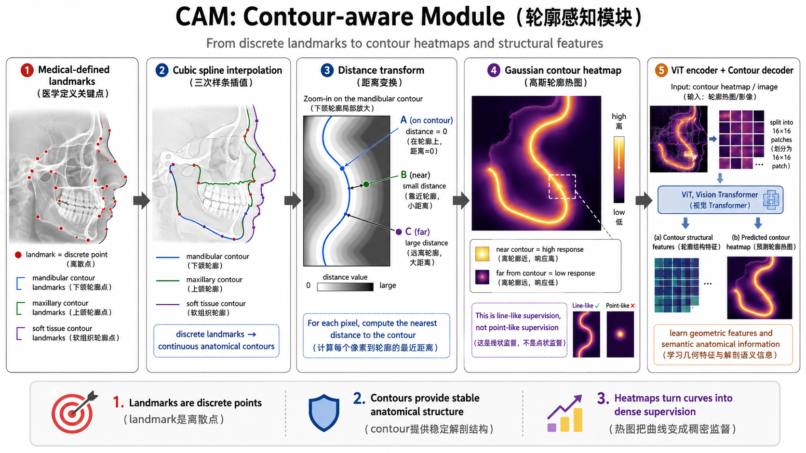

{"prompt":"Create a single clean educational infographic that explains only the CAM module (Contour-aware Module) from a cephalometric landmark detection paper, with special emphasis on how the heatmap is formed. The image should be easy for a student to understand at a glance. Use a white background, neat academic style, simple arrows, and clear labeled panels. Make it visually intuitive rather than dense.\n\nLayout: a wide horizontal step-by-step diagram with 5 main panels from left to right, connected by arrows. Use a consistent color code: red for discrete landmarks, blue for anatomical contours, purple/orange/yellow for heatmaps, dark gray for explanatory text, light gray for the skull/X-ray illustration. Include both English technical terms and small Chinese explanations under key labels. Keep text concise, legible, and correct.\n\nTitle at top center: “CAM: Contour-aware Module（轮廓感知模块）”.\nSubtitle: “From discrete landmarks to contour heatmaps and structural features”.\n\nPanel 1: “Medical-defined landmarks（医学定义关键点）”. Show a simplified lateral cephalometric X-ray style skull illustration in light gray. Overlay several red landmark dots on the skull. Add a small side legend: “landmark = discrete point（离散点）”. Include 3 subtle colored grouping brackets or labels indicating that some landmarks belong to mandibular contour, some to maxillary contour, and some to soft tissue contour.\n\nPanel 2: “Cubic spline interpolation（三次样条插值）”. Show the same skull more simply, with red landmarks now connected by smooth blue curves. Clearly show three contours labeled: “mandibular contour（下颌轮廓）”, “maxillary contour（上颌轮廓）”, and “soft tissue contour（软组织轮廓）”. Add a tiny callout: “discrete landmarks → continuous anatomical contours”. Make the smoothness visually obvious.\n\nPanel 3: “Distance transform（距离变换）”. This is crucial. Show one contour enlarged or a zoom-in inset. Display a blue contour line, and around it a grayscale distance field or contour-centric banding. Mark three sample pixels A, B, C with arrows to the contour, showing: A on the contour with distance 0, B near the contour with a small distance, C farther away with a larger distance. Include tiny note: “For each pixel, compute the nearest distance to the contour（计算每个像素到轮廓的最近距离）”. Make this intuitive.\n\nPanel 4: “Gaussian contour heatmap（高斯轮廓热图）”. Show the distance field converted into a heatmap. Use a vivid but academic heatmap look: the contour center line is brightest (yellow/white), nearby areas are orange/purple, and far areas fade out. Include a simple side legend: “near contour = high response（离轮廓近，响应高）; far from contour = low response（离轮廓远，响应低）”. Also include a tiny comparison inset: “This is line-like supervision, not point-like supervision（这是线状监督，不是点状监督）”. Make the heatmap especially visually clear.\n\nPanel 5: “ViT encoder + Contour decoder”. Show the heatmap/skull image being split into 16×16 patches. Represent this with a small patch grid feeding into a compact transformer block icon labeled “ViT, Vision Transformer（视觉Transformer）”. Then show output arrows to two items: (a) “Contour structural features（轮廓结构特征）” illustrated as a small abstract feature map, and (b) “Predicted contour heatmap（预测轮廓热图）” shown as a refined heatmap. Add a short note: “learn geometric features and semantic anatomical information（学习几何特征与解剖语义信息）”.\n\nBottom summary strip across the image: a short 3-part takeaway with icons:\n1. “Landmarks are discrete points（landmark是离散点）”\n2. “Contours provide stable anatomical structure（contour提供稳定解剖结构）”\n3. “Heatmaps turn curves into dense supervision（热图把曲线变成稠密监督）”.\n\nImportant style requirements: make the figure look like a polished teaching diagram suitable for a graduate-level paper presentation slide. Avoid clutter. Make the heatmap explanation the most visually prominent part. Ensure the English technical terms are spelled correctly. Do not make it look like a copied paper figure; make it an original explanatory infographic.","reference_image_paths":[],"aspect_ratio":"16:9"}

**tool：**


Model caption: A clean infographic/diagram slide style image with multiple panels explaining a module in medical imaging. **Overall scene:** A wide, multi-panel educational figure with a white background and thick bordered boxes, arrows between panels, lots of schematic medical/heatmap visuals and bilingual English/Chinese labels. Title at top and a bottom summary strip with three takeaway items. Use of colors (red for landmarks, blue for contours, purple/orange/yellow for heatmaps, gray/black text). **Top area (header):** At the very top center in huge bold sans-serif black text: “CAM: Contour-aware Module（轮廓感知模块）”. Beneath it in smaller gray sans-serif: “From discrete landmarks to contour heatmaps and structural features”. **Main workflow row: five large vertically oriented panels in a row, each with a number badge and title at the top, connected by big black/gray arrows pointing right between panels.** --- **Panel 1 (far left) in a rounded-rectangle box with a white background and black/gray border. Header shows a red circular badge “1” and bold title “Medical-defined\nlandmarks” with Chinese beneath “（医学定义关键点）”. Inside left/top: a lateral skull/cephalometric X‑ray style illustration in light gray with cranial/face outline and teeth, and many small red dots marking landmarks (discrete points) on skull, jaw, nose, chin, soft tissue outline—roughly a dozen+ red points scattered along bone and profile (upper jaw, lower jaw, nasal area, chin, and some on soft tissue profile). The image is semi-transparent grayscale. **Below/left legend text and markers:** A red dot icon then “landmark = discrete point” and beneath in parentheses “（离散点）”. Under that, three colored bracket/legend lines: a blue bracket with text “mandibular contour\nlandmarks（下颌轮廓点）”; a green bracket with “maxillary contour\nlandmarks（上颌轮廓点）”; a purple bracket with “soft tissue contour\nlandmarks（软组织轮廓点）”. Brackets are colored (blue/green/purple) and align with the text. --- **Panel 2** next box with header: blue circular badge “2” and bold title “Cubic spline interpolation” and Chinese “（三次样条插值）”. Inside: a simplified lateral skull outline (gray) with smooth blue spline curves tracing contours. Three contour lines stand out: a blue line along the mandible (lower jaw curve), a green line along the maxilla (upper jaw/teeth region), and a purple line along the soft tissue profile (face outline). Small red landmark points remain at control knots along the curves. **Below the image:** a legend with colored line swatches and bilingual labels: blue line “mandibular contour\n（下颌轮廓）”; green line “maxillary contour\n（上颌轮廓）”; purple line “soft tissue contour\n（软组织轮廓）”. At the bottom in a rounded dashed/outlined callout box (light blue dashed border) with text: “discrete landmarks →\ncontinuous anatomical contours” (the arrow is a right arrow “→”), in blue/gray. --- **Panel 3 (center) with header:** blue circular badge “3” and bold “Distance transform” with Chinese “（距离变换）”. Under title: “Zoom-in on the mandibular contour\n（下颌轮廓局部放大）”. Main content: a zoom-in square/rectangle with a blue contour line (curving S-like) through a grayscale banded distance field: concentric-ish contour-like rings/levels in shades from white/very light near the contour to progressively darker grays outward, showing distance bands. On the right side of this zoom box are three labeled sample points with colored dots and arrows pointing to the contour, with explanatory text: At top: “A (on contour)” in blue, below “distance = 0” and “（在轮廓上，\n距离=0）”. The A point is a blue dot on the contour; a blue arrow/line points from A label to point. Middle: green “B (near)” and “small distance” and “（靠近轮廓，\n小距离）”, with a green dot slightly off the contour and arrow indicating short perpendicular distance (a small black double-arrow line between B and the blue contour). Bottom: purple “C (far)” and “large distance” and “（远离轮廓，\n大距离）”, with a purple dot farther away and a longer black arrowed line from C to the contour. On the left/bottom of the zoom box is a grayscale legend bar labeled “distance value” with “0” on the left and “large” on the right, and a gradient from white/gray to black with an arrow to the right. Beneath the panel image: a dashed/light blue framed caption: “For each pixel, compute the nearest\ndistance to the contour\n（计算每个像素到轮廓的最近距离）”. --- **Panel 4** with header: purple circular badge “4” and bold “Gaussian contour heatmap” with Chinese “（高斯轮廓热图）”. Main large image: a heatmap-like visualization on a dark purple background showing the same contour shape as a bright glowing line: center line in yellow/white, surrounded by orange, magenta/purple, fading to dark purple. A dashed white rectangle (zoom/attention box) around a section of the contour on the right side, with a dashed line leading to an inset legend. To the right of the heatmap, a vertical color bar legend with “high” and Chinese “高” at the top, and “low” and Chinese “低” at the bottom; the bar transitions from yellow/orange at top to deep purple/black at bottom. Below the main heatmap, a boxed explanation with icons: top line with a small yellow/white square/patch then text “near contour = high response\n（离轮廓近，响应高）”; next line with purple/black square then “far from contour = low response\n（离轮廓远，响应低）”. Below that, a dashed purple box with text: “This is line-like supervision,\nnot point-like supervision\n（这是线状监督，不是点状监督）”. To the right inside/adjacent are two small comparison insets: left labeled “Line-like ✓” above a small glowing curvy line heatmap; right labeled “Point-like ✗” above a small dot-like bright spot on dark background. (The check mark in green and cross in red). --- **Panel 5 (far right) with header:** orange circular badge “5” and bold “ViT encoder + Contour decoder”. Inside top text: “Input: contour heatmap / image” and Chinese “（输入：轮廓热图/影像）”. At upper left of this panel: a skull/heatmap-like composite image (side view) with the glowing contour heatmap and a faint skull outline; next to it a grid illustration showing patching: a square grid overlay and many small square patches in purple/orange tones; an arrow/ellipsis “…” indicating many patches. Text to the right: “split into\n16×16\npatches” and Chinese “（划分为\n16×16\npatch）”. Beneath this, a downward arrow into a blue rounded rectangle block: “ViT, Vision Transformer\n（视觉 Transformer）” with a small transformer-style icon (stacked blocks/windows). Below it, two downward arrows leading to two outputs side by side. Left branch labeled “(a) Contour structural\nfeatures（轮廓结构特征）” above a grid-like feature map illustration in teal/blue/purple tiles (a heatmap-like patch map) and a vertical ellipsis “…” to indicate more. Right branch labeled “(b) Predicted contour\nheatmap（预测轮廓热图）” above a refined heatmap image similar to panel 4 (bright curving line). Bottom of panel: a dashed orange-outlined note box reading “learn geometric features and\nsemantic anatomical information\n（学习几何特征与解剖语义信息）”. --- **Across-between transitions:** Between each main panel there is a large dark/gray arrow pointing right, indicating the pipeline flow from 1 → 2 → 3 → 4 → 5. **Bottom summary strip spanning full width under all panels:** a light rounded-rectangle background band (very pale/gray) with three segments separated by dotted vertical dividers, each with an icon and big numbered takeaway. Left segment: a red target/bullseye icon with an arrow, then “1.” in red and bold “Landmarks are discrete points” and below in gray “（landmark是离散点）”. Middle segment: a blue shield icon, “2.” in blue and bold “Contours provide stable\nanatomical structure” and below “（contour提供稳定解剖结构）”. Right segment: a purple/yellow rising-graph icon (bars with arrow), “3.” in purple and bold “Heatmaps turn curves into\ndense supervision” and below “（热图把曲线变成稠密监督）”. The overall style is academic slide/infographic with crisp sans-serif fonts, colorful badges, dashed callout boxes, and clean iconography.<|has_watermark|><|has_borders|>

**tool：**

Generated images from the last `image_gen.text2im` call were saved at:
- /mnt/data/ghostwriter_images/generated/a_clean_infographic_diagram_slide_style_image_with_1.png (wxh = 1672 x 941, exact aspect ratio 1672:941, close to aspect ratio 16:9)

You can visually inspect the generated image directly in the tool result above. Only reopen the saved path if you need programmatic processing or want to pass the image into another tool call.

---

<a id="turn-012"></a>

## 对话 012

**我：**

现在继续下一讲

**GPT：**

好，继续**第 4 讲：JAM，Joint Attention Module，联合注意力模块**。

这一讲是技术架构里最容易被老师追问的部分，因为 CAM 只是把 contour prior 构造出来，而 **JAM 才是真正把 contour 信息融入 landmark detection 网络的关键模块**。

你这一讲要掌握一句话：

> **JAM 的作用是让 ViT 提取的 contour structural features 和 CNN 提取的 contextual features 通过 attention 进行双向交互，而不是简单拼接，从而得到更有结构一致性的 landmark 表征。**

论文 Fig.2 中间的阴影区域就是 **Joint Attention Module**。论文说明，JAM 用来在 shared embedding space 中对齐 contour features 和 landmark/contextual features，生成 globally consistent hierarchical features。fileciteturn0file0

---

# 第 4 讲：JAM 联合注意力模块

## 1. 先回顾 CAM 到了哪一步

上一讲 CAM 做了这件事：

```text
离散 landmarks
↓
cubic spline interpolation
↓
anatomical contours
↓
contour heatmaps
↓
ViT 提取 contour structural features
```

也就是说，现在模型已经有了一类结构特征：

```text
F_vit = contour structural features
```

同时，模型还有 CNN 提取的图像上下文特征：

```text
F_cnn = contextual features
```

那么问题来了：

> **这两类特征怎么融合？**

这就是 JAM 要解决的问题。

---

# 2. JAM 要解决的核心问题

现在网络中有两条信息流：

## 2.1 CNN 分支：contextual features

**Contextual features**，中文：**上下文特征**。

它主要来自 Pyramid CNN。

它包含：

```text
局部边缘
骨骼纹理
牙齿区域
灰度变化
局部结构
多尺度图像语义
```

CNN 的优点是：

```text
擅长捕捉局部图像细节
适合精细定位
能提取多尺度 appearance/context 信息
```

但缺点是：

```text
容易受 domain gap 影响
例如亮度、对比度、分辨率、噪声变化
```

所以 CNN 特征更偏向：

> **appearance / context information**

---

## 2.2 ViT 分支：contour structural features

**Contour structural features**，中文：**轮廓结构特征**。

它来自 CAM 中的 ViT branch。

它包含：

```text
下颌轮廓形状
上颌轮廓形状
软组织轮廓
landmark 与 contour 的关系
不同 contour 之间的空间拓扑关系
```

ViT 分支的优点是：

```text
更能建模长距离结构关系
更接近 domain-invariant anatomical prior
```

所以它更偏向：

> **structural / anatomical information**

---

## 2.3 为什么不能直接 concat？

最简单的融合方式是：

```text
F_fused = concat(F_cnn, F_vit)
```

也就是直接把 CNN 特征和 ViT 特征拼接起来。

但是这篇论文没有只做简单拼接，而是设计了 JAM。原因是：

```text
CNN 特征和 contour 特征来源不同
语义层级不同
空间尺度不同
一个偏 appearance，一个偏 structure
简单 concat 不能建模它们之间的对应关系
```

你汇报时可以这样说：

> Simple concatenation only stacks contour features and contextual features together, but it does not explicitly model how landmarks, contours, and anatomical regions interact with each other. Therefore, the authors design a Joint Attention Module to enable cross-hierarchy message passing.

中文：

> 简单拼接只是把两类特征堆在一起，并没有显式建模 landmark、contour 和解剖区域之间的层级关系。因此作者设计 JAM，通过 attention 实现跨层级信息传递。

---

# 3. Hierarchical Consistent Structure 是什么？

论文在 JAM 部分提到一个重要概念：

> **Hierarchical Consistent Structure**

中文：

> **层级一致结构**

这是理解 JAM 的关键。

论文认为，头影结构不是一堆孤立点，而是有层级关系的。Fig.1(b) 中展示了三个层级：landmarks、contours 和 tissue regions。fileciteturn0file0

可以理解为：

```text
第一层：landmark，离散关键点
第二层：contour，由多个 landmark 组成的连续轮廓
第三层：tissue region，由 contour 围成或关联的解剖区域
```

---

## 3.1 第一层：landmarks

**Landmarks** 是离散点。

比如：

```text
Gonion
Menton
Pogonion
Nasion
```

它们是最终要检测的目标。

---

## 3.2 第二层：contours

**Contours** 是由多个 landmarks 组成的连续解剖轮廓。

比如：

```text
mandibular contour
maxillary contour
soft tissue contour
```

一个 contour 可以包含多个 landmarks。

---

## 3.3 第三层：tissue regions

**Tissue regions**，中文：**组织区域 / 解剖区域**。

比如某些 contour 围成或划分出的结构区域。

它可以表示更高层次的解剖结构。

---

## 3.4 为什么叫 hierarchical？

**Hierarchical**，中文：**层级的**。

因为这些结构不是并列的，而是从低到高：

```text
点 → 线 → 区域
landmark → contour → tissue region
```

---

## 3.5 为什么叫 consistent？

**Consistent**，中文：**一致的 / 协调的**。

意思是这些层级之间应该满足解剖结构一致性。

比如：

```text
某些 landmarks 应该位于 mandibular contour 上或附近
mandibular contour 的整体形状应该符合下颌骨结构
soft tissue contour 和骨性结构之间有相对稳定的关系
```

所以 JAM 的目的不是简单融合特征，而是让模型学习这种：

> **landmark-contour-region 的层级结构一致性。**

你汇报时可以说：

> The hierarchical consistent structure means that landmarks, contours, and tissue regions are not independent. Landmarks form contours, and contours further define anatomical regions. JAM is designed to model these intra-layer and cross-layer relationships.

---

# 4. JAM 的核心：cross-hierarchy message passing

论文中说 JAM 通过 alternating query strategies 实现：

> **cross-hierarchy message passing**

中文：

> **跨层级信息传递**

拆开解释。

---

## 4.1 Cross-hierarchy 是什么？

**Cross-hierarchy**，中文：**跨层级**。

指的是不同结构层级之间的信息交互。

比如：

```text
landmark 层和 contour 层交互
contour 层和 region 层交互
CNN contextual features 和 ViT contour features 交互
```

---

## 4.2 Message passing 是什么？

**Message passing**，中文：**信息传递 / 消息传递**。

意思是一个特征分支把有用信息传给另一个特征分支。

在 JAM 里：

```text
contour features 从 CNN contextual features 中吸收图像上下文
CNN contextual features 从 contour features 中吸收解剖结构先验
```

所以 JAM 不是单向的，而是双向交互。

---

# 5. Attention 机制基础

要理解 JAM，你需要先理解 attention 里的三个词：

```text
Query
Key
Value
```

也就是：

```text
Q, K, V
```

---

## 5.1 Query 是什么？

**Query**，中文：**查询向量**。

可以理解为：

> 当前特征想要问什么问题。

比如 contour feature 作为 query 时，它在问：

```text
我这条 contour 应该关注图像中的哪些上下文区域？
```

---

## 5.2 Key 是什么？

**Key**，中文：**键向量 / 被查询索引**。

可以理解为：

> 被查询的信息索引，用来判断哪些位置和 query 相关。

---

## 5.3 Value 是什么？

**Value**，中文：**值向量 / 被取出的信息内容**。

可以理解为：

> 真正被聚合进来的信息。

---

## 5.4 Q/K/V 的直观比喻

你可以这样记：

```text
Query：我想找什么
Key：每个信息点的标签
Value：每个信息点真正携带的内容
```

Attention 做的事就是：

```text
用 Query 和 Key 计算相关性
↓
根据相关性给 Value 加权
↓
得到更新后的特征
```

---

# 6. JAM 里有两种 attention

论文里 JAM 主要有两个交替过程：

```text
1. Contour Attention
2. Structural Attention
```

它们分别对应两种信息流。

---

# 7. Contour Attention

## 7.1 它做什么？

**Contour Attention** 可以理解为：

> 用 contour features 作为 Query，去关注 CNN contextual features。

也就是：

```text
Query = F_vit
Key = F_cnn
Value = F_cnn
```

含义是：

```text
contour branch 问：
CNN 图像上下文里，哪些区域对更新 contour 结构特征有帮助？
```

比如模型想理解 mandibular contour，它会从 CNN 特征中关注：

```text
下颌骨边缘
牙齿附近结构
下颌角区域
颏部区域
```

---

## 7.2 对应论文公式

论文公式可以写成：

```text
F̂_vit^i = F_vit^i + γ^i Attention(norm(F_vit^i), norm(F_cnn^i))
```

其中：

```text
F_vit^i 是第 i 轮的 ViT contour features
F_cnn^i 是第 i 轮的 CNN contextual features
norm 是 LayerNorm
Attention 表示注意力操作
γ^i 是一个可学习或调节的缩放系数
F̂_vit^i 是更新后的 contour features
```

论文里这个过程表示用 ViT contour features 作为 query，用 CNN contextual features 作为 key 和 value，进行 contour attention。fileciteturn0file0

---

## 7.3 直观解释

你可以这样讲：

> Contour Attention allows the contour branch to absorb useful image context from CNN features. This helps the contour representation remain aware of local image evidence while still encoding global anatomical structure.

中文：

> Contour Attention 让 contour 分支从 CNN 特征中吸收有用的图像上下文，使轮廓特征既包含全局解剖结构，又能结合局部图像证据。

---

# 8. Structural Attention

## 8.1 它做什么？

**Structural Attention** 可以理解为：

> 用 CNN contextual features 作为 Query，反过来关注更新后的 contour structural features。

也就是：

```text
Query = F_cnn
Key = F_vit
Value = F_vit
```

含义是：

```text
CNN branch 问：
contour 结构特征中，哪些信息能帮助我定位 landmark？
```

比如 CNN 的某个局部区域本来只看到一个模糊骨边缘，但通过 structural attention，它可以知道：

```text
这个区域可能属于 mandibular contour
这个 landmark 应该在轮廓附近
这个位置和其他 contour 点存在结构关系
```

---

## 8.2 对应论文公式

论文公式可以写成：

```text
F̂_cnn^i = F_cnn^i + Attention(norm(F_cnn^i), norm(F_vit^{i+1}))
```

其中：

```text
F_cnn^i 是 CNN contextual features
F_vit^{i+1} 是更新后的 contour features
F̂_cnn^i 是被 contour 结构增强后的 CNN features
```

论文描述为：先通过 contour attention 更新 ViT 特征，再使用 CNN 特征作为 query、更新后的 ViT 特征作为 key 和 value，进行 structural attention。fileciteturn0file0

---

## 8.3 直观解释

你可以这样讲：

> Structural Attention injects contour structural priors back into CNN contextual features. Therefore, landmark-related features are not only appearance-based but also guided by anatomical topology.

中文：

> Structural Attention 把 contour 结构先验注入 CNN 上下文特征，使 landmark 相关特征不只是依赖图像外观，而是受到解剖拓扑结构引导。

---

# 9. 为什么 JAM 是双向交互？

JAM 不是简单地让 CNN 用 contour，也不是简单地让 contour 用 CNN，而是两个方向都做：

```text
第一步：Contour Attention
contour features ← contextual features

第二步：Structural Attention
contextual features ← contour features
```

也就是说：

```text
contour 分支吸收图像证据
CNN 分支吸收结构先验
```

这就是 **joint attention** 的含义。

你可以用一句特别好记的话：

> **Contour Attention makes contours image-aware; Structural Attention makes image features structure-aware.**

中文：

> Contour Attention 让轮廓特征感知图像上下文；Structural Attention 让图像特征感知解剖结构。

这句话非常适合汇报。

---

# 10. LayerNorm 是什么？

论文公式里有：

```text
norm(·)
```

这里指：

> **LayerNorm，Layer Normalization**

中文：

> **层归一化**

它的作用是让特征分布更稳定，方便 attention 训练。

你不需要深入讲数学，只需要知道：

> 在 attention 前先做 LayerNorm，可以稳定训练，使不同来源的特征更容易对齐。

老师如果问，你可以答：

> LayerNorm normalizes feature representations before attention, which helps stabilize the interaction between CNN features and ViT features.

---

# 11. γ 是什么？

公式里有：

```text
γ^i
```

gamma。

它可以理解为一个缩放系数，用来控制 attention 更新量对原始 contour features 的影响。

公式中是残差形式：

```text
原始特征 + attention 更新特征
```

γ 的作用是：

```text
控制从 CNN contextual features 注入到 contour features 的强度
```

你可以说：

> γ controls the contribution of the attention-updated information, preventing unstable feature fusion.

中文：

> γ 用来控制 attention 更新信息的贡献，避免特征融合过强或不稳定。

---

# 12. Residual connection 是什么？

公式中有这种形式：

```text
F_new = F_old + Attention(...)
```

这叫：

> **Residual connection，残差连接**

意思是：

```text
保留原始特征
再加上 attention 学到的新信息
```

好处是：

```text
不会完全破坏原始特征
训练更稳定
特征更新更平滑
```

在 JAM 中：

```text
contour features 保留原本结构信息，同时吸收 CNN context
CNN features 保留原本图像信息，同时吸收 contour prior
```

---

# 13. Sparse Attention 是什么？

论文中说 attention layer 使用了：

> **sparse attention**

中文：

> **稀疏注意力**

你不需要讲太深，但要理解为什么需要它。

普通 attention 如果让每个位置都和所有位置交互，计算量很大，尤其是医学图像分辨率高。

Sparse attention 的思想是：

```text
不是每个位置都关注所有位置
而是只关注少数相关位置
```

这样可以：

```text
减少计算量
聚焦更有意义的结构区域
适合高分辨率医学图像
```

你可以说：

> Sparse attention reduces the computational cost and encourages the module to focus on structurally relevant regions rather than all spatial locations.

---

# 14. JAM 中的 N rounds 是什么？

论文说 JAM 会迭代执行 N 轮。fileciteturn0file0

也就是说，Contour Attention 和 Structural Attention 不是只做一次，而是反复进行：

```text
第 1 轮：
F_vit 和 F_cnn 交互

第 2 轮：
更新后的 F_vit 和 F_cnn 再交互

第 3 轮：
继续交互
```

这样做的意义是：

```text
逐步对齐 contour features 和 contextual features
逐步增强 landmark-contour 的结构一致性
```

你可以说：

> The attention interaction is performed iteratively, allowing contour and contextual features to be progressively aligned and refined.

---

# 15. JAM 输出什么？

JAM 输出的是更新后的融合特征，尤其是结构增强后的 CNN features：

```text
F_cnn^{i+1}
```

这些特征后面会进入：

```text
Landmark Decoder
```

生成：

```text
Landmark heatmaps
```

也就是说，JAM 的最终目的不是单独预测 contour，而是帮助 landmark detection。

你可以这样理解：

```text
CAM：产生 contour prior
JAM：把 contour prior 注入 landmark feature learning
Landmark Decoder：根据增强后的特征输出 landmark heatmap
```

---

# 16. JAM 为什么有助于跨域？

这是最重要的追问。

你要从 domain gap 的角度讲：

```text
CNN contextual features 容易包含 domain-specific appearance
contour structural features 更 domain-invariant
JAM 把 contour structural prior 融入 CNN features
因此 landmark features 不再只依赖 appearance
所以 unseen target domain 上更稳定
```

完整回答：

> JAM helps cross-domain generalization because it injects domain-invariant contour structural information into landmark-related contextual features. As a result, the model relies less on unstable appearance cues and more on stable anatomical topology.

中文：

> JAM 通过将域不变的 contour 结构信息注入 landmark 相关上下文特征，降低模型对不稳定图像外观线索的依赖，使模型更多依赖稳定的解剖拓扑结构，因此有助于跨域泛化。

---

# 17. JAM 在消融实验中的贡献

论文 Table 2 显示：

```text
baseline target MRE = 1.81
CAM 后 target MRE = 1.62
CAM + JAM 后 target MRE = 1.50
```

也就是说，在 CAM 的基础上加入 JAM，target domain MRE 从 **1.62 降到 1.50**。这说明单纯有 contour prior 还不够，进一步通过 attention 融合 contour 和 contextual features 可以继续提高跨域性能。fileciteturn0file0

你汇报时可以说：

> In the ablation study, adding JAM on top of CAM further reduces the target-domain MRE from 1.62 mm to 1.50 mm, showing that attention-based contour-context interaction is more effective than simply introducing contour supervision.

---

# 18. JAM 和 CAM 的区别

这一点你一定要能讲清楚。

| 模块 | 解决的问题 | 核心作用 |
|---|---|---|
| CAM | contour 从哪里来 | 构造并学习 contour structural features |
| JAM | contour 怎么融入 landmark 特征 | 通过 attention 融合 contour features 和 contextual features |

你可以总结：

```text
CAM 是“生成和学习 contour”
JAM 是“让 contour 参与 landmark 表征学习”
```

老师如果问：

> 有了 CAM 为什么还要 JAM？

你答：

> CAM 只是让模型学习 contour features，但如果这些 contour features 不能有效融入 landmark-related contextual features，对最终 landmark localization 的帮助有限。JAM 通过 attention 显式建模 contour 和 context 之间的交互，使 contour prior 真正参与 landmark 特征学习。

---

# 19. JAM 和简单 concat 的区别

你也要能讲清楚。

| 方法 | 特点 | 问题 |
|---|---|---|
| concat | 直接拼接特征 | 不知道哪些 contour 信息对哪些 landmark 有用 |
| JAM | 通过 attention 选择性融合 | 能建模 contour-context 对应关系 |

你可以这样答：

> Concat treats all features equally, while attention adaptively selects relevant contour or contextual information. Therefore, JAM can learn more meaningful contour-landmark interactions.

中文：

> concat 对所有特征一视同仁，而 attention 可以自适应选择相关的 contour 或 context 信息，因此 JAM 能学习更有意义的 contour-landmark 交互关系。

---

# 20. JAM 这一页 PPT 怎么讲？

如果你 PPT 上放论文 Fig.2 中间 JAM 部分，可以按这个顺序讲：

## 第一步：先说明输入

> JAM receives two types of features: CNN contextual features and ViT contour structural features.

## 第二步：说明为什么需要融合

> CNN features contain local image evidence, while contour features provide anatomical structural priors. These two features are complementary.

## 第三步：解释双向 attention

> The module first uses contour features as query to attend to CNN features, updating contour representations. Then it uses CNN features as query to attend to the updated contour features, injecting structural priors into landmark-related features.

## 第四步：解释输出

> The updated features are passed to the landmark decoder to generate landmark heatmaps.

## 第五步：总结作用

> Therefore, JAM makes landmark localization structure-guided rather than purely appearance-driven.

---

# 21. JAM 的完整汇报稿

你可以直接这样讲：

> 第二个核心模块是 Joint Attention Module，简称 JAM。CAM 已经生成了 contour-related structural features，但这些结构特征需要进一步和图像上下文特征融合，才能真正帮助 landmark detection。
>
> 在本文中，Pyramid CNN 提取 multi-scale contextual features，这些特征包含局部图像边缘、纹理和多尺度语义信息，但也容易受到 domain gap 影响。另一方面，ViT 分支提取 contour structural features，这些特征表达更稳定的 anatomical topology。
>
> 作者认为，landmark、contour 和 tissue region 之间存在 hierarchical consistent structure，也就是从离散点到连续轮廓再到解剖区域的层级关系。因此，简单 concat 两类特征是不够的。JAM 通过 attention 实现 cross-hierarchy message passing。
>
> 具体来说，JAM 包含两个交互过程。第一个是 Contour Attention，它以 contour features 作为 query，以 CNN contextual features 作为 key 和 value，使 contour 分支吸收图像上下文信息。第二个是 Structural Attention，它以 CNN features 作为 query，以更新后的 contour features 作为 key 和 value，将 contour structural priors 注入 landmark-related contextual features。
>
> 通过这种双向交互，模型能够同时利用局部图像证据和全局解剖结构先验，使 landmark representation 从 appearance-driven 变得更加 structure-guided，从而提升跨域泛化能力。

---

# 22. 老师追问准备

## 追问 1：JAM 的输入是什么？

你答：

> JAM 的输入是两类特征：一类是 Pyramid CNN 提取的 multi-scale contextual features，另一类是 ViT branch 提取的 contour structural features。

---

## 追问 2：JAM 的输出是什么？

你答：

> JAM 输出经过 contour-context 交互后的融合特征，尤其是结构增强后的 contextual features，这些特征会送入 Landmark Decoder 生成 landmark heatmaps。

---

## 追问 3：为什么不用 concat？

你答：

> 因为 concat 只是把特征堆叠起来，不能显式建模 contour 和 landmark/context 之间的对应关系。JAM 通过 attention 自适应选择相关信息，可以实现 contour structural features 和 contextual features 的双向交互。

---

## 追问 4：Contour Attention 和 Structural Attention 的区别？

你答：

> Contour Attention 是用 contour features 作为 query，去关注 CNN contextual features，使 contour 表征吸收图像上下文。Structural Attention 是用 CNN features 作为 query，去关注更新后的 contour features，使 landmark 相关图像特征受到 contour 结构先验增强。

---

## 追问 5：JAM 为什么有助于 domain generalization？

你答：

> 因为 CNN contextual features 可能包含 domain-specific appearance 信息，而 contour structural features 更 domain-invariant。JAM 把 contour prior 注入 landmark-related features，减少模型对图像外观的依赖，从而提高 unseen target domains 上的泛化能力。

---

## 追问 6：为什么要双向 attention？

你答：

> 因为 contour features 和 contextual features 是互补的。Contour features 需要图像上下文来保持与实际影像一致，contextual features 也需要 contour prior 来获得结构约束。双向 attention 可以让两类特征互相增强。

---

## 追问 7：JAM 和 CAM 的关系是什么？

你答：

> CAM 负责构造并提取 contour structural features，JAM 负责把这些 contour features 和 CNN contextual features 进行交互融合。CAM 提供结构先验，JAM 让结构先验真正参与 landmark 特征学习。

---

# 23. 本讲必须记住的英文术语

| 英文术语 | 中文 | 你要怎么解释 |
|---|---|---|
| JAM, Joint Attention Module | 联合注意力模块 | 融合 contour features 和 contextual features |
| Hierarchical Consistent Structure | 层级一致结构 | landmark、contour、tissue region 之间的结构层级关系 |
| Cross-hierarchy | 跨层级 | 不同结构层级之间 |
| Message passing | 信息传递 | 特征之间互相传递有用信息 |
| Query, Q | 查询 | 当前特征想关注什么 |
| Key, K | 键 | 被查询特征的索引 |
| Value, V | 值 | 被聚合的信息内容 |
| Contour Attention | 轮廓注意力 | contour features 关注 CNN context |
| Structural Attention | 结构注意力 | CNN features 关注 contour structure |
| LayerNorm | 层归一化 | 稳定特征分布，便于 attention 交互 |
| Residual connection | 残差连接 | 原始特征加上更新信息 |
| Sparse attention | 稀疏注意力 | 只关注部分相关位置，降低计算量 |
| Feature fusion | 特征融合 | 将不同来源特征结合 |
| Shared embedding space | 共享嵌入空间 | 让不同特征映射到可交互的表示空间 |
| Structure-guided | 结构引导 | 用解剖结构指导预测 |
| Appearance-driven | 外观驱动 | 主要依赖灰度、纹理、边缘等外观 |

---

# 24. 第 4 讲最终理解

你现在要能背出这段：

> JAM 的作用是融合 CNN contextual features 和 ViT contour structural features。由于 CNN 特征更偏 image appearance，而 contour 特征更偏 anatomical structure，简单 concat 不能充分建模二者之间的关系。因此 JAM 使用 attention 进行双向交互：Contour Attention 让 contour features 吸收图像上下文，Structural Attention 让 CNN features 受到 contour prior 增强。这样模型学到的 landmark representation 不再只是 appearance-driven，而是 structure-guided，从而提升 cross-domain generalization。

下一讲我们讲**第 5 讲：DRM，Direction-sensitive Regression Module**。这部分会重点解释：

```text
为什么 landmark 误差具有 anisotropic uncertainty
什么是 tangent direction 和 normal direction
为什么沿轮廓方向和垂直轮廓方向要分开建模
公式 6、7、8 到底在干什么
```

这是老师最可能深入追问的部分之一。

---

<a id="turn-013"></a>

## 对话 013

**我：**

继续

**GPT：**

好，继续**第 5 讲：DRM，Direction-sensitive Regression Module，方向敏感回归模块**。

这一讲是整篇论文最“有想法”的地方之一。CAM 和 JAM 主要是在**特征层面**引入 contour prior，而 DRM 是在**回归损失层面**利用 contour 的几何方向来约束 landmark 定位。

你先记住一句话：

> **DRM 的核心是：landmark 的预测误差不是所有方向都一样，而是和 contour 的方向有关，所以作者把误差分解成切线方向和法线方向，再分别约束。**

论文中作者观察到，在 target domain 中，位于 contour 上的 landmark 预测误差沿 contour 切线方向更大，而法线方向更小，因此提出 Direction-sensitive Regression Module。fileciteturn0file0

---

# 第 5 讲：DRM 方向敏感回归模块

## 1. DRM 要解决什么问题？

前面 CAM 和 JAM 做完以后，模型已经有了：

```text
contour structural features
CNN contextual features
fused contour-context features
```

然后 Landmark Decoder 会输出 landmark heatmaps。

但是问题还没有结束。

最终模型还是要预测 landmark 坐标：

```text
predicted landmark p
ground truth landmark p*
```

普通方法通常只看预测点和真实点之间的距离，比如 MSE 或 L2 loss：

```text
预测点离真实点越近越好
```

但这篇论文认为，这样还不够。

因为对于和 contour 相关的 landmark，错误方向是有结构意义的。

例如一个点在下颌轮廓上，如果预测点沿着轮廓方向稍微滑动一点，可能仍然在合理结构附近；
但如果预测点垂直轮廓偏出去，可能就明显脱离了解剖边界。

所以 DRM 想解决的问题是：

> **普通回归损失没有区分误差方向，而 contour 上的 landmark 误差具有方向性。**

---

## 2. Direction-sensitive 是什么意思？

**Direction-sensitive**，中文是：

> **方向敏感的**

意思是：

```text
不是只看误差有多大
还要看误差朝哪个方向
```

普通 loss 问的是：

```text
预测点和真实点之间距离是多少？
```

DRM 问的是：

```text
这个误差是沿着 contour 方向？
还是垂直 contour 方向？
```

这就是“方向敏感”。

---

## 3. 为什么 landmark 误差会有方向性？

这要从 contour 的几何结构理解。

假设某个 landmark 在一条下颌轮廓上。

这条轮廓有两个重要方向：

```text
1. tangent direction：切线方向
2. normal direction：法线方向
```

---

## 4. Tangent direction 是什么？

**Tangent direction**，中文：

> **切线方向**

它是沿着 contour 走的方向。

比如下颌骨轮廓是一条曲线，你沿着这条曲线往前或往后移动，就是切线方向。

你可以想象：

```text
沿着河流方向走 = tangent direction
```

在头影图像里：

```text
沿着下颌轮廓滑动
沿着软组织轮廓滑动
沿着上颌轮廓滑动
```

这些都是 tangent direction。

---

## 5. Normal direction 是什么？

**Normal direction**，中文：

> **法线方向**

它是垂直于 contour 的方向。

如果 tangent 是沿着轮廓走，那么 normal 就是从轮廓向外或向内垂直偏离。

你可以想象：

```text
从河岸垂直跳到河外 = normal direction
```

在头影图像里：

```text
从下颌轮廓垂直往骨外偏
从软组织轮廓垂直往外偏
```

这就是 normal direction。

---

## 6. 为什么切线方向和法线方向要分开？

这是老师最可能追问的问题。

你可以这样理解：

如果一个点属于某条 contour，那么它附近的合理位置往往沿着这条 contour 延展。

比如一个 mandibular contour 上的 landmark：

```text
沿着下颌轮廓偏一点：
仍然可能落在下颌骨边界附近

垂直下颌轮廓偏一点：
可能直接偏到骨外或骨内，结构上更不合理
```

所以这篇论文认为，误差不是圆形均匀分布，而是椭圆形、有方向偏好的分布。

这就叫：

> **anisotropic uncertainty，各向异性不确定性**

---

## 7. Anisotropic 是什么？

**Anisotropic**，中文：

> **各向异性**

意思是：

```text
不同方向上的性质不同
```

在这里就是：

```text
沿 contour 切线方向的误差分布
和
垂直 contour 法线方向的误差分布
不一样
```

反义词是：

> **Isotropic，各向同性**

意思是：

```text
各个方向上的性质差不多
```

普通 L2 loss 默认更像 isotropic，因为它只看欧氏距离，不关心方向。

但本文的 DRM 认为，对于 contour-related landmarks，误差应该是 anisotropic。

---

## 8. 用图像直觉理解 anisotropic uncertainty

你可以想象两个误差分布。

### 普通 landmark：圆形误差

如果一个点和 contour 关系不强，它的预测误差可能像一个圆：

```text
上下左右偏差差不多
```

这就是 isotropic uncertainty。

### contour landmark：椭圆形误差

如果一个点落在 contour 上，它的误差可能像一个沿 contour 拉长的椭圆：

```text
沿 contour 方向偏差较大
垂直 contour 方向偏差较小
```

这就是 anisotropic uncertainty。

论文 Fig.1(b) 里的 “Contours and Anisotropy Distribution” 就是在表达这个意思。fileciteturn0file0

---

# 9. DRM 的整体流程

DRM 可以分成 4 步：

```text
Step 1：从 contour heatmap 得到 contour geometry
Step 2：计算每个位置的 tangent / normal direction
Step 3：把预测误差投影到 tangent / normal 方向
Step 4：根据两个方向的误差能量构造 direction-sensitive regression loss
```

也就是：

```text
contour heatmap
↓
gradient / Sobel operator
↓
tangent vector t and normal vector n
↓
prediction offset p - p*
↓
project offset onto t and n
↓
∆t and ∆n
↓
direction-sensitive regression loss
```

---

# 10. Step 1：从 contour heatmap 得到方向信息

上一讲 CAM 生成了 contour heatmap。

这个 heatmap 不只是告诉我们 contour 在哪里，还能告诉我们 contour 附近的方向。

因为 heatmap 是一张连续响应图，我们可以对它求梯度。

---

## 10.1 Gradient 是什么？

**Gradient**，中文：

> **梯度**

在图像中，梯度表示某个像素值变化最快的方向。

对于 contour heatmap：

```text
heatmap 值在 contour 中心最高
离 contour 越远，值越低
```

所以 heatmap 的梯度方向大致指向：

```text
从低响应区域到高响应 contour 的方向
```

这个方向和 contour 的法线方向相关。

---

## 10.2 Sobel operator 是什么？

论文中说，partial derivatives 用 Sobel operators 计算。fileciteturn0file0

**Sobel operator**，中文：

> **Sobel 算子**

它是图像处理中常用的求梯度方法。

可以计算：

```text
∂M / ∂x：x 方向变化
∂M / ∂y：y 方向变化
```

也就是 heatmap 在横向和纵向的变化率。

你汇报时不用展开 Sobel 卷积核，只要说：

> Sobel operator is used to compute differentiable spatial gradients of the contour heatmap.

中文：

> Sobel 算子用于计算 contour heatmap 的空间梯度，而且这个过程可以在网络中保持可微。

---

# 11. Step 2：计算 tangent 和 normal vectors

论文中根据 contour heatmap 的梯度计算 tangent 和 normal：

genui{"math_block_widget_always_prefetch_v2":{"content":"t(x,y)=\\frac{\\left(\\frac{\\partial M_j}{\\partial y},-\\frac{\\partial M_j}{\\partial x}\\right)}{\\|\\nabla F_{contour}\\|_2},\\quad n(x,y)=\\frac{\\left(\\frac{\\partial M_j}{\\partial x},\\frac{\\partial M_j}{\\partial y}\\right)}{\\|\\nabla F_{contour}\\|_2}"}}

这个公式你要理解，但汇报时不需要讲太细。

---

## 11.1 Normal vector n 怎么来？

```text
n(x, y)
```

是位置 `(x, y)` 的法线方向。

它由 heatmap 的梯度构成：

```text
(∂M/∂x, ∂M/∂y)
```

因为梯度方向本身就指向 heatmap 变化最快的方向，也就是大致垂直于 contour 的方向。

所以：

```text
normal direction ≈ gradient direction
```

---

## 11.2 Tangent vector t 怎么来？

```text
t(x, y)
```

是切线方向。

如果 normal 是：

```text
(a, b)
```

那么把它旋转 90 度，就可以得到 tangent：

```text
(b, -a)
```

所以公式里写成：

```text
(∂M/∂y, -∂M/∂x)
```

这就是把法线方向旋转 90 度，得到沿 contour 的方向。

---

## 11.3 分母是什么意思？

公式中分母是：

```text
||∇F_contour||_2
```

它的作用是归一化。

也就是把 direction vector 变成单位方向向量，避免方向长度影响后面的误差投影。

你可以说：

> The denominator normalizes the tangent and normal vectors, so that they represent directions rather than magnitudes.

中文：

> 分母用于归一化，使 t 和 n 表示方向，而不是大小。

---

# 12. Step 3：预测误差投影到两个方向

现在模型有：

```text
predicted landmark：p
ground truth landmark：p*
```

二者之间的 offset 是：

```text
p - p*
```

也就是预测误差向量。

普通 loss 直接算：

```text
||p - p*||
```

而 DRM 会把这个误差拆成两个分量：

```text
∆t：切线方向误差
∆n：法线方向误差
```

---

## 12.1 Projection 是什么？

**Projection**，中文：

> **投影**

意思是：

```text
把一个向量分解到某个方向上
```

比如一个预测误差向量可能斜着偏了。

DRM 会问：

```text
这个偏差中，有多少是沿着 tangent direction 的？
有多少是沿着 normal direction 的？
```

这就是投影。

直观写法可以理解为：

```text
∆t = error · t
∆n = error · n
```

其中 `·` 是点积。

---

## 12.2 为什么要投影？

因为作者想分别处理两个方向的误差。

```text
沿 contour 的误差：∆t
垂直 contour 的误差：∆n
```

这样模型就可以知道：

```text
这个点是沿着轮廓滑偏了
还是垂直轮廓偏离了
```

这比只看总距离更有结构意义。

---

# 13. Step 4：计算方向能量 Et 和 En

论文接着定义两个方向的能量：

genui{"math_block_widget_always_prefetch_v2":{"content":"E_t^k=\\alpha E_t^{k-1}+(1-\\alpha)\\Delta t^2,\\quad E_n^k=\\alpha E_n^{k-1}+(1-\\alpha)\\Delta n^2"}}

这里的意思是：

```text
Et：tangent direction 的误差能量
En：normal direction 的误差能量
```

它们是用 moving average 计算的。

---

## 13.1 Moving average 是什么？

**Moving average**，中文：

> **滑动平均 / 移动平均**

意思是：

```text
不是只看当前 batch 的误差
而是把历史误差和当前误差平滑结合
```

公式里：

```text
E_t^k = α E_t^{k-1} + (1 - α) ∆t²
```

表示：

```text
当前 tangent 能量
= 过去的 tangent 能量 × α
+ 当前 tangent 误差平方 × (1 - α)
```

论文中：

```text
α = 0.9
```

这说明更重视历史平滑值，避免每个 batch 抖动太大。fileciteturn0file0

---

## 13.2 为什么用平方误差？

因为能量要表示误差大小，不关心正负方向。

如果 ∆t 是 +2 或 -2，偏移方向相反，但误差大小都应该是 2。

平方后：

```text
(+2)^2 = 4
(-2)^2 = 4
```

所以能量反映的是这个方向上误差的强弱。

---

# 14. Step 5：方向敏感回归损失 Lreg

论文中的 regression loss 是：

genui{"math_block_widget_always_prefetch_v2":{"content":"L_{reg}=\\frac{1}{N}\\sum_{i=1}^{N}\\left(\\frac{\\Delta t_i}{E_t+\\epsilon}+\\frac{\\Delta n_i}{E_n+\\epsilon}\\right)"}}

这里：

```text
Lreg：direction-sensitive regression loss
N：landmark 数量或样本数量
∆t_i：第 i 个点的切线方向误差
∆n_i：第 i 个点的法线方向误差
Et：切线方向误差能量
En：法线方向误差能量
ε：防止除零的小常数
```

论文中：

```text
ε = 10^-5
```

---

## 14.1 这个 loss 的直观含义

它的核心想法是：

```text
分别归一化 tangent 和 normal 两个方向的误差
让回归优化感知 contour 方向上的不确定性差异
```

也就是说，模型不再把所有方向误差混在一起，而是根据 contour geometry 分别处理。

---

## 14.2 ε 是什么？

**epsilon，ε**，中文：

> **极小常数**

作用是防止分母为 0。

如果 Et 或 En 很小，直接除可能出现数值不稳定。

加上 ε：

```text
Et + ε
En + ε
```

可以保证分母不为 0。

---

## 14.3 这个公式要不要质疑？

这里你要注意一点。

论文中公式写的是：

```text
∆t / (Et + ε) + ∆n / (En + ε)
```

从常见 loss 形式看，如果 ∆t 和 ∆n 有正负号，直接相加可能存在符号抵消问题。实际实现中可能使用的是绝对值、平方项，或者论文公式排版/简写存在不够严谨的地方。

汇报时你不需要主动质疑它。你可以按论文意图讲：

> DRM uses direction-specific energy to normalize the tangent and normal error components, so that the regression loss becomes aware of anisotropic uncertainty along contours.

如果老师追问公式细节，你可以谨慎说：

> 从论文描述看，它的重点是将误差分解到切线和法线方向，并用方向能量进行归一化，以反映各向异性不确定性。公式中的 ∆t 和 ∆n 在实现中应当表示误差幅度或经过非负化处理的误差项。

这样比较稳。

---

# 15. DRM 和普通 L2 loss 的区别

普通 L2 loss：

```text
只看 p 和 p* 的欧氏距离
```

DRM：

```text
先看 p 和 p* 的误差向量
再把误差拆到 tangent 和 normal 两个方向
然后分别归一化和约束
```

对比表：

| 方法 | 看什么 | 是否利用 contour geometry | 是否区分方向 |
|---|---|---:|---:|
| L2 / MSE | 总距离 | 否 | 否 |
| DRM | 切线误差 + 法线误差 | 是 | 是 |

你可以说：

> Compared with conventional isotropic regression losses, DRM explicitly incorporates contour geometry and models direction-specific errors.

中文：

> 相比普通各向同性回归损失，DRM 显式引入 contour 几何信息，并对不同方向上的误差分别建模。

---

# 16. DRM 为什么有助于 cross-domain？

你要从 target domain 的不确定性讲。

在 cross-domain 场景中，target domain 图像外观变了，landmark 预测更容易不稳定。

普通模型可能出现：

```text
预测点在局部模糊边缘附近漂移
```

DRM 利用 contour geometry 告诉模型：

```text
预测点不能随便漂
要考虑它相对于 anatomical contour 的方向关系
```

特别是：

```text
法线方向偏离 contour 往往更破坏解剖合理性
切线方向误差具有不同的不确定性分布
```

因此 DRM 能让最终坐标回归更符合 anatomical plausibility。

---

## 16.1 Anatomical plausibility 是什么？

**Anatomical plausibility**，中文：

> **解剖合理性**

意思是预测结果要符合人体解剖结构。

比如：

```text
下颌角点不应该跑到牙齿内部
颏点不应该离下颌轮廓太远
软组织点应该贴近面部软组织轮廓
```

DRM 的作用就是通过方向约束，让预测更符合这种结构合理性。

---

# 17. DRM 在实验中的贡献

论文 Table 2 中，加入 CAM 后 target MRE 是：

```text
CAM：1.62
```

CAM + DRM 后：

```text
CAM + DRM：1.53
```

完整模型 CAM + JAM + DRM 后：

```text
1.43
```

说明 DRM 能在 contour prior 基础上继续提升定位精度，尤其有助于更精细的回归。fileciteturn0file0

你汇报时可以说：

> The ablation study shows that adding DRM on top of CAM reduces the target-domain MRE from 1.62 mm to 1.53 mm, indicating that direction-sensitive regression contributes to more robust localization.

---

# 18. DRM 和 CAM/JAM 的关系

你要理解三者分工：

```text
CAM：构造 contour prior
JAM：融合 contour prior 和 image features
DRM：用 contour geometry 约束 landmark regression
```

更形象地说：

```text
CAM 让模型看到轮廓
JAM 让模型用上轮廓特征
DRM 让模型按照轮廓方向修正误差
```

这句话非常适合汇报。

---

# 19. DRM 这一页 PPT 怎么讲？

如果你 PPT 上放 DRM 的示意图，可以按这个顺序讲：

## 第一步：说明问题

> 普通回归损失只看预测点和真实点之间的距离，没有考虑误差方向。

## 第二步：引出观察

> 对于 contour-related landmarks，误差分布具有各向异性，即沿 contour 切线方向和法线方向的误差不一样。

## 第三步：解释方向

> Tangent direction 表示沿轮廓方向，normal direction 表示垂直轮廓方向。

## 第四步：解释计算

> 作者从 contour heatmap 计算梯度，再得到 tangent 和 normal direction fields，然后将预测误差投影到这两个方向。

## 第五步：总结作用

> 这样 regression loss 可以感知 contour geometry，使 landmark localization 更符合 anatomical plausibility。

---

# 20. DRM 的完整汇报稿

你可以直接这样讲：

> 第三个模块是 Direction-sensitive Regression Module，简称 DRM。前面的 CAM 和 JAM 主要在特征层面引入 contour prior，而 DRM 进一步在回归层面利用 contour geometry 来约束 landmark localization。
>
> 传统的 landmark regression loss 通常只计算预测点和真实点之间的欧氏距离，相当于默认误差在各个方向上是均匀的，也就是 isotropic。但是作者观察到，对于位于 contour 上或 contour 附近的 landmarks，它们在 target domain 中的预测误差往往具有 anisotropic characteristics。具体来说，沿着 contour 的 tangential direction 和垂直 contour 的 normal direction，误差分布并不相同。
>
> 因此，DRM 首先根据 contour heatmap 计算空间梯度，并通过 Sobel operator 得到每个位置的 tangent 和 normal direction fields。然后，模型将预测 landmark 与 ground truth landmark 之间的 offset 投影到这两个方向上，分别得到 tangent error 和 normal error。
>
> 接着，作者用 moving average 统计两个方向上的 error energy，并用这些 direction-specific energy 对误差进行归一化，构造 direction-sensitive regression loss。这样，模型在优化 landmark 坐标时，不仅考虑误差大小，还考虑误差相对于 anatomical contour 的方向关系。
>
> 因此，DRM 能够利用 contour 的几何结构增强 landmark regression 的解剖合理性，使模型在 unseen target domains 中更加稳定。

---

# 21. 老师追问准备

## 追问 1：DRM 的输入是什么？

你答：

> DRM 的输入包括 contour heatmaps、predicted landmarks 和 ground-truth landmarks。它从 contour heatmap 中计算 tangent 和 normal direction fields，然后将 landmark prediction offset 投影到这两个方向上。

---

## 追问 2：为什么需要 tangent 和 normal direction？

你答：

> 因为 contour-related landmarks 的预测误差具有方向性。沿 contour 方向和垂直 contour 方向的误差分布不同，直接使用普通 L2 loss 会忽略这种 anisotropic uncertainty。Tangent 和 normal direction 可以让模型分别处理这两个方向上的误差。

---

## 追问 3：tangent 和 normal 怎么计算？

你答：

> 作者从 contour heatmap 计算梯度。梯度方向近似对应 normal direction，也就是垂直于 contour 的方向；将 normal direction 旋转 90 度，就可以得到 tangent direction。论文中使用 Sobel operator 来计算 heatmap 的偏导数。

---

## 追问 4：为什么说 DRM 利用了 anatomical plausibility？

你答：

> 因为它不是只看预测点距离 ground truth 多远，而是看预测误差相对于 anatomical contour 的方向是否合理。对于 contour 上的 landmark，法线方向偏离可能更破坏解剖结构，因此 direction-sensitive regression 可以让预测更符合 anatomical contour geometry。

---

## 追问 5：DRM 和普通 MSE/L2 loss 有什么区别？

你答：

> 普通 MSE 或 L2 loss 只计算预测坐标和真实坐标之间的整体距离，不区分误差方向。DRM 则将误差分解到 contour 的 tangential 和 normal directions，并用 direction-specific energy 进行归一化，因此能够建模各向异性预测不确定性。

---

## 追问 6：DRM 为什么有助于跨域？

你答：

> 在 target domain 中，由于图像外观变化，landmark prediction 更容易产生不稳定偏移。DRM 利用跨域相对稳定的 contour geometry 来约束这种偏移，使模型减少对 appearance 的依赖，提高 cross-domain robustness。

---

## 追问 7：如果 landmark 不在 contour 上，DRM 还有效吗？

你答：

> 论文中主要强调 contour-related landmarks 的 anisotropic uncertainty。对于不强依赖 contour 的 landmarks，其误差可能更接近 isotropic。DRM 的有效性主要来自那些与 anatomical contour 有明确结构关系的 landmarks。论文也提到 non-contour landmark 可能表现为更均匀的 isotropic uncertainty。

---

# 22. 本讲必须记住的英文术语

| 英文术语 | 中文 | 解释 |
|---|---|---|
| DRM, Direction-sensitive Regression Module | 方向敏感回归模块 | 根据 contour 方向约束 landmark 回归 |
| Direction-sensitive | 方向敏感 | 不只看误差大小，也看误差方向 |
| Tangential direction | 切线方向 | 沿着 contour 的方向 |
| Normal direction | 法线方向 | 垂直于 contour 的方向 |
| Anisotropic | 各向异性 | 不同方向上的性质不同 |
| Isotropic | 各向同性 | 各个方向上的性质相同或接近 |
| Prediction uncertainty | 预测不确定性 | 模型预测位置的不稳定程度 |
| Direction field | 方向场 | 每个位置都有一个方向向量 |
| Gradient | 梯度 | 图像值变化最快的方向 |
| Sobel operator | Sobel 算子 | 用于计算图像梯度 |
| Projection | 投影 | 将误差向量分解到某个方向上 |
| Offset | 偏移量 | 预测点与真实点之间的误差向量 |
| Moving average | 滑动平均 | 用历史和当前误差平滑估计 |
| Error energy | 误差能量 | 某个方向上的误差强度 |
| Anatomical plausibility | 解剖合理性 | 预测结果符合解剖结构规律 |

---

# 23. 第 5 讲最终理解

你现在要能背出这段：

> DRM 是本文在 regression level 引入 contour geometry 的模块。它认为 contour-related landmarks 的预测误差不是 isotropic 的，而是 anisotropic 的，即沿 contour 的 tangential direction 和 normal direction 具有不同误差分布。DRM 从 contour heatmap 中计算梯度，得到 tangent 和 normal direction fields，再将 prediction offset 投影到这两个方向，并利用 direction-specific error energy 构造 direction-sensitive regression loss。这样模型在优化 landmark 坐标时能够考虑解剖轮廓方向，从而提升跨域定位的鲁棒性和解剖合理性。

下一讲我们讲**第 6 讲：整体损失函数和训练目标**，把 `Lreg`、`Lh`、`Lmse` 和最终 loss 串起来。

---

<a id="turn-014"></a>

## 对话 014

**我：**

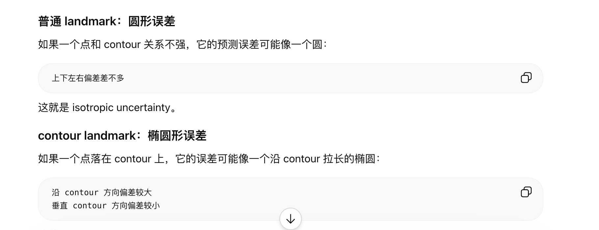

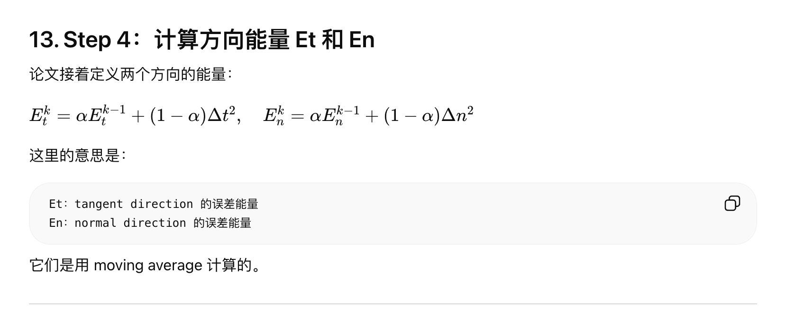

第5节我没怎么听懂，这2个是什么意思。方向能量又是什么？DRM整体怎么做的？


**GPT：**

你这里卡住很正常，因为 DRM 这一节其实有三个概念叠在一起：

```text
1. 圆形误差 vs 椭圆形误差
2. tangent / normal 两个方向
3. Et / En 方向能量
```

我重新用更直观的方式讲一遍。

---

# 1. 你截图里的“圆形误差”和“椭圆形误差”是什么意思？

## 普通 landmark：圆形误差

如果一个 landmark 和 contour 关系不强，比如它不是明显落在某条轮廓线上，那么模型预测错的时候，可能往上下左右各个方向偏得差不多。

也就是：

```text
向上偏一点：可能
向下偏一点：可能
向左偏一点：可能
向右偏一点：也可能
```

这种误差像一个圆。

这叫：

> **isotropic uncertainty，各向同性不确定性**

**isotropic** 的意思是：
不同方向差不多，没有明显方向偏好。

你可以理解为：

> 模型不知道这个点往哪个方向更容易错，所以误差像圆一样均匀扩散。

---

## contour landmark：椭圆形误差

如果一个 landmark 落在 contour 上，比如下颌轮廓上的点，那么它的误差就不一定是圆形了。

因为 contour 是一条线，这个点在这条线上可能会**沿着轮廓方向滑动**。

比如：

```text
沿着下颌轮廓往前偏一点
沿着下颌轮廓往后偏一点
```

这种偏差仍然可能落在 contour 附近，所以模型更容易在这个方向上产生不确定性。

但是如果它**垂直 contour 偏出去**，比如直接偏到骨外面或骨里面，这种错误在解剖结构上更明显。

所以对 contour 上的点来说：

```text
沿 contour 方向：误差可能更大
垂直 contour 方向：误差可能更小
```

这种误差像一个被拉长的椭圆。

这叫：

> **anisotropic uncertainty，各向异性不确定性**

**anisotropic** 的意思是：
不同方向上的误差分布不一样。

论文的 DRM 就是基于这个观察：在目标域中，contour 上的 landmark 往往沿切线方向有更大不确定性，而法线方向不确定性较小。fileciteturn0file0

---

# 2. tangent direction 和 normal direction 是什么？

对于一条 contour，任意一个位置都有两个方向。

## tangent direction：切线方向

就是**沿着 contour 走的方向**。

比如下颌轮廓是一条曲线，你顺着这条曲线移动，就是 tangent direction。

```text
沿 contour 方向
= tangent direction
= 切线方向
```

---

## normal direction：法线方向

就是**垂直于 contour 的方向**。

比如你从下颌轮廓往骨头外面或里面垂直偏出去，就是 normal direction。

```text
垂直 contour 方向
= normal direction
= 法线方向
```

你可以这样记：

```text
tangent：顺着线走
normal：垂直线走
```

---

# 3. 为什么 DRM 要把误差分成这两个方向？

假设真实 landmark 是 `p*`，模型预测点是 `p`。

普通方法只看：

```text
p 和 p* 离多远？
```

但是 DRM 会进一步问：

```text
这个偏差有多少是沿 contour 方向的？
这个偏差有多少是垂直 contour 方向的？
```

也就是把总误差拆成两部分：

```text
∆t：tangent direction 上的误差
∆n：normal direction 上的误差
```

可以理解成：

```text
总误差 = 沿轮廓滑偏的部分 + 垂直轮廓偏出去的部分
```

这个分解很重要，因为这两个方向的意义不同。

沿 contour 偏，可能说明模型在轮廓上定位不够精确；
垂直 contour 偏，可能说明模型偏离了解剖结构。

---

# 4. 方向能量 Et 和 En 是什么？

你截图里这个公式：

genui{"math_block_widget_always_prefetch_v2":{"content":"E_t^k=\\alpha E_t^{k-1}+(1-\\alpha)\\Delta t^2,\\quad E_n^k=\\alpha E_n^{k-1}+(1-\\alpha)\\Delta n^2"}}

这里的 **Et** 和 **En** 不是真的物理能量。

它们可以理解成：

> **某个方向上，模型历史误差大小的统计量。**

更直白地说：

```text
Et：模型在 tangent direction 上通常错得有多大
En：模型在 normal direction 上通常错得有多大
```

因为它们用的是误差平方：

```text
∆t²
∆n²
```

所以叫 **error energy，误差能量**。

---

## 为什么要用 moving average？

公式里有：

```text
α E^{k-1} + (1 - α) 当前误差
```

这是 **moving average，滑动平均**。

意思是：

```text
不要只看当前一次误差
而是综合历史误差和当前误差
```

论文里 α = 0.9，也就是说：

```text
90% 看历史平均
10% 看当前误差
```

这样 Et 和 En 会更稳定，不会因为某一个 batch 的误差突然变大或变小而剧烈波动。

---

# 5. Et / En 的直观意义

你可以这样理解：

如果某个 contour landmark 经常沿 contour 方向偏，那么：

```text
∆t 经常比较大
∆t² 比较大
Et 就会变大
```

这说明：

```text
tangent direction 是一个高不确定性方向
```

如果它很少垂直 contour 偏出去，那么：

```text
∆n 比较小
∆n² 比较小
En 就会比较小
```

这说明：

```text
normal direction 是一个低不确定性方向
```

所以 Et / En 本质上是在估计：

> **模型在两个方向上的不确定性程度。**

---

# 6. DRM 整体到底怎么做？

DRM 可以简化成 5 步。

---

## Step 1：先有 contour heatmap

CAM 生成 contour heatmap。

这个 heatmap 告诉模型：

```text
contour 在哪里
contour 附近响应高
远离 contour 响应低
```

---

## Step 2：从 contour heatmap 计算方向

对 contour heatmap 求梯度。

论文用 Sobel operator 计算偏导数：

```text
∂M / ∂x
∂M / ∂y
```

梯度方向大致是垂直 contour 的方向，也就是 normal direction。

然后把 normal direction 旋转 90 度，就得到 tangent direction。

所以得到两个方向场：

```text
t(x, y)：每个位置的切线方向
n(x, y)：每个位置的法线方向
```

---

## Step 3：计算预测误差

模型预测点是：

```text
p
```

真实点是：

```text
p*
```

误差向量是：

```text
p - p*
```

这表示预测点相对真实点偏了多少。

---

## Step 4：把误差投影到 tangent 和 normal 方向

DRM 不直接用总误差，而是把误差拆成：

```text
∆t：沿 tangent direction 的误差
∆n：沿 normal direction 的误差
```

直觉上就是：

```text
这个错误有多少是“顺着轮廓滑偏”？
这个错误有多少是“垂直轮廓偏出去”？
```

---

## Step 5：用 Et / En 做方向敏感回归损失

论文的回归损失大意是：

```text
分别处理 tangent 误差和 normal 误差
并用 Et 和 En 进行方向归一化
```

这样模型优化时就不是简单地说：

```text
只要欧氏距离小就行
```

而是会考虑：

```text
这个误差发生在什么方向？
这个方向本身不确定性高不高？
这个偏差是否符合 contour geometry？
```

---

# 7. 一句话讲清 DRM

你可以背这个版本：

> **DRM 先从 contour heatmap 中计算出每个位置的 tangent direction 和 normal direction，然后把 landmark 的预测误差分解到这两个方向上，分别得到 ∆t 和 ∆n。接着用滑动平均统计两个方向上的误差能量 Et 和 En，最后构造方向敏感回归损失，使模型不仅关注预测点离真实点多远，还关注它是沿轮廓方向偏了，还是垂直轮廓方向偏了。**

---

# 8. 用最通俗的话理解 DRM

普通 loss 像这样：

```text
你错了 2mm。
```

DRM 像这样：

```text
你错了 2mm，
其中 1.6mm 是沿 contour 滑偏，
0.4mm 是垂直 contour 偏出去。
这两个方向的意义不同，所以我要分开处理。
```

这就是 DRM 的核心。

---

# 9. 你可以这样回答老师

如果老师问：

> 方向能量是什么？

你答：

> 方向能量 Et 和 En 是对 tangent direction 和 normal direction 上历史误差平方的滑动平均估计。它们反映模型在两个方向上的误差强度或不确定性大小。Et 大说明模型在切线方向更容易产生较大偏差，En 小说明法线方向误差相对更稳定。

如果老师问：

> DRM 整体怎么做？

你答：

> DRM 首先从 contour heatmap 计算梯度，得到 normal direction，再旋转 90 度得到 tangent direction。然后将 predicted landmark 和 ground truth landmark 之间的 offset 投影到 tangent 和 normal 方向，得到 ∆t 和 ∆n。接着用 moving average 统计两个方向的 error energy，即 Et 和 En，最后用这些方向能量归一化两个方向的误差，形成 direction-sensitive regression loss。

---

你现在先记住这个最短版：

```text
DRM = 先找 contour 方向，
再把 landmark 误差拆成切线误差和法线误差，
再统计两个方向上通常错多大，
最后用方向敏感 loss 约束回归。
```

---

<a id="turn-015"></a>

## 对话 015

**我：**

可以，我懂了，继续

**GPT：**

好，继续**第 6 讲：整体损失函数与训练目标**。

这一讲的目标是把前面的 **CAM、JAM、DRM** 串起来。你要理解：这篇论文不是只有一个 loss，而是用了一个组合目标，让模型同时学三件事：

```text
1. 学会预测 landmark heatmap
2. 学会预测 contour heatmap
3. 学会按照 contour 方向优化 landmark regression
```

对应论文里的最终损失函数：

genui{"math_block_widget_always_prefetch_v2":{"content":"L=L_{reg}+\\lambda_1L_h+\\lambda_2L_{mse}"}}

论文中设置：

```text
λ1 = 2.0
λ2 = 5.0
```

也就是说，最终训练目标由三部分组成：**Lreg、Lh、Lmse**。fileciteturn0file0

---

# 第 6 讲：Loss Function，损失函数

## 1. 先看整体：为什么需要三个 loss？

这篇论文有三个核心模块：

| 模块 | 做什么 | 需要什么监督 |
|---|---|---|
| CAM | 学 contour prior | contour heatmap loss |
| JAM | 融合 contour 和 image features | 间接通过后续任务监督 |
| DRM | 方向敏感 landmark 回归 | direction-sensitive regression loss |
| Landmark Decoder | 输出 landmark heatmap | landmark heatmap loss |

所以最终 loss 也对应三类目标：

```text
Lh：监督 landmark heatmap
Lmse：监督 contour heatmap
Lreg：监督 landmark 坐标回归，并考虑 contour 方向
```

你可以先这样理解：

> **Lh 负责让模型找点，Lmse 负责让模型学轮廓，Lreg 负责让模型沿着合理的 contour 几何方向优化坐标。**

---

# 2. Lh：Landmark heatmap loss

第一个 loss 是：

```text
Lh
```

它对应：

> **landmark heatmap loss，关键点热图损失**

---

## 2.1 它监督什么？

模型会输出每个 landmark 的 heatmap。

如果有 19 个 landmarks，那么模型会输出 19 张 landmark heatmaps。

每张 heatmap 表示：

```text
这个 landmark 出现在每个像素位置的概率或响应值
```

真实 landmark 的位置附近响应应该最高，离真实点越远响应越低。

所以 Lh 的作用是：

> 让 predicted landmark heatmap 接近 ground-truth landmark heatmap。

---

## 2.2 Ground truth heatmap 是什么？

**Ground truth**，中文：**真实标注 / 真值**。

在这里，ground-truth landmark heatmap 是由真实 landmark 坐标生成的热图。

比如真实 landmark 在：

```text
p* = (x*, y*)
```

那么就围绕这个点生成一张高斯热图：

```text
点中心响应最高，周围逐渐衰减
```

模型预测的 heatmap 越接近这张真实热图，Lh 越小。

---

## 2.3 mean logistic loss 是什么？

论文中说，Lh 是 predicted landmark heatmaps 和 ground truth 之间的：

> **mean logistic loss**

中文可以说：

> **平均 logistic 损失**

你不需要把 logistic loss 的数学形式展开。汇报时可以这样解释：

> Lh is used to supervise landmark heatmap prediction, encouraging the predicted heatmaps to match the ground-truth landmark heatmaps.

中文：

> Lh 用于监督 landmark heatmap 预测，使模型预测的关键点热图接近真实关键点热图。

---

## 2.4 Lh 对应哪个模块？

主要对应：

```text
Landmark Decoder
```

也就是 landmark 解码器。

它把 JAM 融合后的特征转换成 landmark heatmaps。

所以：

```text
JAM 输出融合特征
↓
Landmark Decoder
↓
landmark heatmaps
↓
Lh 监督
```

---

# 3. Lmse：Contour heatmap loss

第二个 loss 是：

```text
Lmse
```

它对应：

> **contour heatmap loss，轮廓热图损失**

---

## 3.1 MSE 是什么？

**MSE** 全称：

> **Mean Squared Error**

中文：

> **均方误差**

它衡量的是预测值和真实值之间的平方差。

简单说：

```text
预测 contour heatmap 和真实 contour heatmap 越接近，Lmse 越小
```

---

## 3.2 它监督什么？

CAM 生成 contour features，同时 contour decoder 会预测 contour heatmaps。

Lmse 就是监督：

```text
predicted contour heatmaps
vs
ground-truth contour heatmaps
```

真实 contour heatmap 来自上一讲 CAM 的构造过程：

```text
landmarks
↓
cubic spline interpolation
↓
anatomical contours
↓
distance transform
↓
Gaussian contour heatmaps
```

所以 Lmse 的作用是：

> 让模型真的学会预测医学意义上的 anatomical contours，而不是只学 landmark 点。

---

## 3.3 为什么需要 Lmse？

这是老师可能会问的点。

你要答：

> 如果没有 Lmse，contour branch 可能无法稳定学习 contour structure。Lmse 给 CAM 提供直接监督，使 contour branch 能够学习具有解剖语义的 contour heatmaps。

更直观：

```text
没有 Lmse：
模型可能不知道 contour 分支到底该学什么

有 Lmse：
模型明确知道自己要预测 contour heatmap
```

所以 Lmse 是 CAM 的关键监督。

---

## 3.4 Lmse 对应哪个模块？

主要对应：

```text
Contour-aware Module + Contour Decoder
```

流程是：

```text
CAM / ViT branch
↓
Contour Decoder
↓
predicted contour heatmaps
↓
Lmse 监督
```

---

# 4. Lreg：Direction-sensitive regression loss

第三个 loss 是：

```text
Lreg
```

它对应：

> **Direction-sensitive regression loss，方向敏感回归损失**

上一讲你已经理解了它的核心：

```text
先从 contour heatmap 得到 tangent / normal directions
再把 landmark 预测误差投影到这两个方向
然后分别计算 ∆t 和 ∆n
再用 Et 和 En 做方向归一化
```

---

## 4.1 Lreg 监督什么？

它监督的是：

```text
predicted landmark coordinates
vs
ground-truth landmark coordinates
```

但它不是普通坐标损失。

普通坐标损失只问：

```text
预测点离真实点多远？
```

Lreg 问：

```text
预测误差沿 contour 切线方向有多少？
预测误差沿 contour 法线方向有多少？
两个方向上的不确定性分别多大？
```

所以 Lreg 是在 **coordinate regression level，坐标回归层面** 利用 contour geometry。

---

## 4.2 它对应哪个模块？

对应：

```text
DRM：Direction-sensitive Regression Module
```

也就是：

```text
contour heatmap
↓
tangent / normal directions
↓
prediction offset
↓
∆t / ∆n
↓
Et / En
↓
Lreg
```

---

# 5. 三个 loss 的关系

现在你要把它们串起来。

```text
Lh：让模型学会找 landmark 点
Lmse：让模型学会理解 contour 轮廓
Lreg：让模型按照 contour 的方向几何关系优化坐标
```

它们不是重复的，而是互补的。

| Loss | 中文 | 监督对象 | 对应模块 | 作用 |
|---|---|---|---|---|
| Lh | 关键点热图损失 | landmark heatmap | Landmark Decoder | 保证点定位 |
| Lmse | 轮廓热图损失 | contour heatmap | CAM / Contour Decoder | 保证轮廓结构学习 |
| Lreg | 方向敏感回归损失 | landmark coordinate offset | DRM | 保证方向合理的坐标回归 |

你可以说：

> **Lh focuses on point-level supervision, Lmse focuses on contour-level structural supervision, and Lreg focuses on direction-aware coordinate regression.**

中文：

> Lh 关注点级监督，Lmse 关注轮廓级结构监督，Lreg 关注方向感知的坐标回归。

---

# 6. λ1 和 λ2 是什么？

最终 loss 是：

```text
L = Lreg + λ1 Lh + λ2 Lmse
```

这里的：

```text
λ1
λ2
```

叫：

> **loss weights，损失权重**

它们控制不同 loss 的重要程度。

论文中：

```text
λ1 = 2.0
λ2 = 5.0
```

这意味着：

```text
Lh 的权重是 2.0
Lmse 的权重是 5.0
Lreg 默认权重是 1
```

---

## 6.1 为什么 Lmse 权重更大？

论文没有详细展开为什么设成 5.0，但可以合理理解为：

> contour heatmap 是辅助结构监督，如果权重太小，模型可能不会充分学习 contour prior；因此给 Lmse 较大的权重，可以强化 contour branch 对 anatomical structure 的学习。

但是汇报时不要说得太绝对，可以这样说：

> The authors set λ2 larger than λ1, which indicates that contour heatmap supervision is emphasized to strengthen anatomical structure learning.

中文：

> 作者将 λ2 设置得比 λ1 更大，说明他们希望更强地监督 contour heatmap，从而强化解剖结构学习。

---

# 7. 这其实是 Multi-task Learning

这里有一个专业英文：

> **Multi-task Learning**

中文：

> **多任务学习**

为什么？

因为模型不只做一个任务。

它同时做：

```text
任务 1：landmark heatmap prediction
任务 2：contour heatmap prediction
任务 3：direction-sensitive coordinate regression
```

这些任务共同训练一个框架。

你可以这样讲：

> The overall objective can be viewed as a multi-task learning formulation, where landmark localization and contour prediction are optimized jointly, and contour geometry further regularizes landmark regression.

中文：

> 整体训练目标可以看作多任务学习：模型同时优化 landmark 定位和 contour 预测，并进一步用 contour 几何约束 landmark 回归。

---

# 8. Auxiliary supervision 是什么？

还有一个重要英文：

> **Auxiliary supervision**

中文：

> **辅助监督**

Lmse 可以理解为辅助监督。

因为最终任务是 landmark detection，contour prediction 不是最终评估目标。

但是 contour heatmap prediction 能帮助模型学习更好的结构特征。

所以 contour loss 是一种辅助监督。

你可以这样说：

> Although the final task is landmark detection, contour heatmap prediction provides auxiliary structural supervision, helping the model learn more robust anatomical representations.

中文：

> 虽然最终任务是 landmark detection，但 contour heatmap prediction 提供了辅助结构监督，帮助模型学习更鲁棒的解剖表示。

---

# 9. 三个 loss 如何对应“点、线、方向”？

这个理解很重要，也很适合放进汇报。

```text
Lh：点
Lmse：线
Lreg：方向
```

更完整：

```text
Lh 监督 landmark 这个“点”
Lmse 监督 contour 这条“线”
Lreg 监督点相对于线的“方向误差”
```

你可以用一句非常形象的话：

> **这篇论文的 loss 设计是从点到线，再到方向几何。**

英文可以说：

> **The loss design moves from point-level supervision to contour-level supervision and finally to direction-aware geometric regularization.**

中文：

> 它的损失设计从点级监督，扩展到轮廓级监督，再进一步到方向感知的几何正则。

---

# 10. Regularization 是什么？

刚才提到了：

> **Geometric regularization**

中文：

> **几何正则化 / 几何约束**

**Regularization** 在机器学习中指的是一种约束，防止模型学到不合理的模式。

这里的 regularization 是：

```text
利用 contour geometry 限制 landmark 预测结果
```

也就是说，模型不能只靠图像 appearance 随便找点，而要符合 contour 的几何结构。

DRM 就是一种 geometric regularization。

---

# 11. 为什么这些 loss 能帮助 cross-domain？

这是汇报里一定要联系回主题的地方。

这篇论文的主题是：

```text
cross-domain cephalometric landmark detection
```

所以你要解释 loss 为什么帮助跨域。

逻辑是：

```text
Lh：保证 landmark detection 基本能力
Lmse：强化 domain-invariant contour structure learning
Lreg：利用 contour geometry 约束坐标误差
↓
模型减少对 unstable image appearance 的依赖
↓
在 unseen target domains 上更鲁棒
```

你可以说：

> The combined loss encourages the model to learn not only appearance-based landmark heatmaps but also domain-invariant contour structures and direction-aware geometric constraints. This reduces reliance on unstable image appearance and improves cross-domain robustness.

---

# 12. 训练时到底发生了什么？

你可以把一次训练理解成这样：

```text
输入一张 cephalometric image
↓
CNN 提取 contextual features
ViT/CAM 提取 contour structural features
↓
JAM 进行 contour-context interaction
↓
Contour Decoder 输出 contour heatmap
Landmark Decoder 输出 landmark heatmap
↓
DRM 根据 contour geometry 计算方向回归误差
↓
用 Lh + Lmse + Lreg 一起更新网络参数
```

也就是说，训练过程中模型同时被三种监督拉着走：

```text
点的位置要对
轮廓结构要对
方向误差要合理
```

---

# 13. 第 6 讲汇报稿

你可以直接这样讲：

> 本文的整体损失函数由三部分组成，分别是 Lreg、Lh 和 Lmse。
>
> 其中，Lh 是 landmark heatmap loss，用于监督 Landmark Decoder 输出的 landmark heatmaps，使其接近 ground-truth landmark heatmaps。这个部分保证模型具备基本的关键点定位能力。
>
> Lmse 是 contour heatmap loss，用于监督 Contour Decoder 输出的 contour heatmaps。真实 contour heatmaps 是由医学定义的 landmarks 经过 cubic spline interpolation、distance transform 和 Gaussian smoothing 得到的。因此 Lmse 可以看作一种 auxiliary structural supervision，帮助 CAM 学习具有解剖语义的 contour representations。
>
> Lreg 是 Direction-sensitive Regression Module 中的方向敏感回归损失。它将 landmark prediction offset 投影到 contour 的 tangential direction 和 normal direction 上，并利用方向能量 Et 和 En 对误差进行归一化，从而使坐标回归过程感知 contour geometry 和 anisotropic uncertainty。
>
> 最终损失函数为 L = Lreg + λ1Lh + λ2Lmse，其中 λ1 设置为 2.0，λ2 设置为 5.0。整体来看，这个损失设计同时包含点级监督、轮廓级结构监督和方向感知几何约束，使模型能够减少对 image appearance 的依赖，提升 unseen target domains 上的鲁棒性。

---

# 14. 老师追问准备

## 追问 1：为什么需要三个 loss？

你答：

> 因为它们监督不同层面的信息。Lh 监督 landmark heatmap，Lmse 监督 contour heatmap，Lreg 监督 landmark 坐标相对于 contour geometry 的方向误差。三者分别对应点、线和方向约束。

---

## 追问 2：Lmse 是主任务还是辅助任务？

你答：

> 最终任务是 landmark detection，因此 contour heatmap prediction 可以看作 auxiliary task。Lmse 提供辅助结构监督，使模型学习更稳定的 anatomical contour representation。

---

## 追问 3：为什么 Lmse 对跨域有帮助？

你答：

> 因为 contour 表达的是相对稳定的解剖结构，而不是容易变化的 image appearance。通过 Lmse 监督 contour heatmap，模型能学习 domain-invariant structural features，从而提升跨域泛化。

---

## 追问 4：Lh 和 Lreg 都和 landmark 有关，它们重复吗？

你答：

> 不重复。Lh 监督的是 landmark heatmap 的像素级概率分布，主要用于定位点的位置；Lreg 监督的是预测坐标与真实坐标之间的方向分解误差，它进一步利用 contour 的 tangent 和 normal directions 约束坐标回归。

---

## 追问 5：λ1 和 λ2 是怎么来的？

你答：

> 论文中将 λ1 设置为 2.0，λ2 设置为 5.0，用于平衡不同 loss 的贡献。λ2 较大说明作者更强调 contour heatmap supervision，以强化 contour prior 的学习。具体数值通常是经验设置或通过验证实验确定。

---

## 追问 6：JAM 有没有单独的 loss？

你答：

> JAM 本身没有单独的显式 loss。它作为特征交互模块，通过后续的 landmark heatmap loss、contour heatmap loss 和 regression loss 共同反向传播来学习有效的 contour-context fusion。

---

# 15. 本讲必须记住的英文术语

| 英文 | 中文 | 解释 |
|---|---|---|
| Loss function | 损失函数 | 训练时优化的目标 |
| Objective function | 目标函数 | 和 loss function 含义接近 |
| Landmark heatmap loss | 关键点热图损失 | 监督 landmark heatmap |
| Contour heatmap loss | 轮廓热图损失 | 监督 contour heatmap |
| Mean Squared Error, MSE | 均方误差 | 预测值和真实值平方差 |
| Mean logistic loss | 平均 logistic 损失 | 用于 heatmap 监督 |
| Regression loss | 回归损失 | 监督坐标预测 |
| Loss weight | 损失权重 | 控制不同 loss 重要程度 |
| Multi-task learning | 多任务学习 | 多个相关任务一起训练 |
| Auxiliary supervision | 辅助监督 | 辅助任务提供额外训练信号 |
| Regularization | 正则化 / 约束 | 防止模型学到不合理模式 |
| Geometric regularization | 几何正则 | 利用几何结构约束预测 |
| Point-level supervision | 点级监督 | 监督 landmark 点 |
| Contour-level supervision | 轮廓级监督 | 监督 contour 线 |
| Direction-aware | 方向感知 | 考虑误差方向 |

---

# 16. 第 6 讲最终理解

你现在要能背出这段：

> 本文的 loss 由 Lh、Lmse 和 Lreg 三部分组成。Lh 监督 landmark heatmap，保证模型能定位关键点；Lmse 监督 contour heatmap，提供辅助结构监督，使模型学习 domain-invariant anatomical contour prior；Lreg 是方向敏感回归损失，将 landmark 坐标误差分解到 tangent 和 normal directions 上，利用 contour geometry 约束预测。三者分别对应点、线和方向，使模型从单纯 appearance-driven detection 转向 structure-guided localization。

下一讲我们进入**第 7 讲：实验设置与数据集**，重点讲：

```text
ISBI 2023 / ISBI 2015 是什么
source domain / target domain 怎么划分
为什么这是真正的 cross-domain setting
MRE 和 SDR 指标怎么解释
```

---

<a id="turn-016"></a>

## 对话 016

**我：**

LH损失怎么算的？模型是什么时候预测contour的？这不是一个先验知识吗？为什么还要预测，不应该是根据gt的真值来算的吗？

**GPT：**

你这个问题问得很关键：**contour 是先验，为什么还要预测 contour？**
答案是：**训练时 contour 的 GT 用来监督模型学习结构先验；测试时没有 GT contour，所以模型必须自己从图像中预测/表征 contour。**

我们分开讲。

---

# 1. Lh 损失怎么算？

论文里说：

> **Lh is defined to be mean logistic losses between the predicted landmark heatmaps and the ground truth.**
> Lh 是预测 landmark heatmaps 和真实 landmark heatmaps 之间的 mean logistic loss。fileciteturn0file0

也就是说，模型会预测 landmark heatmap：

```text
predicted landmark heatmap:  H_hat
ground-truth landmark heatmap: H
```

然后用 logistic loss 比较二者。

论文没有展开具体公式，但在 heatmap 预测任务里，**mean logistic loss 通常可以理解为像素级 binary logistic loss / BCE loss**：

genui{"math_block_widget_always_prefetch_v2":{"content":"L_h=-\\frac{1}{N}\\sum_i\\left[H_i\\log(\\hat H_i)+(1-H_i)\\log(1-\\hat H_i)\\right]"}}

直观解释就是：

```text
真实 landmark 附近的像素，GT heatmap 值高，模型也应该预测高；
远离 landmark 的像素，GT heatmap 值低，模型也应该预测低。
```

所以 **Lh 是点级监督**：

```text
监督模型把 landmark heatmap 的峰值预测到真实 landmark 附近。
```

你可以理解成：

> **Lh 负责教模型“关键点在哪里”。**

---

# 2. 模型什么时候预测 contour？

模型在训练和测试时都会经过 contour branch。

整体流程是：

```text
输入 X-ray 图像
↓
CAM / ViT branch 提取 contour structural features
↓
Contour Decoder 预测 contour heatmap
↓
JAM 用 contour features 和 CNN features 交互
↓
Landmark Decoder 预测 landmark heatmap
```

也就是说，模型不是只在训练时用 contour，**它在前向传播过程中会预测 contour heatmap / contour features**。

论文 Fig.2 里右侧有两个 decoder：

```text
Contour Decoder
Landmark Decoder
```

Contour Decoder 就是用来预测 contour heatmap 的。论文也明确说，Lmse 是 predicted contour heatmaps 和 ground-truth contour heatmap Mj 之间的 L2 loss。fileciteturn0file0

---

# 3. 既然 contour 是先验，为什么还要预测？

这是重点。

你现在的疑问是：

> contour 不是根据 GT landmark 生成的吗？那不应该直接用 GT contour 吗？为什么还要模型预测？

答案是：

## 训练时可以用 GT contour，但测试时没有 GT contour

训练阶段，你有真实 landmark 标注。

所以可以这样构造 GT contour：

```text
GT landmarks
↓
cubic spline interpolation
↓
GT anatomical contours
↓
distance transform + Gaussian
↓
GT contour heatmaps Mj
```

这个 GT contour heatmap 是监督信号。

但是测试阶段，模型输入的是一张新 X-ray：

```text
test image
```

此时没有：

```text
GT landmark
GT contour
```

所以模型不能依赖真实 contour。
它必须从图像中自己学会预测 contour 结构。

因此训练时要让模型做这个任务：

```text
image → predicted contour heatmap
```

然后用 GT contour heatmap 监督它。

---

# 4. “先验知识”在这里到底是什么意思？

这里的 **prior，先验** 不是说测试时把 GT contour 直接喂给模型。

而是说：

> **作者把医学上已知的 contour-landmark 结构关系转化成训练监督，让模型在训练过程中学会这种结构规律。**

也就是说，contour prior 是一种：

```text
结构知识
辅助监督
归纳偏置 inductive bias
```

它不是测试时可直接使用的真值。

---

# 5. 一个最清楚的类比

假设你教学生认下颌角点。

训练时你可以告诉学生：

```text
你不只要看这个点，还要看下颌骨轮廓。
这个点和下颌轮廓有关系。
```

于是你给学生看：

```text
真实关键点
真实下颌轮廓
```

让他学习结构关系。

但考试时，你不会把答案轮廓给他。
他只能看图像，然后自己判断：

```text
轮廓大概在哪里？
点应该在哪里？
```

这就是为什么训练时需要 GT contour，测试时模型要自己预测 contour。

---

# 6. Lmse 到底在监督什么？

Lmse 是 contour heatmap 的监督。

论文中：

```text
Lmse = predicted contour heatmap 和 GT contour heatmap Mj 的 L2 loss
```

直观就是：

```text
模型预测的 contour heatmap
vs
由 GT landmark 生成的 contour heatmap
```

如果模型预测的蓝色轮廓热图和真实轮廓热图越接近，Lmse 越小。

所以：

> **Lmse 负责教模型“解剖轮廓在哪里”。**

---

# 7. Lh 和 Lmse 的区别

| Loss | 监督对象 | GT 怎么来 | 作用 |
|---|---|---|---|
| Lh | landmark heatmap | GT landmark 生成点状 heatmap | 教模型找点 |
| Lmse | contour heatmap | GT landmark 插值成 contour 后生成线状 heatmap | 教模型学轮廓 |
| Lreg | landmark 坐标误差 | predicted landmark 和 GT landmark | 教模型按 contour 方向优化误差 |

所以这篇论文不是只监督点，而是：

```text
Lh：监督点
Lmse：监督线
Lreg：监督点相对于线的方向误差
```

---

# 8. 训练和测试阶段的区别

## 训练阶段

训练时有 GT landmark，所以可以构造 GT contour。

```text
输入 image
↓
模型预测 landmark heatmap
模型预测 contour heatmap
↓
GT landmark 生成 landmark heatmap
GT landmark 插值生成 contour heatmap
↓
计算 Lh、Lmse、Lreg
↓
反向传播更新模型
```

训练阶段可以用 GT 是因为这是监督学习。

---

## 测试阶段

测试时没有 GT。

```text
输入 image
↓
模型自己预测 contour features / contour heatmap
↓
模型自己预测 landmark heatmap
↓
输出 landmark 坐标
```

测试时不会用 GT contour。

所以 contour prior 的作用是：

> **训练时通过 GT contour 教会模型结构规律，测试时模型用学到的结构规律帮助 landmark detection。**

---

# 9. 你可以这样回答老师

如果老师问：

> 既然 contour 是根据 GT landmark 得到的，为什么还要预测 contour？

你答：

> 因为 GT contour 只在训练阶段可用，它是由 GT landmarks 通过 cubic spline 和 Gaussian heatmap 构造出来的监督信号。测试阶段没有 GT landmarks，也就没有 GT contour。因此模型需要通过 contour decoder 从图像中预测 contour heatmap，并通过 Lmse 学习这种 anatomical contour prior。这里的 contour prior 不是测试时直接输入的真值，而是训练中引入的结构性辅助监督。

如果老师问：

> Lh 和 Lmse 分别干什么？

你答：

> Lh 监督 landmark heatmap，是点级监督；Lmse 监督 contour heatmap，是轮廓级结构监督。Lh 让模型学会找 landmark，Lmse 让模型学会理解 anatomical contours。

---

最短版记忆：

```text
训练时：
GT landmark → GT contour heatmap，用来监督 contour decoder。

测试时：
没有 GT contour，模型必须自己预测 contour。

所以 contour 是先验，但不是直接答案；
它是通过 Lmse 注入模型的结构监督。
```

---

<a id="turn-017"></a>

## 对话 017

**我：**

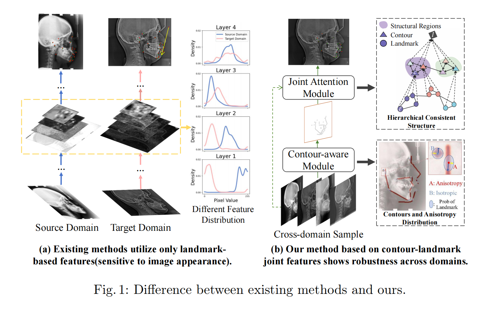

详细讲解图1


**GPT：**

这张 **Fig.1** 是整篇论文的“动机图”。它不是完整网络结构图，而是在说明：

> **为什么现有方法跨域不稳，以及为什么作者认为 contour-landmark joint features 更适合跨域泛化。**
> 左边讲问题，右边讲本文思路。fileciteturn0file0

---

# 1. 整张图先看大逻辑

图 1 分成两大部分：

```text
(a) Existing methods
现有方法：只利用 landmark-based features
问题：对 image appearance 敏感，跨域后特征分布变化大

(b) Our method
本文方法：利用 contour-landmark joint features
优势：利用稳定解剖结构，提高跨域鲁棒性
```

也就是说，这张图想表达：

```text
不同设备 / 不同成像条件
↓
图像外观 appearance 变化
↓
传统 landmark-based 特征受影响
↓
source domain 和 target domain 特征分布不一致
↓
跨域性能下降

本文引入 contour prior
↓
利用 landmark + contour + structural region 的层级关系
↓
模型更多依赖 anatomical structure
↓
跨域更稳定
```

---

# 2. 左半部分：Existing methods 为什么不稳？

左边标题是：

> **Existing methods utilize only landmark-based features (sensitive to image appearance).**

中文意思：

> 现有方法主要只利用基于 landmark 的特征，而这些特征对图像外观很敏感。

---

## 2.1 Source Domain 和 Target Domain

左下角有两张图：

```text
Source Domain
Target Domain
```

**Source Domain** 是训练域。
**Target Domain** 是测试时的新域。

在头影图像里，不同 domain 可能来自：

```text
不同 X 光设备
不同图像分辨率
不同对比度
不同亮度
不同噪声
不同扫描参数
```

所以虽然它们拍的是同一种解剖结构，但图像外观可能差异很大。

你汇报时可以说：

> 左下角表示 source domain 和 target domain。它们都是头影 X 光图像，但由于设备、分辨率和成像参数不同，图像 appearance 发生变化。

---

## 2.2 中间的特征堆叠是什么意思？

左边黄色虚线框里有一叠叠 feature maps。

这表示传统深度模型从图像中提取多层特征。

可以理解为：

```text
输入 X-ray
↓
CNN / backbone
↓
Layer 1 feature
Layer 2 feature
Layer 3 feature
Layer 4 feature
```

这些 feature 主要来自图像外观：

```text
灰度
边缘
纹理
局部骨结构
牙齿区域
对比度变化
```

问题是，这些外观特征在不同 domain 中不稳定。

---

## 2.3 右边的 Different Feature Distribution 是核心

左半部分中间偏右有四个小曲线图：

```text
Layer 1
Layer 2
Layer 3
Layer 4
```

蓝色曲线代表 source domain，红色曲线代表 target domain。

横轴是：

```text
Pixel Value
```

纵轴是：

```text
Density
```

你可以把它理解成不同层特征或像素响应的分布情况。

图中可以看到，蓝色和红色曲线并不重合，尤其在低层特征中差异明显。

这说明：

> **source domain 和 target domain 的 feature distribution 不一样。**

这就是 domain gap 在特征层面的体现。

---

## 2.4 为什么这会影响 landmark detection？

传统 landmark detection 方法通常会学：

```text
某个 landmark 附近应该有什么灰度模式
某个骨边缘附近应该有什么纹理
某个区域的 contrast 应该是什么样
```

但如果 target domain 的图像外观变了，模型在 source domain 学到的这些线索就可能失效。

比如：

```text
source domain：下颌边缘清楚
target domain：下颌边缘模糊

source domain：牙齿区域对比度高
target domain：牙齿区域偏暗

source domain：软组织轮廓清晰
target domain：软组织边缘弱
```

于是模型可能会把 landmark 预测偏。

所以左边想表达：

> **现有方法过度依赖 image appearance，而 image appearance 跨域变化大，因此跨域鲁棒性差。**

---

# 3. 右半部分：本文方法怎么解决？

右边标题是：

> **Our method based on contour-landmark joint features shows robustness across domains.**

中文意思：

> 本文基于 contour-landmark 联合特征的方法在跨域场景下更鲁棒。

右半部分主要包含两个模块和两个结果解释：

```text
Cross-domain Sample
↓
Contour-aware Module
↓
Joint Attention Module
↓
Hierarchical Consistent Structure
Contours and Anisotropy Distribution
```

---

# 4. Cross-domain Sample 是什么？

右下角有几张叠放的头影图像，标注为：

```text
Cross-domain Sample
```

它表示模型面对的是来自不同 domain 的样本。

也就是：

```text
不同设备
不同图像外观
不同分辨率 / 对比度
```

但是作者认为，虽然图像 appearance 变化，解剖 contour 结构相对稳定。

这就是本文方法的出发点。

---

# 5. Contour-aware Module 是什么？

图中下方有一个框：

```text
Contour-aware Module
```

这是 CAM，轮廓感知模块。

它的作用是：

> **引入 cranial soft/hard tissue contours，学习 contour prior。**

具体来说，它会把医学定义的 landmarks 通过样条插值构造成 anatomical contours，再生成 contour heatmaps，让模型学习轮廓结构。论文中说，contour 被作为 domain-invariant anatomical priors，用来减少模型对低层 appearance features 的依赖。fileciteturn0file0

在图里，Contour-aware Module 下面连接着 cross-domain samples，上面连接着 contour 结构示意图。

这说明：

```text
输入跨域图像
↓
CAM 学习相对稳定的 contour 结构
↓
把 contour prior 提供给后续特征融合
```

---

# 6. Joint Attention Module 是什么？

图中上方有一个框：

```text
Joint Attention Module
```

这是 JAM，联合注意力模块。

它的作用是：

> **把 contour structural features 和 landmark/contextual features 进行交互融合。**

也就是说，本文不是简单预测 contour，也不是简单预测 landmark，而是让两类信息互相增强：

```text
contour features 提供结构先验
CNN/context features 提供图像局部证据
JAM 让二者通过 attention 交互
```

你汇报时可以说：

> Joint Attention Module is used to fuse contour features and contextual landmark features, so that landmark localization becomes structure-guided rather than purely appearance-driven.

中文：

> JAM 用来融合轮廓结构特征和关键点上下文特征，使 landmark 定位从单纯依赖图像外观，转向由解剖结构引导。

---

# 7. 右上角：Hierarchical Consistent Structure 是什么？

右上角虚线框标题是：

```text
Hierarchical Consistent Structure
```

中文：

> 层级一致结构。

里面有图例：

```text
Structural Regions
Contour
Landmark
```

分别表示：

```text
Structural Regions：结构区域 / 解剖区域
Contour：轮廓
Landmark：关键点
```

图里可以看到三种层级：

```text
点：landmarks
线：contours
区域：structural regions
```

它想表达的是：

> landmark 不是孤立的点，它们属于某些 contour；contour 又和更高层的解剖区域相关。

也就是：

```text
landmark → contour → structural region
点 → 线 → 区域
```

---

## 7.1 为什么这个结构重要？

传统方法可能只看：

```text
这个 landmark 附近像不像某个关键点？
```

本文希望模型进一步学习：

```text
这个 landmark 应该属于哪条 contour？
这条 contour 和其他 contour 的拓扑关系是什么？
这个点是否符合整体解剖区域结构？
```

所以右上角是在说明 JAM 要建模的不只是点，而是：

> **landmark、contour、structural region 之间的层级拓扑关系。**

---

## 7.2 图中虚线和连线是什么意思？

可以理解为结构关系：

```text
landmark 与 landmark 之间有关系
landmark 与 contour 之间有关系
contour 与 structural region 之间有关系
```

这对应论文里说的：

> intra-layer and cross-layer relationships

中文：

```text
intra-layer relationships：同一层级内部关系
cross-layer relationships：跨层级关系
```

例如：

```text
landmark 之间的位置关系：同层关系
landmark 和 contour 的归属关系：跨层关系
contour 和 structural region 的关系：跨层关系
```

---

# 8. 右下角：Contours and Anisotropy Distribution 是什么？

右下角虚线框标题是：

```text
Contours and Anisotropy Distribution
```

中文：

> 轮廓与各向异性分布。

这是 DRM 的动机图。

里面有两个点：

```text
A: Anisotropy
B: Isotropic
```

注意图里 “Anisotopy” 是拼写错误，正确应该是：

```text
Anisotropy
```

---

## 8.1 A 点：contour landmark，椭圆误差

A 点在 contour 附近或 contour 上。

旁边有一个蓝色椭圆，表示它的预测误差分布不是圆的，而是椭圆的。

也就是说：

```text
沿 contour 方向误差更大
垂直 contour 方向误差更小
```

这就是：

```text
anisotropic uncertainty
各向异性不确定性
```

这正是 DRM 要建模的东西。

---

## 8.2 B 点：普通 landmark，圆形误差

B 点附近画的是一个更接近圆形的误差分布。

表示：

```text
上下左右各个方向误差差不多
```

这叫：

```text
isotropic uncertainty
各向同性不确定性
```

---

## 8.3 这个小图为什么重要？

它说明：

> 对于 contour 上的 landmark，误差方向和 contour 几何方向有关。

所以作者进一步提出 DRM：

```text
从 contour heatmap 计算 tangent / normal direction
↓
把 landmark 误差分解为 ∆t 和 ∆n
↓
根据方向能量 Et / En 约束回归
```

因此右下角就是 DRM 的动机。

---

# 9. Fig.1 和三个模块的对应关系

这张图其实在为后面三个模块做铺垫。

| 图中位置 | 对应模块 | 作用 |
|---|---|---|
| 左边 feature distribution 差异 | 问题动机 | 说明现有方法受 domain gap 影响 |
| Contour-aware Module | CAM | 引入 contour prior |
| Joint Attention Module | JAM | 融合 contour 和 landmark/context features |
| Hierarchical Consistent Structure | JAM 的目标 | 建模点-线-区域层级关系 |
| Contours and Anisotropy Distribution | DRM 的动机 | 说明误差具有方向性 |

你可以这样总结：

```text
左边说明为什么需要 contour；
右边说明 contour 怎么帮助跨域；
右上角对应 JAM；
右下角对应 DRM。
```

---

# 10. 汇报时怎么讲这张图？

你可以按这个顺序讲。

---

## 第一步：先讲左边的问题

> 图 1(a) 展示了现有方法在 cross-domain 场景下的问题。传统 cephalometric landmark detection 方法主要依赖 landmark-based image features，例如灰度、边缘和纹理信息。但这些 appearance features 对设备、分辨率和成像参数非常敏感。因此，当 source domain 和 target domain 的图像外观发生变化时，模型提取到的 feature distribution 也会发生明显偏移，导致跨域定位性能下降。

---

## 第二步：讲右边的核心思路

> 图 1(b) 展示了本文方法的核心思想。作者认为，相比局部 image appearance，cranial anatomical contours 更能表达稳定的解剖结构。因此，本文通过 Contour-aware Module 引入 contour prior，并通过 Joint Attention Module 融合 contour features 和 landmark/contextual features，使模型学习 contour-landmark joint features。

---

## 第三步：讲右上角层级结构

> 右上角的 Hierarchical Consistent Structure 表示 landmark、contour 和 structural region 之间存在层级关系。landmark 是点，contour 是由多个 landmark 组成的连续轮廓，structural region 是更高层次的解剖区域。JAM 的目标就是建模这种点、线、区域之间的 intra-layer 和 cross-layer relationships。

---

## 第四步：讲右下角各向异性

> 右下角的 Contours and Anisotropy Distribution 解释了 DRM 的动机。对于位于 contour 上的 landmark，其预测误差通常不是圆形均匀分布，而是沿 contour 的切线方向更大、法线方向更小，呈现 anisotropic uncertainty。而普通非 contour landmark 的误差更接近 isotropic。因此，作者进一步设计方向敏感回归模块，对 tangent 和 normal 方向的误差分别建模。

---

## 第五步：总结整张图

> 因此，Fig.1 的核心信息是：现有方法过度依赖 appearance-based landmark features，容易受到 domain gap 影响；而本文通过 contour prior、contour-landmark joint attention 和 direction-sensitive regression，把模型从 appearance-driven detection 转向 structure-guided localization，从而提升 unseen target domains 上的鲁棒性。

---

# 11. 老师可能追问你什么？

## 追问 1：左边的曲线图说明什么？

答：

> 它说明 source domain 和 target domain 在不同 feature layers 上存在 feature distribution shift。也就是说，模型在 source domain 学到的 appearance-based features 到 target domain 中可能不再稳定，这就是 domain gap 在特征层面的体现。

---

## 追问 2：为什么 contour 比 landmark-based feature 更稳定？

答：

> landmark-based feature 往往依赖局部灰度、纹理和边缘，这些 appearance cues 容易受设备和成像条件影响；而 contour 表达的是连续解剖结构和拓扑关系，例如下颌轮廓、上颌轮廓和软组织轮廓，这些结构在不同 domain 中相对稳定。

---

## 追问 3：右上角的三种元素分别是什么？

答：

> 圆点表示 landmark，三角形表示 contour，半透明区域表示 structural region。它们构成从点到线再到区域的 hierarchical consistent structure。

---

## 追问 4：右下角 A 和 B 有什么区别？

答：

> A 是位于 contour 上的 landmark，它的误差分布沿 contour 方向被拉长，表现为 anisotropic uncertainty。B 是与 contour 关系不强的普通 landmark，它的误差分布更接近圆形，表现为 isotropic uncertainty。

---

## 追问 5：这张图和 CAM/JAM/DRM 怎么对应？

答：

> CAM 对应 contour-aware module，用来学习 contour prior；JAM 对应 joint attention module，用来融合 contour 和 landmark/context features，并建模 hierarchical consistent structure；DRM 对应右下角的 anisotropy distribution，用来根据 contour 的 tangent 和 normal directions 对 landmark regression 进行方向敏感约束。

---

# 12. 你可以背的最终版

> Fig.1 主要对比了现有方法和本文方法。左侧说明现有 landmark-based 方法依赖 image appearance features，因此 source domain 和 target domain 的 feature distribution 发生变化时，模型跨域性能会下降。右侧说明本文引入 anatomical contour prior，通过 Contour-aware Module 学习稳定的 contour structure，再通过 Joint Attention Module 融合 contour features 和 landmark/contextual features，形成 contour-landmark joint representation。右上角展示 landmark、contour 和 structural region 之间的层级一致结构，右下角展示 contour-related landmark 的 anisotropic uncertainty，为后续 Direction-sensitive Regression Module 提供动机。整体来看，这张图说明本文希望从 appearance-driven landmark detection 转向 structure-guided cross-domain localization。

---

<a id="turn-018"></a>

## 对话 018

**我：**

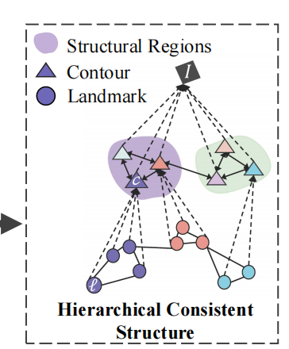

你再详细讲解这个图


**GPT：**

这个小图是 **Fig.1 右上角的 “Hierarchical Consistent Structure”**，中文可以理解为：

> **头影 landmark 不是孤立点，而是存在“点 → 线 → 区域”的层级结构关系。**

这张图主要服务于 **JAM：Joint Attention Module** 的动机。它想说明：为什么不能只把 landmark 当成一堆独立点，也不能简单 concat 特征，而要用 attention 去建模 landmark、contour、structural region 之间的关系。论文在方法部分也说明，JAM 要捕捉 landmarks、contours 和 tissue regions 之间的 intra-layer 与 cross-layer relationships。fileciteturn0file0

---

# 1. 先看图例：三个符号分别代表什么？

左上角 legend 里有三个元素：

```text
Structural Regions：结构区域
Contour：轮廓
Landmark：关键点
```

对应图中符号：

| 图中符号 | 英文 | 中文 | 含义 |
|---|---|---|---|
| 半透明彩色区域 | Structural Regions | 结构区域 / 解剖区域 | 更高层的组织结构区域 |
| 三角形 | Contour | 轮廓 | 由多个 landmark 构成的连续解剖轮廓 |
| 圆点 | Landmark | 关键点 | 需要最终检测的离散点 |

你可以把它理解成三层：

```text
第 1 层：Landmark，点
第 2 层：Contour，线
第 3 层：Structural Region，区域
```

也就是：

```text
点 → 线 → 区域
landmark → contour → structural region
```

---

# 2. 最下面的圆点：Landmark 层

图中最下面那些圆点就是 **landmarks**。

它们代表头影测量中的离散关键点，例如下颌角点、颏点、鼻根点、上颌相关点等。

这些点之间有黑色实线连接，表示：

> landmark 之间不是完全独立的，它们存在空间邻接关系或解剖结构关系。

比如几个下颌相关点之间可以共同描述下颌骨结构；几个面部软组织点可以共同描述软组织轮廓。

所以这层的含义是：

```text
landmark 是最基础的检测目标；
但 landmark 本身不是孤立存在的；
多个 landmark 之间有解剖结构关系。
```

汇报时可以说：

> The circular nodes represent landmarks. Although landmarks are the final prediction targets, they are not independent points; they have anatomical and spatial relationships with neighboring landmarks.

中文：

> 圆点表示 landmark。虽然 landmark 是最终检测目标，但它们不是孤立点，而是和相邻 landmark 存在空间和解剖关系。

---

# 3. 中间的三角形：Contour 层

图中间那些三角形代表 **contour**。

这里要注意：
三角形不是说 contour 真的是一个三角形，而是用一个节点来表示某条 contour 或 contour 上的结构单元。

多个 landmark 经过 cubic spline 插值可以形成一条连续轮廓，比如：

```text
mandibular contour：下颌轮廓
maxillary contour：上颌轮廓
soft tissue contour：软组织轮廓
```

所以 contour 层比 landmark 层更高一级。

它的含义是：

```text
多个 landmark 组成一条 contour；
contour 表达的是连续结构；
contour 比单个 landmark 更稳定。
```

你可以这样讲：

> The triangular nodes represent contour-level structures. A contour is formed by grouping related landmarks and connecting them into a continuous anatomical curve. Therefore, contours provide higher-level structural information than individual landmarks.

中文：

> 三角形表示 contour 层结构。contour 是由相关 landmark 组成并连接形成的连续解剖曲线，因此它比单个 landmark 提供更高层次的结构信息。

---

# 4. 半透明彩色区域：Structural Region 层

图中的半透明紫色、绿色等区域代表：

> **Structural Regions，结构区域 / 解剖区域**

这比 contour 还高一级。

可以理解为某些 contour 和 landmark 所共同对应的解剖区域，比如：

```text
下颌相关区域
上颌相关区域
软组织相关区域
牙颌相关区域
```

它不是精确的解剖分割 mask，而是一个概念示意：
说明 contour 和 landmark 还会共同组成更大的 anatomical region。

所以这层的作用是：

```text
把点和线组织成区域级结构；
表达更全局的解剖拓扑关系；
让模型不只看局部点，而是理解整体结构。
```

汇报时可以说：

> The translucent regions indicate structural regions, which represent higher-level anatomical areas formed by contours and landmarks. They provide global anatomical context.

---

# 5. 为什么叫 Hierarchical？

**Hierarchical** 是“层级的”。

这张图的层级关系是：

```text
Landmark 层：离散点
↓
Contour 层：由点组成的连续轮廓
↓
Structural Region 层：由轮廓和点共同构成的结构区域
```

这就是一个从低到高的结构。

对应中文：

```text
点级结构 → 线级结构 → 区域级结构
```

所以它不是在说只有 landmark 重要，而是在说：

> landmark detection 应该利用更高层的 contour 和 region 信息，而不是只看孤立点。

---

# 6. 为什么叫 Consistent？

**Consistent** 是“一致的 / 协调的”。

这里的 **consistent** 指的是：

> 这三层结构之间应该符合解剖一致性。

比如：

```text
某些 landmark 应该落在下颌 contour 附近；
下颌 contour 的形状应该符合下颌骨轮廓；
上颌、下颌、软组织区域之间应该保持合理的空间关系。
```

如果模型预测出来的 landmark 很准，但它们组成的 contour 不合理，那么从医学结构上看仍然有问题。

所以 **Hierarchical Consistent Structure** 的意思是：

> landmark、contour 和 structural region 三个层级之间应该相互匹配，保持解剖结构一致。

---

# 7. 图中的实线和虚线可以怎么理解？

这张图是概念图，不是严格数学图，但可以这样理解。

## 实线：同一层或局部结构关系

图中圆点之间、三角形之间有一些黑色实线。

这些可以理解为：

```text
landmark 与 landmark 的邻接关系
contour 内部的拓扑关系
同一结构内部的局部连接关系
```

也就是：

> **intra-layer relationship，层内关系。**

例如：

```text
几个下颌 landmark 之间的关系；
一条 contour 上不同位置之间的关系。
```

---

## 虚线：跨层级关系

图中有很多虚线从下层节点连接到上层节点。

这些可以理解为：

```text
landmark 和 contour 的关系
contour 和 structural region 的关系
landmark 和 region 的间接关系
```

也就是：

> **cross-layer relationship，跨层关系。**

例如：

```text
某个 landmark 属于某条 contour；
某条 contour 属于某个 anatomical region；
某个 region 对多个 landmark 有结构约束。
```

---

# 8. 这张图和 JAM 有什么关系？

这张图最核心的作用是解释：

> **为什么作者要设计 Joint Attention Module，而不是简单 concat 特征。**

如果 landmark、contour、region 之间有这种层级关系，那么模型需要学习：

```text
哪个 landmark 和哪条 contour 有关？
哪条 contour 和哪个 region 有关？
哪个 region 对哪些 landmark 有约束？
```

简单 concat 只是把特征堆起来：

```text
F_cnn + F_contour
```

但它不会显式建模这些关系。

JAM 通过 attention 做的事情就是：

```text
让 contour features 和 contextual features 互相查询、互相更新；
让模型自动学习 landmark、contour、region 之间的结构关联。
```

你可以这样总结：

> 这张图是 JAM 的动机图。因为 landmark、contour 和 structural region 之间存在层级一致关系，所以作者需要用 joint attention 去建模这些 intra-layer 和 cross-layer relationships。

---

# 9. 用一个例子理解

假设我们要检测下颌角点。

传统模型可能只问：

```text
这个局部区域像不像下颌角？
```

但是这张图表达的思路是：

```text
这个点是否属于 mandibular contour？
它和其他下颌 landmark 的相对位置是否合理？
它所在的 mandibular contour 是否符合下颌结构？
它和上颌、软组织区域之间的整体关系是否合理？
```

也就是说，模型不是只看一个点，而是看：

```text
点的位置
点与线的关系
线与区域的关系
整个解剖结构是否一致
```

这就是 structure-guided localization。

---

# 10. 你汇报时可以这样讲这张小图

可以直接背这个版本：

> 右上角的 Hierarchical Consistent Structure 展示了本文想建模的解剖层级关系。其中圆点表示 landmarks，三角形表示 contours，半透明区域表示 structural regions。Landmark 是最底层的离散关键点，多个相关 landmark 可以组成连续 anatomical contour，而 contour 进一步对应更高层次的 structural region。
>
> 因此，landmark detection 不应该只依赖单个点附近的 image appearance，而应该同时考虑 landmark、contour 和 region 之间的 intra-layer 和 cross-layer relationships。JAM 的作用就是通过 attention 机制在 contour structural features 和 CNN contextual features 之间进行信息交互，从而学习这种 hierarchical consistent structure。

---

# 11. 最短版理解

你可以记成：

```text
圆点 = landmark = 点
三角形 = contour = 线
半透明区域 = structural region = 区域

这张图说明：
landmark 不是孤立点，
它属于 contour，
contour 又属于更大的解剖区域。

所以 JAM 要建模的是：
点-线-区域之间的层级一致关系。
```

一句话总结：

> **这张图就是在说明：头影关键点检测不是“找一堆孤立点”，而是要学习点、轮廓和解剖区域之间稳定的结构拓扑关系。**

---

<a id="turn-019"></a>

## 对话 019

**我：**

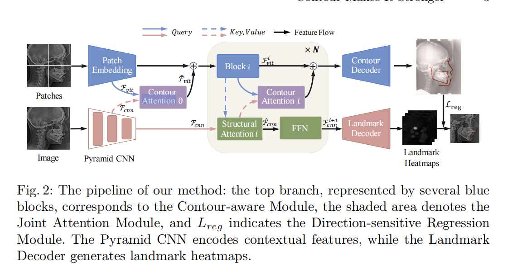

现在继续详细讲解图2


**GPT：**

图 2 是这篇论文的**完整方法流程图**，也就是 CJL 框架的 pipeline。它回答的是：

> 输入一张头影 X 光图像后，模型如何同时利用 **image contextual features** 和 **contour structural features**，最后预测 landmark heatmaps，并用 DRM 做方向敏感回归约束。

论文图注里明确说：上方蓝色分支对应 **Contour-aware Module**，阴影区域是 **Joint Attention Module**，`Lreg` 表示 **Direction-sensitive Regression Module**，Pyramid CNN 编码 contextual features，Landmark Decoder 输出 landmark heatmaps。fileciteturn0file0

---

# 1. 图 2 先看整体结构

整张图可以分成三条线：

```text
上方蓝色分支：Contour-aware branch / CAM
作用：提取 contour structural features，预测 contour heatmap

下方红色分支：Pyramid CNN branch
作用：提取 image contextual features

中间浅色阴影区域：JAM
作用：让 contour features 和 CNN features 互相交互融合

右侧输出：
Contour Decoder → contour heatmap
Landmark Decoder → landmark heatmaps
Lreg → DRM 方向敏感回归约束
```

一句话概括：

> 图 2 展示的是：模型一边用 ViT/CAM 学 contour 结构，一边用 Pyramid CNN 学图像上下文，然后通过 JAM 做双向 attention 融合，最后同时预测 contour heatmap 和 landmark heatmaps，并用 DRM 约束 landmark 回归。

---

# 2. 左侧输入：Patches 和 Image 是同一张图的两种处理方式

图左边有两个输入：

```text
Patches
Image
```

它们本质上来自同一张头影 X 光图像，但送入不同分支。

---

## 2.1 上方：Patches → Patch Embedding

上方输入是：

```text
Patches
```

意思是把图像切成很多小块。

论文中说，图像被裁成不重叠的 **16 × 16 patches**，然后展平并映射成 D 维 token。fileciteturn0file0

对应流程：

```text
Cephalometric image
↓
split into 16×16 patches
↓
Patch Embedding
↓
ViT tokens / Fvit
```

---

## 2.2 Patch Embedding 是什么？

**Patch Embedding**，中文可以叫：

> **图像块嵌入 / patch 嵌入**

它做的事是：

```text
一个 16×16 图像块
↓
展平 flatten
↓
映射成一个向量 token
```

因为 Transformer 不能直接处理二维图像，它需要 token 序列。
所以 Patch Embedding 的作用就是把图像转换成 ViT 可以处理的 token features。

---

## 2.3 下方：Image → Pyramid CNN

下方输入是完整图像：

```text
Image
↓
Pyramid CNN
↓
Fcnn
```

Pyramid CNN 负责提取 **contextual features，上下文特征**。

这些特征包含：

```text
局部边缘
灰度纹理
骨骼结构
牙齿区域
多尺度图像语义
```

所以你可以理解成：

```text
上方 ViT 分支：更关注 contour / global structure
下方 CNN 分支：更关注 image context / local appearance
```

---

# 3. 图中的两个核心特征：Fvit 和 Fcnn

图里反复出现两个符号：

```text
Fvit
Fcnn
```

它们是理解整张图的关键。

---

## 3.1 Fvit 是什么？

```text
Fvit = ViT branch 提取的 contour structural features
```

它来自上方 Patch Embedding 和 Transformer block。

它更偏向：

```text
contour structure
global anatomical topology
long-range relationships
```

也就是轮廓结构特征。

---

## 3.2 Fcnn 是什么？

```text
Fcnn = Pyramid CNN 提取的 contextual features
```

它来自下方 Pyramid CNN。

它更偏向：

```text
local image appearance
texture
edge
multi-scale context
```

也就是图像上下文特征。

---

## 3.3 两者为什么都需要？

因为 landmark detection 同时需要两类信息：

```text
CNN 提供局部图像证据：
这个地方有没有骨边缘？有没有局部纹理？

ViT / contour branch 提供结构先验：
这个点是不是符合下颌轮廓、上颌轮廓、软组织轮廓？
```

所以这篇论文不是只用 CNN，也不是只用 ViT，而是用 JAM 让两类特征交互。

---

# 4. 图例：Query、Key/Value 和 Feature Flow

图上方有一个 legend：

```text
Query
Key, Value
Feature Flow
```

这是解释 attention 里信息怎么流动的。

---

## 4.1 Query 是什么？

**Query** 可以理解为：

> 当前分支想要“查找什么信息”。

比如 contour feature 作为 Query 时，它在问：

```text
CNN 图像特征中，哪些区域对我理解 contour 有帮助？
```

---

## 4.2 Key / Value 是什么？

**Key** 是被查询的信息索引，
**Value** 是真正被取出来并加权融合的信息。

简单记：

```text
Query：我想找什么
Key：你这里有什么
Value：真正拿来用的信息
```

---

## 4.3 Feature Flow 是什么？

黑色箭头表示正常的特征流动，也就是特征从左到右传递。

所以图中三类箭头的意思是：

```text
蓝/红 attention 箭头：表示谁作为 Query，谁作为 Key/Value
黑色箭头：表示普通特征前向传播
```

---

# 5. 左中部分：Contour Attention 0 是什么？

在 Patch Embedding 后面，有一个：

```text
Contour Attention 0
```

这是一个初始的 contour attention。

它做的事情可以理解为：

> 在 contour 分支刚开始时，就让 ViT contour features 和 CNN contextual features 发生一次交互。

也就是：

```text
Fvit 作为 Query
Fcnn 作为 Key / Value
↓
更新得到 F̂vit
```

图里还有一个加号 `+`，表示 residual connection，残差连接。

---

## 5.1 为什么一开始就做 Contour Attention 0？

因为 contour branch 不能完全脱离原图上下文。

虽然它想学习 contour structure，但 contour 仍然来自图像。
所以它需要从 CNN 分支吸收一些局部图像证据。

你可以这样理解：

```text
ViT 分支负责“结构感知”
CNN 分支负责“图像证据”
Contour Attention 0 先让结构分支吸收图像证据
```

---

# 6. 中间阴影区域：Joint Attention Module, JAM

图中间浅色阴影区域，标注：

```text
× N
```

表示这个模块会重复 N 次。

这个阴影区域就是 **JAM：Joint Attention Module**。

它内部包含：

```text
Block i
Contour Attention i
Structural Attention i
FFN
```

---

# 7. Block i 是什么？

图中上方蓝色块：

```text
Block i
```

可以理解为 ViT / Transformer block 的第 i 个 block。

它处理的是 contour branch 的特征：

```text
Fvit
```

经过这个 block 后，得到更新后的：

```text
Fvit^i
```

这一步主要继续提取 contour structural features。

---

# 8. Contour Attention i 是什么？

图中紫色块：

```text
Contour Attention i
```

它和前面的 Contour Attention 0 类似。

它做的是：

```text
用 contour features 作为 Query
用 CNN contextual features 作为 Key / Value
```

也就是：

```text
contour branch 问：
CNN 图像上下文里哪些信息可以帮助我更新 contour 结构？
```

这个过程让 contour features 不只是抽象结构，还能结合真实图像上下文。

---

## 8.1 它对应论文公式

论文中的公式可以理解为：

```text
F̂vit^i = Fvit^i + γ^i Attention(norm(Fvit^i), norm(Fcnn^i))
```

意思是：

```text
原始 contour feature
+
从 CNN feature 中注意力提取的信息
=
更新后的 contour feature
```

这里的 `+` 是 residual connection，保证原有 contour structure 不会被完全破坏。

---

# 9. Structural Attention i 是什么？

图中绿色块：

```text
Structural Attention i
```

这是另一个方向的 attention。

它做的是：

```text
用 CNN contextual features 作为 Query
用 contour features 作为 Key / Value
```

也就是：

```text
CNN branch 问：
contour 结构中哪些信息可以帮助我定位 landmark？
```

这个过程把 contour prior 注入到 CNN features 中。

---

## 9.1 它对应论文公式

可以理解为：

```text
F̂cnn^i = Fcnn^i + Attention(norm(Fcnn^i), norm(Fvit^{i+1}))
```

意思是：

```text
原始 CNN context feature
+
从 contour feature 中注意力提取的结构信息
=
结构增强后的 CNN feature
```

---

# 10. JAM 的双向交互怎么理解？

JAM 最重要的不是某个单独 attention，而是**双向交互**。

```text
Contour Attention：
contour features ← CNN contextual features

Structural Attention：
CNN contextual features ← contour features
```

你可以背这句：

> **Contour Attention makes contour features image-aware; Structural Attention makes image features structure-aware.**

中文：

> Contour Attention 让轮廓特征感知图像上下文；Structural Attention 让图像特征感知解剖结构。

---

# 11. FFN 是什么？

图中 Structural Attention 后面有一个绿色块：

```text
FFN
```

**FFN** 是：

> **Feed-Forward Network，前馈网络**

在 Transformer 结构中，attention 后面通常会接 FFN。

它的作用是：

```text
对融合后的特征做进一步非线性变换
增强表达能力
输出下一轮使用的 Fcnn^{i+1}
```

所以：

```text
Structural Attention 输出 F̂cnn
↓
FFN
↓
Fcnn^{i+1}
```

---

# 12. 为什么 JAM 要重复 N 次？

图中写了：

```text
× N
```

表示这个交互过程会迭代多轮。

原因是：

```text
第一次交互：粗略融合 contour 和 context
第二次交互：进一步对齐结构和图像
第三次交互：继续细化 landmark-related features
```

你可以理解为：

> contour features 和 CNN features 不是一次就能完全对齐，所以要通过多轮 attention 逐步 refinement。

论文实现中提到，为了节省时间和显存，每 4 个 embedding layers 进行一次 joint learning interaction，JAM 运行 M=3 次。fileciteturn0file0

---

# 13. 右侧：Contour Decoder

JAM 后，上方分支进入：

```text
Contour Decoder
```

它输出的是：

```text
predicted contour heatmap
```

图右上角的小 X 光图中有红色 contour，这就是 contour prediction 的示意。

---

## 13.1 为什么要有 Contour Decoder？

这正好对应你之前问的问题：

> contour 不是先验吗，为什么还要预测？

答案是：

```text
训练时：
GT landmark → GT contour heatmap
用 Lmse 监督 Contour Decoder

测试时：
没有 GT landmark，也没有 GT contour
模型必须自己预测 contour heatmap / contour features
```

所以 Contour Decoder 的作用是：

> 让模型学会从图像中恢复 anatomical contour structure。

它不是最终评估目标，但它提供结构监督。

---

# 14. 右侧：Landmark Decoder

下方分支进入：

```text
Landmark Decoder
```

它输出：

```text
Landmark Heatmaps
```

图中黑色小图就是 landmark heatmaps，里面亮点表示每个 landmark 的预测响应。

---

## 14.1 Landmark Heatmap 是什么？

每个 landmark 对应一张 heatmap：

```text
某个位置响应越高
说明模型越认为 landmark 在那里
```

最终取 heatmap peak，得到 landmark 坐标。

所以 Landmark Decoder 是最终做 landmark localization 的输出头。

---

# 15. 右侧的 Lreg：DRM 在哪里？

图最右边有：

```text
Lreg
```

它从 contour prediction 和 landmark prediction 旁边引出，表示 **Direction-sensitive Regression Module**。

DRM 使用的信息包括：

```text
contour heatmap / contour geometry
predicted landmark
ground-truth landmark
```

然后做：

```text
从 contour heatmap 计算 tangent / normal directions
↓
把 landmark offset 投影到 tangent / normal
↓
计算 direction-sensitive regression loss Lreg
```

所以 `Lreg` 不只是普通坐标损失，而是带有 contour direction 的回归约束。

---

# 16. 图 2 的完整前向传播流程

你可以把图 2 从左到右完整讲成这样：

```text
1. 输入一张 cephalometric X-ray image。

2. 上方将图像切成 patches，经过 Patch Embedding 和 ViT branch，
得到 Fvit，也就是 contour structural features。

3. 下方将整张图像送入 Pyramid CNN，
得到 Fcnn，也就是 multi-scale contextual features。

4. 初始 Contour Attention 0 先让 Fvit 从 Fcnn 中吸收图像上下文。

5. 中间 JAM 模块重复 N 轮：
- Block i 更新 contour features；
- Contour Attention i 让 contour features 关注 CNN features；
- Structural Attention i 让 CNN features 关注 contour features；
- FFN 输出下一轮 contextual features。

6. 上方 Contour Decoder 根据 contour branch 输出 contour heatmap。

7. 下方 Landmark Decoder 根据融合后的 features 输出 landmark heatmaps。

8. 最后，DRM 用 contour geometry 对 landmark regression 计算 Lreg。
```

---

# 17. 图 2 和三个模块的对应关系

| 图中部分 | 对应模块 | 作用 |
|---|---|---|
| Patch Embedding + blue branch | CAM | 提取 contour structural features |
| Pyramid CNN | CNN contextual branch | 提取 image contextual features |
| Shaded area with Attention | JAM | contour/context 双向交互 |
| Contour Decoder | CAM 输出头 | 预测 contour heatmap |
| Landmark Decoder | landmark 输出头 | 预测 landmark heatmaps |
| Lreg | DRM | 方向敏感回归约束 |

---

# 18. 图 2 最容易被老师问的点

## 问题 1：为什么输入分成 Patches 和 Image 两路？

你答：

> 因为上方 ViT branch 需要 patch tokens 来建模全局 contour structure，而下方 Pyramid CNN 更适合从整张图像中提取多尺度 contextual features。两路特征互补。

---

## 问题 2：Fvit 和 Fcnn 分别是什么？

你答：

> Fvit 是 ViT contour branch 提取的 contour structural features，主要表达全局解剖轮廓关系；Fcnn 是 Pyramid CNN 提取的 contextual features，主要包含局部图像证据和多尺度上下文。

---

## 问题 3：JAM 为什么要双向 attention？

你答：

> 因为 contour features 和 contextual features 是互补的。Contour Attention 让 contour features 吸收图像上下文，Structural Attention 让 CNN features 注入 contour 结构先验。双向交互可以同时保证图像证据和解剖结构一致性。

---

## 问题 4：Contour Decoder 是干什么的？

你答：

> Contour Decoder 用于预测 contour heatmap。训练时用由 GT landmarks 生成的 GT contour heatmap 进行监督；测试时没有 GT contour，所以模型必须自己预测 contour structure。

---

## 问题 5：Landmark Decoder 是干什么的？

你答：

> Landmark Decoder 根据融合后的 contour-context features 输出 landmark heatmaps，heatmap 的峰值位置就是最终 landmark 坐标。

---

## 问题 6：Lreg 为什么在最右边？

你答：

> 因为 Lreg 是最终 landmark regression 阶段的方向敏感约束。它利用预测或学习到的 contour geometry，将 landmark prediction error 分解到 tangent 和 normal directions，从而让回归过程感知 contour 的几何结构。

---

# 19. 这张图的汇报稿

你可以直接这样讲：

> Fig.2 展示了本文提出的 CJL 框架。整个网络包含两条主要分支：上方是 contour-aware branch，下方是 Pyramid CNN branch。
>
> 上方分支首先将输入头影图像划分为 patches，并通过 Patch Embedding 转换成 token features，再经过 ViT 相关模块提取 contour structural features，记为 Fvit。这个分支的目标是学习更稳定的 anatomical contour priors。
>
> 下方分支将原始图像输入 Pyramid CNN，提取 multi-scale contextual features，记为 Fcnn。这些特征包含局部边缘、纹理和多尺度图像上下文，有助于精细 landmark localization。
>
> 中间的阴影区域是 Joint Attention Module。它通过 Contour Attention 和 Structural Attention 实现双向交互：Contour Attention 使用 contour features 作为 query，从 CNN contextual features 中吸收图像证据；Structural Attention 使用 CNN features 作为 query，从 contour features 中注入解剖结构先验。这个交互过程重复 N 次，从而逐步对齐 contour features 和 contextual features。
>
> 在输出端，上方 Contour Decoder 预测 contour heatmap，并通过 contour heatmap loss 进行监督；下方 Landmark Decoder 预测 landmark heatmaps，用于最终 landmark localization。最后，Direction-sensitive Regression Module 根据 contour geometry 计算 Lreg，将 landmark 误差分解到 tangent 和 normal directions 上，进一步提升跨域定位的鲁棒性和解剖合理性。

---

# 20. 最短版记忆

你可以把 Fig.2 记成：

```text
两条分支：
ViT/CAM 学 contour structure；
CNN 学 image context。

一个融合模块：
JAM 让 contour 和 context 双向 attention。

两个 decoder：
Contour Decoder 预测 contour heatmap；
Landmark Decoder 预测 landmark heatmaps。

一个回归约束：
DRM 用 contour direction 计算 Lreg。
```

一句话总结：

> **Fig.2 的核心是：用 CAM 学轮廓，用 CNN 学图像，用 JAM 融合二者，用 Landmark Decoder 出点，用 DRM 按轮廓方向约束点。**

---

<a id="turn-020"></a>

## 对话 020

**我：**

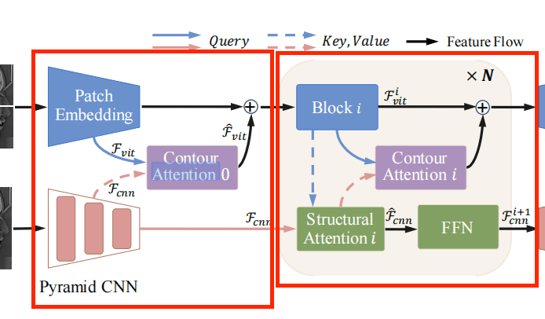

我画矩形框框住的2个为什么要分开


**GPT：**

你框住的这两个部分**不是两个独立网络**，而是同一条 pipeline 里的两个阶段：

```text
左边框：特征准备 + 初始对齐
右边框：正式的多轮 Joint Attention 交互
```

一句话先说清楚：

> **左边是把原始图像变成两类初始特征，并先做一次 contour 分支的初始化；右边是已经进入 JAM 后，反复进行 contour features 和 CNN features 的双向交互。**

---

# 1. 左边框：初始化阶段

你左边框住的是：

```text
Patch Embedding
Pyramid CNN
Contour Attention 0
```

它的作用是：**先准备两类特征**。

---

## 1.1 Patch Embedding 产生 Fvit

上方输入图像被切成 patches，然后经过 Patch Embedding，得到：

```text
Fvit
```

也就是 ViT 分支的初始特征。

这个特征更偏：

```text
全局结构
patch 间关系
contour structural information
```

但此时它还只是初始 patch token，还没有经过后面多轮结构交互。

---

## 1.2 Pyramid CNN 产生 Fcnn

下方原图经过 Pyramid CNN，得到：

```text
Fcnn
```

也就是 CNN 分支的图像上下文特征。

它更偏：

```text
局部边缘
灰度纹理
骨骼细节
多尺度图像上下文
```

---

## 1.3 Contour Attention 0 是第一次“预融合”

左边还有一个：

```text
Contour Attention 0
```

它的作用是：

> **在正式进入 JAM 之前，先让初始 contour feature 从 CNN feature 里吸收一些图像上下文。**

也就是：

```text
Fvit 作为 Query
Fcnn 作为 Key / Value
```

直观理解：

```text
ViT 分支刚开始只有 patch-level 表示，
还不够知道图像里哪些地方和 contour 有关；
所以先从 CNN 提取的图像特征里借一些局部证据。
```

所以左边框的本质是：

> **初始化 Fvit 和 Fcnn，并让 Fvit 先获得一点 image context。**

---

# 2. 右边框：正式 JAM 交互阶段

你右边框住的是论文真正的：

```text
Joint Attention Module
```

也就是图里的浅色阴影区域，标了：

```text
× N
```

说明它要重复 N 次。

它里面包括：

```text
Block i
Contour Attention i
Structural Attention i
FFN
```

这个阶段不是简单准备特征，而是正式做**多轮双向交互**。

---

## 2.1 Block i：更新 contour feature

```text
Block i
```

可以理解成 ViT/Transformer block 的第 i 层。

它先处理上方 contour branch 的特征：

```text
Fvit → Fvit^i
```

也就是让 contour features 进一步变强，包含更高层的结构信息。

---

## 2.2 Contour Attention i：contour 吸收 CNN 信息

然后是：

```text
Contour Attention i
```

它和左边的 Contour Attention 0 很像，但它发生在第 i 轮交互中。

作用是：

```text
contour features ← CNN contextual features
```

也就是：

> contour 分支继续从 CNN 图像上下文中吸收有用信息。

直观说：

```text
我现在已经有一版 contour 表示了，
但我还要看 CNN 里的局部图像证据，
来更新我的 contour feature。
```

---

## 2.3 Structural Attention i：CNN 吸收 contour 信息

这是右边框和左边框最大的区别。

右边有：

```text
Structural Attention i
```

它做的是反方向：

```text
CNN contextual features ← contour structural features
```

也就是：

> 让 CNN 特征被 contour 结构先验增强。

直观理解：

```text
CNN 原本只看灰度、边缘、纹理；
现在 contour feature 告诉它：
哪些区域属于下颌轮廓，
哪些点和轮廓结构相关，
从而让 landmark 特征更有结构约束。
```

这一步左边没有。

---

## 2.4 FFN：进一步加工融合后的 CNN 特征

最后是：

```text
FFN
```

全称：

```text
Feed-Forward Network
```

中文是前馈网络。

它对 Structural Attention 后的 CNN features 再做一次非线性变换，输出：

```text
Fcnn^{i+1}
```

也就是下一轮要用的 CNN features。

---

# 3. 为什么要把这两个部分分开？

核心原因有三个。

---

## 原因 1：左边是“特征准备”，右边是“特征交互”

左边做的是：

```text
原始图像 → 初始 Fvit
原始图像 → 初始 Fcnn
Fvit 先吸收一点 Fcnn
```

右边做的是：

```text
Fvit 和 Fcnn 多轮互相更新
```

所以它们处在不同阶段。

你可以理解为：

```text
左边：先把材料准备好
右边：正式开始反复加工
```

---

## 原因 2：左边只有单向初始化，右边是双向交互

左边主要是：

```text
Fvit ← Fcnn
```

也就是 contour branch 从 CNN branch 里拿信息。

右边是：

```text
Fvit ← Fcnn
Fcnn ← Fvit
```

也就是 contour 和 CNN 双向交换信息。

这就是为什么右边才是真正的 **Joint Attention Module**。

---

## 原因 3：右边要重复 N 次，左边只做一次

图里右边写了：

```text
× N
```

说明：

```text
Block i + Contour Attention i + Structural Attention i + FFN
```

这个结构会重复多轮。

而左边的：

```text
Patch Embedding + Pyramid CNN + Contour Attention 0
```

只是在进入循环之前做一次初始化。

所以图上把它们分开画，是为了表达：

```text
左边：initialization
右边：iterative refinement
```

中文就是：

```text
左边：初始化
右边：迭代优化 / 反复融合
```

---

# 4. 为什么不一开始就做 Structural Attention？

你可能会问：

> 既然右边有 Structural Attention，为什么左边一开始没有？

因为刚开始的 Fvit 只是 patch embedding 后的初始特征，contour structural information 还不成熟。

如果一开始就让 CNN 去依赖这个很粗糙的 contour feature，可能不稳定。

所以作者先做：

```text
Contour Attention 0
```

让 ViT/contour branch 先从 CNN 中吸收图像证据，得到更可靠的 contour representation。

然后再进入右边的正式 JAM：

```text
Contour feature 更稳定后
↓
再反过来指导 CNN feature
```

这很合理。

---

# 5. 可以用一个生活类比理解

你可以把它想成老师带学生做题。

## 左边框：先拿资料

```text
Patch Embedding：把题目拆成小块
Pyramid CNN：提取题目中的局部线索
Contour Attention 0：先让“结构分支”看看图像线索
```

相当于：

> 学生先读题，先获得基本信息。

---

## 右边框：反复讨论推理

```text
Contour Attention：结构分支问图像分支要证据
Structural Attention：图像分支问结构分支要约束
FFN：整理讨论结果
重复 N 次
```

相当于：

> 两个学生一个擅长结构，一个擅长图像细节，反复交流，最后得到更稳的答案。

---

# 6. 你汇报时可以这样说

> 图中左侧部分主要是特征初始化阶段。输入图像一方面被切成 patches，通过 Patch Embedding 得到初始的 ViT contour features；另一方面通过 Pyramid CNN 得到 contextual features。随后，Contour Attention 0 让初始 contour features 从 CNN contextual features 中吸收图像上下文，形成进入 JAM 的初始结构表示。
>
> 右侧阴影区域才是正式的 Joint Attention Module。它以 block 为单位重复 N 次，每一轮先通过 Transformer block 更新 contour features，再通过 Contour Attention 让 contour branch 吸收 CNN context，随后通过 Structural Attention 将 contour structural priors 注入 CNN features，最后通过 FFN 输出下一轮特征。
>
> 因此，这两个部分分开是因为它们功能不同：左边是 initialization，右边是 iterative contour-context interaction。左边主要完成初始特征构建和单向预对齐，右边完成多轮双向联合注意力融合。

---

# 7. 最短版记忆

你就记这句：

```text
左边框 = 初始化：
生成 Fvit 和 Fcnn，并用 Contour Attention 0 先让 Fvit 吸收 CNN 信息。

右边框 = 正式 JAM：
反复 N 次做 Contour Attention + Structural Attention，让 Fvit 和 Fcnn 双向交互。
```

更短：

> **左边是“先对齐”，右边是“反复融合”。**

---

<a id="turn-021"></a>

## 对话 021

**我：**

现在生成图2的详细汇报稿

**GPT：**

下面是**图 2 的详细汇报稿**，你可以直接放到 PPT 讲稿里使用。
这段的目标是：把 **CJL 整体框架、CAM、JAM、DRM、两个 decoder、loss 关系** 全部讲清楚。

---

# 图 2 汇报稿：CJL 方法整体框架

这一页展示的是本文提出的整体方法框架，也就是 **Contour-aware Joint Learning，简称 CJL**。
图中主要包括三部分：上方的 **Contour-aware Module，CAM**，下方的 **Pyramid CNN contextual branch**，以及中间浅色区域的 **Joint Attention Module，JAM**。最右侧的 `Lreg` 则对应 **Direction-sensitive Regression Module，DRM**。论文图注中也说明，上方蓝色分支对应 CAM，阴影区域表示 JAM，Pyramid CNN 用于编码 contextual features，Landmark Decoder 用于生成 landmark heatmaps。fileciteturn0file0

---

## 1. 先讲整体输入输出

首先，从最左侧开始看，模型的输入是一张 **cephalometric X-ray image**，也就是头颅侧位 X 光片。

这张图像会被送入两条不同的分支：

```text
上方分支：patch-based ViT branch
下方分支：Pyramid CNN branch
```

上方分支主要用于学习 **contour structural features**，也就是轮廓结构特征；
下方分支主要用于学习 **contextual features**，也就是图像上下文特征。

最终，模型会有两个输出：

```text
Contour Decoder 输出 contour heatmap；
Landmark Decoder 输出 landmark heatmaps。
```

其中 landmark heatmaps 的峰值位置就是最终预测的 landmark 坐标。

所以整张图的主线可以概括为：

> 输入头影图像后，模型一方面学习稳定的 anatomical contour prior，另一方面提取图像上下文特征，然后通过 Joint Attention Module 融合两类特征，最后预测 landmark heatmaps，并利用 contour geometry 进行方向敏感回归约束。

---

## 2. 上方蓝色分支：Contour-aware Module

接下来先看上方蓝色分支，也就是 **Contour-aware Module，CAM**。

图像首先被划分成很多小块，也就是图中的 **Patches**。论文中使用的是不重叠的 `16 × 16 patches`。每个 patch 会经过 **Patch Embedding**，被转换成一个向量表示，也就是 Transformer 可以处理的 token。

这里的 **Patch Embedding** 可以理解为：

> 把二维图像块转换成一维 token feature，使图像可以输入到 Vision Transformer 中。

经过 Patch Embedding 后，得到的特征记为：

```text
Fvit
```

这里的 `Fvit` 表示 ViT 分支提取到的特征。由于 ViT 的 self-attention 更擅长建模长距离关系，因此它更适合捕捉 contour 这种连续解剖结构中的全局拓扑关系。

这条上方分支的作用不是直接做 landmark detection，而是帮助模型学习：

```text
mandibular contour，下颌轮廓；
maxillary contour，上颌轮廓；
soft tissue contour，软组织轮廓；
以及 landmark 和 contour 之间的结构关系。
```

因此，上方分支可以理解为本文引入 anatomical contour prior 的主要路径。

---

## 3. 下方红色分支：Pyramid CNN

再看下方分支。原始图像会被送入 **Pyramid CNN**。

这里的 **Pyramid CNN** 指的是多尺度卷积特征提取网络。它会从不同尺度上提取图像特征，例如：

```text
局部边缘；
灰度纹理；
骨骼边界；
牙齿区域；
面部软组织轮廓；
多尺度上下文信息。
```

这部分输出的特征记为：

```text
Fcnn
```

`Fcnn` 是 **contextual features**，也就是上下文特征。
它对于精细 landmark 定位非常重要，因为 landmark detection 仍然需要局部图像证据。

但是，CNN 特征也有一个问题：
它往往更依赖 image appearance，比如亮度、对比度、纹理和边缘清晰度。这些因素在不同设备、不同分辨率、不同成像参数下会变化，因此容易受到 domain gap 的影响。

所以本文不是只使用 Pyramid CNN，而是进一步把 CNN 特征和 contour 结构特征融合起来。

---

## 4. 左侧的 Contour Attention 0：初始对齐

在进入中间的 JAM 之前，图中还有一个 **Contour Attention 0**。

这个模块可以理解为一次初始的 contour-context 对齐。

它的输入是：

```text
Fvit：来自 Patch Embedding / ViT branch 的 contour-related features；
Fcnn：来自 Pyramid CNN 的 contextual features。
```

在 **Contour Attention 0** 中，`Fvit` 作为 **Query**，`Fcnn` 作为 **Key** 和 **Value**。

也就是说，contour 分支会主动去查询 CNN 分支中的图像上下文信息：

```text
contour branch 问：
CNN 特征里哪些局部图像证据有助于我理解 contour？
```

这样做的原因是：
刚经过 Patch Embedding 得到的 `Fvit` 还只是初始 patch-level 表示，它还没有充分结合图像局部证据。因此，Contour Attention 0 先让 contour branch 从 CNN branch 中吸收一些 appearance/context 信息，使后续进入 JAM 的 contour features 更稳定。

这一部分可以概括为：

> 左侧主要是初始化阶段：生成 `Fvit` 和 `Fcnn`，并通过 Contour Attention 0 对 contour features 做一次初始增强。

---

## 5. 图中箭头：Query、Key/Value 和 Feature Flow

图上方给出了三种箭头含义：

```text
蓝色实线箭头：Query
蓝色/红色虚线箭头：Key, Value
黑色箭头：Feature Flow
```

这里的 Query、Key、Value 是 attention 机制里的三个基本概念。

可以简单解释为：

```text
Query：当前特征想查询什么；
Key：被查询特征的索引；
Value：真正被取出来并融合的信息。
```

在这张图里，attention 的目的就是让两类特征互相交流：

```text
contour features 从 CNN features 中吸收图像证据；
CNN features 从 contour features 中吸收结构先验。
```

---

## 6. 中间阴影区域：Joint Attention Module

接下来进入图中最核心的部分，也就是浅色阴影区域：

```text
Joint Attention Module，JAM
```

图中标了 `×N`，表示这个模块会重复执行 N 轮。
JAM 的作用是让 `Fvit` 和 `Fcnn` 进行多轮双向交互。

这一部分包括四个核心组件：

```text
Block i
Contour Attention i
Structural Attention i
FFN
```

---

## 7. Block i：更新 contour feature

首先是上方蓝色的 **Block i**。

它可以理解为 ViT / Transformer 的第 i 个 block，用于继续处理 contour branch 的特征。

经过 Block i 后，得到更新后的：

```text
Fvit^i
```

也就是第 i 轮的 contour structural features。

这里的目的在于进一步提取 contour 相关的结构信息，例如不同 patch 之间的长距离关系、解剖轮廓的整体形状，以及 contour 与 landmark 的空间关系。

---

## 8. Contour Attention i：contour features 吸收 CNN context

接下来是紫色的 **Contour Attention i**。

它和左侧的 Contour Attention 0 类似，也是用 contour features 作为 Query，用 CNN contextual features 作为 Key 和 Value。

它的作用是：

```text
Fvit ← Fcnn
```

也就是说，contour branch 从 CNN branch 中吸收图像上下文。

可以这样理解：

> contour features 负责表达结构，但它仍然需要结合原始影像中的局部证据，比如骨边缘、牙齿区域、软组织边界等。因此，Contour Attention 让 contour branch 在每一轮中都能重新关注 CNN 提供的图像证据。

论文公式中对应的是：

```text
F̂vit^i = Fvit^i + γ^i Attention(norm(Fvit^i), norm(Fcnn^i))
```

这个公式表示：
原始 contour feature 加上从 CNN feature 中通过 attention 提取的信息，得到更新后的 contour feature。

其中 `+` 表示 residual connection，残差连接，用来保留原始 contour feature；
`norm` 是 LayerNorm，用于稳定特征分布；
`γ` 是缩放系数，用来控制 attention 更新信息的强度。

---

## 9. Structural Attention i：CNN features 吸收 contour structure

然后是绿色的 **Structural Attention i**。

这是 JAM 中非常关键的一步，因为它是反方向的信息传递。

在 Structural Attention 中，CNN contextual features 作为 Query，更新后的 contour features 作为 Key 和 Value。

它的作用是：

```text
Fcnn ← Fvit
```

也就是说，CNN branch 会从 contour branch 中吸收结构先验。

直观上讲：

> CNN features 原本主要包含局部 image appearance，比如灰度、纹理和边缘；而 contour features 包含更稳定的 anatomical structure。Structural Attention 的作用就是把 contour prior 注入到 landmark-related CNN features 中，使后续 landmark localization 不再只是 appearance-driven，而是 structure-guided。

论文公式中对应的是：

```text
F̂cnn^i = Fcnn^i + Attention(norm(Fcnn^i), norm(Fvit^{i+1}))
```

这个公式表示：
CNN feature 在保留自身图像上下文信息的基础上，通过 attention 融入 contour structural information。

---

## 10. FFN：输出下一轮 contextual features

Structural Attention 后面接着一个：

```text
FFN
```

FFN 的全称是 **Feed-Forward Network**，中文是前馈网络。

它的作用是对 attention 融合后的 CNN features 进行进一步的非线性变换，增强特征表达能力，并输出下一轮的：

```text
Fcnn^{i+1}
```

也就是说：

```text
Structural Attention 输出结构增强后的 CNN features
↓
FFN 进一步加工
↓
得到下一轮 JAM 使用的 Fcnn^{i+1}
```

---

## 11. 为什么 JAM 要重复 N 次？

图中写了 `×N`，说明 JAM 不是只做一次 attention，而是重复多轮。

这是因为 contour features 和 CNN features 的语义不同：

```text
Fvit 更偏结构和全局拓扑；
Fcnn 更偏局部图像上下文。
```

它们不是一次交互就能完全对齐的。
通过多轮 attention，模型可以逐步完成：

```text
第一次：粗略融合 contour 和 context；
第二次：进一步对齐结构和图像证据；
第三次：细化 landmark-related features。
```

论文实现中提到，为了节省时间和显存，每 4 个 embedding layers 进行一次 joint learning interaction，因此 JAM 运行 M=3 次。fileciteturn0file0

所以可以说：

> JAM 通过多轮迭代，使 contour structural features 和 CNN contextual features 逐步对齐和增强。

---

## 12. 右侧 Contour Decoder：预测 contour heatmap

JAM 后，上方分支进入：

```text
Contour Decoder
```

Contour Decoder 的作用是输出：

```text
predicted contour heatmap
```

这一步和 CAM 的 contour prior 直接相关。

训练时，真实 contour heatmap 是由 GT landmarks 生成的：

```text
GT landmarks
↓
cubic spline interpolation
↓
anatomical contours
↓
distance transform + Gaussian smoothing
↓
GT contour heatmaps
```

然后用 `Lmse` 监督 predicted contour heatmap 和 GT contour heatmap 的差异。

这里要特别注意：
虽然 contour 是先验知识，但测试阶段没有 GT landmarks，也就没有 GT contour。所以模型必须通过 Contour Decoder 学会从图像中预测 contour structure。

因此，Contour Decoder 的作用是：

> 让模型在训练时通过 contour heatmap supervision 学习解剖轮廓结构，在测试时能够自行产生 contour-related structural representation。

---

## 13. 右侧 Landmark Decoder：预测 landmark heatmaps

下方分支进入：

```text
Landmark Decoder
```

它输出：

```text
Landmark Heatmaps
```

landmark heatmap 是每个 landmark 的概率响应图。
如果有 19 个 landmarks，那么模型会输出 19 张 heatmaps。每张 heatmap 的峰值位置就是对应 landmark 的预测坐标。

Landmark Decoder 使用的是经过 JAM 融合后的特征。
也就是说，它不是只用 CNN 的 appearance features 来预测 landmark，而是使用了已经被 contour prior 增强过的 features。

所以这一步可以理解为：

> Landmark Decoder 根据 contour-context fused features 生成 landmark heatmaps，从而完成最终 landmark localization。

---

## 14. 最右侧 Lreg：Direction-sensitive Regression Module

最后看图最右侧的：

```text
Lreg
```

它表示 **Direction-sensitive Regression Module，DRM** 中的回归损失。

DRM 会利用 contour heatmap 中的几何信息，计算 contour 的：

```text
tangent direction，切线方向；
normal direction，法线方向。
```

然后把 landmark prediction 和 ground truth 之间的 offset 投影到这两个方向上，得到：

```text
∆t：切线方向误差；
∆n：法线方向误差。
```

接着统计两个方向的 error energy：

```text
Et：tangent direction error energy；
En：normal direction error energy。
```

最后构造 `Lreg`，使模型不仅关注预测点离真实点多远，还关注这个偏差是沿 contour 方向，还是垂直 contour 方向。

这一步的意义是：

> 将 contour geometry 引入坐标回归，使 landmark localization 更符合 anatomical plausibility，也就是解剖合理性。

---

# 图 2 完整汇报稿：可直接照读版

下面这段可以直接作为你的正式汇报稿：

> Fig.2 展示了本文提出的 CJL 框架，也就是 Contour-aware Joint Learning。整个模型主要由三部分组成：上方蓝色分支是 Contour-aware Module，简称 CAM；下方是 Pyramid CNN，用于提取 contextual features；中间浅色阴影区域是 Joint Attention Module，简称 JAM；最右侧的 `Lreg` 对应 Direction-sensitive Regression Module，也就是 DRM。
>
> 首先，输入是一张 cephalometric X-ray image。模型将同一张图像送入两条分支。上方分支先把图像划分为 patches，并通过 Patch Embedding 将这些 patches 转换成 token features，得到 `Fvit`。这一路主要用于学习 contour structural features，也就是与解剖轮廓相关的全局结构特征。由于 contour 是连续的解剖结构，包含较强的长距离依赖关系，因此作者使用 ViT 分支来建模这种全局结构信息。
>
> 下方分支则将原始图像输入 Pyramid CNN，得到 `Fcnn`。这一路主要提取 multi-scale contextual features，包括局部边缘、灰度纹理、骨骼结构和牙齿区域等图像上下文信息。这些特征对精细 landmark localization 很重要，但也容易受到不同设备、分辨率和对比度造成的 domain gap 影响。
>
> 在进入正式的 Joint Attention Module 之前，模型首先通过 Contour Attention 0 对两类特征进行初始对齐。在这个过程中，`Fvit` 作为 Query，`Fcnn` 作为 Key 和 Value，使初始 contour features 能够从 CNN contextual features 中吸收图像证据。这样做可以使 contour branch 在进入后续交互之前，已经具备一定的 image context awareness。
>
> 接下来进入中间的 JAM 模块。图中 `×N` 表示这个交互过程会重复 N 轮。每一轮中，首先通过 Transformer Block 更新 contour branch 的特征，得到第 i 轮的 `Fvit^i`。然后进行 Contour Attention i，即用 contour features 作为 Query，CNN contextual features 作为 Key 和 Value，使 contour features 进一步吸收局部图像上下文。
>
> 随后，模型进行 Structural Attention i。这个过程方向相反，是用 CNN features 作为 Query，用更新后的 contour features 作为 Key 和 Value。它的作用是将 contour structural priors 注入到 CNN contextual features 中，使 landmark-related features 不再只依赖 image appearance，而是受到 anatomical contour structure 的引导。最后通过 FFN，也就是 Feed-Forward Network，对融合后的特征进行进一步非线性变换，输出下一轮的 `Fcnn^{i+1}`。
>
> 因此，JAM 的核心是双向交互：Contour Attention 让 contour features 感知图像上下文，Structural Attention 让 image features 感知解剖结构。通过多轮迭代，模型能够逐步对齐 contour structural features 和 CNN contextual features，形成更加稳定的 contour-landmark joint representation。
>
> 在输出端，上方的 Contour Decoder 根据 contour branch 的特征预测 contour heatmap。训练时，GT contour heatmap 是由 ground-truth landmarks 经过 cubic spline interpolation、distance transform 和 Gaussian smoothing 得到的，因此可以用 `Lmse` 对 predicted contour heatmap 进行监督。需要注意的是，contour 虽然是先验知识，但测试阶段没有 GT landmarks，也没有 GT contour，所以模型必须学会自己从图像中预测 contour structure。
>
> 下方的 Landmark Decoder 则根据经过 JAM 融合后的 features 输出 landmark heatmaps。每个 landmark 对应一张 heatmap，heatmap 的峰值位置就是最终的 landmark 预测坐标。由于这些 features 已经融合了 contour prior，因此 landmark detection 不再是单纯 appearance-driven，而是 structure-guided。
>
> 最后，右侧的 `Lreg` 表示 Direction-sensitive Regression Module。它利用 contour heatmap 计算 contour 的 tangent direction 和 normal direction，然后将 landmark prediction error 投影到这两个方向上，分别建模切线方向误差和法线方向误差。这样模型在优化坐标时不仅关注预测点离真实点有多远，还关注误差相对于 contour geometry 的方向，从而提升预测的解剖合理性和跨域鲁棒性。
>
> 总体来说，Fig.2 的核心思想是：CAM 学习 contour prior，Pyramid CNN 提取 image context，JAM 融合 contour features 和 contextual features，Contour Decoder 预测轮廓，Landmark Decoder 预测关键点，DRM 则利用 contour 的方向几何约束最终回归。通过这种设计，模型可以减少对不稳定 image appearance 的依赖，更多利用 domain-invariant anatomical structure，从而提升 unseen target domains 上的 landmark localization performance。

---

# 老师追问时的简短回答

## 1. 为什么图像要分成 Patches 和 Image 两路？

因为上方 ViT branch 需要 patch tokens 来建模全局 contour structure；下方 Pyramid CNN 更擅长提取局部和多尺度 contextual features。两路信息互补。

## 2. 左边的 Contour Attention 0 和右边的 Contour Attention i 有什么区别？

Contour Attention 0 是进入 JAM 前的初始对齐，只做一次；Contour Attention i 是 JAM 内部每一轮的交互，会重复 N 次。前者是 initialization，后者是 iterative refinement。

## 3. Contour Attention 和 Structural Attention 有什么区别？

Contour Attention 是 `Fvit ← Fcnn`，让 contour features 吸收图像上下文；Structural Attention 是 `Fcnn ← Fvit`，让 CNN features 融入 contour 结构先验。

## 4. 为什么还要 Contour Decoder 预测 contour？

因为训练时可以由 GT landmarks 构造 GT contour heatmap，但测试时没有 GT contour。Contour Decoder 让模型学会从图像中预测 contour structure。

## 5. 图 2 里最核心的创新是什么？

核心是用 JAM 实现 contour structural features 和 CNN contextual features 的双向交互，并进一步用 DRM 将 contour geometry 引入 landmark regression。

---

<a id="turn-022"></a>

## 对话 022

**我：**

我汇报的是技术细节，也就是详细介绍架构和每一个模块。你觉得我先放图1说动机，然后再放图2讲整体架构，然后再依次对每个创新点进行介绍怎么样

**GPT：**

我觉得这个顺序**非常合理**，而且适合你这种“技术细节汇报”。但我建议你稍微调整一下节奏：**图 1 不要讲太久，图 2 要作为主线图反复回扣**。

最优结构可以这样安排：

```text
1. Fig.1：动机图
说明为什么需要 contour prior

2. Fig.2：整体架构图
先让听众知道 CJL 整体怎么跑

3. CAM：Contour-aware Module
讲 contour 怎么构造、heatmap 怎么生成、为什么要预测 contour

4. JAM：Joint Attention Module
讲 Fvit / Fcnn 怎么交互，Contour Attention 和 Structural Attention 区别

5. DRM：Direction-sensitive Regression Module
讲 tangent / normal、anisotropic uncertainty、Lreg

6. Loss Function
讲 Lh、Lmse、Lreg 三个 loss 如何对应点、线、方向

7. Experiments / Ablation
用 Table 1 说明跨域有效，用 Table 2 说明三个模块各自有贡献
```

这个顺序是最清晰的，因为它符合论文自己的逻辑：先指出 domain gap 问题，再提出 contour-guided 框架，然后分模块展开。论文 Fig.1 本身就是在对比 existing methods 和本文方法，Fig.2 则展示 CAM、JAM、DRM 的完整 pipeline。fileciteturn0file0

---

## 但你汇报时要注意一个关键点

你的汇报重点是**技术架构**，所以 Fig.1 只需要讲 2–3 分钟，不要陷进去。

Fig.1 的任务是回答：

> 为什么这篇论文要引入 contour？

你讲清楚三句话就够：

```text
现有方法依赖 landmark-based appearance features；
source domain 和 target domain 图像外观不同，feature distribution 发生偏移；
contour 是更稳定的 anatomical structure，所以作者用 contour prior 来提升 cross-domain robustness。
```

然后马上过渡到 Fig.2：

> 既然作者认为 contour 可以作为稳定先验，那么问题就变成：这个 contour prior 在网络里具体怎么用？Fig.2 就是本文的整体架构。

这个过渡非常自然。

---

## Fig.2 应该是你的“主图”

你后面讲 CAM、JAM、DRM 时，都要不断回到 Fig.2。

比如：

讲 CAM 时说：

> 我们先看 Fig.2 上方蓝色分支，也就是 Contour-aware Module。

讲 JAM 时说：

> 接下来进入中间浅色阴影区域，也就是 Joint Attention Module。

讲 DRM 时说：

> 最右侧的 Lreg 对应 Direction-sensitive Regression Module。

这样听众不会迷路。

---

## 我建议你的 PPT 页面顺序

### 第 1 页：任务背景

讲 cephalometric landmark detection 是什么，cross-domain 是什么。

### 第 2 页：Fig.1 动机图

标题可以写：

> Motivation: Appearance Gap vs. Contour Prior

讲清楚：左边是问题，右边是本文思路。

### 第 3 页：Fig.2 整体架构图

标题可以写：

> Overall Framework: Contour-aware Joint Learning

先整体讲一遍：

```text
Image → CAM / CNN → JAM → Contour Decoder + Landmark Decoder → DRM
```

### 第 4 页：CAM 细节

标题：

> Contour-aware Module: From Landmarks to Contour Heatmaps

重点讲：

```text
GT landmarks
→ cubic spline
→ anatomical contours
→ distance transform
→ Gaussian contour heatmap
→ contour decoder prediction
```

这里你一定要解释：
**训练时 GT contour 是监督信号，测试时模型要自己预测 contour。**

### 第 5 页：JAM 细节

标题：

> Joint Attention Module: Contour-Context Interaction

重点讲：

```text
Fvit = contour structural features
Fcnn = contextual features

Contour Attention: Fvit ← Fcnn
Structural Attention: Fcnn ← Fvit
```

核心句：

> Contour Attention makes contour features image-aware; Structural Attention makes image features structure-aware.

### 第 6 页：DRM 细节

标题：

> Direction-sensitive Regression: Tangent and Normal Errors

重点讲：

```text
contour heatmap → gradient
gradient → normal direction
rotate 90° → tangent direction
prediction offset → Δt + Δn
moving average → Et + En
Lreg
```

### 第 7 页：Loss 设计

标题：

> Training Objective: Point, Contour, and Direction Supervision

讲：

```text
Lh：landmark heatmap loss，点监督
Lmse：contour heatmap loss，线监督
Lreg：direction-sensitive regression loss，方向监督
```

总结成一句：

> 这篇论文的 loss 是从点到线，再到方向几何。

### 第 8 页：实验与消融

讲 Table 1 和 Table 2。

Table 1 说明整体比 SOTA 好。
Table 2 说明 CAM、JAM、DRM 每个模块都有用。

---

## 你现在这个思路可以这样优化

你原本说：

> 先放图1说动机，然后再放图2讲整体架构，然后再依次对每个创新点进行介绍。

我建议改成更准确的版本：

> 先用 Fig.1 说明现有 landmark-based 方法受 domain gap 影响，并引出 contour prior；再用 Fig.2 给出 CJL 整体 pipeline，让听众先建立全局结构；随后沿着 Fig.2 的数据流，依次展开 CAM、JAM 和 DRM 三个创新模块，最后用 loss 和消融实验把三个模块的作用闭环。

这个版本更像正式汇报逻辑。

---

## 你汇报技术细节时最重要的主线

你一定要围绕这条线讲：

```text
CAM：contour prior 从哪里来
JAM：contour prior 怎么进入特征学习
DRM：contour prior 怎么约束最终回归
```

这条线非常关键。

如果老师问“这篇论文到底创新在哪里”，你就回答：

> 它不是简单地把 contour 当作额外输入，而是在三个层面使用 contour：CAM 在监督层面构造并学习 contour heatmap，JAM 在特征层面融合 contour features 和 contextual features，DRM 在回归层面利用 contour 的 tangent 和 normal directions 约束 landmark error。

这就是技术汇报的核心。

---

<a id="turn-023"></a>

## 对话 023

**我：**


第1张图是样式，然后具体排版按照上传的第2张图。现在生成每页的稿子，只需要生成研究方法


**GPT：**

可以。下面我只生成**“研究方法”部分**的每页稿子，风格按你第 1 张图的蓝色学术模板，排版按第 2 张图：**左侧放图/流程，右侧放“方法分析”，下方或右下放“小结”**。

建议研究方法部分做 **6 页**，逻辑最清楚：

```text
研究方法总览 → CAM → Contour Heatmap → JAM → DRM → Loss & Training
```

---

# 第 1 页：研究方法｜整体框架

## 页面标题

**研究方法｜CJL 整体框架**

## 左侧图示内容

放论文 Fig.2 整体架构图，建议在图上用浅蓝色框标出三部分：

```text
CAM：Contour-aware Module
JAM：Joint Attention Module
DRM：Direction-sensitive Regression Module
```

## 右侧：方法分析

本文提出 **Contour-aware Joint Learning，CJL** 框架，用于跨域头影测量关键点检测。整体方法由三部分组成：首先，模型通过 **Contour-aware Module，CAM** 学习头影图像中的解剖轮廓结构；其次，通过 **Joint Attention Module，JAM** 将 contour structural features 与 CNN contextual features 进行交互融合；最后，利用 **Direction-sensitive Regression Module，DRM** 根据 contour 的切线方向和法线方向约束 landmark 回归。

该框架的核心思想是：不再只依赖 landmark 附近的局部图像外观特征，而是引入更稳定的 anatomical contour prior，使模型能够在不同设备、不同成像条件下保持较好的泛化能力。

## 小结

CJL 的技术主线是：
**CAM 学轮廓，JAM 融合特征，DRM 约束回归。**

## 汇报讲稿

这一页展示的是本文提出的整体方法框架，也就是 Contour-aware Joint Learning，简称 CJL。整个框架可以分为三个核心模块。第一个是 CAM，它负责引入 anatomical contour prior，使模型能够学习头影图像中相对稳定的解剖轮廓结构。第二个是 JAM，它负责将 contour structural features 和 CNN contextual features 通过 attention 机制进行双向交互。第三个是 DRM，它进一步利用 contour 的几何方向信息，对 landmark 回归误差进行方向敏感约束。整体来看，本文希望把传统的 appearance-driven landmark detection 转变为 structure-guided landmark localization。fileciteturn0file0

---

# 第 2 页：研究方法｜Contour-aware Module

## 页面标题

**研究方法｜轮廓感知模块 CAM**

## 左侧图示内容

放你刚生成的 CAM 教学图，或者自己画一个 4 步流程：

```text
GT Landmarks
↓
Cubic Spline Interpolation
↓
Anatomical Contours
↓
Contour Heatmaps
↓
ViT Encoder / Contour Features
```

## 右侧：方法分析

**CAM，Contour-aware Module** 的作用是将离散的 cephalometric landmarks 转换为连续的 anatomical contours。论文首先根据医学定义，将相关 landmarks 按照解剖结构进行分组，例如 mandibular contour、maxillary contour 和 soft tissue contour。随后使用 **cubic spline interpolation** 将这些离散点连接成连续平滑的解剖轮廓。

这种设计的意义在于：landmark 是离散点，容易受到局部图像外观影响；而 contour 是连续结构，能够表达更稳定的颅颌解剖拓扑关系。因此 CAM 的目标是让模型显式学习 contour prior，从而减少对 domain-specific appearance features 的依赖。

## 小结

CAM 解决的问题是：
**contour prior 从哪里来？**

答案是：
**由医学 landmark 通过三次样条插值得到连续解剖轮廓。**

## 汇报讲稿

首先介绍第一个模块 CAM，也就是 Contour-aware Module。传统 landmark detection 直接预测离散关键点，但这些点附近的局部图像特征容易受到设备、分辨率和对比度变化的影响。本文认为，多个相关 landmark 可以组成连续的 anatomical contour，而这种连续轮廓比单个点更能表达稳定的解剖结构。因此，作者根据医学定义，将 landmarks 分组，并使用 cubic spline interpolation 将离散点连接成连续轮廓。这样，模型不仅学习点的位置，还能学习点和解剖轮廓之间的结构关系。fileciteturn0file0

---

# 第 3 页：研究方法｜Contour Heatmap 构建

## 页面标题

**研究方法｜Contour Heatmap 构建**

## 左侧图示内容

左侧建议放一个放大的热图流程：

```text
Anatomical Contour
↓
Distance Transform
↓
Gaussian Heatmap
```

图中要标：

```text
near contour = high response
far from contour = low response
```

## 右侧：方法分析

得到 anatomical contour 后，论文进一步将 contour 转换为 **contour heatmap**。首先通过 **distance transform** 计算每个像素到 contour 的最近距离；然后使用 Gaussian function 将距离转换为热图响应。距离 contour 越近，响应越高；距离 contour 越远，响应越低。

这种 heatmap 表示方式将连续曲线转换为网络可以学习的 dense supervision。与 landmark heatmap 不同，landmark heatmap 是点状监督，而 contour heatmap 是线状监督，它可以帮助网络学习更完整的 anatomical structure。

## 小结

Contour heatmap 的作用是：
**把连续轮廓转化为像素级稠密监督。**

## 汇报讲稿

在得到 anatomical contour 后，作者并没有直接使用曲线本身，而是进一步将其转换成 contour heatmap。具体来说，先计算每个像素到 contour 的最近距离，也就是 distance transform。然后通过 Gaussian function 生成热图：越靠近 contour 的像素响应越高，越远离 contour 的像素响应越低。这样做的好处是，连续曲线可以被转换成网络更容易学习的 dense supervision。这里需要注意，contour heatmap 和 landmark heatmap 不同，landmark heatmap 是点状监督，而 contour heatmap 是线状结构监督。fileciteturn0file0

---

# 第 4 页：研究方法｜Joint Attention Module

## 页面标题

**研究方法｜联合注意力模块 JAM**

## 左侧图示内容

放 Fig.2 中间的 JAM 区域，或者画成：

```text
Fvit：Contour Structural Features
Fcnn：CNN Contextual Features

Contour Attention:
Fvit ← Fcnn

Structural Attention:
Fcnn ← Fvit
```

## 右侧：方法分析

**JAM，Joint Attention Module** 的作用是融合两类特征：一类是 ViT 分支提取的 **contour structural features**，另一类是 Pyramid CNN 提取的 **contextual features**。其中，contour features 更强调全局解剖结构，CNN features 更强调局部图像上下文。

JAM 不是简单 concat 两类特征，而是通过 attention 进行双向交互。**Contour Attention** 使用 contour features 作为 Query，CNN features 作为 Key 和 Value，使 contour branch 吸收图像上下文；**Structural Attention** 则反过来使用 CNN features 作为 Query，contour features 作为 Key 和 Value，将 contour prior 注入 landmark-related features。

## 小结

JAM 解决的问题是：
**contour prior 怎么融入 landmark 特征？**

核心是：
**Contour Attention 让轮廓特征感知图像，Structural Attention 让图像特征感知结构。**

## 汇报讲稿

第二个核心模块是 JAM，也就是 Joint Attention Module。CAM 已经引入了 contour prior，但如果这些 contour features 不能有效融合到 landmark detection 过程中，对最终定位的帮助是有限的。因此作者设计了 JAM，用于实现 contour structural features 和 CNN contextual features 的双向交互。具体来说，Contour Attention 让 contour features 从 CNN features 中吸收局部图像证据，而 Structural Attention 则将 contour structural priors 注入 CNN features。这样，最终用于 landmark detection 的特征就不再只是依赖 image appearance，而是同时受到 anatomical contour structure 的引导。fileciteturn0file0

---

# 第 5 页：研究方法｜Direction-sensitive Regression Module

## 页面标题

**研究方法｜方向敏感回归 DRM**

## 左侧图示内容

画一个 contour 上的 landmark：

```text
真实点 p*
预测点 p
误差向量 p - p*
```

然后把误差分解成：

```text
Δt：tangent direction error
Δn：normal direction error
```

旁边画：

```text
anisotropic uncertainty：椭圆形误差
isotropic uncertainty：圆形误差
```

## 右侧：方法分析

**DRM，Direction-sensitive Regression Module** 的核心思想是：对于位于 contour 上或 contour 附近的 landmark，其预测误差并不是各个方向均匀分布的。沿 contour 的 **tangential direction**，误差可能更大；而垂直 contour 的 **normal direction**，误差通常更小。这种方向相关的不确定性称为 **anisotropic uncertainty**。

因此，DRM 首先从 contour heatmap 中计算梯度，得到 normal direction，再将其旋转 90 度得到 tangent direction。随后将 landmark prediction offset 投影到这两个方向上，分别得到 tangent error 和 normal error，并构造 direction-sensitive regression loss。

## 小结

DRM 解决的问题是：
**landmark 回归误差应该如何结合 contour geometry？**

核心是：
**把误差拆成切线方向和法线方向分别建模。**

## 汇报讲稿

第三个模块是 DRM，也就是 Direction-sensitive Regression Module。前面的 CAM 和 JAM 主要是在特征层面引入 contour prior，而 DRM 进一步在回归层面利用 contour geometry。作者观察到，对于 contour-related landmarks，它们的预测误差往往具有各向异性，也就是说，沿 contour 的切线方向和垂直 contour 的法线方向，误差分布并不相同。因此，DRM 从 contour heatmap 中计算方向场，将 landmark 的预测误差投影到 tangent direction 和 normal direction 上，并分别进行约束。这样模型在优化坐标时，不仅考虑预测点离真实点有多远，还考虑这个误差相对于 contour 的方向是否合理。fileciteturn0file0

---

# 第 6 页：研究方法｜损失函数与训练目标

## 页面标题

**研究方法｜损失函数设计**

## 左侧图示内容

画成三个 loss 分支：

```text
Landmark Decoder → Landmark Heatmap → Lh
Contour Decoder → Contour Heatmap → Lmse
DRM → Direction-aware Offset → Lreg
```

最终合并：

```text
L = Lreg + λ1 Lh + λ2 Lmse
```

## 右侧：方法分析

本文的训练目标由三部分组成。第一部分是 **Lh**，即 landmark heatmap loss，用于监督 Landmark Decoder 输出的 landmark heatmaps。第二部分是 **Lmse**，即 contour heatmap loss，用于监督 Contour Decoder 输出的 contour heatmaps。第三部分是 **Lreg**，即 direction-sensitive regression loss，用于约束 landmark 坐标回归。

这三个 loss 分别对应三个层面：**Lh 是点级监督，Lmse 是轮廓级监督，Lreg 是方向几何监督**。最终损失函数为：

```text
L = Lreg + λ1 Lh + λ2 Lmse
```

其中论文设置：

```text
λ1 = 2.0
λ2 = 5.0
```

## 小结

损失函数设计可以概括为：
**点监督 + 线监督 + 方向监督。**

## 汇报讲稿

最后是本文的损失函数设计。整体 loss 由三部分组成。第一部分是 Lh，用于监督 landmark heatmap，也就是点级监督；第二部分是 Lmse，用于监督 contour heatmap，也就是轮廓级结构监督；第三部分是 Lreg，也就是 DRM 中的方向敏感回归损失，用于根据 contour 的 tangent 和 normal directions 约束 landmark 坐标误差。三者结合后，模型不仅要把 landmark 点预测准确，还要学到合理的 anatomical contour，并且让最终坐标回归符合 contour geometry。因此，这个 loss 设计可以概括为从点到线，再到方向几何的联合监督。fileciteturn0file0

---

# 研究方法部分的总过渡稿

你在这一部分开始前可以先说：

> 接下来进入研究方法部分。本文的核心不是简单提出一个新的 landmark detector，而是围绕 contour prior 构建了一个完整的 cross-domain landmark detection framework。为了讲清楚这个方法，我会先从整体架构出发，然后依次介绍三个关键模块：Contour-aware Module、Joint Attention Module 和 Direction-sensitive Regression Module，最后说明整体 loss 如何训练这三个部分。

---

# 研究方法部分结尾总结

最后一页讲完 loss 后，可以用这段收束：

> 总结来看，本文方法的关键在于从三个层面使用 contour prior。首先，CAM 在监督层面构造 contour heatmap，使模型能够学习 anatomical contour structure；其次，JAM 在特征层面融合 contour structural features 和 CNN contextual features；最后，DRM 在回归层面利用 contour 的 tangent 和 normal directions 对 landmark error 进行方向敏感约束。通过这种设计，模型可以减少对不稳定 image appearance 的依赖，更多利用跨域稳定的 anatomical structure，从而提升 unseen target domains 上的泛化能力。

---

<a id="turn-024"></a>

## 对话 024

**我：**

可以，现在开始生成前5页图片

**GPT：**

**tool：**

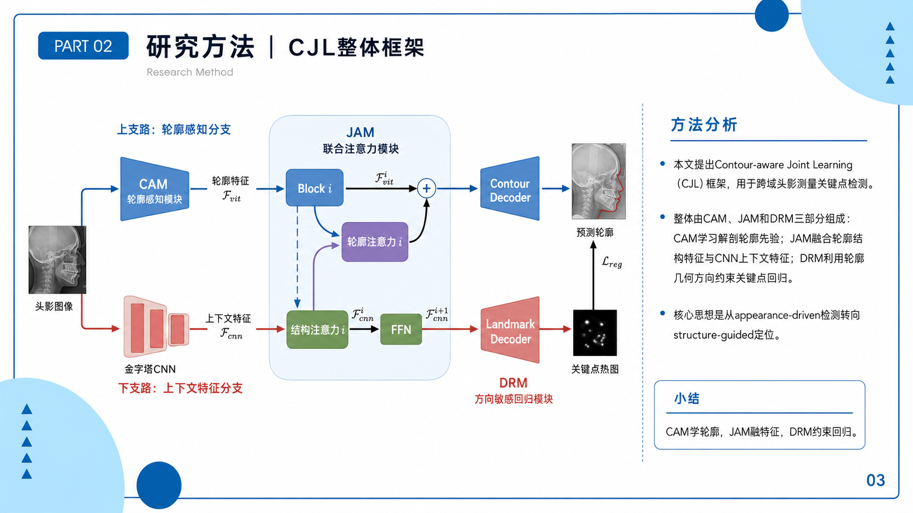

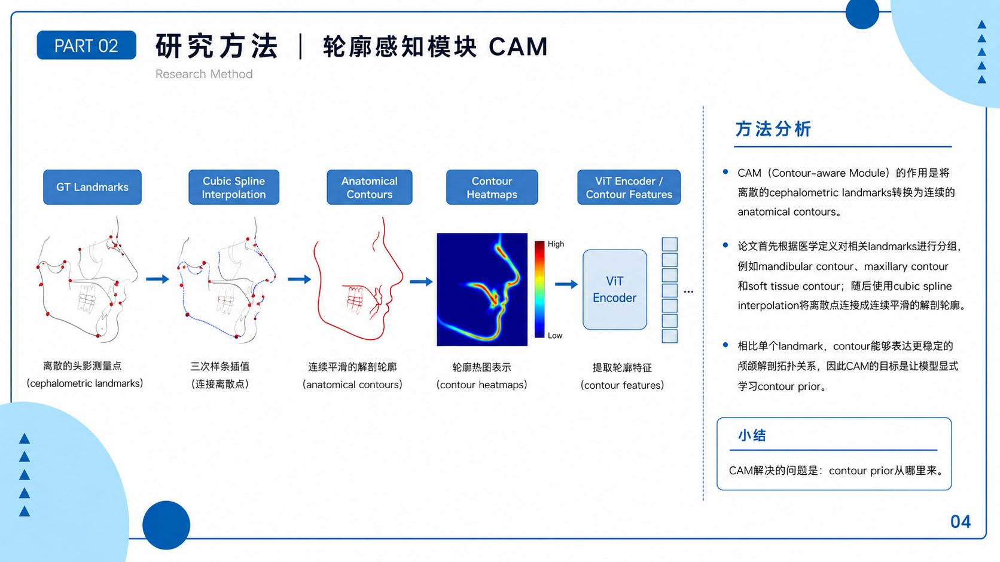

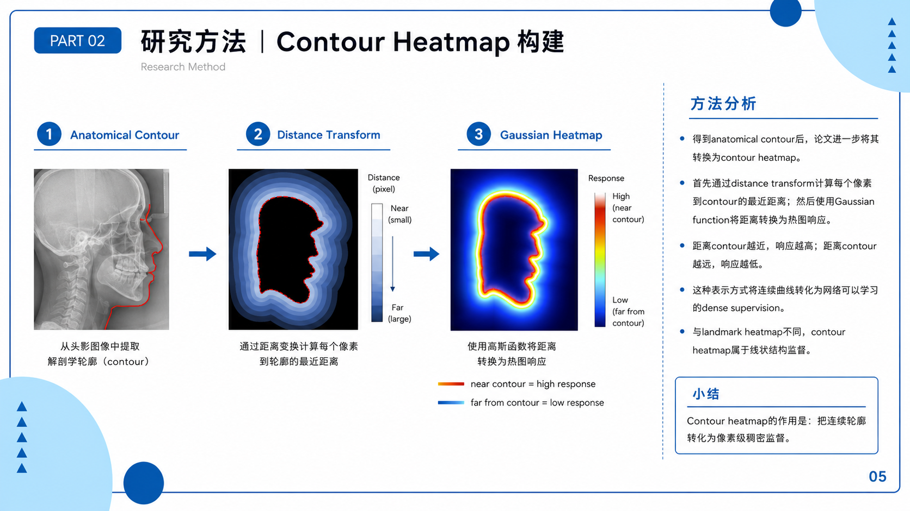

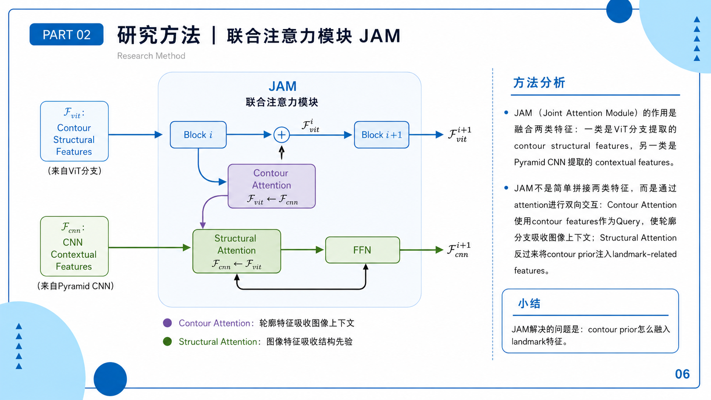

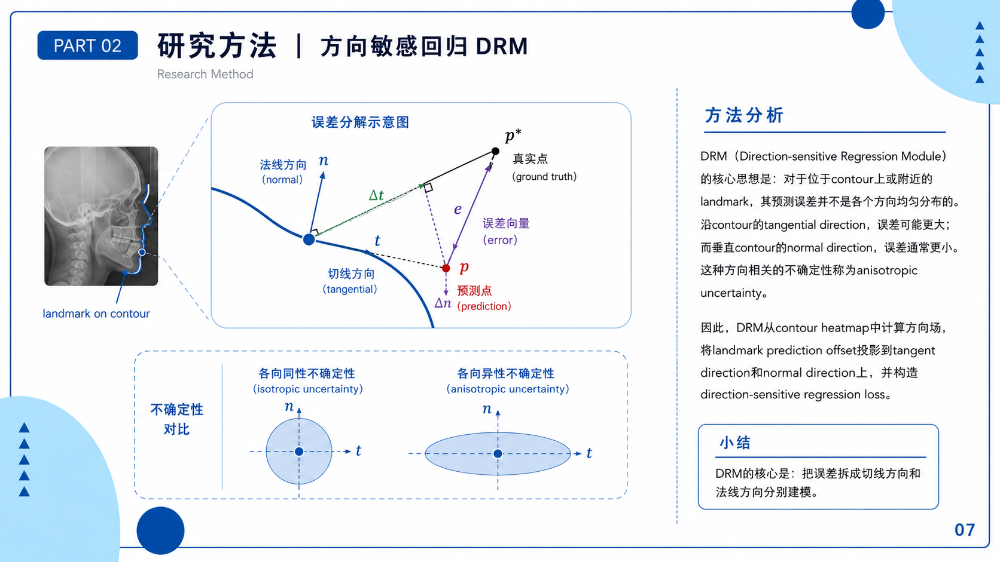

{"prompt":"Create a polished academic presentation slide image in Chinese, 16:9 widescreen. Use Image A as the primary style reference: clean white background, blue academic theme, thin blue border around the slide, dark-blue and light-blue geometric corner decorations, minimal and elegant. Use Image B as the layout reference: a clean research-analysis slide with a prominent visual/diagram area on the left-center and an explanatory text column on the right, plus a small summary area near the bottom right, and a page number at the bottom right. Use Image C as content reference for the architecture. This is slide 03 of the '研究方法' section.\n\nDesign the slide title area in Chinese with a small blue section tag 'PART 02' and the main title '研究方法｜CJL整体框架'. Add a subtle small English subtitle 'Research Method'.\n\nMain left content: redraw a clean simplified version of the overall CJL pipeline based on Image C, not a raw screenshot. Show the flow clearly: input cephalometric image -> upper contour-aware branch / lower Pyramid CNN branch -> Joint Attention Module -> Contour Decoder and Landmark Decoder -> DRM / Lreg. Use neat blue/gray blocks and arrows. Label the three core modules clearly: 'CAM', 'JAM', 'DRM'. Make it visually clear and presentation-friendly.\n\nRight column heading: '方法分析'. Under it, render concise, readable Chinese paragraphs/bullets explaining: '本文提出Contour-aware Joint Learning（CJL）框架，用于跨域头影测量关键点检测。整体由CAM、JAM和DRM三部分组成：CAM学习解剖轮廓先验；JAM融合轮廓结构特征与CNN上下文特征；DRM利用轮廓几何方向约束关键点回归。核心思想是从appearance-driven检测转向structure-guided定位。'\n\nBottom-right small summary box/section heading: '小结'. Content: 'CAM学轮廓，JAM融特征，DRM约束回归。'\n\nMake the slide look like a real thesis defense PPT page: high readability, clean typography, balanced spacing, no clutter, no extra decorative icons except minimal simple accents. Use Chinese text exactly as specified. Add page number '03' in blue at the bottom right.","reference_image_paths":["/mnt/data/ghostwriter_images/context/416d5bda-de60-5bad-a7ef-96264ec9320a.png","/mnt/data/ghostwriter_images/context/af064c9b-a7e8-5d1d-961e-b6606f5478bb.png","/mnt/data/ghostwriter_images/context/8a3eaf30-17f4-558f-ad29-76ed77fd0edd.png"],"aspect_ratio":"16:9"}

**tool：**


Model caption: A clean academic presentation slide with a white background and blue-themed infographic layout, like a research slide. Overall: a widescreen slide with a thin blue border and decorative blue shapes in the corners, containing a title area at the top, a large diagram on the left/middle showing a pipeline with modules, and explanatory text on the right in Chinese, plus a summary box and page number. **Top/overall header and style**: Upper-left has a rounded blue tag “PART 02” (white text, bold sans-serif) and to its right a large dark/black/very-dark-blue title “研究方法 | CJL整体框架” (Chinese, bold). Under it in smaller light gray text is “Research Method”. The slide uses a clean sans-serif font, blue accents, and a modern infographic look. A thin blue border line runs around the slide; in the top-right corner is a large light-blue circular/arc decorative shape with a solid blue circle near the top edge, and a vertical stack of small blue upward-pointing triangles near the right edge. At the bottom-left corner is a large light-blue semicircular/arc shape with a column of small blue triangles above it, plus a solid blue circle overlapping the bottom border near left; at the bottom-right are three horizontal light-blue bar-like lines (stacked like a menu icon) and the page number “03” in blue. **Main left/middle diagram (pipeline blocks and images)**: On the left side of the diagram are input images and labels. At upper-left is a small grayscale cephalometric/side skull radiograph-like image (profile X-ray of head/neck). Under it is Chinese text “头影图像”. From this image, a blue arrow points right into a blue trapezoid/box labeled “CAM” in large white letters, with smaller Chinese text beneath: “轮廓感知模块”. Above this top pipeline area is a blue title line “上支路：轮廓感知分支”. After CAM, a blue arrow leads to a label “轮廓特征” and below/near it “$F_{vit}$” (rendered as F with subscript vit). This arrow enters a larger pale-blue/rounded container area labeled at the top “JAM” and beneath it “联合注意力模块” (Joint Attention Module). Inside the JAM box are subcomponents: at top a blue rounded-rectangle “Block i”; to its right a black arrow leading out labeled “$F^{i}_{vit}$”. There is a circular “+” icon on the right edge where outputs are combined. Beneath/inside are attention modules: a purple rounded box “轮廓注意力 i” connected with arrows (blue/black style) to Block i and/or outputs; a green rounded box “结构注意力 i” below; and a green rounded box “FFN” to the right of that. A dashed blue line from Block i down to 结构注意力 i (indicating connection). Between 结构注意力 i and FFN is a black arrow and nearby label “$F^{i}_{cnn}$”. From FFN to the right is an output label “$F^{i+1}_{cnn}$” going toward the right side of JAM container. The JAM container output (via the + and line) continues right (blue arrow) to a blue trapezoid box labeled “Contour\nDecoder” (Contour Decoder in white/blue). To its right is a small cephalometric image with a red contour line drawn along the facial outline; beneath it the Chinese label “预测轮廓”. **Lower/parallel branch (context/CNN path)**: On the left lower side, from the same input cephalometric image, a red/pinkish arrow goes down to a set of stacked block-like shapes (CNN layers) in pink/red (a pyramid-like stack icon). Under it the text “金字塔CNN” and below that in red “下支路：上下文特征分支”. From this pyramid CNN, a red arrow labeled “上下文特征” and below “$F_{cnn}$” goes right into the JAM area into the green “结构注意力 i” block (showing the contextual feature input). **Right-lower decoder and outputs (DRM path)**: From the FFN output (right side) a red arrow goes to a red/pink trapezoid box labeled “Landmark\nDecoder”. To the right of it is a “landmark heatmap” style image: a dark/black/gray blurred background with many bright white/gray spots (heatmap points), and beneath it the label “关键点热图”. From that heatmap area, a vertical arrow up/right leads to a small cephalometric image with red landmark dots (on the profile), and next to the arrow is the label “$L_{reg}$”. Nearby text to the right/beside that lower output is “DRM” in red, and below it “方向敏感回归模块”. **Right-side text explanation column**: On the right side, separated by a dotted vertical line (blue/dashed), a blue heading “方法分析” with a horizontal blue line beneath it. Under it are bullet points (blue bullets) with Chinese explanatory text: First bullet: “本文提出Contour-aware Joint Learning\n（CJL）框架，用于跨域头影测量关键点检测。” Second bullet: “整体由CAM、JAM和DRM三部分组成：\nCAM学习解剖轮廓先验；JAM融合轮廓结\n构特征与CNN上下文特征；DRM利用轮廓\n几何方向约束关键点回归。” Third bullet: “核心思想是从appearance-driven检测转向\nstructure-guided定位。” The bullets are in black/gray text with some English terms in the Chinese lines (“Contour-aware Joint Learning”, “appearance-driven”, “structure-guided”). **Bottom-right summary box**: Below the method analysis area is a rounded rectangle box with a blue header-like label “小结” and a thin blue line under it; inside/under it is the summary sentence “CAM学轮廓，JAM融特征，DRM约束回归。” in black/gray. **Other decorative elements and numbering**: Overall color palette: blues (dark blue, light blue), purples, greens, reds/pinks for certain modules and arrows, grayscale radiographs, clean diagram arrows and rounded boxes. Bottom right shows page number “03” in blue. The layout resembles a professional academic slide with icons and geometric accents.<|has_watermark|><|has_borders|>

**tool：**

Generated images from the last `image_gen.text2im` call were saved at:
- /mnt/data/ghostwriter_images/generated/a_clean_academic_presentation_slide_with_a_white_b_1.png (wxh = 1672 x 941, exact aspect ratio 1672:941, close to aspect ratio 16:9)

You can visually inspect the generated image directly in the tool result above. Only reopen the saved path if you need programmatic processing or want to pass the image into another tool call.

{"batch_requests":[{"prompt":"Create slide 04 of the same Chinese academic thesis-defense PPT series. Image A is the anchor slide and defines the final visual style, typography, border, corner decorations, spacing, and color system; keep the same consistent template and overall look. Image B is an additional style reference, and Image C is a layout reference showing the preferred composition of a large left visual plus right-side explanatory text. This slide must match Image A closely in style and layout consistency.\n\nSlide title area: keep the same top style with small blue tag 'PART 02', main title '研究方法｜轮廓感知模块 CAM', and small gray English subtitle 'Research Method'. Page number at bottom right: '04'.\n\nMain left content: create a clean academic process diagram explaining CAM. Show a simple left-to-right flow with labeled steps: 'GT Landmarks' -> 'Cubic Spline Interpolation' -> 'Anatomical Contours' -> 'Contour Heatmaps' -> 'ViT Encoder / Contour Features'. Use neat blue boxes/arrows and small illustrative visuals such as cephalometric landmark dots, a smooth red contour line, and a stylized heatmap. The diagram should be presentation-friendly, not cluttered, and easy to understand.\n\nRight column heading: '方法分析'. Add concise Chinese paragraph/bullets with readable line spacing: 'CAM（Contour-aware Module）的作用是将离散的cephalometric landmarks转换为连续的anatomical contours。论文首先根据医学定义对相关landmarks进行分组，例如mandibular contour、maxillary contour和soft tissue contour；随后使用cubic spline interpolation将离散点连接成连续平滑的解剖轮廓。相比单个landmark，contour能够表达更稳定的颅颌解剖拓扑关系，因此CAM的目标是让模型显式学习contour prior。'\n\nBottom-right summary box heading: '小结'. Content: 'CAM解决的问题是：contour prior从哪里来。'\n\nMake it look like a high-quality real PPT slide with no extra icons and no excessive text.","reference_image_paths":["/mnt/data/ghostwriter_images/generated/a_clean_academic_presentation_slide_with_a_white_b_1.png","/mnt/data/ghostwriter_images/context/416d5bda-de60-5bad-a7ef-96264ec9320a.png","/mnt/data/ghostwriter_images/context/af064c9b-a7e8-5d1d-961e-b6606f5478bb.png"],"referenced_image_ids":[],"aspect_ratio":"16:9"},{"prompt":"Create slide 05 of the same Chinese academic thesis-defense PPT series. Image A is the anchor slide and defines the exact template style to match; Image B is an additional style reference; Image C is a layout reference. Maintain strong visual consistency with Image A: white background, blue academic theme, thin blue border, blue corner decorations, left large visual / right explanation layout, bottom-right summary box, and page number. This is slide 05.\n\nTitle area: 'PART 02' tag, main title '研究方法｜Contour Heatmap 构建', small subtitle 'Research Method'. Page number '05'.\n\nMain left content: create a clear three-step academic illustration for contour heatmap construction. Show three panels or a left-to-right process: 1) 'Anatomical Contour' with a red contour line on a cephalometric image, 2) 'Distance Transform' with a distance-band visualization around the contour, 3) 'Gaussian Heatmap' with a smooth heatmap where near-contour regions have high response and far regions have low response. Add small labels 'near contour = high response' and 'far from contour = low response' in neat English or Chinese annotations. Use clean blue headings and academic diagram style.\n\nRight column heading: '方法分析'. Render concise Chinese text: '得到anatomical contour后，论文进一步将其转换为contour heatmap。首先通过distance transform计算每个像素到contour的最近距离；然后使用Gaussian function将距离转换为热图响应。距离contour越近，响应越高；距离contour越远，响应越低。这种表示方式将连续曲线转化为网络可以学习的dense supervision。与landmark heatmap不同，contour heatmap属于线状结构监督。'\n\nBottom-right summary box heading: '小结'. Content: 'Contour heatmap的作用是：把连续轮廓转化为像素级稠密监督。'\n\nKeep the slide clean, readable, and presentation-ready.","reference_image_paths":["/mnt/data/ghostwriter_images/generated/a_clean_academic_presentation_slide_with_a_white_b_1.png","/mnt/data/ghostwriter_images/context/416d5bda-de60-5bad-a7ef-96264ec9320a.png","/mnt/data/ghostwriter_images/context/af064c9b-a7e8-5d1d-961e-b6606f5478bb.png"],"referenced_image_ids":[],"aspect_ratio":"16:9"},{"prompt":"Create slide 06 of the same Chinese academic thesis-defense PPT series. Image A is the anchor slide and defines the visual style to match closely; Image B is an additional style reference; Image C is a layout reference; Image D is a content reference for the JAM architecture region. Keep very strong consistency with the anchor style and template. This is slide 06.\n\nTitle area: 'PART 02' tag, main title '研究方法｜联合注意力模块 JAM', small subtitle 'Research Method'. Page number '06'.\n\nMain left content: create a clean simplified explanatory architecture diagram for JAM, informed by Image D but redrawn elegantly for a PPT. Show two feature streams: top 'Fvit：Contour Structural Features' and bottom 'Fcnn：CNN Contextual Features'. In the middle, show two key interaction blocks: 'Contour Attention' with arrow concept 'Fvit ← Fcnn', and 'Structural Attention' with arrow concept 'Fcnn ← Fvit'. Optionally show a small 'Block i' and 'FFN' to clarify the process. Use clean blue and green/purple accent blocks and clear arrows. Add tiny explanatory labels: 'Contour Attention：轮廓特征吸收图像上下文' and 'Structural Attention：图像特征吸收结构先验'.\n\nRight column heading: '方法分析'. Render concise Chinese explanation: 'JAM（Joint Attention Module）的作用是融合两类特征：一类是ViT分支提取的contour structural features，另一类是Pyramid CNN提取的contextual features。JAM不是简单拼接两类特征，而是通过attention进行双向交互：Contour Attention使用contour features作为Query，使轮廓分支吸收图像上下文；Structural Attention反过来将contour prior注入landmark-related features。'\n\nBottom-right summary box heading: '小结'. Content: 'JAM解决的问题是：contour prior怎么融入landmark特征。'\n\nKeep the page neat, legible, and suitable for an oral technical presentation.","reference_image_paths":["/mnt/data/ghostwriter_images/generated/a_clean_academic_presentation_slide_with_a_white_b_1.png","/mnt/data/ghostwriter_images/context/416d5bda-de60-5bad-a7ef-96264ec9320a.png","/mnt/data/ghostwriter_images/context/af064c9b-a7e8-5d1d-961e-b6606f5478bb.png","/mnt/data/ghostwriter_images/context/8a3eaf30-17f4-558f-ad29-76ed77fd0edd.png"],"referenced_image_ids":[],"aspect_ratio":"16:9"},{"prompt":"Create slide 07 of the same Chinese academic thesis-defense PPT series. Image A is the anchor slide and defines the visual style; Image B is an additional style reference; Image C is a layout reference. Match the anchor template very closely. This is slide 07.\n\nTitle area: 'PART 02' tag, main title '研究方法｜方向敏感回归 DRM', small subtitle 'Research Method'. Page number '07'.\n\nMain left content: create a clean conceptual illustration of DRM. Show a cephalometric contour with one landmark on the contour, a ground-truth point p* and a predicted point p, with the error vector between them. Clearly draw the tangent direction t and normal direction n at the contour point. Show the error decomposition into 'Δt' and 'Δn'. Also include a small comparison inset: 'isotropic uncertainty' as a circle and 'anisotropic uncertainty' as an ellipse elongated along the contour direction. Use blue academic styling and clear labels.\n\nRight column heading: '方法分析'. Render concise Chinese explanation: 'DRM（Direction-sensitive Regression Module）的核心思想是：对于位于contour上或附近的landmark，其预测误差并不是各个方向均匀分布的。沿contour的tangential direction，误差可能更大；而垂直contour的normal direction，误差通常更小。这种方向相关的不确定性称为anisotropic uncertainty。因此，DRM从contour heatmap中计算方向场，将landmark prediction offset投影到tangent direction和normal direction上，并构造direction-sensitive regression loss。'\n\nBottom-right summary box heading: '小结'. Content: 'DRM的核心是：把误差拆成切线方向和法线方向分别建模。'\n\nEnsure the slide is visually clear and presentation-ready.","reference_image_paths":["/mnt/data/ghostwriter_images/generated/a_clean_academic_presentation_slide_with_a_white_b_1.png","/mnt/data/ghostwriter_images/context/416d5bda-de60-5bad-a7ef-96264ec9320a.png","/mnt/data/ghostwriter_images/context/af064c9b-a7e8-5d1d-961e-b6606f5478bb.png"],"referenced_image_ids":[],"aspect_ratio":"16:9"}]}

**tool：**


Model caption: A clean academic presentation slide with a white background and blue-themed accents, looking like a PowerPoint/Keynote research slide. Overall: a wide landscape slide with a clean border and modern infographic layout. Top-left header area has a rounded blue label “PART 02” (white text inside a blue capsule), next to large bold Chinese title “研究方法 | 轮廓感知模块 CAM” in dark navy/black, with a smaller gray subtitle “Research Method” beneath/near it. The page is divided into a large left infographic section and a right text column with a vertical dotted divider line. Decorative elements: a thin blue rounded rectangular border around the slide; circular/semicircular blue shapes and small triangle motifs in the corners (a large light-blue circle/arc with small stacked dark blue triangles on the top right corner, and a similar light-blue semicircle/arc with stacked triangles on the bottom left; a solid dark-blue circle near the bottom edge). Bottom-right page number “04” in blue. LEFT / main diagram area: a horizontal pipeline/flow diagram across the middle-left to center with five stages. Each stage has a blue rounded-rectangle label above and an illustration beneath and explanatory Chinese text below, connected by right-pointing arrows between stages. Stage 1 on far left: a blue rounded label “GT Landmarks”. Under it a gray line-art lateral skull/cephalometric profile (teeth and jaw visible) with many small red dots marking landmarks on the outline and facial structures. Beneath that is Chinese text “离散的头影测量点” and in parentheses “(cephalometric landmarks)”. An arrow (blue) points right to Stage 2. Stage 2 label: “Cubic Spline\nInterpolation” (white text on blue rounded box). Under it a scatter of red dots along a similar profile with a dotted/curved blue spline-like line connecting/interpolating among points, suggesting interpolation; also pale outline. Beneath: Chinese text “三次样条插值” and smaller “(连接离散点)”. Arrow to Stage 3. Stage 3 label: “Anatomical\nContours”. Under it a clean profile outline in red (smooth contour lines of face, nose, jaw, teeth), simplified contour drawing. Beneath: Chinese text “连续平滑的解剖轮廓” and “(anatomical contours)”. Arrow to Stage 4. Stage 4 label: “Contour\nHeatmaps”. Under it a square/rectangular heatmap image with deep blue background and bright contour-like strokes in yellow/red/orange/cyan tracing the facial profile (nose, lips, chin/jaw) like a heatmap/activation visualization. To the right of that heatmap is a vertical color bar legend gradient from blue (low) to red (high) with labels “High” near the top and “Low” near the bottom. Beneath: Chinese “轮廓热图表示” and “(contour heatmaps)”. Arrow to Stage 5. Stage 5 label: “ViT Encoder /\nContour Features”. Under it a light-blue rounded-rectangle/block with “ViT\nEncoder” in blue text. To its right are several stacked vertical blue/white-ish rectangular token-like blocks (a column of small rounded rectangles) and a “…” indicating continuation. Beneath: Chinese “提取轮廓特征” and “(contour features)”. RIGHT column: at top a bold blue heading “方法分析” with a thin blue underline/line accent. Below are bullet points (blue bullet dots) with Chinese and English mixed text: “CAM（Contour-aware Module）的作用是将\n离散的cephalometric landmarks转换为连续的\nanatomical contours。” Next bullet: “论文首先根据医学定义对相关landmarks进行分组，\n例如mandibular contour、maxillary contour\n和soft tissue contour；随后使用cubic spline\ninterpolation将离散点连接成连续平滑的解剖轮廓。” Next bullet: “相比单个landmark，contour能够表达更稳定的\n颅颌解剖拓扑关系，因此CAM的目标是让模型显式\n学习contour prior。” Below, a boxed summary area: a blue outlined rounded rectangle with heading “小结” in blue and a horizontal line under it; inside text reads “CAM解决的问题是：contour prior从哪里来。” The entire right side is separated from the diagram by a vertical dotted blue line; the fonts are clean sans-serif, headings in bold blue, body text in dark gray/black. Top and bottom decorative shapes (blue circles and triangles) give a polished template look, with the page number “04” at bottom right in blue.<|has_watermark|><|has_borders|>

**tool：**


Model caption: A clean academic presentation slide / infographic. Overall scene: a white slide with blue border and rounded corners like a PowerPoint template, with diagrams and Chinese/English text. Layout: left/main area contains a block diagram of a “Joint Attention Module (JAM)”, right column contains analysis text and a summary box; decorative blue shapes and page number at bottom right. Top header: at the very top left a blue rounded rectangle badge reads “PART 02” (white text). Next to it large bold title in Chinese and English: “研究方法 | 联合注意力模块 JAM” (dark/black-blue font). Under it smaller gray text “Research Method”. Top right has decorative large blue circle and a light-blue quarter circle/arc region with a column of small blue triangle icons. Main diagram area (left/center) inside a pale rounded-rectangle panel with light blue background/outline; centered top title “JAM” in blue and underneath “联合注意力模块”. Left side inputs: at upper left a light-blue rounded/rect box containing “F_{vit}：” and below “Contour” “Structural” “Features” (blue text), and beneath it “(来自ViT分支)”. A blue arrow leads rightward into the module. Lower left a light-green rounded box contains “F_{cnn}：” and below “CNN” “Contextual” “Features” (green text), and beneath it “(来自Pyramid CNN)”. A green arrow leads into the module. Inside the JAM area: top path begins with a blue outlined rounded box “Block i” (italic “i”), with a right-pointing blue arrow to a circle “＋” (plus inside a circle). From Block i, a blue downward/curved arrow goes toward a purple rounded rectangle “Contour\nAttention” and below it “F_{vit} \leftarrow F_{cnn}” (i.e., “F_vit ← F_cnn”). The arrow from the plus circle continues right to a blue label “F^{i}_{vit}” above the line (text “F^{i}_{vit}”). After that, the line continues to a blue rounded box on the right “Block i+1” (italic i+1), and a right-pointing arrow out to the right labeled “F^{i+1}_{vit}”. Also the plus node receives a black/very dark arrow coming up from the right side of the purple box (interaction feedback). Bottom path: from the lower green input arrow into a green rounded rectangle “Structural\nAttention” with “F_{cnn} \leftarrow F_{vit}” (F_cnn ← F_vit). A green arrow from Structural Attention goes right to a green rounded box “FFN”. To the right of FFN a green arrow labeled “F^{i+1}_{cnn}” exits to the right. A black/very dark arrow from the FFN (or its right side region) curves upward/left to feed back into the green/purple interaction (the black arrow points to Structural Attention or connects upward) and there’s a purple arrow from Contour Attention downward toward Structural Attention (vertical/diagonal arrow), indicating bidirectional attention flow. The purple box “Contour Attention” receives the blue arrow input from Block i and also connects upward back to the plus node (black arrow). Under the diagram, explanatory legend lines: a purple dot and text “Contour Attention：轮廓特征吸收图像上下文” and a green dot and text “Structural Attention：图像特征吸收结构先验”. Right column: separated by a vertical dotted blue line, heading in blue “方法分析” with a blue horizontal line beneath. Under it bullet point paragraph in Chinese/English mixed: “• JAM（Joint Attention Module）的作用是\n融合两类特征：一类是ViT分支提取的\ncontour structural features，另一类是\nPyramid CNN 提取的 contextual features。” Then second bullet: “• JAM不是简单拼接两类特征，而是通过\nattention进行双向交互：Contour Attention\n使用contour features作为Query，使轮廓\n分支吸收图像上下文；Structural Attention\n反过来将contour prior注入landmark-related\nfeatures。” Below on the bottom right a blue-outlined rounded box titled “小结” with a blue line under the title and text: “JAM解决的问题是：contour prior怎么融入\nlandmark特征。” Bottom decorations: bottom-left has a large light-blue semicircle/shape with a column of small blue triangles; a solid blue circle near the lower border; a blue border frame around the entire slide. Bottom right page number in blue “06”. Fonts are clean sans-serif; colors mostly blue, green, purple, black; overall academic slide style with arrows and rounded blocks.<|has_watermark|><|has_borders|>

**tool：**


Model caption: A clean academic presentation slide with a white background and blue accent design, overall scene: a wide landscape slide like a PowerPoint, with a large header and a left-to-right infographic pane and a right-side analysis text column, plus decorative rounded shapes and border. **Overall layout:** top header bar area with a blue rounded label and title; left/middle contains a three-step diagram (1→2→3) showing contour processing from anatomical image to heatmap; right side contains Chinese text sections “方法分析” and “小结” in boxed area; decorative blue circles/triangles and a page number at bottom-right. A thin blue border/frame around the slide, with blue decorative elements: a large light-blue semicircle/shape in the top-right corner with small dark-blue upward triangles, a solid blue circular dot near the top border, and a large light-blue rounded area/arc at bottom-left with a vertical stack of small dark-blue upward triangles; a solid blue circular dot near the bottom border. **Top header text area:** At upper-left a blue rounded rectangle label reads “PART 02” in white. Next to it large bold black/very dark title text: “研究方法 | Contour Heatmap 构建” (Chinese and English mix). Below that in smaller light-gray text: “Research Method”. **Main left-to-center infographic (three-panel pipeline):** three numbered circular blue steps with white numbers and headings, connected by blue arrows pointing right. Step 1 on the left: a blue circle with “1” and to its right the title in blue “Anatomical Contour” with a thin blue underline line beneath it. Below is a grayscale lateral skull/cephalometric X-ray image (side profile skull and neck vertebrae), with a red contour line overlaid tracing the facial/cranial outline (jawline, nose/face contour, etc.). Under the image is Chinese caption: “从头影图像中提取” on one line and “解剖学轮廓（contour）” on the next line (with “contour” in parentheses). To the right of this panel a blue right-arrow points to the next step. Step 2 in the center: a blue circle with “2” and the title “Distance Transform” in blue with a thin blue underline. Beneath is a black background visualization of the contour (dashed red contour line) surrounded by concentric distance bands in shades of blue (a layered “distance” visualization), with darkest/outer blue for far and lighter blue/near-white for near. To the right of this panel is a vertical legend-like bar and labels: at the top “Distance” and “(pixel)” (stacked or nearby), with a vertical color scale from white/light to deep blue; beside it text “Near” on one line and “(small)” below, and toward the bottom “Far” and “(large)”, with a downward arrow indicating increasing distance. Below the panel is Chinese explanatory text: “通过距离变换计算每个像素” on one line and “到轮廓的最近距离” on the next. Another blue arrow points to the right. Step 3 on the right of the pipeline: a blue circle with “3” and the title “Gaussian Heatmap” in blue with underline. Beneath is a heatmap-like image: a dark/black-to-deep-blue background with a bright glowing contour-shaped band (resembling the same head profile outline) in hot colors: red/yellow/white core near the contour and surrounded by orange/yellow fading to blue and dark blue, like a Gaussian response. To the right of this heatmap is a vertical colorbar legend labeled “Response” at the top, with “High” and “(near\ncontour)” near the top in dark text, and at the bottom “Low” and “(far from\ncontour)”; the colorbar runs from white/yellow/red at the top down through green/cyan to deep blue at the bottom. Below the heatmap are explanatory lines: “使用高斯函数将距离” on one line and “转换为热图响应” on the next. Beneath/adjacent to those, two legend lines: a small gradient/line indicator in warm colors “near contour = high response” and a blue line/indicator “far from contour = low response”. **Right column (method analysis and summary):** separated by a dotted vertical divider line or visual separation on the right side. At the top in blue heading: “方法分析” with a thin blue underline. Under it are bullet points (blue/black bullet dots) with Chinese text mixing English terms: “得到anatomical contour后，论文进一步将其” “转换为contour heatmap。” (split across lines), then “首先通过distance transform计算每个像素” “到contour的最近距离；然后使用Gaussian” “function将距离转换为热图响应。” then “距离contour越近，响应越高；距离contour” “越远，响应越低。” then “这种表示方式将连续曲线转化为网络可以学习” “的dense supervision。” then “与landmark heatmap不同，contour” “heatmap属于线状结构监督。” Below, a boxed summary section with blue border and heading “小结” with blue underline, and inside the box text: “Contour heatmap的作用是：把连续轮廓” “转化为像素级稠密监督。” **Footer / slide number:** bottom-right shows “05” in blue. The overall style is clean academic infographic, sans-serif fonts, blue theme, with arrows and legends.<|has_watermark|><|has_borders|>

**tool：**


Model caption: A clean academic presentation slide with a white background and blue-themed graphic design, framed by a rounded blue border and decorative blue circles/chevrons. **Overall scene:** A slide layout like a PowerPoint/Keynote research-methods page with diagrams on the left and explanatory text on the right, plus a bottom-right page number. Predominantly blue and white, with small accents (red/purple) in diagrams, and Chinese/English bilingual headings. **Top header area:** At the very top-left a rounded blue badge/label reads “PART 02” in white. Next to it in large bold dark-blue Chinese text “研究方法” followed by a vertical bar and “方向敏感回归 DRM” in dark blue. Beneath that in smaller gray text: “Research Method”. **Left/center diagram area (main illustration):** On the left is a grayscale/transparent medical image (skull lateral X-ray / cephalometric style) with a blue contour line traced along the facial outline; a small blue/white circular marker on the contour indicates a point, and a blue label line pointing to it reads “landmark on contour”. This illustration sits in a rounded-rectangle thumbnail-like box. From that point, dashed blue guide lines connect to a larger zoomed diagram in the center panel, which is inside a light blue rounded rectangle border. At the top of this panel is a blue title in Chinese: “误差分解示意图”. Inside: a thick blue curved line represents a contour; at a specific point on the curve is a blue filled dot (landmark). From this point, a dark/blue arrowed tangent line labeled “t” (in blue) follows along the contour direction; nearby text in blue reads “切线方向” and underneath in parentheses “(tangential)”. A normal direction arrow in blue labeled “n” points upward (perpendicular) with blue text “法线方向” and beneath it “(normal)”. From the landmark dot, a black solid line extends to a black point labeled “p*” (with nearby Chinese “真实点” and English “(ground truth)”). A dashed black line goes from the landmark toward a red point “p” (predicted); the red point is labeled “p” and below it “预测点” and “(prediction)” in red. Between p and p* there is a purple vector-like arrow labeled “e” with nearby purple text “误差向量” and “(error)”. The error decomposition is shown with dashed projection lines: a green dotted/hatched line segment along the tangent direction with green label “Δt” near it, and a purple dashed/vertical-like segment along the normal direction labeled “Δn” in purple. There are right-angle square markers (small L-shapes) showing orthogonality: one between the tangent component and the line to p* (or projection geometry), and one for the normal component projection. The tangent component arrow/segment goes along the “t” direction, and normal component goes along “n” direction (the dashed/purple line up to p). Overall the vectors and components are color-coded: “Δt” in green, “Δn” in purple, error vector “e” in purple, predicted point in red, ground truth in black. **Below the main diagram: uncertainty comparison box** inside a dashed blue rounded rectangle spanning the width near the bottom left. On the far left of this section is a vertical label in blue Chinese: “不确定性” on one line and “对比” on the next (uncertainty comparison). Then a vertical divider line, and to the right two subpanels: Left subpanel header in blue reads “各向同性不确定性” with “(isotropic uncertainty)” underneath. Below it is a blue shaded circle (uncertainty) with a dark blue center dot, and coordinate-like axes: “n” with an upward arrow (blue) and “t” with a rightward arrow (blue), with dashed axes lines crossing at center—representing equal uncertainty in all directions. Right subpanel header in blue reads “各向异性不确定性” with “(anisotropic uncertainty)” under it. Below is a blue elliptical/oval uncertainty region elongated along the tangent axis, with the same “n” up arrow and “t” right arrow (blue) and dashed crosshairs, showing an elongated ellipse (wider along t, narrower along n). **Right column text section:** A vertical dotted/dashed divider line separates the diagrams from the text block on the right. At the top right a bold blue heading: “方法分析” with a thin blue underline. Below it is black Chinese explanatory paragraph(s): “DRM（Direction-sensitive Regression Module）” then “的核心思想是：对于位于contour上或附近的” then “landmark，其预测误差并不是各个方向均匀分布的。” then “沿contour的tangential direction，误差可能更大；” then “而垂直contour的normal direction，误差通常更小。” then “这种方向相关的不确定性称为anisotropic” then “uncertainty。” (line breaks as shown). Then another paragraph: “因此，DRM从contour heatmap中计算方向场，” next “将landmark prediction offset投影到tangent” next “direction和normal direction上，并构造” next “direction-sensitive regression loss。” (with “direction-sensitive regression loss。” in English at end). Below this text on the lower right is a boxed summary: a rounded rectangle with blue border and a title “小结” in blue with an underline. Inside in black text: “DRM的核心是：把误差拆成切线方向和” then “法线方向分别建模。” (summary). At the very bottom right is the page number “07” in blue. **Decorative elements:** Blue design accents: a large light-blue semicircle/rounded shape in bottom-left with a vertical column of small dark-blue triangles/chevrons; a solid blue circle near the bottom edge; top-right a large light-blue rounded quarter/arc shape with a solid blue circle (dot) at the corner and a vertical stack of small blue triangles; overall clean slide aesthetic with rounded corners and thin lines.<|has_watermark|><|has_borders|>

**tool：**

Generated images from the last `image_gen.text2im` call were saved at:
- /mnt/data/ghostwriter_images/generated/a_clean_academic_presentation_slide_with_a_white_b_2_batch_1.png (wxh = 1672 x 941, exact aspect ratio 1672:941, close to aspect ratio 16:9)
- /mnt/data/ghostwriter_images/generated/a_clean_academic_presentation_slide_with_a_white_b_3_batch_2.png (wxh = 1672 x 941, exact aspect ratio 1672:941, close to aspect ratio 16:9)
- /mnt/data/ghostwriter_images/generated/a_clean_academic_presentation_slide_infographic_4_batch_3.png (wxh = 1672 x 941, exact aspect ratio 1672:941, close to aspect ratio 16:9)
- /mnt/data/ghostwriter_images/generated/a_clean_academic_presentation_slide_with_a_white_b_5_batch_4.png (wxh = 1672 x 941, exact aspect ratio 1672:941, close to aspect ratio 16:9)

You can visually inspect the generated image directly in the tool result above. Only reopen the saved path if you need programmatic processing or want to pass the image into another tool call.

---

<a id="turn-025"></a>

## 对话 025

**我：**

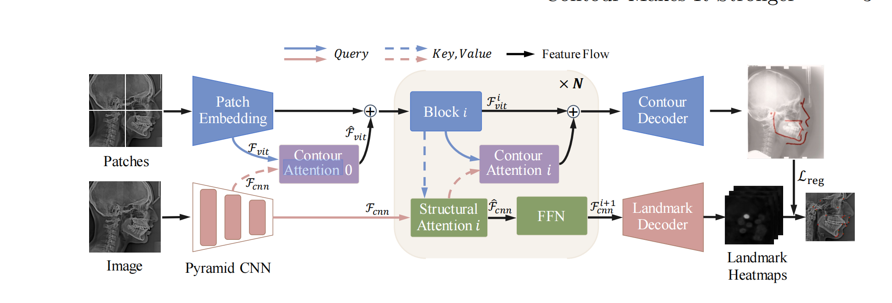

图2用论文原图，然后写part3，不要页码。不要Contour Heatmap 构建。然后你右边的文字我感觉不对，你现在采用苏格拉底式提问，了解我想要什么样的ppt


**GPT：**

{}

可以，我们先不生图。我先用苏格拉底式提问把你的 PPT 需求摸清楚，尤其是**图2这一页到底要讲成“架构总览页”还是“技术细节页”**。

你直接按格式回答即可：
**1B 2A 3C 4B 5AC 6B 7一句话补充**

---

### 1. 图2这一页的定位是什么？

A. 只作为整体架构总览，后面再分模块讲细节
B. 作为研究方法部分的核心页，要把 CAM/JAM/DRM 都讲清楚
C. 主要讲 JAM，图2只是作为 JAM 的背景图
D. 主要讲整体数据流，不展开公式

---

### 2. 图2页面你希望左侧怎么放？

A. 直接放论文原图，保持原样
B. 放论文原图，但用蓝色框/箭头标注 CAM、JAM、DRM
C. 只截取论文 Fig.2 的主要结构，放大重点区域
D. 用我重新绘制的简化版，不用原图

---

### 3. 右侧“方法分析”你想要哪种风格？

A. 很短，只写 3 个要点，适合口头讲
B. 中等长度，每个模块一句话
C. 技术细节型，围绕数据流、特征流、模块作用展开
D. 不要右侧大段文字，只要关键词

---

### 4. 右侧文字重点应该讲什么？

A. 讲 CAM/JAM/DRM 分别是什么
B. 讲图2从左到右的数据流
C. 讲为什么两条分支要融合
D. 讲训练时 contour/landmark heatmap 和 Lreg 怎么配合

---

### 5. 这页你最不想出现什么？

A. 不要“Contour Heatmap 构建”这种单独页标题
B. 不要页码
C. 不要太多中文段落
D. 不要重新绘制架构，必须用论文原图
E. 不要装饰太多，尽量像论文汇报

---

### 6. “PART 03” 你想表达的是？

A. 研究方法是第三部分，所以左上角写 PART 03
B. 图2这一页开始进入 PART 03：研究方法
C. 只把模板里的 PART 02 改成 PART 03
D. 不需要 PART 标签，只写“研究方法”

---

### 7. 右侧小结你希望写成哪种？

A. “整体框架由 CAM、JAM、DRM 三部分组成。”
B. “CAM 学轮廓，JAM 融特征，DRM 约束回归。”
C. “本文通过轮廓先验实现 structure-guided landmark localization。”
D. 你帮我写一个更适合汇报的

---

### 8. 最后补一句：你希望这一页给老师留下什么印象？

比如：
“让老师一眼看懂网络怎么跑”
“让老师觉得我理解了技术架构”
“尽量别像 AI 生成图，要像正式论文汇报”

---

<a id="turn-026"></a>

## 对话 026

**我：**

1A 2A 3C 4A5AB 6D 7D 8都要。      现在先生成稿子，全部

**GPT：**

可以。根据你的选择，我把**研究方法部分**重新整理成适合正式 PPT 的稿子。

核心调整是：

不单独做“Contour Heatmap 构建”这一页；
图 2 使用**论文原图**，不重新画架构；
不要页码；
不要 PART 标签，只写“研究方法”；
图 2 页只做**整体架构总览**，后面再分 CAM、JAM、DRM 讲细节。

---

# 研究方法部分整体页序

建议研究方法部分做 **5 页**：

```text
第1页：研究方法｜整体架构
第2页：研究方法｜轮廓感知模块 CAM
第3页：研究方法｜联合注意力模块 JAM
第4页：研究方法｜方向敏感回归模块 DRM
第5页：研究方法｜损失函数与训练目标
```

---

# 第 1 页：研究方法｜整体架构

## 页面标题

**研究方法｜整体架构**

## 左侧内容

直接放论文 **Fig.2 原图**，不重新绘制。

图下可以加一行很短的图注：

```text
图2  CJL整体框架：CAM提取轮廓结构特征，Pyramid CNN提取上下文特征，JAM进行特征交互，DRM约束关键点回归。
```

## 右侧标题

**方法分析**

## 右侧正文

本文提出 **Contour-aware Joint Learning，CJL** 框架，用于跨域头影测量关键点检测。整体结构由三部分组成：上方蓝色分支为 **Contour-aware Module，CAM**，用于学习解剖轮廓结构特征；下方 **Pyramid CNN** 用于提取图像上下文特征；中间阴影区域为 **Joint Attention Module，JAM**，负责两类特征的交互融合。

在输出端，**Contour Decoder** 预测轮廓热图，**Landmark Decoder** 预测关键点热图。最右侧的 **Lreg** 对应 **Direction-sensitive Regression Module，DRM**，用于根据轮廓几何方向约束关键点回归。

整体来看，该框架的核心思想是：
从单纯依赖图像外观的 **appearance-driven detection**，转向利用解剖结构先验的 **structure-guided localization**。

## 小结

**CJL 的主线是：CAM 学轮廓，JAM 融特征，DRM 约束回归。**

## 汇报讲稿

这一页展示的是本文的整体方法框架，也就是 Contour-aware Joint Learning，简称 CJL。我们先从图 2 的整体数据流来看。输入是一张头颅侧位 X 光片，模型将其送入两条分支：上方是 contour-aware 分支，主要通过 patch embedding 和 ViT 结构学习与解剖轮廓相关的结构特征；下方是 Pyramid CNN 分支，主要提取图像中的多尺度上下文特征，例如边缘、纹理和局部骨骼结构。

这两类特征分别记为 Fvit 和 Fcnn。Fvit 更偏向 contour structural features，表达轮廓形状和全局解剖拓扑；Fcnn 更偏向 contextual features，表达局部图像证据。随后，这两类特征会进入中间的 Joint Attention Module，通过 Contour Attention 和 Structural Attention 进行双向交互。

在输出端，上方的 Contour Decoder 用于预测 contour heatmap，下方的 Landmark Decoder 用于预测 landmark heatmaps。最后，右侧的 Lreg 表示 Direction-sensitive Regression Module，它会利用 contour 的切线方向和法线方向，对关键点回归误差进行方向敏感约束。

所以这张图的重点不是某一个单独模块，而是展示本文如何在一个统一框架中使用 contour prior：CAM 负责学习轮廓，JAM 负责融合轮廓和图像特征，DRM 负责用轮廓几何约束最终回归。fileciteturn0file0

---

# 第 2 页：研究方法｜轮廓感知模块 CAM

## 页面标题

**研究方法｜轮廓感知模块 CAM**

## 左侧内容

建议放 CAM 流程示意图，不用特别复杂：

```text
GT Landmarks
↓
Cubic Spline Interpolation
↓
Anatomical Contours
↓
Distance Transform + Gaussian Function
↓
Contour Heatmaps
↓
ViT Encoder / Contour Features
```

## 右侧标题

**方法分析**

## 右侧正文

**CAM，Contour-aware Module** 的作用是显式引入解剖轮廓先验。论文首先根据医学定义，将相关 landmarks 按照解剖结构进行分组，例如 **mandibular contour**、**maxillary contour** 和 **soft tissue contour**。

随后，作者使用 **cubic spline interpolation** 将离散 landmarks 连接成连续平滑的 anatomical contours。为了让网络能够学习这些连续轮廓，论文进一步计算每个像素到 contour 的最近距离，并通过 Gaussian function 生成 contour heatmap。

训练阶段，contour heatmap 由 ground-truth landmarks 构造，用作结构监督；测试阶段没有 ground-truth contour，因此模型需要通过 Contour Decoder 自行预测轮廓结构。

## 小结

**CAM 解决的问题是：contour prior 从哪里来，以及如何让网络学习它。**

## 汇报讲稿

接下来介绍第一个核心模块 CAM，也就是 Contour-aware Module。CAM 的目标是让模型显式学习 anatomical contour prior。传统 landmark detection 直接预测离散关键点，但单个 landmark 容易依赖局部图像外观，例如灰度、纹理和边缘，而这些特征在跨域场景下并不稳定。

因此，作者将医学定义的 landmarks 按照解剖结构进行组织。例如，下颌相关点可以形成 mandibular contour，上颌相关点可以形成 maxillary contour，软组织相关点可以形成 soft tissue contour。然后使用 cubic spline interpolation，也就是三次样条插值，将这些离散点连接成连续平滑的解剖轮廓。

得到 contour 后，作者进一步通过 distance transform 计算每个像素到 contour 的最近距离，再用 Gaussian function 将距离转换成 contour heatmap。这样，靠近 contour 的像素响应更高，远离 contour 的像素响应更低。这个 heatmap 本质上是一种线状结构监督，可以帮助模型学习比单个点更稳定的解剖拓扑关系。

这里需要强调的是，contour 虽然是先验知识，但它不是测试阶段直接输入的真值。训练时，我们可以用 ground-truth landmarks 生成 ground-truth contour heatmap 来监督模型；但测试时没有 GT landmarks，也就没有 GT contour，因此模型必须学会自己从图像中预测 contour structure。fileciteturn0file0

---

# 第 3 页：研究方法｜联合注意力模块 JAM

## 页面标题

**研究方法｜联合注意力模块 JAM**

## 左侧内容

建议放论文 Fig.2 中间 JAM 部分的截图，或者放简化流程：

```text
Fvit：Contour Structural Features
Fcnn：CNN Contextual Features

Contour Attention：Fvit ← Fcnn
Structural Attention：Fcnn ← Fvit
FFN：更新融合特征
```

## 右侧标题

**方法分析**

## 右侧正文

**JAM，Joint Attention Module** 的作用是融合两类特征：一类是 ViT 分支提取的 **contour structural features**，另一类是 Pyramid CNN 提取的 **contextual features**。

JAM 不是简单拼接两类特征，而是通过 attention 进行双向交互。**Contour Attention** 使用 contour features 作为 Query，CNN features 作为 Key 和 Value，使轮廓分支吸收图像上下文；**Structural Attention** 则反过来使用 CNN features 作为 Query，contour features 作为 Key 和 Value，将 contour prior 注入 landmark-related features。

因此，JAM 的作用是让轮廓特征具备图像感知能力，同时让图像特征具备结构约束能力。

## 小结

**JAM 解决的问题是：contour prior 如何真正融入 landmark 特征。**

## 汇报讲稿

第二个模块是 JAM，也就是 Joint Attention Module。CAM 已经让模型学习了 contour structural features，但如果这些结构特征不能有效融入关键点检测过程，那么对最终 landmark localization 的帮助是有限的。因此，作者设计 JAM 来融合 contour features 和 CNN contextual features。

在图 2 中，Fvit 表示 ViT 分支得到的 contour structural features，它更偏向全局结构和解剖拓扑；Fcnn 表示 Pyramid CNN 得到的 contextual features，它更偏向局部图像证据，例如边缘、纹理和灰度变化。这两类特征是互补的，但不能简单 concat，因为 concat 只是把特征堆叠起来，并没有显式建模它们之间的对应关系。

JAM 通过两种 attention 进行双向交互。第一种是 Contour Attention，它使用 contour features 作为 Query，CNN features 作为 Key 和 Value。也就是说，轮廓分支主动从图像上下文中吸收有用信息，使 contour features 不再是孤立的结构表示，而是能够结合实际图像证据。

第二种是 Structural Attention，它反过来使用 CNN features 作为 Query，contour features 作为 Key 和 Value。这样，CNN 分支提取的 landmark-related features 就可以吸收 contour prior，从而不再只依赖 image appearance，而是受到 anatomical structure 的引导。

所以，JAM 的核心可以概括为一句话：Contour Attention 让轮廓特征感知图像上下文，Structural Attention 让图像特征感知解剖结构。fileciteturn0file0

---

# 第 4 页：研究方法｜方向敏感回归模块 DRM

## 页面标题

**研究方法｜方向敏感回归模块 DRM**

## 左侧内容

建议放方向误差分解图：

```text
contour 上的真实点 p*
预测点 p
误差向量 e = p - p*
切线方向 t
法线方向 n
Δt：切线方向误差
Δn：法线方向误差
```

同时放一个小对比：

```text
isotropic uncertainty：圆形误差
anisotropic uncertainty：椭圆形误差
```

## 右侧标题

**方法分析**

## 右侧正文

**DRM，Direction-sensitive Regression Module** 的核心思想是：对于位于 contour 上或附近的 landmarks，其预测误差不是各个方向均匀分布的。

沿 contour 的 **tangential direction**，误差可能更大；垂直 contour 的 **normal direction**，误差通常更小。这种方向相关的不确定性称为 **anisotropic uncertainty**。

因此，DRM 从 contour heatmap 中计算方向场，将 landmark prediction offset 投影到 tangent direction 和 normal direction 上，分别得到 **Δt** 和 **Δn**，并进一步构造 direction-sensitive regression loss。

## 小结

**DRM 解决的问题是：landmark 回归误差如何结合 contour geometry。**

## 汇报讲稿

第三个模块是 DRM，也就是 Direction-sensitive Regression Module。前面的 CAM 和 JAM 主要是在特征层面使用 contour prior，而 DRM 进一步在回归层面利用 contour geometry。

普通 landmark 回归损失通常只关注预测点和真实点之间的欧氏距离，也就是预测点离真实点有多远。但论文认为，对于位于 contour 上或 contour 附近的 landmark，误差并不是各个方向均匀分布的。沿着 contour 的切线方向，预测点可能更容易发生滑动；而垂直 contour 的法线方向，误差通常更小，因为垂直偏离 contour 会更明显地破坏解剖结构。

这种不同方向上误差分布不同的现象，称为 anisotropic uncertainty，各向异性不确定性。为了建模这种现象，DRM 首先从 contour heatmap 中计算梯度方向。梯度方向可以近似得到 normal direction，也就是法线方向；再将法线方向旋转 90 度，就可以得到 tangent direction，也就是切线方向。

然后，模型将 predicted landmark 和 ground-truth landmark 之间的 offset 投影到这两个方向上，分别得到 tangent error，也就是 Δt，以及 normal error，也就是 Δn。接着通过方向能量 Et 和 En 对两个方向的误差进行归一化，最终形成 direction-sensitive regression loss。

因此，DRM 的作用是让模型不仅知道“预测错了多少”，还知道“这个错误是沿轮廓方向发生的，还是垂直轮廓方向发生的”。这样可以使 landmark regression 更符合 anatomical plausibility。fileciteturn0file0

---

# 第 5 页：研究方法｜损失函数与训练目标

## 页面标题

**研究方法｜损失函数与训练目标**

## 左侧内容

建议画成三条监督路径：

```text
Landmark Decoder → Landmark Heatmaps → Lh
Contour Decoder → Contour Heatmaps → Lmse
DRM → Direction-sensitive Regression → Lreg
```

最终合并：

```text
L = Lreg + λ1Lh + λ2Lmse
```

## 右侧标题

**方法分析**

## 右侧正文

本文的整体损失函数由三部分组成：

**Lh** 是 landmark heatmap loss，用于监督 Landmark Decoder 输出的关键点热图；
**Lmse** 是 contour heatmap loss，用于监督 Contour Decoder 输出的轮廓热图；
**Lreg** 是 direction-sensitive regression loss，用于根据 contour 的 tangent direction 和 normal direction 约束关键点坐标回归。

三者分别对应三个层面：
**Lh 是点级监督，Lmse 是轮廓级结构监督，Lreg 是方向几何监督。**

最终损失函数为：

```text
L = Lreg + λ1Lh + λ2Lmse
```

其中论文设置 **λ1 = 2.0，λ2 = 5.0**。

## 小结

**整体训练目标可以概括为：点监督 + 线监督 + 方向监督。**

## 汇报讲稿

最后介绍本文的损失函数与训练目标。整个框架不是只用一个 landmark loss，而是由三部分损失共同训练。

第一部分是 Lh，也就是 landmark heatmap loss。它用于监督 Landmark Decoder 输出的 landmark heatmaps，使模型能够准确定位每个关键点。可以理解为点级监督。

第二部分是 Lmse，也就是 contour heatmap loss。它用于监督 Contour Decoder 输出的 contour heatmaps。真实 contour heatmap 是由 ground-truth landmarks 经过 cubic spline interpolation、distance transform 和 Gaussian function 构造得到的。因此，Lmse 可以看作一种辅助结构监督，它让 contour branch 学会预测具有医学语义的 anatomical contours。

第三部分是 Lreg，也就是 DRM 中的 direction-sensitive regression loss。它不是普通的坐标回归损失，而是将 landmark 的预测误差分解到 tangent direction 和 normal direction 上，并结合两个方向的误差能量进行约束。这样，模型在优化坐标时可以考虑 contour geometry。

最终损失函数写作 L = Lreg + λ1Lh + λ2Lmse，其中 λ1 设置为 2.0，λ2 设置为 5.0。整体来看，Lh 负责点，Lmse 负责线，Lreg 负责方向。这个训练目标把 landmark detection 从单纯点定位扩展到结构感知和几何约束，从而提升跨域场景下的鲁棒性。fileciteturn0file0

---

# 研究方法部分总开场稿

你进入研究方法部分时可以这样说：

> 接下来介绍本文的研究方法。本文的核心不是简单设计一个新的关键点检测网络，而是围绕 contour prior 构建了一个完整的跨域 landmark detection 框架。为了讲清楚这个框架，我会先用图 2 说明整体网络的数据流，然后依次介绍三个关键模块：Contour-aware Module、Joint Attention Module 和 Direction-sensitive Regression Module，最后说明整体损失函数如何训练这些模块。

---

# 研究方法部分总收束稿

讲完损失函数后可以这样收束：

> 总结来看，本文在三个层面使用 contour prior。首先，CAM 在结构监督层面让模型学习 anatomical contours；其次，JAM 在特征交互层面融合 contour structural features 和 CNN contextual features；最后，DRM 在回归层面利用 contour 的 tangent 和 normal directions 约束 landmark error。通过这种设计，模型能够减少对不稳定 image appearance 的依赖，更多利用跨域相对稳定的 anatomical structure，从而提升 unseen target domains 上的定位鲁棒性。

---

<a id="turn-027"></a>

## 对话 027

**我：**

可以，生成图片5张

**GPT：**

**tool：**

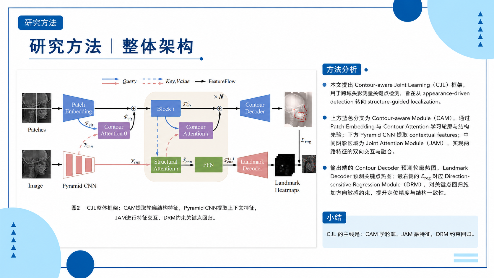

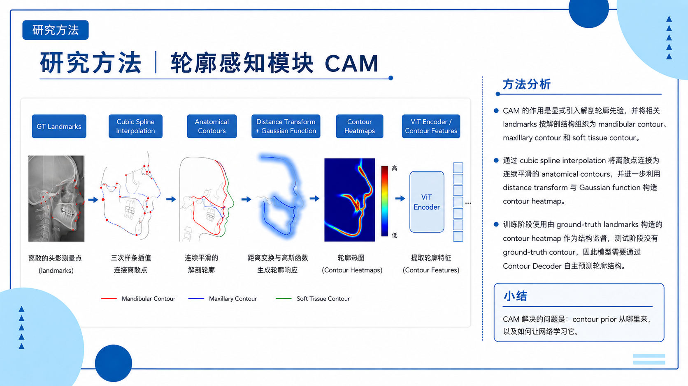

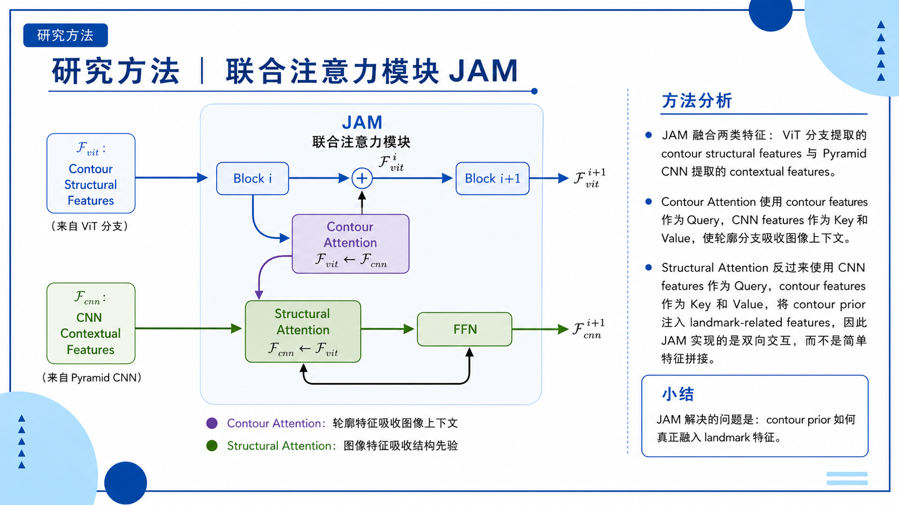

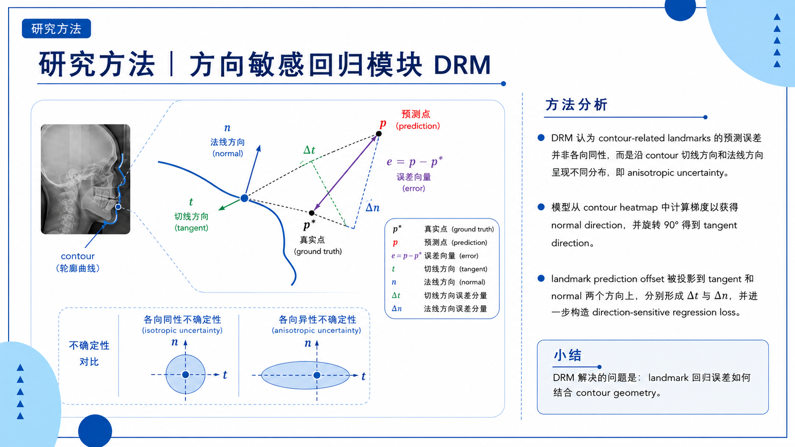

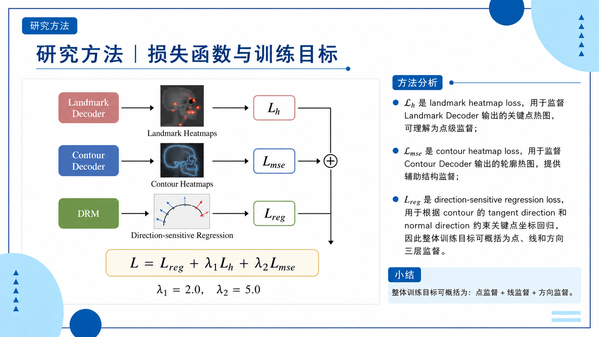

{"prompt":"Create a polished 16:9 thesis-defense PPT slide image in Chinese. Use Image A as the style reference: a clean blue academic presentation template with minimalist white background, thin blue border lines, rounded blue accent shapes, and elegant academic formatting. Use Image B as the layout reference: a slide with a large figure/chart on the left and an analysis text panel on the right, plus a small summary area. Use Image C as the content reference: place the original paper Fig.2 network architecture image on the left as the main figure inside the slide, preserving it as a paper figure rather than redrawing the model. \n\nDesign the slide title as “研究方法｜整体架构”. Do NOT include any page number. Do NOT include any PART label. At the top-left, add a small blue rounded tag that says “研究方法”. Keep the overall look formal, clean, and suitable for a graduate thesis defense.\n\nSlide structure:\n- Left side: the paper Fig.2 as a large readable figure. Beneath it, add a short caption in Chinese: “图2  CJL整体框架：CAM提取轮廓结构特征，Pyramid CNN提取上下文特征，JAM进行特征交互，DRM约束关键点回归。”\n- Right side: add a heading “方法分析” and then 3 concise, technical Chinese paragraphs. The paragraphs should explain: (1) 本文提出Contour-aware Joint Learning（CJL）框架，用于跨域头影测量关键点检测；(2) 上方蓝色分支为Contour-aware Module（CAM），下方Pyramid CNN提取contextual features，中间阴影区域为Joint Attention Module（JAM）；(3) 输出端的Contour Decoder预测轮廓热图，Landmark Decoder预测关键点热图，最右侧Lreg对应Direction-sensitive Regression Module（DRM），整体从appearance-driven detection转向structure-guided localization.\n- Bottom summary area: add a small bold heading “小结” and the sentence “CJL 的主线是：CAM 学轮廓，JAM 融特征，DRM 约束回归。”\n\nMake all Chinese text crisp, well spaced, and readable. Ensure the layout clearly resembles the reference style and reference layout, but adapted to this technical method slide.","reference_image_paths":["/mnt/data/ghostwriter_images/context/2267593b-8e33-5348-9294-d9b5da15e538.png","/mnt/data/ghostwriter_images/context/62b585ba-6184-5a98-847c-c39644105a6f.png","/mnt/data/ghostwriter_images/context/04e1c2d0-b211-5bf2-bdf0-5f38d8798b4f.png"],"aspect_ratio":"16:9"}

**tool：**


Model caption: Wide presentation slide layout with white background and blue accents, overall scene: a clean academic PPT style infographic slide in Chinese with a large diagram on the left and explanatory text on the right, framed by decorative blue border elements and rounded shapes. Top/overall: a thin blue rectangular border line frames the slide area; in the top left is a rounded blue label/button containing white Chinese text “研究方法”. Below/left top is a huge dark-blue title in bold Chinese: “研究方法｜整体架构” (the vertical bar “|” between phrases), with a thin horizontal blue rule/underline and a small blue dot near the line. The slide uses a white background with light-blue geometric decorations: in the top-right corner, a large light-blue semi-circle/arc-like shape and a solid dark-blue circle overlapping, plus a vertical stack of small blue upward-pointing triangles on the far right; in the bottom-left, a large light-blue semicircular decorative shape with several small blue upward triangles in a column, and a solid dark-blue circle overlapping the bottom border; in the bottom-right, three short horizontal light-blue bars like a menu/decorative icon. Left main content: a large inset diagram (like a paper figure) inside a white panel with subtle shadow or border, showing a schematic neural network architecture. At the very top of the diagram area is a legend with colored arrow/line labels: a blue arrow labeled “Query”, a reddish/pink arrow labeled “Query” or actually the legend shows “Query” in pinkish/red (but the blue arrow is labeled “Query”? — visible legend: “Query” in blue/pink?; text reads “Query” then “Key, Value” with dashed blue/pink lines, and “Feature Flow” with a black arrow). The legend text reads “Query”, “Key,Value”, “FeatureFlow” with arrows/lines: blue solid for query, dashed blue/pink for key,value, and black for feature flow (or “FeatureFlow”). Left side of diagram: top-left has a set of grayscale X-ray/CT-like images in a grid strip and label “Patches” beneath; below it another grayscale cephalometric x-ray image with label “Image”. The top pathway: from “Patches” area arrow into a blue trapezoid/box labeled “Patch\nEmbedding”. From there a black line arrow goes right to a summation circle “+” and continues into a big module. A blue/curved line labeled “F_vit” comes down toward a purple box “Contour\nAttention 0” and also a dashed/pink line labeled “F_cnn” is shown looping from lower path toward that attention. The purple box is labeled “Contour\nAttention 0”. Right/center top: a blue block “Block i” inside a beige rounded rectangle region; above it the text “×N” at the top right of that region. A black arrow leaving Block i labeled “F^i_{vit}” (rendered as “F^i_{vit}”) goes to another “+” circle and out right. A purple box “Contour\nAttention i” inside the module with arrows: blue dashed arrow from Block i down and a dashed/pink arrow to it; that purple box feeds back/up to the summation. The top-right output: a blue trapezoid/box “Contour\nDecoder” and to its right a small grayscale skull x-ray with a red contour outline/line; this output is part of contour prediction. Bottom pathway: from “Image” on left arrow into a stylized “Pyramid CNN” graphic (stacked/pyramid-like vertical rounded bars in pink/red) with label “Pyramid CNN”. A pinkish/red arrow labeled “F_cnn” goes right into the central module’s lower path entering a green box “Structural\nAttention i”. From it a black arrow labeled “\hat{F}_{cnn}” (rendered as “F̂_{cnn}”) goes to a green box “FFN”; from FFN a black arrow labeled “F^{i+1}_{cnn}” goes right toward a pink/red trapezoid “Landmark\nDecoder”. Between Structural Attention i and Contour Attention i there are connections (dashed pink/curved arrows) implying interaction. The central beige region is the Joint module; it contains Block i, Contour Attention i, Structural Attention i, FFN, and summation nodes, with the header “×N” indicating repetition. Right side outputs: from “Landmark\nDecoder” an output block of “Landmark\nHeatmaps” shown as stacked dark heatmap-like images (bright dots on black), and to the far right a small skull x-ray with red landmark dots/markers, connected by an arrow and beneath a vertical text “L_{reg}” shown as “L_{reg}” pointing down to that rightmost image (indicating loss/regression). The top right contour output and bottom landmark output converge in concept to the rightmost stage with “L_{reg}”. Bottom caption under the diagram: black Chinese caption text “图2  CJL整体框架：CAM提取轮廓结构特征，Pyramid CNN提取上下文特征，\nJAM进行特征交互，DRM约束关键点回归。” (line break into two lines). Right column: at top a blue rounded label with white text header “方法分析” with a small blue dot and a thin blue rule to the right. Under it are three bullet-like paragraphs, each preceded by a blue circular bullet. First paragraph: “本文提出 Contour-aware Joint Learning（CJL）框架，\n用于跨域头影测量关键点检测，旨在从 appearance-driven\ndetection 转向 structure-guided localization。” Second paragraph: “上方蓝色分支为 Contour-aware Module（CAM），通过\nPatch Embedding 与 Contour Attention 学习轮廓与结构\n先验；下方 Pyramid CNN 提取 contextual features；中\n间阴影区域为 Joint Attention Module（JAM），实现两\n路特征的双向交互与融合。” Third paragraph: “输出端的 Contour Decoder 预测轮廓热图，Landmark\nDecoder 预测关键点热图；最右侧的 L_{reg} 对应 Direction-\nsensitive Regression Module（DRM），对关键点回归施\n加方向敏感约束，提升定位精度与结构一致性。” Bottom right summary box: a blue rounded label “小结” above a pale-blue rounded rectangle area containing the summary sentence in dark text: “CJL 的主线是：CAM 学轮廓，JAM 融特征，DRM 约束回归。” Overall style: academic slide, clean sans-serif fonts, blue accents, infographic network diagram with arrows and modules, lots of Chinese text mixed with English technical terms, neat alignment with right-side text panel and left-side figure.<|has_watermark|><|has_borders|>

**tool：**

Generated images from the last `image_gen.text2im` call were saved at:
- /mnt/data/ghostwriter_images/generated/wide_presentation_slide_layout_with_white_backgrou_1.png (wxh = 1672 x 941, exact aspect ratio 1672:941, close to aspect ratio 16:9)

You can visually inspect the generated image directly in the tool result above. Only reopen the saved path if you need programmatic processing or want to pass the image into another tool call.

{"batch_requests":[{"prompt":"Create a polished 16:9 Chinese thesis-defense PPT slide that matches the visual style, spacing, and blue academic design language of Image A. Image A is the style consistency anchor. Image B is a supporting content reference for the CAM topic; use it only to help depict the left-side methodological diagram, not as a literal full-slide copy. Keep the same clean white background, thin blue border, rounded blue decorations, blue label in the upper-left that says “研究方法”, no page number, and no PART label.\n\nDesign the slide title as “研究方法｜轮廓感知模块 CAM”. Use a layout consistent with Image A: large figure/diagram on the left, analysis text on the right, and a small summary box at the lower right.\n\nLeft side: create a clean academic process diagram for CAM. Show the pipeline clearly in Chinese/English labels: “GT Landmarks” → “Cubic Spline Interpolation” → “Anatomical Contours” → “Distance Transform + Gaussian Function” → “Contour Heatmaps” → “ViT Encoder / Contour Features”. Include small visual cues such as discrete landmark points, a smooth red contour on a skull x-ray, and a contour heatmap illustration. Make it look like a technical method diagram.\n\nRight side: heading “方法分析”. Write 3 concise technical Chinese paragraphs/bullets: (1) CAM 的作用是显式引入解剖轮廓先验，并将相关 landmarks 按解剖结构组织为 mandibular contour、maxillary contour 和 soft tissue contour； (2) 通过 cubic spline interpolation 将离散点连接为连续平滑的 anatomical contours，并进一步利用 distance transform 与 Gaussian function 构造 contour heatmap； (3) 训练阶段使用由 ground-truth landmarks 构造的 contour heatmap 作为结构监督，测试阶段没有 ground-truth contour，因此模型需要通过 Contour Decoder 自主预测轮廓结构。\n\nBottom-right summary: heading “小结”, content “CAM 解决的问题是：contour prior 从哪里来，以及如何让网络学习它。”\n\nEnsure all Chinese text is crisp and readable.","reference_image_paths":["/mnt/data/ghostwriter_images/generated/wide_presentation_slide_layout_with_white_backgrou_1.png","/mnt/data/研究方法与轮廓感知模块cam.png"],"referenced_image_ids":[],"aspect_ratio":"16:9"},{"prompt":"Create a polished 16:9 Chinese thesis-defense PPT slide that matches the style of Image A exactly in layout system, blue academic theme, white background, border, and decorations. Image A is the style anchor. Image B is a supporting content reference for the JAM topic. No page number. No PART label. Keep a top-left rounded blue tag “研究方法”.\n\nTitle: “研究方法｜联合注意力模块 JAM”. Use the same slide structure: large explanatory figure on the left, “方法分析” text panel on the right, and a small “小结” summary box.\n\nLeft side: create a clear technical diagram for JAM. Show two feature streams: “Fvit：Contour Structural Features” and “Fcnn：CNN Contextual Features”. Show “Contour Attention” with the relation “Fvit ← Fcnn” and “Structural Attention” with the relation “Fcnn ← Fvit”, plus an “FFN” block after structural attention. Use arrows and concise labels to emphasize bidirectional feature interaction. It should look like a method diagram suitable for a paper presentation.\n\nRight side under heading “方法分析”: write 3 concise technical Chinese paragraphs/bullets: (1) JAM 融合两类特征：ViT 分支提取的 contour structural features 与 Pyramid CNN 提取的 contextual features； (2) Contour Attention 使用 contour features 作为 Query，CNN features 作为 Key 和 Value，使轮廓分支吸收图像上下文； (3) Structural Attention 反过来使用 CNN features 作为 Query，contour features 作为 Key 和 Value，将 contour prior 注入 landmark-related features，因此 JAM 实现的是双向交互，而不是简单特征拼接。\n\nBottom-right summary: heading “小结”, content “JAM 解决的问题是：contour prior 如何真正融入 landmark 特征。”\n\nMake the text and diagram crisp, polished, and highly readable.","reference_image_paths":["/mnt/data/ghostwriter_images/generated/wide_presentation_slide_layout_with_white_backgrou_1.png","/mnt/data/联合注意力模块展示图.png"],"referenced_image_ids":[],"aspect_ratio":"16:9"},{"prompt":"Create a polished 16:9 Chinese thesis-defense PPT slide that matches the visual style of Image A: clean white background, blue academic thesis template style, thin border, rounded blue decorative accents, and a top-left blue tag “研究方法”. Image A is the style anchor. Image B is a supporting content reference for the DRM topic. No page number. No PART label.\n\nTitle: “研究方法｜方向敏感回归模块 DRM”. Use the same consistent layout: large diagram on the left, “方法分析” on the right, and a small “小结” box at the lower right.\n\nLeft side: create a didactic technical illustration for DRM. Show a contour curve on an x-ray or schematic outline, a ground-truth point p* on the contour, a predicted point p, and the offset vector e = p - p*. Show tangent direction t and normal direction n at the contour point. Visually decompose the error into Δt and Δn. Add a small inset comparing “isotropic uncertainty” (circular error) and “anisotropic uncertainty” (ellipse elongated along the contour). Keep the diagram clean and academic.\n\nRight side under heading “方法分析”: write 3 concise technical Chinese paragraphs/bullets: (1) DRM 认为 contour-related landmarks 的预测误差并非各向同性，而是沿 contour 切线方向和法线方向呈现不同分布，即 anisotropic uncertainty； (2) 模型从 contour heatmap 中计算梯度以获得 normal direction，并旋转 90° 得到 tangent direction； (3) landmark prediction offset 被投影到 tangent 和 normal 两个方向上，分别形成 Δt 与 Δn，并进一步构造 direction-sensitive regression loss。\n\nBottom-right summary: heading “小结”, content “DRM 解决的问题是：landmark 回归误差如何结合 contour geometry。”\n\nEnsure all labels and Chinese text are sharp, professional, and readable.","reference_image_paths":["/mnt/data/ghostwriter_images/generated/wide_presentation_slide_layout_with_white_backgrou_1.png","/mnt/data/研究方法与误差分析展示.png"],"referenced_image_ids":[],"aspect_ratio":"16:9"},{"prompt":"Create a polished 16:9 Chinese thesis-defense PPT slide in the exact same style as Image A. Image A is the style anchor. Keep the same clean blue academic theme, white background, border, decorative elements, top-left blue tag “研究方法”, and no page number or PART label.\n\nTitle: “研究方法｜损失函数与训练目标”. Use the same layout system: a large technical figure/diagram on the left, a right-side “方法分析” text area, and a small “小结” summary box.\n\nLeft side: create a clean training-objective diagram with three supervision branches. Show: “Landmark Decoder → Landmark Heatmaps → Lh”, “Contour Decoder → Contour Heatmaps → Lmse”, and “DRM → Direction-sensitive Regression → Lreg”. Then show a highlighted final equation box: “L = Lreg + λ1Lh + λ2Lmse”, and beneath it smaller text “λ1 = 2.0, λ2 = 5.0”. Make the figure clear, formal, and presentation-ready.\n\nRight side under heading “方法分析”: write 3 concise technical Chinese paragraphs/bullets: (1) Lh 是 landmark heatmap loss，用于监督 Landmark Decoder 输出的关键点热图，可理解为点级监督； (2) Lmse 是 contour heatmap loss，用于监督 Contour Decoder 输出的轮廓热图，提供辅助结构监督； (3) Lreg 是 direction-sensitive regression loss，用于根据 contour 的 tangent direction 和 normal direction 约束关键点坐标回归，因此整体训练目标可概括为点、线和方向三层监督。\n\nBottom-right summary: heading “小结”, content “整体训练目标可概括为：点监督 + 线监督 + 方向监督。”\n\nMake all Chinese text crisp and readable, with an academic, non-flashy thesis-defense appearance.","reference_image_paths":["/mnt/data/ghostwriter_images/generated/wide_presentation_slide_layout_with_white_backgrou_1.png"],"referenced_image_ids":[],"aspect_ratio":"16:9"}]}

**tool：**


Model caption: A clean academic presentation slide / infographic style image with a white background and blue thematic accents. Overall scene: a slide layout with a large title at top left, a big diagram panel on the left, and explanatory text panels on the right; decorative blue shapes and borders. No humans. The style is a polished PowerPoint/LaTeX beamer-like design with blue headings, rounded boxes, icons, and diagrams. **Overall layout:** A thin blue border/frame around the slide. Top-left has a small rounded blue label. Top heading in large bold blue Chinese text. Left main content is a big white rounded-corner panel containing a three-branch diagram/flowchart and a final loss equation box. Right side has a vertical column of explanatory text in bullet points under a blue heading, and a summary box at bottom right. Decorative elements: big blue circular/semicircular shapes at corners (top-right and bottom-left) and small triangle stacks; a blue dot/line connector style near headings; a small three-line light-blue menu-like mark at bottom-right. **Top-left area / header:** A small rounded blue pill label with white Chinese text “研究方法” at the upper left. Below it, huge bold blue title “研究方法｜损失函数与训练目标” with a small blue dot at the end of the line/underline-like accent. **Left main figure panel (large white rounded rectangle):** Inside is a multi-row block diagram with three parallel branches and loss outputs, plus a combined loss formula at the bottom. Row 1 (top branch): On the far left, a rounded-rectangle pink/muted-red box labeled “Landmark\nDecoder” (white text, stacked). An arrow (black) points right to a small heatmap image (square-ish) showing a skull-like profile/side view (gray background) with multiple bright red/orange hot spots (landmark points). Beneath that image, black text “Landmark Heatmaps”. From there, an arrow points right to a rounded-outline box in pale pink/outlined style containing “$L_h$” in black/italic/math style. **Row 2 (middle branch):** On the left, a rounded-rectangle blue box labeled “Contour\nDecoder” (white text). Arrow to the right to a heatmap-like image of a skull side profile outline in bright blue neon/line-like effect on dark/gray background (contour heatmap). Under it text “Contour Heatmaps” in black. Arrow to the right to a rounded-outline box in blue containing “$L_{mse}$”. **Row 3 (bottom branch):** On the left, a rounded-rectangle green box labeled “DRM” (white text). Arrow to the right to a small diagram image showing a contour/edge-like curved shape with short colored arrows (some blue and some red) indicating directions; the background is light/gray; arrows suggest tangents and normals. Under it text “Direction-sensitive Regression” in black. Arrow to the right to a rounded-outline box in green containing “$L_{reg}$”. **Loss combination:** From each of the three loss boxes on the right, black lines/branches run vertically (or converge) to a central combining node: a circle with a plus sign “⊕” (black outline) to indicate summation. From that combine node, a downward arrow leads to a highlighted formula area near the bottom. The formula box is a wide rounded rectangle in a pale cream/beige (light yellow-beige) with a thin border, containing large math: “$L = L_{reg} + \lambda_1 L_h + \lambda_2 L_{mse}$” in black/italic math style. Below that, centered smaller black text: “$\lambda_1 = 2.0, \ \lambda_2 = 5.0$”. **Right column (analysis and summary):** At the top of the right column, a blue rounded heading label “方法分析” with a small blue dot and a thin horizontal line extending right/left style. Under it, three bullet points with blue circular bullets and Chinese explanatory text (black). First bullet: “$L_h$ 是 landmark heatmap loss，用于监督\nLandmark Decoder 输出的关键点热图，\n可理解为点级监督；” (line breaks as shown). Second bullet: “$L_{mse}$ 是 contour heatmap loss，用于监督\nContour Decoder 输出的轮廓热图，提供\n辅助结构监督；” Third bullet: “$L_{reg}$ 是 direction-sensitive regression loss，\n用于根据 contour 的 tangent direction 和\nnormal direction 约束关键点坐标回归，\n因此整体训练目标可概括为点、线和方向\n三层监督。” (Chinese text with English terms tangential “tangent direction”和“normal direction” mixed in). Below on the right bottom, a light-blue rounded/boxed section titled “小结” in a blue label; inside the pale blue/white box: “整体训练目标可概括为：点监督 + 线监督 + 方向监督。” **Decorative elements:** Top-right corner has a large dark-blue circle overlapping the border and a pale blue semicircular/rounded area with a vertical stack of small dark-blue/triangle arrow markers (▲ ▲ ▲ ▲ ▲). Bottom-left has a large pale-blue circular/rounded shape with a vertical stack of small dark-blue triangles (▲ ▲ ▲ ▲ ▲) and a solid dark-blue circle near the bottom border. Bottom-right corner has three short horizontal light-blue bars (menu-like). Clean sans-serif fonts and math in italic; consistent blue theme and neat slide design.<|has_watermark|><|has_borders|>

**tool：**


Model caption: A clean academic presentation slide in Chinese with a blue-and-white color scheme and infographic layout. **Overall scene:** a wide landscape slide (16:9) with a white background, blue border/frame lines, rounded blue decorative shapes in the corners, and a structured two-column layout: a large diagram/flowchart on the left and explanatory text on the right, with a summary box at bottom-right. **Top/overall header area:** In the upper-left, a rounded blue pill/badge contains white Chinese text “研究方法”. Beneath it, very large bold dark-blue title text reads “研究方法 | 轮廓感知模块 CAM” with a small blue dot at the end of the line. A thin blue underline/line accent sits under the title area. The slide has decorative blue shapes: at the top-right a large dark-blue circle overlaps the border, with a light-blue semicircular/circle area and a vertical stack of small dark-blue upward triangles (▲▲▲▲▲) near it; at the bottom-left a large light-blue circular shape with a vertical stack of small dark-blue triangles (▲▲▲▲▲) and a solid dark-blue circle along the bottom border; at the bottom-right there are three short horizontal light-blue bars/lines. **Left/main diagram panel:** a large rounded-rectangle white box (slightly inset) containing a pipeline diagram with multiple stages and captions. The pipeline is arranged left-to-right with blue chevron/arrow icons between stages. At the top of each stage is a blue rounded rectangle label with white text (English): “GT Landmarks”, “Cubic Spline\nInterpolation”, “Anatomical\nContours”, “Distance Transform\n+ Gaussian Function”, “Contour\nHeatmaps”, “ViT Encoder /\nContour Features”. Under each label is a visual and below that a Chinese caption. **Stage 1 (far left):** Under “GT Landmarks” is a grayscale lateral skull x-ray/cephalometric image with many red dot markers (landmarks) scattered along facial/jaw/skull outlines. Below it the Chinese caption reads “离散的头影测量点\n(landmarks)”. **Stage 2:** Under “Cubic Spline\nInterpolation” is a diagram of a side-profile skull outline in light/gray lines with red and blue dotted/connected points and curves (interpolated spline-like lines) showing dotted red/blue segments connecting points; the jaw/teeth are visible in outline. Below it: “三次样条插值\n连接离散点”. **Stage 3:** Under “Anatomical\nContours” is a side skull outline with smooth colored contour lines: a red line (upper), a blue line (lower), and a green line (soft tissue/profile area), with teeth/skull shown in gray outline. Below it: “连续平滑的\n解剖轮廓”. Below the stage, a legend row shows color keys: a red line label “Mandibular Contour”, a blue line label “Maxillary Contour”, and a green line label “Soft Tissue Contour” (English labels). **Stage 4:** Under “Distance Transform\n+ Gaussian Function” is a contour-like blue line shape surrounded by a glow/blur halo (blue gradient) suggesting distance transform and Gaussian smoothing. Below it: “距离变换与高斯函数\n生成轮廓响应”. **Stage 5:** Under “Contour\nHeatmaps” is a dark-blue heatmap panel with bright contour bands in a rainbow-like scale (hot colors along lines). To the right of this panel is a vertical colorbar gradient from red/yellow/green to blue with text “高” at the top and “低” at the bottom. Below the heatmap: “轮廓热图\n(Contour Heatmaps)”. **Stage 6 (far right of pipeline):** Under “ViT Encoder /\nContour Features” is a rounded-rectangle light-blue block labeled “ViT\nEncoder” in blue, and to its right a column of pale-blue small rounded squares (feature tokens), with a vertical ellipsis “…” between some blocks, indicating a token/feature vector. Below: “提取轮廓特征\n(Contour Features)”. Blue arrow separators appear between each stage graphic indicating flow. **Right sidebar text area:** On the right side of the slide, separated by a vertical dashed/dotted blue dividing line, a section header in bold blue reads “方法分析” with a blue underline line and a small dot at the start. Under it are three bullet points (blue circular bullets) with Chinese text mixed with English terms: 1) “CAM 的作用是显式引入解剖轮廓先验，并将相关\nlandmarks 按解剖结构组织为 mandibular contour、\nmaxillary contour 和 soft tissue contour。” 2) “通过 cubic spline interpolation 将离散点连接为\n连续平滑的 anatomical contours，并进一步利用\ndistance transform 与 Gaussian function 构造\ncontour heatmap。” 3) “训练阶段使用由 ground-truth landmarks 构造的\ncontour heatmap 作为结构监督，测试阶段没有\nground-truth contour，因此模型需要通过\nContour Decoder 自主预测轮廓结构。” (Text is arranged in multi-line Chinese with English technical terms.) **Bottom-right summary box:** below the analysis, a rounded light-blue box header in blue reads “小结” with an underline, and inside: “CAM 解决的问题是：contour prior 从哪里来，\n以及如何让网络学习它。” **Typography & style:** clean sans-serif fonts, major titles large and bold dark blue; icons and boxes in blue tones; diagrams use red/blue/green contour colors and heatmap rainbow; overall style is a modern academic PPT slide with lots of white space and blue accents.<|has_watermark|><|has_borders|>

**tool：**


Model caption: A clean academic PowerPoint-style slide in a white and blue theme, overall layout: a large slide with a decorative border and rounded blue graphic elements; on the top left a small rounded blue badge reads “研究方法”, then a huge title in dark blue “研究方法｜方向敏感回归模块 DRM” (bold, large, sans-serif) with a thin blue underline and a small blue dot at the end. Entire slide is split: a large left content area with diagrams inside rounded or dashed panels, and a right column with text sections. **Left main panel**: inside a large rounded-corner white box (light border), at far left is a grayscale lateral skull/neck X-ray-like image (cephalometric style) showing a side view of a head/neck (no human face detail emphasis, just radiograph look), with a blue contour line overlaid tracing the facial profile and a blue dot on the contour near the midface/lower face. Under it in blue text: “contour” and below in parentheses “(轮廓曲线)”; a dashed blue connector line/dotted/dashed callout leads to a zoomed schematic region to the right. The main schematic: a thick blue contour curve (like a profile curve) with a highlighted point (blue dot) on it. Near this point are vector arrows: a green arrow labeled “t” (切线方向\n(tangent)) pointing along the curve (tangent), and a blue arrow labeled “n” (法线方向\n(normal)) pointing roughly upward/outward, indicating normal direction. The point is the ground-truth location: text nearby “p*” and below “真实点\n(ground truth)”. A black dashed line from near that point to an upper-right black dot labeled “p” in red; above it in red text “预测点\n(prediction)”. From the ground-truth point to prediction is a purple arrow labeled “e = p - p*” and below it “误差向量\n(error)”. Also decomposition dashed projections: a green dashed line projecting along tangent direction to form “Δt” (green) placed near the dashed green projection segment; a blue dashed line projecting along normal direction to form “Δn” (blue) near that dashed blue segment. A black/gray dashed connector shows geometry (black dashed line between points); the purple vector shows error; green and blue dashed components form a right-angle-like decomposition. A legend box on the lower-right of this schematic in a rounded rectangle lists: “p* 真实点 (ground truth)” (with black “p*”), “p 预测点 (prediction)” (with red “p”), “e = p - p* 误差向量 (error)” (purple), “t 切线方向 (tangent)” (green), “n 法线方向 (normal)” (blue), “Δt 切线方向误差分量” (green), “Δn 法线方向误差分量” (blue). In the schematic, the labels are colored matching arrows: “n\n法线方向\n(normal)” in blue near the normal arrow; “t\n切线方向\n(tangent)” in green near the tangent arrow; “Δt” in green; “Δn” in blue; “e = p - p*” and “误差向量\n(error)” in purple; “预测点\n(prediction)” (red) and “真实点\n(ground truth)” (black); “p*” and “p” near respective points. **Below that main diagram** in the same left big box is a dashed-outline section comparing uncertainties: on the far left a vertical/stacked blue label “不确定性\n对比”. Then to its right two panels separated by a vertical divider line. Above the left subpanel: “各向同性不确定性\n(isotropic uncertainty)” in blue; below/center a circular uncertainty illustration: a blue filled circle with dashed cross (vertical and horizontal dashed axes), labeled “n” above the vertical axis and “t” to the right of the horizontal axis, with a central blue dot. On the right subpanel: “各向异性不确定性\n(anisotropic uncertainty)” in blue; below/center an elongated blue ellipse (stretched horizontally along tangent), with dashed axes and “n” above vertical, “t” to the right, central blue dot—indicating anisotropy elongated along t. **Right column** separated by a vertical dotted/dashed blue line; at the top right a blue heading “方法分析” with an underline/dot accent. Below are three bullet points (each preceded by a solid blue dot) with Chinese text including some English terms: 1) “DRM 认为 contour-related landmarks 的预测误差\n并非各向同性，而是沿 contour 切线方向和法线方向\n呈现不同分布，即 anisotropic uncertainty。” 2) “模型从 contour heatmap 中计算梯度以获得\nnormal direction，并旋转 90° 得到 tangent\ndirection。” 3) “landmark prediction offset 被投影到 tangent 和\nnormal 两个方向上，分别形成 Δt 与 Δn，并进\n一步构造 direction-sensitive regression loss。” Below that, at the lower right inside a light blue rounded rectangle box: heading “小结” with underline/dot and below it “DRM 解决的问题是：landmark 回归误差如何\n结合 contour geometry。” **Decorative elements**: top-right decorative shapes including a large light-blue rounded corner/arc and a solid blue circle near the top edge, plus a vertical stack of small blue triangles/arrow-like marks on the right; bottom-left large light-blue semicircle/rounded shape with a column of small blue triangles and a solid blue circle near the lower border. A thin blue border/frame around the entire slide and clean sans-serif typography. Overall style: professional academic slide, blue color palette, crisp vector diagrams, Chinese text with English terms in parentheses, and neat infographic layout.<|has_watermark|><|has_borders|>

**tool：**


Model caption: A clean academic slide / infographic layout with a white background, blue accents and rounded shapes, like a PowerPoint research slide. Overall scene: a large diagram on the left and explanatory text on the right, enclosed by a thin blue border and decorative blue circles/triangles. Top left header area has a rounded blue label and big title. **Top header:** On the upper left, a small rounded dark-blue pill/label reads “研究方法” in white. Next to it large blue title text “研究方法｜联合注意力模块 JAM” with a blue underline/line ending in a dot. The overall style uses sans-serif fonts, blue theme, and diagram boxes with arrows. **Left main diagram panel (inside a large rounded/soft rectangle/diagram area):** A big light-blue rounded rectangle region labeled at top center “JAM” and below it “联合注意力模块”. Inside is a block diagram of attention flows. On the far left outside/at left edge of the large diagram area are two input blocks: (1) top-left pale blue rounded rectangle with text “F_{vit}：” (rendered as math-style “F_{vit}：”) and below in blue “Contour\nStructural\nFeatures” and beneath that in smaller black text “（来自 ViT 分支）”. (2) below it a pale green rounded rectangle with “F_{cnn}：” and below in green “CNN\nContextual\nFeatures” and beneath “（来自 Pyramid CNN）”. **Top pathway (blue / contour path):** From the top-left blue input block “F_{vit}： Contour Structural Features（来自 ViT 分支）” a blue arrow points right into a blue rounded rectangle “Block i”. From “Block i” a blue arrow continues right to a circled plus node (“+” inside a blue/white circle). Above that plus node is a small label “F^{i}_{vit}” (math style) with a downward arrow pointing into the plus. From the plus node a blue arrow goes right to another blue rounded rectangle “Block i+1”, and then a blue arrow continues right exiting toward the right edge of the module labeled “F^{i+1}_{vit}”. From “Block i” a downward/curved blue connector goes down to a purple rounded box. **Contour attention box:** A lavender/purple rounded rectangle centered under the top route reads “Contour\nAttention” and beneath in math “F_{vit} \leftarrow F_{cnn}” (i.e., “F_{vit} ← F_{cnn}”). A purple arrow/connector from this box goes down/leftward into the structural attention path (feeding into the green box). **Bottom pathway (green / CNN path):** From the left green input “F_{cnn}： CNN Contextual Features（来自 Pyramid CNN）” a green arrow goes right into a large green rounded rectangle “Structural\nAttention” with math beneath “F_{cnn} \leftarrow F_{vit}” (i.e., “F_{cnn} ← F_{vit}”). From this box a green arrow continues right to a green rounded rectangle “FFN”. From “FFN” a green arrow exits to the right labeled “F^{i+1}_{cnn}”. There is also a black/very dark thick curved feedback arrow looping from the output side (near FFN or its right area) back to the structural attention box (indicating a residual/feedback connection). The structural attention box receives also the purple input arrow (from contour attention) and the initial green input arrow, showing bidirectional interaction. **Legend at bottom of diagram:** Under the big diagram, at the bottom left area, two colored bullet markers and explanations: a purple dot and text “Contour Attention： 轮廓特征吸收图像上下文” and below a green dot and text “Structural Attention： 图像特征吸收结构先验”. **Right column: explanatory text panel:** On the right side, separated by a vertical dotted/ dashed line in blue, a section header in blue “方法分析” with a short blue underline. Beneath are three bullet points with blue dots and Chinese descriptions (with English terms in-line): 1) “JAM 融合两类特征： ViT 分支提取的\ncontour structural features 与 Pyramid\nCNN 提取的 contextual features。” 2) “Contour Attention 使用 contour features\n作为 Query，CNN features 作为 Key 和\nValue，使轮廓分支吸收图像上下文。” 3) “Structural Attention 反过来使用 CNN\nfeatures 作为 Query，contour features\n作为 Key 和 Value，将 contour prior\n注入 landmark-related features，因此\nJAM 实现的是双向交互，而不是简单\n特征拼接。” Below that on the right is a blue-outlined rounded box titled “小结” in blue, and inside it the summary text: “JAM 解决的问题是： contour prior 如何\n真正融入 landmark 特征。” **Decorative elements:** Top right corner has a large light-blue semicircle or rounded shape with a dark blue circle near the top border and a vertical stack of small blue triangles (like arrows) on the far right; bottom left has a large light-blue rounded shape with a vertical stack of small blue triangles and a dark blue circle near the bottom border. Bottom right has three short light-blue horizontal bar lines like a menu icon. The overall color palette is blues, purples, greens, and white, with clean rounded rectangles and arrows conveying a technical model architecture diagram.<|has_watermark|><|has_borders|>

**tool：**

Generated images from the last `image_gen.text2im` call were saved at:
- /mnt/data/ghostwriter_images/generated/a_clean_academic_presentation_slide_in_chinese_wit_2_batch_1.png (wxh = 1672 x 941, exact aspect ratio 1672:941, close to aspect ratio 16:9)
- /mnt/data/ghostwriter_images/generated/a_clean_academic_slide_infographic_layout_with_a_3_batch_2.png (wxh = 1672 x 941, exact aspect ratio 1672:941, close to aspect ratio 16:9)
- /mnt/data/ghostwriter_images/generated/a_clean_academic_powerpoint_style_slide_in_a_white_4_batch_3.png (wxh = 1672 x 941, exact aspect ratio 1672:941, close to aspect ratio 16:9)
- /mnt/data/ghostwriter_images/generated/a_clean_academic_presentation_slide_infographic_5_batch_4.png (wxh = 1672 x 941, exact aspect ratio 1672:941, close to aspect ratio 16:9)

You can visually inspect the generated image directly in the tool result above. Only reopen the saved path if you need programmatic processing or want to pass the image into another tool call.

---

<a id="turn-028"></a>

## 对话 028

**我：**

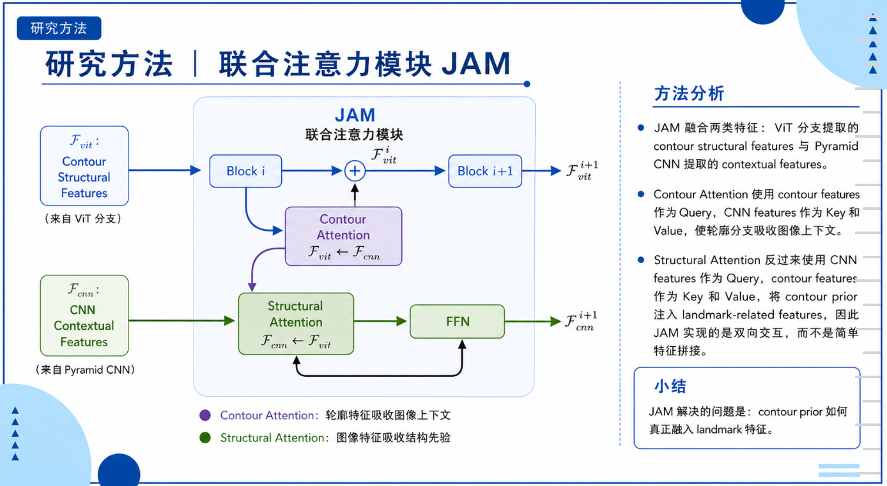

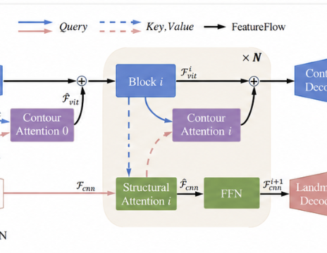

这幅图你应该按照虚线实线颜色来画


**GPT：**

**tool：**

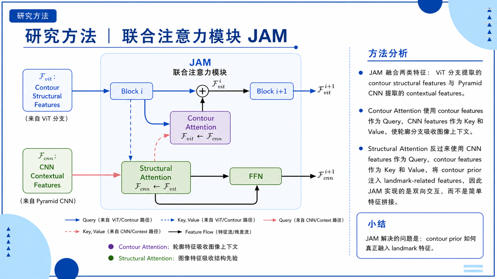

{"prompt":"Edit Image A, which is the current PPT slide titled “研究方法｜联合注意力模块 JAM”. Preserve the overall slide template exactly: white background, blue border, top-left blue tag “研究方法”, large blue title, decorative blue corner shapes, right-side “方法分析” text block, and bottom-right “小结” box. Keep the page content and wording essentially the same. \n\nUse Image B as the style-and-accuracy reference for the central JAM diagram line conventions. Correct the central JAM module so that the arrows, line styles, and colors follow the original paper’s visual logic more faithfully:\n- Blue solid arrows represent Query on the contour/ViT path.\n- Blue dashed arrows represent Key/Value when coming from the contour/ViT path.\n- Pink/light-red solid arrows represent Query on the CNN/context path.\n- Pink/light-red dashed arrows represent Key/Value when coming from the CNN/context path.\n- Black solid arrows represent Feature Flow.\n- The black residual/feature-flow arrows around the plus nodes and FFN should be drawn as black solid lines, not in the wrong colors.\n- Make the connections among Block i, Contour Attention, Structural Attention, FFN, the plus node, and Block i+1 visually match the original paper more closely.\n\nSpecifically fix the left diagram area on the slide:\n- Keep the two input boxes on the left: “F_vit: Contour Structural Features (来自 ViT 分支)” in blue and “F_cnn: CNN Contextual Features (来自 Pyramid CNN)” in green.\n- In the JAM panel, keep the title “JAM 联合注意力模块”.\n- Keep the top path with Block i → plus node → Block i+1 → F_vit^{i+1}.\n- Keep the purple Contour Attention box and the green Structural Attention box and the green FFN box.\n- But redraw the arrows so the semantics match Image B: blue solid query arrow from Block i to Contour Attention; blue dashed key/value arrow from Block i downward into Structural Attention; pink solid query arrow from CNN feature flow into Structural Attention; pink dashed key/value arrow from Structural/contour interaction into Contour Attention; black feature-flow arrow from Structural Attention to FFN and the black feedback/skip connection into FFN; black vertical arrow into the plus node; black feature-flow arrow from the plus node to Block i+1.\n- Include a small legend or bottom explanatory line that is consistent with the corrected color semantics. The bottom two bullet notes may remain, but the actual diagram arrows must be the priority.\n\nAlso improve visual neatness: make arrowheads clear, line thickness consistent, and spacing tidy. Ensure all text remains crisp and readable. Do not add a page number.","reference_image_paths":["/mnt/data/ghostwriter_images/context/f8d6af88-88a8-5383-b9a9-79134b05ecd8.png","/mnt/data/ghostwriter_images/context/ed2bb6cb-f32a-5d97-a10a-35ed722a3804.png"],"aspect_ratio":"16:9"}

**tool：**


Model caption: A clean academic presentation slide / infographic style diagram in Chinese and English about a module called JAM. Overall scene: a white background slide with blue border and decorative blue circular/triangle accents (a large blue dot/circle in top-right and bottom-left corners with light-blue semicircle shapes and small triangle patterns), lots of schematic blocks and arrows, and right-side text analysis. Slide title area at top left: a small rounded blue label reads “研究方法” in white. Large bold blue title text: “研究方法 | 联合注意力模块 JAM” with a thin blue underline line ending in a blue dot. Left/center main diagram: a large rounded-light-blue/outlined panel labeled at top center “JAM” (big blue) and below it “联合注意力模块” in black. Inside the panel is a block diagram with colored boxes and arrows. Left outside/left-of-panel inputs: top left a blue-outlined rounded rectangle with text “$F_{vit}$：\nContour\nStructural\nFeatures” in blue; under it in black “（来自 ViT 分支）”. Below that (left side) a green-outlined rounded rectangle with text “$F_{cnn}$：\nCNN\nContextual\nFeatures” in green; under it “（来自 Pyramid CNN）” in black. These feed into the main diagram: From the blue $F_{vit}$ box, a solid blue arrow points right into a rounded blue rectangle labeled “Block i”. From “Block i” a solid blue arrow continues right to a circled “+” node (white circle outlined/with bold line). Above the arrow near the circled plus is text “$F^{i}_{vit}$” (black/italic-like math). From the plus, a black arrow continues right to a rounded blue rectangle “Block i+1”; to its right a blue arrow points out of the panel with text “$F^{i+1}_{vit}$” (black) near it. Beneath/around the top path are attention modules: a purple rounded rectangle in the middle labeled “Contour\nAttention” and below it “$F_{vit} \leftarrow F_{cnn}$” in black/italics, connected by arrows: a solid blue curved arrow drops from “Block i” down/right into the purple “Contour Attention”. A dashed blue vertical line (Key/Value style) drops from “Block i” downward toward the lower module (dashed line arrow pointing down into the green structural attention). A dashed red/pink curved arrow (Key/Value from CNN side) goes from the lower area up toward the purple Contour Attention (arrow pointing up into it). The circled “+” node has a black upward arrow coming up from below (residual/skip connection). Lower path: from the green input “$F_{cnn}$: CNN Contextual Features” a solid pink/red arrow goes right into a large green rounded rectangle “Structural\nAttention” and beneath/inside it “$F_{cnn} \leftarrow F_{vit}$”. From the green Structural Attention box a solid black arrow goes right to a smaller green rounded rectangle “FFN”. From FFN a solid black arrow exits the panel to the right with text “$F^{i+1}_{cnn}$”. Also a black feedback/residual line: a thick black line runs from the output of FFN downward/around and back up into the FFN input (a return/skip connection), forming a loop (arrow pointing up into FFN). Near the Structural Attention, the dashed blue line from above points into it (indicating key/value from ViT), and the pink/red arrow from $F_{cnn}$ provides query into it. Bottom/legend under the main diagram: a legend row with colored arrows and labels: a solid blue arrow with text “Query（来自 ViT/Contour 路径）”, a dashed blue arrow with “Key, Value（来自 ViT/Contour 路径）”, a solid pink/red arrow with “Query（来自 CNN/Context 路径）”, a dashed pink/red arrow with “Key, Value（来自 CNN/Context 路径）”, and a solid black arrow with “Feature Flow（特征流/残差流）”. Below that, two bullet-like colored dot legend lines: a purple dot with “Contour Attention：轮廓特征吸收图像上下文” and a green dot with “Structural Attention：图像特征吸收结构先验”. Right-side panel: separated by a vertical dotted blue line, title “方法分析” in blue with a blue underline. Under it are bullet points (blue dots) with Chinese+English content: First bullet: “JAM 融合两类特征：ViT 分支提取的\ncontour structural features 与 Pyramid\nCNN 提取的 contextual features。” Second bullet: “Contour Attention 使用 contour features\n作为 Query，CNN features 作为 Key 和\nValue，使轮廓分支吸收图像上下文。” Third bullet: “Structural Attention 反过来使用 CNN\nfeatures 作为 Query，contour features\n作为 Key 和 Value，将 contour prior\n注入 landmark-related features，因此\nJAM 实现的是双向交互，而不是简单\n特征拼接。” Bottom right summary box: a rounded blue-outlined rectangle titled “小结” in blue, with text inside in black: “JAM 解决的问题是： contour prior 如何\n真正融入 landmark 特征。” Decorative accents: on the far right edge near the top is a light-blue circular/arc shape with a vertical stack of small blue triangles and a small tan/gray line element; bottom left has a large light-blue semicircle with a vertical line of small blue triangles and a solid blue circle overlapping the corner; bottom right has a couple of light-blue horizontal line bars. The overall style is clean vector infographic, sans-serif fonts, blue/green/purple color palette, clear arrows and boxes, like a research slide.<|has_watermark|><|has_borders|>

**tool：**

Generated images from the last `image_gen.text2im` call were saved at:
- /mnt/data/ghostwriter_images/generated/a_clean_academic_presentation_slide_infographic_1.png (wxh = 1672 x 941, exact aspect ratio 1672:941, close to aspect ratio 16:9)

You can visually inspect the generated image directly in the tool result above. Only reopen the saved path if you need programmatic processing or want to pass the image into another tool call.

---

<a id="turn-029"></a>

## 对话 029

**我：**

你翻译该篇论文标题

**GPT：**

论文标题：

**Contour Makes It Stronger: Cross-Domain Cephalometric Landmark Detection Based on Contour Priors**

可以翻译为：

**轮廓使其更强：基于轮廓先验的跨域头影测量关键点检测**

更适合 PPT/论文汇报的中文标题可以写成：

**基于轮廓先验的跨域头影测量关键点检测**

如果想保留原题中 “Contour Makes It Stronger” 的强调语气，可以写成：

**轮廓增强模型鲁棒性：基于轮廓先验的跨域头影测量关键点检测**

我更建议你汇报 PPT 里用第二个：

> **基于轮廓先验的跨域头影测量关键点检测**

简洁、学术、正式。

---

<a id="turn-030"></a>

## 对话 030

**我：**

我感觉这样介绍很多介绍不清楚，每个讲的太简单了

**GPT：**

你这个判断是对的。现在这 5 页更像是**“研究方法概览版”**，适合让老师知道大框架，但如果你的汇报重点是**技术细节**，这样讲会有一个问题：

> **CAM、JAM、DRM 每个模块都只讲了“它是什么”，但没有讲清楚“为什么这么设计、输入输出是什么、内部怎么计算、训练时怎么监督、测试时怎么用”。**

所以听起来会像：

```text
CAM：学轮廓
JAM：融特征
DRM：约束回归
```

这确实太浅了。你需要把研究方法部分从 **5 页扩展到 9–11 页**。

---

## 我建议改成这个结构

### 第 1 页：研究方法｜整体架构

放论文 Fig.2 原图。

这一页只讲整体：

```text
输入图像
→ 上方 CAM 分支学习 contour structural features
→ 下方 Pyramid CNN 提取 contextual features
→ JAM 双向交互
→ Contour Decoder / Landmark Decoder 输出
→ DRM 用 Lreg 约束回归
```

这一页不要讲细节，只让老师先建立全局框架。

---

## CAM 部分建议拆成 3 页

### 第 2 页：CAM｜为什么需要 contour prior？

这一页不要急着讲公式，先讲动机。

右侧文字可以写：

> 传统 landmark detection 直接预测离散关键点，但单个 landmark 容易依赖局部 image appearance，例如灰度、纹理和边缘。跨域场景下，不同设备、分辨率和对比度会导致 appearance 变化，使 landmark-based features 不稳定。
>
> 因此，作者引入 anatomical contour prior。相比离散点，contour 表示的是连续解剖结构，能够编码 landmark 之间的拓扑关系，具有更强的跨域稳定性。

小结：

> **CAM 的第一步不是为了预测点，而是为了让模型学会稳定的解剖结构。**

这一页讲清楚：**为什么要 contour。**

---

### 第 3 页：CAM｜landmark 如何变成 contour？

这一页讲三次样条插值。

左边画：

```text
GT landmarks
→ 按解剖结构分组
→ cubic spline interpolation
→ mandibular / maxillary / soft tissue contours
```

右侧重点讲：

> CAM 首先根据医学定义对 landmarks 进行分组。相关 landmarks 不再被看作孤立点，而是被组织到不同 anatomical contours 中。例如，下颌相关点形成 mandibular contour，上颌相关点形成 maxillary contour，软组织相关点形成 soft tissue contour。
>
> 然后作者使用 cubic spline interpolation 将离散 landmarks 连接成连续平滑曲线。这样做比直线连接更符合真实颅颌解剖结构，因为骨组织和软组织边界本身具有连续平滑的形态。

小结：

> **这一步把“点级监督”扩展成“线级结构”。**

这一页解决老师可能问的：

```text
contour 是怎么来的？
是不是额外标注的？
为什么用 cubic spline？
```

---

### 第 4 页：CAM｜contour 如何变成可学习监督？

这页虽然不要叫 “Contour Heatmap 构建”，但内容必须讲。标题可以改成：

**研究方法｜CAM中的轮廓监督**

这样不会像单独新增无关模块。

左边画：

```text
anatomical contour
→ distance transform
→ Gaussian response
→ contour heatmap
```

右侧文字：

> 得到连续 contour 后，模型不能直接学习一条数学曲线，因此作者将 contour 转换为 contour heatmap。首先通过 distance transform 计算每个像素到 contour 的最近距离，然后使用 Gaussian function 将距离转换为响应值。距离 contour 越近，响应越高；距离 contour 越远，响应越低。
>
> 这样，contour 就从连续曲线变成了 dense supervision。与 landmark heatmap 的点状监督不同，contour heatmap 提供的是线状结构监督，可以帮助模型学习更完整的 anatomical structure。

小结：

> **训练时 GT contour heatmap 是监督信号；测试时模型需要自己预测 contour。**

这一页一定要讲清楚你之前问过的问题：

```text
contour 是先验，为什么还要预测？
训练时用 GT 监督，测试时没有 GT，所以要让模型学会预测。
```

---

## JAM 部分建议拆成 2 页

### 第 5 页：JAM｜为什么不能直接拼接特征？

这一页先讲“为什么需要 JAM”。

左边可以放 Fig.2 中 JAM 区域或你修正后的 JAM 图。

右侧写：

> 此时模型有两类特征：一类是 ViT 分支提取的 contour structural features，记为 Fvit；另一类是 Pyramid CNN 提取的 contextual features，记为 Fcnn。
>
> Fvit 更偏向全局解剖结构和 contour topology，Fcnn 更偏向局部图像证据，例如边缘、纹理和灰度变化。二者语义不同、来源不同，如果只是简单 concat，只是把特征堆叠起来，并不能显式建模 contour 和 landmark/context 之间的对应关系。
>
> 因此，作者设计 JAM，通过 attention 让两类特征进行双向交互。

小结：

> **JAM 的目的不是“拼接特征”，而是“建立 contour 与 image context 的对应关系”。**

---

### 第 6 页：JAM｜Contour Attention 与 Structural Attention

这一页详细讲两个 attention。

右侧文字：

> JAM 包含两个方向的信息交互。第一个是 Contour Attention，它使用 contour features 作为 Query，CNN features 作为 Key 和 Value。其作用是让 contour branch 从图像上下文中吸收局部证据，使 contour features 具备 image-aware 能力。
>
> 第二个是 Structural Attention，它反过来使用 CNN features 作为 Query，contour features 作为 Key 和 Value。其作用是将 contour prior 注入 landmark-related contextual features，使 CNN features 不再只依赖 image appearance，而是受到 anatomical structure 的引导。
>
> 因此，Contour Attention 让轮廓特征感知图像，Structural Attention 让图像特征感知结构。

小结：

> **Contour Attention：Fvit ← Fcnn；Structural Attention：Fcnn ← Fvit。**

这一页要讲清楚：

```text
Query 是谁？
Key/Value 是谁？
信息从哪里流向哪里？
为什么是双向？
```

---

## DRM 部分建议拆成 3 页

### 第 7 页：DRM｜为什么普通回归损失不够？

这一页讲 anisotropic uncertainty。

右侧写：

> 普通 landmark regression loss 通常只计算预测点和真实点之间的欧氏距离，相当于默认误差在各个方向上是均匀的，也就是 isotropic uncertainty。
>
> 但对于位于 contour 上或附近的 landmarks，误差分布往往具有方向性。沿 contour 的 tangential direction，预测点可能更容易滑动；而垂直 contour 的 normal direction，偏离会更明显破坏解剖结构。因此，这类 landmark 的误差更接近椭圆形分布，也就是 anisotropic uncertainty。

小结：

> **DRM 的出发点是：错误不仅有大小，还有方向。**

---

### 第 8 页：DRM｜如何得到 tangent 和 normal？

这一页讲方向场。

左边画：

```text
contour heatmap
→ gradient
→ normal direction
→ rotate 90°
→ tangent direction
```

右侧写：

> DRM 首先从 contour heatmap 中计算空间梯度。由于 contour heatmap 在轮廓附近响应最高，离轮廓越远响应越低，因此 heatmap 的梯度方向可以近似表示垂直于 contour 的 normal direction。
>
> 得到 normal direction 后，将其旋转 90°，即可得到沿 contour 方向的 tangent direction。这样，模型可以在每个 contour 位置获得两个局部几何方向：切线方向和法线方向。

小结：

> **normal 来自 heatmap gradient，tangent 由 normal 旋转 90° 得到。**

---

### 第 9 页：DRM｜如何构造 direction-sensitive loss？

这一页讲误差分解和 Et/En。

右侧写：

> 得到 tangent 和 normal direction 后，DRM 将 landmark prediction offset 投影到这两个方向上。也就是说，模型不再只看总误差，而是将误差分解为切线方向误差 Δt 和法线方向误差 Δn。
>
> 随后，作者通过 moving average 统计两个方向上的误差能量 Et 和 En。Et 表示模型在 tangent direction 上历史误差的强度，En 表示模型在 normal direction 上历史误差的强度。最后，利用这些方向能量对 Δt 和 Δn 进行归一化，构造 direction-sensitive regression loss。
>
> 这样，模型优化时不仅知道预测点错了多少，还知道错误发生在什么方向。

小结：

> **DRM = 误差分解 + 方向能量统计 + 方向敏感回归约束。**

---

## Loss 建议单独 1 页

### 第 10 页：研究方法｜损失函数与训练目标

右侧写：

> 本文最终损失由三部分组成。Lh 是 landmark heatmap loss，用于监督 Landmark Decoder 输出的关键点热图；Lmse 是 contour heatmap loss，用于监督 Contour Decoder 输出的轮廓热图；Lreg 是 direction-sensitive regression loss，用于根据 contour 的 tangent 和 normal directions 约束关键点坐标回归。
>
> 三者分别对应三个层面：Lh 是点级监督，Lmse 是线级结构监督，Lreg 是方向几何监督。

小结：

> **整体训练目标：点监督 + 线监督 + 方向监督。**

---

# 所以你现在应该这样改

你现在的 5 页版本：

```text
整体架构
CAM
JAM
DRM
Loss
```

太像“概览”。

建议改成 10 页：

```text
1. 整体架构
2. CAM：为什么需要 contour prior
3. CAM：landmark 如何生成 contour
4. CAM：contour 如何变成监督信号
5. JAM：为什么不能简单 concat
6. JAM：双向 attention 机制
7. DRM：为什么需要方向敏感回归
8. DRM：tangent / normal 怎么来
9. DRM：误差分解与方向能量
10. Loss：点、线、方向三层监督
```

这样你汇报时就会从：

```text
“我知道这个模块叫什么”
```

变成：

```text
“我知道这个模块为什么提出、输入输出是什么、内部怎么做、解决什么问题”
```

这才像技术细节汇报。

---

## 你每个模块都要按这个模板讲

后面每一页都按这个逻辑：

```text
1. 这个模块解决什么问题？
2. 输入是什么？
3. 内部怎么做？
4. 输出是什么？
5. 为什么对跨域有帮助？
```

比如 CAM：

```text
问题：landmark 依赖局部 appearance，不稳定
输入：GT landmarks / image features
做法：分组 → spline → contour → heatmap → ViT features
输出：contour heatmap / contour structural features
作用：学习 domain-invariant anatomical prior
```

JAM：

```text
问题：contour features 和 CNN features 不能简单拼接
输入：Fvit 和 Fcnn
做法：Contour Attention + Structural Attention
输出：结构增强后的 contextual features
作用：让 landmark features 从 appearance-driven 变成 structure-guided
```

DRM：

```text
问题：普通回归损失不区分误差方向
输入：contour heatmap + predicted/GT landmark
做法：计算 tangent/normal → 投影误差 → Et/En → Lreg
输出：direction-sensitive regression loss
作用：让定位更符合 contour geometry
```

这样讲就清楚很多。

---

<a id="turn-031"></a>

## 对话 031

**我：**

可以，先生成前5页。你先思考前5页放什么，内容是什么

**GPT：**

可以。前 5 页我建议这样安排：**1 页总览 + 3 页 CAM + 1 页 JAM 动机**。
这样不会一上来就把 CAM/JAM/DRM 全部压缩讲完，而是先把最关键的 **contour prior 是怎么来的、为什么要预测、怎么变成监督信号** 讲清楚。

---

# 前 5 页整体逻辑

```text
第 1 页：整体架构
先让老师知道整套网络怎么跑

第 2 页：CAM 动机
为什么不能只预测 landmark，为什么要 contour prior

第 3 页：CAM 构造
landmark 如何通过 cubic spline 生成 anatomical contour

第 4 页：CAM 监督
contour 如何变成 contour heatmap，并用于训练监督

第 5 页：JAM 动机
有了 contour features，为什么不能简单 concat，为什么要 attention 融合
```

这 5 页讲完后，老师应该能听懂：

> 本文不是随便加一个 contour，而是先用 CAM 构造并学习 contour prior，再准备进入 JAM 让 contour 真正参与 landmark 特征学习。

---

# 第 1 页：研究方法｜整体架构

## 这一页放什么

左侧放**论文 Fig.2 原图**，不要重新绘制。
右侧放方法分析。
不加页码，不加 PART，只保留左上角蓝色小标签“研究方法”。

## 页面标题

**研究方法｜整体架构**

## 右侧内容

**方法分析**

本文提出 **Contour-aware Joint Learning，CJL** 框架，用于跨域头影测量关键点检测。整体网络包含两条主要分支：上方 **Contour-aware Module，CAM** 学习 contour structural features，下方 **Pyramid CNN** 提取 contextual features。

中间的 **Joint Attention Module，JAM** 负责两类特征的交互融合，使 landmark 表征不再只依赖 image appearance，而是受到 anatomical contour prior 的引导。

输出端包括 **Contour Decoder** 和 **Landmark Decoder**，分别预测 contour heatmap 和 landmark heatmaps；最右侧的 **Lreg** 对应 **Direction-sensitive Regression Module，DRM**，用于结合 contour geometry 约束关键点回归。

## 小结

**整体主线：CAM 学轮廓，JAM 融特征，DRM 约束回归。**

## 这页讲什么

这一页只讲整体，不讲细节。
讲完后自然过渡：

> 接下来我会先展开 CAM，因为它解决的是 contour prior 从哪里来，以及模型如何学习这个先验。

---

# 第 2 页：研究方法｜为什么需要 Contour Prior

## 这一页放什么

左侧做一个对比图：

```text
传统 landmark-based detection
离散红点 + 局部图像纹理

vs

contour-guided detection
红点 + 连续蓝色/红色轮廓
```

可以加一个 source / target 外观变化的小示意：

```text
source image：清晰
target image：模糊/对比度变化
但 contour structure 相对稳定
```

## 页面标题

**研究方法｜为什么需要 Contour Prior**

## 右侧内容

**方法分析**

传统 cephalometric landmark detection 直接预测离散 landmarks，模型容易依赖关键点附近的局部 **image appearance**，例如灰度、纹理、边缘和对比度。

在 cross-domain 场景中，不同设备、分辨率和成像参数会导致 source domain 与 target domain 的 appearance 发生变化，使 landmark-based features 不稳定。

相比之下，**anatomical contour** 表示的是连续解剖结构，能够编码多个 landmarks 之间的拓扑关系，例如下颌轮廓、上颌轮廓和软组织轮廓。因此 contour prior 更适合作为跨域稳定的结构先验。

## 小结

**引入 contour prior 的目的：减少模型对局部 appearance 的依赖。**

## 这页讲什么

这一页不是讲 CAM 具体怎么做，而是讲**为什么要有 CAM**。

你汇报时重点说：

> landmark 是最终目标，但单个点太局部；contour 是连续结构，可以给模型提供更稳定的解剖约束。

---

# 第 3 页：研究方法｜Landmark 到 Anatomical Contour

## 这一页放什么

左侧画 CAM 的第一段流程：

```text
GT Landmarks
↓
按解剖结构分组
↓
Cubic Spline Interpolation
↓
Anatomical Contours
```

图里要有三条 contour：

```text
mandibular contour
maxillary contour
soft tissue contour
```

最好用不同颜色区分。

## 页面标题

**研究方法｜Landmark 到 Anatomical Contour**

## 右侧内容

**方法分析**

CAM 首先根据医学定义对 landmarks 进行分组。相关 landmarks 不再被视为孤立点，而是被组织到不同 anatomical contours 中，例如 **mandibular contour**、**maxillary contour** 和 **soft tissue contour**。

随后，作者使用 **cubic spline interpolation** 将离散 landmarks 连接为连续平滑曲线。相比直接用折线连接，三次样条插值更符合真实颅颌解剖结构的连续形态。

因此，这一步的作用是将原本的点级 landmark 标注扩展为线级 anatomical contour 表示。

## 小结

**这一步把离散点转换为连续解剖轮廓。**

## 这页讲什么

重点回答老师可能问的：

> contour 是额外标注的吗？

你的回答方向：

> 不是。它是由已有 GT landmarks 按医学结构分组后，通过 cubic spline 插值得到的，所以没有额外增加人工标注成本。

---

# 第 4 页：研究方法｜CAM 中的轮廓监督

## 这一页放什么

左侧画热图构造流程，但标题不要写“Contour Heatmap 构建”，而是放在 CAM 内部讲：

```text
Anatomical Contour
↓
Distance Transform
↓
Gaussian Function
↓
Contour Heatmap
↓
Contour Decoder Supervision
```

图里重点突出：

```text
near contour = high response
far from contour = low response
```

## 页面标题

**研究方法｜CAM 中的轮廓监督**

## 右侧内容

**方法分析**

得到 anatomical contour 后，模型不能直接学习一条数学曲线，因此论文将 contour 转换为 **contour heatmap**。首先通过 **distance transform** 计算每个像素到 contour 的最近距离，然后使用 **Gaussian function** 将距离转换为热图响应。

距离 contour 越近，响应越高；距离 contour 越远，响应越低。这样，连续 contour 就被转化为网络可以学习的 **dense supervision**。

训练阶段，GT contour heatmap 由 ground-truth landmarks 构造，用于监督 Contour Decoder；测试阶段没有 ground-truth contour，因此模型必须学会从图像中自行预测 contour structure。

## 小结

**训练时用 GT contour heatmap 监督；测试时模型自己预测 contour。**

## 这页讲什么

这一页是 CAM 最容易被问的地方。你要特别讲清楚：

```text
contour 是先验，但不是测试时直接输入的答案；
它在训练时作为结构监督，让模型学会预测和利用轮廓。
```

---

# 第 5 页：研究方法｜为什么需要 JAM

## 这一页放什么

左侧放一个“两个特征不能简单拼接”的图：

```text
Fvit：Contour Structural Features
Fcnn：CNN Contextual Features

Simple Concatenation：只堆叠，不建模关系
JAM：通过 attention 双向交互
```

可以在左侧下半部分预告：

```text
Contour Attention：Fvit ← Fcnn
Structural Attention：Fcnn ← Fvit
```

但这一页先不要讲太细，下一页再详细讲两个 attention。

## 页面标题

**研究方法｜为什么需要 JAM**

## 右侧内容

**方法分析**

经过 CAM 后，模型获得了 **contour structural features**，记为 Fvit；同时，Pyramid CNN 提取了 **contextual features**，记为 Fcnn。

Fvit 更关注全局解剖轮廓和结构拓扑，Fcnn 更关注局部图像证据，例如边缘、纹理和灰度变化。二者语义不同、来源不同，如果只是简单 concat，只能完成特征堆叠，不能显式建模 contour 与 landmark/context 之间的对应关系。

因此，作者设计 **Joint Attention Module，JAM**，通过 attention 让 contour features 和 contextual features 进行双向交互，使 landmark 表征从 appearance-driven 转向 structure-guided。

## 小结

**JAM 的目的不是拼接特征，而是建立 contour 与 image context 的对应关系。**

## 这页讲什么

这一页是 JAM 的动机页。
你讲完后过渡到下一页：

> 接下来具体看 JAM 是如何通过 Contour Attention 和 Structural Attention 实现双向交互的。

---

# 前 5 页的主线总结

这 5 页的逻辑是：

```text
第 1 页：先给全局框架
第 2 页：说明为什么需要 contour
第 3 页：说明 contour 怎么从 landmark 来
第 4 页：说明 contour 怎么变成网络监督
第 5 页：说明 contour features 怎么准备进入 JAM
```

这比原来的 5 页更清楚，因为 CAM 不再是一页带过，而是拆成了：

```text
为什么要 contour
contour 怎么构造
contour 怎么监督
```

老师听起来会觉得你不是在背模块名，而是真的理解了方法内部逻辑。

---

<a id="turn-032"></a>

## 对话 032

**我：**

可以，生成前5页

**GPT：**

{"batch_requests":[{"prompt":"Create a polished 16:9 Chinese thesis-defense PPT slide image. Use Image A as the visual style anchor: clean white background, blue academic theme, thin blue border, rounded blue corner decorations, top-left blue tag, large dark-blue title, left visual / right analysis layout, bottom-right summary box. No page number. No PART label.\n\nSlide title: “研究方法｜整体架构”. Top-left small rounded blue tag: “研究方法”.\n\nLeft side: place the original paper Fig.2 architecture image from Image B as the main figure, preserving it as a paper figure rather than redrawing it. Put it inside a clean white figure panel with subtle border/shadow. Under the figure, add a short caption: “图2  CJL整体框架：CAM提取轮廓结构特征，Pyramid CNN提取上下文特征，JAM进行特征交互，DRM约束关键点回归。”\n\nRight side heading: “方法分析”. Use 3 concise blue-bullet paragraphs:\n1. “本文提出 Contour-aware Joint Learning（CJL）框架，用于跨域头影测量关键点检测。”\n2. “上方 CAM 分支学习 contour structural features；下方 Pyramid CNN 提取 contextual features；中间 JAM 完成两类特征交互。”\n3. “输出端由 Contour Decoder 预测轮廓热图，Landmark Decoder 预测关键点热图，DRM 通过 Lreg 约束关键点回归。”\n\nBottom-right summary box: heading “小结”, content “整体主线：CAM 学轮廓，JAM 融特征，DRM 约束回归。”\n\nMake all Chinese text crisp, readable, formal, and well-spaced. Keep the slide elegant and uncluttered.","reference_image_paths":["/mnt/data/ghostwriter_images/generated/wide_presentation_slide_layout_with_white_backgrou_1.png","/mnt/data/image(22).png"],"referenced_image_ids":[],"aspect_ratio":"16:9"},{"prompt":"Create a polished 16:9 Chinese thesis-defense PPT slide image matching Image A's blue academic template exactly: clean white background, thin blue border, rounded blue decorations, top-left blue tag “研究方法”, large dark-blue title, left visual / right analysis layout, bottom-right summary box. No page number. No PART label.\n\nSlide title: “研究方法｜为什么需要 Contour Prior”.\n\nLeft side: create a clear comparison diagram. Left half labeled “Landmark-based detection”: show a grayscale cephalometric X-ray with several red discrete landmark dots and a small local texture/edge zoom, indicating dependence on local image appearance. Right half labeled “Contour-guided detection”: show the same X-ray with red dots connected/organized by smooth blue/red contour lines, indicating stable anatomical structure. Add a small source/target visual: “Source domain” and “Target domain” with different brightness/contrast, but similar contour structure. Use simple arrows and clean academic styling.\n\nRight side heading: “方法分析”. Use 3 concise blue-bullet paragraphs:\n1. “传统 landmark detection 直接预测离散关键点，容易依赖局部 image appearance，如灰度、纹理、边缘和对比度。”\n2. “在 cross-domain 场景中，不同设备、分辨率和成像参数会导致 source 与 target 的 appearance 变化，使 landmark-based features 不稳定。”\n3. “Anatomical contour 表示连续解剖结构，能够编码多个 landmarks 之间的拓扑关系，因此更适合作为跨域稳定的结构先验。”\n\nBottom-right summary box: heading “小结”, content “引入 contour prior 的目的：减少模型对局部 appearance 的依赖。”\n\nMake the comparison visually intuitive but academic. Keep all text crisp and readable.","reference_image_paths":["/mnt/data/ghostwriter_images/generated/wide_presentation_slide_layout_with_white_backgrou_1.png"],"referenced_image_ids":[],"aspect_ratio":"16:9"},{"prompt":"Create a polished 16:9 Chinese thesis-defense PPT slide image matching Image A's blue academic template exactly. White background, thin blue border, blue geometric corner decorations, top-left blue tag “研究方法”, large dark-blue title, left visual / right analysis panel, bottom-right summary box. No page number. No PART label.\n\nSlide title: “研究方法｜Landmark 到 Anatomical Contour”.\n\nLeft side: create a clean CAM construction diagram showing: “GT Landmarks” → “按解剖结构分组” → “Cubic Spline Interpolation” → “Anatomical Contours”. Use a grayscale cephalometric X-ray or schematic skull. Show red discrete landmark points first, then group them into three anatomical structures, then connect them with smooth colored curves. Clearly label three contours: “mandibular contour（下颌轮廓）”, “maxillary contour（上颌轮廓）”, and “soft tissue contour（软组织轮廓）”. Add a small note near the flow: “No extra contour annotation”.\n\nRight side heading: “方法分析”. Use 3 concise blue-bullet paragraphs:\n1. “CAM 首先根据医学定义对 landmarks 进行分组，相关 landmarks 不再被视为孤立点，而是被组织到不同 anatomical contours 中。”\n2. “作者使用 cubic spline interpolation 将离散 landmarks 连接为连续平滑曲线，相比折线连接更符合真实颅颌解剖结构。”\n3. “这一步将原本的点级 landmark 标注扩展为线级 anatomical contour 表示，且不需要额外人工标注 contour。”\n\nBottom-right summary box: heading “小结”, content “这一步把离散点转换为连续解剖轮廓。”\n\nUse readable Chinese and English labels, clean arrows, and no clutter.","reference_image_paths":["/mnt/data/ghostwriter_images/generated/wide_presentation_slide_layout_with_white_backgrou_1.png"],"referenced_image_ids":[],"aspect_ratio":"16:9"},{"prompt":"Create a polished 16:9 Chinese thesis-defense PPT slide image matching Image A's blue academic template exactly. White background, thin blue border, rounded blue decorations, top-left blue tag “研究方法”, large dark-blue title, left visual / right analysis layout, bottom-right summary box. No page number. No PART label.\n\nSlide title: “研究方法｜CAM 中的轮廓监督”.\n\nLeft side: create a clear technical flow diagram inside CAM: “Anatomical Contour” → “Distance Transform” → “Gaussian Function” → “Contour Heatmap” → “Contour Decoder Supervision”. Use a smooth blue/red anatomical contour line on a schematic X-ray, then a distance-field visualization with bands around the contour, then a Gaussian heatmap where near-contour regions are bright/high response and far regions are low response. Add concise labels: “near contour = high response（近轮廓响应高）” and “far from contour = low response（远离轮廓响应低）”. Also add a small train/test contrast: “Training: GT contour heatmap supervises decoder” and “Testing: model predicts contour structure”.\n\nRight side heading: “方法分析”. Use 3 concise blue-bullet paragraphs:\n1. “得到 anatomical contour 后，模型不能直接学习一条数学曲线，因此论文将 contour 转换为 contour heatmap。”\n2. “首先通过 distance transform 计算每个像素到 contour 的最近距离，再用 Gaussian function 将距离转换为热图响应。”\n3. “训练时 GT contour heatmap 用于监督 Contour Decoder；测试时没有 ground-truth contour，模型需要自行预测 contour structure。”\n\nBottom-right summary box: heading “小结”, content “训练时用 GT contour heatmap 监督；测试时模型自己预测 contour。”\n\nMake the heatmap/distance transform part visually prominent and easy to understand.","reference_image_paths":["/mnt/data/ghostwriter_images/generated/wide_presentation_slide_layout_with_white_backgrou_1.png"],"referenced_image_ids":[],"aspect_ratio":"16:9"},{"prompt":"Create a polished 16:9 Chinese thesis-defense PPT slide image matching Image A's blue academic template exactly. White background, thin blue border, blue corner decorations, top-left blue tag “研究方法”, large dark-blue title, left visual / right analysis panel, bottom-right summary box. No page number. No PART label.\n\nSlide title: “研究方法｜为什么需要 JAM”.\n\nLeft side: create a conceptual comparison diagram. Show two feature boxes: “Fvit：Contour Structural Features” in blue and “Fcnn：CNN Contextual Features” in green. Below or to the side, compare two fusion choices: (1) “Simple Concatenation” with stacked blocks and a red warning label “只堆叠，不建模关系”; (2) “Joint Attention Module（JAM）” with bidirectional arrows and labels “Contour Attention：Fvit ← Fcnn” and “Structural Attention：Fcnn ← Fvit”. Emphasize that JAM establishes correspondence between contour and image context. Use a clean technical layout with blue/green/purple colors.\n\nRight side heading: “方法分析”. Use 3 concise blue-bullet paragraphs:\n1. “经过 CAM 后，模型获得 contour structural features，记为 Fvit；同时 Pyramid CNN 提取 contextual features，记为 Fcnn。”\n2. “Fvit 更关注全局解剖轮廓和结构拓扑，Fcnn 更关注局部图像证据，如边缘、纹理和灰度变化。”\n3. “如果只是简单 concat，只能完成特征堆叠，不能显式建模 contour 与 landmark/context 之间的对应关系，因此作者设计 JAM 进行 attention 交互。”\n\nBottom-right summary box: heading “小结”, content “JAM 的目的不是拼接特征，而是建立 contour 与 image context 的对应关系。”\n\nMake the diagram clear, polished, and presentation-ready.","reference_image_paths":["/mnt/data/ghostwriter_images/generated/wide_presentation_slide_layout_with_white_backgrou_1.png"],"referenced_image_ids":[],"aspect_ratio":"16:9"}]}

**tool：**

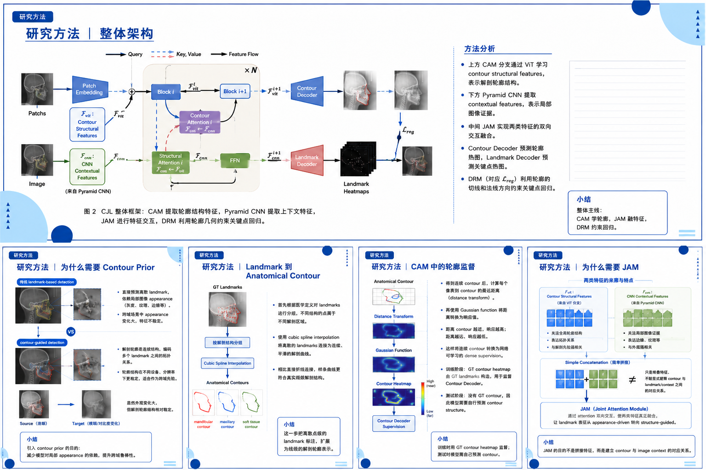

---

<a id="turn-033"></a>

## 对话 033

**我：**


这是架构图，不是一张图片里面5页，是1张图片1页，共生成5页，明白吗。你先不要生成，先理解我的意思。


**GPT：**

明白了。

你的意思是：

**不是生成一张大图，里面拼 5 页缩略图；而是要分别生成 5 张独立的 PPT 页面图片。**

也就是：

```text
第1张图片 = 第1页：研究方法｜整体架构
第2张图片 = 第2页：为什么需要 Contour Prior
第3张图片 = 第3页：Landmark 到 Anatomical Contour
第4张图片 = 第4页：CAM 中的轮廓监督
第5张图片 = 第5页：为什么需要 JAM
```

每一张都应该是**一页完整 PPT**，横版 16:9，样式统一，不能拼成一张合集。

你上传的这张图是**图2架构图的局部参考**，意思是后面生成 JAM 或整体架构页时，里面的箭头、虚线、实线、颜色关系要尽量按照论文原图来画，而不是随便改。

所以后面我应该这样做：

1. **一次生成 1 页或 5 张独立图片**，但每张都是单页 PPT；
2. 每页保持你给的蓝色学术模板风格；
3. 左侧是该页核心图示，右侧是“方法分析”和“小结”；
4. 不要页码；
5. 不要 PART 03，只保留“研究方法”；
6. 图2页使用论文原图或高度还原论文原图，而不是重新乱画；
7. JAM 页的箭头逻辑要严格区分：
- 蓝色实线：Query，来自 ViT / contour 路径；
- 红色实线：Query，来自 CNN / context 路径；
- 蓝色虚线：Key / Value，来自 ViT / contour 路径；
- 红色虚线：Key / Value，来自 CNN / context 路径；
- 黑色实线：Feature Flow。

我已经理解了。下一步再生成时，我会按**5张独立页面图片**来做，不做合集。

---

<a id="turn-034"></a>

## 对话 034

**我：**

可以，生成

**GPT：**

**tool：**

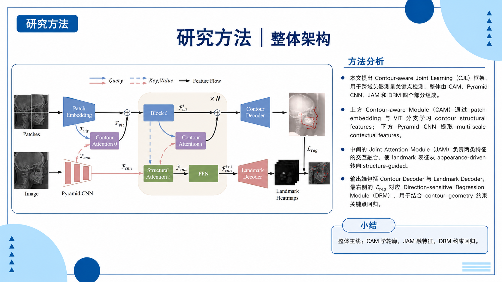


{"prompt":"Create a single PowerPoint-style academic slide in Chinese, 16:9 horizontal layout. Use Image A as the style reference for the overall blue academic PPT look: clean white background, navy-blue title, thin blue border line, rounded blue label at top-left, light blue geometric corner decorations, simple and professional. Use Image B as the layout reference: a wide figure panel on the left and a text-analysis panel on the right, with a small rounded summary box at the lower-right. Use Image C as the content reference for the architecture figure: place the original paper's Fig.2 clearly on the left side as the main figure, keeping it readable and faithful. Do not add page numbers, do not add any school logo, and do not add any PART label. The small blue label at the top-left should say “研究方法”. The main title should be “研究方法｜整体架构”.\n\nSlide content requirements:\n- Left side: show the Fig.2 architecture image clearly, scaled to fit well and remain readable.\n- Right side: a section title “方法分析” in navy blue, followed by 4 detailed bullet points in Chinese:\n  1. “本文提出 Contour-aware Joint Learning（CJL）框架，用于跨域头影测量关键点检测，整体由 CAM、Pyramid CNN、JAM 和 DRM 四个部分组成。”\n  2. “上方 Contour-aware Module（CAM）通过 patch embedding 与 ViT 分支学习 contour structural features；下方 Pyramid CNN 提取 multi-scale contextual features。”\n  3. “中间的 Joint Attention Module（JAM）负责两类特征的交互融合，使 landmark 表征从 appearance-driven 转向 structure-guided。”\n  4. “输出端包括 Contour Decoder 与 Landmark Decoder；最右侧的 Lreg 对应 Direction-sensitive Regression Module（DRM），用于结合 contour geometry 约束关键点回归。”\n- At the lower-right, place a rounded box titled “小结”, containing the sentence: “整体主线：CAM 学轮廓，JAM 融特征，DRM 约束回归。”\n\nTypography should be clean and readable. Make the slide look like a polished thesis defense PPT page, not like a poster. Use the same blue theme consistently.", "reference_image_paths":["/mnt/data/ghostwriter_images/context/1a771fdf-df1e-5336-afe3-4e04c275d169.png","/mnt/data/ghostwriter_images/context/ed178b11-d69b-5a54-823a-f4c74afe798e.png","/mnt/data/ghostwriter_images/context/7ad7e2e9-555b-55c1-9c18-712a907c66c5.png"],"aspect_ratio":"16:9"}

**tool：**


Model caption: A clean academic presentation slide (PowerPoint style) with a white background and blue-themed design elements, wide landscape layout. **Overall scene:** a single slide with a large title at the top, a flowchart/diagram figure on the left, and explanatory text on the right, plus decorative blue shapes and borders. **Top/overall layout:** a thin blue frame line around the slide and light-blue geometric decorations (large filled circles and arcs/triangles) in corners. At the very top left is a rounded blue label/badge with white Chinese text “研究方法”. Along the top center is a huge bold dark-blue title: “研究方法｜整体架构” (the vertical divider “｜” between the phrases). Beneath the title, the main content is split: a large diagram panel on the left inside a rounded rectangle with a blue border, and on the right a text section titled “方法分析” with bullet points, plus a summary box at the bottom right. **Left diagram area:** inside a large rounded-corner box (white interior, thin blue border) is a complex architecture diagram. At the very top of this diagram area is a legend line with colored arrows and labels: a blue arrow line labeled “Query”, a red/pink arrow line labeled “Query” (actually the first legend shows blue then red; text next to blue line reads “Query”), dashed blue line and dashed/pink line labeled “Key,Value”, and a black arrow labeled “Feature Flow”. (Exact legend text: “Query” (blue), “Key,Value” (dashed/colored), “Feature Flow” (black); the dashed red/blue are shown as key/value line style.) On the far left of the diagram are two stacked input images: top is a set of grayscale skull/x‑ray patches (a tiled patch grid of a lateral skull x-ray and jaw/neck), with the label “Patches” beneath; below is a full grayscale lateral skull x‑ray labeled “Image”. An arrow from the “Patches” block points right into a blue trapezoid/rounded-rectangle-like block labeled “Patch\nEmbedding”. A blue arrow/flow goes from that block to the right into a sum/merge circle “+” (a small circled plus). From near the Patch Embedding output, a blue curved/angled arrow labeled “$\mathcal{F}_{vit}$” goes down/left-ish toward a purple box labeled “Contour\nAttention 0”; also that blue arrow has the text “$\mathcal{F}_{vit}$” near it. The Patch Embedding output continues right into the main central module. The central area is highlighted by a pale beige rounded-rectangle container with “× N” at the upper right, indicating repeated blocks. Inside it at the left-top is a blue box “Block i”. From Block i a black arrow labeled “$\mathcal{F}^i_{vit}$” (rendered as $\mathcal{F}^i_{vit}$) goes right to another circled “+” merge point on the right edge of the beige module, indicating residual/addition, then continues right out. A purple box “Contour\nAttention i” is to the lower-right of Block i, connected via a blue arrow/line from Block i (down/curved) into this purple box and a dashed/pinkish arrow line (key/value style) also coming toward it from the structural path (dashed/pink). Below-left inside the beige module is a green box “Structural\nAttention i”; a dashed blue downward line from Block i goes down toward Structural Attention i (showing query), and there is a red/pink dashed/curved arrow from Structural path up/into Contour Attention i. From Structural Attention i a black arrow labeled “$\hat{\mathcal{F}}_{cnn}$” (i.e., $\hat{\mathcal{F}}_{cnn}$) goes right to a green box labeled “FFN”. From FFN a black arrow exits to the right labeled “$\mathcal{F}^{i+1}_{cnn}$” (i.e., $\mathcal{F}^{i+1}_{cnn}$) toward the right boundary of the beige module. On the left-lower side outside/entering the beige module is the bottom branch: from the “Image” x‑ray, an arrow points right into a pink/red pyramid-like CNN icon (stacked trapezoid/column shapes) labeled “Pyramid CNN”. From Pyramid CNN a red/pink arrow labeled “$\mathcal{F}_{cnn}$” goes right into the Structural Attention i box. Also from Pyramid CNN a dashed red/pink arrow goes up/right toward “Contour\nAttention 0” with label “$\mathcal{F}_{cnn}$” near it. The “Contour Attention 0” box connects up/right back into the first merge/sum “+” point (a black curved arrow into that plus), with “$\mathcal{F}_{vit}$” text on the arrow that came from Patch Embedding. The outputs on the right side of the beige module: the top path (after the +) leads to a blue trapezoid block “Contour\nDecoder”, then to the right a grayscale skull x‑ray image with a red contour overlay line (red contour tracing jaw/face profile and mandible). The bottom path (from FFN output) goes right to a pinkish block “Landmark\nDecoder”, then to the right to a stack of dark heatmap-like images (black/dark with bright spots), labeled “Landmark\nHeatmaps”, and then to the right a grayscale x‑ray with red landmark dots on anatomical points (red dots/marks), and above/beside that final output there is a downward arrow from the contour output area to the right with text “$\mathcal{L}_{reg}$” pointing to the landmark output—indicating the regression loss/connection. The overall diagram uses blue/purple/green/pink blocks, arrows (solid, dashed), and math-style feature labels like “$\mathcal{F}_{vit}$”, “$\mathcal{F}_{cnn}$”, “$\hat{\mathcal{F}}_{cnn}$”, “$\mathcal{F}^i_{vit}$”, “$\mathcal{F}^{i+1}_{cnn}$” and “$\mathcal{L}_{reg}$” with plus symbols in circles for residual merges. **Right text column (analysis):** at the top right is a section title in bold dark blue: “方法分析” with a thin blue underline line. Below are four bullet points (each with a dark blue circular bullet) in Chinese, with mixed English terms in parentheses and some English phrases, all in a clean sans-serif style: 1) “本文提出 Contour-aware Joint Learning（CJL）框架，\n用于跨域头影测量关键点检测，整体由 CAM、Pyramid\nCNN、JAM 和 DRM 四个部分组成。” 2) “上方 Contour-aware Module（CAM）通过 patch\nembedding 与 ViT 分支学习 contour structural\nfeatures；下方 Pyramid CNN 提取 multi-scale\ncontextual features。” 3) “中间的 Joint Attention Module（JAM）负责两类特征\n的交互融合，使 landmark 表征从 appearance-driven\n转向 structure-guided。” 4) “输出端包括 Contour Decoder 与 Landmark Decoder；\n最右侧的 L_{reg} 对应 Direction-sensitive Regression\nModule（DRM），用于结合 contour geometry 约束\n关键点回归。” (The “L_{reg}” is shown as a math-like subscripted text: “L_{reg}”.) **Bottom-right summary box:** beneath the bullets is a rounded blue-outlined box with a light blue filled header pill that reads “小结” in bold blue; inside the box on a light-blue background is the summary sentence: “整体主线：CAM 学轮廓，JAM 融特征，DRM 约束回归。” **Decorative elements:** top-right has a large dark blue circle and a big light-blue circular corner shape with a vertical stack of small dark-blue triangles (four or five) on the far right margin; bottom-left has a large light-blue semicircle/arc with a vertical stack of small dark-blue triangles (five) and a dark blue filled circle near the bottom edge; bottom-right has three horizontal light-blue bars/stripes (like a menu or design accent). The overall style is a clean academic slide with blue theme, rounded shapes, and a combination of Chinese and English/technical labels.<|has_watermark|><|has_borders|>

**tool：**

Generated images from the last `image_gen.text2im` call were saved at:
- /mnt/data/ghostwriter_images/generated/a_clean_academic_presentation_slide_powerpoint_st_1.png (wxh = 1672 x 941, exact aspect ratio 1672:941, close to aspect ratio 16:9)

You can visually inspect the generated image directly in the tool result above. Only reopen the saved path if you need programmatic processing or want to pass the image into another tool call.

{"batch_requests":[{"reference_image_paths":["/mnt/data/ghostwriter_images/generated/a_clean_academic_presentation_slide_powerpoint_st_1.png"],"referenced_image_ids":[],"aspect_ratio":"16:9","prompt":"Create a single-slide PowerPoint-style academic presentation page in Chinese, matching the visual style and layout system of Image A. Image A is the style anchor: keep the same clean blue academic template, white background, thin blue border, rounded blue label at top left with white text \"研究方法\", large dark-blue title style, decorative blue circles/arcs/triangle accents in the corners, a large figure area on the left, a right-side text column titled \"方法分析\", and a rounded \"小结\" box at the bottom-right. Do not include any page number, PART label, logo, or footer page count. Generate one complete slide only.\n\nSlide title: \"研究方法｜为什么需要 Contour Prior\"\n\nLeft figure area: create a clear conceptual scientific illustration that compares traditional landmark-based detection with contour-guided detection under cross-domain shift. Show two small cephalometric X-ray examples labeled Source Domain and Target Domain, with visible appearance differences (contrast/clarity differences) but similar anatomy. On the left side of the figure, show \"传统 landmark-based\" with several isolated red landmark points and emphasize dependence on local image appearance. On the right side, show \"contour-guided\" with red landmark points plus smooth colored anatomical contours (mandibular contour, maxillary contour, soft tissue contour), emphasizing stable structural information. Include simple arrows or short labels to indicate that image appearance changes across domains while contour structure remains relatively stable. Keep the figure polished, academic, and easy to understand.\n\nRight text column title: \"方法分析\"\n\nRight text bullets (Chinese, concise but technical):\n• 传统 cephalometric landmark detection 直接预测离散 landmarks，模型容易依赖关键点附近的局部 image appearance，例如灰度、纹理、边缘和对比度。\n• 在 cross-domain 场景中，不同设备、分辨率和成像参数会导致 source domain 与 target domain 的 appearance 发生变化，使 landmark-based features 不稳定。\n• 相比之下，anatomical contour 表示的是连续解剖结构，能够编码多个 landmarks 之间的拓扑关系，例如 mandibular contour、maxillary contour 和 soft tissue contour。\n• 因此 contour prior 更适合作为跨域稳定的结构先验，可减少模型对局部 appearance 的依赖。\n\nBottom-right summary box heading: \"小结\"\nSummary text: \"引入 contour prior 的目的：减少模型对局部 appearance 的依赖。\"\n\nEnsure all Chinese text is clean and legible, balanced, and fits neatly in the right column."},{"reference_image_paths":["/mnt/data/ghostwriter_images/generated/a_clean_academic_presentation_slide_powerpoint_st_1.png"],"referenced_image_ids":[],"aspect_ratio":"16:9","prompt":"Create a single-slide PowerPoint-style academic presentation page in Chinese, matching the visual style and layout system of Image A. Image A is the style anchor: keep the same blue academic template, white background, thin blue border, top-left blue rounded label with white text \"研究方法\", large title typography, left figure region, right text column titled \"方法分析\", and a rounded bottom-right \"小结\" box. Do not include any page number, PART label, or logo. Generate one complete slide only.\n\nSlide title: \"研究方法｜Landmark 到 Anatomical Contour\"\n\nLeft figure area: create a clear process diagram showing how ground-truth landmarks are converted into anatomical contours. The process should read from left to right or top to bottom and include: 1) \"GT Landmarks\" with a cephalometric X-ray and multiple colored landmark points; 2) \"按解剖结构分组\" with grouped sets of points; 3) \"Cubic Spline Interpolation\" showing smooth interpolation; 4) \"Anatomical Contours\" showing three smooth colored contours over the X-ray: mandibular contour, maxillary contour, and soft tissue contour. Use arrows between stages. Visually distinguish the three contours with different harmonious colors. The figure should look polished and scientific.\n\nRight text column title: \"方法分析\"\n\nRight text bullets:\n• CAM 首先根据医学定义对 landmarks 进行分组，相关 landmarks 不再被视为孤立点，而是被组织到不同 anatomical contours 中。\n• 论文重点使用三类轮廓：mandibular contour、maxillary contour 和 soft tissue contour，以表达不同解剖区域的连续结构。\n• 随后作者采用 cubic spline interpolation，将离散 landmarks 连接成连续平滑曲线；相比直接折线连接，三次样条更符合真实颅颌解剖形态。\n• 因此，这一步实现了从点级 landmark 标注到线级 anatomical contour 表示的扩展，而无需额外人工轮廓标注。\n\nBottom-right summary box heading: \"小结\"\nSummary text: \"这一步把离散点转换为连续解剖轮廓。\"\n\nEnsure the text is legible and the figure dominates the left side."},{"reference_image_paths":["/mnt/data/ghostwriter_images/generated/a_clean_academic_presentation_slide_powerpoint_st_1.png"],"referenced_image_ids":[],"aspect_ratio":"16:9","prompt":"Create a single-slide PowerPoint-style academic presentation page in Chinese, matching the visual style and layout system of Image A. Image A is the style anchor: keep the same blue academic template, white background, thin blue border, top-left rounded blue label with white text \"研究方法\", large title style, left figure area, right-side text column titled \"方法分析\", and a rounded bottom-right \"小结\" box. Do not include any page number, PART label, or logo. Generate one complete slide only.\n\nSlide title: \"研究方法｜CAM 中的轮廓监督\"\n\nLeft figure area: create a clear instructional process diagram for contour supervision inside CAM. Show a flow from 1) \"Anatomical Contour\" with a cephalometric X-ray and overlaid smooth contour line; 2) \"Distance Transform\" visualized as distance bands or grayscale distance map; 3) \"Gaussian Function\" or Gaussian response curve and heatmap conversion; 4) \"Contour Heatmap\" with a line-shaped heatmap where near contour = high response and far from contour = low response; 5) an arrow to \"Contour Decoder Supervision\" indicating training supervision. Make the diagram concise, academic, and visually intuitive.\n\nRight text column title: \"方法分析\"\n\nRight text bullets:\n• 得到 anatomical contour 后，模型不能直接学习一条数学曲线，因此论文将 contour 转换为 contour heatmap。\n• 首先通过 distance transform 计算每个像素到 contour 的最近距离，然后利用 Gaussian function 将距离映射为热图响应。\n• 距离 contour 越近，响应越高；距离 contour 越远，响应越低。这样连续 contour 就被转换为网络可以学习的 dense supervision。\n• 训练阶段，GT contour heatmap 由 ground-truth landmarks 构造，用于监督 Contour Decoder；测试阶段没有 ground-truth contour，因此模型必须学会自行预测 contour structure。\n\nBottom-right summary box heading: \"小结\"\nSummary text: \"训练时用 GT contour heatmap 监督；测试时模型自己预测 contour。\"\n\nMake the left figure clear and high quality; keep all Chinese text readable."},{"reference_image_paths":["/mnt/data/ghostwriter_images/generated/a_clean_academic_presentation_slide_powerpoint_st_1.png","/mnt/data/ghostwriter_images/context/e9d5f796-3a4a-591b-a339-49c29e4dd58e.png"],"referenced_image_ids":[],"aspect_ratio":"16:9","prompt":"Create a single-slide PowerPoint-style academic presentation page in Chinese, matching the visual style and layout system of Image A. Image A is the style anchor: use the same clean blue academic template, white background, thin blue border, top-left rounded blue label with white text \"研究方法\", large title typography, left figure region, right text column with heading \"方法分析\", and a rounded bottom-right \"小结\" box. Do not include any page number, PART label, or logo. Generate one complete slide only. Image B is a content reference showing the original JAM area from the paper; follow its logic and arrow conventions when drawing any small JAM structure elements.\n\nSlide title: \"研究方法｜为什么需要 JAM\"\n\nLeft figure area: create a conceptual explanatory diagram about why JAM is needed. Show two incoming feature types: a blue box labeled \"Fvit: Contour Structural Features\" and a green box labeled \"Fcnn: CNN Contextual Features\". Show a small branch labeled \"Simple Concatenation\" with a visual cross or warning indicating that simple stacking cannot model relations. Then show a larger highlighted JAM interaction block inspired by Image B, containing a simplified but faithful dual-interaction structure: blue/purple pathway for Contour Attention and green pathway for Structural Attention. Respect the logic and color conventions from Image B: blue solid arrows for contour-side query, red/pink solid arrows for CNN-side query where appropriate, blue dashed arrows for contour-side key/value, red/pink dashed arrows for CNN-side key/value, and black arrows for feature flow. The figure should communicate that JAM enables bidirectional interaction rather than simple concatenation. Include short labels: \"Contour Attention: Fvit ← Fcnn\" and \"Structural Attention: Fcnn ← Fvit\".\n\nRight text column title: \"方法分析\"\n\nRight text bullets:\n• 经过 CAM 后，模型获得 contour structural features，记为 Fvit；同时，Pyramid CNN 提取 contextual features，记为 Fcnn。\n• Fvit 更关注全局解剖轮廓和结构拓扑，Fcnn 更关注局部图像证据，例如边缘、纹理和灰度变化；二者语义不同、来源不同。\n• 如果只是简单 concat，只能完成特征堆叠，不能显式建模 contour 与 landmark/context 之间的对应关系。\n• 因此作者设计 Joint Attention Module（JAM），通过 attention 让 contour features 与 contextual features 进行双向交互，使 landmark 表征从 appearance-driven 转向 structure-guided。\n\nBottom-right summary box heading: \"小结\"\nSummary text: \"JAM 的目的不是拼接特征，而是建立 contour 与 image context 的对应关系。\"\n\nMake the slide polished, clear, and consistent with Image A."}]}

**tool：**


Model caption: A clean academic presentation slide / infographic in Chinese about a research method, overall scene: a white slide with blue accents and a border, multiple panels and diagrams, like a PowerPoint template. Overall layout: large title at top center, a left big diagram workflow, a right text column with bullet points and a bottom-right summary box, plus decorative blue circles/triangles and rounded shapes. Top-left corner has a rounded blue label (pill) with white Chinese text “研究方法”. At the very top center in very large bold dark-blue font: “研究方法｜CAM 中的轮廓监督”. The slide has a thin blue outline border and decorative shapes: top-right shows a large dark-blue circle overlapping a light-blue arc/half-circle region with a vertical stack of small blue triangles (arrow/triangle icons) on the far right; bottom-left has a large light-blue circular/rounded shape with a vertical column of blue triangles and a solid dark-blue circle, and a thin blue line connecting/border-like elements; bottom-right has three short light-blue horizontal lines (like a menu icon/stylized bars).
Left main panel: a large rounded-rectangle box (white inside, blue outline) containing a 5-step pipeline/diagram with headings and images, arrows between steps, and explanatory subtitles under each step. Across the top of this box are numbered stages in blue circular badges with white numbers and bilingual-like labels in black/dark text. Step 1 on the far left: blue circle “1” above the title “Anatomical\nContour” (two-line). Below is a grayscale lateral cephalometric X-ray image of a skull/face (side profile), with a smooth red contour line tracing anatomical boundaries (jawline, nasal/cranial outline area). Under the image is Chinese caption in black: “人工标注得到的\n解剖轮廓（示例）”. Between steps 1 and 2 is a solid blue arrow pointing right. Step 2: blue circle “2” above “Distance\nTransform”. Beneath is a grayscale distance-map-like image: a white/bright contour line surrounded by concentric bands of gray (lighter near contour, darker farther), like distance rings; to the right of step 1 arrow to this panel. Under it, Chinese caption: “计算每个像素到\ncontour 的最近距离”. Next arrow pointing right to step 3. Step 3: blue circle “3” above “Gaussian\nFunction”. In the upper part is a small plot: a blue bell curve labeled “G(d)=e^{-d^{2}/2\sigma^{2}}” (rendered as math with superscripts). The vertical axis label in Chinese “响应” with tick labels “1.0”, “0.5”, “0.0”; horizontal axis label “距离 d” with “0” at the left. Dashed/grid-like reference line near top and dotted/vertical line at center (mean). Below that is a downward arrow. Under arrow is a horizontal grayscale bar legend labeled “距离 d” and below the bar “近” on the left and “远” on the right. Under the panel is Chinese caption: “用 Gaussian function\n将距离映射为响应”. Next arrow pointing right to step 4. Step 4: blue circle “4” above “Contour\nHeatmap”. The main image is a black background heatmap showing a contour-like shape (same side-profile silhouette line) rendered as a glowing bright line: hot colors (yellow/white core) and orange/red glow, fading to dark/black; beside it a vertical color bar labeled on the top “高” and at the bottom “低”, with gradient from yellow/white at top to red/orange to dark at bottom. Under the image, Chinese caption: “距离 contour 越近，\n响应越高；越远，\n响应越低”. Next arrow pointing right to step 5. Step 5: blue circle “5” above “Contour Decoder\nSupervision”. To the right is a rounded-rectangle box with a light blue outline/background and an icon of a stylized neural-network/block diagram: several blue 3D-ish stacked blocks/encoder-decoder-like shapes. Below/inside or under the icon area is Chinese text: “作为 GT 监督信号\n训练 Contour Decoder”. The overall pipeline reads left to right with arrows between the numbered steps 1→2→3→4→5.
Right column area: at top right, a heading in bold blue “方法分析” with a thin blue line under/near it. Below are bullet points (blue circular bullets) with Chinese text mixed with English terms: First bullet: “得到 anatomical contour 后，模型不能直接学习一条\n数学曲线，因此论文将 contour 转换为 contour heatmap。” Second bullet: “首先通过 distance transform 计算每个像素到 contour 的\n最近距离，然后利用 Gaussian function 将距离映射为\n热图响应。” Third bullet: “距离 contour 越近，响应越高；距离 contour 越远，\n响应越低。这样连续 contour 就被转换为网络可以学习\n的 dense supervision。” Fourth bullet: “训练阶段，GT contour heatmap 由 ground-truth\nlandmarks 构造，用于监督 Contour Decoder；测试阶段\n没有 ground-truth contour，因此模型必须学会自行预测\ncontour structure。” Bottom-right summary box: a rounded rectangle with a blue outline and a pill-like label tab at its top reading “小结” in bold blue. Inside the box, centered/left-aligned text: “训练时用 GT contour heatmap 监督；\n测试时模型自己预测 contour。” The style is clean, academic, with consistent blue theme, sans-serif fonts, and clear infographic layout.<|has_watermark|><|has_borders|>

**tool：**


Model caption: A clean academic presentation slide / infographic style image with a white background and blue accents, like a PowerPoint research-methods slide. **Overall layout**: a wide slide with a blue border/outline and decorative blue circular/triangular accents (a bold blue dot near the top-right corner, a light blue semi-circle/curved shape with a column of small blue triangles on the far right, and on the bottom left a large light-blue rounded shape with a vertical stack of small blue triangles and a solid blue circle; also three short horizontal light-blue lines at the bottom-right). **Top area**: on the upper left, a rounded blue badge/label with white Chinese text “研究方法”. Centered large title at the top in dark blue: “研究方法 | Landmark 到 Anatomical Contour” (bold sans-serif style; the “Landmark 到 Anatomical Contour” portion in the same big heading). **Main content area split into left diagram and right text column**. Left side: a large rounded-rectangle panel/box with a thin blue outline containing a four-step pipeline/flow diagram from left to right with arrows. At the top of each column is a blue rounded header label with white text, and beneath are cephalometric X-ray images and schematic drawings; arrows between stages. **Stage 1 (far left)**: header in blue: “1. GT Landmarks”. Under it, a lateral skull/cephalometric radiograph (grayscale) showing a human head/face/neck in profile (no visible external person identity; it is an X-ray). Overlaid are many colored dot landmarks (small circles) at various anatomical positions: red/pinkish dots along the upper facial/maxillary region, blue dots along lower jaw/mandible, and green dots tracing soft tissue profile points along the face outline and chin/neck region; additional points around teeth and cranial/soft-tissue landmarks. The dots are in multiple colors (notably red/pink, blue, green) and are connected only in later steps. **Between stage panels**: a thick dark-blue rightward arrow pointing to the next stage. **Stage 2**: header in blue: “2. 按解剖结构分组”. Under it, on a white background (or light panel), three grouped sections in outlined boxes with titles and colored dot sets. Top box has a red/pink outline and title “Mandibular Landmarks” in red, with several red/pink dot markers arranged like a mandibular landmark cluster (a curve-like distribution). Middle box has a blue outline and title “Maxillary Landmarks” in blue, with multiple blue dots arranged in a cluster/curve. Bottom box has a green outline and title “Soft Tissue Landmarks” in green, with green dots forming a profile-like curve/vertical arc. **Another dark-blue arrow** points right to stage 3. **Stage 3**: header in blue: “3. Cubic Spline Interpolation”. Under it, three subpanels stacked vertically, each with text and a spline illustration. Top subpanel: title “Mandibular Spline” in red; shows red/pink dots connected by a smooth curved red spline line (cubic-spline style) forming the mandibular contour. Middle subpanel: title “Maxillary Spline” in blue; blue dots connected by a smooth blue spline curve (arched line along upper/maxillary area). Bottom subpanel: title “Soft Tissue Spline” in green; green dots connected by a smooth green spline curve (soft tissue profile contour). The boxes are bordered in the respective colors and the lines are smooth, showing interpolation from points to curves. **Another dark-blue arrow** to the final stage. **Stage 4 (right within diagram box)**: header in blue: “4. Anatomical Contours”. Under it, another lateral cephalometric X-ray (grayscale) of the same type. Overlaid are three continuous colored contour lines: a red line representing the maxillary contour (upper jaw area, around nasal/maxillary region), a blue line representing the mandibular contour (lower jaw curve), and a green line representing the soft tissue profile contour (face outline/soft tissue including nose/lips/chin/neck profile). The contours are smooth and continuous, hugging anatomical shapes. Beneath or to the side within this panel is a legend with colored line samples and labels: a red line next to “Maxillary Contour”, a blue line next to “Mandibular Contour”, and a green line next to “Soft Tissue Contour”. **Right column (text analysis and summary)**: at the upper right, a section title in blue: “方法分析” with a thin blue horizontal line beneath it. Below are bullet points (blue circular bullets) with Chinese text (black/gray body font, with some English terms mixed in). The bullets read: 1) “CAM 首先根据医学定义对 landmarks 进行分组，相关 landmarks 不再被视为孤立点，而是被组织到不同 anatomical contours 中。” 2) “论文重点使用三类轮廓：mandibular contour、maxillary contour 和 soft tissue contour，以表达不同解剖区域的连续结构。” 3) “随后作者采用 cubic spline interpolation，将离散 landmarks 连接成连续平滑曲线；相比直接折线连接，三次样条更符合真实颅颌解剖形态。” 4) “因此，这一步实现了从点级 landmark 标注到线级 anatomical contour 表示的扩展，而无需额外人工轮廓标注。” Below this, at the bottom right of the slide, a rounded boxed summary area with a heading in a pill/label style: “小结” in blue, and inside the rounded rectangle: “这一步把离散点转换为连续解剖轮廓。” **Styling details**: clean scientific slide, blue theme, sans-serif fonts; labels in white on blue tabs; colored accents (red/pink, blue, green) for contours and points; arrows between stages; lots of rounded boxes and neat alignment. The whole slide looks like a methodology diagram explaining conversion from “landmarks” to “anatomical contour” using grouping and cubic spline interpolation.<|has_watermark|><|has_borders|>

**tool：**


Model caption: A clean academic presentation slide / infographic style diagram. Overall: a white slide with blue themed borders and accents, like a PowerPoint academic poster page. The overall scene is a wide slide with a large title area at top and a two‑column layout: a big diagram/figure on the left and explanatory bullet text on the right, plus a summary box at the bottom right. Blue outline border around the whole slide, with decorative blue shapes: a rounded blue label at upper left and blue circles/triangles in the corners; light blue semicircle/rounded decorations with small blue triangle arrows on the far right and bottom-left corners, and a small triple-line icon in the bottom-right corner. Top header: at upper left inside a rounded blue pill/box is white text “研究方法”. Centered near the top in large bold dark-blue font the main title reads “研究方法 | 为什么需要 JAM”. At the top right there is a large blue circle and a pale blue curved area with a vertical stack of small blue triangles (triangle motifs). Main content left: inside a large rounded-rectangle panel (thin blue outline) containing a diagram comparing simple concatenation vs JAM. Upper legend across top inside this panel: several arrow samples and labels in a row. From left: a solid blue arrow with text “Contour Query”; below/near it a solid reddish/pink arrow with “CNN Query”; then a dashed blue arrow with “Contour Key/Value”; a dashed red/pink arrow with “CNN Key/Value”; and a solid black arrow with “Feature Flow”. Left side of diagram: two input blocks stacked vertically. Top block is a blue rounded-rectangle with white/large text “$F_{vit}$:” on one line and below “Contour” “Structural” “Features” (stacked). Below it, a green rounded-rectangle with white/large text “$F_{cnn}$:” and below “CNN” “Contextual” “Features”. From each block a black/rightward arrow leads into the left-middle simple fusion diagram: a dotted/dashed blue rounded box labeled “Simple” on one line and “Concatenation” beneath it (blue text). Inside/next to it are two vertically stacked feature-bar visuals: the top is a row of blue rectangular segment blocks (like a feature vector bar) and the bottom is a row of green rectangular segments; between them a black “+” sign indicates stacking/concatenation. To the right, a red/pink “X” mark and red text below the box: “只能特征堆叠，\n不能建模关系” (Chinese text in red, two lines: “只能特征堆叠，” then “不能建模关系”). A vertical dashed gray divider line separates the left simple part from the right JAM part. To the right of the divider: a blue title at top “JAM：双向交互建模”. The main JAM module is drawn in a large rounded-rectangle beige/tan background panel containing blocks and arrows. Upper pathway (contour side): a blue block “Block i” near top center-left. From its left a black arrow input from the same left source line (coming from $F_{vit}$ input side). Above/beside: to the right of Block i is a black arrow labeled “$F^{i}_{vit}$” pointing to a circled plus node “⊕” on the right edge (fusion), then a black arrow leaving to the right labeled “增强后的\nContour 表征” (stacked: “增强后的” over “Contour 表征”). A purple/lavender box on the lower right part of the top pathway: “Contour\nAttention i”. A blue solid arrow from “Block i” down/diagonally to “Contour Attention i”. Also a dashed blue arrow (from near Block i downward) toward the lower pathway area (indicating key/value). A dashed red/pink arrow curves toward the Contour Attention i from the lower pathway area (indicating cross attention/key-value). Near the left of the top fusion, a small circled add node “⊕” with an incoming black arrow from a purple box on the left labeled “Contour\nAttention 0”; above that arrow is label “$F_{vit}$”. (So the early residual/add connection: $F_{vit}$ input goes to ⊕ and back from Contour Attention 0.) Bottom pathway (CNN/structure side): from the green $F_{cnn}$ input on left, a red/pink arrow goes into the lower module region. A green box “Structural\nAttention i” sits lower left inside the JAM panel. To its right a black arrow labeled “$F^{i}_{cnn}$” leads to a green box “FFN”. To the right of FFN a black arrow labeled “$F^{i+1}_{cnn}$” goes to a circled plus node “⊕” at the right edge, then a black arrow out to the right labeled “增强后的\nContext 表征” (stacked: “增强后的” over “Context 表征”). There is a red/pink box on the lower-left feed into the add node: “Structural\nAttention 0” with an arrow feeding up into the lower plus node; the upward connection to the add node is labeled “$F_{cnn}$”. Also a dashed red/pink path (key/value style) from the upper region into the Structural Attention i (or from it up toward the contour attention path), and a dashed blue path from Block i down to Structural Attention i (representing cross/key-value interactions). Beneath the panel are explanatory legend lines in colored text: in blue “Contour Attention: $F_{vit} \leftarrow F_{cnn}$” and in red “Structural Attention: $F_{cnn} \leftarrow F_{vit}$”. Right side column: a header in blue “方法分析” with a thin line under it, and four bullet points each preceded by a blue dot: 1) “经过 CAM 后，模型获得 contour structural\nfeatures，记为 $F_{vit}$；同时，Pyramid CNN\n提取 contextual features，记为 $F_{cnn}$。” 2) “$F_{vit}$ 更关注全局解剖轮廓和结构拓扑，$F_{cnn}$\n更关注局部图像证据，例如边缘、纹理和灰度\n变化；二者语义不同、来源不同。” 3) “如果只是简单 concat，只能完成特征堆叠，\n不能显式建模 contour 与 landmark/context\n之间的对应关系。” 4) “因此作者设计 Joint Attention Module（JAM），\n通过 attention 让 contour features 与 contextual\nfeatures 进行双向交互，使 landmark 表征从\nappearance-driven 转向 structure-guided。” Bottom-right summary box: a rounded blue-outlined box with a blue pill-like header reading “小结” and below it the text: “JAM 的目的不是拼接特征，而是建立 contour 与\nimage context 的对应关系。” Decorative elements: bottom-left has a large light-blue semicircle/rounded shape with several small blue triangle arrows stacked; a solid blue circle near bottom edge; top-right blue circle and triangle motif; bottom-right three horizontal light-blue lines near the edge. Overall style: clean infographic, sans-serif-like fonts, blue/purple/green/red color coding, many arrows (solid, dashed), plus symbols “⊕”, mathematical subscripts/superscripts.<|has_watermark|><|has_borders|>

**tool：**


Model caption: A clean academic presentation slide in Chinese with a white background and blue design accents, overall scene is a research-methods infographic slide (PowerPoint style) with diagrams on the left and explanatory text on the right. **Overall layout:** a large slide with a blue border line and rounded/soft shapes. Top-left has a rounded blue pill label “研究方法”. Center-top has a big bold dark-blue title “研究方法｜为什么需要 Contour Prior”. Decorative blue circles/arc and small triangle motifs in the corners (top-right a dark-blue circle and a light-blue arc with a vertical stack of small blue triangles; bottom-left a large light-blue semicircle/arc with a vertical stack of blue triangles and a dark-blue circle; bottom-right small light-blue horizontal stripe marks). **Main left diagram area** inside a rounded-rectangle panel (thin blue outline) occupying most of left/middle: a comparative diagram split into two halves (left: landmark-based; right: contour-guided) with a central column showing domain shift.
• At the top of the left diagram section, a header in blue: “传统 landmark-based”. Under it, a sentence in black/red: “仅依赖局部 image appearance” (with “局部 image appearance” in red). On the right diagram section, header in blue: “contour-guided”. Under it, black/red sentence: “利用连续解剖轮廓，编码结构信息” (with “结构信息” in red).
**Left panel content (landmark-based):** a column with two rows for domain comparison. On the far left of this block: top row label in blue “Source Domain” with smaller black Chinese below “(高对比度\n清晰影像)” (line-broken). Next to it a grayscale cephalometric X-ray image (lateral skull profile) with clear contrast; the image is inside a rounded/rectangular frame. To the right of that, a right-pointing arrow leading to a simplified schematic: scattered small red dots (landmarks) arranged like craniofacial points (sparse red points tracing facial landmarks). Below, second row: left label in blue “Target Domain” with smaller black “(低对比度\n模糊影像)”, next to a lower-contrast, blurrier grayscale lateral cephalometric X-ray in a similar boxed frame. To its right another arrow leading to scattered red dots (landmarks), similar but representing the target result (also red dots). At the bottom of this left block is a dashed blue-outlined rounded text box containing: “离散 landmarks 对局部 appearance 变化敏感，\n跨域泛化能力较弱” with “appearance” in English inline and the rest in Chinese, all inside dotted/dashed border.
**Center between the two approaches (domain shift column):** in the middle vertical space between left and right halves is a blue text stack: “跨域场景” above, then “appearance\n发生变化” in blue. Below that a large horizontal blue arrow pointing right. Under/near it green text: “解剖结构\n相对稳定”. There are also dotted/dashed vertical divider lines separating the left, center, and right parts.
**Right panel content (contour-guided):** for the right approach, two rows mirroring the left domains. Top row: a grayscale cephalometric X-ray (clearer, high contrast) in a box, arrow to the right leading to an overlaid contour illustration: the same lateral skull with smooth colored contours and red landmark points. The contours are drawn in colored lines: a blue line for mandibular contour, a green line for maxillary contour, and a purple line for soft tissue contour; red dots (landmarks) placed along/near structures. Second row: a blurrier/lower-contrast target-domain X-ray, arrow to the right to a similar contour/landmark overlay (same colored contours and red dots) showing structure preserved despite appearance change. At the bottom of the right block is a dashed blue rounded text box: “连续轮廓编码结构信息，跨域更稳定，\n对局部 appearance 变化不敏感” with “appearance” in English. Beneath the big left-panel area, a legend strip in a rounded light box: left shows a red dot symbol and text “landmarks（离散关键点）”; then colored line keys: blue line “mandibular contour（下颌骨轮廓）”, green line “maxillary contour（上颌骨轮廓）”, purple line “soft tissue contour（软组织轮廓）”.
**Right-side text column titled “方法分析”:** top right in blue “方法分析” with a thin blue underline/line. Under it are bullet points (blue circular bullets) in Chinese with some English terms mixed in: 1) “传统 cephalometric landmark detection 直接预测\n离散 landmarks，模型容易依赖关键点附近的局部\nimage appearance，例如灰度、纹理、边缘和对比度。” 2) “在 cross-domain 场景中，不同设备、分辨率和成像\n参数会导致 source domain 与 target domain 的\nappearance 发生变化，使 landmark-based features\n不稳定。” 3) “相比之下，anatomical contour 表示的是连续解剖\n结构，能够编码多个 landmarks 之间的拓扑关系，\n例如 mandibular contour、maxillary contour 和\nsoft tissue contour。” 4) “因此 contour prior 更适合作为跨域稳定的结构先验，\n可减少模型对局部 appearance 的依赖。”
**Bottom right summary box:** a rounded rectangular callout with a pill header “小结” in blue, and below it in black: “引入 contour prior 的目的：\n减少模型对局部 appearance 的依赖。” The box has a soft blue fill background area and blue border. The whole slide uses clean sans-serif font, blue color theme, with layout like an academic poster/slide.<|has_watermark|><|has_borders|>

**tool：**

Generated images from the last `image_gen.text2im` call were saved at:
- /mnt/data/ghostwriter_images/generated/a_clean_academic_presentation_slide_in_chinese_wit_2_batch_1.png (wxh = 1672 x 941, exact aspect ratio 1672:941, close to aspect ratio 16:9)
- /mnt/data/ghostwriter_images/generated/a_clean_academic_presentation_slide_infographic_3_batch_2.png (wxh = 1672 x 941, exact aspect ratio 1672:941, close to aspect ratio 16:9)
- /mnt/data/ghostwriter_images/generated/a_clean_academic_presentation_slide_infographic_4_batch_3.png (wxh = 1672 x 941, exact aspect ratio 1672:941, close to aspect ratio 16:9)
- /mnt/data/ghostwriter_images/generated/a_clean_academic_presentation_slide_infographic_5_batch_4.png (wxh = 1672 x 941, exact aspect ratio 1672:941, close to aspect ratio 16:9)

You can visually inspect the generated image directly in the tool result above. Only reopen the saved path if you need programmatic processing or want to pass the image into another tool call.

---

<a id="turn-035"></a>

## 对话 035

**我：**


前5页是这个“第 1 页：先给全局框架
第 2 页：说明为什么需要 contour
第 3 页：说明 contour 怎么从 landmark 来
第 4 页：说明 contour 怎么变成网络监督
第 5 页：说明 contour features 怎么准备进入 JAM”，现在重新生成，不要加研究方法。


**GPT：**

**tool：**


{"batch_requests":[{"prompt":"Edit the provided slide to create a single polished PPT page in the same blue academic template style. Image A is the direct edit target slide. Image B is a reference crop showing that the page title should NOT include the prefix \"研究方法 |\". Preserve the overall template style, blue decorative corners, borders, layout, main diagram, right-side analysis text block, and small summary box. Change the main page title from \"研究方法｜整体架构\" to exactly \"整体架构\" in large bold dark-blue Chinese text centered at the top. Remove any other visible text \"研究方法\" from the slide, including the top-left blue label; either delete that label or keep only a plain blue decorative shape with no text. Keep all other content intact and professional. Output a clean 16:9 slide page.","reference_image_paths":["/mnt/data/研究方法整体架构分析.png","/mnt/data/ghostwriter_images/context/e9b0bdf1-a3fc-5f58-b35b-4ce854a3dab9.png"],"referenced_image_ids":[],"aspect_ratio":"16:9"},{"prompt":"Edit the provided slide to create a single polished PPT page in the same blue academic template style. Image A is the direct edit target slide. Image B is a reference crop indicating that the page title should not include the prefix \"研究方法 |\". Preserve the current layout, blue decorative template, comparison figures, right-side analysis text block, legend, and summary box. Change the main page title from \"研究方法｜为什么需要 Contour Prior\" to exactly \"为什么需要 Contour Prior\" in large bold dark-blue text centered at the top. Remove any other visible text \"研究方法\" from the slide, including the top-left blue label; either delete that label or keep only a plain blue decorative shape with no text. Keep all other content intact and professional. Output a clean 16:9 slide page.","reference_image_paths":["/mnt/data/研究方法_轮廓指导对比分析.png","/mnt/data/ghostwriter_images/context/e9b0bdf1-a3fc-5f58-b35b-4ce854a3dab9.png"],"referenced_image_ids":[],"aspect_ratio":"16:9"},{"prompt":"Edit the provided slide to create a single polished PPT page in the same blue academic template style. Image A is the direct edit target slide. Image B is a reference crop indicating that the page title should not include the prefix \"研究方法 |\". Preserve the current layout, process diagram, right-side analysis text, summary box, and all blue template styling. Change the main page title from \"研究方法｜Landmark 到 Anatomical Contour\" to exactly \"Landmark 到 Anatomical Contour\" in large bold dark-blue text centered at the top. Remove any other visible text \"研究方法\" from the slide, including the top-left blue label; either delete that label or keep only a plain blue decorative shape with no text. Keep all other content intact and professional. Output a clean 16:9 slide page.","reference_image_paths":["/mnt/data/研究方法_从标志到轮廓.png","/mnt/data/ghostwriter_images/context/e9b0bdf1-a3fc-5f58-b35b-4ce854a3dab9.png"],"referenced_image_ids":[],"aspect_ratio":"16:9"},{"prompt":"Edit the provided slide to create a single polished PPT page in the same blue academic template style. Image A is the direct edit target slide. Image B is a reference crop indicating that the page title should not include the prefix \"研究方法 |\". Preserve the current layout, five-step contour supervision diagram, right-side analysis text block, and summary box. Change the main page title from \"研究方法｜CAM 中的轮廓监督\" to exactly \"CAM 中的轮廓监督\" in large bold dark-blue text centered at the top. Remove any other visible text \"研究方法\" from the slide, including the top-left blue label; either delete that label or keep only a plain blue decorative shape with no text. Keep all other content intact and professional. Output a clean 16:9 slide page.","reference_image_paths":["/mnt/data/cam_中的轮廓监督研究方法.png","/mnt/data/ghostwriter_images/context/e9b0bdf1-a3fc-5f58-b35b-4ce854a3dab9.png"],"referenced_image_ids":[],"aspect_ratio":"16:9"},{"prompt":"Edit the provided slide to create a single polished PPT page in the same blue academic template style. Image A is the direct edit target slide. Image B is a reference crop indicating that the page title should not include the prefix \"研究方法 |\". Preserve the current layout, the left-side simple concatenation vs JAM comparison graphic, the internal JAM schematic with correct solid and dashed arrow color logic, the right-side analysis text block, and the summary box. Change the main page title from \"研究方法｜为什么需要 JAM\" to exactly \"为什么需要 JAM\" in large bold dark-blue text centered at the top. Remove any other visible text \"研究方法\" from the slide, including the top-left blue label; either delete that label or keep only a plain blue decorative shape with no text. Keep all other content intact and professional. Output a clean 16:9 slide page.","reference_image_paths":["/mnt/data/研究方法与jam模块解析.png","/mnt/data/ghostwriter_images/context/e9b0bdf1-a3fc-5f58-b35b-4ce854a3dab9.png"],"referenced_image_ids":[],"aspect_ratio":"16:9"}]}

**tool：**


Model caption: A clean scientific presentation slide / infographic with a white background and blue-themed design, like a PowerPoint slide. Overall scene: a wide landscape slide with a large title at the top center and a multi-panel diagram on the left plus explanatory bullet text and a summary box on the right, with decorative blue shapes and borders. Top: a large bold dark-blue title reads “Landmark 到 Anatomical Contour” (mix of English and Chinese character “到”), in a heavy sans-serif font, centered near the top. The slide has a thin blue border line around the page and decorative corner shapes: a rounded blue rectangle/shape in the top-left corner, and in the top-right a large blue circle and a pale-blue semi-circle/arc with small dark-blue triangular arrow-like markers; bottom-left has a pale-blue circular/arc decoration with a vertical stack of small blue triangles and a solid blue circle; bottom-right has small blue horizontal line accents. Left/center main diagram area: a large rounded-rectangle bordered box in blue containing a four-step flowchart-like sequence from left to right, with arrows between steps. At the top of this box are four labeled step headings in blue rounded tabs. Step 1 on the far left: a blue tab reads “1. GT Landmarks”. Below it: a grayscale lateral skull/cephalometric X-ray image with many colored landmark dots placed on the skull/jaw area; dots appear in multiple colors (red, blue, green) and are connected by faint reference? (clusters along mandíbula, maxilla, etc.). The left image is a cephalometric profile X-ray (black/gray/white) with colored landmark points (red, blue, green) placed at anatomical points along jaw, teeth, soft tissue areas. Next to it, a blue rightward arrow to the next column. Step 2 in the next column: blue tab “2. 按解剖结构分组”. Inside are three stacked panels/boxes with colored outlines and titles: top box with red border and title “Mandibular Landmarks” showing scattered red dots (landmarks); middle box with blue border “Maxillary Landmarks” showing scattered blue dots; bottom box with green border “Soft Tissue Landmarks” showing scattered green dots (dots arranged in curved/clustered patterns). Another blue arrow to the next column. Step 3: blue tab “3. Cubic Spline Interpolation”. Inside three spline examples in matching colors: top red panel titled “Mandibular Spline” showing red dots connected by a smooth red spline curve; middle blue panel titled “Maxillary Spline” with blue dots connected by a smooth blue curve; bottom green panel titled “Soft Tissue Spline” with green dots connected by a smooth green curve. Another blue arrow to the right column. Step 4 on the right of the diagram: blue tab “4. Anatomical Contours”. Below it: another lateral skull X-ray (similar grayscale profile) with overlaid contour lines in different colors tracing anatomical outlines: a red contour line (upper jaw/mandible region), a blue contour line (lower/mandible area), and a green soft-tissue outer contour line along the face profile. Under/near this are legend lines and labels: a red line label “Maxillary Contour”; a blue line label “Mandibular Contour”; a green line label “Soft Tissue Contour”. Right side of the slide: a section title in blue “方法分析” with a thin blue underline/line beneath it, then bullet points in Chinese with some English terms (blue bullet dots at line starts). First bullet: “CAM 首先根据医学定义对 landmarks 进行分组，\n相关 landmarks 不再被视为孤立点，而是被组织到\n不同 anatomical contours 中。” (line breaks as in layout). Second bullet: “论文重点使用三类轮廓： mandibular contour、\nmaxillary contour 和 soft tissue contour，以表达\n不同解剖区域的连续结构。” Third bullet: “随后作者采用 cubic spline interpolation，将离散\nlandmarks 连接成连续平滑曲线；相比较直接折线\n连接，三次样条更符合真实解剖解剖形态。” Fourth bullet: “因此，这一步实现了从点级 landmark 标注到线级\nanatomical contour 表示的扩展，而无需额外人\n工轮廓标注。” Right-lower area: a boxed summary section with a rounded blue border and header. The header inside a rounded blue pill reads “小结” and below it in the box is the text “这一步把离散点转换为连续解剖轮廓。” The overall style uses blue outlines, rounded rectangles, and clean sans-serif typography, with a white background and blue/green/red accent colors, like a technical slide about converting landmarks to anatomical contours using cubic splines.<|has_watermark|><|has_borders|>

**tool：**


Model caption: A clean academic presentation slide / infographic with a white background and blue accents, like a PowerPoint scientific poster. Overall: a landscape slide with a large title at the top, a multi-panel diagram across the left-to-center, and a right-side text explanation panel with bullet points and a summary box; blue border and decorative shapes, modern clean infographic style. At the very top center in very large bold dark-blue font: “CAM 中的轮廓监督”. The slide has a thin blue outer border-line with rounded corners and decorative blue shapes: a rounded blue rectangle/slot at the upper-left corner, and on the upper-right a large solid blue circle plus a light-blue curved/arched area with a column of small dark-blue triangle/arrow-like marks (stacked). Bottom-left has a light-blue circular/arc shape with a vertical stack of small dark-blue triangles, and a solid blue circle overlapping; bottom-right has small stacked light-blue horizontal lines like a menu/icon. Main content area: left-to-center contains a large bordered box with rounded corners and a sequence of five steps, each numbered in a blue circle and labeled, connected by right-pointing arrows. Step 1 on far left: blue circle with “1”, title “Anatomical\nContour” (black text); beneath it an X-ray-like side profile skull/cephalometric image in grayscale with a red contour line traced along the face/jaw outline; below in Chinese: “人工标注得到的\n解剖轮廓（示例）”. To the right, step 2: blue circle “2”, title “Distance\nTransform”; beneath a grayscale distance map-like image of a side profile silhouette with contour-like concentric/gradient bands (white/gray contours); below Chinese text: “计算每个像素到\ncontour 的最近距离”. Arrow between steps. Step 3: blue circle “3”, title “Gaussian\nFunction”; beneath a graph showing a bell curve with blue line; above/near it the formula “$G(d)=e^{-\\frac{d^2}{2\\sigma^2}}$”; y-axis label “响应” with tick/labels “1.0”, “0.5”, “0.0”; x-axis labeled “距离 d” with “0” at left; below the graph a downward arrow to a grayscale bar legend labeled “距离 d” with “近” on the left and “远” on the right; under that text in Chinese and English: “用 Gaussian function\n将距离映射为响应”. Arrow to step 4. Step 4: blue circle “4”, title “Contour\nHeatmap”; below a heatmap-like image: side profile outline glowing in hot colors (bright yellow/orange/red) on black background; to the right of it a vertical color scale bar from low to high with Chinese labels “高” at top and “低” at bottom; below the heatmap: “距离 contour 越近，\n响应越高；越远，\n响应越低”. Arrow to step 5. Step 5: blue circle “5”, title “Contour Decoder\nSupervision”; below is a light-blue/white rounded-rectangle illustration of a network-like decoder block diagram (multiple blue-ish stacked layers / blocks resembling an encoder-decoder shape); beneath it Chinese and English: “作为 GT 监督信号\n训练 Contour Decoder”. The sequence is enclosed in the big left/center rounded box, with arrows between each numbered panel. Right side: a section titled “方法分析” in bold blue with a thin horizontal blue line extending to the right; below are bullet points (blue dots) with Chinese and English mixed text: First bullet: “得到 anatomical contour 后，模型不做直接学习一条\n数学曲线，因此它没有 contour 转换为 contour heatmap。” Second bullet: “首先通过 distance transform 计算每个像素到 contour 的\n最近距离，然后利用 Gaussian function 将距离映射为\n热图响应。” Third bullet: “距离 contour 越近，响应越高；距离 contour 越远，\n响应越低。这样连续 contour 就被转换为网络可以学习\n的 dense supervision。” Fourth bullet: “训练阶段，GT contour heatmap 由 ground-truth\nlandmarks 构造，用于监督 Contour Decoder；测试阶段\n没有 ground-truth contour，因此模型必须学会自行预测\ncontour structure。” Bottom-right of the slide: a rounded summary box with a header-like pill label “小结” in blue, and beneath in the box: “训练时用 GT contour heatmap 监督；\n测试时模型自己预测 contour。” The overall color scheme is white background with dark-blue text, blue borders and accents, and illustrations in grayscale and warm heatmap colors; layout is clean and structured with clear infographic panels.<|has_watermark|><|has_borders|>

**tool：**


Model caption: A clean scientific presentation slide / infographic in a blue-and-white style, overall scene: a wide landscape slide with a white background, blue borders, boxes, and infographic elements, like an academic poster or PPT slide. Top center has a very large bold dark-blue title in Chinese with English: “为什么需要 Contour Prior”. At the very top left is a rounded blue pill/rectangle accent; top right has a dark-blue circle and a light-blue semicircle/arc area with a vertical stack of small blue triangles (decorative). The layout: left-to-center has a big comparison diagram inside a rounded blue-outlined panel; right has a text analysis column; bottom has a legend strip and a summary box. **Left/center comparison panel**: At the top of this big panel are two column headings: on the left in blue “传统 landmark-based” with red subtitle text “仅依赖局部 image appearance”; on the right in blue “contour-guided” with black/red subtitle “利用连续解剖轮廓，编码结构信息”. On the far left of the panel are two labeled rows: first row label in blue “Source\nDomain” and beneath in parentheses “(高对比度\n清晰影像)”; second row label in blue “Target\nDomain” and beneath “(低对比度\n模糊影像)”. Under each label is a grayscale lateral skull/cephalometric X-ray image in a rounded-rectangle frame (first row clearer, second row blurrier). To the right of each X-ray is a black arrow pointing to a cluster of red dots (landmarks) arranged in a scattered landmark pattern (higher contrast row and lower contrast row both show red dot clouds). In the middle between left and right sections is a vertical dashed divider line and blue and green annotation: in blue “跨域场景\nappearance\n发生变化” with a thick blue rightward arrow; below in green “解剖结构\n相对稳定”. On the right half labeled “contour-guided”, each row shows: grayscale lateral X-ray (source clearer on top, target blurrier on bottom) with a black arrow pointing to another image where colored contour lines overlay the X-ray: multiple contour outlines in different colors tracing anatomical shapes—red dashed/solid-ish line for landmarks along the right edge, blue line outlining mandible, green line for maxillary contour, and purple line for soft tissue contour—shown on both rows. The right-side contour images show a red dotted/point-like line along the profile and colored curves (blue, green, purple) inside. Beneath the left column area, inside a dotted blue rounded rectangle caption: “离散 landmarks 对局部 appearance 变化敏感，\n跨域泛化能力较弱”. Beneath the right column area, inside another dotted blue rounded rectangle caption: “连续轮廓编码结构信息，跨域更稳定，\n对局部 appearance 变化不敏感”. **Bottom legend strip across the slide** (inside a rounded border): colored markers and labels: a red dot with text “landmarks（离散关键点）”; a blue line with text “mandibular contour（下颌骨轮廓）”; a green line with text “maxillary contour（上颌骨轮廓）”; a purple line with text “soft tissue contour（软组织轮廓）”. **Right column**: At the top of this area in blue header: “方法分析” with a thin blue line below/under it; then bulleted (blue dot) text items in Chinese mixed with English: 1) “传统 cephalometric landmark detection 直接预测\n离散 landmarks，模型容易依赖关键点附近的局部\nimage appearance，例如灰度、纹理、边缘和对比度。” 2) “在 cross-domain 场景中，不同设备、分辨率和成像\n参数会导致 source domain 与 target domain 的\nappearance 发生变化，使 landmark-based features\n不稳定。” 3) “相比之下，anatomical contour 表示的是连续解剖\n结构，能够编码多个 landmarks 之间的拓扑关系，\n例如 mandibular contour、maxillary contour 和\nsoft tissue contour。” 4) “因此 contour prior 更适合作为跨域稳定的结构先验，\n可减少模型对局部 appearance 的依赖。” Below/right bottom is a boxed summary area: a rounded blue outline panel with a pill-like header labeled “小结” in blue, and inside text: “引入 contour prior 的目的：\n减少模型对局部 appearance 的依赖。” In the bottom left corner there is a large light-blue circular/arc decoration with a vertical stack of small blue triangles near it and a solid dark-blue circle accent above the bottom border; bottom right has small light-blue horizontal line accents. The overall style is crisp, vector/slide-like, blue theme, with Chinese and English mixed text, bullet points, icons, and X-ray imagery with colored contour overlays.<|has_watermark|><|has_borders|>

**tool：**


Model caption: A clean, professional academic presentation slide (wide landscape) with lots of blue accents and diagrams. **Overall scene:** a single-slide layout like a PowerPoint with a white background, blue borders and shapes, a big title at the top, a left/middle diagram area and a right text column with bullet points and a summary box, plus rounded decorative shapes (circles, triangles) in the corners. **Top/overall styling:** large bold dark-blue Chinese title in the center top: “为什么需要 JAM”. A thin blue border frame around the whole slide, with rounded-corner decorative elements: a solid dark-blue rounded rectangle/tab shape in the top-left corner; a large dark-blue circle near the top-right edge; a pale-blue curved/quarter-circle area in the top-right with a vertical stack of small blue triangles/arrows. At the bottom-left is a large pale-blue semicircular/rounded area with a vertical stack of blue triangles and a solid dark-blue circle overlapping; at the bottom-right are small light-blue horizontal bar lines (three stripes). **Top legend area above the main diagram (near upper left):** a legend line with colored arrows and text: a solid blue arrow with “Contour Query”; a solid red arrow with “CNN Query”; a dashed blue line with “Contour Key/Value”; a dashed red line with “CNN Key/Value”; and a solid black arrow with “Feature Flow”. (Text appears in a serif-like style, black for labels; arrows are colored accordingly.) **Main left-to-middle panel inside a rounded blue border box (big diagram area):** On the far left, a blue rounded-rectangle block contains “$F_{vit}$:” and below it “Contour” “Structural” “Features” (white text). An arrow (black) points right from it into a dashed blue rounded box. Inside that dashed box is the heading “Simple” above “Concatenation” in blue, and below it a set of small blue rectangles (like a row of feature blocks), then a “+” sign, and below that a row of small green rectangles. Below this dashed box in red Chinese text: “只能特征堆叠，” on one line and “不能建模关系” on the next line. Beneath the left side, a green rounded-rectangle block: “$F_{cnn}$:” then “CNN” “Contextual” “Features” in white text, with a black arrow pointing right into the same dashed concatenation box. To the right of the dashed box is a large red “×” (multiplication/cross) between the simple concatenation area and the next module, indicating limitation. A vertical dashed gray line separates the simple-concat side from the JAM module area. **Center-right big diagram titled JAM module:** At top center of this region: “JAM：双向交互建模” in blue. This area is inside a large rounded rectangle with a light beige/tan background (module box). Inside are blocks and arrows showing attention flows. At upper center is a blue rounded rectangle “Block $i$”. Above/near it or to its side appears “$F'_{vit}$” near a top black line/flow. A black arrow line enters from the left into “Block $i$” and continues to the right toward a circled plus “⊕” (white/outlined plus inside a circle) at the right edge; next to that plus is Chinese text “增强后的” on one line and “Contour 表征” on the next line. From “Block $i$” downward/left and around are arrows: a black curved arrow labeled “$F_{vit}$” goes down/left-ish toward “Contour Attention $l$” (a purple/lavender rounded rectangle). A dashed blue arrow (Contour key/value style) goes downward from “Block $i$” toward the center green block. On the right side, a purple/lavender block “Contour” on one line and “Attention $i$” below it, with a black curved arrow going up/right toward the plus circle (feeding the contour enhancement). Also a dashed red arrow from the purple “Contour Attention $i$” down/left toward the green block (or its input area), indicating CNN key/value style. Lower left inside module: a red/maroon rounded rectangle “Structural” on one line and “Attention $0$” below; above/on the left side is a purple/lavender “Contour Attention $0$” block (near the upper-left area) connected by flows; arrows labeled “$F_{cnn}$” appear (red solid arrow from left entering the green block area, and a black arrow upward/into the green block from the Structural Attention $0$). Center bottom-ish: a green rounded rectangle “Structural” on one line and “Attention $i$” below; to its right a black arrow labeled “$F'_{cnn}$” pointing to a green rounded rectangle “FFN”. From “FFN” a black arrow to the right labeled “$F^{i+1}_{cnn}$” heading to a circled plus “⊕”; to the right of that plus the Chinese text “增强后的” and “Context 表征”. The overall flows show feature exchange: structural (red) and contour (blue/black) attention interactions. A legend line at the bottom inside the module area (beneath the diagram) reads: “Contour Attention: $F_{vit} \leftarrow F_{cnn}$” in blue; and below it “Structural Attention: $F_{cnn} \leftarrow F_{vit}$” in red. **Right column (analysis text) in a bordered area:** At the top in blue: “方法分析” with a horizontal blue line beneath/near it. Below are blue bullet points with Chinese explanatory text (black text, with some italic-like variables): • “经过 CAM 后，模型获得 contour structural\nfeatures，记为 $F_{vit}$；同时，Pyramid CNN\n提取 contextual features，记为 $F_{cnn}$。” • “$F_{vit}$ 更关注全局解剖轮廓和结构拓扑，$F_{cnn}$\n更关注局部图像证据，例如边缘、纹理和灰度\n变化；二者语义不同、来源不同。” • “如果只是简单 concat，只能完成特征堆叠，\n不能显式建模 contour 与 landmark/context\n之间的对应关系。” • “因此作者设计 Joint Attention Module（JAM），\n通过 attention 让 contour features 与 contextual\nfeatures 进行双向交互，使 landmark 表征从\nappearance-driven 转向 structure-guided。” **Bottom-right summary box:** a rounded rectangle with a blue header-like pill that says “小结” in blue, and inside the box the summary: “JAM 的目的不是拼接特征，而是建立 contour 与\nimage context 的对应关系。” The overall aesthetic is a clean infographic slide with blue, green, purple, red accents, arrows, and a technical diagram explaining Joint Attention Module (JAM).<|has_watermark|><|has_borders|>

**tool：**


Model caption: A clean academic presentation slide with a white background and blue graphic design elements, overview diagram and bullet text in Chinese. Overall scene: a wide slide (landscape) with a white background, thin blue border/frame, decorative blue shapes (rounded rectangle at top-left, large blue circle and light-blue rounded corner/arc at top-right with small blue triangular arrow-like marks, a light-blue semicircle/rounded shape in bottom-left with stacked small blue triangles and a solid blue circle near the bottom border, and three light-blue horizontal lines in the bottom-right corner). Center-top has a large bold dark-blue title in Chinese: “整体架构” (big headline). The layout is divided: a large diagram block on the left occupying most of the middle, and a right-side column with text/bullets and a summary box. **Diagram area (left, inside a rounded-rectangle container with blue border):** At the very top of the diagram area is a small legend with colored line styles: a solid arrow in blue labeled “Query”, a dashed blue arrow labeled “Key, Value”, and a black arrow labeled “Feature Flow”. On the left of the diagram: top-left shows a small grayscale medical image tile set (looks like CT slices) in a grid and below it the label “Patches”. To its right, a blue trapezoid/box labeled “Patch\nEmbedding” (line break). From that, a black arrow goes right; near it a label “$F^{i}_{vit}$” appears near the connection. A dashed blue line arrow pointing toward a central block region (legend indicates key/value dashed). Under the patch embedding, a purple rounded box “Contour\nAttention 0” with a red dashed/arrowed connection (and/or a red arrow) and text near a left-up arrow “$F^{i}_{vit}$” (the same feature arrow). Below left: a grayscale side-view skull/CT-like image labeled “Image”. To its right: a stack of pink/red block-like shapes representing “Pyramid CNN” with the label “Pyramid CNN” beneath; a red arrow line labeled “$F_{cnn}$” goes right from the pyramid CNN toward the center/structural attention block. Also a red dashed/upward arrow returns/feeds toward “Contour Attention 0” labeled “$F_{cnn}$”. Center area: a large beige/cream rounded region with “$\times N$” near the top/right indicating repetition. Inside it on the left is a blue box “Block $i$”. A dashed blue line from above/legend style points down into the block and toward other attention elements. From Block $i$ a black arrow goes right labeled “$F^{i}_{vit}$” to a circular plus/merge node (a “⊕” symbol). Inside the block region: a purple box “Contour\nAttention $i$” connected with dashed blue line (from block) and a red dashed arrow (from CNN/structural path). Near bottom-left inside the beige area is a green box “Structural\nAttention $i$” receiving the red feature line “$F_{cnn}$” and outputting via a black arrow “$F^{i+1}_{cnn}$” to a green box “FFN” (feed-forward network). From the plus node at the top, a black curved arrow loops down/back (residual-like) feeding back into the structure. To the right of the plus node, a blue trapezoid box “Contour\nDecoder” (pointing right). After decoder, a grayscale/CT-like head image with a red contour overlay (outline on the jaw/face) is shown; beneath/right of it a downward arrow labeled “$L_{reg}$” (loss) pointing to a lower area. Below that is a black/gray heatmap-like image labeled “Landmark\nHeatmaps” (with bright spots-ish). To the right of that, a grayscale head image with red landmark dots/points and connections, leading in from a pink/red box “Landmark\nDecoder” (which receives the output of FFN: from “$F^{i+1}_{cnn}$” into “Landmark\nDecoder”). The landmark decoder output goes to the heatmaps and then to the landmark image. Overall arrows: feature flows in black, query in solid blue, key/value dashed blue, attention/CNN flows in red. **Right column (text analysis):** At the top of the right area a bold blue heading “方法分析” with a horizontal blue line under it. Below are bullet points (blue circular bullets) with Chinese explanatory text in black: 1) “本文提出 Contour-aware Joint Learning (CJL) 框架，\n用于跨模态颅面束缚关键点检测。整体由 CAM、Pyramid\nCNN、JAM 和 DRM 四个部分组成。” 2) “上方 Contour-aware Module (CAM) 通过 patch\nembedding 与 ViT 分支学习 contour structural\nfeatures；下方 Pyramid CNN 提取 multi-scale\ncontextual features。” 3) “中间的 Joint Attention Module (JAM) 负责两类特征\n的交互融合，使 landmark 表征从 appearance-driven\n转向 structure-guided。” 4) “输出端包括 Contour Decoder 与 Landmark Decoder；\n最右侧的 $L_{reg}$ 对应 Direction-sensitive Regression\nModule (DRM)，用于结合 contour geometry 约束\n关键点回归。” Below/right bottom is a rounded-rectangle summary box with a blue border and a blue title pill reading “小结”. Inside is text: “整体主线：CAM 学轮廓，JAM 融特征，DRM 约束回归。” The bottom and corners include the decorative elements: blue corner shapes and small triangular arrows, and a strip of three light-blue horizontal lines in the bottom-right corner. The overall style is clean infographic/academic slide with crisp vector shapes, blue/purple/green/pink color coding, and Chinese labels.<|has_watermark|><|has_borders|>

**tool：**

Generated images from the last `image_gen.text2im` call were saved at:
- /mnt/data/ghostwriter_images/generated/a_clean_academic_presentation_slide_with_a_white_b_1_batch_1.png (wxh = 1672 x 941, exact aspect ratio 1672:941, close to aspect ratio 16:9)
- /mnt/data/ghostwriter_images/generated/a_clean_scientific_presentation_slide_infographi_2_batch_2.png (wxh = 1672 x 941, exact aspect ratio 1672:941, close to aspect ratio 16:9)
- /mnt/data/ghostwriter_images/generated/a_clean_scientific_presentation_slide_infographi_3_batch_3.png (wxh = 1672 x 941, exact aspect ratio 1672:941, close to aspect ratio 16:9)
- /mnt/data/ghostwriter_images/generated/a_clean_academic_presentation_slide_infographic_4_batch_4.png (wxh = 1672 x 941, exact aspect ratio 1672:941, close to aspect ratio 16:9)
- /mnt/data/ghostwriter_images/generated/a_clean_professional_academic_presentation_slide_5_batch_5.png (wxh = 1672 x 941, exact aspect ratio 1672:941, close to aspect ratio 16:9)

You can visually inspect the generated image directly in the tool result above. Only reopen the saved path if you need programmatic processing or want to pass the image into another tool call.

---

<a id="turn-036"></a>

## 对话 036

**我：**

现在思考6-10页的内容

**GPT：**

可以。按照前 5 页的逻辑，**第 6–10 页应该继续把 JAM 讲透，然后进入 DRM，最后用 Loss 收束**。

前 5 页已经完成：

```text
第1页：整体架构
第2页：为什么需要 contour prior
第3页：contour 怎么从 landmark 来
第4页：contour 怎么变成网络监督
第5页：为什么需要 JAM
```

所以第 6–10 页建议这样安排：

```text
第6页：JAM 如何双向交互
第7页：为什么需要 DRM
第8页：DRM 如何得到 tangent / normal
第9页：DRM 如何构造方向敏感回归
第10页：损失函数与训练目标
```

---

# 第 6 页：JAM 双向注意力机制

## 页面标题

**JAM 双向注意力机制**

## 这一页要解决的问题

第 5 页已经讲了：为什么不能简单 concat。
第 6 页就要讲：**JAM 具体怎么做双向交互。**

## 左侧图示

放你之前要求的 JAM 架构图，重点按照论文原图的箭头逻辑画清楚：

```text
蓝色实线：contour features 作为 Query
蓝色虚线：contour features 作为 Key / Value
红色实线：CNN features 作为 Query
红色虚线：CNN features 作为 Key / Value
黑色实线：feature flow
```

图中保留：

```text
Fvit：Contour Structural Features
Fcnn：CNN Contextual Features

Contour Attention：
Fvit ← Fcnn

Structural Attention：
Fcnn ← Fvit
```

## 右侧方法分析

JAM 包含两个方向的信息交互。第一个是 **Contour Attention**，它使用 contour features 作为 Query，CNN contextual features 作为 Key 和 Value，使轮廓分支从图像上下文中吸收局部证据。

第二个是 **Structural Attention**，它反过来使用 CNN features 作为 Query，contour features 作为 Key 和 Value，将 contour prior 注入 landmark-related contextual features。

因此，JAM 并不是简单拼接两类特征，而是通过 attention 建立 contour 与 image context 之间的对应关系，使模型同时具备局部图像感知能力和全局结构约束能力。

## 小结

**Contour Attention：轮廓特征吸收图像上下文；
Structural Attention：图像特征吸收结构先验。**

## 汇报讲法

这一页可以这样讲：

> 在 JAM 中，作者设计了两个方向的 attention。首先是 Contour Attention，它以 contour features 作为 Query，以 CNN features 作为 Key 和 Value。也就是说，轮廓分支会主动从 CNN 分支中寻找有用的局部图像证据，例如边缘、灰度和纹理信息。
>
> 然后是 Structural Attention，它的方向正好相反，用 CNN features 作为 Query，用 contour features 作为 Key 和 Value。这样 CNN 分支提取到的 landmark-related features 就能够融合 contour prior。
>
> 所以 JAM 的核心是双向交互：一方面让 contour features 变得 image-aware，另一方面让 image features 变得 structure-aware。

---

# 第 7 页：为什么需要 DRM

## 页面标题

**为什么需要方向敏感回归**

## 这一页要解决的问题

讲清楚 DRM 的动机：

> 普通回归损失只看距离，不看方向；但 contour 上的 landmark 误差是有方向性的。

## 左侧图示

画两个误差分布对比：

```text
普通 landmark：圆形误差
isotropic uncertainty

contour landmark：沿 contour 拉长的椭圆误差
anisotropic uncertainty
```

旁边放一个 contour 上的 landmark：

```text
沿 contour 方向：误差可能较大
垂直 contour 方向：误差通常较小
```

## 右侧方法分析

传统 landmark regression loss 通常只计算预测点和真实点之间的欧氏距离，相当于默认误差在各个方向上均匀分布，即 **isotropic uncertainty**。

但对于位于 contour 上或 contour 附近的 landmark，其误差往往具有方向性。沿 contour 的 **tangential direction**，预测点可能更容易发生滑动；而垂直 contour 的 **normal direction**，偏离会更明显破坏解剖结构。

因此，论文认为 contour-related landmarks 的预测误差更接近椭圆形分布，即 **anisotropic uncertainty**。DRM 的目的就是在回归阶段显式建模这种方向差异。

## 小结

**DRM 的出发点：错误不仅有大小，还有方向。**

## 汇报讲法

这一页你可以这样讲：

> 普通回归损失只关心预测点和真实点之间的距离，比如错了 1mm 或 2mm，但它不关心这个错误发生在哪个方向。
>
> 对于普通 landmark，这种处理可能还能接受，因为它的误差可能接近圆形分布。但对于 contour 上的 landmark，情况不一样。它沿着 contour 方向可能更容易滑动，而垂直 contour 偏离会更明显地破坏解剖结构。
>
> 所以作者认为 contour-related landmark 的误差具有各向异性，也就是不同方向上的误差分布不同。DRM 就是为了解决这个问题。

---

# 第 8 页：Tangent / Normal 方向场计算

## 页面标题

**Tangent / Normal 方向场计算**

## 这一页要解决的问题

讲清楚 DRM 的第一步：

> tangent 和 normal 是怎么来的？

## 左侧图示

画流程：

```text
Contour Heatmap
↓
Gradient / Sobel Operator
↓
Normal Direction n
↓ rotate 90°
Tangent Direction t
```

配一个 contour 曲线：

```text
n：垂直 contour
t：沿 contour
```

## 右侧方法分析

DRM 首先从 contour heatmap 中计算空间梯度。由于 contour heatmap 在轮廓附近响应最高，远离轮廓时响应逐渐降低，因此其梯度方向可以近似表示垂直于 contour 的方向，也就是 **normal direction**。

得到 normal direction 后，将其旋转 90°，即可得到沿 contour 延展的 **tangent direction**。

这样，模型可以在 contour 附近获得两个局部几何方向：
一个表示垂直轮廓的法线方向，另一个表示沿轮廓延展的切线方向。

## 小结

**normal 来自 heatmap gradient；tangent 由 normal 旋转 90° 得到。**

## 汇报讲法

这一页可以这样讲：

> 有了 contour heatmap 以后，作者进一步从 heatmap 中计算方向信息。因为 contour heatmap 在轮廓附近响应最高，远离轮廓响应降低，所以它的梯度方向可以反映垂直 contour 的方向，也就是 normal direction。
>
> 在得到 normal direction 之后，将它旋转 90 度，就可以得到 tangent direction，也就是沿 contour 的方向。
>
> 这样，模型就不只是知道 contour 在哪里，还知道每个 contour 位置的局部几何方向。

---

# 第 9 页：误差分解与方向能量

## 页面标题

**误差分解与方向能量**

## 这一页要解决的问题

讲清楚 DRM 的核心计算：

```text
prediction offset → Δt + Δn → Et / En → Lreg
```

## 左侧图示

画一个真实点和预测点：

```text
p*：ground truth
p：prediction
e = p - p*
```

然后把误差向量 e 投影到两个方向：

```text
Δt：tangent error
Δn：normal error
```

再画：

```text
Et：tangent direction error energy
En：normal direction error energy
```

## 右侧方法分析

得到 tangent direction 和 normal direction 后，DRM 将 landmark prediction offset 投影到两个方向上，分别得到 **Δt** 和 **Δn**。

其中，Δt 表示沿 contour 切线方向的误差，Δn 表示垂直 contour 法线方向的误差。这样，模型不再只看总误差，而是区分误差发生的方向。

随后，论文使用 moving average 统计两个方向上的误差能量 **Et** 和 **En**。Et 表示模型在 tangent direction 上历史误差的强度，En 表示模型在 normal direction 上历史误差的强度。

最后，DRM 利用 Et 和 En 对两个方向的误差进行归一化，形成 direction-sensitive regression loss。

## 小结

**DRM = 误差分解 + 方向能量统计 + 方向敏感约束。**

## 汇报讲法

这一页可以这样讲：

> 在得到 tangent 和 normal 两个方向之后，DRM 会把预测点和真实点之间的 offset 投影到这两个方向上。也就是说，它会把一个总误差拆成两部分：一部分是沿 contour 方向的误差 Δt，另一部分是垂直 contour 方向的误差 Δn。
>
> 接着，作者用 moving average 统计这两个方向上的误差能量 Et 和 En。Et 可以理解为模型在切线方向上通常错得有多大，En 可以理解为模型在法线方向上通常错得有多大。
>
> 最后，用这些方向能量来归一化两个方向的误差，从而得到方向敏感回归损失。这样模型不仅知道自己错了多少，还知道错在什么方向。

---

# 第 10 页：损失函数与训练目标

## 页面标题

**损失函数与训练目标**

## 这一页要解决的问题

把 CAM、JAM、DRM 用 loss 串起来。

## 左侧图示

画三条监督路径：

```text
Landmark Decoder → Landmark Heatmaps → Lh
Contour Decoder → Contour Heatmaps → Lmse
DRM → Direction-sensitive Regression → Lreg
```

最后汇总：

```text
L = Lreg + λ1Lh + λ2Lmse
λ1 = 2.0, λ2 = 5.0
```

## 右侧方法分析

本文整体损失函数由三部分组成。

**Lh** 是 landmark heatmap loss，用于监督 Landmark Decoder 输出的关键点热图，保证模型能够准确定位 landmarks。

**Lmse** 是 contour heatmap loss，用于监督 Contour Decoder 输出的轮廓热图，使模型学习具有解剖语义的 contour structure。

**Lreg** 是 direction-sensitive regression loss，用于根据 contour 的 tangent direction 和 normal direction 约束 landmark 坐标回归。

三者分别对应三个层面：
**Lh 是点级监督，Lmse 是线级结构监督，Lreg 是方向几何监督。**

## 小结

**整体训练目标：点监督 + 线监督 + 方向监督。**

## 汇报讲法

这一页可以这样讲：

> 最后看整体损失函数。本文不是只用一个 landmark loss，而是用三个 loss 来共同训练。
>
> Lh 用来监督 landmark heatmap，可以理解为点级监督；Lmse 用来监督 contour heatmap，可以理解为线级结构监督；Lreg 是 DRM 中的方向敏感回归损失，用来约束 landmark 坐标误差的方向。
>
> 所以这篇论文的训练目标可以概括为三层监督：点、线和方向。Lh 让模型学会找点，Lmse 让模型学会理解轮廓，Lreg 让模型按照 contour geometry 优化关键点回归。
>
> 这也对应了本文的整体思路：从 appearance-driven 的点检测，转向 structure-guided 的关键点定位。

---

# 6–10 页整体逻辑

这 5 页讲完后，方法部分就完整了：

```text
第1页：整体架构
第2页：为什么需要 contour prior
第3页：landmark → contour
第4页：contour → 网络监督
第5页：为什么需要 JAM
第6页：JAM 怎么双向交互
第7页：为什么需要 DRM
第8页：tangent / normal 怎么来
第9页：方向敏感 loss 怎么构造
第10页：三个 loss 怎么联合训练
```

这样研究方法部分就会非常清楚：
**先讲结构先验怎么来，再讲怎么融入特征，最后讲怎么约束回归。**

---

<a id="turn-037"></a>

## 对话 037

**我：**

现在生成6-10页prompt

**GPT：**

下面是 **第 6–10 页的 image2 生图提示词**。每次复制其中一个提示词单独生成一页，**不要一次生成合集**。

统一要求我已经写进每个 prompt：**16:9、蓝白学术风、不要页码、不要 PART、标题不要出现“研究方法”三个字、左上角蓝色装饰块不写文字**。

---

## 第 6 页 prompt：JAM 双向注意力机制

```text
生成一张16:9横版PPT页面，蓝白色学术答辩风格，白底、深蓝标题、细蓝色边框、右上角浅蓝半圆装饰、右侧竖向小三角装饰、底部细蓝线装饰。不要页码，不要PART，不要出现“研究方法”三个字，左上角只保留一个无文字的深蓝色圆角装饰块。

页面标题居中偏上，深蓝大字：
JAM 双向注意力机制

整体排版：左侧约65%为机制图，右侧约35%为“方法分析”和“小结”。

左侧机制图要严格表达论文Fig.2中JAM的箭头逻辑，画成清晰流程示意：
左侧两个输入框：
上方蓝色框：F_vit：Contour Structural Features（来自 ViT / contour 路径）
下方绿色框：F_cnn：CNN Contextual Features（来自 Pyramid CNN / context 路径）

中间大圆角浅色框，标题：JAM：双向交互
内部包含：
上方蓝色模块 Block i → 加号 → Block i+1，表示 contour branch feature flow
中间紫色模块 Contour Attention，写：F_vit ← F_cnn
下方绿色模块 Structural Attention，写：F_cnn ← F_vit
右侧绿色模块 FFN，输出 F_cnn^{i+1}
右上输出 F_vit^{i+1}

箭头规则必须清楚：
蓝色实线箭头 = Contour Query
蓝色虚线箭头 = Contour Key / Value
红色实线箭头 = CNN Query
红色虚线箭头 = CNN Key / Value
黑色实线箭头 = Feature Flow
在左上角放图例，图例文字：
Contour Query
Contour Key / Value
CNN Query
CNN Key / Value
Feature Flow

左侧图下方加两行说明：
Contour Attention：轮廓特征吸收图像上下文
Structural Attention：图像特征吸收结构先验

右侧标题：方法分析
右侧用蓝色圆点列出4条文字，排版整齐：
1. JAM 包含两个方向的信息交互：Contour Attention 和 Structural Attention。
2. Contour Attention 使用 contour features 作为 Query，CNN contextual features 作为 Key 和 Value，使轮廓分支吸收图像上下文。
3. Structural Attention 反过来使用 CNN features 作为 Query，contour features 作为 Key 和 Value，将 contour prior 注入 landmark-related features。
4. 因此，JAM 不是简单拼接特征，而是建立 contour 与 image context 的对应关系。

右下角小结框，标题“小结”：
Contour Attention 让轮廓特征 image-aware；
Structural Attention 让图像特征 structure-aware。

整体要求：排版像正式硕士论文答辩PPT，内容清晰，少用图标，不要卡通风，不要花哨。
```

---

## 第 7 页 prompt：为什么需要 DRM

```text
生成一张16:9横版PPT页面，蓝白色学术答辩风格，白底、深蓝标题、细蓝色边框、右上角浅蓝半圆装饰、右侧竖向小三角装饰、底部细蓝线装饰。不要页码，不要PART，不要出现“研究方法”三个字，左上角只保留一个无文字的深蓝色圆角装饰块。

页面标题居中偏上，深蓝大字：
为什么需要方向敏感回归

整体排版：左侧约65%为对比示意图，右侧约35%为“方法分析”和“小结”。

左侧图示分为两部分：
上半部分画一条蓝色 anatomical contour 曲线，曲线上有一个真实点 p* 和预测点 p，画出误差向量 e = p - p*。
在 contour 上标出两个方向：
t：tangential direction，沿 contour 方向
n：normal direction，垂直 contour 方向
标注：
沿 contour 方向：可能发生滑动偏差
垂直 contour 方向：偏离结构更明显

下半部分画两个误差分布对比：
左侧：普通 landmark，圆形误差分布，标题 Isotropic Uncertainty，各方向误差近似均匀
右侧：contour landmark，沿 contour 拉长的椭圆形误差分布，标题 Anisotropic Uncertainty，沿切线方向误差更大
用浅蓝或浅灰底框分隔两个对比区域。

右侧标题：方法分析
右侧用蓝色圆点列出4条文字：
1. 普通 landmark regression loss 通常只计算预测点与真实点之间的欧氏距离。
2. 这种做法默认误差在各个方向上近似均匀，即 isotropic uncertainty。
3. 对于 contour-related landmarks，误差往往具有方向性：沿 contour 切线方向更容易滑动，法线方向偏离更破坏解剖结构。
4. DRM 的目的就是在回归阶段显式建模这种 anisotropic uncertainty。

右下角小结框，标题“小结”：
DRM 的出发点：
错误不仅有大小，还有方向。

整体要求：风格正式、学术、清晰；不要卡通；不要复杂背景；重点突出圆形误差和椭圆形误差的区别。
```

---

## 第 8 页 prompt：Tangent / Normal 方向场计算

```text
生成一张16:9横版PPT页面，蓝白色学术答辩风格，白底、深蓝标题、细蓝色边框、右上角浅蓝半圆装饰、右侧竖向小三角装饰、底部细蓝线装饰。不要页码，不要PART，不要出现“研究方法”三个字，左上角只保留一个无文字的深蓝色圆角装饰块。

页面标题居中偏上，深蓝大字：
Tangent / Normal 方向场计算

整体排版：左侧约65%为流程图，右侧约35%为“方法分析”和“小结”。

左侧流程图从左到右分5步，使用蓝色箭头连接：
1. Contour Heatmap：画一张头影X光淡灰背景，上面有发光的轮廓热图，轮廓附近响应高
2. Gradient / Sobel Operator：画热图梯度箭头，标注 ∂M/∂x, ∂M/∂y
3. Normal Direction n：在轮廓上画垂直箭头，标注 n，表示 normal direction
4. Rotate 90°：画一个旋转90°的小箭头
5. Tangent Direction t：在轮廓上画沿曲线方向的箭头，标注 t，表示 tangent direction

在流程图下方加一个局部放大图：
蓝色 contour 曲线，某一点处画出两根正交箭头：
n：垂直 contour
t：沿 contour

右侧标题：方法分析
右侧用蓝色圆点列出4条文字：
1. DRM 首先从 contour heatmap 中计算空间梯度。
2. 由于 contour heatmap 在轮廓附近响应最高，远离轮廓响应降低，因此梯度方向可近似表示 normal direction。
3. 得到 normal direction 后，将其旋转 90°，即可得到沿 contour 延展的 tangent direction。
4. 这样模型不仅知道 contour 在哪里，还能获得 contour 附近的局部几何方向。

右下角小结框，标题“小结”：
normal 来自 heatmap gradient；
tangent 由 normal 旋转 90° 得到。

整体要求：画面简洁，公式少但符号清晰，突出 gradient → normal → tangent 的关系。
```

---

## 第 9 页 prompt：误差分解与方向能量

```text
生成一张16:9横版PPT页面，蓝白色学术答辩风格，白底、深蓝标题、细蓝色边框、右上角浅蓝半圆装饰、右侧竖向小三角装饰、底部细蓝线装饰。不要页码，不要PART，不要出现“研究方法”三个字，左上角只保留一个无文字的深蓝色圆角装饰块。

页面标题居中偏上，深蓝大字：
误差分解与方向能量

整体排版：左侧约65%为几何误差分解图，右侧约35%为“方法分析”和“小结”。

左侧上半部分画一条蓝色 contour 曲线，在曲线上标出真实点 p*，在曲线附近标出预测点 p。画出紫色误差向量：
e = p - p*
从真实点处画两条正交方向：
t：tangent direction，沿轮廓方向，绿色箭头
n：normal direction，垂直轮廓方向，蓝色箭头
将误差向量 e 用虚线投影到 t 和 n 上，标出：
Δt：tangent error
Δn：normal error

左侧下半部分画方向能量统计流程：
Δt² → moving average → E_t
Δn² → moving average → E_n
再汇入：
Direction-sensitive Regression Loss L_reg
画成三个蓝白框，用箭头连接。

在图中加入简短解释：
E_t：tangent direction error energy
E_n：normal direction error energy

右侧标题：方法分析
右侧用蓝色圆点列出4条文字：
1. DRM 将 landmark prediction offset 投影到 tangent direction 和 normal direction 上。
2. Δt 表示沿 contour 切线方向的误差，Δn 表示垂直 contour 法线方向的误差。
3. 论文使用 moving average 统计两个方向上的误差能量 E_t 和 E_n。
4. 最后利用方向能量对误差进行归一化，构造 direction-sensitive regression loss。

右下角小结框，标题“小结”：
DRM = 误差分解 + 方向能量统计 + 方向敏感约束。

整体要求：几何关系要清楚，p、p*、e、Δt、Δn、E_t、E_n 都要标注清楚；画面正式学术。
```

---

## 第 10 页 prompt：损失函数与训练目标

```text
生成一张16:9横版PPT页面，蓝白色学术答辩风格，白底、深蓝标题、细蓝色边框、右上角浅蓝半圆装饰、右侧竖向小三角装饰、底部细蓝线装饰。不要页码，不要PART，不要出现“研究方法”三个字，左上角只保留一个无文字的深蓝色圆角装饰块。

页面标题居中偏上，深蓝大字：
损失函数与训练目标

整体排版：左侧约65%为三路监督流程图，右侧约35%为“方法分析”和“小结”。

左侧画三条横向监督路径，最后汇总到总损失：
第一行红色路径：
Landmark Decoder → Landmark Heatmaps → L_h
标注：点级监督

第二行蓝色路径：
Contour Decoder → Contour Heatmaps → L_mse
标注：轮廓级结构监督

第三行绿色路径：
DRM → Direction-sensitive Regression → L_reg
标注：方向几何监督

三条路径右侧汇入一个大公式框：
L = L_reg + λ1 L_h + λ2 L_mse
公式框下写：
λ1 = 2.0，λ2 = 5.0

左下角用三个小标签总结：
Point-level supervision
Contour-level supervision
Direction-aware regularization

右侧标题：方法分析
右侧用蓝色圆点列出4条文字：
1. L_h 是 landmark heatmap loss，用于监督 Landmark Decoder 输出的关键点热图。
2. L_mse 是 contour heatmap loss，用于监督 Contour Decoder 输出的轮廓热图。
3. L_reg 是 direction-sensitive regression loss，用于根据 tangent direction 和 normal direction 约束关键点坐标回归。
4. 三者分别对应点级监督、线级结构监督和方向几何监督。

右下角小结框，标题“小结”：
整体训练目标：
点监督 + 线监督 + 方向监督。

整体要求：公式清晰，层次分明，蓝白学术风，不要卡通，不要页码，不要出现“研究方法”三个字。
```

---

这 5 个 prompt 是按你现在的 6–10 页逻辑写的：
**JAM 机制 → DRM 动机 → 方向场 → 方向损失 → 总损失**。

---

<a id="turn-038"></a>

## 对话 038

**我：**

生成6-10页
“”

附件：粘贴的文本 (1).txt

**GPT：**

**tool：**

Make sure to include fileciteturn1file0 in your response to cite this file, or to surface it as a link.

第 6 页 prompt：JAM 双向注意力机制
生成一张16:9横版PPT页面，蓝白色学术答辩风格，白底、深蓝标题、细蓝色边框、右上角浅蓝半圆装饰、右侧竖向小三角装饰、底部细蓝线装饰。不要页码，不要PART，不要出现“研究方法”三个字，左上角只保留一个无文字的深蓝色圆角装饰块。

页面标题居中偏上，深蓝大字：
JAM 双向注意力机制

整体排版：左侧约65%为机制图，右侧约35%为“方法分析”和“小结”。

左侧机制图要严格表达论文Fig.2中JAM的箭头逻辑，画成清晰流程示意：
左侧两个输入框：
上方蓝色框：F_vit：Contour Structural Features（来自 ViT / contour 路径）
下方绿色框：F_cnn：CNN Contextual Features（来自 Pyramid CNN / context 路径）

中间大圆角浅色框，标题：JAM：双向交互
内部包含：
上方蓝色模块 Block i → 加号 → Block i+1，表示 contour branch feature flow
中间紫色模块 Contour Attention，写：F_vit ← F_cnn
下方绿色模块 Structural Attention，写：F_cnn ← F_vit
右侧绿色模块 FFN，输出 F_cnn^{i+1}
右上输出 F_vit^{i+1}

箭头规则必须清楚：
蓝色实线箭头 = Contour Query
蓝色虚线箭头 = Contour Key / Value
红色实线箭头 = CNN Query
红色虚线箭头 = CNN Key / Value
黑色实线箭头 = Feature Flow
在左上角放图例，图例文字：
Contour Query
Contour Key / Value
CNN Query
CNN Key / Value
Feature Flow

左侧图下方加两行说明：
Contour Attention：轮廓特征吸收图像上下文
Structural Attention：图像特征吸收结构先验

右侧标题：方法分析
右侧用蓝色圆点列出4条文字，排版整齐：
1. JAM 包含两个方向的信息交互：Contour Attention 和 Structural Attention。
2. Contour Attention 使用 contour features 作为 Query，CNN contextual features 作为 Key 和 Value，使轮廓分支吸收图像上下文。
3. Structural Attention 反过来使用 CNN features 作为 Query，contour features 作为 Key 和 Value，将 contour prior 注入 landmark-related features。
4. 因此，JAM 不是简单拼接特征，而是建立 contour 与 image context 的对应关系。

右下角小结框，标题“小结”：
Contour Attention 让轮廓特征 image-aware；
Structural Attention 让图像特征 structure-aware。

整体要求：排版像正式硕士论文答辩PPT，内容清晰，少用图标，不要卡通风，不要花哨。
第 7 页 prompt：为什么需要 DRM
生成一张16:9横版PPT页面，蓝白色学术答辩风格，白底、深蓝标题、细蓝色边框、右上角浅蓝半圆装饰、右侧竖向小三角装饰、底部细蓝线装饰。不要页码，不要PART，不要出现“研究方法”三个字，左上角只保留一个无文字的深蓝色圆角装饰块。

页面标题居中偏上，深蓝大字：
为什么需要方向敏感回归

整体排版：左侧约65%为对比示意图，右侧约35%为“方法分析”和“小结”。

左侧图示分为两部分：
上半部分画一条蓝色 anatomical contour 曲线，曲线上有一个真实点 p* 和预测点 p，画出误差向量 e = p - p*。
在 contour 上标出两个方向：
t：tangential direction，沿 contour 方向
n：normal direction，垂直 contour 方向
标注：
沿 contour 方向：可能发生滑动偏差
垂直 contour 方向：偏离结构更明显

下半部分画两个误差分布对比：
左侧：普通 landmark，圆形误差分布，标题 Isotropic Uncertainty，各方向误差近似均匀
右侧：contour landmark，沿 contour 拉长的椭圆形误差分布，标题 Anisotropic Uncertainty，沿切线方向误差更大
用浅蓝或浅灰底框分隔两个对比区域。

右侧标题：方法分析
右侧用蓝色圆点列出4条文字：
1. 普通 landmark regression loss 通常只计算预测点与真实点之间的欧氏距离。
2. 这种做法默认误差在各个方向上近似均匀，即 isotropic uncertainty。
3. 对于 contour-related landmarks，误差往往具有方向性：沿 contour 切线方向更容易滑动，法线方向偏离更破坏解剖结构。
4. DRM 的目的就是在回归阶段显式建模这种 anisotropic uncertainty。

右下角小结框，标题“小结”：
DRM 的出发点：
错误不仅有大小，还有方向。

整体要求：风格正式、学术、清晰；不要卡通；不要复杂背景；重点突出圆形误差和椭圆形误差的区别。
第 8 页 prompt：Tangent / Normal 方向场计算
生成一张16:9横版PPT页面，蓝白色学术答辩风格，白底、深蓝标题、细蓝色边框、右上角浅蓝半圆装饰、右侧竖向小三角装饰、底部细蓝线装饰。不要页码，不要PART，不要出现“研究方法”三个字，左上角只保留一个无文字的深蓝色圆角装饰块。

页面标题居中偏上，深蓝大字：
Tangent / Normal 方向场计算

整体排版：左侧约65%为流程图，右侧约35%为“方法分析”和“小结”。

左侧流程图从左到右分5步，使用蓝色箭头连接：
1. Contour Heatmap：画一张头影X光淡灰背景，上面有发光的轮廓热图，轮廓附近响应高
2. Gradient / Sobel Operator：画热图梯度箭头，标注 ∂M/∂x, ∂M/∂y
3. Normal Direction n：在轮廓上画垂直箭头，标注 n，表示 normal direction
4. Rotate 90°：画一个旋转90°的小箭头
5. Tangent Direction t：在轮廓上画沿曲线方向的箭头，标注 t，表示 tangent direction

在流程图下方加一个局部放大图：
蓝色 contour 曲线，某一点处画出两根正交箭头：
n：垂直 contour
t：沿 contour

右侧标题：方法分析
右侧用蓝色圆点列出4条文字：
1. DRM 首先从 contour heatmap 中计算空间梯度。
2. 由于 contour heatmap 在轮廓附近响应最高，远离轮廓响应降低，因此梯度方向可近似表示 normal direction。
3. 得到 normal direction 后，将其旋转 90°，即可得到沿 contour 延展的 tangent direction。
4. 这样模型不仅知道 contour 在哪里，还能获得 contour 附近的局部几何方向。

右下角小结框，标题“小结”：
normal 来自 heatmap gradient；
tangent 由 normal 旋转 90° 得到。

整体要求：画面简洁，公式少但符号清晰，突出 gradient → normal → tangent 的关系。
第 9 页 prompt：误差分解与方向能量
生成一张16:9横版PPT页面，蓝白色学术答辩风格，白底、深蓝标题、细蓝色边框、右上角浅蓝半圆装饰、右侧竖向小三角装饰、底部细蓝线装饰。不要页码，不要PART，不要出现“研究方法”三个字，左上角只保留一个无文字的深蓝色圆角装饰块。

页面标题居中偏上，深蓝大字：
误差分解与方向能量

整体排版：左侧约65%为几何误差分解图，右侧约35%为“方法分析”和“小结”。

左侧上半部分画一条蓝色 contour 曲线，在曲线上标出真实点 p*，在曲线附近标出预测点 p。画出紫色误差向量：
e = p - p*
从真实点处画两条正交方向：
t：tangent direction，沿轮廓方向，绿色箭头
n：normal direction，垂直轮廓方向，蓝色箭头
将误差向量 e 用虚线投影到 t 和 n 上，标出：
Δt：tangent error
Δn：normal error

左侧下半部分画方向能量统计流程：
Δt² → moving average → E_t
Δn² → moving average → E_n
再汇入：
Direction-sensitive Regression Loss L_reg
画成三个蓝白框，用箭头连接。

在图中加入简短解释：
E_t：tangent direction error energy
E_n：normal direction error energy

右侧标题：方法分析
右侧用蓝色圆点列出4条文字：
1. DRM 将 landmark prediction offset 投影到 tangent direction 和 normal direction 上。
2. Δt 表示沿 contour 切线方向的误差，Δn 表示垂直 contour 法线方向的误差。
3. 论文使用 moving average 统计两个方向上的误差能量 E_t 和 E_n。
4. 最后利用方向能量对误差进行归一化，构造 direction-sensitive regression loss。

右下角小结框，标题“小结”：
DRM = 误差分解 + 方向能量统计 + 方向敏感约束。

整体要求：几何关系要清楚，p、p*、e、Δt、Δn、E_t、E_n 都要标注清楚；画面正式学术。
第 10 页 prompt：损失函数与训练目标
生成一张16:9横版PPT页面，蓝白色学术答辩风格，白底、深蓝标题、细蓝色边框、右上角浅蓝半圆装饰、右侧竖向小三角装饰、底部细蓝线装饰。不要页码，不要PART，不要出现“研究方法”三个字，左上角只保留一个无文字的深蓝色圆角装饰块。

页面标题居中偏上，深蓝大字：
损失函数与训练目标

整体排版：左侧约65%为三路监督流程图，右侧约35%为“方法分析”和“小结”。

左侧画三条横向监督路径，最后汇总到总损失：
第一行红色路径：
Landmark Decoder → Landmark Heatmaps → L_h
标注：点级监督

第二行蓝色路径：
Contour Decoder → Contour Heatmaps → L_mse
标注：轮廓级结构监督

第三行绿色路径：
DRM → Direction-sensitive Regression → L_reg
标注：方向几何监督

三条路径右侧汇入一个大公式框：
L = L_reg + λ1 L_h + λ2 L_mse
公式框下写：
λ1 = 2.0，λ2 = 5.0

左下角用三个小标签总结：
Point-level supervision
Contour-level supervision
Direction-aware regularization

右侧标题：方法分析
右侧用蓝色圆点列出4条文字：
1. L_h 是 landmark heatmap loss，用于监督 Landmark Decoder 输出的关键点热图。
2. L_mse 是 contour heatmap loss，用于监督 Contour Decoder 输出的轮廓热图。
3. L_reg 是 direction-sensitive regression loss，用于根据 tangent direction 和 normal direction 约束关键点坐标回归。
4. 三者分别对应点级监督、线级结构监督和方向几何监督。

右下角小结框，标题“小结”：
整体训练目标：
点监督 + 线监督 + 方向监督。

整体要求：公式清晰，层次分明，蓝白学术风，不要卡通，不要页码，不要出现“研究方法”三个字。

**tool：**

All the files uploaded by the user have been fully loaded. Searching won't provide additional information.

{"size":"1792x1024","n":5,"transparent_background":false,"is_style_transfer":false,"prompt":null}

**tool：**


---

<a id="turn-039"></a>

## 对话 039

**我：**

你再理解一下我的需求，我要的是分开的

**GPT：**

明白了，你要的是：

**第 6–10 页分别生成 5 张独立图片，每张图片就是一页完整 PPT。**

不是这样：

```text
一张图片里拼 5 页
```

而是这样：

```text
第6页 = 1张单独图片：JAM 双向注意力机制
第7页 = 1张单独图片：为什么需要方向敏感回归
第8页 = 1张单独图片：Tangent / Normal 方向场计算
第9页 = 1张单独图片：误差分解与方向能量
第10页 = 1张单独图片：损失函数与训练目标
```

每一张都要：

```text
16:9 横版 PPT 单页
蓝白学术风
不要页码
不要 PART
标题不要出现“研究方法”
左上角只保留无文字蓝色装饰块
右侧有“方法分析”和“小结”
左侧是该页对应的单独图示
```

之前生成成了**一张合集图**，这个不符合你的要求。
接下来应该**逐页单独生成**，一次生成 5 张独立页面，或者更稳妥地一页一页生成。

---

<a id="turn-040"></a>

## 对话 040

**我：**

可以，逐页单独生成

**GPT：**

**tool：**


{"prompt":"Create a single 16:9 horizontal PPT slide image in a clean blue-and-white academic thesis-defense style. Use a white background, deep blue title, thin blue border line, a pale blue quarter-circle decoration in the top-right corner, a few small vertical triangle decorations on the right edge, and subtle blue line accents at the bottom. Do not include a page number. Do not include any PART label. Do not write the words “研究方法” anywhere in the slide title area. In the top-left corner, include only a small deep-blue rounded rectangular decorative block with no text inside.\n\nUse the reference images as follows: Image A is the overall blue template style reference. Image B is the layout reference showing a left-visual / right-analysis academic slide composition. Image C is the original full paper architecture figure. Image D is a crop of the JAM region from the paper and should be used as the content reference for the left-side mechanism drawing, especially the arrow semantics and module relationships.\n\nSlide title, centered near the top in large deep-blue Chinese text:\n“JAM 双向注意力机制”\n\nOverall layout: left 65% for the mechanism figure, right 35% for text boxes.\n\nLEFT SIDE: Draw a clear, clean, publication-style mechanism diagram that explains JAM. The left diagram must faithfully reflect the arrow logic from the paper crop. Create two input feature boxes on the far left:\n- upper blue box: “F_vit：Contour Structural Features” with a small sublabel “（来自 ViT 分支）”\n- lower green box: “F_cnn：CNN Contextual Features” with a small sublabel “（来自 Pyramid CNN）”\n\nPlace a large rounded light background panel in the center-left titled “JAM” with a small subtitle “联合注意力模块”. Inside it include:\n- upper blue module: “Block i” feeding to a plus node, then to “Block i+1”, then output label “F_vit^{i+1}”\n- middle purple module: “Contour Attention” with text “F_vit ← F_cnn”\n- lower green module: “Structural Attention” with text “F_cnn ← F_vit”\n- right-lower green module: “FFN”, outputting “F_cnn^{i+1}”\n\nArrow rules must be visually distinct and explicitly consistent with the paper:\n- blue solid arrow = contour query\n- blue dashed arrow = contour key/value\n- red solid arrow = CNN query\n- red dashed arrow = CNN key/value\n- black solid arrow = feature flow\nAdd a compact legend at the upper-left of the figure area with these five labels in English exactly:\n“Contour Query”\n“Contour Key / Value”\n“CNN Query”\n“CNN Key / Value”\n“Feature Flow”\nUse matching arrow colors/styles in the legend.\n\nBelow the figure, add two concise colored bullet notes:\n- purple bullet: “Contour Attention：轮廓特征吸收图像上下文”\n- green bullet: “Structural Attention：图像特征吸收结构先验”\n\nRIGHT SIDE: Create a neat text section with title “方法分析” in deep blue, separated by a thin blue line. Under it, place four blue bullet points in Chinese:\n1. “JAM 包含两个方向的信息交互：Contour Attention 和 Structural Attention。”\n2. “Contour Attention 使用 contour features 作为 Query，CNN contextual features 作为 Key 和 Value，使轮廓分支吸收图像上下文。”\n3. “Structural Attention 反过来使用 CNN features 作为 Query，contour features 作为 Key 和 Value，将 contour prior 注入 landmark-related features。”\n4. “因此，JAM 不是简单拼接特征，而是建立 contour 与 image context 的对应关系。”\n\nAt the lower-right, add a rounded summary box titled “小结” with the text:\n“Contour Attention 让轮廓特征 image-aware；\nStructural Attention 让图像特征 structure-aware。”\n\nThe slide should look like a polished graduate thesis PPT page, minimal and formal, with accurate arrows, clean typography, and no clutter.","reference_image_paths":["/mnt/data/ghostwriter_images/context/3ad36e16-ab21-545c-94d4-93bc4f2ddefb.png","/mnt/data/ghostwriter_images/context/e4a82d72-ae10-5abc-bc54-5eca25fe4400.png","/mnt/data/ghostwriter_images/context/d227d6f9-b23a-5cba-8a4f-27699fbe8684.png","/mnt/data/ghostwriter_images/context/635077aa-3032-5ab8-ba8f-ddaaa61de1cf.png"],"aspect_ratio":"16:9"}

**tool：**


Model caption: A clean academic presentation slide / infographic style image with a white background and blue-themed design elements, framed like a slide. **Overall scene:** a wide landscape slide with a large diagram on the left and explanatory text on the right; blue border/decoration and a structured layout. Top has a big title in bold blue Chinese; left side contains a legend and a large schematic block diagram about attention mechanisms; right side contains a section of bullet-point analysis and a summary box. Decorative elements: a thin blue rectangular border around the slide; in the top-left a rounded blue rectangle/tab-like shape; in the top-right a large pale-blue quarter-circle/arc shape with a vertical stack of small dark-blue triangles (arrow-like/triangle markers) along the right edge; bottom-left has a large pale-blue circular/arc patch and a solid dark-blue circle overlapping the border/line; bottom-right has three short horizontal blue lines/bars (like accents) in different shades. **Top center title:** huge bold deep-blue text “JAM 双向注意力机制” (Chinese, large sans-serif-like font). **Left-upper legend area (top-left under the header region):** a vertical list of arrow icons and labels in English. First line: a solid blue rightward arrow and text “Contour Query”. Second: a dashed blue rightward arrow and text “Contour Key / Value”. Third: a solid red (pinkish-red) rightward arrow and text “CNN Query”. Fourth: a dashed red (pinkish-red) rightward arrow and text “CNN Key / Value”. Fifth: a solid black rightward arrow and text “Feature Flow”. (Fonts black for labels; arrows colored accordingly.) **Main diagram area (center-left, within a rounded rectangle region):** A large rounded-corner beige/very-light background panel with a thin border, labeled at the top inside: big bold blue “JAM” and below it smaller black “联合注意力模块”. Inside this panel is a block-diagram with two stacked streams and cross-attention arrows. **Left input boxes (outside/at left edge of the module):** Top left a light blue rounded-rectangle box with dark blue border and text: “$F_{vit}$：Contour” on first line and “Structural Features” below, and under that in parentheses “（来自 ViT 分支）”. A black arrow from this box enters the module toward the top stream. Bottom left a light green rounded-rectangle box with dark green border and text: “$F_{cnn}$：CNN” on first line and “Contextual Features” below, and under that “（来自 Pyramid CNN）”. A black arrow from this box enters the module toward the lower stream. **Top stream inside module (contour branch):** At the upper-left inside the panel, a blue rounded rectangle labeled “Block i”. A black solid arrow (feature flow) goes right from “Block i” to a small circular “+” node (white circle with black outline and plus). From that plus node a black arrow continues right to a blue rounded rectangle “Block i+1”. From that block a black arrow goes right out to a math label “$F_{vit}^{i+1}$” in italic-like math style. **Middle attention block (cross attention from CNN to contour):** Below the top stream is a purple/lavender rounded rectangle labeled “Contour Attention” and beneath it “$F_{vit} \leftarrow F_{cnn}$”. From the lower input stream there are attention arrows up toward this block and from it up toward the top stream: a solid blue arrow (Contour Query style) rises/points into the “Contour Attention” from near the top stream area (originating from Block i output via a downward/angled path): specifically, a solid blue line leaves near “Block i” and goes down/right into the “Contour Attention”. Also from the lower-left CNN input region a dashed blue line (Contour Key/Value style) goes toward the “Contour Attention” with a dashed blue arrow pointing into it (coming from the left lower input line area). From the “Contour Attention” a solid blue arrow goes upward to the “+” node (the residual/skip-add), indicating contribution back to the contour stream. Additionally, a dashed red (CNN Key/Value style) line is drawn: it arcs/extends from the contour stream (near “Block i” output area or the upper stream path) down as a dashed red line toward the contour attention input region? (In the diagram there is a dashed red connection from near the top stream area down/right toward the contour attention, ending near it with a red dashed arrow.) (The red dashed arrow/tie indicates CNN key/value crossing into contour attention context.) **Lower stream inside module (structural branch):** At the lower-left inside the panel, a solid red line (CNN Query style) goes from the “F_cnn” input into the lower attention block: a pink/red/rose horizontal arrow enters the “Structural Attention” box. The lower attention block is green rounded rectangle labeled “Structural Attention” and below “$F_{cnn} \leftarrow F_{vit}$”. From above, a solid blue dashed arrow (Contour Key/Value style) descends from the top stream (near “Block i” output region) down into the structural attention (a dashed blue vertical-ish line into the green box), representing contour features as key/value. Also, a dashed red line (CNN Key/Value style) appears coming from the lower input line and going toward the structural attention (a dashed red path entering from below/left side into the block). From the structural attention a black arrow goes right to a green rounded rectangle “FFN”. From “FFN” a black arrow exits right to the math label “$F_{cnn}^{i+1}$”. **Interconnections and arrow colors:** The legend indicates arrow semantics: blue solid = contour query, blue dashed = contour key/value, red solid = CNN query, red dashed = CNN key/value, black = feature flow. The diagram uses these: black for main flows (between blocks and out to outputs), blue solid/dashed for contour-related cross-attention paths, red solid/dashed for CNN-related cross-attention. The plus node and residual connection are clear in the top stream with the arrow from Contour Attention up into “+”. **Bottom-left explanatory bullets under the diagram:** Two colored bullet lines with text. First line has a purple dot and text “Contour Attention：轮廓特征吸收图像上下文” (purple “Contour Attention” then colon and Chinese explanation). Second line has a green dot and text “Structural Attention：图像特征吸收结构先验” (green “Structural Attention” then colon and Chinese explanation). **Right-side column heading and bullets:** At the top right in large blue text: “方法分析” with a thin blue horizontal rule/line extending below it. Under it are four bullet points with blue circular bullets and Chinese/English mixed content: 1) “JAM 包含两个方向的信息交互：Contour\nAttention 和 Structural Attention。” (line break shown between “Contour” and “Attention 和 Structural Attention。”). 2) “Contour Attention 使用 contour features 作为\nQuery，CNN contextual features 作为 Key 和\nValue，使轮廓分支吸收图像上下文。” (multi-line). 3) “Structural Attention 反过来使用 CNN features\n作为 Query，contour features 作为 Key 和\nValue，将 contour prior 注入\nlandmark-related features。” (multi-line). 4) “因此，JAM 不是简单拼接特征，而是建立\ncontour 与 image context 的对应关系。” **Bottom-right summary box:** A rounded-corner blue-outlined light-blue/white panel with header “小结” in bold blue centered at top with a horizontal line under it. Inside are two lines of text: “Contour Attention 让轮廓特征 image-aware；\nStructural Attention 让图像特征 structure-aware。” The overall style is clean, modern, academic slide with sans-serif fonts, blue accents, colored diagram blocks (blue, purple, green), dashed/solid arrows, and neatly arranged elements.<|has_watermark|><|has_borders|>

**tool：**

Generated images from the last `image_gen.text2im` call were saved at:
- /mnt/data/ghostwriter_images/generated/a_clean_academic_presentation_slide_infographic_1.png (wxh = 1672 x 941, exact aspect ratio 1672:941, close to aspect ratio 16:9)

You can visually inspect the generated image directly in the tool result above. Only reopen the saved path if you need programmatic processing or want to pass the image into another tool call.

{"batch_requests":[{"prompt":"Create one single independent 16:9 academic PPT slide image in the same visual style and layout system as Image A. Image A is a style and layout anchor: match its clean white background, deep-blue title, thin blue border, top-right pale-blue semicircle with small dark-blue triangle accents, bottom-left pale-blue arc and dark-blue circle, minimal blue decorative elements, right-side '方法分析' section, and rounded '小结' box. Do not make a collage. Produce exactly one complete slide page.\n\nSlide title centered near the top in large deep-blue Chinese text: \"为什么需要方向敏感回归\". Do not include the words “研究方法”. Do not include page numbers or PART labels. At top-left keep only a small deep-blue rounded rectangle decoration without text.\n\nOverall layout: left side about 65% for the diagram, right side about 35% for text.\n\nOn the left, create a clean explanatory diagram in two stacked parts.\nTop half: draw a blue anatomical contour curve. Mark a true landmark point labeled “p*” on the contour and a predicted point labeled “p” near it. Draw the error vector labeled “e = p - p*”. At the true point, draw two orthogonal arrows: one tangent arrow along the contour labeled “t: tangential direction”, and one normal arrow perpendicular to the contour labeled “n: normal direction”. Add small Chinese annotations: “沿 contour 方向：可能发生滑动偏差” and “垂直 contour 方向：偏离结构更明显”.\nBottom half: make a side-by-side comparison with two rounded light boxes. Left box title: “Isotropic Uncertainty”, showing a normal landmark with a circular error distribution and caption “普通 landmark：各方向误差近似均匀”. Right box title: “Anisotropic Uncertainty”, showing a contour-related landmark with an ellipse elongated along the contour direction and caption “contour landmark：沿切线方向误差更大”. Use a clear visual contrast between circular vs elliptical uncertainty.\n\nOn the right, add the heading “方法分析” in deep blue with a thin blue underline. Under it, place four blue bullet points in Chinese:\n1. “普通 landmark regression loss 通常只计算预测点与真实点之间的欧氏距离。”\n2. “这种做法默认误差在各个方向上近似均匀，即 isotropic uncertainty。”\n3. “对于 contour-related landmarks，误差往往具有方向性：沿 contour 切线方向更容易滑动，法线方向偏离更破坏解剖结构。”\n4. “DRM 的目的就是在回归阶段显式建模这种 anisotropic uncertainty。”\n\nAt bottom-right, add a rounded summary box titled “小结”, containing: “DRM 的出发点：\\n错误不仅有大小，还有方向。”\n\nKeep the slide formal, clean, and thesis-defense style.","reference_image_paths":["/mnt/data/ghostwriter_images/generated/a_clean_academic_presentation_slide_infographic_1.png"],"referenced_image_ids":[],"aspect_ratio":"16:9"},{"prompt":"Create one single independent 16:9 academic PPT slide image in the same visual style and layout system as Image A. Image A is a style and layout anchor: match its clean white background, deep-blue title, thin blue border, top-right pale-blue semicircle with dark-blue triangle accents, bottom-left pale-blue arc and deep-blue circle, and right-side text panel with '方法分析' and '小结'. Do not make a collage. Produce exactly one complete slide page.\n\nSlide title centered near the top in large deep-blue Chinese text: \"Tangent / Normal 方向场计算\". Do not include the words “研究方法”. No page numbers. No PART labels. Top-left only has a small deep-blue rounded decoration block without text.\n\nLayout: left side about 65% for a step-by-step flowchart, right side about 35% for text.\n\nOn the left, create a clean 5-step horizontal flowchart with blue arrows connecting the steps:\n1. “Contour Heatmap”: a grayscale cephalometric-style background with a glowing contour heatmap line.\n2. “Gradient / Sobel Operator”: show gradient arrows and labels “∂M/∂x” and “∂M/∂y”.\n3. “Normal Direction n”: show arrows perpendicular to the contour, labeled n.\n4. “Rotate 90°”: show a clear rotation icon or arrow.\n5. “Tangent Direction t”: show arrows along the contour, labeled t.\nBelow the main flowchart add a local enlarged diagram: a blue contour curve with one point where two orthogonal arrows are drawn, labeled “n：垂直 contour” and “t：沿 contour”.\n\nOn the right, add the heading “方法分析” in deep blue with a blue underline. Add four blue bullet points in Chinese:\n1. “DRM 首先从 contour heatmap 中计算空间梯度。”\n2. “由于 contour heatmap 在轮廓附近响应最高，远离轮廓响应降低，因此梯度方向可近似表示 normal direction。”\n3. “得到 normal direction 后，将其旋转 90°，即可得到沿 contour 延展的 tangent direction。”\n4. “这样模型不仅知道 contour 在哪里，还能获得 contour 附近的局部几何方向。”\n\nAt bottom-right, add a rounded summary box titled “小结”, containing: “normal 来自 heatmap gradient；\\ntangent 由 normal 旋转 90° 得到。”\n\nMake the slide clean, formal, and visually consistent with Image A.","reference_image_paths":["/mnt/data/ghostwriter_images/generated/a_clean_academic_presentation_slide_infographic_1.png"],"referenced_image_ids":[],"aspect_ratio":"16:9"},{"prompt":"Create one single independent 16:9 academic PPT slide image in the same visual style and layout system as Image A. Image A is a style and layout anchor: match its clean white background, deep-blue title, thin blue border, top-right pale-blue semicircle with triangle accents, bottom-left pale-blue arc and dark-blue circle, and the right-side '方法分析' panel plus rounded summary box. Do not make a collage. Produce exactly one complete slide page.\n\nSlide title centered near the top in large deep-blue Chinese text: \"误差分解与方向能量\". Do not include the words “研究方法”. No page numbers. No PART labels. Top-left only has a small deep-blue rounded decoration block without text.\n\nLayout: left side about 65% for a geometric decomposition diagram, right side about 35% for text.\n\nOn the left, create two stacked sections.\nUpper section: draw a blue contour curve. Mark a ground-truth point labeled “p*” on the contour and a predicted point labeled “p” nearby. Draw a purple error vector labeled “e = p - p*”. From p* draw two orthogonal arrows: a green tangent direction arrow labeled “t” along the contour and a blue normal direction arrow labeled “n” perpendicular to the contour. Project the error vector onto these two axes using dashed auxiliary lines and label the components “Δt” and “Δn”.\nLower section: make a simple flow of direction-energy computation using rounded boxes and arrows: “Δt²” → “moving average” → “E_t”; and “Δn²” → “moving average” → “E_n”; then both merge into a box labeled “Direction-sensitive Regression Loss L_reg”. Add small labels: “E_t：tangent direction error energy” and “E_n：normal direction error energy”.\n\nOn the right, add the heading “方法分析” in deep blue with underline. Add four blue bullet points in Chinese:\n1. “DRM 将 landmark prediction offset 投影到 tangent direction 和 normal direction 上。”\n2. “Δt 表示沿 contour 切线方向的误差，Δn 表示垂直 contour 法线方向的误差。”\n3. “论文使用 moving average 统计两个方向上的误差能量 E_t 和 E_n。”\n4. “最后利用方向能量对误差进行归一化，构造 direction-sensitive regression loss。”\n\nAt bottom-right, add a rounded summary box titled “小结”, containing: “DRM = 误差分解 + 方向能量统计 + 方向敏感约束。”\n\nKeep the slide clear, geometric, and formal.","reference_image_paths":["/mnt/data/ghostwriter_images/generated/a_clean_academic_presentation_slide_infographic_1.png"],"referenced_image_ids":[],"aspect_ratio":"16:9"},{"prompt":"Create one single independent 16:9 academic PPT slide image in the same visual style and layout system as Image A. Image A is a style and layout anchor: match its clean white background, deep-blue title, thin blue border, top-right pale-blue semicircle with dark-blue triangle accents, bottom-left pale-blue arc and dark-blue circle, and the same academic thesis-defense slide styling. Do not make a collage. Produce exactly one complete slide page.\n\nSlide title centered near the top in large deep-blue Chinese text: \"损失函数与训练目标\". Do not include the words “研究方法”. No page numbers. No PART labels. Top-left only has a small deep-blue rounded decoration block without text.\n\nLayout: left side about 65% for a three-branch supervision diagram, right side about 35% for text.\n\nOn the left, create three horizontal supervision paths stacked vertically, each with rounded modules and arrows:\nRow 1 in a reddish/pink accent: “Landmark Decoder” → “Landmark Heatmaps” → “L_h”, with a small label “点级监督”.\nRow 2 in a blue accent: “Contour Decoder” → “Contour Heatmaps” → “L_mse”, with a small label “轮廓级结构监督”.\nRow 3 in a green accent: “DRM” → “Direction-sensitive Regression” → “L_reg”, with a small label “方向几何监督”.\nTo the right or lower-right of these three paths, merge them into a prominent formula box showing: “L = L_reg + λ1 L_h + λ2 L_mse”. Below the formula, write: “λ1 = 2.0，λ2 = 5.0”. Near the lower-left of the diagram, add three small capsule tags: “Point-level supervision”, “Contour-level supervision”, and “Direction-aware regularization”.\n\nOn the right, add the heading “方法分析” in deep blue with a blue underline. Add four blue bullet points in Chinese:\n1. “L_h 是 landmark heatmap loss，用于监督 Landmark Decoder 输出的关键点热图。”\n2. “L_mse 是 contour heatmap loss，用于监督 Contour Decoder 输出的轮廓热图。”\n3. “L_reg 是 direction-sensitive regression loss，用于根据 tangent direction 和 normal direction 约束关键点坐标回归。”\n4. “三者分别对应点级监督、线级结构监督和方向几何监督。”\n\nAt bottom-right, add a rounded summary box titled “小结”, containing: “整体训练目标：\\n点监督 + 线监督 + 方向监督。”\n\nMake the slide formal, well-structured, and consistent with Image A.","reference_image_paths":["/mnt/data/ghostwriter_images/generated/a_clean_academic_presentation_slide_infographic_1.png"],"referenced_image_ids":[],"aspect_ratio":"16:9"}]}

**tool：**


Model caption: A clean academic slide / infographic style diagram in Chinese with blue accents, like a presentation slide. Overall scene: a wide rectangular slide with a white background, blue border and decorative shapes, split content: a large illustrated left/center area with diagrams and a right column with bullet text and a summary box. Top center title in huge bold blue Chinese characters: “为什么需要方向敏感回归”. Top-left has a solid rounded blue rectangle/label-like shape (no text) near the border. Top-right has a large pale blue circular/semicircular decorative area with a vertical stack of small dark-blue triangle arrows (five or so) pointing upward. Bottom-left corner has a large pale blue rounded shape/circle overlay and a smaller solid dark-blue circle near the bottom border. Bottom-right corner has a few stacked light-blue horizontal lines/bars (decorative). Thin blue frame border around the whole slide.
Left/upper diagram area: a blue wavy contour-like line (like an anatomical contour segment) running left to right. Near the top-left of this diagram: a legend with a blue line icon and text “Contour (解剖轮廓)” in black. On the contour, a labeled true point shown as a filled blue dot with label “p*” (in a serif/italic-like math style near the point). A second point (predicted) shown as a filled blue dot above/right of the true point labeled “p”. A dashed black line/arrow from the true point to the predicted point with text “e = p - p*” (black). At the true point, two orthogonal direction arrows: a blue arrow along the contour/tangent direction pointing right labeled “t: tangential direction” and a black (or dark) arrow pointing upward (perpendicular) labeled “n: normal direction”. Near the tangent arrow and to the right is text in Chinese: “沿 contour 方向：\n可能发生滑动偏差” (line break between). Near the normal arrow at top is Chinese text: “垂直 contour 方向：\n偏离结构更明显”. The math-style labels are near the arrows: “n: normal direction” above/near the up arrow, and “t: tangential direction” near the right arrow. The dashed vector label “e = p - p*” printed near the dashed line. The contour is blue, smooth, and the true point is on it.
Below that, a horizontal dotted/dashed blue divider line (dashed line) spanning the page. Under the divider are two adjacent rounded-rectangle panels (light backgrounds) comparing uncertainty types. Left panel: a pale blue rounded box with title in bold blue “Isotropic Uncertainty”. Inside, a small legend dot and text: “真实点 p*” next to a blue filled dot. Center graphic: a blue filled center dot with a circular uncertainty region (blue circle outline and light blue fill), with dashed axes/cross lines (vertical and horizontal dashed black lines) indicating isotropy. Bottom caption in black: “普通 landmark：各方向误差近似均匀”. Right panel: a pale green rounded box with title in bold green “Anisotropic Uncertainty”. Inside, legend: blue dot and “真实点 p*”. Center graphic: a blue filled center dot with an elongated green ellipse (tilted/oblique) representing anisotropic uncertainty; a dashed black curved/contour-like line passing through (representing contour/tangent) and a dashed vertical line representing normal; arrows and labels: a blue arrow along the ellipse/tangent direction labeled “t” and a black upward arrow labeled “n”; the tangent direction arrow points along the ellipse tilt. Bottom caption in black: “contour landmark：沿切线方向误差更大”.
Right column: at the top right in bold blue heading “方法分析” with a thin blue underline line beneath it. Below are four bullet points with dark-blue circular bullets and Chinese text (black), each in one or more lines: 1) “普通 landmark regression loss 通常只计算\n预测点与真实点之间的欧氏距离。” 2) “这种做法默认误差在各个方向上近似均匀，\n即 isotropic uncertainty。” 3) “对于 contour-related landmarks，误差往往\n具有方向性：沿 contour 切线方向更容易滑动，\n法线方向偏离更破坏解剖结构。” 4) “DRM 的目的就是在回归阶段显式建模这种\nanisotropic uncertainty。”
Bottom-right summary box: a rounded blue-outlined rectangle with a title in bold blue “小结” and a horizontal blue line under it; below, centered text in black: “DRM 的出发点：\n错误不仅有大小，还有方向。” Overall style: clean presentation slide, sans-serif/clear fonts, blue theme, diagrams with arrows and dashed lines, Chinese and English technical terms, organized infographic layout.<|has_watermark|><|has_borders|>

**tool：**


Model caption: A clean academic presentation slide in a white background with blue accents and a structured infographic/diagram plus explanatory text. **Overall scene:** a single slide layout with a left diagram and a right text column, lots of rounded boxes, arrows and colored outlines, like a lecture or research poster slide. The top has a large title in bold blue Chinese characters; the entire slide has a thin blue border/frame and decorative blue shapes (rounded rectangles/circles/triangles) in the corners. **Top/title area:** At the very top center is a huge bold blue title in Chinese: “损失函数与训练目标”. In the top-left corner is a small rounded blue rectangle block (decorative). In the top-right corner there is a large pale-blue circular/arc decoration containing a vertical stack of small dark-blue upward triangle shapes (like arrows or chevrons). **Left main diagram (three-row supervisory branches):** Three horizontal rows of colored pipeline blocks, each row showing a module → output → loss, with labels and annotations at the right of each row; all connected to a combined loss box. 1) **Top row (red/pink theme):** On the far left of the top row is a rounded-rectangle box with red border and pale pink fill containing “Landmark\nDecoder” (two-line text, red/dark red). A black arrow points right to another rounded-rectangle box with red border and pale pink fill reading “Landmark\nHeatmaps”. Another black arrow points right to a rounded small box outlined in red/pink containing “$L_h$” (italic/Math-like). To the right of that, in red text, is “点级监督”. A red line/connector runs from this row’s loss box area toward the central merge point (vertical-ish) on the right. 2) **Middle row (blue theme):** Below the first, a rounded-rectangle box with blue border and light-blue fill reads “Contour\nDecoder”. A black arrow points right to another rounded box “Contour\nHeatmaps” (same blue style). A black arrow points right to a rounded small box with blue outline containing “$L_{mse}$” (math style). To the right of it in blue text: “轮廓级结构监督”. A blue connector line runs toward the merge. 3) **Bottom row (green theme):** Below that, a rounded-rectangle box with green border and pale green fill: “DRM”. A black arrow points right to a larger rounded box “Direction-sensitive\nRegression” (green). A black arrow points right to a rounded box with green outline containing “$L_{reg}$” (math style). To the right in green text: “方向几何监督”. A green connector line runs toward the merge. **Merge and loss formula box:** On the right side of the three lines, the colored connectors (red, blue, green) converge into a joint entry point (a black arrowhead-like convergence) that points into a prominent rounded rectangle outlined in dark blue and filled very lightly (white to pale). Inside in large math text: “$L = L_{reg} + \lambda_1 L_h + \lambda_2 L_{mse}$”. Beneath that, centered below the box, in black text: “$\lambda_1 = 2.0，\ \lambda_2 = 5.0$”. The connector lines feed into this loss box, with the arrow indicating aggregation. **Legend-like tags along bottom-left of diagram area:** Below the diagram (near the lower left), three pill/capsule labels in a row: left capsule in red/pink outline and pale fill reading “Point-level supervision”; middle capsule in blue outline and light blue fill reading “Contour-level supervision”; right capsule in green outline and light green fill reading “Direction-aware regularization”. **Right column (method analysis and summary):** At the upper right, a bold blue heading “方法分析” with a horizontal blue line underneath. Below it are four bullet points (each bullet is a solid blue dot) with Chinese text (mixing math/Latin terms). 1) “$L_h$ 是 landmark heatmap loss，用于监督\nLandmark Decoder 输出的关键点热图。” 2) “$L_{mse}$ 是 contour heatmap loss，用于监督\nContour Decoder 输出的轮廓热图。” 3) “$L_{reg}$ 是 direction-sensitive regression loss，\n用于根据 tangent direction 和 normal\ndirection 约束关键点坐标回归。” 4) “三者分别对应点级监督、线级结构监督和\n方向几何监督。” (line breaks as shown). **Bottom-right summary box:** Below the bullet list on the right is a rounded rectangular box with blue border and pale background. At top inside it a bold blue title “小结” with a horizontal blue line underneath. Beneath, black text: “整体训练目标：\n点监督 + 线监督 + 方向监督。” **Decorative elements and framing:** Bottom-left corner has a large pale-blue circular/arc shape and a solid dark-blue circle overlapping near the edge. Along the bottom-right are several short horizontal blue line accents/stripes (stacked) near the border. The whole slide uses clean sans-serif-like fonts and a blue/red/green color-coded scheme, with arrows and rounded boxes, resembling a professional academic presentation slide.<|has_watermark|><|has_borders|>

**tool：**


Model caption: A clean academic presentation slide (white background, blue themed, vector/diagram style), overall scene: a slide layout with a large title at the top, a left-side diagram area with two stacked panels and a right-side text column with bullet points and a summary box. The slide has a thin blue border/frame and decorative shapes: top-left a small rounded blue rectangle bar, top-right a large pale-blue semicircle/arc with a vertical stack of small blue upward triangles (arrow/chevrons), and bottom-left a large pale-blue circular/arc shape with a solid dark-blue circle; bottom-right some small horizontal blue line accents. Overall style is clean, infographic/PowerPoint-like, with bold blue headings and colored diagram elements. **Top/title area:** Centered near the top in very large bold deep-blue Chinese characters: “误差分解与方向能量”. **Left upper diagram panel (geometric decomposition):** A rounded-rectangle box with light border contains a schematic: a blue wavy “contour” curve (thick blue line). A legend-like label on the upper left of this panel: a short blue line icon and the word “contour”. On the curve, a black filled dot labeled “p*” sits on the curve. Nearby above/right is another black dot labeled “p”. A purple arrow/vector from p* pointing up-right toward p labeled in purple “e = p - p*”. From p* there is a green arrow along the curve/tangent direction to the right labeled “t” (green). There is a blue arrow (normal) pointing upward-left/roughly perpendicular from p* labeled “n” (blue). Dashed auxiliary lines indicate projections: from point p a dashed vertical/near-vertical line down toward the projection on the normal direction, and a dashed line/triangle-like construction showing projections. Along the tangent direction from p* to the projection foot is a green dashed segment with green label “Δt” near it. Along the normal direction from p* to the projection foot is a blue dashed segment with blue label “Δn” near it. There is a small right-angle square marker at the foot of the normal projection on the contour (and another right-angle marker near the tangent projection foot), indicating orthogonality. The labels: “n” in blue near the normal arrow; “t” in green near the tangent arrow; “p*” in black near the black point on the curve; “p” in black near the upper black point; “e = p - p*” in purple next to the purple vector; “Δn” in blue near the dashed normal component; “Δt” in green near the dashed tangential component. Dashed black/gray lines connect p to the projection points (forming a right-triangle style decomposition). **Left lower panel (energy computation flow):** Another rounded-rectangle box below the diagram showing a block/flowchart. Top row: on the far left a rounded light-blue box with “Δt²” (Delta t squared) in dark text; a black arrow pointing right to a rounded light-blue box labeled “moving average”; another black arrow to the right leading to a rounded blue-outlined box labeled “E_t” (Et, with subscript t). Bottom row: on the far left a rounded light-green box with “Δn²” (Delta n squared); a black arrow to a rounded light-green box labeled “moving average”; another black arrow to a rounded green-outlined box labeled “E_n” (En, subscript n). From the “E_t” and “E_n” boxes, black lines (or connectors) go right/up-down and merge into a connection that points to a larger rounded lavender/purple box on the right that reads “Direction-sensitive\nRegression Loss\nL_{reg}” (with “L_{reg}” formatted like “L_reg” or “\mathcal{L}_{reg}”-style). Below this flow, explanatory text lines in colored math style: “E_t： tangent direction error energy” (with “E_t” in blue) and beneath it “E_n： normal direction error energy” (with “E_n” in green). **Right column (analysis and summary):** At top of the right side, a heading in bold deep-blue: “方法分析” with a thin blue underline line beneath it. Under it are four bullet points (each with a solid blue circular bullet) in Chinese with some English terms: 1) “DRM 将 landmark prediction offset 投影到\n tangent direction 和 normal direction 上。” (line-broken across two lines; includes “landmark prediction offset”, “tangent direction”, “normal direction”.) 2) “Δt 表示沿 contour 切线方向的误差，Δn 表示\n 垂直 contour 法线方向的误差。” (with Δt and Δn in math-style). 3) “论文使用 moving average 统计两个方向上的\n 误差能量 E_t 和 E_n。” (with “moving average”, “E_t”, “E_n”). 4) “最后利用方向能量对误差进行归一化，构造\n direction-sensitive regression loss。” (with “direction-sensitive regression loss”). Below, on the lower right, a rounded rectangular summary box outlined in blue with a heading in bold deep-blue: “小结” and a horizontal blue line beneath it. Inside, the text: “DRM = 误差分解 + 方向能量统计 +\n方向敏感约束。” (line-broken). **Decorative/frame details:** Blue border line all around, with the small solid blue rounded rectangle near top-left; top-right pale-blue arc with stacked blue triangles; bottom-left pale-blue circular/arc with a dark-blue solid circle; bottom-right three short horizontal blue bars (stacked) near the lower edge. Overall crisp vector layout, consistent fonts, and a scientific presentation aesthetic.<|has_watermark|><|has_borders|>

**tool：**


Model caption: A clean academic presentation slide / infographic style image, white background with blue accents and a diagram-heavy layout. Overall: a professional PowerPoint-like slide about direction field computation, with a large title, a 5-step pipeline of panels on the left, explanatory bullets on the right, and a summary box; blue borders and decorative shapes. No humans. **Top/overall layout:** At the very top center is a huge bold blue title in a sans-serif font: “Tangent / Normal 方向场计算”. Top-left has a small rounded dark-blue rectangle/blank badge. The slide has a thin blue border/frame around the whole page. Top-right has a large pale-blue semicircle/rounded corner decoration with a vertical stack of small dark-blue triangle/arrow markers (like ▲▲▲▲). Bottom-left has a large pale-blue circular/arc decoration and a solid dark-blue circle; bottom-right has short stacked light-blue horizontal line bars. **Left/main diagram area (upper row pipeline):** A horizontal 5-step flow in rounded-rectangle panels with step numbers in blue circles above each and bold blue headings, connected by blue arrows between panels. 1) First panel: at upper-left, a blue circular badge “1” and the title “Contour\nHeatmap” (two-line). Inside the panel is a grayscale medical/cephalometric skull/side-profile image (X-ray-like) with a bright/highlighted contour line (white/glowing) tracing facial outline (nose, lips/chin/mandible), with vertebrae/neck bones visible in the background; the panel has a thin blue rounded border. 2) Next panel: blue circle “2” and the heading “Gradient /\nSobel Operator”. Inside is a lighter gray/medical background with the same contour highlighted, and many short black arrow vectors around the contour indicating gradients; near the top-right inside the panel text “∂M/∂x” and near the lower-left “∂M/∂y” (rendered like partial derivatives). Arrows point outward/various directions around the contour boundary. 3) Next panel: blue circle “3” and heading “Normal\nDirection n”. Inside is the contour in white/bright, with many green arrows (normal vectors) pointing roughly perpendicular to the contour; several green “n” labels appear near arrows. 4) Next panel: blue circle “4” and heading “Rotate\n90°”. Inside is a large blue circular/curved arrow icon indicating rotation, with “90°” in blue beneath or near it (the rotate icon looks like a clockwise arrow forming a partial circle). 5) Next panel: blue circle “5” and heading “Tangent\nDirection t”. Inside is the contour again with red arrows along the contour direction (tangent), and red “t” labels near the arrows. Between each panel is a solid blue arrow pointing right, indicating sequence. **Lower-left local diagram (detail box):** Beneath the pipeline, a large rounded-rectangle inset with dashed/stitched blue border containing a zoomed explanatory drawing: a blue curving contour line (thick), with a blue filled point/dot on the curve. From that point, a green arrow pointing outward/up-left labeled “n” near its tip; a red arrow tangent-along the curve pointing right labeled “t”. To the right inside this box are explanatory labels: “n：垂直 contour” in which “n” is green and the Chinese text “垂直 contour” follows; below it “t：沿 contour” with “t” in red and “沿 contour” in black. **Right column text section:** At top-right, a section heading in bold blue: “方法分析” with a blue underline line beneath it. Below are four bullet points each starting with a blue dot and Chinese text (black/dark text): 1) “DRM 首先从 contour heatmap 中计算空间梯度。” 2) “由于 contour heatmap 在轮廓附近响应最高，\n远离轮廓响应降低，因此梯度方向可近似表示\nnormal direction。” (line breaks as in slide) 3) “得到 normal direction 后，将其旋转 90°，\n即可得到沿 contour 延展的 tangent direction。” 4) “这样模型不仅知道 contour 在哪里，还能获得\ncontour 附近的局部几何方向。” (each bullet preceded by a blue dot). **Bottom-right summary box:** A rounded-rectangle box outlined in blue with a header “小结” in bold blue centered above a blue divider line, and beneath it black text: “normal 来自 heatmap gradient；\ntangent 由 normal 旋转 90° 得到。” (note the punctuation: semicolon after gradient； and a period-like ending). Overall style: clean infographic, blue theme, crisp vector shapes, Chinese/English bilingual technical labels, medical contour imagery, consistent blue headings and borders, with arrows showing computation steps.<|has_watermark|><|has_borders|>

**tool：**

Generated images from the last `image_gen.text2im` call were saved at:
- /mnt/data/ghostwriter_images/generated/a_clean_academic_slide_infographic_style_diagram_2_batch_1.png (wxh = 1672 x 941, exact aspect ratio 1672:941, close to aspect ratio 16:9)
- /mnt/data/ghostwriter_images/generated/a_clean_academic_presentation_slide_infographic_3_batch_2.png (wxh = 1672 x 941, exact aspect ratio 1672:941, close to aspect ratio 16:9)
- /mnt/data/ghostwriter_images/generated/a_clean_academic_presentation_slide_white_backgro_4_batch_3.png (wxh = 1672 x 941, exact aspect ratio 1672:941, close to aspect ratio 16:9)
- /mnt/data/ghostwriter_images/generated/a_clean_academic_presentation_slide_in_a_white_bac_5_batch_4.png (wxh = 1672 x 941, exact aspect ratio 1672:941, close to aspect ratio 16:9)

You can visually inspect the generated image directly in the tool result above. Only reopen the saved path if you need programmatic processing or want to pass the image into another tool call.
