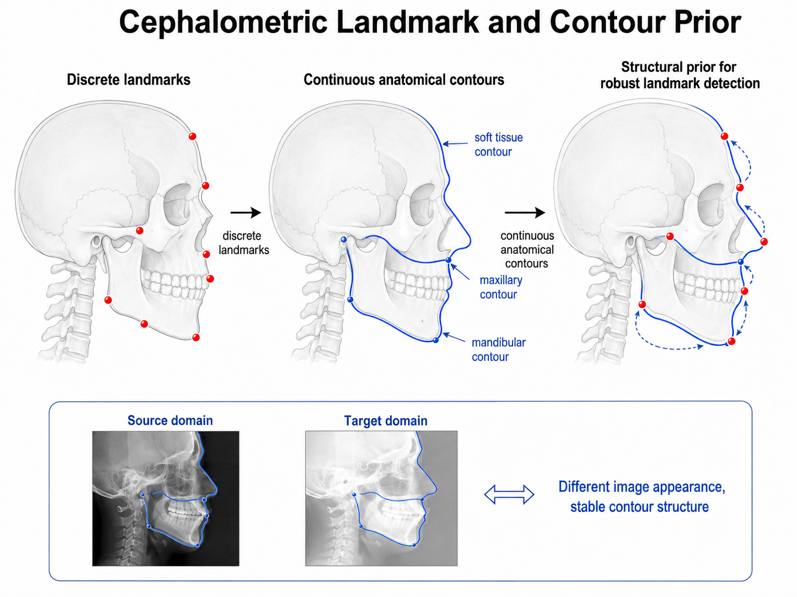

# 论文综述 CJL 方法

> 来源：[ChatGPT](https://chatgpt.com/c/6a13d292-222c-83a9-ae1e-07a57be6b0ee)
> 归档时间：2026-05-26 10:36:38

## 我的对话目录

1. [你先阅读论文](#turn-001)
2. [现在我要完全学会这篇论文用于汇报，你采用苏格拉底式提问来看我的目的和我的基础，以此来掌握最好的方式教我](#turn-002)
3. [1B 2B 3什么都不知道 4技术架构方面，老师会不断提问 5都详细讲 6.AB 7A 8.A. 我现在的情况就是完全没读论文](#turn-003)
4. [q1:landmark detection是检测关键点，关键点可以用于正畸诊断、颌面分析、治疗规划。](#turn-004)
5. [你直接生成上述提到的图](#turn-005)
6. [你详细讲解一下这幅图](#turn-006)
7. [好的，你继续讲解按照顺序，记住专有英文要详细解释](#turn-007)
8. [第2讲](#turn-008)

---

## 对话正文

<a id="turn-001"></a>

## 对话 001

**我：**

你先阅读论文

附件：2025_MICCAI_Liang_Contour-Prior-Cross-Domain-Cephalometric.pdf

**GPT：**

**tool：**

Make sure to include fileciteturn0file0 in your response to cite this file, or to surface it as a link.

<PARSED TEXT FOR PAGE: 1 / 10>

Contour Makes It Stronger: Cross-Domain
Cephalometric Landmark Detection Based on
Contour Priors
Xinyue Liang1
, Runnan Chen2
, Guangshun Wei1∗
, Shaojie Zhuang1
, and
Yuanfeng Zhou1∗
1 School of Software, Shandong University, Jinan, China
yfzhou@sdu.edu.cn
2 Sydney Artificial Intelligence Centre, the University of Sydney, Sydney, Australia
Abstract. The detection of cephalometric landmarks is crucial for or￾thodontic diagnosis. Current methods mainly focus on utilizing contex￾tual information to detect landmarks while overlooking the challenges
posed by domain gaps. In this paper, we propose a contour-guided frame￾work that leverages cranial soft/hard tissue contours as domain-invariant
anatomical priors. The method introduces a joint attention module to
fuse the topological features corresponding to the contours with con￾textual features, ensuring the accuracy of landmark positioning. Ad￾ditionally, we address anisotropic prediction uncertainty in unseen do￾mains through a direction-aware regression module, which incorporates
contour geometry to regularize error distributions. Evaluated on the
multi-domain datasets with five source and three unseen target domains,
our framework demonstrates superior robustness to domain shifts while
maintaining anatomical plausibility, achieving state-of-the-art cross-domain
localization accuracy.
Keywords: Cephalometric Landmark · Domain Gap · Feature Fusion.
1 Introduction
Cephalometric analysis utilizes 2D images generated by X-ray, providing clini￾cians with crucial information on patients’ dental, skeletal, and facial relation￾ships. As an indispensable part of orthodontic and orthognathic treatments,
a pivotal step in this process is the detection of key anatomical landmarks. In
practice, landmarks are located manually, which is tedious, time-consuming, and
unreliable in achieving reproducible results. Therefore, fully automatic and ac￾curate landmark localization has been a long-standing area of significant need.
Recent deep learning-based landmark detection methods [1, 3, 12] have ad￾vanced through multi-scale contextual information extraction and global-local
feature interaction in single domain application. For instance, Chen et al. [3] de￾veloped an attentive feature pyramid fusion module for feature fusing, while Lee

<PARSED TEXT FOR PAGE: 2 / 10>

2 X. Liang et al.
Source Domain Target Domain Cross-domain Sample … …
(a) Existing methods utilize only landmark- based features(sensitive to image appearance). (b) Our method based on contour-landmark
joint features shows robustness across domains.
Hierarchical Consistent
Structure … …
Different Feature
Distribution
Contour-aware
Module
Joint Attention
Module
Contours and Anisotropy
Distribution
Structural Regions
Landmark
Contour
Fig. 1: Difference between existing methods and ours.
et al. [11] modeled spatial structure via global coordinate regression and local
feature cropping. However, domain gap caused by variations in image properties
(e.g., resolution, contrast) significantly impair cross-domain generalization, as
shown in Fig. 1(a). The yellow rectangle highlights the differences in feature dis￾tributions across domains, particularly in lower layers, which are highly sensitive
to image appearance variations.
To address this cross-domain degradation, researchers have employed strate￾gies like domain adaptation. Jin et al. [8] combined self-training with adversarial
learning for knowledge transfer, and Wu et al. [16] enhanced robustness through
anatomical prototype relation mining. Despite reducing annotation dependency,
these methods still require retraining on the target domain, limiting clinical
scalability due to data acquisition costs and workload.
Compared to domain adaptation, we adopt domain generalization by extract￾ing domain-invariant features, as cranial soft/hard tissue contours, to bridge
domain gaps in cephalometric landmark detection. Unlike landmarks, which are
sensitive to image appearance, these contours encode continuous geometric priors
that inherently resolve domain gaps. As shown in Fig. 1(b), by learning asso￾ciations between landmarks and anatomically defined boundaries, our method
establishes task-specific structural constraints, forcing the network to focus on
domain-agnostic topology.
In this paper, we propose a contour-aware joint learning (CJL) framework
for cross-domain cephalometric landmark detection. The method first models
cranial soft/hard tissue contours as domain-invariant priors to capture struc￾tural consistency. A multi-scale CNN extracts contextual features, which are
then fused with contour features as structural features through a joint attention

<IMAGE FOR PAGE: 2 / 10>


<PARSED TEXT FOR PAGE: 3 / 10>

Contour Makes It Stronger 3
Pyramid CNN
+ +
Patches
Patch
Embedding
Contour
Attention 𝑖𝑖
Block 𝑖𝑖
Structural
Attention 𝑖𝑖
ℱ𝑣𝑣𝑣𝑣𝑣𝑣
Contour
Decoder
Landmark
Decoder
ℱ�
𝑣𝑣𝑣𝑣𝑣𝑣
ℱ𝑐𝑐𝑐𝑐𝑐𝑐
ℱ�
𝑐𝑐𝑐𝑐𝑐𝑐
× 𝑵𝑵
Image
FFN
ℱ𝑐𝑐𝑐𝑐𝑐𝑐
+1
ℱ𝑣𝑣𝑣𝑣𝑣𝑣
ℱ𝑐𝑐𝑐𝑐𝑐𝑐
Landmark
Heatmaps
𝑄𝑄𝑄𝑄𝑄𝑄𝑄𝑄𝑄𝑄 𝐾𝐾 , 𝑉𝑉𝑉𝑉𝑉𝑉 Feature Flow
Contour
Attention 0 ℒreg
Fig. 2: The pipeline of our method: the top branch, represented by several blue
blocks, corresponds to the Contour-aware Module, the shaded area denotes the
Joint Attention Module, and Lreg indicates the Direction-sensitive Regression
Module. The Pyramid CNN encodes contextual features, while the Landmark
Decoder generates landmark heatmaps.
module (JAM). This module aligns contour features and landmark features in
a shared embedding space, generating globally consistent hierarchical features.
Furthermore, we observed that landmark predictions in the target domain ex￾hibit higher uncertainty along the tangential direction of contours compared to
the normal direction. This anisotropic distribution motivated us to propose a
direction-sensitive regression module (DRM). By guiding landmark regression
based on the tangential and normal directions of contours, our method incor￾porates anatomical plausibility into landmark prediction, enhancing robustness.
The contributions of this paper are as follows:
1. We explore domain generalization by using cranial contours as domain￾invariant priors for cephalometric landmark detection.
2. We propose a contour-landmark joint attention module to generate globally
consistent hierarchical features for cross-domain generalization.
3. We introduce a novel regression strategy that leverages contour structure to
mitigate anisotropic prediction uncertainty, enhancing cross-domain stabil￾ity.
4. Our method achieves state-of-the-art performance on unseen target domains,
demonstrating superior generalization capability.
2 Method
Domain gaps present a significant barrier in landmark detection tasks, partic￾ularly when dealing with variations in imaging devices and parameters across
clinical environments. Our contour-aware joint learning (CJL) framework ad￾dresses this challenge by modeling cranial contours as anatomical structural
priors that exhibit intrinsic invariance across domains. As depicted in Fig. 2, the

<IMAGE FOR PAGE: 3 / 10>


<PARSED TEXT FOR PAGE: 4 / 10>

4 X. Liang et al.
framework consists of three synergistic components: the Contour-aware Mod￾ule (Sec.2.1), the Joint Attention Module (Sec.2.2), and the Direction-sensitive
Regression Module(Sec 2.3).
2.1 Contour-aware Module
The inherent invariance of anatomical contours across different domains stems
from the structural consistency of cranial anatomy. Specifically, contours serve
as stable structural priors,reducing reliance on low-level features (e.g., pixel in￾tensity gradients) that are prone to scanner-induced artifacts. Moreover, they
enforce anatomical plausibility through explicit structural constraints (Delaire’s
analysis [4]). Compared to direct landmark detection, this hierarchical represen￾tation establishes an interpretable mapping that aligns with clinical reasoning
processes.
Medical-defined landmarks P =

pi ∈ R
2
L
i=1 are interpolated into N anatom￾ical contours using cubic splines:
cj (t) = X
3
k=0
Bk(t) · pm+k, t ∈ [0, 1], (1)
where Bk(t) denotes basis functions, and pm+k are the landmarks belonging to
contour cj , with m as the starting index of the landmarks, and k ∈ {0, 1, 2, 3},
indicating the use of four control points. Then, for each contour cj , we compute
a distance transform Dj and Gaussian-smoothed heatmap Mj [18]:
Dj (x, y) = min
(x′
,y′)∈cj
|(x, y) − (x
′
, y′
)|2, (2)
Mj (x, y) = exp 
−
Dj (x, y)
2
2σ
2

· I(|Dj (x, y)| ≤ 3σ), (3)
where σ controls the spatial uncertainty, and we set σ = 1.0. Here, I(·) is an
indicator function.
To obtain geometric features and sematic anatomical information, we em￾ploy a pretrained Vision Transformer (ViT) as the image encoder [10]. Given a
cephalometric image I, it is first cropped into non-overlapping 16 × 16 patches,
which are then flattened and projected into D-dimensional tokens. After adding
position embeddings, these tokens are fed into M multi-head self-attention (MSA)
layers and MLP blocks [5], ultimately generating a contour feature map with a
resolution of 1
16 of the original image.
2.2 Joint Attention Module
The hierarchical topology between contours and landmarks establishes con￾straints for feature fusion. As depicted in Fig. 1(b), the Hierarchical Consistent
Structure comprises three structural hierarchies: base-level landmarks l, inter￾mediate contours c , and overlying tissue regions (shaded areas), encapsulating

<PARSED TEXT FOR PAGE: 5 / 10>

Contour Makes It Stronger 5
the structural topology with both intra-layer and cross-layer relationships. To
capture these relationships, we develop a joint attention mechanism that enables
cross-hierarchy message passing through alternating query strategies.
Given the structural features Fvit ∈ R
( H
16 × W
16 )×D and the contextual features
Fcnn = {Fk}
3
k=1with resolutions of 1
8
,
1
16 ,
1
32 , we iteratively apply Eq. (4) and
Eq. (5) for N rounds. In each round, we take F
i
vit as the query, and F
i
cnn as the
key and value for the contour attention layer, as shown in Eq. (4). The resulting
feature Fˆi
vit is then passed through the encoder layer in the i-th block to produce
the updated feature F
i+1
vit . After that, F
i
cnn is used as the query, and F
i+1
vit as the
key and value for the structural attention layer, as shown in Eq. (5).
Fˆi
vit = F
i
vit + γ
i Attention
norm
F
i
vit
, norm
F
i
cnn , (4)
Fˆi
cnn = F
i
cnn + Attention
norm
F
i
cnn
, norm
F
i+1
vit  , (5)
where the norm(·) is LayerNorm [2] and the attention layer is Attention(·) sug￾gests using sparse attention [20].
2.3 Direction-sensitive Regression Module
In cross-domain landmark detection, the prediction distributions of landmarks
exhibit relevance to contours. As visualized in Fig. 1(b) ("Contours and Anisotropy
Distribution"), arrows encode the deviation of landmark predictions. For land￾mark A on the contour, its probability distribution exhibits higher variance
along the contour’s tangential direction ∆t and lower variance along the normal
direction ∆n, demonstrating anisotropic characteristics (blue ellipse). In con￾trast, non-contour landmark B shows isotropic uncertainty with uniform variance
around the ground truth. Building upon this correlation, we propose a contour￾aware regression strategy that adjusts error tolerance along the tangential t and
normal n directions.
From the contour heatmaps Fcontour generated by the contour-aware module,
we generate contour-aware direction fields by computing pixel-wise tangent t and
normal n vectors via:
t(x, y) =

∂Mj
∂y , −
∂Mj
∂x 
|∇Fcontour|2
, n(x, y) =

∂Mj
∂x ,
∂Mj
∂y 
|∇Fcontour|2
, (6)
where partial derivatives are computed using Sobel operators, ensuring differ￾entiability. We then project the offset between the predicted landmark p and
its ground truth p
∗ onto the directional vectors, obtaining the tangent ∆t and
normal ∆n offset components.
To adaptively address the anisotropic distribution, we compute direction￾specific energy values as moving averages of squared errors:
E
k
t = αEk−1
t + (1 − α)∆t2
, Ek
n = αEk−1
n + (1 − α)∆n2
, (7)

<PARSED TEXT FOR PAGE: 6 / 10>

6 X. Liang et al.
with a smoothing factor α = 0.9. The regression loss becomes:
Lreg =
1
N
XN
i=1 
∆ti
Et + ϵ
+
∆ni
En + ϵ

, (8)
where ϵ is set to 10−5
to prevent division by zero.
In the prediction module, we combine the contour heatmaps, landmark heatmaps
and anisotropic offsets to predict landmark positions. The loss function Lh is de￾fined to be mean logistic losses between the predicted landmark heatmaps and
the ground truth. The loss function Lmse is defined to be the L2 loss between
the predicted contour heatmaps and the ground truth heatmap Mj . The final
loss fuction is defined as follows:
L = Lreg + λ1Lh + λ2Lmse, (9)
where λ1 = 2.0, λ2 = 5.0.
3 Experiments
3.1 Experimental Settings
Dataset: To validate cross-domain generalization, we construct a multi-domain
benchmark combining the ISBI 2023 Challenge dataset [9] (700 images from
7 different devices including Planmeca ProMax® 3D, Hyperion X5 2D PAN
CEPH and so on) and ISBI 2015 dataset [15] (400 images). For cross-domain
setting, we split the data into five source domains (832 training images) and
three unseen target domains (400 test images) based on acquisition devices,
with resolution varying from 1280 × 960 to 2560 × 1920. All evaluations adopt
the standardized 19-landmark definitions from ISBI 2015.
Contours: Eight contours are involved in this work (e.g., maxillary bone outline,
mandibular bone outline). These contours are well-established in cephalometric
literature [7] and have been validated by clinical experts. The contour structures
and landmark-contour mapping rules (e.g., Points Pogonion, Meton, Gonion on
the mandibular bone outline) remain consistent and valid even with an increasing
number of landmarks.
Implementation Details: We employ the ImageNet-1K pre-trained weights
from DeiT (Touvron et al. [14]) to initialize our ViT-B model with embedding
dimensions of 768, depth of 12, and 12 attention heads. A pre-trained VGG￾19 [13] is as the multi-scale CNN backbone. To save time and memory, we set up
a joint learning interaction for every 4 embedding layers, meaning the JAM runs
M=3 times. The entire framework is optimized using the Adadelta optimizer
with default configurations. The training process takes approximately 4 hours
for 150 epochs on three Geforce RTX 3090 GPUs.
Evaluation Metrics: Following previous studies [15], we evaluate the model’s
performance using two commonly used metrics: 1) Mean Radial Error (MRE),
which calculates the average Euclidean distance between the predicted and

<PARSED TEXT FOR PAGE: 7 / 10>

Contour Makes It Stronger 7
Table 1: Results on source domain and target domain, respectively.
Model
Source Domain Test Dataset Target Domain Test Dataset
MRE ↓ SDR(%) ↑ MRE ↓ SDR(%) ↑
(mm) 1mm 2mm 3mm 4mm (mm) 1mm 2mm 3mm 4mm
FPA [6] 1.89 29.56 63.58 82.27 89.92 4.43 4.58 15.10 30.21 46.56
YOLOs [19] 1.27 55.42 82.01 91.47 95076 2.41 44.98 68.56 82.05 88.32
AFPF [3] 1.13 58.05 86.87 95.22 97.96 1.81 47.34 76.62 83.61 83.58
Wu [17] 1.12 62.88 86.04 93.85 96.72 1.62 51.35 75.89 86.09 91.41
CeLDA [16] 1.15 56.24 84.26 94.33 97.94 1.51 54.07 80.40 88.33 92.07
Ours 1.09 64.15 86.55 93.95 97.10 1.43 55.25 80.64 89.58 93.78
ground-truth landmarks; and 2) Successful Detection Rate (SDR), defined as the
percentage of landmarks accurately detected within distances of 1.0mm, 2.0mm,
3.0mm, and 4.0mm from the ground-truth landmarks. It is worth mentioning
that we specially compared SDR within an extremely small error range (within
1 mm) to validate the accuracy of landmark detection under high precision.
3.2 Comparison with SOTA Approaches
We compare our CJL with several state-of-the-art cephalometric landmark detec￾tion models, including recent classical methods (AFPF [3], FPA [6], YOLO [19]),
and CelDA [16]—a method specifically designed to address the domain gap be￾tween adults and adolescents. We also compare with the recent champion method
proposed by Wu et al. [17]. To ensure fairness, all competing approaches were
retrained with the same configurations on our cross-domain dataset.
From Table 1, we can observe that other models perform significantly worse
on the target domain compared to the source domain. For example, AFPF shows
a higher MRE (1.81 vs. 1.13) and lower SDR (76.62% vs. 86.04% within 2mm),
indicating that the domain gap leads to severe performance degradation. Al￾though our method does not achieve optimal values across all source domain
metrics, it consistently outperforms other competing approaches in all met￾rics. Notably, our model exhibits only a 0.34mm MRE degradation compared
to source domain performance, demonstrating superior cross-domain robustness
compared to existing approaches (CeLDA: 0.36mm; Wu et al.: 0.5mm; AFPF:
0.68mm; YOLO: 1.14mm; FPA: 2.54mm).
As shown in Fig. 3, we present the comparative performance across methods
under significant appearance discrepancies between source and target domain
datasets. On the target domain, AFPF and YOLO exhibit substantial landmark
displacements (indicated by yellow arrows). In contrast, while other methods
avoid such failures, our approach demonstrates enhanced precision compared
to Wu and CeLDA. The yellow rectangles highlight CJL’s superior localization
accuracy in braces-present/absent cases. The blue rectangles further validate our
method’s enhanced precision in contour lines.

<PARSED TEXT FOR PAGE: 8 / 10>

8 X. Liang et al.
Fig. 3: Qualitative results of three models on target domain test data. Green
dots are GTs, and red dots are predictions. Yellow arrows denote significant
displacement between predictions and GTs. Rectangles indicate that our model
performs better than the others.
Table 2: Ablation analysis for our proposed CJL method.
CAM JAM DRM
Source Domain Target Domain
MRE ↓ SDR(%) ↑ MRE ↓ SDR(%) ↑
(mm) 1mm 2mm 2.5mm 3mm (mm) 1mm 2mm 2.5mm 3mm
1.44 59.84 78.95 90.05 92.79 1.81 47.34 76.62 83.61 87.66
✓ 1.25 61.89 85.06 91.01 92.81 1.62 50.10 79.30 85.12 87.79
✓ ✓ 1.21 59.84 85.78 91.21 93.47 1.50 52.28 79.62 86.22 89.46
✓ ✓ 1.15 63.42 85.55 91.08 93.87 1.53 53.35 80.04 86.00 89.35
✓ ✓ ✓ 1.09 64.15 86.55 91.18 93.95 1.43 55.25 80.64 86.53 89.58
3.3 Analytical Ablation Studies
To validate the effects of our network components, we conducted ablation ex￾periments by augmenting the base network, with the results shown in Table 2.
We observed that adding only the CAM and simply concatenating contours
with baseline features significantly improved performance on the source domain
(MRE decreased from 1.44 to 1.25). Further incorporating the JAM module led
to notable improvements in SDR at the 2.5 mm and 3 mm thresholds on the
target domain, increasing by 1.10% and 1.67%, respectively. We attribute these
improvements to the interaction of features from different sources (contours and
contextual), which enhanced deep anatomical features and reduced large devi￾ations. When only the CAM and DRM were added, MRE and SDR within 1
mm improved significantly, benefiting from the direction-based regression loss

<IMAGE FOR PAGE: 8 / 10>


<PARSED TEXT FOR PAGE: 9 / 10>

Contour Makes It Stronger 9
optimization. Our method achieved the best performance across all module con￾figurations.
4 Conclusion
In this paper, we propose a contour-guided cross-domain learning (CJL) frame￾work for cephalometric landmark detection. By leveraging cranial soft/hard tis￾sue contours as domain-invariant anatomical priors and incorporating a joint at￾tention module, our method effectively bridges domain gaps and enhances cross￾domain generalization. Additionally, by introducing an anisotropic regression
module, we further improve landmark detection accuracy across cross-domain
datasets. Experimental results on the multi-domain CEPHA29 and ISBI 2015
datasets demonstrate the effectiveness of our approach in maintaining anatomi￾cal plausibility and achieving state-of-the-art performance under diverse imaging
conditions.
Acknowledgments. This work was supported by the National Natural Science Foun￾dation of China under Grant (No.62172257), the Natural Science Foundation of Shan￾dong Province (Major Basic Research) project under Grant (ZR2024ZD12).
Disclosure of Interests. The authors have no competing interests to declare that
are relevant to the content of this article.
References
1. Arık, S.Ö., Ibragimov, B., Xing, L.: Fully automated quantitative cephalometry
using convolutional neural networks. Journal of Medical Imaging 4(1), 014501–
014501 (2017)
2. Ba, J.L., Kiros, J.R., Hinton, G.E.: Layer normalization. arXiv preprint
arXiv:1607.06450 (2016)
3. Chen, R., Ma, Y., Chen, N., Lee, D., Wang, W.: Cephalometric landmark detec￾tion by attentive feature pyramid fusion and regression-voting. In: Medical Im￾age Computing and Computer Assisted Intervention–MICCAI 2019: 22nd Inter￾national Conference, Shenzhen, China, October 13–17, 2019, Proceedings, Part III
22. pp. 873–881. Springer (2019)
4. Delaire, J.: L’analyse architecturale et structurale cranio-faciale, vol. 82. Revue de
Stomatologie et de Chirurgie Maxillo-faciale (1981)
5. Dosovitskiy, A., Beyer, L., Kolesnikov, A., Weissenborn, D., Zhai, X., Unterthiner,
T., Dehghani, M., Minderer, M., Heigold, G., Gelly, S., et al.: An image is
worth 16x16 words: Transformers for image recognition at scale. arXiv preprint
arXiv:2010.11929 (2020)
6. Gilmour, L., Ray, N.: Locating cephalometric x-ray landmarks with foveated pyra￾mid attention. In: Medical Imaging With Deep Learning. pp. 262–276. PMLR
(2020)
7. Jacobson, A., Jacobson, R.L. (eds.): Radiographic Cephalometry: From Basics to
3-D Imaging. Quintessence Publishing, Chicago, 2 edn. (2006)

<PARSED TEXT FOR PAGE: 10 / 10>

10 X. Liang et al.
8. Jin, H., Che, H., Chen, H.: Unsupervised domain adaptation for anatomical land￾mark detection. In: International Conference on Medical Image Computing and
Computer-Assisted Intervention. pp. 695–705. Springer (2023)
9. Khalid, M.A., Zulfiqar, K., Bashir, U., Shaheen, A., Iqbal, R., Rizwan, Z., Rizwan,
G., Fraz, M.M.: Cepha29: automatic cephalometric landmark detection challenge
2023. arXiv preprint arXiv:2212.04808 (2022)
10. Kirillov, A., Mintun, E., Ravi, N., Mao, H., Rolland, C., Gustafson, L., Xiao, T.,
Whitehead, S., Berg, A.C., Lo, W.Y., et al.: Segment anything. In: Proceedings of
the IEEE/CVF international conference on computer vision. pp. 4015–4026 (2023)
11. Lee, M., Chung, M., Shin, Y.G.: Cephalometric landmark detection via global and
local encoders and patch-wise attentions. Neurocomputing 470, 182–189 (2022)
12. Payer, C., Štern, D., Bischof, H., Urschler, M.: Integrating spatial configuration into
heatmap regression based cnns for landmark localization. Medical image analysis
54, 207–219 (2019)
13. Simonyan, K., Zisserman, A.: Very deep convolutional networks for large-scale
image recognition. arXiv preprint arXiv:1409.1556 (2014)
14. Touvron, H., Cord, M., Douze, M., Massa, F., Sablayrolles, A., Jégou, H.: Training
data-efficient image transformers & distillation through attention. In: International
conference on machine learning. pp. 10347–10357. PMLR (2021)
15. Wang, C.W., Huang, C.T., Lee, J.H., Li, C.H., Chang, S.W., Siao, M.J., Lai, T.M.,
Ibragimov, B., Vrtovec, T., Ronneberger, O., et al.: A benchmark for comparison
of dental radiography analysis algorithms. Medical image analysis 31, 63–76 (2016)
16. Wu, H., Wang, C., Mei, L., Yang, T., Zhu, M., Shen, D., Cui, Z.: Cephalometric
landmark detection across ages with prototypical network. In: International Con￾ference on Medical Image Computing and Computer-Assisted Intervention. pp.
155–165. Springer (2024)
17. Wu, Q., Yeo, S.Y., Chen, Y., Liu, J.: Revisiting cephalometric landmark detection
from the view of human pose estimation with lightweight super-resolution head.
arXiv preprint arXiv:2309.17143 (2023)
18. Wu, W., Qian, C., Yang, S., Wang, Q., Cai, Y., Zhou, Q.: Look at boundary: A
boundary-aware face alignment algorithm. In: Proceedings of the IEEE conference
on computer vision and pattern recognition. pp. 2129–2138 (2018)
19. Zhu, H., Yao, Q., Xiao, L., Zhou, S.K.: You only learn once: Universal anatom￾ical landmark detection. In: Medical Image Computing and Computer Assisted
Intervention–MICCAI 2021: 24th International Conference, Strasbourg, France,
September 27–October 1, 2021, Proceedings, Part V 24. pp. 85–95. Springer (2021)
20. Zhu, X., Su, W., Lu, L., Li, B., Wang, X., Dai, J.: Deformable detr: Deformable
transformers for end-to-end object detection. arXiv preprint arXiv:2010.04159
(2020)

**tool：**

Remember you have access to rendered images of pages from the files, in addition to their parsed text content. Some files may include images, while others may not.
These may contain embedded text in images, infographics, complex tables, diagrams, and other visual elements not fully captured in the parsed text.
You can directly view these images to read text within images, interpret infographics, understand diagrams and complex tables. When applicable, combine insights from both parsed text and images to provide comprehensive and enriched answers.

When responding to the user, actively incorporate information from embedded text, images, tables, diagrams, and other visuals in the files when applicable.
Explicitly reference them by mentioning their location (e.g., page number) and summarizing their content. For example:
- "According to the *chart on page 5*, sales have increased by 20% over ..."
- "The *diagram on page 3* illustrates the workflow, highlighting ..."

**tool：**

All the files uploaded by the user have been fully loaded. Searching won't provide additional information.

我已经读完这篇论文了：**《Contour Makes It Stronger: Cross-Domain Cephalometric Landmark Detection Based on Contour Priors》**。fileciteturn0file0

这篇的核心思路是：**用颅颌软/硬组织轮廓作为跨域不变的解剖先验，提升头影测量 landmark detection 在未见目标域上的泛化能力。**

我先把重点梳理成你后面提问时可以直接对照的版本：

### 1. 论文要解决的问题

现有头影 landmark 检测方法大多依赖图像外观特征，比如灰度、对比度、边缘、纹理等。不同设备、分辨率、成像参数会导致明显 domain gap，所以模型从 source domain 到 unseen target domain 时性能下降明显。

作者的观点是：
**landmark 本身容易受图像外观影响，但颅颌轮廓结构更稳定，更适合作为 domain-invariant prior。**

### 2. 方法整体框架：CJL

论文提出 **Contour-aware Joint Learning, CJL**，主要由三个模块组成：

**CAM：Contour-aware Module**
用 landmark 通过 cubic spline 插值得到 8 条解剖轮廓，再生成 contour heatmap。然后用 ViT 提取轮廓相关的结构特征。

**JAM：Joint Attention Module**
把 CNN 提取的 contextual features 和 ViT 提取的 contour features 进行交互。它不是简单 concat，而是通过 contour attention 和 structural attention 让 landmark 特征与 contour 拓扑结构互相融合。

**DRM：Direction-sensitive Regression Module**
这是论文比较有意思的点。作者认为在 target domain 中，落在轮廓上的 landmark 误差不是各向同性的，而是沿着轮廓切线方向误差更大、法线方向误差更小。所以他们根据 contour heatmap 计算 tangent / normal direction，对回归误差做方向敏感约束。

### 3. 实验设置

数据来自 **ISBI 2023 Cepha29** 和 **ISBI 2015**，构造了多域 benchmark：
5 个 source domains，3 个 unseen target domains。统一评估 19 个 ISBI 2015 landmark。

指标包括：

MRE，平均径向误差；
SDR@1mm、2mm、3mm、4mm。

### 4. 主要结果

在 target domain 上，CJL 的 MRE 是 **1.43 mm**，优于 FPA、YOLOs、AFPF、Wu、CeLDA 等方法。

作者特别强调跨域退化幅度：
CJL 从 source 到 target 的 MRE 只下降 **0.34 mm**，比其他方法更稳定。

### 5. 消融实验结论

baseline target MRE 是 **1.81**。
加 CAM 后降到 **1.62**。
CAM + JAM 后降到 **1.50**。
CAM + DRM 后降到 **1.53**。
CAM + JAM + DRM 最终降到 **1.43**。

也就是说：

CAM 贡献最大，说明 contour prior 确实有效；
JAM 主要提升结构融合后的跨域稳定性；
DRM 主要改善高精度定位，尤其是 SDR@1mm 和 MRE。

### 6. 我觉得后面最值得你问/对比的点

这篇论文和你的方法最相关的地方不是网络结构，而是它也在利用 **解剖结构不确定性 / 结构先验** 来解决跨域或鲁棒性问题。它的 prior 来自 **contour**，而你的方法更多是从 **双医生标注分歧、σ、不确定性、扰动目标、rank loss** 这些角度建模。

你后面可以直接问我：
“这篇和我的方法区别是什么？”
“它的 DRM 和我的 DCRLE-rank 有什么关系？”
“我能不能借它的 contour prior 拓展我的 trick？”
“这篇有什么漏洞或可攻击点？”

---

<a id="turn-002"></a>

## 对话 002

**我：**

现在我要完全学会这篇论文用于汇报，你采用苏格拉底式提问来看我的目的和我的基础，以此来掌握最好的方式教我

**GPT：**

可以。我先不直接讲论文，先用**苏格拉底式提问**判断你的汇报目的、听众水平、你的基础，以及你最需要补的地方。
这篇论文的核心是 **CJL：Contour-aware Module、Joint Attention Module、Direction-sensitive Regression Module**，用于解决头影 landmark detection 的跨域泛化问题。fileciteturn0file0

你按这种格式回复就行：
**1A 2B 3C 4A 5D 6B 7C 8A**

### 1. 你的汇报场景是什么？

A. 组会论文分享，重点讲懂方法
B. 论文精读汇报，需要讲清创新点、公式、实验
C. 答辩/开题/中期，要和自己的方法建立联系
D. 复现或改进这篇论文，需要理解实现细节

### 2. 你的听众更像哪一类？

A. 医学图像方向，懂 landmark detection
B. 深度学习方向，但不熟头影测量
C. 老师/同学混合，不能讲太技术化
D. 专家型听众，可能会追问方法漏洞

### 3. 你现在对这篇论文的理解到哪一步？

A. 只知道它用了 contour prior
B. 能说出 CAM、JAM、DRM 三个模块名字
C. 大概知道每个模块作用，但公式看不懂
D. 能看懂方法，但不知道怎么组织成汇报

### 4. 你最担心汇报时卡在哪里？

A. 不知道为什么 contour 能解决 domain gap
B. 不知道 CAM/JAM/DRM 怎么串起来
C. 不知道公式怎么解释
D. 不知道实验表格和消融怎么讲
E. 不知道这篇和自己方法有什么区别或联系

### 5. 你对以下基础哪个最薄弱？

A. 头影测量 landmark / cephalometric analysis
B. domain gap / domain adaptation / domain generalization
C. heatmap regression / landmark detection
D. attention / ViT / CNN feature fusion
E. 不确定性、各向异性误差、tangent/normal regression

### 6. 你希望最后达到什么程度？

A. 能把这篇论文讲清楚，听众能听懂
B. 能回答老师追问
C. 能批判这篇论文，指出优点和问题
D. 能把它和自己的方法结合，形成新的 idea
E. 能复现或写进自己的论文 related work

### 7. 假设老师问你：
**“为什么 landmark 不够跨域稳定，而 contour 更稳定？”**
你现在能回答到什么程度？

A. 完全不会答
B. 能说 contour 是解剖结构，所以稳定
C. 能进一步解释 landmark 对图像外观敏感，contour 提供结构先验
D. 能结合 Fig.1、domain gap、feature distribution 和 clinical anatomy 系统回答

### 8. 假设老师问你：
**“DRM 为什么要分切线方向和法线方向？”**
你现在的理解是？

A. 完全不懂
B. 只知道它和 contour 方向有关
C. 知道 landmark 沿轮廓方向误差更大，垂直轮廓方向误差更小
D. 能结合 anisotropic uncertainty、方向场、回归损失公式解释

你先回答这 8 个选项，我再根据你的答案定制一套学习路线：从**一句话核心思想 → 整体框架 → 三个模块 → 公式 → 实验 → 可批判点 → 汇报稿**逐层带你学。

---

<a id="turn-003"></a>

## 对话 003

**我：**

1B 2B 3什么都不知道 4技术架构方面，老师会不断提问 5都详细讲 6.AB 7A 8.A.        我现在的情况就是完全没读论文

**GPT：**

好，那我按**零基础论文精读汇报**来带你。你的目标不是复现，而是：**能把技术架构讲清楚，并能回答老师追问**。
所以我们不从公式开始，而是从“这篇论文到底想解决什么问题”开始。

这篇论文你可以先记住一句话：

> **它用头影图像中的颅颌轮廓 contour 作为稳定的解剖结构先验，帮助 landmark 检测模型在不同设备、不同图像风格的跨域场景下保持准确。** fileciteturn0file0

---

## 第一阶段：先建立整篇论文的骨架

你现在先不要管 CAM、JAM、DRM 的细节。先建立这 4 个概念：

### 1. 任务是什么？

任务是 **cephalometric landmark detection**，也就是在头颅侧位 X 光片上自动找关键解剖点。

比如：

下颌角、颏点、鼻根点、上下颌相关点等。

这些点用于正畸诊断、颌面分析、治疗规划。论文说，人工标注这些点很耗时，而且不同医生之间可能不一致，所以需要自动检测方法。fileciteturn0file0

我问你第一个问题：

**Q1：如果让你给一个完全不懂医学图像的同学解释 landmark detection，你会怎么说？**

你可以先用一句话回答，不要求专业。

---

### 2. 这篇论文为什么强调 cross-domain？

普通 landmark detection 是在同一种数据分布上训练和测试。

但是现实中，头影图像可能来自不同设备、不同分辨率、不同对比度、不同成像参数。

所以模型在训练集上学到的图像特征，到了另一个医院或另一个设备上可能就不稳定。

这就叫 **domain gap**。

论文的 Fig.1(a) 想表达的是：
现有方法主要依赖 landmark 周围的图像外观特征，而这些特征对设备、分辨率、灰度、对比度很敏感，所以跨域性能下降。fileciteturn0file0

我问你第二个问题：

**Q2：为什么同一个解剖点，在不同设备拍出来的 X 光片上，模型可能找不准？**

你先不要背论文，用自己的话说。

---

### 3. 作者为什么想到 contour？

作者的核心观察是：

**landmark 是离散点，容易受局部图像外观影响；contour 是连续解剖结构，更稳定。**

比如一个点的位置可能因为边缘模糊、噪声、牙套、对比度变化而变难找。
但是下颌骨轮廓、上颌骨轮廓、软组织轮廓这些整体结构，在不同设备下仍然有相对稳定的解剖拓扑关系。

所以作者不是只让模型看点，而是让模型先学轮廓结构，再用轮廓帮助定位 landmark。

我问你第三个问题：

**Q3：为什么 contour 可能比单个 landmark 更适合做跨域泛化？**

你可以用这个句式回答：

> 因为 landmark 更依赖 ______，而 contour 更表达 ______。

---

### 4. 整体方法 CJL 是什么？

这篇论文的方法叫 **CJL：Contour-aware Joint Learning**。

它由三个模块组成：

| 模块 | 中文理解 | 作用 |
|---|---|---|
| CAM | 轮廓感知模块 | 让模型学到 contour prior |
| JAM | 联合注意力模块 | 融合 contour 特征和 landmark/context 特征 |
| DRM | 方向敏感回归模块 | 利用轮廓切线/法线方向约束 landmark 回归 |

你现在先记一个非常重要的流程：

```text
输入头影 X 光图像
↓
CNN 提取普通图像上下文特征
↓
ViT / contour branch 提取轮廓结构特征
↓
JAM 让 contour 特征和 landmark 特征交互
↓
Landmark decoder 输出 landmark heatmap
↓
DRM 根据 contour 的切线/法线方向修正回归误差
↓
输出最终 landmark 坐标
```

这就是你汇报技术架构时的主线。

我问你第四个问题：

**Q4：如果老师问“这篇论文不是直接检测 landmark 吗？为什么还要绕一圈去学 contour？”你会怎么答？**

你可以先答得很粗糙，我后面会帮你改成汇报版。

---

## 第二阶段：你需要掌握的汇报结构

等你回答上面 4 个问题后，我会按下面顺序教你：

### 第 1 讲：背景和问题

你要能讲清楚：

```text
头影 landmark 检测很重要；
现有方法在单域内效果好；
但跨设备、跨数据集时出现 domain gap；
所以需要 domain generalization。
```

### 第 2 讲：核心思想

你要能讲清楚：

```text
作者认为 contour 是更稳定的解剖先验；
contour 和 landmark 存在结构关系；
所以用 contour 帮助 landmark 检测。
```

### 第 3 讲：CAM

讲清楚它怎么从 landmark 生成 contour，怎么生成 contour heatmap，为什么用 ViT 提取 contour features。

### 第 4 讲：JAM

讲清楚为什么不能简单 concat，而要用 attention 让 contour features 和 CNN context features 交互。

### 第 5 讲：DRM

讲清楚为什么误差具有各向异性：
沿着轮廓方向误差更大，垂直轮廓方向误差更小。
然后解释 tangent / normal direction regression。

### 第 6 讲：实验和消融

讲清楚 Table 1 和 Table 2：

Table 1 证明它比 SOTA 跨域更强。
Table 2 证明 CAM、JAM、DRM 每个模块都有贡献。

### 第 7 讲：老师追问准备

我们会专门练这些问题：

```text
为什么 contour 是 domain-invariant？
为什么用 ViT 提取 contour features？
为什么还需要 CNN？
为什么不是简单 concat？
DRM 的切线/法线方向是什么意思？
CAM、JAM、DRM 哪个贡献最大？
这篇论文有什么不足？
和你的方法有什么联系？
```

---

## 现在你先回答这 4 个问题

你直接按这个格式回答：

```text
Q1：
Q2：
Q3：
Q4：
```

不用怕答错。你的回答越原始，我越能判断应该怎么教你。

---

<a id="turn-004"></a>

## 对话 004

**我：**

q1:landmark detection是检测关键点，关键点可以用于正畸诊断、颌面分析、治疗规划。
q2:因为头影设备可能来自不同设备、不同分辨率、不同对比度、不同成像参数。存在偏差等等
q3:contour具体是什么，可以用image2生成吗？然后再回答q3
q4:因为contour相当于一个先验知识，可以学习的更好

**GPT：**

你的 Q1、Q2 答得已经可以作为汇报的基础版本了。Q4 的方向也对，但还要更精确。我们先解决你问的关键问题：**contour 到底是什么？**

## 1. contour 具体是什么？

在这篇论文里，**contour 不是普通图像里的边缘 edge**，而是指由医学解剖结构定义出来的**连续轮廓线**。

比如头影 X 光片上有很多 landmark 是离散点：

```text
点1、点2、点3、点4……
```

但如果这些点本来就属于同一条解剖结构，比如下颌骨外轮廓，那么作者就用 **cubic spline 三次样条插值** 把这些点连接成一条连续曲线，这条曲线就是 contour。论文中明确说，他们把医学定义的 landmarks 插值成 N 条 anatomical contours，并进一步生成 contour heatmap。fileciteturn0file0

你可以这样理解：

```text
landmark = 离散的关键点
contour = 由多个关键点连接形成的连续解剖轮廓线
```

举个简单例子：

```text
Pogonion 颏前点
Menton 颏下点
Gonion 下颌角点
```

这些点都和下颌骨轮廓有关。单独看它们是几个点；连起来看，就是一段下颌骨结构轮廓。

---

## 2. contour 和 edge 有什么区别？

这是老师很可能追问的点。

**edge** 是图像处理意义上的边缘，比如灰度变化大的地方。
**contour** 是医学结构意义上的轮廓，比如下颌骨轮廓、上颌骨轮廓、软组织轮廓。

区别如下：

| 概念 | 来源 | 稳定性 | 在论文中的作用 |
|---|---|---|---|
| edge | 图像灰度变化 | 容易受设备、噪声、对比度影响 | 不是本文核心 |
| contour | 解剖结构定义 | 更稳定 | 作为 domain-invariant prior |
| landmark | 单个关键点 | 容易受局部图像影响 | 最终检测目标 |

所以这篇论文不是简单地说“边缘有用”，而是说：

> **解剖轮廓包含比单个 landmark 更稳定的结构信息，可以帮助模型跨域泛化。**

---

## 3. 可以用 image2 生成吗？

可以。你可以用 image2 生成一张**教学示意图**，专门放在 PPT 里解释 contour。

建议生成的图不是复杂真实 X 光，而是清晰的结构示意图：
左边显示离散 landmark 点，右边显示这些点被连接成连续 contour，再标出下颌骨轮廓、上颌骨轮廓、软组织轮廓。

可以用这个提示词：

```text
生成一张医学论文汇报用的教学示意图，主题是“Cephalometric Landmark and Contour Prior”。画面为浅灰色头颅侧位X光示意背景，不要真实患者照片。左侧展示若干红色离散landmark关键点，右侧展示这些关键点被蓝色平滑曲线连接成anatomical contours。重点标出mandibular contour、maxillary contour、soft tissue contour。图中用箭头说明：discrete landmarks → continuous anatomical contours → structural prior for robust landmark detection。风格简洁、学术、适合PPT，白底，英文标注，线条清晰。
```

如果你想更像论文 Fig.1 / Fig.2，可以强调：

```text
加入domain gap对比：source domain和target domain图像外观不同，但蓝色解剖contour结构保持稳定。
```

---

## 4. 现在回答你的 Q3

你可以这样回答：

> **因为 landmark 是离散点，模型检测它时更依赖局部图像外观，比如灰度、边缘、纹理和对比度；而 contour 是由多个 landmark 形成的连续解剖结构，表达的是颅颌骨骼和软组织的整体拓扑关系。不同设备虽然会改变图像外观，但人的解剖结构关系相对稳定，所以 contour 比单个 landmark 更适合作为跨域泛化的结构先验。**

再压缩成汇报版：

> **landmark 更依赖局部 appearance，容易受 domain gap 影响；contour 表达连续 anatomical topology，更具有 domain-invariant 特性，因此可以作为结构先验提升跨域鲁棒性。**

---

## 5. 你的 Q4 也需要升级

你原来答的是：

> 因为 contour 相当于一个先验知识，可以学习得更好。

这个方向对，但太泛。老师可能会追问：“什么先验？为什么能学得更好？”

更好的回答是：

> **直接检测 landmark 时，模型主要依赖局部图像特征，而这些特征在不同设备、不同分辨率、不同对比度下变化很大。引入 contour 后，模型不仅学习某个点在哪里，还学习这个点和周围解剖轮廓之间的结构关系。这样可以让模型从局部外观依赖转向结构拓扑约束，因此跨域时更稳定。**

你下一步先回答我一个小问题：

**Q5：你现在能不能用自己的话区分 landmark、edge、contour？**

---

<a id="turn-005"></a>

## 对话 005

**我：**

你直接生成上述提到的图

**GPT：**

**tool：**



{"aspect_ratio":"4:3","prompt":"Create a clean academic teaching diagram for a PPT slide, titled \"Cephalometric Landmark and Contour Prior\". White background, neat medical-illustration style, simple and clear, suitable for a paper presentation. Use a light gray side-view cephalometric skull X-ray style silhouette as the backdrop, but keep it schematic rather than photorealistic.\n\nMain composition: a left-to-right explanatory flow.\n\nLeft panel: show a side-view skull schematic with several clearly visible red circular landmark points placed on key facial and jaw anatomy. Label this panel \"Discrete landmarks\". Add 6–10 red points. Make the points visibly separate and discrete.\n\nMiddle panel: show the same skull schematic, but now the relevant red landmarks are connected by smooth blue curves, forming continuous anatomical contours. Label this panel \"Continuous anatomical contours\". Clearly highlight and label three contours in English: \"mandibular contour\", \"maxillary contour\", and \"soft tissue contour\". The blue curves should be smooth and elegant, like cubic spline curves.\n\nRight panel: show a simplified conceptual illustration of robust landmark detection: the blue contours act as a structural prior guiding accurate landmark localization. Label this panel \"Structural prior for robust landmark detection\". Include a few red landmark points aligned accurately on or near the contours, with subtle arrows or guidance lines from contour structure to landmark localization.\n\nBetween the panels, place clear arrows with the exact English text: \"discrete landmarks\" → \"continuous anatomical contours\" → \"structural prior for robust landmark detection\".\n\nAdditionally, include a small bottom inset or footer strip illustrating domain gap: two tiny side-by-side skull X-ray thumbnails labeled \"Source domain\" and \"Target domain\". Their image appearance should differ slightly in contrast/brightness, but the overlaid blue anatomical contours should look consistent. Add a short caption: \"Different image appearance, stable contour structure\".\n\nOverall style requirements: clean academic infographic, uncluttered, no excessive decoration, no patient identity, no busy background, crisp English labels, color palette mainly light gray, red for landmarks, and blue for contours. Make the figure look like a clear teaching schematic that explains the idea of the paper."}

**tool：**


Model caption: A clean academic infographic slide with a white background and a multi-panel diagram about cephalometry. **Overall scene:** a schematic scientific figure/poster style layout with a big title at the top, three main panels in a left-to-right flow connected by arrows and labels, and a bottom inset strip showing domain examples. The style is flat medical-illustration with gray skull drawings, colored overlays, and bold headings; text is crisp and sans-serif (black for headings, blue for contours/labels, red for landmarks). **Top header:** At the very top center in very large bold black sans-serif text: “Cephalometric Landmark and Contour Prior”. **Main top row (three-part flow):** Under the header, three columns/panels aligned horizontally, each with a heading above and a cephalometric side-view skull illustration. 1) **Left panel**: Heading above in bold black: “Discrete landmarks”. Beneath it a lateral (side) skull/cephalometric diagram in light gray and white (schematic x‑ray style): cranial outline, nasal cavity, orbit, maxilla and mandible, teeth, cervical vertebrae (neck bones) shown in light gray. On this skull are multiple discrete red circular dots (landmarks) with red fill and thin look: one near the upper cranial/forehead region near the frontal area, one at the nasion/near nasal root region, one near the orbital/nasal junction area (around the frontonasal region), one at the midface/zygomatic/maxillary area near the cheek/nasal area, one near the anterior maxilla/nasal base region (near the upper lip area), one on the lower anterior chin area, one on the posterior lower jaw angle/ramus area, and one at the gonial/mandibular lower border near the jaw angle, and one at the lower chin (pogonion area). (Total visible red dots: about 8–9 depending on exact count—several along facial profile and jaw; clearly multiple discrete red points.) The skull is shaded in pale gray with subtle outlines; teeth are visible in the jaw. 2) **Between left and middle:** A right-pointing black arrow icon and next to/above/beside it stacked text in black: “discrete” on one line and “landmarks” on the next (i.e., “discrete landmarks”). 3) **Middle panel**: Heading above in bold black: “Continuous anatomical contours”. The same lateral skull in light gray. Overlaid are smooth blue continuous contour lines representing anatomy (thick/medium blue curves). The contours include: a blue outline along the face soft tissue profile from forehead/nasal bridge down over nose and lips to chin; a blue curve along the maxillary outline/upper jaw region; and a blue curve along the mandibular border/mandible contour from near the jaw joint area down and around the chin and up to the symphysis region—drawn as smooth continuous lines. Blue circular marker dots appear at key anatomical joints or endpoints in the contour (e.g., near the nasion/upper face, at the maxillary boundary point near midface, and near the posterior mandibular angle and at the chin). To the right of the skull, blue text labels with leader lines: near the outer profile line a blue dot/line/leader pointing to the profile with the label “soft tissue\ncontour” (two-line label: “soft tissue” above “contour”); near the midface/upper jaw contour a leader line and label “maxillary\ncontour”; near the lower jaw contour a leader line and label “mandibular\ncontour”. The labels are in blue and placed to the right of the skull with small blue dot/leader endpoints. 4) **Between middle and right:** Another right-pointing black arrow, with stacked black text to its left/right reading “continuous\nanatomical\ncontours” (three lines). 5) **Right panel**: Heading above in bold black: “Structural prior for\nrobust landmark detection” (two/three lines). Same gray skull side view with blue continuous contours as in the middle panel. Several red circular landmark points are placed on or near the contours at anatomically meaningful locations (aligned with the structure): one near the forehead/nasion region on the soft tissue contour, one at the nasal bridge/outer nose area, one near the midface/maxilla point, one near the upper jaw/upper lip region, one near the lower chin, and one near the mandibular angle and lower jaw—red dots correspond to key landmarks along the blue lines. Dotted blue arrows/curved dashed guides indicate the structural prior guiding detection: multiple blue dashed arrows or curved dashed lines point inward toward the red landmarks from the nearby contour segments, suggesting guidance from contours to landmark positions. The arrows are dashed and blue, with arrowheads pointing toward the red dots (e.g., from the forehead/soft tissue contour toward the nasion dot; from the maxillary contour toward midface dot; from mandibular contour toward jaw/chin dots; and from profile segments toward nose/lip/chin landmarks). The contours remain smooth blue, with endpoint-like nodes visible at some points. Overall this panel suggests contours (solid blue) providing prior structure that guides accurate red landmark detection (red dots) with dashed blue guidance arrows. **Bottom inset/foundation strip (domain illustration):** Below the main row is a wide rounded-rectangle box or panel with a thin blue border (a footer-style inset). Inside, from left to right: 1) On the left: a bold blue heading “Source domain” above a small square/rectangular thumbnail image of a cephalometric x-ray-like lateral skull in grayscale (darker background, higher contrast). Over it are blue contour lines (soft tissue, maxillary, mandibular) similar style to above, with small blue points at key anchors/nodes. 2) In the center: a bold blue heading “Target domain” above a similar thumbnail but lighter overall (brighter, lower contrast, more washed-out gray/white x-ray look) of a lateral skull with the same blue contours and points aligned similarly. 3) On the right side of this bottom strip is a blue icon of a double-headed arrow (left-right) (a horizontal bidirectional arrow symbol) between the thumbnails area and the text area. To the far right, a large blue caption-like statement in bold/clear sans-serif: “Different image appearance,” on the first line and “stable contour structure” on the second line. The bottom panel conveys that despite different image appearance (source vs target), the contour structure remains stable. The entire design is clean, minimal, and schematic, with consistent color coding: red for discrete landmarks, blue for contours/labels and structural guidance, black for main headings and arrows.<|has_watermark|>

**tool：**

Generated images from the last `image_gen.text2im` call were saved at:
- /mnt/data/ghostwriter_images/generated/a_clean_academic_infographic_slide_with_a_white_ba_1.png (wxh = 1448 x 1086, exact aspect ratio 4:3, close to aspect ratio 4:3)

You can visually inspect the generated image directly in the tool result above. Only reopen the saved path if you need programmatic processing or want to pass the image into another tool call.

---

<a id="turn-006"></a>

## 对话 006

**我：**

你详细讲解一下这幅图

**GPT：**

这幅图是为了帮你**直观解释这篇论文的核心思想**，不是论文原图，而是一个教学示意图。它想表达一句话：

> **单个 landmark 容易受图像外观变化影响，而连续的 anatomical contour 更稳定，所以可以作为结构先验，帮助模型在跨域场景下更稳地检测关键点。**

对应论文中的核心观点：作者认为颅颌软/硬组织轮廓可以作为 **domain-invariant anatomical priors**，用来缓解不同设备、不同图像质量造成的 domain gap。fileciteturn0file0

---

## 一、整幅图的主线

这张图从左到右分成三步：

```text
Discrete landmarks
↓
Continuous anatomical contours
↓
Structural prior for robust landmark detection
```

也就是：

```text
离散关键点
↓
连续解剖轮廓
↓
利用轮廓先验提升 landmark 检测鲁棒性
```

你汇报时可以先这样说：

> 这张图展示了本文为什么要引入 contour prior。传统方法直接预测离散 landmark，但 landmark 很容易受局部图像外观影响。作者认为，把相关 landmark 组织成连续的解剖轮廓，可以提供更稳定的结构信息，从而提升跨域 landmark detection 的鲁棒性。

---

# 二、左侧：Discrete landmarks，离散关键点

左边这部分显示的是传统 landmark detection 的目标。

图里红色点就是 **landmark**。

它们是头影测量中需要检测的关键解剖点，比如：

```text
鼻根附近的点
上颌相关点
下颌角附近的点
颏部相关点
软组织轮廓上的点
```

这些点本身是**离散的**，也就是说模型最终要输出的是一个个坐标：

```text
p1 = (x1, y1)
p2 = (x2, y2)
p3 = (x3, y3)
...
```

### 这一部分想表达什么？

它想表达：
**如果模型只看这些离散点，它通常会依赖点附近的局部图像特征。**

比如某个 landmark 附近的：

```text
灰度变化
骨骼边缘
牙齿结构
局部纹理
对比度
```

但是这些外观信息在不同设备、不同医院、不同分辨率、不同图像增强方式下可能变化很大。

所以直接检测 landmark 的问题是：

> **landmark 是最终目标，但它本身缺乏全局结构约束，容易受到局部 appearance 的干扰。**

你汇报时可以这样讲：

> 左边表示传统 landmark detection 的形式，也就是直接预测若干离散关键点。但这些点的定位高度依赖局部 appearance，比如灰度、边缘和纹理。当 source domain 和 target domain 的图像外观发生变化时，模型容易出现定位偏移。

---

# 三、中间：Continuous anatomical contours，连续解剖轮廓

中间部分是这篇论文的关键。

蓝色线就是 **contour**，也就是连续的解剖轮廓线。

图中标了三个例子：

```text
soft tissue contour：软组织轮廓
maxillary contour：上颌轮廓
mandibular contour：下颌轮廓
```

这些轮廓不是随便画出来的，也不是普通图像边缘，而是根据医学解剖结构定义的。

论文中的做法是：
先把医学定义的 landmark 按照所属解剖结构分组，然后用 **cubic spline 三次样条插值** 把这些点连接成连续曲线。也就是说，contour 是由多个 landmark 形成的连续解剖结构。fileciteturn0file0

你可以这样理解：

```text
landmark 是点
contour 是由多个相关点组成的线
```

例如：

```text
Pogonion、Menton、Gonion 等下颌相关点
↓
可以形成 mandibular contour，下颌骨轮廓
```

### contour 为什么重要？

因为 contour 表达的不是单个点，而是**结构关系**。

它包含：

```text
这个点属于哪条解剖轮廓
这个点和其他点之间有什么拓扑关系
这个点应该落在轮廓附近还是轮廓内部
轮廓整体形状是否符合颅颌解剖结构
```

这就比单个 landmark 更稳定。

你汇报时可以这样讲：

> 中间部分表示作者引入的 contour prior。与离散 landmark 不同，contour 描述的是连续的解剖结构，例如下颌骨轮廓、上颌骨轮廓和软组织轮廓。这些轮廓由多个 landmark 通过样条插值得到，能够编码更稳定的解剖拓扑关系。

---

# 四、右侧：Structural prior for robust landmark detection

右侧表示最终目的：
**用 contour 作为结构先验，反过来帮助 landmark 检测。**

图里蓝色线是稳定的 contour，红色点是最终要检测的 landmarks，虚线箭头表示 contour 对 landmark 的引导作用。

这一部分想说明：

模型不再只是问：

```text
这个点附近的图像纹理像不像某个 landmark？
```

而是进一步问：

```text
这个点和下颌轮廓的位置关系是否合理？
这个点是否应该在某条 contour 附近？
它和其他 landmark 组成的结构是否符合解剖规律？
```

这就是 **structural prior** 的含义。

### 什么叫 prior？

prior 可以理解成“先验知识”。

在这篇论文里，先验知识不是人为规定一个死规则，而是告诉模型：

```text
头影 landmark 不是孤立存在的
它们依附于稳定的颅颌解剖轮廓
轮廓之间存在相对稳定的结构关系
```

所以右侧的含义是：

> **contour 提供了解剖结构约束，使 landmark 检测不只依赖局部图像外观，而是同时考虑全局结构合理性。**

你汇报时可以这样讲：

> 右侧表示 contour prior 对 landmark localization 的约束作用。模型最终仍然预测 landmark，但预测过程受 contour structure 引导。这样可以减少由于图像外观变化导致的错误定位，使模型在 unseen target domain 上更加稳定。

---

# 五、底部：Source domain 和 Target domain

底部这部分是为了解释 **cross-domain**。

左边是 source domain，右边是 target domain。

它们的图像外观不一样：

```text
亮度不同
对比度不同
清晰度不同
噪声不同
设备成像风格不同
```

这对应论文中说的 domain gap，也就是不同成像设备、分辨率、对比度等造成的数据分布差异。fileciteturn0file0

但是你会发现，虽然图像外观变了，蓝色 contour 的结构仍然大体稳定。

这就是底部英文：

```text
Different image appearance, stable contour structure
```

意思是：

> 图像外观可以变，但解剖轮廓结构相对稳定。

这正是这篇论文的核心动机。

你汇报时可以这样讲：

> 底部进一步说明了 cross-domain 场景下的问题。source domain 和 target domain 的图像 appearance 可能差异很大，但颅颌解剖轮廓具有相对稳定的结构。因此作者利用 contour 作为 domain-invariant prior，帮助模型跨域泛化。

---

# 六、这幅图和论文方法的对应关系

这幅图其实对应论文的三个技术模块。

## 1. 左边离散点 → landmark detection 任务

对应最终目标：

```text
预测 19 个 cephalometric landmarks
```

论文实验中采用 ISBI 2015 的 19 个标准 landmark 定义。fileciteturn0file0

---

## 2. 中间连续轮廓 → CAM

中间的蓝色 contour 对应论文的 **CAM：Contour-aware Module**。

CAM 做的事情是：

```text
landmarks
↓
cubic spline 插值
↓
anatomical contours
↓
distance transform
↓
Gaussian contour heatmap
↓
contour feature extraction
```

简单说：

> CAM 的作用是让模型显式学习 contour prior。

你汇报时不要一开始就讲公式，可以先讲：

> CAM 把离散 landmark 组织成连续的解剖轮廓，并生成 contour heatmap，让网络能够学习结构性的轮廓信息。

---

## 3. 右侧结构先验 → JAM 和 DRM

右边的“contour 引导 landmark 检测”对应两个模块：

### JAM：Joint Attention Module

JAM 负责融合两类特征：

```text
CNN contextual features
ViT contour structural features
```

也就是说：

```text
CNN 看图像上下文
ViT / contour branch 看解剖结构
JAM 让二者交互
```

你可以理解为：

> JAM 是让普通图像特征和 contour 结构特征互相交流的模块。

---

### DRM：Direction-sensitive Regression Module

DRM 是更细的定位约束。

它认为 landmark 的误差不是均匀分布的，而是和 contour 方向有关。

对于落在 contour 附近的点：

```text
沿着轮廓切线方向，误差可能更大
垂直轮廓法线方向，误差应该更小
```

所以它把预测误差分解成：

```text
tangent direction error
normal direction error
```

然后分别建模。

你现在不用马上完全掌握 DRM，先记住一句话：

> DRM 利用 contour 的几何方向信息，对 landmark 回归误差进行方向敏感约束。

---

# 七、汇报时这一页可以怎么讲？

你可以直接这样讲：

> 这张图展示了本文的核心动机。传统 cephalometric landmark detection 直接预测离散的 anatomical landmarks，也就是左侧红色点。但这些点通常依赖局部图像 appearance，例如灰度、纹理和边缘，因此当图像来自不同设备或不同分辨率时，模型容易受到 domain gap 影响。
>
> 作者认为，虽然不同 domain 的图像外观会变化，但颅颌解剖结构具有相对稳定性。因此他们将相关 landmarks 通过三次样条插值连接成连续的 anatomical contours，例如 mandibular contour、maxillary contour 和 soft tissue contour。
>
> 这些 contour 不只是普通边缘，而是医学定义的结构先验。模型通过学习 contour-landmark 之间的结构关系，可以从单纯依赖局部 appearance 转向利用全局 anatomical topology，从而提升在 unseen target domain 上的鲁棒性。

---

# 八、老师可能追问的问题和标准回答

## Q1：contour 和 edge 有什么区别？

你答：

> edge 是图像灰度变化形成的边缘，容易受噪声、对比度和设备影响；contour 是医学定义的解剖结构轮廓，由 landmark 插值得到，表达的是颅颌结构关系。所以本文强调的不是普通边缘检测，而是 anatomical contour prior。

---

## Q2：为什么 contour 更适合跨域？

你答：

> 因为跨域变化主要影响 image appearance，比如亮度、对比度和分辨率；但 cranial anatomical topology 相对稳定。contour 表达的是连续结构和 landmark 之间的拓扑关系，因此比单个局部点更具有 domain-invariant 特性。

---

## Q3：既然最终检测 landmark，为什么不直接检测点？

你答：

> 直接检测点容易过度依赖局部 appearance。引入 contour 后，模型不仅学习“点在哪里”，还学习“点和解剖轮廓之间的结构关系”。这种结构约束可以减少跨域场景下的错误定位。

---

## Q4：contour 是人工标注的吗？

你答：

> 论文中 contour 是由医学定义的 landmarks 通过 cubic spline 插值得到的，不是额外单独标注的普通边缘。作者进一步将 contour 转换为 heatmap，用于网络学习。fileciteturn0file0

---

## Q5：这张图下面的 source domain / target domain 想说明什么？

你答：

> 它说明不同 domain 的图像外观可能不同，但解剖 contour 结构相对稳定。作者就是利用这种稳定结构来做 domain generalization，而不是依赖 target domain 的重新训练。

---

你现在先牢牢记住这一页的核心逻辑：

```text
landmark 是目标，但容易受 appearance 影响；
contour 是结构先验，更稳定；
用 contour 引导 landmark，可以提升 cross-domain robustness。
```

---

<a id="turn-007"></a>

## 对话 007

**我：**

好的，你继续讲解按照顺序，记住专有英文要详细解释

**GPT：**

好，我们按顺序正式开始。你现在的状态是**完全没读论文**，所以我会用“先建立概念 → 再连到论文 → 再给汇报话术 → 再准备老师追问”的方式教你。

今天先讲**第 1 讲：背景、任务和问题定义**。这一讲的目标是：你能回答老师问的这类问题：

> 这篇论文到底做什么任务？
> 为什么这个任务难？
> 什么是 cross-domain？
> 为什么现有方法不够？
> 为什么作者要提出 contour prior？

---

# 第 1 讲：背景与问题定义

这篇论文的英文标题是：

> **Contour Makes It Stronger: Cross-Domain Cephalometric Landmark Detection Based on Contour Priors**

我们先拆标题。

## 1. Cephalometric 是什么？

**Cephalometric**，中文一般翻译为：**头影测量的 / 头颅测量的**。

它来自 **cephalometry**：

```text
cephalo- = head，头部
-metry = measurement，测量
cephalometry = 头颅测量 / 头影测量
```

在正畸和颌面医学里，医生会拍一张**头颅侧位 X 光片**，也就是 lateral cephalometric radiograph，然后在上面找一些关键解剖点，用来分析牙齿、骨骼、颌面关系。

论文 Introduction 里说，cephalometric analysis 可以为正畸诊断提供牙齿、骨骼和面部关系信息，是正畸和正颌治疗中的重要步骤。fileciteturn0file0

你汇报时可以这样讲：

> **Cephalometric analysis refers to the analysis of lateral skull X-ray images for orthodontic diagnosis and treatment planning. A key step in this analysis is to locate anatomical landmarks.**

中文解释：

> 头影测量分析就是对头颅侧位 X 光片进行分析，用于正畸诊断和治疗规划，其中一个关键步骤是定位解剖关键点。

---

## 2. Landmark 是什么？

**Landmark**，在医学图像里通常翻译为：**解剖标志点 / 关键点**。

在这篇论文中，landmark 指的是头影图像上的一些关键解剖点。

比如：

```text
Nasion：鼻根点
Sella：蝶鞍点
Menton：颏下点
Gonion：下颌角点
Pogonion：颏前点
```

你不一定要背这些点的英文名，但要知道它们都是医生在头影图像上用来做测量分析的点。

所以：

```text
Cephalometric landmark detection
= 头影测量关键点检测
= 在头颅侧位 X 光片中自动定位解剖关键点
```

论文说，传统上这些 landmark 是人工标注的，但人工标注费时、枯燥，而且不同医生之间可能不一致，所以自动 landmark localization 是一个长期重要问题。fileciteturn0file0

你汇报时可以这样讲：

> **Cephalometric landmark detection aims to automatically localize predefined anatomical points on lateral skull X-ray images. These landmarks are essential for orthodontic diagnosis, but manual annotation is time-consuming and may suffer from inter-observer variability.**

这里有两个英文你要掌握：

### inter-observer variability

中文：**观察者间差异 / 医生间标注差异**。

意思是：不同医生标同一个 landmark，可能位置不完全一样。

这和你自己的研究方向其实也有关，因为你之前一直在做双医生标注、不确定性、医生分歧。

---

## 3. 现有方法大概怎么做？

论文说，最近的 deep learning-based landmark detection 方法主要通过：

```text
multi-scale contextual information extraction
global-local feature interaction
heatmap regression
coordinate regression
```

来提升单域 landmark detection 性能。fileciteturn0file0

我们逐个解释。

---

### 3.1 deep learning-based landmark detection

中文：**基于深度学习的关键点检测**。

就是用 CNN、Transformer 等网络输入一张 X 光图像，输出 landmark 坐标。

常见输出方式有两种：

```text
1. 直接回归坐标 coordinate regression
2. 预测热图 heatmap regression
```

---

### 3.2 heatmap regression

**Heatmap regression**，中文：**热图回归**。

它不是直接输出一个点的坐标，而是输出一张概率图。

例如一个 landmark 的真实位置在这里：

```text
(x, y)
```

那模型会输出一张 heatmap，真实点附近概率最高，越远概率越低。

可以理解成：

```text
heatmap = 每个像素是该 landmark 出现在这里的概率
```

最终取 heatmap 最大值的位置作为 landmark 坐标。

你汇报时可以这样解释：

> **Heatmap regression converts landmark localization into pixel-wise probability prediction. The model predicts a heatmap for each landmark, and the peak of the heatmap is used as the predicted landmark position.**

中文：

> 热图回归把关键点定位转化成像素级概率预测，每个 landmark 对应一张热图，热图峰值位置就是预测坐标。

---

### 3.3 contextual information

**Contextual information**，中文：**上下文信息**。

在 landmark detection 中，它指的是某个点周围的局部和全局图像信息。

比如要找下颌角点，模型不能只看一个像素，它要看：

```text
周围骨骼边缘
牙齿位置
下颌骨形状
邻近组织结构
整张头颅的大致比例
```

这些都叫 context。

所以 **contextual features** 就是模型从图像中提取出来的上下文特征。

论文指出，当前方法大多关注 contextual information，但忽略了 domain gap 带来的问题。fileciteturn0file0

你汇报时可以说：

> Existing methods mainly improve landmark detection by extracting contextual features or modeling global-local interactions. However, these image appearance-based features can be sensitive to domain shifts.

---

## 4. 这篇论文真正关注的问题：domain gap

现在进入这篇论文的核心背景。

它不是单纯做 landmark detection，而是做：

```text
Cross-Domain Cephalometric Landmark Detection
```

也就是：

> **跨域头影关键点检测**

---

## 5. Domain 是什么？

**Domain**，中文：**域 / 数据域 / 数据分布**。

在机器学习里，一个 domain 可以理解为某一类数据来源或数据分布。

在这篇论文场景中，不同 domain 可能来自：

```text
不同医院
不同 X 光设备
不同分辨率
不同图像对比度
不同成像参数
不同患者群体
不同图像预处理方式
```

比如：

```text
Domain A：设备 A 拍摄的图像，分辨率 1280 × 960，整体偏暗
Domain B：设备 B 拍摄的图像，分辨率 2560 × 1920，整体更清晰
Domain C：设备 C 拍摄的图像，对比度更高，噪声更多
```

这些都可以叫不同的 domain。

你汇报时可以这样讲：

> **A domain refers to a specific data distribution. In cephalometric images, different imaging devices, resolutions, contrasts, and acquisition settings may form different domains.**

中文：

> domain 指的是某种特定的数据分布。在头影图像中，不同设备、分辨率、对比度和成像参数都可能形成不同的数据域。

---

## 6. Source domain 和 target domain 是什么？

这两个非常重要。

### Source domain

**Source domain**，中文：**源域**。

就是模型训练时见过的数据域。

比如你用 A 医院、B 医院、C 设备的数据训练模型，那么这些就是 source domains。

---

### Target domain

**Target domain**，中文：**目标域**。

就是模型测试时遇到的新数据域。

如果模型训练时没见过 D 医院或某种新设备的数据，测试时用这个数据，那它就是 target domain。

这篇论文的实验设置是：
作者构建了一个多域 benchmark，包括 **5 个 source domains** 和 **3 个 unseen target domains**。也就是说，模型在 5 个源域上训练，然后直接在 3 个没见过的目标域上测试。fileciteturn0file0

这里有一个关键词：

### unseen target domain

中文：**未见目标域**。

意思是：模型训练时完全没见过这个 domain。

你汇报时可以这样讲：

> In this paper, the model is trained on multiple source domains and evaluated on unseen target domains. The target domains are not used during training, which makes the task a domain generalization problem.

---

## 7. Domain gap 是什么？

**Domain gap**，中文：**域差异 / 域间差距**。

它指的是 source domain 和 target domain 之间的数据分布差异。

在这篇论文里，domain gap 主要来自图像外观变化：

```text
resolution：分辨率
contrast：对比度
brightness：亮度
noise：噪声
scanner-induced artifacts：设备引起的伪影
image appearance：图像外观
```

论文 Fig.1(a) 想说明：
现有方法主要依赖 landmark 周围的 appearance-based features，而这些特征对 domain gap 很敏感，所以模型在 target domain 上会明显退化。fileciteturn0file0

---

## 8. image appearance 是什么？

**Image appearance**，中文：**图像外观特征**。

它不是解剖结构本身，而是图像看起来的样子。

包括：

```text
灰度
亮度
对比度
纹理
边缘清晰度
噪声
分辨率
伪影
```

比如同一个下颌角点，在不同设备拍出来的图像里，它的真实解剖位置没变，但局部图像可能变成这样：

```text
设备 A：骨边缘清楚，对比度高
设备 B：骨边缘模糊，对比度低
设备 C：牙套伪影明显
设备 D：分辨率较低
```

如果模型主要靠这些 appearance features 来找点，就容易跨域失败。

你汇报时可以说：

> The anatomical location of a landmark is stable, but its local image appearance may vary significantly across imaging devices. Therefore, a model that relies heavily on appearance-based features may not generalize well to unseen domains.

---

# 9. 为什么现有方法跨域会失败？

你可以用这条逻辑理解：

```text
现有方法直接检测 landmark
↓
模型学习 landmark 附近的 appearance features
↓
appearance features 在不同 domain 中变化很大
↓
模型在 source domain 上有效
↓
到了 unseen target domain 就可能定位偏移
```

举个例子。

模型在 source domain 里学到：

```text
下颌角点附近通常有清晰的骨边缘 + 某种灰度纹理
```

但是到了 target domain：

```text
骨边缘变模糊
灰度分布变了
有噪声或伪影
牙齿区域更亮
```

模型就可能把点预测偏。

这就是论文想解决的问题。

你汇报时可以这样讲：

> The main challenge is that landmark localization models often learn domain-specific appearance cues from the source domain. When the image appearance changes in the target domain, these cues become unreliable, leading to degraded localization accuracy.

---

# 10. Domain adaptation 和 domain generalization 的区别

这篇论文里有一个很重要的对比：
它不是做 **domain adaptation**，而是做 **domain generalization**。

这两个英文一定要讲清楚。

---

## 10.1 Domain adaptation

**Domain adaptation**，中文：**域适应**。

它的特点是：

```text
训练时可以使用 target domain 的数据
通常是无标注或少标注 target data
通过对齐 source 和 target 分布来提升 target 性能
```

比如：

```text
source domain 有标注
target domain 没标注
训练时把 target 图像也拿进来
用 adversarial learning / self-training 等方法适应 target domain
```

论文中提到，一些方法用 self-training 和 adversarial learning，或者 anatomical prototype relation mining 来减少标注依赖，但这些方法仍然需要在 target domain 上重新训练或适应。fileciteturn0file0

这里两个英文也解释一下：

### self-training

中文：**自训练**。

用模型先给 target domain 生成伪标签，再用伪标签继续训练。

### adversarial learning

中文：**对抗学习**。

通常让模型学到 source 和 target 不容易区分的特征，从而对齐两个 domain 的特征分布。

---

## 10.2 Domain generalization

**Domain generalization**，中文：**域泛化**。

它的特点是：

```text
训练时不能使用 target domain
只在 source domains 上训练
测试时直接泛化到 unseen target domain
```

这比 domain adaptation 更难。

因为模型根本没见过 target domain，也不能用 target domain 做重新训练。

这篇论文选择的是 domain generalization。

也就是说：

> 作者希望模型通过学习更稳定、更 domain-invariant 的解剖结构特征，在没见过的 target domain 上也能表现好。

---

## 10.3 两者区别总结

| 概念 | 中文 | 是否用 target domain 数据训练 | 目标 |
|---|---|---:|---|
| Domain adaptation | 域适应 | 用 | 适应某个目标域 |
| Domain generalization | 域泛化 | 不用 | 泛化到未见目标域 |

你汇报时可以这样说：

> Compared with domain adaptation, domain generalization does not require target-domain data during training. This is more clinically scalable because collecting and adapting to each new target domain can be costly and impractical.

中文：

> 相比域适应，域泛化训练时不需要目标域数据，因此更适合临床推广，因为不可能每遇到一个新医院或新设备都重新收集数据并训练模型。

---

# 11. 这篇论文的核心动机

到这里你就能理解作者为什么提出 contour prior 了。

作者认为：

```text
image appearance 会跨域变化
landmark 局部特征容易受 appearance 影响
但是 cranial anatomical contours 相对稳定
所以可以用 contour 作为 domain-invariant anatomical prior
```

这里几个英文要掌握。

---

## anatomical contour

中文：**解剖轮廓**。

不是普通边缘，而是医学定义的结构轮廓，比如：

```text
mandibular contour：下颌骨轮廓
maxillary contour：上颌骨轮廓
soft tissue contour：软组织轮廓
```

---

## prior

中文：**先验 / 先验知识**。

在这里指模型在定位 landmark 时可以利用的额外结构知识。

例如：

```text
某些 landmark 应该位于下颌骨轮廓附近
某些 landmark 和软组织轮廓相关
某些点之间的相对结构关系应该符合解剖规律
```

这就是 prior。

---

## domain-invariant

中文：**域不变的 / 跨域稳定的**。

意思是：在不同 domain 中相对不变。

这篇论文认为：

```text
图像外观 image appearance 是 domain-specific 的
解剖轮廓 anatomical contour 是 domain-invariant 的
```

### domain-specific

中文：**域特异的**。

某个特征只在某个 domain 下可靠。

比如某设备拍出来的灰度模式。

### domain-invariant

中文：**域不变的**。

不同 domain 下都比较稳定。

比如人体颅颌结构的拓扑关系。

---

# 12. 你要形成的第一条论文主线

现在你可以把这篇论文的背景讲成一条线：

```text
Cephalometric landmark detection is important for orthodontic diagnosis.
↓
Existing deep learning methods perform well in single-domain settings.
↓
However, images from different devices and acquisition settings have domain gaps.
↓
Appearance-based landmark features are sensitive to these domain gaps.
↓
Therefore, cross-domain landmark detection is challenging.
↓
The authors propose to use anatomical contours as domain-invariant structural priors.
```

翻译成中文：

```text
头影关键点检测对正畸诊断很重要；
现有深度学习方法在单域内效果较好；
但是不同设备和成像参数会造成域差异；
基于图像外观的 landmark 特征对这种域差异很敏感；
因此跨域 landmark 检测很困难；
作者提出利用解剖轮廓作为域不变结构先验。
```

---

# 13. 这一部分汇报稿

你可以直接这样讲：

> 本文研究的是 cross-domain cephalometric landmark detection，也就是跨域头影测量关键点检测。Cephalometric landmark detection 的目标是在头颅侧位 X 光片中自动定位预定义的解剖标志点，这些点对于正畸诊断和治疗规划非常重要。
>
> 近年来，基于深度学习的方法通过 multi-scale contextual features、global-local feature interaction 以及 heatmap regression 等方式，在单一数据域内取得了较好的效果。但是在实际临床环境中，头影图像可能来自不同设备、不同分辨率、不同对比度和不同成像参数，这会导致 source domain 和 target domain 之间存在明显的 domain gap。
>
> 现有方法往往依赖 landmark 附近的 image appearance features，例如灰度、纹理和边缘信息。这些特征在不同 domain 中并不稳定，因此模型在 unseen target domain 上容易出现性能下降。为了解决这一问题，本文选择 domain generalization 的设定，不使用 target domain 数据重新训练，而是引入 anatomical contours 作为 domain-invariant structural priors，从而提升模型的跨域泛化能力。

---

# 14. 老师可能追问的问题

下面这些你一定要会。

---

## 追问 1：这篇论文解决的是普通 landmark detection 吗？

你答：

> 不完全是。它解决的是 cross-domain cephalometric landmark detection。普通 landmark detection 更关注同一数据分布下的定位精度，而本文更关注模型在 unseen target domains 上的泛化能力。

---

## 追问 2：为什么 cross-domain 更难？

你答：

> 因为 source domain 和 target domain 之间存在 domain gap，例如设备、分辨率、对比度和成像参数不同。模型在 source domain 学到的 appearance-based features 到 target domain 可能不再可靠，所以定位精度下降。

---

## 追问 3：domain adaptation 和 domain generalization 有什么区别？

你答：

> Domain adaptation 通常可以使用 target domain 数据进行适应或重新训练，而 domain generalization 在训练时不能使用 target domain，只能依靠 source domains 学到能泛化到未知目标域的特征。本文采用的是 domain generalization，因此更适合临床中未知设备或未知医院的数据场景。

---

## 追问 4：为什么作者不用 domain adaptation？

你答：

> 因为 domain adaptation 通常需要 target domain 数据，并且可能需要针对每个新目标域重新训练或微调，这在临床推广中成本较高。本文希望通过学习 domain-invariant anatomical priors，使模型可以直接泛化到 unseen target domains。

---

## 追问 5：什么是 domain-invariant anatomical prior？

你答：

> domain-invariant 指跨域稳定，anatomical prior 指解剖先验。本文中的 domain-invariant anatomical prior 主要是 cranial soft/hard tissue contours，也就是颅颌软硬组织轮廓。相比灰度、纹理等图像外观特征，这些轮廓表达的是更稳定的解剖结构和拓扑关系。

---

# 15. 你现在必须记住的英文术语

| English term | 中文 | 你要怎么解释 |
|---|---|---|
| Cephalometric analysis | 头影测量分析 | 用头颅侧位 X 光片分析牙齿、骨骼和面部关系 |
| Cephalometric landmark detection | 头影关键点检测 | 自动定位头影图像中的解剖标志点 |
| Landmark | 解剖标志点 / 关键点 | 医生用于测量分析的预定义点 |
| Domain | 数据域 | 某种数据来源或数据分布 |
| Source domain | 源域 | 训练时见过的数据域 |
| Target domain | 目标域 | 测试时要泛化到的数据域 |
| Unseen target domain | 未见目标域 | 训练时完全没见过的目标域 |
| Domain gap | 域差异 | 不同 domain 之间的分布差异 |
| Image appearance | 图像外观 | 灰度、纹理、边缘、噪声、对比度等 |
| Domain adaptation | 域适应 | 使用目标域数据来适应目标域 |
| Domain generalization | 域泛化 | 不使用目标域数据，直接泛化到未知目标域 |
| Domain-invariant | 域不变 | 不同 domain 下相对稳定 |
| Anatomical prior | 解剖先验 | 来自医学结构的先验知识 |
| Contour prior | 轮廓先验 | 用连续解剖轮廓作为结构约束 |

---

# 16. 你这一讲要达到的最终理解

你只要能说出下面这段，就说明第一讲掌握了：

> 这篇论文研究的是跨域头影关键点检测。传统方法直接检测 landmark，主要依赖局部图像 appearance features，但不同设备和成像参数会导致 domain gap，使这些外观特征在 target domain 中不稳定。作者因此采用 domain generalization 的思路，不使用目标域重新训练，而是引入颅颌解剖轮廓作为 domain-invariant structural prior，帮助模型学习更稳定的结构信息，从而提升 unseen target domain 上的 landmark localization accuracy。

---

下一步我们讲**第 2 讲：整篇论文的核心思想和 CJL 总体框架**。
你先回答我一个问题就行：

**如果老师问：“这篇论文为什么强调 cross-domain，而不是普通 landmark detection？”你会怎么答？**

---

<a id="turn-008"></a>

## 对话 008

**我：**

第2讲

**GPT：**

好，进入**第 2 讲：核心思想与 CJL 总体框架**。

这一讲的目标是：你要先把整篇论文的“方法大图”讲明白。老师如果不断追问技术架构，你至少要能说清楚：

> 这篇论文不是简单加一个 contour，而是围绕 contour prior 设计了一个完整框架：
> **先提取 contour 结构信息，再把 contour 特征和图像上下文特征融合，最后用 contour 的几何方向约束 landmark 回归。**

论文把这个整体方法叫做 **CJL：Contour-aware Joint Learning**。fileciteturn0file0

---

# 第 2 讲：CJL 总体框架

## 1. 先记住整篇论文的核心一句话

你汇报时一定要能先讲出这句话：

> **本文提出 Contour-aware Joint Learning, CJL，通过引入颅颌软硬组织 contour 作为 domain-invariant anatomical prior，使模型不只依赖局部 image appearance，而是利用稳定的解剖结构关系来提升跨域 landmark detection 的鲁棒性。**

拆开就是：

```text
输入：头影 X 光图像
目标：预测 cephalometric landmarks
问题：不同设备、分辨率、对比度导致 domain gap
核心：landmark 依赖局部 appearance，不够稳定
解决：引入 anatomical contours 作为结构先验
方法：CAM + JAM + DRM
输出：更鲁棒的 landmark 预测
```

---

# 2. CJL 是什么？

**CJL** 的全称是：

> **Contour-aware Joint Learning**

中文可以翻译为：

> **轮廓感知联合学习框架**

这里有三个词要解释。

---

## 2.1 Contour-aware 是什么意思？

**Contour-aware**，中文：**轮廓感知的**。

意思是模型在检测 landmark 时，不只是看图像本身，还显式利用 contour 信息。

传统方法可能是：

```text
Image → CNN → landmark heatmap
```

也就是直接从图像预测 landmark。

而本文是：

```text
Image → 图像特征 + contour 结构特征 → landmark heatmap
```

也就是说，模型是“知道 contour 存在的”。

你可以这样说：

> **Contour-aware means that the model explicitly incorporates anatomical contour information when learning landmark representations.**

中文解释：

> contour-aware 指模型在学习 landmark 特征时显式引入了解剖轮廓信息。

---

## 2.2 Joint Learning 是什么意思？

**Joint Learning**，中文：**联合学习**。

它说明模型不是单独学习 landmark，也不是单独学习 contour，而是把二者放在同一个框架里共同学习。

这里的“joint”主要体现在两点：

```text
1. contour branch 和 landmark branch 同时存在
2. contour features 和 contextual features 通过 attention 交互
```

所以不是：

```text
先检测 contour，再独立检测 landmark
```

而是：

```text
contour information 和 landmark information 在网络内部互相帮助
```

你汇报时可以说：

> **Joint learning means that contour representation and landmark localization are learned in a unified framework, allowing contour features and landmark-related contextual features to interact with each other.**

---

# 3. 为什么作者需要一个完整框架，而不是简单加 contour？

这是老师很可能追问的点。

你不能只说“contour 是先验，所以有用”。
你要说明：**contour 要真正帮助 landmark，需要解决三个问题。**

---

## 问题 1：contour 信息怎么来？

原始输入是一张 X 光图像，模型怎么知道 contour？

这对应第一个模块：

> **CAM：Contour-aware Module**

它负责把 landmark 组织成 anatomical contours，并学习 contour structural features。

---

## 问题 2：contour 特征怎么和图像特征结合？

CNN 提取的是图像上下文特征，contour branch 提取的是结构特征。
这两类特征不能随便 concat，因为它们语义不同、层级不同、来源不同。

这对应第二个模块：

> **JAM：Joint Attention Module**

它负责让 contour features 和 contextual features 进行交互融合。

---

## 问题 3：contour 怎么进一步约束 landmark 位置？

即使有了 contour 特征，最终还是要输出 landmark 坐标。
作者进一步发现：landmark 误差和 contour 的几何方向有关。

这对应第三个模块：

> **DRM：Direction-sensitive Regression Module**

它利用 contour 的切线方向和法线方向，约束 landmark 的回归误差。

---

所以你可以把 CJL 理解成三步：

```text
CAM：让模型看到 contour
JAM：让 contour 特征和图像特征融合
DRM：让 contour 几何方向约束最终回归
```

这是整篇方法的主线。

---

# 4. CJL 的总体流程

你可以先记这个流程：

```text
输入头影 X 光图像
↓
Pyramid CNN 提取 contextual features
↓
Contour-aware Module 提取 contour features
↓
Joint Attention Module 融合 contour features 和 contextual features
↓
Landmark Decoder 输出 landmark heatmaps
↓
Direction-sensitive Regression Module 加入方向敏感回归约束
↓
输出最终 landmark 坐标
```

这就是论文 Fig.2 的整体 pipeline。论文图中说明：Pyramid CNN 编码 contextual features，Contour-aware Module 位于上方蓝色分支，阴影区域是 Joint Attention Module，Landmark Decoder 生成 landmark heatmaps，Lreg 表示 Direction-sensitive Regression Module。fileciteturn0file0

---

# 5. 先讲输入和输出

## 5.1 输入是什么？

输入是：

> **Cephalometric image**

中文：**头影 X 光图像 / 头颅侧位 X 光片**

记作：

```text
I
```

也就是一张 2D X-ray 图像。

---

## 5.2 输出是什么？

输出是：

> **Landmark heatmaps**

中文：**关键点热图**

每个 landmark 对应一张 heatmap。

例如有 19 个 landmarks，就可以输出 19 张 heatmap。
每张 heatmap 的峰值位置就是该 landmark 的预测坐标。

论文实验采用 ISBI 2015 的 19 个标准 landmark 定义。fileciteturn0file0

你汇报时可以说：

> The model takes a lateral cephalometric X-ray image as input and predicts landmark heatmaps. The peak of each heatmap corresponds to the predicted landmark location.

---

# 6. 主干 1：Pyramid CNN

论文框架里有一个：

> **Pyramid CNN**

中文可以叫：

> **金字塔 CNN / 多尺度 CNN**

---

## 6.1 CNN 是什么？

**CNN** 是：

> **Convolutional Neural Network**

中文：**卷积神经网络**

CNN 很适合提取图像局部特征，比如边缘、纹理、局部结构。

在医学图像里，CNN 常用于提取：

```text
low-level features：低层特征，例如边缘、纹理、灰度变化
mid-level features：中层特征，例如局部组织结构
high-level features：高层特征，例如整体解剖语义
```

---

## 6.2 Pyramid 是什么意思？

**Pyramid**，中文：**金字塔 / 多尺度结构**。

意思是 CNN 会提取不同尺度的特征。

比如论文里提到 CNN contextual features 有多个分辨率：

```text
1/8
1/16
1/32
```

这说明模型同时看不同大小范围的信息。

你可以理解为：

```text
1/8 特征：保留较多空间细节
1/16 特征：兼顾细节和语义
1/32 特征：更偏全局语义
```

---

## 6.3 为什么 landmark detection 需要多尺度特征？

因为 landmark 定位既需要局部细节，也需要全局结构。

比如找一个下颌角点：

```text
局部上，要看骨骼边缘在哪里
全局上，要知道它在整个下颌结构中的位置
```

如果只看局部，可能被噪声或牙齿边缘误导。
如果只看全局，定位不够精细。

所以需要 multi-scale contextual features。

---

## 6.4 Pyramid CNN 在 CJL 中的作用

Pyramid CNN 主要负责提取：

> **contextual features**

中文：**上下文特征**

也就是从原始图像中提取有助于 landmark 定位的图像信息。

你可以说：

> **The Pyramid CNN extracts multi-scale contextual features from the input cephalometric image. These features provide local and global image information for landmark localization.**

中文：

> Pyramid CNN 从输入头影图像中提取多尺度上下文特征，为 landmark 定位提供局部和全局图像信息。

---

# 7. 主干 2：Contour-aware Module, CAM

CJL 的第一个核心模块是：

> **Contour-aware Module, CAM**

中文：

> **轮廓感知模块**

---

## 7.1 CAM 的核心作用

CAM 的作用是：

> **显式学习 anatomical contour features**

也就是让模型获得解剖轮廓结构信息。

它要解决的是：

```text
模型不能只看 image appearance
还要看 anatomical contour structure
```

---

## 7.2 CAM 大概怎么做？

这一讲先讲整体，不深入公式。

CAM 的大致过程是：

```text
医学定义的 landmarks
↓
根据解剖关系分组
↓
用 cubic spline 插值得到 anatomical contours
↓
生成 contour heatmaps
↓
用 ViT 提取 contour structural features
```

也就是说，CAM 不是随便从图像里检测边缘，而是利用医学定义的 landmark-contour mapping。

---

## 7.3 Cubic spline 是什么？

**Cubic spline**，中文：**三次样条插值**。

它是一种用平滑曲线连接离散点的方法。

如果有几个 landmark 点：

```text
p1, p2, p3, p4
```

cubic spline 可以把它们连接成一条平滑曲线：

```text
p1 → p2 → p3 → p4
```

这条曲线就是 contour。

你可以在汇报里简单说：

> The authors interpolate medically defined landmarks into anatomical contours using cubic splines.

中文：

> 作者使用三次样条插值，把医学定义的离散 landmark 连接成连续解剖轮廓。

---

## 7.4 Contour heatmap 是什么？

**Contour heatmap**，中文：**轮廓热图**。

普通 landmark heatmap 是点状的：

```text
点附近概率高，远离点概率低
```

contour heatmap 是线状的：

```text
轮廓附近响应高，远离轮廓响应低
```

它的作用是让网络能以可学习的方式表示 contour。

你可以这样讲：

> A contour heatmap represents the anatomical contour as a dense map, where pixels near the contour have high responses and pixels far away have low responses.

中文：

> contour heatmap 把连续轮廓表示成一张稠密图，靠近轮廓的像素响应高，远离轮廓的像素响应低。

---

## 7.5 CAM 的一句话汇报版

> **CAM converts discrete landmarks into continuous anatomical contour heatmaps and extracts contour-related structural features, allowing the model to explicitly learn domain-invariant anatomical priors.**

中文：

> CAM 将离散 landmarks 转换成连续 anatomical contour heatmaps，并提取轮廓相关的结构特征，使模型显式学习域不变的解剖先验。

---

# 8. 主干 3：ViT / Transformer branch

论文里 CAM 使用了：

> **pretrained Vision Transformer, ViT**

中文：

> **预训练视觉 Transformer**

---

## 8.1 ViT 是什么？

**ViT** 全称：

> **Vision Transformer**

中文：**视觉 Transformer**

它和 CNN 不同。

CNN 更擅长局部卷积特征；
Transformer 更擅长建模全局关系。

ViT 的基本做法是：

```text
把图像切成 patches
↓
每个 patch 变成一个 token
↓
token 加位置编码
↓
送入 Transformer self-attention
↓
建模不同 patch 之间的全局关系
```

---

## 8.2 Patch 是什么？

**Patch**，中文：**图像块**。

论文里说把图像裁成不重叠的：

```text
16 × 16 patches
```

也就是把图像切成很多小方块，每个小方块变成一个 token。

---

## 8.3 Token 是什么？

**Token**，中文可以理解为：**一个特征单元**。

在 NLP 里 token 是一个词。
在 ViT 里 token 是一个图像 patch 的表示。

比如：

```text
一个 16×16 patch → 展平 → 映射成 D 维向量 → 一个 token
```

---

## 8.4 Self-attention 是什么？

**Self-attention**，中文：**自注意力机制**。

它的作用是让每个 token 和其他 token 建立关系。

在这篇论文中，为什么这有用？

因为 contour 是连续结构，不能只看局部一个点。
它需要知道多个区域之间的结构关系，比如：

```text
下颌轮廓前端和后端的关系
软组织轮廓和骨骼轮廓的关系
多个 landmark 在同一条 contour 上的关系
```

ViT 更适合捕捉这种长距离依赖。

---

## 8.5 为什么 CAM 用 ViT？

你可以这样理解：

```text
CNN：擅长提取局部图像细节
ViT：擅长建模全局结构关系
contour：本质上是全局连续结构
```

所以用 ViT 提取 contour structural features 是合理的。

你汇报时可以说：

> Since anatomical contours encode long-range structural relationships, the authors employ a pretrained Vision Transformer to extract contour-related global structural features.

中文：

> 由于解剖轮廓包含长距离结构关系，作者使用预训练 ViT 来提取轮廓相关的全局结构特征。

---

# 9. 主干 4：Joint Attention Module, JAM

第二个核心模块是：

> **Joint Attention Module, JAM**

中文：

> **联合注意力模块**

---

## 9.1 JAM 解决什么问题？

现在模型有两类特征：

```text
1. CNN contextual features
2. ViT contour structural features
```

问题是：
这两类特征怎么结合？

最简单的方法是 concat：

```text
[contextual features, contour features]
```

但作者没有只做简单拼接，而是设计了 Joint Attention Module。

原因是：

```text
contextual features 偏图像外观和局部语义
contour features 偏结构拓扑和解剖先验
二者不是同一类信息，需要交互对齐
```

---

## 9.2 Attention 在这里的作用

**Attention**，中文：**注意力机制**。

它的核心思想是：

> 当前特征在更新自己时，选择性关注另一类特征中有用的信息。

在 JAM 中，attention 让 contour branch 和 CNN branch 互相交流。

论文中有两个交替过程：

```text
Contour Attention
Structural Attention
```

这一讲先不讲公式，先讲含义。

---

## 9.3 Contour Attention 是什么？

**Contour Attention** 可以理解为：

> 让 contour features 去关注 CNN contextual features。

也就是：

```text
contour branch 问：
图像上下文中哪些区域有助于我理解 contour？
```

比如 contour branch 想学习下颌骨轮廓，它可以从 CNN 特征中关注下颌区域的局部边缘、灰度变化、骨骼纹理等信息。

---

## 9.4 Structural Attention 是什么？

**Structural Attention** 可以理解为：

> 让 CNN contextual features 反过来关注 contour structural features。

也就是：

```text
CNN branch 问：
contour 结构中哪些信息能帮助我定位 landmark？
```

这样普通图像特征就被 contour 结构先验增强了。

---

## 9.5 为什么叫 Joint Attention？

因为它不是单向的，而是双向交互：

```text
contour features ← attention ← contextual features
contextual features ← attention ← contour features
```

所以叫 joint。

你汇报时可以这样讲：

> JAM performs cross-hierarchy feature interaction between contour structural features and CNN contextual features. It allows contour features to absorb image context and allows landmark-related contextual features to be enhanced by anatomical contour priors.

中文：

> JAM 在 contour 结构特征和 CNN 上下文特征之间进行跨层级交互，使 contour 特征吸收图像上下文，同时使 landmark 相关的上下文特征受到解剖轮廓先验增强。

---

# 10. 主干 5：Landmark Decoder

融合之后，模型需要输出 landmark。

这里用的是：

> **Landmark Decoder**

中文：

> **关键点解码器**

---

## 10.1 Decoder 是什么？

**Decoder**，中文：**解码器**。

在神经网络里，encoder 通常负责提取特征，decoder 负责把特征转换成最终输出。

这里：

```text
Pyramid CNN / ViT / JAM
↓
得到融合特征
↓
Landmark Decoder
↓
输出 landmark heatmaps
```

---

## 10.2 Landmark Decoder 的作用

它把融合后的特征转成每个 landmark 的 heatmap。

你可以说：

> The landmark decoder converts the fused contour-context features into landmark heatmaps for final localization.

中文：

> Landmark Decoder 将融合后的轮廓-上下文特征转换成 landmark heatmaps，用于最终定位。

---

# 11. 主干 6：Direction-sensitive Regression Module, DRM

第三个核心模块是：

> **Direction-sensitive Regression Module, DRM**

中文：

> **方向敏感回归模块**

这是整篇论文中比较有特色、也比较容易被老师追问的部分。

---

## 11.1 Direction-sensitive 是什么意思？

**Direction-sensitive**，中文：**方向敏感的**。

意思是模型对不同方向上的误差不一视同仁。

普通回归损失通常只看预测点和真实点之间的欧氏距离：

```text
预测点离真实点多远？
```

但 DRM 进一步问：

```text
这个误差是沿着 contour 方向？
还是垂直 contour 方向？
```

---

## 11.2 Tangential direction 和 normal direction

这里有两个关键英文。

### Tangential direction

中文：**切线方向**

指沿着 contour 走的方向。

比如一条下颌轮廓线，你沿着这条线滑动，就是 tangential direction。

---

### Normal direction

中文：**法线方向**

指垂直于 contour 的方向。

比如从下颌轮廓向外或向内垂直偏离，就是 normal direction。

---

## 11.3 为什么要分切线和法线？

作者观察到：
对于位于 contour 上或 contour 附近的 landmarks，它们的预测误差在不同方向上不是一样的。

论文中说，对于 contour 上的 landmark，它在 contour tangential direction 上可能有更高方差，而 normal direction 上方差较低，表现出 anisotropic characteristics。fileciteturn0file0

这里有个重要词：

### Anisotropic

中文：**各向异性**

意思是：

```text
不同方向上的性质不同
```

在这里就是：

```text
沿轮廓方向的误差分布
和
垂直轮廓方向的误差分布
不一样
```

相反的词是：

### Isotropic

中文：**各向同性**

意思是：

```text
各个方向上的性质差不多
```

普通 landmark 回归通常默认误差是各向同性的；
而本文认为 contour-related landmarks 的误差是各向异性的。

---

## 11.4 DRM 的一句话理解

> **DRM uses contour geometry to decompose the landmark regression error into tangential and normal components, and applies direction-sensitive constraints to improve robust localization.**

中文：

> DRM 利用 contour 几何信息，将 landmark 回归误差分解为切线方向和法线方向两个分量，并进行方向敏感约束，从而提升定位鲁棒性。

---

# 12. 三个模块之间的关系

现在你必须理解：
CAM、JAM、DRM 不是三个随便堆起来的模块，而是层层递进。

```text
CAM：解决“contour 信息怎么获得”
↓
JAM：解决“contour 信息怎么融入 landmark 特征”
↓
DRM：解决“contour 几何怎么约束最终坐标回归”
```

或者更直白：

```text
CAM 让模型看见轮廓
JAM 让轮廓参与特征学习
DRM 让轮廓参与误差约束
```

这是非常适合汇报的一句话。

---

# 13. 这篇方法和传统方法的区别

传统 landmark detection 方法：

```text
Image
↓
CNN / Transformer
↓
Landmark heatmaps
↓
Coordinates
```

本文方法：

```text
Image
↓
CNN contextual features + ViT contour features
↓
Joint attention fusion
↓
Landmark heatmaps
↓
Contour-aware direction-sensitive regression
↓
Coordinates
```

核心区别是：

> 传统方法主要依赖图像 appearance；本文引入 anatomical contour prior，把 landmark detection 从 appearance-driven 转向 structure-guided。

这里两个表达很好用：

### appearance-driven

中文：**外观驱动的**

意思是模型主要靠图像表面特征，比如灰度、纹理、边缘。

### structure-guided

中文：**结构引导的**

意思是模型利用解剖结构关系指导预测。

你汇报时可以说：

> Compared with previous appearance-driven methods, CJL is a structure-guided framework that uses anatomical contours to regularize feature learning and landmark regression.

---

# 14. 论文贡献怎么讲？

论文列了 4 个贡献。你汇报时不需要逐字背，但要会归纳。

---

## Contribution 1：提出 contour prior 用于 domain generalization

作者探索了用 cranial contours 作为 domain-invariant priors 来做 cephalometric landmark detection 的 domain generalization。fileciteturn0file0

你可以讲：

> 第一，本文将 cranial anatomical contours 引入跨域头影关键点检测，把 contour 作为 domain-invariant structural prior。

---

## Contribution 2：提出 JAM

作者提出 contour-landmark joint attention module，用于生成全局一致的层级特征。fileciteturn0file0

你可以讲：

> 第二，本文设计 Joint Attention Module，使 contour structural features 和 contextual features 交互融合。

---

## Contribution 3：提出 DRM

作者提出一种利用 contour structure 缓解 anisotropic prediction uncertainty 的回归策略。fileciteturn0file0

你可以讲：

> 第三，本文提出 Direction-sensitive Regression Module，利用 contour 的切线和法线方向建模各向异性预测误差。

---

## Contribution 4：跨域性能达到 SOTA

作者在多域数据集上取得 state-of-the-art cross-domain localization accuracy。fileciteturn0file0

你可以讲：

> 第四，实验表明该方法在 unseen target domains 上取得更好的跨域鲁棒性。

---

# 15. 用一张图讲 CJL 的方式

如果你 PPT 放论文 Fig.2 或你自己画的框架图，可以按这个顺序讲：

## 第一步：先看整体输入输出

> 输入是一张头影 X 光图像，输出是 landmark heatmaps。

## 第二步：解释下面的 CNN 分支

> 下方 Pyramid CNN 用于提取 multi-scale contextual features，也就是图像的局部和全局上下文信息。

## 第三步：解释上面的 contour 分支

> 上方 Contour-aware Module 使用 ViT 建模 contour structural features，让模型显式学习颅颌解剖轮廓先验。

## 第四步：解释中间的 JAM

> 中间的 Joint Attention Module 让 contour features 和 contextual features 进行双向交互，从而得到同时包含图像信息和结构先验的融合特征。

## 第五步：解释右侧输出

> 融合后的特征通过 Landmark Decoder 输出 landmark heatmaps，同时 DRM 根据 contour 的 tangent 和 normal directions 对回归误差进行方向敏感约束。

最后总结：

> 因此，CJL 的核心不是只预测 landmark，而是把 contour prior 融入到特征学习和回归优化两个层面。

---

# 16. 这一讲的汇报稿

你可以直接这样讲：

> 本文提出的整体框架称为 Contour-aware Joint Learning，简称 CJL。其核心思想是利用颅颌软硬组织轮廓作为 domain-invariant anatomical prior，缓解不同设备和成像条件带来的 domain gap。
>
> 整个框架可以分为三个主要模块。第一是 Contour-aware Module，简称 CAM。它将医学定义的离散 landmarks 通过三次样条插值构造成连续 anatomical contours，并进一步生成 contour heatmaps，使网络能够显式学习轮廓结构特征。
>
> 第二是 Joint Attention Module，简称 JAM。由于 CNN 提取的 contextual features 更偏向图像外观和局部上下文，而 ViT 分支提取的 contour features 更偏向全局解剖结构，作者设计 JAM 让这两类特征通过 attention 进行交互融合，而不是简单拼接。
>
> 第三是 Direction-sensitive Regression Module，简称 DRM。作者观察到 contour 上的 landmark 预测误差具有 anisotropic characteristics，也就是沿 contour 切线方向和法线方向的误差分布不同。因此 DRM 根据 contour 的 tangent 和 normal directions 对 landmark regression 进行方向敏感约束。
>
> 总体来看，CJL 先通过 CAM 引入 contour prior，再通过 JAM 将 contour prior 融入特征学习，最后通过 DRM 将 contour geometry 融入回归优化，从而提升模型在 unseen target domains 上的鲁棒性。

---

# 17. 老师追问准备

## 追问 1：CJL 的核心创新是什么？

你答：

> CJL 的核心创新是把 contour prior 同时用于特征学习和回归约束。具体来说，CAM 显式建模 anatomical contours，JAM 融合 contour structural features 和 CNN contextual features，DRM 利用 contour 的切线和法线方向建模各向异性回归误差。

---

## 追问 2：为什么不是直接把 contour heatmap concat 到输入？

你答：

> 简单 concat 只能把 contour 当作额外通道输入，但不能充分建模 contour 和 landmark/context features 之间的层级关系。JAM 通过 attention 进行交互，使 contour features 和 contextual features 能够选择性地互相增强，因此比简单拼接更适合结构先验融合。

---

## 追问 3：为什么既用 CNN 又用 ViT？

你答：

> CNN 擅长提取局部和多尺度图像上下文特征，对精细定位有帮助；ViT 通过 self-attention 更擅长建模长距离依赖和全局结构关系，而 contour 本身是一种连续的全局解剖结构。因此二者互补：CNN 提供 appearance/context information，ViT 提供 contour structural information。

---

## 追问 4：JAM 的作用是什么？

你答：

> JAM 的作用是让 contour features 和 CNN contextual features 进行双向交互。它不是简单融合，而是通过 attention 让 contour 分支吸收图像上下文，同时让 landmark 相关图像特征受到 contour structural priors 的增强。

---

## 追问 5：DRM 为什么重要？

你答：

> 因为 landmark 的定位误差并不一定是各向同性的。对于 contour 上的 landmark，沿着 contour 的切线方向和垂直 contour 的法线方向，误差分布可能不同。DRM 利用这种 contour geometry，把误差分解到 tangent 和 normal directions 上，从而进行更合理的回归约束。

---

# 18. 本讲你必须记住的英文术语

| 英文 | 中文 | 汇报解释 |
|---|---|---|
| CJL, Contour-aware Joint Learning | 轮廓感知联合学习 | 本文整体框架 |
| Framework | 框架 | 一个完整方法系统，不是单个模块 |
| CAM, Contour-aware Module | 轮廓感知模块 | 生成并学习 contour 结构特征 |
| JAM, Joint Attention Module | 联合注意力模块 | 融合 contour features 和 contextual features |
| DRM, Direction-sensitive Regression Module | 方向敏感回归模块 | 用 contour 几何方向约束 landmark 回归 |
| Pyramid CNN | 金字塔 CNN / 多尺度 CNN | 提取多尺度图像上下文特征 |
| Contextual features | 上下文特征 | 图像局部和全局信息 |
| ViT, Vision Transformer | 视觉 Transformer | 建模全局结构关系 |
| Patch | 图像块 | ViT 将图像切成的小块 |
| Token | 特征单元 | 每个 patch 的向量表示 |
| Self-attention | 自注意力 | 建模不同区域之间的关系 |
| Contour heatmap | 轮廓热图 | 用热图形式表示连续轮廓 |
| Landmark heatmap | 关键点热图 | 用热图形式表示 landmark 概率 |
| Decoder | 解码器 | 将特征转换成输出 |
| Tangential direction | 切线方向 | 沿着 contour 的方向 |
| Normal direction | 法线方向 | 垂直于 contour 的方向 |
| Anisotropic | 各向异性 | 不同方向误差分布不同 |
| Structure-guided | 结构引导的 | 利用解剖结构指导预测 |
| Appearance-driven | 外观驱动的 | 依赖灰度、纹理、边缘等图像外观 |

---

# 19. 第 2 讲你要形成的最终理解

你现在先不要背公式，只要把这段话背熟：

> CJL 是一个 structure-guided cross-domain landmark detection framework。它包含 CAM、JAM 和 DRM 三个模块。CAM 负责显式建模 anatomical contours，JAM 负责融合 contour structural features 和 CNN contextual features，DRM 负责利用 contour 的 tangent/normal directions 对 landmark regression 进行方向敏感约束。这样模型就不只是依赖 image appearance，而是利用更稳定的 anatomical contour prior，因此在 unseen target domains 上更鲁棒。

---

下一讲我们进入**第 3 讲：CAM 轮廓感知模块**，会详细讲：

```text
landmark 怎么变成 contour
cubic spline 是什么
distance transform 是什么
Gaussian contour heatmap 是什么
为什么 contour heatmap 能作为监督
为什么这不是普通 edge detection
```

你现在先试着回答一句话：

**如果老师问：“CJL 的三个模块分别解决什么问题？”你怎么答？**
