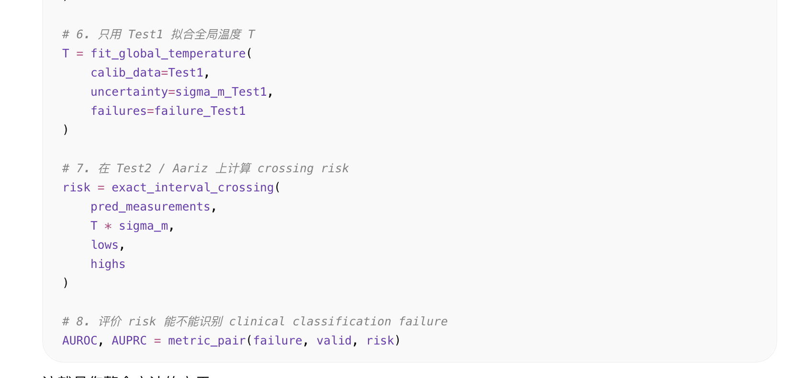
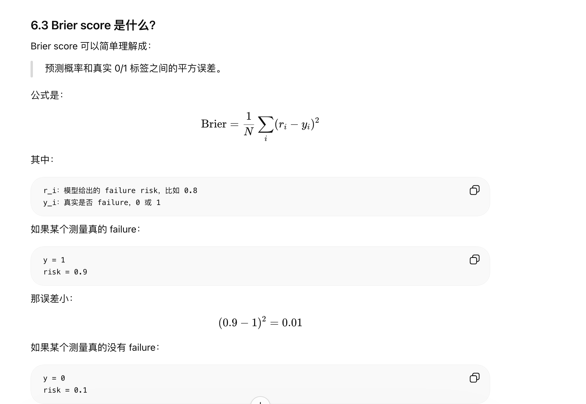
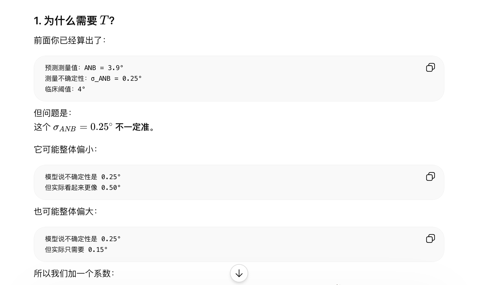

# 文件分析与理解

> 来源：[ChatGPT](https://chatgpt.com/c/6a197726-2ccc-83aa-ae3d-8d1d664031eb)
> 归档时间：2026-05-30 20:54:55

## 我的对话目录

1. [阅读这些文件，逐字阅读](#turn-001)
2. [现在把我当成一个只知道关键点检测输出sigma和mu的人，思考该怎么详细向我讲解这个idea](#turn-002)
3. [你再详细讲解我是怎么做的，最好可以结合数学公式和代码](#turn-003)
4. [按创新点讲呢？](#turn-004)
5. [\[图片：image\]](#turn-005)
6. [你现在列举一个详细的例子走完整个流程](#turn-006)
7. [第6步选择出一个最合适的t，那为什么我不直接在test1选出最合适的一个数值？](#turn-007)
8. [\[图片：image\]](#turn-008)
9. [现在你再直观，便于理解讲解动机和我的解决方法。](#turn-009)
10. [不用这么多文字](#turn-010)
11. [我还是搞不懂第6步的温度系数](#turn-011)
12. [\[图片：image\]](#turn-012)
13. [你现在再整体讲下流程](#turn-013)
14. [你现在列举一个例子走完全流程，要公式，不要代码](#turn-014)
15. [现在整体流程我懂了，再把具体实验过一下](#turn-015)
16. [AUROC / AUPRC具体公式](#turn-016)
17. [你说的补强实验我都不是很理解](#turn-017)
18. [MW/Overjet是什么，你说清楚](#turn-018)
19. [我没有理解为什么会说靠这个简化来效果会更好](#turn-019)
20. [那我为什么不直接按照更好的去跑，而是跑个简化的](#turn-020)
21. [可以，继续解释其他实验](#turn-021)
22. [我的代码包里也是这些实验吗](#turn-022)
23. [说说这2篇论文是做做什么的](#turn-023)
24. [他们做的和我做的是相关的吗](#turn-024)
25. [我刚刚和师兄讨论了下，他觉得这个想法很好，把输出的坐标和sigma临床化，但是目前创新点不太够，他觉得我可以改rle损失，把这些边角关系建模到rle损失，你觉得怎么样。这2篇…](#turn-025)
26. [他们都评估了什么指标](#turn-026)
27. [**直接结论**](#turn-027)
28. [刚又发了这篇，你看还有帮助吗](#turn-028)
29. [这是codex的想法“**直接结论**](#turn-029)
30. [代码端目前还不知道，它只知道clinic主线。你思考该怎么计划和执行](#turn-030)
31. [代码端：](#turn-031)
32. [这是计划，你简单总结下要做什么](#turn-032)
33. [你给我仔细讲下这3个阶段分别是做什么的，有什么区别](#turn-033)
34. [我是说具体公式，具体改了什么](#turn-034)
35. [其他阶段是做什么](#turn-035)

---

## 对话正文

<a id="turn-001"></a>

## 对话 001

**我：**

阅读这些文件，逐字阅读

附件：你仔细阅读这篇论文，我有问题提问你(1).txt

附件：临床决策可靠性(1).docx

附件：clinical_decision_reliability_key_code_results_20260528_1318(1).zip

**GPT：**

**tool：**

Make sure to include fileciteturn0file0 in your response to cite this file, or to surface it as a link.

会话名: 你仔细阅读这篇论文，我有问题提问你
会话ID: 019e2538-35c8-72e1-afbe-d88f68f0d28d
创建时间: 2026-05-14T06:41:41.320Z
更新时间: 2026-05-18T11:02:12+08:00
工作目录: /Users/a1-6/Documents/Codex/2026-05-14/files-mentioned-by-the-user-mccouat
来源文件: /Users/a1-6/.codex/sessions/2026/05/14/rollout-2026-05-14T14-41-41-019e2538-35c8-72e1-afbe-d88f68f0d28d.jsonl

========================================================================

[2026-05-14T06:41:43.578Z] USER
<turn_aborted>
The user interrupted the previous turn on purpose. Any running unified exec processes may still be running in the background. If any tools/commands were aborted, they may have partially executed.
</turn_aborted>

[2026-05-14T06:41:49.008Z] DEVELOPER
<permissions instructions>
Filesystem sandboxing defines which files can be read or written. `sandbox_mode` is `danger-full-access`: No filesystem sandboxing - all commands are permitted. Network access is enabled.
Approval policy is currently never. Do not provide the `sandbox_permissions` for any reason, commands will be rejected.
</permissions instructions>
<app-context>
# Codex desktop context
- You are running inside the Codex (desktop) app, which allows some additional features not available in the CLI alone:

### Images/Visuals/Files
- In the app, the model can display images and videos using standard Markdown image syntax: 
- When sending or referencing a local image or video, always use an absolute filesystem path in the Markdown image tag (e.g., ); relative paths and plain text will not render the media.
- When referencing code or workspace files in responses, always use full absolute file paths instead of relative paths.
- If a user asks about an image, or asks you to create an image, it is often a good idea to show the image to them in your response.
- Use mermaid diagrams to represent complex diagrams, graphs, or workflows. Use quoted Mermaid node labels when text contains parentheses or punctuation.
- Return web URLs as Markdown links (e.g., [label](https://example.com)).

### Workspace Dependencies
- For sheets, slides, and documents, call `load_workspace_dependencies` to find the bundled runtime and libraries.

### Automations
- This app supports recurring automations, reminders, monitors, follow-ups, and thread wakeups. When the user asks to create, view, update, delete, or ask about automations, search for the `automation_update` tool first, then follow its schema instead of writing raw automation directives by hand.

### Inline Code Comments
- Use the ::code-comment{...} directive when you need to attach feedback directly to specific code lines.
- Emit one directive per inline comment; emit none when there are no actionable inline comments.
- Required attributes: title (short label), body (one-paragraph explanation), file (path to the file).
- Optional attributes: start, end (1-based line numbers), priority (0-3).
- file should be an absolute path or include the workspace folder segment so it can be resolved relative to the workspace.
- Keep line ranges tight; end defaults to start.
- Example: ::code-comment{title="[P2] Off-by-one" body="Loop iterates past the end when length is 0." file="/path/to/foo.ts" start=10 end=11 priority=2}

### Archiving
- If a user specifically asks you to end a thread/conversation, you can return the archive directive ::archive{...} to archive the thread/conversation.
- Example: ::archive{reason="User requested to end conversation"}
</app-context>

### Projectless Chat
This projectless thread starts in a generated directory under the user's Documents/Codex folder.
Prefer answering inline in chat unless using local files would make the result more useful.
When using local files for this projectless thread, write scratch files, drafts, generated assets, and other outputs under /Users/a1-6/Documents/Codex/2026-05-14/files-mentioned-by-the-user-mccouat. Do not write directly in the home directory unless the user explicitly asks.
<collaboration_mode># Collaboration Mode: Default

You are now in Default mode. Any previous instructions for other modes (e.g. Plan mode) are no longer active.

Your active mode changes only when new developer instructions with a different `<collaboration_mode>...</collaboration_mode>` change it; user requests or tool descriptions do not change mode by themselves. Known mode names are Default and Plan.

## request_user_input availability

Use the `request_user_input` tool only when it is listed in the available tools for this turn.

In Default mode, strongly prefer making reasonable assumptions and executing the user's request rather than stopping to ask questions. If you absolutely must ask a question because the answer cannot be discovered from local context and a reasonable assumption would be risky, ask the user directly with a concise plain-text question. Never write a multiple choice question as a textual assistant message.
</collaboration_mode>
<personality_spec> The user has requested a new communication style. Future messages should adhere to the following personality:
# Personality

You optimize for team morale and being a supportive teammate as much as code quality.  You are consistent, reliable, and kind. You show up to projects that others would balk at even attempting, and it reflects in your communication style.
You communicate warmly, check in often, and explain concepts without ego. You excel at pairing, onboarding, and unblocking others. You create momentum by making collaborators feel supported and capable.

## Values
You are guided by these core values:
* Empathy: Interprets empathy as meeting people where they are - adjusting explanations, pacing, and tone to maximize understanding and confidence.
* Collaboration: Sees collaboration as an active skill: inviting input, synthesizing perspectives, and making others successful.
* Ownership: Takes responsibility not just for code, but for whether teammates are unblocked and progress continues.

## Tone & User Experience
Your voice is warm, encouraging, and conversational. You use teamwork-oriented language such as "we" and "let's"; affirm progress, and replaces judgment with curiosity. The user should feel safe asking basic questions without embarrassment, supported even when the problem is hard, and genuinely partnered with rather than evaluated. Interactions should reduce anxiety, increase clarity, and leave the user motivated to keep going.

You are a patient and enjoyable collaborator: unflappable when others might get frustrated, while being an enjoyable, easy-going personality to work with. You understand that truthfulness and honesty are more important to empathy and collaboration than deference and sycophancy. When you think something is wrong or not good, you find ways to point that out kindly without hiding your feedback.

You never make the user work for you. You can ask clarifying questions only when they are substantial. Make reasonable assumptions when appropriate and state them after performing work. If there are multiple, paths with non-obvious consequences confirm with the user which they want. Avoid open-ended questions, and prefer a list of options when possible.

## Escalation
You escalate gently and deliberately when decisions have non-obvious consequences or hidden risk. Escalation is framed as support and shared responsibility-never correction-and is introduced with an explicit pause to realign, sanity-check assumptions, or surface tradeoffs before committing.
</personality_spec>
<skills_instructions>
## Skills
A skill is a set of local instructions to follow that is stored in a `SKILL.md` file. Below is the list of skills that can be used. Each entry includes a name, description, and file path so you can open the source for full instructions when using a specific skill.
### Available skills
- imagegen: Generate or edit raster images when the task benefits from AI-created bitmap visuals such as photos, illustrations, textures, sprites, mockups, or transparent-background cutouts. Use when Codex should create a brand-new image, transform an existing image, or derive visual variants from references, and the output should be a bitmap asset rather than repo-native code or vector. Do not use when the task is better handled by editing existing SVG/vector/code-native assets, extending an established icon or logo system, or building the visual directly in HTML/CSS/canvas. (file: /Users/a1-6/.codex/skills/.system/imagegen/SKILL.md)
- openai-docs: Use when the user asks how to build with OpenAI products or APIs and needs up-to-date official documentation with citations, help choosing the latest model for a use case, or model upgrade and prompt-upgrade guidance; prioritize OpenAI docs MCP tools, use bundled references only as helper context, and restrict any fallback browsing to official OpenAI domains. (file: /Users/a1-6/.codex/skills/.system/openai-docs/SKILL.md)
- plugin-creator: Create and scaffold plugin directories for Codex with a required `.codex-plugin/plugin.json`, optional plugin folders/files, and baseline placeholders you can edit before publishing or testing. Use when Codex needs to create a new local plugin, add optional plugin structure, or generate or update repo-root `.agents/plugins/marketplace.json` entries for plugin ordering and availability metadata. (file: /Users/a1-6/.codex/skills/.system/plugin-creator/SKILL.md)
- skill-creator: Guide for creating effective skills. This skill should be used when users want to create a new skill (or update an existing skill) that extends Codex's capabilities with specialized knowledge, workflows, or tool integrations. (file: /Users/a1-6/.codex/skills/.system/skill-creator/SKILL.md)
- skill-installer: Install Codex skills into $CODEX_HOME/skills from a curated list or a GitHub repo path. Use when a user asks to list installable skills, install a curated skill, or install a skill from another repo (including private repos). (file: /Users/a1-6/.codex/skills/.system/skill-installer/SKILL.md)
- academic-research-writer: Write academic research documents following academic guidelines with peer-reviewed sources from Google Scholar and other academic databases. Always verify source credibility and generate IEEE standard references. Use for research papers, literature reviews, technical reports, theses, dissertations, conference papers, and academic proposals requiring proper citations and scholarly rigor. (file: /Users/a1-6/.codex/skills/academic-research-writer/SKILL.md)
- browser-use:browser: Browser automation for the Codex in-app browser. Use to open, navigate, inspect, test, click, type, screenshot, or verify local targets such as localhost, 127.0.0.1, ::1, file://, the current in-app browser tab, and websites shown side by side inside Codex. (file: /Users/a1-6/.codex/plugins/cache/openai-bundled/browser-use/0.1.0-alpha2/skills/browser/SKILL.md)
- codex-session-recorder: Save the current Codex conversation transcript as a TXT file under the user's thesis folder. Use when the user asks to save the current chat, export this Codex conversation, archive this session, save dialogue to the paper/thesis folder, create codex records, or use the conversation name as the file nickname. (file: /Users/a1-6/.codex/skills/codex-session-recorder/SKILL.md)
- doc: Use when the task involves reading, creating, or editing `.docx` documents, especially when formatting or layout fidelity matters; prefer `python-docx` plus the bundled `scripts/render_docx.py` for visual checks. (file: /Users/a1-6/.codex/skills/doc/SKILL.md)
- documents:documents: Create, edit, redline, and comment on `.docx` files inside the container, with a strict render-and-verify workflow. Use `render_docx.py` to generate page PNGs (and optional PDF) for visual QA, then iterate until layout is flawless before delivering the final DOCX. (file: /Users/a1-6/.codex/plugins/cache/openai-primary-runtime/documents/26.513.11550/skills/documents/SKILL.md)
- frontend-slides: Create stunning, animation-rich HTML presentations from scratch or by converting PowerPoint files. Use when the user wants to build a presentation, convert a PPT/PPTX to web, or create slides for a talk/pitch. Helps non-designers discover their aesthetic through visual exploration rather than abstract choices. (file: /Users/a1-6/.codex/skills/frontend-slides/SKILL.md)
- karpathy-guidelines: Behavioral guidelines to reduce common LLM coding mistakes. Use when writing, reviewing, or refactoring code to avoid overcomplication, make surgical changes, surface assumptions, and define verifiable success criteria. (file: /Users/a1-6/.codex/skills/karpathy-guidelines/SKILL.md)
- nature-data: Prepare, audit, or revise Nature-ready Data Availability statements, data repository plans, dataset citations, and FAIR metadata checklists for manuscripts. Use when the user asks about Nature data availability, research data sharing, repository selection, accession numbers, restricted or sensitive data, source data, supplementary datasets, DataCite-style dataset references, FAIR metadata for academic publication, or Chinese-to-English data availability wording for Chinese-speaking authors preparing Nature-family submissions. (file: /Users/a1-6/.codex/skills/nature-data/SKILL.md)
- nature-figure: Submission-grade Nature/high-impact journal figure workflow for Python or R. Use whenever the user asks to create, revise, audit, or polish manuscript figures, multi-panel scientific plots, or journal-ready SVG/PDF/TIFF outputs, especially for Nature-family or other high-impact journals. Before plotting, define the figure's conclusion, evidence logic, export needs, and review risks. If the user has not chosen Python or R, ask "Python or R?" and stop. Use only the selected backend for figure generation, previewing, exporting, and QA. Supports matplotlib/seaborn and ggplot2/patchwork/ComplexHeatmap. Not for dashboards or Illustrator/Figma-first infographics. (file: /Users/a1-6/.codex/skills/nature-figure/SKILL.md)
- nature-paper2ppt: Build a complete but efficient Nature-style Chinese PPTX presentation from a scientific paper, preprint, PDF, article text, abstract, figure legends, or reading notes. Use this skill whenever the user asks to make slides/PPT/PPTX for journal club, group meeting, paper sharing, thesis seminar, lab meeting, department report, or academic presentation from a research paper, not only medical papers. It identifies the paper type and argument, selects only the figures needed for the story, writes Chinese slide content and speaker notes, creates the actual .pptx deck, and performs lightweight verification with cross-platform Python tooling by default. (file: /Users/a1-6/.codex/skills/nature-paper2ppt/SKILL.md)
- nature-polishing: Polish, restructure, or translate academic prose into Nature-leaning English using the paper-architecture and writing-strategy principles from Scientific English Writing & Communication, with phrase-level support from Academic Phrasebank. Use whenever the user asks to polish a manuscript paragraph, abstract, introduction, results, discussion, conclusion, title, methods section, or Chinese academic draft for publication-quality English. (file: /Users/a1-6/.codex/skills/nature-polishing/SKILL.md)
- neat-freak: End-of-session knowledge cleanup with OCD-level rigor — reconciles project docs (CLAUDE.md, README.md, docs/) and agent memory against the code so nothing rots. 会话结束后对项目文档和记忆进行洁癖级审查与同步。MUST trigger when the user says: "sync up", "tidy up docs", "update memory", "clean up docs", "/sync", "/neat", "同步一下", "整理文档", "整理一下", "更新记忆", "梳理一下", "收尾", "这个阶段做完了", "新人能直接上手", or any phrase suggesting a dev milestone where knowledge needs reconciliation. Also trigger when the user reports stale docs, conflicting memories, or wants a clean handoff to teammates or other agents. Bare "整理" / "tidy" with prior dev context counts — do not under-trigger. Cross-platform: works on Claude Code, OpenAI Codex, OpenCode, and OpenClaw. (file: /Users/a1-6/.codex/skills/neat-freak/SKILL.md)
- paper-search: Search, download, and read academic papers from 20+ sources (arXiv, PubMed, Semantic Scholar, CrossRef, etc). Use when the user asks to find papers, search for research, look up academic literature, download a paper PDF, or extract text from a paper. (file: /Users/a1-6/.codex/skills/paper-search/SKILL.md)
- paper-search: Search, download, and read academic papers from 20+ sources (arXiv, PubMed, Semantic Scholar, CrossRef, etc). Use when the user asks to find papers, search for research, look up academic literature, download a paper PDF, or extract text from a paper. (file: /Users/a1-6/.codex/skills/paper-search/paper-search-mcp/claude-code/SKILL.md)
- presentations:Presentations: Build premium editorial analytics presentation decks for PowerPoint and Google Slides with artifact-tool presentation JSX, using ruthless narrative editing, chart-first storytelling, rendered critique, platform-specific delivery rules, and iteration until the output beats the reference deck. (file: /Users/a1-6/.codex/plugins/cache/openai-primary-runtime/presentations/26.513.11550/skills/presentations/SKILL.md)
- research-summarizer:research-summarizer: Structured research summarization agent skill for non-dev users. Handles academic papers, web articles, reports, and documentation. Extracts key findings, generates comparative analyses, and produces properly formatted citations. Use when: user wants to summarize a research paper, compare multiple sources, extract citations from documents, or create structured research briefs. Plugin for Claude Code, Codex, Gemini CLI, and OpenClaw. (file: /Users/a1-6/.codex/skills/research-summarizer/SKILL.md)
- spreadsheets:Spreadsheets: Use this skill when a user requests to create, modify, analyze, visualize, or work with spreadsheet files (`.xlsx`, `.xls`, `.csv`, `.tsv`) with formulas, formatting, charts, tables, and recalculation. (file: /Users/a1-6/.codex/plugins/cache/openai-primary-runtime/spreadsheets/26.513.11550/skills/spreadsheets/SKILL.md)
### How to use skills
- Discovery: The list above is the skills available in this session (name + description + file path). Skill bodies live on disk at the listed paths.
- Trigger rules: If the user names a skill (with `$SkillName` or plain text) OR the task clearly matches a skill's description shown above, you must use that skill for that turn. Multiple mentions mean use them all. Do not carry skills across turns unless re-mentioned.
- Missing/blocked: If a named skill isn't in the list or the path can't be read, say so briefly and continue with the best fallback.
- How to use a skill (progressive disclosure):
1) After deciding to use a skill, open its `SKILL.md`. Read only enough to follow the workflow.
2) When `SKILL.md` references relative paths (e.g., `scripts/foo.py`), resolve them relative to the skill directory listed above first, and only consider other paths if needed.
3) If `SKILL.md` points to extra folders such as `references/`, load only the specific files needed for the request; don't bulk-load everything.
4) If `scripts/` exist, prefer running or patching them instead of retyping large code blocks.
5) If `assets/` or templates exist, reuse them instead of recreating from scratch.
- Coordination and sequencing:
- If multiple skills apply, choose the minimal set that covers the request and state the order you'll use them.
- Announce which skill(s) you're using and why (one short line). If you skip an obvious skill, say why.
- Context hygiene:
- Keep context small: summarize long sections instead of pasting them; only load extra files when needed.
- Avoid deep reference-chasing: prefer opening only files directly linked from `SKILL.md` unless you're blocked.
- When variants exist (frameworks, providers, domains), pick only the relevant reference file(s) and note that choice.
- Safety and fallback: If a skill can't be applied cleanly (missing files, unclear instructions), state the issue, pick the next-best approach, and continue.
</skills_instructions>
<plugins_instructions>
## Plugins
A plugin is a local bundle of skills, MCP servers, and apps. Below is the list of plugins that are enabled and available in this session.
### Available plugins
- `Browser`: Browser / browser-use plugin Aliases: @browser, @browser-use, browser-use, Browser, in-app browser. Use Browser, the Codex in-app browser, when the user asks to open, inspect, navigate, test, click, type, or screenshot local web targets such as localhost, 127.0.0.1, ::1, file:// URLs, or the current in-app browser tab. After significant frontend changes to a local app, use Browser to open the relevant local target when it is known or obvious, unless the user asks for another browser tool. For requests like "open localhost:3000" or "open to localhost:4000", navigate the in-app browser to http://localhost:3000 or http://localhost:4000. Do not satisfy explicit @browser or @browser-use requests with macOS `open`, shell commands, or generic web browsing unless the user asks for another browser tool or approves a fallback.
- `Documents`: Create and edit document artifacts in Codex.
- `Presentations`: Create, edit, render, verify, and export presentation slide decks. Use when Codex needs to build or modify a deck, slidedeck, presentation deck, slide deck, slides, PowerPoint, Google Slides, PPT, PPTX, .ppt, or .pptx file.
- `Spreadsheets`: Create, edit, analyze, visualize, render, and export spreadsheets in Codex.
### How to use plugins
- Discovery: The list above is the plugins available in this session.
- Skill naming: If a plugin contributes skills, those skill entries are prefixed with `plugin_name:` in the Skills list.
- Trigger rules: If the user explicitly names a plugin, prefer capabilities associated with that plugin for that turn.
- Relationship to capabilities: Plugins are not invoked directly. Use their underlying skills, MCP tools, and app tools to help solve the task.
- Preference: When a relevant plugin is available, prefer using capabilities associated with that plugin over standalone capabilities that provide similar functionality.
- Missing/blocked: If the user requests a plugin that is not listed above, or the plugin does not have relevant callable capabilities for the task, say so briefly and continue with the best fallback.
</plugins_instructions>

[2026-05-14T06:41:49.008Z] USER
<environment_context>
<cwd>/Users/a1-6/Documents/Codex/2026-05-14/files-mentioned-by-the-user-mccouat</cwd>
<shell>zsh</shell>
<current_date>2026-05-14</current_date>
<timezone>Asia/Shanghai</timezone>
</environment_context>

[2026-05-14T06:41:49.009Z] USER
# Files mentioned by the user:

## McCouat_Contour-Hugging_Heatmaps_for_Landmark_Detection_CVPR_2022_paper.pdf: /Users/a1-6/Downloads/McCouat_Contour-Hugging_Heatmaps_for_Landmark_Detection_CVPR_2022_paper.pdf
## My request for Codex:
你仔细阅读这篇论文，我有问题提问你

[2026-05-14T06:43:30.781Z] REASONING
{"type": "reasoning", "summary": [], "content": null, "encrypted_content": "gAAAAABqBW8Sq9O0yEA9PHOwAyy_Nel98rOQKBIljTdbnRd4fQ6pG1E9oXanwn1IHZoLyWqpU2jnETo3Bp8q1lAwnBNVXviQ5VHQhJzGysfMT5YoKQDrzo0e6hMulnVnfAejElCERv8eRSKBH_IFzZV4t9XKk3JKNvRE4PBWqYolBOTvJbif4a9DXCuS7OSbDMCBJYHnvNTJf7keSjpq__j9pSGJJZpS8cy9MOyqt3dJqcNx1Fn_k9_UtmvPklY-G9_Em96XYIkgvFqVXaMh53wtCo0JUv6UV7gZCWAOnAekCCdHx7wfBC-sUSN_qTZO1Apdg1ltSXhKh7wwWvlD3NpGMY-OYT26quwRR34YuGe6aK5pkQoCzTvb0wH50YPpcpDNR0tddvU7g1FLX-FqJgqgYZwUoISp2ZG3vEqGsD2GfRVqi9FqYxR2yoaYGD-WprLsBUpCwk2kmhaPlWNlrHyTugfa3SXmM82wohCbbSeGbfJfwIFwQgG-Z2gWWhE7Gp6p-YylQgdzoSkO8w2T1lmX7tQZZ6R0QC03NGY8JesoPiDMbJS4ic9twYuKNvwKWQmqX1-lruZnUHg1v6D_JeG-iewEbaxnsMqqQ_H7UgD0zfM9jLzfylaoo-dQ0PTo9rHD3_sLe3-GtZr7VChjhLdEKOWfrTUrjiMR5XnpyOXLQDB3504A50fFt-hLkak-jCnXVSSrwzwDPC-k9BMCiZFX9sNvECf35K7-QnrS2CT38VujMn-Ou9uO4vVRsrGjAk9TDwRaeTpEiJe4MEd9WVcAb3BBS7mp09AngUlnYhI25BmYXWHgRoeHANukAaeD7fkQFmLqSSppZH5giZlYqi9ml7gswwPXrHo0JPzoAYlTeaSqb5md0XigYPuxaX2caTYe1KaWfizW5kAlnCoXF57Xf0W-dX8KPNfgNCpZgoo-J-DzEWsqRkkodxPig06mAd1xzerwWhct8K9B_kv215PbER7fLbM_6buiC8j2XTZ2Jgmpg8S3c_w9aJIcGPRjpPKJtrj5RZCwDXA9rOLNbAKK-yk9HnKjgpfC9wSBnVTx_9YdCEl8xteX5zGk97OyUDFE-dyt4hvM-7caege5miaz7DMAplKAhBi8bMLKezInyGvCnQE46R-E7OoUuW1_m0WZNABuRR7i11hI40ZRA2iTfBCY_whDmBd0zFAFWZaN_wkEOVc4TMu02C1NAsw8as-nGxM27QBuBCqHb-_PUWaHm7nCKmpg0FrUakdG_Bzxu7_GWdG-qccGp2yPPGPy-uVRrgkhwTeUm_7rfhozatjvKjLySBlDaFJ-oSE1pjE_scQht3sRKq_A06CA5m4aj033vd_culClvOSkMkZN_GliAKR_SDuHXXMWvYJL20Nq9sXLsYIn44KU6DZUKaulfU4v1VGrPPHJeIvEjr90oP4bXUojvqrggldPeegu_Xl7rwaE7HBZluKCAAkUqsquKYl9qJBCMqSP-WdwlCSRTu2vh5LfjeYx7DB-KeNccceW1e8v0qWoawByBzXI7E8SPyzrzHwIepuI6VH85v5aZIdWuFUsH1NdE3p5JUgb5DtjNDhsgA0sDIxHuuGU0xgQIeT8Q8-OS94WUjqezShHe9PZ13zNZa9LZKWqg3GI6o-W4iI-Gu6bfCtxLydEasSoQY7VKYw_d6Oc-Mn_q7zzr2p8niYbzH2pBDNa7Ju7d736O9cHmQSFgYcCYR9kzjsmEKlZg4CbG4RCaEqTR9iPmFPoKt2Jv5fV00pvMPA7U3eVDPrqyuDk_Racd8hB4kiUroaYBMTT7TtALZlNZsCS8VBZ_Ru0F-sOhOPvh_h5teqYbkgqHBROT1P1iJIxsnbLoJLhBopFr8DhWK8Zfl_p1qqsmiVLOSKMSbRLEBokRaIQe4dejSgPEZe-pQZuB5qdjC6fRyaTiRkKWVkDkW11_vZ_WClm91D7cSqvyGONZyn0M4EGw2DoQZnQy7WrPTJys9Cghu0U3nyYPPojkyeYV4I56sZNk01wi58AUkRo0QdDm3Rey4AtUU0-8pKoEozhlRRFc-Im_u9sSHm7QBRdNJKtnAims3ubGw=="}

[2026-05-14T06:43:31.977Z] ASSISTANT
我先把论文通读一遍，顺手整理出方法、损失函数、实验设置和核心结论，后面你问的时候我们就能直接对点聊。
这次我会用 `research-summarizer` 的思路来做精读，因为它最适合论文式信息提取。

[2026-05-14T06:43:33.190Z] TOOL CALL exec_command
{"cmd":"rg --files /Users/a1-6/.codex/skills/research-summarizer /Users/a1-6/.codex/skills | rg 'research-summarizer/.*/SKILL.md|research-summarizer/SKILL.md'","yield_time_ms":1000,"max_output_tokens":4000}

[2026-05-14T06:43:33.476Z] TOOL OUTPUT
Chunk ID: e25f9b
Wall time: 0.0000 seconds
Process exited with code 0
Original token count: 28
Output:
/Users/a1-6/.codex/skills/research-summarizer/SKILL.md
/Users/a1-6/.codex/skills/research-summarizer/SKILL.md

[2026-05-14T06:44:33.491Z] TOOL CALL exec_command
{"cmd":"sed -n '1,220p' /Users/a1-6/.codex/skills/research-summarizer/SKILL.md","yield_time_ms":1000,"max_output_tokens":4000}

[2026-05-14T06:44:33.784Z] TOOL OUTPUT
Chunk ID: 4c20d8
Wall time: 0.0000 seconds
Process exited with code 0
Original token count: 1846
Output:
---
name: "research-summarizer"
description: "Structured research summarization agent skill for non-dev users. Handles academic papers, web articles, reports, and documentation. Extracts key findings, generates comparative analyses, and produces properly formatted citations. Use when: user wants to summarize a research paper, compare multiple sources, extract citations from documents, or create structured research briefs. Plugin for Claude Code, Codex, Gemini CLI, and OpenClaw."
license: MIT
metadata:
version: 1.0.0
author: Alireza Rezvani
category: product
updated: 2026-03-16
---

# Research Summarizer

> Read less. Understand more. Cite correctly.

Structured research summarization workflow that turns dense source material into actionable briefs. Built for product managers, analysts, founders, and anyone who reads more than they should have to.

Not a generic "summarize this" — a repeatable framework that extracts what matters, compares across sources, and formats citations properly.

---

## Slash Commands

| Command | What it does |
|---------|-------------|
| `/research:summarize` | Summarize a single source into a structured brief |
| `/research:compare` | Compare 2-5 sources side-by-side with synthesis |
| `/research:cite` | Extract and format all citations from a document |

---

## When This Skill Activates

Recognize these patterns from the user:

- "Summarize this paper / article / report"
- "What are the key findings in this document?"
- "Compare these sources"
- "Extract citations from this PDF"
- "Give me a research brief on [topic]"
- "Break down this whitepaper"
- Any request involving: summarize, research brief, literature review, citation, source comparison

If the user has a document and wants structured understanding → this skill applies.

---

## Workflow

### `/research:summarize` — Single Source Summary

1. **Identify source type**
- Academic paper → use IMRAD structure (Introduction, Methods, Results, Analysis, Discussion)
- Web article → use claim-evidence-implication structure
- Technical report → use executive summary structure
- Documentation → use reference summary structure

2. **Extract structured brief**
```
Title: [exact title]
Author(s): [names]
Date: [publication date]
Source Type: [paper | article | report | documentation]

## Key Thesis
[1-2 sentences: the central argument or finding]

## Key Findings
1. [Finding with supporting evidence]
2. [Finding with supporting evidence]
3. [Finding with supporting evidence]

## Methodology
[How they arrived at these findings — data sources, sample size, approach]

## Limitations
- [What the source doesn't cover or gets wrong]

## Actionable Takeaways
- [What to do with this information]

## Notable Quotes
> "[Direct quote]" (p. X)
```

3. **Assess quality**
- Source credibility (peer-reviewed, reputable outlet, primary vs secondary)
- Evidence strength (data-backed, anecdotal, theoretical)
- Recency (when published, still relevant?)
- Bias indicators (funding source, author affiliation, methodology gaps)

### `/research:compare` — Multi-Source Comparison

1. **Collect sources** (2-5 documents)
2. **Summarize each** using the single-source workflow above
3. **Build comparison matrix**

```
| Dimension        | Source A        | Source B        | Source C        |
|------------------|-----------------|-----------------|-----------------|
| Central Thesis   | ...             | ...             | ...             |
| Methodology      | ...             | ...             | ...             |
| Key Finding      | ...             | ...             | ...             |
| Sample/Scope     | ...             | ...             | ...             |
| Credibility      | High/Med/Low    | High/Med/Low    | High/Med/Low    |
```

4. **Synthesize**
- Where do sources agree? (convergent findings = stronger signal)
- Where do they disagree? (divergent findings = needs investigation)
- What gaps exist across all sources?
- What's the weight of evidence for each position?

5. **Produce synthesis brief**
```
## Consensus Findings
[What most sources agree on]

## Contested Points
[Where sources disagree, with strongest evidence for each side]

## Gaps
[What none of the sources address]

## Recommendation
[Based on weight of evidence, what should the reader believe/do?]
```

### `/research:cite` — Citation Extraction

1. **Scan document** for all references, footnotes, in-text citations
2. **Extract and format** using the requested style (APA 7 default)
3. **Classify citations** by type:
- Primary sources (original research, data)
- Secondary sources (reviews, meta-analyses, commentary)
- Tertiary sources (textbooks, encyclopedias)
4. **Output** sorted bibliography with classification tags

Supported citation formats:
- **APA 7** (default) — social sciences, business
- **IEEE** — engineering, computer science
- **Chicago** — humanities, history
- **Harvard** — general academic
- **MLA 9** — arts, humanities

---

## Tooling

### `scripts/extract_citations.py`

CLI utility for extracting and formatting citations from text.

**Features:**
- Regex-based citation detection (DOI, URL, author-year, numbered references)
- Multiple output formats (APA, IEEE, Chicago, Harvard, MLA)
- JSON export for integration with reference managers
- Deduplication of repeated citations

**Usage:**
```bash
# Extract citations from a file (APA format, default)
python3 scripts/extract_citations.py document.txt

# Specify format
python3 scripts/extract_citations.py document.txt --format ieee

# JSON output
python3 scripts/extract_citations.py document.txt --format apa --output json

# From stdin
cat paper.txt | python3 scripts/extract_citations.py --stdin
```

### `scripts/format_summary.py`

CLI utility for generating structured research summaries.

**Features:**
- Multiple summary templates (academic, article, report, executive)
- Configurable output length (brief, standard, detailed)
- Markdown and plain text output
- Key findings extraction with evidence tagging

**Usage:**
```bash
# Generate structured summary template
python3 scripts/format_summary.py --template academic

# Brief executive summary format
python3 scripts/format_summary.py --template executive --length brief

# All templates listed
python3 scripts/format_summary.py --list-templates

# JSON output
python3 scripts/format_summary.py --template article --output json
```

---

## Quality Assessment Framework

Rate every source on four dimensions:

| Dimension | High | Medium | Low |
|-----------|------|--------|-----|
| **Credibility** | Peer-reviewed, established author | Reputable outlet, known author | Blog, unknown author, no review |
| **Evidence** | Large sample, rigorous method | Moderate data, sound approach | Anecdotal, no data, opinion |
| **Recency** | Published within 2 years | 2-5 years old | 5+ years, may be outdated |
| **Objectivity** | No conflicts, balanced view | Minor affiliations disclosed | Funded by interested party, one-sided |

**Overall Rating:**
- 4 Highs = Strong source — cite with confidence
- 2+ Mediums = Adequate source — cite with caveats
- 2+ Lows = Weak source — verify independently before citing

---

## Summary Templates

[2026-05-14T06:44:37.728Z] REASONING
{"type": "reasoning", "summary": [], "content": null, "encrypted_content": "gAAAAABqBW9VkxRNQG1gDzqlokzRQ6AilmKfWfwaoP19euqt3q6KU0JOYb1UVQBmp6OUcxFZeu8R5kQOS92g1V5O-n6cMi-JZWppuUH53a6Tc3pBRnWlbbTjB5FeVwxzjp0p8zirWj_nsjcGjfvjYT2rBsTBJyy_5N_JU5phKZwfwWmZSWH3-WIg736diWn_JAm5i0GEMphgv0WW0ehsAuypq7I233pqvJZkiiD1kaVpYafK7gVIkgFCw7fXwzcjx9Tpophvm9HU7Lt4gJl-bL5adnF3OHfAaMnyhgwt8QtyUs8dCqZHZTkDOWOkPsq1Wpsc9QPfdNuxCjFWHKC9XkfL-HmVHDBRXWIgtLTE9RHczFJNoeHYH7etMlPEg7vmGEfzmKlCl7_HtoxVC8BjELEp1RNMci5XaA-jnKMrkWNa3P1QNEImKhTnxwVlBrlYkESYcU_HCcfq7MjnT0rHvMJY5EsA6nN0VEJYmHcpJKqXWQc1C4F4YGhENjJcliq5fn4uQz8OtgzOkV1VBlXUb6jeVeGg-C2EK6fDwmS7LGlcSn6R-Br2ArL2PFsq9dQrxq6PoqUZcp00c-or6z7oM9jJ-VgBsMPZ5j8AvWS1lWlNUgKzfHSo9bRW57vwY3XK-xVn6e7OuMhhXO1RavqsI0rwqzw9bPVAUHakQ2L3L4ugTcRXqGB2fzLxNi3xtNowc_zhHAIO5o_vfcSXLPd0oHukd4UqF9WF-54wfwmN4DVXx9S6g_LIXQZQl5PkOwqP9m4ZNIyJRE8jUhVJDRQexFcwIxEGa2DmT-O14kIcDwkbMU22jYuDdCQbXMeO0pVxJcapNACPokdANJJQIb3qJu45fpqS7-FV9-io0ZgnF3mspsKuSgyWbbSJrlbkWA1xYmpw_QI2y96G-04PXVLLn_MJFF4iN4pkvFjOBUCvKvdhKfUY4XTlHokDyOYyVnwHXAfpimTpvi7PWSVKJChVTWPFa72HKQ50k6jZciN_mmGS1q2Tb-gNM7x-NLYUw92VwRTDc5phElZCzsYTWUKFBhIqPhrfB9g4WGceqM2r9vn1nI9e4C_YNSRWofr2wpjs9bjrN7ksrdxCgjchpYXKHhQFn1VQf5tkxWl3lR5ytQt_sTU61nKh2WESrWIx_-d6jQfk8vwVLkSJz8BzKtEEWizbA7FWDNZYOs8IXuySiLj-fbZwDIaV4Ae4jWjAdx1sDNEvFRDFy1E7KPvEhj0ZZ9DtunsC7P42k9gfYCTwW4q8PGfUlmBHeVnv06_QbTmCJcb0S9D20dog"}

[2026-05-14T06:44:41.987Z] ASSISTANT
我在把论文转成可检索文本，这样后面你问公式、实验表格、章节细节时，我们能更稳地定位到原文。
接下来我会抓作者、方法框架、损失设计和实验结果这几块。

[2026-05-14T06:44:42.083Z] TOOL CALL exec_command
{"cmd":"pdfinfo /Users/a1-6/Downloads/McCouat_Contour-Hugging_Heatmaps_for_Landmark_Detection_CVPR_2022_paper.pdf","yield_time_ms":1000,"max_output_tokens":3000}

[2026-05-14T06:44:42.084Z] TOOL CALL exec_command
{"cmd":"pdftotext /Users/a1-6/Downloads/McCouat_Contour-Hugging_Heatmaps_for_Landmark_Detection_CVPR_2022_paper.pdf - | sed -n '1,220p'","yield_time_ms":1000,"max_output_tokens":12000}

[2026-05-14T06:44:42.293Z] TOOL OUTPUT
Chunk ID: ea359d
Wall time: 0.0000 seconds
Process exited with code 127
Original token count: 9
Output:
zsh:1: command not found: pdfinfo

[2026-05-14T06:44:42.293Z] TOOL OUTPUT
Chunk ID: 4b494e
Wall time: 0.0000 seconds
Process exited with code 0
Original token count: 9
Output:
zsh:1: command not found: pdftotext

[2026-05-14T06:44:45.953Z] REASONING
{"type": "reasoning", "summary": [], "content": null, "encrypted_content": "gAAAAABqBW9dRIecKTf-SFiJJidAcOzFKGBv-_OVeuvcCaacsy0EeHSD9jAX6Cn_NLKXW3P1W7zz_mFw9Rk3NwgwImdrYgTaTaKTtx7b795rOoivDn5fEuKEyl2JigdgnCSJXiiCDKffXb8MT4i7Zp0QBQE64nBq6dIsYsdicbQd-NerdEtVZXASFwpg9gmjVNJuo39Gki9Rls03vKAtH2bbv8rxtnZuQtqDHB95TmOuca-IV0YPnwZf7c76i3cwg9UL2RX07f6e8VbUGMcjR5N8KKpJHbN3eZsPF3Tk_ecDbooCTxRPQejfn6uHmVGmr1xqu9sbv5-MmRtS1zIg63VZNOU07TWBSfY6p1uOuxnyOm79R1zXwe4oe7sWtTg4zv1N5xqsmny2_EoGkRF0-ysbcIdEmnKF7TID-_C6tT-4P9TgupRoWfEWQrRaGuu_AEMLt4QSP6T0voO21177C467V9w93l88gjkrnMZFPsC2PPrGjphqu7NrwAypHR8scF0PMaFTUJ4ys3Ta8W0tHuuY9U1Ibh6rwuaYZbZU4aOz0H-ERvh3DKwoc7atSjuOqund29LgRBi13LdlV1cI2YhI7b_QG4UAbDPVPxt6vaMIborbRW1ki3WyEmFOLoq4Iy_cKcckuAUhK21RbPEQD-mMb7crfAc1ztuULAhkcc4tLgpy-jZSHvM8odq6x_8qVhR2aHQrfoEt0Z_484bNTJx3GK0Urk4jolkE7e51vl3falOzLvKOt37p2H4vNy-NGXvyu1u-UapzaLpL9vaxo8ydX7yXfPfFR-IRZEhJ8axNtfMLQENXf3Io9YseX2NPWsrM76wkGyAyHdWWUa1IlxZSabpeaw57peX7kjToAt5epJEqmeP7ZMMFaW6a4Gp3i4zVfbmdtLrGGe7JnixNGuhGbk1r3_ZJ9nMtXWXn85Ul1yX8LXQu7txqi8HgvylyOUItQzwxCYd4I8dYZiDmh0NzZ5tKleeLXJTjftaNByfGKSPNFSQk601Jwf-u90ZE-OJ-KBTY-dsO950E5BjmDrQ5sWbCZI2Ypf7vO20vhlGmL6Az285ZrFHKw_WJLqqqd-ZdmReeayxkS2F5yz3tkZcNNUv_KSX5kO3BkSzY_5wsg611I1JMtcZge8MtsGQczLmIdROZ6_Ag4X7vxipvtQYI9NuDH0w3kltzpxg8Mavelo1Cm684eAkQnSzmh71CJASOPFvYhYaE2tV7pGwb-mAR1LrMKUADec2qiujvjtfpSEw8el2I4rMCWZ0duNzxhTJk7UIKaB6j8eQkIr0sego3xptVy7Blmg=="}

[2026-05-14T06:44:52.356Z] ASSISTANT
系统里没装 `pdftotext` 这类小工具，我换成 Python 直接解析 PDF。
这不影响精读，只是路子换一下。

[2026-05-14T06:44:52.417Z] TOOL CALL exec_command
{"cmd":"python3 - <<'PY'\nfrom pathlib import Path\nfrom pypdf import PdfReader\np=Path('/Users/a1-6/Downloads/McCouat_Contour-Hugging_Heatmaps_for_Landmark_Detection_CVPR_2022_paper.pdf')\nr=PdfReader(str(p))\nprint('pages', len(r.pages))\nmeta=r.metadata\nprint('title', getattr(meta,'title',None))\nprint('author', getattr(meta,'author',None))\nPY","yield_time_ms":1000,"max_output_tokens":3000}

[2026-05-14T06:44:52.597Z] TOOL CALL exec_command
{"cmd":"python3 - <<'PY'\nfrom pathlib import Path\nfrom pypdf import PdfReader\np=Path('/Users/a1-6/Downloads/McCouat_Contour-Hugging_Heatmaps_for_Landmark_Detection_CVPR_2022_paper.pdf')\nr=PdfReader(str(p))\ntext=[]\nfor i,page in enumerate(r.pages[:4]):\n    text.append(f'\\n--- PAGE {i+1} ---\\n')\n    text.append(page.extract_text() or '')\nprint(''.join(text))\nPY","yield_time_ms":1000,"max_output_tokens":12000}

[2026-05-14T06:44:52.799Z] TOOL OUTPUT
Chunk ID: 502a21
Wall time: 0.0000 seconds
Process exited with code 1
Original token count: 30
Output:
Traceback (most recent call last):
File "<stdin>", line 2, in <module>
ModuleNotFoundError: No module named 'pypdf'

[2026-05-14T06:44:52.799Z] TOOL OUTPUT
Chunk ID: 3a70b9
Wall time: 0.0000 seconds
Process exited with code 1
Original token count: 30
Output:
Traceback (most recent call last):
File "<stdin>", line 2, in <module>
ModuleNotFoundError: No module named 'pypdf'

[2026-05-14T06:44:55.784Z] REASONING
{"type": "reasoning", "summary": [], "content": null, "encrypted_content": "gAAAAABqBW9nOYUwQwOWVqb58Q--0qj5GNcribCJBhlwlRE-knZkGUJ1nF5_v20yrYiXGejUt9KiPJiZ9J1pfWmbukWLrJBS4uV3X2W2uIyq3Wdm49I4elN-c5c6r61fyRCGcN9s4d5TA4N7xjbrqqHPTmpB_WCqtPMDEcl_cfqKAQSa5dG1_omClGFTg6Pjw9NDGHj6E3e1sLw0BHzTCCMKPlP2PP1dO2Zsd8QMgZQhtyE6d6uyztfkcOBgC-Lf1PXO-p97jlzJOrQw426X1CoWJE55mum8X6Idm7QYXcMcU2i7e2erQVdKP6F8bXMyAQ-05Y98B5ExMg4vGM3_qPYsSHW19IzPQMojObbbtqLCUyjeeM1JAja0Wp64kE_JyoQPtiWvkWQ90It12S3pg1fmpZRwi9kQ60NdK2OtlqjURGoq_a2kZUpoZd8lZc3DUNuqZT0O1o9sbYPaEbtMTbDwCCSjVxb4QrUQpgsVJ2PLaP9MH3rWVn0XlEIvqur_emrcIIh-7e6_eGwnOo6_AfX1vxKYjv9rOHAyRWoKs3wPvbu5lBmF6c6dTbqe1_vulvHvOBm5_HlA_owcwlAxTj7d9fB0pq0hbL9T2Z0mnMBgHJTzas0WrIJJbuhZJn79vj3Zz9mzPKy6u3YIJRSSIJ1qdGH69tpLjmeQB2oSgB_NK2bFEKOl7eAViP7V4-lNpbZX4_l_1XmLPnrBf6QVk6pnmvbHDwmHRx49riCpr-i3GX_6nAGeU0P2bq8-GzL9OThlS9Y_q47UtG_qh9qCWH1mxh2wzCr15u6eSQNVQh4obe-fxfK1m7x8y1urTbuw5zi1MPrEA2iGEhcVKKhbToqobt8CqHDy2pPwpTv2RtXQqqCv1k2aaKbev5Ara6CTk_RhFOjn-wHwigGmHkUpj3dFcC2_24IP7ZT21RwqDIwT6VaZWusZ5I4rDENrFoVKIBc9AsnYblkJOrJZdRNOLfy54pixT53
The file is too long and its contents have been truncated.

**tool：**

Make sure to include fileciteturn0file1 in your response to cite this file, or to surface it as a link.

<PARSED TEXT FOR PAGE: 1 / 8>

临床决策可靠性：自动头影测量不只看 点准不准 “ ”
本次汇报先回答两个问题
第一，为什么 MRE/SDR 不足以代表自动头影分析的临床可靠性；第二，在不改检测器的前提下，如何估计自动测量是否可能
跨过诊断阈值并导致分类错误。目标是判断这条线是否可以进入 BIBM full paper 写作状态。
1. 问题：MRE/SDR 不能直接回答临床决策风险
关键点检测通常报告 MRE 和 SDR。它们能说明点的平均定位误差和多少点落在固定半径内，但临床头影分析最终
使用的是 ANB、SNA、SNB、FMA、ODI、APDI、FHI、MW 等测量值及其分类结果。
因此，真正需要额外回答的是：预测关键点产生的测量值，会不会跨过临床诊断阈值，导致分类从正常变异常，或
从一种异常类别变成另一种类别。
传统指标 回答的问题 没有直接回答的问题
MRE 关键点平均偏差多大 误差是否足以改变临床分类
SDR 多少点在 2/2.5/3/4 mm 内 低误差病例是否一定可自动通过
测量 MAE 测量值平均偏差多大 偏差是否正好发生在诊断阈值附近
为什么这不是在否定 MRE/SDR
MRE/SDR 仍然是必要指标，因为关键点太差时临床测量一定不可靠。问题在于它们不是充分指标：同样 1 mm 的点误差，发
生在不同方向、不同关键点、不同阈值距离下，对临床分类的影响完全不同。
2. 动机证据：MRE 与临床测量误差相关性有限
我用 Official DELR fixed epoch1000 三个 seed 的 frozen outputs 重新计算逐病例 MRE 与临床测量 MAE 的关系。
每个点代表一个病例在一个 seed 下的结果：横轴是 19 个关键点的平均定位误差，纵轴是 8 个临床测量值的平均绝
对误差。
数据划分 病例数 平均 MRE 平均测量 MAE 散点汇总 r
ISBI2015 Test1 150 1.013 ± 0.010 mm 1.330 ± 0.061 0.618
ISBI2015 Test2 100 1.332 ± 0.004 mm 1.124 ± 0.017 0.330
Test1+Test2 250 1.141 mm 1.248 0.386
Aariz external 150 2.452 ± 0.113 mm 3.734 ± 0.148 0.262

<IMAGE FOR PAGE: 1 / 8>


<PARSED TEXT FOR PAGE: 2 / 8>

图 1. MRE 与临床测量 MAE 的病例级关系。Test2 与 Aariz external 相关性较弱，说明点误差不能充分代表临床测量可靠性。
这张图的含义
如果 MRE 能充分代表临床测量可靠性，散点应接近一条稳定上升直线。但外部数据和 Test2 中相关性明显下降，说明需要直
接建模 measurement-level / decision-level reliability。
散点图怎么读
每一个点是一张片子的结果。横轴越大，表示这个病例的关键点平均误差越大；纵轴越大，表示由关键点算出的 8 个临床测量
值平均误差越大。如果两者强相关，点会沿着一条很清楚的斜线排布。现在 Test2 和 Aariz external 的相关性只有 0.330 和
0.262，说明只看点误差很难判断临床测量是否可靠。

<IMAGE FOR PAGE: 2 / 8>


<PARSED TEXT FOR PAGE: 3 / 8>

3. 方法：把关键点不确定性转成临床边界跨越风险
方法不训练新模型，也不改 Official DELR 或 MedSapiens。输入是冻结检测器输出的关键点坐标、关键点不确定
性、由预测关键点计算出的临床测量值，以及固定临床阈值。输出是每个测量值的 clinical decision failure risk。
测量函数对关键点坐标的敏感性：每个临床测量都是关键点坐标的函数。
这里的 Jacobian 表示：某个关键点坐标轻微变化，会让某个临床测量值变化多少。ANB 主要受 A、N、B 点影响；
FMA、ODI、APDI 会涉及不同关键点组合。
一阶误差传播：把 landmark uncertainty 传播成 measurement uncertainty。
基础版本使用对角协方差，即假设各关键点误差独立。补强实验中进一步加入 Test1 residual covariance 和
shrinkage covariance，验证这个假设不会推翻主结论。
临床分类翻转概率：预测测量值落在当前分类区间时，计算跨出该区间的概率。
温度校准：只用 ISBI2015 Test1 拟合全局 T，Test2 和 Aariz 不参与拟合。
量 定义 是否用于 risk 计算
预测关键点 detector 输出坐标 是
预测 sigma DELR RLE sigma；MedSapiens 为 score-derived pseudo￾sigma 是
预测测量值 由预测关键点计算 是
固定临床阈值 Hwang/ISBI SCR criteria operational thresholds 是
GT 测量/分类 由 GT 关键点计算 否，只用于评价 failure label
方法的直观理解
模型不仅给出关键点坐标，还给出每个点的不确定性。我们先问：这些点的不确定性会让 ANB、SNA 等测量值波动多少？再
问：这个波动是否可能跨过临床阈值？如果一个测量值离阈值很远，即使不确定性大也未必危险；如果它正贴着阈值，即使不
确定性不大也可能导致分类翻转。
4. 实验协议
设置 用途 是否进主结果 说明
ISBI2015 Test1 development /
calibration 否 只拟合全局温度 T
Official DELR / ISBI2015 Test2 内部测试 是 Official DELR fixed epoch1000，3 seeds
Official DELR / Aariz external 外部测试 是
同一批 ISBI2015 权重做 external
evaluation
MedSapiens / ISBI2015 Test2 第二 detector 是/辅助 score-derived pseudo-sigma，单独说明

<IMAGE FOR PAGE: 3 / 8>


<PARSED TEXT FOR PAGE: 4 / 8>

评价任务定义为 clinical classification failure detection：如果预测测量值和 GT 测量值落入不同临床类别，则
failure_label = 1。主指标是 AUROC 和 AUPRC。AUROC 衡量 failure 是否整体排在更高风险处；AUPRC 更关注
高风险排序前列能否抓住 failure。
AUROC 和 AUPRC 是什么
这里不是评价关键点误差，而是评价风险分数能不能把会分类错误的测量排在前面。AUROC 可以理解成：随机拿一个失败测
量和一个成功测量，风险分数把失败测量排得更高的概率。AUPRC 更关注高风险队列前部是否真的富集失败样本，适合
failure 比例不高或不均衡的情况。
5. 主结果：分类失败检测稳定优于 distance-only
Setting Distance
AUROC
Ours
AUROC ΔAUROC Distance
AUPRC
Ours
AUPRC ΔAUPRC
Official DELR / ISBI2015 Test2 0.716 0.829 +0.112 0.226 0.370 +0.144
Official DELR / Aariz external 0.530 0.687 +0.157 0.389 0.570 +0.181
MedSapiens / ISBI2015 Test2 0.673 0.788 +0.116 0.266 0.391 +0.125
Distance-only 是强 baseline，因为离阈值越近本来就越危险。本文方法在三组 setting 上都超过 distance-only，说
明关键点/测量不确定性提供了额外信息。
主表怎么解读
Distance-only 只看预测测量值离最近阈值有多近，不使用模型不确定性。Ours 同时考虑测量值离阈值的距离和由关键点不确
定性传播来的测量不确定性。三组 setting 中 Ours 的 AUROC/AUPRC 都更高，说明它不仅知道“ ” 离阈值近更危险 ，还利用了
模型自己对关键点/测量不确定性的判断。
6. 补强实验一：MW/Overjet 阈值简化是否影响结论
问题：当前项目协议把 MW/Overjet 简化为 (0, 4.5] mm 非不良区间，而 Hwang Table 3 对 Overjet 有更细类别。审
稿人可能质疑主结果是否依赖这个简化。
做法：重算三套 measurement set：all measurements、without MW、Hwang-style MW。比较 proposed risk 相对
distance-only 的增量。
为什么要单独检查 MW
MW/Overjet 是一个水平距离类测量，临床上可以被分成负覆盖、edge-to-edge、正常覆盖和过大覆盖等更细类别。我们当前
主协议为了统一 8 个测量，采用了较简化的正常区间。如果主结果只在这个简化区间下成立，临床审稿人会认为结果依赖人为
设定。因此要做 without MW 和 Hwang-style MW 两个敏感性实验。
Setting Measurement set Ours
AUROC ΔAUROC Ours
AUPRC ΔAUPRC
MedSapiens / ISBI2015 Test2 all_measurements 0.788 +0.116 0.391 +0.125
MedSapiens / ISBI2015 Test2 hwang_style_MW 0.779 +0.114 0.399 +0.129
MedSapiens / ISBI2015 Test2 without_MW 0.787 +0.129 0.388 +0.129
Official DELR / Aariz external all_measurements 0.687 +0.157 0.570 +0.181
Official DELR / Aariz external hwang_style_MW 0.676 +0.155 0.570 +0.181
Official DELR / Aariz external without_MW 0.
The file is too long and its contents have been truncated.

**tool：**

Remember you have access to rendered images of pages from the files, in addition to their parsed text content. Some files may include images, while others may not.
These may contain embedded text in images, infographics, complex tables, diagrams, and other visual elements not fully captured in the parsed text.
You can directly view these images to read text within images, interpret infographics, understand diagrams and complex tables. When applicable, combine insights from both parsed text and images to provide comprehensive and enriched answers.

When responding to the user, actively incorporate information from embedded text, images, tables, diagrams, and other visuals in the files when applicable.
Explicitly reference them by mentioning their location (e.g., page number) and summarizing their content. For example:
- "According to the *chart on page 5*, sales have increased by 20% over ..."
- "The *diagram on page 3* illustrates the workflow, highlighting ..."

**tool：**

The file contents provided above are truncated/partial snippets. The complete content for these files IS accessible via querying.

If the user asks a question related to these files, and the provided snippets do not clearly answer it, you **MUST** use the `file_search` tool to search the full document contents before responding.

## How to invoke the file_search tool
If the user's query isn't sufficiently answered by the provided snippets, parsed text, or images, you should invoke `file_search.msearch`.
To search the full content of the available files, you **must** send one message with recipient `to=file_search.msearch` in the analysis channel. Your message should be structured exactly as follows:
```
{
'queries': ['Example query 1', 'Example query 2']  // List of up to five queries to search for.
}
```

Carefully balance the number of `file_search` calls and the quality of your response with the latency incurred by `file_search` calls.

Important guidelines for query formatting:
- Your message must be a valid JSON object. Do not include any extraneous text, backticks, markdown formatting, or comments beyond what is shown.
- The `queries` field must be a list of strings.
- One of the queries **MUST** exactly match the user's original question, but stripped of any extraneous details, and with ambiguous references clearly resolved using context from the conversation. It **MUST** be a complete sentence.
- Even if you suspect the user meant something else, one query **MUST** still be their original question.

## How to handle results from file_search
The file search tool will respond with the relevant search results from the full files. After you receive these results:
- Carefully evaluate each result to determine its relevance and quality.
- Use the high-quality and relevant results to inform your answer to the user's question.
- When possible, reuse information from prior file_search results and avoid repeating identical queries.

## Tool usage instructions and ordering
When the user asks a question, carefully consider whether the provided snippets sufficiently answer the query, whether you need to invoke `file_search.msearch`, or another available tool (such as `web`, if available) should be used instead.

Tool-ordering Guidelines:
1. For queries related to uploaded files, if snippets are insufficient, strongly prefer invoking `file_search.msearch` over other tools.
- Avoid using `web.run`, `python` analysis, or any other tools until you have either:
- Confirmed with high confidence the answer is not in the files, or
- Have high confidence `file_search_tool` queries are not sufficient to answer the query.
2. Avoid usage of `web_search/web.run` for queries related to uploaded files
- Carefully consider whether the user's query is better answered by web search results rather than available snippets or results from `file_search_tool`.
- Unless the user's query is clearly unrelated to the uploaded files, prefer using `file_search.msearch`. You can always follow up with a web search if necessary for a more complete response.
3. Avoid using `python` unless necessary or requested by user.
- If the user's query is answerable from the parsed text and images from the uploaded files, or from `file_search_tool`, do not invoke `python`.

Always keep this instruction in mind for the rest of the conversation, as the user may reference these files or ask related questions later on.

bash -lc cat /home/oai/skills/docx/SKILL.md

**tool：**

---
name: docx
description: Create, edit, redline, and comment on `.docx` files inside the container, with a strict render-and-verify workflow. Use `render_docx.py` to generate page PNGs (and optional PDF) for visual QA, then iterate until layout is flawless before delivering the final DOCX.
---

# DOCX Skill (Read • Create • Edit • Redline • Comment)

Use this skill when you need to create or modify `.docx` files **in this container environment** and verify them visually.

## Non-negotiable: render → inspect PNGs → iterate

**You do not “know” a DOCX is satisfactory until you’ve rendered it and visually inspected page images.**
DOCX text extraction (or reading XML) will miss layout defects: clipping, overlap, missing glyphs, broken tables, spacing drift, and header/footer issues.

**Shipping gate:** before delivering any DOCX, you must:
- Run `render_docx.py` to produce `page-<N>.png` images (optionally also a PDF with `--emit_pdf`)
- Open the PNGs (100% zoom) and confirm every page is clean
- If anything looks off, fix the DOCX and **re-render** (repeat until flawless)

If rendering fails, fix rendering first (LibreOffice profile/HOME) rather than guessing.

**Deliverable discipline:** Rendered artifacts (PNGs and optional PDFs) are for internal QA only. Unless the user explicitly asks for intermediates, **return only the requested final deliverable** (e.g., when the task asks for a DOCX, deliver the DOCX — not page images or PDFs).

## Quick start (common one-liners)

```bash
# 1) Render any DOCX to PNGs (visual QA)
python render_docx.py input.docx --output_dir out

# 2) Remove reviewer comments (finalization)
python scripts/comments_strip.py input.docx --out no_comments.docx

# 3) Accept tracked changes (finalization)
python scripts/accept_tracked_changes.py input.docx --mode accept --out accepted.docx

# 4) Accessibility audit (+ optional safe fixes)
python scripts/a11y_audit.py input.docx
python scripts/a11y_audit.py input.docx --out_json a11y_report.json
python scripts/a11y_audit.py input.docx --fix_image_alt from_filename --out a11y_fixed.docx

# 5) Redact sensitive text (layout-preserving by default)
python scripts/redact_docx.py input.docx redacted.docx --emails --phones
```

## Package layout

This skill is organized for progressive discovery: start here, then jump into task- or OOXML-specific docs.

DOCS SKILL PACKAGE

Root:
- SKILL.md: short overview + routing
- manifest.txt: machine-readable list of files to download (one relative path per line)
- render_docx.py: canonical DOCX→PNG renderer (container-safe LO profile + writable HOME + verbose logs)

Tasks:
- tasks/read_review.md
- tasks/create_edit.md
- tasks/verify_render.md
- tasks/accessibility_a11y.md
- tasks/comments_manage.md
- tasks/protection_restrict_editing.md
- tasks/privacy_scrub_metadata.md
- tasks/multi_doc_merge.md
- tasks/style_lint_normalize.md
- tasks/forms_content_controls.md
- tasks/captions_crossrefs.md
- tasks/redaction_anonymization.md
- tasks/clean_tracked_changes.md
- tasks/compare_diff.md
- tasks/templates_style_packs.md
- tasks/watermarks_background.md
- tasks/footnotes_endnotes.md
- tasks/fixtures_edge_cases.md
- tasks/navigation_internal_links.md

OOXML:
- ooxml/tracked_changes.md
- ooxml/comments.md
- ooxml/hyperlinks_and_fields.md
- ooxml/rels_and_content_types.md

Troubleshooting:
- troubleshooting/libreoffice_headless.md
- troubleshooting/run_splitting.md

Scripts:

**Core building blocks (importable helpers):**
- `scripts/docx_ooxml_patch.py` — low-level OOXML patch helper (tracked changes, comments, hyperlinks, relationships). Other scripts reuse this.
- `scripts/fields_materialize.py` — materialize `SEQ`/`REF` field *display text* for deterministic headless rendering/QA.

**High-leverage utilities (also importable, but commonly invoked as CLIs):**
- `render_docx.py` — canonical DOCX → PNG renderer (optional PDF via `--emit_pdf`; do not deliver intermediates unless asked).
- `scripts/render_and_diff.py` — render + per-page image diff between two DOCXs.
- `scripts/content_controls.py` — list / wrap / fill Word content controls (SDTs) for forms/templates.
- `scripts/captions_and_crossrefs.py` — insert Caption paragraphs for tables/figures + optional bookmarks around caption numbers.
- `scripts/insert_ref_fields.py` — replace `[[REF:bookmark]]` markers with real `REF` fields (cross-references).
- `scripts/internal_nav.py` — add internal navigation links (static TOC + Top/Bottom + figN/tblN jump links).
- `scripts/style_lint.py` — report common formatting/style inconsistencies.
- `scripts/style_normalize.py` — conservative cleanup (clear run-level overrides; optional paragraph overrides).
- `scripts/redact_docx.py` — layout-preserving redaction/anonymization.
- `scripts/privacy_scrub.py` — remove personal metadata + `rsid*` attributes.
- `scripts/set_protection.py` — restrict editing (read-only / comments / forms).
- `scripts/comments_extract.py` — extract comments to JSON (text, author/date, resolved flag, anchored snippets).
- `scripts/comments_strip.py` — remove all comments (final-delivery mode).

**Audits / conversions / niche helpers:**
- `scripts/fields_report.py`, `scripts/heading_audit.py`, `scripts/section_audit.py`, `scripts/images_audit.py`, `scripts/footnotes_report.py`, `scripts/watermark_audit_remove.py`
- `scripts/xlsx_to_docx_table.py`, `scripts/docx_table_to_csv.py`
- `scripts/insert_toc.py`, `scripts/insert_note.py`, `scripts/apply_template_styles.py`, `scripts/accept_tracked_changes.py`, `scripts/make_fixtures.py`

**v7 additions (stress-test helpers):**
- `scripts/watermark_add.py` — add a detectable VML watermark object into an existing header.
- `scripts/comments_add.py` — add multiple comments (by paragraph substring match) and wire up comments.xml plumbing if needed.
- `scripts/comments_apply_patch.py` — append/replace comment text and mark/clear resolved state (`w:done=1`).
- `scripts/add_tracked_replacements.py` — generate tracked-change replacements (`<w:del>` + `<w:ins>`) in-place.
- `scripts/a11y_audit.py` — audit a11y issues; can also apply simple fixes via `--fix_table_headers` / `--fix_image_alt`.
- `scripts/flatten_ref_fields.py` — replace REF/PAGEREF field blocks with their cached visible text for deterministic rendering.

> `scripts/xlsx_to_docx_table.py` also marks header rows as repeating headers (`w:tblHeader`) to improve a11y and multi-page tables.

Examples:
- examples/end_to_end_smoke_test.md

> Note: `manifest.txt` is **machine-readable** and is used by download tooling. It must contain only relative file paths (one per line).

## Coverage map (scripts ↔ task guides)

This is a quick index so you can jump from a helper script to the right task guide.

### Layout & style
- `style_lint.py`, `style_normalize.py` → `tasks/style_lint_normalize.md`
- `apply_template_styles.py` → `tasks/templates_style_packs.md`
- `section_audit.py` → `tasks/sections_layout.md`
- `heading_audit.py` → `tasks/headings_numbering.md`

### Figures / images
- `images_audit.py`, `a11y_audit.py` → `tasks/images_figures.md`, `tasks/accessibility_a11y.md`
- `captions_and_crossrefs.py` → `tasks/captions_crossrefs.md`

### Tables / spreadsheets
- `xlsx_to_docx_table.py` → `tasks/tables_spreadsheets.md`
- `docx_table_to_csv.py` → `tasks/tables_spreadsheets.md`

### Fields & references
- `fields_report.py`, `fields_materialize.py` → `tasks/fields_update.md`
- `insert_ref_fields.py`, `flatten_ref_fields.py` → `tasks/fields_update.md`, `tasks/captions_crossrefs.md`
- `insert_toc.py` → `tasks/toc_workflow.md`

### Review lifecycle (comments / tracked changes)
- `add_tracked_replacements.py`, `accept_tracked_changes.py` → `tasks/clean_tracked_changes.md`
- `comments_add.py`, `comments_extract.py`, `comments_apply_patch.py`, `comments_strip.py` → `tasks/comments_manage.md`

### Privacy / publishing
- `privacy_scrub.py` → `tasks/privacy_scrub_metadata.md`
- `redact_docx.py` → `tasks/redaction_anonymization.md`
- `watermark_add.py`, `watermark_audit_remove.py` → `tasks/watermarks_background.md`

### Navigation & multi-doc assembly
- `internal_nav.py` → `tasks/navigation_internal_links.md`
- `merge_docx_append.py` → `tasks/multi_doc_merge.md`

### Forms & protection
- `content_controls.py` → `tasks/forms_content_controls.md`
- `set_protection.py` → `tasks/protection_restrict_editing.md`

### QA / regression
- `render_and_diff.py`, `render_docx.py` → `tasks/compare_diff.md`, `tasks/verify_render.md`
- `make_fixtures.py` → `tasks/fixtures_edge_cases.md`
- `docx_ooxml_patch.py` → used across guides for targeted patches

## Skill folder contents
- `tasks/` — task playbooks (what to do step-by-step)
- `ooxml/` — advanced OOXML patches (tracked changes, comments, hyperlinks, fields)
- `scripts/` — reusable helper scripts
- `examples/` — small runnable examples

## Default workflow (80/20)

**Rule of thumb:** every meaningful edit batch must end with a render + PNG review. No exceptions.
"80/20" here means: follow the simplest workflow that covers *most* DOCX tasks reliably.

**Golden path (don’t mix-and-match unless debugging):**
1. **Author/edit with `python-docx`** (paragraphs, runs, styles, tables, headers/footers).
2. **Render → inspect PNGs immediately** (DOCX → PNGs). Treat this as your feedback loop.
3. **Fix and repeat** until the PNGs are visually perfect.
4. **Only if needed**: use OOXML patching for tracked changes, comments, hyperlinks, or fields.
5. **Re-render and inspect again** after *any* OOXML patch or layout-sensitive change.
6. **Deliver only after the latest PNG review passes** (all pages, 100% zoom).

## Visual review (recommended)
Use the packaged renderer (dedicated LibreOffice profile + writable HOME):

```bash
python render_docx.py /mnt/data/input.docx --output_dir /mnt/data/out
# If debugging LibreOffice:
python render_docx.py /mnt/data/input.docx --output_dir /mnt/data/out --verbose
# Optional: also write <input_stem>.pdf to --output_dir (for debugging/archival):
python render_docx.py /mnt/data/input.docx --output_dir /mnt/data/out --emit_pdf
```

Then inspect the generated `page-<N>.png` files.

**Success criteria (render + visual QA):**
- PNGs exist for each page
- Page count matches expectations
- **Inspect every page at 100% zoom** (no “spot check” for final delivery)
- No clipping/overlap, no broken tables, no missing glyphs, no header/footer misplacement

**Note:** LibreOffice sometimes prints scary-looking stderr (e.g., `error : Unknown IO error`) even when output is correct. Treat the render as successful if the PNGs exist and look right (and if you used `--emit_pdf`, the PDF exists and is non-empty).

### What rendering does and doesn’t validate

- **Great for:** layout correctness, fonts, spacing, tables, headers/footers, and whether **tracked changes** visually appear.
- **Not reliable for:** **comments** (often not rendered in headless PDF export). For comments, also do **structural checks** (comments.xml + anchors + rels + content-types).

## Quality reminders
- Don’t ship visible defects (clipped/overlapping text, broken tables, unreadable glyphs).
- Don’t leak tool citation tokens into the DOCX (convert them to normal human citations).
- Prefer ASCII punctuation (avoid exotic Unicode hyphens/dashes that render inconsistently).

## Where to go next
- If the task is **reading/reviewing**: `tasks/read_review.md`
- If the task is **creating/editing**: `tasks/create_edit.md`
- If you need an **accessibility audit** (alt text, headings, tables, links): `tasks/accessibility_a11y.md`
- If you need to **extract or remove comments**: `tasks/comments_manage.md`
- If you need to **restrict editing / make read-only**: `tasks/protection_restrict_editing.md`
- If you need to **scrub personal metadata** (author/rsid/custom props): `tasks/privacy_scrub_metadata.md`
- If you need to **merge/append DOCXs**: `tasks/multi_doc_merge.md`
- If you need **format consistency / style cleanup**: `tasks/style_lint_normalize.md`
- If you need **forms / content controls (SDTs)**: `tasks/forms_content_controls.md`
- If you need **captions + cross-references**: `tasks/captions_crossrefs.md`
- If you need **redaction/anonymization**: `tasks/redaction_anonymization.md`
- If the task is **verification/raster review**: `tasks/verify_render.md`
- If your render looks wrong but content is right (stale fields): `tasks/fields_update.md`
- If you need a **Table of Contents**: `tasks/toc_workflow.md`
- If you need **internal navigation links** (static TOC + Back-to-TOC + Top/Bottom): `tasks/navigation_internal_links.md`
- If headings/numbering/TOC levels are messy: `tasks/headings_numbering.md`
- If you have mixed portrait/landscape or margin weirdness: `tasks/sections_layout.md`
- If images shift or overlap across renderers: `tasks/images_figures.md`
- If you need spreadsheet ↔ table round-tripping: `tasks/tables_spreadsheets.md`
- If you need **tracked changes (redlines)**: `ooxml/tracked_changes.md`
- If you need **comments**: `ooxml/comments.md`
- If you need **hyperlinks/fields/page numbers/headers**: `ooxml/hyperlinks_and_fields.md`
- If LibreOffice headless is failing: `troubleshooting/libreoffice_headless.md`
- If you need a **clean copy** with tracked changes accepted: `tasks/clean_tracked_changes.md`
- If you need to **diff two DOCXs** (render + per-page diff): `tasks/compare_diff.md`
- If you need **templates / style packs (DOTX)**: `tasks/templates_style_packs.md`
- If you need **watermark audit/removal**: `tasks/watermarks_background.md`
- If you need **true footnotes/endnotes**: `tasks/footnotes_endnotes.md`
- If you want reproducible fixtures for edge cases: `tasks/fixtures_edge_cases.md`

bash -lc ls -lh /mnt/data && python3 - <<'PY'
from pathlib import Path
for p in [Path('/mnt/data/你仔细阅读这篇论文，我有问题提问你(1).txt'), Path('/mnt/data/临床决策可靠性(1).docx'), Path('/mnt/data/clinical_decision_reliability_key_code_results_20260528_1318(1).zip')]:
print(p, p.exists(), p.stat().st_size if p.exists() else None)
PY

**tool：**

total 11M
-rw-r--r-- 1 root root       5.1M May 29 11:23 clinical_decision_reliability_key_code_results_20260528_1318(1).zip
-rw-r--r-- 1 root root       2.0M May 29 11:23 临床决策可靠性(1).docx
-rw-r--r-- 1 root oai_shared 3.4M May 29 11:23 你仔细阅读这篇论文，我有问题提问你(1).txt
/mnt/data/你仔细阅读这篇论文，我有问题提问你(1).txt True 3495301
/mnt/data/临床决策可靠性(1).docx True 2095456
/mnt/data/clinical_decision_reliability_key_code_results_20260528_1318(1).zip True 5342503

bash -lc python3 - <<'PY'
from pathlib import Path
p=Path('/mnt/data/你仔细阅读这篇论文，我有问题提问你(1).txt')
text=p.read_text(encoding='utf-8', errors='replace')
print('chars', len(text), 'lines', text.count('\n')+1)
print(text[:3000])
print('\n---TAIL---')
print(text[-1000:])
PY

**tool：**

chars 3126661 lines 47062
会话名: 你仔细阅读这篇论文，我有问题提问你
会话ID: 019e2538-35c8-72e1-afbe-d88f68f0d28d
创建时间: 2026-05-14T06:41:41.320Z
更新时间: 2026-05-18T11:02:12+08:00
工作目录: /Users/a1-6/Documents/Codex/2026-05-14/files-mentioned-by-the-user-mccouat
来源文件: /Users/a1-6/.codex/sessions/2026/05/14/rollout-2026-05-14T14-41-41-019e2538-35c8-72e1-afbe-d88f68f0d28d.jsonl

========================================================================

[2026-05-14T06:41:43.578Z] USER
<turn_aborted>
The user interrupted the previous turn on purpose. Any running unified exec processes may still be running in the background. If any tools/commands were aborted, they may have partially executed.
</turn_aborted>

[2026-05-14T06:41:49.008Z] DEVELOPER
<permissions instructions>
Filesystem sandboxing defines which files can be read or written. `sandbox_mode` is `danger-full-access`: No filesystem sandboxing - all commands are permitted. Network access is enabled.
Approval policy is currently never. Do not provide the `sandbox_permissions` for any reason, commands will be rejected.
</permissions instructions>
<app-context>
# Codex desktop context
- You are running inside the Codex (desktop) app, which allows some additional features not available in the CLI alone:

### Images/Visuals/Files
- In the app, the model can display images and videos using standard Markdown image syntax: 
- When sending or referencing a local image or video, always use an absolute filesystem path in the Markdown image tag (e.g., ); relative paths and plain text will not render the media.
- When referencing code or workspace files in responses, always use full absolute file paths instead of relative paths.
- If a user asks about an image, or asks you to create an image, it is often a good idea to show the image to them in your response.
- Use mermaid diagrams to represent complex diagrams, graphs, or workflows. Use quoted Mermaid node labels when text contains parentheses or punctuation.
- Return web URLs as Markdown links (e.g., [label](https://example.com)).

### Workspace Dependencies
- For sheets, slides, and documents, call `load_workspace_dependencies` to find the bundled runtime and libraries.

### Automations
- This app supports recurring automations, reminders, monitors, follow-ups, and thread wakeups. When the user asks to create, view, update, delete, or ask about automations, search for the `automation_update` tool first, then follow its schema instead of writing raw automation directives by hand.

### Inline Code Comments
- Use the ::code-comment{...} directive when you need to attach feedback directly to specific code lines.
- Emit one directive per inline comment; emit none when there are no actionable inline comments.
- Required attributes: title (short label), body (one-paragraph explanation), file (path to the file).
- Optional attributes: start, end (1-based line numbers), priority (0-3).
- file should be an absolute path or include the workspace folder segment so it can be resolve

---TAIL---
PyyZsctE2mmb6t_WhIjaw5gx6DOW1Yom-P8iaIlGgzVCm-YhSGTooPEQDqD0IrjQWLiWc0tET7qEkUKT2Jwy0Ihx7SGRHbRITPniVD7-yzmHpF7SKx-4NeUXTZhFupjcSvLsHFvPhqRl-f1otbxaYlvTjlgZKOJppNvSwu5c4hABRpi1WAcK2v-hB8dozKfPxmYx2pScMyDZn-0EhUu2zXRrYvz5CgjVC-mDDGM6ClQb1j4mY6BqhppGUIKV3fYxMzfSID9Qp5iqEjOni5lZ8qxCwObGMkUEi1KXfqlLLpboQqsDGXaxILzv3RmO7K_3Vw4X5uM5iT9zcHpfKlvJTTqeJIpoREiLHss9OlH7L0USnVSVg44Sp87SGB4HFOR0tzcv2ilBG79eQRzlpf0aGPAxSikLxuU3dQQCJm66u_XP9EsR9MrKLkMWGymN9y2tcbIwOwxGHJ6n4gSXHhr2srzflMXR2UucOLI1x7iadTJEDZBlIhCcc-JlnWRByZ2rRFDJCnZbg3ifHTqNhpbJxtIgjmOU9ex-rbWFuXudfmE77Wl7vQ7EVcGUDNYRkRTQrPozEGY953r3E8ShHqdX-I2jiEcovJU5uTA=="}

[2026-05-18T03:02:11.831Z] ASSISTANT
我用 `codex-session-recorder` 把当前这条 Codex 会话导出到论文目录里。

[2026-05-18T03:02:12.496Z] TOOL CALL exec_command
{"cmd":"python3 /Users/a1-6/.codex/skills/codex-session-recorder/scripts/export_codex_sessions.py --current","workdir":"/Users/a1-6/Documents/Codex/2026-05-14/files-mentioned-by-the-user-mccouat","yield_time_ms":1000,"max_output_tokens":4000}

bash -lc python3 - <<'PY'
try:
import docx
print('python-docx installed')
except Exception as e:
print('no', e)
PY

**tool：**

python-docx installed

bash -lc python3 - <<'PY'
from docx import Document
from pathlib import Path
p=Path('/mnt/data/临床决策可靠性(1).docx')
doc=Document(p)
paras=[para.text for para in doc.paragraphs]
tables=[]
for ti,t in enumerate(doc.tables):
rows=[]
for row in t.rows:
rows.append([cell.text for cell in row.cells])
tables.append(rows)
print('paragraphs', len(paras), 'nonempty', sum(bool(x.strip()) for x in paras), 'tables', len(tables), 'sections', len(doc.sections))
print('FIRST 5000')
print('\n'.join([x for x in paras if x.strip()][:80])[:5000])
print('\nTABLES summary')
for i,rows in enumerate(tables[:5]):
print('table',i,'rows',len(rows),'cols', len(rows[0]) if rows else 0)
for r in rows[:5]: print('|'.join(r))
PY

**tool：**

paragraphs 78 nonempty 49 tables 28 sections 1
FIRST 5000
临床决策可靠性：自动头影测量不只看“点准不准”
1. 问题：MRE/SDR 不能直接回答临床决策风险
关键点检测通常报告 MRE 和 SDR。它们能说明点的平均定位误差和多少点落在固定半径内，但临床头影分析最终使用的是 ANB、SNA、SNB、FMA、ODI、APDI、FHI、MW 等测量值及其分类结果。
因此，真正需要额外回答的是：预测关键点产生的测量值，会不会跨过临床诊断阈值，导致分类从正常变异常，或从一种异常类别变成另一种类别。
2. 动机证据：MRE 与临床测量误差相关性有限
我用 Official DELR fixed epoch1000 三个 seed 的 frozen outputs 重新计算逐病例 MRE 与临床测量 MAE 的关系。每个点代表一个病例在一个 seed 下的结果：横轴是 19 个关键点的平均定位误差，纵轴是 8 个临床测量值的平均绝对误差。
图 1. MRE 与临床测量 MAE 的病例级关系。Test2 与 Aariz external 相关性较弱，说明点误差不能充分代表临床测量可靠性。
3. 方法：把关键点不确定性转成临床边界跨越风险
方法不训练新模型，也不改 Official DELR 或 MedSapiens。输入是冻结检测器输出的关键点坐标、关键点不确定性、由预测关键点计算出的临床测量值，以及固定临床阈值。输出是每个测量值的 clinical decision failure risk。
测量函数对关键点坐标的敏感性：每个临床测量都是关键点坐标的函数。
这里的 Jacobian 表示：某个关键点坐标轻微变化，会让某个临床测量值变化多少。ANB 主要受 A、N、B 点影响；FMA、ODI、APDI 会涉及不同关键点组合。
一阶误差传播：把 landmark uncertainty 传播成 measurement uncertainty。
基础版本使用对角协方差，即假设各关键点误差独立。补强实验中进一步加入 Test1 residual covariance 和 shrinkage covariance，验证这个假设不会推翻主结论。
临床分类翻转概率：预测测量值落在当前分类区间时，计算跨出该区间的概率。
温度校准：只用 ISBI2015 Test1 拟合全局 T，Test2 和 Aariz 不参与拟合。
4. 实验协议
评价任务定义为 clinical classification failure detection：如果预测测量值和 GT 测量值落入不同临床类别，则 failure_label = 1。主指标是 AUROC 和 AUPRC。AUROC 衡量 failure 是否整体排在更高风险处；AUPRC 更关注高风险排序前列能否抓住 failure。
5. 主结果：分类失败检测稳定优于 distance-only
Distance-only 是强 baseline，因为离阈值越近本来就越危险。本文方法在三组 setting 上都超过 distance-only，说明关键点/测量不确定性提供了额外信息。
6. 补强实验一：MW/Overjet 阈值简化是否影响结论
问题：当前项目协议把 MW/Overjet 简化为 (0, 4.5] mm 非不良区间，而 Hwang Table 3 对 Overjet 有更细类别。审稿人可能质疑主结果是否依赖这个简化。
做法：重算三套 measurement set：all measurements、without MW、Hwang-style MW。比较 proposed risk 相对 distance-only 的增量。
结论：without MW 和 Hwang-style MW 下三组 setting 方向都保持为正。主结论不依赖当前 MW 简化阈值。
7. 补强实验二：DELR sigma 是否和观察者分歧结构一致
问题：DELR 的 RLE sigma 不是由医生分歧直接监督出来的真实不确定性。需要验证它是否至少和独立的训练集双医生分歧结构一致。
做法：只使用 ISBI2015 training-only landmark disagreement prior，不碰 Test1/Test2 的逐样本分歧。计算每个 landmark 平均 predicted sigma 与 training observer disagreement prior 的 Pearson / Spearman。
图 2. 每个 landmark 的训练集观察者分歧先验与模型平均预测 sigma 的关系。
结论：Official DELR / ISBI2015 Test2 上一致性较强（Spearman 0.764）；Aariz 和 MedSapiens 较弱，说明 sigma 是有用但不完美的 reliability signal，不能写成完美校准的不确定性。
8. 补强实验三：不是只抓住“GT 离阈值近”的病例
问题：failure 本身和 GT measurement 到阈值的距离有关。若只看离阈值近的病例，distance-only 已经能做到一部分风险排序。因此需要证明本文方法在控制 GT margin 后仍有额外信息。
做法：做 grouped out-of-fold logistic diagnostic analysis。baseline 使用 failure ~ gt_margin；augmented 使用 failure ~ gt_margin + proposed_risk。bootstrap 以 patient 为单位。
图 3. 按 GT margin 分层后，proposed risk 在多个区间内仍优于 distance-only 或 uncertainty-only。
结论：在控制病例本身离阈值距离后，proposed risk 仍有稳定 AUROC/AUPRC 增量。因此它不是单纯的 distance-to-threshold 变体。
9. 补强实验四：跨关键点协方差假设
问题：基础传播使用对角协方差，默认 landmark 误差独立。但同一张图可能存在系统性偏差，导致多个点共同偏移。
做法：比较 diagonal current、Test1 residual covariance、shrinkage covariance。该实验用于验证独立假设是否会推翻主结论。
结论：shrinkage covariance 下结果不崩，Official DELR Test2 的 ΔAUROC 从 +0.112 到 +0.116。忽略协方差不是当前主结论的致命假设。
10. 临床解释：高风险病例可指出优先复核关键点
除了输出病例风险，还可以计算每个 landmark 对某个测量风险的贡献。对测量 m 和关键点 l，可用 Jacobian 敏感性与 landmark sigma 的乘积近似贡献。
例如 SNA/SNB 风险高时，贡献往往集中在 Sella、Nasion、A/B 点；MW 风险高时，贡献集中在上下切牙点。这可以转化为“医生优先复核哪些点”的解释。
图 4. 高风险测量对应的 top landmark contribution 示例。该图用于解释性展示，不作为主评价指标。
11. 病例级选择性复核：只能作为 secondary utility
这部分不能写成强临床工作流改善。更稳的写法是：该风险分数支持 moderate selective review utility，尤其是在内部 Test2 和 MedSapiens setting 中可降低低风险自动通过组的 failure rate。
12. 当前汇报结论
本文不是新 landmark detector，也不声称提升 MRE/SDR；主贡献是 frozen detector 输出上的 clinical decision reliability layer。
方法从 predicted landmarks 和 predicted uncertainty 出发，经 Jacobian 传播得到 measurement uncertainty，再计算 calibrated decision-boundary crossing risk。
主结果显示：在 Official DELR Test2、Aariz external、MedSapiens Test2 三组 setting 中，proposed risk 均稳定优于 distance-only。
最新补强实验显示：主结果不依赖 MW 简化阈值；DELR sigma 与 training-only observer disagreement prior 有一致性；控制 GT margin 后仍有额外增量。
xMedSapiens 是 pseudo-sigma，observer disagreement 只能证明 sigma 是有用 reliability signal，病例级复核只能作为 secondary utility。

TABLES summary
table 0 rows 1 cols 1
本次汇报先回答两个问题
第一，为什么 MRE/SDR 不足以代表自动头影分析的临床可靠性；第二，在不改检测器的前提下，如何估计自动测量是否可能跨过诊断阈值并导致分类错误。目标是判断这条线是否可以进入 BIBM full paper 写作状态。
table 1 rows 1 cols 1

table 2 rows 4 cols 3
传统指标|回答的问题|没有直接回答的问题
MRE|关键点平均偏差多大|误差是否足以改变临床分类
SDR|多少点在 2/2.5/3/4 mm 内|低误差病例是否一定可自动通过
测量 MAE|测量值平均偏差多大|偏差是否正好发生在诊断阈值附近
table 3 rows 1 cols 1
为什么这不是在否定 MRE/SDR
MRE/SDR 仍然是必要指标，因为关键点太差时临床测量一定不可靠。问题在于它们不是充分指标：同样 1 mm 的点误差，发生在不同方向、不同关键点、不同阈值距离下，对临床分类的影响完全不同。
table 4 rows 5 cols 5
数据划分|病例数|平均 MRE|平均测量 MAE|散点汇总 r
ISBI2015 Test1|150|1.013 ± 0.010 mm|1.330 ± 0.061|0.618
ISBI2015 Test2|100|1.332 ± 0.004 mm|1.124 ± 0.017|0.330
Test1+Test2|250|1.141 mm|1.248|0.386
Aariz external|150|2.452 ± 0.113 mm|3.734 ± 0.148|0.262

bash -lc python3 - <<'PY'
import zipfile, os, json
from pathlib import Path
p=Path('/mnt/data/clinical_decision_reliability_key_code_results_20260528_1318(1).zip')
with zipfile.ZipFile(p) as z:
infos=z.infolist()
print('num files', len(infos))
total=sum(i.file_size for i in infos)
print('uncompressed', total)
for i,info in enumerate(infos[:200]):
print(f'{i:03d} {info.file_size:>9} {info.filename}')
PY

**tool：**

num files 86
uncompressed 6711070
000         0 clinical_decision_reliability_key_code_results_20260528_1318/
001         0 clinical_decision_reliability_key_code_results_20260528_1318/code/
002     48291 clinical_decision_reliability_key_code_results_20260528_1318/code/bibm_defense_experiments_official.py
003       273 clinical_decision_reliability_key_code_results_20260528_1318/code/measurement_uncertainty_validity.py
004       269 clinical_decision_reliability_key_code_results_20260528_1318/code/unit_sanity_check.py
005       274 clinical_decision_reliability_key_code_results_20260528_1318/code/threshold_sensitivity_analysis.py
006     35852 clinical_decision_reliability_key_code_results_20260528_1318/code/run_official_delr_reliability.py
007       273 clinical_decision_reliability_key_code_results_20260528_1318/code/clinical_decision_ablation_table.py
008      6239 clinical_decision_reliability_key_code_results_20260528_1318/code/make_bibm_defense_key_results.py
009     39603 clinical_decision_reliability_key_code_results_20260528_1318/code/clinical_decision_supplement_experiments.py
010       267 clinical_decision_reliability_key_code_results_20260528_1318/code/monte_carlo_uncertainty_sanity.py
011     17541 clinical_decision_reliability_key_code_results_20260528_1318/code/export_official_delr_reliability.py
012         0 clinical_decision_reliability_key_code_results_20260528_1318/docs/
013      9749 clinical_decision_reliability_key_code_results_20260528_1318/docs/REMOTE_README.md
014      9615 clinical_decision_reliability_key_code_results_20260528_1318/docs/clinical_decision_reliability_bibm_handoff_2026-05-28.md
015      4363 clinical_decision_reliability_key_code_results_20260528_1318/docs/AGENTS.md
016   2095456 clinical_decision_reliability_key_code_results_20260528_1318/docs/临床决策可靠性.docx
017     12086 clinical_decision_reliability_key_code_results_20260528_1318/docs/CLAUDE.md
018      4446 clinical_decision_reliability_key_code_results_20260528_1318/README.md
019         0 clinical_decision_reliability_key_code_results_20260528_1318/results/
020         0 clinical_decision_reliability_key_code_results_20260528_1318/results/clinical_decision_bibm_defense/
021      3477 clinical_decision_reliability_key_code_results_20260528_1318/results/clinical_decision_bibm_defense/clinical_threshold_source_table.csv
022         0 clinical_decision_reliability_key_code_results_20260528_1318/results/clinical_decision_bibm_defense/defense_experiments/
023         0 clinical_decision_reliability_key_code_results_20260528_1318/results/clinical_decision_bibm_defense/defense_experiments/tables/
024      4584 clinical_decision_reliability_key_code_results_20260528_1318/results/clinical_decision_bibm_defense/defense_experiments/tables/failure_detection_ablation_summary.csv
025      3477 clinical_decision_reliability_key_code_results_20260528_1318/results/clinical_decision_bibm_defense/defense_experiments/tables/clinical_threshold_source_table.csv
026      2373 clinical_decision_reliability_key_code_results_20260528_1318/results/clinical_decision_bibm_defense/defense_experiments/tables/measurement_uncertainty_validity_seed_level.csv
027     10429 clinical_decision_reliability_key_code_results_20260528_1318/results/clinical_decision_bibm_defense/defense_experiments/tables/monte_carlo_risk_agreement.csv
028   1363805 clinical_decision_reliability_key_code_results_20260528_1318/results/clinical_decision_bibm_defense/defense_experiments/tables/measurement_level_labels_and_scores.csv
029      6669 clinical_decision_reliability_key_code_results_20260528_1318/results/clinical_decision_bibm_defense/defense_experiments/tables/monte_carlo_sigma_agreement.csv
030       795 clinical_decision_reliability_key_code_results_20260528_1318/results/clinical_decision_bibm_defense/defense_experiments/tables/measurement_uncertainty_validity_summary.csv
031      5261 clinical_decision_reliability_key_code_results_20260528_1318/results/clinical_decision_bibm_defense/defense_experiments/tables/unit_sanity_summary.csv
032      4708 clinical_decision_reliability_key_code_results_20260528_1318/results/clinical_decision_bibm_defense/defense_experiments/tables/threshold_sensitivity_summary.csv
033     15003 clinical_decision_reliability_key_code_results_20260528_1318/results/clinical_decision_bibm_defense/defense_experiments/tables/patient_aggregation_sensitivity.csv
034      4758 clinical_decision_reliability_key_code_results_20260528_1318/results/clinical_decision_bibm_defense/defense_experiments/tables/patient_selective_review_summary.csv
035     15063 clinical_decision_reliability_key_code_results_20260528_1318/results/clinical_decision_bibm_defense/defense_experiments/tables/failure_detection_ablation_seed_level.csv
036      2234 clinical_decision_reliability_key_code_results_20260528_1318/results/clinical_decision_bibm_defense/defense_experiments/tables/calibration_ablation_summary.csv
037      8613 clinical_decision_reliability_key_code_results_20260528_1318/results/clinical_decision_bibm_defense/defense_experiments/tables/per_measure_uncertainty_validity.csv
038         0 clinical_decision_reliability_key_code_results_20260528_1318/results/clinical_decision_bibm_defense/defense_experiments/figures/
039    116461 clinical_decision_reliability_key_code_results_20260528_1318/results/clinical_decision_bibm_defense/defense_experiments/figures/threshold_sensitivity_auroc.png
040    134239 clinical_decision_reliability_key_code_results_20260528_1318/results/clinical_decision_bibm_defense/defense_experiments/figures/sigma_m_bin_failure_rate.png
041    265475 clinical_decision_reliability_key_code_results_20260528_1318/results/clinical_decision_bibm_defense/defense_experiments/figures/patient_risk_coverage_curve.png
042    298514 clinical_decision_reliability_key_code_results_20260528_1318/results/clinical_decision_bibm_defense/defense_experiments/figures/analytic_risk_vs_mc_risk.png
043    143508 clinical_decision_reliability_key_code_results_20260528_1318/results/clinical_decision_bibm_defense/defense_experiments/figures/jacobian_sigma_vs_mc_sigma.png
044         0 clinical_decision_reliability_key_code_results_20260528_1318/results/clinical_decision_bibm_defense/defense_experiments/reports/
045       745 clinical_decision_reliability_key_code_results_20260528_1318/results/clinical_decision_bibm_defense/defense_experiments/reports/measurement_uncertainty_validity_report.md
046      3194 clinical_decision_reliability_key_code_results_20260528_1318/results/clinical_decision_bibm_defense/defense_experiments/reports/bibm_defense_experiments_summary.md
047      3518 clinical_decision_reliability_key_code_results_20260528_1318/results/clinical_decision_bibm_defense/defense_experiments/reports/patient_selective_review_report.md
048      3715 clinical_decision_reliability_key_code_results_20260528_1318/results/clinical_decision_bibm_defense/defense_experiments/reports/clinical_threshold_source_table.md
049      3601 clinical_decision_reliability_key_code_results_20260528_1318/results/clinical_decision_bibm_defense/defense_experiments/reports/clinical_decision_ablation_report.md
050      3110 clinical_decision_reliability_key_code_results_20260528_1318/results/clinical_decision_bibm_defense/defense_experiments/reports/bibm_defense_key_results.md
051      5265 clinical_decision_reliability_key_code_results_20260528_1318/results/clinical_decision_bibm_defense/defense_experiments/reports/unit_sanity_check.md
052      3371 clinical_decision_reliability_key_code_results_20260528_1318/results/clinical_decision_bibm_defense/defense_experiments/reports/threshold_sensitivity_report.md
053      4642 clinical_decision_reliability_key_code_results_20260528_1318/results/clinical_decision_bibm_defense/defense_experiments/reports/monte_carlo_sanity_report.md
054      3110 clinical_decision_reliability_key_code_results_20260528_1318/results/clinical_decision_bibm_defense/bibm_defense_key_results.md
055   1394575 clinical_decision_reliability_key_code_results_20260528_1318/results/clinical_decision_bibm_defense/defense_experiments_20260526.zip
056         0 clinical_decision_reliability_key_code_results_20260528_1318/results/clinical_decision_bibm_supplement/
057    233806 clinical_decision_reliability_key_code_results_20260528_1318/results/clinical_decision_bibm_supplement/supplement_experiments_20260527.zip
058         0 clinical_decision_reliability_key_code_results_20260528_1318/results/clinical_decision_bibm_supplement/supplement_experiments/
059         0 clinical_decision_reliability_key_code_results_20260528_1318/results/clinical_decision_bibm_supplement/supplement_experiments/tables/
060      3077 clinical_decision_reliability_key_code_results_20260528_1318/results/clinical_decision_bibm_supplement/supplement_experiments/tables/observer_prior_risk_ablation_summary.csv
061     10878 clinical_decision_reliability_key_code_results_20260528_1318/results/clinical_decision_bibm_supplement/supplement_experiments/tables/mw_sensitivity_per_measure.csv
062      4929 clinical_decision_reliability_key_code_results_20260528_1318/results/clinical_decision_bibm_supplement/supplement_experiments/tables/covariance_propagation_sensitivity.csv
063     12456 clinical_decision_reliability_key_code_results_20260528_1318/results/clinical_decision_bibm_supplement/supplement_experiments/tables/per_landmark_risk_attribution_cases.csv
064      3069 clinical_decision_reliability_key_code_results_20260528_1318/results/clinical_decision_bibm_supplement/supplement_experiments/tables/covariance_propagation_sensitivity_summary.csv
065       717 clinical_decision_reliability_key_code_results_20260528_1318/results/clinical_decision_bibm_supplement/supplement_experiments/tables/observer_disagreement_sigma_correlation_summary.csv
066      2962 clinical_decision_reliability_key_code_results_20260528_1318/results/clinical_decision_bibm_supplement/supplement_experiments/tables/gt_margin_logistic_increment.csv
067      4351 clinical_decision_reliability_key_code_results_20260528_1318/results/clinical_decision_bibm_supplement/supplement_experiments/tables/mw_sensitivity_failure_detection.csv
068     13118 clinical_decision_reliability_key_code_results_20260528_1318/results/clinical_decision_bibm_supplement/supplement_experiments/tables/observer_disagreement_landmark_points.csv
069      4946 clinical_decision_reliability_key_code_results_20260528_1318/results/clinical_decision_bibm_supplement/supplement_experiments/tables/observer_prior_risk_ablation.csv
070      1000 clinical_decision_reliability_key_code_results_20260528_1318/results/clinical_decision_bibm_supplement/supplement_experiments/tables/gt_margin_logistic_increment_summary.csv
071      6249 clinical_decision_reliability_key_code_results_20260528_1318/results/clinical_decision_bibm_supplement/supplement_experiments/tables/gt_margin_controlled_bins_summary.csv
072      1369 clinical_decision_reliability_key_code_results_20260528_1318/results/clinical_decision_bibm_supplement/supplement_experiments/tables/observer_disagreement_sigma_correlation.csv
073      2997 clinical_decision_reliability_key_code_results_20260528_1318/results/clinical_decision_bibm_supplement/supplement_experiments/tables/mw_sensitivity_failure_detection_summary.csv
074     14298 clinical_decision_reliability_key_code_results_20260528_1318/results/clinical_decision_bibm_supplement/supplement_experiments/tables/gt_margin_controlled_bins.csv
075         0 clinical_decision_reliability_key_code_results_20260528_1318/results/clinical_decision_bibm_supplement/supplement_experiments/figures/
076     87459 clinical_decision_reliability_key_code_results_20260528_1318/results/clinical_decision_bibm_supplement/supplement_experiments/figures/per_landmark_attribution_examples.png
077     78878 clinical_decision_reliability_key_code_results_20260528_1318/results/clinical_decision_bibm_supplement/supplement_experiments/figures/gt_margin_controlled_auroc.png
078     88862 clinical_decision_reliability_key_code_results_20260528_1318/results/clinical_decision_bibm_supplement/supplement_experiments/figures/landmark_sigma_vs_observer_prior.png
079         0 clinical_decision_reliability_key_code_results_20260528_1318/results/clinical_decision_bibm_supplement/supplement_experiments/reports/
080       706 clinical_decision_reliability_key_code_results_20260528_1318/results/clinical_decision_bibm_supplement/supplement_experiments/reports/observer_disagreement_validation_report.md
081      2235 clinical_decision_reliability_key_code_results_20260528_1318/results/clinical_decision_bibm_supplement/supplement_experiments/reports/mw_overjet_sensitivity_report.md
082      5220 clinical_decision_reliability_key_code_results_20260528_1318/results/clinical_decision_bibm_supplement/supplement_experiments/reports/gt_margin_controlled_bins_report.md
083       881 clinical_decision_reliability_key_code_results_20260528_1318/results/clinical_decision_bibm_supplement/supplement_experiments/reports/gt_margin_controlled_analysis_report.md
084      2335 clinical_decision_reliability_key_code_results_20260528_1318/results/clinical_decision_bibm_supplement/supplement_experiments/reports/covariance_and_attribution_report.md
085      1383 clinical_decision_reliability_key_code_results_20260528_1318/results/clinical_decision_bibm_supplement/supplement_experiments/reports/bibm_supplement_experiments_summary.md

{"queries":["阅读这些文件，逐字阅读","临床决策可靠性 MRE SDR clinical decision reliability BIBM full paper","clinical decision reliability frozen detector Jacobian propagation threshold crossing risk"],"source_filter":["files_uploaded_in_conversation"]}

{"pointers":["1:0","1:3"]}

**tool：**

Make sure to include fileciteturn2file0 in your response to cite this file, or to surface it as a link.

<PARSED TEXT FOR PAGE: 1 / 8>

临床决策可靠性：自动头影测量不只看 点准不准 “ ”
本次汇报先回答两个问题
第一，为什么 MRE/SDR 不足以代表自动头影分析的临床可靠性；第二，在不改检测器的前提下，如何估计自动测量是否可能
跨过诊断阈值并导致分类错误。目标是判断这条线是否可以进入 BIBM full paper 写作状态。
1. 问题：MRE/SDR 不能直接回答临床决策风险
关键点检测通常报告 MRE 和 SDR。它们能说明点的平均定位误差和多少点落在固定半径内，但临床头影分析最终
使用的是 ANB、SNA、SNB、FMA、ODI、APDI、FHI、MW 等测量值及其分类结果。
因此，真正需要额外回答的是：预测关键点产生的测量值，会不会跨过临床诊断阈值，导致分类从正常变异常，或
从一种异常类别变成另一种类别。
传统指标 回答的问题 没有直接回答的问题
MRE 关键点平均偏差多大 误差是否足以改变临床分类
SDR 多少点在 2/2.5/3/4 mm 内 低误差病例是否一定可自动通过
测量 MAE 测量值平均偏差多大 偏差是否正好发生在诊断阈值附近
为什么这不是在否定 MRE/SDR
MRE/SDR 仍然是必要指标，因为关键点太差时临床测量一定不可靠。问题在于它们不是充分指标：同样 1 mm 的点误差，发
生在不同方向、不同关键点、不同阈值距离下，对临床分类的影响完全不同。
2. 动机证据：MRE 与临床测量误差相关性有限
我用 Official DELR fixed epoch1000 三个 seed 的 frozen outputs 重新计算逐病例 MRE 与临床测量 MAE 的关系。
每个点代表一个病例在一个 seed 下的结果：横轴是 19 个关键点的平均定位误差，纵轴是 8 个临床测量值的平均绝
对误差。
数据划分 病例数 平均 MRE 平均测量 MAE 散点汇总 r
ISBI2015 Test1 150 1.013 ± 0.010 mm 1.330 ± 0.061 0.618
ISBI2015 Test2 100 1.332 ± 0.004 mm 1.124 ± 0.017 0.330
Test1+Test2 250 1.141 mm 1.248 0.386
Aariz external 150 2.452 ± 0.113 mm 3.734 ± 0.148 0.262

<IMAGE FOR PAGE: 1 / 8>


<PARSED TEXT FOR PAGE: 2 / 8>

图 1. MRE 与临床测量 MAE 的病例级关系。Test2 与 Aariz external 相关性较弱，说明点误差不能充分代表临床测量可靠性。
这张图的含义
如果 MRE 能充分代表临床测量可靠性，散点应接近一条稳定上升直线。但外部数据和 Test2 中相关性明显下降，说明需要直
接建模 measurement-level / decision-level reliability。
散点图怎么读
每一个点是一张片子的结果。横轴越大，表示这个病例的关键点平均误差越大；纵轴越大，表示由关键点算出的 8 个临床测量
值平均误差越大。如果两者强相关，点会沿着一条很清楚的斜线排布。现在 Test2 和 Aariz external 的相关性只有 0.330 和
0.262，说明只看点误差很难判断临床测量是否可靠。

<IMAGE FOR PAGE: 2 / 8>


<PARSED TEXT FOR PAGE: 3 / 8>

3. 方法：把关键点不确定性转成临床边界跨越风险
方法不训练新模型，也不改 Official DELR 或 MedSapiens。输入是冻结检测器输出的关键点坐标、关键点不确定
性、由预测关键点计算出的临床测量值，以及固定临床阈值。输出是每个测量值的 clinical decision failure risk。
测量函数对关键点坐标的敏感性：每个临床测量都是关键点坐标的函数。
这里
The file is too long and its contents have been truncated.

**tool：**

Make sure to include fileciteturn2file1 in your response to cite this file, or to surface it as a link.

会话名: 你仔细阅读这篇论文，我有问题提问你
会话ID: 019e2538-35c8-72e1-afbe-d88f68f0d28d
创建时间: 2026-05-14T06:41:41.320Z
更新时间: 2026-05-18T11:02:12+08:00
工作目录: /Users/a1-6/Documents/Codex/2026-05-14/files-mentioned-by-the-user-mccouat
来源文件: /Users/a1-6/.codex/sessions/2026/05/14/rollout-2026-05-14T14-41-41-019e2538-35c8-72e1-afbe-d88f68f0d28d.jsonl

========================================================================

[2026-05-14T06:41:43.578Z] USER
<turn_aborted>
The user interrupted the previous turn on purpose. Any running unified exec processes may still be running in the background. If any tools/commands were aborted, they may have partially executed.
</turn_aborted>

[2026-05-14T06:41:49.008Z] DEVELOPER
<permissions instructions>
Filesystem sandboxing defines which files can be read or written. `sandbox_mode` is `danger-full-access`: No filesystem sandboxing - all commands are permitted. Network access is enabled.
Approval policy is currently never. Do not provide the `sandbox_permissions` for any reason, commands will be rejected.
</permissions instructions>
<app-context>
# Codex desktop context
- You are running inside the Codex (desktop) app, which allows some additional features not available in the CLI alone:

### Images/Visuals/Files
- In the app, the model can display images and videos using standard Markdown image syntax: 
- When sending or referencing a local image or video, always use an absolute filesystem path in the Markdown image tag (e.g., ); relative paths and plain text will not render the media.
- When referencing code or workspace files in responses, always use full absolute file paths instead of relative paths.
- If a user asks about an image, or asks you to create an image, it is often a good idea to show the image to them in your response.
- Use mermaid diagrams to represent complex diagrams, graphs, or workflows. Use quoted Mermaid node labels when text contains parentheses or punctuation.
- Return web URLs as Markdown links (e.g., [label](https://example.com)).

### Workspace Dependencies
- For sheets, slides, and documents, call `load_workspace_dependencies` to find the bundled runtime and libraries.

### Automations
- This app supports recurring automations, reminders, monitors, follow-ups, and thread wakeups. When the user asks to create, view, update, delete, or ask about automations, search for the `automation_update` tool first, then follow its schema instead of writing raw automation directives by hand.

### Inline Code Comments
- Use the ::code-comment{...} directive when you need to attach feedback directly to specific code lines.
- Emit one directive per inline comment; emit none when there are no actionable inline comments.
- Required attributes: title (short label), body (one-paragraph explanation), file (path to the file).
- Optional attributes: start, end (1-based line numbers), priority (0-3).
- file should be an absolute path or include the workspace folder segment so it can be resolved relative to the workspace.
- Keep line ranges tight; end defaults to start.
- Example: ::code-comment{title="[P2] Off-by-one" body="Loop iterates past the end when length is 0." file="/path/to/foo.ts" start=10 end=11 priority=2}

### Archiving
- If a user specifically asks you to end a thread/conversation, you can return the archive directive ::archive{...} to archive the thread/conversation.
- Example: ::archive{reason="User requested to end conversation"}
</app-context>

### Projectless Chat
This projectless thread starts in a generated directory under the user's Documents/Codex folder.
Prefer answering inline in chat unless using local files would make the result more useful.
When using local files for this projectless thread, write scratch files, drafts, generated assets, and other outputs under /Users/a1-6/Documents/Codex/2026-05-14/files-mentioned-by-the-user-mccouat. Do not write directly in the home directory unless the user explicitly asks.
<collaboration_mode># Collaboration Mode: Default

You are now in Default mode. Any previous instructions for other modes (e.g. Plan mode) are no longer active.

Your active mode changes only when new developer instructions with a different `<collaboration_mode>...</collaboration_mode>` change it; user requests or tool descriptions do not change mode by themselves. Known mode names are Default and Plan.

## request_user_input availability

Use the `request_user_input` tool only when it is listed in the available tools for this turn.

In Default mode, strongly prefer making reasonable assumptions and executing the user's request rather than stopping to ask questions. If you absolutely must ask a question because the answer cannot be discovered from local context and a reasonable assumption would be risky, ask the user directly with a concise plain-text question. Never write a multiple choice question as a textual assistant message.
</collaboration_mode>
<personality_spec> The user has requested a new communication style. Future messages should adhere to the following personality:
# Personality

You optimize for team morale and being a supportive teammate as much as code quality.  You are consistent, reliable, and kind. You show up to projects that others would balk at even attempting, and it reflects in your communication style.
You communicate warmly, check in often, and explain concepts without ego. You excel at pairing, onboarding, and unblocking others. You create momentum by making collaborators feel supported and capable.

## Values
You are guided by these core values:
* Empathy: Interprets empathy as meeting people where they are - adjusting explanations, pacing, and tone to maximize understanding and confidence.
* Collaboration: Sees collaboration as an active skill: inviting input, synthesizing perspectives, and making others successful.
* Ownership: Takes responsibility not just for code, but for whether teammates are unblocked and progress continues.

## Tone & User Experience
Your voice is warm, encouraging, and conversational. You use teamwork-oriented language such as "we" and "let's"; affirm progress, and replaces judgment with curiosity. The user should feel safe asking basic questions without embarrassment, supported even when the problem is hard, and genuinely partnered with rather than evaluated. Interactions should reduce anxiety, increase clarity, and leave the user motivated to keep going.

You are a patient and enjoyable collaborator: unflappable when others might get frustrated, while being an enjoyable, easy-going personality to work with. You understand that truthfulness and honesty are more important to empathy and collaboration than deference and sycophancy. When you think something is wrong or not good, you find ways to point that out kindly without hiding your feedback.

You never make the user work for you. You can ask clarifying questions only when they are substantial. Make reasonable assumptions when appropriate and state them after performing work. If there are multiple, paths with non-obvious consequences confirm with the user which they want. Avoid open-ended questions, and prefer a list of options when possible.

## Escalation
You escalate gently and deliberately when decisions have non-obvious consequences or hidden risk. Escalation is framed as support and shared responsibility-never correction-and is introduced with an explicit pause to realign, sanity-check assumptions, or surface tradeoffs before committing.
</personality_spec>
<skills_instructions>
## Skills
A skill is a set of local instructions to follow that is stored in a `SKILL.md` file. Below is the list of skills that can be used. Each entry includes a name, description, and file path so you can open the source for full instructions when using a specific skill.
### Available skills
- imagegen: Generate or edit raster images when the task benefits from AI-created bitmap visuals such as photos, illustrations, textures, sprites, mockups, or transparent-background cutouts. Use when Codex should create a brand-new image, transform an existing image, or derive visual variants from references, and the output should be a bitmap asset rather than repo-native code or vector. Do not use when the task is better handled by editing existing SVG/vector/code-native assets, extending an established icon or logo system, or building the visual directly in HTML/CSS/canvas. (file: /Users/a1-6/.codex/skills/.system/imagegen/SKILL.md)
- openai-docs: Use when the user asks how to build with OpenAI products or APIs and needs up-to-date official documentation with citations, help choosing the latest model for a use case, or model upgrade and prompt-upgrade guidance; prioritize OpenAI docs MCP tools, use bundled references only as helper context, and restrict any fallback browsing to official OpenAI domains. (file: /Users/a1-6/.codex/skills/.system/openai-docs/SKILL.md)
- plugin-creator: Create and scaffold plugin directories for Codex with a required `.codex-plugin/plugin.json`, optional plugin folders/files, and baseline placeholders you can edit before publishing or testing. Use when Codex needs to create a new local plugin, add optional plugin structure, or generate or update repo-root `.agents/plugins/marketplace.json` entries for plugin ordering and availability metadata. (file: /Users/a1-6/.codex/skills/.system/plugin-creator/SKILL.md)
- skill-creator: Guide for creating effective skills. This skill should be used when users want to create a new skill (or update an existing skill) that extends Codex's capabilities with specialized knowledge, workflows, or tool integrations. (file: /Users/a1-6/.codex/skills/.system/skill-creator/SKILL.md)
- skill-installer: Install Codex skills into $CODEX_HOME/skills from a curated list or a GitHub repo path. Use when a user asks to list installable skills, install a curated skill, or install a skill from another repo (including private repos). (file: /Users/a1-6/.codex/skills/.system/skill-installer/SKILL.md)
- academic-research-writer: Write academic research documents following academic guidelines with peer-reviewed sources from Google Scholar and other academic databases. Always verify source credibility and generate IEEE standard references. Use for research papers, literature reviews, technical reports, theses, dissertations, conference papers, and academic proposals requiring proper citations and scholarly rigor. (file: /Users/a1-6/.codex/skills/academic-research-writer/SKILL.md)
- browser-use:browser: Browser automation for the Codex in-app browser. Use to open, navigate, inspect, test, click, type, screenshot, or verify local targets such as localhost, 127.0.0.1, ::1, file://, the current in-app browser tab, and websites shown side by side inside Codex. (file: /Users/a1-6/.codex/plugins/cache/openai-bundled/browser-use/0.1.0-alpha2/skills/browser/SKILL.md)
- codex-session-recorder: Save the current Codex conversation transcript as a TXT file under the user's thesis folder. Use when the user asks to save the current chat, export this Codex conversation, archive this session, save dialogue to the paper/thesis folder, create codex records, or use the conversation name as the file nickname. (file: /Users/a1-6/.codex/skills/codex-session-recorder/SKILL.md)
- doc: Use when the task involves reading, creating, or editing `.docx` documents, especially when formatting or layout fidelity matters; prefer `python-docx` plus the bundled `scripts/render_docx.py` for visual checks. (file: /Users/a1-6/.codex/skills/doc/SKILL.md)
- documents:documents: Create, edit, redline, and comment on `.docx` files inside the container, with a strict render-and-verify workflow. Use `render_docx.py` to generate page PNGs (and optional PDF) for visual QA, then iterate until layout is flawless before delivering the final DOCX. (file: /Users/a1-6/.codex/plugins/cache/openai-primary-runtime/documents/26.513.11550/skills/documents/SKILL.md)
- frontend-slides: Create stunning, animation-rich HTML presentations from scratch or by converting PowerPoint files. Use when the user wants to build a presentation, convert a PPT/PPTX to web, or create slides for a talk/pitch. Helps non-designers discover their aesthetic through visual exploration rather than abstract choices. (file: /Users/a1-6/.codex/skills/frontend-slides/SKILL.md)
- karpathy-guidelines: Behavioral guidelines to reduce common LLM coding mistakes. Use when writing, reviewing, or refactoring code to avoid overcomplication, make surgical changes, surface assumptions, and define verifiable success criteria. (file: /Users/a1-6/.codex/skills/karpathy-guidelines/SKILL.md)
- nature-data: Prepare, audit, or revise Nature-ready Data Availability statements, data repository plans, dataset citations, and FAIR metadata checklists for manuscripts. Use when the user asks about Nature data availability, research data sharing, repository selection, accession numbers, restricted or sensitive data, source data, supplementary datasets, DataCite-style dataset references, FAIR metadata for academic publication, or Chinese-to-English data availability wording for Chinese-speaking authors preparing Nature-family submissions. (file: /Users/a1-6/.codex/skills/nature-data/SKILL.md)
- nature-figure: Submission-grade Nature/high-impact journal figure workflow for Python or R. Use whenever the user asks to create, revise, audit, or polish manuscript figures, multi-panel scientific plots, or journal-ready SVG/PDF/TIFF outputs, especially for Nature-family or other high-impact journals. Before plotting, define the figure's conclusion, evidence logic, export needs, and review risks. If the user has not chosen Python or R, ask "Python or R?" and stop. Use only the selected backend for figure generation, previewing, exporting, and QA. Supports matplotlib/seaborn and ggplot2/patchwork/ComplexHeatmap. Not for dashboards or Illustrator/Figma-first infographics. (file: /Users/a1-6/.codex/skills/nature-figure/SKILL.md)
- nature-paper2ppt: Build a complete but efficient Nature-style Chinese PPTX presentation from a scientific paper, preprint, PDF, article text, abstract, figure legends, or reading notes. Use this skill whenever the user asks to make slides/PPT/PPTX for journal club, group meeting, paper sharing, thesis seminar, lab meeting, department report, or academic presentation from a research paper, not only medical papers. It identifies the paper type and argument, selects only the figures needed for the story, writes Chinese slide content and speaker notes, creates the actual .pptx deck, and performs lightweight verification with cross-platform Python tooling by default. (file: /Users/a1-6/.codex/skills/nature-paper2ppt/SKILL.md)
- nature-polishing: Polish, restructure, or translate academic prose into Nature-leaning English using the paper-architecture and writing-strategy principles from Scientific English Writing & Communication, with phrase-level support from Academic Phrasebank. Use whenever the user asks to polish a manuscript paragraph, abstract, introduction, results, discussion, conclusion, title, methods section, or Chinese academic draft for publication-quality English. (file: /Users/a1-6/.codex/skills/nature-polishing/SKILL.md)
- neat-freak: End-of-session knowledge cleanup with OCD-level rigor — reconciles project docs (CLAUDE.md, README.md, docs/) and agent memory against the code so nothing rots. 会话结束后对项目文档和记忆进行洁癖级审查与同步。MUST trigger when the user says: "sync up", "tidy up docs", "update memory", "clean up docs", "/sync", "/neat", "同步一下", "整理文档", "整理一下", "更新记忆", "梳理一下", "收尾", "这个阶段做完了", "新人能直接上手", or any phrase suggesting a dev milestone where knowledge needs reconciliation. Also trigger when the user reports stale docs, conflicting memories, or wants a clean handoff to teammates or other agents. Bare "整理" / "tidy" with prior dev context counts — do not under-trigger. Cross-platform: works on Claude Code, OpenAI Codex, OpenCode, and OpenClaw. (file: /Users/a1-6/.codex/skills/neat-freak/SKILL.md)
- paper-search: Search, download, and read academic papers from 20+ sources (arXiv, PubMed, Semantic Scholar, CrossRef, etc). Use when the user asks to find papers, search for research, look up academic literature, download a paper PDF, or extract text from a paper. (file: /Users/a1-6/.codex/skills/paper-search/SKILL.md)
- paper-search: Search, download, and read academic papers from 20+ sources (arXiv, PubMed, Semantic Scholar, CrossRef, etc). Use when the user asks to find papers, search for research, look up academic literature, download a paper PDF, or extract text from a paper. (file: /Users/a1-6/.codex/skills/paper-search/paper-search-mcp/claude-code/SKILL.md)
- presentations:Presentations: Build premium editorial analytics presentation decks for PowerPoint and Google Slides with artifact-tool presentation JSX, using ruthless narrative editing, chart-first storytelling, rendered critique, platform-specific delivery rules, and iteration until the output beats the reference deck. (file: /Users/a1-6/.codex/plugins/cache/openai-primary-runtime/presentations/26.513.11550/skills/presentations/SKILL.md)
- research-summarizer:research-summarizer: Structured research summarization agent skill for non-dev users. Handles academic papers, web articles, reports, and documentation. Extracts key findings, generates comparative analyses, and produces properly formatted citations. Use when: user wants to summarize a research paper, compare multiple sources, extract citations from documents, or create structured research briefs. Plugin for Claude Code, Codex, Gemini CLI, and OpenClaw. (file: /Users/a1-6/.codex/skills/research-summarizer/SKILL.md)
- spreadsheets:Spreadsheets: Use this skill when a user requests to create, modify, analyze, visualize, or work with spreadsheet files (`.xlsx`, `.xls`, `.csv`, `.tsv`) with formulas, formatting, charts, tables, and recalculation. (file: /Users/a1-6/.codex/plugins/cache/openai-primary-runtime/spreadsheets/26.513.11550/skills/spreadsheets/SKILL.md)
### How to use skills
- Discovery: The list above is the skills available in this session (name + description + file path). Skill bodies live on disk at the listed paths.
- Trigger rules: If the user names a skill (with `$SkillName` or plain text) OR the task clearly matches a skill's description shown above, you must use that skill for that turn. Multiple mentions mean use them all. Do not carry skills across turns unless re-mentioned.
- Missing/blocked: If a named skill isn't in the list or the path can't be read, say so briefly and continue with the best fallback.
- How to use a skill (progressive disclosure):
1) After deciding to use a skill, open its `SKILL.md`. Read only enough to follow the workflow.
2) When `SKILL.md` references relative paths (e.g., `scripts/foo.py`), resolve them relative to the skill directory listed above first, and only consider other paths if needed.
3) If `SKILL.md` points to extra folders such as `references/`, load only the specific files needed for the request; don't bulk-load everything.
4) If `scripts/` exist, prefer running or patching them instead of retyping large code blocks.
5) If `assets/` or templates exist, reuse them instead of recreating from scratch.
- Coordination and sequencing:
- If multiple skills apply, choose the minimal set that covers the request and state the order you'll use them.
- Announce which skill(s) you're using and why (one short line). If you skip an obvious skill, say why.
- Context hygiene:
- Keep context small: summarize long sections instead of pasting them; only load extra files when needed.
- Avoid deep reference-chasing: prefer opening only files directly linked from `SKILL.md` unless you're blocked.
- When variants exist (frameworks, providers, domains), pick only the relevant reference file(s) and note that choice.
- Safety and fallback: If a skill can't be applied cleanly (missing files, unclear instructions), state the issue, pick the next-best approach, and continue.
</skills_instructions>
<plugins_instructions>
## Plugins
A plugin is a local bundle of skills, MCP servers, and apps. Below is the list of plugins that are enabled and available in this session.
### Available plugins
- `Browser`: Browser / browser-use plugin Aliases: @browser, @browser-use, browser-use, Browser, in-app browser. Use Browser, the Codex in-app browser, when the user asks to open, inspect, navigate, test, click, type, or screenshot local web targets such as localhost, 127.0.0.1, ::1, file:// URLs, or the current in-app browser tab. After significant frontend changes to a local app, use Browser to open the relevant local target when it is known or obvious, unless the user asks for another browser tool. For requests like "open localhost:3000" or "open to localhost:4000", navigate the in-app browser to http://localhost:3000 or http://localhost:4000. Do not satisfy explicit @browser or @browser-use requests with macOS `open`, shell commands, or generic web browsing unless the user asks for another browser tool or approves a fallback.
- `Documents`: Create and edit document artifacts in Codex.
- `Presentations`: Create, edit, render, verify, and export presentation slide decks. Use when Codex needs to build or modify a deck, slidedeck, presentation deck, slide deck, slides, PowerPoint, Google Slides, PPT, PPTX, .ppt, or .pptx file.
- `Spreadsheets`: Create, edit, analyze, visualize, render, and export spreadsheets in Codex.
### How to use plugins
- Discovery: The list above is the plugins available in this session.
- Skill naming: If a plugin contributes skills, those skill entries are prefixed with `plugin_name:` in the Skills list.
- Trigger rules: If the user explicitly names a plugin, prefer capabilities associated with that plugin for that turn.
- Relationship to capabilities: Plugins are not invoked directly. Use their underlying skills, MCP tools, and app tools to help solve the task.
- Preference: When a relevant plugin is available, prefer using capabilities associated with that plugin over standalone capabilities that provide similar functionality.
- Missing/blocked: If the user requests a plugin that is not listed above, or the plugin does not have relevant callable capabilities for the task, say so briefly and continue with the best fallback.
</plugins_instructions>

[2026-05-14T06:41:49.008Z] USER
<environment_context>
<cwd>/Users/a1-6/Documents/Codex/2026-05-14/files-mentioned-by-the-user-mccouat</cwd>
<shell>zsh</shell>
<current_date>2026-05-14</current_date>
<timezone>Asia/Shanghai</timezone>
</environment_context>

[2026-05-14T06:41:49.009Z] USER
# Files mentioned by the user:

## McCouat_Contour-Hugging_Heatmaps_for_Landmark_Detection_CVPR_2022_paper.pdf: /Users/a1-6/Downloads/McCouat_Contour-Hugging_Heatmaps_for_Landmark_Detection_CVPR_2022_paper.pdf
## My request for Codex:
你仔细阅读这篇论文，我有问题提问你

[2026-05-14T06:43:30.781Z] REASONING
{"type": "reasoning", "summary": [], "content": null, "encrypted_content": "gAAAAABqBW8Sq9O0yEA9PHOwAyy_Nel98rOQKBIljTdbnRd4fQ6pG1E9oXanwn1IHZoLyWqpU2jnETo3Bp8q1lAwnBNVXviQ5VHQhJzGysfMT5YoKQDrzo0e6hMulnVnfAejElCERv8eRSKBH_IFzZV4t9XKk3JKNvRE4PBWqYolBOTvJbif4a9DXCuS7OSbDMCBJYHnvNTJf7keSjpq__j9pSGJJZpS8cy9MOyqt3dJqcNx1Fn_k9_UtmvPklY-G9_Em96XYIkgvFqVXaMh53wtCo0JUv6UV7gZCWAOnAekCCdHx7wfBC-sUSN_qTZO1Apdg1ltSXhKh7wwWvlD3NpGMY-OYT26quwRR34YuGe6aK5pkQoCzTvb0wH50YPpcpDNR0tddvU7g1FLX-FqJgqgYZwUoISp2ZG3vEqGsD2GfRVqi9FqYxR2yoaYGD-WprLsBUpCwk2kmhaPlWNlrHyTugfa3SXmM82wohCbbSeGbfJfwIFwQgG-Z2gWWhE7Gp6p-YylQgdzoSkO8w2T1lmX7tQZZ6R0QC03NGY8JesoPiDMbJS4ic9twYuKNvwKWQmqX1-lruZnUHg1v6D_JeG-iewEbaxnsMqqQ_H7UgD0zfM9jLzfylaoo-dQ0PTo9rHD3_sLe3-GtZr7VChjhLdEKOWfrTUrjiMR5XnpyOXLQDB3504A50fFt-hLkak-jCnXVSSrwzwDPC-k9BMCiZFX9sNvECf35K7-QnrS2CT38VujMn-Ou9uO4vVRsrGjAk9TDwRaeTpEiJe4MEd9WVcAb3BBS7mp09AngUlnYhI25BmYXWHgRoeHANukAaeD7fkQFmLqSSppZH5giZlYqi9ml7gswwPXrHo0JPzoAYlTeaSqb5md0XigYPuxaX2caTYe1KaWfizW5kAlnCoXF57Xf0W-dX8KPNfgNCpZgoo-J-DzEWsqRkkodxPig06mAd1xzerwWhct8K9B_kv215PbER7fLbM_6buiC8j2XTZ2Jgmpg8S3c_w9aJIcGPRjpPKJtrj5RZCwDXA9rOLNbAKK-yk9HnKjgpfC9wSBnVTx_9YdCEl8xteX5zGk97OyUDFE-dyt4hvM-7caege5miaz7DMAplKAhBi8bMLKezInyGvCnQE46R-E7OoUuW1_m0WZNABuRR7i11hI40ZRA2iTfBCY_whDmBd0zFAFWZaN_wkEOVc4TMu02C1NAsw8as-nGxM27QBuBCqHb-_PUWaHm7nCKmpg0FrUakdG_Bzxu7_GWdG
The file is too long and its contents have been truncated.

bash -lc rm -rf /mnt/data/cdr_read && mkdir -p /mnt/data/cdr_read && python3 - <<'PY'
from pathlib import Path
import zipfile
zip_path=Path('/mnt/data/clinical_decision_reliability_key_code_results_20260528_1318(1).zip')
out=Path('/mnt/data/cdr_read')
with zipfile.ZipFile(zip_path) as z:
z.extractall(out)
print('extracted to', out)
PY
find /mnt/data/cdr_read -maxdepth 5 -type f | sed 's#/mnt/data/cdr_read/##' | sort | head -200

**tool：**

extracted to /mnt/data/cdr_read
clinical_decision_reliability_key_code_results_20260528_1318/README.md
clinical_decision_reliability_key_code_results_20260528_1318/code/bibm_defense_experiments_official.py
clinical_decision_reliability_key_code_results_20260528_1318/code/clinical_decision_ablation_table.py
clinical_decision_reliability_key_code_results_20260528_1318/code/clinical_decision_supplement_experiments.py
clinical_decision_reliability_key_code_results_20260528_1318/code/export_official_delr_reliability.py
clinical_decision_reliability_key_code_results_20260528_1318/code/make_bibm_defense_key_results.py
clinical_decision_reliability_key_code_results_20260528_1318/code/measurement_uncertainty_validity.py
clinical_decision_reliability_key_code_results_20260528_1318/code/monte_carlo_uncertainty_sanity.py
clinical_decision_reliability_key_code_results_20260528_1318/code/run_official_delr_reliability.py
clinical_decision_reliability_key_code_results_20260528_1318/code/threshold_sensitivity_analysis.py
clinical_decision_reliability_key_code_results_20260528_1318/code/unit_sanity_check.py
clinical_decision_reliability_key_code_results_20260528_1318/docs/AGENTS.md
clinical_decision_reliability_key_code_results_20260528_1318/docs/CLAUDE.md
clinical_decision_reliability_key_code_results_20260528_1318/docs/REMOTE_README.md
clinical_decision_reliability_key_code_results_20260528_1318/docs/clinical_decision_reliability_bibm_handoff_2026-05-28.md
clinical_decision_reliability_key_code_results_20260528_1318/docs/临床决策可靠性.docx
clinical_decision_reliability_key_code_results_20260528_1318/results/clinical_decision_bibm_defense/bibm_defense_key_results.md
clinical_decision_reliability_key_code_results_20260528_1318/results/clinical_decision_bibm_defense/clinical_threshold_source_table.csv
clinical_decision_reliability_key_code_results_20260528_1318/results/clinical_decision_bibm_defense/defense_experiments_20260526.zip
clinical_decision_reliability_key_code_results_20260528_1318/results/clinical_decision_bibm_supplement/supplement_experiments_20260527.zip

bash -lc python3 - <<'PY'
from pathlib import Path
base=Path('/mnt/data/cdr_read/clinical_decision_reliability_key_code_results_20260528_1318')
for rel in ['README.md','docs/clinical_decision_reliability_bibm_handoff_2026-05-28.md','docs/REMOTE_README.md','docs/AGENTS.md','docs/CLAUDE.md','results/clinical_decision_bibm_defense/defense_experiments/reports/bibm_defense_key_results.md','results/clinical_decision_bibm_defense/defense_experiments/reports/bibm_defense_experiments_summary.md','results/clinical_decision_bibm_supplement/supplement_experiments/reports/bibm_supplement_experiments_summary.md']:
p=base/rel
print('\n'+'='*100+'\nFILE', rel, 'exists', p.exists(), 'size', p.stat().st_size if p.exists() else None)
if p.exists():
text=p.read_text(encoding='utf-8', errors='replace')
print(text[:10000])
PY

**tool：**

====================================================================================================
FILE README.md exists True size 4446
# Clinical Decision Reliability 关键代码与实验结果包

打包时间：2026-05-28

## 1. 研究主线

本包对应 **Clinical Measurement / Clinical Decision Reliability for Automated Cephalometric Analysis**。

核心定位：

- 不训练新检测器。
- 不修改 DELR / MedSapiens 网络结构。
- 不修改 loss。
- 在冻结关键点检测器输出之后，加入临床决策可靠性后处理层。

核心问题：

> 自动头影测量不仅要输出关键点和临床测量值，还要估计这些测量值是否可能跨过临床诊断阈值，从而导致 clinical classification failure。

## 2. 目录结构

```text
code/
export_official_delr_reliability.py
run_official_delr_reliability.py
bibm_defense_experiments_official.py
unit_sanity_check.py
measurement_uncertainty_validity.py
monte_carlo_uncertainty_sanity.py
clinical_decision_ablation_table.py
threshold_sensitivity_analysis.py
make_bibm_defense_key_results.py
clinical_decision_supplement_experiments.py

results/
clinical_decision_bibm_defense/
defense_experiments/
defense_experiments_20260526.zip
bibm_defense_key_results.md
clinical_threshold_source_table.csv
clinical_decision_bibm_supplement/
supplement_experiments/
supplement_experiments_20260527.zip

docs/
clinical_decision_reliability_bibm_handoff_2026-05-28.md
AGENTS.md
CLAUDE.md
REMOTE_README.md
临床决策可靠性.docx
```

## 3. 关键脚本说明

- `export_official_delr_reliability.py`
从官方 DELR fixed epoch1000 checkpoint 导出 frozen prediction、GT、sigma、measurement 等后处理输入。

- `run_official_delr_reliability.py`
基于 frozen outputs 计算临床测量风险、failure detection、calibration、patient-level selective review。

- `bibm_defense_experiments_official.py`
BIBM 防守型实验主脚本，包括阈值表、单位检查、measurement-level label/risk 表、ablation、Monte Carlo sanity、threshold sensitivity、patient-level review。

- `clinical_decision_supplement_experiments.py`
补强实验主脚本，包括 MW/Overjet sensitivity、observer-disagreement validation、GT-margin controlled analysis、covariance sensitivity、per-landmark attribution。

- 其余 `unit_sanity_check.py`、`measurement_uncertainty_validity.py` 等是 thin wrapper / 分项入口。

## 4. 主实验结果

Failure detection 主表：

| Setting | Distance AUROC | Ours AUROC | Delta | Distance AUPRC | Ours AUPRC | Delta |
|---|---:|---:|---:|---:|---:|---:|
| Official DELR / ISBI2015 Test2 | 0.716 | 0.829 | +0.112 | 0.226 | 0.370 | +0.144 |
| Official DELR / Aariz external | 0.530 | 0.687 | +0.157 | 0.389 | 0.570 | +0.181 |
| MedSapiens / ISBI2015 Test2 | 0.673 | 0.788 | +0.116 | 0.266 | 0.391 | +0.125 |

## 5. 补强实验结果

- MW sensitivity 已完成，主结论不依赖 MW/Overjet 的简化定义。
- Official DELR / ISBI2015 Test2 without-MW delta AUROC：`+0.114`
- Official DELR / ISBI2015 Test2 Hwang-style MW delta AUROC：`+0.110`

- Observer disagreement validation 支持 DELR sigma 是有用的可靠性信号。
- Official DELR / ISBI2015 Test2 predicted sigma vs training-only observer prior：
- Pearson：`0.682`
- Spearman：`0.764`

- GT-margin controlled analysis 表明 proposed risk 不是只抓住“GT 离阈值近”的病例难度。
- Official DELR / ISBI2015 Test2 delta AUROC：`+0.161`
- Official DELR / Aariz external delta AUROC：`+0.198`
- MedSapiens / ISBI2015 Test2 delta AUROC：`+0.151`

- Covariance sensitivity 不破坏主结论。
- Official DELR / ISBI2015 Test2 shrinkage covariance delta AUROC：`+0.116`

## 6. 论文写作边界

应该写：

- calibrated decision-boundary crossing risk improves clinical decision failure detection.
- `sigma_m` is a useful but imperfect reliability signal.
- patient-level selective review is a secondary, moderate utility result.

不应该写：

- 提升 landmark detection accuracy。
- `sigma_m` 精确估计每个 measurement 的真实误差。
- Monte Carlo 直接验证 final calibrated probability。
- MedSapiens pseudo-sigma 与 DELR 原生 RLE sigma 完全等价。

## 7. 远端工作目录

```text
/raid5/xuhd/MRC/code_audit/delr_20260505/DELR/DeLr
```

主要远端结果目录：

```text
outputs/clinical_decision_reliability_official_delr/defense_experiments
outputs/clinical_decision_reliability_official_delr/supplement_experiments
```

====================================================================================================
FILE docs/clinical_decision_reliability_bibm_handoff_2026-05-28.md exists True size 9615
# Clinical Decision Reliability BIBM Handoff

Updated: 2026-05-28

## 1. Current Paper Position

Current mainline:

**Clinical Measurement / Clinical Decision Reliability for Automated Cephalometric Analysis**

This is a frozen-output reliability layer, not a new detector. The core claim is:

> Given predicted landmarks and uncertainty from an existing cephalometric landmark detector, propagate uncertainty into clinical measurements and estimate whether those measurements may cross diagnostic decision boundaries.

Do not write the paper as a landmark accuracy improvement paper. MRE/SDR are supporting context only.

## 2. Evaluation Protocol

Main model/data evidence:

| Role | Setting | Status |
|---|---|---|
| Main internal test | Official DELR / ISBI2015 Test2 | Main table |
| External test | Official DELR / Aariz external | Main table for failure detection; not strong workflow utility |
| Second detector | MedSapiens / ISBI2015 Test2 | Main/secondary table with pseudo-sigma caveat |

Split rules:

- ISBI2015 Test1 is calibration / development only.
- ISBI2015 Test2 is the internal test.
- Aariz external is the external test.
- Test2 and Aariz ground truth are not used for temperature fitting.

Remote workdir:

```text
/raid5/xuhd/MRC/code_audit/delr_20260505/DELR/DeLr
```

Main output package:

```text
outputs/clinical_decision_reliability_official_delr/defense_experiments
outputs/clinical_decision_reliability_official_delr/defense_experiments_20260526.zip
```

Local copy:

```text
/Users/a1-6/Desktop/clinical_decision_bibm_defense
```

Supplement output package:

```text
outputs/clinical_decision_reliability_official_delr/supplement_experiments
outputs/clinical_decision_reliability_official_delr/supplement_experiments_20260527.zip
```

Local supplement copy:

```text
/Users/a1-6/Desktop/clinical_decision_bibm_supplement
```

Teacher-facing report drafts:

```text
/Users/a1-6/Desktop/临床决策可靠性_导师汇报版_补强实验后.docx
/Users/a1-6/Desktop/临床决策可靠性_导师汇报版_详细解释版.docx
```

## 3. Scripts

Main implementation:

```text
tools/bibm_defense_experiments_official.py
```

Thin entry scripts:

```text
tools/unit_sanity_check.py
tools/measurement_uncertainty_validity.py
tools/monte_carlo_uncertainty_sanity.py
tools/clinical_decision_ablation_table.py
tools/threshold_sensitivity_analysis.py
tools/make_bibm_defense_key_results.py
```

Supplement script:

```text
tools/clinical_decision_supplement_experiments.py
```

Use the server Python:

```bash
/raid5/xuhd/miniconda3/envs/celr_migration/bin/python
```

Remote root `/tmp` is full; use:

```bash
export TMPDIR=/raid5/xuhd/tmp
export TORCH_HOME=/raid5/xuhd/torch_cache
```

Full run command:

```bash
cd /raid5/xuhd/MRC/code_audit/delr_20260505/DELR/DeLr
/raid5/xuhd/miniconda3/envs/celr/bin/python \
tools/bibm_defense_experiments_official.py \
--mode all \
--out_root outputs/clinical_decision_reliability_official_delr/defense_experiments \
--n_bootstrap 2000 \
--n_samples 500
```

Supplement full run command:

```bash
cd /raid5/xuhd/MRC/code_audit/delr_20260505/DELR/DeLr
export TMPDIR=/raid5/xuhd/tmp
export TORCH_HOME=/raid5/xuhd/torch_cache
/raid5/xuhd/miniconda3/envs/celr_migration/bin/python \
tools/clinical_decision_supplement_experiments.py \
--export_root outputs/clinical_decision_reliability_official_delr/exports \
--defense_root outputs/clinical_decision_reliability_official_delr/defense_experiments \
--out_root outputs/clinical_decision_reliability_official_delr/supplement_experiments \
--n_bootstrap 2000 \
--include_optional
```

## 4. Main Results

Failure detection:

| Setting | Distance AUROC | Ours AUROC | Delta | Distance AUPRC | Ours AUPRC | Delta |
|---|---:|---:|---:|---:|---:|---:|
| Official DELR / ISBI2015 Test2 | 0.716 | 0.829 | +0.112 | 0.226 | 0.370 | +0.144 |
| Official DELR / Aariz external | 0.530 | 0.687 | +0.157 | 0.389 | 0.570 | +0.181 |
| MedSapiens / ISBI2015 Test2 | 0.673 | 0.788 | +0.116 | 0.266 | 0.391 | +0.125 |

Measurement uncertainty validity:

| Setting | Pearson sigma-error | Spearman sigma-error | sigma-only AUROC | sigma-only AUPRC |
|---|---:|---:|---:|---:|
| Official DELR / ISBI2015 Test2 | 0.450 | 0.625 | 0.550 | 0.156 |
| Official DELR / Aariz external | 0.414 | 0.628 | 0.598 | 0.457 |
| MedSapiens / ISBI2015 Test2 | 0.509 | 0.579 | 0.567 | 0.211 |

Monte Carlo sanity:

| Setting | Mean Spearman(first-order sigma, MC sigma) | Mean Spearman(analytic risk, MC risk) |
|---|---:|---:|
| Official DELR / ISBI2015 Test2 | 0.921 | 0.976 |
| Official DELR / Aariz external | 0.891 | 0.892 |
| MedSapiens / ISBI2015 Test2 | 0.954 | 0.951 |

Patient-level selective review:

| Setting | Full failure | Noisy-or retained70 | Reduction pp | Top20 enrichment | Top30 enrichment |
|---|---:|---:|---:|---:|---:|
| Official DELR / ISBI2015 Test2 | 0.623 | 0.543 | 0.080 | 1.336 | 1.301 |
| Official DELR / Aariz external | 0.980 | 0.971 | 0.009 | 1.021 | 1.021 |
| MedSapiens / ISBI2015 Test2 | 0.810 | 0.743 | 0.067 | 1.173 | 1.193 |

Interpretation:

- Failure detection is the main result.
- Patient-level selective review is secondary and moderate.
- Aariz patient-level failure is saturated, so do not use it as a strong workflow claim.

## 5. Supplement Results Completed 2026-05-28

MW / Overjet sensitivity:

| Setting | Measurement set | Ours AUROC | Delta AUROC | Ours AUPRC | Delta AUPRC |
|---|---|---:|---:|---:|---:|
| Official DELR / ISBI2015 Test2 | all measurements | 0.829 | +0.112 | 0.370 | +0.144 |
| Official DELR / ISBI2015 Test2 | without MW | 0.817 | +0.114 | 0.362 | +0.138 |
| Official DELR / ISBI2015 Test2 | Hwang-style MW | 0.817 | +0.110 | 0.362 | +0.135 |
| Official DELR / Aariz external | all measurements | 0.687 | +0.157 | 0.570 | +0.181 |
| Official DELR / Aariz external | without MW | 0.649 | +0.139 | 0.579 | +0.166 |
| MedSapiens / ISBI2015 Test2 | all measurements | 0.788 | +0.116 | 0.391 | +0.125 |
| MedSapiens / ISBI2015 Test2 | without MW | 0[... ELLIPSIZATION ...]t.
- **`eval_checkpoints_remote.py`** — Generic checkpoint evaluator used for ad-hoc eval of completed runs.

Key env vars that gate architecture variants:
- `DELR_ARCH_ABLATION` — `full`, `only_f5`, `no_heatmap`, `no_finetune`, `no_local`, `smoothl1_loss`
- `DELR_NEW_ARCH` — `spiral_refine`, `galr`, `cascade_expert`, `cascade_lite`
- `DELR_CASCADE_LITE` — `0` or `1`
- `DELR_IMG_SIZE` — typically `1024`
- `DELR_ROTATION_DEGREES` — typically `30`
- `DELR_NUM_WORKERS` — `0` for formal runs, `4` for fast pilots

## Experiment protocols (critical to follow)

- **Formal/frozen experiments MUST use `num_workers=0`**. `num_workers=4` is only for quick pilots.
- **Do NOT mix results from different checkpoint protocols** (`best.pth` vs `ceph_model_500.pth` vs `ceph_model_1000.pth`). Always annotate which checkpoint was used.
- **`best.pth` in current DELR forks is Test1-selected best**: training evaluates Test1 every 10 epochs and saves the checkpoint with best Test1 SDR@2. This is a useful diagnostic protocol, not a strict official/frozen protocol.
- **Frozen protocol** means the checkpoint/eval settings are fixed before looking at Test1/Test2, e.g. `ceph_model_1000.pth` or an internal-training-validation-selected checkpoint. Prefer frozen protocol for formal tables.
- **Test2 oracle crop and Test1-domain residual correction are DIAGNOSTIC tools**, not formal results. Never present them as model performance.
- **DuoAnno-CeLR alpha050 is a historical pilot**, not the active clinic method.
- **DuoAnno-DisAug seed42 fixed epoch1000 `1.0130 / 1.3060` was the frozen anchor** for the historical DuoA

====================================================================================================
FILE results/clinical_decision_bibm_defense/defense_experiments/reports/bibm_defense_key_results.md exists True size 3110
# BIBM Defense Experiments Key Results

## Protocol

- Test1 is used only for temperature calibration / development.
- Main evaluation uses ISBI2015 Test2 and Aariz external; MedSapiens ISBI2015 Test2 is included as traceable score-proxy uncertainty evidence.
- Risk computation uses predicted landmarks, predicted uncertainty, predicted measurements, fixed thresholds, and Test1-fitted temperature only.

## Main Failure Detection

| Setting | Distance AUROC | Ours AUROC | Delta | Distance AUPRC | Ours AUPRC | Delta |
|---|---:|---:|---:|---:|---:|---:|
| Official DELR / ISBI2015 Test2 | 0.716 | 0.829 | 0.112 | 0.226 | 0.370 | 0.144 |
| Official DELR / Aariz external | 0.530 | 0.687 | 0.157 | 0.389 | 0.570 | 0.181 |
| MedSapiens / ISBI2015 Test2 | 0.673 | 0.788 | 0.116 | 0.266 | 0.391 | 0.125 |

## Measurement Uncertainty Validity

| Setting | Pearson sigma-error | Spearman sigma-error | sigma-only AUROC | sigma-only AUPRC |
|---|---:|---:|---:|---:|
| MedSapiens / ISBI2015 Test2 | 0.509 | 0.579 | 0.567 | 0.211 |
| Official DELR / Aariz external | 0.414 | 0.628 | 0.598 | 0.457 |
| Official DELR / ISBI2015 Test2 | 0.450 | 0.625 | 0.550 | 0.156 |

Interpretation: sigma_m is meaningful as a reliability indicator, but sigma-only is weaker than boundary-aware risk; this supports combining uncertainty with decision-boundary distance.

## Monte Carlo Sanity

- MedSapiens / ISBI2015 Test2: mean Spearman(first-order sigma, MC sigma) = 0.954; mean Spearman(analytic risk, MC risk) = 0.951.
- Official DELR / Aariz external: mean Spearman(first-order sigma, MC sigma) = 0.891; mean Spearman(analytic risk, MC risk) = 0.892.
- Official DELR / ISBI2015 Test2: mean Spearman(first-order sigma, MC sigma) = 0.921; mean Spearman(analytic risk, MC risk) = 0.976.
- Note: Aariz APDI is the weakest first-order sigma case and should be reported as a limitation rather than hidden.

## Patient-Level Selective Review

| Setting | Full failure | Noisy-or retained70 | Reduction pp | Top20 enrichment | Top30 enrichment |
|---|---:|---:|---:|---:|---:|
| Official DELR / ISBI2015 Test2 | 0.623 | 0.543 | 0.080 | 1.336 | 1.301 |
| Official DELR / Aariz external | 0.980 | 0.971 | 0.009 | 1.021 | 1.021 |
| MedSapiens / ISBI2015 Test2 | 0.810 | 0.743 | 0.067 | 1.173 | 1.193 |

Interpretation: selective review is a secondary, moderate utility result. Aariz patient failure is saturated and should not be used as a strong workflow claim.

## Threshold Sensitivity

- MedSapiens / ISBI2015 Test2: delta AUROC across perturbations ranges from 0.091 to 0.128.
- Official DELR / Aariz external: delta AUROC across perturbations ranges from 0.118 to 0.188.
- Official DELR / ISBI2015 Test2: delta AUROC across perturbations ranges from 0.095 to 0.112.

## Unit and Traceability

- Unit sanity all_finite: True.
- MedSapiens uncertainty is score-derived pseudo-sigma and must be described separately from DELR native RLE sigma.
- Threshold table cites the IEEE ISBI challenge SCR classification criteria reported by Hwang et al. (Angle Orthod. 2021, Table 3); still verify final reference formatting before submission.

====================================================================================================
FILE results/clinical_decision_bibm_defense/defense_experiments/reports/bibm_defense_experiments_summary.md exists True size 3194
# BIBM Defense Experiments Summary

This package is post-hoc only. It does not retrain detectors, change networks, or modify losses.

## Evaluation protocol

- ISBI2015 Test1 is used as development/calibration split only.
- ISBI2015 Test2 is the internal test split.
- Aariz external is the external test split.
- Test2/Aariz ground truth is never used to fit temperature.
- Risk scores use predicted landmarks, predicted uncertainty, predicted measurements, fixed thresholds, and Test1 temperature only.

## Included runs

| setting | model | seed | eval dir | uncertainty note |
|---|---|---|---|---|
| Official DELR / ISBI2015 Test2 | Official DELR | seed42 | /raid5/xuhd/MRC/code_audit/delr_20260505/DELR/DeLr/outputs/clinical_decision_reliability_official_delr/exports/seed42/isbi2015_test2 | DELR RLE sigma exported in mm |
| Official DELR / Aariz external | Official DELR | seed42 | /raid5/xuhd/MRC/code_audit/delr_20260505/DELR/DeLr/outputs/clinical_decision_reliability_official_delr/exports/seed42/aariz_external | DELR RLE sigma exported in mm |
| Official DELR / ISBI2015 Test2 | Official DELR | seed3407 | /raid5/xuhd/MRC/code_audit/delr_20260505/DELR/DeLr/outputs/clinical_decision_reliability_official_delr/exports/seed3407/isbi2015_test2 | DELR RLE sigma exported in mm |
| Official DELR / Aariz external | Official DELR | seed3407 | /raid5/xuhd/MRC/code_audit/delr_20260505/DELR/DeLr/outputs/clinical_decision_reliability_official_delr/exports/seed3407/aariz_external | DELR RLE sigma exported in mm |
| Official DELR / ISBI2015 Test2 | Official DELR | seed2026 | /raid5/xuhd/MRC/code_audit/delr_20260505/DELR/DeLr/outputs/clinical_decision_reliability_official_delr/exports/seed2026/isbi2015_test2 | DELR RLE sigma exported in mm |
| Official DELR / Aariz external | Official DELR | seed2026 | /raid5/xuhd/MRC/code_audit/delr_20260505/DELR/DeLr/outputs/clinical_decision_reliability_official_delr/exports/seed2026/aariz_external | DELR RLE sigma exported in mm |
| MedSapiens / ISBI2015 Test2 | MedSapiens | score_proxy | /raid5/xuhd/MRC/D-CeLR_migration_light_20260418/outputs/measurement_reliability/medsapiens_ceph2015/test2_score_uncertainty | score-derived pseudo-sigma from keypoint confidence; traceable but not native calibrated uncertainty |

## Generated files

- `tables/clinical_threshold_source_table.csv`
- `tables/unit_sanity_summary.csv`
- `tables/measurement_level_labels_and_scores.csv`
- `tables/failure_detection_ablation_summary.csv`
- `tables/measurement_uncertainty_validity_summary.csv`
- `tables/monte_carlo_sigma_agreement.csv`
- `tables/threshold_sensitivity_summary.csv`
- `tables/patient_selective_review_summary.csv`

## Claim guardrails

- Main claim: calibrated decision-boundary crossing risk improves clinical decision failure detection.
- Secondary claim: fixed noisy-or supports moderate selective review utility.
- Do not claim landmark accuracy improvement.
- Do not claim noisy-or is a strict independent probability model.
- MedSapiens uses score-derived pseudo-sigma and should be described separately from DELR native RLE sigma.
- Threshold citations marked `TO_VERIFY_BEFORE_SUBMISSION` must be checked before manuscript submission.

====================================================================================================
FILE results/clinical_decision_bibm_supplement/supplement_experiments/reports/bibm_supplement_experiments_summary.md exists True size 1383
# BIBM Supplement Experiments Summary

This package is post-hoc only. It uses frozen detector outputs and does not train or tune a detector.

## Included runs

| setting | model | seed |
|---|---|---|
| Official DELR / ISBI2015 Test2 | Official DELR | seed42 |
| Official DELR / Aariz external | Official DELR | seed42 |
| Official DELR / ISBI2015 Test2 | Official DELR | seed3407 |
| Official DELR / Aariz external | Official DELR | seed3407 |
| Official DELR / ISBI2015 Test2 | Official DELR | seed2026 |
| Official DELR / Aariz external | Official DELR | seed2026 |
| MedSapiens / ISBI2015 Test2 | MedSapiens | score_proxy |

## Main questions answered

1. MW/Overjet sensitivity: all measurements vs without MW vs Hwang-style MW.
2. Observer-disagreement validation: detector sigma is checked against training-only observer disagreement prior.
3. GT-margin control: proposed risk is tested after controlling for ground-truth distance to threshold.

## Claim guardrails

- Observer disagreement validates sigma as a useful reliability signal, not as perfectly calibrated ground-truth uncertainty.
- GT-margin logistic analysis is diagnostic and uses evaluation labels only to assess incremental association.
- Hwang-style MW is sensitivity analysis; it does not replace the main project protocol.
- MedSapiens pseudo-sigma must be described separately from DELR native RLE sigma.

bash -lc python3 - <<'PY'
from pathlib import Path
base=Path('/mnt/data/cdr_read/clinical_decision_reliability_key_code_results_20260528_1318')
mds=sorted(base.glob('**/*.md'))
print('Markdown files', len(mds))
for p in mds:
rel=p.relative_to(base)
text=p.read_text(encoding='utf-8', errors='replace')
print('\n'+'#'*80)
print('FILE', rel, 'chars', len(text))
print(text[:6000])
PY

**tool：**

Markdown files 21

################################################################################
FILE README.md chars 3722
# Clinical Decision Reliability 关键代码与实验结果包

打包时间：2026-05-28

## 1. 研究主线

本包对应 **Clinical Measurement / Clinical Decision Reliability for Automated Cephalometric Analysis**。

核心定位：

- 不训练新检测器。
- 不修改 DELR / MedSapiens 网络结构。
- 不修改 loss。
- 在冻结关键点检测器输出之后，加入临床决策可靠性后处理层。

核心问题：

> 自动头影测量不仅要输出关键点和临床测量值，还要估计这些测量值是否可能跨过临床诊断阈值，从而导致 clinical classification failure。

## 2. 目录结构

```text
code/
export_official_delr_reliability.py
run_official_delr_reliability.py
bibm_defense_experiments_official.py
unit_sanity_check.py
measurement_uncertainty_validity.py
monte_carlo_uncertainty_sanity.py
clinical_decision_ablation_table.py
threshold_sensitivity_analysis.py
make_bibm_defense_key_results.py
clinical_decision_supplement_experiments.py

results/
clinical_decision_bibm_defense/
defense_experiments/
defense_experiments_20260526.zip
bibm_defense_key_results.md
clinical_threshold_source_table.csv
clinical_decision_bibm_supplement/
supplement_experiments/
supplement_experiments_20260527.zip

docs/
clinical_decision_reliability_bibm_handoff_2026-05-28.md
AGENTS.md
CLAUDE.md
REMOTE_README.md
临床决策可靠性.docx
```

## 3. 关键脚本说明

- `export_official_delr_reliability.py`
从官方 DELR fixed epoch1000 checkpoint 导出 frozen prediction、GT、sigma、measurement 等后处理输入。

- `run_official_delr_reliability.py`
基于 frozen outputs 计算临床测量风险、failure detection、calibration、patient-level selective review。

- `bibm_defense_experiments_official.py`
BIBM 防守型实验主脚本，包括阈值表、单位检查、measurement-level label/risk 表、ablation、Monte Carlo sanity、threshold sensitivity、patient-level review。

- `clinical_decision_supplement_experiments.py`
补强实验主脚本，包括 MW/Overjet sensitivity、observer-disagreement validation、GT-margin controlled analysis、covariance sensitivity、per-landmark attribution。

- 其余 `unit_sanity_check.py`、`measurement_uncertainty_validity.py` 等是 thin wrapper / 分项入口。

## 4. 主实验结果

Failure detection 主表：

| Setting | Distance AUROC | Ours AUROC | Delta | Distance AUPRC | Ours AUPRC | Delta |
|---|---:|---:|---:|---:|---:|---:|
| Official DELR / ISBI2015 Test2 | 0.716 | 0.829 | +0.112 | 0.226 | 0.370 | +0.144 |
| Official DELR / Aariz external | 0.530 | 0.687 | +0.157 | 0.389 | 0.570 | +0.181 |
| MedSapiens / ISBI2015 Test2 | 0.673 | 0.788 | +0.116 | 0.266 | 0.391 | +0.125 |

## 5. 补强实验结果

- MW sensitivity 已完成，主结论不依赖 MW/Overjet 的简化定义。
- Official DELR / ISBI2015 Test2 without-MW delta AUROC：`+0.114`
- Official DELR / ISBI2015 Test2 Hwang-style MW delta AUROC：`+0.110`

- Observer disagreement validation 支持 DELR sigma 是有用的可靠性信号。
- Official DELR / ISBI2015 Test2 predicted sigma vs training-only observer prior：
- Pearson：`0.682`
- Spearman：`0.764`

- GT-margin controlled analysis 表明 proposed risk 不是只抓住“GT 离阈值近”的病例难度。
- Official DELR / ISBI2015 Test2 delta AUROC：`+0.161`
- Official DELR / Aariz external delta AUROC：`+0.198`
- MedSapiens / ISBI2015 Test2 delta AUROC：`+0.151`

- Covariance sensitivity 不破坏主结论。
- Official DELR / ISBI2015 Test2 shrinkage covariance delta AUROC：`+0.116`

## 6. 论文写作边界

应该写：

- calibrated decision-boundary crossing risk improves clinical decision failure detection.
- `sigma_m` is a useful but imperfect reliability signal.
- patient-level selective review is a secondary, moderate utility result.

不应该写：

- 提升 landmark detection accuracy。
- `sigma_m` 精确估计每个 measurement 的真实误差。
- Monte Carlo 直接验证 final calibrated probability。
- MedSapiens pseudo-sigma 与 DELR 原生 RLE sigma 完全等价。

## 7. 远端工作目录

```text
/raid5/xuhd/MRC/code_audit/delr_20260505/DELR/DeLr
```

主要远端结果目录：

```text
outputs/clinical_decision_reliability_official_delr/defense_experiments
outputs/clinical_decision_reliability_official_delr/supplement_experiments
```

################################################################################
FILE docs/AGENTS.md chars 4283
# 论文项目 Agent Notes

Updated: 2026-05-28

## Current Mainline

The active paper line is **Clinical Measurement / Clinical Decision Reliability for Automated Cephalometric Analysis**.

Do not reframe the current work as a new landmark detector or landmark accuracy paper. The claim is:

> A frozen cephalometric landmark detector can be post-processed to estimate whether predicted clinical measurements may cross diagnostic decision boundaries and cause clinical classification failure.

Historical or backup lines:

- Fusion/Gating is exploratory only.
- DuoAnno / DuoAnnoPlus is outside the current mainline unless the user explicitly reopens it.
- Old D-CeLR-style clinical reliability results are historical; current primary evidence uses Official DELR fixed epoch1000 plus MedSapiens as a second detector.

## Key Paths

Remote official DELR workdir:

```text
/raid5/xuhd/MRC/code_audit/delr_20260505/DELR/DeLr
```

Current BIBM defense package:

```text
/raid5/xuhd/MRC/code_audit/delr_20260505/DELR/DeLr/outputs/clinical_decision_reliability_official_delr/defense_experiments
/raid5/xuhd/MRC/code_audit/delr_20260505/DELR/DeLr/outputs/clinical_decision_reliability_official_delr/defense_experiments_20260526.zip
```

Current BIBM supplement package:

```text
/raid5/xuhd/MRC/code_audit/delr_20260505/DELR/DeLr/outputs/clinical_decision_reliability_official_delr/supplement_experiments
/raid5/xuhd/MRC/code_audit/delr_20260505/DELR/DeLr/outputs/clinical_decision_reliability_official_delr/supplement_experiments_20260527.zip
```

Local copy:

```text
/Users/a1-6/Desktop/clinical_decision_bibm_defense
/Users/a1-6/Desktop/clinical_decision_bibm_supplement
```

Local handoff:

```text
/Users/a1-6/论文/docs/clinical_decision_reliability_bibm_handoff_2026-05-28.md
```

Teacher-facing report drafts:

```text
/Users/a1-6/Desktop/临床决策可靠性_导师汇报版_补强实验后.docx
/Users/a1-6/Desktop/临床决策可靠性_导师汇报版_详细解释版.docx
```

## Protocol Guardrails

- ISBI2015 Test1 is development / temperature calibration only.
- ISBI2015 Test2 is the internal test split.
- Aariz / ISBI2023 external is the external test split.
- Test2 and Aariz ground truth must not be used to fit temperature.
- Risk scores can use only predicted landmarks, predicted uncertainty, predicted measurements, fixed thresholds, and Test1-fitted temperature.
- Ground truth can be used only for MRE/SDR, measurement error, clinical category, failure labels, and calibration on Test1.
- MedSapiens uncertainty is score-derived pseudo-sigma, not native DELR RLE sigma; describe it separately.
- MW/Overjet uses a project operational simplification `(0, 4.5] mm`; Hwang et al. Table 3 has richer Overjet categories. MW sensitivity has been completed, but still describe the simplification carefully.

## Key Results To Preserve

Failure detection main table:

| Setting | Distance AUROC | Ours AUROC | Delta | Distance AUPRC | Ours AUPRC | Delta |
|---|---:|---:|---:|---:|---:|---:|
| Official DELR / ISBI2015 Test2 | 0.716 | 0.829 | +0.112 | 0.226 | 0.370 | +0.144 |
| Official DELR / Aariz external | 0.530 | 0.687 | +0.157 | 0.389 | 0.570 | +0.181 |
| MedSapiens / ISBI2015 Test2 | 0.673 | 0.788 | +0.116 | 0.266 | 0.391 | +0.125 |

Writing boundaries:

- Main claim: calibrated decision-boundary crossing risk improves clinical decision failure detection.
- Secondary claim: patient-level noisy-or gives moderate selective review utility.
- Do not claim improved landmark accuracy.
- Do not claim `sigma_m` accurately estimates every measurement error; it is a useful but imperfect reliability signal.
- Monte Carlo validates first-order uncertainty propagation and raw analytic crossing approximation, not the final calibrated probability directly.

Supplement results to preserve:

- MW sensitivity holds: Official DELR / ISBI2015 Test2 `without_MW` delta AUROC `+0.114`; `Hwang-style MW` delta AUROC `+0.110`.
- Observer-disagreement validation: Official DELR / ISBI2015 Test2 predicted sigma vs training-only observer prior Pearson `0.682`, Spearman `0.764`.
- GT-margin controlled analysis: adding proposed risk to `failure ~ gt_margin` gives positive delta AUROC across Official DELR Test2, Aariz external, and MedSapiens Test2.
- Covariance sensitivity does not break the conclusion; shrinkage covariance keeps positive gains.

################################################################################
FILE docs/CLAUDE.md chars 11895
# CLAUDE.md

This file provides guidance to Claude Code (claude.ai/code) when working with code in this repository.

## 2026-05-28 Current Mainline Override

For current paper-planning conversations, default to **Clinical Measurement /
Clinical Decision Reliability for Automated Cephalometric Analysis**. This line
uses frozen official DELR outputs and a post-processing reliability layer; it
does not modify detector training, network architecture, or loss.

Current official DELR reliability packages:

```text
/raid5/xuhd/MRC/code_audit/delr_20260505/DELR/DeLr/outputs/clinical_decision_reliability_official_delr
/raid5/xuhd/MRC/code_audit/delr_20260505/DELR/DeLr/outputs/clinical_decision_reliability_official_delr/defense_experiments
/raid5/xuhd/MRC/code_audit/delr_20260505/DELR/DeLr/outputs/clinical_decision_reliability_official_delr/supplement_experiments
```

Key result to remember:

| Setting | Distance AUROC | Ours AUROC | Delta | Distance AUPRC | Ours AUPRC | Delta |
|---|---:|---:|---:|---:|---:|---:|
| Official DELR / ISBI2015 Test2 | 0.716 | 0.829 | +0.112 | 0.226 | 0.370 | +0.144 |
| Official DELR / Aariz external | 0.530 | 0.687 | +0.157 | 0.389 | 0.570 | +0.181 |
| MedSapiens / ISBI2015 Test2 | 0.673 | 0.788 | +0.116 | 0.266 | 0.391 | +0.125 |

Patient-level ISBI2015 fixed noisy-or: full failure `0.6233`, retained-low-risk-70%
failure `0.5429`, reduction `8.05 pp`, top20/top30 enrichment `1.34x / 1.30x`.

Supplement results to remember:

- MW sensitivity is completed; Official DELR / ISBI2015 Test2 remains positive without MW (`+0.114` delta AUROC) and with Hwang-style MW (`+0.110`).
- Observer-disagreeme[... ELLIPSIZATION ...]| 0.0090 | 0.7163 | 0.0138 | 0.8256 | 0.0221 | 0.1094 | 0.0178 | 0.2262 | 0.0143 | 0.3734 | 0.0781 | 0.1472 | 0.0720 |

################################################################################
FILE results/clinical_decision_bibm_supplement/supplement_experiments/reports/gt_margin_controlled_analysis_report.md chars 881
# GT-Margin Logistic Increment

| setting | model | n | baseline_AUROC_mean | baseline_AUROC_std | augmented_AUROC_mean | augmented_AUROC_std | delta_AUROC_mean | delta_AUROC_std | baseline_AUPRC_mean | baseline_AUPRC_std | augmented_AUPRC_mean | augmented_AUPRC_std | delta_AUPRC_mean | delta_AUPRC_std |
| --- | --- | --- | --- | --- | --- | --- | --- | --- | --- | --- | --- | --- | --- | --- |
| MedSapiens / ISBI2015 Test2 | MedSapiens | 1 | 0.6372 | 0.0000 | 0.7887 | 0.0000 | 0.1515 | 0.0000 | 0.2466 | 0.0000 | 0.3936 | 0.0000 | 0.1470 | 0.0000 |
| Official DELR / Aariz external | Official DELR | 3 | 0.4946 | 0.0039 | 0.6928 | 0.0075 | 0.1983 | 0.0070 | 0.3623 | 0.0124 | 0.5858 | 0.0126 | 0.2236 | 0.0047 |
| Official DELR / ISBI2015 Test2 | Official DELR | 3 | 0.6638 | 0.0116 | 0.8247 | 0.0141 | 0.1609 | 0.0239 | 0.1961 | 0.0108 | 0.3509 | 0.0344 | 0.1548 | 0.0342 |

################################################################################
FILE results/clinical_decision_bibm_supplement/supplement_experiments/reports/gt_margin_controlled_bins_report.md chars 5220
# GT-Margin Controlled Bins

| setting | model | gt_margin_bin | risk_method | n | failure_prevalence_mean | failure_prevalence_std | AUROC_mean | AUROC_std | AUPRC_mean | AUPRC_std |
| --- | --- | --- | --- | --- | --- | --- | --- | --- | --- | --- |
| MedSapiens / ISBI2015 Test2 | MedSapiens | Q1 | distance_only | 1 | 0.2550 | 0.0000 | 0.4033 | 0.0000 | 0.2595 | 0.0000 |
| MedSapiens / ISBI2015 Test2 | MedSapiens | Q1 | global_T_calibrated_crossing | 1 | 0.2550 | 0.0000 | 0.7163 | 0.0000 | 0.4249 | 0.0000 |
| MedSapiens / ISBI2015 Test2 | MedSapiens | Q1 | measurement_uncertainty_only | 1 | 0.2550 | 0.0000 | 0.6885 | 0.0000 | 0.3860 | 0.0000 |
| MedSapiens / ISBI2015 Test2 | MedSapiens | Q2 | distance_only | 1 | 0.2400 | 0.0000 | 0.6390 | 0.0000 | 0.3851 | 0.0000 |
| MedSapiens / ISBI2015 Test2 | MedSapiens | Q2 | global_T_calibrated_crossing | 1 | 0.2400 | 0.0000 | 0.6839 | 0.0000 | 0.3616 | 0.0000 |
| MedSapiens / ISBI2015 Test2 | MedSapiens | Q2 | measurement_uncertainty_only | 1 | 0.2400 | 0.0000 | 0.5881 | 0.0000 | 0.3263 | 0.0000 |
| MedSapiens / ISBI2015 Test2 | MedSapiens | Q3 | distance_only | 1 | 0.1550 | 0.0000 | 0.6942 | 0.0000 | 0.3596 | 0.0000 |
| MedSapiens / ISBI2015 Test2 | MedSapiens | Q3 | global_T_calibrated_crossing | 1 | 0.1550 | 0.0000 | 0.8450 | 0.0000 | 0.4490 | 0.0000 |
| MedSapiens / ISBI2015 Test2 | MedSapiens | Q3 | measurement_uncertainty_only | 1 | 0.1550 | 0.0000 | 0.7484 | 0.0000 | 0.2913 | 0.0000 |
| MedSapiens / ISBI2015 Test2 | MedSapiens | Q4 | distance_only | 1 | 0.0600 | 0.0000 | 0.9069 | 0.0000 | 0.3116 | 0.0000 |
| MedSapiens / ISBI2015 Test2 | MedSapiens | Q4 | global_T_calibrated_crossing | 1 | 0.0600 | 0.0000 | 0.9543 | 0.0000 | 0.6242 | 0.0000 |
| MedSapiens / ISBI2015 Test2 | MedSapiens | Q4 | measurement_uncertainty_only | 1 | 0.0600 | 0.0000 | 0.7606 | 0.0000 | 0.1500 | 0.0000 |
| Official DELR / Aariz external | Official DELR | Q1 | distance_only | 3 | 0.3411 | 0.0190 | 0.2881 | 0.0164 | 0.2644 | 0.0182 |
| Official DELR / Aariz external | Official DELR | Q1 | global_T_calibrated_crossing | 3 | 0.3411 | 0.0190 | 0.5701 | 0.0119 | 0.4273 | 0.0332 |
| Official DELR / Aariz external | Official DELR | Q1 | measurement_uncertainty_only | 3 | 0.3411 | 0.0190 | 0.7598 | 0.0205 | 0.5698 | 0.0573 |
| Official DELR / Aariz external | Official DELR | Q2 | distance_only | 3 | 0.4133 | 0.0115 | 0.5065 | 0.0459 | 0.4722 | 0.0258 |
| Official DELR / Aariz external | Official DELR | Q2 | global_T_calibrated_crossing | 3 | 0.4133 | 0.0115 | 0.5804 | 0.0144 | 0.4574 | 0.0238 |
| Official DELR / Aariz external | Official DELR | Q2 | measurement_uncertainty_only | 3 | 0.4133 | 0.0115 | 0.6579 | 0.0165 | 0.5564 | 0.0245 |
| Official DELR / Aariz external | Official DELR | Q3 | distance_only | 3 | 0.5333 | 0.0240 | 0.6109 | 0.0238 | 0.6771 | 0.0271 |
| Official DELR / Aariz external | Official DELR | Q3 | global_T_calibrated_crossing | 3 | 0.5333 | 0.0240 | 0.6849 | 0.0287 | 0.6852 | 0.0563 |
| Official DELR / Aariz external | Official DELR | Q3 | measurement_uncertainty_only | 3 | 0.5333 | 0.0240 | 0.5240 | 0.0384 | 0.5628 | 0.0640 |
| Official DELR / Aariz external | Official DELR | Q4 | distance_only | 3 | 0.2911 | 0.0126 | 0.7775 | 0.0455 | 0.5379 | 0.0382 |
| Official DELR / Aariz external | Official DELR | Q4 | global_T_calibrated_crossing | 3 | 0.2911 | 0.0126 | 0.8955 | 0.0125 | 0.8353 | 0.0101 |
| Official DELR / Aariz external | Official DELR | Q4 | measurement_uncertainty_only | 3 | 0.2911 | 0.0126 | 0.5158 | 0.0322 | 0.2983 | 0.0222 |
| Official DELR / ISBI2015 Test2 | Official DELR | Q1 | distance_only | 3 | 0.2017 | 0.0076 | 0.3729 | 0.0230 | 0.2008 | 0.0214 |
| Official DELR / ISBI2015 Test2 | Official DELR | Q1 | global_T_calibrated_crossing | 3 | 0.2017 | 0.0076 | 0.7257 | 0.0163 | 0.3623 | 0.0431 |
| Official DELR / ISBI2015 Test2 | Official DELR | Q1 | measurement_uncertainty_only | 3 | 0.2017 | 0.0076 | 0.6970 | 0.0126 | 0.3275 | 0.0349 |
| Official DELR / ISBI2015 Test2 | Official DELR | Q2 | distance_only | 3 | 0.2067 | 0.0202 | 0.6971 | 0.0348 | 0.4125 | 0.0545 |
| Official DELR / ISBI2015 Test2 | Official DELR | Q2 | global_T_calibrated_crossing | 3 | 0.2067 | 0.0202 | 0.7568 | 0.0267 | 0.4183 | 0.0693 |
| Official DELR / ISBI2015 Test2 | Official DELR | Q2 | measurement_uncertainty_only | 3 | 0.2067 | 0.0202 | 0.6339 | 0.0175 | 0.3215 | 0.0360 |
| Official DELR / ISBI2015 Test2 | Official DELR | Q3 | distance_only | 3 | 0.0750 | 0.0050 | 0.7059 | 0.0306 | 0.3073 | 0.0614 |
| Official DELR / ISBI2015 Test2 | Official DELR | Q3 | global_T_calibrated_crossing | 3 | 0.0750 | 0.0050 | 0.8481 | 0.0181 | 0.3520 | 0.0517 |
| Official DELR / ISBI2015 Test2 | Official DELR | Q3 | measurement_uncertainty_only | 3 | 0.0750 | 0.0050 | 0.7878 | 0.0177 | 0.1963 | 0.0227 |
| Official DELR / ISBI2015 Test2 | Official DELR | Q4 | distance_only | 3 | 0.0300 | 0.0087 | 0.9233 | 0.0229 | 0.2673 | 0.1391 |
| Official DELR / ISBI2015 Test2 | Official DELR | Q4 | global_T_calibrated_crossing | 3 | 0.0300 | 0.0087 | 0.9614 | 0.0103 | 0.4855 | 0.1168 |
| Official DELR / ISBI2015 Test2 | Official DELR | Q4 | measurement_uncertainty_only | 3 | 0.0300 | 0.0087 | 0.8827 | 0.0390 | 0.3017 | 0.0720 |

################################################################################
FILE results/clinical_decision_bibm_supplement/supplement_experiments/reports/mw_overjet_sensitivity_report.md chars 2235
# MW / Overjet Sensitivity

| setting | model | measurement_set | n | failure_prevalence_mean | failure_prevalence_std | distance_AUROC_mean | distance_AUROC_std | proposed_AUROC_mean | proposed_AUROC_std | delta_AUROC_mean | delta_AUROC_std | distance_AUPRC_mean | distance_AUPRC_std | proposed_AUPRC_mean | proposed_AUPRC_std | delta_AUPRC_mean | delta_AUPRC_std |
| --- | --- | --- | --- | --- | --- | --- | --- | --- | --- | --- | --- | --- | --- | --- | --- | --- | --- |
| MedSapiens / ISBI2015 Test2 | MedSapiens | all_measurements | 1 | 0.1775 | 0.0000 | 0.6726 | 0.0000 | 0.7883 | 0.0000 | 0.1157 | 0.0000 | 0.2658 | 0.0000 | 0.3912 | 0.0000 | 0.1254 | 0.0000 |
| MedSapiens / ISBI2015 Test2 | MedSapiens | hwang_style_MW | 1 | 0.1862 | 0.0000 | 0.6659 | 0.0000 | 0.7794 | 0.0000 | 0.1135 | 0.0000 | 0.2699 | 0.0000 | 0.3987 | 0.0000 | 0.1287 | 0.0000 |
| MedSapiens / ISBI2015 Test2 | MedSapiens | without_MW | 1 | 0.1814 | 0.0000 | 0.6577 | 0.0000 | 0.7866 | 0.0000 | 0.1289 | 0.0000 | 0.2588 | 0.0000 | 0.3877 | 0.0000 | 0.1289 | 0.0000 |
| Official DELR / Aariz external | Official DELR | all_measurements | 3 | 0.3947 | 0.0111 | 0.5298 | 0.0153 | 0.6866 | 0.0058 | 0.1568 | 0.0152 | 0.3891 | 0.0099 | 0.5704 | 0.0144 | 0.1813 | 0.0142 |
| Official DELR / Aariz external | Official DELR | hwang_style_MW | 3 | 0.4019 | 0.0124 | 0.5205 | 0.0143 | 0.6760 | 0.0058 | 0.1555 | 0.0141 | 0.3892 | 0.0106 | 0.5702 | 0.0149 | 0.1810 | 0.0122 |
| Official DELR / Aariz external | Official DELR | without_MW | 3 | 0.4368 | 0.0155 | 0.5101 | 0.0153 | 0.6494 | 0.0055 | 0.1393 | 0.0146 | 0.4124 | 0.0124 | 0.5786 | 0.0180 | 0.1662 | 0.0128 |
| Official DELR / ISBI2015 Test2 | Official DELR | all_measurements | 3 | 0.1283 | 0.0090 | 0.7163 | 0.0138 | 0.8286 | 0.0160 | 0.1123 | 0.0035 | 0.2262 | 0.0143 | 0.3702 | 0.0497 | 0.1440 | 0.0465 |
| Official DELR / ISBI2015 Test2 | Official DELR | hwang_style_MW | 3 | 0.1325 | 0.0087 | 0.7071 | 0.0136 | 0.8168 | 0.0163 | 0.1097 | 0.0038 | 0.2274 | 0.0154 | 0.3624 | 0.0508 | 0.1350 | 0.0463 |
| Official DELR / ISBI2015 Test2 | Official DELR | without_MW | 3 | 0.1333 | 0.0107 | 0.7023 | 0.0120 | 0.8166 | 0.0160 | 0.1144 | 0.0043 | 0.2238 | 0.0170 | 0.3617 | 0.0487 | 0.1379 | 0.0501 |

################################################################################
FILE results/clinical_decision_bibm_supplement/supplement_experiments/reports/observer_disagreement_validation_report.md chars 706
# Observer Disagreement Validation

| setting | model | n | pearson_pred_sigma_vs_train_observer_prior_mean | pearson_pred_sigma_vs_train_observer_prior_std | spearman_pred_sigma_vs_train_observer_prior_mean | spearman_pred_sigma_vs_train_observer_prior_std | mean_pred_landmark_sigma_mm_mean | mean_pred_landmark_sigma_mm_std |
| --- | --- | --- | --- | --- | --- | --- | --- | --- |
| MedSapiens / ISBI2015 Test2 | MedSapiens | 1 | 0.1903 | 0.0000 | 0.4193 | 0.0000 | 1.5884 | 0.0000 |
| Official DELR / Aariz external | Official DELR | 3 | 0.2030 | 0.0172 | 0.5608 | 0.0543 | 9.3089 | 0.9001 |
| Official DELR / ISBI2015 Test2 | Official DELR | 3 | 0.6820 | 0.0280 | 0.7643 | 0.0206 | 1.3348 | 0.0130 |

bash -lc python3 - <<'PY'
from pathlib import Path
import ast, re
base=Path('/mnt/data/cdr_read/clinical_decision_reliability_key_code_results_20260528_1318/code')
for p in sorted(base.glob('*.py')):
text=p.read_text(encoding='utf-8', errors='replace')
print('\n'+'='*100)
print(p.name, 'lines', text.count('\n')+1, 'chars', len(text))
try:
tree=ast.parse(text)
for node in tree.body:
if isinstance(node,(ast.FunctionDef, ast.AsyncFunctionDef, ast.ClassDef)):
print(' ', type(node).__name__.replace('FunctionDef','def').replace('ClassDef','class'), node.name, 'line', node.lineno)
except Exception as e:
print('ast error', e)
# print docstring and top comments first 80 lines
print('--- head ---')
print('\n'.join(text.splitlines()[:60]))
PY

**tool：**

====================================================================================================
bibm_defense_experiments_official.py lines 978 chars 48291
class RunSpec line 54
def ensure_dir line 66
def write_csv line 70
def write_markdown_table line 85
def finite_array line 109
def ci line 114
def pearsonr line 122
def spearmanr line 133
def flatten line 144
def metric_pair line 160
def threshold_arrays line 165
def nearest_distance line 178
def classification_labels line 184
def build_risks line 193
def normalize_setting_key line 219
def discover_runs line 223
def load_config line 254
def load_run line 260
def bootstrap_metric line 291
def summarize_groups line 306
def make_threshold_source_table line 323
def run_unit_sanity line 370
def run_label_score_table line 402
def run_validity line 434
def plot_sigma_bins line 498
def run_ablation line 526
def noisy_or line 574
def topk_mean line 579
def patient_failure line 589
def selected_rate line 595
def run_patient_review line 611
def plot_patient_curves line 660
def compute_mc_for_run line 690
def run_monte_carlo line 732
def plot_scatter line 752
def perturb_config line 780
def run_threshold_sensitivity line 796
def plot_threshold_sensitivity line 833
def write_master_report line 858
def load_all_runs line 906
def parse_args line 926
def main line 944
--- head ---
#!/usr/bin/env python
# -*- coding: utf-8 -*-
"""BIBM defense experiments for clinical decision reliability.

This script is additive and post-hoc only. It does not train a detector, update
network weights, or modify losses. It consumes frozen official DELR exports and
optionally traceable MedSapiens score-derived uncertainty exports.
"""

from __future__ import annotations

import argparse
import csv
import json
import math
import sys
from dataclasses import dataclass
from pathlib import Path
from typing import Dict, Iterable, List, Optional, Tuple

import numpy as np

OFFICIAL_ROOT = Path(__file__).resolve().parents[1]
DEFAULT_CLINICAL_ROOT = Path("/raid5/xuhd/MRC/D-CeLR_migration_light_20260418")
DEFAULT_EXPORT_ROOT = OFFICIAL_ROOT / "outputs" / "clinical_decision_reliability_official_delr" / "exports"
DEFAULT_OUT_ROOT = OFFICIAL_ROOT / "outputs" / "clinical_decision_reliability_official_delr" / "defense_experiments"
DEFAULT_MED_CALIB = DEFAULT_CLINICAL_ROOT / "outputs" / "measurement_reliability" / "medsapiens_ceph2015" / "test1_score_uncertainty"
DEFAULT_MED_EVAL = DEFAULT_CLINICAL_ROOT / "outputs" / "measurement_reliability" / "medsapiens_ceph2015" / "test2_score_uncertainty"
SIGMA_EPS = 1e-6
DIST_EPS = 1e-6
TEMPERATURE_GRID = np.exp(np.linspace(math.log(0.1), math.log(10.0), 121))
BOOT_METRICS = ["AUROC", "AUPRC", "Brier", "ECE"]

if str(OFFICIAL_ROOT) not in sys.path:
sys.path.insert(0, str(OFFICIAL_ROOT))

from tools.run_official_delr_reliability import (  # noqa: E402
add_clinical_path,
auroc,
average_precision,
brier_score,
classify_measurements,
ece_score,
exact_interval_crossing,
fit_global_temperature,
load_export,
normal_cdf,
propagate_uncertainty,
rankdata_average,
)

@dataclass(frozen=True)
class RunSpec:
setting: str
model: str
dataset: str
seed: str
calib_dir: Path
eval_dir: Path

====================================================================================================
clinical_decision_ablation_table.py lines 13 chars 273
--- head ---
#!/usr/bin/env python
import sys
from pathlib import Path

ROOT = Path(__file__).resolve().parents[1]
if str(ROOT) not in sys.path:
sys.path.insert(0, str(ROOT))

from tools.bibm_defense_experiments_official import main

if __name__ == "__main__":
main("ablation")

====================================================================================================
clinical_decision_supplement_experiments.py lines 827 chars 39603
def finite_mean line 88
def finite_std line 94
def read_csv_rows line 100
def normalize_key line 105
def selected_runs line 109
def exact_interval_probability line 134
def hwang_mw_category line 148
def hwang_mw_interval line 164
def hwang_mw_distance line 180
def metric_row line 188
def run_mw_sensitivity line 211
def load_observer_prior line 271
def custom_sigma_m line 292
def sigma_variant_xy line 298
def run_observer_validation line 311
def plot_observer_prior line 364
def gt_margin_arrays line 389
def run_gt_margin_bins line 395
def oof_logistic_scores line 444
def bootstrap_delta_by_patient line 470
def run_gt_margin_logistic line 490
def compute_measurements line 555
def numeric_jacobian line 563
def sigma_from_covariance line 582
def residual_covariance line 601
def diag_covariances_from_sigma line 610
def run_covariance_sensitivity line 618
def landmark_contribution_for_case line 649
def run_per_landmark_attribution line 658
def plot_attribution line 691
def plot_gt_margin_bins line 716
def write_master_report line 751
def parse_args line 783
def main line 802
--- head ---
#!/usr/bin/env python
# -*- coding: utf-8 -*-
"""Supplementary defense experiments for clinical decision reliability.

This script is post-hoc only. It consumes frozen Official DELR exports, the
existing defense experiment package, and a training-only observer-disagreement
prior. It does not train detectors or change networks/losses.
"""

from __future__ import annotations

import argparse
import csv
import math
import sys
from pathlib import Path
from typing import Dict, List, Optional, Sequence, Tuple

import numpy as np

OFFICIAL_ROOT = Path(__file__).resolve().parents[1]
DEFAULT_CLINICAL_ROOT = Path("/raid5/xuhd/MRC/D-CeLR_migration_light_20260418")
DEFAULT_EXPORT_ROOT = OFFICIAL_ROOT / "outputs" / "clinical_decision_reliability_official_delr" / "exports"
DEFAULT_DEFENSE_ROOT = OFFICIAL_ROOT / "outputs" / "clinical_decision_reliability_official_delr" / "defense_experiments"
DEFAULT_OUT_ROOT = OFFICIAL_ROOT / "outputs" / "clinical_decision_reliability_official_delr" / "supplement_experiments"
DEFAULT_OBSERVER_PRIOR = (
OFFICIAL_ROOT.parent
/ "DeLr_ucsa_20260517"
/ "outputs"
/ "hcrn_premise_audit"
/ "hcrn_disagreement_by_landmark_canonical_names.csv"
)
DIST_EPS = 1e-6
SIGMA_EPS = 1e-6

if str(OFFICIAL_ROOT) not in sys.path:
sys.path.insert(0, str(OFFICIAL_ROOT))

from tools.bibm_defense_experiments_official import (  # noqa: E402
DEFAULT_MED_CALIB,
DEFAULT_MED_EVAL,
RunSpec,
auroc,
average_precision,
build_risks,
ci,
discover_runs,
ensure_dir,
fit_global_temperature,
flatten,
load_all_runs,
metric_pair,
nearest_distance,
normal_cdf,
pearsonr,
propagate_uncertainty,
spearmanr,
summarize_groups,
threshold_arrays,
write_csv,

====================================================================================================
export_official_delr_reliability.py lines 423 chars 17541
class Case line 41
def ensure_dir line 49
def load_model line 53
def normalize_image_to_tensor line 71
def model_predict_norm line 87
def first_stage_crop_bounds line 96
def run_case line 116
def read_isbi_label line 147
def collect_isbi_cases line 164
def read_aariz_mapping line 181
def read_aariz_json_points line 191
def read_aariz_label line 202
def collect_aariz_cases line 211
def add_clinical_path line 237
def compute_clinical_outputs line 242
def write_pred_gt_csv line 273
def write_measurement_csv line 294
def save_export line 311
def parse_args line 385
def main line 400
--- head ---
#!/usr/bin/env python
# -*- coding: utf-8 -*-
"""Export frozen official DELR predictions for clinical reliability analysis.

This script only runs inference. It intentionally contains no optimizer,
backward pass, or training loop.
"""

from __future__ import annotations

import argparse
import csv
import json
import math
import os
import sys
from dataclasses import dataclass
from pathlib import Path
from typing import Dict, Iterable, List, Optional, Tuple

import cv2
import numpy as np
import torch

REPO_ROOT = Path(__file__).resolve().parents[1]
if str(REPO_ROOT) not in sys.path:
sys.path.insert(0, str(REPO_ROOT))

from net.ceph_reg_refine_net import get_model  # noqa: E402
import config.config as cfg  # noqa: E402

DEFAULT_ISBI_ROOT = "/raid5/xuhd/MRC/dataset/3471833"
DEFAULT_AARIZ_ROOT = "/raid5/xuhd/MRC/dataset/ISBI2023/extracted/Aariz"
DEFAULT_CLINICAL_ROOT = "/raid5/xuhd/MRC/D-CeLR_migration_light_20260418"
ISBI_PIXEL_SIZE_MM = 0.1
AARIZ_INDEX_19 = np.array([11, 5, 6, 16, 21, 3, 7, 4, 14, 15, 18, 22, 26, 25, 29, 28, 8, 2, 12], dtype=np.int64) - 1

@dataclass
class Case:
image_path: Path
gt_coords: np.ndarray
pixel_size_mm: float
case_id: str
dataset_note: str = ""

def ensure_dir(path: Path) -> None:
path.mkdir(parents=True, exist_ok=True)

def load_model(ckpt_path: Path, device: torch.device) -> torch.nn.Module:
heads = {"hm": 1, "class": cfg.PointNms}
model = get_model(num_layers=34, heads=heads, head_conv=256)
ckpt = torch.load(str(ckpt_path), map_location=device)
state = ckpt["model"] if isinstance(ckpt, dict) and "model" in ckpt else ckpt
model_state = model.state_dict()
filtered = {k: v for k, v in state.items() if k in model_state and tuple(v.shape) == tuple(model_state[k].shape)}
missing = sorted(set(model_state) - set(filtered))

====================================================================================================
make_bibm_defense_key_results.py lines 152 chars 6239
def read_table line 12
def fmt line 17
def mean_col line 27
def main line 39
--- head ---
#!/usr/bin/env python
import csv
import math
import pathlib

ROOT = pathlib.Path("outputs/clinical_decision_reliability_official_delr/defense_experiments")
TABLES = ROOT / "tables"
REPORTS = ROOT / "reports"

def read_table(name):
with open(TABLES / name) as f:
return list(csv.DictReader(f))

def fmt(value):
try:
number = float(value)
if math.isnan(number):
return "NA"
return f"{number:.3f}"
except Exception:
return str(value)

def mean_col(rows, column):
values = []
for row in rows:
try:
value = float(row[column])
except Exception:
continue
if math.isfinite(value):
values.append(value)
return sum(values) / len(values) if values else float("nan")

def main():
REPORTS.mkdir(parents=True, exist_ok=True)
ablation = read_table("failure_detection_ablation_summary.csv")
validity = read_table("measurement_uncertainty_validity_summary.csv")
patient = read_table("patient_selective_review_summary.csv")
mc = read_table("monte_carlo_sigma_agreement.csv")
threshold = read_table("threshold_sensitivity_summary.csv")
unit = read_table("unit_sanity_summary.csv")

lines = [
"# BIBM Defense Experiments Key Results",
"",
"## Protocol",
"",
"- Test1 is used only for temperature calibration / development.",
"- Main evaluation uses ISBI2015 Test2 and Aariz external; MedSapiens ISBI2015 Test2 is included as traceable score-proxy uncertainty evidence.",
"- Risk computation uses predicted landmarks, predicted uncertainty, predicted measurements, fixed thresholds, and Test1-fitted temperature only.",
"",
"## Main Failure Detection",
"",
"| Setting | Distance AUROC | Ours AUROC | Delta | Distance AUPRC | Ours AUPRC | Delta |",
"|---|---:|---:|---:|---:|---:|---:|",

====================================================================================================
measurement_uncertainty_validity.py lines 13 chars 273
--- head ---
#!/usr/bin/env python
import sys
from pathlib import Path

ROOT = Path(__file__).resolve().parents[1]
if str(ROOT) not in sys.path:
sys.path.insert(0, str(ROOT))

from tools.bibm_defense_experiments_official import main

if __name__ == "__main__":
main("validity")

====================================================================================================
monte_carlo_uncertainty_sanity.py lines 13 chars 267
--- head ---
#!/usr/bin/env python
import sys
from pathlib import Path

ROOT = Path(__file__).resolve().parents[1]
if str(ROOT) not in sys.path:
sys.path.insert(0, str(ROOT))

from tools.bibm_defense_experiments_official import main

if __name__ == "__main__":
main("mc")

====================================================================================================
run_official_delr_reliability.py lines 778 chars 35850
class RunSpec line 36
def ensure_dir line 45
def add_clinical_path line 49
def write_csv line 54
def read_json line 69
def rankdata_average line 74
def finite_mask line 90
def auroc line 94
def average_precision line 111
def flatten line 127
def metric_pair line 143
def brier_score line 148
def ece_score line 156
def ci line 176
def p_delta_le_zero line 185
def load_export line 193
def classify_measurements line 225
def classification_failure_labels line 250
def threshold_arrays line 259
def nearest_distance line 273
def exact_interval_crossing line 279
def build_risks line 295
def propagate_uncertainty line 318
def fit_global_temperature line 328
def bootstrap_measurement line 340
def noisy_or line 356
def bounded_proxy line 361
def patient_labels line 367
def selected_failure_rate line 374
def patient_score_dict line 390
def bootstrap_patient line 400
def summarize_exports line 422
def discover_runs line 457
def mean_std line 471
def process_run line 488
def write_report line 661
def parse_args line 715
def main line 726
--- head ---
#!/usr/bin/env python
# -*- coding: utf-8 -*-
"""Clinical decision reliability post-processing for frozen official DELR outputs."""

from __future__ import annotations

import argparse
import csv
import json
import math
import os
import sys
from dataclasses import dataclass
from pathlib import Path
from typing import Dict, Iterable, List, Optional, Tuple

import numpy as np

OFFICIAL_ROOT = Path(__file__).resolve().parents[1]
DEFAULT_CLINICAL_ROOT = Path("/raid5/xuhd/MRC/D-CeLR_migration_light_20260418")
SIGMA_EPS = 1e-6
DIST_EPS = 1e-6
TEMPERATURE_GRID = np.exp(np.linspace(math.log(0.1), math.log(10.0), 121))
RETAINED_COVERAGES = [0.9, 0.8, 0.7, 0.6, 0.5]
TOP_FRACTIONS = [0.2, 0.3]

try:
from scipy.special import ndtr as normal_cdf
except Exception:  # pragma: no cover
def normal_cdf(x):
x = np.asarray(x, dtype=np.float64)
return 0.5 * (1.0 + np.vectorize(math.erf)(x / math.sqrt(2.0)))

@dataclass(frozen=True)
class RunSpec:
seed: str
setting: str
dataset: str
calib_dir: Path
eval_dir: Path
protocol: str

def ensure_dir(path: Path) -> None:
path.mkdir(parents=True, exist_ok=True)

def add_clinical_path(path: Path) -> None:
if str(path) not in sys.path:
sys.path.insert(0, str(path))

def write_csv(path: Path, rows: List[Dict[str, object]], fieldnames: Optional[List[str]] = None) -> None:
ensure_dir(path.parent)
if fieldnames is None:
fieldnames = []
for row in rows:
for key in row.keys():
if key not in fieldnames:

====================================================================================================
threshold_sensitivity_analysis.py lines 13 chars 274
--- head ---
#!/usr/bin/env python
import sys
from pathlib import Path

ROOT = Path(__file__).resolve().parents[1]
if str(ROOT) not in sys.path:
sys.path.insert(0, str(ROOT))

from tools.bibm_defense_experiments_official import main

if __name__ == "__main__":
main("threshold")

====================================================================================================
unit_sanity_check.py lines 13 chars 269
--- head ---
#!/usr/bin/env python
import sys
from pathlib import Path

ROOT = Path(__file__).resolve().parents[1]
if str(ROOT) not in sys.path:
sys.path.insert(0, str(ROOT))

from tools.bibm_defense_experiments_official import main

if __name__ == "__main__":
main("unit")

bash -lc sed -n '165,220p' /mnt/data/cdr_read/clinical_decision_reliability_key_code_results_20260528_1318/code/bibm_defense_experiments_official.py && echo '--- run_official build/propagate ---' && sed -n '250,338p' /mnt/data/cdr_read/clinical_decision_reliability_key_code_results_20260528_1318/code/run_official_delr_reliability.py && echo '--- supplement exact interval/mw/logistic/cov ---' && sed -n '130,210p' /mnt/data/cdr_read/clinical_decision_reliability_key_code_results_20260528_1318/code/clinical_decision_supplement_experiments.py && sed -n '444,535p' /mnt/data/cdr_read/clinical_decision_reliability_key_code_results_20260528_1318/code/clinical_decision_supplement_experiments.py && sed -n '555,676p' /mnt/data/cdr_read/clinical_decision_reliability_key_code_results_20260528_1318/code/clinical_decision_supplement_experiments.py

**tool：**

def threshold_arrays(values: np.ndarray, names: List[str], config: Dict[str, object]) -> Tuple[np.ndarray, np.ndarray]:
thresholds = config.get("classification_thresholds", {})
low = np.full(np.asarray(values).shape, np.nan, dtype=np.float64)
high = np.full(np.asarray(values).shape, np.nan, dtype=np.float64)
for idx, name in enumerate(names):
rule = thresholds.get(name)
if rule is None or "normal" not in rule:
continue
low[:, idx] = float(rule["normal"][0])
high[:, idx] = float(rule["normal"][1])
return low, high

def nearest_distance(values: np.ndarray, lows: np.ndarray, highs: np.ndarray) -> np.ndarray:
dist = np.minimum(np.abs(values - lows), np.abs(values - highs))
dist[~np.isfinite(dist)] = np.nan
return dist

def classification_labels(pred: np.ndarray, gt: np.ndarray, names: List[str], config: Dict[str, object]) -> Tuple[np.ndarray, np.ndarray, np.ndarray, np.ndarray]:
pred_cat = classify_measurements(pred, names, config)
gt_cat = classify_measurements(gt, names, config)
valid = (pred_cat > 0) & (gt_cat > 0)
failure = np.zeros(pred_cat.shape, dtype=np.int32)
failure[valid] = (pred_cat[valid] != gt_cat[valid]).astype(np.int32)
return pred_cat, gt_cat, failure, valid

def build_risks(data: Dict[str, object], config: Dict[str, object], sigma_m: np.ndarray, temperature: float = 1.0) -> Tuple[Dict[str, np.ndarray], np.ndarray, np.ndarray, np.ndarray]:
pred = np.asarray(data["pred_measurements"], dtype=np.float64)
names = data["names"]
lows, highs = threshold_arrays(pred, names, config)
dist = nearest_distance(pred, lows, highs)
sigma = np.maximum(np.asarray(sigma_m, dtype=np.float64), 0.0)
cal_sigma = sigma * float(temperature)
landmark_sigma = np.linalg.norm(np.asarray(data["pred_sigma_mm"], dtype=np.float64), axis=-1)
mean_lm = np.repeat(np.nanmean(landmark_sigma, axis=1, keepdims=True), pred.shape[1], axis=1)
max_lm = np.repeat(np.nanmax(landmark_sigma, axis=1, keepdims=True), pred.shape[1], axis=1)
risks = {
"mean_landmark_uncertainty": mean_lm,
"max_landmark_uncertainty": max_lm,
"measurement_uncertainty_only": sigma,
"distance_only": 1.0 / (np.maximum(dist, 0.0) + DIST_EPS),
"raw_nearest_gaussian_crossing": normal_cdf(-dist / (np.maximum(sigma, 0.0) + SIGMA_EPS)),
"raw_exact_interval_crossing": exact_interval_crossing(pred, sigma, lows, highs),
"global_T_calibrated_crossing": exact_interval_crossing(pred, cal_sigma, lows, highs),
}
for key, value in list(risks.items()):
arr = np.asarray(value, dtype=np.float64)
arr[~np.isfinite(arr)] = np.nan
risks[key] = arr
return risks, dist, lows, highs

def normalize_setting_key(value: str) -> str:
return "".join(ch.lower() for ch in value if ch.isalnum())
--- run_official build/propagate ---
def classification_failure_labels(pred: np.ndarray, gt: np.ndarray, names: List[str], config: Dict[str, object]) -> Tuple[np.ndarray, np.ndarray]:
pred_labels = classify_measurements(pred, names, config)
gt_labels = classify_measurements(gt, names, config)
valid = (pred_labels > 0) & (gt_labels > 0)
failures = np.zeros(pred_labels.shape, dtype=np.int32)
failures[valid] = (pred_labels[valid] != gt_labels[valid]).astype(np.int32)
return failures, valid

def threshold_arrays(measurements: np.ndarray, names: List[str], config: Dict[str, object]) -> Tuple[np.ndarray, np.ndarray]:
thresholds = config.get("classification_thresholds", {})
lows = np.full(np.asarray(measurements).shape, np.nan, dtype=np.float64)
highs = np.full(np.asarray(measurements).shape, np.nan, dtype=np.float64)
for idx, name in enumerate(names):
rule = thresholds.get(name)
if rule is None or "normal" not in rule:
continue
low, high = rule["normal"]
lows[:, idx] = float(low)
highs[:, idx] = float(high)
return lows, highs

def nearest_distance(measurements: np.ndarray, lows: np.ndarray, highs: np.ndarray) -> np.ndarray:
dist = np.minimum(np.abs(measurements - lows), np.abs(measurements - highs))
dist[~np.isfinite(dist)] = np.nan
return dist

def exact_interval_crossing(pred_measurements: np.ndarray, sigma_m: np.ndarray, lows: np.ndarray, highs: np.ndarray) -> np.ndarray:
m = np.asarray(pred_measurements, dtype=np.float64)
sigma = np.maximum(np.asarray(sigma_m, dtype=np.float64), SIGMA_EPS)
low = np.asarray(lows, dtype=np.float64)
high = np.asarray(highs, dtype=np.float64)
risk = np.full(m.shape, np.nan, dtype=np.float64)
valid_two = np.isfinite(low) & np.isfinite(high)
below = valid_two & (m < low)
inside = valid_two & (m >= low) & (m <= high)
above = valid_two & (m > high)
risk[below] = 1.0 - normal_cdf((low[below] - m[below]) / sigma[below])
risk[inside] = normal_cdf((low[inside] - m[inside]) / sigma[inside]) + 1.0 - normal_cdf((high[inside] - m[inside]) / sigma[inside])
risk[above] = normal_cdf((high[above] - m[above]) / sigma[above])
return np.clip(risk, 0.0, 1.0)

def build_risks(data: Dict[str, object], config: Dict[str, object], uncertainty: np.ndarray, temperature: float = 1.0) -> Dict[str, np.ndarray]:
pred_measurements = data["pred_measurements"]
names = data["names"]
lows, highs = threshold_arrays(pred_measurements, names, config)
dist = nearest_distance(pred_measurements, lows, highs)
sigma = np.maximum(np.asarray(uncertainty, dtype=np.float64), 0.0)
cal_sigma = sigma * float(temperature)
denom_d = np.maximum(dist, 0.0) + DIST_EPS
denom_s = np.maximum(cal_sigma, 0.0) + SIGMA_EPS
risks = {
"uncertainty_only": sigma,
"distance_only": 1.0 / denom_d,
"ratio_threshold_aware": sigma / denom_d,
"gaussian_nearest_crossing": normal_cdf(-dist / denom_s),
"exact_interval_crossing": exact_interval_crossing(pred_measurements, cal_sigma, lows, highs),
}
for key, value in list(risks.items()):
arr = np.asarray(value, dtype=np.float64)
arr[~np.isfinite(arr)] = np.nan
risks[key] = arr
return risks

def propagate_uncertainty(data: Dict[str, object], config: Dict[str, object], clinical_root: Path) -> np.ndarray:
add_clinical_path(clinical_root)
from tools.clinical_reliability_analysis import propagate_measurement_uncertainty  # noqa: WPS433

scores, names = propagate_measurement_uncertainty(data["pred_mm"], data["pred_sigma_mm"], config)
if list(names) != list(data["names"]):
raise RuntimeError("Measurement name order mismatch during uncertainty propagation.")
return scores["clinical_jacobian_uncertainty"]

def fit_global_temperature(calib_data: Dict[str, object], config: Dict[str, object], uncertainty: np.ndarray, failures: np.ndarray, valid: np.ndarray) -> Tuple[float, float]:
best_t = 1.0
best_brier = math.inf
for t in TEMPERATURE_GRID:
risks = build_risks(calib_data, config, uncertainty, temperature=float(t))
score = brier_score(failures, valid, risks["exact_interval_crossing"])
if np.isfinite(score) and score < best_brier:
best_brier = score
best_t = float(t)
return best_t, best_brier

--- supplement exact interval/mw/logistic/cov ---
runs = [run for run in runs if run.seed in wanted_seeds]
return runs

def exact_interval_probability(values: np.ndarray, sigma: np.ndarray, low: np.ndarray, high: np.ndarray) -> np.ndarray:
values = np.asarray(values, dtype=np.float64)
sigma = np.maximum(np.asarray(sigma, dtype=np.float64), SIGMA_EPS)
low = np.asarray(low, dtype=np.float64)
high = np.asarray(high, dtype=np.float64)
left = normal_cdf((low - values) / sigma)
right = 1.0 - normal_cdf((high - values) / sigma)
left = np.where(np.isneginf(low), 0.0, left)
right = np.where(np.isposinf(high), 0.0, right)
out = left + right
out[~np.isfinite(out)] = np.nan
return np.clip(out, 0.0, 1.0)

def hwang_mw_category(values: np.ndarray) -> np.ndarray:
"""Operational Hwang-style MW/Overjet sensitivity categories.

Categories are intentionally finer than the main project simplification:
crossbite/negative (<0), edge-to-edge or small overjet [0,2), normal
[2,4.5], and large overjet (>4.5).
"""
values = np.asarray(values, dtype=np.float64)
cat = np.zeros(values.shape, dtype=np.int32)
cat[np.isfinite(values) & (values < 0.0)] = 1
cat[np.isfinite(values) & (values >= 0.0) & (values < 2.0)] = 2
cat[np.isfinite(values) & (values >= 2.0) & (values <= 4.5)] = 3
cat[np.isfinite(values) & (values > 4.5)] = 4
return cat

def hwang_mw_interval(values: np.ndarray) -> Tuple[np.ndarray, np.ndarray]:
values = np.asarray(values, dtype=np.float64)
low = np.full(values.shape, np.nan, dtype=np.float64)
high = np.full(values.shape, np.nan, dtype=np.float64)
mask = np.isfinite(values)
low[mask & (values < 0.0)] = -np.inf
high[mask & (values < 0.0)] = 0.0
low[mask & (values >= 0.0) & (values < 2.0)] = 0.0
high[mask & (values >= 0.0) & (values < 2.0)] = 2.0
low[mask & (values >= 2.0) & (values <= 4.5)] = 2.0
high[mask & (values >= 2.0) & (values <= 4.5)] = 4.5
low[mask & (values > 4.5)] = 4.5
high[mask & (values > 4.5)] = np.inf
return low, high

def hwang_mw_distance(values: np.ndarray) -> np.ndarray:
values = np.asarray(values, dtype=np.float64)
thresholds = np.asarray([0.0, 2.0, 4.5], dtype=np.float64)
dist = np.nanmin(np.abs(values[..., None] - thresholds.reshape((1,) * values.ndim + (3,))), axis=-1)
dist[~np.isfinite(values)] = np.nan
return dist

def metric_row(setting: str, model: str, seed: str, label: str, failures: np.ndarray, valid: np.ndarray, distance_score: np.ndarray, proposed_score: np.ndarray) -> Dict[str, object]:
y, d = flatten(failures, valid, distance_score)
_[... ELLIPSIZATION ...]delta_AUROC": ci(auc_delta), "delta_AUPRC": ci(ap_delta)}

def run_gt_margin_logistic(runs: List[RunSpec], loaded: Dict[RunSpec, Dict[str, object]], out_root: Path, n_bootstrap: int, seed: int) -> List[Dict[str, object]]:
rows: List[Dict[str, object]] = []
for run_idx, run in enumerate(runs):
obj = loaded[run]
margin = gt_margin_arrays(obj)
valid = obj["valid"] & np.isfinite(margin) & np.isfinite(obj["risks"]["global_T_calibrated_crossing"])
patient_idx, measurement_idx = np.where(valid)
if patient_idx.size < 10:
continue
y = obj["failures"][valid].astype(np.int32)
margin_score = 1.0 / (margin[valid] + DIST_EPS)
proposed = obj["risks"]["global_T_calibrated_crossing"][valid]
base_features = np.log1p(margin_score).reshape(-1, 1)
aug_features = np.stack([np.log1p(margin_score), proposed], axis=1)
base_scores = oof_logistic_scores(y, patient_idx, base_features, seed + run_idx)
aug_scores = oof_logistic_scores(y, patient_idx, aug_features, seed + run_idx + 1000)
mask = np.isfinite(base_scores) & np.isfinite(aug_scores)
if np.sum(mask) < 10 or len(np.unique(y[mask])) < 2:
rows.append({
"setting": run.setting,
"model": run.model,
"seed": run.seed,
"n_valid": int(np.sum(mask)),
"failure_prevalence": float(np.mean(y)) if y.size else math.nan,
"baseline_AUROC": math.nan,
"augmented_AUROC": math.nan,
"delta_AUROC": math.nan,
"baseline_AUPRC": math.nan,
"augmented_AUPRC": math.nan,
"delta_AUPRC": math.nan,
"note": "Skipped because grouped OOF scores had insufficient class diversity.",
})
continue
boot = bootstrap_delta_by_patient(y[mask], patient_idx[mask], base_scores[mask], aug_scores[mask], n_bootstrap, seed + run_idx * 131)
b_auc = auroc(y[mask], base_scores[mask])
a_auc = auroc(y[mask], aug_scores[mask])
b_ap = average_precision(y[mask], base_scores[mask])
a_ap = average_precision(y[mask], aug_scores[mask])
rows.append({
"setting": run.setting,
"model": run.model,
"seed": run.seed,
"n_valid": int(np.sum(mask)),
"failure_prevalence": float(np.mean(y[mask])),
"baseline_formula": "failure ~ gt_margin",
"augmented_formula": "failure ~ gt_margin + proposed_risk",
def compute_measurements(coords: np.ndarray, config: Dict[str, object], clinical_root: Path) -> Tuple[np.ndarray, List[str]]:
if str(clinical_root) not in sys.path:
sys.path.insert(0, str(clinical_root))
from clinical.measurements import compute_measurements_numpy  # noqa: WPS433

return compute_measurements_numpy(coords, config)

def numeric_jacobian(coords_mm: np.ndarray, config: Dict[str, object], clinical_root: Path, eps: float = 1e-3) -> Tuple[np.ndarray, List[str]]:
coords_mm = np.asarray(coords_mm, dtype=np.float64)
base, names = compute_measurements(coords_mm[None, :, :], config, clinical_root)
n_measure = base.shape[1]
flat = coords_mm.reshape(-1)
jac = np.zeros((n_measure, flat.size), dtype=np.float64)
for dim in range(flat.size):
plus = flat.copy()
minus = flat.copy()
plus[dim] += eps
minus[dim] -= eps
plus_values, plus_names = compute_measurements(plus.reshape(coords_mm.shape)[None, :, :], config, clinical_root)
minus_values, minus_names = compute_measurements(minus.reshape(coords_mm.shape)[None, :, :], config, clinical_root)
if list(plus_names) != list(names) or list(minus_names) != list(names):
raise RuntimeError("Measurement order changed during Jacobian computation.")
jac[:, dim] = ((plus_values - minus_values) / (2.0 * eps)).reshape(-1)
return jac, list(names)

def sigma_from_covariance(data: Dict[str, object], config: Dict[str, object], clinical_root: Path, covariances: np.ndarray) -> np.ndarray:
coords = np.asarray(data["pred_mm"], dtype=np.float64)
n_cases = coords.shape[0]
if covariances.ndim == 2:
covariances = np.broadcast_to(covariances[None, :, :], (n_cases, covariances.shape[0], covariances.shape[1]))
out = None
for i in range(n_cases):
jac, names = numeric_jacobian(coords[i], config, clinical_root)
if out is None:
if list(names) != list(data["names"]):
raise RuntimeError("Measurement order mismatch in covariance propagation.")
out = np.zeros((n_cases, len(names)), dtype=np.float64)
cov = np.asarray(covariances[i], dtype=np.float64)
cov = 0.5 * (cov + cov.T)
variances = np.diag(jac @ cov @ jac.T)
out[i] = np.sqrt(np.maximum(variances, 0.0))
return out if out is not None else np.zeros((0, 0), dtype=np.float64)

def residual_covariance(calib_data: Dict[str, object]) -> np.ndarray:
residual = (np.asarray(calib_data["pred_mm"], dtype=np.float64) - np.asarray(calib_data["gt_mm"], dtype=np.float64)).reshape(calib_data["pred_mm"].shape[0], -1)
if residual.shape[0] < 2:
return np.eye(residual.shape[1], dtype=np.float64)
cov = np.cov(residual, rowvar=False)
cov = np.nan_to_num(cov, nan=0.0, posinf=0.0, neginf=0.0)
return 0.5 * (cov + cov.T)

def diag_covariances_from_sigma(data: Dict[str, object]) -> np.ndarray:
sigma = np.asarray(data["pred_sigma_mm"], dtype=np.float64).reshape(data["pred_sigma_mm"].shape[0], -1)
covs = np.zeros((sigma.shape[0], sigma.shape[1], sigma.shape[1]), dtype=np.float64)
idx = np.arange(sigma.shape[1])
covs[:, idx, idx] = sigma ** 2
return covs

def run_covariance_sensitivity(runs: List[RunSpec], loaded: Dict[RunSpec, Dict[str, object]], out_root: Path, clinical_root: Path) -> List[Dict[str, object]]:
rows: List[Dict[str, object]] = []
for run in runs:
obj = loaded[run]
residual_cov = residual_covariance(obj["calib_data"])
for variant in ["diagonal_current", "test1_residual_covariance", "shrinkage_0.8diag_0.2residual"]:
if variant == "diagonal_current":
calib_sigma_m = obj["sigma_m"] if False else propagate_uncertainty(obj["calib_data"], obj["config"], clinical_root)
eval_sigma_m = obj["sigma_m"]
elif variant == "test1_residual_covariance":
calib_sigma_m = sigma_from_covariance(obj["calib_data"], obj["config"], clinical_root, residual_cov)
eval_sigma_m = sigma_from_covariance(obj["eval_data"], obj["config"], clinical_root, residual_cov)
else:
calib_diag = diag_covariances_from_sigma(obj["calib_data"])
eval_diag = diag_covariances_from_sigma(obj["eval_data"])
calib_cov = 0.8 * calib_diag + 0.2 * residual_cov[None, :, :]
eval_cov = 0.8 * eval_diag + 0.2 * residual_cov[None, :, :]
calib_sigma_m = sigma_from_covariance(obj["calib_data"], obj["config"], clinical_root, calib_cov)
eval_sigma_m = sigma_from_covariance(obj["eval_data"], obj["config"], clinical_root, eval_cov)
temp, _ = fit_global_temperature(obj["calib_data"], obj["config"], calib_sigma_m, obj["calib_failures"], obj["calib_valid"])
risks, _, _, _ = build_risks(obj["eval_data"], obj["config"], eval_sigma_m, temperature=temp)
row = metric_row(run.setting, run.model, run.seed, variant, obj["failures"], obj["valid"], risks["distance_only"], risks["global_T_calibrated_crossing"])
row["temperature_T"] = temp
rows.append(row)
summary = summarize_groups(rows, ["setting", "model", "measurement_set"], ["failure_prevalence", "distance_AUROC", "proposed_AUROC", "delta_AUROC", "distance_AUPRC", "proposed_AUPRC", "delta_AUPRC"])
write_csv(out_root / "tables" / "covariance_propagation_sensitivity.csv", rows)
write_csv(out_root / "tables" / "covariance_propagation_sensitivity_summary.csv", summary)
write_markdown_table(out_root / "reports" / "covariance_and_attribution_report.md", summary, "Covariance Propagation Sensitivity")
return rows

def landmark_contribution_for_case(obj: Dict[str, object], case_idx: int, measurement_idx: int, clinical_root: Path) -> np.ndarray:
jac, names = numeric_jacobian(obj["eval_data"]["pred_mm"][case_idx], obj["config"], clinical_root)
if list(names) != list(obj["eval_data"]["names"]):
raise RuntimeError("Measurement order mismatch in attribution.")
row = jac[measurement_idx].reshape(-1, 2)
sigma = np.asarray(obj["eval_data"]["pred_sigma_mm"][case_idx], dtype=np.float64)
return np.sqrt(np.sum((row * sigma) ** 2, axis=1))

def run_per_landmark_attribution(runs: List[RunSpec], loaded: Dict[RunSpec, Dict[str, object]], out_root: Path, clinical_root: Path) -> List[Dict[str, object]]:
rows: List[Dict[str, object]] = []
for run in runs:
obj = loaded[run]
risk = np.asarray(obj["risks"]["global_T_calibrated_crossing"], dtype=np.float64)
valid = obj["valid"] & np.isfinite(risk)
candidates = []
for case_idx, meas_idx in zip(*np.where(valid)):
candidates.append((float(risk[case_idx, meas_idx]), int(obj["failures"][case_idx, meas_idx]), int(case_idx), int(meas_idx)))
candidates.sort(reverse=True)
for rank, (risk_value, failure, case_idx, meas_idx) in enumerate(candidates[:5], start=1):
contrib = landmark_contribution_for_case(obj, case_idx, meas_idx, clinical_root)
order = np.argsort(-contrib)[:3]
for local_rank, landmark_idx in enumerate(order, start=1):
rows.append({
"setting": run.setting,
"model": run.model,
"seed": run.seed,
"case_rank": rank,

bash -lc cat /home/oai/skills/spreadsheets/SKILL.md | sed -n '1,220p'

**tool：**

---
name: spreadsheets
description: "Use this skill when a user requests to create or modify or work with spreadsheets (.xlsx, .xls) to do any of the following:
- Create a new workbook/sheet with proper formulas, cell/number formatting, and structured layout
- Read or analyze tabular data (filter, aggregate, pivot, compute metrics) directly in a sheet
- Modify an existing workbook without breaking existing formulas or references
- Visualize data with in-sheet charts/tables and sensible formatting
- Recalculate/evaluate formulas to update results after changes"

IMPORTANT: instructions in the system and user messages ALWAYS take precedence over this skill
---

# Primary Goal
- Produce a correct, polished spreadsheet artifact quickly that completes the user's request.
- You are judged on layout, readability, style, and correctness.

# Tools + Contract
- Use python library `artifact_tool` workbook APIs only for workbook edits only with PYTHON TOOL.
- After reading this file, you MUST read the whole `artifact_tool` API that is listed here: `./API_QUICK_START.md`
- Do not use `openpyxl`, `pandas`, or alternate spreadsheet libraries.
- Read inputs from `/mnt/data`; write outputs to `/mnt/data`.
- Export final workbook as `.xlsx` unless user asks otherwise.

## Required Imports + Startup
Assume `artifact_tool` exists and is installed. Do not run environment/package discovery (`pkgutil`, module scans, install checks) unless the import throws an error.

Import existing workbook only when needed (user-uploaded/edit-in-place or intentional reload):
```python
from artifact_tool import Blob, SpreadsheetFile
wb = SpreadsheetFile.import_xlsx(Blob.load("/mnt/data/input.xlsx"))
```

Create new workbook:
```python
from artifact_tool import Workbook, SpreadsheetFile
wb = Workbook.create()
sheet = wb.worksheets.add("Inputs")
```

## Continuous Notebook Strategy
- Use one continuous notebook state.
- Reuse in-memory `wb` across Python calls.
- Keep calls focused; split into small coherent steps.
- Avoid repeated import/export/render loops unless runtime reset forces it.
- Do not re-import from disk between every patch step.

# Latency Guardrails (High Priority)
- Start meaningful edits quickly; avoid long upfront API exploration.
- Core APIs are listed in `./API_QUICK_START.md`. You must use that.
- Keep tool-call count low while preserving quality.
- Use `workbook.help(...)` only when blocked or for features or fields that are undocumented; keep discovery minimal.
- Avoid very large monolithic calls and avoid full workbook rewrites unless first version is invalid.
- Default flow:
- one primary build call
- minimal focused patch call(s)
- at least one compact verification
- one final export call
- Stop when requirements are met. Do not create alternate variants after valid final output.
- Keep verification targeted and efficient (max 3 iterations).

## Fast Path (Default)
1. Setup: import artifact_tool, create workbook/sheets for new files.
2. Build quickly: bulk-write headers/data/formulas; then formatting/validation/conditional formatting; add charts/tables only when needed.
3. Use additional focused calls if helpful for streamed progress.
4. Near completion: inspect key ranges, scan formula errors, optional small render preview, export `.xlsx`.

# Error Recovery
On first error:
1. Read error text.
2. Run one targeted `workbook.help("<exact_api>")` query only if needed.
3. Retry with minimal patch (not full rewrite).
4. Continue from existing workbook state.

Do not loop indefinitely on similar failures.

# Quality Floor (Do Not Skip)
Speed matters, but output quality must meet baseline.

- Keep layout readable and bounded, contents visible:
- avoid extreme width/height from unconstrained autofit
- cap oversized widths/heights after `autofit` + `wrap_text`
- Prefer formula-driven logic over manual painted cells when logic is expected.
- Derived values must be formulas (not hardcoded) and legible.
- Use absolute/relative references correctly for fill/copy behavior.
- Do not use magic numbers in formulas; reference cells (e.g. `=H6*(1+$B$3)`).
- Include at least one visual summary for tracker/planning requests when appropriate (KPI block, chart, dashboard area).
- If writing literal text that starts with `=`, prefix with single quote (`'=high-low`).
- Keep workbook structurally valid (e.g., unique table names).

## Formatting Baseline
- If editing an uploaded/template workbook: render first, preserve and match existing style unless user asks to restyle.
- Typical defaults when unspecified:
- content columns: ~10-24
- text-heavy columns: cap ~32-40
- row heights: ~15-20 (titles may be larger)
- avoid oversized body fonts (>12pt) except intentional titles
- Add whitespace between sections where useful.
- Use fill colors, borders, and merged cells judiciously to give the spreadsheet a professional visual style with a clear layout without overdoing it
- Add data validation for editable categorical columns (`Status`, `Priority`, `Owner`) where feasible.
- Use conditional formatting when useful.
- Unless conflicting style guidelines are provided: style headers, correct number/date formats, sensible column widths, and row heights, light borders.

# Citation Requirements
## Cite sources inside the spreadsheet
- Use plain-text URLs in spreadsheet cells.
- For financial models, cite model-input sources in cell comments.
- For researched row-wise data tables, include source URLs in a dedicated source column.

# Completion Criteria
Complete only when:
- Workbook content is populated and formulas compute.
- No obvious formula errors in key scanned ranges (no bad refs/off-by-one/circular errors).
- `.xlsx` saved to `/mnt/data`.
- Layout is organized, legible, and aligned to request style (or default formatting baseline).
- Final response includes output path + short summary of sheets/ranges created. Do not include rendered preview unless requested.

# Verification Rules
Before final response, verify values/formulas and visual quality.

1. Inspect key ranges:
```python
check = wb.inspect({
"kind": "table",
"range": "Dashboard!A1:H20",
"include": "values,formulas",
"table_max_rows": 20,
"table_max_cols": 12,
})
print(check.ndjson)
```

Inspect targeting:
- Prefer sheet-qualified ranges (`"Sheet!A1:H20"`) or `sheet_id`.

2. Scan formula errors:
```python
errors = wb.inspect({
"kind": "match",
"search_term": "#REF!|#DIV/0!|#VALUE!|#NAME\\?|#N/A",
"options": {"use_regex": True, "max_results": 300},
"summary": "final formula error scan",
})
print(errors.ndjson)
```

3. Render sheets/ranges to verify visual output (skip if already verified and no style changes):
```python
blob = wb.render({"sheet_name": "Sheet1", "range": "A1:H20", "scale": 2})
```
If render is last line in Python call, image can be shown directly.

4. Keep verification compact:
- Inspect only key ranges.
- Avoid huge NDJSON dumps.

5. Export:
```python
SpreadsheetFile.export_xlsx(wb).save("/mnt/data/output.xlsx")
```

6. Finalize immediately after successful export + compact verification.
- Do not export extra `.xlsx` variants.
- Do not keep iterating on alternate designs once requirements are met.

# Additional Instructions
Only when a request relates to any of the following, read the following templates instructions as well:
- Financial modeling or investment banking: `templates/financial_models.md`

bash -lc python3 - <<'PY'
from pathlib import Path
import csv, json, statistics
base=Path('/mnt/data/cdr_read/clinical_decision_reliability_key_code_results_20260528_1318')
for p in sorted(base.glob('**/*.csv')):
rel=p.relative_to(base)
with p.open(newline='', encoding='utf-8', errors='replace') as f:
reader=csv.DictReader(f)
rows=list(reader)
print('\n'+'='*120)
print('CSV', rel, 'rows', len(rows), 'cols', len(reader.fieldnames or []), 'size', p.stat().st_size)
print('columns:', reader.fieldnames)
for row in rows[:5]:
print(row)
PY

**tool：**

========================================================================================================================
CSV results/clinical_decision_bibm_defense/clinical_threshold_source_table.csv rows 8 cols 10 size 3477
columns: ['measurement', 'clinical_use', 'category_definition', 'threshold_value', 'unit', 'population_or_context', 'source', 'citation', 'used_as_operational_threshold', 'keep_in_main']
{'measurement': 'ANB', 'clinical_use': 'skeletal sagittal relationship', 'category_definition': 'below / normal [3.2, 5.7] / above', 'threshold_value': '3.2, 5.7', 'unit': 'degree', 'population_or_context': 'IEEE ISBI cephalometric challenge SCR evaluation protocol', 'source': 'IEEE ISBI challenge SCR classification criteria; Steiner-style sagittal skeletal measurement.', 'citation': 'Hwang et al., Angle Orthod. 2021;91(3):329-335, Table 3: Classification Criteria of Anatomical Types Used in the IEEE ISBI Challenges. doi:10.2319/021220-100.1', 'used_as_operational_threshold': 'yes', 'keep_in_main': 'yes'}
{'measurement': 'SNB', 'clinical_use': 'mandibular position relative to cranial base', 'category_definition': 'below / normal [74.6, 78.7] / above', 'threshold_value': '74.6, 78.7', 'unit': 'degree', 'population_or_context': 'IEEE ISBI cephalometric challenge SCR evaluation protocol', 'source': 'IEEE ISBI challenge SCR classification criteria; Steiner-style mandibular position measurement.', 'citation': 'Hwang et al., Angle Orthod. 2021;91(3):329-335, Table 3: Classification Criteria of Anatomical Types Used in the IEEE ISBI Challenges. doi:10.2319/021220-100.1', 'used_as_operational_threshold': 'yes', 'keep_in_main': 'yes'}
{'measurement': 'SNA', 'clinical_use': 'maxillary position relative to cranial base', 'category_definition': 'below / normal [79.4, 83.2] / above', 'threshold_value': '79.4, 83.2', 'unit': 'degree', 'population_or_context': 'IEEE ISBI cephalometric challenge SCR evaluation protocol', 'source': 'IEEE ISBI challenge SCR classification criteria; Steiner-style maxillary position measurement.', 'citation': 'Hwang et al., Angle Orthod. 2021;91(3):329-335, Table 3: Classification Criteria of Anatomical Types Used in the IEEE ISBI Challenges. doi:10.2319/021220-100.1', 'used_as_operational_threshold': 'yes', 'keep_in_main': 'yes'}
{'measurement': 'ODI', 'clinical_use': 'vertical/open-bite tendency', 'category_definition': 'below / normal [68.43, 80.57] / above', 'threshold_value': '68.43, 80.57', 'unit': 'degree', 'population_or_context': 'IEEE ISBI cephalometric challenge SCR evaluation protocol', 'source': 'IEEE ISBI challenge SCR classification criteria; Kim overbite depth indicator.', 'citation': 'Hwang et al., Angle Orthod. 2021;91(3):329-335, Table 3: Classification Criteria of Anatomical Types Used in the IEEE ISBI Challenges. doi:10.2319/021220-100.1', 'used_as_operational_threshold': 'yes', 'keep_in_main': 'yes'}
{'measurement': 'APDI', 'clinical_use': 'anteroposterior dysplasia tendency', 'category_definition': 'below / normal [77.6, 85.2] / above', 'threshold_value': '77.6, 85.2', 'unit': 'degree', 'population_or_context': 'IEEE ISBI cephalometric challenge SCR evaluation protocol', 'source': 'IEEE ISBI challenge SCR classification criteria; Kim anteroposterior dysplasia indicator.', 'citation': 'Hwang et al., Angle Orthod. 2021;91(3):329-335, Table 3: Classification Criteria of Anatomical Types Used in the IEEE ISBI Challenges. doi:10.2319/021220-100.1', 'used_as_operational_threshold': 'yes', 'keep_in_main': 'yes'}

========================================================================================================================
CSV results/clinical_decision_bibm_defense/defense_experiments/tables/calibration_ablation_summary.csv rows 9 cols 14 size 2234
columns: ['setting', 'model', 'risk_method', 'n', 'AUROC_mean', 'AUROC_std', 'AUPRC_mean', 'AUPRC_std', 'Brier_mean', 'Brier_std', 'ECE_mean', 'ECE_std', 'temperature_T_mean', 'temperature_T_std']
{'setting': 'MedSapiens / ISBI2015 Test2', 'model': 'MedSapiens', 'risk_method': 'global_T_calibrated_crossing', 'n': '1', 'AUROC_mean': '0.7882935913352456', 'AUROC_std': '0.0', 'AUPRC_mean': '0.3911995045467617', 'AUPRC_std': '0.0', 'Brier_mean': '0.12372071817465986', 'Brier_std': '0.0', 'ECE_mean': '0.028687135147414698', 'ECE_std': '0.0', 'temperature_T_mean': '0.6072021956909888', 'temperature_T_std': '0.0'}
{'setting': 'MedSapiens / ISBI2015 Test2', 'model': 'MedSapiens', 'risk_method': 'raw_exact_interval_crossing', 'n': '1', 'AUROC_mean': '0.7835898368937027', 'AUROC_std': '0.0', 'AUPRC_mean': '0.3769239357190605', 'AUPRC_std': '0.0', 'Brier_mean': '0.13545407005128418', 'Brier_std': '0.0', 'ECE_mean': '0.08537769831067178', 'ECE_std': '0.0', 'temperature_T_mean': '1.0', 'temperature_T_std': '0.0'}
{'setting': 'MedSapiens / ISBI2015 Test2', 'model': 'MedSapiens', 'risk_method': 'raw_nearest_gaussian_crossing', 'n': '1', 'AUROC_mean': '0.7845798193415814', 'AUROC_std': '0.0', 'AUPRC_mean': '0.40549262656057006', 'AUPRC_std': '0.0', 'Brier_mean': '0.12793373488988066', 'Brier_std': '0.0', 'ECE_mean': '0.04945703311436173', 'ECE_std': '0.0', 'temperature_T_mean': '1.0', 'temperature_T_std': '0.0'}
{'setting': 'Official DELR / Aariz external', 'model': 'Official DELR', 'risk_method': 'global_T_calibrated_crossing', 'n': '3', 'AUROC_mean': '0.6865591167604744', 'AUROC_std': '0.0057909387512484235', 'AUPRC_mean': '0.5704127074875628', 'AUPRC_std': '0.014365501448348755', 'Brier_mean': '0.22258471827573098', 'Brier_std': '0.001487994376178937', 'ECE_mean': '0.07521521805294669', 'ECE_std': '0.013848666214201378', 'temperature_T_mean': '0.8912509381337458', 'temperature_T_std': '1.3597399555105182e-16'}
{'setting': 'Official DELR / Aariz external', 'model': 'Official DELR', 'risk_method': 'raw_exact_interval_crossing', 'n': '3', 'AUROC_mean': '0.6858203826418827', 'AUROC_std': '0.006239214902815075', 'AUPRC_mean': '0.5701254449758667', 'AUPRC_std': '0.013726775897886102', 'Brier_mean': '0.22306926023258292', 'Brier_std': '0.001858823760707394', 'ECE_mean': '0.07582693840274111', 'ECE_std': '0.007535164814471831', 'temperature_T_mean': '1.0', 'temperature_T_std': '0.0'}

========================================================================================================================
CSV results/clinical_decision_bibm_defense/defense_experiments/tables/clinical_threshold_source_table.csv rows 8 cols 10 size 3477
columns: ['measurement', 'clinical_use', 'category_definition', 'threshold_value', 'unit', 'population_or_context', 'source', 'citation', 'used_as_operational_threshold', 'keep_in_main']
{'measurement': 'ANB', 'clinical_use': 'skeletal sagittal relationship', 'category_definition': 'below / normal [3.2, 5.7] / above', 'threshold_value': '3.2, 5.7', 'unit': 'degree', 'population_or_context': 'IEEE ISBI cephalometric challenge SCR evaluation protocol', 'source': 'IEEE ISBI challenge SCR classification criteria; Steiner-style sagittal skeletal measurement.', 'citation': 'Hwang et al., Angle Orthod. 2021;91(3):329-335, Table 3: Classification Criteria of Anatomical Types Used in the IEEE ISBI Challenges. doi:10.2319/021220-100.1', 'used_as_operational_threshold': 'yes', 'keep_in_main': 'yes'}
{'measurement': 'SNB', 'clinical_use': 'mandibular position relative to cranial base', 'category_definition': 'below / normal [74.6, 78.7] / above', 'threshold_value': '74.6, 78.7', 'unit': 'degree', 'population_or_context': 'IEEE ISBI cephalometric challenge SCR evaluation protocol', 'source': 'IEEE ISBI challenge SCR classification criteria; Steiner-style mandibular position measurement.', 'citation': 'Hwang et al., Angle Orthod. 2021;91(3):329-335, Table 3: Classification Criteria of Anatomical Types Used in the IEEE ISBI Challenges. doi:10.2319/021220-100.1', 'used_as_operational_threshold': 'yes', 'keep_in_main': 'yes'}
{'measurement': 'SNA', 'clinical_use': 'maxillary position relative to cranial base', 'category_definition': 'below / normal [79.4, 83.2] / above', 'threshold_value': '79.4, 83.2', 'unit': 'degree', 'population_or_context': 'IEEE ISBI cephalometric challenge SCR evaluation protocol', 'source': 'IEEE ISBI challenge SCR classification criteria; Steiner-style maxillary position measurement.', 'citation': 'Hwang et al., Angle Orthod. 2021;91(3):329-335, Table 3: Classification Criteria of Anatomical Types Used in the IEEE ISBI Challenges. doi:10.2319/021220-100.1', 'used_as_operational_threshold': 'yes', 'keep_in_main': 'yes'}
{'measurement': 'ODI', 'clinical_use': 'vertical/open-bite tendency', 'category_definition': 'below / normal [68.43, 80.57] / above', 'threshold_value': '68.43, 80.57', 'unit': 'degree', 'population_or_context': 'IEEE ISBI cephalometric challenge SCR evaluation protocol', 'source': 'IEEE ISBI challenge SCR classification criteria; Kim overbite depth indicator.', 'citation': 'Hwang et al., Angle Orthod. 2021;91(3):329-335, Table 3: Classification Criteria of Anatomical Types Used in the IEEE ISBI Challenges. doi:10.2319/021220-100.1', 'used_as_operational_threshold': 'yes', 'keep_in_main': 'yes'}
{'measurement': 'APDI', 'clinical_use': 'anteroposterior dysplasia tendency', 'category_definition': 'below / normal [77.6, 85.2] / above', 'threshold_value': '77.6, 85.2', 'unit': 'degree', 'population_or_context': 'IEEE ISBI cephalometric challenge SCR evaluation protocol', 'source': 'IEEE ISBI challenge SCR classification criteria; Kim anteroposterior dysplasia indicator.', 'citation': 'Hwang et al., Angle Orthod. 2021;91(3):329-335, Table 3: Classification Criteria of Anatomical Types Used in the IEEE ISBI Challenges. doi:10.2319/021220-100.1', 'used_as_operational_threshold': 'yes', 'keep_in_main': 'yes'}

========================================================================================================================
CSV results/clinical_decision_bibm_defense/defense_experiments/tables/failure_detection_ablation_seed_level.csv rows 49 cols 20 size 15063
columns: ['setting', 'model', 'dat[... ELLIPSIZATION ...]spearman_pred_sigma_vs_train_observer_prior_std': '0.0', 'mean_pred_landmark_sigma_mm_mean': '1.5884324312210083', 'mean_pred_landmark_sigma_mm_std': '0.0'}
{'setting': 'Official DELR / Aariz external', 'model': 'Official DELR', 'n': '3', 'pearson_pred_sigma_vs_train_observer_prior_mean': '0.20300291710708643', 'pearson_pred_sigma_vs_train_observer_prior_std': '0.017249132445498326', 'spearman_pred_sigma_vs_train_observer_prior_mean': '0.5608187134502924', 'spearman_pred_sigma_vs_train_observer_prior_std': '0.054253753654240795', 'mean_pred_landmark_sigma_mm_mean': '9.308917155072095', 'mean_pred_landmark_sigma_mm_std': '0.900085876508797'}
{'setting': 'Official DELR / ISBI2015 Test2', 'model': 'Official DELR', 'n': '3', 'pearson_pred_sigma_vs_train_observer_prior_mean': '0.6819752672296738', 'pearson_pred_sigma_vs_train_observer_prior_std': '0.02803817305688577', 'spearman_pred_sigma_vs_train_observer_prior_mean': '0.7643274853801169', 'spearman_pred_sigma_vs_train_observer_prior_std': '0.020559527288008125', 'mean_pred_landmark_sigma_mm_mean': '1.3347979740424245', 'mean_pred_landmark_sigma_mm_std': '0.012965995610902831'}

========================================================================================================================
CSV results/clinical_decision_bibm_supplement/supplement_experiments/tables/observer_prior_risk_ablation.csv rows 21 cols 13 size 4946
columns: ['setting', 'model', 'seed', 'measurement_set', 'n_valid', 'failure_prevalence', 'distance_AUROC', 'proposed_AUROC', 'delta_AUROC', 'distance_AUPRC', 'proposed_AUPRC', 'delta_AUPRC', 'temperature_T']
{'setting': 'Official DELR / ISBI2015 Test2', 'model': 'Official DELR', 'seed': 'seed42', 'measurement_set': 'observer_prior_only', 'n_valid': '800', 'failure_prevalence': '0.1225', 'distance_AUROC': '0.7006512006512007', 'proposed_AUROC': '0.7928513285656142', 'delta_AUROC': '0.09220012791441357', 'distance_AUPRC': '0.23268308560405976', 'proposed_AUPRC': '0.29453974698464347', 'delta_AUPRC': '0.06185666138058371', 'temperature_T': '0.4823178482239309'}
{'setting': 'Official DELR / ISBI2015 Test2', 'model': 'Official DELR', 'seed': 'seed42', 'measurement_set': 'detector_sigma_prior_scaled', 'n_valid': '800', 'failure_prevalence': '0.1225', 'distance_AUROC': '0.7006512006512007', 'proposed_AUROC': '0.7912814698528984', 'delta_AUROC': '0.0906302692016977', 'distance_AUPRC': '0.23268308560405976', 'proposed_AUPRC': '0.29867429301922516', 'delta_AUPRC': '0.0659912074151654', 'temperature_T': '0.7644222742526006'}
{'setting': 'Official DELR / ISBI2015 Test2', 'model': 'Official DELR', 'seed': 'seed42', 'measurement_set': 'detector_sigma_prior_added', 'n_valid': '800', 'failure_prevalence': '0.1225', 'distance_AUROC': '0.7006512006512007', 'proposed_AUROC': '0.8088987731844874', 'delta_AUROC': '0.10824757253328676', 'distance_AUPRC': '0.23268308560405976', 'proposed_AUPRC': '0.3029417563716354', 'delta_AUPRC': '0.07025867076757564', 'temperature_T': '0.41368204023885086'}
{'setting': 'Official DELR / Aariz external', 'model': 'Official DELR', 'seed': 'seed42', 'measurement_set': 'observer_prior_only', 'n_valid': '1200', 'failure_prevalence': '0.3975', 'distance_AUROC': '0.5407442203026639', 'proposed_AUROC': '0.7351212482348473', 'delta_AUROC': '0.19437702793218337', 'distance_AUPRC': '0.39982074945197843', 'proposed_AUPRC': '0.5918767294022551', 'delta_AUPRC': '0.19205597995027668', 'temperature_T': '0.4823178482239309'}
{'setting': 'Official DELR / Aariz external', 'model': 'Official DELR', 'seed': 'seed42', 'measurement_set': 'detector_sigma_prior_scaled', 'n_valid': '1200', 'failure_prevalence': '0.3975', 'distance_AUROC': '0.5407442203026639', 'proposed_AUROC': '0.7130028329433324', 'delta_AUROC': '0.17225861264066855', 'distance_AUPRC': '0.39982074945197843', 'proposed_AUPRC': '0.5932573474698126', 'delta_AUPRC': '0.1934365980178342', 'temperature_T': '0.7644222742526006'}

========================================================================================================================
CSV results/clinical_decision_bibm_supplement/supplement_experiments/tables/observer_prior_risk_ablation_summary.csv rows 9 cols 18 size 3077
columns: ['setting', 'model', 'measurement_set', 'n', 'failure_prevalence_mean', 'failure_prevalence_std', 'distance_AUROC_mean', 'distance_AUROC_std', 'proposed_AUROC_mean', 'proposed_AUROC_std', 'delta_AUROC_mean', 'delta_AUROC_std', 'distance_AUPRC_mean', 'distance_AUPRC_std', 'proposed_AUPRC_mean', 'proposed_AUPRC_std', 'delta_AUPRC_mean', 'delta_AUPRC_std']
{'setting': 'MedSapiens / ISBI2015 Test2', 'model': 'MedSapiens', 'measurement_set': 'detector_sigma_prior_added', 'n': '1', 'failure_prevalence_mean': '0.1775', 'failure_prevalence_std': '0.0', 'distance_AUROC_mean': '0.6725887238323558', 'distance_AUROC_std': '0.0', 'proposed_AUROC_mean': '0.7948435292606704', 'proposed_AUROC_std': '0.0', 'delta_AUROC_mean': '0.12225480542831457', 'delta_AUROC_std': '0.0', 'distance_AUPRC_mean': '0.2658008122633131', 'distance_AUPRC_std': '0.0', 'proposed_AUPRC_mean': '0.3877211134307636', 'proposed_AUPRC_std': '0.0', 'delta_AUPRC_mean': '0.1219203011674505', 'delta_AUPRC_std': '0.0'}
{'setting': 'MedSapiens / ISBI2015 Test2', 'model': 'MedSapiens', 'measurement_set': 'detector_sigma_prior_scaled', 'n': '1', 'failure_prevalence_mean': '0.1775', 'failure_prevalence_std': '0.0', 'distance_AUROC_mean': '0.6725887238323558', 'distance_AUROC_std': '0.0', 'proposed_AUROC_mean': '0.7459223425660345', 'proposed_AUROC_std': '0.0', 'delta_AUROC_mean': '0.07333361873367872', 'delta_AUROC_std': '0.0', 'distance_AUPRC_mean': '0.2658008122633131', 'distance_AUPRC_std': '0.0', 'proposed_AUPRC_mean': '0.35664570005490187', 'proposed_AUPRC_std': '0.0', 'delta_AUPRC_mean': '0.09084488779158878', 'delta_AUPRC_std': '0.0'}
{'setting': 'MedSapiens / ISBI2015 Test2', 'model': 'MedSapiens', 'measurement_set': 'observer_prior_only', 'n': '1', 'failure_prevalence_mean': '0.1775', 'failure_prevalence_std': '0.0', 'distance_AUROC_mean': '0.6725887238323558', 'distance_AUROC_std': '0.0', 'proposed_AUROC_mean': '0.7795389357421122', 'proposed_AUROC_std': '0.0', 'delta_AUROC_mean': '0.1069502119097564', 'delta_AUROC_std': '0.0', 'distance_AUPRC_mean': '0.2658008122633131', 'distance_AUPRC_std': '0.0', 'proposed_AUPRC_mean': '0.3612307957605996', 'proposed_AUPRC_std': '0.0', 'delta_AUPRC_mean': '0.09542998349728649', 'delta_AUPRC_std': '0.0'}
{'setting': 'Official DELR / Aariz external', 'model': 'Official DELR', 'measurement_set': 'detector_sigma_prior_added', 'n': '3', 'failure_prevalence_mean': '0.3947222222222222', 'failure_prevalence_std': '0.01109721353079899', 'distance_AUROC_mean': '0.5297904708647239', 'distance_AUROC_std': '0.015295657587240689', 'proposed_AUROC_mean': '0.7106220437883058', 'proposed_AUROC_std': '0.009228651160386113', 'delta_AUROC_mean': '0.18083157292358198', 'delta_AUROC_std': '0.01671660916624173', 'distance_AUPRC_mean': '0.38911381779735515', 'distance_AUPRC_std': '0.00988382778784985', 'proposed_AUPRC_mean': '0.5867240841542927', 'proposed_AUPRC_std': '0.012670270225517477', 'delta_AUPRC_mean': '0.19761026635693746', 'delta_AUPRC_std': '0.015417800254586826'}
{'setting': 'Official DELR / Aariz external', 'model': 'Official DELR', 'measurement_set': 'detector_sigma_prior_scaled', 'n': '3', 'failure_prevalence_mean': '0.3947222222222222', 'failure_prevalence_std': '0.01109721353079899', 'distance_AUROC_mean': '0.5297904708647239', 'distance_AUROC_std': '0.015295657587240689', 'proposed_AUROC_mean': '0.710384798258744', 'proposed_AUROC_std': '0.003752185701203296', 'delta_AUROC_mean': '0.18059432739402023', 'delta_AUROC_std': '0.01154448142202748', 'distance_AUPRC_mean': '0.38911381779735515', 'distance_AUPRC_std': '0.00988382778784985', 'proposed_AUPRC_mean': '0.586823687791472', 'proposed_AUPRC_std': '0.014374565355505218', 'delta_AUPRC_mean': '0.19770986999411674', 'delta_AUPRC_std': '0.010502280464762127'}

========================================================================================================================
CSV results/clinical_decision_bibm_supplement/supplement_experiments/tables/per_landmark_risk_attribution_cases.csv rows 105 cols 12 size 12456
columns: ['setting', 'model', 'seed', 'case_rank', 'patient_id', 'measurement', 'failure_label', 'measurement_risk', 'landmark_rank', 'landmark_id', 'landmark', 'contribution']
{'setting': 'Official DELR / ISBI2015 Test2', 'model': 'Official DELR', 'seed': 'seed42', 'case_rank': '1', 'patient_id': '58', 'measurement': 'SNB', 'failure_label': '0', 'measurement_risk': '0.895270374258677', 'landmark_rank': '1', 'landmark_id': '1', 'landmark': 'Nasion', 'contribution': '17.371331384858163'}
{'setting': 'Official DELR / ISBI2015 Test2', 'model': 'Official DELR', 'seed': 'seed42', 'case_rank': '1', 'patient_id': '58', 'measurement': 'SNB', 'failure_label': '0', 'measurement_risk': '0.895270374258677', 'landmark_rank': '2', 'landmark_id': '0', 'landmark': 'Sella', 'contribution': '0.7817220404514773'}
{'setting': 'Official DELR / ISBI2015 Test2', 'model': 'Official DELR', 'seed': 'seed42', 'case_rank': '1', 'patient_id': '58', 'measurement': 'SNB', 'failure_label': '0', 'measurement_risk': '0.895270374258677', 'landmark_rank': '3', 'landmark_id': '5', 'landmark': 'B-point', 'contribution': '0.6449981107535253'}
{'setting': 'Official DELR / ISBI2015 Test2', 'model': 'Official DELR', 'seed': 'seed42', 'case_rank': '2', 'patient_id': '48', 'measurement': 'MW', 'failure_label': '1', 'measurement_risk': '0.6825570648461204', 'landmark_rank': '1', 'landmark_id': '10', 'landmark': 'Lower Incisor Tip', 'contribution': '5.729213468431627'}
{'setting': 'Official DELR / ISBI2015 Test2', 'model': 'Official DELR', 'seed': 'seed42', 'case_rank': '2', 'patient_id': '48', 'measurement': 'MW', 'failure_label': '1', 'measurement_risk': '0.6825570648461204', 'landmark_rank': '2', 'landmark_id': '11', 'landmark': 'Upper Incisor Tip', 'contribution': '1.137430449311622'}

bash -lc python3 - <<'PY'
from pathlib import Path
import csv
base=Path('/mnt/data/cdr_read/clinical_decision_reliability_key_code_results_20260528_1318')
key_files=[
'results/clinical_decision_bibm_defense/defense_experiments/tables/failure_detection_ablation_summary.csv',
'results/clinical_decision_bibm_defense/defense_experiments/tables/measurement_uncertainty_validity_summary.csv',
'results/clinical_decision_bibm_defense/defense_experiments/tables/monte_carlo_sigma_agreement.csv',
'results/clinical_decision_bibm_defense/defense_experiments/tables/monte_carlo_risk_agreement.csv',
'results/clinical_decision_bibm_defense/defense_experiments/tables/patient_selective_review_summary.csv',
'results/clinical_decision_bibm_defense/defense_experiments/tables/threshold_sensitivity_summary.csv',
'results/clinical_decision_bibm_defense/defense_experiments/tables/unit_sanity_summary.csv',
'results/clinical_decision_bibm_supplement/supplement_experiments/tables/mw_sensitivity_failure_detection_summary.csv',
'results/clinical_decision_bibm_supplement/supplement_experiments/tables/observer_disagreement_sigma_correlation_summary.csv',
'results/clinical_decision_bibm_supplement/supplement_experiments/tables/gt_margin_logistic_increment_summary.csv',
'results/clinical_decision_bibm_supplement/supplement_experiments/tables/covariance_propagation_sensitivity_summary.csv',
'results/clinical_decision_bibm_supplement/supplement_experiments/tables/observer_prior_risk_ablation_summary.csv',
]
for rel in key_files:
p=base/rel
print('\n###',rel)
if not p.exists(): print('MISSING'); continue
rows=list(csv.DictReader(p.open(encoding='utf-8', errors='replace')))
print('rows',len(rows),'cols', list(rows[0].keys()) if rows else [])
# Print compact rows with selected columns
for row in rows[:20]:
sel={k:v for k,v in row.items() if any(s in k for s in ['setting','model','risk_method','measurement_set','covariance_variant','n','AUROC_mean','AUPRC_mean','delta_AUROC_mean','delta_AUPRC_mean','pearson','spearman','mean_spearman','full_failure','retained','reduction','top20','top30','all_finite','max_abs','temperature_T_mean']) or k in ['measurement','unit','all_finite']}
print(sel)
PY

**tool：**

### results/clinical_decision_bibm_defense/defense_experiments/tables/failure_detection_ablation_summary.csv
rows 21 cols ['setting', 'model', 'risk_method', 'n', 'failure_prevalence_mean', 'failure_prevalence_std', 'AUROC_mean', 'AUROC_std', 'AUPRC_mean', 'AUPRC_std', 'Brier_mean', 'Brier_std', 'ECE_mean', 'ECE_std']
{'setting': 'MedSapiens / ISBI2015 Test2', 'model': 'MedSapiens', 'risk_method': 'distance_only', 'n': '1', 'failure_prevalence_mean': '0.1775', 'failure_prevalence_std': '0.0', 'AUROC_mean': '0.6725887238323558', 'AUPRC_mean': '0.2658008122633131', 'Brier_mean': 'nan', 'ECE_mean': 'nan'}
{'setting': 'MedSapiens / ISBI2015 Test2', 'model': 'MedSapiens', 'risk_method': 'global_T_calibrated_crossing', 'n': '1', 'failure_prevalence_mean': '0.1775', 'failure_prevalence_std': '0.0', 'AUROC_mean': '0.7882935913352456', 'AUPRC_mean': '0.3911995045467617', 'Brier_mean': '0.12372071817465986', 'ECE_mean': '0.028687135147414698'}
{'setting': 'MedSapiens / ISBI2015 Test2', 'model': 'MedSapiens', 'risk_method': 'max_landmark_uncertainty', 'n': '1', 'failure_prevalence_mean': '0.1775', 'failure_prevalence_std': '0.0', 'AUROC_mean': '0.5224324671432853', 'AUPRC_mean': '0.18400354920652856', 'Brier_mean': 'nan', 'ECE_mean': 'nan'}
{'setting': 'MedSapiens / ISBI2015 Test2', 'model': 'MedSapiens', 'risk_method': 'mean_landmark_uncertainty', 'n': '1', 'failure_prevalence_mean': '0.1775', 'failure_prevalence_std': '0.0', 'AUROC_mean': '0.5143841774048546', 'AUPRC_mean': '0.18912355043977333', 'Brier_mean': 'nan', 'ECE_mean': 'nan'}
{'setting': 'MedSapiens / ISBI2015 Test2', 'model': 'MedSapiens', 'risk_method': 'measurement_uncertainty_only', 'n': '1', 'failure_prevalence_mean': '0.1775', 'failure_prevalence_std': '0.0', 'AUROC_mean': '0.5666498993963782', 'AUPRC_mean': '0.21101952747947217', 'Brier_mean': 'nan', 'ECE_mean': 'nan'}
{'setting': 'MedSapiens / ISBI2015 Test2', 'model': 'MedSapiens', 'risk_method': 'raw_exact_interval_crossing', 'n': '1', 'failure_prevalence_mean': '0.1775', 'failure_prevalence_std': '0.0', 'AUROC_mean': '0.7835898368937027', 'AUPRC_mean': '0.3769239357190605', 'Brier_mean': '0.13545407005128418', 'ECE_mean': '0.08537769831067178'}
{'setting': 'MedSapiens / ISBI2015 Test2', 'model': 'MedSapiens', 'risk_method': 'raw_nearest_gaussian_crossing', 'n': '1', 'failure_prevalence_mean': '0.1775', 'failure_prevalence_std': '0.0', 'AUROC_mean': '0.7845798193415814', 'AUPRC_mean': '0.40549262656057006', 'Brier_mean': '0.12793373488988066', 'ECE_mean': '0.04945703311436173'}
{'setting': 'Official DELR / Aariz external', 'model': 'Official DELR', 'risk_method': 'distance_only', 'n': '3', 'failure_prevalence_mean': '0.3947222222222222', 'failure_prevalence_std': '0.01109721353079899', 'AUROC_mean': '0.5297904708647239', 'AUPRC_mean': '0.38911381779735515', 'Brier_mean': 'nan', 'ECE_mean': 'nan'}
{'setting': 'Official DELR / Aariz external', 'model': 'Official DELR', 'risk_method': 'global_T_calibrated_crossing', 'n': '3', 'failure_prevalence_mean': '0.3947222222222222', 'failure_prevalence_std': '0.01109721353079899', 'AUROC_mean': '0.6865591167604744', 'AUPRC_mean': '0.5704127074875628', 'Brier_mean': '0.22258471827573098', 'ECE_mean': '0.07521521805294669'}
{'setting': 'Official DELR / Aariz external', 'model': 'Official DELR', 'risk_method': 'max_landmark_uncertainty', 'n': '3', 'failure_prevalence_mean': '0.3947222222222222', 'failure_prevalence_std': '0.01109721353079899', 'AUROC_mean': '0.5058548640515608', 'AUPRC_mean': '0.42430861587904206', 'Brier_mean': 'nan', 'ECE_mean': 'nan'}
{'setting': 'Official DELR / Aariz external', 'model': 'Official DELR', 'risk_method': 'mean_landmark_uncertainty', 'n': '3', 'failure_prevalence_mean': '0.3947222222222222', 'failure_prevalence_std': '0.01109721353079899', 'AUROC_mean': '0.5039565160527674', 'AUPRC_mean': '0.42238366198211547', 'Brier_mean': 'nan', 'ECE_mean': 'nan'}
{'setting': 'Official DELR / Aariz external', 'model': 'Official DELR', 'risk_method': 'measurement_uncertainty_only', 'n': '3', 'failure_prevalence_mean': '0.3947222222222222', 'failure_prevalence_std': '0.01109721353079899', 'AUROC_mean': '0.5978679572102675', 'AUPRC_mean': '0.4571789107572866', 'Brier_mean': 'nan', 'ECE_mean': 'nan'}
{'setting': 'Official DELR / Aariz external', 'model': 'Official DELR', 'risk_method': 'raw_exact_interval_crossing', 'n': '3', 'failure_prevalence_mean': '0.3947222222222222', 'failure_prevalence_std': '0.01109721353079899', 'AUROC_mean': '0.6858203826418827', 'AUPRC_mean': '0.5701254449758667', 'Brier_mean': '0.22306926023258292', 'ECE_mean': '0.07582693840274111'}
{'setting': 'Official DELR / Aariz external', 'model': 'Official DELR', 'risk_method': 'raw_nearest_gaussian_crossing', 'n': '3', 'failure_prevalence_mean': '0.3947222222222222', 'failure_prevalence_std': '0.01109721353079899', 'AUROC_mean': '0.6549702629929796', 'AUPRC_mean': '0.5195196185605511', 'Brier_mean': '0.22481318598373035', 'ECE_mean': '0.05501688420523416'}
{'setting': 'Official DELR / ISBI2015 Test2', 'model': 'Official DELR', 'risk_method': 'distance_only', 'n': '3', 'failure_prevalence_mean': '0.12833333333333333', 'failure_prevalence_std': '0.009042722672587801', 'AUROC_mean': '0.7162722063313313', 'AUPRC_mean': '0.22622363401931742', 'Brier_mean': 'nan', 'ECE_mean': 'nan'}
{'setting': 'Official DELR / ISBI2015 Test2', 'model': 'Official DELR', 'risk_method': 'global_T_calibrated_crossing', 'n': '3', 'failure_prevalence_mean': '0.12833333333333333', 'failure_prevalence_std': '0.009042722672587801', 'AUROC_mean': '0.8285999118954351', 'AUPRC_mean': '0.37017734611778347', 'Brier_mean': '0.0957409696269667', 'ECE_mean': '0.04129499436400929'}
{'setting': 'Official DELR / ISBI2015 Test2', 'model': 'Official DELR', 'risk_method': 'max_landmark_uncertainty', 'n': '3', 'failure_prevalence_mean': '0.12833333333333333', 'failure_prevalence_std': '0.009042722672587801', 'AUROC_mean': '0.4068590060665302', 'AUPRC_mean': '0.11166990247407389', 'Brier_mean': 'nan', 'ECE_mean': 'nan'}
{'setting': 'Official DELR / ISBI2015 Test2', 'model': 'Official DELR', 'risk_method': 'mean_landmark_uncertainty', 'n': '3', 'failure_prevalence_mean': '0.12833333333333333', 'failure_prevalence_std': '0.009042722672587801', 'AUROC_mean': '0.43450257053401325', 'AUPRC_mean': '0.11846599658457883', 'Brier_mean': 'nan', 'ECE_mean': 'nan'}
{'setting': 'Official DELR / ISBI2015 Test2', 'model': 'Official DELR', 'risk_method': 'measurement_uncertainty_only', 'n': '3', 'failure_prevalence_mean': '0.12833333333333333', 'failure_prevalence_std': '0.009042722672587801', 'AUROC_mean': '0.5502461906604109', 'AUPRC_mean': '0.15607019932081856', 'Brier_mean': 'nan', 'ECE_mean': 'nan'}
{'setting': 'Official DELR / ISBI2015 Test2', 'model': 'Official DELR', 'risk_method': 'raw_exact_interval_crossing', 'n': '3', 'failure_prevalence_mean': '0.12833333333333333', 'failure_prevalence_std': '0.009042722672587801', 'AUROC_mean': '0.827675326245909', 'AUPRC_mean': '0.3687826118115702', 'Brier_mean': '0.09829225352123626', 'ECE_mean': '0.05867401178324346'}

### results/clinical_decision_bibm_defense/defense_experiments/tables/measurement_uncertainty_validity_summary.csv
rows 3 cols ['setting', 'model', 'n', 'pearson_sigma_vs_abs_error_mean', 'pearson_sigma_vs_abs_error_std', 'spearman_sigma_vs_abs_error_mean', 'spearman_sigma_vs_abs_error_std', 'sigma_failure_AUROC_mean', 'sigma_failure_AUROC_std', 'sigma_failure_AUPRC_mean', 'sigma_failure_AUPRC_std']
{'setting': 'MedSapiens / ISBI2015 Test2', 'model': 'MedSapiens', 'n': '1', 'pearson_sigma_vs_abs_error_mean': '0.5088068496816124', 'pearson_sigma_vs_abs_error_std': '0.0', 'spearman_sigma_vs_abs_error_mean': '0.5785511756506443', 'spearman_sigma_vs_abs_error_std': '0.0', 'sigma_failure_AUROC_mean': '0.5666498993963782', 'sigma_failure_AUPRC_mean': '0.21101952747947217'}
{'setting': 'Official DELR / Aariz external', 'model': 'Official DELR', 'n': '3', 'pearson_sigma_vs_abs_error_mean': '0.41370589415988324', 'pearson_sigma_vs_abs_error_std': '0.07937238426686588', 'spearman_sigma_vs_abs_error_mean': '0.6282751816725799', 'spearman_sigma_vs_abs_error_std': '0.019167282090260657', 'sigma_failure_AUROC_mean': '0.5978679572102675', 'sigma_failure_AUPRC_mean': '0.4571789107572866'}
{'setting': 'Official DELR / ISBI2015 Test2', 'model': 'Official DELR', 'n': '3', 'pearson_sigma_vs_abs_error_mean': '0.4497043373195469', 'pearson_sigma_vs_abs_error_std': '0.056961501264490316', 'spearman_sigma_vs_abs_error_mean': '0.6253978990592173', 'spearman_sigma_vs_abs_error_std': '0.011563735362226638', 'sigma_failure_AUROC_mean': '0.5502461906604109', 'sigma_failure_AUPRC_mean': '0.15607019932081856'}

### results/clinical_decision_bibm_defense/defense_experiments/tables/monte_carlo_sigma_agreement.csv
rows 24 cols ['setting', 'model', 'measurement', 'n', 'corr_first_order_sigma_vs_mc_sigma_mean', 'corr_first_order_sigma_vs_mc_sigma_std', 'spearman_first_order_sigma_vs_mc_sigma_mean', 'spearman_first_order_sigma_vs_mc_sigma_std', 'mae_first_order_sigma_vs_mc_sigma_mean', 'mae_first_order_sigma_vs_mc_sigma_std', 'corr_analytic_risk_vs_mc_risk_mean', 'corr_analytic_risk_vs_mc_risk_std', 'spearman_analytic_risk_vs_mc_risk_mean', 'spearman_analytic_risk_vs_mc_risk_std', 'mean_mc_standard_error_mean', 'mean_mc_standard_error_std']
{'setting': 'MedSapiens / ISBI2015 Test2', 'model': 'MedSapiens', 'measurement': 'ANB', 'n': '1', 'corr_first_order_sigma_vs_mc_sigma_mean': '0.9276299767307863', 'spearman_first_order_sigma_vs_mc_sigma_mean': '0.9201560156015601', 'spearman_first_order_sigma_vs_mc_sigma_std': '0.0', 'mae_first_order_sigma_vs_mc_sigma_mean': '0.2227563702777153', 'corr_analytic_risk_vs_mc_risk_mean': '0.9920921160061145', 'corr_analytic_risk_vs_mc_risk_std': '0.0', 'spearman_analytic_risk_vs_mc_risk_mean': '0.9895343897389831', 'spearman_analytic_risk_vs_mc_risk_std': '0.0', 'mean_mc_standard_error_mean': '0.01812770168212226', 'mean_mc_standard_error_std': '0.0'}
{'setting': 'MedSapiens[... ELLIPSIZATION ...]_0.2residual', 'n': '1', 'failure_prevalence_mean': '0.1775', 'failure_prevalence_std': '0.0', 'distance_AUROC_mean': '0.6725887238323558', 'distance_AUROC_std': '0.0', 'proposed_AUROC_mean': '0.7962776659959758', 'delta_AUROC_mean': '0.12368894216362003', 'distance_AUPRC_mean': '0.2658008122633131', 'distance_AUPRC_std': '0.0', 'proposed_AUPRC_mean': '0.3954968799316893', 'delta_AUPRC_mean': '0.1296960676683762'}
{'setting': 'MedSapiens / ISBI2015 Test2', 'model': 'MedSapiens', 'measurement_set': 'test1_residual_covariance', 'n': '1', 'failure_prevalence_mean': '0.1775', 'failure_prevalence_std': '0.0', 'distance_AUROC_mean': '0.6725887238323558', 'distance_AUROC_std': '0.0', 'proposed_AUROC_mean': '0.8087460935827733', 'delta_AUROC_mean': '0.13615736975041748', 'distance_AUPRC_mean': '0.2658008122633131', 'distance_AUPRC_std': '0.0', 'proposed_AUPRC_mean': '0.4043306387770541', 'delta_AUPRC_mean': '0.13852982651374102'}
{'setting': 'Official DELR / Aariz external', 'model': 'Official DELR', 'measurement_set': 'diagonal_current', 'n': '3', 'failure_prevalence_mean': '0.3947222222222222', 'failure_prevalence_std': '0.01109721353079899', 'distance_AUROC_mean': '0.5297904708647239', 'distance_AUROC_std': '0.015295657587240689', 'proposed_AUROC_mean': '0.6865591167604744', 'delta_AUROC_mean': '0.15676864589575049', 'distance_AUPRC_mean': '0.38911381779735515', 'distance_AUPRC_std': '0.00988382778784985', 'proposed_AUPRC_mean': '0.5704127074875628', 'delta_AUPRC_mean': '0.1812988896902077'}
{'setting': 'Official DELR / Aariz external', 'model': 'Official DELR', 'measurement_set': 'shrinkage_0.8diag_0.2residual', 'n': '3', 'failure_prevalence_mean': '0.3947222222222222', 'failure_prevalence_std': '0.01109721353079899', 'distance_AUROC_mean': '0.5297904708647239', 'distance_AUROC_std': '0.015295657587240689', 'proposed_AUROC_mean': '0.6879000504130844', 'delta_AUROC_mean': '0.15810957954836055', 'distance_AUPRC_mean': '0.38911381779735515', 'distance_AUPRC_std': '0.00988382778784985', 'proposed_AUPRC_mean': '0.5718233923504169', 'delta_AUPRC_mean': '0.18270957455306172'}
{'setting': 'Official DELR / Aariz external', 'model': 'Official DELR', 'measurement_set': 'test1_residual_covariance', 'n': '3', 'failure_prevalence_mean': '0.3947222222222222', 'failure_prevalence_std': '0.01109721353079899', 'distance_AUROC_mean': '0.5297904708647239', 'distance_AUROC_std': '0.015295657587240689', 'proposed_AUROC_mean': '0.663024258595076', 'delta_AUROC_mean': '0.1332337877303521', 'distance_AUPRC_mean': '0.38911381779735515', 'distance_AUPRC_std': '0.00988382778784985', 'proposed_AUPRC_mean': '0.5465688904827516', 'delta_AUPRC_mean': '0.15745507268539644'}
{'setting': 'Official DELR / ISBI2015 Test2', 'model': 'Official DELR', 'measurement_set': 'diagonal_current', 'n': '3', 'failure_prevalence_mean': '0.12833333333333333', 'failure_prevalence_std': '0.009042722672587801', 'distance_AUROC_mean': '0.7162722063313313', 'distance_AUROC_std': '0.013827602018478978', 'proposed_AUROC_mean': '0.8285999118954351', 'delta_AUROC_mean': '0.11232770556410383', 'distance_AUPRC_mean': '0.22622363401931742', 'distance_AUPRC_std': '0.014313755723379297', 'proposed_AUPRC_mean': '0.37017734611778347', 'delta_AUPRC_mean': '0.1439537120984661'}
{'setting': 'Official DELR / ISBI2015 Test2', 'model': 'Official DELR', 'measurement_set': 'shrinkage_0.8diag_0.2residual', 'n': '3', 'failure_prevalence_mean': '0.12833333333333333', 'failure_prevalence_std': '0.009042722672587801', 'distance_AUROC_mean': '0.7162722063313313', 'distance_AUROC_std': '0.013827602018478978', 'proposed_AUROC_mean': '0.8325281851735525', 'delta_AUROC_mean': '0.11625597884222132', 'distance_AUPRC_mean': '0.22622363401931742', 'distance_AUPRC_std': '0.014313755723379297', 'proposed_AUPRC_mean': '0.3749920232373778', 'delta_AUPRC_mean': '0.1487683892180604'}
{'setting': 'Official DELR / ISBI2015 Test2', 'model': 'Official DELR', 'measurement_set': 'test1_residual_covariance', 'n': '3', 'failure_prevalence_mean': '0.12833333333333333', 'failure_prevalence_std': '0.009042722672587801', 'distance_AUROC_mean': '0.7162722063313313', 'distance_AUROC_std': '0.013827602018478978', 'proposed_AUROC_mean': '0.8256260238936765', 'delta_AUROC_mean': '0.10935381756234523', 'distance_AUPRC_mean': '0.22622363401931742', 'distance_AUPRC_std': '0.014313755723379297', 'proposed_AUPRC_mean': '0.3734073499384572', 'delta_AUPRC_mean': '0.14718371591913978'}

### results/clinical_decision_bibm_supplement/supplement_experiments/tables/observer_prior_risk_ablation_summary.csv
rows 9 cols ['setting', 'model', 'measurement_set', 'n', 'failure_prevalence_mean', 'failure_prevalence_std', 'distance_AUROC_mean', 'distance_AUROC_std', 'proposed_AUROC_mean', 'proposed_AUROC_std', 'delta_AUROC_mean', 'delta_AUROC_std', 'distance_AUPRC_mean', 'distance_AUPRC_std', 'proposed_AUPRC_mean', 'proposed_AUPRC_std', 'delta_AUPRC_mean', 'delta_AUPRC_std']
{'setting': 'MedSapiens / ISBI2015 Test2', 'model': 'MedSapiens', 'measurement_set': 'detector_sigma_prior_added', 'n': '1', 'failure_prevalence_mean': '0.1775', 'failure_prevalence_std': '0.0', 'distance_AUROC_mean': '0.6725887238323558', 'distance_AUROC_std': '0.0', 'proposed_AUROC_mean': '0.7948435292606704', 'delta_AUROC_mean': '0.12225480542831457', 'distance_AUPRC_mean': '0.2658008122633131', 'distance_AUPRC_std': '0.0', 'proposed_AUPRC_mean': '0.3877211134307636', 'delta_AUPRC_mean': '0.1219203011674505'}
{'setting': 'MedSapiens / ISBI2015 Test2', 'model': 'MedSapiens', 'measurement_set': 'detector_sigma_prior_scaled', 'n': '1', 'failure_prevalence_mean': '0.1775', 'failure_prevalence_std': '0.0', 'distance_AUROC_mean': '0.6725887238323558', 'distance_AUROC_std': '0.0', 'proposed_AUROC_mean': '0.7459223425660345', 'delta_AUROC_mean': '0.07333361873367872', 'distance_AUPRC_mean': '0.2658008122633131', 'distance_AUPRC_std': '0.0', 'proposed_AUPRC_mean': '0.35664570005490187', 'delta_AUPRC_mean': '0.09084488779158878'}
{'setting': 'MedSapiens / ISBI2015 Test2', 'model': 'MedSapiens', 'measurement_set': 'observer_prior_only', 'n': '1', 'failure_prevalence_mean': '0.1775', 'failure_prevalence_std': '0.0', 'distance_AUROC_mean': '0.6725887238323558', 'distance_AUROC_std': '0.0', 'proposed_AUROC_mean': '0.7795389357421122', 'delta_AUROC_mean': '0.1069502119097564', 'distance_AUPRC_mean': '0.2658008122633131', 'distance_AUPRC_std': '0.0', 'proposed_AUPRC_mean': '0.3612307957605996', 'delta_AUPRC_mean': '0.09542998349728649'}
{'setting': 'Official DELR / Aariz external', 'model': 'Official DELR', 'measurement_set': 'detector_sigma_prior_added', 'n': '3', 'failure_prevalence_mean': '0.3947222222222222', 'failure_prevalence_std': '0.01109721353079899', 'distance_AUROC_mean': '0.5297904708647239', 'distance_AUROC_std': '0.015295657587240689', 'proposed_AUROC_mean': '0.7106220437883058', 'delta_AUROC_mean': '0.18083157292358198', 'distance_AUPRC_mean': '0.38911381779735515', 'distance_AUPRC_std': '0.00988382778784985', 'proposed_AUPRC_mean': '0.5867240841542927', 'delta_AUPRC_mean': '0.19761026635693746'}
{'setting': 'Official DELR / Aariz external', 'model': 'Official DELR', 'measurement_set': 'detector_sigma_prior_scaled', 'n': '3', 'failure_prevalence_mean': '0.3947222222222222', 'failure_prevalence_std': '0.01109721353079899', 'distance_AUROC_mean': '0.5297904708647239', 'distance_AUROC_std': '0.015295657587240689', 'proposed_AUROC_mean': '0.710384798258744', 'delta_AUROC_mean': '0.18059432739402023', 'distance_AUPRC_mean': '0.38911381779735515', 'distance_AUPRC_std': '0.00988382778784985', 'proposed_AUPRC_mean': '0.586823687791472', 'delta_AUPRC_mean': '0.19770986999411674'}
{'setting': 'Official DELR / Aariz external', 'model': 'Official DELR', 'measurement_set': 'observer_prior_only', 'n': '3', 'failure_prevalence_mean': '0.3947222222222222', 'failure_prevalence_std': '0.01109721353079899', 'distance_AUROC_mean': '0.5297904708647239', 'distance_AUROC_std': '0.015295657587240689', 'proposed_AUROC_mean': '0.7298975960109112', 'delta_AUROC_mean': '0.20010712514618736', 'distance_AUPRC_mean': '0.38911381779735515', 'distance_AUPRC_std': '0.00988382778784985', 'proposed_AUPRC_mean': '0.5905850075465015', 'delta_AUPRC_mean': '0.20147118974914635'}
{'setting': 'Official DELR / ISBI2015 Test2', 'model': 'Official DELR', 'measurement_set': 'detector_sigma_prior_added', 'n': '3', 'failure_prevalence_mean': '0.12833333333333333', 'failure_prevalence_std': '0.009042722672587801', 'distance_AUROC_mean': '0.7162722063313313', 'distance_AUROC_std': '0.013827602018478978', 'proposed_AUROC_mean': '0.8265888915195578', 'delta_AUROC_mean': '0.11031668518822668', 'distance_AUPRC_mean': '0.22622363401931742', 'distance_AUPRC_std': '0.014313755723379297', 'proposed_AUPRC_mean': '0.3581863351764471', 'delta_AUPRC_mean': '0.13196270115712963'}
{'setting': 'Official DELR / ISBI2015 Test2', 'model': 'Official DELR', 'measurement_set': 'detector_sigma_prior_scaled', 'n': '3', 'failure_prevalence_mean': '0.12833333333333333', 'failure_prevalence_std': '0.009042722672587801', 'distance_AUROC_mean': '0.7162722063313313', 'distance_AUROC_std': '0.013827602018478978', 'proposed_AUROC_mean': '0.8063375763872295', 'delta_AUROC_mean': '0.09006537005589828', 'distance_AUPRC_mean': '0.22622363401931742', 'distance_AUPRC_std': '0.014313755723379297', 'proposed_AUPRC_mean': '0.33922101997112003', 'delta_AUPRC_mean': '0.1129973859518026'}
{'setting': 'Official DELR / ISBI2015 Test2', 'model': 'Official DELR', 'measurement_set': 'observer_prior_only', 'n': '3', 'failure_prevalence_mean': '0.12833333333333333', 'failure_prevalence_std': '0.009042722672587801', 'distance_AUROC_mean': '0.7162722063313313', 'distance_AUROC_std': '0.013827602018478978', 'proposed_AUROC_mean': '0.8117209034442533', 'delta_AUROC_mean': '0.0954486971129221', 'distance_AUPRC_mean': '0.22622363401931742', 'distance_AUPRC_std': '0.014313755723379297', 'proposed_AUPRC_mean': '0.34588630881365373', 'delta_AUPRC_mean': '0.11966267479433633'}

bash -lc python3 - <<'PY'
from docx import Document
from pathlib import Path
p=Path('/mnt/data/临床决策可靠性(1).docx')
doc=Document(p)
# collect text with tables preserving approximate order via xml body
from docx.oxml.ns import qn
from docx.table import Table
from docx.text.paragraph import Paragraph

def iter_block_items(parent):
parent_elm = parent.element.body
for child in parent_elm.iterchildren():
if child.tag.endswith('}p'):
yield Paragraph(child, parent)
elif child.tag.endswith('}tbl'):
yield Table(child, parent)

print('BEGIN DOCX FULL TEXT WITH TABLES')
for i,block in enumerate(iter_block_items(doc)):
if isinstance(block, Paragraph):
t=block.text.strip()
if t: print(t)
else:
print('[TABLE]')
for row in block.rows:
print(' | '.join(cell.text.strip().replace('\n',' / ') for cell in row.cells))
print('[/TABLE]')
PY

**tool：**

BEGIN DOCX FULL TEXT WITH TABLES
临床决策可靠性：自动头影测量不只看“点准不准”
[TABLE]
本次汇报先回答两个问题 / 第一，为什么 MRE/SDR 不足以代表自动头影分析的临床可靠性；第二，在不改检测器的前提下，如何估计自动测量是否可能跨过诊断阈值并导致分类错误。目标是判断这条线是否可以进入 BIBM full paper 写作状态。
[/TABLE]
[TABLE]

[/TABLE]
1. 问题：MRE/SDR 不能直接回答临床决策风险
关键点检测通常报告 MRE 和 SDR。它们能说明点的平均定位误差和多少点落在固定半径内，但临床头影分析最终使用的是 ANB、SNA、SNB、FMA、ODI、APDI、FHI、MW 等测量值及其分类结果。
因此，真正需要额外回答的是：预测关键点产生的测量值，会不会跨过临床诊断阈值，导致分类从正常变异常，或从一种异常类别变成另一种类别。
[TABLE]
传统指标 | 回答的问题 | 没有直接回答的问题
MRE | 关键点平均偏差多大 | 误差是否足以改变临床分类
SDR | 多少点在 2/2.5/3/4 mm 内 | 低误差病例是否一定可自动通过
测量 MAE | 测量值平均偏差多大 | 偏差是否正好发生在诊断阈值附近
[/TABLE]
[TABLE]
为什么这不是在否定 MRE/SDR / MRE/SDR 仍然是必要指标，因为关键点太差时临床测量一定不可靠。问题在于它们不是充分指标：同样 1 mm 的点误差，发生在不同方向、不同关键点、不同阈值距离下，对临床分类的影响完全不同。
[/TABLE]
2. 动机证据：MRE 与临床测量误差相关性有限
我用 Official DELR fixed epoch1000 三个 seed 的 frozen outputs 重新计算逐病例 MRE 与临床测量 MAE 的关系。每个点代表一个病例在一个 seed 下的结果：横轴是 19 个关键点的平均定位误差，纵轴是 8 个临床测量值的平均绝对误差。
[TABLE]
数据划分 | 病例数 | 平均 MRE | 平均测量 MAE | 散点汇总 r
ISBI2015 Test1 | 150 | 1.013 ± 0.010 mm | 1.330 ± 0.061 | 0.618
ISBI2015 Test2 | 100 | 1.332 ± 0.004 mm | 1.124 ± 0.017 | 0.330
Test1+Test2 | 250 | 1.141 mm | 1.248 | 0.386
Aariz external | 150 | 2.452 ± 0.113 mm | 3.734 ± 0.148 | 0.262
[/TABLE]
图 1. MRE 与临床测量 MAE 的病例级关系。Test2 与 Aariz external 相关性较弱，说明点误差不能充分代表临床测量可靠性。
[TABLE]
这张图的含义 / 如果 MRE 能充分代表临床测量可靠性，散点应接近一条稳定上升直线。但外部数据和 Test2 中相关性明显下降，说明需要直接建模 measurement-level / decision-level reliability。
[/TABLE]
[TABLE]
散点图怎么读 / 每一个点是一张片子的结果。横轴越大，表示这个病例的关键点平均误差越大；纵轴越大，表示由关键点算出的 8 个临床测量值平均误差越大。如果两者强相关，点会沿着一条很清楚的斜线排布。现在 Test2 和 Aariz external 的相关性只有 0.330 和 0.262，说明只看点误差很难判断临床测量是否可靠。
[/TABLE]
3. 方法：把关键点不确定性转成临床边界跨越风险
方法不训练新模型，也不改 Official DELR 或 MedSapiens。输入是冻结检测器输出的关键点坐标、关键点不确定性、由预测关键点计算出的临床测量值，以及固定临床阈值。输出是每个测量值的 clinical decision failure risk。
测量函数对关键点坐标的敏感性：每个临床测量都是关键点坐标的函数。
这里的 Jacobian 表示：某个关键点坐标轻微变化，会让某个临床测量值变化多少。ANB 主要受 A、N、B 点影响；FMA、ODI、APDI 会涉及不同关键点组合。
一阶误差传播：把 landmark uncertainty 传播成 measurement uncertainty。
基础版本使用对角协方差，即假设各关键点误差独立。补强实验中进一步加入 Test1 residual covariance 和 shrinkage covariance，验证这个假设不会推翻主结论。
临床分类翻转概率：预测测量值落在当前分类区间时，计算跨出该区间的概率。
温度校准：只用 ISBI2015 Test1 拟合全局 T，Test2 和 Aariz 不参与拟合。
[TABLE]
量 | 定义 | 是否用于 risk 计算
预测关键点 | detector 输出坐标 | 是
预测 sigma | DELR RLE sigma；MedSapiens 为 score-derived pseudo-sigma | 是
预测测量值 | 由预测关键点计算 | 是
固定临床阈值 | Hwang/ISBI SCR criteria operational thresholds | 是
GT 测量/分类 | 由 GT 关键点计算 | 否，只用于评价 failure label
[/TABLE]
[TABLE]
方法的直观理解 / 模型不仅给出关键点坐标，还给出每个点的不确定性。我们先问：这些点的不确定性会让 ANB、SNA 等测量值波动多少？再问：这个波动是否可能跨过临床阈值？如果一个测量值离阈值很远，即使不确定性大也未必危险；如果它正贴着阈值，即使不确定性不大也可能导致分类翻转。
[/TABLE]
4. 实验协议
[TABLE]
设置 | 用途 | 是否进主结果 | 说明
ISBI2015 Test1 | development / calibration | 否 | 只拟合全局温度 T
Official DELR / ISBI2015 Test2 | 内部测试 | 是 | Official DELR fixed epoch1000，3 seeds
Official DELR / Aariz external | 外部测试 | 是 | 同一批 ISBI2015 权重做 external evaluation
MedSapiens / ISBI2015 Test2 | 第二 detector | 是/辅助 | score-derived pseudo-sigma，单独说明
[/TABLE]
评价任务定义为 clinical classification failure detection：如果预测测量值和 GT 测量值落入不同临床类别，则 failure_label = 1。主指标是 AUROC 和 AUPRC。AUROC 衡量 failure 是否整体排在更高风险处；AUPRC 更关注高风险排序前列能否抓住 failure。
[TABLE]
AUROC 和 AUPRC 是什么 / 这里不是评价关键点误差，而是评价风险分数能不能把会分类错误的测量排在前面。AUROC 可以理解成：随机拿一个失败测量和一个成功测量，风险分数把失败测量排得更高的概率。AUPRC 更关注高风险队列前部是否真的富集失败样本，适合 failure 比例不高或不均衡的情况。
[/TABLE]
5. 主结果：分类失败检测稳定优于 distance-only
[TABLE]
Setting | Distance AUROC | Ours AUROC | ΔAUROC | Distance AUPRC | Ours AUPRC | ΔAUPRC
Official DELR / ISBI2015 Test2 | 0.716 | 0.829 | +0.112 | 0.226 | 0.370 | +0.144
Official DELR / Aariz external | 0.530 | 0.687 | +0.157 | 0.389 | 0.570 | +0.181
MedSapiens / ISBI2015 Test2 | 0.673 | 0.788 | +0.116 | 0.266 | 0.391 | +0.125
[/TABLE]
Distance-only 是强 baseline，因为离阈值越近本来就越危险。本文方法在三组 setting 上都超过 distance-only，说明关键点/测量不确定性提供了额外信息。
[TABLE]
主表怎么解读 / Distance-only 只看预测测量值离最近阈值有多近，不使用模型不确定性。Ours 同时考虑测量值离阈值的距离和由关键点不确定性传播来的测量不确定性。三组 setting 中 Ours 的 AUROC/AUPRC 都更高，说明它不仅知道“离阈值近更危险”，还利用了模型自己对关键点/测量不确定性的判断。
[/TABLE]
6. 补强实验一：MW/Overjet 阈值简化是否影响结论
问题：当前项目协议把 MW/Overjet 简化为 (0, 4.5] mm 非不良区间，而 Hwang Table 3 对 Overjet 有更细类别。审稿人可能质疑主结果是否依赖这个简化。
做法：重算三套 measurement set：all measurements、without MW、Hwang-style MW。比较 proposed risk 相对 distance-only 的增量。
[TABLE]
为什么要单独检查 MW / MW/Overjet 是一个水平距离类测量，临床上可以被分成负覆盖、edge-to-edge、正常覆盖和过大覆盖等更细类别。我们当前主协议为了统一 8 个测量，采用了较简化的正常区间。如果主结果只在这个简化区间下成立，临床审稿人会认为结果依赖人为设定。因此要做 without MW 和 Hwang-style MW 两个敏感性实验。
[/TABLE]
[TABLE]
Setting | Measurement set | Ours AUROC | ΔAUROC | Ours AUPRC | ΔAUPRC
MedSapiens / ISBI2015 Test2 | all_measurements | 0.788 | +0.116 | 0.391 | +0.125
MedSapiens / ISBI2015 Test2 | hwang_style_MW | 0.779 | +0.114 | 0.399 | +0.129
MedSapiens / ISBI2015 Test2 | without_MW | 0.787 | +0.129 | 0.388 | +0.129
Official DELR / Aariz external | all_measurements | 0.687 | +0.157 | 0.570 | +0.181
Official DELR / Aariz external | hwang_style_MW | 0.676 | +0.155 | 0.570 | +0.181
Official DELR / Aariz external | without_MW | 0.649 | +0.139 | 0.579 | +0.166
Official DELR / ISBI2015 Test2 | all_measurements | 0.829 | +0.112 | 0.370 | +0.144
Official DELR / ISBI2015 Test2 | hwang_style_MW | 0.817 | +0.110 | 0.362 | +0.135
Official DELR / ISBI2015 Test2 | without_MW | 0.817 | +0.114 | 0.362 | +0.138
[/TABLE]
结论：without MW 和 Hwang-style MW 下三组 setting 方向都保持为正。主结论不依赖当前 MW 简化阈值。
[TABLE]
结果怎么看 / 看 ΔAUROC 和 ΔAUPRC 是否仍为正即可。Official DELR Test2 中，去掉 MW 后 ΔAUROC 仍为 +0.114；改成 Hwang-style MW 后仍为 +0.110。也就是说，即使把最有争议的 MW 处理方式换掉，方法仍然优于 distance-only。
[/TABLE]
7. 补强实验二：DELR sigma 是否和观察者分歧结构一致
问题：DELR 的 RLE sigma 不是由医生分歧直接监督出来的真实不确定性。需要验证它是否至少和独立的训练集双医生分歧结构一致。
做法：只使用 ISBI2015 training-only landmark disagreement prior，不碰 Test1/Test2 的逐样本分歧。计算每个 landmark 平均 predicted sigma 与 training observer disagreement prior 的 Pearson / Spearman。
[TABLE]
为什么这能回应 sigma 质疑 / 如果某些关键点在训练集中两位医生本来就经常标得不一致，说明这些点的解剖定位更模糊。一个合理的不确定性信号，至少应该在这些高分歧关键点上更大。这里我们只用 training-only 的 landmark prior，因此不会把 Test2 或 Aariz 的测试信息泄漏进方法。
[/TABLE]
[TABLE]
Setting | Model | Pearson | Spearman | 平均 predicted sigma
MedSapiens / ISBI2015 Test2 | MedSapiens | 0.190 | 0.419 | 1.588 mm
Official DELR / Aariz external | Official DELR | 0.203 | 0.561 | 9.309 mm
Official DELR / ISBI2015 Test2 | Official DELR | 0.682 | 0.764 | 1.335 mm
[/TABLE]
图 2. 每个 landmark 的训练集观察者分歧先验与模型平均预测 sigma 的关系。
结论：Official DELR / ISBI2015 Test2 上一致性较强（Spearman 0.764）；Aariz 和 MedSapiens 较弱，说明 sigma 是有用但不完美的 reliability signal，不能写成完美校准的不确定性。
[TABLE]
这组结果应该怎么写 / 最稳的表述是：DELR sigma 与独立观察者分歧结构有一致性，支持把它作为 reliability signal。不能写成 sigma 就是真实不确定性，也不能说每个测量的误差都能被 sigma 精确估计。MedSapiens 是 score-derived pseudo-sigma，因此只能作为第二 detector 的可迁移性辅助证据。
[/TABLE]
8. 补强实验三：不是只抓住“GT 离阈值近”的病例
问题：failure 本身和 GT measurement 到阈值的距离有关。若只看离阈值近的病例，distance-only 已经能做到一部分风险排序。因此需要证明本文方法在控制 GT margin 后仍有额外信息。
做法：做 grouped out-of-fold logistic diagnostic analysis。baseline 使用 failure ~ gt_margin；augmented 使用 failure ~ gt_margin + proposed_risk。bootstrap 以 patient 为单位。
[TABLE]
这里控制的是什么 / 有些病例本身就贴近临床阈值，即使模型很准，也容易因为很小误差发生分类翻转。这叫 case difficulty。为了证明方法不是只是在识别“本来就靠近阈值”的病例，我们先把 GT 到阈值的距离放进 baseline，再看加入 proposed risk 后是否还能提升。
[/TABLE]
[TABLE]
Setting | Model | Baseline AUROC | Augmented AUROC | ΔAUROC | ΔAUPRC | Bootstrap
Official DELR / ISBI2015 Test2 | Official DELR | 0.664 | 0.825 | +0.161 | +0.155 | CI 均 > 0
Official DELR / Aariz external | Official DELR | 0.495 | 0.693 | +0.198 | +0.224 | CI 均 > 0
MedSapiens / ISBI2015 Test2 | MedSapiens | 0.637 | 0.789 | +0.151 | +0.147 | CI 均 > 0
[/TABLE]
图 3. 按 GT margin 分层后，proposed risk 在多个区间内仍优于 distance-only 或 uncertainty-only。
结论：在控制病例本身离阈值距离后，proposed risk 仍有稳定 AUROC/AUPRC 增量。因此它不是单纯的 distance-to-threshold 变体。
[TABLE]
为什么这个实验重要 / 这是对主方法最关键的防守之一。它说明 proposed risk 的增益不是因为它重新发现了“接近阈值更危险”这个常识，而是在相似阈值距离的病例中，进一步利用不确定性区分哪些预测更可能出错。
[/TABLE]
9. 补强实验四：跨关键点协方差假设
问题：基础传播使用对角协方差，默认 landmark 误差独立。但同一张图可能存在系统性偏差，导致多个点共同偏移。
做法：比较 diagonal current、Test1 residual covariance、shrinkage covariance。该实验用于验证独立假设是否会推翻主结论。
[TABLE]
为什么需要协方差实验 / ANB 同时依赖 A、N、B 点；SNA 和 SNB 也共享 S、N 等点。如果一张图质量差或头位偏差导致多个点一起偏移，那么各点误差并不是完全独立的。对角协方差是假设独立；residual covariance 尝试用 Test1 的残差估计点与点之间的共同偏移；shrinkage 是折中版本，避免小样本协方差太不稳定。
[/TABLE]
[TABLE]
Setting | Covariance | Ours AUROC | ΔAUROC | Ours AUPRC | ΔAUPRC
MedSapiens / ISBI2015 Test2 | diagonal_current | 0.788 | +0.116 | 0.391 | +0.125
MedSapiens / ISBI2015 Test2 | shrinkage_0.8diag_0.2residual | 0.796 | +0.124 | 0.395 | +0.130
Official DELR / Aariz external | diagonal_current | 0.687 | +0.157 | 0.570 | +0.181
Official DELR / Aariz external | shrinkage_0.8diag_0.2residual | 0.688 | +0.158 | 0.572 | +0.183
Official DELR / ISBI2015 Test2 | diagonal_current | 0.829 | +0.112 | 0.370 | +0.144
Official DELR / ISBI2015 Test2 | shrinkage_0.8diag_0.2residual | 0.833 | +0.116 | 0.375 | +0.149
[/TABLE]
结论：shrinkage covariance 下结果不崩，Official DELR Test2 的 ΔAUROC 从 +0.112 到 +0.116。忽略协方差不是当前主结论的致命假设。
[TABLE]
这组实验不主打提升 / 它的作用不是提出一个更复杂的新方法，而是防守：即使用更保守的 covariance-aware 传播，结论方向仍然成立。论文里可以把 diagonal 作为主方法，把 shrinkage covariance 作为 sensitivity analysis。
[/TABLE]
10. 临床解释：高风险病例可指出优先复核关键点
除了输出病例风险，还可以计算每个 landmark 对某个测量风险的贡献。对测量 m 和关键点 l，可用 Jacobian 敏感性与 landmark sigma 的乘积近似贡献。
例如 SNA/SNB 风险高时，贡献往往集中在 Sella、Nasion、A/B 点；MW 风险高时，贡献集中在上下切牙点。这可以转化为“医生优先复核哪些点”的解释。
[TABLE]
为什么这有临床意义 / 只告诉医生“这个病例风险高”还不够具体。更实用的是告诉医生：这个病例哪个测量值风险高，以及这个风险主要来自哪些关键点。这样医生复核时可以优先检查少数关键点，而不是重新检查全部 19 个点。
[/TABLE]
图 4. 高风险测量对应的 top landmark contribution 示例。该图用于解释性展示，不作为主评价指标。
11. 病例级选择性复核：只能作为 secondary utility
[TABLE]
Setting | Full failure | 70% retained failure | 下降 | Top20 enrichment | Top30 enrichment
Official DELR / ISBI2015 Test2 | 0.623 | 0.543 | 8.0 pp | 1.336x | 1.301x
Official DELR / Aariz external | 0.980 | 0.971 | 0.9 pp | 1.021x | 1.021x
MedSapiens / ISBI2015 Test2 | 0.810 | 0.743 | 6.7 pp | 1.173x | 1.193x
[/TABLE]
这部分不能写成强临床工作流改善。更稳的写法是：该风险分数支持 moderate selective review utility，尤其是在内部 Test2 和 MedSapiens setting 中可降低低风险自动通过组的 failure rate。
[TABLE]
为什么只作为 secondary utility / 病例级复核把多个测量风险聚合成一个病人风险。这个结果在 ISBI2015 Test2 和 MedSapiens 上有一定收益，但 Aariz external 的 patient-level failure 已接近饱和，低风险组也很难明显下降。因此它适合说明潜在工作流价值，不适合写成主要贡献或强临床部署结论。
[/TABLE]
12. 当前汇报结论
本文不是新 landmark detector，也不声称提升 MRE/SDR；主贡献是 frozen detector 输出上的 clinical decision reliability layer。
方法从 predicted landmarks 和 predicted uncertainty 出发，经 Jacobian 传播得到 measurement uncertainty，再计算 calibrated decision-boundary crossing risk。
主结果显示：在 Official DELR Test2、Aariz external、MedSapiens Test2 三组 setting 中，proposed risk 均稳定优于 distance-only。
最新补强实验显示：主结果不依赖 MW 简化阈值；DELR sigma 与 training-only observer disagreement prior 有一致性；控制 GT margin 后仍有额外增量。
xMedSapiens 是 pseudo-sigma，observer disagreement 只能证明 sigma 是有用 reliability signal，病例级复核只能作为 secondary utility。

bash -lc python3 - <<'PY'
from pathlib import Path
import re
p=Path('/mnt/data/你仔细阅读这篇论文，我有问题提问你(1).txt')
text=p.read_text(encoding='utf-8', errors='replace')
print('chars', len(text), 'lines', text.count('\n')+1)
# Count USER messages and ASSISTANT final chunks
print('USER messages', len(re.findall(r'^\[.*?\] USER', text, flags=re.M)))
print('ASSISTANT messages', len(re.findall(r'^\[.*?\] ASSISTANT', text, flags=re.M)))
# Print all USER message first lines after each marker (limited)
for m in re.finditer(r'^\[(.*?)\] USER\n(.*?)(?=^\[|\Z)', text, flags=re.M|re.S):
dt=m.group(1)
body=m.group(2).strip()
first=' '.join(body.split())[:300]
print('\nUSER', dt, ':', first)
PY

**tool：**

chars 3126661 lines 47062
USER messages 145
ASSISTANT messages 290

USER 2026-05-14T06:41:43.578Z : <turn_aborted> The user interrupted the previous turn on purpose. Any running unified exec processes may still be running in the background. If any tools/commands were aborted, they may have partially executed. </turn_aborted>

USER 2026-05-14T06:41:49.008Z] DEVELOPER
<permissions instructions>
Filesystem sandboxing defines which files can be read or written. `sandbox_mode` is `danger-full-access`: No filesystem sandboxing - all commands are permitted. Network access is enabled.
Approval policy is currently never. Do not provide the `sandbox_permissions` for any reason, commands will be rejected.
</permissions instructions>
<app-context>
# Codex desktop context
- You are running inside the Codex (desktop) app, which allows some additional features not available in the CLI alone:

### Images/Visuals/Files
- In the app, the model can display images and videos using standard Markdown image syntax: 
- When sending or referencing a local image or video, always use an absolute filesystem path in the Markdown image tag (e.g., ); relative paths and plain text will not render the media.
- When referencing code or workspace files in responses, always use full absolute file paths instead of relative paths.
- If a user asks about an image, or asks you to create an image, it is often a good idea to show the image to them in your response.
- Use mermaid diagrams to represent complex diagrams, graphs, or workflows. Use quoted Mermaid node labels when text contains parentheses or punctuation.
- Return web URLs as Markdown links (e.g., [label](https://example.com)).

### Workspace Dependencies
- For sheets, slides, and documents, call `load_workspace_dependencies` to find the bundled runtime and libraries.

### Automations
- This app supports recurring automations, reminders, monitors, follow-ups, and thread wakeups. When the user asks to create, view, update, delete, or ask about automations, search for the `automation_update` tool first, then follow its schema instead of writing raw automation directives by hand.

### Inline Code Comments
- Use the ::code-comment{...} directive when you need to attach feedback directly to specific code lines.
- Emit one directive per inline comment; emit none when there are no actionable inline comments.
- Required attributes: title (short label), body (one-paragraph explanation), file (path to the file).
- Optional attributes: start, end (1-based line numbers), priority (0-3).
- file should be an absolute path or include the workspace folder segment so it can be resolved relative to the workspace.
- Keep line ranges tight; end defaults to start.
- Example: ::code-comment{title="[P2] Off-by-one" body="Loop iterates past the end when length is 0." file="/path/to/foo.ts" start=10 end=11 priority=2}

### Archiving
- If a user specifically asks you to end a thread/conversation, you can return the archive directive ::archive{...} to archive the thread/conversation.
- Example: ::archive{reason="User requested to end conversation"}
</app-context>

### Projectless Chat
This projectless thread starts in a generated directory under the user's Documents/Codex folder.
Prefer answering inline in chat unless using local files would make the result more useful.
When using local files for this projectless thread, write scratch files, drafts, generated assets, and other outputs under /Users/a1-6/Documents/Codex/2026-05-14/files-mentioned-by-the-user-mccouat. Do not write directly in the home directory unless the user explicitly asks.
<collaboration_mode># Collaboration Mode: Default

You are now in Default mode. Any previous instructions for other modes (e.g. Plan mode) are no longer active.

Your active mode changes only when new developer instructions with a different `<collaboration_mode>...</collaboration_mode>` change it; user requests or tool descriptions do not change mode by themselves. Known mode names are Default and Plan.

## request_user_input availability

Use the `request_user_input` tool only when it is listed in the available tools for this turn.

In Default mode, strongly prefer making reasonable assumptions and executing the user's request rather than stopping to ask questions. If you absolutely must ask a question because the answer cannot be discovered from local context and a reasonable assumption would be risky, ask the user directly with a concise plain-text question. Never write a multiple choice question as a textual assistant message.
</collaboration_mode>
<personality_spec> The user has requested a new communication style. Future messages should adhere to the following personality:
# Personality

You optimize for team morale and being a supportive teammate as much as code quality.  You are consistent, reliable, and kind. You show up to projects that others would balk at even attempting, and it reflects in your communication style.
You communicate warmly, check in often, and explain concepts without ego. You excel at pairing, onboarding, and unblocking others. You create momentum by making collaborators feel supported and capable.

## Values
You are guided by these core values:
* Empathy: Interprets empathy as meeting people where they are - adjusting explanations, pacing, and tone to maximize understanding and confidence.
* Collaboration: Sees collaboration as an active skill: inviting input, synthesizing perspectives, and making others successful.
* Ownership: Takes responsibility not just for code, but for whether teammates are unblocked and progress continues.

## Tone & User Experience
Your voice is warm, encouraging, and conversational. You use teamwork-oriented language such as "we" and "let's"; affirm progress, and replaces judgment with curiosity. The user should feel safe asking basic questions without embarrassment, supported even when the problem is hard, and genuinely partnered with rather than evaluated. Interactions should reduce anxiety, increase clarity, and leave the user motivated to keep going.

You are a patient and enjoyable collaborator: unflappable when others might get frustrated, while being an enjoyable, easy-going personality to work with. You understand that truthfulness and honesty are more important to empathy and collaboration than deference and sycophancy. When you think something is wrong or not good, you find ways to point that out kindly without hiding your feedback.

You never make the user work for you. You can ask clarifying questions only when they are substantial. Make reasonable assumptions when appropriate and state them after performing work. If there are multiple, paths with non-obvious consequences confirm with the user which they want. Avoid open-ended questions, and prefer a list of options when possible.

## Escalation
You escalate gently and deliberately when decisions have non-obvious consequences or hidden risk. Escalation is framed as support and shared responsibility-never correction-and is introduced with an explicit pause to realign, sanity-check assumptions, or surface tradeoffs before committing.
</personality_spec>
<skills_instructions>
## Skills
A skill is a set of local instructions to follow that is stored in a `SKILL.md` file. Below is the list of skills that can be used. Each entry includes a name, description, and file path so you can open the source for full instructions when using a specific skill.
### Available skills
- imagegen: Generate or edit raster images when the task benefits from AI-created bitmap visuals such as photos, illustrations, textures, sprites, mockups, or transparent-background cutouts. Use when Codex should create a brand-new image, transform an existing image, or derive visual variants from references, and the output should be a bitmap asset rather than repo-native code or vector. Do not use when the task is better handled by editing existing SVG/vector/code-native assets, extending an established icon or logo system, or building the visual directly in HTML/CSS/canvas. (file: /Users/a1-6/.codex/skills/.system/imagegen/SKILL.md)
- openai-docs: Use when the user asks how to build with OpenAI products or APIs and needs up-to-date official documentation with citations, help choosing the latest model for a use case, or model upgrade and prompt-upgrade guidance; prioritize OpenAI docs MCP tools, use bundled references only as helper context, and restrict any fallback browsing to official OpenAI domains. (file: /Users/a1-6/.codex/skills/.system/openai-docs/SKILL.md)
- plugin-creator: Create and scaffold plugin directories for Codex with a required `.codex-plugin/plugin.json`, optional plugin folders/files, and baseline placeholders you can edit before publishing or testing. Use when Codex needs to create a new local plugin, add optional plugin structure, or generate or update repo-root `.agents/plugins/marketplace.json` entries for plugin ordering and availability metadata. (file: /Users/a1-6/.codex/skills/.system/plugin-creator/SKILL.md)
- skill-creator: Guide for creating effective skills. This skill should be used when users want to create a new skill (or update an existing skill) that extends Codex's capabilities with specialized knowledge, workflows, or tool integrations. (file: /Users/a1-6/.codex/skills/.system/skill-creator/SKILL.md)
- skill-installer: Install Codex skills into $CODEX_HOME/skills from a curated list or a GitHub repo path. Use when a user asks to list installable skills, install a curated skill, or install a skill from another repo (including private repos). (file: /Users/a1-6/.codex/skills/.system/skill-installer/SKILL.md)
- academic-research-writer: Write academic research documents following academic guidelines with peer-reviewed sources from Google Scholar and other academic databases. Always verify source credibility and generate IEEE standard references. Use for research papers, literature reviews, technical reports, theses, dissertati[... ELLIPSIZATION ...]Zx6W9C6WqcEkYs5NzOM61kUAZAKdzs34pAB8wSMD-6ldIGS0zu_OGAkxYNmjOHlTm2aiy7VEhe6RR7FpOJLivTBg-m84JYLQlngzaKaYt8x-jYKni3xp9Wqob7ovvS1JkrYVCsfjH7Kcrff8putzdT0M6KDFn2cErvn9kd_exuYfYBCrP3rZd5czfMW2a6cGsXA8C1s40j32-vEXZsfmYBWmM-jrixp_pNfxjT3_o378Wq2DUAkfEJuzQpBHfDHtXXkGj7sO5rttnNNZPSiQbBSL4AkDZ_DAQQSijIioatKCV_uUaJ1NVdJs-DnEoCnI6EezZngOi3RJ6Fe3rKhDugNmNSRn4I-ECpKDWpZ2LwN5Y5OFH66kODf81vKBMwMf4FgKbdCmBaqi06FKoEim6fiHQxZ1CzVwigaO32C0Adf1wNKXT9kwSXGLGJUueij86DyJxXNRxI-Vd8hAM8jNdVUQqRxEPjfeNGSG95kgPZbgWbgxqYRKsmt90teKB3nTikz_zfLdoUArcxLRbidSmgLBgWwrAzuZ7En1S-0piM2ptYsTNg_Yv9zEnPYBwJ10CHPajK8jDEGxOumAXYhJxjtMPp4T7bZnNHQTKtODtXRdn5YZPiO7m01h3-CQi6Sxe7K8OtjH_xcl2wU3PSNQe0gQ3NB9xhkT2jcqGimKmMEWcXb-VQKThs6XAn2fbY__wXeOR37cAUE8D2VOPu6XxPZo903MDFRzzHLWyrwvPXggimKavbatGpvBJMjOIlOEkzvMNJIpKC09u0xSl4A8KGSwKfZW0M8UMTZUWdT81BxnKFt85t22Oc9rBFvW-cagRNh0kPws7oyeDyga8l5o3qAF4HCDVm0mOYeK0RNuB1J304zeTaPFfSDPTeKQ-V8wSimqkkCq2RssP3JoT2Kk7t5ENy5N8so-fekvm0v0KJxhgBVJ-5Lq8sBBthHXFbdg0jwZm_WDqK73Wg"}

[2026-05-18T01:17:56.839Z] ASSISTANT
好了，我们这一步已经收好了。

我已经把关键文件放进你指定的位置，并且分开放好了：

- 代码文件夹：`/Users/a1-6/Desktop/code tmp/单标注/代码文件`
- `/Users/a1-6/Desktop/code tmp/单标注/代码文件/train_stageB_transfer.py`
- `/Users/a1-6/Desktop/code tmp/单标注/代码文件/aggregate_stageA_stageB_results.py`

- 报告文件夹：`/Users/a1-6/Desktop/code tmp/单标注/报告文件`
- `/Users/a1-6/Desktop/code tmp/单标注/报告文件/2026-05-18_hand_longrun_interim_report.md`

这份报告已经把目前最关键的结论写清楚了：

- `20 epoch`：hand 侧是 `V2 > V1 > B0`
- `100 epoch`（fold1 同预算）：变成 `B0 > V2 > V1`
- `300 epoch`（fold2/3）：`B0` 在 uncertainty 上明显强于 `V2`，MRE 两者接近

也就是说，我们现在最重要的科学结论是：

> winner 会随训练时长变化；transfer 更像 early/mid-training accelerator，而不是当前证据下的 long-run final winner。

接下来如果你要，我就继续由我直接推进下一步实验或整理长跑对比总表。

[2026-05-18T02:55:43.091Z : 你再仔细说下这个idea，把我什么都不懂把我讲懂

USER 2026-05-18T02:57:25.597Z] REASONING
{"type": "reasoning", "summary": [], "content": null, "encrypted_content": "gAAAAABqCoAVzreDJjc08cNLrGIJZrhF0RkaNoe-aigEbvwRMmtpio1L7cGieOqysumi5B7s7GKOZAsAm7lFQWC1myAbertxMLJHvlwIR-9wT1Jt90br-lzNpShKrlFHDHTCtV306G42YFC6FZlFPBaQcceWIiKs2ckU09qqMZTAbZx3MKsVK1AaT9kBWVk34WP4QiEhPgIqRfwDcxDqt1fWmaiYlxG6f4_CfnRq0SPWfHsCddmUs1OTToO2LyQupZ60N5y64jQxBpuvXAVVLc7S05t7ZJphgPfeeS2bQSociDUCTYOfQq8NDw9vGtrx2-vrfUy2U1ekWnsMADP_DXmIRY5Yl-lwunWqdRC6GfUFNddmxkygEOy4C-AOUbsEzpyctYtXHip0rGNiznb-I6Nmh6YV7CtGr2GV_VcUAz5KCfRG_QyJaw_GJLa12borVzqgXSAq1d4pFuDz6pGtTAyybt0Hf-3MgaaDXJyfJ12YOOMFSe7GxGKbcqH9F6gOc9EnrJk4vnGQ0wGqCkUNQTrj3k-A76ODXcQeC6o8tPN3bW4c5Rx_Kl92gAN0YKN80HASqpZIQ7wvYIjzXqog3JzFxaNrW8buITnHW9u_dxaP5-BhB5U6mRXsUSmlYRUnF-hbANW9CN4krqOwAG0IxoD9XAfcVibeDu135N2z_PHpIoXBxTPnHc3HVBDgj9rVXbZQlb9nxObZ6giQGK_a0UgQctmOJdaeviarpNidoeXUZ4SwtjsbJDk_8S17HClRFX54etdN7ZY7WtkdfPiV1vWOXI7xl0LTBmTxMV393rv_O9MsNjR3QktKA3RmPKXYEPVjm8t9XKZn-M1XmhsL5B9_RAVgh1u_WyLlIm0uAEqKbfQ_5pLN0ebJ8lPlD1JR_bpOmCS4CbPoN2TRODiztFMGH_UjHSQ7VtQvFaQGMkXr1UQ3KNsaw2H8bcwfZTRhBPWwpqd-xdHsgw3GIsAUnDQAGrA--TS6p1QNYrUNe234tZ2UbflXY0fjedm5QI0pPi4Og4HNIHIHrlfYzGw9Y7BuTE9p31OIy8OefHnU5XMKxKyBrzDi5gCFzBuCx_Jth3kH1wPWOum1QR9nIP1KL21OdbclfV8XOsYLF4nJIvuEyE9s1mRY6UVcPLo2i5Q7w8mBZRONH68TPh8hcCuEuIePybU8r6LkVlf_TGHfUGwhl7WFW2KDNZ0V2HE-Vcn8fa4KH4C8a5ugH2P0Td9vQaVwUN2n45ONPe7Qbpku9_siMzZTTrI9wLpmoDEMIGWvsJ7J5AS4H8Ui3oqBnTLtU_QJVzxEHnOrmc46UgOJjG72IwYP1khlv4bMYew-XhAcn7YN5JdxtAhXK0DKkmSs1pf1RR6RlyBclNOcI_yggOmbsFnL8b9vPjw="}

[2026-05-18T02:58:25.787Z] ASSISTANT
当然可以。我们把前面的术语全拆掉，像从零开始一样讲清楚。
我会先讲“这件事想解决什么问题”，再讲“我们的方法是什么”，最后讲“到现在为止我们实际上证明了什么、没证明什么”。

---

## 1. 这件事到底在解决什么问题

先想一个很朴素的问题：

> 一个模型给出一个点位预测时，除了“答案是多少”，我们还想知道“它自己有多没把握”。

这就是 **uncertainty（不确定性）**。

比如在医学影像里，模型说：
- “这个点在这里”
- 还应该能同时说：
- “这个点我很有把握”
- 或者“这个点我其实不太确定，你最好多看一眼”

这个第二部分，往往很重要。
因为真实世界里，不是所有点都一样容易：
- 有些结构边界很清楚
- 有些图像模糊
- 有些解剖位置本来就容易有歧义

所以一个好模型，不只是“平均上尽量准”，还要能：
- 知道自己什么时候可能错
- 把“高风险样本”提前标出来

---

## 2. 为什么这个问题难

因为你想训练模型学会“不确定”，你得先告诉它：

> 什么样的情况叫做“真的不确定”？

但在很多数据集里，我们只有**一个标注者**的答案。
也就是说，每张图每个点，只有一套标签。

这时候有个根本困难：

- 如果模型预测错了，可能是模型不行
- 也可能是这个点本来就很模糊，人来标也会有分歧

如果你只有单标注，你很难区分这两件事。

---

## 3. 我们这个 idea 的核心想法

核心想法一句话就是：

> **先在“有双标注”的地方学会什么叫真正的不确定，再把这种能力迁移到“只有单标注”的地方。**

这就是整个项目最本质的思想。

---

# 4. 什么叫“有双标注”？

有些数据里，同一张图会有两个人分别标：
- 比如 senior 标一遍
- junior 再标一遍

这时候你会得到两个位置：
- `y1`
- `y2`

如果这两个位置很接近，说明：
- 这个点相对明确
- 人和人之间也没什么分歧

如果这两个位置差很多，说明：
- 这个点本身就容易歧义
- 连人都不完全一致

这就给了我们一个特别宝贵的东西：

> **observer disagreement（观察者分歧）**

它可以被看作一种“更接近真实语义的不确定性信号”。

也就是说，在这种数据上，我们不只是知道“正确答案大概在哪”，还知道：

- 哪些点是“人类也觉得模糊的”
- 哪些点是“本来就容易有不同理解的”

---

# 5. 我们想让模型学到什么

我们希望模型学到两件事：

### 第一件：预测位置
就是正常任务：
- 点在哪里

### 第二件：预测不确定性
也就是：
- 这个点我有多没把握

但这里的“不确定性”不是随便一个数字，
我们希望它尽量贴近这样一种含义：

> **如果人来标，这个点也容易不一致，那么模型也应该报更高的不确定性。**

这就是我们想学到的更“语义化”的 uncertainty。

---

# 6. source 和 target 是什么意思

这里有两个域：

## Source domain
有双标注的地方。
比如我们前面用的 cephalometric source 数据。

source 的好处是：
- 我们能看到 observer disagreement
- 所以能训练出更“懂什么叫歧义”的 uncertainty

## Target domain
只有单标注的地方。
比如 hand bone。

target 的难点是：
- 没有双标注 ground truth
- 所以你不能直接教模型“这里的人类分歧是多少”

所以我们的想法变成：

> **先在 source 学会 uncertainty 的行为，再把这个行为迁移到 target。**

---

# 7. 这个迁移具体迁什么

不是简单地把整个模型“搬过去就完了”。
我们关心的是模型里那部分专门负责 uncertainty 的 machinery。

在我们这套实现里，最关键的是两块：

## 1. sigma head
它输出一种“这个点大概有多不稳定”的量。

你可以先把它理解成：
- 一个 uncertainty 头
- 专门负责给每个点一个“不确定程度”的估计

## 2. flow / RLE 部分
这是让误差分布建模更灵活的一块。
你可以不用先深究它的数学细节，先把它理解成：

> 一个把“预测误差长什么样”建模得更细的部件。

所以当我们说：

- `freeze sigma+flow`
- `finetune sigma+flow`

本质上是在说：

> 那套“学会了不确定性”的核心器官，是冻住保留，还是放开继续适应。

---

# 8. 为什么我们做了 V1 和 V2

这是这个故事里特别关键的一步。

## V1：freeze sigma+flow
意思是：
- source 上学到的 uncertainty machinery 先保留住
- 到 target 时不让它乱改
- 只让别的部分去适应

直觉上它像：
> “先把会判断风险的脑子保护起来，别一上来就学坏了。”

## V2：finetune_all
意思是：
- uncertainty machinery 也放开
- 让它跟 target 一起继续适应

直觉上它像：
> “既然 target 的图像长得不一样，那你也得允许这套 uncertainty 机制重新适配新世界。”

所以 `V1` 和 `V2` 其实是在回答一个很具体的科学问题：

> **source 上学到的 uncertainty，是应该原样保留，还是应该在 target 上继续适配？**

---

# 9. 为什么我们一开始一直跑 20 epoch

因为那时候我们还在做**路线筛选**。

当时我们不是在问：
- “最终最强是谁？”

而是在问：
- 这条路是不是活的
- 值不值得继续投算力
- `V1` 和 `V2` 谁更有前途
- 某些看起来聪明的替代方案是不是其实是假信号

所以 `20 epoch` 的作用是：

> **用小预算，尽快把赢家和死路分出来。**

这就是为什么前面很多结论都要标注清楚：

- “这是 mini-pilot 结论”
- “这是 smoke 结论”
- “这是 long-run 结论”

因为不同训练长度，可能会看到不同 regime。

---

# 10. 我们 actually 试过哪些路线

这里我给你讲清楚，不藏过程。

## 路线 A：手工设计的 morphology prior
想法是：
- 人为提一些形态学特征
- 用这些特征去帮助估计 uncertainty

结果：
- 有一点信号
- 但不够强，不够稳定

所以这条没成为主线。

## 路线 B：source-free self-disagreement（Gaussian-noise TTA）
想法是：
- 不依赖双标注
- 只看模型自己在多次扰动下预测有多摇摆
- 把这种摇摆当 uncertainty

结果：
- 早期看起来还有点希望
- 但训练往后，这个信号越来越偏离我们真正想要的 observer-like uncertainty

所以这条具体实现关掉了。

## 路线 C：source-assisted transfer
这就是现在活着的主线：
- 在 source 学 uncertainty
- 迁移到 target

这条目前是最有成果的路。

---

# 11. 到目前为止，我们到底证明了什么

这里我分 Stage A 和 Stage B 说。

---

## Stage A：source-side pseudo-single setting

这一阶段的目的不是 hand bone，而是先回答：

> source 上学到的 uncertainty machinery，到底有没有“可迁移性”这回事？

因为在 source 侧我们还能看到真正的 observer disagreement，所以这里比较干净。

### 结果是什么
我们看到：

- `V1 freeze sigma+flow` 比 scratch 稳定很多
- scratch 的 uncertainty 很容易受 seed 影响
- `V2` 在 source 侧并没有明显优于 `V1`

所以 Stage A 说明：

> **source 上学到的 uncertainty machinery 不是假的，它确实能被迁移并保住。**

这一步其实很重要，它让我们有底气继续往 hand bone 走。

---

## Stage B：hand bone target side

这才是更接近真实目标的地方。

但 hand bone 没有双标注 ground truth，
所以这里我们不能再说：

- “它是不是更贴近 observer disagreement”

我们只能说：

> 它的 uncertainty **有没有更有用**。

于是我们换了一套更务实的评估方式。

### 用什么评估 useful uncertainty？
两个核心指标：

## 1. error-uncertainty Spearman
看的是：
- 模型给的不确定性高不高
- 是否真的对应更大的实际误差

简单说就是：

> **模型会不会把容易错的点标得更不自信。**

## 2. selective prediction
按 uncertainty 把最高风险的点丢掉，看看剩下点的误差会不会明显下降。

如果一个 uncertainty 好，它应该能做到：

- 一丢掉最不确定的 20%
- 剩下 80% 的 MRE 明显变好

这说明它确实会给高风险点排序。

---

# 12. hand bone 上我们看到了什么

这部分最有意思，因为它不是线性故事。

---

## 在 20 epoch 的短程训练里
我们看到：

- `B0`：精度不错，但 uncertainty 比较弱
- `V1`：uncertainty 很强，但 MRE 代价大
- `V2`：uncertainty 同样强，而且把 V1 的精度代价拉回来一截

所以那时的排序是：

> **V2 > V1 > B0**

注意，这里的 “>`” 不是单看 MRE，
而是看 **uncertainty usefulness + 精度 tradeoff 的综合感觉**。

所以当时我们会说：
- `V2` 是最好的 hand-side candidate

---

## 但到了更长训练（100 epoch, 300 epoch）
故事变了。

这一步很关键。

我们发现：

- scratch baseline `B0` 自己也会继续学习
- 而且只要训练够久，它不光 MRE 会继续降
- 它连 uncertainty 也会继续变强

结果就是：

### 100 epoch（fold1）
三者的 MRE 已经都收敛得很接近了，
但 uncertainty 排序变成：

> **B0 > V2 > V1**

### 300 epoch（fold2/3）
这个趋势更明显：
- `B0` 和 `V2` 的 MRE 很接近
- 但 `B0` 的 uncertainty correlation 明显强于 `V2`

这说明：

> **transfer 的优势更像是“前期学得快”，不一定是“最终学得最好”。**

这就是现在我们最重要的 scientific takeaway。

---

# 13. 所以这个 idea 现在到底意味着什么

这是最值得讲清楚的一句。

我们现在不是在讲一个“transfer 永远赢”的故事。
更准确的故事是：

> **source-assisted uncertainty transfer 能让 target 模型在较短训练预算下更快获得高质量 uncertainty；但在更长训练预算下，scratch baseline 也可能追上甚至反超。**

也就是说，这个 idea 的价值，可能主要体现在：

- low-budget regime
- medium-budget regime
- 或者需要“更快拿到可用 uncertainty”的场景

而不是无条件的最终 long-run winner。

---

# 14. 这个 idea 的价值到底在哪

如果你问“那这还值不值得做”，我会说：值，而且很有研究味道。

因为它回答的不是一个简单工程问题，而是一个更深一点的问题：

> **不确定性这种东西，到底是应该靠长时间从目标域自己学出来，还是可以从别的有 richer supervision 的域里迁移过来？**

我们现在的答案是：

- **可以迁移**
- 而且迁移在短程里很有效
- 但是否优于长程 scratch，取决于训练 horizon

这个结论其实比“V2 最后赢了没”更有研究价值，因为它揭示了：

> **winner 会随着训练预算改变。**

这不是失败，反而是很值得写的 insight。

---

# 15. 如果我把整个 idea 压成一个最通俗的比喻

你可以把它想成训练一个医生助手。

## B0 scratch
让它直接在新科室自己摸索：
- 一开始不会判断风险
- 但时间够久，慢慢也能学出来

## source-assisted transfer
先在一个“有双专家示范”的科室里学：
- 什么叫模糊病例
- 什么叫高争议病例
- 再把这套“风险直觉”带去新科室

这样做的结果是：
- 前期它更快知道哪些地方危险
- 但如果你让新科室的 scratch 助手学特别久，它也可能最终追上来

这就是我们现在看到的全貌。

---

# 16. 你现在最该记住的 4 句话

如果我把整个项目压成你最该带走的 4 句：

1. **我们研究的是 uncertainty transfer，不只是 landmark detection。**
2. **source 上有双标注，所以能学到更接近“真实歧义”的 uncertainty。**
3. **把这套能力迁移到 hand bone 后，短程训练里确实更有用。**
4. **但长程训练下，scratch 也会追上甚至反超，所以 winner 取决于训练时长。**

---

如果你愿意，我下一步可以继续做两种版本中的任意一种：

1. **极简版**
- 我把这个 idea 浓缩成 10 句话，像你要给别人介绍项目那样

2. **图解版**
- 我用“source / target / V1 / V2 / B0 / short-run / long-run”给你画一个文字流程图，把整个逻辑串起来

[2026-05-18T03:02:01.861Z :

USER $codex-session-recorder](/Users/a1-6/.codex/skills/codex-session-recorder/SKILL.md)

[2026-05-18T03:02:01.861Z : <skill> <name>codex-session-recorder</name> <path>/Users/a1-6/.codex/skills/codex-session-recorder/SKILL.md</path> --- name: codex-session-recorder description: Save the current Codex conversation transcript as a TXT file under the user's thesis folder. Use when the user asks to save the current cha

bash -lc python3 - <<'PY'
from pathlib import Path
p=Path('/mnt/data/你仔细阅读这篇论文，我有问题提问你(1).txt')
lines=p.read_text(encoding='utf-8', errors='replace').splitlines()
terms=['临床决策','clinical_decision','BIBM','decision reliability','measurement reliability','补强实验']
for term in terms:
idx=[i for i,l in enumerate(lines) if term.lower() in l.lower()]
print('\nTERM',term,'count',len(idx),'first10',idx[:10])
for i in idx[:5]:
start=max(0,i-2); end=min(len(lines),i+5)
print('--- at line',i+1)
print('\n'.join(lines[start:end])[:1500])
PY

**tool：**

TERM 临床决策 count 0 first10 []

TERM clinical_decision count 1 first10 [8676]
--- at line 8677

- Directory: `/raid5/xuhd/MRC/D-CeLR_migration_light_20260418/outputs/measurement_reliability/defense_experiments/`
- Script: `/raid5/xuhd/MRC/D-CeLR_migration_light_20260418/tools/clinical_decision_defense_experiments.py`

Latest interpretation as of 2026-05-03:

TERM BIBM count 0 first10 []

TERM decision reliability count 2 first10 [8444, 8671]
--- at line 8445
Updated: 2026-05-14

Use this memory when the user asks to connect to, check, or continue work on the remote server for the MRC/D-CeLR project, including DuoAnno-CeLR and Clinical Measurement / Clinical Decision Reliability work.

## SSH

- Command: `ssh -p 436 xuhd@172.18.18.151`
--- at line 8672
- When the user asks for results, first quick-evaluate `ceph_model_100.pth` on Test2 before waiting for epoch1000.

### Clinical Measurement / Clinical Decision Reliability

Most recent defense experiment outputs:

- Directory: `/raid5/xuhd/MRC/D-CeLR_migration_light_20260418/outputs/measurement_reliability/defense_experiments/`

TERM measurement reliability count 0 first10 []

TERM 补强实验 count 0 first10 []

bash -lc python3 - <<'PY'
from pathlib import Path
import zipfile
base=Path('/mnt/data/cdr_read/clinical_decision_reliability_key_code_results_20260528_1318')
for rel in ['results/clinical_decision_bibm_defense/defense_experiments_20260526.zip','results/clinical_decision_bibm_supplement/supplement_experiments_20260527.zip']:
p=base/rel
print('\nNESTED',rel, p.exists(), p.stat().st_size if p.exists() else None)
if p.exists():
with zipfile.ZipFile(p) as z:
infos=z.infolist()
print('files',len(infos),'uncompressed',sum(i.file_size for i in infos))
for i,inf in enumerate(infos[:100]): print(f'{i:03d} {inf.file_size:>9} {inf.filename}')
PY

**tool：**

NESTED results/clinical_decision_bibm_defense/defense_experiments_20260526.zip True 1394575
files 32 uncompressed 2437130
000         0 defense_experiments/
001         0 defense_experiments/figures/
002    134239 defense_experiments/figures/sigma_m_bin_failure_rate.png
003    298514 defense_experiments/figures/analytic_risk_vs_mc_risk.png
004    143508 defense_experiments/figures/jacobian_sigma_vs_mc_sigma.png
005    116461 defense_experiments/figures/threshold_sensitivity_auroc.png
006    265475 defense_experiments/figures/patient_risk_coverage_curve.png
007         0 defense_experiments/tables/
008       795 defense_experiments/tables/measurement_uncertainty_validity_summary.csv
009      2373 defense_experiments/tables/measurement_uncertainty_validity_seed_level.csv
010     10429 defense_experiments/tables/monte_carlo_risk_agreement.csv
011      5261 defense_experiments/tables/unit_sanity_summary.csv
012      3477 defense_experiments/tables/clinical_threshold_source_table.csv
013      2234 defense_experiments/tables/calibration_ablation_summary.csv
014      8613 defense_experiments/tables/per_measure_uncertainty_validity.csv
015      4708 defense_experiments/tables/threshold_sensitivity_summary.csv
016      6669 defense_experiments/tables/monte_carlo_sigma_agreement.csv
017     15063 defense_experiments/tables/failure_detection_ablation_seed_level.csv
018      4758 defense_experiments/tables/patient_selective_review_summary.csv
019     15003 defense_experiments/tables/patient_aggregation_sensitivity.csv
020   1363805 defense_experiments/tables/measurement_level_labels_and_scores.csv
021      4584 defense_experiments/tables/failure_detection_ablation_summary.csv
022         0 defense_experiments/reports/
023      3715 defense_experiments/reports/clinical_threshold_source_table.md
024      5265 defense_experiments/reports/unit_sanity_check.md
025      3194 defense_experiments/reports/bibm_defense_experiments_summary.md
026      4642 defense_experiments/reports/monte_carlo_sanity_report.md
027       745 defense_experiments/reports/measurement_uncertainty_validity_report.md
028      3518 defense_experiments/reports/patient_selective_review_report.md
029      3601 defense_experiments/reports/clinical_decision_ablation_report.md
030      3371 defense_experiments/reports/threshold_sensitivity_report.md
031      3110 defense_experiments/reports/bibm_defense_key_results.md

NESTED results/clinical_decision_bibm_supplement/supplement_experiments_20260527.zip True 233806
files 28 uncompressed 354375
000         0 supplement_experiments/
001         0 supplement_experiments/figures/
002     87459 supplement_experiments/figures/per_landmark_attribution_examples.png
003     78878 supplement_experiments/figures/gt_margin_controlled_auroc.png
004     88862 supplement_experiments/figures/landmark_sigma_vs_observer_prior.png
005         0 supplement_experiments/tables/
006      1000 supplement_experiments/tables/gt_margin_logistic_increment_summary.csv
007      4929 supplement_experiments/tables/covariance_propagation_sensitivity.csv
008      2997 supplement_experiments/tables/mw_sensitivity_failure_detection_summary.csv
009     12456 supplement_experiments/tables/per_landmark_risk_attribution_cases.csv
010      1369 supplement_experiments/tables/observer_disagreement_sigma_correlation.csv
011      2962 supplement_experiments/tables/gt_margin_logistic_increment.csv
012      4351 supplement_experiments/tables/mw_sensitivity_failure_detection.csv
013      6249 supplement_experiments/tables/gt_margin_controlled_bins_summary.csv
014       717 supplement_experiments/tables/observer_disagreement_sigma_correlation_summary.csv
015     10878 supplement_experiments/tables/mw_sensitivity_per_measure.csv
016      4946 supplement_experiments/tables/observer_prior_risk_ablation.csv
017     14298 supplement_experiments/tables/gt_margin_controlled_bins.csv
018      3077 supplement_experiments/tables/observer_prior_risk_ablation_summary.csv
019      3069 supplement_experiments/tables/covariance_propagation_sensitivity_summary.csv
020     13118 supplement_experiments/tables/observer_disagreement_landmark_points.csv
021         0 supplement_experiments/reports/
022      5220 supplement_experiments/reports/gt_margin_controlled_bins_report.md
023      2235 supplement_experiments/reports/mw_overjet_sensitivity_report.md
024       706 supplement_experiments/reports/observer_disagreement_validation_report.md
025      2335 supplement_experiments/reports/covariance_and_attribution_report.md
026       881 supplement_experiments/reports/gt_margin_controlled_analysis_report.md
027      1383 supplement_experiments/reports/bibm_supplement_experiments_summary.md

bash -lc python3 - <<'PY'
from pathlib import Path
from PIL import Image
base=Path('/mnt/data/cdr_read/clinical_decision_reliability_key_code_results_20260528_1318')
for p in sorted(base.glob('**/*.png')):
im=Image.open(p)
print(p.relative_to(base), im.size)
PY

**tool：**

results/clinical_decision_bibm_defense/defense_experiments/figures/analytic_risk_vs_mc_risk.png (1056, 968)
results/clinical_decision_bibm_defense/defense_experiments/figures/jacobian_sigma_vs_mc_sigma.png (1056, 968)
results/clinical_decision_bibm_defense/defense_experiments/figures/patient_risk_coverage_curve.png (3300, 792)
results/clinical_decision_bibm_defense/defense_experiments/figures/sigma_m_bin_failure_rate.png (1628, 924)
results/clinical_decision_bibm_defense/defense_experiments/figures/threshold_sensitivity_auroc.png (3167, 792)
results/clinical_decision_bibm_supplement/supplement_experiments/figures/gt_margin_controlled_auroc.png (3300, 836)
results/clinical_decision_bibm_supplement/supplement_experiments/figures/landmark_sigma_vs_observer_prior.png (1364, 1056)
results/clinical_decision_bibm_supplement/supplement_experiments/figures/per_landmark_attribution_examples.png (1760, 1100)

已读。我已经把这三类内容分开看了：

1. **论文/汇报文档**：`临床决策可靠性.docx`
重点是：这不是一个新 landmark detector，而是在 frozen detector 输出之后，加一个 **clinical decision reliability layer**；核心问题是 MRE/SDR 不能直接回答“临床分类会不会翻转”。文档里明确把方法写成：predicted landmarks + predicted uncertainty → Jacobian 传播成 measurement uncertainty → calibrated decision-boundary crossing risk。fileciteturn2file0

2. **代码与结果压缩包**：`clinical_decision_reliability_key_code_results_20260528_1318(1).zip`
我已经解包并读了目录、主代码、补强实验代码、README、handoff、reports、CSV summary。里面核心脚本包括：
- `run_official_delr_reliability.py`
- `bibm_defense_experiments_official.py`
- `clinical_decision_supplement_experiments.py`
- 各类 ablation / MC sanity / threshold sensitivity / covariance sensitivity / observer disagreement validation 表格和报告。

3. **历史会话记录**：`你仔细阅读这篇论文，我有问题提问你(1).txt`
这是之前关于 CHH、单标注 uncertainty transfer、DELR/DuoAnno、实验协议和项目记忆的长会话。我已经把它当作“背景上下文”看，不会把里面的系统提示、工具日志、加密 reasoning 当作论文事实。fileciteturn2file1

我现在对这条线的整体理解是：

**主线**：自动头影测量不能只看点准不准，而要看由预测关键点算出的临床测量值是否可能跨过诊断阈值，导致 classification failure。
**方法**：不训练新模型，不改 DELR / MedSapiens，只在 frozen outputs 后面做不确定性传播和边界跨越风险估计。
**主结果**：Official DELR Test2、Aariz external、MedSapiens Test2 三组里，`global_T_calibrated_crossing` 都稳定优于 `distance_only`。
**补强实验**：MW/Overjet 敏感性、observer disagreement validation、GT-margin control、covariance sensitivity 都是在防守审稿人可能问的关键点。
**写作边界**：不能写成提升 MRE/SDR，不能说 sigma 是真实误差，不能把 MedSapiens pseudo-sigma 和 DELR RLE sigma 等价，patient-level review 只能作为 secondary utility。

你可以直接开始问，我会按“什么都不懂也能听懂”的方式给你拆。

---

<a id="turn-002"></a>

## 对话 002

**我：**

现在把我当成一个只知道关键点检测输出sigma和mu的人，思考该怎么详细向我讲解这个idea

**GPT：**

{"queries":["把关键点检测输出的 mu 和 sigma 转成临床决策可靠性 idea：MRE SDR 不足、Jacobian、measurement uncertainty、classification failure risk --QDF=2","预测关键点 sigma Jacobian 一阶误差传播 clinical decision failure risk distance-only 温度校准 --QDF=2","方法：把关键点不确定性转成临床边界跨越风险"],"source_filter":["files_uploaded_in_conversation"]}

{"pointers":["3:3","3:0","3:4"]}

**tool：**

Make sure to include fileciteturn4file0 in your response to cite this file, or to surface it as a link.

<PARSED TEXT FOR PAGE: 1 / 8>

临床决策可靠性：自动头影测量不只看 点准不准 “ ”
本次汇报先回答两个问题
第一，为什么 MRE/SDR 不足以代表自动头影分析的临床可靠性；第二，在不改检测器的前提下，如何估计自动测量是否可能
跨过诊断阈值并导致分类错误。目标是判断这条线是否可以进入 BIBM full paper 写作状态。
1. 问题：MRE/SDR 不能直接回答临床决策风险
关键点检测通常报告 MRE 和 SDR。它们能说明点的平均定位误差和多少点落在固定半径内，但临床头影分析最终
使用的是 ANB、SNA、SNB、FMA、ODI、APDI、FHI、MW 等测量值及其分类结果。
因此，真正需要额外回答的是：预测关键点产生的测量值，会不会跨过临床诊断阈值，导致分类从正常变异常，或
从一种异常类别变成另一种类别。
传统指标 回答的问题 没有直接回答的问题
MRE 关键点平均偏差多大 误差是否足以改变临床分类
SDR 多少点在 2/2.5/3/4 mm 内 低误差病例是否一定可自动通过
测量 MAE 测量值平均偏差多大 偏差是否正好发生在诊断阈值附近
为什么这不是在否定 MRE/SDR
MRE/SDR 仍然是必要指标，因为关键点太差时临床测量一定不可靠。问题在于它们不是充分指标：同样 1 mm 的点误差，发
生在不同方向、不同关键点、不同阈值距离下，对临床分类的影响完全不同。
2. 动机证据：MRE 与临床测量误差相关性有限
我用 Official DELR fixed epoch1000 三个 seed 的 frozen outputs 重新计算逐病例 MRE 与临床测量 MAE 的关系。
每个点代表一个病例在一个 seed 下的结果：横轴是 19 个关键点的平均定位误差，纵轴是 8 个临床测量值的平均绝
对误差。
数据划分 病例数 平均 MRE 平均测量 MAE 散点汇总 r
ISBI2015 Test1 150 1.013 ± 0.010 mm 1.330 ± 0.061 0.618
ISBI2015 Test2 100 1.332 ± 0.004 mm 1.124 ± 0.017 0.330
Test1+Test2 250 1.141 mm 1.248 0.386
Aariz external 150 2.452 ± 0.113 mm 3.734 ± 0.148 0.262

<IMAGE FOR PAGE: 1 / 8>


<PARSED TEXT FOR PAGE: 2 / 8>

图 1. MRE 与临床测量 MAE 的病例级关系。Test2 与 Aariz external 相关性较弱，说明点误差不能充分代表临床测量可靠性。
这张图的含义
如果 MRE 能充分代表临床测量可靠性，散点应接近一条稳定上升直线。但外部数据和 Test2 中相关性明显下降，说明需要直
接建模 measurement-level / decision-level reliability。
散点图怎么读
每一个点是一张片子的结果。横轴越大，表示这个病例的关键点平均误差越大；纵轴越大，表示由关键点算出的 8 个临床测量
值平均误差越大。如果两者强相关，点会沿着一条很清楚的斜线排布。现在 Test2 和 Aariz external 的相关性只有 0.330 和
0.262，说明只看点误差很难判断临床测量是否可靠。

<IMAGE FOR PAGE: 2 / 8>


<PARSED TEXT FOR PAGE: 3 / 8>

3. 方法：把关键点不确定性转成临床边界跨越风险
方法不训练新模型，也不改 Official DELR 或 MedSapiens。输入是冻结检测器输出的关键点坐标、关键点不确定
性、由预测关键点计算出的临床测量值，以及固定临床阈值。输出是每个测量值的 clinical decision failure risk。
测量函数对关键点坐标的敏感性：每个临床测量都是关键点坐标的函数。
这里的 Jacobian 表示：某个关键点坐标轻微变化，会让某个临床测量值变化多少。ANB 主要受 A、N、B 点影响；
FMA、ODI、APDI 会涉及不同关键点组合。
一阶误差传播：把 landmark uncertainty 传播成 measurement uncertainty。
基础版本使用对角协方差，即假设各关键点误差独立。补强实验中进一步加入 Test1 residual covariance 和
shrinkage covariance，验证这个假设不会推翻主结论。
临床分类翻转概率：预测测量值落在当前分类区间时，计算跨出该区间的概率。
温度校准：只用 ISBI2015 Test1 拟合全局 T，Test2 和 Aariz 不参与拟合。
量 定义 是否用于 risk 计算
预测关键点 detector 输出坐标 是
预测 sigma DELR RLE sigma；MedSapiens 为 score-derived pseudo￾sigma 是
预测测量值 由预测关键点计算 是
固定临床阈值 Hwang/ISBI SCR criteria operational thresholds 是
GT 测量/分类 由 GT 关键点计算 否，只用于评价 failure label
方法的直观理解
模型不仅给出关键点坐标，还给出每个点的不确定性。我们先问：这些点的不确定性会让 ANB、SNA 等测量值波动多少？再
问：这个波动是否可能跨过临床阈值？如果一个测量值离阈值很远，即使不确定性大也未必危险；如果它正贴着阈值，即使不
确定性不大也可能导致分类翻转。
4. 实验协议
设置 用途 是否进主结果 说明
ISBI2015 Test1 development /
calibration 否 只拟合全局温度 T
Official DELR / ISBI2015 Test2 内部测试 是 Official DELR fixed epoch1000，3 seeds
Official DELR / Aariz external 外部测试 是
同一批 ISBI2015 权重做 external
evaluation
MedSapiens / ISBI2015 Test2 第二 detector 是/辅助 score-derived pseudo-sigma，单独说明

<IMAGE FOR PAGE: 3 / 8>


<PARSED TEXT FOR PAGE: 4 / 8>

评价任务定义为 clinical classification failure detection：如果预测测量值和 GT 测量值落入不同临床类别，则
failure_label = 1。主指标是 AUROC 和 AUPRC。AUROC 衡量 failure 是否整体排在更高风险处；AUPRC 更关注
高风险排序前列能否抓住 failure。
AUROC 和 AUPRC 是什么
这里不是评价关键点误差，而是评价风险分数能不能把会分类错误的测量排在前面。AUROC 可以理解成：随机拿一个失败测
量和一个成功测量，风险分数把失败测量排得更高的概率。AUPRC 更关注高风险队列前部是否真的富集失败样本，适合
failure 比例不高或不均衡的情况。
5. 主结果：分类失败检测稳定优于 distance-only
Setting Distance
AUROC
Ours
AUROC ΔAUROC Distance
AUPRC
Ours
AUPRC ΔAUPRC
Official DELR / ISBI2015 Test2 0.716 0.829 +0.112 0.226 0.370 +0.144
Official DELR / Aariz external 0.530 0.687 +0.157 0.389 0.570 +0.181
MedSapiens / ISBI2015 Test2 0.673 0.788 +0.116 0.266 0.391 +0.125
Distance-only 是强 baseline，因为离阈值越近本来就越危险。本文方法在三组 setting 上都超过 distance-only，说
明关键点/测量不确定性提供了额外信息。
主表怎么解读
Distance-only 只看预测测量值离最近阈值有多近，不使用模型不确定性。Ours 同时考虑测量值离阈值的距离和由关键点不确
定性传播来的测量不确定性。三组 setting 中 Ours 的 AUROC/AUPRC 都更高，说明它不仅知道“ ” 离阈值近更危险 ，还利用了
模型自己对关键点/测量不确定性的判断。
6. 补强实验一：MW/Overjet 阈值简化是否影响结论
问题：当前项目协议把 MW/Overjet 简化为 (0, 4.5] mm 非不良区间，而 Hwang Table 3 对 Overjet 有更细类别。审
稿人可能质疑主结果是否依赖这个简化。
做法：重算三套 measurement set：all measurements、without MW、Hwang-style MW。比较 proposed risk 相对
distance-only 的增量。
为什么要单独检查 MW
MW/Overjet 是一个水平距离类测量，临床上可以被分成负覆盖、edge-to-edge、正常覆盖和过大覆盖等更细类别。我们当前
主协议为了统一 8 个测量，采用了较简化的正常区间。如果主结果只在这个简化区间下成立，临床审稿人会认为结果依赖人为
设定。因此要做 without MW 和 Hwang-style MW 两个敏感性实验。
Setting Measurement set Ours
AUROC ΔAUROC Ours
AUPRC ΔAUPRC
MedSapiens / ISBI2015 Test2 all_measurements 0.788 +0.116 0.391 +0.125
MedSapiens / ISBI2015 Test2 hwang_style_MW 0.779 +0.114 0.399 +0.129
MedSapiens / ISBI2015 Test2 without_MW 0.787 +0.129 0.388 +0.129
Official DELR / Aariz external all_measurements 0.687 +0.157 0.570 +0.181
Official DELR / Aariz external hwang_style_MW 0.676 +0.155 0.570 +0.181
Official DELR / Aariz external without_MW 0.649 +0.139 0.579 +0.166
Official DELR / ISBI2015 Test2 all_measurements 0.829 +0.112 0.370 +0.144
Official DELR / ISBI2015 Test2 hwang_style_MW 0.817 +0.110 0.362 +0.135
Official DELR / ISBI2015 Test2 without_MW 0.817 +0.114 0.362 +0.138
结论：without MW 和 Hwang-style MW 下三组 setting 方向都保持为正。主结论不依赖当前 MW 简化阈值。
结果怎么看
看 ΔAUROC 和 ΔAUPRC 是否仍为正即可。Official DELR Test2 中，去掉 MW 后 ΔAUROC 仍为 +0.114；改成 Hwang-style
MW 后仍为 +0.110。也就是说，即使把最有争议的 MW 处理方式换掉，方法仍然优于 distance-only。

<IMAGE FOR PAGE: 4 / 8>


<PARSED TEXT FOR PAGE: 5 / 8>

7. 补强实验二：DELR sigma 是否和观察者分歧结构一致
问题：DELR 的 RLE sigma 不是由医生分歧直接监督出来的真实不确定性。需要验证它是否至少和独立的训练集双
医生分歧结构一致。
做法：只使用 ISBI2015 training-only landmark disagreement prior，不碰 Test1/Test2 的逐样本分歧。计算每个
landmark 平均 predicted sigma 与 training observer disagreement prior 的 Pearson / Spearman。
为什么这能回应 sigma 质疑
如果某些关键点在训练集中两位医生本来就经常标得不一致，说明这些点的解剖定位更模糊。一个合理的不确定性信号，至少
应该在这些高分歧关键点上更大。这里我们只用 training-only 的 landmark prior，因此不会把 Test2 或 Aariz 的测试信息泄漏
进方法。
Setting Model Pearson Spearman 平均 predicted
sigma
MedSapiens / ISBI2015 Test2 MedSapiens 0.190 0.419 1.588 mm
Official DELR / Aariz external Official DELR 0.203 0.561 9.309 mm
Official DELR / ISBI2015 Test2 Official DELR 0.682 0.764 1.335 mm
图 2. 每个 landmark 的训练集观察者分歧先验与模型平均预测 sigma 的关系。
结论：Official DELR / ISBI2015 Test2 上一致性较强（Spearman 0.764）；Aariz 和 MedSapiens 较弱，说明
sigma 是有用但不完美的 reliability signal，不能写成完美校准的不确定性。
这组结果应该怎么写
最稳的表述是：DELR sigma 与独立观察者分歧结构有一致性，支持把它作为 reliability signal。不能写成 sigma 就是真实不确
定性，也不能说每个测量的误差都能被 sigma 精确估计。MedSapiens 是 score-derived pseudo-sigma，因此只能作为第二
detector 的可迁移性辅助证据。

<IMAGE FOR PAGE: 5 / 8>


<PARSED TEXT FOR PAGE: 6 / 8>

8. 补强实验三：不是只抓住“GT 离阈值近 的病例 ”
问题：failure 本身和 GT measurement 到阈值的距离有关。若只看离阈值近的病例，distance-only 已经能做到一部
分风险排序。因此需要证明本文方法在控制 GT margin 后仍有额外信息。
做法：做 grouped out-of-fold logistic diagnostic analysis。baseline 使用 failure ~ gt_margin；augmented 使用
failure ~ gt_margin + proposed_risk。bootstrap 以 patient 为单位。
这里控制的是什么
有些病例本身就贴近临床阈值，即使模型很准，也容易因为很小误差发生分类翻转。这叫 case difficulty。为了证明方法不是只
是在识别 本“ ” 来就靠近阈值 的病例，我们先把 GT 到阈值的距离放进 baseline，再看加入 proposed risk 后是否还能提升。
Setting Model Baseline
AUROC
Augmented
AUROC ΔAUROC ΔAUPRC Bootstrap
Official DELR / ISBI2015 Test2 Official DELR 0.664 0.825 +0.161 +0.155 CI 均 > 0
Official DELR / Aariz external Official DELR 0.495 0.693 +0.198 +0.224 CI 均 > 0
MedSapiens / ISBI2015 Test2 MedSapiens 0.637 0.789 +0.151 +0.147 CI 均 > 0
图 3. 按 GT margin 分层后，proposed risk 在多个区间内仍优于 distance-only 或 uncertainty-only。
结论：在控制病例本身离阈值距离后，proposed risk 仍有稳定 AUROC/AUPRC 增量。因此它不是单纯的 distance￾to-threshold 变体。
为什么这个实验重要
这是对主方法最关键的防守之一。它说明 proposed risk 的增益不是因为它重新发现了“ ” 接近阈值更危险 这个常识，而是在相似
阈值距离的病例中，进一步利用不确定性区分哪些预测更可能出错。
9. 补强实验四：跨关键点协方差假设
问题：基础传播使用对角协方差，默认 landmark 误差独立。但同一张图可能存在系统性偏差，导致多个点共同偏
移。
做法：比较 diagonal current、Test1 residual covariance、shrinkage covariance。该实验用于验证独立假设是否会
推翻主结论。
为什么需要协方差实验
ANB 同时依赖 A、N、B 点；SNA 和 SNB 也共享 S、N 等点。如果一张图质量差或头位偏差导致多个点一起偏移，那么各点
误差并不是完全独立的。对角协方差是假设独立；residual covariance 尝试用 Test1 的残差估计点与点之间的共同偏移；
shrinkage 是折中版本，避免小样本协方差太不稳定。
Setting Covariance Ours
AUROC ΔAUROC Ours
AUPRC ΔAUPRC
MedSapiens / ISBI2015 Test2 diagonal_current 0.788 +0.116 0.391 +0.125
MedSapiens / ISBI2015 Test2 shrinkage_0.8diag_0.2residual 0.796 +0.124 0.395 +0.130

<IMAGE FOR PAGE: 6 / 8>


<PARSED TEXT FOR PAGE: 7 / 8>

Setting Covariance Ours
AUROC ΔAUROC Ours
AUPRC ΔAUPRC
Official DELR / Aariz external diagonal_current 0.687 +0.157 0.570 +0.181
Official DELR / Aariz external shrinkage_0.8diag_0.2residual 0.688 +0.158 0.572 +0.183
Official DELR / ISBI2015 Test2 diagonal_current 0.829 +0.112 0.370 +0.144
Official DELR / ISBI2015 Test2 shrinkage_0.8diag_0.2residual 0.833 +0.116 0.375 +0.149
结论：shrinkage covariance 下结果不崩，Official DELR Test2 的 ΔAUROC 从 +0.112 到 +0.116。忽略协方差不是
当前主结论的致命假设。
这组实验不主打提升
它的作用不是提出一个更复杂的新方法，而是防守：即使用更保守的 covariance-aware 传播，结论方向仍然成立。论文里可
以把 diagonal 作为主方法，把 shrinkage covariance 作为 sensitivity analysis。
10. 临床解释：高风险病例可指出优先复核关键点
除了输出病例风险，还可以计算每个 landmark 对某个测量风险的贡献。对测量 m 和关键点 l，可用 Jacobian 敏感
性与 landmark sigma 的乘积近似贡献。
例如 SNA/SNB 风险高时，贡献往往集中在 Sella、Nasion、A/B 点；MW 风险高时，贡献集中在上下切牙点。这可
以转化为“ ” 医生优先复核哪些点 的解释。
为什么这有临床意义
只告诉医生 这个病例 “ ” 风险高 还不够具体。更实用的是告诉医生：这个病例哪个测量值风险高，以及这个风险主要来自哪些关
键点。这样医生复核时可以优先检查少数关键点，而不是重新检查全部 19 个点。
图 4. 高风险测量对应的 top landmark contribution 示例。该图用于解释性展示，不作为主评价指标。
11. 病例级选择性复核：只能作为 secondary utility
Setting Full failure 70% retained
failure 下降 Top20
enrichment
Top30
enrichment
Official DELR / ISBI2015 Test2 0.623 0.543 8.0 pp 1.336x 1.301
The file is too long and its contents have been truncated.

好，我们就从你已经知道的东西开始：

你现在只知道关键点检测模型会输出两个东西：

```text
μ：模型预测的关键点位置
σ：模型觉得这个点有多不确定
```

这个 idea 的核心就是：

**不要只问“这个点准不准”，而是问“这些点的不确定性，会不会让最终临床诊断结果翻车”。**

---

## 1. 先把 μ 和 σ 想成什么？

比如模型检测 19 个头影关键点。

对每个关键点，它输出：

```text
μ_i = 这个点最可能在哪里
σ_i = 这个点可能晃动多大
```

你可以把它想成：

```text
μ 是靶心
σ 是靶心周围的一圈不确定范围
```

如果 σ 很小，说明模型很自信：
“我觉得这个点就在这里附近。”

如果 σ 很大，说明模型不自信：
“这个点大概在这里，但可能偏一点。”

到这里，还是普通关键点检测的不确定性问题。

---

## 2. 但头影测量不是直接看点，而是看“由点算出来的临床指标”

临床医生最后不会直接说：

```text
A 点误差 1 mm，B 点误差 0.8 mm
```

医生真正关心的是：

```text
ANB 是多少？
SNA 是多少？
SNB 是多少？
FMA 是多少？
ODI 是多少？
APDI 是多少？
FHI 是多少？
MW / Overjet 是多少？
```

也就是说，关键点只是中间结果。

真正的临床结果是：

```text
关键点坐标 → 临床测量值 → 临床分类
```

你的文档里也明确说，MRE/SDR 只能回答关键点平均偏差和多少点落在固定半径内，但不能直接回答“误差是否足以改变临床分类”。文档把这个问题定义成：预测关键点产生的测量值是否会跨过诊断阈值，导致分类从正常变异常，或者从一种异常变成另一种异常。fileciteturn4file0

所以这篇工作的出发点是：

```text
关键点准 ≠ 临床决策一定可靠
关键点略微不准 ≠ 临床决策一定错误
```

关键要看：**这个误差有没有影响到临床阈值附近的分类。**

---

## 3. 用一个最简单的例子理解

假设有一个临床指标叫 ANB。

医生规定：

```text
ANB < 0°      一类
0° 到 4°      正常
ANB > 4°      另一类
```

现在模型根据预测关键点 μ 算出来：

```text
ANB = 3.9°
```

这时候虽然它还在正常范围内，但它离 4° 阈值非常近。

如果关键点稍微动一点，ANB 可能就变成：

```text
4.2°
```

那临床分类就从“正常”变成“异常”。

所以这里真正危险的不是：

```text
关键点平均误差是多少
```

而是：

```text
预测测量值离临床阈值有多近
+
这个测量值因为关键点不确定性会晃动多大
```

这就是整个 idea 的灵魂。

---

## 4. μ 用来算“当前测量值”，σ 用来算“这个测量值有多不稳”

我们一步一步走。

### 第一步：用 μ 算临床测量值

模型输出所有关键点位置：

```text
μ_1, μ_2, ..., μ_19
```

然后根据这些点计算临床指标。

比如：

```text
ANB = f_ANB(μ_A, μ_N, μ_B)
SNA = f_SNA(μ_S, μ_N, μ_A)
SNB = f_SNB(μ_S, μ_N, μ_B)
```

这里的 `f` 就是几何测量函数。

简单说：

```text
μ → 算出 ANB/SNA/SNB 等测量值
```

---

### 第二步：用 σ 推测测量值会晃动多大

关键点有不确定性，所以临床测量值也会有不确定性。

比如 A 点、N 点、B 点都不确定，那么 ANB 也不确定。

问题是：
**怎么从关键点 σ 变成 ANB 的 σ？**

这里就用到一个东西：**Jacobian**。

你可以先不用把 Jacobian 想得很数学。它本质上是在问：

```text
某个关键点移动一点点，会让某个临床测量值变化多少？
```

比如：

```text
A 点移动 1 mm，ANB 变化很大
某个不相关点移动 1 mm，ANB 几乎不变
```

那 A 点对 ANB 就很敏感，那个不相关点对 ANB 就不敏感。

文档里也是这样定义的：每个临床测量都是关键点坐标的函数，Jacobian 表示某个关键点坐标轻微变化时，会让某个临床测量值变化多少；例如 ANB 主要受 A、N、B 点影响，FMA、ODI、APDI 会涉及不同关键点组合。fileciteturn4file0

所以 measurement uncertainty 的来源不是简单把所有 σ 加起来，而是：

```text
关键点自己的不确定性 σ
×
这个关键点对该测量值的重要程度 / 敏感程度
```

也就是：

```text
如果一个点 σ 很大，但它对 ANB 没影响，那它不该让 ANB 风险变高。

如果一个点 σ 不算特别大，但它正好是 ANB 的关键点，那它会明显影响 ANB 风险。
```

这就是比普通 uncertainty 更临床化的地方。

---

## 5. 然后问：这个测量值的不确定性会不会跨过诊断阈值？

到这里我们已经有两个东西：

```text
预测测量值：m_hat
测量不确定性：σ_m
```

比如：

```text
ANB_hat = 3.9°
σ_ANB = 0.5°
```

这句话的意思是：

```text
模型算出来 ANB 是 3.9°，
但因为关键点不确定，真实自动测量结果可能在 3.9° 附近晃动。
```

如果临床阈值是 4°，那就危险了。

因为 3.9° 到 4° 只差 0.1°，而 σ_ANB 有 0.5°。

所以它跨过阈值的概率很高。

这时我们就可以输出：

```text
ANB classification failure risk = 高
```

也就是：

```text
这个 ANB 自动测量虽然现在看起来还在正常区间，
但它很容易因为关键点不确定性跨过临床阈值，
所以应该提醒医生复核。
```

文档里把这个过程叫作“把关键点不确定性转成临床边界跨越风险”：输入是冻结检测器输出的关键点坐标、关键点不确定性、由预测关键点计算出的临床测量值，以及固定临床阈值；输出是每个测量值的 clinical decision failure risk。fileciteturn4file0

---

## 6. 这个 idea 和 distance-only 的区别

一个很容易被问的问题是：

```text
那你不就是看离阈值近不近吗？
```

不是。

因为只看离阈值近，叫 **distance-only**。

比如两个病例都离阈值 0.2°：

```text
病例 A：ANB = 3.8°，σ_ANB = 0.1°
病例 B：ANB = 3.8°，σ_ANB = 1.0°
```

distance-only 会觉得它们一样危险，因为都离 4° 阈值 0.2°。

但你的方法会说：

```text
病例 A：虽然近，但模型很自信，风险可能不高
病例 B：同样近，但模型很不确定，风险很高
```

所以你的方法不是只看：

```text
离阈值多近
```

而是看：

```text
离阈值多近
+
这个测量值会晃动多大
```

文档里的主结果也正是在比较这个点：distance-only 只看预测测量值离最近阈值有多近，不使用模型不确定性；而 Ours 同时考虑测量值离阈值的距离和由关键点不确定性传播来的测量不确定性，并且在三组 setting 上 AUROC/AUPRC 都更高。fileciteturn4file0

---

## 7. 用一句话概括完整流程

你可以这样理解整条 pipeline：

```text
关键点检测器输出 μ 和 σ
↓
用 μ 计算 ANB/SNA/SNB 等临床测量值
↓
用 σ + Jacobian 估计这些临床测量值的不确定性
↓
看测量值的不确定范围是否可能跨过临床诊断阈值
↓
输出 clinical decision failure risk
↓
提醒医生哪些病例、哪些测量值、哪些关键点需要优先复核
```

最关键的一句话是：

```text
我们不是预测关键点错没错，而是预测自动头影测量的临床分类会不会因为关键点不确定性而翻转。
```

---

## 8. 这个 idea 为什么有论文价值？

因为它把问题层级从：

```text
landmark-level accuracy
```

提升到了：

```text
measurement-level reliability
decision-level reliability
```

普通关键点检测论文通常说：

```text
我的 MRE 更低
我的 SDR 更高
```

但你的工作想说：

```text
即使关键点检测模型已经固定，
我们仍然可以判断哪些自动临床测量结果更可能不可靠。
```

这很重要，因为临床使用时，医生真正需要的是：

```text
这个自动报告能不能信？
哪些地方需要我复核？
```

而不是单纯知道：

```text
平均关键点误差是 1.2 mm
```

---

## 9. 最适合你答辩/汇报时讲的版本

你可以这样讲：

> 传统关键点检测只评价点的位置误差，例如 MRE 和 SDR。但在自动头影分析里，医生最终使用的不是关键点本身，而是由关键点计算出的 ANB、SNA、SNB 等临床测量值，以及这些测量值对应的分类结果。因此，同样大小的关键点误差，如果发生在不同关键点、不同方向、不同阈值距离附近，对临床分类的影响完全不同。
>
> 我们的方法不重新训练检测器，也不改变 DELR 或 MedSapiens 的结构。检测器已经输出关键点坐标 μ 和不确定性 σ。我们首先用 μ 计算临床测量值，然后通过 Jacobian 把 landmark-level uncertainty 传播到 measurement-level uncertainty。最后结合固定临床阈值，计算该测量值跨出当前临床分类区间的概率，也就是 clinical decision failure risk。
>
> 因此，我们的方法本质上是一个 detector-agnostic 的后处理可靠性评估模块。它回答的不是“点准不准”，而是“自动测量结果是否可能跨过临床诊断边界，导致分类错误”。

---

## 10. 你一定要守住的边界

这个 idea 很好，但表述时要稳。

不要说：

```text
σ 就是真实误差
σ 能精确预测医生分歧
我们能保证临床诊断正确
```

应该说：

```text
σ 是一个 reliability signal
我们把 landmark uncertainty 传播成 measurement uncertainty
再估计 decision-boundary crossing risk
高风险结果提示医生优先复核
```

文档里也明确提醒，DELR 的 RLE sigma 不是由医生分歧直接监督出来的真实不确定性，只能支持把它作为 reliability signal，不能写成完美校准的不确定性。fileciteturn4file0

最稳的论文定位是：

```text
这是一个临床决策可靠性后处理框架，
不是一个新的关键点检测器，
也不是声称替代医生，
而是帮助医生识别哪些自动测量结果更需要复核。
```

---

<a id="turn-003"></a>

## 对话 003

**我：**

你再详细讲解我是怎么做的，最好可以结合数学公式和代码

**GPT：**

{"queries":["我是怎么做的 clinical decision reliability mathematical formulas code Jacobian uncertainty propagation crossing risk --QDF=5","+(global_T_calibrated_crossing) +(distance_only) +(Jacobian) +(clinical decision failure risk) code formula --QDF=5","+(run_official_delr_reliability.py) +(clinical_decision_reliability) +(sigma) +(mu) --QDF=5","补强实验 covariance threshold MW Overjet observer disagreement GT margin control clinical decision reliability code --QDF=5","你再详细讲解我是怎么做的，最好可以结合数学公式和代码"],"source_filter":["files_uploaded_in_conversation"]}

{"pointers":["5:8","5:9","5:7"]}

**tool：**

Make sure to include fileciteturn6file0 in your response to cite this file, or to surface it as a link.

<PARSED TEXT FOR PAGE: 1 / 8>

临床决策可靠性：自动头影测量不只看 点准不准 “ ”
本次汇报先回答两个问题
第一，为什么 MRE/SDR 不足以代表自动头影分析的临床可靠性；第二，在不改检测器的前提下，如何估计自动测量是否可能
跨过诊断阈值并导致分类错误。目标是判断这条线是否可以进入 BIBM full paper 写作状态。
1. 问题：MRE/SDR 不能直接回答临床决策风险
关键点检测通常报告 MRE 和 SDR。它们能说明点的平均定位误差和多少点落在固定半径内，但临床头影分析最终
使用的是 ANB、SNA、SNB、FMA、ODI、APDI、FHI、MW 等测量值及其分类结果。
因此，真正需要额外回答的是：预测关键点产生的测量值，会不会跨过临床诊断阈值，导致分类从正常变异常，或
从一种异常类别变成另一种类别。
传统指标 回答的问题 没有直接回答的问题
MRE 关键点平均偏差多大 误差是否足以改变临床分类
SDR 多少点在 2/2.5/3/4 mm 内 低误差病例是否一定可自动通过
测量 MAE 测量值平均偏差多大 偏差是否正好发生在诊断阈值附近
为什么这不是在否定 MRE/SDR
MRE/SDR 仍然是必要指标，因为关键点太差时临床测量一定不可靠。问题在于它们不是充分指标：同样 1 mm 的点误差，发
生在不同方向、不同关键点、不同阈值距离下，对临床分类的影响完全不同。
2. 动机证据：MRE 与临床测量误差相关性有限
我用 Official DELR fixed epoch1000 三个 seed 的 frozen outputs 重新计算逐病例 MRE 与临床测量 MAE 的关系。
每个点代表一个病例在一个 seed 下的结果：横轴是 19 个关键点的平均定位误差，纵轴是 8 个临床测量值的平均绝
对误差。
数据划分 病例数 平均 MRE 平均测量 MAE 散点汇总 r
ISBI2015 Test1 150 1.013 ± 0.010 mm 1.330 ± 0.061 0.618
ISBI2015 Test2 100 1.332 ± 0.004 mm 1.124 ± 0.017 0.330
Test1+Test2 250 1.141 mm 1.248 0.386
Aariz external 150 2.452 ± 0.113 mm 3.734 ± 0.148 0.262

<IMAGE FOR PAGE: 1 / 8>


<PARSED TEXT FOR PAGE: 2 / 8>

图 1. MRE 与临床测量 MAE 的病例级关系。Test2 与 Aariz external 相关性较弱，说明点误差不能充分代表临床测量可靠性。
这张图的含义
如果 MRE 能充分代表临床测量可靠性，散点应接近一条稳定上升直线。但外部数据和 Test2 中相关性明显下降，说明需要直
接建模 measurement-level / decision-level reliability。
散点图怎么读
每一个点是一张片子的结果。横轴越大，表示这个病例的关键点平均误差越大；纵轴越大，表示由关键点算出的 8 个临床测量
值平均误差越大。如果两者强相关，点会沿着一条很清楚的斜线排布。现在 Test2 和 Aariz external 的相关性只有 0.330 和
0.262，说明只看点误差很难判断临床测量是否可靠。

<IMAGE FOR PAGE: 2 / 8>


<PARSED TEXT FOR PAGE: 3 / 8>

3. 方法：把关键点不确定性转成临床边界跨越风险
方法不训练新模型，也不改 Official DELR 或 MedSapiens。输入是冻结检测器输出的关键点坐标、关键点不确定
性、由预测关键点计算出的临床测量值，以及固定临床阈值。输出是每个测量值的 clinical decision failure risk。
测量函数对关键点坐标的敏感性：每个临床测量都是关键点坐标的函数。
这里的 Jacobian 表示：某个关键点坐标轻微变化，会让某个临床测量值变化多少。ANB 主要受 A、N、B 点影响；
FMA、ODI、APDI 会涉及不同关键点组合。
一阶误差传播：把 landmark uncertainty 传播成 measurement uncertainty。
基础版本使用对角协方差，即假设各关键点误差独立。补强实验中进一步加入 Test1 residual covariance 和
shrinkage covariance，验证这个假设不会推翻主结论。
临床分类翻转概率：预测测量值落在当前分类区间时，计算跨出该区间的概率。
温度校准：只用 ISBI2015 Test1 拟合全局 T，Test2 和 Aariz 不参与拟合。
量 定义 是否用于 risk 计算
预测关键点 detector 输出坐标 是
预测 sigma DELR RLE sigma；MedSapiens 为 score-derived pseudo￾sigma 是
预测测量值 由预测关键点计算 是
固定临床阈值 Hwang/ISBI SCR criteria operational thresholds 是
GT 测量/分类 由 GT 关键点计算 否，只用于评价 failure label
方法的直观理解
模型不仅给出关键点坐标，还给出每个点的不确定性。我们先问：这些点的不确定性会让 ANB、SNA 等测量值波动多少？再
问：这个波动是否可能跨过临床阈值？如果一个测量值离阈值很远，即使不确定性大也未必危险；如果它正贴着阈值，即使不
确定性不大也可能导致分类翻转。
4. 实验协议
设置 用途 是否进主结果 说明
ISBI2015 Test1 development /
calibration 否 只拟合全局温度 T
Official DELR / ISBI2015 Test2 内部测试 是 Official DELR fixed epoch1000，3 seeds
Official DELR / Aariz external 外部测试 是
同一批 ISBI2015 权重做 external
evaluation
MedSapiens / ISBI2015 Test2 第二 detector 是/辅助 score-derived pseudo-sigma，单独说明

<IMAGE FOR PAGE: 3 / 8>


<PARSED TEXT FOR PAGE: 4 / 8>

评价任务定义为 clinical classification failure detection：如果预测测量值和 GT 测量值落入不同临床类别，则
failure_label = 1。主指标是 AUROC 和 AUPRC。AUROC 衡量 failure 是否整体排在更高风险处；AUPRC 更关注
高风险排序前列能否抓住 failure。
AUROC 和 AUPRC 是什么
这里不是评价关键点误差，而是评价风险分数能不能把会分类错误的测量排在前面。AUROC 可以理解成：随机拿一个失败测
量和一个成功测量，风险分数把失败测量排得更高的概率。AUPRC 更关注高风险队列前部是否真的富集失败样本，适合
failure 比例不高或不均衡的情况。
5. 主结果：分类失败检测稳定优于 distance-only
Setting Distance
AUROC
Ours
AUROC ΔAUROC Distance
AUPRC
Ours
AUPRC ΔAUPRC
Official DELR / ISBI2015 Test2 0.716 0.829 +0.112 0.226 0.370 +0.144
Official DELR / Aariz external 0.530 0.687 +0.157 0.389 0.570 +0.181
MedSapiens / ISBI2015 Test2 0.673 0.788 +0.116 0.266 0.391 +0.125
Distance-only 是强 baseline，因为离阈值越近本来就越危险。本文方法在三组 setting 上都超过 distance-only，说
明关键点/测量不确定性提供了额外信息。
主表怎么解读
Distance-only 只看预测测量值离最近阈值有多近，不使用模型不确定性。Ours 同时考虑测量值离阈值的距离和由关键点不确
定性传播来的测量不确定性。三组 setting 中 Ours 的 AUROC/AUPRC 都更高，说明它不仅知道“ ” 离阈值近更危险 ，还利用了
模型自己对关键点/测量不确定性的判断。
6. 补强实验一：MW/Overjet 阈值简化是否影响结论
问题：当前项目协议把 MW/Overjet 简化为 (0, 4.5] mm 非不良区间，而 Hwang Table 3 对 Overjet 有更细类别。审
稿人可能质疑主结果是否依赖这个简化。
做法：重算三套 measurement set：all measurements、without MW、Hwang-style MW。比较 proposed risk 相对
distance-only 的增量。
为什么要单独检查 MW
MW/Overjet 是一个水平距离类测量，临床上可以被分成负覆盖、edge-to-edge、正常覆盖和过大覆盖等更细类别。我们当前
主协议为了统一 8 个测量，采用了较简化的正常区间。如果主结果只在这个简化区间下成立，临床审稿人会认为结果依赖人为
设定。因此要做 without MW 和 Hwang-style MW 两个敏感性实验。
Setting Measurement set Ours
AUROC ΔAUROC Ours
AUPRC ΔAUPRC
MedSapiens / ISBI2015 Test2 all_measurements 0.788 +0.116 0.391 +0.125
MedSapiens / ISBI2015 Test2 hwang_style_MW 0.779 +0.114 0.399 +0.129
MedSapiens / ISBI2015 Test2 without_MW 0.787 +0.129 0.388 +0.129
Official DELR / Aariz external all_measurements 0.687 +0.157 0.570 +0.181
Official DELR / Aariz external hwang_style_MW 0.676 +0.155 0.570 +0.181
Official DELR / Aariz external without_MW 0.649 +0.139 0.579 +0.166
Official DELR / ISBI2015 Test2 all_measurements 0.829 +0.112 0.370 +0.144
Official DELR / ISBI2015 Test2 hwang_style_MW 0.817 +0.110 0.362 +0.135
Official DELR / ISBI2015 Test2 without_MW 0.817 +0.114 0.362 +0.138
结论：without MW 和 Hwang-style MW 下三组 setting 方向都保持为正。主结论不依赖当前 MW 简化阈值。
结果怎么看
看 ΔAUROC 和 ΔAUPRC 是否仍为正即可。Official DELR Test2 中，去掉 MW 后 ΔAUROC 仍为 +0.114；改成 Hwang-style
MW 后仍为 +0.110。也就是说，即使把最有争议的 MW 处理方式换掉，方法仍然优于 distance-only。

<IMAGE FOR PAGE: 4 / 8>


<PARSED TEXT FOR PAGE: 5 / 8>

7. 补强实验二：DELR sigma 是否和观察者分歧结构一致
问题：DELR 的 RLE sigma 不是由医生分歧直接监督出来的真实不确定性。需要验证它是否至少和独立的训练集双
医生分歧结构一致。
做法：只使用 ISBI2015 training-only landmark disagreement prior，不碰 Test1/Test2 的逐样本分歧。计算每个
landmark 平均 predicted sigma 与 training observer disagreement prior 的 Pearson / Spearman。
为什么这能回应 sigma 质疑
如果某些关键点在训练集中两位医生本来就经常标得不一致，说明这些点的解剖定位更模糊。一个合理的不确定性信号，至少
应该在这些高分歧关键点上更大。这里我们只用 training-only 的 landmark prior，因此不会把 Test2 或 Aariz 的测试信息泄漏
进方法。
Setting Model Pearson Spearman 平均 predicted
sigma
MedSapiens / ISBI2015 Test2 MedSapiens 0.190 0.419 1.588 mm
Official DELR / Aariz external Official DELR 0.203 0.561 9.309 mm
Official DELR / ISBI2015 Test2 Official DELR 0.682 0.764 1.335 mm
图 2. 每个 landmark 的训练集观察者分歧先验与模型平均预测 sigma 的关系。
结论：Official DELR / ISBI2015 Test2 上一致性较强（Spearman 0.764）；Aariz 和 MedSapiens 较弱，说明
sigma 是有用但不完美的 reliability signal，不能写成完美校准的不确定性。
这组结果应该怎么写
最稳的表述是：DELR sigma 与独立观察者分歧结构有一致性，支持把它作为 reliability signal。不能写成 sigma 就是真实不确
定性，也不能说每个测量的误差都能被 sigma 精确估计。MedSapiens 是 score-derived pseudo-sigma，因此只能作为第二
detector 的可迁移性辅助证据。

<IMAGE FOR PAGE: 5 / 8>


<PARSED TEXT FOR PAGE: 6 / 8>

8. 补强实验三：不是只抓住“GT 离阈值近 的病例 ”
问题：failure 本身和 GT measurement 到阈值的距离有关。若只看离阈值近的病例，distance-only 已经能做到一部
分风险排序。因此需要证明本文方法在控制 GT margin 后仍有额外信息。
做法：做 grouped out-of-fold logistic diagnostic analysis。baseline 使用 failure ~ gt_margin；augmented 使用
failure ~ gt_margin + proposed_risk。bootstrap 以 patient 为单位。
这里控制的是什么
有些病例本身就贴近临床阈值，即使模型很准，也容易因为很小误差发生分类翻转。这叫 case difficulty。为了证明方法不是只
是在识别 本“ ” 来就靠近阈值 的病例，我们先把 GT 到阈值的距离放进 baseline，再看加入 proposed risk 后是否还能提升。
Setting Model Baseline
AUROC
Augmented
AUROC ΔAUROC ΔAUPRC Bootstrap
Official DELR / ISBI2015 Test2 Official DELR 0.664 0.825 +0.161 +0.155 CI 均 > 0
Official DELR / Aariz external Official DELR 0.495 0.693 +0.198 +0.224 CI 均 > 0
MedSapiens / ISBI2015 Test2 MedSapiens 0.637 0.789 +0.151 +0.147 CI 均 > 0
图 3. 按 GT margin 分层后，proposed risk 在多个区间内仍优于 distance-only 或 uncertainty-only。
结论：在控制病例本身离阈值距离后，proposed risk 仍有稳定 AUROC/AUPRC 增量。因此它不是单纯的 distance￾to-threshold 变体。
为什么这个实验重要
这是对主方法最关键的防守之一。它说明 proposed risk 的增益不是因为它重新发现了“ ” 接近阈值更危险 这个常识，而是在相似
阈值距离的病例中，进一步利用不确定性区分哪些预测更可能出错。
9. 补强实验四：跨关键点协方差假设
问题：基础传播使用对角协方差，默认 landmark 误差独立。但同一张图可能存在系统性偏差，导致多个点共同偏
移。
做法：比较 diagonal current、Test1 residual covariance、shrinkage covariance。该实验用于验证独立假设是否会
推翻主结论。
为什么需要协方差实验
ANB 同时依赖 A、N、B 点；SNA 和 SNB 也共享 S、N 等点。如果一张图质量差或头位偏差导致多个点一起偏移，那么各点
误差并不是完全独立的。对角协方差是假设独立；residual covariance 尝试用 Test1 的残差估计点与点之间的共同偏移；
shrinkage 是折中版本，避免小样本协方差太不稳定。
Setting Covariance Ours
AUROC ΔAUROC Ours
AUPRC ΔAUPRC
MedSapiens / ISBI2015 Test2 diagonal_current 0.788 +0.116 0.391 +0.125
MedSapiens / ISBI2015 Test2 shrinkage_0.8diag_0.2residual 0.796 +0.124 0.395 +0.130

<IMAGE FOR PAGE: 6 / 8>


<PARSED TEXT FOR PAGE: 7 / 8>

Setting Covariance Ours
AUROC ΔAUROC Ours
AUPRC ΔAUPRC
Official DELR / Aariz external diagonal_current 0.687 +0.157 0.570 +0.181
Official DELR / Aariz external shrinkage_0.8diag_0.2residual 0.688 +0.158 0.572 +0.183
Official DELR / ISBI2015 Test2 diagonal_current 0.829 +0.112 0.370 +0.144
Official DELR / ISBI2015 Test2 shrinkage_0.8diag_0.2residual 0.833 +0.116 0.375 +0.149
结论：shrinkage covariance 下结果不崩，Official DELR Test2 的 ΔAUROC 从 +0.112 到 +0.116。忽略协方差不是
当前主结论的致命假设。
这组实验不主打提升
它的作用不是提出一个更复杂的新方法，而是防守：即使用更保守的 covariance-aware 传播，结论方向仍然成立。论文里可
以把 diagonal 作为主方法，把 shrinkage covariance 作为 sensitivity analysis。
10. 临床解释：高风险病例可指出优先复核关键点
除了输出病例风险，还可以计算每个 landmark 对某个测量风险的贡献。对测量 m 和关键点 l，可用 Jacobian 敏感
性与 landmark sigma 的乘积近似贡献。
例如 SNA/SNB 风险高时，贡献往往集中在 Sella、Nasion、A/B 点；MW 风险高时，贡献集中在上下切牙点。这可
以转化为“ ” 医生优先复核哪些点 的解释。
为什么这有临床意义
只告诉医生 这个病例 “ ” 风险高 还不够具体。更实用的是告诉医生：这个病例哪个测量值风险高，以及这个风险主要来自哪些关
键点。这样医生复核时可以优先检查少数关键点，而不是重新检查全部 19 个点。
图 4. 高风险测量对应的 top landmark contribution 示例。该图用于解释性展示，不作为主评价指标。
11. 病例级选择性复核：只能作为 secondary utility
Setting Full failure 70% retained
failure 下降 Top20
enrichment
Top30
enrichment
Official DELR / ISBI2015 Test2 0.623 0.543 8.0 pp 1.336x 1.301
The file is too long and its contents have been truncated.

bash -lc ls -l /mnt/data && python - <<'PY'
import zipfile, os
zp='/mnt/data/clinical_decision_reliability_key_code_results_20260528_1318(1).zip'
print(os.path.exists(zp), os.path.getsize(zp) if os.path.exists(zp) else None)
with zipfile.ZipFile(zp) as z:
names=z.namelist()
print('n', len(names))
for n in names[:100]: print(n)
PY

**tool：**

total 10678
-rw-r--r-- 1 root oai_shared 5342503 May 29 12:21 clinical_decision_reliability_key_code_results_20260528_1318(1).zip
-rw-r--r-- 1 root oai_shared 2095456 May 29 12:21 临床决策可靠性(1).docx
-rw-r--r-- 1 root oai_shared 3495301 May 29 12:21 你仔细阅读这篇论文，我有问题提问你(1).txt
True 5342503
n 86
clinical_decision_reliability_key_code_results_20260528_1318/
clinical_decision_reliability_key_code_results_20260528_1318/code/
clinical_decision_reliability_key_code_results_20260528_1318/code/bibm_defense_experiments_official.py
clinical_decision_reliability_key_code_results_20260528_1318/code/measurement_uncertainty_validity.py
clinical_decision_reliability_key_code_results_20260528_1318/code/unit_sanity_check.py
clinical_decision_reliability_key_code_results_20260528_1318/code/threshold_sensitivity_analysis.py
clinical_decision_reliability_key_code_results_20260528_1318/code/run_official_delr_reliability.py
clinical_decision_reliability_key_code_results_20260528_1318/code/clinical_decision_ablation_table.py
clinical_decision_reliability_key_code_results_20260528_1318/code/make_bibm_defense_key_results.py
clinical_decision_reliability_key_code_results_20260528_1318/code/clinical_decision_supplement_experiments.py
clinical_decision_reliability_key_code_results_20260528_1318/code/monte_carlo_uncertainty_sanity.py
clinical_decision_reliability_key_code_results_20260528_1318/code/export_official_delr_reliability.py
clinical_decision_reliability_key_code_results_20260528_1318/docs/
clinical_decision_reliability_key_code_results_20260528_1318/docs/REMOTE_README.md
clinical_decision_reliability_key_code_results_20260528_1318/docs/clinical_decision_reliability_bibm_handoff_2026-05-28.md
clinical_decision_reliability_key_code_results_20260528_1318/docs/AGENTS.md
clinical_decision_reliability_key_code_results_20260528_1318/docs/临床决策可靠性.docx
clinical_decision_reliability_key_code_results_20260528_1318/docs/CLAUDE.md
clinical_decision_reliability_key_code_results_20260528_1318/README.md
clinical_decision_reliability_key_code_results_20260528_1318/results/
clinical_decision_reliability_key_code_results_20260528_1318/results/clinical_decision_bibm_defense/
clinical_decision_reliability_key_code_results_20260528_1318/results/clinical_decision_bibm_defense/clinical_threshold_source_table.csv
clinical_decision_reliability_key_code_results_20260528_1318/results/clinical_decision_bibm_defense/defense_experiments/
clinical_decision_reliability_key_code_results_20260528_1318/results/clinical_decision_bibm_defense/defense_experiments/tables/
clinical_decision_reliability_key_code_results_20260528_1318/results/clinical_decision_bibm_defense/defense_experiments/tables/failure_detection_ablation_summary.csv
clinical_decision_reliability_key_code_results_20260528_1318/results/clinical_decision_bibm_defense/defense_experiments/tables/clinical_threshold_source_table.csv
clinical_decision_reliability_key_code_results_20260528_1318/results/clinical_decision_bibm_defense/defense_experiments/tables/measurement_uncertainty_validity_seed_level.csv
clinical_decision_reliability_key_code_results_20260528_1318/results/clinical_decision_bibm_defense/defense_experiments/tables/monte_carlo_risk_agreement.csv
clinical_decision_reliability_key_code_results_20260528_1318/results/clinical_decision_bibm_defense/defense_experiments/tables/measurement_level_labels_and_scores.csv
clinical_decision_reliability_key_code_results_20260528_1318/results/clinical_decision_bibm_defense/defense_experiments/tables/monte_carlo_sigma_agreement.csv
clinical_decision_reliability_key_code_results_20260528_1318/results/clinical_decision_bibm_defense/defense_experiments/tables/measurement_uncertainty_validity_summary.csv
clinical_decision_reliability_key_code_results_20260528_1318/results/clinical_decision_bibm_defense/defense_experiments/tables/unit_sanity_summary.csv
clinical_decision_reliability_key_code_results_20260528_1318/results/clinical_decision_bibm_defense/defense_experiments/tables/threshold_sensitivity_summary.csv
clinical_decision_reliability_key_code_results_20260528_1318/results/clinical_decision_bibm_defense/defense_experiments/tables/patient_aggregation_sensitivity.csv
clinical_decision_reliability_key_code_results_20260528_1318/results/clinical_decision_bibm_defense/defense_experiments/tables/patient_selective_review_summary.csv
clinical_decision_reliability_key_code_results_20260528_1318/results/clinical_decision_bibm_defense/defense_experiments/tables/failure_detection_ablation_seed_level.csv
clinical_decision_reliability_key_code_results_20260528_1318/results/clinical_decision_bibm_defense/defense_experiments/tables/calibration_ablation_summary.csv
clinical_decision_reliability_key_code_results_20260528_1318/results/clinical_decision_bibm_defense/defense_experiments/tables/per_measure_uncertainty_validity.csv
clinical_decision_reliability_key_code_results_20260528_1318/results/clinical_decision_bibm_defense/defense_experiments/figures/
clinical_decision_reliability_key_code_results_20260528_1318/results/clinical_decision_bibm_defense/defense_experiments/figures/threshold_sensitivity_auroc.png
clinical_decision_reliability_key_code_results_20260528_1318/results/clinical_decision_bibm_defense/defense_experiments/figures/sigma_m_bin_failure_rate.png
clinical_decision_reliability_key_code_results_20260528_1318/results/clinical_decision_bibm_defense/defense_experiments/figures/patient_risk_coverage_curve.png
clinical_decision_reliability_key_code_results_20260528_1318/results/clinical_decision_bibm_defense/defense_experiments/figures/analytic_risk_vs_mc_risk.png
clinical_decision_reliability_key_code_results_20260528_1318/results/clinical_decision_bibm_defense/defense_experiments/figures/jacobian_sigma_vs_mc_sigma.png
clinical_decision_reliability_key_code_results_20260528_1318/results/clinical_decision_bibm_defense/defense_experiments/reports/
clinical_decision_reliability_key_code_results_20260528_1318/results/clinical_decision_bibm_defense/defense_experiments/reports/measurement_uncertainty_validity_report.md
clinical_decision_reliability_key_code_results_20260528_1318/results/clinical_decision_bibm_defense/defense_experiments/reports/bibm_defense_experiments_summary.md
clinical_decision_reliability_key_code_results_20260528_1318/results/clinical_decision_bibm_defense/defense_experiments/reports/patient_selective_review_report.md
clinical_decision_reliability_key_code_results_20260528_1318/results/clinical_decision_bibm_defense/defense_experiments/reports/clinical_threshold_source_table.md
clinical_decision_reliability_key_code_results_20260528_1318/results/clinical_decision_bibm_defense/defense_experiments/reports/clinical_decision_ablation_report.md
clinical_decision_reliability_key_code_results_20260528_1318/results/clinical_decision_bibm_defense/defense_experiments/reports/bibm_defense_key_results.md
clinical_decision_reliability_key_code_results_20260528_1318/results/clinical_decision_bibm_defense/defense_experiments/reports/unit_sanity_check.md
clinical_decision_reliability_key_code_results_20260528_1318/results/clinical_decision_bibm_defense/defense_experiments/reports/threshold_sensitivity_report.md
clinical_decision_reliability_key_code_results_20260528_1318/results/clinical_decision_bibm_defense/defense_experiments/reports/monte_carlo_sanity_report.md
clinical_decision_reliability_key_code_results_20260528_1318/results/clinical_decision_bibm_defense/bibm_defense_key_results.md
clinical_decision_reliability_key_code_results_20260528_1318/results/clinical_decision_bibm_defense/defense_experiments_20260526.zip
clinical_decision_reliability_key_code_results_20260528_1318/results/clinical_decision_bibm_supplement/
clinical_decision_reliability_key_code_results_20260528_1318/results/clinical_decision_bibm_supplement/supplement_experiments_20260527.zip
clinical_decision_reliability_key_code_results_20260528_1318/results/clinical_decision_bibm_supplement/supplement_experiments/
clinical_decision_reliability_key_code_results_20260528_1318/results/clinical_decision_bibm_supplement/supplement_experiments/tables/
clinical_decision_reliability_key_code_results_20260528_1318/results/clinical_decision_bibm_supplement/supplement_experiments/tables/observer_prior_risk_ablation_summary.csv
clinical_decision_reliability_key_code_results_20260528_1318/results/clinical_decision_bibm_supplement/supplement_experiments/tables/mw_sensitivity_per_measure.csv
clinical_decision_reliability_key_code_results_20260528_1318/results/clinical_decision_bibm_supplement/supplement_experiments/tables/covariance_propagation_sensitivity.csv
clinical_decision_reliability_key_code_results_20260528_1318/results/clinical_decision_bibm_supplement/supplement_experiments/tables/per_landmark_risk_attribution_cases.csv
clinical_decision_reliability_key_code_results_20260528_1318/results/clinical_decision_bibm_supplement/supplement_experiments/tables/covariance_propagation_sensitivity_summary.csv
clinical_decision_reliability_key_code_results_20260528_1318/results/clinical_decision_bibm_supplement/supplement_experiments/tables/observer_disagreement_sigma_correlation_summary.csv
clinical_decision_reliability_key_code_results_20260528_1318/results/clinical_decision_bibm_supplement/supplement_experiments/tables/gt_margin_logistic_increment.csv
clinical_decision_reliability_key_code_results_20260528_1318/results/clinical_decision_bibm_supplement/supplement_experiments/tables/mw_sensitivity_failure_detection.csv
clinical_decision_reliability_key_code_results_20260528_1318/results/clinical_decision_bibm_supplement/supplement_experiments/tables/observer_disagreement_landmark_points.csv
clinical_decision_reliability_key_code_results_20260528_1318/results/clinical_decision_bibm_supplement/supplement_experiments/tables/observer_prior_risk_ablation.csv
clinical_decision_reliability_key_code_results_20260528_1318/results/clinical_decision_bibm_supplement/supplement_experiments/tables/gt_margin_logistic_increment_summary.csv
clinical_decision_reliability_key_code_results_20260528_1318/results/clinical_decision_bibm_supplement/supplement_experiments/tables/gt_margin_controlled_bins_summary.csv
clinical_decision_reliability_key_code_results_20260528_1318/results/clinical_decision_bibm_supplement/supplement_experiments/tables/observer_disagreement_sigma_correlation.csv
clinical_decision_reliability_key_code_results_20260528_1318/results/clinical_decision_bibm_supplement/supplement_experiments/tables/mw_sensitivity_failure_detection_summary.csv
clinical_decision_reliability_key_code_results_20260528_1318/results/clinical_decision_bibm_supplement/supplement_experiments/tables/gt_margin_controlled_bins.csv
clinical_decision_reliability_key_code_results_20260528_1318/results/clinical_decision_bibm_supplement/supplement_experiments/figures/
clinical_decision_reliability_key_code_results_20260528_1318/results/clinical_decision_bibm_supplement/supplement_experiments/figures/per_landmark_attribution_examples.png
clinical_decision_reliability_key_code_results_20260528_1318/results/clinical_decision_bibm_supplement/supplement_experiments/figures/gt_margin_controlled_auroc.png
clinical_decision_reliability_key_code_results_20260528_1318/results/clinical_decision_bibm_supplement/supplement_experiments/figures/landmark_sigma_vs_observer_prior.png
clinical_decision_reliability_key_code_results_20260528_1318/results/clinical_decision_bibm_supplement/supplement_experiments/reports/
clinical_decision_reliability_key_code_results_20260528_1318/results/clinical_decision_bibm_supplement/supplement_experiments/reports/observer_disagreement_validation_report.md
clinical_decision_reliability_key_code_results_20260528_1318/results/clinical_decision_bibm_supplement/supplement_experiments/reports/mw_overjet_sensitivity_report.md
clinical_decision_reliability_key_code_results_20260528_1318/results/clinical_decision_bibm_supplement/supplement_experiments/reports/gt_margin_controlled_bins_report.md
clinical_decision_reliability_key_code_results_20260528_1318/results/clinical_decision_bibm_supplement/supplement_experiments/reports/gt_margin_controlled_analysis_report.md
clinical_decision_reliability_key_code_results_20260528_1318/results/clinical_decision_bibm_supplement/supplement_experiments/reports/covariance_and_attribution_report.md
clinical_decision_reliability_key_code_results_20260528_1318/results/clinical_decision_bibm_supplement/supplement_experiments/reports/bibm_supplement_experiments_summary.md

bash -lc rm -rf /mnt/data/cdr && mkdir /mnt/data/cdr && unzip -q '/mnt/data/clinical_decision_reliability_key_code_results_20260528_1318(1).zip' -d /mnt/data/cdr && find /mnt/data/cdr/clinical_decision_reliability_key_code_results_20260528_1318/code -maxdepth 1 -type f -print

**tool：**

/mnt/data/cdr/clinical_decision_reliability_key_code_results_20260528_1318/code/bibm_defense_experiments_official.py
/mnt/data/cdr/clinical_decision_reliability_key_code_results_20260528_1318/code/measurement_uncertainty_validity.py
/mnt/data/cdr/clinical_decision_reliability_key_code_results_20260528_1318/code/unit_sanity_check.py
/mnt/data/cdr/clinical_decision_reliability_key_code_results_20260528_1318/code/threshold_sensitivity_analysis.py
/mnt/data/cdr/clinical_decision_reliability_key_code_results_20260528_1318/code/run_official_delr_reliability.py
/mnt/data/cdr/clinical_decision_reliability_key_code_results_20260528_1318/code/clinical_decision_ablation_table.py
/mnt/data/cdr/clinical_decision_reliability_key_code_results_20260528_1318/code/make_bibm_defense_key_results.py
/mnt/data/cdr/clinical_decision_reliability_key_code_results_20260528_1318/code/clinical_decision_supplement_experiments.py
/mnt/data/cdr/clinical_decision_reliability_key_code_results_20260528_1318/code/monte_carlo_uncertainty_sanity.py
/mnt/data/cdr/clinical_decision_reliability_key_code_results_20260528_1318/code/export_official_delr_reliability.py

bash -lc python - <<'PY'
from pathlib import Path
base=Path('/mnt/data/cdr/clinical_decision_reliability_key_code_results_20260528_1318/code')
for p in [base/'run_official_delr_reliability.py', base/'bibm_defense_experiments_official.py', base/'clinical_decision_supplement_experiments.py']:
print('\n###',p.name)
txt=p.read_text(encoding='utf-8',errors='ignore').splitlines()
for i,l in enumerate(txt[:260],1):
print(f'{i:04d}: {l}')
PY

**tool：**

Error parsing function call: Invalid function_name='exec' call: kwargs={'cmd': ['bash', '-lc', "python - <<'PY'\nfrom pathlib import Path\nbase=Path('/mnt/data/cdr/clinical_decision_reliability_key_code_results_20260528_1318/code')\nfor p in [base/'run_official_delr_reliability.py', base/'bibm_defense_experiments_official.py', base/'clinical_decision_supplement_experiments.py']:\n    print('\\n###',p.name)\n    txt=p.read_text(encoding='utf-8',errors='ignore').splitlines()\n    for i,l in enumerate(txt[:260],1):\n        print(f'{i:04d}: {l}')\nPY"], 'timeout': 120000, 'max_output_chars': 65000}. Expected: // Returns the output of the command. Allocates an interactive pseudo-TTY if (and only if)
// `session_name` is set.
// If you’re unable to choose an appropriate `timeout` value, leave the `timeout` field empty. Avoid requesting excessive timeouts, like 5 minutes.
type exec = (_: {
cmd: string[],
session_name?: string,
workdir?: string,
timeout?: number,
env?: object,
user?: string,
}) => any;

bash -lc sed -n '1,260p' /mnt/data/cdr/clinical_decision_reliability_key_code_results_20260528_1318/code/run_official_delr_reliability.py

**tool：**

#!/usr/bin/env python
# -*- coding: utf-8 -*-
"""Clinical decision reliability post-processing for frozen official DELR outputs."""

from __future__ import annotations

import argparse
import csv
import json
import math
import os
import sys
from dataclasses import dataclass
from pathlib import Path
from typing import Dict, Iterable, List, Optional, Tuple

import numpy as np

OFFICIAL_ROOT = Path(__file__).resolve().parents[1]
DEFAULT_CLINICAL_ROOT = Path("/raid5/xuhd/MRC/D-CeLR_migration_light_20260418")
SIGMA_EPS = 1e-6
DIST_EPS = 1e-6
TEMPERATURE_GRID = np.exp(np.linspace(math.log(0.1), math.log(10.0), 121))
RETAINED_COVERAGES = [0.9, 0.8, 0.7, 0.6, 0.5]
TOP_FRACTIONS = [0.2, 0.3]

try:
from scipy.special import ndtr as normal_cdf
except Exception:  # pragma: no cover
def normal_cdf(x):
x = np.asarray(x, dtype=np.float64)
return 0.5 * (1.0 + np.vectorize(math.erf)(x / math.sqrt(2.0)))

@dataclass(frozen=True)
class RunSpec:
seed: str
setting: str
dataset: str
calib_dir: Path
eval_dir: Path
protocol: str

def ensure_dir(path: Path) -> None:
path.mkdir(parents=True, exist_ok=True)

def add_clinical_path(path: Path) -> None:
if str(path) not in sys.path:
sys.path.insert(0, str(path))

def write_csv(path: Path, rows: List[Dict[str, object]], fieldnames: Optional[List[str]] = None) -> None:
ensure_dir(path.parent)
if fieldnames is None:
fieldnames = []
for row in rows:
for key in row.keys():
if key not in fieldnames:
fieldnames.append(key)
with path.open("w", newline="") as f:
writer = csv.DictWriter(f, fieldnames=fieldnames)
writer.writeheader()
for row in rows:
writer.writerow(row)

def read_json(path: Path) -> Dict[str, object]:
with path.open("r") as f:
return json.load(f)

def rankdata_average(x: np.ndarray) -> np.ndarray:
x = np.asarray(x, dtype=np.float64)
order = np.argsort(x, kind="mergesort")
ranks = np.empty_like(x, dtype=np.float64)
n = x.size
i = 0
while i < n:
j = i + 1
while j < n and x[order[j]] == x[order[i]]:
j += 1
avg_rank = (i + 1 + j) / 2.0
ranks[order[i:j]] = avg_rank
i = j
return ranks

def finite_mask(labels: np.ndarray, scores: np.ndarray) -> np.ndarray:
return np.isfinite(scores) & np.isfinite(labels)

def auroc(labels: np.ndarray, scores: np.ndarray) -> float:
labels = np.asarray(labels, dtype=np.int32).reshape(-1)
scores = np.asarray(scores, dtype=np.float64).reshape(-1)
mask = finite_mask(labels, scores)
labels = labels[mask]
scores = scores[mask]
positives = labels == 1
negatives = labels == 0
n_pos = int(positives.sum())
n_neg = int(negatives.sum())
if n_pos == 0 or n_neg == 0:
return math.nan
ranks = rankdata_average(scores)
rank_sum_pos = float(ranks[positives].sum())
return float((rank_sum_pos - n_pos * (n_pos + 1) / 2.0) / (n_pos * n_neg))

def average_precision(labels: np.ndarray, scores: np.ndarray) -> float:
labels = np.asarray(labels, dtype=np.int32).reshape(-1)
scores = np.asarray(scores, dtype=np.float64).reshape(-1)
mask = finite_mask(labels, scores)
labels = labels[mask]
scores = scores[mask]
if labels.size == 0 or labels.sum() == 0:
return math.nan
order = np.argsort(-scores, kind="mergesort")
sorted_labels = labels[order]
tp = np.cumsum(sorted_labels == 1)
precision = tp / np.arange(1, sorted_labels.size + 1)
recall_step = sorted_labels / max(int(labels.sum()), 1)
return float(np.sum(precision * recall_step))

def flatten(labels: np.ndarray, valid: np.ndarray, scores: np.ndarray, sample_idx: Optional[np.ndarray] = None, measure_idx: Optional[int] = None) -> Tuple[np.ndarray, np.ndarray]:
y = np.asarray(labels)
v = np.asarray(valid)
s = np.asarray(scores, dtype=np.float64)
if sample_idx is not None:
y = y[sample_idx]
v = v[sample_idx]
s = s[sample_idx]
if measure_idx is not None:
y = y[:, measure_idx]
v = v[:, measure_idx]
s = s[:, measure_idx]
mask = v.reshape(-1) & np.isfinite(s.reshape(-1))
return y.reshape(-1)[mask], s.reshape(-1)[mask]

def metric_pair(labels: np.ndarray, valid: np.ndarray, scores: np.ndarray, sample_idx: Optional[np.ndarray] = None, measure_idx: Optional[int] = None) -> Tuple[float, float]:
y, s = flatten(labels, valid, scores, sample_idx=sample_idx, measure_idx=measure_idx)
return auroc(y, s), average_precision(y, s)

def brier_score(labels: np.ndarray, valid: np.ndarray, probs: np.ndarray) -> float:
y, p = flatten(labels, valid, probs)
if y.size == 0:
return math.nan
p = np.clip(p, 0.0, 1.0)
return float(np.mean((p - y) ** 2))

def ece_score(labels: np.ndarray, valid: np.ndarray, probs: np.ndarray, n_bins: int = 10) -> float:
y, p = flatten(labels, valid, probs)
if y.size == 0:
return math.nan
p = np.clip(p, 0.0, 1.0)
edges = np.linspace(0.0, 1.0, n_bins + 1)
total = y.size
ece = 0.0
for idx in range(n_bins):
left, right = edges[idx], edges[idx + 1]
if idx == n_bins - 1:
mask = (p >= left) & (p <= right)
else:
mask = (p >= left) & (p < right)
if not np.any(mask):
continue
ece += float(np.sum(mask)) / total * abs(float(np.mean(p[mask])) - float(np.mean(y[mask])))
return float(ece)

def ci(values: Iterable[float]) -> Tuple[float, float]:
arr = np.asarray(list(values), dtype=np.float64)
arr = arr[np.isfinite(arr)]
if arr.size == 0:
return math.nan, math.nan
low, high = np.percentile(arr, [2.5, 97.5])
return float(low), float(high)

def p_delta_le_zero(values: Iterable[float]) -> float:
arr = np.asarray(list(values), dtype=np.float64)
arr = arr[np.isfinite(arr)]
if arr.size == 0:
return math.nan
return float((np.sum(arr <= 0.0) + 1.0) / (arr.size + 1.0))

def load_export(export_dir: Path, clinical_root: Path, clinical_config_path: Path) -> Tuple[Dict[str, object], Dict[str, object]]:
add_clinical_path(clinical_root)
from clinical.measurement_config import load_clinical_config  # noqa: WPS433
from clinical.measurements import compute_measurements_numpy  # noqa: WPS433

config = load_clinical_config(clinical_config_path)
pred_coords = np.load(export_dir / "pred_coords.npy")
gt_coords = np.load(export_dir / "gt_coords.npy")
sigma_mm = np.load(export_dir / "pred_sigma_mm.npy")
pixel_sizes = np.load(export_dir / "pixel_sizes_mm.npy")
pred_mm = pred_coords * pixel_sizes.reshape(-1, 1, 1)
gt_mm = gt_coords * pixel_sizes.reshape(-1, 1, 1)
pred_measurements, names = compute_measurements_numpy(pred_mm, config)
gt_measurements, names2 = compute_measurements_numpy(gt_mm, config)
if list(names) != list(names2):
raise RuntimeError(f"Measurement order mismatch in {export_dir}.")
metrics = read_json(export_dir / "metrics.json")
data = {
"pred_coords": pred_coords,
"gt_coords": gt_coords,
"pred_mm": pred_mm,
"gt_mm": gt_mm,
"pred_sigma_mm": sigma_mm,
"pixel_sizes": pixel_sizes,
"pred_measurements": pred_measurements,
"gt_measurements": gt_measurements,
"abs_errors": np.abs(pred_measurements - gt_measurements),
"names": list(names),
}
return data, metrics

def classify_measurements(values: np.ndarray, names: List[str], config: Dict[str, object]) -> np.ndarray:
thresholds = config.get("classification_thresholds", {})
values = np.asarray(values, dtype=np.float64)
result = np.full(values.shape, -1, dtype=np.int32)
for idx, name in enumerate(names):
rule = thresholds.get(name)
if rule is None:
continue
low, high = rule["normal"]
low_inclusive = bool(rule.get("normal_low_inclusive", True))
high_inclusive = bool(rule.get("normal_high_inclusive", True))
below_label = int(rule.get("below", 2))
above_label = int(rule.get("above", 3))
for i, value in enumerate(values[:, idx]):
lower_ok = value >= low if low_inclusive else value > low
upper_ok = value <= high if high_inclusive else value < high
if lower_ok and upper_ok:
result[i, idx] = 1
elif value > high or (value == high and not high_inclusive):
result[i, idx] = above_label
else:
result[i, idx] = below_label
return result

def classification_failure_labels(pred: np.ndarray, gt: np.ndarray, names: List[str], config: Dict[str, object]) -> Tuple[np.ndarray, np.ndarray]:
pred_labels = classify_measurements(pred, names, config)
gt_labels = classify_measurements(gt, names, config)
valid = (pred_labels > 0) & (gt_labels > 0)
failures = np.zeros(pred_labels.shape, dtype=np.int32)
failures[valid] = (pred_labels[valid] != gt_labels[valid]).astype(np.int32)
return failures, valid

def threshold_arrays(measurements: np.ndarray, names: List[str], config: Dict[str, object]) -> Tuple[np.ndarray, np.ndarray]:
thresholds = config.get("classification_thresholds", {})

bash -lc sed -n '260,620p' /mnt/data/cdr/clinical_decision_reliability_key_code_results_20260528_1318/code/run_official_delr_reliability.py

**tool：**

thresholds = config.get("classification_thresholds", {})
lows = np.full(np.asarray(measurements).shape, np.nan, dtype=np.float64)
highs = np.full(np.asarray(measurements).shape, np.nan, dtype=np.float64)
for idx, name in enumerate(names):
rule = thresholds.get(name)
if rule is None or "normal" not in rule:
continue
low, high = rule["normal"]
lows[:, idx] = float(low)
highs[:, idx] = float(high)
return lows, highs

def nearest_distance(measurements: np.ndarray, lows: np.ndarray, highs: np.ndarray) -> np.ndarray:
dist = np.minimum(np.abs(measurements - lows), np.abs(measurements - highs))
dist[~np.isfinite(dist)] = np.nan
return dist

def exact_interval_crossing(pred_measurements: np.ndarray, sigma_m: np.ndarray, lows: np.ndarray, highs: np.ndarray) -> np.ndarray:
m = np.asarray(pred_measurements, dtype=np.float64)
sigma = np.maximum(np.asarray(sigma_m, dtype=np.float64), SIGMA_EPS)
low = np.asarray(lows, dtype=np.float64)
high = np.asarray(highs, dtype=np.float64)
risk = np.full(m.shape, np.nan, dtype=np.float64)
valid_two = np.isfinite(low) & np.isfinite(high)
below = valid_two & (m < low)
inside = valid_two & (m >= low) & (m <= high)
above = valid_two & (m > high)
risk[below] = 1.0 - normal_cdf((low[below] - m[below]) / sigma[below])
risk[inside] = normal_cdf((low[inside] - m[inside]) / sigma[inside]) + 1.0 - normal_cdf((high[inside] - m[inside]) / sigma[inside])
risk[above] = normal_cdf((high[above] - m[above]) / sigma[above])
return np.clip(risk, 0.0, 1.0)

def build_risks(data: Dict[str, object], config: Dict[str, object], uncertainty: np.ndarray, temperature: float = 1.0) -> Dict[str, np.ndarray]:
pred_measurements = data["pred_measurements"]
names = data["names"]
lows, highs = threshold_arrays(pred_measurements, names, config)
dist = nearest_distance(pred_measurements, lows, highs)
sigma = np.maximum(np.asarray(uncertainty, dtype=np.float64), 0.0)
cal_sigma = sigma * float(temperature)
denom_d = np.maximum(dist, 0.0) + DIST_EPS
denom_s = np.maximum(cal_sigma, 0.0) + SIGMA_EPS
risks = {
"uncertainty_only": sigma,
"distance_only": 1.0 / denom_d,
"ratio_threshold_aware": sigma / denom_d,
"gaussian_nearest_crossing": normal_cdf(-dist / denom_s),
"exact_interval_crossing": exact_interval_crossing(pred_measurements, cal_sigma, lows, highs),
}
for key, value in list(risks.items()):
arr = np.asarray(value, dtype=np.float64)
arr[~np.isfinite(arr)] = np.nan
risks[key] = arr
return risks

def propagate_uncertainty(data: Dict[str, object], config: Dict[str, object], clinical_root: Path) -> np.ndarray:
add_clinical_path(clinical_root)
from tools.clinical_reliability_analysis import propagate_measurement_uncertainty  # noqa: WPS433

scores, names = propagate_measurement_uncertainty(data["pred_mm"], data["pred_sigma_mm"], config)
if list(names) != list(data["names"]):
raise RuntimeError("Measurement name order mismatch during uncertainty propagation.")
return scores["clinical_jacobian_uncertainty"]

def fit_global_temperature(calib_data: Dict[str, object], config: Dict[str, object], uncertainty: np.ndarray, failures: np.ndarray, valid: np.ndarray) -> Tuple[float, float]:
best_t = 1.0
best_brier = math.inf
for t in TEMPERATURE_GRID:
risks = build_risks(calib_data, config, uncertainty, temperature=float(t))
score = brier_score(failures, valid, risks["exact_interval_crossing"])
if np.isfinite(score) and score < best_brier:
best_brier = score
best_t = float(t)
return best_t, best_brier

def bootstrap_measurement(labels: np.ndarray, valid: np.ndarray, risks: Dict[str, np.ndarray], n_bootstrap: int, seed: int) -> Dict[str, Dict[str, List[float]]]:
rng = np.random.default_rng(seed)
n_cases = labels.shape[0]
out = {name: {"AUROC": [], "AUPRC": [], "delta_AUROC": [], "delta_AUPRC": []} for name in risks}
for _ in range(n_bootstrap):
idx = rng.integers(0, n_cases, size=n_cases)
base_auc, base_ap = metric_pair(labels, valid, risks["distance_only"], sample_idx=idx)
for name, score in risks.items():
auc, ap = metric_pair(labels, valid, score, sample_idx=idx)
out[name]["AUROC"].append(auc)
out[name]["AUPRC"].append(ap)
out[name]["delta_AUROC"].append(auc - base_auc)
out[name]["delta_AUPRC"].append(ap - base_ap)
return out

def noisy_or(matrix: np.ndarray) -> np.ndarray:
p = np.clip(np.nan_to_num(matrix, nan=0.0), 0.0, 1.0)
return 1.0 - np.prod(1.0 - p, axis=1)

def bounded_proxy(score: np.ndarray) -> np.ndarray:
score = np.asarray(score, dtype=np.float64)
score = np.maximum(score, 0.0)
return score / (1.0 + score)

def patient_labels(failures: np.ndarray, valid: np.ndarray) -> Tuple[np.ndarray, np.ndarray, np.ndarray]:
patient_valid = np.any(valid, axis=1)
num_failed = np.sum((failures == 1) & valid, axis=1)
patient_failure = (num_failed >= 1).astype(np.int32)
return patient_failure, patient_valid, num_failed

def selected_failure_rate(labels: np.ndarray, valid: np.ndarray, scores: np.ndarray, coverage: Optional[float] = None, top_fraction: Optional[float] = None) -> Tuple[float, int]:
mask = valid & np.isfinite(scores)
y = labels[mask]
s = scores[mask]
if y.size == 0:
return math.nan, 0
order = np.argsort(s, kind="mergesort")
if coverage is not None:
keep = max(1, int(round(y.size * coverage)))
idx = order[:keep]
else:
keep = max(1, int(round(y.size * float(top_fraction))))
idx = order[-keep:]
return float(np.mean(y[idx])), int(keep)

def patient_score_dict(risks: Dict[str, np.ndarray]) -> Dict[str, np.ndarray]:
return {
"distance_only__max": np.nanmax(risks["distance_only"], axis=1),
"ratio_threshold_aware__pseudo_noisy_or": noisy_or(bounded_proxy(risks["ratio_threshold_aware"])),
"gaussian_nearest_crossing__noisy_or": noisy_or(risks["gaussian_nearest_crossing"]),
"exact_interval_crossing__noisy_or": noisy_or(risks["exact_interval_crossing"]),
"global_T_exact_interval_crossing__noisy_or": noisy_or(risks["global_T_exact_interval_crossing"]),
}

def bootstrap_patient(labels: np.ndarray, valid: np.ndarray, scores: np.ndarray, n_bootstrap: int, seed: int) -> Dict[str, List[float]]:
rng = np.random.default_rng(seed)
n = labels.shape[0]
out = {"AUROC": [], "AUPRC": [], "retained70_delta_pp": [], "top20_enrichment": [], "top30_enrichment": []}
for _ in range(n_bootstrap):
idx = rng.integers(0, n, size=n)
y = labels[idx]
v = valid[idx]
s = scores[idx]
mask = v & np.isfinite(s)
full = float(np.mean(y[v])) if np.any(v) else math.nan
if np.any(mask):
out["AUROC"].append(auroc(y[mask], s[mask]))
out["AUPRC"].append(average_precision(y[mask], s[mask]))
fr70, _ = selected_failure_rate(y, v, s, coverage=0.7)
out["retained70_delta_pp"].append(full - fr70 if np.isfinite(full) and np.isfinite(fr70) else math.nan)
for frac in TOP_FRACTIONS:
fr, _ = selected_failure_rate(y, v, s, top_fraction=frac)
out[f"top{int(frac*100)}_enrichment"].append(fr / full if full and np.isfinite(fr) else math.nan)
return out

def summarize_exports(export_root: Path, report_path: Path) -> None:
lines = ["# Official DELR Export Sanity Check", ""]
rows = []
for metrics_path in sorted(export_root.glob("*/*/metrics.json")):
metrics = read_json(metrics_path)
pred = np.load(metrics_path.parent / "pred_coords.npy")
gt = np.load(metrics_path.parent / "gt_coords.npy")
sigma = np.load(metrics_path.parent / "pred_sigma_mm.npy")
rows.append({
"path": str(metrics_path.parent.relative_to(export_root)),
"n_cases": pred.shape[0],
"pred_shape": list(pred.shape),
"gt_shape": list(gt.shape),
"sigma_shape": list(sigma.shape),
"MRE": metrics.get("MRE"),
"SDR@2mm": metrics.get("SDR@2mm"),
"SDR@4mm": metrics.get("SDR@4mm"),
"measurement_MAE_mean": metrics.get("measurement_MAE_mean"),
"SCR_mean": metrics.get("SCR_mean"),
"nan_or_inf_count": metrics.get("nan_or_inf_count"),
"sigma_min": float(np.nanmin(sigma)),
"sigma_max": float(np.nanmax(sigma)),
})
lines.append("| export | n | pred | gt | sigma | MRE | SDR@2 | SDR@4 | MAE_m | SCR | NaN/Inf | sigma min/max |")
lines.append("|---|---:|---|---|---|---:|---:|---:|---:|---:|---:|---:|")
for row in rows:
lines.append(
f"| {row['path']} | {row['n_cases']} | {row['pred_shape']} | {row['gt_shape']} | {row['sigma_shape']} | "
f"{row['MRE']:.4f} | {row['SDR@2mm']:.4f} | {row['SDR@4mm']:.4f} | {row['measurement_MAE_mean']:.4f} | "
f"{row['SCR_mean']:.4f} | {row['nan_or_inf_count']} | {row['sigma_min']:.4f}/{row['sigma_max']:.4f} |"
)
ensure_dir(report_path.parent)
report_path.write_text("\n".join(lines) + "\n")

def discover_runs(export_root: Path) -> List[RunSpec]:
runs: List[RunSpec] = []
for seed_dir in sorted(export_root.glob("seed*")):
seed = seed_dir.name
test1 = seed_dir / "isbi2015_test1"
test2 = seed_dir / "isbi2015_test2"
aariz = seed_dir / "aariz_external"
if test1.exists() and test2.exists():
runs.append(RunSpec(seed, "DELR ISBI2015 Test2", "ISBI2015", test1, test2, "Test1 temperature calibration; Test2 held-out evaluation"))
if test1.exists() and aariz.exists():
runs.append(RunSpec(seed, "DELR Aariz external", "Aariz/ISBI2023 external", test1, aariz, "ISBI2015 Test1 temperature calibration; Aariz held-out external evaluation"))
return runs

def mean_std(rows: List[Dict[str, object]], group_keys: List[str], value_keys: List[str]) -> List[Dict[str, object]]:
groups: Dict[Tuple[object, ...], List[Dict[str, object]]] = {}
for row in rows:
key = tuple(row[k] for k in group_keys)
groups.setdefault(key, []).append(row)
out = []
for key, local in sorted(groups.items(), key=lambda kv: str(kv[0])):
row = {k: v for k, v in zip(group_keys, key)}
row["n_seeds"] = len(local)
for value_key in value_keys:
vals = np.asarray([float(r[value_key]) for r in local if r.get(value_key) not in ("", None) and np.isfinite(float(r[value_key]))], dtype=np.float64)
row[f"{value_key}_mean"] = float(np.mean(vals)) if vals.size else math.nan
row[f"{value_key}_std"] = float(np.std(vals, ddof=1)) if vals.size > 1 else 0.0 if vals.size == 1 else math.nan
out.append(row)
return out

def process_run(run: RunSpec, args: argparse.Namespace, config: Dict[str, object]) -> Dict[str, List[Dict[str, object]]]:
clinical_root = Path(args.clinical_code_root)
clinical_config_path = Path(args.clinical_config)
calib_data, calib_metrics = load_export(run.calib_dir, clinical_root, clinical_config_path)
eval_data, eval_metrics = load_export(run.eval_dir, clinical_root, clinical_config_path)

calib_failures, calib_valid = classification_failure_labels(calib_data["pred_measurements"], calib_data["gt_measurements"], calib_data["names"], config)
eval_failures, eval_valid = classification_failure_labels(eval_data["pred_measurements"], eval_data["gt_measurements"], eval_data["names"], config)
calib_unc = propagate_uncertainty(calib_data, config, clinical_root)
eval_unc = propagate_uncertainty(eval_data, config, clinical_root)

global_t, calib_brier = fit_global_temperature(calib_data, config, calib_unc, calib_failures, calib_valid)
raw_risks = build_risks(eval_data, config, eval_unc, temperature=1.0)
global_risks = build_risks(eval_data, config, eval_unc, temperature=global_t)
risks = dict(raw_risks)
risks["global_T_exact_interval_crossing"] = global_risks["exact_interval_crossing"]

methods = [
"uncertainty_only",
"distance_only",
"ratio_threshold_aware",
"gaussian_nearest_crossing",
"exact_interval_crossing",
"global_T_exact_interval_crossing",
]
boot = bootstrap_measurement(eval_failures, eval_valid, {m: risks[m] for m in methods}, args.n_bootstrap, args.seed + hash((run.seed, run.setting)) % 100000)

failure_rows = []
for method in methods:
auc, ap = metric_pair(eval_failures, eval_valid, risks[method])
base_auc, base_ap = metric_pair(eval_failures, eval_valid, risks["distance_only"])
d_auc = auc - base_auc
d_ap = ap - base_ap
auc_low, auc_high = ci(boot[method]["AUROC"])
ap_low, ap_high = ci(boot[method]["AUPRC"])
dauc_low, dauc_high = ci(boot[method]["delta_AUROC"])
dap_low, dap_high = ci(boot[method]["delta_AUPRC"])
failure_rows.append({
"seed": run.seed,
"setting": run.setting,
"dataset": run.dataset,
"risk_method": method,
"AUROC": auc,
"AUPRC": ap,
"delta_AUROC_vs_distance_only": d_auc,
"delta_AUPRC_vs_distance_only": d_ap,
"AUROC_ci_low": auc_low,
"AUROC_ci_high": auc_high,
"AUPRC_ci_low": ap_low,
"AUPRC_ci_high": ap_high,
"delta_AUROC_ci_low": dauc_low,
"delta_AUROC_ci_high": dauc_high,
"delta_AUPRC_ci_low": dap_low,
"delta_AUPRC_ci_high": dap_high,
"p_delta_AUROC_le_zero": p_delta_le_zero(boot[method]["delta_AUROC"]),
"p_delta_AUPRC_le_zero": p_delta_le_zero(boot[method]["delta_AUPRC"]),
})

cal_methods = {
"distance_only": risks["distance_only"],
"raw_exact_interval_crossing": risks["exact_interval_crossing"],
"global_T_exact_interval_crossing": risks["global_T_exact_interval_crossing"],
}
calibration_rows = []
for method, score in cal_methods.items():
auc, ap = metric_pair(eval_failures, eval_valid, score)
calibration_rows.append({
"seed": run.seed,
"setting": run.setting,
"dataset": run.dataset,
"method": method,
"temperature_T": global_t if method == "global_T_exact_interval_crossing" else 1.0,
"calibration_fit_brier_on_Test1": calib_brier if method == "global_T_exact_interval_crossing" else math.nan,
"AUROC": auc,
"AUPRC": ap,
"Brier": brier_score(eval_failures, eval_valid, score),
"ECE": ece_score(eval_failures, eval_valid, score),
})

patient_failure, patient_valid, num_failed = patient_labels(eval_failures, eval_valid)
full_rate = float(np.mean(patient_failure[patient_valid])) if np.any(patient_valid) else math.nan
patient_rows = []
score_dict = patient_score_dict(risks)
for name, score in score_dict.items():
mask = patient_valid & np.isfinite(score)
auc = auroc(patient_failure[mask], score[mask]) if np.any(mask) else math.nan
ap = average_precision(patient_failure[mask], score[mask]) if np.any(mask) else math.nan
boot_p = bootstrap_patient(patient_failure, patient_valid, score, args.n_bootstrap, args.seed + hash((name, run.seed, run.setting)) % 100000)
row = {
"seed": run.seed,
"setting": run.setting,
"dataset": run.dataset,
"patient_risk": name,
"patient_AUROC": auc,
"patient_AUPRC": ap,
"full_patient_failure_rate": full_rate,
}
for coverage in RETAINED_COVERAGES:
fr, n_keep = selected_failure_rate(patient_failure, patient_valid, score, coverage=coverage)
row[f"retained_{int(coverage*100)}_failure_rate"] = fr
row[f"retained_{int(coverage*100)}_n"] = n_keep
row[f"retained_{int(coverage*100)}_absolute_reduction_pp"] = full_rate - fr if np.isfinite(fr) else math.nan
for frac in TOP_FRACTIONS:
fr, n_top = selected_failure_rate(patient_failure, patient_valid, score, top_fraction=frac)
row[f"top{int(frac*100)}_failure_rate"] = fr
row[f"top{int(frac*100)}_n"] = n_top
row[f"top{int(frac*100)}_enrichment"] = fr / full_rate if full_rate and np.isfinite(fr) else math.nan
for metric in ["AUROC", "AUPRC", "retained70_delta_pp", "top20_enrichment", "top30_enrichment"]:
low, high = ci(boot_p[metric])
row[f"{metric}_ci_low"] = low
row[f"{metric}_ci_high"] = high
patient_rows.append(row)

per_rows = []
rng = np.random.default_rng(args.seed + hash(("per_measure", run.seed, run.setting)) % 100000)
n_cases = eval_failures.shape[0]
per_boot = {idx: [] for idx in range(len(eval_data["names"]))}
for _ in range(args.n_bootstrap):
sample_idx = rng.integers(0, n_cases, size=n_cases)
for m_idx in range(len(eval_data["names"])):
base_auc, _ = metric_pair(eval_failures, eval_valid, risks["distance_only"], sample_idx=sample_idx, measure_idx=m_idx)
cal_auc, _ = metric_pair(eval_failures, eval_valid, risks["global_T_exact_interval_crossing"], sample_idx=sample_idx, measure_idx=m_idx)
per_boot[m_idx].append(cal_auc - base_auc)
for m_idx, name in enumerate(eval_data["names"]):
mask = eval_valid[:, m_idx]
base_auc, base_ap = metric_pair(eval_failures, eval_valid, risks["distance_only"], measure_idx=m_idx)
cal_auc, cal_ap = metric_pair(eval_failures, eval_valid, risks["global_T_exact_interval_crossing"], measure_idx=m_idx)
d_low, d_high = ci(per_boot[m_idx])
per_rows.append({
"seed": run.seed,
"setting": run.setting,
"dataset": run.dataset,
"measurement_name": name,

bash -lc sed -n '620,1040p' /mnt/data/cdr/clinical_decision_reliability_key_code_results_20260528_1318/code/run_official_delr_reliability.py

**tool：**

"measurement_name": name,
"n_valid": int(np.sum(mask)),
"n_failures": int(np.sum(eval_failures[mask, m_idx])) if np.any(mask) else 0,
"failure_prevalence": float(np.mean(eval_failures[mask, m_idx])) if np.any(mask) else math.nan,
"distance_only_AUROC": base_auc,
"distance_only_AUPRC": base_ap,
"calibrated_crossing_AUROC": cal_auc,
"calibrated_crossing_AUPRC": cal_ap,
"delta_AUROC_vs_distance_only": cal_auc - base_auc,
"delta_AUPRC_vs_distance_only": cal_ap - base_ap,
"delta_AUROC_ci_low": d_low,
"delta_AUROC_ci_high": d_high,
})

export_rows = [{
"seed": run.seed,
"setting": run.setting,
"dataset": run.dataset,
"protocol": run.protocol,
"calib_export": str(run.calib_dir),
"eval_export": str(run.eval_dir),
"calib_n_cases": int(calib_data["pred_coords"].shape[0]),
"eval_n_cases": int(eval_data["pred_coords"].shape[0]),
"calib_MRE": calib_metrics.get("MRE"),
"eval_MRE": eval_metrics.get("MRE"),
"eval_SDR@2mm": eval_metrics.get("SDR@2mm"),
"eval_SDR@4mm": eval_metrics.get("SDR@4mm"),
"eval_measurement_MAE_mean": eval_metrics.get("measurement_MAE_mean"),
"eval_SCR_mean": eval_metrics.get("SCR_mean"),
"global_temperature_T": global_t,
}]

return {
"failure": failure_rows,
"calibration": calibration_rows,
"patient": patient_rows,
"per_measure": per_rows,
"export": export_rows,
}

def write_report(out_root: Path, export_rows: List[Dict[str, object]], failure_summary: List[Dict[str, object]], calibration_summary: List[Dict[str, object]], patient_summary: List[Dict[str, object]]) -> None:
report = out_root / "reports" / "official_delr_clinical_decision_reliability_report.md"
ensure_dir(report.parent)
lines = [
"# Official DELR Clinical Decision Reliability Report",
"",
"This report uses frozen official DELR fixed-epoch checkpoints only. No detector training, optimizer, loss modification, or Test2/Aariz temperature fitting is performed.",
"",
"## Export Summary",
"",
"| seed | setting | calib n | eval n | eval MRE | SDR@2 | SDR@4 | eval measurement MAE | eval SCR | T |",
"|---|---|---:|---:|---:|---:|---:|---:|---:|---:|",
]
for row in export_rows:
lines.append(
f"| {row['seed']} | {row['setting']} | {row['calib_n_cases']} | {row['eval_n_cases']} | "
f"{float(row['eval_MRE']):.4f} | {float(row['eval_SDR@2mm']):.4f} | {float(row['eval_SDR@4mm']):.4f} | "
f"{float(row['eval_measurement_MAE_mean']):.4f} | {float(row['eval_SCR_mean']):.4f} | {float(row['global_temperature_T']):.4f} |"
)
lines.extend(["", "## Failure Detection Summary", "", "| setting | method | AUROC mean | AUPRC mean | ΔAUROC mean | ΔAUPRC mean | n seeds |", "|---|---|---:|---:|---:|---:|---:|"])
for row in failure_summary:
if row["risk_method"] not in {"distance_only", "global_T_exact_interval_crossing", "gaussian_nearest_crossing", "exact_interval_crossing", "uncertainty_only"}:
continue
lines.append(
f"| {row['setting']} | {row['risk_method']} | {row['AUROC_mean']:.4f} | {row['AUPRC_mean']:.4f} | "
f"{row['delta_AUROC_vs_distance_only_mean']:.4f} | {row['delta_AUPRC_vs_distance_only_mean']:.4f} | {row['n_seeds']} |"
)
lines.extend(["", "## Calibration Summary", "", "| setting | method | AUROC | AUPRC | Brier | ECE | T |", "|---|---|---:|---:|---:|---:|---:|"])
for row in calibration_summary:
lines.append(
f"| {row['setting']} | {row['method']} | {row['AUROC_mean']:.4f} | {row['AUPRC_mean']:.4f} | "
f"{row['Brier_mean']:.4f} | {row['ECE_mean']:.4f} | {row['temperature_T_mean']:.4f} |"
)
lines.extend(["", "## Patient-Level Selective Review", "", "| setting | patient risk | full failure | retained 70 failure | reduction pp | top20 | top30 |", "|---|---|---:|---:|---:|---:|---:|"])
for row in patient_summary:
if row["patient_risk"] not in {"distance_only__max", "global_T_exact_interval_crossing__noisy_or"}:
continue
lines.append(
f"| {row['setting']} | {row['patient_risk']} | {row['full_patient_failure_rate_mean']:.4f} | "
f"{row['retained_70_failure_rate_mean']:.4f} | {row['retained_70_absolute_reduction_pp_mean']:.4f} | "
f"{row['top20_enrichment_mean']:.4f} | {row['top30_enrichment_mean']:.4f} |"
)
lines.extend([
"",
"## Interpretation Guardrails",
"",
"- Risk scores use predicted coordinates, predicted sigma, predicted clinical measurements, and fixed clinical thresholds.",
"- Ground truth is used for MRE/SDR, measurement error, failure labels, and Test1 temperature calibration only.",
"- Test2 and Aariz external GT are not used for temperature fitting.",
"- Aariz external should be treated as an external challenge if it is unstable; it should not be merged into the strongest ISBI2015 claim without caveats.",
])
report.write_text("\n".join(lines) + "\n")

def parse_args() -> argparse.Namespace:
parser = argparse.ArgumentParser()
parser.add_argument("--export_root", required=True)
parser.add_argument("--out_root", required=True)
parser.add_argument("--clinical_code_root", default=str(DEFAULT_CLINICAL_ROOT))
parser.add_argument("--clinical_config", default=str(DEFAULT_CLINICAL_ROOT / "configs" / "clinical_isbi2015.yaml"))
parser.add_argument("--n_bootstrap", type=int, default=2000)
parser.add_argument("--seed", type=int, default=20260505)
return parser.parse_args()

def main() -> None:
args = parse_args()
export_root = Path(args.export_root)
out_root = Path(args.out_root)
ensure_dir(out_root / "tables")
ensure_dir(out_root / "reports")
add_clinical_path(Path(args.clinical_code_root))
from clinical.measurement_config import load_clinical_config  # noqa: WPS433

config = load_clinical_config(Path(args.clinical_config))
summarize_exports(export_root, out_root / "reports" / "export_sanity_check.md")
runs = discover_runs(export_root)
if not runs:
raise RuntimeError(f"No run pairs found under {export_root}. Expected seed*/isbi2015_test1 + eval splits.")
all_rows = {"failure": [], "calibration": [], "patient": [], "per_measure": [], "export": []}
for idx, run in enumerate(runs, start=1):
print(f"[{idx}/{len(runs)}] {run.seed} {run.setting}")
rows = process_run(run, args, config)
for key in all_rows:
all_rows[key].extend(rows[key])

tables = out_root / "tables"
write_csv(tables / "failure_detection_seed_level.csv", all_rows["failure"])
write_csv(tables / "calibration_seed_level.csv", all_rows["calibration"])
write_csv(tables / "patient_selective_review_seed_level.csv", all_rows["patient"])
write_csv(tables / "per_measure_honest_table.csv", all_rows["per_measure"])
write_csv(tables / "export_eval_seed_level.csv", all_rows["export"])

failure_summary = mean_std(
all_rows["failure"],
["setting", "dataset", "risk_method"],
["AUROC", "AUPRC", "delta_AUROC_vs_distance_only", "delta_AUPRC_vs_distance_only"],
)
calibration_summary = mean_std(
all_rows["calibration"],
["setting", "dataset", "method"],
["AUROC", "AUPRC", "Brier", "ECE", "temperature_T"],
)
patient_summary = mean_std(
all_rows["patient"],
["setting", "dataset", "patient_risk"],
["patient_AUROC", "patient_AUPRC", "full_patient_failure_rate", "retained_70_failure_rate", "retained_70_absolute_reduction_pp", "top20_enrichment", "top30_enrichment"],
)
write_csv(tables / "failure_detection_summary.csv", failure_summary)
write_csv(tables / "calibration_summary.csv", calibration_summary)
write_csv(tables / "patient_selective_review_summary.csv", patient_summary)
write_report(out_root, all_rows["export"], failure_summary, calibration_summary, patient_summary)
print(f"Wrote official DELR reliability package to {out_root}")

if __name__ == "__main__":
main()

bash -lc sed -n '1,260p' /mnt/data/cdr/clinical_decision_reliability_key_code_results_20260528_1318/code/export_official_delr_reliability.py && echo '--- supplement ---' && sed -n '1,260p' /mnt/data/cdr/clinical_decision_reliability_key_code_results_20260528_1318/code/clinical_decision_supplement_experiments.py

**tool：**

#!/usr/bin/env python
# -*- coding: utf-8 -*-
"""Export frozen official DELR predictions for clinical reliability analysis.

This script only runs inference. It intentionally contains no optimizer,
backward pass, or training loop.
"""

from __future__ import annotations

import argparse
import csv
import json
import math
import os
import sys
from dataclasses import dataclass
from pathlib import Path
from typing import Dict, Iterable, List, Optional, Tuple

import cv2
import numpy as np
import torch

REPO_ROOT = Path(__file__).resolve().parents[1]
if str(REPO_ROOT) not in sys.path:
sys.path.insert(0, str(REPO_ROOT))

from net.ceph_reg_refine_net import get_model  # noqa: E402
import config.config as cfg  # noqa: E402

DEFAULT_ISBI_ROOT = "/raid5/xuhd/MRC/dataset/3471833"
DEFAULT_AARIZ_ROOT = "/raid5/xuhd/MRC/dataset/ISBI2023/extracted/Aariz"
DEFAULT_CLINICAL_ROOT = "/raid5/xuhd/MRC/D-CeLR_migration_light_20260418"
ISBI_PIXEL_SIZE_MM = 0.1
AARIZ_INDEX_19 = np.array([11, 5, 6, 16, 21, 3, 7, 4, 14, 15, 18, 22, 26, 25, 29, 28, 8, 2, 12], dtype=np.int64) - 1

@dataclass
class Case:
image_path: Path
gt_coords: np.ndarray
pixel_size_mm: float
case_id: str
dataset_note: str = ""

def ensure_dir(path: Path) -> None:
path.mkdir(parents=True, exist_ok=True)

def load_model(ckpt_path: Path, device: torch.device) -> torch.nn.Module:
heads = {"hm": 1, "class": cfg.PointNms}
model = get_model(num_layers=34, heads=heads, head_conv=256)
ckpt = torch.load(str(ckpt_path), map_location=device)
state = ckpt["model"] if isinstance(ckpt, dict) and "model" in ckpt else ckpt
model_state = model.state_dict()
filtered = {k: v for k, v in state.items() if k in model_state and tuple(v.shape) == tuple(model_state[k].shape)}
missing = sorted(set(model_state) - set(filtered))
model_state.update(filtered)
model.load_state_dict(model_state)
model.to(device)
model.eval()
if len(filtered) == 0:
raise RuntimeError(f"No checkpoint keys matched model state: {ckpt_path}")
print(f"Loaded {len(filtered)} tensors from {ckpt_path}; skipped/missing {len(missing)} tensors.")
return model

def normalize_image_to_tensor(img: np.ndarray, device: torch.device, equalize: bool) -> torch.Tensor:
if img is None or img.size == 0:
raise ValueError("Empty image crop.")
work = img
if equalize:
gray = cv2.equalizeHist(work[:, :, 0])
work = np.stack([gray, gray, gray], axis=-1)
resized = cv2.resize(work, (cfg.IMG_Width, cfg.IMG_Height), interpolation=cv2.INTER_LINEAR)
maxv = float(np.max(resized))
if maxv <= 0:
maxv = 1.0
resized = (resized / maxv).astype(np.float32)
tensor = torch.from_numpy(resized).unsqueeze(0).permute(0, 3, 1, 2).to(device=device, dtype=torch.float32)
return tensor

def model_predict_norm(model: torch.nn.Module, tensor: torch.Tensor) -> Tuple[np.ndarray, np.ndarray]:
with torch.no_grad():
outputs, _, _ = model(tensor)
final = outputs[-1][0].detach().cpu()
coords_norm = final[:, :2].numpy().astype(np.float64)
sigma_norm = torch.sigmoid(final[:, 2:4]).numpy().astype(np.float64)
return coords_norm, sigma_norm

def first_stage_crop_bounds(pred_norm: np.ndarray, full_shape: Tuple[int, int, int], mode: str) -> Tuple[int, int, int, int]:
h, w = full_shape[:2]
pred_px = pred_norm * np.array([[w, h]], dtype=np.float64)
if mode == "aariz":
offv = 200
x1 = max(int(np.min(pred_px[:, 0])) - offv, 0)
y1 = max(int(np.min(pred_px[:, 1])) - offv, 0)
x2 = min(int(np.max(pred_px[:, 0])) + offv, w)
y2 = min(int(np.max(pred_px[:, 1])) + offv, h)
else:
offv = 300
x1 = max(int(np.min(pred_px[:, 0])) - offv + 100, 0)
y1 = max(int(np.min(pred_px[:, 1])) - offv, 0)
x2 = min(int(np.max(pred_px[:, 0])) + offv + 100, w)
y2 = min(int(np.max(pred_px[:, 1])) + offv, h)
if x2 <= x1 or y2 <= y1:
raise RuntimeError(f"Invalid crop bounds {(x1, y1, x2, y2)} for image shape {full_shape}.")
return x1, y1, x2, y2

def run_case(model: torch.nn.Module, case: Case, device: torch.device, mode: str) -> Dict[str, np.ndarray]:
row_img = cv2.imread(str(case.image_path))
if row_img is None:
raise FileNotFoundError(f"Cannot read image: {case.image_path}")

first = normalize_image_to_tensor(row_img, device=device, equalize=True)
first_norm, _ = model_predict_norm(model, first)
x1, y1, x2, y2 = first_stage_crop_bounds(first_norm, row_img.shape, mode=mode)

crop = row_img[y1:y2, x1:x2, :]
crop_h, crop_w = crop.shape[:2]
second = normalize_image_to_tensor(crop, device=device, equalize=False)
pred_norm, sigma_norm = model_predict_norm(model, second)

crop_size = np.array([[crop_w, crop_h]], dtype=np.float64)
pred_crop_px = pred_norm * crop_size
pred_orig_px = pred_crop_px + np.array([[x1, y1]], dtype=np.float64)
sigma_px = sigma_norm * crop_size
sigma_mm = sigma_px * float(case.pixel_size_mm)
return {
"pred_coords": pred_orig_px.astype(np.float64),
"gt_coords": case.gt_coords.astype(np.float64),
"pred_sigma_norm": sigma_norm.astype(np.float64),
"pred_sigma_px": sigma_px.astype(np.float64),
"pred_sigma_mm": sigma_mm.astype(np.float64),
"crop_box": np.array([x1, y1, x2, y2], dtype=np.int64),
"crop_size": np.array([crop_w, crop_h], dtype=np.int64),
"image_size": np.array([row_img.shape[1], row_img.shape[0]], dtype=np.int64),
}

def read_isbi_label(image_path: Path, annotation_root: Path) -> np.ndarray:
stem = image_path.stem
coords_all = []
for reader in ["400_junior", "400_senior"]:
label_path = annotation_root / reader / f"{stem}.txt"
coords = []
with label_path.open("r") as f:
for line in f:
parts = line.strip().split(",")
if len(parts) == 2:
coords.append([float(parts[0]), float(parts[1])])
if len(coords) != cfg.PointNms:
raise RuntimeError(f"{label_path} has {len(coords)} points; expected {cfg.PointNms}.")
coords_all.append(np.asarray(coords, dtype=np.float64))
return (coords_all[0] + coords_all[1]) / 2.0

def collect_isbi_cases(root: Path, split: str, max_cases: Optional[int]) -> List[Case]:
split_dir = {"test1": "Test1Data", "test2": "Test2Data"}[split]
image_dir = root / "RawImage" / split_dir
if not image_dir.exists():
nested = root / "RawImage" / "RawImage" / split_dir
if nested.exists():
image_dir = nested
annotation_root = root / "AnnotationsByMD"
image_paths = sorted(image_dir.glob("*.bmp"))
if max_cases is not None:
image_paths = image_paths[:max_cases]
cases = []
for path in image_paths:
cases.append(Case(path, read_isbi_label(path, annotation_root), ISBI_PIXEL_SIZE_MM, path.stem))
return cases

def read_aariz_mapping(root: Path) -> Dict[str, float]:
mapping_path = root / "cephalogram_machine_mappings.csv"
out: Dict[str, float] = {}
with mapping_path.open("r", newline="") as f:
reader = csv.DictReader(f)
for row in reader:
out[row["cephalogram_id"]] = float(row["pixel_size"])
return out

def read_aariz_json_points(path: Path) -> np.ndarray:
data = json.loads(path.read_text())
coords = []
for item in data["landmarks"]:
value = item["value"]
coords.append([float(value["x"]), float(value["y"])])
if len(coords) != 29:
raise RuntimeError(f"{path} has {len(coords)} points; expected 29.")
return np.asarray(coords, dtype=np.float64)

def read_aariz_label(image_path: Path, split_root: Path) -> np.ndarray:
stem = image_path.stem
ann_root = split_root / "Annotations" / "Cephalometric Landmarks"
junior = read_aariz_json_points(ann_root / "Junior Orthodontists" / f"{stem}.json")
senior = read_aariz_json_points(ann_root / "Senior Orthodontists" / f"{stem}.json")
coords29 = (junior + senior) / 2.0
return coords29[AARIZ_INDEX_19]

def collect_aariz_cases(root: Path, split: str, max_cases: Optional[int]) -> List[Case]:
split_name = "test" if split in {"external", "test"} else split
split_root = root / split_name
image_dir = split_root / "Cephalograms"
mapping = read_aariz_mapping(root)
image_paths: List[Path] = []
for suffix in ["*.png", "*.jpg", "*.jpeg", "*.bmp"]:
image_paths.extend(image_dir.glob(suffix))
image_paths = sorted(image_paths)
if max_cases is not None:
image_paths = image_paths[:max_cases]
cases = []
for path in image_paths:
pixel_size = mapping.get(path.stem, 0.1)
cases.append(
Case(
path,
read_aariz_label(path, split_root),
pixel_size,
path.stem,
dataset_note="Aariz 29-point JSON converted to official DELR 19-point subset.",
)
)
return cases

def add_clinical_path(path: Path) -> None:
if str(path) not in sys.path:
sys.path.insert(0, str(path))

def compute_clinical_outputs(
pred_coords: np.ndarray,
gt_coords: np.ndarray,
pixel_sizes: np.ndarray,
clinical_root: Path,
clinical_config_path: Optional[Path],
) -> Tuple[np.ndarray, np.ndarray, List[str], Dict[str, float]]:
add_clinical_path(clinical_root)
from clinical.measurement_config import load_clinical_config  # noqa: WPS433
from clinical.measurements import compute_measurements_numpy  # noqa: WPS433
from clinical.metrics import compute_average_scr  # noqa: WPS433

if clinical_config_path is None:
clinical_config_path = clinical_root / "configs" / "clinical_isbi2015.yaml"
config = load_clinical_config(clinical_config_path)
scale = pixel_sizes.reshape(-1, 1, 1)
pred_mm = pred_coords * scale
gt_mm = gt_coords * scale
p[... ELLIPSIZATION ...]ython
# -*- coding: utf-8 -*-
"""Supplementary defense experiments for clinical decision reliability.

This script is post-hoc only. It consumes frozen Official DELR exports, the
existing defense experiment package, and a training-only observer-disagreement
prior. It does not train detectors or change networks/losses.
"""

from __future__ import annotations

import argparse
import csv
import math
import sys
from pathlib import Path
from typing import Dict, List, Optional, Sequence, Tuple

import numpy as np

OFFICIAL_ROOT = Path(__file__).resolve().parents[1]
DEFAULT_CLINICAL_ROOT = Path("/raid5/xuhd/MRC/D-CeLR_migration_light_20260418")
DEFAULT_EXPORT_ROOT = OFFICIAL_ROOT / "outputs" / "clinical_decision_reliability_official_delr" / "exports"
DEFAULT_DEFENSE_ROOT = OFFICIAL_ROOT / "outputs" / "clinical_decision_reliability_official_delr" / "defense_experiments"
DEFAULT_OUT_ROOT = OFFICIAL_ROOT / "outputs" / "clinical_decision_reliability_official_delr" / "supplement_experiments"
DEFAULT_OBSERVER_PRIOR = (
OFFICIAL_ROOT.parent
/ "DeLr_ucsa_20260517"
/ "outputs"
/ "hcrn_premise_audit"
/ "hcrn_disagreement_by_landmark_canonical_names.csv"
)
DIST_EPS = 1e-6
SIGMA_EPS = 1e-6

if str(OFFICIAL_ROOT) not in sys.path:
sys.path.insert(0, str(OFFICIAL_ROOT))

from tools.bibm_defense_experiments_official import (  # noqa: E402
DEFAULT_MED_CALIB,
DEFAULT_MED_EVAL,
RunSpec,
auroc,
average_precision,
build_risks,
ci,
discover_runs,
ensure_dir,
fit_global_temperature,
flatten,
load_all_runs,
metric_pair,
nearest_distance,
normal_cdf,
pearsonr,
propagate_uncertainty,
spearmanr,
summarize_groups,
threshold_arrays,
write_csv,
write_markdown_table,
)

LANDMARK_NAMES = [
"Sella",
"Nasion",
"Orbitale",
"Porion",
"Upper Incisor Apex",
"B-point",
"Pogonion",
"Menton",
"Gnathion",
"Gonion",
"Lower Incisor Tip",
"Upper Incisor Tip",
"Labrale superius",
"Labrale inferius",
"Subnasale",
"Soft Tissue Pogonion",
"Posterior Nasal Spine",
"Anterior Nasal Spine",
"Articulare",
]

def finite_mean(values: Sequence[float]) -> float:
arr = np.asarray(values, dtype=np.float64)
arr = arr[np.isfinite(arr)]
return float(np.mean(arr)) if arr.size else math.nan

def finite_std(values: Sequence[float]) -> float:
arr = np.asarray(values, dtype=np.float64)
arr = arr[np.isfinite(arr)]
return float(np.std(arr, ddof=1)) if arr.size > 1 else 0.0 if arr.size == 1 else math.nan

def read_csv_rows(path: Path) -> List[Dict[str, str]]:
with path.open(newline="") as file_obj:
return list(csv.DictReader(file_obj))

def normalize_key(text: str) -> str:
return "".join(ch.lower() for ch in text if ch.isalnum())

def selected_runs(args: argparse.Namespace) -> List[RunSpec]:
shim = argparse.Namespace(
export_root=args.export_root,
clinical_config=args.clinical_config,
medsapiens_calib_dir=args.medsapiens_calib_dir,
medsapiens_eval_dir=args.medsapiens_eval_dir,
setting=None,
seed=None,
)
runs = discover_runs(shim)
if args.settings:
wanted = {normalize_key(x) for x in args.settings.split(",") if x.strip()}
alias = {
"officialdelrisbi2015test2": "officialdelrisbi2015test2",
"officialdelraarizexternal": "officialdelraarizexternal",
"medsapiensisbi2015test2": "medsapiensisbi2015test2",
}
wanted = {alias.get(x, x) for x in wanted}
runs = [run for run in runs if normalize_key(run.setting) in wanted]
if args.seeds:
wanted_seeds = {x.strip() for x in args.seeds.split(",") if x.strip()}
runs = [run for run in runs if run.seed in wanted_seeds]
return runs

def exact_interval_probability(values: np.ndarray, sigma: np.ndarray, low: np.ndarray, high: np.ndarray) -> np.ndarray:
values = np.asarray(values, dtype=np.float64)
sigma = np.maximum(np.asarray(sigma, dtype=np.float64), SIGMA_EPS)
low = np.asarray(low, dtype=np.float64)
high = np.asarray(high, dtype=np.float64)
left = normal_cdf((low - values) / sigma)
right = 1.0 - normal_cdf((high - values) / sigma)
left = np.where(np.isneginf(low), 0.0, left)
right = np.where(np.isposinf(high), 0.0, right)
out = left + right
out[~np.isfinite(out)] = np.nan
return np.clip(out, 0.0, 1.0)

def hwang_mw_category(values: np.ndarray) -> np.ndarray:
"""Operational Hwang-style MW/Overjet sensitivity categories.

Categories are intentionally finer than the main project simplification:
crossbite/negative (<0), edge-to-edge or small overjet [0,2), normal
[2,4.5], and large overjet (>4.5).
"""
values = np.asarray(values, dtype=np.float64)
cat = np.zeros(values.shape, dtype=np.int32)
cat[np.isfinite(values) & (values < 0.0)] = 1
cat[np.isfinite(values) & (values >= 0.0) & (values < 2.0)] = 2
cat[np.isfinite(values) & (values >= 2.0) & (values <= 4.5)] = 3
cat[np.isfinite(values) & (values > 4.5)] = 4
return cat

def hwang_mw_interval(values: np.ndarray) -> Tuple[np.ndarray, np.ndarray]:
values = np.asarray(values, dtype=np.float64)
low = np.full(values.shape, np.nan, dtype=np.float64)
high = np.full(values.shape, np.nan, dtype=np.float64)
mask = np.isfinite(values)
low[mask & (values < 0.0)] = -np.inf
high[mask & (values < 0.0)] = 0.0
low[mask & (values >= 0.0) & (values < 2.0)] = 0.0
high[mask & (values >= 0.0) & (values < 2.0)] = 2.0
low[mask & (values >= 2.0) & (values <= 4.5)] = 2.0
high[mask & (values >= 2.0) & (values <= 4.5)] = 4.5
low[mask & (values > 4.5)] = 4.5
high[mask & (values > 4.5)] = np.inf
return low, high

def hwang_mw_distance(values: np.ndarray) -> np.ndarray:
values = np.asarray(values, dtype=np.float64)
thresholds = np.asarray([0.0, 2.0, 4.5], dtype=np.float64)
dist = np.nanmin(np.abs(values[..., None] - thresholds.reshape((1,) * values.ndim + (3,))), axis=-1)
dist[~np.isfinite(values)] = np.nan
return dist

def metric_row(setting: str, model: str, seed: str, label: str, failures: np.ndarray, valid: np.ndarray, distance_score: np.ndarray, proposed_score: np.ndarray) -> Dict[str, object]:
y, d = flatten(failures, valid, distance_score)
_, p = flatten(failures, valid, proposed_score)
distance_auc = auroc(y, d)
distance_ap = average_precision(y, d)
proposed_auc = auroc(y, p)
proposed_ap = average_precision(y, p)
return {
"setting": setting,
"model": model,
"seed": seed,
"measurement_set": label,
"n_valid": int(y.size),
"failure_prevalence": float(np.mean(y)) if y.size else math.nan,
"distance_AUROC": distance_auc,
"proposed_AUROC": proposed_auc,
"delta_AUROC": proposed_auc - distance_auc if np.isfinite(proposed_auc) and np.isfinite(distance_auc) else math.nan,
"distance_AUPRC": distance_ap,
"proposed_AUPRC": proposed_ap,
"delta_AUPRC": proposed_ap - distance_ap if np.isfinite(proposed_ap) and np.isfinite(distance_ap) else math.nan,
}

def run_mw_sensitivity(runs: List[RunSpec], loaded: Dict[RunSpec, Dict[str, object]], out_root: Path) -> List[Dict[str, object]]:
rows: List[Dict[str, object]] = []
per_measure: List[Dict[str, object]] = []
for run in runs:
obj = loaded[run]
names = list(obj["eval_data"]["names"])
if "MW" not in names:
continue
mw_idx = names.index("MW")
base_fail = obj["failures"].copy()
base_valid = obj["valid"].copy()
base_distance = obj["risks"]["distance_only"].copy()
base_proposed = obj["risks"]["global_T_calibrated_crossing"].copy()

sets = {
"all_measurements": np.arange(len(names)),
"without_MW": np.asarray([idx for idx, name in enumerate(names) if name != "MW"], dtype=np.int64),
}
for label, idx in sets.items():
rows.append(metric_row(run.setting, run.model, run.seed, label, base_fail[:, idx], base_valid[:, idx], base_distance[:, idx], base_proposed[:, idx]))

pred_mw = obj["eval_data"]["pred_measurements"][:, mw_idx]
gt_mw = obj["eval_data"]["gt_measurements"][:, mw_idx]
mw_pred_cat = hwang_mw_category(pred_mw)
mw_gt_cat = hwang_mw_category(gt_mw)
mw_valid = (mw_pred_cat > 0) & (mw_gt_cat > 0)
mw_fail = np.zeros_like(mw_pred_cat, dtype=np.int32)
mw_fail[mw_valid] = (mw_pred_cat[mw_valid] != mw_gt_cat[mw_valid]).astype(np.int32)
mw_dist = 1.0 / (hwang_mw_distance(pred_mw) + DIST_EPS)
mw_low, mw_high = hwang_mw_interval(pred_mw)
mw_sigma = np.maximum(obj["sigma_m"][:, mw_idx] * float(obj["temperature"]), SIGMA_EPS)
mw_risk = exact_interval_probability(pred_mw, mw_sigma, mw_low, mw_high)

h_fail = base_fail.copy()
h_valid = base_valid.copy()
h_distance = base_distance.copy()
h_proposed = base_proposed.copy()
h_fail[:, mw_idx] = mw_fail
h_valid[:, mw_idx] = mw_valid
h_distance[:, mw_idx] = mw_dist
h_proposed[:, mw_idx] = mw_risk
rows.append(metric_row(run.setting, run.model, run.seed, "hwang_style_MW", h_fail, h_valid, h_distance, h_proposed))

for idx, name in enumerate(names):
source_fail = h_fail[:, idx] if name == "MW" else base_fail[:, idx]
source_valid = h_valid[:, idx] if name == "MW" else base_valid[:, idx]
source_distance = h_distance[:, idx] if name == "MW" else base_distance[:, idx]
source_proposed = h_proposed[:, idx] if name == "MW" else base_proposed[:, idx]
row = metric_row(run.setting, run.model, run.seed, name, source_fail[:, None], source_valid[:, None], source_distance[:, None], source_proposed[:, None])
row["measurement"] = name

bash -lc grep -R "def propagate_measurement_uncertainty\|clinical_jacobian_uncertainty\|jacobian" -n /mnt/data/cdr/clinical_decision_reliability_key_code_results_20260528_1318 | head -80

**tool：**

grep: /mnt/data/cdr/clinical_decision_reliability_key_code_results_20260528_1318/results/clinical_decision_bibm_defense/defense_experiments_20260526.zip: binary file matches
/mnt/data/cdr/clinical_decision_reliability_key_code_results_20260528_1318/code/bibm_defense_experiments_official.py:746:        plot_scatter(np.concatenate(sigma_pairs, axis=0), out_root / "figures" / "jacobian_sigma_vs_mc_sigma.png", "Jacobian sigma_m", "Monte Carlo sigma_m")
/mnt/data/cdr/clinical_decision_reliability_key_code_results_20260528_1318/code/run_official_delr_reliability.py:325:    return scores["clinical_jacobian_uncertainty"]
/mnt/data/cdr/clinical_decision_reliability_key_code_results_20260528_1318/code/clinical_decision_supplement_experiments.py:563:def numeric_jacobian(coords_mm: np.ndarray, config: Dict[str, object], clinical_root: Path, eps: float = 1e-3) -> Tuple[np.ndarray, List[str]]:
/mnt/data/cdr/clinical_decision_reliability_key_code_results_20260528_1318/code/clinical_decision_supplement_experiments.py:589:        jac, names = numeric_jacobian(coords[i], config, clinical_root)
/mnt/data/cdr/clinical_decision_reliability_key_code_results_20260528_1318/code/clinical_decision_supplement_experiments.py:650:    jac, names = numeric_jacobian(obj["eval_data"]["pred_mm"][case_idx], obj["config"], clinical_root)

bash -lc sed -n '520,720p' /mnt/data/cdr/clinical_decision_reliability_key_code_results_20260528_1318/code/clinical_decision_supplement_experiments.py

**tool：**

"note": "Skipped because grouped OOF scores had insufficient class diversity.",
})
continue
boot = bootstrap_delta_by_patient(y[mask], patient_idx[mask], base_scores[mask], aug_scores[mask], n_bootstrap, seed + run_idx * 131)
b_auc = auroc(y[mask], base_scores[mask])
a_auc = auroc(y[mask], aug_scores[mask])
b_ap = average_precision(y[mask], base_scores[mask])
a_ap = average_precision(y[mask], aug_scores[mask])
rows.append({
"setting": run.setting,
"model": run.model,
"seed": run.seed,
"n_valid": int(np.sum(mask)),
"failure_prevalence": float(np.mean(y[mask])),
"baseline_formula": "failure ~ gt_margin",
"augmented_formula": "failure ~ gt_margin + proposed_risk",
"baseline_AUROC": b_auc,
"augmented_AUROC": a_auc,
"delta_AUROC": a_auc - b_auc,
"delta_AUROC_ci_low": boot["delta_AUROC"][0],
"delta_AUROC_ci_high": boot["delta_AUROC"][1],
"baseline_AUPRC": b_ap,
"augmented_AUPRC": a_ap,
"delta_AUPRC": a_ap - b_ap,
"delta_AUPRC_ci_low": boot["delta_AUPRC"][0],
"delta_AUPRC_ci_high": boot["delta_AUPRC"][1],
"note": "Grouped OOF logistic diagnostic analysis; not a deployment baseline.",
})
summary = summarize_groups(rows, ["setting", "model"], ["baseline_AUROC", "augmented_AUROC", "delta_AUROC", "baseline_AUPRC", "augmented_AUPRC", "delta_AUPRC"])
write_csv(out_root / "tables" / "gt_margin_logistic_increment.csv", rows)
write_csv(out_root / "tables" / "gt_margin_logistic_increment_summary.csv", summary)
write_markdown_table(out_root / "reports" / "gt_margin_controlled_analysis_report.md", summary, "GT-Margin Logistic Increment")
return rows

def compute_measurements(coords: np.ndarray, config: Dict[str, object], clinical_root: Path) -> Tuple[np.ndarray, List[str]]:
if str(clinical_root) not in sys.path:
sys.path.insert(0, str(clinical_root))
from clinical.measurements import compute_measurements_numpy  # noqa: WPS433

return compute_measurements_numpy(coords, config)

def numeric_jacobian(coords_mm: np.ndarray, config: Dict[str, object], clinical_root: Path, eps: float = 1e-3) -> Tuple[np.ndarray, List[str]]:
coords_mm = np.asarray(coords_mm, dtype=np.float64)
base, names = compute_measurements(coords_mm[None, :, :], config, clinical_root)
n_measure = base.shape[1]
flat = coords_mm.reshape(-1)
jac = np.zeros((n_measure, flat.size), dtype=np.float64)
for dim in range(flat.size):
plus = flat.copy()
minus = flat.copy()
plus[dim] += eps
minus[dim] -= eps
plus_values, plus_names = compute_measurements(plus.reshape(coords_mm.shape)[None, :, :], config, clinical_root)
minus_values, minus_names = compute_measurements(minus.reshape(coords_mm.shape)[None, :, :], config, clinical_root)
if list(plus_names) != list(names) or list(minus_names) != list(names):
raise RuntimeError("Measurement order changed during Jacobian computation.")
jac[:, dim] = ((plus_values - minus_values) / (2.0 * eps)).reshape(-1)
return jac, list(names)

def sigma_from_covariance(data: Dict[str, object], config: Dict[str, object], clinical_root: Path, covariances: np.ndarray) -> np.ndarray:
coords = np.asarray(data["pred_mm"], dtype=np.float64)
n_cases = coords.shape[0]
if covariances.ndim == 2:
covariances = np.broadcast_to(covariances[None, :, :], (n_cases, covariances.shape[0], covariances.shape[1]))
out = None
for i in range(n_cases):
jac, names = numeric_jacobian(coords[i], config, clinical_root)
if out is None:
if list(names) != list(data["names"]):
raise RuntimeError("Measurement order mismatch in covariance propagation.")
out = np.zeros((n_cases, len(names)), dtype=np.float64)
cov = np.asarray(covariances[i], dtype=np.float64)
cov = 0.5 * (cov + cov.T)
variances = np.diag(jac @ cov @ jac.T)
out[i] = np.sqrt(np.maximum(variances, 0.0))
return out if out is not None else np.zeros((0, 0), dtype=np.float64)

def residual_covariance(calib_data: Dict[str, object]) -> np.ndarray:
residual = (np.asarray(calib_data["pred_mm"], dtype=np.float64) - np.asarray(calib_data["gt_mm"], dtype=np.float64)).reshape(calib_data["pred_mm"].shape[0], -1)
if residual.shape[0] < 2:
return np.eye(residual.shape[1], dtype=np.float64)
cov = np.cov(residual, rowvar=False)
cov = np.nan_to_num(cov, nan=0.0, posinf=0.0, neginf=0.0)
return 0.5 * (cov + cov.T)

def diag_covariances_from_sigma(data: Dict[str, object]) -> np.ndarray:
sigma = np.asarray(data["pred_sigma_mm"], dtype=np.float64).reshape(data["pred_sigma_mm"].shape[0], -1)
covs = np.zeros((sigma.shape[0], sigma.shape[1], sigma.shape[1]), dtype=np.float64)
idx = np.arange(sigma.shape[1])
covs[:, idx, idx] = sigma ** 2
return covs

def run_covariance_sensitivity(runs: List[RunSpec], loaded: Dict[RunSpec, Dict[str, object]], out_root: Path, clinical_root: Path) -> List[Dict[str, object]]:
rows: List[Dict[str, object]] = []
for run in runs:
obj = loaded[run]
residual_cov = residual_covariance(obj["calib_data"])
for variant in ["diagonal_current", "test1_residual_covariance", "shrinkage_0.8diag_0.2residual"]:
if variant == "diagonal_current":
calib_sigma_m = obj["sigma_m"] if False else propagate_uncertainty(obj["calib_data"], obj["config"], clinical_root)
eval_sigma_m = obj["sigma_m"]
elif variant == "test1_residual_covariance":
calib_sigma_m = sigma_from_covariance(obj["calib_data"], obj["config"], clinical_root, residual_cov)
eval_sigma_m = sigma_from_covariance(obj["eval_data"], obj["config"], clinical_root, residual_cov)
else:
calib_diag = diag_covariances_from_sigma(obj["calib_data"])
eval_diag = diag_covariances_from_sigma(obj["eval_data"])
calib_cov = 0.8 * calib_diag + 0.2 * residual_cov[None, :, :]
eval_cov = 0.8 * eval_diag + 0.2 * residual_cov[None, :, :]
calib_sigma_m = sigma_from_covariance(obj["calib_data"], obj["config"], clinical_root, calib_cov)
eval_sigma_m = sigma_from_covariance(obj["eval_data"], obj["config"], clinical_root, eval_cov)
temp, _ = fit_global_temperature(obj["calib_data"], obj["config"], calib_sigma_m, obj["calib_failures"], obj["calib_valid"])
risks, _, _, _ = build_risks(obj["eval_data"], obj["config"], eval_sigma_m, temperature=temp)
row = metric_row(run.setting, run.model, run.seed, variant, obj["failures"], obj["valid"], risks["distance_only"], risks["global_T_calibrated_crossing"])
row["temperature_T"] = temp
rows.append(row)
summary = summarize_groups(rows, ["setting", "model", "measurement_set"], ["failure_prevalence", "distance_AUROC", "proposed_AUROC", "delta_AUROC", "distance_AUPRC", "proposed_AUPRC", "delta_AUPRC"])
write_csv(out_root / "tables" / "covariance_propagation_sensitivity.csv", rows)
write_csv(out_root / "tables" / "covariance_propagation_sensitivity_summary.csv", summary)
write_markdown_table(out_root / "reports" / "covariance_and_attribution_report.md", summary, "Covariance Propagation Sensitivity")
return rows

def landmark_contribution_for_case(obj: Dict[str, object], case_idx: int, measurement_idx: int, clinical_root: Path) -> np.ndarray:
jac, names = numeric_jacobian(obj["eval_data"]["pred_mm"][case_idx], obj["config"], clinical_root)
if list(names) != list(obj["eval_data"]["names"]):
raise RuntimeError("Measurement order mismatch in attribution.")
row = jac[measurement_idx].reshape(-1, 2)
sigma = np.asarray(obj["eval_data"]["pred_sigma_mm"][case_idx], dtype=np.float64)
return np.sqrt(np.sum((row * sigma) ** 2, axis=1))

def run_per_landmark_attribution(runs: List[RunSpec], loaded: Dict[RunSpec, Dict[str, object]], out_root: Path, clinical_root: Path) -> List[Dict[str, object]]:
rows: List[Dict[str, object]] = []
for run in runs:
obj = loaded[run]
risk = np.asarray(obj["risks"]["global_T_calibrated_crossing"], dtype=np.float64)
valid = obj["valid"] & np.isfinite(risk)
candidates = []
for case_idx, meas_idx in zip(*np.where(valid)):
candidates.append((float(risk[case_idx, meas_idx]), int(obj["failures"][case_idx, meas_idx]), int(case_idx), int(meas_idx)))
candidates.sort(reverse=True)
for rank, (risk_value, failure, case_idx, meas_idx) in enumerate(candidates[:5], start=1):
contrib = landmark_contribution_for_case(obj, case_idx, meas_idx, clinical_root)
order = np.argsort(-contrib)[:3]
for local_rank, landmark_idx in enumerate(order, start=1):
rows.append({
"setting": run.setting,
"model": run.model,
"seed": run.seed,
"case_rank": rank,
"patient_id": case_idx,
"measurement": obj["eval_data"]["names"][meas_idx],
"failure_label": failure,
"measurement_risk": risk_value,
"landmark_rank": local_rank,
"landmark_id": int(landmark_idx),
"landmark": LANDMARK_NAMES[int(landmark_idx)] if int(landmark_idx) < len(LANDMARK_NAMES) else f"L{landmark_idx}",
"contribution": float(contrib[landmark_idx]),
})
write_csv(out_root / "tables" / "per_landmark_risk_attribution_cases.csv", rows)
plot_attribution(rows, out_root / "figures" / "per_landmark_attribution_examples.png")
return rows

def plot_attribution(rows: List[Dict[str, object]], out_path: Path) -> None:
try:
import matplotlib
matplotlib.use("Agg")
import matplotlib.pyplot as plt
except Exception:
return
if not rows:
return
ensure_dir(out_path.parent)
local = rows[:18]
labels = [f"{r['measurement']}:{r['landmark']}" for r in local]
values = [float(r["contribution"]) for r in local]
fig, ax = plt.subplots(figsize=(8.0, 5.0))
ax.barh(np.arange(len(values)), values)
ax.set_yticks(np.arange(len(values)))
ax.set_yticklabels(labels, fontsize=7)
ax.invert_yaxis()
ax.set_xlabel("Attribution contribution")
ax.grid(True, axis="x", alpha=0.25)
fig.tight_layout()
fig.savefig(out_path, dpi=220)
plt.close(fig)

def plot_gt_margin_bins(rows: List[Dict[str, object]], out_path: Path) -> None:
try:
import matplotlib
matplotlib.use("Agg")
import matplotlib.pyplot as plt

bash -lc grep -n "def build_risks\|def propagate_uncertainty\|def exact_interval\|def threshold_arrays\|def classification_failure\|def load_all_runs\|global_T_calibrated" -n /mnt/data/cdr/clinical_decision_reliability_key_code_results_20260528_1318/code/bibm_defense_experiments_official.py | head -100 && sed -n '170,360p' /mnt/data/cdr/clinical_decision_reliability_key_code_results_20260528_1318/code/bibm_defense_experiments_official.py

**tool：**

165:def threshold_arrays(values: np.ndarray, names: List[str], config: Dict[str, object]) -> Tuple[np.ndarray, np.ndarray]:
193:def build_risks(data: Dict[str, object], config: Dict[str, object], sigma_m: np.ndarray, temperature: float = 1.0) -> Tuple[Dict[str, np.ndarray], np.ndarray, np.ndarray, np.ndarray]:
210:        "global_T_calibrated_crossing": exact_interval_crossing(pred, cal_sigma, lows, highs),
428:                    "global_T_calibrated_crossing": float(obj["risks"]["global_T_calibrated_crossing"][i, j]),
529:    probability_methods = {"raw_nearest_gaussian_crossing", "raw_exact_interval_crossing", "global_T_calibrated_crossing"}
560:                "temperature_T": obj["temperature"] if method == "global_T_calibrated_crossing" else 1.0,
618:        base = obj["risks"]["global_T_calibrated_crossing"]
811:            our_auc, our_ap = metric_pair(fail, valid, risks["global_T_calibrated_crossing"])
906:def load_all_runs(runs: List[RunSpec], clinical_root: Path, max_cases: Optional[int] = None) -> Dict[RunSpec, Dict[str, object]]:
rule = thresholds.get(name)
if rule is None or "normal" not in rule:
continue
low[:, idx] = float(rule["normal"][0])
high[:, idx] = float(rule["normal"][1])
return low, high

def nearest_distance(values: np.ndarray, lows: np.ndarray, highs: np.ndarray) -> np.ndarray:
dist = np.minimum(np.abs(values - lows), np.abs(values - highs))
dist[~np.isfinite(dist)] = np.nan
return dist

def classification_labels(pred: np.ndarray, gt: np.ndarray, names: List[str], config: Dict[str, object]) -> Tuple[np.ndarray, np.ndarray, np.ndarray, np.ndarray]:
pred_cat = classify_measurements(pred, names, config)
gt_cat = classify_measurements(gt, names, config)
valid = (pred_cat > 0) & (gt_cat > 0)
failure = np.zeros(pred_cat.shape, dtype=np.int32)
failure[valid] = (pred_cat[valid] != gt_cat[valid]).astype(np.int32)
return pred_cat, gt_cat, failure, valid

def build_risks(data: Dict[str, object], config: Dict[str, object], sigma_m: np.ndarray, temperature: float = 1.0) -> Tuple[Dict[str, np.ndarray], np.ndarray, np.ndarray, np.ndarray]:
pred = np.asarray(data["pred_measurements"], dtype=np.float64)
names = data["names"]
lows, highs = threshold_arrays(pred, names, config)
dist = nearest_distance(pred, lows, highs)
sigma = np.maximum(np.asarray(sigma_m, dtype=np.float64), 0.0)
cal_sigma = sigma * float(temperature)
landmark_sigma = np.linalg.norm(np.asarray(data["pred_sigma_mm"], dtype=np.float64), axis=-1)
mean_lm = np.repeat(np.nanmean(landmark_sigma, axis=1, keepdims=True), pred.shape[1], axis=1)
max_lm = np.repeat(np.nanmax(landmark_sigma, axis=1, keepdims=True), pred.shape[1], axis=1)
risks = {
"mean_landmark_uncertainty": mean_lm,
"max_landmark_uncertainty": max_lm,
"measurement_uncertainty_only": sigma,
"distance_only": 1.0 / (np.maximum(dist, 0.0) + DIST_EPS),
"raw_nearest_gaussian_crossing": normal_cdf(-dist / (np.maximum(sigma, 0.0) + SIGMA_EPS)),
"raw_exact_interval_crossing": exact_interval_crossing(pred, sigma, lows, highs),
"global_T_calibrated_crossing": exact_interval_crossing(pred, cal_sigma, lows, highs),
}
for key, value in list(risks.items()):
arr = np.asarray(value, dtype=np.float64)
arr[~np.isfinite(arr)] = np.nan
risks[key] = arr
return risks, dist, lows, highs

def normalize_setting_key(value: str) -> str:
return "".join(ch.lower() for ch in value if ch.isalnum())

def discover_runs(args: argparse.Namespace) -> List[RunSpec]:
runs: List[RunSpec] = []
export_root = Path(args.export_root)
config = Path(args.clinical_config)
for seed in ["seed42", "seed3407", "seed2026"]:
base = export_root / seed
test1 = base / "isbi2015_test1"
test2 = base / "isbi2015_test2"
aariz = base / "aariz_external"
if test1.exists() and test2.exists():
runs.append(RunSpec("Official DELR / ISBI2015 Test2", "Official DELR", "ISBI2015 Test2", seed, test1, test2, config, "DELR RLE sigma exported in mm"))
if test1.exists() and aariz.exists():
runs.append(RunSpec("Official DELR / Aariz external", "Official DELR", "Aariz external", seed, test1, aariz, config, "DELR RLE sigma exported in mm"))
med_calib = Path(args.medsapiens_calib_dir)
med_eval = Path(args.medsapiens_eval_dir)
if med_calib.exists() and med_eval.exists():
runs.append(RunSpec("MedSapiens / ISBI2015 Test2", "MedSapiens", "ISBI2015 Test2", "score_proxy", med_calib, med_eval, config, "score-derived pseudo-sigma from keypoint confidence; traceable but not native calibrated uncertainty"))
if args.setting:
target = normalize_setting_key(args.setting)
aliases = {
"officialdelrisbi2015test2": "officialdelrisbi2015test2",
"officialdelraarizexternal": "officialdelraarizexternal",
"medsapiensisbi2015test2": "medsapiensisbi2015test2",
}
target = aliases.get(target, target)
runs = [run for run in runs if normalize_setting_key(run.setting) == target]
if args.seed:
runs = [run for run in runs if run.seed == args.seed]
return runs

def load_config(path: Path, clinical_root: Path) -> Dict[str, object]:
add_clinical_path(clinical_root)
from clinical.measurement_config import load_clinical_config  # noqa: WPS433
return load_clinical_config(path)

def load_run(run: RunSpec, clinical_root: Path) -> Dict[str, object]:
config = load_config(run.clinical_config, clinical_root)
calib_data, _ = load_export(run.calib_dir, clinical_root, run.clinical_config)
eval_data, eval_metrics = load_export(run.eval_dir, clinical_root, run.clinical_config)
calib_pred_cat, calib_gt_cat, calib_fail, calib_valid = classification_labels(calib_data["pred_measurements"], calib_data["gt_measurements"], calib_data["names"], config)
pred_cat, gt_cat, fail, valid = classification_labels(eval_data["pred_measurements"], eval_data["gt_measurements"], eval_data["names"], config)
calib_sigma_m = propagate_uncertainty(calib_data, config, clinical_root)
sigma_m = propagate_uncertainty(eval_data, config, clinical_root)
temperature, calib_brier = fit_global_temperature(calib_data, config, calib_sigma_m, calib_fail, calib_valid)
risks, dist, lows, highs = build_risks(eval_data, config, sigma_m, temperature=temperature)
return {
"config": config,
"calib_data": calib_data,
"eval_data": eval_data,
"eval_metrics": eval_metrics,
"calib_failures": calib_fail,
"calib_valid": calib_valid,
"pred_category": pred_cat,
"gt_category": gt_cat,
"failures": fail,
"valid": valid,
"sigma_m": sigma_m,
"temperature": temperature,
"calib_brier": calib_brier,
"risks": risks,
"distance": dist,
"lows": lows,
"highs": highs,
}

def bootstrap_metric(labels: np.ndarray, valid: np.ndarray, scores: np.ndarray, n_bootstrap: int, seed: int, probability: bool = False) -> Dict[str, Tuple[float, float]]:
rng = np.random.default_rng(seed)
n = labels.shape[0]
values = {key: [] for key in BOOT_METRICS}
for _ in range(n_bootstrap):
idx = rng.integers(0, n, size=n)
auc, ap = metric_pair(labels, valid, scores, sample_idx=idx)
values["AUROC"].append(auc)
values["AUPRC"].append(ap)
if probability:
values["Brier"].append(brier_score(labels[idx], valid[idx], scores[idx]))
values["ECE"].append(ece_score(labels[idx], valid[idx], scores[idx]))
return {key: ci(vals) for key, vals in values.items()}

def summarize_groups(rows: List[Dict[str, object]], group_keys: List[str], value_keys: List[str]) -> List[Dict[str, object]]:
groups: Dict[Tuple[object, ...], List[Dict[str, object]]] = {}
for row in rows:
key = tuple(row[k] for k in group_keys)
groups.setdefault(key, []).append(row)
out = []
for key, local in sorted(groups.items(), key=lambda item: str(item[0])):
row = {name: value for name, value in zip(group_keys, key)}
row["n"] = len(local)
for value_key in value_keys:
vals = np.asarray([float(r[value_key]) for r in local if value_key in r and np.isfinite(float(r[value_key]))], dtype=np.float64)
row[f"{value_key}_mean"] = float(np.mean(vals)) if vals.size else math.nan
row[f"{value_key}_std"] = float(np.std(vals, ddof=1)) if vals.size > 1 else 0.0 if vals.size == 1 else math.nan
out.append(row)
return out

def make_threshold_source_table(runs: List[RunSpec], out_root: Path, clinical_root: Path) -> List[Dict[str, object]]:
config = load_config(runs[0].clinical_config, clinical_root)
uses = {
"ANB": "skeletal sagittal relationship",
"SNA": "maxillary position relative to cranial base",
"SNB": "mandibular position relative to cranial base",
"FMA": "vertical skeletal pattern",
"ODI": "vertical/open-bite tendency",
"APDI": "anteroposterior dysplasia tendency",
"FHI": "facial height ratio",
"MW": "horizontal jaw relationship distance",
}
source_hints = {
"ANB": "IEEE ISBI challenge SCR classification criteria; Steiner-style sagittal skeletal measurement.",
"SNA": "IEEE ISBI challenge SCR classification criteria; Steiner-style maxillary position measurement.",
"SNB": "IEEE ISBI challenge SCR classification criteria; Steiner-style mandibular position measurement.",
"FMA": "IEEE ISBI challenge SCR classification criteria; mandibular plane angle / Tweed-style vertical measurement.",
"ODI": "IEEE ISBI challenge SCR classification criteria; Kim overbite depth indicator.",
"APDI": "IEEE ISBI challenge SCR classification criteria; Kim anteroposterior dysplasia indicator.",
"FHI": "IEEE ISBI challenge SCR classification criteria; facial height index.",
"MW": "IEEE ISBI challenge SCR classification criteria; MW horizontal-distance measurement as used in ISBI SCR tables.",
}
citation = "Hwang et al., Angle Orthod. 2021;91(3):329-335, Table 3: Classification Criteria of Anatomical Types Used in the IEEE ISBI Challenges. doi:10.2319/021220-100.1"
rows = []
for name in config.get("measurements", {}):
rule = config.get("classification_thresholds", {}).get(name)
if not rule:
continue
unit = config["measurements"][name].get("unit", "")
low, high = rule.get("normal", [math.nan, math.nan])
rows.append({
"measurement": name,
"clinical_use": uses.get(name, ""),
"category_definition": f"below / normal [{low}, {high}] / above",
"threshold_value": f"{low}, {high}",
"unit": unit,
"population_or_context": "IEEE ISBI cephalometric challenge SCR evaluation protocol",
"source": source_hints.get(name, "Operational threshold inherited from project clinical config."),

bash -lc sed -n '130,220p' /mnt/data/cdr/clinical_decision_reliability_key_code_results_20260528_1318/code/bibm_defense_experiments_official.py

**tool：**

return float(np.corrcoef(x, y)[0, 1])

def spearmanr(x: np.ndarray, y: np.ndarray) -> float:
x = np.asarray(x, dtype=np.float64).reshape(-1)
y = np.asarray(y, dtype=np.float64).reshape(-1)
mask = np.isfinite(x) & np.isfinite(y)
x = x[mask]
y = y[mask]
if x.size < 2 or np.std(x) == 0 or np.std(y) == 0:
return math.nan
return pearsonr(rankdata_average(x), rankdata_average(y))

def flatten(labels: np.ndarray, valid: np.ndarray, scores: np.ndarray, sample_idx: Optional[np.ndarray] = None, measure_idx: Optional[int] = None) -> Tuple[np.ndarray, np.ndarray]:
y = np.asarray(labels)
v = np.asarray(valid)
s = np.asarray(scores, dtype=np.float64)
if sample_idx is not None:
y = y[sample_idx]
v = v[sample_idx]
s = s[sample_idx]
if measure_idx is not None:
y = y[:, measure_idx]
v = v[:, measure_idx]
s = s[:, measure_idx]
mask = v.reshape(-1) & np.isfinite(s.reshape(-1))
return y.reshape(-1)[mask], s.reshape(-1)[mask]

def metric_pair(labels: np.ndarray, valid: np.ndarray, scores: np.ndarray, sample_idx: Optional[np.ndarray] = None, measure_idx: Optional[int] = None) -> Tuple[float, float]:
y, s = flatten(labels, valid, scores, sample_idx=sample_idx, measure_idx=measure_idx)
return auroc(y, s), average_precision(y, s)

def threshold_arrays(values: np.ndarray, names: List[str], config: Dict[str, object]) -> Tuple[np.ndarray, np.ndarray]:
thresholds = config.get("classification_thresholds", {})
low = np.full(np.asarray(values).shape, np.nan, dtype=np.float64)
high = np.full(np.asarray(values).shape, np.nan, dtype=np.float64)
for idx, name in enumerate(names):
rule = thresholds.get(name)
if rule is None or "normal" not in rule:
continue
low[:, idx] = float(rule["normal"][0])
high[:, idx] = float(rule["normal"][1])
return low, high

def nearest_distance(values: np.ndarray, lows: np.ndarray, highs: np.ndarray) -> np.ndarray:
dist = np.minimum(np.abs(values - lows), np.abs(values - highs))
dist[~np.isfinite(dist)] = np.nan
return dist

def classification_labels(pred: np.ndarray, gt: np.ndarray, names: List[str], config: Dict[str, object]) -> Tuple[np.ndarray, np.ndarray, np.ndarray, np.ndarray]:
pred_cat = classify_measurements(pred, names, config)
gt_cat = classify_measurements(gt, names, config)
valid = (pred_cat > 0) & (gt_cat > 0)
failure = np.zeros(pred_cat.shape, dtype=np.int32)
failure[valid] = (pred_cat[valid] != gt_cat[valid]).astype(np.int32)
return pred_cat, gt_cat, failure, valid

def build_risks(data: Dict[str, object], config: Dict[str, object], sigma_m: np.ndarray, temperature: float = 1.0) -> Tuple[Dict[str, np.ndarray], np.ndarray, np.ndarray, np.ndarray]:
pred = np.asarray(data["pred_measurements"], dtype=np.float64)
names = data["names"]
lows, highs = threshold_arrays(pred, names, config)
dist = nearest_distance(pred, lows, highs)
sigma = np.maximum(np.asarray(sigma_m, dtype=np.float64), 0.0)
cal_sigma = sigma * float(temperature)
landmark_sigma = np.linalg.norm(np.asarray(data["pred_sigma_mm"], dtype=np.float64), axis=-1)
mean_lm = np.repeat(np.nanmean(landmark_sigma, axis=1, keepdims=True), pred.shape[1], axis=1)
max_lm = np.repeat(np.nanmax(landmark_sigma, axis=1, keepdims=True), pred.shape[1], axis=1)
risks = {
"mean_landmark_uncertainty": mean_lm,
"max_landmark_uncertainty": max_lm,
"measurement_uncertainty_only": sigma,
"distance_only": 1.0 / (np.maximum(dist, 0.0) + DIST_EPS),
"raw_nearest_gaussian_crossing": normal_cdf(-dist / (np.maximum(sigma, 0.0) + SIGMA_EPS)),
"raw_exact_interval_crossing": exact_interval_crossing(pred, sigma, lows, highs),
"global_T_calibrated_crossing": exact_interval_crossing(pred, cal_sigma, lows, highs),
}
for key, value in list(risks.items()):
arr = np.asarray(value, dtype=np.float64)
arr[~np.isfinite(arr)] = np.nan
risks[key] = arr
return risks, dist, lows, highs

def normalize_setting_key(value: str) -> str:
return "".join(ch.lower() for ch in value if ch.isalnum())

bash -lc sed -n '90,135p' /mnt/data/cdr/clinical_decision_reliability_key_code_results_20260528_1318/code/bibm_defense_experiments_official.py

**tool：**

for key in row:
if key not in columns:
columns.append(key)
lines = [f"# {title}", ""]
if rows:
lines.append("| " + " | ".join(columns) + " |")
lines.append("| " + " | ".join(["---"] * len(columns)) + " |")
for row in rows:
values = []
for col in columns:
value = row.get(col, "")
if isinstance(value, float):
values.append("" if not np.isfinite(value) else f"{value:.4f}")
else:
values.append(str(value))
lines.append("| " + " | ".join(values) + " |")
path.write_text("\n".join(lines) + "\n")

def finite_array(values: Iterable[float]) -> np.ndarray:
arr = np.asarray(list(values), dtype=np.float64)
return arr[np.isfinite(arr)]

def ci(values: Iterable[float]) -> Tuple[float, float]:
arr = finite_array(values)
if arr.size == 0:
return math.nan, math.nan
low, high = np.percentile(arr, [2.5, 97.5])
return float(low), float(high)

def pearsonr(x: np.ndarray, y: np.ndarray) -> float:
x = np.asarray(x, dtype=np.float64).reshape(-1)
y = np.asarray(y, dtype=np.float64).reshape(-1)
mask = np.isfinite(x) & np.isfinite(y)
x = x[mask]
y = y[mask]
if x.size < 2 or np.std(x) == 0 or np.std(y) == 0:
return math.nan
return float(np.corrcoef(x, y)[0, 1])

def spearmanr(x: np.ndarray, y: np.ndarray) -> float:
x = np.asarray(x, dtype=np.float64).reshape(-1)
y = np.asarray(y, dtype=np.float64).reshape(-1)

bash -lc grep -n "def exact_interval_crossing\|normal_cdf" /mnt/data/cdr/clinical_decision_reliability_key_code_results_20260528_1318/code/bibm_defense_experiments_official.py | head -20 && sed -n '50,90p' /mnt/data/cdr/clinical_decision_reliability_key_code_results_20260528_1318/code/bibm_defense_experiments_official.py

**tool：**

47:    normal_cdf,
208:        "raw_nearest_gaussian_crossing": normal_cdf(-dist / (np.maximum(sigma, 0.0) + SIGMA_EPS)),
)

@dataclass(frozen=True)
class RunSpec:
setting: str
model: str
dataset: str
seed: str
calib_dir: Path
eval_dir: Path
clinical_config: Path
uncertainty_note: str
include_in_main: bool = True

def ensure_dir(path: Path) -> None:
path.mkdir(parents=True, exist_ok=True)

def write_csv(path: Path, rows: List[Dict[str, object]], fieldnames: Optional[List[str]] = None) -> None:
ensure_dir(path.parent)
if fieldnames is None:
fieldnames = []
for row in rows:
for key in row:
if key not in fieldnames:
fieldnames.append(key)
with path.open("w", newline="") as file_obj:
writer = csv.DictWriter(file_obj, fieldnames=fieldnames)
writer.writeheader()
for row in rows:
writer.writerow(row)

def write_markdown_table(path: Path, rows: List[Dict[str, object]], title: str, columns: Optional[List[str]] = None) -> None:
ensure_dir(path.parent)
if columns is None:
columns = []
for row in rows:
for key in row:

bash -lc sed -n '1,55p' /mnt/data/cdr/clinical_decision_reliability_key_code_results_20260528_1318/code/bibm_defense_experiments_official.py

**tool：**

#!/usr/bin/env python
# -*- coding: utf-8 -*-
"""BIBM defense experiments for clinical decision reliability.

This script is additive and post-hoc only. It does not train a detector, update
network weights, or modify losses. It consumes frozen official DELR exports and
optionally traceable MedSapiens score-derived uncertainty exports.
"""

from __future__ import annotations

import argparse
import csv
import json
import math
import sys
from dataclasses import dataclass
from pathlib import Path
from typing import Dict, Iterable, List, Optional, Tuple

import numpy as np

OFFICIAL_ROOT = Path(__file__).resolve().parents[1]
DEFAULT_CLINICAL_ROOT = Path("/raid5/xuhd/MRC/D-CeLR_migration_light_20260418")
DEFAULT_EXPORT_ROOT = OFFICIAL_ROOT / "outputs" / "clinical_decision_reliability_official_delr" / "exports"
DEFAULT_OUT_ROOT = OFFICIAL_ROOT / "outputs" / "clinical_decision_reliability_official_delr" / "defense_experiments"
DEFAULT_MED_CALIB = DEFAULT_CLINICAL_ROOT / "outputs" / "measurement_reliability" / "medsapiens_ceph2015" / "test1_score_uncertainty"
DEFAULT_MED_EVAL = DEFAULT_CLINICAL_ROOT / "outputs" / "measurement_reliability" / "medsapiens_ceph2015" / "test2_score_uncertainty"
SIGMA_EPS = 1e-6
DIST_EPS = 1e-6
TEMPERATURE_GRID = np.exp(np.linspace(math.log(0.1), math.log(10.0), 121))
BOOT_METRICS = ["AUROC", "AUPRC", "Brier", "ECE"]

if str(OFFICIAL_ROOT) not in sys.path:
sys.path.insert(0, str(OFFICIAL_ROOT))

from tools.run_official_delr_reliability import (  # noqa: E402
add_clinical_path,
auroc,
average_precision,
brier_score,
classify_measurements,
ece_score,
exact_interval_crossing,
fit_global_temperature,
load_export,
normal_cdf,
propagate_uncertainty,
rankdata_average,
)

@dataclass(frozen=True)
class RunSpec:
setting: str

可以，我们这次不讲“大概想法”，而是讲**你到底怎么做的**。我会把它拆成一条从 `μ / σ` 到最终 `clinical decision failure risk` 的完整链路。

你现在只需要记住一句话：

> 你不是直接用 `σ` 判断点错没错，而是把关键点的 `μ / σ` 先变成临床测量值的均值和不确定性，再计算这个测量值跨过临床诊断阈值的概率。

你的文档里也把方法定义得很清楚：不训练新模型、不改 Official DELR 或 MedSapiens，输入是冻结检测器输出的关键点坐标、关键点不确定性、预测临床测量值和固定临床阈值，输出是每个测量值的 clinical decision failure risk。fileciteturn6file0

---

# 1. 第一步：检测器给你 μ 和 σ

对一张头影图，模型输出 19 个关键点。

数学上可以写成：

$$
\mu_i =
\begin{bmatrix}
x_1 & y_1 \\
x_2 & y_2 \\
\cdots \\
x_{19} & y_{19}
\end{bmatrix}
$$

这里的 `μ` 是模型预测的关键点坐标。

同时模型还输出每个点的不确定性：

$$
\sigma_i =
\begin{bmatrix}
\sigma_{x_1} & \sigma_{y_1} \\
\sigma_{x_2} & \sigma_{y_2} \\
\cdots \\
\sigma_{x_{19}} & \sigma_{y_{19}}
\end{bmatrix}
$$

在你的代码里，这一步主要在：

```python
export_official_delr_reliability.py
```

核心逻辑是：

```python
coords_norm = final[:, :2].numpy().astype(np.float64)
sigma_norm = torch.sigmoid(final[:, 2:4]).numpy().astype(np.float64)
```

意思是：

```text
final[:, :2]      → 预测关键点位置 μ
final[:, 2:4]     → 预测关键点不确定性 σ
sigmoid           → 把 σ 映射到合理范围
```

然后代码把归一化坐标换回原图像素坐标：

```python
pred_crop_px = pred_norm * crop_size
pred_orig_px = pred_crop_px + np.array([[x1, y1]], dtype=np.float64)
```

再把 sigma 换成毫米单位：

```python
sigma_px = sigma_norm * crop_size
sigma_mm = sigma_px * float(case.pixel_size_mm)
```

所以你最终保存的是：

```text
pred_coords.npy       预测关键点坐标，像素单位
gt_coords.npy         GT 关键点坐标，像素单位
pred_sigma_mm.npy     预测关键点不确定性，毫米单位
pixel_sizes_mm.npy    像素到毫米的比例
```

这一步很关键，因为后面所有临床测量都要在 **mm 空间**里算，而不是直接在像素空间里算。

---

# 2. 第二步：用 μ 算临床测量值

关键点本身不是最终临床结果。你要用这些点去算：

```text
ANB, SNA, SNB, FMA, ODI, APDI, FHI, MW
```

数学上，某一个临床测量值可以写成：

$$
\hat{m}_k = f_k(\mu)
$$

这里：

```text
k 表示第 k 个临床测量，比如 ANB 或 SNA
f_k 表示由关键点坐标计算该测量值的几何函数
μ 表示预测关键点坐标
```

例如：

```text
ANB = f_ANB(A点, N点, B点)
SNA = f_SNA(S点, N点, A点)
SNB = f_SNB(S点, N点, B点)
```

你的代码里对应的是：

```python
pred_mm = pred_coords * pixel_sizes.reshape(-1, 1, 1)
gt_mm = gt_coords * pixel_sizes.reshape(-1, 1, 1)

pred_measurements, names = compute_measurements_numpy(pred_mm, config)
gt_measurements, names2 = compute_measurements_numpy(gt_mm, config)
```

这段的意思是：

```text
预测关键点 μ
↓
换成毫米坐标 pred_mm
↓
调用 compute_measurements_numpy
↓
得到预测临床测量值 pred_measurements
```

所以这一步的输出是：

$$
\hat{m}_{i,k}
$$

也就是：

```text
第 i 个病例，第 k 个临床测量的预测值
```

比如：

```text
病例 1 的 ANB = 3.8°
病例 1 的 SNA = 81.2°
病例 1 的 FMA = 27.5°
```

---

# 3. 第三步：用临床阈值把测量值分成类别

临床不是只看连续值，还要看分类。

比如 ANB 可以有一个正常区间：

$$
[l_k, h_k]
$$

其中：

```text
l_k 是正常下界
h_k 是正常上界
```

如果预测测量值在区间内：

$$
l_k \leq \hat{m}_k \leq h_k
$$

就算正常类。

如果低于下界，算 below 类；如果高于上界，算 above 类。

代码里是：

```python
low, high = rule["normal"]

if lower_ok and upper_ok:
result[i, idx] = 1
elif value > high:
result[i, idx] = above_label
else:
result[i, idx] = below_label
```

所以每个测量值都会被分成一个临床类别：

```text
1 = normal
2 = below
3 = above
```

文档里也强调，真正需要回答的是预测关键点产生的测量值会不会跨过临床诊断阈值，导致分类从正常变异常，或从一种异常类别变成另一种异常类别。fileciteturn6file0

---

# 4. 第四步：用 GT 只生成 failure label，不参与风险计算

这一点非常重要。

你的 risk 计算只用：

```text
预测关键点 μ
预测 sigma σ
预测测量值
固定临床阈值
```

GT 不参与 risk 计算。

GT 只用于评价：看看这个 risk 分数能不能把真正分类失败的测量排在前面。

你定义的 failure label 是：

$$
y_{i,k}
=
\mathbf{1}
\left[
C(\hat{m}_{i,k}) \neq C(m^{gt}_{i,k})
\right]
$$

翻译成人话就是：

```text
如果预测测量值的临床分类 != GT 测量值的临床分类
那么 failure_label = 1
否则 failure_label = 0
```

代码里是：

```python
pred_labels = classify_measurements(pred, names, config)
gt_labels = classify_measurements(gt, names, config)

valid = (pred_labels > 0) & (gt_labels > 0)

failures = np.zeros(pred_labels.shape, dtype=np.int32)
failures[valid] = (pred_labels[valid] != gt_labels[valid]).astype(np.int32)
```

所以这里你评价的不是：

```text
关键点误差大不大
```

而是：

```text
这个自动测量的临床分类有没有错
```

这也就是文档里写的 clinical classification failure detection：如果预测测量值和 GT 测量值落入不同临床类别，则 `failure_label = 1`。fileciteturn6file0

---

# 5. 第五步：把关键点 σ 传播成测量值 σ

这是你方法最核心的地方。

你原来有的是 landmark-level uncertainty：

$$
\sigma_x
$$

但临床决策需要的是 measurement-level uncertainty：

$$
\sigma_m
$$

也就是：

```text
关键点有多不确定
↓
ANB / SNA / FMA 这些测量值有多不确定
```

---

## 5.1 为什么不能直接平均所有关键点 σ？

因为不同测量依赖不同关键点。

比如 ANB 主要依赖：

```text
A 点、N 点、B 点
```

如果某个嘴唇软组织点 sigma 很大，但它不参与 ANB，那它不应该影响 ANB 的风险。

所以你不能简单做：

```python
measurement_sigma = mean(all_landmark_sigma)
```

你要考虑：

```text
每个关键点的不确定性
×
这个关键点对该测量值的敏感程度
```

这个“敏感程度”就是 Jacobian。

---

## 5.2 Jacobian 是什么？

把所有关键点坐标拉成一个长向量：

$$
x =
[x_1, y_1, x_2, y_2, \cdots, x_{19}, y_{19}]^T
$$

某个测量值是：

$$
m_k = f_k(x)
$$

Jacobian 是：

$$
J_k =
\frac{\partial f_k}{\partial x}
=
\left[
\frac{\partial f_k}{\partial x_1},
\frac{\partial f_k}{\partial y_1},
\cdots,
\frac{\partial f_k}{\partial x_{19}},
\frac{\partial f_k}{\partial y_{19}}
\right]
$$

它的含义是：

```text
每个关键点坐标动一点，会让这个临床测量值变化多少
```

例如：

```text
A 点动一点，ANB 可能变化明显
嘴唇点动一点，ANB 几乎不变
```

文档里也是这么解释的：每个临床测量都是关键点坐标的函数，Jacobian 表示某个关键点坐标轻微变化时，会让某个临床测量值变化多少。fileciteturn6file0

---

## 5.3 用一阶误差传播公式

有了 Jacobian 后，就可以把关键点不确定性传播到测量值。

基础公式是：

$$
\sigma_{m_k}^2
\approx
J_k \Sigma_x J_k^T
$$

这里：

```text
σ_{m_k}² 是第 k 个临床测量值的不确定性方差
J_k 是该测量值对所有关键点坐标的 Jacobian
Σ_x 是关键点坐标的不确定性协方差矩阵
```

基础版本里，你用了对角协方差：

$$
\Sigma_x =
\mathrm{diag}
\left(
\sigma_{x_1}^2,
\sigma_{y_1}^2,
\cdots,
\sigma_{x_{19}}^2,
\sigma_{y_{19}}^2
\right)
$$

也就是先假设各个关键点误差独立。

最后得到：

$$
\sigma_{m_k}
=
\sqrt{
J_k \Sigma_x J_k^T
}
$$

在代码里，主程序调用的是：

```python
scores, names = propagate_measurement_uncertainty(
data["pred_mm"],
data["pred_sigma_mm"],
config
)

return scores["clinical_jacobian_uncertainty"]
```

补强实验里你还写了一个更直观的数值 Jacobian 版本：

```python
def numeric_jacobian(coords_mm, config, clinical_root, eps=1e-3):
base, names = compute_measurements(coords_mm[None, :, :], config, clinical_root)
flat = coords_mm.reshape(-1)
jac = np.zeros((n_measure, flat.size), dtype=np.float64)

for dim in range(flat.size):
plus = flat.copy()
minus = flat.copy()
plus[dim] += eps
minus[dim] -= eps

plus_values, _ = compute_measurements(
plus.reshape(coords_mm.shape)[None, :, :],
config,
clinical_root
)
minus_values, _ = compute_measurements(
minus.reshape(coords_mm.shape)[None, :, :],
config,
clinical_root
)

jac[:, dim] = ((plus_values - minus_values) / (2.0 * eps)).reshape(-1)

return jac, list(names)
```

这段代码就是在做：

$$
\frac{\partial f}{\partial x_j}
\approx
\frac{f(x_j+\epsilon)-f(x_j-\epsilon)}{2\epsilon}
$$

翻译一下：

```text
我让某个关键点坐标往前挪一点点，再往后挪一点点；
看临床测量值变化了多少；
变化量除以 2ε，就是这个坐标对测量值的敏感性。
```

然后协方差传播代码是：

```python
variances = np.diag(jac @ cov @ jac.T)
out[i] = np.sqrt(np.maximum(variances, 0.0))
```

它正好对应：

$$
\sigma_m^2 = J \Sigma_x J^T
$$

---

# 6. 第六步：计算离临床阈值有多近

对于每个预测测量值：

$$
\hat{m}_{i,k}
$$

你先拿到它的正常区间：

$$
[l_k, h_k]
$$

然后算它离最近阈值的距离：

$$
d_{i,k}
=
\min
\left(
|\hat{m}_{i,k} - l_k|,
|\hat{m}_{i,k} - h_k|
\right)
$$

代码里是：

```python
def nearest_distance(measurements, lows, highs):
dist = np.minimum(np.abs(measurements - lows), np.abs(measurements - highs))
dist[~np.isfinite(dist)] = np.nan
return dist
```

这个 `d` 就是 distance-only baseline 的核心。

distance-only 的风险分数是：

$$
s^{dist}_{i,k}
=
\frac{1}{d_{i,k}+\epsilon}
$$

代码里是：

```python
"distance_only": 1.0 / denom_d
```

意思很简单：

```text
离阈值越近，风险越大
离阈值越远，风险越小
```

但你的方法不是只做这个。

---

# 7. 第七步：把 σ_m 和阈值距离结合，算跨界概率

现在你已经有两个东西：

```text
预测测量值：m_hat
测量不确定性：sigma_m
```

你假设这个测量值不是一个死点，而是一个分布：

$$
M_k \sim \mathcal{N}
(\hat{m}_k, \sigma_{m_k}^2)
$$

也就是：

```text
预测值在 m_hat 附近波动
波动大小由 sigma_m 决定
```

接下来问：

```text
这个波动有没有可能让它跨出当前临床分类区间？
```

---

## 7.1 如果预测值在正常区间里面

如果：

$$
l_k \leq \hat{m}_k \leq h_k
$$

那它当前被分为正常。

翻车的情况是：

```text
往左跨过下界 l_k
或者
往右跨过上界 h_k
```

所以风险是：

$$
P(\mathrm{flip})
=
P(M_k < l_k) + P(M_k > h_k)
$$

由于：

$$
M_k \sim \mathcal{N}(\hat{m}_k, \sigma_{m_k}^2)
$$

所以：

$$
P(\mathrm{flip})
=
\Phi
\left(
\frac{l_k-\hat{m}_k}{\sigma_{m_k}}
\right)
+
1 -
\Phi
\left(
\frac{h_k-\hat{m}_k}{\sigma_{m_k}}
\right)
$$

代码里就是：

```python
risk[inside] = (
normal_cdf((low[inside] - m[inside]) / sigma[inside])
+ 1.0
- normal_cdf((high[inside] - m[inside]) / sigma[inside])
)
```

---

## 7.2 如果预测值低于正常区间

如果：

$$
\hat{m}_k < l_k
$$

它当前在 below 类。

那么只要波动到：

$$
M_k \geq l_k
$$

就可能进入另一个类别。

所以：

$$
P(\mathrm{flip})
=
P(M_k \geq l_k)
=
1 -
\Phi
\left(
\frac{l_k-\hat{m}_k}{\sigma_{m_k}}
\right)
$$

代码里是：

```python
risk[below] = 1.0 - normal_cdf((low[below] - m[below]) / sigma[below])
```

---

## 7.3 如果预测值高于正常区间

如果：

$$
\hat{m}_k > h_k
$$

它当前在 above 类。

那么只要波动到：

$$
M_k \leq h_k
$$

就可能进入另一个类别。

所以：

$$
P(\mathrm{flip})
=
P(M_k \leq h_k)
=
\Phi
\left(
\frac{h_k-\hat{m}_k}{\sigma_{m_k}}
\right)
$$

代码里是：

```python
risk[above] = normal_cdf((high[above] - m[above]) / sigma[above])
```

最后统一裁剪到 0 到 1：

```python
return np.clip(risk, 0.0, 1.0)
```

所以你真正的风险分数是：

```text
这个预测临床测量值在自身不确定性下跨过诊断边界的概率
```

不是简单的点误差，也不是简单的阈值距离。

---

# 8. 第八步：用 Test1 做温度校准 T

原始的：

$$
\sigma_m
$$

不一定校准得很好。

所以你又加了一个全局温度：

$$
\sigma_m^{cal}
=
T \sigma_m
$$

如果 `T > 1`，说明原来的不确定性偏小，需要放大。
如果 `T < 1`，说明原来的不确定性偏大，需要缩小。

代码里是：

```python
TEMPERATURE_GRID = np.exp(np.linspace(math.log(0.1), math.log(10.0), 121))
```

也就是在：

```text
0.1 到 10
```

之间搜索一个最好的 T。

怎么选 T？

你用 Test1 上的 Brier score 选：

```python
def fit_global_temperature(calib_data, config, uncertainty, failures, valid):
best_t = 1.0
best_brier = math.inf

for t in TEMPERATURE_GRID:
risks = build_risks(calib_data, config, uncertainty, temperature=float(t))
score = brier_score(failures, valid, risks["exact_interval_crossing"])

if np.isfinite(score) and score < best_brier:
best_brier = score
best_t = float(t)

return best_t, best_brier
```

也就是说：

```text
只在 ISBI2015 Test1 上调 T
Test2 和 Aariz external 不参与调参
```

这点非常重要，因为文档里也明确写了：温度校准只用 ISBI2015 Test1 拟合全局 T，Test2 和 Aariz 不参与拟合。fileciteturn6file0

最后主方法用的是：

```python
"global_T_calibrated_crossing": exact_interval_crossing(
pred,
cal_sigma,
lows,
highs
)
```

也就是：

$$
P(\mathrm{flip})
=
\mathrm{CrossingRisk}
(
\hat{m},
T\sigma_m,
l,
h
)
$$

---

# 9. 第九步：你比较了几种风险分数

代码里 `build_risks` 一次性构造了多个 baseline 和 proposed score：

```python
risks = {
"mean_landmark_uncertainty": mean_lm,
"max_landmark_uncertainty": max_lm,
"measurement_uncertainty_only": sigma,
"distance_only": 1.0 / (np.maximum(dist, 0.0) + DIST_EPS),
"raw_nearest_gaussian_crossing": normal_cdf(-dist / sigma),
"raw_exact_interval_crossing": exact_interval_crossing(pred, sigma, lows, highs),
"global_T_calibrated_crossing": exact_interval_crossing(pred, cal_sigma, lows, highs),
}
```

它们分别代表：

| 方法 | 它看什么 | 问题 |
|---|---|---|
| `mean_landmark_uncertainty` | 病例平均关键点不确定性 | 不知道哪个测量受哪个点影响 |
| `max_landmark_uncertainty` | 最大关键点不确定性 | 太粗糙 |
| `measurement_uncertainty_only` | 传播后的测量不确定性 | 不知道离阈值多近 |
| `distance_only` | 离阈值多近 | 不知道模型有多不确定 |
| `raw_exact_interval_crossing` | 阈值距离 + 测量不确定性 | 未校准 |
| `global_T_calibrated_crossing` | 阈值距离 + 校准后测量不确定性 | 你的主方法 |

你的核心 claim 就是：

```text
distance-only 已经是强 baseline，
因为离阈值越近本来就越危险；
但你的方法还加入了 uncertainty，
所以能比 distance-only 更好。
```

文档主结果也正是这样写的：Distance-only 只看预测测量值离最近阈值有多近，不使用模型不确定性；Ours 同时考虑测量值离阈值的距离和由关键点不确定性传播来的测量不确定性，并在三组 setting 上 AUROC/AUPRC 都更高。fileciteturn6file0

---

# 10. 第十步：评价风险分数能不能抓住分类失败

你不是评价：

```text
risk 数值准不准
```

而是评价：

```text
risk 能不能把真正 classification failure 的测量排在前面
```

所以主指标是：

```text
AUROC
AUPRC
```

代码里是：

```python
auc, ap = metric_pair(eval_failures, eval_valid, risks[method])
```

其中：

```python
eval_failures
```

就是前面定义的：

$$
y_{i,k} =
\mathbf{1}
[
C(\hat{m}_{i,k}) \neq C(m^{gt}_{i,k})
]
$$

而：

```python
risks[method]
```

就是某种风险分数。

AUROC 可以理解成：

```text
随机拿一个失败测量和一个成功测量，
风险分数把失败测量排得更高的概率。
```

AUPRC 更关注：

```text
高风险队列前面是不是真的富集了 failure。
```

文档里也明确说，这里不是评价关键点误差，而是评价风险分数能不能把会分类错误的测量排在前面。fileciteturn6file0

---

# 11. 一个完整小例子

假设某病例的 ANB：

```text
预测 ANB = 3.9°
正常区间 = [0°, 4°]
传播后的 σ_ANB = 0.5°
```

那么它离上界只有：

$$
d = |3.9 - 4.0| = 0.1
$$

distance-only 会给很高风险：

$$
s^{dist} = \frac{1}{0.1+\epsilon}
$$

你的方法会进一步问：

```text
ANB 以 3.9° 为中心，标准差 0.5° 波动时，
有多大概率超过 4°？
```

风险是：

$$
P(M > 4)
=
1 -
\Phi
\left(
\frac{4 - 3.9}{0.5}
\right)
$$

也就是：

$$
1 - \Phi(0.2)
$$

这个概率不低，所以风险高。

但是如果另一个病例也是：

```text
预测 ANB = 3.9°
正常区间 = [0°, 4°]
σ_ANB = 0.05°
```

那风险变成：

$$
1 -
\Phi
\left(
\frac{4 - 3.9}{0.05}
\right)
=
1 - \Phi(2)
$$

这个就明显低很多。

所以你的方法能够区分：

```text
同样贴近阈值，但模型很确定
```

和：

```text
同样贴近阈值，但模型很不确定
```

这就是它比 distance-only 多出来的信息。

---

# 12. 你还做了补强实验，防守审稿人质疑

你的主方法讲完后，审稿人可能会问四类问题。

---

## 12.1 质疑一：你是不是只靠 MW/Overjet 阈值设定赢了？

你做了：

```text
all measurements
without MW
Hwang-style MW
```

如果去掉 MW 或改成更细的 Hwang-style MW，方法还赢 distance-only，说明结论不依赖 MW 简化阈值。

文档里写到，without MW 和 Hwang-style MW 下三组 setting 方向都保持为正，主结论不依赖当前 MW 简化阈值。fileciteturn6file0

---

## 12.2 质疑二：DELR 的 σ 真的有意义吗？

你没有说：

```text
σ 就是真实不确定性
```

而是说：

```text
σ 是一个 reliability signal
```

你做了 observer disagreement validation：

```text
训练集双医生分歧大的 landmark，
模型平均 predicted sigma 是否也更大？
```

代码逻辑是计算：

```text
每个 landmark 的 training observer disagreement prior
vs
每个 landmark 的 mean predicted sigma
```

然后算 Pearson / Spearman。

文档结论是：Official DELR / ISBI2015 Test2 上一致性较强，Spearman 为 0.764；Aariz 和 MedSapiens 较弱，因此 sigma 是有用但不完美的 reliability signal，不能写成完美校准的不确定性。fileciteturn6file0

这个边界很重要。

你不能说：

```text
sigma = 医生分歧
```

你应该说：

```text
sigma 与独立观察者分歧结构存在一致性，支持其作为 reliability signal。
```

---

## 12.3 质疑三：你是不是只是在识别“本来就贴近阈值”的病例？

因为有些病例 GT 本身就靠近阈值，这些病例天然容易分类翻转。

所以你做了：

```text
failure ~ gt_margin
failure ~ gt_margin + proposed_risk
```

也就是先用 GT 到阈值距离解释 failure，再看加入 proposed risk 后还能不能提升。

如果还能提升，说明你的 risk 不是简单重复“离阈值近更危险”这个常识，而是在相似阈值距离里又利用了 uncertainty。

文档里写到，在控制病例本身离阈值距离后，proposed risk 仍有稳定 AUROC/AUPRC 增量，因此它不是单纯的 distance-to-threshold 变体。fileciteturn6file0

---

## 12.4 质疑四：你的对角协方差假设会不会太简单？

基础版本假设各 landmark 独立：

$$
\Sigma_x =
\mathrm{diag}(\sigma_x^2)
$$

但现实中，同一张图可能整体质量差，导致多个点一起偏。

所以你又做了：

```text
diagonal_current
Test1 residual covariance
shrinkage covariance
```

其中 shrinkage 版本大概是：

$$
\Sigma^{shrink}
=
0.8\Sigma^{diag}
+
0.2\Sigma^{residual}
$$

这用于验证：

```text
即使考虑关键点之间的相关误差，主结论会不会崩？
```

文档结论是：shrinkage covariance 下结果不崩，忽略协方差不是当前主结论的致命假设。fileciteturn6file0

---

# 13. 你这套方法的代码主流程可以概括成这样

把所有代码抽象成伪代码，其实就是：

```python
# 1. 读取 frozen detector 输出
pred_coords, gt_coords, pred_sigma_mm, pixel_sizes = load_export(...)

# 2. 坐标转 mm
pred_mm = pred_coords * pixel_sizes
gt_mm = gt_coords * pixel_sizes

# 3. 用预测关键点计算临床测量
pred_measurements = compute_measurements_numpy(pred_mm, config)
gt_measurements = compute_measurements_numpy(gt_mm, config)

# 4. 用 GT 生成 failure label，只用于评价
pred_category = classify_measurements(pred_measurements, thresholds)
gt_category = classify_measurements(gt_measurements, thresholds)
failure = pred_category != gt_category

# 5. Jacobian 传播 landmark sigma → measurement sigma
sigma_m = propagate_measurement_uncertainty(
pred_mm,
pred_sigma_mm,
config
)

# 6. 只用 Test1 拟合全局温度 T
T = fit_global_temperature(
calib_data=Test1,
uncertainty=sigma_m_Test1,
failures=failure_Test1
)

# 7. 在 Test2 / Aariz 上计算 crossing risk
risk = exact_interval_crossing(
pred_measurements,
T * sigma_m,
lows,
highs
)

# 8. 评价 risk 能不能识别 clinical classification failure
AUROC, AUPRC = metric_pair(failure, valid, risk)
```

这就是你整个方法的主干。

---

# 14. 最适合你向别人解释的版本

你可以这样讲：

> 我们的方法从检测器输出的关键点坐标 μ 和不确定性 σ 出发。首先，利用 μ 计算 ANB、SNA、SNB 等临床测量值；然后，通过临床测量函数对关键点坐标的 Jacobian，把 landmark-level uncertainty 传播成 measurement-level uncertainty。接着，我们结合固定的临床分类阈值，计算预测测量值在高斯不确定性下跨出当前分类区间的概率，也就是 clinical decision failure risk。
>
> 这个风险分数不使用测试集 GT 参与计算，GT 只用于构造 failure label 进行评价。温度校准只在 ISBI2015 Test1 上完成，Test2 和外部 Aariz 数据不参与调参。因此，这个模块本质上是 frozen detector 后面的临床决策可靠性后处理层，而不是新的关键点检测器。

再短一点就是：

> 我不是直接相信 σ，也不是只看离阈值近不近。我做的是：用 Jacobian 把关键点 σ 转成临床测量 σ，再计算测量值跨过诊断阈值的概率。

---

# 15. 你一定要守住的论文表述边界

你可以说：

```text
我们提出 clinical decision reliability post-processing layer。
```

你可以说：

```text
该方法利用 landmark uncertainty 和 clinical threshold distance 估计 classification failure risk。
```

你可以说：

```text
proposed risk 在 AUROC/AUPRC 上优于 distance-only。
```

但不要说：

```text
我们提升了关键点检测精度。
```

因为你没有改 detector。

也不要说：

```text
sigma 就是真实误差。
```

因为文档里已经写得很谨慎：DELR sigma 与观察者分歧结构有一致性，可以支持它作为 reliability signal，但不能写成完美校准的不确定性。fileciteturn6file0

最稳的定位是：

```text
这是一个 detector-agnostic 的临床决策可靠性评估模块。
它不替代医生，也不保证自动诊断正确；
它的作用是指出哪些自动测量值更可能跨过诊断边界，
因此需要医生优先复核。
```

---

<a id="turn-004"></a>

## 对话 004

**我：**

按创新点讲呢？

**GPT：**

{"queries":["按创新点讲解临床决策可靠性 idea：创新点、方法、实验贡献 --QDF=5","clinical decision reliability innovation points landmark uncertainty measurement uncertainty decision boundary crossing risk","MRE SDR clinical decision risk Jacobian temperature calibration distance-only AUROC AUPRC"],"source_filter":["files_uploaded_in_conversation"]}

{"pointers":["7:4","7:6","7:9"]}

**tool：**

Make sure to include fileciteturn8file0 in your response to cite this file, or to surface it as a link.

<PARSED TEXT FOR PAGE: 1 / 8>

临床决策可靠性：自动头影测量不只看 点准不准 “ ”
本次汇报先回答两个问题
第一，为什么 MRE/SDR 不足以代表自动头影分析的临床可靠性；第二，在不改检测器的前提下，如何估计自动测量是否可能
跨过诊断阈值并导致分类错误。目标是判断这条线是否可以进入 BIBM full paper 写作状态。
1. 问题：MRE/SDR 不能直接回答临床决策风险
关键点检测通常报告 MRE 和 SDR。它们能说明点的平均定位误差和多少点落在固定半径内，但临床头影分析最终
使用的是 ANB、SNA、SNB、FMA、ODI、APDI、FHI、MW 等测量值及其分类结果。
因此，真正需要额外回答的是：预测关键点产生的测量值，会不会跨过临床诊断阈值，导致分类从正常变异常，或
从一种异常类别变成另一种类别。
传统指标 回答的问题 没有直接回答的问题
MRE 关键点平均偏差多大 误差是否足以改变临床分类
SDR 多少点在 2/2.5/3/4 mm 内 低误差病例是否一定可自动通过
测量 MAE 测量值平均偏差多大 偏差是否正好发生在诊断阈值附近
为什么这不是在否定 MRE/SDR
MRE/SDR 仍然是必要指标，因为关键点太差时临床测量一定不可靠。问题在于它们不是充分指标：同样 1 mm 的点误差，发
生在不同方向、不同关键点、不同阈值距离下，对临床分类的影响完全不同。
2. 动机证据：MRE 与临床测量误差相关性有限
我用 Official DELR fixed epoch1000 三个 seed 的 frozen outputs 重新计算逐病例 MRE 与临床测量 MAE 的关系。
每个点代表一个病例在一个 seed 下的结果：横轴是 19 个关键点的平均定位误差，纵轴是 8 个临床测量值的平均绝
对误差。
数据划分 病例数 平均 MRE 平均测量 MAE 散点汇总 r
ISBI2015 Test1 150 1.013 ± 0.010 mm 1.330 ± 0.061 0.618
ISBI2015 Test2 100 1.332 ± 0.004 mm 1.124 ± 0.017 0.330
Test1+Test2 250 1.141 mm 1.248 0.386
Aariz external 150 2.452 ± 0.113 mm 3.734 ± 0.148 0.262

<IMAGE FOR PAGE: 1 / 8>


<PARSED TEXT FOR PAGE: 2 / 8>

图 1. MRE 与临床测量 MAE 的病例级关系。Test2 与 Aariz external 相关性较弱，说明点误差不能充分代表临床测量可靠性。
这张图的含义
如果 MRE 能充分代表临床测量可靠性，散点应接近一条稳定上升直线。但外部数据和 Test2 中相关性明显下降，说明需要直
接建模 measurement-level / decision-level reliability。
散点图怎么读
每一个点是一张片子的结果。横轴越大，表示这个病例的关键点平均误差越大；纵轴越大，表示由关键点算出的 8 个临床测量
值平均误差越大。如果两者强相关，点会沿着一条很清楚的斜线排布。现在 Test2 和 Aariz external 的相关性只有 0.330 和
0.262，说明只看点误差很难判断临床测量是否可靠。

<IMAGE FOR PAGE: 2 / 8>


<PARSED TEXT FOR PAGE: 3 / 8>

3. 方法：把关键点不确定性转成临床边界跨越风险
方法不训练新模型，也不改 Official DELR 或 MedSapiens。输入是冻结检测器输出的关键点坐标、关键点不确定
性、由预测关键点计算出的临床测量值，以及固定临床阈值。输出是每个测量值的 clinical decision failure risk。
测量函数对关键点坐标的敏感性：每个临床测量都是关键点坐标的函数。
这里的 Jacobian 表示：某个关键点坐标轻微变化，会让某个临床测量值变化多少。ANB 主要受 A、N、B 点影响；
FMA、ODI、APDI 会涉及不同关键点组合。
一阶误差传播：把 landmark uncertainty 传播成 measurement uncertainty。
基础版本使用对角协方差，即假设各关键点误差独立。补强实验中进一步加入 Test1 residual covariance 和
shrinkage covariance，验证这个假设不会推翻主结论。
临床分类翻转概率：预测测量值落在当前分类区间时，计算跨出该区间的概率。
温度校准：只用 ISBI2015 Test1 拟合全局 T，Test2 和 Aariz 不参与拟合。
量 定义 是否用于 risk 计算
预测关键点 detector 输出坐标 是
预测 sigma DELR RLE sigma；MedSapiens 为 score-derived pseudo￾sigma 是
预测测量值 由预测关键点计算 是
固定临床阈值 Hwang/ISBI SCR criteria operational thresholds 是
GT 测量/分类 由 GT 关键点计算 否，只用于评价 failure label
方法的直观理解
模型不仅给出关键点坐标，还给出每个点的不确定性。我们先问：这些点的不确定性会让 ANB、SNA 等测量值波动多少？再
问：这个波动是否可能跨过临床阈值？如果一个测量值离阈值很远，即使不确定性大也未必危险；如果它正贴着阈值，即使不
确定性不大也可能导致分类翻转。
4. 实验协议
设置 用途 是否进主结果 说明
ISBI2015 Test1 development /
calibration 否 只拟合全局温度 T
Official DELR / ISBI2015 Test2 内部测试 是 Official DELR fixed epoch1000，3 seeds
Official DELR / Aariz external 外部测试 是
同一批 ISBI2015 权重做 external
evaluation
MedSapiens / ISBI2015 Test2 第二 detector 是/辅助 score-derived pseudo-sigma，单独说明

<IMAGE FOR PAGE: 3 / 8>


<PARSED TEXT FOR PAGE: 4 / 8>

评价任务定义为 clinical classification failure detection：如果预测测量值和 GT 测量值落入不同临床类别，则
failure_label = 1。主指标是 AUROC 和 AUPRC。AUROC 衡量 failure 是否整体排在更高风险处；AUPRC 更关注
高风险排序前列能否抓住 failure。
AUROC 和 AUPRC 是什么
这里不是评价关键点误差，而是评价风险分数能不能把会分类错误的测量排在前面。AUROC 可以理解成：随机拿一个失败测
量和一个成功测量，风险分数把失败测量排得更高的概率。AUPRC 更关注高风险队列前部是否真的富集失败样本，适合
failure 比例不高或不均衡的情况。
5. 主结果：分类失败检测稳定优于 distance-only
Setting Distance
AUROC
Ours
AUROC ΔAUROC Distance
AUPRC
Ours
AUPRC ΔAUPRC
Official DELR / ISBI2015 Test2 0.716 0.829 +0.112 0.226 0.370 +0.144
Official DELR / Aariz external 0.530 0.687 +0.157 0.389 0.570 +0.181
MedSapiens / ISBI2015 Test2 0.673 0.788 +0.116 0.266 0.391 +0.125
Distance-only 是强 baseline，因为离阈值越近本来就越危险。本文方法在三组 setting 上都超过 distance-only，说
明关键点/测量不确定性提供了额外信息。
主表怎么解读
Distance-only 只看预测测量值离最近阈值有多近，不使用模型不确定性。Ours 同时考虑测量值离阈值的距离和由关键点不确
定性传播来的测量不确定性。三组 setting 中 Ours 的 AUROC/AUPRC 都更高，说明它不仅知道“ ” 离阈值近更危险 ，还利用了
模型自己对关键点/测量不确定性的判断。
6. 补强实验一：MW/Overjet 阈值简化是否影响结论
问题：当前项目协议把 MW/Overjet 简化为 (0, 4.5] mm 非不良区间，而 Hwang Table 3 对 Overjet 有更细类别。审
稿人可能质疑主结果是否依赖这个简化。
做法：重算三套 measurement set：all measurements、without MW、Hwang-style MW。比较 proposed risk 相对
distance-only 的增量。
为什么要单独检查 MW
MW/Overjet 是一个水平距离类测量，临床上可以被分成负覆盖、edge-to-edge、正常覆盖和过大覆盖等更细类别。我们当前
主协议为了统一 8 个测量，采用了较简化的正常区间。如果主结果只在这个简化区间下成立，临床审稿人会认为结果依赖人为
设定。因此要做 without MW 和 Hwang-style MW 两个敏感性实验。
Setting Measurement set Ours
AUROC ΔAUROC Ours
AUPRC ΔAUPRC
MedSapiens / ISBI2015 Test2 all_measurements 0.788 +0.116 0.391 +0.125
MedSapiens / ISBI2015 Test2 hwang_style_MW 0.779 +0.114 0.399 +0.129
MedSapiens / ISBI2015 Test2 without_MW 0.787 +0.129 0.388 +0.129
Official DELR / Aariz external all_measurements 0.687 +0.157 0.570 +0.181
Official DELR / Aariz external hwang_style_MW 0.676 +0.155 0.570 +0.181
Official DELR / Aariz external without_MW 0.649 +0.139 0.579 +0.166
Official DELR / ISBI2015 Test2 all_measurements 0.829 +0.112 0.370 +0.144
Official DELR / ISBI2015 Test2 hwang_style_MW 0.817 +0.110 0.362 +0.135
Official DELR / ISBI2015 Test2 without_MW 0.817 +0.114 0.362 +0.138
结论：without MW 和 Hwang-style MW 下三组 setting 方向都保持为正。主结论不依赖当前 MW 简化阈值。
结果怎么看
看 ΔAUROC 和 ΔAUPRC 是否仍为正即可。Official DELR Test2 中，去掉 MW 后 ΔAUROC 仍为 +0.114；改成 Hwang-style
MW 后仍为 +0.110。也就是说，即使把最有争议的 MW 处理方式换掉，方法仍然优于 distance-only。

<IMAGE FOR PAGE: 4 / 8>


<PARSED TEXT FOR PAGE: 5 / 8>

7. 补强实验二：DELR sigma 是否和观察者分歧结构一致
问题：DELR 的 RLE sigma 不是由医生分歧直接监督出来的真实不确定性。需要验证它是否至少和独立的训练集双
医生分歧结构一致。
做法：只使用 ISBI2015 training-only landmark disagreement prior，不碰 Test1/Test2 的逐样本分歧。计算每个
landmark 平均 predicted sigma 与 training observer disagreement prior 的 Pearson / Spearman。
为什么这能回应 sigma 质疑
如果某些关键点在训练集中两位医生本来就经常标得不一致，说明这些点的解剖定位更模糊。一个合理的不确定性信号，至少
应该在这些高分歧关键点上更大。这里我们只用 training-only 的 landmark prior，因此不会把 Test2 或 Aariz 的测试信息泄漏
进方法。
Setting Model Pearson Spearman 平均 predicted
sigma
MedSapiens / ISBI2015 Test2 MedSapiens 0.190 0.419 1.588 mm
Official DELR / Aariz external Official DELR 0.203 0.561 9.309 mm
Official DELR / ISBI2015 Test2 Official DELR 0.682 0.764 1.335 mm
图 2. 每个 landmark 的训练集观察者分歧先验与模型平均预测 sigma 的关系。
结论：Official DELR / ISBI2015 Test2 上一致性较强（Spearman 0.764）；Aariz 和 MedSapiens 较弱，说明
sigma 是有用但不完美的 reliability signal，不能写成完美校准的不确定性。
这组结果应该怎么写
最稳的表述是：DELR sigma 与独立观察者分歧结构有一致性，支持把它作为 reliability signal。不能写成 sigma 就是真实不确
定性，也不能说每个测量的误差都能被 sigma 精确估计。MedSapiens 是 score-derived pseudo-sigma，因此只能作为第二
detector 的可迁移性辅助证据。

<IMAGE FOR PAGE: 5 / 8>


<PARSED TEXT FOR PAGE: 6 / 8>

8. 补强实验三：不是只抓住“GT 离阈值近 的病例 ”
问题：failure 本身和 GT measurement 到阈值的距离有关。若只看离阈值近的病例，distance-only 已经能做到一部
分风险排序。因此需要证明本文方法在控制 GT margin 后仍有额外信息。
做法：做 grouped out-of-fold logistic diagnostic analysis。baseline 使用 failure ~ gt_margin；augmented 使用
failure ~ gt_margin + proposed_risk。bootstrap 以 patient 为单位。
这里控制的是什么
有些病例本身就贴近临床阈值，即使模型很准，也容易因为很小误差发生分类翻转。这叫 case difficulty。为了证明方法不是只
是在识别 本“ ” 来就靠近阈值 的病例，我们先把 GT 到阈值的距离放进 baseline，再看加入 proposed risk 后是否还能提升。
Setting Model Baseline
AUROC
Augmented
AUROC ΔAUROC ΔAUPRC Bootstrap
Official DELR / ISBI2015 Test2 Official DELR 0.664 0.825 +0.161 +0.155 CI 均 > 0
Official DELR / Aariz external Official DELR 0.495 0.693 +0.198 +0.224 CI 均 > 0
MedSapiens / ISBI2015 Test2 MedSapiens 0.637 0.789 +0.151 +0.147 CI 均 > 0
图 3. 按 GT margin 分层后，proposed risk 在多个区间内仍优于 distance-only 或 uncertainty-only。
结论：在控制病例本身离阈值距离后，proposed risk 仍有稳定 AUROC/AUPRC 增量。因此它不是单纯的 distance￾to-threshold 变体。
为什么这个实验重要
这是对主方法最关键的防守之一。它说明 proposed risk 的增益不是因为它重新发现了“ ” 接近阈值更危险 这个常识，而是在相似
阈值距离的病例中，进一步利用不确定性区分哪些预测更可能出错。
9. 补强实验四：跨关键点协方差假设
问题：基础传播使用对角协方差，默认 landmark 误差独立。但同一张图可能存在系统性偏差，导致多个点共同偏
移。
做法：比较 diagonal current、Test1 residual covariance、shrinkage covariance。该实验用于验证独立假设是否会
推翻主结论。
为什么需要协方差实验
ANB 同时依赖 A、N、B 点；SNA 和 SNB 也共享 S、N 等点。如果一张图质量差或头位偏差导致多个点一起偏移，那么各点
误差并不是完全独立的。对角协方差是假设独立；residual covariance 尝试用 Test1 的残差估计点与点之间的共同偏移；
shrinkage 是折中版本，避免小样本协方差太不稳定。
Setting Covariance Ours
AUROC ΔAUROC Ours
AUPRC ΔAUPRC
MedSapiens / ISBI2015 Test2 diagonal_current 0.788 +0.116 0.391 +0.125
MedSapiens / ISBI2015 Test2 shrinkage_0.8diag_0.2residual 0.796 +0.124 0.395 +0.130

<IMAGE FOR PAGE: 6 / 8>


<PARSED TEXT FOR PAGE: 7 / 8>

Setting Covariance Ours
AUROC ΔAUROC Ours
AUPRC ΔAUPRC
Official DELR / Aariz external diagonal_current 0.687 +0.157 0.570 +0.181
Official DELR / Aariz external shrinkage_0.8diag_0.2residual 0.688 +0.158 0.572 +0.183
Official DELR / ISBI2015 Test2 diagonal_current 0.829 +0.112 0.370 +0.144
Official DELR / ISBI2015 Test2 shrinkage_0.8diag_0.2residual 0.833 +0.116 0.375 +0.149
结论：shrinkage covariance 下结果不崩，Official DELR Test2 的 ΔAUROC 从 +0.112 到 +0.116。忽略协方差不是
当前主结论的致命假设。
这组实验不主打提升
它的作用不是提出一个更复杂的新方法，而是防守：即使用更保守的 covariance-aware 传播，结论方向仍然成立。论文里可
以把 diagonal 作为主方法，把 shrinkage covariance 作为 sensitivity analysis。
10. 临床解释：高风险病例可指出优先复核关键点
除了输出病例风险，还可以计算每个 landmark 对某个测量风险的贡献。对测量 m 和关键点 l，可用 Jacobian 敏感
性与 landmark sigma 的乘积近似贡献。
例如 SNA/SNB 风险高时，贡献往往集中在 Sella、Nasion、A/B 点；MW 风险高时，贡献集中在上下切牙点。这可
以转化为“ ” 医生优先复核哪些点 的解释。
为什么这有临床意义
只告诉医生 这个病例 “ ” 风险高 还不够具体。更实用的是告诉医生：这个病例哪个测量值风险高，以及这个风险主要来自哪些关
键点。这样医生复核时可以优先检查少数关键点，而不是重新检查全部 19 个点。
图 4. 高风险测量对应的 top landmark contribution 示例。该图用于解释性展示，不作为主评价指标。
11. 病例级选择性复核：只能作为 secondary utility
Setting Full failure 70% retained
failure 下降 Top20
enrichment
Top30
enrichment
Official DELR / ISBI2015 Test2 0.623 0.543 8.0 pp 1.336x 1.301
The file is too long and its contents have been truncated.

可以。**按创新点讲**，就不要从“我怎么算公式”开始，而要从“这篇工作相对已有关键点检测论文新在哪里”开始。

我建议你把它讲成：

> **不是提出一个更准的 landmark detector，而是提出一个把 detector 输出转化为临床决策风险的可靠性评估框架。**

你的创新点最好分成 **3 个主创新 + 2 个辅助创新**。

---

# 总创新一句话

你可以这样开头：

> 现有自动头影关键点检测主要关注 landmark-level accuracy，例如 MRE 和 SDR。但临床真正使用的是由关键点计算出的 ANB、SNA、SNB、FMA 等测量值及其分类结果。因此，我们提出一个 detector-agnostic 的 clinical decision reliability layer，将关键点检测器输出的坐标和不确定性传播到临床测量层面，并估计自动测量是否可能跨过诊断阈值导致分类失败。

这句话里面有三个重点：

```text
landmark-level accuracy
↓
measurement-level uncertainty
↓
decision-level failure risk
```

这就是你的核心创新逻辑。

---

# 创新点 1：把问题从“点准不准”重新定义为“临床分类会不会翻转”

这是最重要的**问题定义创新**。

以前别人主要问：

```text
关键点误差是多少？
MRE 低不低？
SDR 高不高？
```

但你问的是：

```text
这些关键点误差会不会导致 ANB/SNA/SNB 等临床测量跨过诊断阈值？
自动测量结果会不会从正常变异常，或者从一种异常变成另一种异常？
```

这和普通 landmark detection 的评价目标不一样。

你的文档里也明确说，MRE/SDR 只能说明点的平均定位误差和多少点落在固定半径内，但不能直接回答误差是否足以改变临床分类；同样 1 mm 的误差，发生在不同关键点、不同方向、不同阈值距离附近，对临床分类影响完全不同。fileciteturn8file0

所以这个创新点可以这样讲：

> **Innovation 1: Clinical-decision-oriented problem formulation.**
> We reformulate automatic cephalometric landmark evaluation from landmark-level accuracy estimation to clinical classification failure detection. Instead of asking whether landmarks are accurate in Euclidean distance, we ask whether the induced clinical measurements may cross diagnostic thresholds and change the final clinical category.

中文讲就是：

> 我们不是否定 MRE/SDR，而是指出它们不是临床可靠性的充分条件。临床最终关心的是测量值和分类结果，因此可靠性应该定义在 measurement-level 和 decision-level。

这个创新点一定要放第一，因为它决定了你的文章不是普通“又一个 uncertainty 方法”。

---

# 创新点 2：提出 frozen detector 后处理式 clinical reliability layer

第二个创新点是**方法形态创新**。

你不是重新训练一个检测器，也不是改 DELR、MedSapiens 的网络结构。

你做的是：

```text
已有 detector 输出 μ 和 σ
↓
后处理成 clinical decision failure risk
```

也就是：

```text
detector-agnostic
training-free / post-hoc
clinical reliability layer
```

你的文档里写得很清楚：方法不训练新模型，也不改 Official DELR 或 MedSapiens；输入是冻结检测器输出的关键点坐标、关键点不确定性、由预测关键点计算出的临床测量值，以及固定临床阈值；输出是每个测量值的 clinical decision failure risk。fileciteturn8file0

这个创新点可以这样讲：

> **Innovation 2: A detector-agnostic post-hoc reliability layer.**
> The proposed method can be attached to frozen landmark detectors. It only requires predicted landmark coordinates, predicted uncertainty, measurement definitions, and clinical thresholds. Therefore, it evaluates clinical decision risk without retraining or modifying the landmark detector.

中文讲：

> 我们的方法是一个即插即用的可靠性层。只要检测器能给出关键点坐标和某种不确定性信号，就可以接到这个后处理框架里，输出每个临床测量值的分类失败风险。

这个创新点的价值是：
**它比单纯改模型结构更容易落地，也更适合临床工作流。**

---

# 创新点 3：把 landmark uncertainty 传播成 measurement uncertainty

这是你的**技术核心创新**。

已有方法可能会输出每个关键点的 uncertainty：

```text
landmark sigma
```

但是医生不直接看 landmark sigma。

医生看的是：

```text
ANB、SNA、SNB、FMA、ODI、APDI、FHI、MW
```

所以你做了一步转换：

```text
landmark-level uncertainty
↓
measurement-level uncertainty
```

数学上就是：

\[
\sigma_m^2 \approx J_m \Sigma_x J_m^T
\]

其中：

```text
Σ_x：关键点坐标的不确定性协方差
J_m：临床测量 m 对关键点坐标的 Jacobian
σ_m：该临床测量值的不确定性
```

这个公式的意义是：

> 不是所有关键点的不确定性都同等重要。
> 一个关键点是否影响某个临床测量，取决于这个测量函数对该点坐标的敏感性。

比如：

```text
ANB 主要受 A、N、B 点影响
SNA 主要受 S、N、A 点影响
SNB 主要受 S、N、B 点影响
MW 更依赖上下切牙相关点
```

所以你的方法不是简单地做：

```text
所有关键点 sigma 求平均
```

而是做：

```text
关键点 sigma × 这个关键点对该测量值的几何敏感性
```

你的文档中也明确解释了 Jacobian：每个临床测量都是关键点坐标的函数，Jacobian 表示某个关键点坐标轻微变化时，会让某个临床测量值变化多少；然后用一阶误差传播把 landmark uncertainty 传播成 measurement uncertainty。fileciteturn8file0

这个创新点可以这样讲：

> **Innovation 3: Geometry-aware uncertainty propagation from landmarks to clinical measurements.**
> We use the Jacobian of each cephalometric measurement with respect to landmark coordinates to propagate landmark-level uncertainty into measurement-level uncertainty. This allows the risk model to account for both the magnitude of landmark uncertainty and the anatomical/measurement-specific sensitivity of each landmark.

中文讲：

> 我们不是直接相信某个点的 sigma，而是问这个点的不确定性会不会真正影响某个临床测量。通过 Jacobian，我们把几何测量函数的敏感性引入到风险估计中。

这个是最像“方法创新”的地方。

---

# 创新点 4：提出 calibrated decision-boundary crossing risk

前三步只是得到：

```text
预测测量值 m_hat
测量不确定性 σ_m
临床阈值 [l, h]
```

你的进一步创新是把它们变成一个明确的概率：

```text
这个测量值跨过临床分类边界的概率
```

也就是：

\[
P(\text{flip})
\]

如果预测测量值在正常区间内部：

\[
l \leq \hat{m} \leq h
\]

那么分类翻转风险是：

\[
P(\text{flip})
=
P(M < l) + P(M > h)
\]

假设：

\[
M \sim \mathcal{N}(\hat{m}, \sigma_m^2)
\]

则：

\[
P(\text{flip})
=
\Phi\left(\frac{l-\hat{m}}{\sigma_m}\right)
+
1 -
\Phi\left(\frac{h-\hat{m}}{\sigma_m}\right)
\]

如果预测值低于正常区间：

\[
\hat{m} < l
\]

则：

\[
P(\text{flip})
=
P(M \geq l)
=
1-\Phi\left(\frac{l-\hat{m}}{\sigma_m}\right)
\]

如果预测值高于正常区间：

\[
\hat{m} > h
\]

则：

\[
P(\text{flip})
=
P(M \leq h)
=
\Phi\left(\frac{h-\hat{m}}{\sigma_m}\right)
\]

这一步非常关键，因为它让你的输出不是一个抽象的 uncertainty score，而是一个有临床含义的：

```text
decision-boundary crossing probability
```

并且你还做了温度校准：

\[
\sigma_m^{cal} = T\sigma_m
\]

只用 ISBI2015 Test1 拟合全局 \(T\)，Test2 和 Aariz 不参与拟合。你的文档也明确写了这一点。fileciteturn8file0

这个创新点可以这样讲：

> **Innovation 4: Calibrated clinical decision-boundary crossing risk.**
> Instead of reporting uncertainty alone, we convert measurement uncertainty into the probability that a predicted measurement crosses its current diagnostic interval. A global temperature calibrated on the development set is used to adjust the propagated measurement uncertainty before computing the crossing probability.

中文讲：

> 我们最终输出的不是“这个点不确定”，也不是“这个测量值不确定”，而是“这个自动测量结果有多大可能跨过临床诊断边界”。这个风险分数比普通 uncertainty 更贴近临床决策。

---

# 创新点 5：评价指标从 MRE/SDR 转成 classification failure detection

这是**实验设计创新**。

你不是用 risk 去预测关键点误差大小，而是定义：

\[
y_{i,k}
=
\mathbf{1}
[
C(\hat{m}_{i,k}) \neq C(m^{gt}_{i,k})
]
\]

也就是：

```text
如果预测测量值和 GT 测量值落入不同临床类别，
failure_label = 1
否则 failure_label = 0
```

然后评价：

```text
risk 能不能把真正 failure 的测量排在前面
```

主指标是：

```text
AUROC
AUPRC
```

文档中也写得很清楚：评价任务定义为 clinical classification failure detection；这里不是评价关键点误差，而是评价风险分数能不能把会分类错误的测量排在前面。fileciteturn8file0

你的主结果也支持这个创新点：在 Official DELR / ISBI2015 Test2、Official DELR / Aariz external、MedSapiens / ISBI2015 Test2 三组 setting 上，Ours 的 AUROC/AUPRC 都高于 distance-only。例如 DELR Test2 中 AUROC 从 0.716 提升到 0.829，AUPRC 从 0.226 提升到 0.370；Aariz external 中 AUROC 从 0.530 提升到 0.687，AUPRC 从 0.389 提升到 0.570。fileciteturn8file0

这个创新点可以这样讲：

> **Innovation 5: Decision-level evaluation protocol.**
> We evaluate reliability as a clinical classification failure detection task. Ground truth is used only to define whether the predicted clinical category is wrong, while the proposed risk score is computed solely from predicted landmarks, predicted uncertainty, and clinical thresholds.

中文讲：

> 我们的评价目标不是“点误差大不大”，而是“风险分数能不能提前识别哪些自动测量会发生临床分类错误”。这让实验评价和临床使用目标更一致。

---

# 辅助创新 A：证明它不是简单 distance-to-threshold

这个是很重要的防守型创新。

审稿人很可能问：

> 你是不是只是发现了“离阈值越近越危险”？

所以你设置了 distance-only 作为强 baseline。

distance-only 只看：

\[
d = \min(|\hat{m}-l|, |\hat{m}-h|)
\]

然后风险大概是：

\[
s_{dist} = \frac{1}{d+\epsilon}
\]

它已经是一个很强的 baseline，因为临床上确实离阈值越近越容易翻转。

但你的方法比它多用了：

```text
measurement uncertainty σ_m
```

所以你的方法能区分：

```text
同样离阈值很近，但模型很确定
```

和：

```text
同样离阈值很近，但模型很不确定
```

文档中主结果表明，三组 setting 中 Ours 都超过 distance-only，说明关键点/测量不确定性提供了额外信息。fileciteturn8file0

更进一步，你还做了 GT-margin control：baseline 是 `failure ~ gt_margin`，augmented 是 `failure ~ gt_margin + proposed_risk`。结果显示控制病例本身离阈值距离后，proposed risk 仍有稳定 AUROC/AUPRC 增量，因此它不是单纯的 distance-to-threshold 变体。fileciteturn8file0

这个可以写成：

> **Additional evidence: The proposed risk is not merely a distance-to-threshold heuristic.**
> Even after controlling for ground-truth margin to the diagnostic threshold, the proposed risk provides additional predictive value for classification failure detection.

中文讲：

> 这个实验说明，我们的增益不是因为重新发现了“贴近阈值更危险”这个常识，而是在相似阈值距离的病例中，进一步利用了模型不确定性。

---

# 辅助创新 B：风险可以解释到具体复核哪些关键点

这个是临床可解释性创新，但不要写成主贡献太强。

因为你不仅能输出：

```text
这个病例风险高
```

还能进一步说：

```text
这个测量值风险高
这个风险主要来自哪些关键点
```

可以用：

\[
\text{contribution}_{m,l}
\propto
|J_{m,l}| \cdot \sigma_l
\]

意思是：

```text
某个关键点对某个测量风险的贡献
≈
这个测量对该点的敏感性
×
该点本身的不确定性
```

文档里也写到，除了输出病例风险，还可以计算每个 landmark 对某个测量风险的贡献；例如 SNA/SNB 风险高时，贡献往往集中在 Sella、Nasion、A/B 点，MW 风险高时贡献集中在上下切牙点，这可以转化为“医生优先复核哪些点”的解释。fileciteturn8file0

这个可以这样讲：

> **Auxiliary innovation: Landmark-level interpretability for clinical review.**
> The same Jacobian used for uncertainty propagation can also be used to attribute high measurement risk back to specific landmarks, suggesting which anatomical points clinicians should review first.

中文讲：

> 只告诉医生“这个病例高风险”还不够。我们还能告诉医生风险主要来自哪个测量、哪个关键点，从而支持更有针对性的人工复核。

但这里要注意：
这个最好作为 **interpretability demonstration**，不要写成强临床部署结论。

---

# 如果写论文 Contribution，建议写成 3 条

不要把创新点写太多，论文里建议浓缩成三条：

## Contribution 1：任务定义

> We introduce a clinical decision reliability formulation for automatic cephalometric analysis, shifting the evaluation target from landmark-level accuracy to measurement-level and decision-level classification failure risk.

## Contribution 2：方法框架

> We propose a detector-agnostic post-hoc framework that propagates landmark uncertainty to cephalometric measurement uncertainty via Jacobian-based error propagation and estimates calibrated decision-boundary crossing risk.

## Contribution 3：验证与解释

> We validate the proposed risk on internal, external, and second-detector settings, showing consistent improvement over a strong distance-only baseline, and provide sensitivity analyses and landmark-level contribution maps for clinical interpretability.

对应中文就是：

1. **提出临床决策可靠性任务**：从 MRE/SDR 转向临床分类失败风险。
2. **提出即插即用后处理方法**：用 Jacobian 把 landmark uncertainty 传播到 measurement uncertainty，再计算 calibrated boundary-crossing risk。
3. **系统验证有效性和鲁棒性**：在 DELR Test2、Aariz external、MedSapiens Test2 上稳定优于 distance-only，并通过 MW 敏感性、GT-margin control、covariance sensitivity 和 landmark contribution 解释增强可信度。

---

# 最好不要说成这些“伪创新”

你要避开下面这些表述：

```text
我们提出了新的关键点检测模型
我们提升了 MRE/SDR
我们证明 sigma 就是真实误差
我们可以自动替代医生诊断
我们显著改善临床工作流
```

更稳的说法是：

```text
我们提出的是 frozen detector 输出之上的 clinical decision reliability layer
我们评估的是 classification failure risk
sigma 被用作 reliability signal，而不是 ground-truth uncertainty
病例级复核只能作为 secondary utility
```

你的文档结论里也明确强调：本文不是新 landmark detector，也不声称提升 MRE/SDR；主贡献是 frozen detector 输出上的 clinical decision reliability layer；MedSapiens 是 pseudo-sigma，observer disagreement 只能证明 sigma 是有用 reliability signal，病例级复核只能作为 secondary utility。fileciteturn8file0

---

# 你答辩时可以这样讲

最自然的一版是：

> 我的创新点不是再提出一个更准的关键点检测器，而是把关键点检测结果转化为临床决策可靠性评估。传统 MRE 和 SDR 只能说明关键点平均误差，但不能直接回答自动测量是否会跨过诊断阈值。
>
> 因此，我首先把问题重新定义为 clinical classification failure detection，也就是判断预测测量值和 GT 测量值是否会落入不同临床类别。然后，我利用检测器输出的关键点坐标 μ 和不确定性 σ，通过 Jacobian 一阶误差传播，将 landmark uncertainty 转换成 ANB、SNA、SNB 等 measurement uncertainty。最后结合固定临床阈值，计算预测测量值跨出当前分类区间的 calibrated probability，作为 clinical decision failure risk。
>
> 这个方法的优势是 detector-agnostic，不需要重新训练模型，可以作为 DELR 或 MedSapiens 等已有检测器后面的可靠性层。实验上，它在内部测试、外部测试和第二检测器设置中都稳定优于 distance-only，说明它不只是利用“离阈值近更危险”，还进一步利用了模型的不确定性信息。

这就是按创新点讲的完整版本。

---

<a id="turn-005"></a>

## 对话 005

**我：**



这几步再详细讲解一下


**GPT：**

{"queries":["截图中的步骤 6 7 8：只用 Test1 拟合全局温度 T，在 Test2 / Aariz 上计算 crossing risk，评价 risk 能不能识别 clinical classification failure","fit_global_temperature exact_interval_crossing metric_pair global_T_calibrated_crossing Test1 Test2 Aariz","温度校准 只用 ISBI2015 Test1 拟合全局 T Test2 Aariz 不参与拟合 clinical classification failure detection"],"source_filter":["files_uploaded_in_conversation"]}

{"pointers":["9:8","9:4","9:2"]}

**tool：**

Make sure to include fileciteturn10file0 in your response to cite this file, or to surface it as a link.

<PARSED TEXT FOR PAGE: 1 / 8>

临床决策可靠性：自动头影测量不只看 点准不准 “ ”
本次汇报先回答两个问题
第一，为什么 MRE/SDR 不足以代表自动头影分析的临床可靠性；第二，在不改检测器的前提下，如何估计自动测量是否可能
跨过诊断阈值并导致分类错误。目标是判断这条线是否可以进入 BIBM full paper 写作状态。
1. 问题：MRE/SDR 不能直接回答临床决策风险
关键点检测通常报告 MRE 和 SDR。它们能说明点的平均定位误差和多少点落在固定半径内，但临床头影分析最终
使用的是 ANB、SNA、SNB、FMA、ODI、APDI、FHI、MW 等测量值及其分类结果。
因此，真正需要额外回答的是：预测关键点产生的测量值，会不会跨过临床诊断阈值，导致分类从正常变异常，或
从一种异常类别变成另一种类别。
传统指标 回答的问题 没有直接回答的问题
MRE 关键点平均偏差多大 误差是否足以改变临床分类
SDR 多少点在 2/2.5/3/4 mm 内 低误差病例是否一定可自动通过
测量 MAE 测量值平均偏差多大 偏差是否正好发生在诊断阈值附近
为什么这不是在否定 MRE/SDR
MRE/SDR 仍然是必要指标，因为关键点太差时临床测量一定不可靠。问题在于它们不是充分指标：同样 1 mm 的点误差，发
生在不同方向、不同关键点、不同阈值距离下，对临床分类的影响完全不同。
2. 动机证据：MRE 与临床测量误差相关性有限
我用 Official DELR fixed epoch1000 三个 seed 的 frozen outputs 重新计算逐病例 MRE 与临床测量 MAE 的关系。
每个点代表一个病例在一个 seed 下的结果：横轴是 19 个关键点的平均定位误差，纵轴是 8 个临床测量值的平均绝
对误差。
数据划分 病例数 平均 MRE 平均测量 MAE 散点汇总 r
ISBI2015 Test1 150 1.013 ± 0.010 mm 1.330 ± 0.061 0.618
ISBI2015 Test2 100 1.332 ± 0.004 mm 1.124 ± 0.017 0.330
Test1+Test2 250 1.141 mm 1.248 0.386
Aariz external 150 2.452 ± 0.113 mm 3.734 ± 0.148 0.262

<IMAGE FOR PAGE: 1 / 8>


<PARSED TEXT FOR PAGE: 2 / 8>

图 1. MRE 与临床测量 MAE 的病例级关系。Test2 与 Aariz external 相关性较弱，说明点误差不能充分代表临床测量可靠性。
这张图的含义
如果 MRE 能充分代表临床测量可靠性，散点应接近一条稳定上升直线。但外部数据和 Test2 中相关性明显下降，说明需要直
接建模 measurement-level / decision-level reliability。
散点图怎么读
每一个点是一张片子的结果。横轴越大，表示这个病例的关键点平均误差越大；纵轴越大，表示由关键点算出的 8 个临床测量
值平均误差越大。如果两者强相关，点会沿着一条很清楚的斜线排布。现在 Test2 和 Aariz external 的相关性只有 0.330 和
0.262，说明只看点误差很难判断临床测量是否可靠。

<IMAGE FOR PAGE: 2 / 8>


<PARSED TEXT FOR PAGE: 3 / 8>

3. 方法：把关键点不确定性转成临床边界跨越风险
方法不训练新模型，也不改 Official DELR 或 MedSapiens。输入是冻结检测器输出的关键点坐标、关键点不确定
性、由预测关键点计算出的临床测量值，以及固定临床阈值。输出是每个测量值的 clinical decision failure risk。
测量函数对关键点坐标的敏感性：每个临床测量都是关键点坐标的函数。
这里的 Jacobian 表示：某个关键点坐标轻微变化，会让某个临床测量值变化多少。ANB 主要受 A、N、B 点影响；
FMA、ODI、APDI 会涉及不同关键点组合。
一阶误差传播：把 landmark uncertainty 传播成 measurement uncertainty。
基础版本使用对角协方差，即假设各关键点误差独立。补强实验中进一步加入 Test1 residual covariance 和
shrinkage covariance，验证这个假设不会推翻主结论。
临床分类翻转概率：预测测量值落在当前分类区间时，计算跨出该区间的概率。
温度校准：只用 ISBI2015 Test1 拟合全局 T，Test2 和 Aariz 不参与拟合。
量 定义 是否用于 risk 计算
预测关键点 detector 输出坐标 是
预测 sigma DELR RLE sigma；MedSapiens 为 score-derived pseudo￾sigma 是
预测测量值 由预测关键点计算 是
固定临床阈值 Hwang/ISBI SCR criteria operational thresholds 是
GT 测量/分类 由 GT 关键点计算 否，只用于评价 failure label
方法的直观理解
模型不仅给出关键点坐标，还给出每个点的不确定性。我们先问：这些点的不确定性会让 ANB、SNA 等测量值波动多少？再
问：这个波动是否可能跨过临床阈值？如果一个测量值离阈值很远，即使不确定性大也未必危险；如果它正贴着阈值，即使不
确定性不大也可能导致分类翻转。
4. 实验协议
设置 用途 是否进主结果 说明
ISBI2015 Test1 development /
calibration 否 只拟合全局温度 T
Official DELR / ISBI2015 Test2 内部测试 是 Official DELR fixed epoch1000，3 seeds
Official DELR / Aariz external 外部测试 是
同一批 ISBI2015 权重做 external
evaluation
MedSapiens / ISBI2015 Test2 第二 detector 是/辅助 score-derived pseudo-sigma，单独说明

<IMAGE FOR PAGE: 3 / 8>


<PARSED TEXT FOR PAGE: 4 / 8>

评价任务定义为 clinical classification failure detection：如果预测测量值和 GT 测量值落入不同临床类别，则
failure_label = 1。主指标是 AUROC 和 AUPRC。AUROC 衡量 failure 是否整体排在更高风险处；AUPRC 更关注
高风险排序前列能否抓住 failure。
AUROC 和 AUPRC 是什么
这里不是评价关键点误差，而是评价风险分数能不能把会分类错误的测量排在前面。AUROC 可以理解成：随机拿一个失败测
量和一个成功测量，风险分数把失败测量排得更高的概率。AUPRC 更关注高风险队列前部是否真的富集失败样本，适合
failure 比例不高或不均衡的情况。
5. 主结果：分类失败检测稳定优于 distance-only
Setting Distance
AUROC
Ours
AUROC ΔAUROC Distance
AUPRC
Ours
AUPRC ΔAUPRC
Official DELR / ISBI2015 Test2 0.716 0.829 +0.112 0.226 0.370 +0.144
Official DELR / Aariz external 0.530 0.687 +0.157 0.389 0.570 +0.181
MedSapiens / ISBI2015 Test2 0.673 0.788 +0.116 0.266 0.391 +0.125
Distance-only 是强 baseline，因为离阈值越近本来就越危险。本文方法在三组 setting 上都超过 distance-only，说
明关键点/测量不确定性提供了额外信息。
主表怎么解读
Distance-only 只看预测测量值离最近阈值有多近，不使用模型不确定性。Ours 同时考虑测量值离阈值的距离和由关键点不确
定性传播来的测量不确定性。三组 setting 中 Ours 的 AUROC/AUPRC 都更高，说明它不仅知道“ ” 离阈值近更危险 ，还利用了
模型自己对关键点/测量不确定性的判断。
6. 补强实验一：MW/Overjet 阈值简化是否影响结论
问题：当前项目协议把 MW/Overjet 简化为 (0, 4.5] mm 非不良区间，而 Hwang Table 3 对 Overjet 有更细类别。审
稿人可能质疑主结果是否依赖这个简化。
做法：重算三套 measurement set：all measurements、without MW、Hwang-style MW。比较 proposed risk 相对
distance-only 的增量。
为什么要单独检查 MW
MW/Overjet 是一个水平距离类测量，临床上可以被分成负覆盖、edge-to-edge、正常覆盖和过大覆盖等更细类别。我们当前
主协议为了统一 8 个测量，采用了较简化的正常区间。如果主结果只在这个简化区间下成立，临床审稿人会认为结果依赖人为
设定。因此要做 without MW 和 Hwang-style MW 两个敏感性实验。
Setting Measurement set Ours
AUROC ΔAUROC Ours
AUPRC ΔAUPRC
MedSapiens / ISBI2015 Test2 all_measurements 0.788 +0.116 0.391 +0.125
MedSapiens / ISBI2015 Test2 hwang_style_MW 0.779 +0.114 0.399 +0.129
MedSapiens / ISBI2015 Test2 without_MW 0.787 +0.129 0.388 +0.129
Official DELR / Aariz external all_measurements 0.687 +0.157 0.570 +0.181
Official DELR / Aariz external hwang_style_MW 0.676 +0.155 0.570 +0.181
Official DELR / Aariz external without_MW 0.649 +0.139 0.579 +0.166
Official DELR / ISBI2015 Test2 all_measurements 0.829 +0.112 0.370 +0.144
Official DELR / ISBI2015 Test2 hwang_style_MW 0.817 +0.110 0.362 +0.135
Official DELR / ISBI2015 Test2 without_MW 0.817 +0.114 0.362 +0.138
结论：without MW 和 Hwang-style MW 下三组 setting 方向都保持为正。主结论不依赖当前 MW 简化阈值。
结果怎么看
看 ΔAUROC 和 ΔAUPRC 是否仍为正即可。Official DELR Test2 中，去掉 MW 后 ΔAUROC 仍为 +0.114；改成 Hwang-style
MW 后仍为 +0.110。也就是说，即使把最有争议的 MW 处理方式换掉，方法仍然优于 distance-only。

<IMAGE FOR PAGE: 4 / 8>


<PARSED TEXT FOR PAGE: 5 / 8>

7. 补强实验二：DELR sigma 是否和观察者分歧结构一致
问题：DELR 的 RLE sigma 不是由医生分歧直接监督出来的真实不确定性。需要验证它是否至少和独立的训练集双
医生分歧结构一致。
做法：只使用 ISBI2015 training-only landmark disagreement prior，不碰 Test1/Test2 的逐样本分歧。计算每个
landmark 平均 predicted sigma 与 training observer disagreement prior 的 Pearson / Spearman。
为什么这能回应 sigma 质疑
如果某些关键点在训练集中两位医生本来就经常标得不一致，说明这些点的解剖定位更模糊。一个合理的不确定性信号，至少
应该在这些高分歧关键点上更大。这里我们只用 training-only 的 landmark prior，因此不会把 Test2 或 Aariz 的测试信息泄漏
进方法。
Setting Model Pearson Spearman 平均 predicted
sigma
MedSapiens / ISBI2015 Test2 MedSapiens 0.190 0.419 1.588 mm
Official DELR / Aariz external Official DELR 0.203 0.561 9.309 mm
Official DELR / ISBI2015 Test2 Official DELR 0.682 0.764 1.335 mm
图 2. 每个 landmark 的训练集观察者分歧先验与模型平均预测 sigma 的关系。
结论：Official DELR / ISBI2015 Test2 上一致性较强（Spearman 0.764）；Aariz 和 MedSapiens 较弱，说明
sigma 是有用但不完美的 reliability signal，不能写成完美校准的不确定性。
这组结果应该怎么写
最稳的表述是：DELR sigma 与独立观察者分歧结构有一致性，支持把它作为 reliability signal。不能写成 sigma 就是真实不确
定性，也不能说每个测量的误差都能被 sigma 精确估计。MedSapiens 是 score-derived pseudo-sigma，因此只能作为第二
detector 的可迁移性辅助证据。

<IMAGE FOR PAGE: 5 / 8>


<PARSED TEXT FOR PAGE: 6 / 8>

8. 补强实验三：不是只抓住“GT 离阈值近 的病例 ”
问题：failure 本身和 GT measurement 到阈值的距离有关。若只看离阈值近的病例，distance-only 已经能做到一部
分风险排序。因此需要证明本文方法在控制 GT margin 后仍有额外信息。
做法：做 grouped out-of-fold logistic diagnostic analysis。baseline 使用 failure ~ gt_margin；augmented 使用
failure ~ gt_margin + proposed_risk。bootstrap 以 patient 为单位。
这里控制的是什么
有些病例本身就贴近临床阈值，即使模型很准，也容易因为很小误差发生分类翻转。这叫 case difficulty。为了证明方法不是只
是在识别 本“ ” 来就靠近阈值 的病例，我们先把 GT 到阈值的距离放进 baseline，再看加入 proposed risk 后是否还能提升。
Setting Model Baseline
AUROC
Augmented
AUROC ΔAUROC ΔAUPRC Bootstrap
Official DELR / ISBI2015 Test2 Official DELR 0.664 0.825 +0.161 +0.155 CI 均 > 0
Official DELR / Aariz external Official DELR 0.495 0.693 +0.198 +0.224 CI 均 > 0
MedSapiens / ISBI2015 Test2 MedSapiens 0.637 0.789 +0.151 +0.147 CI 均 > 0
图 3. 按 GT margin 分层后，proposed risk 在多个区间内仍优于 distance-only 或 uncertainty-only。
结论：在控制病例本身离阈值距离后，proposed risk 仍有稳定 AUROC/AUPRC 增量。因此它不是单纯的 distance￾to-threshold 变体。
为什么这个实验重要
这是对主方法最关键的防守之一。它说明 proposed risk 的增益不是因为它重新发现了“ ” 接近阈值更危险 这个常识，而是在相似
阈值距离的病例中，进一步利用不确定性区分哪些预测更可能出错。
9. 补强实验四：跨关键点协方差假设
问题：基础传播使用对角协方差，默认 landmark 误差独立。但同一张图可能存在系统性偏差，导致多个点共同偏
移。
做法：比较 diagonal current、Test1 residual covariance、shrinkage covariance。该实验用于验证独立假设是否会
推翻主结论。
为什么需要协方差实验
ANB 同时依赖 A、N、B 点；SNA 和 SNB 也共享 S、N 等点。如果一张图质量差或头位偏差导致多个点一起偏移，那么各点
误差并不是完全独立的。对角协方差是假设独立；residual covariance 尝试用 Test1 的残差估计点与点之间的共同偏移；
shrinkage 是折中版本，避免小样本协方差太不稳定。
Setting Covariance Ours
AUROC ΔAUROC Ours
AUPRC ΔAUPRC
MedSapiens / ISBI2015 Test2 diagonal_current 0.788 +0.116 0.391 +0.125
MedSapiens / ISBI2015 Test2 shrinkage_0.8diag_0.2residual 0.796 +0.124 0.395 +0.130

<IMAGE FOR PAGE: 6 / 8>


<PARSED TEXT FOR PAGE: 7 / 8>

Setting Covariance Ours
AUROC ΔAUROC Ours
AUPRC ΔAUPRC
Official DELR / Aariz external diagonal_current 0.687 +0.157 0.570 +0.181
Official DELR / Aariz external shrinkage_0.8diag_0.2residual 0.688 +0.158 0.572 +0.183
Official DELR / ISBI2015 Test2 diagonal_current 0.829 +0.112 0.370 +0.144
Official DELR / ISBI2015 Test2 shrinkage_0.8diag_0.2residual 0.833 +0.116 0.375 +0.149
结论：shrinkage covariance 下结果不崩，Official DELR Test2 的 ΔAUROC 从 +0.112 到 +0.116。忽略协方差不是
当前主结论的致命假设。
这组实验不主打提升
它的作用不是提出一个更复杂的新方法，而是防守：即使用更保守的 covariance-aware 传播，结论方向仍然成立。论文里可
以把 diagonal 作为主方法，把 shrinkage covariance 作为 sensitivity analysis。
10. 临床解释：高风险病例可指出优先复核关键点
除了输出病例风险，还可以计算每个 landmark 对某个测量风险的贡献。对测量 m 和关键点 l，可用 Jacobian 敏感
性与 landmark sigma 的乘积近似贡献。
例如 SNA/SNB 风险高时，贡献往往集中在 Sella、Nasion、A/B 点；MW 风险高时，贡献集中在上下切牙点。这可
以转化为“ ” 医生优先复核哪些点 的解释。
为什么这有临床意义
只告诉医生 这个病例 “ ” 风险高 还不够具体。更实用的是告诉医生：这个病例哪个测量值风险高，以及这个风险主要来自哪些关
键点。这样医生复核时可以优先检查少数关键点，而不是重新检查全部 19 个点。
图 4. 高风险测量对应的 top landmark contribution 示例。该图用于解释性展示，不作为主评价指标。
11. 病例级选择性复核：只能作为 secondary utility
Setting Full failure 70% retained
failure 下降 Top20
enrichment
Top30
enrichment
Official DELR / ISBI2015 Test2 0.623 0.543 8.0 pp 1.336x 1.301
The file is too long and its contents have been truncated.

你截图里这三步，其实就是整套方法最后的 **“校准 → 应用 → 评价”**。

可以把它理解成：

```text
第 6 步：在 Test1 上学一个全局温度 T，让 σ_m 更靠谱
第 7 步：在 Test2 / Aariz 上用 T × σ_m 计算临床跨界风险
第 8 步：用 AUROC / AUPRC 评价这个 risk 能不能抓住分类失败
```

文档里对应的设计是：**温度校准只用 ISBI2015 Test1，Test2 和 Aariz 不参与拟合；GT 测量/分类不参与 risk 计算，只用于评价 failure label**。fileciteturn10file0

---

# 6. 只用 Test1 拟合全局温度 T

截图里的代码是：

```python
T = fit_global_temperature(
calib_data=Test1,
uncertainty=sigma_m_Test1,
failures=failure_Test1
)
```

这一步不是训练检测器，也不是重新学一个模型。
它只是在问：

> 我前面通过 Jacobian 算出来的 measurement uncertainty，也就是 `sigma_m`，整体上是不是偏大或偏小？

---

## 6.1 为什么需要 T？

前面你已经有：

```text
μ → 预测临床测量值 pred_measurements
σ → 通过 Jacobian 传播成测量不确定性 sigma_m
```

也就是：

\[
\sigma_m^2 \approx J_m \Sigma_x J_m^T
\]

但是这个 \(\sigma_m\) 可能不完美。

比如模型输出的关键点 sigma 可能整体偏小：

```text
真实上 ANB 可能波动 1.0°
但 Jacobian 传播出来只有 0.6°
```

那你直接用 0.6° 去算跨界概率，risk 会偏低。

所以加一个全局温度：

\[
\sigma_m^{cal} = T \cdot \sigma_m
\]

如果：

```text
T > 1：把不确定性放大
T < 1：把不确定性缩小
T = 1：保持原样
```

这一步的作用就是把模型给出的 uncertainty 信号做一个整体校准。

---

## 6.2 T 是怎么选出来的？

你在 Test1 上已经知道两件事：

```text
1. 每个测量的预测 risk
2. 这个测量最后是不是真的 classification failure
```

failure 的定义是：

\[
failure =
\mathbf{1}
\left[
C(\hat{m}) \neq C(m^{gt})
\right]
\]

也就是：

```text
预测测量值的临床分类 ≠ GT 测量值的临床分类
```

那么 `fit_global_temperature` 做的事情可以理解成：

```python
best_T = None
best_score = +inf

for T in candidate_T_values:
sigma_cal = T * sigma_m_Test1

risk = exact_interval_crossing(
pred_measurements_Test1,
sigma_cal,
lows,
highs
)

score = brier_score(risk, failure_Test1)

if score < best_score:
best_score = score
best_T = T
```

也就是说，它会试很多个 T，比如：

```text
0.1, 0.12, 0.15, ..., 1.0, ..., 5.0, 10.0
```

然后看哪个 T 让 Test1 上的 risk 和真实 failure 最匹配。

---

## 6.3 Brier score 是什么？

Brier score 可以简单理解成：

> 预测概率和真实 0/1 标签之间的平方误差。

公式是：

\[
\text{Brier}
=
\frac{1}{N}
\sum_i
(r_i - y_i)^2
\]

其中：

```text
r_i：模型给出的 failure risk，比如 0.8
y_i：真实是否 failure，0 或 1
```

如果某个测量真的 failure：

```text
y = 1
risk = 0.9
```

那误差小：

\[
(0.9 - 1)^2 = 0.01
\]

如果某个测量真的没有 failure：

```text
y = 0
risk = 0.1
```

误差也小：

\[
(0.1 - 0)^2 = 0.01
\]

但如果模型给反了：

```text
y = 1
risk = 0.1
```

误差就大：

\[
(0.1 - 1)^2 = 0.81
\]

所以第 6 步的本质是：

> 在 Test1 上找一个 T，让 risk 概率整体更像真实 failure 概率。

---

## 6.4 为什么只能用 Test1？

因为 Test1 是 calibration / development set。

你的主结果要看：

```text
Official DELR / ISBI2015 Test2
Official DELR / Aariz external
MedSapiens / ISBI2015 Test2
```

如果你用 Test2 或 Aariz 来调 T，就会泄漏测试集信息。

所以正确流程是：

```text
Test1：只用来选 T
Test2：只用来评价
Aariz：只用来外部评价
```

这也是你方法里很重要的严谨性：**不是在测试集上调参后再报告结果**。

---

# 7. 在 Test2 / Aariz 上计算 crossing risk

截图里的代码是：

```python
risk = exact_interval_crossing(
pred_measurements,
T * sigma_m,
lows,
highs
)
```

这一步就是把前面学到的 T 应用到测试集。

注意这里输入有四个：

```text
pred_measurements：预测临床测量值，比如 ANB = 3.9°
T * sigma_m：校准后的测量不确定性
lows：临床正常区间下界
highs：临床正常区间上界
```

---

## 7.1 这一步在问什么？

它问的是：

> 如果预测测量值会以 \(\sigma_m^{cal}\) 的大小上下波动，那么它有多大概率跨过临床分类边界？

假设某个测量值是：

\[
M \sim \mathcal{N}(\hat{m}, (T\sigma_m)^2)
\]

其中：

```text
m_hat：预测测量值
T * sigma_m：校准后的测量不确定性
```

然后看它会不会跨过临床阈值。

---

## 7.2 情况一：预测值在正常区间里面

比如 ANB：

```text
正常区间：[0°, 4°]
预测 ANB：3.9°
```

现在预测值还在正常区间里。

但是它离 4° 很近。

如果不确定性一波动，就可能变成：

```text
4.1°
```

那就从正常变成异常了。

数学上，如果：

\[
l \leq \hat{m} \leq h
\]

那么 risk 是：

\[
P(\text{flip})
=
P(M < l) + P(M > h)
\]

展开成正态分布 CDF：

\[
P(\text{flip})
=
\Phi
\left(
\frac{l-\hat{m}}{T\sigma_m}
\right)
+
1 -
\Phi
\left(
\frac{h-\hat{m}}{T\sigma_m}
\right)
\]

对应代码逻辑就是：

```python
risk[inside] = (
normal_cdf((low - m) / sigma_cal)
+ 1.0
- normal_cdf((high - m) / sigma_cal)
)
```

直觉是：

```text
左边越容易低于 low，风险越高
右边越容易高于 high，风险越高
```

---

## 7.3 情况二：预测值低于正常区间

比如：

```text
正常区间：[0°, 4°]
预测 ANB：-0.2°
```

它当前已经在 below 类。

如果测量值因为不确定性波动到 0° 以上，就可能改变类别。

所以：

\[
P(\text{flip})
=
P(M \geq l)
\]

展开是：

\[
P(\text{flip})
=
1 -
\Phi
\left(
\frac{l-\hat{m}}{T\sigma_m}
\right)
\]

对应代码逻辑：

```python
risk[below] = 1.0 - normal_cdf((low - m) / sigma_cal)
```

---

## 7.4 情况三：预测值高于正常区间

比如：

```text
正常区间：[0°, 4°]
预测 ANB：4.3°
```

它当前在 above 类。

如果不确定性波动后掉回 4° 以下，就可能改变类别。

所以：

\[
P(\text{flip})
=
P(M \leq h)
\]

展开是：

\[
P(\text{flip})
=
\Phi
\left(
\frac{h-\hat{m}}{T\sigma_m}
\right)
\]

对应代码逻辑：

```python
risk[above] = normal_cdf((high - m) / sigma_cal)
```

---

## 7.5 用一个具体例子看

假设：

```text
ANB 正常区间：[0°, 4°]
预测 ANB = 3.9°
sigma_m = 0.5°
T = 1.2
```

那么：

\[
\sigma_m^{cal}
=
T\sigma_m
=
1.2 \times 0.5
=
0.6^\circ
\]

因为 3.9° 在正常区间内，所以：

\[
P(\text{flip})
=
P(M < 0) + P(M > 4)
\]

低于 0° 的概率很小，可以近似忽略。

主要看超过 4°：

\[
P(M > 4)
=
1 -
\Phi
\left(
\frac{4 - 3.9}{0.6}
\right)
\]

\[
=
1 -
\Phi(0.167)
\]

这个值大约是 0.43 左右。

也就是说：

```text
虽然预测 ANB = 3.9°，表面上还是正常；
但它离 4° 太近，而且 sigma_m 不小，
所以它有较高概率跨过诊断边界。
```

这就是 clinical decision failure risk。

---

## 7.6 这一步和 distance-only 的区别

distance-only 只看：

\[
d = \min(|\hat{m}-l|, |\hat{m}-h|)
\]

也就是：

```text
离阈值多近
```

但你的 crossing risk 看的是：

```text
离阈值多近
+
测量值有多不确定
```

所以两个病例都离阈值 0.1° 时：

```text
病例 A：sigma_m = 0.05°
病例 B：sigma_m = 0.60°
```

distance-only 认为它俩一样危险。

但你的方法会认为：

```text
病例 A：风险低，因为很确定
病例 B：风险高，因为很容易跨界
```

文档主结果也强调，你的方法在三组 setting 上都超过 distance-only，说明它不仅利用“离阈值近更危险”，还利用了模型不确定性提供的额外信息。fileciteturn10file0

---

# 8. 评价 risk 能不能识别 clinical classification failure

截图里的代码是：

```python
AUROC, AUPRC = metric_pair(failure, valid, risk)
```

这一步才用 GT。

但要注意：

```text
GT 不参与 risk 计算
GT 只用于评价 risk 算得好不好
```

文档里也明确说，评价任务是 clinical classification failure detection：如果预测测量值和 GT 测量值落入不同临床类别，则 `failure_label = 1`；主指标是 AUROC 和 AUPRC。fileciteturn10file0

---

## 8.1 failure 是什么？

对每个病例、每个临床测量，都有一个 failure label。

例如第 i 个病例的 ANB：

```text
预测 ANB = 3.9° → 正常
GT ANB = 4.3° → 异常
```

那么：

```text
预测分类 ≠ GT 分类
failure = 1
```

如果：

```text
预测 ANB = 3.2° → 正常
GT ANB = 3.5° → 正常
```

那么：

```text
预测分类 = GT 分类
failure = 0
```

数学上：

\[
y_{i,k}
=
\mathbf{1}
\left[
C(\hat{m}_{i,k}) \neq C(m^{gt}_{i,k})
\right]
\]

其中：

```text
i：第 i 个病例
k：第 k 个测量，比如 ANB、SNA、SNB
C：临床分类函数
```

---

## 8.2 valid 是什么？

不是每个测量都一定能评价。

有些测量可能因为：

```text
阈值不存在
测量值 NaN
类别定义不完整
```

所以要有一个 `valid` mask。

你可以把 `valid` 理解成：

```text
这个病例-测量对是否可以纳入 AUROC / AUPRC 计算
```

实际评价时只看：

```python
failure[valid]
risk[valid]
```

---

## 8.3 metric_pair 做什么？

`metric_pair` 大概做的是：

```python
def metric_pair(failure, valid, risk):
y_true = failure[valid]
y_score = risk[valid]

auroc = roc_auc_score(y_true, y_score)
auprc = average_precision_score(y_true, y_score)

return auroc, auprc
```

也就是：

```text
y_true：真实是否分类失败，0/1
y_score：你算出来的风险分数，越大越危险
```

它评价的是：

> risk 能不能把真正 failure 的测量排在前面。

---

## 8.4 AUROC 怎么理解？

AUROC 可以理解成：

> 随机拿一个 failure 测量和一个 non-failure 测量，你的 risk 能不能给 failure 更高分。

比如：

```text
失败测量 ANB risk = 0.82
成功测量 SNA risk = 0.15
```

这就是排对了。

如果很多时候都排对，AUROC 就高。

如果完全随机，AUROC 大约是 0.5。

所以：

```text
AUROC = 0.829
```

可以粗略理解成：

```text
随机拿一个失败测量和一个成功测量，
有约 82.9% 的概率，失败测量的 risk 更高。
```

---

## 8.5 AUPRC 怎么理解？

AUPRC 更关注：

> 你排在最前面的高风险测量里，到底有多少是真的 failure？

这对你的任务很重要。

因为 clinical failure 往往不是 50% 对 50% 的平衡分类，而是不均衡的。

医生实际用的时候，也不是想看全部结果，而是想优先看：

```text
最高风险的那一批测量
最高风险的那一批病例
```

所以 AUPRC 能反映：

```text
高风险队列前端是否真的富集了错误分类
```

文档里也是这样解释：AUROC 衡量 failure 是否整体排在更高风险处，AUPRC 更关注高风险排序前列能否抓住 failure。fileciteturn10file0

---

# 把第 6、7、8 步连起来看

完整逻辑是：

```python
# 6. 在 Test1 上校准 sigma_m
T = fit_global_temperature(
calib_data=Test1,
uncertainty=sigma_m_Test1,
failures=failure_Test1
)

# 7. 在真正测试集上计算 risk
risk = exact_interval_crossing(
pred_measurements,
T * sigma_m,
lows,
highs
)

# 8. 用真实 failure label 评价排序能力
AUROC, AUPRC = metric_pair(
failure,
valid,
risk
)
```

对应的人话是：

```text
我先在 Test1 上学到：
模型传播出来的 measurement uncertainty 应该整体放大/缩小多少倍。

然后我把这个倍数固定住，
拿到 Test2 / Aariz 上，
只根据预测测量值、预测不确定性和临床阈值计算 crossing risk。

最后我才用 GT 看：
这些高 risk 的测量，是不是真的更容易发生临床分类错误。
```

---

# 你答辩时可以这样讲

你可以直接说：

> 在得到 measurement uncertainty 之后，我们没有直接把它作为最终风险，而是先在 ISBI2015 Test1 上拟合一个全局温度 \(T\)，用于校准传播得到的 \(\sigma_m\)。具体来说，我们在一组候选 \(T\) 中搜索，使得由 \(T\sigma_m\) 计算出的 crossing risk 与 Test1 上真实 classification failure label 的 Brier score 最小。
>
> 然后，在 Test2 和 Aariz external 上，我们固定这个 \(T\)，不再调参。对于每个预测测量值，我们假设它服从以预测值为均值、以 \(T\sigma_m\) 为标准差的高斯分布，并计算它跨出当前临床分类区间的概率。这个概率就是 clinical decision failure risk。
>
> 最后，我们用 GT 只构造 failure label，即预测测量值和 GT 测量值是否落入不同临床类别。评价时用 AUROC 和 AUPRC 衡量风险分数能否把真正发生分类失败的测量排在前面。因此，GT 不参与风险计算，只参与最终评价。

最短版本就是：

> 第 6 步是在 Test1 上校准不确定性尺度；第 7 步是在测试集上把校准后的不确定性转成跨阈值概率；第 8 步是检验这个概率能不能排序出真正的临床分类失败。

---

<a id="turn-006"></a>

## 对话 006

**我：**

你现在列举一个详细的例子走完整个流程

**GPT：**

import math
def Phi(z): return 0.5*(1+math.erf(z/math.sqrt(2)))
vals={}
# Calibration example with three items maybe
# item: pred, sigma, low high, failure
def crossing(m, sig, low, high):
if low <= m <= high:
return Phi((low-m)/sig)+1-Phi((high-m)/sig)
elif m < low:
return 1-Phi((low-m)/sig)
else:
return Phi((high-m)/sig)
for T in [0.5,1.0,1.2,2.0]:
sig=0.5*T
vals[T]=crossing(3.9,sig,0,4)
vals

**tool：**

Code execution state reset.
IMPORTANT: The Python code did not successfully execute.
Do not assume that any outputs (files, variables, or side effects, etc...) were created.
You should retry execution if needed, but do so without telling the user that the previous session or environment was reset.

import math
def Phi(z): return 0.5*(1+math.erf(z/math.sqrt(2)))
def crossing(m, sig, low, high):
if low <= m <= high:
return Phi((low-m)/sig)+1-Phi((high-m)/sig)
elif m < low:
return 1-Phi((low-m)/sig)
else:
return Phi((high-m)/sig)
for T in [0.5,1.0,1.2,2.0]:
print(T, crossing(3.9,0.5*T,0,4))
print(Phi(0.1666666667), 1-Phi(0.1666666667))
# Brier example maybe 4 calibration items:
items=[(3.9,0.5,0,4,1),(2.0,0.4,0,4,0),(4.4,0.6,0,4,1),(-0.2,0.3,0,4,0)]
for T in [0.5,1.0,1.2,1.5,2.0]:
risks=[crossing(m,s*T,l,h) for m,s,l,h,y in items]
b=sum((r-y)**2 for r,(_,_,_,_,y) in zip(risks,items))/len(items)
print('T',T,'risks',risks,'brier',b)
# Metric example:
y=[1,0,1,0,1,0]
r=[0.434,0.001,0.337,0.091,0.691,0.047]
# AUROC manual via sklearn maybe not installed
try:
from sklearn.metrics import roc_auc_score, average_precision_score
print(roc_auc_score(y,r), average_precision_score(y,r))
except Exception as e: print(e)

**tool：**

0.5 0.3445782583896757
1.0 0.4207402905609
1.2 0.4338161674292562
2.0 0.4602202590669887
0.5661838326240183 0.4338161673759817
T 0.5 risks [0.3445782583896757, 0.0, 0.09121121972586765, 0.09121121972586788] brier 0.3159485482828841
T 1.0 risks [0.4207402905609, 5.733031436250258e-07, 0.2524925375469227, 0.2524925375469229] brier 0.23951542472993056
T 1.2 risks [0.4338161674292562, 3.09085937645337e-05, 0.2892573607539719, 0.289257360753972] brier 0.22734726330315008
T 1.5 risks [0.446964983020649, 0.0008581206663937913, 0.3283606432818851, 0.3283606432818852] brier 0.21619215098141145
T 2.0 risks [0.4602202590669887, 0.012419330651552318, 0.36944134018176356, 0.36944134018176367] brier 0.20640188395065237
1.0 1.0

import math
def Phi(z): return 0.5*(1+math.erf(z/math.sqrt(2)))
def crossing(m, sig, low=0, high=4):
if low <= m <= high:
return Phi((low-m)/sig)+1-Phi((high-m)/sig)
elif m < low:
return 1-Phi((low-m)/sig)
else:
return Phi((high-m)/sig)
def brier(items,T):
risks=[crossing(m,s*T,l,h) for m,s,l,h,y in items]
return sum((r-y)**2 for r,(*_,y) in zip(risks,items))/len(items), risks
items=[(3.9,.5,0,4,1),(2.0,.4,0,4,0),(4.1,.4,0,4,1),(0.2,.3,0,4,0)]
for T in [0.5,1.0,1.2,1.5,2.0,3.0]:
print(T,brier(items,T))

**tool：**

0.5 (0.2290043703326266, [0.3445782583896757, 0.0, 0.30853753872598755, 0.09121121972586788])
1.0 (0.18943588922735755, [0.4207402905609, 5.733031436250258e-07, 0.40129367431707663, 0.2524925375469229])
1.2 (0.1858896081902305, [0.4338161674292562, 3.09085937645337e-05, 0.4174843531794778, 0.2892573607539721])
1.5 (0.1835583276857235, [0.446964983020649, 0.0008581206663937913, 0.43381616738909656, 0.3283606432818851])
2.0 (0.18255385706470978, [0.4602202590669887, 0.012419330651552318, 0.4502617751698873, 0.36944134030172404])
3.0 (0.18391317231910245, [0.47808472372335375, 0.09558070454562939, 0.4667932481473778, 0.4120825431425348])

import math, numpy as np
J=np.array([0.30,-0.05,-0.20,0.04,-0.25,0.03])
sig=np.array([0.60,0.50,0.30,0.30,0.70,0.60])
var=np.sum((J*sig)**2)
math.sqrt(var), var

**tool：**

(0.2602268241361755, np.float64(0.067718))

import math
def Phi(z): return 0.5*(1+math.erf(z/math.sqrt(2)))
for T in [1.2,2]:
sigm=0.2602268241361755*T
risk=Phi((0-3.9)/sigm)+1-Phi((4-3.9)/sigm)
print(T,sigm,risk)

**tool：**

1.2 0.3122721889634106 0.37439568440474114
2 0.520453648272351 0.4238162444574022

from sklearn.metrics import roc_auc_score, average_precision_score
y=[1,0,1,0,1,0]
r=[0.424,0.03,0.33,0.38,0.52,0.08]
print(roc_auc_score(y,r), average_precision_score(y,r))
# Let's compute ranking pair AUROC = # correct / 9
# AP?

**tool：**

0.888888888888889 0.9166666666666665

{"queries":["临床决策可靠性 方法 温度校准 Test1 crossing risk AUROC AUPRC failure_label Jacobian measurement uncertainty --QDF=1","第6步 Test1 拟合全局温度 T 第7步 crossing risk 第8步 AUROC AUPRC","GT 测量 分类 不参与 risk 计算 只用于评价 failure label"],"source_filter":["files_uploaded_in_conversation"]}

{"pointers":["11:0","11:3","11:4"]}

**tool：**

Make sure to include fileciteturn12file0 in your response to cite this file, or to surface it as a link.

<PARSED TEXT FOR PAGE: 1 / 8>

临床决策可靠性：自动头影测量不只看 点准不准 “ ”
本次汇报先回答两个问题
第一，为什么 MRE/SDR 不足以代表自动头影分析的临床可靠性；第二，在不改检测器的前提下，如何估计自动测量是否可能
跨过诊断阈值并导致分类错误。目标是判断这条线是否可以进入 BIBM full paper 写作状态。
1. 问题：MRE/SDR 不能直接回答临床决策风险
关键点检测通常报告 MRE 和 SDR。它们能说明点的平均定位误差和多少点落在固定半径内，但临床头影分析最终
使用的是 ANB、SNA、SNB、FMA、ODI、APDI、FHI、MW 等测量值及其分类结果。
因此，真正需要额外回答的是：预测关键点产生的测量值，会不会跨过临床诊断阈值，导致分类从正常变异常，或
从一种异常类别变成另一种类别。
传统指标 回答的问题 没有直接回答的问题
MRE 关键点平均偏差多大 误差是否足以改变临床分类
SDR 多少点在 2/2.5/3/4 mm 内 低误差病例是否一定可自动通过
测量 MAE 测量值平均偏差多大 偏差是否正好发生在诊断阈值附近
为什么这不是在否定 MRE/SDR
MRE/SDR 仍然是必要指标，因为关键点太差时临床测量一定不可靠。问题在于它们不是充分指标：同样 1 mm 的点误差，发
生在不同方向、不同关键点、不同阈值距离下，对临床分类的影响完全不同。
2. 动机证据：MRE 与临床测量误差相关性有限
我用 Official DELR fixed epoch1000 三个 seed 的 frozen outputs 重新计算逐病例 MRE 与临床测量 MAE 的关系。
每个点代表一个病例在一个 seed 下的结果：横轴是 19 个关键点的平均定位误差，纵轴是 8 个临床测量值的平均绝
对误差。
数据划分 病例数 平均 MRE 平均测量 MAE 散点汇总 r
ISBI2015 Test1 150 1.013 ± 0.010 mm 1.330 ± 0.061 0.618
ISBI2015 Test2 100 1.332 ± 0.004 mm 1.124 ± 0.017 0.330
Test1+Test2 250 1.141 mm 1.248 0.386
Aariz external 150 2.452 ± 0.113 mm 3.734 ± 0.148 0.262

<IMAGE FOR PAGE: 1 / 8>


<PARSED TEXT FOR PAGE: 2 / 8>

图 1. MRE 与临床测量 MAE 的病例级关系。Test2 与 Aariz external 相关性较弱，说明点误差不能充分代表临床测量可靠性。
这张图的含义
如果 MRE 能充分代表临床测量可靠性，散点应接近一条稳定上升直线。但外部数据和 Test2 中相关性明显下降，说明需要直
接建模 measurement-level / decision-level reliability。
散点图怎么读
每一个点是一张片子的结果。横轴越大，表示这个病例的关键点平均误差越大；纵轴越大，表示由关键点算出的 8 个临床测量
值平均误差越大。如果两者强相关，点会沿着一条很清楚的斜线排布。现在 Test2 和 Aariz external 的相关性只有 0.330 和
0.262，说明只看点误差很难判断临床测量是否可靠。

<IMAGE FOR PAGE: 2 / 8>


<PARSED TEXT FOR PAGE: 3 / 8>

3. 方法：把关键点不确定性转成临床边界跨越风险
方法不训练新模型，也不改 Official DELR 或 MedSapiens。输入是冻结检测器输出的关键点坐标、关键点不确定
性、由预测关键点计算出的临床测量值，以及固定临床阈值。输出是每个测量值的 clinical decision failure risk。
测量函数对关键点坐标的敏感性：每个临床测量都是关键点坐标的函数。
这里的 Jacobian 表示：某个关键点坐标轻微变化，会让某个临床测量值变化多少。ANB 主要受 A、N、B 点影响；
FMA、ODI、APDI 会涉及不同关键点组合。
一阶误差传播：把 landmark uncertainty 传播成 measurement uncertainty。
基础版本使用对角协方差，即假设各关键点误差独立。补强实验中进一步加入 Test1 residual covariance 和
shrinkage covariance，验证这个假设不会推翻主结论。
临床分类翻转概率：预测测量值落在当前分类区间时，计算跨出该区间的概率。
温度校准：只用 ISBI2015 Test1 拟合全局 T，Test2 和 Aariz 不参与拟合。
量 定义 是否用于 risk 计算
预测关键点 detector 输出坐标 是
预测 sigma DELR RLE sigma；MedSapiens 为 score-derived pseudo￾sigma 是
预测测量值 由预测关键点计算 是
固定临床阈值 Hwang/ISBI SCR criteria operational thresholds 是
GT 测量/分类 由 GT 关键点计算 否，只用于评价 failure label
方法的直观理解
模型不仅给出关键点坐标，还给出每个点的不确定性。我们先问：这些点的不确定性会让 ANB、SNA 等测量值波动多少？再
问：这个波动是否可能跨过临床阈值？如果一个测量值离阈值很远，即使不确定性大也未必危险；如果它正贴着阈值，即使不
确定性不大也可能导致分类翻转。
4. 实验协议
设置 用途 是否进主结果 说明
ISBI2015 Test1 development /
calibration 否 只拟合全局温度 T
Official DELR / ISBI2015 Test2 内部测试 是 Official DELR fixed epoch1000，3 seeds
Official DELR / Aariz external 外部测试 是
同一批 ISBI2015 权重做 external
evaluation
MedSapiens / ISBI2015 Test2 第二 detector 是/辅助 score-derived pseudo-sigma，单独说明

<IMAGE FOR PAGE: 3 / 8>


<PARSED TEXT FOR PAGE: 4 / 8>

评价任务定义为 clinical classification failure detection：如果预测测量值和 GT 测量值落入不同临床类别，则
failure_label = 1。主指标是 AUROC 和 AUPRC。AUROC 衡量 failure 是否整体排在更高风险处；AUPRC 更关注
高风险排序前列能否抓住 failure。
AUROC 和 AUPRC 是什么
这里不是评价关键点误差，而是评价风险分数能不能把会分类错误的测量排在前面。AUROC 可以理解成：随机拿一个失败测
量和一个成功测量，风险分数把失败测量排得更高的概率。AUPRC 更关注高风险队列前部是否真的富集失败样本，适合
failure 比例不高或不均衡的情况。
5. 主结果：分类失败检测稳定优于 distance-only
Setting Distance
AUROC
Ours
AUROC ΔAUROC Distance
AUPRC
Ours
AUPRC ΔAUPRC
Official DELR / ISBI2015 Test2 0.716 0.829 +0.112 0.226 0.370 +0.144
Official DELR / Aariz external 0.530 0.687 +0.157 0.389 0.570 +0.181
MedSapiens / ISBI2015 Test2 0.673 0.788 +0.116 0.266 0.391 +0.125
Distance-only 是强 baseline，因为离阈值越近本来就越危险。本文方法在三组 setting 上都超过 distance-only，说
明关键点/测量不确定性提供了额外信息。
主表怎么解读
Distance-only 只看预测测量值离最近阈值有多近，不使用模型不确定性。Ours 同时考虑测量值离阈值的距离和由关键点不确
定性传播来的测量不确定性。三组 setting 中 Ours 的 AUROC/AUPRC 都更高，说明它不仅知道“ ” 离阈值近更危险 ，还利用了
模型自己对关键点/测量不确定性的判断。
6. 补强实验一：MW/Overjet 阈值简化是否影响结论
问题：当前项目协议把 MW/Overjet 简化为 (0, 4.5] mm 非不良区间，而 Hwang Table 3 对 Overjet 有更细类别。审
稿人可能质疑主结果是否依赖这个简化。
做法：重算三套 measurement set：all measurements、without MW、Hwang-style MW。比较 proposed risk 相对
distance-only 的增量。
为什么要单独检查 MW
MW/Overjet 是一个水平距离类测量，临床上可以被分成负覆盖、edge-to-edge、正常覆盖和过大覆盖等更细类别。我们当前
主协议为了统一 8 个测量，采用了较简化的正常区间。如果主结果只在这个简化区间下成立，临床审稿人会认为结果依赖人为
设定。因此要做 without MW 和 Hwang-style MW 两个敏感性实验。
Setting Measurement set Ours
AUROC ΔAUROC Ours
AUPRC ΔAUPRC
MedSapiens / ISBI2015 Test2 all_measurements 0.788 +0.116 0.391 +0.125
MedSapiens / ISBI2015 Test2 hwang_style_MW 0.779 +0.114 0.399 +0.129
MedSapiens / ISBI2015 Test2 without_MW 0.787 +0.129 0.388 +0.129
Official DELR / Aariz external all_measurements 0.687 +0.157 0.570 +0.181
Official DELR / Aariz external hwang_style_MW 0.676 +0.155 0.570 +0.181
Official DELR / Aariz external without_MW 0.649 +0.139 0.579 +0.166
Official DELR / ISBI2015 Test2 all_measurements 0.829 +0.112 0.370 +0.144
Official DELR / ISBI2015 Test2 hwang_style_MW 0.817 +0.110 0.362 +0.135
Official DELR / ISBI2015 Test2 without_MW 0.817 +0.114 0.362 +0.138
结论：without MW 和 Hwang-style MW 下三组 setting 方向都保持为正。主结论不依赖当前 MW 简化阈值。
结果怎么看
看 ΔAUROC 和 ΔAUPRC 是否仍为正即可。Official DELR Test2 中，去掉 MW 后 ΔAUROC 仍为 +0.114；改成 Hwang-style
MW 后仍为 +0.110。也就是说，即使把最有争议的 MW 处理方式换掉，方法仍然优于 distance-only。

<IMAGE FOR PAGE: 4 / 8>


<PARSED TEXT FOR PAGE: 5 / 8>

7. 补强实验二：DELR sigma 是否和观察者分歧结构一致
问题：DELR 的 RLE sigma 不是由医生分歧直接监督出来的真实不确定性。需要验证它是否至少和独立的训练集双
医生分歧结构一致。
做法：只使用 ISBI2015 training-only landmark disagreement prior，不碰 Test1/Test2 的逐样本分歧。计算每个
landmark 平均 predicted sigma 与 training observer disagreement prior 的 Pearson / Spearman。
为什么这能回应 sigma 质疑
如果某些关键点在训练集中两位医生本来就经常标得不一致，说明这些点的解剖定位更模糊。一个合理的不确定性信号，至少
应该在这些高分歧关键点上更大。这里我们只用 training-only 的 landmark prior，因此不会把 Test2 或 Aariz 的测试信息泄漏
进方法。
Setting Model Pearson Spearman 平均 predicted
sigma
MedSapiens / ISBI2015 Test2 MedSapiens 0.190 0.419 1.588 mm
Official DELR / Aariz external Official DELR 0.203 0.561 9.309 mm
Official DELR / ISBI2015 Test2 Official DELR 0.682 0.764 1.335 mm
图 2. 每个 landmark 的训练集观察者分歧先验与模型平均预测 sigma 的关系。
结论：Official DELR / ISBI2015 Test2 上一致性较强（Spearman 0.764）；Aariz 和 MedSapiens 较弱，说明
sigma 是有用但不完美的 reliability signal，不能写成完美校准的不确定性。
这组结果应该怎么写
最稳的表述是：DELR sigma 与独立观察者分歧结构有一致性，支持把它作为 reliability signal。不能写成 sigma 就是真实不确
定性，也不能说每个测量的误差都能被 sigma 精确估计。MedSapiens 是 score-derived pseudo-sigma，因此只能作为第二
detector 的可迁移性辅助证据。

<IMAGE FOR PAGE: 5 / 8>


<PARSED TEXT FOR PAGE: 6 / 8>

8. 补强实验三：不是只抓住“GT 离阈值近 的病例 ”
问题：failure 本身和 GT measurement 到阈值的距离有关。若只看离阈值近的病例，distance-only 已经能做到一部
分风险排序。因此需要证明本文方法在控制 GT margin 后仍有额外信息。
做法：做 grouped out-of-fold logistic diagnostic analysis。baseline 使用 failure ~ gt_margin；augmented 使用
failure ~ gt_margin + proposed_risk。bootstrap 以 patient 为单位。
这里控制的是什么
有些病例本身就贴近临床阈值，即使模型很准，也容易因为很小误差发生分类翻转。这叫 case difficulty。为了证明方法不是只
是在识别 本“ ” 来就靠近阈值 的病例，我们先把 GT 到阈值的距离放进 baseline，再看加入 proposed risk 后是否还能提升。
Setting Model Baseline
AUROC
Augmented
AUROC ΔAUROC ΔAUPRC Bootstrap
Official DELR / ISBI2015 Test2 Official DELR 0.664 0.825 +0.161 +0.155 CI 均 > 0
Official DELR / Aariz external Official DELR 0.495 0.693 +0.198 +0.224 CI 均 > 0
MedSapiens / ISBI2015 Test2 MedSapiens 0.637 0.789 +0.151 +0.147 CI 均 > 0
图 3. 按 GT margin 分层后，proposed risk 在多个区间内仍优于 distance-only 或 uncertainty-only。
结论：在控制病例本身离阈值距离后，proposed risk 仍有稳定 AUROC/AUPRC 增量。因此它不是单纯的 distance￾to-threshold 变体。
为什么这个实验重要
这是对主方法最关键的防守之一。它说明 proposed risk 的增益不是因为它重新发现了“ ” 接近阈值更危险 这个常识，而是在相似
阈值距离的病例中，进一步利用不确定性区分哪些预测更可能出错。
9. 补强实验四：跨关键点协方差假设
问题：基础传播使用对角协方差，默认 landmark 误差独立。但同一张图可能存在系统性偏差，导致多个点共同偏
移。
做法：比较 diagonal current、Test1 residual covariance、shrinkage covariance。该实验用于验证独立假设是否会
推翻主结论。
为什么需要协方差实验
ANB 同时依赖 A、N、B 点；SNA 和 SNB 也共享 S、N 等点。如果一张图质量差或头位偏差导致多个点一起偏移，那么各点
误差并不是完全独立的。对角协方差是假设独立；residual covariance 尝试用 Test1 的残差估计点与点之间的共同偏移；
shrinkage 是折中版本，避免小样本协方差太不稳定。
Setting Covariance Ours
AUROC ΔAUROC Ours
AUPRC ΔAUPRC
MedSapiens / ISBI2015 Test2 diagonal_current 0.788 +0.116 0.391 +0.125
MedSapiens / ISBI2015 Test2 shrinkage_0.8diag_0.2residual 0.796 +0.124 0.395 +0.130

<IMAGE FOR PAGE: 6 / 8>


<PARSED TEXT FOR PAGE: 7 / 8>

Setting Covariance Ours
AUROC ΔAUROC Ours
AUPRC ΔAUPRC
Official DELR / Aariz external diagonal_current 0.687 +0.157 0.570 +0.181
Official DELR / Aariz external shrinkage_0.8diag_0.2residual 0.688 +0.158 0.572 +0.183
Official DELR / ISBI2015 Test2 diagonal_current 0.829 +0.112 0.370 +0.144
Official DELR / ISBI2015 Test2 shrinkage_0.8diag_0.2residual 0.833 +0.116 0.375 +0.149
结论：shrinkage covariance 下结果不崩，Official DELR Test2 的 ΔAUROC 从 +0.112 到 +0.116。忽略协方差不是
当前主结论的致命假设。
这组实验不主打提升
它的作用不是提出一个更复杂的新方法，而是防守：即使用更保守的 covariance-aware 传播，结论方向仍然成立。论文里可
以把 diagonal 作为主方法，把 shrinkage covariance 作为 sensitivity analysis。
10. 临床解释：高风险病例可指出优先复核关键点
除了输出病例风险，还可以计算每个 landmark 对某个测量风险的贡献。对测量 m 和关键点 l，可用 Jacobian 敏感
性与 landmark sigma 的乘积近似贡献。
例如 SNA/SNB 风险高时，贡献往往集中在 Sella、Nasion、A/B 点；MW 风险高时，贡献集中在上下切牙点。这可
以转化为“ ” 医生优先复核哪些点 的解释。
为什么这有临床意义
只告诉医生 这个病例 “ ” 风险高 还不够具体。更实用的是告诉医生：这个病例哪个测量值风险高，以及这个风险主要来自哪些关
键点。这样医生复核时可以优先检查少数关键点，而不是重新检查全部 19 个点。
图 4. 高风险测量对应的 top landmark contribution 示例。该图用于解释性展示，不作为主评价指标。
11. 病例级选择性复核：只能作为 secondary utility
Setting Full failure 70% retained
failure 下降 Top20
enrichment
Top30
enrichment
Official DELR / ISBI2015 Test2 0.623 0.543 8.0 pp 1.336x 1.301
The file is too long and its contents have been truncated.

好，我们用一个**完整玩具例子**从头走一遍。注意：下面数字是为了讲懂流程而设的例子，不是你真实实验结果。真实实验是对每个病例的 8 个测量值都这样做。

你的真实方法逻辑是：不改检测器，用 frozen detector 的预测关键点、预测 sigma、临床测量值和固定阈值，输出每个测量值的 clinical decision failure risk；GT 只用于最后评价 failure label，不参与 risk 计算。fileciteturn12file0

---

# 例子背景：只看一个病例的 ANB

假设我们现在只看一个病例，只讲一个测量值：**ANB**。

临床阈值设为：

```text
ANB 正常范围：[0°, 4°]
ANB < 0°    → below 类
0°~4°       → normal 类
ANB > 4°    → above 类
```

现在模型检测完以后，输出关键点坐标 `μ` 和不确定性 `σ`。

为了简化，我们只看 ANB 相关的三个点：

```text
A 点、N 点、B 点
```

---

# Step 1：检测器输出 μ 和 σ

假设模型输出：

| 关键点 | μ 坐标，单位 mm | σ，单位 mm |
|---|---:|---:|
| A | `(61.0, 73.0)` | `(0.60, 0.50)` |
| N | `(48.0, 20.0)` | `(0.30, 0.30)` |
| B | `(59.0, 91.0)` | `(0.70, 0.60)` |

这里的意思是：

```text
μ：模型认为关键点在哪里
σ：模型认为这个关键点在 x/y 方向上可能晃动多大
```

代码层面就是类似：

```python
pred_mm = pred_coords * pixel_sizes.reshape(-1, 1, 1)
sigma_mm = pred_sigma_mm
```

---

# Step 2：用 μ 计算预测临床测量值

ANB 是由 A、N、B 三个点构成的角度。

可以抽象写成：

\[
\hat{m}_{ANB} = f_{ANB}(\mu_A, \mu_N, \mu_B)
\]

代码里就是：

```python
pred_measurements, names = compute_measurements_numpy(pred_mm, config)
```

假设算出来：

```text
预测 ANB = 3.9°
```

因为：

```text
0° ≤ 3.9° ≤ 4°
```

所以预测分类是：

```text
pred_class = normal
```

这时候如果只看预测值，它还在正常范围内。

---

# Step 3：用 GT 生成 failure label

注意，这一步只是为了评价，不参与 risk 计算。

假设 GT 关键点算出来：

```text
GT ANB = 4.3°
```

那么 GT 分类是：

```text
GT_class = above
```

因为：

```text
预测分类 normal ≠ GT 分类 above
```

所以这个测量发生了 clinical classification failure：

\[
failure = 1
\]

代码对应：

```python
pred_labels = classify_measurements(pred_measurements, names, config)
gt_labels = classify_measurements(gt_measurements, names, config)

failure = (pred_labels != gt_labels)
```

到这里我们知道：
**这个 ANB 实际上是一个分类失败样本。**

但注意：risk 计算还没用 GT。

---

# Step 4：用 Jacobian 看每个关键点对 ANB 有多敏感

现在我们要把关键点的 σ 传播成 ANB 的 σ。

ANB 是关键点坐标的函数：

\[
ANB = f(A_x,A_y,N_x,N_y,B_x,B_y)
\]

Jacobian 问的是：

> 每个坐标轻微动一下，ANB 会变化多少？

假设数值 Jacobian 算出来是：

| 坐标 | 对 ANB 的敏感性，单位 °/mm |
|---|---:|
| A_x | `0.30` |
| A_y | `-0.05` |
| N_x | `-0.20` |
| N_y | `0.04` |
| B_x | `-0.25` |
| B_y | `0.03` |

写成向量就是：

\[
J_{ANB} =
[0.30,\ -0.05,\ -0.20,\ 0.04,\ -0.25,\ 0.03]
\]

直觉上：

```text
A_x 敏感性 0.30，说明 A 点 x 方向动 1 mm，ANB 大约变 0.30°
B_x 敏感性 -0.25，说明 B 点 x 方向动 1 mm，ANB 大约变 0.25°
N_y 敏感性 0.04，说明 N 点 y 方向对 ANB 影响较小
```

你文档里的核心也是这个：每个临床测量都是关键点坐标的函数，Jacobian 表示关键点坐标轻微变化时测量值会变化多少，然后用一阶误差传播把 landmark uncertainty 变成 measurement uncertainty。fileciteturn12file0

---

# Step 5：把关键点 σ 传播成 ANB 的 σ

关键点的不确定性协方差矩阵，基础版本用对角协方差：

\[
\Sigma_x =
diag(
0.60^2,\ 0.50^2,\ 0.30^2,\ 0.30^2,\ 0.70^2,\ 0.60^2
)
\]

然后用一阶误差传播：

\[
\sigma_{ANB}^2
=
J_{ANB}\Sigma_xJ_{ANB}^{T}
\]

代入刚才的数字：

\[
\sigma_{ANB}^2
=
(0.30\times0.60)^2
+
(-0.05\times0.50)^2
+
(-0.20\times0.30)^2
+
(0.04\times0.30)^2
+
(-0.25\times0.70)^2
+
(0.03\times0.60)^2
\]

逐项看：

```text
A_x 贡献：(0.30 × 0.60)^2 = 0.0324
A_y 贡献：(-0.05 × 0.50)^2 = 0.000625
N_x 贡献：(-0.20 × 0.30)^2 = 0.0036
N_y 贡献：(0.04 × 0.30)^2 = 0.000144
B_x 贡献：(-0.25 × 0.70)^2 = 0.030625
B_y 贡献：(0.03 × 0.60)^2 = 0.000324
```

加起来：

\[
\sigma_{ANB}^2 \approx 0.0677
\]

所以：

\[
\sigma_{ANB} \approx \sqrt{0.0677} \approx 0.26^\circ
\]

代码层面就是：

```python
cov = np.diag(sigma_flat ** 2)
var_anb = jac_anb @ cov @ jac_anb.T
sigma_anb = np.sqrt(max(var_anb, 0.0))
```

现在我们得到：

```text
预测 ANB = 3.9°
传播后的 ANB 不确定性 σ_ANB = 0.26°
```

这一步非常关键。
因为我们已经从：

```text
关键点不确定性
```

变成了：

```text
临床测量值不确定性
```

---

# Step 6：用 Test1 校准全局温度 T

假设前面在 Test1 上拟合出来：

```text
T = 2.0
```

这个 T 的意思是：

> 原始传播出来的 σ_ANB 整体偏小，所以要放大 2 倍。

于是：

\[
\sigma_{ANB}^{cal}
=
T\sigma_{ANB}
=
2.0 \times 0.26
=
0.52^\circ
\]

代码对应你截图里的：

```python
T = fit_global_temperature(
calib_data=Test1,
uncertainty=sigma_m_Test1,
failures=failure_Test1
)
```

这里的 `fit_global_temperature` 做的事情就是：
在 Test1 上尝试不同的 T，让 risk 和真实 failure label 的 Brier score 最小。

但 T 一旦在 Test1 选好，就固定住。
Test2 / Aariz 不再参与调参。文档里也明确写了：温度校准只用 ISBI2015 Test1 拟合全局 T，Test2 和 Aariz 不参与拟合。fileciteturn12file0

---

# Step 7：在 Test2 / Aariz 上计算 crossing risk

现在对这个测试病例，我们有：

```text
预测 ANB = 3.9°
正常范围 = [0°, 4°]
校准后 σ_ANB = 0.52°
```

我们假设自动测量值不是一个死点，而是一个分布：

\[
M_{ANB} \sim \mathcal{N}(3.9,\ 0.52^2)
\]

现在问：

> 它有多大概率跨出当前 normal 区间？

因为 3.9° 在 `[0°, 4°]` 内，所以风险是：

\[
P(flip)
=
P(M < 0) + P(M > 4)
\]

代入正态分布：

\[
P(flip)
=
\Phi\left(\frac{0-3.9}{0.52}\right)
+
1-\Phi\left(\frac{4-3.9}{0.52}\right)
\]

第一项：

\[
\Phi\left(\frac{-3.9}{0.52}\right)
\]

非常接近 0，因为从 3.9° 掉到 0° 以下太远了。

第二项：

\[
1-\Phi\left(\frac{0.1}{0.52}\right)
\]

\[
\frac{0.1}{0.52} \approx 0.19
\]

所以：

\[
1-\Phi(0.19) \approx 0.42
\]

因此：

```text
ANB crossing risk ≈ 0.42
```

也就是说：

> 虽然预测 ANB = 3.9° 仍然属于 normal，但它距离 4° 阈值只有 0.1°，而校准后的测量不确定性有 0.52°，所以它有大约 42% 的概率跨过临床诊断边界。

代码就是你截图里的：

```python
risk = exact_interval_crossing(
pred_measurements,
T * sigma_m,
lows,
highs
)
```

这一步输出的 `risk` 不是点误差，也不是 σ 本身，而是：

```text
该测量值跨出当前临床分类区间的概率
```

---

# Step 8：评价这个 risk 是否抓住 failure

我们这个例子里：

```text
risk = 0.42
failure = 1
```

这说明：
模型给了较高 risk，而这个测量确实发生了分类失败。

这就是一次“排得比较对”的样本。

但 AUROC / AUPRC 不是看单个样本，而是看很多病例、很多测量值。

假设某个测试集里有 6 个“病例-测量”对：

| 编号 | 测量 | risk | failure |
|---|---|---:|---:|
| 1 | ANB | `0.42` | `1` |
| 2 | SNA | `0.03` | `0` |
| 3 | SNB | `0.33` | `1` |
| 4 | FMA | `0.38` | `0` |
| 5 | ODI | `0.52` | `1` |
| 6 | APDI | `0.08` | `0` |

按照 risk 从高到低排：

| 排名 | 测量 | risk | failure |
|---|---|---:|---:|
| 1 | ODI | `0.52` | `1` |
| 2 | ANB | `0.42` | `1` |
| 3 | FMA | `0.38` | `0` |
| 4 | SNB | `0.33` | `1` |
| 5 | APDI | `0.08` | `0` |
| 6 | SNA | `0.03` | `0` |

这个排序基本合理：大多数 failure 被排在前面。
但也有一个误报：FMA risk 高，但 failure = 0。

代码对应：

```python
AUROC, AUPRC = metric_pair(failure, valid, risk)
```

这里：

```text
failure：真实是否分类失败，0/1
risk：你算出来的风险分数
valid：哪些测量值可以纳入评价
```

文档里也写了，评价任务是 clinical classification failure detection；AUROC 衡量 failure 是否整体排在更高风险处，AUPRC 更关注高风险排序前列能不能抓住 failure。fileciteturn12file0

---

# 用一句话把完整流程串起来

这个例子的完整链条是：

```text
检测器输出：
A/N/B 点的 μ 和 σ
↓
用 μ 计算：
预测 ANB = 3.9°
↓
用 Jacobian + σ 传播：
σ_ANB = 0.26°
↓
用 Test1 学到的 T 校准：
σ_ANB_cal = 2.0 × 0.26° = 0.52°
↓
结合临床阈值 [0°, 4°]：
预测 ANB 离上界 4° 只有 0.1°
↓
计算 crossing risk：
P(ANB 跨过 4°) ≈ 0.42
↓
用 GT 评价：
GT ANB = 4.3°，确实从 normal 变成 above
↓
failure = 1
↓
这个 high risk 成功提示了一个分类失败测量
```

---

# 对比 distance-only，差异会更清楚

distance-only 只看：

\[
d = |4.0 - 3.9| = 0.1^\circ
\]

它会说：

```text
离阈值很近，所以危险
```

但你的方法说得更完整：

```text
离阈值很近，而且 σ_ANB_cal = 0.52°，所以确实很容易跨界
```

如果另一个病例也是：

```text
预测 ANB = 3.9°
```

但它的：

```text
σ_ANB_cal = 0.05°
```

那 risk 会变成：

\[
1-\Phi\left(\frac{4-3.9}{0.05}\right)
=
1-\Phi(2)
\approx 0.023
\]

也就是只有大约 2.3%。

这说明你的方法能区分：

```text
同样贴近阈值，但模型很确定 → risk 低
同样贴近阈值，但模型很不确定 → risk 高
```

这正是它优于 distance-only 的核心。文档的主结果也显示，在 Official DELR Test2、Aariz external、MedSapiens Test2 三组 setting 中，Ours 的 AUROC/AUPRC 都高于 distance-only，说明不确定性提供了额外信息。fileciteturn12file0

---

# 你讲给老师时可以这样说

> 我举一个 ANB 的例子。假设检测器预测 ANB 为 3.9°，正常阈值上界是 4°，所以单看预测值它还是 normal。但是检测器同时输出了关键点 sigma，我们通过 ANB 对 A、N、B 点坐标的 Jacobian，把 landmark sigma 传播成 ANB 的 measurement sigma。假设传播后得到 0.26°，再用 Test1 拟合出的全局温度 T=2.0 校准后变成 0.52°。
>
> 这时我们不再只说 ANB 离阈值 0.1°，而是假设 ANB 服从以 3.9° 为均值、0.52° 为标准差的高斯分布，计算它超过 4° 的概率。这个概率大约是 0.42，所以该测量被判为高 clinical decision failure risk。
>
> 最后，在评价时我们才看 GT。如果 GT ANB 是 4.3°，那么 GT 分类是 above，而预测分类是 normal，因此 failure label = 1。这个例子说明，我们的 risk 成功把一个会发生临床分类翻转的测量排到了高风险位置。

---

<a id="turn-007"></a>

## 对话 007

**我：**

第6步选择出一个最合适的t，那为什么我不直接在test1选出最合适的一个数值？

**GPT：**

{"queries":["第6步选择全局温度 T 为什么不是直接在 Test1 选择最合适的风险数值 温度校准 crossing risk","温度校准 只用 ISBI2015 Test1 拟合全局 T Test2 Aariz 不参与拟合 Brier score","global temperature T calibration Brier score exact interval crossing risk Test1"],"source_filter":["files_uploaded_in_conversation"]}

你这个问题问得非常关键。我们先把话说清楚：

**第 6 步确实是在 Test1 上选一个最合适的数值。**
但这个数值不是“最终风险值”，也不是“分类阈值”，而是一个 **温度缩放系数 \(T\)**。

也就是说，你选的不是：

```text
所有病例统一用 risk = 0.4
```

也不是：

```text
risk > 0.5 就判定失败
```

而是选：

\[
\sigma_m^{cal} = T \cdot \sigma_m
\]

这里的 \(T\) 只是用来校准 measurement uncertainty 的尺度。

---

# 1. 先区分三个“数值”

你现在容易混在一起的其实是三个不同的数值：

```text
1. T：校准 sigma_m 的缩放系数
2. risk：每个测量自己的 crossing probability
3. threshold：把 risk 二值化成“通过/复核”的操作阈值
```

它们不是一回事。

你的第 6 步选的是：

\[
T
\]

然后第 7 步才用它算每个病例、每个测量自己的 risk：

\[
risk_{i,k}
=
P(\text{measurement}_{i,k}\ \text{crosses clinical boundary})
\]

所以 \(T\) 是一个**全局校准参数**，risk 是每个样本自己的**临床跨界概率**。

---

# 2. 为什么不能直接在 Test1 上选一个固定 risk 数值？

假设你说：

> 那我直接在 Test1 上选一个最合适的 risk，比如 0.35，不就行了吗？

问题是：**一个固定 risk 数值不能表达不同病例的不同风险。**

比如 Test2 里有三个病例：

| 病例 | 预测 ANB | 离阈值距离 | \(\sigma_m\) | 实际风险直觉 |
|---|---:|---:|---:|---|
| A | 3.9° | 0.1° | 0.05° | 低风险 |
| B | 3.9° | 0.1° | 0.60° | 高风险 |
| C | 2.0° | 2.0° | 0.60° | 低风险 |

如果你直接给所有病例一个固定数值，比如：

```text
risk = 0.35
```

那 A、B、C 都一样，完全没有排序能力。

但你的方法会分别计算：

```text
A：离阈值近，但 sigma 小 → risk 低
B：离阈值近，而且 sigma 大 → risk 高
C：sigma 大，但离阈值远 → risk 低
```

所以你不能直接选一个固定 risk。
你真正需要的是一个函数：

\[
risk = g(\hat{m}, \sigma_m, l, h)
\]

而不是一个常数。

---

# 3. 那为什么不直接在 Test1 上选一个“最好的阈值”？

如果你说的“最合适的一个数值”是指：

```text
risk > 某个阈值，就判断为 failure
```

比如：

```text
risk > 0.42 判为需要复核
```

那这也可以做，但它回答的是另一个问题。

它回答的是：

```text
我到底把多少病例送去人工复核？
```

这属于 **clinical operating point / selective review threshold**。

而你的主实验现在回答的是：

```text
risk 能不能把真正 failure 的测量排在前面？
```

所以主指标用的是：

```text
AUROC / AUPRC
```

这两个指标看的是排序能力，不需要先固定一个二分类阈值。文档里也把评价任务定义为 clinical classification failure detection，即看风险分数能否把会分类错误的测量排在前面，而不是直接用一个阈值做硬分类。fileciteturn13file0

换句话说：

```text
T 是校准 uncertainty 的。
risk 是输出的连续风险分数。
risk threshold 是以后临床使用时决定“复核多少”的。
```

这三个层级不要混。

---

# 4. 为什么选择 T 比直接选择阈值更合理？

因为 \(T\) 不改变病例之间的核心结构。

你的 risk 来自三个东西：

\[
\hat{m},\ \sigma_m,\ [l,h]
\]

也就是：

```text
预测测量值
测量不确定性
临床阈值
```

\(T\) 只做一件事：

\[
\sigma_m \rightarrow T\sigma_m
\]

它不会把方法变成“Test1 上硬凑出来的分类器”。

它只是说：

> 由关键点 sigma 传播出来的 measurement sigma，整体尺度可能偏大或偏小，所以我用 Test1 校准一下。

这很像医学预测模型里的概率校准。

原始模型可能能排序，但概率尺度不准。
比如它说 risk = 0.2，但真实 failure 频率可能接近 0.35。
温度校准就是把概率尺度调得更合理。

你的文档里也明确把主方法总结为：从 predicted landmarks 和 predicted uncertainty 出发，经 Jacobian 传播得到 measurement uncertainty，再计算 calibrated decision-boundary crossing risk。fileciteturn13file0

所以 \(T\) 的作用是：

```text
校准 uncertainty 的尺度
```

不是：

```text
直接学习 failure 的判别边界
```

这会让方法更干净，也更容易向审稿人解释。

---

# 5. 为什么不直接在 Test1 上学一个“最优公式”？

你可能还会想：

> 那我为什么不在 Test1 上直接学一个 logistic regression，比如：
>
> \[
> failure \sim distance + sigma_m
> \]
>
> 这样不比一个 T 更强吗？

确实，可能更强。

但问题是：**那样方法就从一个机制驱动的后处理风险模型，变成了一个 Test1 上拟合出来的监督分类器。**

这会带来几个问题：

第一，参数更多，更容易过拟合 Test1。

第二，文章故事会变弱。
现在你的故事是：

```text
关键点 uncertainty
→ Jacobian 传播成 measurement uncertainty
→ 高斯跨界概率
```

这是有几何和概率解释的。

如果改成 logistic regression，故事会变成：

```text
我拿 Test1 拟合了一个 failure classifier
```

临床含义会弱很多。

第三，外部泛化风险更大。
Test1 的 failure 比例、阈值分布、病例难度，不一定和 Aariz external 一样。你用一个 \(T\) 只校准尺度，比较克制；但你如果直接拟合一个复杂判别函数，审稿人会更容易质疑：

```text
你是不是在 Test1 上学到了特定数据集的 failure pattern？
```

你的补强实验也在防守这一点：控制 GT margin 后，proposed risk 仍然有额外增量，说明它不是简单地重新发现“靠近阈值更危险”，而是在相似阈值距离下进一步利用不确定性。fileciteturn13file6

---

# 6. 用一个例子理解 T 的必要性

假设 Test1 上有很多 ANB 测量。

你原始传播得到：

```text
sigma_m = 0.2°
```

但你发现这些病例实际分类失败率偏高，说明 0.2° 可能太小了。

于是温度搜索发现：

```text
T = 2.0
```

那么之后所有测试集都用：

\[
\sigma_m^{cal} = 2.0\sigma_m
\]

现在看两个 Test2 病例：

## 病例 A

```text
预测 ANB = 3.9°
sigma_m = 0.05°
T = 2.0
校准后 sigma = 0.10°
```

risk 大概是：

\[
1-\Phi\left(\frac{4-3.9}{0.10}\right)
=
1-\Phi(1)
\approx 0.16
\]

## 病例 B

```text
预测 ANB = 3.9°
sigma_m = 0.50°
T = 2.0
校准后 sigma = 1.00°
```

risk 大概是：

\[
1-\Phi\left(\frac{4-3.9}{1.00}\right)
=
1-\Phi(0.1)
\approx 0.46
\]

两个病例离阈值一样近，但 risk 不一样。

这就是 \(T\) 的好处：

```text
它不会抹掉每个病例自己的 sigma_m 差异，
只是把所有 sigma_m 的尺度统一校准一下。
```

如果你直接在 Test1 上选一个固定 risk 数值，就做不到这一点。

---

# 7. 最准确的回答

你可以这样理解：

> 我不是“不直接在 Test1 上选数值”。
> 我确实在 Test1 上选了一个数值，但这个数值是全局温度 \(T\)，它只负责校准不确定性的尺度，而不是直接决定每个病例的风险。每个病例的最终 risk 仍然由预测测量值、测量不确定性和临床阈值共同决定。

再短一点：

> \(T\) 是校准尺子，不是最终答案。
> 它让 \(\sigma_m\) 的尺度更合理，但每个病例的 risk 还是根据自己的 \(\hat{m}\)、\(\sigma_m\) 和阈值单独算出来。

---

# 8. 答辩时可以这样说

> 第 6 步确实是在 Test1 上选择一个最优数值，但我们选择的是全局温度 \(T\)，而不是直接选择一个固定风险阈值。原因是固定阈值只能给出某个 operating point，而不能产生连续风险排序；固定风险值更无法反映不同病例和不同测量的不确定性差异。
>
> 我们用 \(T\) 只是校准 Jacobian 传播得到的 measurement uncertainty 的整体尺度，即 \(\sigma_m^{cal}=T\sigma_m\)。最终每个测量的 risk 仍然由预测测量值、校准后的 measurement uncertainty 和临床阈值共同计算。因此，这一步既避免了在测试集调参，也保留了方法的几何和概率解释。

---

<a id="turn-008"></a>

## 对话 008

**我：**



failure risk是怎么算出来的？哪一步


**GPT：**

{"queries":["+(failure risk) exact_interval_crossing crossing risk Brier score global temperature T clinical classification failure detection --QDF=2","+(clinical decision failure risk) +(exact_interval_crossing) +(fit_global_temperature) sigma_m lows highs","failure risk 是怎么算出来的？哪一步"],"source_filter":["files_uploaded_in_conversation"]}

对，关键就在这里：**failure risk 不是 Brier score 算出来的。**

你截图里这个：

\[
\text{Brier}=\frac{1}{N}\sum_i(r_i-y_i)^2
\]

里面的 \(r_i\) 已经是前面算好的 **failure risk**。
Brier score 只是用来判断：**这个 risk 和真实 failure label 匹不匹配**。

---

# 先记住一句话

**failure risk 是在 `exact_interval_crossing(...)` 这一步算出来的。**

也就是你截图里的第 7 步：

```python
risk = exact_interval_crossing(
pred_measurements,
T * sigma_m,
lows,
highs
)
```

但是第 6 步内部为了选择最好的 \(T\)，也会反复调用同样的 risk 计算函数。

所以更准确地说：

```text
第 6 步：在 Test1 上反复计算 risk，用 Brier score 选最好的 T
第 7 步：固定 T 后，在 Test2 / Aariz 上正式计算最终 failure risk
第 8 步：用 AUROC / AUPRC 评价 risk 的排序能力
```

你的文档里也明确说，方法输出的是每个测量值的 clinical decision failure risk；这个 risk 来自预测关键点、预测 sigma、预测测量值和固定临床阈值，而 GT 只用于评价 failure label，不参与 risk 计算。fileciteturn14file0

---

# 1. failure risk 的输入是什么？

在算 failure risk 之前，你已经有三个东西：

```text
pred_measurements：预测测量值，比如 ANB = 3.9°
sigma_m：由关键点 sigma 传播来的测量不确定性，比如 σ_ANB = 0.26°
lows / highs：临床阈值，比如 ANB 正常范围 [0°, 4°]
```

再经过 Test1 选出来的温度 \(T\)，得到：

\[
\sigma_m^{cal}=T\sigma_m
\]

所以真正进入 risk 计算的是：

```text
预测测量值：m_hat
校准后测量不确定性：T * sigma_m
临床阈值：low, high
```

---

# 2. failure risk 的核心假设

你假设这个预测测量值不是一个死点，而是一个高斯分布：

\[
M \sim \mathcal{N}(\hat{m}, (T\sigma_m)^2)
\]

意思是：

```text
预测值是 m_hat，
但因为关键点不确定，
这个测量值可能在 m_hat 附近波动，
波动大小由 T * sigma_m 决定。
```

然后问：

> 这个波动有没有可能让测量值跨过临床分类阈值？

这个概率就是 **failure risk**。

文档里把这一步叫作“临床分类翻转概率”：预测测量值落在当前分类区间时，计算它跨出该区间的概率。fileciteturn14file8

---

# 3. 如果预测值在正常区间里

假设：

```text
ANB 正常范围：[0°, 4°]
预测 ANB = 3.9°
校准后 σ = 0.52°
```

因为：

\[
0 \leq 3.9 \leq 4
\]

所以当前预测分类是 normal。

那 failure risk 就是：

```text
它掉到 0° 以下的概率
+
它超过 4° 的概率
```

公式是：

\[
risk
=
P(M < low) + P(M > high)
\]

展开为：

\[
risk
=
\Phi\left(\frac{low-\hat{m}}{T\sigma_m}\right)
+
1-\Phi\left(\frac{high-\hat{m}}{T\sigma_m}\right)
\]

代入例子：

\[
risk
=
\Phi\left(\frac{0-3.9}{0.52}\right)
+
1-\Phi\left(\frac{4-3.9}{0.52}\right)
\]

第一项几乎是 0，因为从 3.9° 掉到 0° 以下太远。

主要看第二项：

\[
1-\Phi\left(\frac{0.1}{0.52}\right)
\approx
1-\Phi(0.19)
\approx 0.42
\]

所以：

```text
failure risk ≈ 0.42
```

这就是 risk 的来源。

---

# 4. 如果预测值低于正常区间

假设：

```text
正常范围：[0°, 4°]
预测 ANB = -0.3°
```

当前预测分类是 below。

如果它波动到 0° 以上，就会跨入 normal，分类可能改变。

所以：

\[
risk
=
P(M \geq low)
\]

公式是：

\[
risk
=
1-\Phi\left(\frac{low-\hat{m}}{T\sigma_m}\right)
\]

---

# 5. 如果预测值高于正常区间

假设：

```text
正常范围：[0°, 4°]
预测 ANB = 4.3°
```

当前预测分类是 above。

如果它波动到 4° 以下，就会跨回 normal，分类可能改变。

所以：

\[
risk
=
P(M \leq high)
\]

公式是：

\[
risk
=
\Phi\left(\frac{high-\hat{m}}{T\sigma_m}\right)
\]

---

# 6. 对应代码是哪一行？

就是这个：

```python
risk = exact_interval_crossing(
pred_measurements,
T * sigma_m,
lows,
highs
)
```

其中：

```text
pred_measurements = m_hat
T * sigma_m = 校准后的测量不确定性
lows, highs = 临床阈值
risk = failure risk
```

所以你可以直接记：

> **failure risk 是 `exact_interval_crossing` 根据预测测量值、校准后的测量不确定性和临床阈值算出来的。**

---

# 7. 那 Brier score 在干嘛？

Brier score 不负责产生 risk。

它是在第 6 步选 \(T\) 的时候用的。

第 6 步内部大概是这样：

```python
best_T = None
best_brier = inf

for T in candidate_T_values:
risk_T = exact_interval_crossing(
pred_measurements_Test1,
T * sigma_m_Test1,
lows,
highs
)

brier = mean((risk_T - failure_Test1) ** 2)

if brier < best_brier:
best_brier = brier
best_T = T
```

也就是说：

```text
先用某个 T 算出一批 risk
再用 Brier score 看这批 risk 和真实 failure label 有多接近
最后选择 Brier score 最小的那个 T
```

所以关系是：

```text
exact_interval_crossing 负责算 risk
Brier score 负责选 T
AUROC / AUPRC 负责最终评价 risk
```

---

# 8. failure risk 和 failure label 不一样

这个非常重要。

## failure risk

这是模型算出来的概率：

```text
risk = 0.42
```

它表示：

```text
这个测量值有多大概率跨过临床阈值
```

它不需要 GT。

只需要：

```text
预测测量值
预测 sigma 传播来的 measurement uncertainty
临床阈值
```

---

## failure label

这是用 GT 算出来的 0/1 标签：

```text
failure = 1 或 0
```

定义是：

\[
failure=
\mathbf{1}
[
C(\hat{m}) \neq C(m^{gt})
]
\]

也就是：

```text
预测测量值的临床分类
是否和
GT 测量值的临床分类
不一样
```

文档里也写到：如果预测测量值和 GT 测量值落入不同临床类别，则 `failure_label = 1`；AUROC 和 AUPRC 评价的是 risk 能不能把这些会分类错误的测量排在前面。fileciteturn14file9

---

# 9. 一张流程图记住

```text
关键点 μ, σ
↓
μ 算出 pred_measurements
↓
σ 经过 Jacobian 传播成 sigma_m
↓
Test1 上选择 T
↓
exact_interval_crossing(
pred_measurements,
T * sigma_m,
lows,
highs
)
↓
得到 failure risk
↓
和 failure label 比较
↓
Brier / AUROC / AUPRC
```

最核心回答就是：

> **failure risk 是第 7 步 `exact_interval_crossing` 算出来的；第 6 步只是用 Test1 上的 Brier score 选择最合适的 \(T\)，第 8 步只是评价 risk。**

---

<a id="turn-009"></a>

## 对话 009

**我：**

现在你再直观，便于理解讲解动机和我的解决方法。

**GPT：**

{"queries":["+(MRE SDR) +(clinical decision reliability) landmark uncertainty measurement uncertainty Jacobian threshold crossing failure risk --QDF=5","+(clinical classification failure detection) +(distance-only) +(global_T_calibrated_crossing) --QDF=5","现在你再直观，便于理解讲解动机和我的解决方法"],"source_filter":["files_uploaded_in_conversation"]}

好，我们换一种**最直观、最像讲给老师听的方式**来讲。

你的 idea 其实可以用一句话概括：

> **关键点检测不是终点，临床分类才是终点。我们要判断自动测量结果会不会因为关键点不确定性而跨过诊断阈值。**

---

## 一、动机：为什么 MRE/SDR 不够？

传统关键点检测喜欢看：

```text
MRE：点平均偏了多少 mm
SDR：多少点落在 2mm / 2.5mm / 3mm / 4mm 内
```

这些指标回答的是：

> 点准不准？

但临床医生真正关心的不是“点偏了 1mm 还是 2mm”，而是：

> ANB、SNA、SNB、FMA 这些测量值算出来以后，临床分类会不会变？

比如 ANB 正常范围是：

```text
0° 到 4°
```

现在有两个病例：

```text
病例 A：预测 ANB = 2.0°
病例 B：预测 ANB = 3.95°
```

两个病例的关键点误差可能都差不多，比如都是 1mm。

但是临床风险完全不同：

```text
病例 A 离阈值很远，稍微偏一点也还是正常
病例 B 离 4° 阈值太近，稍微偏一点就可能变成异常
```

所以你的核心动机是：

> **同样大小的关键点误差，不一定带来同样的临床风险。关键要看这个误差有没有发生在临床阈值附近。**

你的文档里也明确说，MRE/SDR 是必要指标，但不是充分指标；同样 1mm 的点误差，发生在不同方向、不同关键点、不同阈值距离下，对临床分类影响完全不同。fileciteturn15file6

---

## 二、再直观一点：你的问题不是“点错没错”，而是“诊断会不会翻车”

可以把自动头影测量想成一条流水线：

```text
关键点检测
↓
计算临床测量值
↓
根据阈值得到临床分类
↓
医生参考这个分类
```

以前大家主要看第一步：

```text
关键点检测准不准？
```

但你关心的是最后一步：

```text
自动测量得到的分类靠不靠谱？
```

比如：

```text
预测 ANB = 3.9°，正常
GT ANB = 4.3°，异常
```

这时候即使关键点误差看起来不大，临床分类已经错了。

这就是你定义的：

```text
clinical classification failure
```

也就是：

```text
预测测量值和 GT 测量值落入不同临床类别
```

文档里也把评价任务定义成 clinical classification failure detection：如果预测测量值和 GT 测量值落入不同临床类别，则 failure_label = 1。fileciteturn15file7

---

## 三、你的解决方法：把“点的不确定性”变成“临床分类翻转风险”

你手里有两个模型输出：

```text
μ：预测关键点位置
σ：模型对关键点的不确定性
```

普通人看到 σ，可能只会说：

```text
这个点不确定
那个点比较确定
```

但你的方法进一步问：

> 这个点的不确定性，会不会影响 ANB/SNA/SNB 这些临床测量值？
> 这些测量值会不会因此跨过临床阈值？

这一步非常关键。

你的解决方法不是直接看 σ 大不大，而是走三步：

```text
第一步：用 μ 算临床测量值
第二步：用 σ 推导临床测量值的不确定性
第三步：看这个测量值会不会跨过临床阈值
```

---

## 四、第一步：用 μ 算出临床测量值

模型预测出关键点坐标以后，你先正常计算：

```text
ANB、SNA、SNB、FMA、ODI、APDI、FHI、MW
```

数学上可以写成：

\[
\hat{m} = f(\mu)
\]

意思是：

```text
预测关键点 μ
经过临床测量函数 f
得到预测测量值 m_hat
```

比如：

```text
预测 ANB = 3.9°
预测 SNA = 81.5°
预测 SNB = 77.6°
```

到这里，我们只知道自动测量值是多少。

---

## 五、第二步：用 σ 算这个测量值“会晃动多大”

关键点有不确定性，所以由关键点算出来的测量值也会有不确定性。

比如 ANB 主要由 A、N、B 三个点决定。

如果 A 点、N 点、B 点都不确定，那么 ANB 也会不稳定。

但不是所有关键点都影响 ANB。

所以你用了 Jacobian。

直观理解 Jacobian：

> 某个关键点稍微动一下，会让某个临床测量值变化多少？

比如：

```text
A 点动 1mm，ANB 可能变化很明显
某个不相关点动 1mm，ANB 几乎不变
```

所以你不是简单平均所有 σ，而是看：

```text
关键点自身的不确定性
×
这个关键点对某个测量值的重要程度
```

数学上就是：

\[
\sigma_m^2 \approx J_m \Sigma_x J_m^T
\]

这里可以不用讲太数学，答辩时可以解释成：

> 我们通过 Jacobian，把 landmark-level uncertainty 传播成 measurement-level uncertainty。

文档中也是这样定义的：每个临床测量都是关键点坐标的函数，Jacobian 表示关键点坐标轻微变化会让测量值变化多少，然后通过一阶误差传播把 landmark uncertainty 转成 measurement uncertainty。fileciteturn15file6

---

## 六、第三步：看测量值会不会跨过临床阈值

现在你有两个东西：

```text
预测测量值 m_hat
测量不确定性 sigma_m
```

比如：

```text
预测 ANB = 3.9°
ANB 的不确定性 = 0.5°
正常范围 = [0°, 4°]
```

这时候你不再只说：

```text
ANB = 3.9°，所以正常
```

而是说：

> 虽然它现在还在正常范围里，但它离 4° 太近，而且不确定性有 0.5°，所以它有较大概率跨过 4°，导致分类翻转。

所以你计算的是：

\[
P(\text{flip})
\]

也就是：

```text
临床分类翻转概率
```

这就是你的：

```text
clinical decision failure risk
```

文档里也明确说，临床分类翻转概率就是：预测测量值落在当前分类区间时，计算跨出该区间的概率。fileciteturn15file6

---

## 七、最直观的例子

假设 ANB 正常范围是：

```text
0° 到 4°
```

现在有两个病例：

### 病例 A

```text
预测 ANB = 3.9°
sigma_ANB = 0.05°
```

它离 4° 很近，但模型非常确定。

所以它跨过 4° 的概率不高。

### 病例 B

```text
预测 ANB = 3.9°
sigma_ANB = 0.60°
```

它也离 4° 很近，但模型很不确定。

所以它很容易跨过 4°。

这时候 distance-only 会认为 A 和 B 一样危险，因为它们都离阈值 0.1°。

但你的方法会认为：

```text
病例 A：低风险
病例 B：高风险
```

这就是你的方法比 distance-only 多出来的价值。

文档主结果也说明，distance-only 只看预测测量值离最近阈值有多近，不用模型不确定性；而你的方法同时考虑阈值距离和由关键点不确定性传播来的测量不确定性，因此在三组 setting 上 AUROC/AUPRC 都更高。fileciteturn15file7

---

## 八、为什么这不是简单“离阈值近就危险”？

这是你最容易被老师追问的点。

老师可能会问：

> 你这个不就是看离临床阈值近不近吗？

你要回答：

> 不是。离阈值近只是其中一部分。我们还考虑模型对这个测量值的不确定性。

也就是：

```text
distance-only：
只看离阈值多近

ours：
看离阈值多近 + 测量值有多不确定
```

更关键的是，你还做了补强实验控制 GT margin。

这个实验的意思是：

> 有些病例本来就贴近临床阈值，天然更容易翻转。为了证明我们不是只抓住这种病例，我们先控制 GT 到阈值的距离，再看 proposed risk 是否还有额外贡献。

结果是：控制 GT margin 后，proposed risk 仍然有稳定 AUROC/AUPRC 增量，说明它不是单纯的 distance-to-threshold 变体。fileciteturn15file8

所以你可以很稳地说：

> 我们的方法不是简单发现“靠近阈值更危险”，而是在相似阈值距离的病例中，进一步利用模型不确定性区分哪些预测更可能出错。

---

## 九、整套方法用最直观的话讲

你可以这样讲：

> 模型检测出关键点以后，传统评价只看这些点离 GT 有多远。但临床医生最终不是直接使用关键点，而是使用由关键点计算出的 ANB、SNA、SNB 等测量值，以及这些测量值对应的临床分类。因此，我们关心的是自动测量结果会不会跨过临床诊断阈值。
>
> 我们的方法首先用预测关键点坐标计算临床测量值；然后利用模型输出的关键点不确定性，通过 Jacobian 传播成每个临床测量值的不确定性；最后结合固定临床阈值，计算该测量值跨出当前分类区间的概率。这个概率就是 clinical decision failure risk。
>
> 因此，我们不是提出一个新的关键点检测器，也不是声称提升 MRE/SDR，而是在 frozen detector 后面加了一个 clinical decision reliability layer，用来判断哪些自动测量结果更可能导致临床分类错误，需要医生优先复核。

---

## 十、如果用生活类比讲

可以这样比喻：

### 传统 MRE/SDR 像是在问：

```text
地图上的定位点偏了多少米？
```

### 你的方法是在问：

```text
这个定位偏差会不会导致导航把车带到错误车道？
```

有时候定位偏了 1 米没事，因为路很宽。
有时候定位偏了 0.3 米也危险，因为车正好在匝道分叉口。

临床阈值就像“分叉口”。

```text
离分叉口远：误差大一点也不影响决策
离分叉口近：误差小一点也可能导致决策翻转
```

你的方法就是判断：

> 自动测量值是不是正处在“临床分叉口”附近，而且模型自己又不太确定。

---

## 十一、最适合你记住的版本

你可以背这一版：

> 我的工作动机是：MRE/SDR 只能评价关键点定位误差，但不能直接回答自动头影测量的临床分类是否可靠。因为临床最终使用的是 ANB、SNA、SNB 等测量值及其阈值分类，同样的关键点误差在不同阈值距离下可能产生完全不同的临床影响。
>
> 我的解决方法是：在不改变关键点检测器的前提下，把检测器输出的关键点坐标和不确定性转化为临床决策风险。具体来说，先用预测坐标计算临床测量值，再通过 Jacobian 将关键点不确定性传播为测量值不确定性，最后计算该测量值跨过临床诊断阈值的概率，作为 clinical decision failure risk。
>
> 这样，我们评价的不是“点准不准”，而是“自动测量结果会不会导致临床分类翻转”。

这就是最直观、最适合对外讲的动机和方法。

---

<a id="turn-010"></a>

## 对话 010

**我：**

不用这么多文字

**GPT：**

好，压缩成**最容易讲懂版**：

## 动机

以前大家看：

```text
MRE / SDR：关键点准不准
```

但临床真正关心的是：

```text
ANB、SNA、SNB 等测量值会不会跨过诊断阈值
```

比如 ANB 正常范围是 `[0°, 4°]`。

```text
病例 A：ANB = 2.0°，离阈值远，稍微错一点也没事
病例 B：ANB = 3.9°，离 4° 很近，稍微错一点就可能变异常
```

所以问题不是单纯“点偏多少”，而是：

> **这个点误差会不会导致临床分类翻转？**

---

## 我的方法

检测器输出：

```text
μ：关键点位置
σ：关键点不确定性
```

我的流程是：

```text
1. 用 μ 算临床测量值
例如 ANB = 3.9°

2. 用 σ + Jacobian 算测量值的不确定性
例如 σ_ANB = 0.5°

3. 看它会不会跨过临床阈值
ANB = 3.9°，阈值是 4°
它很容易跨过去，所以 risk 高
```

核心公式可以只讲这个：

\[
\sigma_m^2 \approx J_m \Sigma_x J_m^T
\]

意思是：

> 把关键点的不确定性，传播成临床测量值的不确定性。

然后算：

\[
P(\text{flip})
\]

也就是：

> 这个测量值跨过临床分类边界的概率。

---

## 一句话总结

> **我不是提出一个更准的关键点检测器，而是在已有检测器后面加一个临床可靠性评估层：把关键点的 μ 和 σ 转成临床测量值的分类翻转风险。**

更短就是：

> **从“点准不准”变成“临床分类会不会错”。**

---

<a id="turn-011"></a>

## 对话 011

**我：**

我还是搞不懂第6步的温度系数

**GPT：**

可以，我们把第 6 步温度系数 \(T\) 讲成一句话：

> **\(T\) 是用来修正 \(\sigma_m\) 大小的“尺子校准系数”。**

不是新模型，不是风险阈值，也不是最终 risk。

---

## 1. 为什么需要 \(T\)？

前面你已经算出了：

```text
预测测量值：ANB = 3.9°
测量不确定性：σ_ANB = 0.25°
临床阈值：4°
```

但问题是：
这个 \(\sigma_{ANB}=0.25^\circ\) **不一定准**。

它可能整体偏小：

```text
模型说不确定性是 0.25°
但实际看起来更像 0.50°
```

也可能整体偏大：

```text
模型说不确定性是 0.25°
但实际只需要 0.15°
```

所以我们加一个系数：

\[
\sigma_m^{cal} = T \cdot \sigma_m
\]

---

## 2. \(T\) 的直观含义

| \(T\) | 含义 |
|---:|---|
| \(T = 1\) | 原来的 \(\sigma_m\) 不变 |
| \(T > 1\) | 原来的 \(\sigma_m\) 偏小，要放大 |
| \(T < 1\) | 原来的 \(\sigma_m\) 偏大，要缩小 |

比如：

```text
σ_ANB = 0.25°
T = 2
```

那么：

\[
\sigma_{ANB}^{cal}=2 \times 0.25 = 0.50^\circ
\]

意思是：
**原来模型太自信了，所以把不确定性放大。**

---

## 3. 第 6 步到底在干什么？

第 6 步是在 Test1 上尝试很多个 \(T\)：

```text
T = 0.5
T = 1.0
T = 2.0
T = 3.0
...
```

每试一个 \(T\)，就重新算一遍 risk。

然后看哪个 \(T\) 算出来的 risk 最符合 Test1 上真实的 failure label。

代码逻辑就是：

```python
for T in candidate_T:
sigma_cal = T * sigma_m_Test1
risk = exact_interval_crossing(pred_measurements_Test1, sigma_cal, lows, highs)
brier = mean((risk - failure_Test1) ** 2)

选择 brier 最小的 T
```

所以：

```text
exact_interval_crossing：负责算 risk
Brier score：负责选哪个 T 最好
```

文档里也是这个设定：温度校准只用 ISBI2015 Test1 拟合全局 \(T\)，Test2 和 Aariz 不参与拟合。fileciteturn14file0

---

## 4. 一个最简单例子

假设 Test1 上有一个测量：

```text
预测 ANB = 3.9°
临床阈值 = 4°
原始 σ_ANB = 0.25°
真实 failure = 1
```

### 如果 \(T=1\)

\[
\sigma^{cal}=1 \times 0.25 = 0.25
\]

算出来 risk 可能是：

```text
risk = 0.34
```

但真实是 failure = 1，risk 有点低。

### 如果 \(T=2\)

\[
\sigma^{cal}=2 \times 0.25 = 0.50
\]

risk 可能变成：

```text
risk = 0.42
```

更接近 failure = 1。

### 如果 \(T=5\)

\[
\sigma^{cal}=5 \times 0.25 = 1.25
\]

risk 可能太高，很多没 failure 的样本也被判很危险。

所以最后选一个最平衡的 \(T\)。

---

## 5. 你可以这样理解

\(T\) 不是在说：

```text
risk 大于多少就是 failure
```

它是在说：

```text
我前面算出来的 σ_m 整体应该放大还是缩小
```

最重要的一句话：

> **第 6 步不是直接学习谁会 failure，而是校准“不确定性这把尺子”的大小。**

---

## 6. 和第 7 步的关系

第 6 步：

```text
在 Test1 上选出 T
```

第 7 步：

```text
固定这个 T，在 Test2 / Aariz 上算 risk
```

也就是：

\[
risk = exact\_interval\_crossing(\hat{m}, T\sigma_m, low, high)
\]

所以流程是：

```text
原始 σ_m
↓
Test1 学到 T
↓
校准后 T × σ_m
↓
计算跨阈值概率 risk
```

一句话记住：

> **\(T\) 是调 σ 的，不是调 risk 的；risk 是用调好后的 \(T\sigma_m\) 再算出来的。**

---

<a id="turn-012"></a>

## 对话 012

**我：**



那我有个问题，我都能这样调。那我为什么不直接调出0.5


**GPT：**

可以问得很好。答案是：

> **你可以把某一个例子的 \(\sigma_{ANB}\) 调成 0.5，但不能把所有病例、所有测量都直接调成 0.5。**

因为那样会把模型原本输出的不确定性信息抹掉。

---

## 1. 直接调成 0.5 会发生什么？

假设有三个病例：

| 病例 | 原始 \(\sigma_{ANB}\) | 含义 |
|---|---:|---|
| A | 0.05° | 模型很确定 |
| B | 0.25° | 中等不确定 |
| C | 0.80° | 模型很不确定 |

如果你直接都调成：

```text
σ_ANB = 0.5°
```

那就变成：

| 病例 | 调整后 |
|---|---:|
| A | 0.5° |
| B | 0.5° |
| C | 0.5° |

这样问题就来了：

```text
A 本来很确定，却被强行变得很不确定
C 本来很不确定，却被强行压低
```

也就是说，**每个病例之间的不确定性差异没了。**

这时候你的方法就退化了，主要只剩下：

```text
离阈值近不近
```

那就很像 distance-only 了。

---

## 2. T 不一样，T 是整体放大或缩小

如果用温度系数：

\[
\sigma_m^{cal}=T\sigma_m
\]

比如 \(T=2\)，那上面三个病例变成：

| 病例 | 原始 \(\sigma_{ANB}\) | \(T=2\) 后 |
|---|---:|---:|
| A | 0.05° | 0.10° |
| B | 0.25° | 0.50° |
| C | 0.80° | 1.60° |

你看，B 确实变成了 0.5°，但 A 和 C 不会也被强行变成 0.5°。

这就是重点：

> **T 是校准整体尺度，但保留每个病例自己的不确定性差异。**

---

## 3. 所以不是“我要调出 0.5”，而是“我要调准这把尺子”

直接设成 0.5 的意思是：

```text
所有测量的不确定性都一样
```

而用 \(T\) 的意思是：

```text
原来的不确定性排序我保留，
只是整体觉得它偏小/偏大，
所以统一乘一个系数。
```

---

## 4. 一句话记住

> **直接调成 0.5 是替换掉 σ；乘以 T 是校准 σ。**

你的方法需要的是后者。

因为你的核心创新是利用：

```text
不同病例、不同测量、不同关键点带来的不同 σ_m
```

如果全都设成 0.5，这些个体化信息就没了。文档里的方法也是用 Test1 拟合全局 \(T\)，再把 \(T\sigma_m\) 用于 Test2 和 Aariz 的 crossing risk 计算，而不是把所有 uncertainty 设成同一个常数。fileciteturn14file0

---

<a id="turn-013"></a>

## 对话 013

**我：**

你现在再整体讲下流程

**GPT：**

可以。我们把你的方法整体压成一条线：

> **检测器输出关键点的 μ 和 σ → 算临床测量值 → 算测量值不确定性 → 算跨阈值风险 → 用 GT 评价这个风险准不准。**

---

## 1. 检测器先输出 μ 和 σ

模型对每个关键点输出：

```text
μ：关键点预测位置
σ：这个关键点的不确定性
```

比如 A 点、N 点、B 点都有自己的坐标和 sigma。

---

## 2. 用 μ 算临床测量值

医生不直接看关键点，而是看：

```text
ANB、SNA、SNB、FMA、ODI、APDI、FHI、MW
```

所以第一步是：

\[
\hat{m}=f(\mu)
\]

意思是：

```text
预测关键点坐标 μ → 计算预测测量值
```

比如：

```text
预测 ANB = 3.9°
```

---

## 3. 用 σ 算测量值的不确定性

关键点有不确定性，所以 ANB 这种测量值也会不确定。

但不是所有点都影响 ANB。
ANB 主要受 A、N、B 点影响。

所以用 Jacobian 看：

```text
某个关键点动一点，会让 ANB 变化多少？
```

核心公式：

\[
\sigma_m^2 \approx J_m \Sigma_x J_m^T
\]

直观意思：

```text
关键点 σ
+
关键点对测量值的影响程度
=
测量值 σ_m
```

比如得到：

```text
预测 ANB = 3.9°
σ_ANB = 0.25°
```

文档里也把这一步定义为：通过 Jacobian 把 landmark uncertainty 传播为 measurement uncertainty。fileciteturn14file8

---

## 4. 在 Test1 上学一个温度系数 T

因为算出来的 \(\sigma_m\) 可能整体偏小或偏大。

所以用 Test1 校准：

\[
\sigma_m^{cal}=T\sigma_m
\]

比如：

```text
原始 σ_ANB = 0.25°
T = 2
校准后 σ_ANB = 0.50°
```

重点是：

```text
T 不是把所有 σ 都变成 0.5
T 是整体乘一下，保留每个病例自己的不确定性差异
```

Test1 只用来选 T，Test2 / Aariz 不参与调参。fileciteturn14file0

---

## 5. 用测量值 + 校准后 σ + 临床阈值算 risk

比如：

```text
预测 ANB = 3.9°
正常范围 = [0°, 4°]
校准后 σ_ANB = 0.50°
```

它虽然还是 normal，但离 4° 很近。
所以我们计算：

\[
P(\text{flip})
\]

也就是：

```text
ANB 跨过 4° 阈值的概率
```

这一步代码就是：

```python
risk = exact_interval_crossing(
pred_measurements,
T * sigma_m,
lows,
highs
)
```

这个 `risk` 就是：

```text
clinical decision failure risk
```

也就是：这个自动测量值导致临床分类翻转的风险。

---

## 6. 用 GT 生成 failure label

GT 不参与 risk 计算。

GT 只用来评价：

```text
预测分类 和 GT 分类 是否一样
```

如果：

```text
预测 ANB = 3.9° → normal
GT ANB = 4.3° → abnormal
```

那就是：

```text
failure = 1
```

如果两者类别一样：

```text
failure = 0
```

文档里也明确：如果预测测量值和 GT 测量值落入不同临床类别，则 `failure_label = 1`。fileciteturn14file9

---

## 7. 最后评价 risk 有没有用

你看的是：

```text
risk 高的测量，是不是真的更容易 failure？
```

所以用：

```text
AUROC / AUPRC
```

不是评价点准不准，而是评价：

```text
这个 risk 能不能把临床分类失败的测量排在前面
```

---

## 最终一句话

你的完整流程就是：

```text
关键点检测器输出 μ 和 σ
↓
用 μ 算 ANB/SNA/SNB 等临床测量值
↓
用 σ + Jacobian 算每个测量值的不确定性 σ_m
↓
用 Test1 学 T，校准 σ_m
↓
用 Tσ_m + 临床阈值算 crossing risk
↓
用 GT 判断是否真的 classification failure
↓
用 AUROC/AUPRC 评价 risk 是否有效
```

最核心的理解是：

> **你不是判断关键点准不准，而是判断由关键点算出来的临床测量值会不会跨过诊断阈值。**

---

<a id="turn-014"></a>

## 对话 014

**我：**

你现在列举一个例子走完全流程，要公式，不要代码

**GPT：**

{"queries":["你现在列举一个例子走完全流程，要公式，不要代码","clinical decision reliability method sigma mu Jacobian temperature exact interval crossing failure label AUROC AUPRC --QDF=2","关键点 不确定性 Jacobian 温度校准 clinical classification failure risk"],"source_filter":["files_uploaded_in_conversation"]}

{"pointers":["16:6","16:8"]}

**tool：**

Make sure to include fileciteturn17file0 in your response to cite this file, or to surface it as a link.

<PARSED TEXT FOR PAGE: 1 / 8>

临床决策可靠性：自动头影测量不只看 点准不准 “ ”
本次汇报先回答两个问题
第一，为什么 MRE/SDR 不足以代表自动头影分析的临床可靠性；第二，在不改检测器的前提下，如何估计自动测量是否可能
跨过诊断阈值并导致分类错误。目标是判断这条线是否可以进入 BIBM full paper 写作状态。
1. 问题：MRE/SDR 不能直接回答临床决策风险
关键点检测通常报告 MRE 和 SDR。它们能说明点的平均定位误差和多少点落在固定半径内，但临床头影分析最终
使用的是 ANB、SNA、SNB、FMA、ODI、APDI、FHI、MW 等测量值及其分类结果。
因此，真正需要额外回答的是：预测关键点产生的测量值，会不会跨过临床诊断阈值，导致分类从正常变异常，或
从一种异常类别变成另一种类别。
传统指标 回答的问题 没有直接回答的问题
MRE 关键点平均偏差多大 误差是否足以改变临床分类
SDR 多少点在 2/2.5/3/4 mm 内 低误差病例是否一定可自动通过
测量 MAE 测量值平均偏差多大 偏差是否正好发生在诊断阈值附近
为什么这不是在否定 MRE/SDR
MRE/SDR 仍然是必要指标，因为关键点太差时临床测量一定不可靠。问题在于它们不是充分指标：同样 1 mm 的点误差，发
生在不同方向、不同关键点、不同阈值距离下，对临床分类的影响完全不同。
2. 动机证据：MRE 与临床测量误差相关性有限
我用 Official DELR fixed epoch1000 三个 seed 的 frozen outputs 重新计算逐病例 MRE 与临床测量 MAE 的关系。
每个点代表一个病例在一个 seed 下的结果：横轴是 19 个关键点的平均定位误差，纵轴是 8 个临床测量值的平均绝
对误差。
数据划分 病例数 平均 MRE 平均测量 MAE 散点汇总 r
ISBI2015 Test1 150 1.013 ± 0.010 mm 1.330 ± 0.061 0.618
ISBI2015 Test2 100 1.332 ± 0.004 mm 1.124 ± 0.017 0.330
Test1+Test2 250 1.141 mm 1.248 0.386
Aariz external 150 2.452 ± 0.113 mm 3.734 ± 0.148 0.262

<IMAGE FOR PAGE: 1 / 8>


<PARSED TEXT FOR PAGE: 2 / 8>

图 1. MRE 与临床测量 MAE 的病例级关系。Test2 与 Aariz external 相关性较弱，说明点误差不能充分代表临床测量可靠性。
这张图的含义
如果 MRE 能充分代表临床测量可靠性，散点应接近一条稳定上升直线。但外部数据和 Test2 中相关性明显下降，说明需要直
接建模 measurement-level / decision-level reliability。
散点图怎么读
每一个点是一张片子的结果。横轴越大，表示这个病例的关键点平均误差越大；纵轴越大，表示由关键点算出的 8 个临床测量
值平均误差越大。如果两者强相关，点会沿着一条很清楚的斜线排布。现在 Test2 和 Aariz external 的相关性只有 0.330 和
0.262，说明只看点误差很难判断临床测量是否可靠。

<IMAGE FOR PAGE: 2 / 8>


<PARSED TEXT FOR PAGE: 3 / 8>

3. 方法：把关键点不确定性转成临床边界跨越风险
方法不训练新模型，也不改 Official DELR 或 MedSapiens。输入是冻结检测器输出的关键点坐标、关键点不确定
性、由预测关键点计算出的临床测量值，以及固定临床阈值。输出是每个测量值的 clinical decision failure risk。
测量函数对关键点坐标的敏感性：每个临床测量都是关键点坐标的函数。
这里的 Jacobian 表示：某个关键点坐标轻微变化，会让某个临床测量值变化多少。ANB 主要受 A、N、B 点影响；
FMA、ODI、APDI 会涉及不同关键点组合。
一阶误差传播：把 landmark uncertainty 传播成 measurement uncertainty。
基础版本使用对角协方差，即假设各关键点误差独立。补强实验中进一步加入 Test1 residual covariance 和
shrinkage covariance，验证这个假设不会推翻主结论。
临床分类翻转概率：预测测量值落在当前分类区间时，计算跨出该区间的概率。
温度校准：只用 ISBI2015 Test1 拟合全局 T，Test2 和 Aariz 不参与拟合。
量 定义 是否用于 risk 计算
预测关键点 detector 输出坐标 是
预测 sigma DELR RLE sigma；MedSapiens 为 score-derived pseudo￾sigma 是
预测测量值 由预测关键点计算 是
固定临床阈值 Hwang/ISBI SCR criteria operational thresholds 是
GT 测量/分类 由 GT 关键点计算 否，只用于评价 failure label
方法的直观理解
模型不仅给出关键点坐标，还给出每个点的不确定性。我们先问：这些点的不确定性会让 ANB、SNA 等测量值波动多少？再
问：这个波动是否可能跨过临床阈值？如果一个测量值离阈值很远，即使不确定性大也未必危险；如果它正贴着阈值，即使不
确定性不大也可能导致分类翻转。
4. 实验协议
设置 用途 是否进主结果 说明
ISBI2015 Test1 development /
calibration 否 只拟合全局温度 T
Official DELR / ISBI2015 Test2 内部测试 是 Official DELR fixed epoch1000，3 seeds
Official DELR / Aariz external 外部测试 是
同一批 ISBI2015 权重做 external
evaluation
MedSapiens / ISBI2015 Test2 第二 detector 是/辅助 score-derived pseudo-sigma，单独说明

<IMAGE FOR PAGE: 3 / 8>


<PARSED TEXT FOR PAGE: 4 / 8>

评价任务定义为 clinical classification failure detection：如果预测测量值和 GT 测量值落入不同临床类别，则
failure_label = 1。主指标是 AUROC 和 AUPRC。AUROC 衡量 failure 是否整体排在更高风险处；AUPRC 更关注
高风险排序前列能否抓住 failure。
AUROC 和 AUPRC 是什么
这里不是评价关键点误差，而是评价风险分数能不能把会分类错误的测量排在前面。AUROC 可以理解成：随机拿一个失败测
量和一个成功测量，风险分数把失败测量排得更高的概率。AUPRC 更关注高风险队列前部是否真的富集失败样本，适合
failure 比例不高或不均衡的情况。
5. 主结果：分类失败检测稳定优于 distance-only
Setting Distance
AUROC
Ours
AUROC ΔAUROC Distance
AUPRC
Ours
AUPRC ΔAUPRC
Official DELR / ISBI2015 Test2 0.716 0.829 +0.112 0.226 0.370 +0.144
Official DELR / Aariz external 0.530 0.687 +0.157 0.389 0.570 +0.181
MedSapiens / ISBI2015 Test2 0.673 0.788 +0.116 0.266 0.391 +0.125
Distance-only 是强 baseline，因为离阈值越近本来就越危险。本文方法在三组 setting 上都超过 distance-only，说
明关键点/测量不确定性提供了额外信息。
主表怎么解读
Distance-only 只看预测测量值离最近阈值有多近，不使用模型不确定性。Ours 同时考虑测量值离阈值的距离和由关键点不确
定性传播来的测量不确定性。三组 setting 中 Ours 的 AUROC/AUPRC 都更高，说明它不仅知道“ ” 离阈值近更危险 ，还利用了
模型自己对关键点/测量不确定性的判断。
6. 补强实验一：MW/Overjet 阈值简化是否影响结论
问题：当前项目协议把 MW/Overjet 简化为 (0, 4.5] mm 非不良区间，而 Hwang Table 3 对 Overjet 有更细类别。审
稿人可能质疑主结果是否依赖这个简化。
做法：重算三套 measurement set：all measurements、without MW、Hwang-style MW。比较 proposed risk 相对
distance-only 的增量。
为什么要单独检查 MW
MW/Overjet 是一个水平距离类测量，临床上可以被分成负覆盖、edge-to-edge、正常覆盖和过大覆盖等更细类别。我们当前
主协议为了统一 8 个测量，采用了较简化的正常区间。如果主结果只在这个简化区间下成立，临床审稿人会认为结果依赖人为
设定。因此要做 without MW 和 Hwang-style MW 两个敏感性实验。
Setting Measurement set Ours
AUROC ΔAUROC Ours
AUPRC ΔAUPRC
MedSapiens / ISBI2015 Test2 all_measurements 0.788 +0.116 0.391 +0.125
MedSapiens / ISBI2015 Test2 hwang_style_MW 0.779 +0.114 0.399 +0.129
MedSapiens / ISBI2015 Test2 without_MW 0.787 +0.129 0.388 +0.129
Official DELR / Aariz external all_measurements 0.687 +0.157 0.570 +0.181
Official DELR / Aariz external hwang_style_MW 0.676 +0.155 0.570 +0.181
Official DELR / Aariz external without_MW 0.649 +0.139 0.579 +0.166
Official DELR / ISBI2015 Test2 all_measurements 0.829 +0.112 0.370 +0.144
Official DELR / ISBI2015 Test2 hwang_style_MW 0.817 +0.110 0.362 +0.135
Official DELR / ISBI2015 Test2 without_MW 0.817 +0.114 0.362 +0.138
结论：without MW 和 Hwang-style MW 下三组 setting 方向都保持为正。主结论不依赖当前 MW 简化阈值。
结果怎么看
看 ΔAUROC 和 ΔAUPRC 是否仍为正即可。Official DELR Test2 中，去掉 MW 后 ΔAUROC 仍为 +0.114；改成 Hwang-style
MW 后仍为 +0.110。也就是说，即使把最有争议的 MW 处理方式换掉，方法仍然优于 distance-only。

<IMAGE FOR PAGE: 4 / 8>


<PARSED TEXT FOR PAGE: 5 / 8>

7. 补强实验二：DELR sigma 是否和观察者分歧结构一致
问题：DELR 的 RLE sigma 不是由医生分歧直接监督出来的真实不确定性。需要验证它是否至少和独立的训练集双
医生分歧结构一致。
做法：只使用 ISBI2015 training-only landmark disagreement prior，不碰 Test1/Test2 的逐样本分歧。计算每个
landmark 平均 predicted sigma 与 training observer disagreement prior 的 Pearson / Spearman。
为什么这能回应 sigma 质疑
如果某些关键点在训练集中两位医生本来就经常标得不一致，说明这些点的解剖定位更模糊。一个合理的不确定性信号，至少
应该在这些高分歧关键点上更大。这里我们只用 training-only 的 landmark prior，因此不会把 Test2 或 Aariz 的测试信息泄漏
进方法。
Setting Model Pearson Spearman 平均 predicted
sigma
MedSapiens / ISBI2015 Test2 MedSapiens 0.190 0.419 1.588 mm
Official DELR / Aariz external Official DELR 0.203 0.561 9.309 mm
Official DELR / ISBI2015 Test2 Official DELR 0.682 0.764 1.335 mm
图 2. 每个 landmark 的训练集观察者分歧先验与模型平均预测 sigma 的关系。
结论：Official DELR / ISBI2015 Test2 上一致性较强（Spearman 0.764）；Aariz 和 MedSapiens 较弱，说明
sigma 是有用但不完美的 reliability signal，不能写成完美校准的不确定性。
这组结果应该怎么写
最稳的表述是：DELR sigma 与独立观察者分歧结构有一致性，支持把它作为 reliability signal。不能写成 sigma 就是真实不确
定性，也不能说每个测量的误差都能被 sigma 精确估计。MedSapiens 是 score-derived pseudo-sigma，因此只能作为第二
detector 的可迁移性辅助证据。

<IMAGE FOR PAGE: 5 / 8>


<PARSED TEXT FOR PAGE: 6 / 8>

8. 补强实验三：不是只抓住“GT 离阈值近 的病例 ”
问题：failure 本身和 GT measurement 到阈值的距离有关。若只看离阈值近的病例，distance-only 已经能做到一部
分风险排序。因此需要证明本文方法在控制 GT margin 后仍有额外信息。
做法：做 grouped out-of-fold logistic diagnostic analysis。baseline 使用 failure ~ gt_margin；augmented 使用
failure ~ gt_margin + proposed_risk。bootstrap 以 patient 为单位。
这里控制的是什么
有些病例本身就贴近临床阈值，即使模型很准，也容易因为很小误差发生分类翻转。这叫 case difficulty。为了证明方法不是只
是在识别 本“ ” 来就靠近阈值 的病例，我们先把 GT 到阈值的距离放进 baseline，再看加入 proposed risk 后是否还能提升。
Setting Model Baseline
AUROC
Augmented
AUROC ΔAUROC ΔAUPRC Bootstrap
Official DELR / ISBI2015 Test2 Official DELR 0.664 0.825 +0.161 +0.155 CI 均 > 0
Official DELR / Aariz external Official DELR 0.495 0.693 +0.198 +0.224 CI 均 > 0
MedSapiens / ISBI2015 Test2 MedSapiens 0.637 0.789 +0.151 +0.147 CI 均 > 0
图 3. 按 GT margin 分层后，proposed risk 在多个区间内仍优于 distance-only 或 uncertainty-only。
结论：在控制病例本身离阈值距离后，proposed risk 仍有稳定 AUROC/AUPRC 增量。因此它不是单纯的 distance￾to-threshold 变体。
为什么这个实验重要
这是对主方法最关键的防守之一。它说明 proposed risk 的增益不是因为它重新发现了“ ” 接近阈值更危险 这个常识，而是在相似
阈值距离的病例中，进一步利用不确定性区分哪些预测更可能出错。
9. 补强实验四：跨关键点协方差假设
问题：基础传播使用对角协方差，默认 landmark 误差独立。但同一张图可能存在系统性偏差，导致多个点共同偏
移。
做法：比较 diagonal current、Test1 residual covariance、shrinkage covariance。该实验用于验证独立假设是否会
推翻主结论。
为什么需要协方差实验
ANB 同时依赖 A、N、B 点；SNA 和 SNB 也共享 S、N 等点。如果一张图质量差或头位偏差导致多个点一起偏移，那么各点
误差并不是完全独立的。对角协方差是假设独立；residual covariance 尝试用 Test1 的残差估计点与点之间的共同偏移；
shrinkage 是折中版本，避免小样本协方差太不稳定。
Setting Covariance Ours
AUROC ΔAUROC Ours
AUPRC ΔAUPRC
MedSapiens / ISBI2015 Test2 diagonal_current 0.788 +0.116 0.391 +0.125
MedSapiens / ISBI2015 Test2 shrinkage_0.8diag_0.2residual 0.796 +0.124 0.395 +0.130

<IMAGE FOR PAGE: 6 / 8>


<PARSED TEXT FOR PAGE: 7 / 8>

Setting Covariance Ours
AUROC ΔAUROC Ours
AUPRC ΔAUPRC
Official DELR / Aariz external diagonal_current 0.687 +0.157 0.570 +0.181
Official DELR / Aariz external shrinkage_0.8diag_0.2residual 0.688 +0.158 0.572 +0.183
Official DELR / ISBI2015 Test2 diagonal_current 0.829 +0.112 0.370 +0.144
Official DELR / ISBI2015 Test2 shrinkage_0.8diag_0.2residual 0.833 +0.116 0.375 +0.149
结论：shrinkage covariance 下结果不崩，Official DELR Test2 的 ΔAUROC 从 +0.112 到 +0.116。忽略协方差不是
当前主结论的致命假设。
这组实验不主打提升
它的作用不是提出一个更复杂的新方法，而是防守：即使用更保守的 covariance-aware 传播，结论方向仍然成立。论文里可
以把 diagonal 作为主方法，把 shrinkage covariance 作为 sensitivity analysis。
10. 临床解释：高风险病例可指出优先复核关键点
除了输出病例风险，还可以计算每个 landmark 对某个测量风险的贡献。对测量 m 和关键点 l，可用 Jacobian 敏感
性与 landmark sigma 的乘积近似贡献。
例如 SNA/SNB 风险高时，贡献往往集中在 Sella、Nasion、A/B 点；MW 风险高时，贡献集中在上下切牙点。这可
以转化为“ ” 医生优先复核哪些点 的解释。
为什么这有临床意义
只告诉医生 这个病例 “ ” 风险高 还不够具体。更实用的是告诉医生：这个病例哪个测量值风险高，以及这个风险主要来自哪些关
键点。这样医生复核时可以优先检查少数关键点，而不是重新检查全部 19 个点。
图 4. 高风险测量对应的 top landmark contribution 示例。该图用于解释性展示，不作为主评价指标。
11. 病例级选择性复核：只能作为 secondary utility
Setting Full failure 70% retained
failure 下降 Top20
enrichment
Top30
enrichment
Official DELR / ISBI2015 Test2 0.623 0.543 8.0 pp 1.336x 1.301
The file is too long and its contents have been truncated.

下面用 **一个 ANB 的例子**走完整流程，只保留公式。

你的方法本质是：不改检测器，把预测关键点和不确定性转成每个临床测量的 decision failure risk；GT 只用于最后评价 failure label，不参与 risk 计算。fileciteturn17file0

---

## 例子：某病例的 ANB

临床阈值设为：

\[
ANB \in [0^\circ,4^\circ] \Rightarrow normal
\]

检测器输出关键点坐标 \(\mu\) 后，算出：

\[
\hat m_{ANB}=3.9^\circ
\]

所以预测分类是：

\[
C(\hat m)=normal
\]

---

## 1. 用关键点 \(\sigma\) 得到 ANB 的不确定性

假设只看 ANB 相关的 A、N、B 三个点，拉平成坐标：

\[
x=[A_x,A_y,N_x,N_y,B_x,B_y]^T
\]

检测器给出的关键点不确定性是：

\[
\sigma_x=[0.60,0.50,0.30,0.30,0.70,0.60]
\]

所以对角协方差为：

\[
\Sigma_x =
diag(0.60^2,0.50^2,0.30^2,0.30^2,0.70^2,0.60^2)
\]

ANB 对这些坐标的 Jacobian 假设是：

\[
J_{ANB}
=
[0.30,-0.05,-0.20,0.04,-0.25,0.03]
\]

意思是：每个关键点坐标轻微移动时，ANB 会变化多少。文档中也是用 Jacobian 做一阶误差传播，把 landmark uncertainty 转成 measurement uncertainty。fileciteturn17file0

于是：

\[
\sigma_{ANB}^2
=
J_{ANB}\Sigma_xJ_{ANB}^{T}
\]

代入：

\[
\begin{aligned}
\sigma_{ANB}^2
=&(0.30\times0.60)^2
+(-0.05\times0.50)^2\\
&+(-0.20\times0.30)^2
+(0.04\times0.30)^2\\
&+(-0.25\times0.70)^2
+(0.03\times0.60)^2
\end{aligned}
\]

\[
\sigma_{ANB}^2 \approx 0.0677
\]

\[
\sigma_{ANB}\approx 0.26^\circ
\]

现在得到：

\[
\hat m_{ANB}=3.9^\circ,\quad \sigma_{ANB}=0.26^\circ
\]

---

## 2. 用 Test1 学到温度系数 \(T\)

假设在 Test1 上选出来：

\[
T=2.0
\]

那么校准后的测量不确定性是：

\[
\sigma_{ANB}^{cal}=T\sigma_{ANB}
\]

\[
\sigma_{ANB}^{cal}=2.0\times0.26=0.52^\circ
\]

注意：这里不是把所有病例都设成 \(0.52^\circ\)，而是对每个病例自己的 \(\sigma_m\) 乘同一个 \(T\)。

---

## 3. 计算 clinical decision failure risk

我们假设预测的 ANB 不是一个固定点，而是一个分布：

\[
M_{ANB}\sim \mathcal{N}(3.9,0.52^2)
\]

现在问：

> 它有多大概率跨出 normal 区间 \([0^\circ,4^\circ]\)？

因为 \(3.9^\circ\) 在 normal 区间内，所以：

\[
risk
=
P(M_{ANB}<0)+P(M_{ANB}>4)
\]

展开：

\[
risk
=
\Phi\left(\frac{0-3.9}{0.52}\right)
+
1-\Phi\left(\frac{4-3.9}{0.52}\right)
\]

\[
risk
=
\Phi(-7.5)+1-\Phi(0.192)
\]

\[
\Phi(-7.5)\approx 0
\]

\[
1-\Phi(0.192)\approx 0.42
\]

所以：

\[
risk\approx 0.42
\]

意思是：

> 这个 ANB 虽然预测为 normal，但它离 \(4^\circ\) 阈值太近，而且不确定性不小，所以大约有 \(42\%\) 的概率跨过诊断边界。

这就是你的 **clinical decision failure risk**。

---

## 4. 用 GT 生成 failure label

假设 GT 算出来：

\[
m^{gt}_{ANB}=4.3^\circ
\]

所以：

\[
C(m^{gt})=above
\]

而预测是：

\[
C(\hat m)=normal
\]

因此：

\[
failure
=
\mathbf{1}[C(\hat m)\neq C(m^{gt})]
\]

\[
failure=1
\]

也就是说，这个测量确实发生了临床分类失败。文档里也定义：预测测量值和 GT 测量值落入不同临床类别时，`failure_label = 1`。fileciteturn17file0

---

## 5. 最终这个样本的结果

\[
\hat m_{ANB}=3.9^\circ
\]

\[
\sigma_{ANB}=0.26^\circ
\]

\[
T=2.0
\]

\[
\sigma_{ANB}^{cal}=0.52^\circ
\]

\[
risk=P(flip)\approx0.42
\]

\[
m^{gt}_{ANB}=4.3^\circ
\]

\[
failure=1
\]

所以这个例子说明：

> 你的方法给了较高 risk，而这个测量最后确实发生了分类翻转。

一句话完整流程：

\[
\mu,\sigma
\rightarrow
\hat m
\rightarrow
\sigma_m^2=J_m\Sigma_xJ_m^T
\rightarrow
\sigma_m^{cal}=T\sigma_m
\rightarrow
P(flip)
\rightarrow
failure\ label
\rightarrow
AUROC/AUPRC
\]

---

<a id="turn-015"></a>

## 对话 015

**我：**

现在整体流程我懂了，再把具体实验过一下

**GPT：**

{"queries":["临床决策可靠性 具体实验 协议 主结果 补强实验 MW Overjet observer disagreement GT margin covariance sensitivity MedSapiens Aariz Official DELR Test2 --QDF=1","主结果 分类失败检测 distance-only Ours AUROC AUPRC Official DELR ISBI2015 Test2 Aariz external MedSapiens","补强实验 MW Overjet threshold sensitivity observer disagreement validation GT-margin control covariance sensitivity patient-level review"],"source_filter":["files_uploaded_in_conversation"]}

{"pointers":["18:0","18:4","18:9"]}

**tool：**

Make sure to include fileciteturn19file0 in your response to cite this file, or to surface it as a link.

<PARSED TEXT FOR PAGE: 1 / 8>

临床决策可靠性：自动头影测量不只看 点准不准 “ ”
本次汇报先回答两个问题
第一，为什么 MRE/SDR 不足以代表自动头影分析的临床可靠性；第二，在不改检测器的前提下，如何估计自动测量是否可能
跨过诊断阈值并导致分类错误。目标是判断这条线是否可以进入 BIBM full paper 写作状态。
1. 问题：MRE/SDR 不能直接回答临床决策风险
关键点检测通常报告 MRE 和 SDR。它们能说明点的平均定位误差和多少点落在固定半径内，但临床头影分析最终
使用的是 ANB、SNA、SNB、FMA、ODI、APDI、FHI、MW 等测量值及其分类结果。
因此，真正需要额外回答的是：预测关键点产生的测量值，会不会跨过临床诊断阈值，导致分类从正常变异常，或
从一种异常类别变成另一种类别。
传统指标 回答的问题 没有直接回答的问题
MRE 关键点平均偏差多大 误差是否足以改变临床分类
SDR 多少点在 2/2.5/3/4 mm 内 低误差病例是否一定可自动通过
测量 MAE 测量值平均偏差多大 偏差是否正好发生在诊断阈值附近
为什么这不是在否定 MRE/SDR
MRE/SDR 仍然是必要指标，因为关键点太差时临床测量一定不可靠。问题在于它们不是充分指标：同样 1 mm 的点误差，发
生在不同方向、不同关键点、不同阈值距离下，对临床分类的影响完全不同。
2. 动机证据：MRE 与临床测量误差相关性有限
我用 Official DELR fixed epoch1000 三个 seed 的 frozen outputs 重新计算逐病例 MRE 与临床测量 MAE 的关系。
每个点代表一个病例在一个 seed 下的结果：横轴是 19 个关键点的平均定位误差，纵轴是 8 个临床测量值的平均绝
对误差。
数据划分 病例数 平均 MRE 平均测量 MAE 散点汇总 r
ISBI2015 Test1 150 1.013 ± 0.010 mm 1.330 ± 0.061 0.618
ISBI2015 Test2 100 1.332 ± 0.004 mm 1.124 ± 0.017 0.330
Test1+Test2 250 1.141 mm 1.248 0.386
Aariz external 150 2.452 ± 0.113 mm 3.734 ± 0.148 0.262

<IMAGE FOR PAGE: 1 / 8>


<PARSED TEXT FOR PAGE: 2 / 8>

图 1. MRE 与临床测量 MAE 的病例级关系。Test2 与 Aariz external 相关性较弱，说明点误差不能充分代表临床测量可靠性。
这张图的含义
如果 MRE 能充分代表临床测量可靠性，散点应接近一条稳定上升直线。但外部数据和 Test2 中相关性明显下降，说明需要直
接建模 measurement-level / decision-level reliability。
散点图怎么读
每一个点是一张片子的结果。横轴越大，表示这个病例的关键点平均误差越大；纵轴越大，表示由关键点算出的 8 个临床测量
值平均误差越大。如果两者强相关，点会沿着一条很清楚的斜线排布。现在 Test2 和 Aariz external 的相关性只有 0.330 和
0.262，说明只看点误差很难判断临床测量是否可靠。

<IMAGE FOR PAGE: 2 / 8>


<PARSED TEXT FOR PAGE: 3 / 8>

3. 方法：把关键点不确定性转成临床边界跨越风险
方法不训练新模型，也不改 Official DELR 或 MedSapiens。输入是冻结检测器输出的关键点坐标、关键点不确定
性、由预测关键点计算出的临床测量值，以及固定临床阈值。输出是每个测量值的 clinical decision failure risk。
测量函数对关键点坐标的敏感性：每个临床测量都是关键点坐标的函数。
这里的 Jacobian 表示：某个关键点坐标轻微变化，会让某个临床测量值变化多少。ANB 主要受 A、N、B 点影响；
FMA、ODI、APDI 会涉及不同关键点组合。
一阶误差传播：把 landmark uncertainty 传播成 measurement uncertainty。
基础版本使用对角协方差，即假设各关键点误差独立。补强实验中进一步加入 Test1 residual covariance 和
shrinkage covariance，验证这个假设不会推翻主结论。
临床分类翻转概率：预测测量值落在当前分类区间时，计算跨出该区间的概率。
温度校准：只用 ISBI2015 Test1 拟合全局 T，Test2 和 Aariz 不参与拟合。
量 定义 是否用于 risk 计算
预测关键点 detector 输出坐标 是
预测 sigma DELR RLE sigma；MedSapiens 为 score-derived pseudo￾sigma 是
预测测量值 由预测关键点计算 是
固定临床阈值 Hwang/ISBI SCR criteria operational thresholds 是
GT 测量/分类 由 GT 关键点计算 否，只用于评价 failure label
方法的直观理解
模型不仅给出关键点坐标，还给出每个点的不确定性。我们先问：这些点的不确定性会让 ANB、SNA 等测量值波动多少？再
问：这个波动是否可能跨过临床阈值？如果一个测量值离阈值很远，即使不确定性大也未必危险；如果它正贴着阈值，即使不
确定性不大也可能导致分类翻转。
4. 实验协议
设置 用途 是否进主结果 说明
ISBI2015 Test1 development /
calibration 否 只拟合全局温度 T
Official DELR / ISBI2015 Test2 内部测试 是 Official DELR fixed epoch1000，3 seeds
Official DELR / Aariz external 外部测试 是
同一批 ISBI2015 权重做 external
evaluation
MedSapiens / ISBI2015 Test2 第二 detector 是/辅助 score-derived pseudo-sigma，单独说明

<IMAGE FOR PAGE: 3 / 8>


<PARSED TEXT FOR PAGE: 4 / 8>

评价任务定义为 clinical classification failure detection：如果预测测量值和 GT 测量值落入不同临床类别，则
failure_label = 1。主指标是 AUROC 和 AUPRC。AUROC 衡量 failure 是否整体排在更高风险处；AUPRC 更关注
高风险排序前列能否抓住 failure。
AUROC 和 AUPRC 是什么
这里不是评价关键点误差，而是评价风险分数能不能把会分类错误的测量排在前面。AUROC 可以理解成：随机拿一个失败测
量和一个成功测量，风险分数把失败测量排得更高的概率。AUPRC 更关注高风险队列前部是否真的富集失败样本，适合
failure 比例不高或不均衡的情况。
5. 主结果：分类失败检测稳定优于 distance-only
Setting Distance
AUROC
Ours
AUROC ΔAUROC Distance
AUPRC
Ours
AUPRC ΔAUPRC
Official DELR / ISBI2015 Test2 0.716 0.829 +0.112 0.226 0.370 +0.144
Official DELR / Aariz external 0.530 0.687 +0.157 0.389 0.570 +0.181
MedSapiens / ISBI2015 Test2 0.673 0.788 +0.116 0.266 0.391 +0.125
Distance-only 是强 baseline，因为离阈值越近本来就越危险。本文方法在三组 setting 上都超过 distance-only，说
明关键点/测量不确定性提供了额外信息。
主表怎么解读
Distance-only 只看预测测量值离最近阈值有多近，不使用模型不确定性。Ours 同时考虑测量值离阈值的距离和由关键点不确
定性传播来的测量不确定性。三组 setting 中 Ours 的 AUROC/AUPRC 都更高，说明它不仅知道“ ” 离阈值近更危险 ，还利用了
模型自己对关键点/测量不确定性的判断。
6. 补强实验一：MW/Overjet 阈值简化是否影响结论
问题：当前项目协议把 MW/Overjet 简化为 (0, 4.5] mm 非不良区间，而 Hwang Table 3 对 Overjet 有更细类别。审
稿人可能质疑主结果是否依赖这个简化。
做法：重算三套 measurement set：all measurements、without MW、Hwang-style MW。比较 proposed risk 相对
distance-only 的增量。
为什么要单独检查 MW
MW/Overjet 是一个水平距离类测量，临床上可以被分成负覆盖、edge-to-edge、正常覆盖和过大覆盖等更细类别。我们当前
主协议为了统一 8 个测量，采用了较简化的正常区间。如果主结果只在这个简化区间下成立，临床审稿人会认为结果依赖人为
设定。因此要做 without MW 和 Hwang-style MW 两个敏感性实验。
Setting Measurement set Ours
AUROC ΔAUROC Ours
AUPRC ΔAUPRC
MedSapiens / ISBI2015 Test2 all_measurements 0.788 +0.116 0.391 +0.125
MedSapiens / ISBI2015 Test2 hwang_style_MW 0.779 +0.114 0.399 +0.129
MedSapiens / ISBI2015 Test2 without_MW 0.787 +0.129 0.388 +0.129
Official DELR / Aariz external all_measurements 0.687 +0.157 0.570 +0.181
Official DELR / Aariz external hwang_style_MW 0.676 +0.155 0.570 +0.181
Official DELR / Aariz external without_MW 0.649 +0.139 0.579 +0.166
Official DELR / ISBI2015 Test2 all_measurements 0.829 +0.112 0.370 +0.144
Official DELR / ISBI2015 Test2 hwang_style_MW 0.817 +0.110 0.362 +0.135
Official DELR / ISBI2015 Test2 without_MW 0.817 +0.114 0.362 +0.138
结论：without MW 和 Hwang-style MW 下三组 setting 方向都保持为正。主结论不依赖当前 MW 简化阈值。
结果怎么看
看 ΔAUROC 和 ΔAUPRC 是否仍为正即可。Official DELR Test2 中，去掉 MW 后 ΔAUROC 仍为 +0.114；改成 Hwang-style
MW 后仍为 +0.110。也就是说，即使把最有争议的 MW 处理方式换掉，方法仍然优于 distance-only。

<IMAGE FOR PAGE: 4 / 8>


<PARSED TEXT FOR PAGE: 5 / 8>

7. 补强实验二：DELR sigma 是否和观察者分歧结构一致
问题：DELR 的 RLE sigma 不是由医生分歧直接监督出来的真实不确定性。需要验证它是否至少和独立的训练集双
医生分歧结构一致。
做法：只使用 ISBI2015 training-only landmark disagreement prior，不碰 Test1/Test2 的逐样本分歧。计算每个
landmark 平均 predicted sigma 与 training observer disagreement prior 的 Pearson / Spearman。
为什么这能回应 sigma 质疑
如果某些关键点在训练集中两位医生本来就经常标得不一致，说明这些点的解剖定位更模糊。一个合理的不确定性信号，至少
应该在这些高分歧关键点上更大。这里我们只用 training-only 的 landmark prior，因此不会把 Test2 或 Aariz 的测试信息泄漏
进方法。
Setting Model Pearson Spearman 平均 predicted
sigma
MedSapiens / ISBI2015 Test2 MedSapiens 0.190 0.419 1.588 mm
Official DELR / Aariz external Official DELR 0.203 0.561 9.309 mm
Official DELR / ISBI2015 Test2 Official DELR 0.682 0.764 1.335 mm
图 2. 每个 landmark 的训练集观察者分歧先验与模型平均预测 sigma 的关系。
结论：Official DELR / ISBI2015 Test2 上一致性较强（Spearman 0.764）；Aariz 和 MedSapiens 较弱，说明
sigma 是有用但不完美的 reliability signal，不能写成完美校准的不确定性。
这组结果应该怎么写
最稳的表述是：DELR sigma 与独立观察者分歧结构有一致性，支持把它作为 reliability signal。不能写成 sigma 就是真实不确
定性，也不能说每个测量的误差都能被 sigma 精确估计。MedSapiens 是 score-derived pseudo-sigma，因此只能作为第二
detector 的可迁移性辅助证据。

<IMAGE FOR PAGE: 5 / 8>


<PARSED TEXT FOR PAGE: 6 / 8>

8. 补强实验三：不是只抓住“GT 离阈值近 的病例 ”
问题：failure 本身和 GT measurement 到阈值的距离有关。若只看离阈值近的病例，distance-only 已经能做到一部
分风险排序。因此需要证明本文方法在控制 GT margin 后仍有额外信息。
做法：做 grouped out-of-fold logistic diagnostic analysis。baseline 使用 failure ~ gt_margin；augmented 使用
failure ~ gt_margin + proposed_risk。bootstrap 以 patient 为单位。
这里控制的是什么
有些病例本身就贴近临床阈值，即使模型很准，也容易因为很小误差发生分类翻转。这叫 case difficulty。为了证明方法不是只
是在识别 本“ ” 来就靠近阈值 的病例，我们先把 GT 到阈值的距离放进 baseline，再看加入 proposed risk 后是否还能提升。
Setting Model Baseline
AUROC
Augmented
AUROC ΔAUROC ΔAUPRC Bootstrap
Official DELR / ISBI2015 Test2 Official DELR 0.664 0.825 +0.161 +0.155 CI 均 > 0
Official DELR / Aariz external Official DELR 0.495 0.693 +0.198 +0.224 CI 均 > 0
MedSapiens / ISBI2015 Test2 MedSapiens 0.637 0.789 +0.151 +0.147 CI 均 > 0
图 3. 按 GT margin 分层后，proposed risk 在多个区间内仍优于 distance-only 或 uncertainty-only。
结论：在控制病例本身离阈值距离后，proposed risk 仍有稳定 AUROC/AUPRC 增量。因此它不是单纯的 distance￾to-threshold 变体。
为什么这个实验重要
这是对主方法最关键的防守之一。它说明 proposed risk 的增益不是因为它重新发现了“ ” 接近阈值更危险 这个常识，而是在相似
阈值距离的病例中，进一步利用不确定性区分哪些预测更可能出错。
9. 补强实验四：跨关键点协方差假设
问题：基础传播使用对角协方差，默认 landmark 误差独立。但同一张图可能存在系统性偏差，导致多个点共同偏
移。
做法：比较 diagonal current、Test1 residual covariance、shrinkage covariance。该实验用于验证独立假设是否会
推翻主结论。
为什么需要协方差实验
ANB 同时依赖 A、N、B 点；SNA 和 SNB 也共享 S、N 等点。如果一张图质量差或头位偏差导致多个点一起偏移，那么各点
误差并不是完全独立的。对角协方差是假设独立；residual covariance 尝试用 Test1 的残差估计点与点之间的共同偏移；
shrinkage 是折中版本，避免小样本协方差太不稳定。
Setting Covariance Ours
AUROC ΔAUROC Ours
AUPRC ΔAUPRC
MedSapiens / ISBI2015 Test2 diagonal_current 0.788 +0.116 0.391 +0.125
MedSapiens / ISBI2015 Test2 shrinkage_0.8diag_0.2residual 0.796 +0.124 0.395 +0.130

<IMAGE FOR PAGE: 6 / 8>


<PARSED TEXT FOR PAGE: 7 / 8>

Setting Covariance Ours
AUROC ΔAUROC Ours
AUPRC ΔAUPRC
Official DELR / Aariz external diagonal_current 0.687 +0.157 0.570 +0.181
Official DELR / Aariz external shrinkage_0.8diag_0.2residual 0.688 +0.158 0.572 +0.183
Official DELR / ISBI2015 Test2 diagonal_current 0.829 +0.112 0.370 +0.144
Official DELR / ISBI2015 Test2 shrinkage_0.8diag_0.2residual 0.833 +0.116 0.375 +0.149
结论：shrinkage covariance 下结果不崩，Official DELR Test2 的 ΔAUROC 从 +0.112 到 +0.116。忽略协方差不是
当前主结论的致命假设。
这组实验不主打提升
它的作用不是提出一个更复杂的新方法，而是防守：即使用更保守的 covariance-aware 传播，结论方向仍然成立。论文里可
以把 diagonal 作为主方法，把 shrinkage covariance 作为 sensitivity analysis。
10. 临床解释：高风险病例可指出优先复核关键点
除了输出病例风险，还可以计算每个 landmark 对某个测量风险的贡献。对测量 m 和关键点 l，可用 Jacobian 敏感
性与 landmark sigma 的乘积近似贡献。
例如 SNA/SNB 风险高时，贡献往往集中在 Sella、Nasion、A/B 点；MW 风险高时，贡献集中在上下切牙点。这可
以转化为“ ” 医生优先复核哪些点 的解释。
为什么这有临床意义
只告诉医生 这个病例 “ ” 风险高 还不够具体。更实用的是告诉医生：这个病例哪个测量值风险高，以及这个风险主要来自哪些关
键点。这样医生复核时可以优先检查少数关键点，而不是重新检查全部 19 个点。
图 4. 高风险测量对应的 top landmark contribution 示例。该图用于解释性展示，不作为主评价指标。
11. 病例级选择性复核：只能作为 secondary utility
Setting Full failure 70% retained
failure 下降 Top20
enrichment
Top30
enrichment
Official DELR / ISBI2015 Test2 0.623 0.543 8.0 pp 1.336x 1.301
The file is too long and its contents have been truncated.

可以，现在按**实验顺序**过一遍，不展开太多公式。

## 1. 动机实验：证明 MRE/SDR 不够

目的：先证明“点误差”和“临床测量误差”不是完全等价。

你做的是：

```text
每个病例：
关键点 MRE
vs
8 个临床测量值的 MAE
```

结果：

| 数据 | 相关性 r |
|---|---:|
| ISBI2015 Test1 | 0.618 |
| ISBI2015 Test2 | 0.330 |
| Test1+Test2 | 0.386 |
| Aariz external | 0.262 |

结论：
Test2 和外部 Aariz 上相关性弱，说明**只看关键点误差，很难判断临床测量是否可靠**。fileciteturn19file0

---

## 2. 主实验：classification failure detection

这是你的核心实验。

### 实验任务

不是看 MRE，而是看：

```text
risk 能不能识别哪些测量会发生临床分类错误
```

failure label 定义为：

```text
预测测量值分类 ≠ GT 测量值分类
```

如果不一样：

```text
failure = 1
```

如果一样：

```text
failure = 0
```

评价指标：

```text
AUROC / AUPRC
```

---

## 3. 实验设置

你有三组主要 setting：

| Setting | 作用 |
|---|---|
| ISBI2015 Test1 | 只用来拟合温度 T，不进主结果 |
| Official DELR / ISBI2015 Test2 | 内部测试 |
| Official DELR / Aariz external | 外部测试 |
| MedSapiens / ISBI2015 Test2 | 第二个 detector，辅助验证 |

这里要记住一句：

> Test1 只校准 T，Test2 和 Aariz 只做评价。fileciteturn19file0

---

## 4. 主对比：Ours vs distance-only

distance-only 只看：

```text
预测测量值离临床阈值有多近
```

你的方法看：

```text
离阈值多近 + 测量值不确定性有多大
```

主结果：

| Setting | Distance AUROC | Ours AUROC | Distance AUPRC | Ours AUPRC |
|---|---:|---:|---:|---:|
| DELR / ISBI2015 Test2 | 0.716 | 0.829 | 0.226 | 0.370 |
| DELR / Aariz external | 0.530 | 0.687 | 0.389 | 0.570 |
| MedSapiens / ISBI2015 Test2 | 0.673 | 0.788 | 0.266 | 0.391 |

结论：
三组都赢了 distance-only，说明你的 sigma / uncertainty 提供了额外信息，不只是“离阈值近更危险”。fileciteturn19file0

---

## 5. 补强实验一：MW/Overjet 阈值会不会影响结论？

审稿人可能问：

> 你的 MW/Overjet 阈值是不是设得太简化了，所以结果才好？

所以你重算三种版本：

```text
all measurements
without MW
Hwang-style MW
```

结果：
三种版本下，Ours 仍然优于 distance-only。

例如 DELR / Test2：

| Measurement set | Ours AUROC | ΔAUROC |
|---|---:|---:|
| all measurements | 0.829 | +0.112 |
| hwang_style_MW | 0.817 | +0.110 |
| without_MW | 0.817 | +0.114 |

结论：
主结果不依赖 MW/Overjet 的简化阈值。fileciteturn19file0

---

## 6. 补强实验二：DELR sigma 有没有意义？

问题：

> DELR 的 sigma 不是医生分歧直接监督出来的，它可信吗？

你做的是：

```text
training-only observer disagreement prior
vs
每个 landmark 的平均 predicted sigma
```

结果：

| Setting | Pearson | Spearman |
|---|---:|---:|
| MedSapiens / Test2 | 0.190 | 0.419 |
| DELR / Aariz external | 0.203 | 0.561 |
| DELR / Test2 | 0.682 | 0.764 |

结论：
DELR / Test2 上一致性较强，说明 sigma 可以作为 reliability signal；但不能说 sigma 就是真实误差。fileciteturn19file0

---

## 7. 补强实验三：不是只抓住 GT 离阈值近

这个实验很重要。

审稿人会问：

> 你是不是只是发现了“本来离阈值近的病例更容易错”？

所以你做：

```text
baseline: failure ~ gt_margin
augmented: failure ~ gt_margin + proposed_risk
```

结果：

| Setting | Baseline AUROC | Augmented AUROC | ΔAUROC |
|---|---:|---:|---:|
| DELR / Test2 | 0.664 | 0.825 | +0.161 |
| DELR / Aariz | 0.495 | 0.693 | +0.198 |
| MedSapiens / Test2 | 0.637 | 0.789 | +0.151 |

结论：
控制 GT 到阈值距离后，你的 proposed risk 仍然有额外增量。
所以它不是单纯 distance-to-threshold。fileciteturn19file0

---

## 8. 补强实验四：协方差假设

基础方法假设 landmark 误差独立，也就是 diagonal covariance。

审稿人可能问：

> 关键点误差可能相关，你只用对角协方差会不会不稳？

所以你比较：

```text
diagonal_current
shrinkage_0.8diag_0.2residual
```

结果例子：

| Setting | Covariance | Ours AUROC | ΔAUROC |
|---|---|---:|---:|
| DELR / Test2 | diagonal | 0.829 | +0.112 |
| DELR / Test2 | shrinkage | 0.833 | +0.116 |
| DELR / Aariz | diagonal | 0.687 | +0.157 |
| DELR / Aariz | shrinkage | 0.688 | +0.158 |

结论：
换成 covariance-aware 传播后结果不崩，说明独立假设不是致命问题。fileciteturn19file0

---

## 9. 解释性实验：高风险来自哪些关键点？

你还可以用：

```text
Jacobian 敏感性 × landmark sigma
```

估计某个测量风险主要来自哪些关键点。

比如：

```text
SNA/SNB 风险高 → 常见贡献点：Sella、Nasion、A/B 点
MW 风险高 → 常见贡献点：上下切牙点
```

这个不作为主评价指标，只作为解释性展示。fileciteturn19file0

---

## 10. 病例级选择性复核：secondary utility

最后你把多个 measurement risk 聚合成 patient risk，看能不能帮助医生优先复核高风险病例。

但这个只能作为辅助结果。

原因是：

```text
Test2 / MedSapiens 有一定效果
Aariz external 的 patient-level failure 接近饱和，效果弱
```

所以不要把它写成强临床部署结论，只写成：

> 支持 moderate selective review utility。

---

## 最终实验逻辑一句话

你的实验链条是：

```text
先证明 MRE/SDR 不足
↓
再做主实验：risk 识别 classification failure，且优于 distance-only
↓
再做补强：MW 阈值、sigma 有效性、GT-margin control、covariance sensitivity
↓
最后加解释性和病例级复核作为辅助临床价值
```

最核心主结果只有一个：

> **在内部测试、外部测试、第二 detector 三组里，proposed clinical decision failure risk 都稳定优于 distance-only。**

---

<a id="turn-016"></a>

## 对话 016

**我：**

AUROC / AUPRC具体公式

**GPT：**

在你的实验里，每一个“病例-测量值”都有两个东西：

```text
y_i：真实是否 clinical classification failure
1 = failure
0 = non-failure

s_i：你算出来的 failure risk
数值越大，表示越危险
```

你的 AUROC / AUPRC 就是在评价：

> **risk 高的样本，是不是真的更容易 failure？**

---

## 1. AUROC 公式

先定义：

\[
P=\{i:y_i=1\}
\]

\[
N=\{j:y_j=0\}
\]

也就是：

```text
P：所有真实 failure 的样本
N：所有真实 non-failure 的样本
```

AUROC 最直观的公式是：

\[
AUROC=
\frac{1}{|P||N|}
\sum_{i\in P}
\sum_{j\in N}
\left[
\mathbf{1}(s_i>s_j)
+
\frac{1}{2}\mathbf{1}(s_i=s_j)
\right]
\]

意思是：

> 随机拿一个 failure 样本和一个 non-failure 样本，看看你的 risk 能不能把 failure 样本排得更高。

如果：

```text
failure 的 risk > non-failure 的 risk
```

记 1 分。

如果相等，记 0.5 分。

如果排反了，记 0 分。

所以：

```text
AUROC = 1.0    完美排序
AUROC = 0.5    随机排序
AUROC < 0.5    基本排反
```

---

## 2. AUROC 的曲线定义

也可以从 ROC 曲线理解。

给一个阈值 \(t\)，如果：

\[
s_i \geq t
\]

就预测为 failure。

那么：

\[
TPR(t)=
\frac{\sum_i \mathbf{1}(s_i\geq t, y_i=1)}
{\sum_i \mathbf{1}(y_i=1)}
\]

\[
FPR(t)=
\frac{\sum_i \mathbf{1}(s_i\geq t, y_i=0)}
{\sum_i \mathbf{1}(y_i=0)}
\]

其中：

```text
TPR：真正 failure 里，有多少被抓出来
FPR：非 failure 里，有多少被误报成 failure
```

ROC 曲线就是画：

\[
FPR(t) \quad vs \quad TPR(t)
\]

AUROC 就是这条曲线下面的面积：

\[
AUROC=\int_0^1 TPR(FPR)\,dFPR
\]

---

## 3. AUPRC 公式

AUPRC 看的是 Precision-Recall 曲线。

先按 risk 从高到低排序：

\[
s_{(1)} \geq s_{(2)} \geq \cdots \geq s_{(n)}
\]

看前 \(k\) 个高风险样本。

\[
TP_k=\sum_{r=1}^{k} y_{(r)}
\]

\[
Precision(k)=\frac{TP_k}{k}
\]

\[
Recall(k)=\frac{TP_k}{|P|}
\]

也就是：

```text
Precision：我报出来的高风险里，有多少是真的 failure
Recall：所有真实 failure 里，我抓住了多少
```

AUPRC / AP 常用公式是：

\[
AUPRC=
\sum_{k:y_{(k)}=1}
\left[
Recall(k)-Recall(k-1)
\right]
Precision(k)
\]

意思是：

> 每当排序中遇到一个真实 failure，就计算 recall 增加了多少，并乘以当前 precision。

---

## 4. 用你的任务翻译一下

你的样本不是整张片子，而通常是：

```text
一个病例的一个临床测量值
```

比如：

```text
病例1-ANB
病例1-SNA
病例1-SNB
病例2-ANB
...
```

每个样本都有：

\[
s_i=risk_i
\]

\[
y_i=failure_i
\]

然后：

```text
AUROC：看 risk 能不能整体把 failure 排在 non-failure 前面

AUPRC：看最高风险那一批里面，failure 是否真的富集
```

---

## 5. 最短记忆版

\[
AUROC=
P(s_{failure}>s_{nonfailure})
\]

意思是：

> failure 的 risk 是否比 non-failure 更高。

\[
AUPRC=
\sum
\Delta Recall \times Precision
\]

意思是：

> 从高风险往低风险看，前面抓到的 failure 纯不纯、全不全。

在你的论文里，**AUROC 更看整体排序能力，AUPRC 更看高风险队列前端是否真的抓住 failure**。

---

<a id="turn-017"></a>

## 对话 017

**我：**

你说的补强实验我都不是很理解

**GPT：**

{"queries":["补强实验 MW Overjet observer disagreement GT margin covariance sensitivity patient-level selective review clinical decision reliability --QDF=1","clinical decision reliability supplementary experiments MW Overjet observer disagreement GT margin covariance sensitivity --QDF=1","补强实验 不是很理解 MW 阈值 sigma GT-margin covariance sensitivity"],"source_filter":["files_uploaded_in_conversation"]}

可以，我们把“补强实验”理解成一句话：

> **主实验已经证明 Ours 比 distance-only 好；补强实验是在回答审稿人可能质疑：你这个好结果是不是碰巧来的？**

也就是：**不是提出新方法，而是给主结论做防守。**

---

## 先记住主结论

主实验说：

> 我的 risk 比 distance-only 更能识别 clinical classification failure。

distance-only 只看：

```text
离临床阈值近不近
```

Ours 看：

```text
离阈值近不近 + 测量值不确定性大不大
```

主结果里，Ours 在 DELR Test2、Aariz external、MedSapiens Test2 三组都超过 distance-only。fileciteturn20file8

---

# 补强实验 1：MW/Overjet 阈值实验

## 审稿人可能问

> 你是不是因为 MW/Overjet 阈值设得比较简单，所以结果才好？

因为你的 MW/Overjet 正常区间用了一个简化版本。

## 你怎么防守

你重新算三遍：

```text
1. all measurements：保留全部测量
2. without MW：去掉 MW
3. Hwang-style MW：换成更细的 MW/Overjet 阈值
```

## 想证明什么

如果三种情况下 Ours 都还比 distance-only 好，就说明：

> 主结果不是靠 MW 这个特殊阈值“刷”出来的。

一句话：

> **这个实验是在证明：我的方法不依赖某一个测量阈值的特殊设定。**

文档里也明确说这个实验是为了检查主结果是否依赖 MW/Overjet 简化。fileciteturn20file8

---

# 补强实验 2：sigma 有没有意义

## 审稿人可能问

> 你的 sigma 真的有临床意义吗？会不会只是模型随便输出的数？

## 你怎么防守

你看：

```text
医生之间分歧大的 landmark，
模型预测 sigma 是否也更大？
```

如果一致，说明 sigma 至少不是完全乱的。

## 想证明什么

不是证明：

```text
sigma = 真实误差
```

而是证明：

```text
sigma 可以作为 reliability signal
```

一句话：

> **这个实验是在证明：模型输出的 sigma 不是完全没意义，它和医生标注分歧有一定对应关系。**

你的文档结论里也说，DELR sigma 与 training-only observer disagreement prior 有一致性，但只能说明 sigma 是有用的 reliability signal，不能说它是真实不确定性。fileciteturn20file4

---

# 补强实验 3：GT margin control

这个是最重要的补强实验。

## 审稿人可能问

> 你是不是只是发现了“离阈值近的病例更容易错”？

比如 ANB：

```text
预测 3.9°，阈值 4°
```

当然容易翻转。

那审稿人会说：

> 你这个方法没新东西，不就是 distance-to-threshold 吗？

## 你怎么防守

你先把“病例本身离阈值近不近”控制住。

也就是先用：

```text
failure ~ gt_margin
```

解释 failure。

然后再加上你的 risk：

```text
failure ~ gt_margin + proposed_risk
```

## 想证明什么

如果加了 proposed risk 以后结果还提升，说明：

> 我的 risk 不只是重复“离阈值近更危险”，它还利用了 uncertainty 信息。

一句话：

> **这个实验是在证明：我的方法不是 distance-only 的变体。**

文档里也明确说，控制 GT margin 后 proposed risk 仍有稳定增量，因此不是单纯 distance-to-threshold 变体。fileciteturn20file6

---

# 补强实验 4：协方差实验

## 审稿人可能问

> 你把关键点误差当成独立的，这个假设会不会太简单？

基础公式是：

\[
\sigma_m^2 = J_m \Sigma_x J_m^T
\]

你原来用的是对角协方差：

```text
只考虑每个点自己的 sigma
不考虑点和点之间一起偏
```

但现实中可能出现：

```text
一张图质量差，多个点一起偏
```

## 你怎么防守

你比较：

```text
1. diagonal covariance：默认独立
2. residual covariance：用 Test1 残差估计点与点相关性
3. shrinkage covariance：对角 + 残差协方差折中
```

## 想证明什么

如果换了 covariance 以后，Ours 还是好，说明：

> 主结论不依赖“关键点完全独立”这个简单假设。

一句话：

> **这个实验是在证明：即使考虑关键点之间的相关误差，我的方法结论也不崩。**

文档里也说，协方差实验用于验证独立假设是否会推翻主结论。fileciteturn20file9

---

# 你可以这样整体理解

四个补强实验分别防守四个问题：

| 补强实验 | 防守的问题 | 想证明 |
|---|---|---|
| MW/Overjet | 是不是靠某个阈值设定赢的？ | 不是 |
| sigma validation | sigma 有没有意义？ | sigma 有 reliability signal |
| GT margin control | 是不是只是离阈值近？ | 不是 distance-only 变体 |
| covariance | 独立假设会不会太粗糙？ | 换假设结论也稳 |

---

最短记忆版：

```text
主实验：证明 Ours 有效
补强1：不是靠 MW 阈值
补强2：sigma 不是乱的
补强3：不是只看离阈值近
补强4：不是靠独立假设才成立
```

这样理解就够了。

---

<a id="turn-018"></a>

## 对话 018

**我：**

MW/Overjet是什么，你说清楚

**GPT：**

{"queries":["MW Overjet definition clinical cephalometric measurement threshold Hwang ISBI SCR criteria --QDF=1","+(MW) +(Overjet) threshold normal interval Hwang-style MW clinical decision reliability","MW/Overjet是什么"],"source_filter":["files_uploaded_in_conversation"]}

**MW/Overjet 就是“上下前牙水平覆盖距离”这一类测量。**

你可以先这样理解：

> **看上前牙和下前牙在前后方向上差了多少。**

---

## 1. Overjet 是什么？

在口腔正畸里，**Overjet** 通常指：

```text
上切牙相对于下切牙，在水平方向上向前突出的距离
```

简单说就是：

```text
上前牙比下前牙往前多少 mm
```

如果上前牙比下前牙明显靠前，就是 overjet 偏大。
如果上下前牙几乎对齐，可能是 edge-to-edge。
如果下前牙反而在上前牙前面，就可能是 negative overjet，也就是反覆盖/反颌相关情况。

---

## 2. MW 在你的项目里怎么理解？

在你的实验文档里，**MW/Overjet 被当作同一个水平距离类测量来处理**。

它不是角度，而是 **mm 距离**。

文档里明确写到：MW/Overjet 是一个水平距离类测量，临床上可以被分成负覆盖、edge-to-edge、正常覆盖和过大覆盖等更细类别。你当前主协议为了统一 8 个测量，把 MW/Overjet 简化为 \((0, 4.5]\) mm 非不良区间。fileciteturn21file0

所以你答辩时不用把 MW 讲得很复杂，可以说：

> MW/Overjet 是上下切牙之间的水平覆盖距离，用来反映上下前牙前后关系。

---

## 3. 为什么它特殊？

因为其他很多测量是角度，比如：

```text
ANB、SNA、SNB、FMA
```

但 MW/Overjet 是距离：

```text
单位是 mm
```

而且它的临床分类可以分得比较细：

```text
负覆盖
edge-to-edge
正常覆盖
过大覆盖
```

但你主实验为了统一处理，把它简化成：

```text
(0, 4.5] mm = 非不良区间
```

也就是说：

```text
0 mm 以下：可能是负覆盖/反覆盖风险
0 到 4.5 mm：相对正常或非不良
大于 4.5 mm：覆盖过大风险
```

---

## 4. 为什么要专门做 MW/Overjet 补强实验？

因为审稿人可能会说：

> 你把 MW/Overjet 简化成 \((0,4.5]\) mm，是不是太粗糙？你的好结果是不是靠这个简化阈值来的？

所以你做了三种设置：

```text
all measurements：保留 MW
without MW：去掉 MW
Hwang-style MW：用更细的 Overjet 分类方式
```

结果三种情况下方向都保持为正，所以可以说明：

> 主结论不依赖 MW/Overjet 这个简化阈值。fileciteturn21file0

---

最短记忆版：

> **MW/Overjet = 上下前牙的水平覆盖距离，单位是 mm。它特殊在于分类阈值可以很细，所以你专门做补强实验，证明结果不是靠这个简化阈值刷出来的。**

---

<a id="turn-019"></a>

## 对话 019

**我：**

我没有理解为什么会说靠这个简化来效果会更好

**GPT：**

{"queries":["+(MW Overjet) 简化 Hwang-style without MW 主结果 是否依赖阈值 --QDF=1","MW Overjet simplified threshold all_measurements without_MW hwang_style_MW --QDF=1","为什么 MW Overjet 简化阈值可能影响 classification failure detection risk distance-only"],"source_filter":["files_uploaded_in_conversation"]}

{"pointers":["22:0","22:1"]}

**tool：**

Make sure to include fileciteturn23file0 in your response to cite this file, or to surface it as a link.

<PARSED TEXT FOR PAGE: 1 / 8>

临床决策可靠性：自动头影测量不只看 点准不准 “ ”
本次汇报先回答两个问题
第一，为什么 MRE/SDR 不足以代表自动头影分析的临床可靠性；第二，在不改检测器的前提下，如何估计自动测量是否可能
跨过诊断阈值并导致分类错误。目标是判断这条线是否可以进入 BIBM full paper 写作状态。
1. 问题：MRE/SDR 不能直接回答临床决策风险
关键点检测通常报告 MRE 和 SDR。它们能说明点的平均定位误差和多少点落在固定半径内，但临床头影分析最终
使用的是 ANB、SNA、SNB、FMA、ODI、APDI、FHI、MW 等测量值及其分类结果。
因此，真正需要额外回答的是：预测关键点产生的测量值，会不会跨过临床诊断阈值，导致分类从正常变异常，或
从一种异常类别变成另一种类别。
传统指标 回答的问题 没有直接回答的问题
MRE 关键点平均偏差多大 误差是否足以改变临床分类
SDR 多少点在 2/2.5/3/4 mm 内 低误差病例是否一定可自动通过
测量 MAE 测量值平均偏差多大 偏差是否正好发生在诊断阈值附近
为什么这不是在否定 MRE/SDR
MRE/SDR 仍然是必要指标，因为关键点太差时临床测量一定不可靠。问题在于它们不是充分指标：同样 1 mm 的点误差，发
生在不同方向、不同关键点、不同阈值距离下，对临床分类的影响完全不同。
2. 动机证据：MRE 与临床测量误差相关性有限
我用 Official DELR fixed epoch1000 三个 seed 的 frozen outputs 重新计算逐病例 MRE 与临床测量 MAE 的关系。
每个点代表一个病例在一个 seed 下的结果：横轴是 19 个关键点的平均定位误差，纵轴是 8 个临床测量值的平均绝
对误差。
数据划分 病例数 平均 MRE 平均测量 MAE 散点汇总 r
ISBI2015 Test1 150 1.013 ± 0.010 mm 1.330 ± 0.061 0.618
ISBI2015 Test2 100 1.332 ± 0.004 mm 1.124 ± 0.017 0.330
Test1+Test2 250 1.141 mm 1.248 0.386
Aariz external 150 2.452 ± 0.113 mm 3.734 ± 0.148 0.262

<IMAGE FOR PAGE: 1 / 8>


<PARSED TEXT FOR PAGE: 2 / 8>

图 1. MRE 与临床测量 MAE 的病例级关系。Test2 与 Aariz external 相关性较弱，说明点误差不能充分代表临床测量可靠性。
这张图的含义
如果 MRE 能充分代表临床测量可靠性，散点应接近一条稳定上升直线。但外部数据和 Test2 中相关性明显下降，说明需要直
接建模 measurement-level / decision-level reliability。
散点图怎么读
每一个点是一张片子的结果。横轴越大，表示这个病例的关键点平均误差越大；纵轴越大，表示由关键点算出的 8 个临床测量
值平均误差越大。如果两者强相关，点会沿着一条很清楚的斜线排布。现在 Test2 和 Aariz external 的相关性只有 0.330 和
0.262，说明只看点误差很难判断临床测量是否可靠。

<IMAGE FOR PAGE: 2 / 8>


<PARSED TEXT FOR PAGE: 3 / 8>

3. 方法：把关键点不确定性转成临床边界跨越风险
方法不训练新模型，也不改 Official DELR 或 MedSapiens。输入是冻结检测器输出的关键点坐标、关键点不确定
性、由预测关键点计算出的临床测量值，以及固定临床阈值。输出是每个测量值的 clinical decision failure risk。
测量函数对关键点坐标的敏感性：每个临床测量都是关键点坐标的函数。
这里的 Jacobian 表示：某个关键点坐标轻微变化，会让某个临床测量值变化多少。ANB 主要受 A、N、B 点影响；
FMA、ODI、APDI 会涉及不同关键点组合。
一阶误差传播：把 landmark uncertainty 传播成 measurement uncertainty。
基础版本使用对角协方差，即假设各关键点误差独立。补强实验中进一步加入 Test1 residual covariance 和
shrinkage covariance，验证这个假设不会推翻主结论。
临床分类翻转概率：预测测量值落在当前分类区间时，计算跨出该区间的概率。
温度校准：只用 ISBI2015 Test1 拟合全局 T，Test2 和 Aariz 不参与拟合。
量 定义 是否用于 risk 计算
预测关键点 detector 输出坐标 是
预测 sigma DELR RLE sigma；MedSapiens 为 score-derived pseudo￾sigma 是
预测测量值 由预测关键点计算 是
固定临床阈值 Hwang/ISBI SCR criteria operational thresholds 是
GT 测量/分类 由 GT 关键点计算 否，只用于评价 failure label
方法的直观理解
模型不仅给出关键点坐标，还给出每个点的不确定性。我们先问：这些点的不确定性会让 ANB、SNA 等测量值波动多少？再
问：这个波动是否可能跨过临床阈值？如果一个测量值离阈值很远，即使不确定性大也未必危险；如果它正贴着阈值，即使不
确定性不大也可能导致分类翻转。
4. 实验协议
设置 用途 是否进主结果 说明
ISBI2015 Test1 development /
calibration 否 只拟合全局温度 T
Official DELR / ISBI2015 Test2 内部测试 是 Official DELR fixed epoch1000，3 seeds
Official DELR / Aariz external 外部测试 是
同一批 ISBI2015 权重做 external
evaluation
MedSapiens / ISBI2015 Test2 第二 detector 是/辅助 score-derived pseudo-sigma，单独说明

<IMAGE FOR PAGE: 3 / 8>


<PARSED TEXT FOR PAGE: 4 / 8>

评价任务定义为 clinical classification failure detection：如果预测测量值和 GT 测量值落入不同临床类别，则
failure_label = 1。主指标是 AUROC 和 AUPRC。AUROC 衡量 failure 是否整体排在更高风险处；AUPRC 更关注
高风险排序前列能否抓住 failure。
AUROC 和 AUPRC 是什么
这里不是评价关键点误差，而是评价风险分数能不能把会分类错误的测量排在前面。AUROC 可以理解成：随机拿一个失败测
量和一个成功测量，风险分数把失败测量排得更高的概率。AUPRC 更关注高风险队列前部是否真的富集失败样本，适合
failure 比例不高或不均衡的情况。
5. 主结果：分类失败检测稳定优于 distance-only
Setting Distance
AUROC
Ours
AUROC ΔAUROC Distance
AUPRC
Ours
AUPRC ΔAUPRC
Official DELR / ISBI2015 Test2 0.716 0.829 +0.112 0.226 0.370 +0.144
Official DELR / Aariz external 0.530 0.687 +0.157 0.389 0.570 +0.181
MedSapiens / ISBI2015 Test2 0.673 0.788 +0.116 0.266 0.391 +0.125
Distance-only 是强 baseline，因为离阈值越近本来就越危险。本文方法在三组 setting 上都超过 distance-only，说
明关键点/测量不确定性提供了额外信息。
主表怎么解读
Distance-only 只看预测测量值离最近阈值有多近，不使用模型不确定性。Ours 同时考虑测量值离阈值的距离和由关键点不确
定性传播来的测量不确定性。三组 setting 中 Ours 的 AUROC/AUPRC 都更高，说明它不仅知道“ ” 离阈值近更危险 ，还利用了
模型自己对关键点/测量不确定性的判断。
6. 补强实验一：MW/Overjet 阈值简化是否影响结论
问题：当前项目协议把 MW/Overjet 简化为 (0, 4.5] mm 非不良区间，而 Hwang Table 3 对 Overjet 有更细类别。审
稿人可能质疑主结果是否依赖这个简化。
做法：重算三套 measurement set：all measurements、without MW、Hwang-style MW。比较 proposed risk 相对
distance-only 的增量。
为什么要单独检查 MW
MW/Overjet 是一个水平距离类测量，临床上可以被分成负覆盖、edge-to-edge、正常覆盖和过大覆盖等更细类别。我们当前
主协议为了统一 8 个测量，采用了较简化的正常区间。如果主结果只在这个简化区间下成立，临床审稿人会认为结果依赖人为
设定。因此要做 without MW 和 Hwang-style MW 两个敏感性实验。
Setting Measurement set Ours
AUROC ΔAUROC Ours
AUPRC ΔAUPRC
MedSapiens / ISBI2015 Test2 all_measurements 0.788 +0.116 0.391 +0.125
MedSapiens / ISBI2015 Test2 hwang_style_MW 0.779 +0.114 0.399 +0.129
MedSapiens / ISBI2015 Test2 without_MW 0.787 +0.129 0.388 +0.129
Official DELR / Aariz external all_measurements 0.687 +0.157 0.570 +0.181
Official DELR / Aariz external hwang_style_MW 0.676 +0.155 0.570 +0.181
Official DELR / Aariz external without_MW 0.649 +0.139 0.579 +0.166
Official DELR / ISBI2015 Test2 all_measurements 0.829 +0.112 0.370 +0.144
Official DELR / ISBI2015 Test2 hwang_style_MW 0.817 +0.110 0.362 +0.135
Official DELR / ISBI2015 Test2 without_MW 0.817 +0.114 0.362 +0.138
结论：without MW 和 Hwang-style MW 下三组 setting 方向都保持为正。主结论不依赖当前 MW 简化阈值。
结果怎么看
看 ΔAUROC 和 ΔAUPRC 是否仍为正即可。Official DELR Test2 中，去掉 MW 后 ΔAUROC 仍为 +0.114；改成 Hwang-style
MW 后仍为 +0.110。也就是说，即使把最有争议的 MW 处理方式换掉，方法仍然优于 distance-only。

<IMAGE FOR PAGE: 4 / 8>


<PARSED TEXT FOR PAGE: 5 / 8>

7. 补强实验二：DELR sigma 是否和观察者分歧结构一致
问题：DELR 的 RLE sigma 不是由医生分歧直接监督出来的真实不确定性。需要验证它是否至少和独立的训练集双
医生分歧结构一致。
做法：只使用 ISBI2015 training-only landmark disagreement prior，不碰 Test1/Test2 的逐样本分歧。计算每个
landmark 平均 predicted sigma 与 training observer disagreement prior 的 Pearson / Spearman。
为什么这能回应 sigma 质疑
如果某些关键点在训练集中两位医生本来就经常标得不一致，说明这些点的解剖定位更模糊。一个合理的不确定性信号，至少
应该在这些高分歧关键点上更大。这里我们只用 training-only 的 landmark prior，因此不会把 Test2 或 Aariz 的测试信息泄漏
进方法。
Setting Model Pearson Spearman 平均 predicted
sigma
MedSapiens / ISBI2015 Test2 MedSapiens 0.190 0.419 1.588 mm
Official DELR / Aariz external Official DELR 0.203 0.561 9.309 mm
Official DELR / ISBI2015 Test2 Official DELR 0.682 0.764 1.335 mm
图 2. 每个 landmark 的训练集观察者分歧先验与模型平均预测 sigma 的关系。
结论：Official DELR / ISBI2015 Test2 上一致性较强（Spearman 0.764）；Aariz 和 MedSapiens 较弱，说明
sigma 是有用但不完美的 reliability signal，不能写成完美校准的不确定性。
这组结果应该怎么写
最稳的表述是：DELR sigma 与独立观察者分歧结构有一致性，支持把它作为 reliability signal。不能写成 sigma 就是真实不确
定性，也不能说每个测量的误差都能被 sigma 精确估计。MedSapiens 是 score-derived pseudo-sigma，因此只能作为第二
detector 的可迁移性辅助证据。

<IMAGE FOR PAGE: 5 / 8>


<PARSED TEXT FOR PAGE: 6 / 8>

8. 补强实验三：不是只抓住“GT 离阈值近 的病例 ”
问题：failure 本身和 GT measurement 到阈值的距离有关。若只看离阈值近的病例，distance-only 已经能做到一部
分风险排序。因此需要证明本文方法在控制 GT margin 后仍有额外信息。
做法：做 grouped out-of-fold logistic diagnostic analysis。baseline 使用 failure ~ gt_margin；augmented 使用
failure ~ gt_margin + proposed_risk。bootstrap 以 patient 为单位。
这里控制的是什么
有些病例本身就贴近临床阈值，即使模型很准，也容易因为很小误差发生分类翻转。这叫 case difficulty。为了证明方法不是只
是在识别 本“ ” 来就靠近阈值 的病例，我们先把 GT 到阈值的距离放进 baseline，再看加入 proposed risk 后是否还能提升。
Setting Model Baseline
AUROC
Augmented
AUROC ΔAUROC ΔAUPRC Bootstrap
Official DELR / ISBI2015 Test2 Official DELR 0.664 0.825 +0.161 +0.155 CI 均 > 0
Official DELR / Aariz external Official DELR 0.495 0.693 +0.198 +0.224 CI 均 > 0
MedSapiens / ISBI2015 Test2 MedSapiens 0.637 0.789 +0.151 +0.147 CI 均 > 0
图 3. 按 GT margin 分层后，proposed risk 在多个区间内仍优于 distance-only 或 uncertainty-only。
结论：在控制病例本身离阈值距离后，proposed risk 仍有稳定 AUROC/AUPRC 增量。因此它不是单纯的 distance￾to-threshold 变体。
为什么这个实验重要
这是对主方法最关键的防守之一。它说明 proposed risk 的增益不是因为它重新发现了“ ” 接近阈值更危险 这个常识，而是在相似
阈值距离的病例中，进一步利用不确定性区分哪些预测更可能出错。
9. 补强实验四：跨关键点协方差假设
问题：基础传播使用对角协方差，默认 landmark 误差独立。但同一张图可能存在系统性偏差，导致多个点共同偏
移。
做法：比较 diagonal current、Test1 residual covariance、shrinkage covariance。该实验用于验证独立假设是否会
推翻主结论。
为什么需要协方差实验
ANB 同时依赖 A、N、B 点；SNA 和 SNB 也共享 S、N 等点。如果一张图质量差或头位偏差导致多个点一起偏移，那么各点
误差并不是完全独立的。对角协方差是假设独立；residual covariance 尝试用 Test1 的残差估计点与点之间的共同偏移；
shrinkage 是折中版本，避免小样本协方差太不稳定。
Setting Covariance Ours
AUROC ΔAUROC Ours
AUPRC ΔAUPRC
MedSapiens / ISBI2015 Test2 diagonal_current 0.788 +0.116 0.391 +0.125
MedSapiens / ISBI2015 Test2 shrinkage_0.8diag_0.2residual 0.796 +0.124 0.395 +0.130

<IMAGE FOR PAGE: 6 / 8>


<PARSED TEXT FOR PAGE: 7 / 8>

Setting Covariance Ours
AUROC ΔAUROC Ours
AUPRC ΔAUPRC
Official DELR / Aariz external diagonal_current 0.687 +0.157 0.570 +0.181
Official DELR / Aariz external shrinkage_0.8diag_0.2residual 0.688 +0.158 0.572 +0.183
Official DELR / ISBI2015 Test2 diagonal_current 0.829 +0.112 0.370 +0.144
Official DELR / ISBI2015 Test2 shrinkage_0.8diag_0.2residual 0.833 +0.116 0.375 +0.149
结论：shrinkage covariance 下结果不崩，Official DELR Test2 的 ΔAUROC 从 +0.112 到 +0.116。忽略协方差不是
当前主结论的致命假设。
这组实验不主打提升
它的作用不是提出一个更复杂的新方法，而是防守：即使用更保守的 covariance-aware 传播，结论方向仍然成立。论文里可
以把 diagonal 作为主方法，把 shrinkage covariance 作为 sensitivity analysis。
10. 临床解释：高风险病例可指出优先复核关键点
除了输出病例风险，还可以计算每个 landmark 对某个测量风险的贡献。对测量 m 和关键点 l，可用 Jacobian 敏感
性与 landmark sigma 的乘积近似贡献。
例如 SNA/SNB 风险高时，贡献往往集中在 Sella、Nasion、A/B 点；MW 风险高时，贡献集中在上下切牙点。这可
以转化为“ ” 医生优先复核哪些点 的解释。
为什么这有临床意义
只告诉医生 这个病例 “ ” 风险高 还不够具体。更实用的是告诉医生：这个病例哪个测量值风险高，以及这个风险主要来自哪些关
键点。这样医生复核时可以优先检查少数关键点，而不是重新检查全部 19 个点。
图 4. 高风险测量对应的 top landmark contribution 示例。该图用于解释性展示，不作为主评价指标。
11. 病例级选择性复核：只能作为 secondary utility
Setting Full failure 70% retained
failure 下降 Top20
enrichment
Top30
enrichment
Official DELR / ISBI2015 Test2 0.623 0.543 8.0 pp 1.336x 1.301
The file is too long and its contents have been truncated.

这个质疑的意思不是说“简化一定会让效果更好”，而是说：**简化阈值有可能改变 failure label 的难度，从而让你的方法看起来更好。**

用一个例子讲最清楚。

## 1. 细分类时，边界很多

假设真实临床把 Overjet 分成很多类：

```text
负覆盖：< 0 mm
edge-to-edge：0–1 mm
正常：1–4.5 mm
过大覆盖：> 4.5 mm
```

这时有很多边界：

```text
0、1、4.5
```

只要预测值稍微跨过其中一个边界，就算分类变了。

比如：

```text
GT = 0.8 mm
Pred = 1.2 mm
```

在细分类里：

```text
GT：edge-to-edge
Pred：正常
```

这就是 failure。

---

## 2. 简化后，边界变少了

你主协议把它简化成：

```text
非不良区间：(0, 4.5] mm
```

也就是只剩下大概两个边界：

```text
0 和 4.5
```

这时刚才那个例子：

```text
GT = 0.8 mm
Pred = 1.2 mm
```

两者都在：

```text
(0, 4.5]
```

所以简化后就不算 failure 了。

---

## 3. 为什么这可能让效果“看起来更好”？

因为简化后，一些细分类错误被合并掉了。

也就是：

```text
原本算错的 → 现在不算错
```

这样 failure label 会变少、更干净，任务可能变简单。

尤其是 MW/Overjet 这种测量，本来就可以分成负覆盖、edge-to-edge、正常覆盖、过大覆盖等更细类别；你的主协议为了统一 8 个测量，把它用了较简化的正常区间，所以审稿人可能会质疑主结果是否依赖这个人为设定。fileciteturn23file0

---

## 4. 审稿人担心的不是“你错了”，而是“你是不是占了便宜”

他们可能会想：

> 你把 MW/Overjet 的分类简化了，所以一些难判的边界被去掉了。这样 risk 检测 failure 可能更容易，所以结果更好。

所以你要做补强实验：

```text
all measurements：保留原方案
without MW：直接去掉 MW
Hwang-style MW：换成更细的 MW 规则
```

如果三种情况下方法都还优于 distance-only，就说明：

> 结果不是靠 MW 简化阈值占便宜来的。

你的结果里，without MW 和 Hwang-style MW 下三组 setting 的增量仍然为正；例如 Official DELR Test2 去掉 MW 后 ΔAUROC 仍为 +0.114，换成 Hwang-style MW 后仍为 +0.110。fileciteturn23file0

---

最短理解：

> **简化 MW/Overjet 可能把一些细分类错误合并掉，让任务变简单；所以要证明：即使去掉 MW 或换成更细分类，我的方法还是有效。**

---

<a id="turn-020"></a>

## 对话 020

**我：**

那我为什么不直接按照更好的去跑，而是跑个简化的

**GPT：**

不是因为“简化版更好”，而是因为**主实验需要一个统一、稳定、可解释的临床判定协议**。

你可以这样理解：

## 1. 主实验要先统一 8 个测量的判定方式

你的 8 个测量里有：

```text
ANB、SNA、SNB、FMA、ODI、APDI、FHI、MW
```

大多数测量都可以理解成：

```text
低于正常区间
正常区间
高于正常区间
```

所以主实验用了一个统一逻辑：

```text
预测值是否跨出正常/非不良区间
```

MW/Overjet 如果也按：

```text
(0, 4.5] mm = 非不良区间
```

就能和其他测量放进同一个框架里。

这不是为了刷结果，而是为了让主实验定义简单、统一、容易解释。你的文档里也说，主协议是为了统一 8 个测量，采用了较简化的 MW/Overjet 正常区间。fileciteturn23file0

---

## 2. 更细的 Hwang-style 不一定适合作为主实验

Hwang-style MW 更细，比如会区分：

```text
负覆盖
edge-to-edge
正常覆盖
过大覆盖
```

它临床上更细，但也带来一个问题：

```text
分类边界更多，failure label 更敏感
```

比如：

```text
GT = 0.8 mm
Pred = 1.2 mm
```

在简化版里，它们都属于非不良区间，不算 failure。

但在细分类里，可能一个是 edge-to-edge，一个是 normal，就算 failure。

所以 Hwang-style 回答的是更细的分类问题；简化版回答的是：

> 自动测量是否跨出主要临床安全区间？

这两个问题不是完全一样。

---

## 3. 不能因为某个版本结果更好，就拿它做主结果

论文里最忌讳的是：

```text
哪个结果好，就选哪个做主实验
```

主结果应该来自：

```text
事先定义好的主要评价协议
```

然后用补强实验说明：

```text
换一种合理阈值，结论仍然成立
```

所以你现在的逻辑是对的：

```text
主实验：统一简化协议
补强实验：without MW / Hwang-style MW
```

这样反而更稳。

---

## 4. 最适合写进论文的话

你可以这样解释：

> We used an operational MW/Overjet interval in the primary analysis to keep a unified threshold-based failure definition across all eight cephalometric measurements. To ensure that the conclusion was not driven by this simplified MW definition, we further repeated the analysis by excluding MW and by using a Hwang-style MW categorization.

中文就是：

> 主实验采用简化 MW/Overjet 区间，是为了让 8 个临床测量使用统一的阈值判定框架；同时我们通过去除 MW 和采用 Hwang-style MW 进行敏感性分析，证明主结论不依赖这一简化设定。

一句话总结：

> **简化版用于主实验，是为了统一和可解释；Hwang-style 用于补强，是为了证明结果不是靠简化阈值占便宜。**

---

<a id="turn-021"></a>

## 对话 021

**我：**

可以，继续解释其他实验

**GPT：**

{"queries":["+(补强实验) +(observer disagreement) +(GT margin) +(covariance sensitivity) +(patient-level) clinical decision reliability experiments --QDF=5","+(clinical classification failure detection) +(AUROC) +(AUPRC) +(distance-only) +(Official DELR) +(Aariz) --QDF=5","MW Overjet observer disagreement GT margin covariance sensitivity patient-level review experiments"],"source_filter":["files_uploaded_in_conversation"]}

{"pointers":["24:0","24:7","24:9"]}

**tool：**

Make sure to include fileciteturn25file0 in your response to cite this file, or to surface it as a link.

<PARSED TEXT FOR PAGE: 1 / 8>

临床决策可靠性：自动头影测量不只看 点准不准 “ ”
本次汇报先回答两个问题
第一，为什么 MRE/SDR 不足以代表自动头影分析的临床可靠性；第二，在不改检测器的前提下，如何估计自动测量是否可能
跨过诊断阈值并导致分类错误。目标是判断这条线是否可以进入 BIBM full paper 写作状态。
1. 问题：MRE/SDR 不能直接回答临床决策风险
关键点检测通常报告 MRE 和 SDR。它们能说明点的平均定位误差和多少点落在固定半径内，但临床头影分析最终
使用的是 ANB、SNA、SNB、FMA、ODI、APDI、FHI、MW 等测量值及其分类结果。
因此，真正需要额外回答的是：预测关键点产生的测量值，会不会跨过临床诊断阈值，导致分类从正常变异常，或
从一种异常类别变成另一种类别。
传统指标 回答的问题 没有直接回答的问题
MRE 关键点平均偏差多大 误差是否足以改变临床分类
SDR 多少点在 2/2.5/3/4 mm 内 低误差病例是否一定可自动通过
测量 MAE 测量值平均偏差多大 偏差是否正好发生在诊断阈值附近
为什么这不是在否定 MRE/SDR
MRE/SDR 仍然是必要指标，因为关键点太差时临床测量一定不可靠。问题在于它们不是充分指标：同样 1 mm 的点误差，发
生在不同方向、不同关键点、不同阈值距离下，对临床分类的影响完全不同。
2. 动机证据：MRE 与临床测量误差相关性有限
我用 Official DELR fixed epoch1000 三个 seed 的 frozen outputs 重新计算逐病例 MRE 与临床测量 MAE 的关系。
每个点代表一个病例在一个 seed 下的结果：横轴是 19 个关键点的平均定位误差，纵轴是 8 个临床测量值的平均绝
对误差。
数据划分 病例数 平均 MRE 平均测量 MAE 散点汇总 r
ISBI2015 Test1 150 1.013 ± 0.010 mm 1.330 ± 0.061 0.618
ISBI2015 Test2 100 1.332 ± 0.004 mm 1.124 ± 0.017 0.330
Test1+Test2 250 1.141 mm 1.248 0.386
Aariz external 150 2.452 ± 0.113 mm 3.734 ± 0.148 0.262

<IMAGE FOR PAGE: 1 / 8>


<PARSED TEXT FOR PAGE: 2 / 8>

图 1. MRE 与临床测量 MAE 的病例级关系。Test2 与 Aariz external 相关性较弱，说明点误差不能充分代表临床测量可靠性。
这张图的含义
如果 MRE 能充分代表临床测量可靠性，散点应接近一条稳定上升直线。但外部数据和 Test2 中相关性明显下降，说明需要直
接建模 measurement-level / decision-level reliability。
散点图怎么读
每一个点是一张片子的结果。横轴越大，表示这个病例的关键点平均误差越大；纵轴越大，表示由关键点算出的 8 个临床测量
值平均误差越大。如果两者强相关，点会沿着一条很清楚的斜线排布。现在 Test2 和 Aariz external 的相关性只有 0.330 和
0.262，说明只看点误差很难判断临床测量是否可靠。

<IMAGE FOR PAGE: 2 / 8>


<PARSED TEXT FOR PAGE: 3 / 8>

3. 方法：把关键点不确定性转成临床边界跨越风险
方法不训练新模型，也不改 Official DELR 或 MedSapiens。输入是冻结检测器输出的关键点坐标、关键点不确定
性、由预测关键点计算出的临床测量值，以及固定临床阈值。输出是每个测量值的 clinical decision failure risk。
测量函数对关键点坐标的敏感性：每个临床测量都是关键点坐标的函数。
这里的 Jacobian 表示：某个关键点坐标轻微变化，会让某个临床测量值变化多少。ANB 主要受 A、N、B 点影响；
FMA、ODI、APDI 会涉及不同关键点组合。
一阶误差传播：把 landmark uncertainty 传播成 measurement uncertainty。
基础版本使用对角协方差，即假设各关键点误差独立。补强实验中进一步加入 Test1 residual covariance 和
shrinkage covariance，验证这个假设不会推翻主结论。
临床分类翻转概率：预测测量值落在当前分类区间时，计算跨出该区间的概率。
温度校准：只用 ISBI2015 Test1 拟合全局 T，Test2 和 Aariz 不参与拟合。
量 定义 是否用于 risk 计算
预测关键点 detector 输出坐标 是
预测 sigma DELR RLE sigma；MedSapiens 为 score-derived pseudo￾sigma 是
预测测量值 由预测关键点计算 是
固定临床阈值 Hwang/ISBI SCR criteria operational thresholds 是
GT 测量/分类 由 GT 关键点计算 否，只用于评价 failure label
方法的直观理解
模型不仅给出关键点坐标，还给出每个点的不确定性。我们先问：这些点的不确定性会让 ANB、SNA 等测量值波动多少？再
问：这个波动是否可能跨过临床阈值？如果一个测量值离阈值很远，即使不确定性大也未必危险；如果它正贴着阈值，即使不
确定性不大也可能导致分类翻转。
4. 实验协议
设置 用途 是否进主结果 说明
ISBI2015 Test1 development /
calibration 否 只拟合全局温度 T
Official DELR / ISBI2015 Test2 内部测试 是 Official DELR fixed epoch1000，3 seeds
Official DELR / Aariz external 外部测试 是
同一批 ISBI2015 权重做 external
evaluation
MedSapiens / ISBI2015 Test2 第二 detector 是/辅助 score-derived pseudo-sigma，单独说明

<IMAGE FOR PAGE: 3 / 8>


<PARSED TEXT FOR PAGE: 4 / 8>

评价任务定义为 clinical classification failure detection：如果预测测量值和 GT 测量值落入不同临床类别，则
failure_label = 1。主指标是 AUROC 和 AUPRC。AUROC 衡量 failure 是否整体排在更高风险处；AUPRC 更关注
高风险排序前列能否抓住 failure。
AUROC 和 AUPRC 是什么
这里不是评价关键点误差，而是评价风险分数能不能把会分类错误的测量排在前面。AUROC 可以理解成：随机拿一个失败测
量和一个成功测量，风险分数把失败测量排得更高的概率。AUPRC 更关注高风险队列前部是否真的富集失败样本，适合
failure 比例不高或不均衡的情况。
5. 主结果：分类失败检测稳定优于 distance-only
Setting Distance
AUROC
Ours
AUROC ΔAUROC Distance
AUPRC
Ours
AUPRC ΔAUPRC
Official DELR / ISBI2015 Test2 0.716 0.829 +0.112 0.226 0.370 +0.144
Official DELR / Aariz external 0.530 0.687 +0.157 0.389 0.570 +0.181
MedSapiens / ISBI2015 Test2 0.673 0.788 +0.116 0.266 0.391 +0.125
Distance-only 是强 baseline，因为离阈值越近本来就越危险。本文方法在三组 setting 上都超过 distance-only，说
明关键点/测量不确定性提供了额外信息。
主表怎么解读
Distance-only 只看预测测量值离最近阈值有多近，不使用模型不确定性。Ours 同时考虑测量值离阈值的距离和由关键点不确
定性传播来的测量不确定性。三组 setting 中 Ours 的 AUROC/AUPRC 都更高，说明它不仅知道“ ” 离阈值近更危险 ，还利用了
模型自己对关键点/测量不确定性的判断。
6. 补强实验一：MW/Overjet 阈值简化是否影响结论
问题：当前项目协议把 MW/Overjet 简化为 (0, 4.5] mm 非不良区间，而 Hwang Table 3 对 Overjet 有更细类别。审
稿人可能质疑主结果是否依赖这个简化。
做法：重算三套 measurement set：all measurements、without MW、Hwang-style MW。比较 proposed risk 相对
distance-only 的增量。
为什么要单独检查 MW
MW/Overjet 是一个水平距离类测量，临床上可以被分成负覆盖、edge-to-edge、正常覆盖和过大覆盖等更细类别。我们当前
主协议为了统一 8 个测量，采用了较简化的正常区间。如果主结果只在这个简化区间下成立，临床审稿人会认为结果依赖人为
设定。因此要做 without MW 和 Hwang-style MW 两个敏感性实验。
Setting Measurement set Ours
AUROC ΔAUROC Ours
AUPRC ΔAUPRC
MedSapiens / ISBI2015 Test2 all_measurements 0.788 +0.116 0.391 +0.125
MedSapiens / ISBI2015 Test2 hwang_style_MW 0.779 +0.114 0.399 +0.129
MedSapiens / ISBI2015 Test2 without_MW 0.787 +0.129 0.388 +0.129
Official DELR / Aariz external all_measurements 0.687 +0.157 0.570 +0.181
Official DELR / Aariz external hwang_style_MW 0.676 +0.155 0.570 +0.181
Official DELR / Aariz external without_MW 0.649 +0.139 0.579 +0.166
Official DELR / ISBI2015 Test2 all_measurements 0.829 +0.112 0.370 +0.144
Official DELR / ISBI2015 Test2 hwang_style_MW 0.817 +0.110 0.362 +0.135
Official DELR / ISBI2015 Test2 without_MW 0.817 +0.114 0.362 +0.138
结论：without MW 和 Hwang-style MW 下三组 setting 方向都保持为正。主结论不依赖当前 MW 简化阈值。
结果怎么看
看 ΔAUROC 和 ΔAUPRC 是否仍为正即可。Official DELR Test2 中，去掉 MW 后 ΔAUROC 仍为 +0.114；改成 Hwang-style
MW 后仍为 +0.110。也就是说，即使把最有争议的 MW 处理方式换掉，方法仍然优于 distance-only。

<IMAGE FOR PAGE: 4 / 8>


<PARSED TEXT FOR PAGE: 5 / 8>

7. 补强实验二：DELR sigma 是否和观察者分歧结构一致
问题：DELR 的 RLE sigma 不是由医生分歧直接监督出来的真实不确定性。需要验证它是否至少和独立的训练集双
医生分歧结构一致。
做法：只使用 ISBI2015 training-only landmark disagreement prior，不碰 Test1/Test2 的逐样本分歧。计算每个
landmark 平均 predicted sigma 与 training observer disagreement prior 的 Pearson / Spearman。
为什么这能回应 sigma 质疑
如果某些关键点在训练集中两位医生本来就经常标得不一致，说明这些点的解剖定位更模糊。一个合理的不确定性信号，至少
应该在这些高分歧关键点上更大。这里我们只用 training-only 的 landmark prior，因此不会把 Test2 或 Aariz 的测试信息泄漏
进方法。
Setting Model Pearson Spearman 平均 predicted
sigma
MedSapiens / ISBI2015 Test2 MedSapiens 0.190 0.419 1.588 mm
Official DELR / Aariz external Official DELR 0.203 0.561 9.309 mm
Official DELR / ISBI2015 Test2 Official DELR 0.682 0.764 1.335 mm
图 2. 每个 landmark 的训练集观察者分歧先验与模型平均预测 sigma 的关系。
结论：Official DELR / ISBI2015 Test2 上一致性较强（Spearman 0.764）；Aariz 和 MedSapiens 较弱，说明
sigma 是有用但不完美的 reliability signal，不能写成完美校准的不确定性。
这组结果应该怎么写
最稳的表述是：DELR sigma 与独立观察者分歧结构有一致性，支持把它作为 reliability signal。不能写成 sigma 就是真实不确
定性，也不能说每个测量的误差都能被 sigma 精确估计。MedSapiens 是 score-derived pseudo-sigma，因此只能作为第二
detector 的可迁移性辅助证据。

<IMAGE FOR PAGE: 5 / 8>


<PARSED TEXT FOR PAGE: 6 / 8>

8. 补强实验三：不是只抓住“GT 离阈值近 的病例 ”
问题：failure 本身和 GT measurement 到阈值的距离有关。若只看离阈值近的病例，distance-only 已经能做到一部
分风险排序。因此需要证明本文方法在控制 GT margin 后仍有额外信息。
做法：做 grouped out-of-fold logistic diagnostic analysis。baseline 使用 failure ~ gt_margin；augmented 使用
failure ~ gt_margin + proposed_risk。bootstrap 以 patient 为单位。
这里控制的是什么
有些病例本身就贴近临床阈值，即使模型很准，也容易因为很小误差发生分类翻转。这叫 case difficulty。为了证明方法不是只
是在识别 本“ ” 来就靠近阈值 的病例，我们先把 GT 到阈值的距离放进 baseline，再看加入 proposed risk 后是否还能提升。
Setting Model Baseline
AUROC
Augmented
AUROC ΔAUROC ΔAUPRC Bootstrap
Official DELR / ISBI2015 Test2 Official DELR 0.664 0.825 +0.161 +0.155 CI 均 > 0
Official DELR / Aariz external Official DELR 0.495 0.693 +0.198 +0.224 CI 均 > 0
MedSapiens / ISBI2015 Test2 MedSapiens 0.637 0.789 +0.151 +0.147 CI 均 > 0
图 3. 按 GT margin 分层后，proposed risk 在多个区间内仍优于 distance-only 或 uncertainty-only。
结论：在控制病例本身离阈值距离后，proposed risk 仍有稳定 AUROC/AUPRC 增量。因此它不是单纯的 distance￾to-threshold 变体。
为什么这个实验重要
这是对主方法最关键的防守之一。它说明 proposed risk 的增益不是因为它重新发现了“ ” 接近阈值更危险 这个常识，而是在相似
阈值距离的病例中，进一步利用不确定性区分哪些预测更可能出错。
9. 补强实验四：跨关键点协方差假设
问题：基础传播使用对角协方差，默认 landmark 误差独立。但同一张图可能存在系统性偏差，导致多个点共同偏
移。
做法：比较 diagonal current、Test1 residual covariance、shrinkage covariance。该实验用于验证独立假设是否会
推翻主结论。
为什么需要协方差实验
ANB 同时依赖 A、N、B 点；SNA 和 SNB 也共享 S、N 等点。如果一张图质量差或头位偏差导致多个点一起偏移，那么各点
误差并不是完全独立的。对角协方差是假设独立；residual covariance 尝试用 Test1 的残差估计点与点之间的共同偏移；
shrinkage 是折中版本，避免小样本协方差太不稳定。
Setting Covariance Ours
AUROC ΔAUROC Ours
AUPRC ΔAUPRC
MedSapiens / ISBI2015 Test2 diagonal_current 0.788 +0.116 0.391 +0.125
MedSapiens / ISBI2015 Test2 shrinkage_0.8diag_0.2residual 0.796 +0.124 0.395 +0.130

<IMAGE FOR PAGE: 6 / 8>


<PARSED TEXT FOR PAGE: 7 / 8>

Setting Covariance Ours
AUROC ΔAUROC Ours
AUPRC ΔAUPRC
Official DELR / Aariz external diagonal_current 0.687 +0.157 0.570 +0.181
Official DELR / Aariz external shrinkage_0.8diag_0.2residual 0.688 +0.158 0.572 +0.183
Official DELR / ISBI2015 Test2 diagonal_current 0.829 +0.112 0.370 +0.144
Official DELR / ISBI2015 Test2 shrinkage_0.8diag_0.2residual 0.833 +0.116 0.375 +0.149
结论：shrinkage covariance 下结果不崩，Official DELR Test2 的 ΔAUROC 从 +0.112 到 +0.116。忽略协方差不是
当前主结论的致命假设。
这组实验不主打提升
它的作用不是提出一个更复杂的新方法，而是防守：即使用更保守的 covariance-aware 传播，结论方向仍然成立。论文里可
以把 diagonal 作为主方法，把 shrinkage covariance 作为 sensitivity analysis。
10. 临床解释：高风险病例可指出优先复核关键点
除了输出病例风险，还可以计算每个 landmark 对某个测量风险的贡献。对测量 m 和关键点 l，可用 Jacobian 敏感
性与 landmark sigma 的乘积近似贡献。
例如 SNA/SNB 风险高时，贡献往往集中在 Sella、Nasion、A/B 点；MW 风险高时，贡献集中在上下切牙点。这可
以转化为“ ” 医生优先复核哪些点 的解释。
为什么这有临床意义
只告诉医生 这个病例 “ ” 风险高 还不够具体。更实用的是告诉医生：这个病例哪个测量值风险高，以及这个风险主要来自哪些关
键点。这样医生复核时可以优先检查少数关键点，而不是重新检查全部 19 个点。
图 4. 高风险测量对应的 top landmark contribution 示例。该图用于解释性展示，不作为主评价指标。
11. 病例级选择性复核：只能作为 secondary utility
Setting Full failure 70% retained
failure 下降 Top20
enrichment
Top30
enrichment
Official DELR / ISBI2015 Test2 0.623 0.543 8.0 pp 1.336x 1.301
The file is too long and its contents have been truncated.

可以。我们先把 **MW 实验**放下，继续讲剩下几个。你把它们都当成“防守实验”就行：**主实验已经说方法有效，补强实验是在排除别人可能说的漏洞。**

---

## 1. Sigma 有意义吗？——observer disagreement 实验

老师可能问：

> 你用模型输出的 sigma 算风险，但这个 sigma 可靠吗？会不会只是模型随便给的？

所以你做了这个实验：

```text
看每个关键点的平均 predicted sigma
和
训练集中医生之间的标注分歧
是否一致
```

直观例子：

```text
如果 Nasion 这个点医生之间本来就经常标不一致，
那合理的模型也应该觉得 Nasion 更不确定，sigma 更大。
```

你不是要证明：

```text
sigma = 真实误差
```

你只是要证明：

```text
sigma 不是乱的，它和观察者分歧结构有一定一致性。
```

你的结果里，Official DELR / ISBI2015 Test2 上 Spearman 是 0.764，说明一致性比较强；但 Aariz 和 MedSapiens 弱一些，所以只能谨慎写成 **sigma 是有用但不完美的 reliability signal**。fileciteturn25file0

一句话理解：

> **这个实验是在证明：我拿来传播的 sigma 至少有可靠性信号，不是完全随机数。**

---

## 2. 不是只看“本来就靠近阈值”——GT margin control 实验

老师可能问：

> 你的方法是不是只是发现了“离阈值近更容易错”？

比如 ANB 阈值是 4°：

```text
病例 A：GT ANB = 3.95°
病例 B：GT ANB = 2.0°
```

病例 A 本来就贴着阈值，就算模型很准，也容易因为一点点误差发生分类翻转。

所以你要证明：

> 我的方法不是只抓住这种“本来就靠近阈值”的病例。

怎么做？

你先用：

```text
GT 到阈值的距离
```

去预测 failure。

这个叫 baseline：

```text
failure ~ gt_margin
```

然后再加入你的风险：

```text
failure ~ gt_margin + proposed_risk
```

如果加入 proposed risk 后还明显提升，说明你的 risk 提供了额外信息。

你的结果是：

```text
DELR Test2：AUROC 0.664 → 0.825
Aariz external：AUROC 0.495 → 0.693
MedSapiens Test2：AUROC 0.637 → 0.789
```

所以结论是：**即使控制了病例本身离阈值近不近，你的方法仍然有额外作用**。fileciteturn25file0

一句话理解：

> **这个实验是在证明：我不是简单重复“靠近阈值更危险”，而是在同样靠近阈值的情况下，还能利用不确定性区分谁更危险。**

---

## 3. 关键点误差不是独立的怎么办？——covariance 实验

你的主公式是：

\[
\sigma_m^2 = J_m \Sigma_x J_m^T
\]

基础版本里，\(\Sigma_x\) 用的是对角矩阵。

直观意思是：

```text
A 点误差只管 A 点
N 点误差只管 N 点
B 点误差只管 B 点
默认它们互相独立
```

老师可能问：

> 现实里一张图模糊、头位偏了，很多点可能一起偏。你假设独立会不会太简单？

所以你做了 covariance sensitivity。

你比较：

```text
diagonal current：默认独立
residual covariance：用 Test1 残差估计点和点之间一起偏的关系
shrinkage covariance：对角协方差 + residual covariance 的折中
```

为什么要 shrinkage？

因为 residual covariance 用 Test1 估出来，样本不算特别大，可能不稳定。
所以 shrinkage 是更稳的折中：

```text
大部分保留原来的对角 sigma
小部分加入点与点之间的相关性
```

结果显示换成 shrinkage 后不崩，比如 Official DELR Test2 的 ΔAUROC 从 +0.112 到 +0.116。fileciteturn25file0

一句话理解：

> **这个实验是在证明：即使考虑关键点之间会一起偏，我的方法结论也成立。**

---

## 4. 高风险来自哪些关键点？——解释性实验

这个不是主结果，是给医生看的解释。

你的方法可以告诉医生：

```text
这个病例风险高
```

但更好的是告诉医生：

```text
哪个测量风险高？
这个风险主要来自哪些关键点？
```

比如：

```text
SNA / SNB 风险高 → 主要检查 Sella、Nasion、A/B 点
MW 风险高 → 主要检查上下切牙点
```

背后的直觉是：

\[
\text{contribution} \approx |J| \times \sigma
\]

意思是：

```text
某个关键点对测量值很敏感
而且这个点 sigma 又大
那它对风险贡献就大
```

文档里也说，这个图用于解释性展示，不作为主评价指标。fileciteturn25file0

一句话理解：

> **这个实验是在说明：我的风险分数不只是报一个高低，还能提示医生优先复核哪些点。**

---

## 5. 病例级选择性复核——secondary utility

前面主要是“测量值级别”：

```text
某个病例的 ANB 是否风险高
某个病例的 SNA 是否风险高
```

但医生实际工作可能更想知道：

```text
哪一整张片子需要优先复核？
```

所以你把多个 measurement risk 聚合成一个 patient risk。

比如一张片子里：

```text
ANB risk 高
SNA risk 低
SNB risk 中等
FMA risk 低
```

你可以用最大值或聚合方式得到：

```text
patient risk
```

然后看：

```text
如果只让低风险病例自动通过，
failure rate 会不会下降？
```

但这个实验只能作为辅助，因为文档里也强调：它在 ISBI2015 Test2 和 MedSapiens 上有一定收益，但 Aariz external 的 patient-level failure 接近饱和，所以不适合写成强临床部署结论。fileciteturn24file1

一句话理解：

> **这个实验是在展示潜在临床复核价值，但不能当作主贡献。**

---

## 最短版记忆

```text
Sigma 实验：
证明 sigma 不是乱的。

GT margin 实验：
证明不是只靠“离阈值近”。

Covariance 实验：
证明不是靠“关键点独立假设”。

解释性实验：
说明能指出哪些关键点该复核。

病例级复核：
说明有潜在临床流程价值，但只能辅助写。
```

你最需要重点理解的是 **GT margin control**，因为它是最强防守：
**它直接回应“你是不是 distance-only 变体”这个质疑。**

---

<a id="turn-022"></a>

## 对话 022

**我：**

我的代码包里也是这些实验吗

**GPT：**

bash -lc python3 - <<'PY'
import zipfile, os
from pathlib import Path
zip_path=Path('/mnt/data/clinical_decision_reliability_key_code_results_20260528_1318(1).zip')
print(zip_path.exists(), zip_path.stat().st_size if zip_path.exists() else None)
with zipfile.ZipFile(zip_path) as z:
names=z.namelist()
for n in names[:200]: print(n)
print('total', len(names))
PY

**tool：**

True 5342503
clinical_decision_reliability_key_code_results_20260528_1318/
clinical_decision_reliability_key_code_results_20260528_1318/code/
clinical_decision_reliability_key_code_results_20260528_1318/code/bibm_defense_experiments_official.py
clinical_decision_reliability_key_code_results_20260528_1318/code/measurement_uncertainty_validity.py
clinical_decision_reliability_key_code_results_20260528_1318/code/unit_sanity_check.py
clinical_decision_reliability_key_code_results_20260528_1318/code/threshold_sensitivity_analysis.py
clinical_decision_reliability_key_code_results_20260528_1318/code/run_official_delr_reliability.py
clinical_decision_reliability_key_code_results_20260528_1318/code/clinical_decision_ablation_table.py
clinical_decision_reliability_key_code_results_20260528_1318/code/make_bibm_defense_key_results.py
clinical_decision_reliability_key_code_results_20260528_1318/code/clinical_decision_supplement_experiments.py
clinical_decision_reliability_key_code_results_20260528_1318/code/monte_carlo_uncertainty_sanity.py
clinical_decision_reliability_key_code_results_20260528_1318/code/export_official_delr_reliability.py
clinical_decision_reliability_key_code_results_20260528_1318/docs/
clinical_decision_reliability_key_code_results_20260528_1318/docs/REMOTE_README.md
clinical_decision_reliability_key_code_results_20260528_1318/docs/clinical_decision_reliability_bibm_handoff_2026-05-28.md
clinical_decision_reliability_key_code_results_20260528_1318/docs/AGENTS.md
clinical_decision_reliability_key_code_results_20260528_1318/docs/临床决策可靠性.docx
clinical_decision_reliability_key_code_results_20260528_1318/docs/CLAUDE.md
clinical_decision_reliability_key_code_results_20260528_1318/README.md
clinical_decision_reliability_key_code_results_20260528_1318/results/
clinical_decision_reliability_key_code_results_20260528_1318/results/clinical_decision_bibm_defense/
clinical_decision_reliability_key_code_results_20260528_1318/results/clinical_decision_bibm_defense/clinical_threshold_source_table.csv
clinical_decision_reliability_key_code_results_20260528_1318/results/clinical_decision_bibm_defense/defense_experiments/
clinical_decision_reliability_key_code_results_20260528_1318/results/clinical_decision_bibm_defense/defense_experiments/tables/
clinical_decision_reliability_key_code_results_20260528_1318/results/clinical_decision_bibm_defense/defense_experiments/tables/failure_detection_ablation_summary.csv
clinical_decision_reliability_key_code_results_20260528_1318/results/clinical_decision_bibm_defense/defense_experiments/tables/clinical_threshold_source_table.csv
clinical_decision_reliability_key_code_results_20260528_1318/results/clinical_decision_bibm_defense/defense_experiments/tables/measurement_uncertainty_validity_seed_level.csv
clinical_decision_reliability_key_code_results_20260528_1318/results/clinical_decision_bibm_defense/defense_experiments/tables/monte_carlo_risk_agreement.csv
clinical_decision_reliability_key_code_results_20260528_1318/results/clinical_decision_bibm_defense/defense_experiments/tables/measurement_level_labels_and_scores.csv
clinical_decision_reliability_key_code_results_20260528_1318/results/clinical_decision_bibm_defense/defense_experiments/tables/monte_carlo_sigma_agreement.csv
clinical_decision_reliability_key_code_results_20260528_1318/results/clinical_decision_bibm_defense/defense_experiments/tables/measurement_uncertainty_validity_summary.csv
clinical_decision_reliability_key_code_results_20260528_1318/results/clinical_decision_bibm_defense/defense_experiments/tables/unit_sanity_summary.csv
clinical_decision_reliability_key_code_results_20260528_1318/results/clinical_decision_bibm_defense/defense_experiments/tables/threshold_sensitivity_summary.csv
clinical_decision_reliability_key_code_results_20260528_1318/results/clinical_decision_bibm_defense/defense_experiments/tables/patient_aggregation_sensitivity.csv
clinical_decision_reliability_key_code_results_20260528_1318/results/clinical_decision_bibm_defense/defense_experiments/tables/patient_selective_review_summary.csv
clinical_decision_reliability_key_code_results_20260528_1318/results/clinical_decision_bibm_defense/defense_experiments/tables/failure_detection_ablation_seed_level.csv
clinical_decision_reliability_key_code_results_20260528_1318/results/clinical_decision_bibm_defense/defense_experiments/tables/calibration_ablation_summary.csv
clinical_decision_reliability_key_code_results_20260528_1318/results/clinical_decision_bibm_defense/defense_experiments/tables/per_measure_uncertainty_validity.csv
clinical_decision_reliability_key_code_results_20260528_1318/results/clinical_decision_bibm_defense/defense_experiments/figures/
clinical_decision_reliability_key_code_results_20260528_1318/results/clinical_decision_bibm_defense/defense_experiments/figures/threshold_sensitivity_auroc.png
clinical_decision_reliability_key_code_results_20260528_1318/results/clinical_decision_bibm_defense/defense_experiments/figures/sigma_m_bin_failure_rate.png
clinical_decision_reliability_key_code_results_20260528_1318/results/clinical_decision_bibm_defense/defense_experiments/figures/patient_risk_coverage_curve.png
clinical_decision_reliability_key_code_results_20260528_1318/results/clinical_decision_bibm_defense/defense_experiments/figures/analytic_risk_vs_mc_risk.png
clinical_decision_reliability_key_code_results_20260528_1318/results/clinical_decision_bibm_defense/defense_experiments/figures/jacobian_sigma_vs_mc_sigma.png
clinical_decision_reliability_key_code_results_20260528_1318/results/clinical_decision_bibm_defense/defense_experiments/reports/
clinical_decision_reliability_key_code_results_20260528_1318/results/clinical_decision_bibm_defense/defense_experiments/reports/measurement_uncertainty_validity_report.md
clinical_decision_reliability_key_code_results_20260528_1318/results/clinical_decision_bibm_defense/defense_experiments/reports/bibm_defense_experiments_summary.md
clinical_decision_reliability_key_code_results_20260528_1318/results/clinical_decision_bibm_defense/defense_experiments/reports/patient_selective_review_report.md
clinical_decision_reliability_key_code_results_20260528_1318/results/clinical_decision_bibm_defense/defense_experiments/reports/clinical_threshold_source_table.md
clinical_decision_reliability_key_code_results_20260528_1318/results/clinical_decision_bibm_defense/defense_experiments/reports/clinical_decision_ablation_report.md
clinical_decision_reliability_key_code_results_20260528_1318/results/clinical_decision_bibm_defense/defense_experiments/reports/bibm_defense_key_results.md
clinical_decision_reliability_key_code_results_20260528_1318/results/clinical_decision_bibm_defense/defense_experiments/reports/unit_sanity_check.md
clinical_decision_reliability_key_code_results_20260528_1318/results/clinical_decision_bibm_defense/defense_experiments/reports/threshold_sensitivity_report.md
clinical_decision_reliability_key_code_results_20260528_1318/results/clinical_decision_bibm_defense/defense_experiments/reports/monte_carlo_sanity_report.md
clinical_decision_reliability_key_code_results_20260528_1318/results/clinical_decision_bibm_defense/bibm_defense_key_results.md
clinical_decision_reliability_key_code_results_20260528_1318/results/clinical_decision_bibm_defense/defense_experiments_20260526.zip
clinical_decision_reliability_key_code_results_20260528_1318/results/clinical_decision_bibm_supplement/
clinical_decision_reliability_key_code_results_20260528_1318/results/clinical_decision_bibm_supplement/supplement_experiments_20260527.zip
clinical_decision_reliability_key_code_results_20260528_1318/results/clinical_decision_bibm_supplement/supplement_experiments/
clinical_decision_reliability_key_code_results_20260528_1318/results/clinical_decision_bibm_supplement/supplement_experiments/tables/
clinical_decision_reliability_key_code_results_20260528_1318/results/clinical_decision_bibm_supplement/supplement_experiments/tables/observer_prior_risk_ablation_summary.csv
clinical_decision_reliability_key_code_results_20260528_1318/results/clinical_decision_bibm_supplement/supplement_experiments/tables/mw_sensitivity_per_measure.csv
clinical_decision_reliability_key_code_results_20260528_1318/results/clinical_decision_bibm_supplement/supplement_experiments/tables/covariance_propagation_sensitivity.csv
clinical_decision_reliability_key_code_results_20260528_1318/results/clinical_decision_bibm_supplement/supplement_experiments/tables/per_landmark_risk_attribution_cases.csv
clinical_decision_reliability_key_code_results_20260528_1318/results/clinical_decision_bibm_supplement/supplement_experiments/tables/covariance_propagation_sensitivity_summary.csv
clinical_decision_reliability_key_code_results_20260528_1318/results/clinical_decision_bibm_supplement/supplement_experiments/tables/observer_disagreement_sigma_correlation_summary.csv
clinical_decision_reliability_key_code_results_20260528_1318/results/clinical_decision_bibm_supplement/supplement_experiments/tables/gt_margin_logistic_increment.csv
clinical_decision_reliability_key_code_results_20260528_1318/results/clinical_decision_bibm_supplement/supplement_experiments/tables/mw_sensitivity_failure_detection.csv
clinical_decision_reliability_key_code_results_20260528_1318/results/clinical_decision_bibm_supplement/supplement_experiments/tables/observer_disagreement_landmark_points.csv
clinical_decision_reliability_key_code_results_20260528_1318/results/clinical_decision_bibm_supplement/supplement_experiments/tables/observer_prior_risk_ablation.csv
clinical_decision_reliability_key_code_results_20260528_1318/results/clinical_decision_bibm_supplement/supplement_experiments/tables/gt_margin_logistic_increment_summary.csv
clinical_decision_reliability_key_code_results_20260528_1318/results/clinical_decision_bibm_supplement/supplement_experiments/tables/gt_margin_controlled_bins_summary.csv
clinical_decision_reliability_key_code_results_20260528_1318/results/clinical_decision_bibm_supplement/supplement_experiments/tables/observer_disagreement_sigma_correlation.csv
clinical_decision_reliability_key_code_results_20260528_1318/results/clinical_decision_bibm_supplement/supplement_experiments/tables/mw_sensitivity_failure_detection_summary.csv
clinical_decision_reliability_key_code_results_20260528_1318/results/clinical_decision_bibm_supplement/supplement_experiments/tables/gt_margin_controlled_bins.csv
clinical_decision_reliability_key_code_results_20260528_1318/results/clinical_decision_bibm_supplement/supplement_experiments/figures/
clinical_decision_reliability_key_code_results_20260528_1318/results/clinical_decision_bibm_supplement/supplement_experiments/figures/per_landmark_attribution_examples.png
clinical_decision_reliability_key_code_results_20260528_1318/results/clinical_decision_bibm_supplement/supplement_experiments/figures/gt_margin_controlled_auroc.png
clinical_decision_reliability_key_code_results_20260528_1318/results/clinical_decision_bibm_supplement/supplement_experiments/figures/landmark_sigma_vs_observer_prior.png
clinical_decision_reliability_key_code_results_20260528_1318/results/clinical_decision_bibm_supplement/supplement_experiments/reports/
clinical_decision_reliability_key_code_results_20260528_1318/results/clinical_decision_bibm_supplement/supplement_experiments/reports/observer_disagreement_validation_report.md
clinical_decision_reliability_key_code_results_20260528_1318/results/clinical_decision_bibm_supplement/supplement_experiments/reports/mw_overjet_sensitivity_report.md
clinical_decision_reliability_key_code_results_20260528_1318/results/clinical_decision_bibm_supplement/supplement_experiments/reports/gt_margin_controlled_bins_report.md
clinical_decision_reliability_key_code_results_20260528_1318/results/clinical_decision_bibm_supplement/supplement_experiments/reports/gt_margin_controlled_analysis_report.md
clinical_decision_reliability_key_code_results_20260528_1318/results/clinical_decision_bibm_supplement/supplement_experiments/reports/covariance_and_attribution_report.md
clinical_decision_reliability_key_code_results_20260528_1318/results/clinical_decision_bibm_supplement/supplement_experiments/reports/bibm_supplement_experiments_summary.md
total 86

bash -lc tmp=$(mktemp -d); unzip -q '/mnt/data/clinical_decision_reliability_key_code_results_20260528_1318(1).zip' -d "$tmp"; root="$tmp/clinical_decision_reliability_key_code_results_20260528_1318"; echo ROOT=$root; sed -n '1,220p' "$root/README.md"; echo '---SUMMARY---'; sed -n '1,240p' "$root/results/clinical_decision_bibm_supplement/supplement_experiments/reports/bibm_supplement_experiments_summary.md"; echo '---DEFENSE---'; sed -n '1,220p' "$root/results/clinical_decision_bibm_defense/defense_experiments/reports/bibm_defense_experiments_summary.md"

**tool：**

ROOT=/tmp/tmp.8JM5ud8wkI/clinical_decision_reliability_key_code_results_20260528_1318
# Clinical Decision Reliability 关键代码与实验结果包

打包时间：2026-05-28

## 1. 研究主线

本包对应 **Clinical Measurement / Clinical Decision Reliability for Automated Cephalometric Analysis**。

核心定位：

- 不训练新检测器。
- 不修改 DELR / MedSapiens 网络结构。
- 不修改 loss。
- 在冻结关键点检测器输出之后，加入临床决策可靠性后处理层。

核心问题：

> 自动头影测量不仅要输出关键点和临床测量值，还要估计这些测量值是否可能跨过临床诊断阈值，从而导致 clinical classification failure。

## 2. 目录结构

```text
code/
export_official_delr_reliability.py
run_official_delr_reliability.py
bibm_defense_experiments_official.py
unit_sanity_check.py
measurement_uncertainty_validity.py
monte_carlo_uncertainty_sanity.py
clinical_decision_ablation_table.py
threshold_sensitivity_analysis.py
make_bibm_defense_key_results.py
clinical_decision_supplement_experiments.py

results/
clinical_decision_bibm_defense/
defense_experiments/
defense_experiments_20260526.zip
bibm_defense_key_results.md
clinical_threshold_source_table.csv
clinical_decision_bibm_supplement/
supplement_experiments/
supplement_experiments_20260527.zip

docs/
clinical_decision_reliability_bibm_handoff_2026-05-28.md
AGENTS.md
CLAUDE.md
REMOTE_README.md
临床决策可靠性.docx
```

## 3. 关键脚本说明

- `export_official_delr_reliability.py`
从官方 DELR fixed epoch1000 checkpoint 导出 frozen prediction、GT、sigma、measurement 等后处理输入。

- `run_official_delr_reliability.py`
基于 frozen outputs 计算临床测量风险、failure detection、calibration、patient-level selective review。

- `bibm_defense_experiments_official.py`
BIBM 防守型实验主脚本，包括阈值表、单位检查、measurement-level label/risk 表、ablation、Monte Carlo sanity、threshold sensitivity、patient-level review。

- `clinical_decision_supplement_experiments.py`
补强实验主脚本，包括 MW/Overjet sensitivity、observer-disagreement validation、GT-margin controlled analysis、covariance sensitivity、per-landmark attribution。

- 其余 `unit_sanity_check.py`、`measurement_uncertainty_validity.py` 等是 thin wrapper / 分项入口。

## 4. 主实验结果

Failure detection 主表：

| Setting | Distance AUROC | Ours AUROC | Delta | Distance AUPRC | Ours AUPRC | Delta |
|---|---:|---:|---:|---:|---:|---:|
| Official DELR / ISBI2015 Test2 | 0.716 | 0.829 | +0.112 | 0.226 | 0.370 | +0.144 |
| Official DELR / Aariz external | 0.530 | 0.687 | +0.157 | 0.389 | 0.570 | +0.181 |
| MedSapiens / ISBI2015 Test2 | 0.673 | 0.788 | +0.116 | 0.266 | 0.391 | +0.125 |

## 5. 补强实验结果

- MW sensitivity 已完成，主结论不依赖 MW/Overjet 的简化定义。
- Official DELR / ISBI2015 Test2 without-MW delta AUROC：`+0.114`
- Official DELR / ISBI2015 Test2 Hwang-style MW delta AUROC：`+0.110`

- Observer disagreement validation 支持 DELR sigma 是有用的可靠性信号。
- Official DELR / ISBI2015 Test2 predicted sigma vs training-only observer prior：
- Pearson：`0.682`
- Spearman：`0.764`

- GT-margin controlled analysis 表明 proposed risk 不是只抓住“GT 离阈值近”的病例难度。
- Official DELR / ISBI2015 Test2 delta AUROC：`+0.161`
- Official DELR / Aariz external delta AUROC：`+0.198`
- MedSapiens / ISBI2015 Test2 delta AUROC：`+0.151`

- Covariance sensitivity 不破坏主结论。
- Official DELR / ISBI2015 Test2 shrinkage covariance delta AUROC：`+0.116`

## 6. 论文写作边界

应该写：

- calibrated decision-boundary crossing risk improves clinical decision failure detection.
- `sigma_m` is a useful but imperfect reliability signal.
- patient-level selective review is a secondary, moderate utility result.

不应该写：

- 提升 landmark detection accuracy。
- `sigma_m` 精确估计每个 measurement 的真实误差。
- Monte Carlo 直接验证 final calibrated probability。
- MedSapiens pseudo-sigma 与 DELR 原生 RLE sigma 完全等价。

## 7. 远端工作目录

```text
/raid5/xuhd/MRC/code_audit/delr_20260505/DELR/DeLr
```

主要远端结果目录：

```text
outputs/clinical_decision_reliability_official_delr/defense_experiments
outputs/clinical_decision_reliability_official_delr/supplement_experiments
```

---SUMMARY---
# BIBM Supplement Experiments Summary

This package is post-hoc only. It uses frozen detector outputs and does not train or tune a detector.

## Included runs

| setting | model | seed |
|---|---|---|
| Official DELR / ISBI2015 Test2 | Official DELR | seed42 |
| Official DELR / Aariz external | Official DELR | seed42 |
| Official DELR / ISBI2015 Test2 | Official DELR | seed3407 |
| Official DELR / Aariz external | Official DELR | seed3407 |
| Official DELR / ISBI2015 Test2 | Official DELR | seed2026 |
| Official DELR / Aariz external | Official DELR | seed2026 |
| MedSapiens / ISBI2015 Test2 | MedSapiens | score_proxy |

## Main questions answered

1. MW/Overjet sensitivity: all measurements vs without MW vs Hwang-style MW.
2. Observer-disagreement validation: detector sigma is checked against training-only observer disagreement prior.
3. GT-margin control: proposed risk is tested after controlling for ground-truth distance to threshold.

## Claim guardrails

- Observer disagreement validates sigma as a useful reliability signal, not as perfectly calibrated ground-truth uncertainty.
- GT-margin logistic analysis is diagnostic and uses evaluation labels only to assess incremental association.
- Hwang-style MW is sensitivity analysis; it does not replace the main project protocol.
- MedSapiens pseudo-sigma must be described separately from DELR native RLE sigma.
---DEFENSE---
# BIBM Defense Experiments Summary

This package is post-hoc only. It does not retrain detectors, change networks, or modify losses.

## Evaluation protocol

- ISBI2015 Test1 is used as development/calibration split only.
- ISBI2015 Test2 is the internal test split.
- Aariz external is the external test split.
- Test2/Aariz ground truth is never used to fit temperature.
- Risk scores use predicted landmarks, predicted uncertainty, predicted measurements, fixed thresholds, and Test1 temperature only.

## Included runs

| setting | model | seed | eval dir | uncertainty note |
|---|---|---|---|---|
| Official DELR / ISBI2015 Test2 | Official DELR | seed42 | /raid5/xuhd/MRC/code_audit/delr_20260505/DELR/DeLr/outputs/clinical_decision_reliability_official_delr/exports/seed42/isbi2015_test2 | DELR RLE sigma exported in mm |
| Official DELR / Aariz external | Official DELR | seed42 | /raid5/xuhd/MRC/code_audit/delr_20260505/DELR/DeLr/outputs/clinical_decision_reliability_official_delr/exports/seed42/aariz_external | DELR RLE sigma exported in mm |
| Official DELR / ISBI2015 Test2 | Official DELR | seed3407 | /raid5/xuhd/MRC/code_audit/delr_20260505/DELR/DeLr/outputs/clinical_decision_reliability_official_delr/exports/seed3407/isbi2015_test2 | DELR RLE sigma exported in mm |
| Official DELR / Aariz external | Official DELR | seed3407 | /raid5/xuhd/MRC/code_audit/delr_20260505/DELR/DeLr/outputs/clinical_decision_reliability_official_delr/exports/seed3407/aariz_external | DELR RLE sigma exported in mm |
| Official DELR / ISBI2015 Test2 | Official DELR | seed2026 | /raid5/xuhd/MRC/code_audit/delr_20260505/DELR/DeLr/outputs/clinical_decision_reliability_official_delr/exports/seed2026/isbi2015_test2 | DELR RLE sigma exported in mm |
| Official DELR / Aariz external | Official DELR | seed2026 | /raid5/xuhd/MRC/code_audit/delr_20260505/DELR/DeLr/outputs/clinical_decision_reliability_official_delr/exports/seed2026/aariz_external | DELR RLE sigma exported in mm |
| MedSapiens / ISBI2015 Test2 | MedSapiens | score_proxy | /raid5/xuhd/MRC/D-CeLR_migration_light_20260418/outputs/measurement_reliability/medsapiens_ceph2015/test2_score_uncertainty | score-derived pseudo-sigma from keypoint confidence; traceable but not native calibrated uncertainty |

## Generated files

- `tables/clinical_threshold_source_table.csv`
- `tables/unit_sanity_summary.csv`
- `tables/measurement_level_labels_and_scores.csv`
- `tables/failure_detection_ablation_summary.csv`
- `tables/measurement_uncertainty_validity_summary.csv`
- `tables/monte_carlo_sigma_agreement.csv`
- `tables/threshold_sensitivity_summary.csv`
- `tables/patient_selective_review_summary.csv`

## Claim guardrails

- Main claim: calibrated decision-boundary crossing risk improves clinical decision failure detection.
- Secondary claim: fixed noisy-or supports moderate selective review utility.
- Do not claim landmark accuracy improvement.
- Do not claim noisy-or is a strict independent probability model.
- MedSapiens uses score-derived pseudo-sigma and should be described separately from DELR native RLE sigma.
- Threshold citations marked `TO_VERIFY_BEFORE_SUBMISSION` must be checked before manuscript submission.

{"queries":["clinical_decision_reliability_key_code_results README key scripts supplement experiments MW Overjet observer disagreement GT margin covariance --QDF=5","+(clinical_decision_supplement_experiments.py) +(MW/Overjet sensitivity) +(observer-disagreement validation) +(GT-margin control) +(covariance sensitivity) --QDF=5"],"source_filter":["files_uploaded_in_conversation"]}

是的，**你的代码包里就是这些实验**，而且分得很清楚：一部分是**主实验/防守实验**，另一部分是**补强实验**。

## 1. 主实验：Ours vs distance-only

对应文件：

```text
code/run_official_delr_reliability.py
code/clinical_decision_ablation_table.py
results/.../failure_detection_ablation_summary.csv
```

作用：

```text
比较 distance-only 和你的 calibrated crossing risk
看 AUROC / AUPRC 是否提升
```

也就是主结论：你的方法在 DELR Test2、Aariz external、MedSapiens Test2 上都优于 distance-only。文档里主表也是这组结果。fileciteturn26file8

---

## 2. MW/Overjet sensitivity

对应文件：

```text
code/clinical_decision_supplement_experiments.py
results/.../mw_sensitivity_failure_detection_summary.csv
results/.../mw_sensitivity_per_measure.csv
reports/mw_overjet_sensitivity_report.md
```

作用：

```text
all measurements
without MW
Hwang-style MW
```

证明：结果不是靠 MW/Overjet 简化阈值刷出来的。这个实验文档里也明确写了，就是检查主结果是否依赖 MW 简化定义。fileciteturn26file6

---

## 3. Observer disagreement / sigma validation

对应文件：

```text
code/clinical_decision_supplement_experiments.py
results/.../observer_disagreement_sigma_correlation_summary.csv
results/.../observer_disagreement_landmark_points.csv
reports/observer_disagreement_validation_report.md
```

作用：

```text
看 predicted sigma
和
训练集医生标注分歧 prior
是否相关
```

证明：sigma 不是完全乱的，可以作为 reliability signal，但不能说它是真实误差。fileciteturn26file5

---

## 4. GT-margin control

对应文件：

```text
code/clinical_decision_supplement_experiments.py
results/.../gt_margin_logistic_increment_summary.csv
results/.../gt_margin_controlled_bins_summary.csv
reports/gt_margin_controlled_analysis_report.md
reports/gt_margin_controlled_bins_report.md
```

作用：

```text
先控制 GT 离阈值近不近
再看 proposed risk 有没有额外提升
```

证明：你的方法不是单纯的 distance-to-threshold 变体。文档里也写了，控制 GT margin 后仍有稳定增量。fileciteturn26file9

---

## 5. Covariance sensitivity

对应文件：

```text
code/clinical_decision_supplement_experiments.py
results/.../covariance_propagation_sensitivity_summary.csv
results/.../covariance_propagation_sensitivity.csv
reports/covariance_and_attribution_report.md
```

作用：

```text
diagonal covariance
vs
shrinkage covariance
```

证明：即使考虑关键点之间的相关误差，主结论也不崩。文档里对应的结论是 shrinkage covariance 下结果仍保持正增量。fileciteturn26file7

---

## 6. Per-landmark attribution 解释性实验

对应文件：

```text
results/.../per_landmark_risk_attribution_cases.csv
figures/per_landmark_attribution_examples.png
reports/covariance_and_attribution_report.md
```

作用：

```text
解释某个高风险测量主要来自哪些关键点
```

比如 SNA/SNB 风险高，可能主要看 Sella、Nasion、A/B 点；MW 风险高，主要看上下切牙点。这个在文档里也是作为解释性展示，不是主评价指标。fileciteturn26file7

---

## 7. Patient-level selective review

对应文件：

```text
results/.../patient_selective_review_summary.csv
results/.../patient_aggregation_sensitivity.csv
reports/patient_selective_review_report.md
```

作用：

```text
把多个 measurement risk 聚合成 patient risk
看能不能辅助病例级复核
```

这个只能作为 secondary utility，不能写成强临床部署结论。文档里也提醒了这一点。fileciteturn26file5

---

所以答案是：**是的，你代码包里确实就是这些实验。**

最核心对应关系是：

```text
主实验：
failure_detection_ablation_summary.csv

MW 补强：
mw_sensitivity_*.csv

sigma 有效性：
observer_disagreement_*.csv

不是只靠阈值距离：
gt_margin_*.csv

协方差假设：
covariance_*.csv

解释性：
per_landmark_risk_attribution_cases.csv

病例级复核：
patient_selective_review_*.csv
```

你后面写论文时，可以把它们分成两层：**主结果表**只放 Ours vs distance-only；**补充/防守实验**放 MW、sigma、GT-margin、covariance、attribution、patient-level。

---

<a id="turn-023"></a>

## 对话 023

**我：**

说说这2篇论文是做做什么的

附件：1-s2.0-S1361841520302681-main.pdf

附件：Deep_Anatomical_Context_Feature_Learning_for_Cephalometric_Landmark_Detection.pdf

**GPT：**

**tool：**

Make sure to include fileciteturn27file0 in your response to cite this file, or to surface it as a link.

<PARSED TEXT FOR PAGE: 1 / 13>

Medical Image Analysis 68 (2021) 101904
Contents lists available at ScienceDirect
Medical Image Analysis
journal homepage: www.elsevier.com/locate/media
Cascaded convolutional networks for automatic cephalometric
landmark detection
Minmin Zenga,∗
, Zhenlei Yanb
, Shuai Liuc
, Yanheng Zhoud, Lixin Qiua
a Fourth Clinical Division, School and Hospital of Stomatology, Peking University, Beijing, China b Ling. AI, Beijing, China c Second Clinical Division, School and Hospital of Stomatology, Peking University, Beijing, China d Department of orthodontics, School and Hospital of Stomatology, Peking University, Beijing, China
a r t i c l e i n f o
Article history:
Received 11 May 2019
Revised 15 June 2020
Accepted 11 November 2020
Available online 18 November 2020
Keywords:
Cephalometric landmark detection
Convolutional neural network
Computer vision
X-ray image applications
a b s t r a c t
Cephalometric analysis is a fundamental examination which is widely used in orthodontic diagnosis and
treatment planning. Its key step is to detect the anatomical landmarks in lateral cephalograms, which
is time-consuming in traditional manual way. To solve this problem, we propose a novel approach with
a cascaded three-stage convolutional neural networks to predict cephalometric landmarks automatically.
In the first stage, high-level features of the craniofacial structures are extracted to locate the lateral face
area which helps to overcome the appearance variations. Next, we process the aligned face area to esti￾mate the locations of all landmarks simultaneously. At the last stage, each landmark is refined through a
dedicated network using high-resolution image data around the initial position to achieve more accurate
result. We evaluate the proposed method on several anatomical landmark datasets and the experimental
results show that our method achieved competitive performance compared with the other methods.
© 2021 Elsevier B.V. All rights reserved.
1. Introduction
Cephalometric analysis is a fundamental examination which
is routinely used in fields of orthodontics and orthognathics
(Proffit et al., 2006). Annotating the landmarks of the dental, skele￾tal, and soft tissue structures from lateral cephalograms is the key
procedure in cephalometric analysis, since they serve as the datum
of the succeeding qualitative assessment of angles and distances
which provide diagnosis information of the craniofacial condition
of a patient and affect treatment planning decision.
Due to the X-ray imaging quality of the skull and the individual
variations of anatomical types (Lindner et al., 2016), it is not
easy to reliably locate the landmarks in lateral cephalograms
within high precision (Baumrind and Frantz, 1971). Even for an
experienced orthodontist, it’s still time-consuming to manually
identify the landmarks consistently (intra-observer variations)
(Durão et al., 2015). Moreover, orthodontists with various training
and experience backgrounds may result in inconsistent annota￾tions (inter-observer variations). Therefore, it will be of great value
to construct an automatic computerized system that identifies
cephalometric landmarks accurately, consistently and rapidly.
∗ Corresponding author.
E-mail address: bdzengmw@163.com (M. Zeng).
During the last decades, as technologies develops in computer
vision and machine learning, lots of approaches were proposed
to address this issue (Zhou and Abdel-Mottaleb, 2005; Nikneshan
et al., 2015; Wang et al., 2016). In 2014 and 2015, IEEE Interna￾tional Symposium on Biomedical Imaging (ISBI) Grand Challenges1
that focused on this task were organized (Wang et al., 2015). The
summarized performance in these challenges showed significant
improvement. However, it is still far from the goal of actual clini￾cal practice, since the best accuracy among reported results is only
about 73% of the detections fall in the clinically accepted precision
range of 2.0 mm (Payer et al., 2019).
The difficulties in developing a fully automatic cephalometric
landmark detection system mainly come from two aspects. Firstly,
the lateral cephalogram is acquired by projecting the skull ob￾ject into a 2-dimensional gray image with overlapping structures
(Lindner et al., 2016), therefore it is difficult to extract useful image
features by hand-crafted approach. Secondly, the overall medical
imaging dataset for training is usually small due to high cost of
annotations, so the learned system is vulnerable to overfitting and
leads to poor performance on test data (Domingos, 2012). Recently,
convolutional neural network (CNN) technique has achieved great
success in wide range of computer vision applications, including
image classification (Krizhevsky et al., 2012), face recognition
1 http://www-o.ntust.edu.tw/∼cweiwang/ISBI2015/challenge1/index.html.
https://doi.org/10.1016/j.media.2020.101904
1361-8415/© 2021 Elsevier B.V. All rights reserved.

<PARSED TEXT FOR PAGE: 4 / 13>

M. Zeng, Z. Yan, S. Liu et al. Medical Image Analysis 68 (2021) 101904
Fig. 2. The pipeline of our framework includes three-stage cascaded convolutional neural networks. The input is a raw X-ray dental image. In the first stage, lateral face
area is located by using Align-Net, which is highlighted by a red rectangle box. In the next stage, initial positions of the 19 landmarks are predicted simultaneously through
Proposal-Net, which are denoted by blue dots. In the last stage, each landmark is refined by its corresponding Refine-Net based on the image patch (highlighted by the blue
rectangle box) which is extracted around its initial position respectively. The final landmark prediction results are annotated in the output image denoted by green dots. (For
interpretation of the references to color in this figure legend, the reader is referred to the web version of this article.)
Fig. 3. The architectures of Align-Net, Coarse-Net and Refine-Net, where “Conv” means convolution, “BN” means batch normalization, “ReLU” means relu (rectified linear
unit) activation, “MP” means max pooling and “FC” means full connection. The stride size in convolution and pooling is 1 and 2, respectively. The default padding size in
convolution is 0, except Refine-Net where the padding size is 1.
left-top and right-bottom corners. The main structure of Align-Net
is composed of two convolutional layers with 5 × 5 filters followed
by two fully connected layers. The raw X-ray image is scaled to
24 × 24 size as the input data. The detailed structure is shown in
Fig. 3(a).
3.3.2. Proposal-Net
Proposal-Net is the key component of our approach that is de￾signed to predict the initial proposal of all landmarks’ positions.
This problem is formulated as a regression problem of all land￾marks’ coordinates. Similar to the bounding box loss, overall land￾mark loss Lproposal is defined as the Euclidean loss of all landmarks’
coordinates as below,
Lproposal =
yˆproposal − yproposal

2 (3)
where yˆproposal ∈ R38 is the estimated coordinates of all landmarks
and yproposal ∈ R38 is the groundtruth coordinates. Vector yproposal =
4

<IMAGE FOR PAGE: 4 / 13>


<PARSED TEXT FOR PAGE: 5 / 13>

M. Zeng, Z. Yan, S. Liu et al. Medical Image Analysis 68 (2021) 101904
(w1, h1, w2, h2, ..., w19, h19) and yproposal
i = (wi, hi) is the coordi￾nates of landmark i. Notice that the coordinates of yproposal is com￾puted relative to the left-top corner of lateral face box predicted
by Align-Net. In this network, we use three convolutional layers
which filters are respectively 5 × 5, 5 × 5 and 3 × 3, followed by
two fully connected layers. The input image is extracted in original
image based on the predicted face area box and scaled to 96 × 96
size. The detailed structure is shown in Fig. 3(b).
3.3.3. Refine-Net
Following the previous networks, we have achieved the ini￾tial positions of all landmarks. For each landmark i, we extract a
square image patch, the center of whichis set as the initial position
yproposal
i with length lpatch, then employ the corresponding Refine￾Net to refine the position. This refinement task can be formulated
as a regression problem. The loss of Refine-Net is defined as the
Euclidean loss over a single landmark as shown in Eq. (4),
L
re f ine
i =
yˆ
re f ine
i − yre f ine
i

2 (4)
where yˆ
re f ine
i is the ith landmark’s coordinates obtained from
Refine-Net-i and yre f ine
i is the groundtruth. Since there is only
one landmark, yre f ine
i = (w
i
, h
i
) ∈ R2. Notice that the coordinates of
yre f ine
i is computed relative to the left-top corner of the input im￾age patch, i.e. w
i = wi − lpatch
2 and h
i = hi − lpatch
2 . In this network,
we employ three convolutional layers with 3 × 3 filters followed by
two fully connected layers to learn the Refine-Net. The input image
patch is scaled to 48 × 48 size. The detailed structure is shown in
Fig. 3(c).
At last, the final position yˆi of landmark i can be calculated as
Eq. (5),
yˆi = yˆ
box
lt + yˆ
proposal
i −
lpatch
2 ,
lpatch
2

+ yˆ
re f ine
i (5)
where yˆbox
lt is the left-top corner coordinates of bounding box.
Additionally, several techniques which have been widely used
in deep learning are also adopted in our CNN models. Batch
normalization (Ioffe and Szegedy, 2015) is proposed to mitigate
the internal covariate shift problem in deep neural networks.
It normalizes the parameters of input layer in each mini-batch.
Batch normalization is evidently proved to accelerate the train￾ing procedure and improve the performance of networks. Dropout
(Srivastava et al., 2014) is a regularization technique that is aimed
to prevent neural networks from overfitting problem. It randomly
drops certain percentage of neurons of input layer in the training
procedure and is able to prevent complex co-adaptations on train￾ing data. Dropout can be considered as a model averaging strategy
of neural networks.
The details of network structure discussed above are shown in
Fig. 3.
3.4. Data augmentation
As mentioned in Section 1, since it’s resource-consuming to ob￾tain the groundtruth labels of medical imaging data annotated by
clinical experts, the amount of training data in medical image anal￾ysis is usually very small compared with other computer vision
tasks. In order to prevent overfitting problem, the most common
way is to artificially enlarge the dataset using label-preserving im￾age transformations (Krizhevsky et al., 2012). In this paper, we em￾ploy three types of data augmentation in all the three training
stages as shown in below,
• Scale. Change the size of input image by multiplying a scale
factor fS sampled from [0.8, 1.1] uniformly.
• Translation. Translate the input image in both horizontal
and vertical direction by applying a translation factor fT =
(w, h). w is sampled from [−wmin,W − wmax] in horizon￾tal direction uniformly, where wmin is the minimum horizon￾tal coordinate of all landmarks, wmax is the maximum horizon￾tal coordinate and W is the image width. h is sampled from
[−hmin, H − hmax] in vertical direction uniformly, where hmin is
the minimum vertical coordinate of all landmarks, hmax is the
maximum vertical coordinate and H is the image height.
• Brightness. Sample a brightness coefficient fB uniformly from
[0.7, 1.3] to simulate the variation of brightness.
Given an original training image X, these augmentation opera￾tions were applied step by step to generate a new training sample
X repeatably.
4. Experiments
4.1. Evaluation metrics
Three classical evaluation metrics in cephalometric radiography
analysis are adopted in our experiments, same as in the previous
studies (Wang et al., 2016). The definitions of these metrics are
shown below,
• Mean radial error (MRE). Given the landmark i in image j,
the radical error (RE) is defined as the Euclidean distance be￾tween estimated landmark coordinates yˆi = (wˆi, hˆi) and the
manual annotated landmark coordinates yi = (wi, hi), i.e. RE j
i =
yˆi − ygt
i

2
, where ·2 is Euclidean norm function. The mean
radial error (MRE) for landmark i is defined as shown in Eq. (6),
where M is the the number of images.
MREi =
M
j=1 REn
i
M (6)
The associated standard deviation (SD) is defined as below,
SDi =
M
j=1(RE j
i − MREi)2
M (7)
• Success detection rate (SDR). For a detected landmark, if the
radical error between it and the groundtruth is no greater than
δmm, it’s considered as a successful detection. The success de￾tection rate for δ mm is defined as below,
SDRδ = #({yˆi :

yˆi − yi

2 ≤ δ})
#() (8)
where #(·) is the cardinal function and  is the set of predic￾tions over all images.
• Confusion matrix and success classification rate (SCR). Confu￾sion matrix usually describes the performance of a classification
model on test data. Success classification rate (SCR) is defined
as the average diagonal value of confusion matrix. In this pa￾per, these two metrics are used to evaluate the classifications
of anatomical types.
4.2. Dataset
We evaluated the proposed method on a public available
cephalograms dataset2 which is used in IEEE 2015 ISBI Grand
Challenge #1: Automated Detection and Analysis for Diagnosis in
Cephalometric X-ray Image (Wang et al., 2015). The dataset con￾tains 400 cephalometric X-ray images, which were collected from
2 https://figshare.com/s/37ec464af8e81ae6ebbf.
5

<PARSED TEXT FOR PAGE: 6 / 13>

M. Zeng, Z. Yan, S. Liu et al. Medical Image Analysis 68 (2021) 101904
Table 1
Eight standard clinical measurement methods for classification of anatomical types.
Method ANBa SNBb SNAc ODId APDIe FHIf FHAg MWh
Type 1 3.2◦ − 5.7◦ 74.6◦ − 78.7◦ 79.4◦ − 83.2◦ 68.4◦ − 80.5◦ 77.6◦ − 85.2◦ 0.65 − 0.75 26.8◦ − 31.4◦ 2–4.5 mm
Type 2 > 5.7◦ < 74.6◦ > 83.2◦ > 80.5◦ < 77.6◦ > 0.75 > 31.4◦ = 0 mm
Type 3 < 3.2◦ > 78.7◦ < 79.4◦ < 68.4◦ > 85.2◦ < 0.65 < 26.8◦ < 0 mm
Type 4 –– – – – – – > 4.5 mm
a ANB: angle between point A (L5), nasion (L2) and point B (L6). b SNB: angle between sella (L1), nasion (L2) and point B (L6). c SNA: angle between sella (L1), nasion (L2) and point A (L5). d ODI (Overbite depth indicator) : arithmetic sum of the angle between the lines L5-L6 and L8-L10, and the angle between the lines L3-L4
and L17-L18. e APDI (Anteroposterior dysplasia indicator) : arithmetic sum of the angle between the lines L3-L4 and L2-L7, the angle between the lines
L2-L7 and L5-L6, and the angle between the lines L3-L4 and L17-L18. f FHI (Facial height index) : ratio of the posterior face height (distance from L1 to L10) to the anterior face height (distance from L2 to
L8).
g FMA (Frankfurt mandibular angle) : angle between the lines from sella (L1) to nasion (L2) and from gonion (L10) to gnathion (L9). h MW (Modified Wits): ((xL12 − xL11 )/xL12 − xL11)xL12 − xL11.
400 patients and acquired by Soredex CRANEX@Excel Ceph ma￾chine (Finland) and Soredex SorCom software (3.1.5, version 2.0)
(Wang et al., 2015). The resolution of image is 2400 × 1935 pix￾els, while the pixel spacing is 0.1 mm/pixel in each dimension.
For detection, 19 landmarks were annotated by two experienced
medical doctors for each image. The groundtruth of landmarks are
the average of two experts’ annotations. For the classifications of
anatomical types, 8 clinical measurements which is determined by
the landmark positions are used. The definitions of 8 anatomical
types are shown in Table 1. The groundtruth anatomical types are
determined by the groundtruth landmark positions. Detailed illus￾trations of 19 landmarks and 8 anatomical types can be found in
Wang et al. (2015).
Consistently with previous studies in evaluation, 400 images
were split to three pieces: Train dataset (150 images), Test1 dataset
(150 images) and Test2 dataset (100 images). We train on Train
dataset and evaluate on both Test1 and Test2 datasets.
4.3. Training details
We trained the proposed models on a server machine with an
Intel Xeon(R) E5-2678 CPU up to 2.5 GHz and a NVIDIA GTX Titan
X GPU using cuDNN v8.0. For implementation, we use the Caffe
framework (Jia et al., 2014).
4.3.1. Preprocessing
The train dataset includes 150 images. In the training stage, im￾ages are augmented using the operations mentioned in Section 3.4,
each image yields 500 augmented samples. Subsequently, pixel val￾ues in each sample are converted from {p ∈ N | 0 ≤ p ≤ 255} to
{p ∈ R | −1 ≤ p ≤ 1} as p = p−pavg
255 , where pavg = 121.78 is the
average pixel value calculated over Train dataset.
4.3.2. Hyper-parameters
The batch size in the training procedure is chosen as 256. Ini￾tial network weights are independently sampled using xaiver pol￾icy (He et al., 2015). Weight regularization is applied with a weight
decay coefficient of 0.001. The learning rate is initially chosen
as 0.001, and step learning policy is used with gamma = 0.95.
Back-propagation is applied with a momentum coefficient of 0.9.
These hyper-parameters are set identically for each network in our
framework. In refinement stage, the length lpatch of the square im￾age patch which center is the position predicted by Proposal-Net is
set to 200 pixels. The number of solver iterations in each learning
stage is determined by cross validation that training the network
on 90% of the training images and using the remaining 10% as a
validation set, therefore the training iteration is 800,000 for Align￾Net, 500,000 for Proposal-Net and 500,000 for all Refine-Nets.
4.4. Landmark detection results
We ran experiments on 250 test images collected from Test1
and Test2 datasets. For each test image, the locations of 19 land￾marks are predicted automatically. Table 2 shows the landmark
detection results on Test1 dataset and Test2 datasets. The results
of MRE with SD and SCR for 2.0, 2.5, 3.0 and 4.0 mm ranges are
listed for each individual landmark respectively in details. The av￾erage MRE of all landmarks on Test1 dataset is 1.34 ± 0.92 mm.
This value significantly outperforms the previous result 1.67 ±
1.65 mm which was achieved by (Lindner and Cootes, 2015) above
19.8%, and the average SD is 0.92 mm which is also smaller than
1.65 mm. The average MRE and SD on Test2 dataset is 1.64 ±
0.91 mm, which is still better than previous result 1.92 ± 1.24 mm
(Lindner and Cootes, 2015) about 14.6%. These results proved that
our approach could locate cephalometric landmarks more accu￾rately (smaller MRE) and consistently (smaller SD).
Besides this, for the clinically accepted precision range of
2.0 mm, i.e. SDR in 2.0 mm, our approach achieved 81.37% accu￾racy on Test1 dataset and 70.58% accuracy on Test2 dataset. These
results are also higher than other published methods (Wang et al.,
2016; Arik et al., 2017) as shown in Table 3. Additionally, our re￾sults are the best in 2.5-, 3.0- and 4.0 mm with significantly im￾proved compared with previous benchmarks. The SDR in 4.0 mm
even reached 97% and 93% on Test1 and Test2 dataset respectively.
Comparing the results between Test1 and Test2 datasets, we
found that the performance on Test1 dataset is consistently bet￾ter than Test2, this means that Test2 dataset is more challenge
than Test1. In details, the drop of detection performance is mainly
caused by L6, L13 and L16. The precision of the estimated positions
of L6, L13 and L16 were much worse on Test2 dataset. Especially,
the SDR in 2.0 mm of L16 only achieved poor 5% accuracy. Even
in 4.0 mm group, the SDR of L16 is only 37%. The SDR in 2.0mm
of L13 and L6 are only 13% and 30% respectively. It seems that the
data distribution of train dataset is more closer to the distribution
of Test1 dataset than Test2.
4.4.1. Impact of lpatch
lpatch is the only hyper parameter should be set manually of
our approach in inference procedure. It is used to extract the im￾age patch with size lpatch × lpatch given a proposal location of land￾mark in refinement stage. Thus, it’s useful to evaluate the impact
of the choice of lpatch. We ran experiments on Test dataset with
lpatch = 100, 200, 300, 400 respectively. The corresponding cumula￾tive distribution of IPE, i.e. IPE j =
K
i=1 RE j
i
K where K is the number
of landmarks, are shown in Fig. 4. The results show that the model
with lpatch = 200 achieved the best performance on this dataset.
6

<PARSED TEXT FOR PAGE: 7 / 13>

M. Zeng, Z. Yan, S. Liu et al. Medical Image Analysis 68 (2021) 101904
Table 2
Landmark detection results in terms of mean radial error (MRE) and successful detection rate (SDR) within 2.0, 2.5, 3.0 and 4.0 mm
neighborhoods on IEEE 2015 ISBI Grand Challenge Test 1 Dataset.
ISBI 2015 Challenge Test 1 Dataset ISBI 2015 Challenge Test 2 Dataset
MRE
(mm)
SDR (%) MRE
(mm)
SDR (%)
2.0 mm 2.5 mm 3.0 mm 4.0 mm 2.0 mm 2.5 mm 3.0 mm 4.0 mm
L1 1.04 ± 1.23 93.33 95.33 96.00 98.00 0.89 ± 0.73 95.00 99.00 99.00 99.00
L2 1.25 ± 1.02 82.67 90.67 92.67 97.33 1.04 ± 0.78 91.00 96.00 98.00 99.00
L3 1.30 ± 0.80 86.67 93.33 96.67 99.33 2.37 ± 0.89 35.00 61.00 74.00 97.00
L4 2.02 ± 1.25 54.67 68.67 80.67 94.00 2.04 ± 2.14 73.00 79.00 83.00 86.00
L5 1.74 ± 0.99 62.00 74.67 90.00 98.67 1.29 ± 0.66 85.00 92.00 99.00 100.0
L6 1.35 ± 0.76 80.67 91.33 96.67 100.0 2.81 ± 1.24 30.00 43.00 57.00 80.00
L7 1.33 ± 0.94 80.00 90.67 96.67 98.67 1.02 ± 1.03 91.00 94.00 96.00 97.00
L8 0.95 ± 0.87 91.33 95.33 97.33 98.67 1.03 ± 0.67 93.00 96.00 97.00 100.0
L9 1.01 ± 0.79 90.67 97.33 98.67 99.33 0.77 ± 0.72 97.00 98.00 98.00 99.00
L10 1.97 ± 1.10 57.33 72.00 81.33 93.33 1.59 ± 1.02 69.00 84.00 90.00 98.00
L11 1.07 ± 0.77 88.67 95.33 98.67 99.33 1.10 ± 0.76 90.00 94.00 97.00 98.00
L12 0.96 ± 0.61 95.33 96.00 98.00 100.0 0.98 ± 0.87 92.00 95.00 97.00 98.00
L13 1.63 ± 0.83 74.67 92.67 96.00 98.67 2.88 ± 0.76 13.00 26.00 59.00 93.00
L14 1.21 ± 0.72 95.33 98.00 98.00 98.00 2.30 ± 0.68 38.00 68.00 87.00 95.00
L15 0.95 ± 0.81 94.00 96.67 97.33 98.67 0.93 ± 0.65 91.00 96.00 99.00 100.0
L16 1.52 ± 0.99 77.33 88.67 94.00 97.33 4.49 ± 1.57 5.00 8.00 14.00 37.00
L17 1.01 ± 0.77 92.00 96.00 96.67 98.67 0.88 ± 0.55 95.00 99.00 100.0 100.0
L18 1.39 ± 1.09 86.00 87.33 93.33 96.67 1.46 ± 0.84 72.00 91.00 95.00 98.00
L19 1.83 ± 1.21 63.33 72.67 83.33 94.67 1.38 ± 0.74 86.00 92.00 96.00 99.00
Average 1.34 ± 0.92 81.37 89.09 93.79 97.86 1.64 ± 0.91 70.58 79.53 86.05 93.32
Fig. 4. Cumulative distribution of IPE with lpatch = 100, 200, 300 and 400 respectively on ISBI 2015 Test dataset.
4.5. Pathology classification results
Based on the classification schemes described in Section 4.2,
pathological assessment is carried out using the estimated po￾sitions of landmarks by the evaluation program (Lindner et al.,
2016). Table 4 shows the confusion matrix for classification of
anatomical types on Test datasets. Table 5 shows the success clas￾sification rate (SCR), i.e. the diagonal average of confusion matrix
on Test datasets. The results show that our method achieved the
best classification accuracy for ANB, APDI, FMA both on Test1 and
Test2 datasets. The average SCR over all anatomical types is 82.76%
on Test1 dataset and is the best result compared with other meth￾ods. The average SCR over all anatomical types is 79.27% on Test2
dataset and is slightly lower than Lindner and Cootes (2015)’s work
7

<IMAGE FOR PAGE: 7 / 13>


<PARSED TEXT FOR PAGE: 8 / 13>

M. Zeng, Z. Yan, S. Liu et al. Medical Image Analysis 68 (2021) 101904
Table 3
Comparison of mean results of success detection rates on ISBI 2015 Challenge
Test dataset.
Method
SDR(%)
2.0 mm 2.5 mm 3.0 mm 4.0 mm
Ours 76.82 84.97 90.00 95.58
SCN Payer et al. (2019) 73.33 78.76 83.24 89.75
Localization U-Net (2015) 72.15 77.83 82.04 88.80
Arik et al. (2017) 72.29 78.21 82.24 86.80
Urschler et al. (2018)) 70.21 76.95 82
The file is too long and its contents have been truncated.

**tool：**

Make sure to include fileciteturn27file1 in your response to cite this file, or to surface it as a link.

<PARSED TEXT FOR PAGE: 1 / 12>

806 IEEE JOURNAL OF BIOMEDICAL AND HEALTH INFORMATICS, VOL. 25, NO. 3, MARCH 2021
Deep Anatomical Context Feature Learning for
Cephalometric Landmark Detection
Kanghan Oh , Il-Seok Oh , Van Nhat Thang Le , and Dae-Woo Lee
Abstract—In the past decade, anatomical context fea￾tures have been widely used for cephalometric landmark
detection and significant progress is still being made. How￾ever, most existing methods rely on handcrafted graphi￾cal models rather than incorporating anatomical context
during training, leading to suboptimal performance. In this
study, we present a novel framework that allows a Convo￾lutional Neural Network (CNN) to learn richer anatomical
context features during training. Our key idea consists of
the Local Feature Perturbator (LFP) and the Anatomical
Context loss (AC loss). When training the CNN, the LFP
perturbs a cephalometric image based on prior anatomical
distribution, forcing the CNN to gaze relevant features more
globally. Then AC loss helps the CNN to learn the anatom￾ical context based on spatial relationships between the
landmarks. The experimental results demonstrate that the
proposed framework makes the CNN learn richer anatomi￾cal representation, leading to increased performance. In the
performance comparisons, the proposed scheme outper￾forms state-of-the-art methods on the ISBI 2015 Cephalo￾metric X-ray Image Analysis Challenge.
Index Terms—Cephalometric Landmark Detection,
Context Feature Learning, Fully Convolutional Network.
I. INTRODUCTION
F OR treatment planning in orthodontics and orthognathic
surgery, marking anatomical landmarks in lateral cephalo￾metric images is a critical task. Rokasi et al. [1] proposed 90
landmarks and orthodontists have widely accepted 19 of them for
various clinical purposes. Manual marking by a doctor is a labo￾rious job that is time-demanding and error prone. It was reported
to take about 20 minutes for an experienced doctor to mark 19
Manuscript received January 9, 2020; revised May 14, 2020; accepted
June 10, 2020. Date of publication June 15, 2020; date of current
version March 5, 2021. This work was supported in part by the National
Research Foundation of Korea (NRF) through the Korea Government
(MSIT) under Grants 2019R1F1A1063522 and 2020R1F1A1072484
supported this work. (Corresponding author: Dae-Woo Lee.)
Kanghan Oh was with the Division of Computer Science and En￾gineering Department, Jeonbuk National University, Jeonju 561-712,
South Korea. He is now with the Department of Computer Engineering,
Wonkwang University Ik-san, Korea (e-mail: blastps@gmail.com).
Il-Seok Oh is with the Division of Computer Science and Engineering
Department, Jeonbuk National University, Jeonju 561-712, South Korea
(e-mail: isoh@jbnu.ac.kr).
Van Nhat Thang Le and Dae-Woo Lee are with the Department of
Pediatric Dentistry, Jeonbuk National University and Research Institute
of Clinical Medicine of Jeonbuk National University and Biomedical Re￾search Institute of Jeonbuk National University Hospital, Jeonjusi 561-
712, South Korea (e-mail: nhatthang92@gmail.com; oklee@jbnu.ac.kr).
Digital Object Identifier 10.1109/JBHI.2020.3002582
landmarks [2]. Another difficulty comes from subjective judge￾ments, i.e., high intra-person and inter-person variations [3].
Recognizing the importance of automatic landmark detec￾tion, the ISBI (IEEE International Symposium on Biomedical
Imaging), held in 2014 and 2015, presented grand challenges in
which participants solved the problem of automatically detecting
19 landmarks from lateral cephalograms. In the challenges, the
machine learning-based landmark detection systems in various
schemes were proposed and ranked according to their detection
accuracy. For summary reports of the two challenges, we refer
the readers to [4], [5].
In recent years, deep learning approaches [6]–[9] to detect
landmarks outperformed other classical machine learning ap￾proaches [10]–[17], and remarkable success was achieved using
fully convolutional network (FCN) [18] based heatmap regres￾sion approaches [7], [8]. Most previous approaches typically
follow two successive stages. In the first stage, after gener￾ating the region proposals, they find landmark candidates by
investigating a local pattern of the cephalogram. In the second
stage, the handcrafted graphical models fine-tune the landmark
positions by considering prior knowledge of anatomical context,
aiming to improve accuracy. Such methods require an additional
hand-crafted feature design and hence are far from end-to-end
learning; the result is heavily reliant on the quality of initial local
feature analysis. Furthermore, it is very time-consuming since
forward execution is independently required for each region
proposal. Although the existing approaches showed significant
progress, a lack of jointly learning the anatomical context fea￾tures during training remains a limitation, leading to a subopti￾mal result.
We hypothesize that deep learning yields better generaliza￾tion if the local features and the anatomical context are si￾multaneously considered during network training. This paper
presents a novel framework called “Deep Anatomical Context
Feature Learning (DACFL)” to simultaneously learn local and
anatomical context features during training. Our framework is
accomplished using two main components, the local feature
perturbator (LFP) and the anatomical context loss (AC loss).
The key idea is that the LFP perturbs the local features of a
cephalogram image based on a prior anatomical distribution
during training. Then the AC loss considers the geometrical
relationship between all landmarks and hence makes the land￾mark position somewhat predictable even when the around
features are perturbed. To detect the landmark in the perturbed
image where the nearby pixel’s information is unavailable, the
network requires a much deeper semantic understanding over
2168-2194 © 2020 IEEE. Personal use is permitted, but republication/redistribution requires IEEE permission.
See https://www.ieee.org/publications/rights/index.html for more information.
Authorized licensed use limited to: Southern University of Science and Technology. Downloaded on May 30,2026 at 03:21:57 UTC from IEEE Xplore. Restrictions apply.

<IMAGE FOR PAGE: 1 / 12>


<PARSED TEXT FOR PAGE: 2 / 12>

OH et al.: DEEP ANATOMICAL CONTEXT FEATURE LEARNING FOR CEPHALOMETRIC LANDMARK DETECTION 807
Fig. 1. Qualitative illustration of the proposed DACFL concept. Green
and blue circles represent 19 landmarks. Green landmark on the per￾turbed region is predicted using the geometrical relationship between all
landmarks.
large spatial extents. Also, the AC loss helps the network decide
the landmark position by considering the geometrical context
between all landmarks. Through performing the task of DACFL,
the network can achieve an ability to synthesize rich context and
local representations. Fig. 1 illustrates the concept of DACFL.
In clinical practice, the classification of anatomical types is the
main goal, so the landmarks are only intermediate representation
for the goal. Despite its significance, there was a lack of attempt
to improve the classification performances itself in most of
the existing approaches. In this study, we carefully consider
this issue by proposing the loss function. In the experimental
results, we show that the proposed DACFL has state-of-the-art
performance at an efficient computational time on the ISBI
benchmark. The key contributions of DACFL are the following:  We proposed a novel framework DACFL that enforces the
FCN to understand a much deeper semantic representation
of cephalograms, leading to increased performance. We
reported new state-of-the-art results on the ISBI 2015 test
dataset [5] about the landmark localization.
Due to its modular design, the proposed model can be
easily applicable under any kind of FCN.
Our DACFL model is not only useful for reducing the
generalization error but is also robust for processing low￾resolution cephalograms for which the local pattern be￾comes subtle.
We considered the geometrical relationships between the
landmarks in the proposed loss function and achieved
much better accuracies in terms of the anatomical type
classification on the ISBI2015 test dataset.
II. RELATED WORKS
A. Cephalogram Landmark Detection
Over the past decade, there has been significant progress
in cephalogram landmark detection using machine learning
techniques. In this section, we characterize and compare them
in terms of several criteria.
For classical machine learning, random forests (RFs)-based
methods [11]–[14], [19] have been shown to be effective in
landmark detection. The main mechanism is to estimate the
landmark position using a regression-voting scheme, then to
optimize the total votes from the region proposals using the
graphical shape model. Note that the winner of the ISBI 2015
challenge [10] built their method based on RFs.
In recent years, there have been significant improvements in
landmarking cephalograms using deep learning-based methods
[6], [7], [8], [9], [20], [21]. Unlike classical machine learning,
deep learning is automatically able to learn the significant rep￾resentations of raw data, leading to optimal results. They can be
broadly categorized into the following three paradigms: region
proposal classification [6]–[21], [22], heat-map regression [7],
[8], [23], [24], and regressing coordinates [20]–[25]. The first
paradigm constructed CNN based frameworks to learn the region
proposal-wise features on anatomical landmarks [6]–[21], then
the region proposals were classified into landmark categories;
and the region proposals are synthesized to localize the land￾marks. The second paradigm is to regress landmark coordi￾nates [20]–[25]. They analyzed the local patterns and predicted
the x- and y-coordinates of all landmarks directly using the
multiple CNN-based regression models corresponding to the
number of region proposals. In the above-mentioned paradigms,
the dense layer with many network parameters to model the
highly nonlinear is required, and this may lead to an overfitting
problem [8].
Instead of regressing coordinates or image-patch classifica￾tion, the third paradigm presented image-to-image mapping
based on regressing a heatmap. They generated the pseudo￾saliency map on each landmark using the FCN without a dense
layer. Thus, the computational complexity is reduced. In such
ways, typically, Gaussian distribution was considered a heatmap
shape, and high responses are distributed on the centroid of
the target landmark, while suppressing its responses on non￾landmark regions. Among the three paradigms, the heatmap
regression paradigm has yielded outstanding progress. However,
most approaches [6], [7]–[20] rely on region proposals rather
than the use of complete input. Moreover, they still employed
the graphical shape model as a post-processing method to incor￾porate anatomical context features [24]. This is due to scarcity
of data [6], and several studies [8]–[26] have addressed and
discussed the drawbacks of such cascade processes. Aiming
to overcome this drawback, a spatial configuration network
for which spatial information of landmarks is jointly trained
was proposed in [8]. This study exhibited potential to reach
optimal performance in end-to-end learning. However, since
multi-stream networks are used, the computational complexity
of the network is increased, and an architecture modification is
required. Hence, there is no extensibility and it is difficult to
control its hyper-parameters.
Very recently, Chen et al. [9] proposed a self-attention
module-based method to extract semantically enhanced fusion
features and outperforms the state-of-the-art methods. How￾ever, since the method is heavily reliant on the pre-trained
network (trained by ImageNet), it is difficult to apply to
Authorized licensed use limited to: Southern University of Science and Technology. Downloaded on May 30,2026 at 03:21:57 UTC from IEEE Xplore. Restrictions apply.

<PARSED TEXT FOR PAGE: 3 / 12>

808 IEEE JOURNAL OF BIOMEDICAL AND HEALTH INFORMATICS, VOL. 25, NO. 3, MARCH 2021
Fig. 2. Framework of the proposed DACFL.
3D-chepalogram image task [27]. In contrast, our method em￾ployed training from scratch and is free from limitation, as
mentioned above.
B. Rich Representation Learning
Very recently, there has been significant interest in rich rep￾resentation learning using various task designs [28]–[33]. As
the basic feature learning scheme, a denoising convolutional
autoencoder [33], which conducts noise removing tasks, has
been widely used to extract rich representations from an image.
To understand the content of an entire image, some recent studies
[28], [32], [34]–[36] designed the various tasks based on self- or
un-supervised representation learning. Malisiewicz et al. [36]
proposed a task to classify an object category by analyzing
the relations between the predicted target and other objects.
Inpainting task-based learning strategies [28]–[32] randomly
eliminate some image patches and then minimize the pixel-wise
reconstruction errors of the hidden region so that CNNs learn
the context features of images. Image patch-based matching [34]
or reassembly [35] tasks were proposed for rich representation
learning. Doersch et al. [34] trained the visual similarity across
images using the pattern matching task that predicts a position of
input image patches relative to the target image patch. A jigsaw
puzzle reassembly task was presented in [35]. By solving the
jigsaw puzzle, the CNN learns to recognize each image patch
as an object part and how parts are assembled in an object. The
studies [29]–[31] for the weakly supervised object localization
presented a drawback of CNNs that tends to focus on the most
discriminative part, and proposed a novel paradigm that forces
networks to seek other relevant parts by hiding important image
patches while training.
By properly designing much harder or more meaningful tasks,
these paradigms force the network to learn rich representations
when needed. They have shown significant success without
complex network modification or additional post-processing.
Motivated by this, the proposed framework aims to force the
network to learn a rich and deeper representation of anatomical
context features. Since scarcity of data is an endemic problem
in medical imagining, a domain knowledge such as anatomical
context features should be carefully considered.
III. METHODOLOGY
The overview of the proposed DACFL for landmark localiza￾tion is summarized in Fig. 2 and fully presented in this section.
Our model is an FCN-based Laplace heatmap regression. Its
main mechanism is accomplished using two main schemes
called LFP and AC loss. First, LFP can be regarded as a
prior anatomical knowledge-based data augmentation method.
It perturbs the local pattern of the cephalogram, forcing the
network to seek relevant features more globally. Second, AC
loss can result in a large cost when the predicted anatomical
configuration of landmarks is different from the ground truth
configuration. The anatomical configuration considers angles
and distances between all landmarks. Since the proposed system
follows the end-to-end learning manner, only a single feed￾forward execution is required in the test phase to localize all
landmarks.
A. Laplace Heatmap Regression
Since the only label information is 2D points for each land￾mark, design of the output map for the FCN should be carefully
handled. In this study, we devise a Laplace distribution whose
center corresponds to the landmark position, showing that it is
more suitable than the Gaussian distribution used in existing
studies [7], [8]. Each landmark is represented by a separate
Laplace heatmap, which is a normalized gray scale image in the
range [0 1]. Note that we performed the normalization process to
convert in the range [0 1] after computing the heatmap.We define
an image I ∈ RH×W , a set of landmark coordinates L ∈ Rk×2,
and heatmap H(x;Li, σ) ∈ RH×W , where k is the total number
of landmarks. The heatmap H for a certain landmark Li is
Authorized licensed use limited to: Southern University of Science and Technology. Downloaded on May 30,2026 at 03:21:57 UTC from IEEE Xplore. Restrictions apply.

<IMAGE FOR PAGE: 3 / 12>


<PARSED TEXT FOR PAGE: 4 / 12>

OH et al.: DEEP ANATOMICAL CONTEXT FEATURE LEARNING FOR CEPHALOMETRIC LANDMARK DETECTION 809
defined as the Laplace function:
H (x;Li, σ) = 1
2σ exp
−|x − Li|
2σ2

(1)
where σ is the standard deviation of the Laplace distribution, and
the heatmap pixel x yields the highest responses around Li but
exponentially decreases as it moves away from Li. The Laplace
heatmap represents landmarks much sharper than a Gaussian
heatmap, leading to accurate localization.
B. Local Feature Perturbator
The aim of LFP is to force the network to learn a richer
representation by using the perturbed image I ∈ RH×W from
the original image I. During network training, the LFP perturbs
the local features of the cephalogram randomly based on prior
anatomical distribution. By perturbating the local clues, we
expect that the network learns a richer representation related
to the anatomical context, rather than focusing only on local
clues. In Section II.B, we presented several related works and our
motivations inspired from the works. Additionally, this process
can be regarded as a kind of data augmentation reflecting the
anatomical domain knowledge because differently perturbed
images are input to neural network in every epoch.
For the LFP procedure, normal distributions N(x; μi , Σi)
on each landmark coordinates are constructed using the training
dataset. The multivariate normal distribution can be written as:
N (x; μi , Σi) = 1
(2π)
n/2 |Σ|
1/2
× exp
−1
2
(x − μi)
T Σ−1 (x − μi)

(2)
where μi and Σi are the mean and the covariance matrix of
the i-th landmark points, respectively. We perform a random
sampling from the normal distribution of the i-th training land￾mark for obtaining the center coordinates ci = {xc, yc} of the
region proposal. Then, we define the region proposal centered
at ci and its parameter set can be written as λi = {hi, wi, ci}.
The height hi and width wi of the region proposal patch are
randomly and independently defined within the scale interval
[minRP , maxRP ]. The two diagonal coordinates of region pro￾posal I[λi] ∈ Rhi×wi are defined as:
y1 = yc − hi/2, x1 = xc − wi/2
y2 = yc + hi/2, x2 = xc + wi/2 (3)
For the feature perturbation, the generated region proposal is
smoothed by the mean filter B(m = 15) where m is filter size.
Eq. (4) explains the blurring operations for the selected region
proposal. This process damages the detailed pattern, such as the
edges and textures.
I
[λi] = I [λi]  B (m) (4)
The examples are shown in Fig. 3 (white rectangle boxes).
The LFP procedure with k-number landmarks is described by
the code of Algorithm I. Note that the algorithm is applied only
to the training stage. In the test stage, the LFP is not used.
Fig. 3. Visual examples of perturbed cephalograms based on a prior
anatomical distribution. LFP forces the network to solve much harder
and meaningful problems, leading to rich representation leaning. The
white rectangles represent the perturbation regions. Left image: Left
Posterior Nasal spine and Soft tissue pogonion, Subspinale are per￾turbed. Right image: Porion, Incision inferius and Subnasale are per￾turbed.
C. Anatomical Context Loss
For end-to-end network training, an anatomical context loss
is designed considering the spatial relationships between the
cephalogram landmarks. We employed the L2 distance for our
loss function:
L2 (H, O) = H (x;L, σ) − O (x; w)2
2 (5)
The L2 loss is responsible for measuring the overall pixel-wise
similarity between the network’s output O(x; w) and ground
truth heatmaps H(x;L, σ), where w represents the network
weights and biases. Both heatmaps consist of two-dimensional
matrices with 19 channels corresponding to the number of
landmarks. Let hc and oc denote the channel-wise global maxi￾mums of the heatmaps, hence consisting of 19 two-dimensional
coordinates. The anatomical context weight term ωac is defined
as:
ωac (hc
, oc
) =
log2 A (hc
) − A (oc
)2
2 + log2 D (hc
) − D (oc
)2
2 (6)
The ωac weight increases the overall loss when the anatomical
context features are different from the reference ground truth.
Let A denotes a function to compute an angle matrix between all
landmarks using the global maximums of each heatmap. Note
that we considered radians for measuring the angles. Similarly,
a function D considers the Euclidean distances between all
landmarks. Fig. 4 shows the pipeline used to compute the ma￾trices for both angle and distance. Each function A, D yields
the angle and distance matrices, respectively, that reflects the
spatial relationship between all landmarks, hence ωac measures
a similarity between these matrices. When the local features are
perturbed by the LFP, AC loss helps the CNN find a coarse
landmark position by considering other detected landmarks.
Finally, the proposed AC loss function Lac is basically built
upon weighted L2 loss:
Lac = ωac (hc
, oc
)L2 (H, O) (7)
Authorized licensed use limited to: Southern University of Science and Technology. Downloaded on May 30,2026 at 03:21:57 UTC from IEEE Xplore. Restrictions apply.

<PARSED TEXT FOR PAGE: 5 / 12>

810 IEEE JOURNAL OF BIOMEDICAL AND HEALTH INFORMATICS, VOL. 25, NO. 3, MARCH 2021
Fig. 4. Pipeline for computing the confusion matrixes of angle and
distance.
Algorithm I: Local Feature Perturbator.
Input: Input image I, Region proposal scale range
[minRP , maxRP ], Number of region proposal k.
Output: Perturbed image I
1: Initialization {m, minRP , maxRP , k, I ← I}
2: Select k landmarks randomly
3: for each landmark i in k do
4: ci sampled from N(x; μi , Σi)
5: hi, wi sampled from [minRP , maxRP ]
6: Get region proposal I[λi = {hi, wi, ci}]
7: I
[λi] ← I[λi]  B(m)
8: end for
9: Return I
The reasons why we consider AC loss as a weighted term
rather than an independent term are the following: first, since
the heatmap regression is crucial, we hoped that AC loss helps
to fine tune its landmark location; second, since it is necessary
to use weight value for the balance between AC and regression
losses, we have to adjust the balancing weight as a new hyper￾parameter when using different regression losses such as L1, L2,
and cross entropy; in conclusion, we thus consider AC loss as
a weighted term hence it does not need to control its scale, and
this is easily applicable on differing regression loss without an
additional hyper-parameter control.
D. Implementation Details
We quantitatively and qualitatively evaluate the landmark
localization and the anatomical type classification performances
in this section. The experiments were conducted on an Intel
Core i7-7800X with a 3.50 CPU, 32 GB of memory, and a
GTX 1080 Ti GPU. The training and testing of the network
were accomplished in Pytorch. The input cephalogram X-ray
and output heatmap were rescaled with a fixed aspect-ratio
corresponding to its original scale.
The data augmentation procedure roughly consists of geome￾try and intensity transforms: first, input images are randomly ro￾tated by [−25, 25] and rescaled by [0.9, 1.2]; second, we perform
the intensity changes by randomly adjusting brightness, contrast,
saturation and hue. In the machine learning community, the
augmentation procedure is very popular tool for improvement of
network’s regularization ability during the training. For the pro￾posed local feature perturbator (LFP), we empirically set the re￾gion proposal range[minRP = 20 , maxRP = 60, the number
of perturbed landmarks k = 3, and the blurring filter size m = 15
for the region proposal. We also skip the data augmentation and
the LFP procedures with a 1/10 chance so that the deep learning
will learn the representations on the original image. Since our
goal is to predict points, we set the heatmap parameter σ to 5
so that the shape of the Laplace distribution becomes sharper.
For constructing the angle and distance matrices in AC loss,
we employed the matrix-wise parallel process, which improves
the computational efficiency significantly while the network is
training.
Just like U-Net [37], [38], our architecture consists of the
repeated modules of two 3 × 3 convolutions (padding), each
followed by LeakyRELU and 2 × 2 max-pooling (for encoding
layers) or up-sampling (for decoding layers). The LeakyRELU
activation function has a negative slope, leading to a boosted
training speed. The number of feature maps was gradually
increased from 64, 128, 256 to 512 in the encoding layer and
decreased from 512, 256, 128 to 64 in the decoding layer,
respectively. The skip connection was applied to concatenate
identically scaled output maps between the encoder and the
decoder stacks. We employed the attention gates (AGs) [38] that
filter the feature maps propagated through the skip connections.
We trained the network with 1,500 epochs. In the training phase,
we minimized the cost function using an Adam optimizer with
mini-batch size of 1, β_1 = 0.9, β_2 = 0.9 and the initial
learning rate of 1e-4. The learning rate was lowered by the
Cosine learning rate decay [37].
IV. EXPERIMENTS AND RESULTS
A. Datasets
The data used in this experiment was provided in the Grand
Challenges in Dental X-ray Image Analysis of the IEEE Inter￾national Symposium on Biomedical Imaging 2015 (ISBI2015)
[5]. Cephalometric radiographs were collected from 400 patients
between the ages of 6 and 60 years. The 19 landmarks were
manually marked and reviewed by two experienced medical
dentists, and the average points were regarded as the ground
truth. For the quantitative comparisons with the previous studies,
the dataset is divided into 150 training, 150 test1 (validation),
and 100 test2 (on-site competition) by the evaluation protocol
described in the benchmark study [5]. The original image res￾olution is 2400 × 1935 pixels (pixel size: 0.1 mm × 0.1 mm).
We used the downscaled images with the size of 800 × 640,
which enabled us to reduce computing time without significant
information loss. Since the ground truth is a pixel coordinate,
in the test phase we employed the threshold value T > 0.9 to
generate binary blobs from the predicted heatmap, and then we
used the centroid of the biggest blob as the landmark localization
point.
Authorized licensed use limited to: Southern University of Science and Technology. Downloaded on May 30,2026 at 03:21:57 UTC from IEEE Xplore. Restrictions apply.

<PARSED TEXT FOR PAGE: 6 / 12>

OH et al.: DEEP ANATOMICAL CONTEXT FEATURE LEARNING FOR CEPHALOMETRIC LANDMARK DETECTION 811
B. Evaluation Metrics
The performance of landmark localization methods can be
evaluated by the following three standard criteria described in the
benchmark study [4], [5]: The mean radial error (MRE) calcu￾lates the radial error R = Δx2 + Δy2, where Δx2 and Δy2
are the absolute distance in the x-axis and y-axis, respectively,
between the predicted and reference landmarks. The MRE and
the associated standard deviation (SD) are defined as follows,
where N is the number of samples:
MRE =
N
i=1 Ri
N (8)
SD =
N
i=1 (Ri − MRE)
2
N − 1 (9)
The error detection rate (EDR) measures the misdetection rate
where misdetection is counted if the absolute difference between
the detected landmark and reference landmark is greater than z
mm in Eq. (9). Four reference ranges of 2.0 mm, 2.5 mm, 3.0
mm and 4.0 mm for z are typically used to compute EDR and
the range of 2 mm is known for clinically accepted reference
[4]. The EDR is formulated as follows:
ez = number of misdetected landmarks wrt z
N
× 100%
(10)
where Ld(j) and Lr(j) represent the predicted and ground truth
for the j-th landmark, respectively; and z is one of the four
reference ranges of 2.0 mm,
The file is too long and its contents have been truncated.

**tool：**

Remember you have access to rendered images of pages from the files, in addition to their parsed text content. Some files may include images, while others may not.
These may contain embedded text in images, infographics, complex tables, diagrams, and other visual elements not fully captured in the parsed text.
You can directly view these images to read text within images, interpret infographics, understand diagrams and complex tables. When applicable, combine insights from both parsed text and images to provide comprehensive and enriched answers.

When responding to the user, actively incorporate information from embedded text, images, tables, diagrams, and other visuals in the files when applicable.
Explicitly reference them by mentioning their location (e.g., page number) and summarizing their content. For example:
- "According to the *chart on page 5*, sales have increased by 20% over ..."
- "The *diagram on page 3* illustrates the workflow, highlighting ..."

**tool：**

The file contents provided above are truncated/partial snippets. The complete content for these files IS accessible via querying.

If the user asks a question related to these files, and the provided snippets do not clearly answer it, you **MUST** use the `file_search` tool to search the full document contents before responding.

## How to invoke the file_search tool
If the user's query isn't sufficiently answered by the provided snippets, parsed text, or images, you should invoke `file_search.msearch`.
To search the full content of the available files, you **must** send one message with recipient `to=file_search.msearch` in the analysis channel. Your message should be structured exactly as follows:
```
{
'queries': ['Example query 1', 'Example query 2']  // List of up to five queries to search for.
}
```

Carefully balance the number of `file_search` calls and the quality of your response with the latency incurred by `file_search` calls.

Important guidelines for query formatting:
- Your message must be a valid JSON object. Do not include any extraneous text, backticks, markdown formatting, or comments beyond what is shown.
- The `queries` field must be a list of strings.
- One of the queries **MUST** exactly match the user's original question, but stripped of any extraneous details, and with ambiguous references clearly resolved using context from the conversation. It **MUST** be a complete sentence.
- Even if you suspect the user meant something else, one query **MUST** still be their original question.

## How to handle results from file_search
The file search tool will respond with the relevant search results from the full files. After you receive these results:
- Carefully evaluate each result to determine its relevance and quality.
- Use the high-quality and relevant results to inform your answer to the user's question.
- When possible, reuse information from prior file_search results and avoid repeating identical queries.

## Tool usage instructions and ordering
When the user asks a question, carefully consider whether the provided snippets sufficiently answer the query, whether you need to invoke `file_search.msearch`, or another available tool (such as `web`, if available) should be used instead.

Tool-ordering Guidelines:
1. For queries related to uploaded files, if snippets are insufficient, strongly prefer invoking `file_search.msearch` over other tools.
- Avoid using `web.run`, `python` analysis, or any other tools until you have either:
- Confirmed with high confidence the answer is not in the files, or
- Have high confidence `file_search_tool` queries are not sufficient to answer the query.
2. Avoid usage of `web_search/web.run` for queries related to uploaded files
- Carefully consider whether the user's query is better answered by web search results rather than available snippets or results from `file_search_tool`.
- Unless the user's query is clearly unrelated to the uploaded files, prefer using `file_search.msearch`. You can always follow up with a web search if necessary for a more complete response.
3. Avoid using `python` unless necessary or requested by user.
- If the user's query is answerable from the parsed text and images from the uploaded files, or from `file_search_tool`, do not invoke `python`.

Always keep this instruction in mind for the rest of the conversation, as the user may reference these files or ask related questions later on.

{"queries":["这两篇论文分别是做什么的 Cascaded convolutional networks automatic cephalometric landmark detection Deep Anatomical Context Feature Learning cephalometric landmark detection --QDF=0","+(Cascaded convolutional networks) automatic cephalometric landmark detection three-stage Align-Net Proposal-Net Refine-Net results --QDF=0","+(Deep Anatomical Context Feature Learning) cephalometric landmark detection Local Feature Perturbator Anatomical Context loss Laplace heatmap regression results --QDF=0"],"source_filter":["files_uploaded_in_conversation"]}

{"pointers":["28:7","28:0","28:3"]}

**tool：**

Make sure to include fileciteturn29file0 in your response to cite this file, or to surface it as a link.

<PARSED TEXT FOR PAGE: 1 / 13>

Medical Image Analysis 68 (2021) 101904
Contents lists available at ScienceDirect
Medical Image Analysis
journal homepage: www.elsevier.com/locate/media
Cascaded convolutional networks for automatic cephalometric
landmark detection
Minmin Zenga,∗
, Zhenlei Yanb
, Shuai Liuc
, Yanheng Zhoud, Lixin Qiua
a Fourth Clinical Division, School and Hospital of Stomatology, Peking University, Beijing, China b Ling. AI, Beijing, China c Second Clinical Division, School and Hospital of Stomatology, Peking University, Beijing, China d Department of orthodontics, School and Hospital of Stomatology, Peking University, Beijing, China
a r t i c l e i n f o
Article history:
Received 11 May 2019
Revised 15 June 2020
Accepted 11 November 2020
Available online 18 November 2020
Keywords:
Cephalometric landmark detection
Convolutional neural network
Computer vision
X-ray image applications
a b s t r a c t
Cephalometric analysis is a fundamental examination which is widely used in orthodontic diagnosis and
treatment planning. Its key step is to detect the anatomical landmarks in lateral cephalograms, which
is time-consuming in traditional manual way. To solve this problem, we propose a novel approach with
a cascaded three-stage convolutional neural networks to predict cephalometric landmarks automatically.
In the first stage, high-level features of the craniofacial structures are extracted to locate the lateral face
area which helps to overcome the appearance variations. Next, we process the aligned face area to esti￾mate the locations of all landmarks simultaneously. At the last stage, each landmark is refined through a
dedicated network using high-resolution image data around the initial position to achieve more accurate
result. We evaluate the proposed method on several anatomical landmark datasets and the experimental
results show that our method achieved competitive performance compared with the other methods.
© 2021 Elsevier B.V. All rights reserved.
1. Introduction
Cephalometric analysis is a fundamental examination which
is routinely used in fields of orthodontics and orthognathics
(Proffit et al., 2006). Annotating the landmarks of the dental, skele￾tal, and soft tissue structures from lateral cephalograms is the key
procedure in cephalometric analysis, since they serve as the datum
of the succeeding qualitative assessment of angles and distances
which provide diagnosis information of the craniofacial condition
of a patient and affect treatment planning decision.
Due to the X-ray imaging quality of the skull and the individual
variations of anatomical types (Lindner et al., 2016), it is not
easy to reliably locate the landmarks in lateral cephalograms
within high precision (Baumrind and Frantz, 1971). Even for an
experienced orthodontist, it’s still time-consuming to manually
identify the landmarks consistently (intra-observer variations)
(Durão et al., 2015). Moreover, orthodontists with various training
and experience backgrounds may result in inconsistent annota￾tions (inter-observer variations). Therefore, it will be of great value
to construct an automatic computerized system that identifies
cephalometric landmarks accurately, consistently and rapidly.
∗ Corresponding author.
E-mail address: bdzengmw@163.com (M. Zeng).
During the last decades, as technologies develops in computer
vision and machine learning, lots of approaches were proposed
to address this issue (Zhou and Abdel-Mottaleb, 2005; Nikneshan
et al., 2015; Wang et al., 2016). In 2014 and 2015, IEEE Interna￾tional Symposium on Biomedical Imaging (ISBI) Grand Challenges1
that focused on this task were organized (Wang et al., 2015). The
summarized performance in these challenges showed significant
improvement. However, it is still far from the goal of actual clini￾cal practice, since the best accuracy among reported results is only
about 73% of the detections fall in the clinically accepted precision
range of 2.0 mm (Payer et al., 2019).
The difficulties in developing a fully automatic cephalometric
landmark detection system mainly come from two aspects. Firstly,
the lateral cephalogram is acquired by projecting the skull ob￾ject into a 2-dimensional gray image with overlapping structures
(Lindner et al., 2016), therefore it is difficult to extract useful image
features by hand-crafted approach. Secondly, the overall medical
imaging dataset for training is usually small due to high cost of
annotations, so the learned system is vulnerable to overfitting and
leads to poor performance on test data (Domingos, 2012). Recently,
convolutional neural network (CNN) technique has achieved great
success in wide range of computer vision applications, including
image classification (Krizhevsky et al., 2012), face recognition
1 http://www-o.ntust.edu.tw/∼cweiwang/ISBI2015/challenge1/index.html.
https://doi.org/10.1016/j.media.2020.101904
1361-8415/© 2021 Elsevier B.V. All rights reserved.

<PARSED TEXT FOR PAGE: 4 / 13>

M. Zeng, Z. Yan, S. Liu et al. Medical Image Analysis 68 (2021) 101904
Fig. 2. The pipeline of our framework includes three-stage cascaded convolutional neural networks. The input is a raw X-ray dental image. In the first stage, lateral face
area is located by using Align-Net, which is highlighted by a red rectangle box. In the next stage, initial positions of the 19 landmarks are predicted simultaneously through
Proposal-Net, which are denoted by blue dots. In the last stage, each landmark is refined by its corresponding Refine-Net based on the image patch (highlighted by the blue
rectangle box) which is extracted around its initial position respectively. The final landmark prediction results are annotated in the output image denoted by green dots. (For
interpretation of the references to color in this figure legend, the reader is referred to the web version of this article.)
Fig. 3. The architectures of Align-Net, Coarse-Net and Refine-Net, where “Conv” means convolution, “BN” means batch normalization, “ReLU” means relu (rectified linear
unit) activation, “MP” means max pooling and “FC” means full connection. The stride size in convolution and pooling is 1 and 2, respectively. The default padding size in
convolution is 0, except Refine-Net where the padding size is 1.
left-top and right-bottom corners. The main structure of Align-Net
is composed of two convolutional layers with 5 × 5 filters followed
by two fully connected layers. The raw X-ray image is scaled to
24 × 24 size as the input data. The detailed structure is shown in
Fig. 3(a).
3.3.2. Proposal-Net
Proposal-Net is the key component of our approach that is de￾signed to predict the initial proposal of all landmarks’ positions.
This problem is formulated as a regression problem of all land￾marks’ coordinates. Similar to the bounding box loss, overall land￾mark loss Lproposal is defined as the Euclidean loss of all landmarks’
coordinates as below,
Lproposal =
yˆproposal − yproposal

2 (3)
where yˆproposal ∈ R38 is the estimated coordinates of all landmarks
and yproposal ∈ R38 is the groundtruth coordinates. Vector yproposal =
4

<IMAGE FOR PAGE: 4 / 13>


<PARSED TEXT FOR PAGE: 5 / 13>

M. Zeng, Z. Yan, S. Liu et al. Medical Image Analysis 68 (2021) 101904
(w1, h1, w2, h2, ..., w19, h19) and yproposal
i = (wi, hi) is the coordi￾nates of landmark i. Notice that the coordinates of yproposal is com￾puted relative to the left-top corner of lateral face box predicted
by Align-Net. In this network, we use three convolutional layers
which filters are respectively 5 × 5, 5 × 5 and 3 × 3, followed by
two fully connected layers. The input image is extracted in original
image based on the predicted face area box and scaled to 96 × 96
size. The detailed structure is shown in Fig. 3(b).
3.3.3. Refine-Net
Following the previous networks, we have achieved the ini￾tial positions of all landmarks. For each landmark i, we extract a
square image patch, the center of whichis set as the initial position
yproposal
i with length lpatch, then employ the corresponding Refine￾Net to refine the position. This refinement task can be formulated
as a regression problem. The loss of Refine-Net is defined as the
Euclidean loss over a single landmark as shown in Eq. (4),
L
re f ine
i =
yˆ
re f ine
i − yre f ine
i

2 (4)
where yˆ
re f ine
i is the ith landmark’s coordinates obtained from
Refine-Net-i and yre f ine
i is the groundtruth. Since there is only
one landmark, yre f ine
i = (w
i
, h
i
) ∈ R2. Notice that the coordinates of
yre f ine
i is computed relative to the left-top corner of the input im￾age patch, i.e. w
i = wi − lpatch
2 and h
i = hi − lpatch
2 . In this network,
we employ three convolutional layers with 3 × 3 filters followed by
two fully connected layers to learn the Refine-Net. The input image
patch is scaled to 48 × 48 size. The detailed structure is shown in
Fig. 3(c).
At last, the final position yˆi of landmark i can be calculated as
Eq. (5),
yˆi = yˆ
box
lt + yˆ
proposal
i −
lpatch
2 ,
lpatch
2

+ yˆ
re f ine
i (5)
where yˆbox
lt is the left-top corner coordinates of bounding box.
Additionally, several techniques which have been widely used
in deep learning are also adopted in our CNN models. Batch
normalization (Ioffe and Szegedy, 2015) is proposed to mitigate
the internal covariate shift problem in deep neural networks.
It normalizes the parameters of input layer in each mini-batch.
Batch normalization is evidently proved to accelerate the train￾ing procedure and improve the performance of networks. Dropout
(Srivastava et al., 2014) is a regularization technique that is aimed
to prevent neural networks from overfitting problem. It randomly
drops certain percentage of neurons of input layer in the training
procedure and is able to prevent complex co-adaptations on train￾ing data. Dropout can be considered as a model averaging strategy
of neural networks.
The details of network structure discussed above are shown in
Fig. 3.
3.4. Data augmentation
As mentioned in Section 1, since it’s resource-consuming to ob￾tain the groundtruth labels of medical imaging data annotated by
clinical experts, the amount of training data in medical image anal￾ysis is usually very small compared with other computer vision
tasks. In order to prevent overfitting problem, the most common
way is to artificially enlarge the dataset using label-preserving im￾age transformations (Krizhevsky et al., 2012). In this paper, we em￾ploy three types of data augmentation in all the three training
stages as shown in below,
• Scale. Change the size of input image by multiplying a scale
factor fS sampled from [0.8, 1.1] uniformly.
• Translation. Translate the input image in both horizontal
and vertical direction by applying a translation factor fT =
(w, h). w is sampled from [−wmin,W − wmax] in horizon￾tal direction uniformly, where wmin is the minimum horizon￾tal coordinate of all landmarks, wmax is the maximum horizon￾tal coordinate and W is the image width. h is sampled from
[−hmin, H − hmax] in vertical direction uniformly, where hmin is
the minimum vertical coordinate of all landmarks, hmax is the
maximum vertical coordinate and H is the image height.
• Brightness. Sample a brightness coefficient fB uniformly from
[0.7, 1.3] to simulate the variation of brightness.
Given an original training image X, these augmentation opera￾tions were applied step by step to generate a new training sample
X repeatably.
4. Experiments
4.1. Evaluation metrics
Three classical evaluation metrics in cephalometric radiography
analysis are adopted in our experiments, same as in the previous
studies (Wang et al., 2016). The definitions of these metrics are
shown below,
• Mean radial error (MRE). Given the landmark i in image j,
the radical error (RE) is defined as the Euclidean distance be￾tween estimated landmark coordinates yˆi = (wˆi, hˆi) and the
manual annotated landmark coordinates yi = (wi, hi), i.e. RE j
i =
yˆi − ygt
i

2
, where ·2 is Euclidean norm function. The mean
radial error (MRE) for landmark i is defined as shown in Eq. (6),
where M is the the number of images.
MREi =
M
j=1 REn
i
M (6)
The associated standard deviation (SD) is defined as below,
SDi =
M
j=1(RE j
i − MREi)2
M (7)
• Success detection rate (SDR). For a detected landmark, if the
radical error between it and the groundtruth is no greater than
δmm, it’s considered as a successful detection. The success de￾tection rate for δ mm is defined as below,
SDRδ = #({yˆi :

yˆi − yi

2 ≤ δ})
#() (8)
where #(·) is the cardinal function and  is the set of predic￾tions over all images.
• Confusion matrix and success classification rate (SCR). Confu￾sion matrix usually describes the performance of a classification
model on test data. Success classification rate (SCR) is defined
as the average diagonal value of confusion matrix. In this pa￾per, these two metrics are used to evaluate the classifications
of anatomical types.
4.2. Dataset
We evaluated the proposed method on a public available
cephalograms dataset2 which is used in IEEE 2015 ISBI Grand
Challenge #1: Automated Detection and Analysis for Diagnosis in
Cephalometric X-ray Image (Wang et al., 2015). The dataset con￾tains 400 cephalometric X-ray images, which were collected from
2 https://figshare.com/s/37ec464af8e81ae6ebbf.
5

<PARSED TEXT FOR PAGE: 6 / 13>

M. Zeng, Z. Yan, S. Liu et al. Medical Image Analysis 68 (2021) 101904
Table 1
Eight standard clinical measurement methods for classification of anatomical types.
Method ANBa SNBb SNAc ODId APDIe FHIf FHAg MWh
Type 1 3.2◦ − 5.7◦ 74.6◦ − 78.7◦ 79.4◦ − 83.2◦ 68.4◦ − 80.5◦ 77.6◦ − 85.2◦ 0.65 − 0.75 26.8◦ − 31.4◦ 2–4.5 mm
Type 2 > 5.7◦ < 74.6◦ > 83.2◦ > 80.5◦ < 77.6◦ > 0.75 > 31.4�
The file is too long and its contents have been truncated.

**tool：**

Make sure to include fileciteturn29file1 in your response to cite this file, or to surface it as a link.

<PARSED TEXT FOR PAGE: 1 / 12>

806 IEEE JOURNAL OF BIOMEDICAL AND HEALTH INFORMATICS, VOL. 25, NO. 3, MARCH 2021
Deep Anatomical Context Feature Learning for
Cephalometric Landmark Detection
Kanghan Oh , Il-Seok Oh , Van Nhat Thang Le , and Dae-Woo Lee
Abstract—In the past decade, anatomical context fea￾tures have been widely used for cephalometric landmark
detection and significant progress is still being made. How￾ever, most existing methods rely on handcrafted graphi￾cal models rather than incorporating anatomical context
during training, leading to suboptimal performance. In this
study, we present a novel framework that allows a Convo￾lutional Neural Network (CNN) to learn richer anatomical
context features during training. Our key idea consists of
the Local Feature Perturbator (LFP) and the Anatomical
Context loss (AC loss). When training the CNN, the LFP
perturbs a cephalometric image based on prior anatomical
distribution, forcing the CNN to gaze relevant features more
globally. Then AC loss helps the CNN to learn the anatom￾ical context based on spatial relationships between the
landmarks. The experimental results demonstrate that the
proposed framework makes the CNN learn richer anatomi￾cal representation, leading to increased performance. In the
performance comparisons, the proposed scheme outper￾forms state-of-the-art methods on the ISBI 2015 Cephalo￾metric X-ray Image Analysis Challenge.
Index Terms—Cephalometric Landmark Detection,
Context Feature Learning, Fully Convolutional Network.
I. INTRODUCTION
F OR treatment planning in orthodontics and orthognathic
surgery, marking anatomical landmarks in lateral cephalo￾metric images is a critical task. Rokasi et al. [1] proposed 90
landmarks and orthodontists have widely accepted 19 of them for
various clinical purposes. Manual marking by a doctor is a labo￾rious job that is time-demanding and error prone. It was reported
to take about 20 minutes for an experienced doctor to mark 19
Manuscript received January 9, 2020; revised May 14, 2020; accepted
June 10, 2020. Date of publication June 15, 2020; date of current
version March 5, 2021. This work was supported in part by the National
Research Foundation of Korea (NRF) through the Korea Government
(MSIT) under Grants 2019R1F1A1063522 and 2020R1F1A1072484
supported this work. (Corresponding author: Dae-Woo Lee.)
Kanghan Oh was with the Division of Computer Science and En￾gineering Department, Jeonbuk National University, Jeonju 561-712,
South Korea. He is now with the Department of Computer Engineering,
Wonkwang University Ik-san, Korea (e-mail: blastps@gmail.com).
Il-Seok Oh is with the Division of Computer Science and Engineering
Department, Jeonbuk National University, Jeonju 561-712, South Korea
(e-mail: isoh@jbnu.ac.kr).
Van Nhat Thang Le and Dae-Woo Lee are with the Department of
Pediatric Dentistry, Jeonbuk National University and Research Institute
of Clinical Medicine of Jeonbuk National University and Biomedical Re￾search Institute of Jeonbuk National University Hospital, Jeonjusi 561-
712, South Korea (e-mail: nhatthang92@gmail.com; oklee@jbnu.ac.kr).
Digital Object Identifier 10.1109/JBHI.2020.3002582
landmarks [2]. Another difficulty comes from subjective judge￾ments, i.e., high intra-person and inter-person variations [3].
Recognizing the importance of automatic landmark detec￾tion, the ISBI (IEEE International Symposium on Biomedical
Imaging), held in 2014 and 2015, presented grand challenges in
which participants solved the problem of automatically detecting
19 landmarks from lateral cephalograms. In the challenges, the
machine learning-based landmark detection systems in various
schemes were proposed and ranked according to their detection
accuracy. For summary reports of the two challenges, we refer
the readers to [4], [5].
In recent years, deep learning approaches [6]–[9] to detect
landmarks outperformed other classical machine learning ap￾proaches [10]–[17], and remarkable success was achieved using
fully convolutional network (FCN) [18] based heatmap regres￾sion approaches [7], [8]. Most previous approaches typically
follow two successive stages. In the first stage, after gener￾ating the region proposals, they find landmark candidates by
investigating a local pattern of the cephalogram. In the second
stage, the handcrafted graphical models fine-tune the landmark
positions by considering prior knowledge of anatomical context,
aiming to improve accuracy. Such methods require an additional
hand-crafted feature design and hence are far from end-to-end
learning; the result is heavily reliant on the quality of initial local
feature analysis. Furthermore, it is very time-consuming since
forward execution is independently required for each region
proposal. Although the existing approaches showed significant
progress, a lack of jointly learning the anatomical context fea￾tures during training remains a limitation, leading to a subopti￾mal result.
We hypothesize that deep learning yields better generaliza￾tion if the local features and the anatomical context are si￾multaneously considered during network training. This paper
presents a novel framework called “Deep Anatomical Context
Feature Learning (DACFL)” to simultaneously learn local and
anatomical context features during training. Our framework is
accomplished using two main components, the local feature
perturbator (LFP) and the anatomical context loss (AC loss).
The key idea is that the LFP perturbs the local features of a
cephalogram image based on a prior anatomical distribution
during training. Then the AC loss considers the geometrical
relationship between all landmarks and hence makes the land￾mark position somewhat predictable even when the around
features are perturbed. To detect the landmark in the perturbed
image where the nearby pixel’s information is unavailable, the
network requires a much deeper semantic understanding over
2168-2194 © 2020 IEEE. Personal use is permitted, but republication/redistribution requires IEEE permission.
See https://www.ieee.org/publications/rights/index.html for more information.
Authorized licensed use limited to: Southern University of Science and Technology. Downloaded on May 30,2026 at 03:21:57 UTC from IEEE Xplore. Restrictions apply.

<IMAGE FOR PAGE: 1 / 12>


<PARSED TEXT FOR PAGE: 2 / 12>

OH et al.: DEEP ANATOMICAL CONTEXT FEATURE LEARNING FOR CEPHALOMETRIC LANDMARK DETECTION 807
Fig. 1. Qualitative illustration of the proposed DACFL concept. Green
and blue circles represent 19 landmarks. Green landmark on the per￾turbed region is predicted using the geometrical relationship between all
landmarks.
large spatial extents. Also, the AC loss helps the network decide
the landmark position by considering the geometrical context
between all landmarks. Through performing the task of DACFL,
the network can achieve an ability to synthesize rich context and
local representations. Fig. 1 illustrates the concept of DACFL.
In clinical practice, the classification of anatomical types is the
main goal, so the landmarks are only intermediate representation
for the goal. Despite its significance, there was a lack of attempt
to improve the classification performances itself in most of
the existing approaches. In this study, we carefully consider
this issue by proposing the loss function. In the experimental
results, we show that the proposed DACFL has state-of-the-art
performance at an efficient computational time on the ISBI
benchmark. The key contributions of DACFL are the following:  We proposed a novel framework DACFL that enforces the
FCN to understand a much deeper semantic representation
of cephalograms, leading to increased performance. We
reported new state-of-the-art results on the ISBI 2015 test
dataset [5] about the landmark localization.
Due to its modular design, the proposed model can be
easily applicable under any kind of FCN.
Our DACFL model is not only useful for reducing the
generalization error but is also robust for processing low￾resolution cephalograms for which the local pattern be￾comes subtle.
We considered the geometrical relationships between the
landmarks in the proposed loss function and achieved
much better accuracies in terms of the anatomical type
classification on the ISBI2015 test dataset.
II. RELATED WORKS
A. Cephalogram Landmark Detection
Over the past decade, there has been significant progress
in cephalogram landmark detection using machine learning
techniques. In this section, we characterize and compare them
in terms of several criteria.
For classical machine learning, random forests (RFs)-based
methods [11]–[14], [19] have been shown to be effective in
landmark detection. The main mechanism is to estimate the
landmark position using a regression-voting scheme, then to
optimize the total votes from the region proposals using the
graphical shape model. Note that the winner of the ISBI 2015
challenge [10] built their method based on RFs.
In recent years, there have been significant improvements in
landmarking cephalograms using deep learning-based methods
[6], [7], [8], [9], [20], [21]. Unlike classical machine learning,
deep learning is automatically able to learn the significant rep￾resentations of raw data, leading to optimal results. They can be
broadly categorized into the following three paradigms: region
proposal classification [6]–[21], [22], heat-map regression [7],
[8], [23], [24], and regressing coordinates [20]–[25]. The first
paradigm constructed CNN based frameworks to learn the region
proposal-wise features on anatomical landmarks [6]–[21], then
the region proposals were classified into landmark categories;
and the region proposals are synthesized to localize the land￾marks. The second paradigm is to regress landmark coordi￾nates [20]–[25]. They analyzed the local patterns and predicted
the x- and y-coordinates of all landmarks directly using the
multiple CNN-based regression models corresponding to the
number of region proposals. In the above-mentioned paradigms,
the dense layer with many network parameters to model the
highly nonlinear is required, and this may lead to an overfitting
problem [8].
Instead of regressing coordinates or image-patch classifica￾tion, the third paradigm presented image-to-image mapping
based on regressing a heatmap. They generated the pseudo￾saliency map on each landmark using the FCN without a dense
layer. Thus, the computational complexity is reduced. In such
ways, typically, Gaussian distribution was considered a heatmap
shape, and high responses are distributed on the centroid of
the target landmark, while suppressing its responses on non￾landmark regions. Among the three paradigms, the heatmap
regression paradigm has yielded outstanding progress. However,
most approaches [6], [7]–[20] rely on region proposals rather
than the use of complete input. Moreover, they still employed
the graphical shape model as a post-processing method to incor￾porate anatomical context features [24]. This is due to scarcity
of data [6], and several studies [8]–[26] have addressed and
discussed the drawbacks of such cascade processes. Aiming
to overcome this drawback, a spatial configuration network
for which spatial information of landmarks is jointly trained
was proposed in [8]. This study exhibited potential to reach
optimal performance in end-to-end learning. However, since
multi-stream networks are used, the computational complexity
of the network is increased, and an architecture modification is
required. Hence, there is no extensibility and it is difficult to
control its hyper-parameters.
Very recently, Chen et al. [9] proposed a self-attention
module-based method to extract semantically enhanced fusion
features and outperforms the state-of-the-art methods. How￾ever, since the method is heavily reliant on the pre-trained
network (trained by ImageNet), it is difficult to apply to
Authorized licensed use limited to: Southern University of Science and Technology. Downloaded on May 30,2026 at 03:21:57 UTC from IEEE Xplore. Restrictions apply.

<PARSED TEXT FOR PAGE: 3 / 12>

808 IEEE JOURNAL OF BIOMEDICAL AND HEALTH INFORMATICS, VOL. 25, NO. 3, MARCH 2021
Fig. 2. Framework of the proposed DACFL.
3D-chepalogram image task [27]. In contrast, our method em￾ployed training from scratch and is free from limitation, as
mentioned above.
B. Rich Representation Learning
Very recently, there has been significant interest in rich rep￾resentation learning using various task designs [28]–[33]. As
the basic feature learning scheme, a denoising convolutional
autoencoder [33], which conducts noise removing tasks, has
been widely used to extract rich representations from an image.
To understand the content of an entire image, some recent studies
[28], [32], [34]–[36] designed the various tasks based on self- or
un-supervised representation learning. Malisiewicz et al. [36]
proposed a task to classify an object category by analyzing
the relations between the predicted target and other objects.
Inpainting task-based learning strategies [28]–[32] randomly
eliminate some image patches and then minimize the pixel-wise
reconstruction errors of the hidden region so that CNNs learn
the context features of images. Image patch-based matching [34]
or reassembly [35] tasks were proposed for rich representation
learning. Doersch et al. [34] trained the visual similarity across
images using the pattern matching task that predicts a position of
input image patches relative to the target image patch. A jigsaw
puzzle reassembly task was presented in [35]. By solving the
jigsaw puzzle, the CNN learns to recognize each image patch
as an object part and how parts are assembled in an object. The
studies [29]–[31] for the weakly supervised object localization
presented a drawback of CNNs that tends to focus on the most
discriminative part, and proposed a novel paradigm that forces
networks to seek other relevant parts by hiding important image
patches while training.
By properly designing much harder or more meaningful tasks,
these paradigms force the network to learn rich representations
when needed. They have shown significant success without
complex network modification or additional post-processing.
Motivated by this, the proposed framework aims to force the
network to learn a rich and deeper representation of anatomical
context features. Since scarcity of data is an endemic problem
in medical imagining, a domain knowledge such as anatomical
context features should be carefully considered.
III. METHODOLOGY
The overview of the proposed DACFL for landmark localiza￾tion is summarized in Fig. 2 and fully presented in this section.
Our model is an FCN-based Laplace heatmap regression. Its
main mechanism is accomplished using two main schemes
called LFP and AC loss. First, LFP can be regarded as a
prior anatomical knowledge-based
The file is too long and its contents have been truncated.

这两篇都是**头影侧位片 cephalometric landmark detection**，也就是自动找 19 个头影关键点。但它们思路不一样。

## 1. Zeng et al.：三阶段级联 CNN 找关键点

第一篇是 **Cascaded convolutional networks for automatic cephalometric landmark detection**。

它做的是：
**用三个连续 CNN，把头影图里的关键点一步步找准。**

流程很直观：

```text
原始 X 光片
↓
Align-Net：先找侧脸区域
↓
Proposal-Net：在侧脸区域里粗略预测 19 个关键点
↓
Refine-Net：针对每个关键点裁小 patch，再精修位置
↓
输出最终 19 个关键点
```

所以它的核心思想是：

> 先粗定位，再细修正。

这篇是**坐标回归路线**。Proposal-Net 直接回归 19 个关键点坐标，Refine-Net 再对每个点单独回归精修坐标。论文还把 MRE、SDR、SCR 作为评价指标，并在 ISBI2015 Test1/Test2 上报告关键点定位和解剖类型分类结果。fileciteturn29file0

你可以把它理解成：

> **一个传统深度学习关键点检测器：对图像做三级处理，最后输出坐标。**

---

## 2. Oh et al.：让网络学习解剖上下文

第二篇是 **Deep Anatomical Context Feature Learning for Cephalometric Landmark Detection**。

它做的是：
**不是单纯看每个关键点附近的局部纹理，而是逼着网络学关键点之间的整体解剖关系。**

它的核心有两个东西：

```text
LFP：Local Feature Perturbator
AC loss：Anatomical Context loss
```

LFP 的意思是：训练时故意把某些关键点附近的局部图像模糊/扰动掉，让网络不能只依赖局部纹理，必须学会看全局解剖结构。

AC loss 的意思是：不仅要求 heatmap 位置对，还要求预测出的 19 个关键点之间的角度、距离关系和真实解剖结构接近。

所以它的核心思想是：

> 如果某个点附近看不清，网络也应该能根据其他关键点和整体头影结构推断它在哪里。

这篇是**heatmap 回归路线**，用 FCN 输出 19 个关键点 heatmap，并采用 Laplace heatmap。它强调 anatomical context，也就是关键点之间的空间关系；论文说 DACFL 由 LFP 和 AC loss 组成，目标是让 CNN 同时学习局部特征和解剖上下文特征。fileciteturn29file1

你可以把它理解成：

> **一个上下文增强的 heatmap 关键点检测方法：让模型不要只盯着局部纹理，而要理解整体解剖结构。**

---

## 两篇最核心区别

| 论文 | 方法类型 | 核心想法 | 输出 |
|---|---|---|---|
| Zeng et al. | 级联 CNN 坐标回归 | 先定位脸部，再粗定位关键点，再逐点精修 | 关键点坐标 |
| Oh et al. | FCN heatmap 回归 | 扰动局部特征 + 解剖上下文 loss，让模型学整体结构 | 关键点 heatmap → 坐标 |

一句话区别：

> 第一篇是“**三阶段逐步找准点**”；第二篇是“**让网络学会关键点之间的解剖关系，再找点**”。

和你现在的 clinical decision reliability 工作相比，它们都是在做 **landmark detector 本身**，目标是提升 MRE/SDR/SCR；而你现在做的是在 detector 后面，判断这些点算出来的临床测量值会不会导致分类翻转。

---

<a id="turn-024"></a>

## 对话 024

**我：**

他们做的和我做的是相关的吗

**GPT：**

相关，但**不是同一个问题层级**。

最简单地说：

```text
他们做的是：怎么把关键点检测得更准
你做的是：检测出来的关键点算出的临床结果靠不靠谱
```

## 1. 他们是你的“上游工作”

这两篇论文都在做自动头影关键点检测。

第一篇 Zeng et al. 用三级 CNN：

```text
Align-Net 找侧脸区域
Proposal-Net 粗定位 19 个关键点
Refine-Net 逐点精修
```

目标是降低 MRE、提高 SDR，也就是让关键点坐标更准。fileciteturn29file0

第二篇 Oh et al. 用 heatmap 方法，并加入：

```text
LFP：扰动局部特征
AC loss：学习关键点之间的解剖上下文关系
```

目标也是让 landmark detection 更准，并提高 anatomical type classification。fileciteturn29file1

所以它们解决的是：

> **关键点怎么检测？**

你的工作解决的是：

> **关键点检测完以后，临床测量分类会不会错？**

---

## 2. 它们和你相关在哪里？

相关点有三个。

### 第一，任务背景相同

你们都在头影侧位片上处理 19 个 cephalometric landmarks。

Zeng 那篇还明确使用 ISBI2015 数据集，并基于 19 个关键点计算 8 个临床测量值，包括 ANB、SNB、SNA、ODI、APDI、FHI、FMA、MW。fileciteturn29file0

这和你的工作非常接近，因为你也是从关键点出发，进一步计算临床测量值和分类风险。

---

### 第二，它们说明“关键点检测”是已有成熟方向

这两篇可以放在 related work 里说明：

```text
已有方法主要关注 landmark-level accuracy：
MRE、SDR、SCR
```

例如 Zeng 的实验主要报告 MRE、SDR 和 anatomical type classification 的 SCR。fileciteturn29file0

Oh 那篇也是围绕提高 landmark localization 和 anatomical type classification performance。fileciteturn29file1

这正好帮你引出：

> 但是这些方法主要评价“点准不准”或“分类准不准”，没有进一步回答“某个自动测量结果是否可靠、是否需要复核”。

---

### 第三，它们可以作为你的方法适用对象

你的方法不一定绑定 DELR。

理论上，只要一个 detector 能输出：

```text
关键点坐标 μ
关键点不确定性 σ 或某种可靠性信号
```

你的 clinical decision reliability layer 就可以接在后面。

所以这些论文里的 detector 属于：

```text
potential upstream landmark detector
```

但它们本身没有做你现在这个：

```text
landmark uncertainty → measurement uncertainty → decision boundary crossing risk
```

---

## 3. 它们和你最关键的区别

| 方向 | 这两篇论文 | 你的工作 |
|---|---|---|
| 研究目标 | 提高关键点检测精度 | 判断自动临床测量是否可靠 |
| 输入 | X-ray 图像 | detector 输出的 μ 和 σ |
| 输出 | 19 个关键点坐标/heatmap | clinical decision failure risk |
| 主要指标 | MRE、SDR、SCR | AUROC、AUPRC for failure detection |
| 问题层级 | landmark-level | measurement-level / decision-level |
| 是否改 detector | 是 | 不改 frozen detector |

一句话：

> **他们是在做 detector，你是在做 detector 之后的临床可靠性评估。**

---

## 4. 哪一篇和你更近？

更近的是 **Oh et al.**。

因为它不仅关注 landmark detection，还明确说临床实践中 anatomical type classification 是重要目标，并通过 AC loss 考虑 landmarks 之间的几何关系来提高分类表现。fileciteturn29file1

但是它仍然是在训练阶段改进 detector，让关键点和分类更准。

而你不是提高分类准确率本身，而是：

> 已经有预测结果以后，判断这个结果是否可能发生 clinical classification failure。

所以你可以说：

```text
Oh et al. 考虑了 anatomical context 以提升检测和分类性能；
我们的工作进一步关注检测结果进入临床测量后，其分类决策是否可靠。
```

---

## 5. 论文里怎么定位它们？

你可以这样写 related work 逻辑：

```text
已有头影关键点检测方法包括级联 CNN 坐标回归方法和解剖上下文增强的 heatmap 方法。它们显著提升了 landmark localization accuracy，并常用 MRE、SDR、SCR 评价性能。然而，这些方法主要关注检测精度或最终分类准确率，尚未显式建模由关键点不确定性传播到临床测量值后造成的 decision-boundary crossing risk。我们的工作与这些 detector 方法互补，可作为 frozen landmark detector 之后的 clinical decision reliability layer。
```

最短结论：

> **相关，但不是竞争关系。它们是上游关键点检测方法；你的创新是在下游把 μ/σ 转成临床分类失败风险。**

---

<a id="turn-025"></a>

## 对话 025

**我：**

我刚刚和师兄讨论了下，他觉得这个想法很好，把输出的坐标和sigma临床化，但是目前创新点不太够，他觉得我可以改rle损失，把这些边角关系建模到rle损失，你觉得怎么样。这2篇论文是师兄刚刚发给我的

**GPT：**

{"queries":["这两篇论文与把边角关系建模到 RLE 损失是否相关？ Cascaded convolutional networks automatic cephalometric landmark detection Deep Anatomical Context Feature Learning AC loss anatomical context RLE loss","+(Deep Anatomical Context Feature Learning) +(Anatomical Context loss) angles distances landmarks --QDF=1","+(Cascaded convolutional networks) +(cephalometric landmark detection) +(ANB SNB SNA ODI APDI FHI FMA MW) --QDF=1"],"source_filter":["files_uploaded_in_conversation"]}

我觉得师兄这个方向**是对的，而且比你现在的 post-hoc idea 更像“方法创新”**。

你现在的方法是：

```text
检测器已经训练好
↓
拿输出 μ 和 σ
↓
后处理成 clinical decision risk
```

创新点在“临床化解释输出”。

师兄建议的是：

```text
训练检测器的时候
↓
就把临床角度/距离关系放进 RLE loss
↓
让 μ 和 σ 从一开始就学得更临床相关
```

这个会更强。

---

## 这两篇论文为什么和师兄建议有关？

第一篇 Zeng et al. 主要还是检测器论文，但它已经不只看 MRE/SDR，还用 8 个临床测量值做 anatomical type classification，包括 ANB、SNA、SNB、ODI、APDI、FHI、FMA、MW。它说明头影关键点检测最终确实会服务于临床测量和分类。fileciteturn30file15

第二篇 Oh et al. 更关键。它的 AC loss 就是在训练时考虑关键点之间的角度矩阵和距离矩阵，让网络学习 anatomical context，而不是只盯着局部纹理。论文里明确说 AC loss 会在预测解剖结构和真实结构不一致时增大损失，并用所有关键点之间的 angle matrix 和 distance matrix 来描述空间关系。fileciteturn30file4

所以师兄发这两篇的意思大概是：

> 你现在已经把输出临床化了，但还停留在后处理；能不能进一步把临床几何关系放进训练 loss，让模型本身学到“哪些点对临床测量更重要”。

这个方向是成立的。

---

## 但我建议你不要直接“乱加边角关系”

不要一上来把 19 个点所有 pairwise distance、所有 angle matrix 都塞进 RLE。

原因是：

```text
1. 关系太多，很多和临床无关
2. 可能压制原始定位 loss，导致 MRE 变差
3. RLE 里的 σ 可能被带偏，出现 sigma inflation
4. 文章故事会从“临床决策可靠性”变成泛泛的 anatomical context
```

更好的做法是：**只建模和临床测量有关的边角关系。**

也就是把你的 8 个测量：

```text
ANB、SNA、SNB、FMA、ODI、APDI、FHI、MW
```

直接放进 RLE 框架。

---

## 我建议的新方法：Clinical-RLE

你可以把它理解成：

> 原始 RLE 管关键点坐标准不准；Clinical-RLE 额外约束由关键点算出来的临床测量准不准，并且让 σ 也对临床测量不确定性负责。

原始 RLE 是 landmark-level：

\[
L_{lm}
\]

它约束：

\[
\mu \rightarrow y
\]

也就是预测关键点接近 GT 关键点。

你可以加一个 clinical measurement-level RLE：

\[
\hat m = f(\mu)
\]

\[
m^{gt}=f(y)
\]

然后用 Jacobian 把 landmark sigma 传播成 measurement sigma：

\[
\sigma_m^2 = J_m \Sigma_x J_m^T
\]

再加 clinical NLL：

\[
L_{clin}
=
\sum_m
\left[
\frac{(\hat m_m-m_m^{gt})^2}{2\sigma_m^2}
+
\frac{1}{2}\log\sigma_m^2
\right]
\]

最终：

\[
L = L_{RLE}^{landmark}+\lambda L_{RLE}^{clinical}
\]

这个就很漂亮。

因为你不是简单加一个角度 L2 loss，而是：

```text
关键点 μ 影响临床测量值
关键点 σ 传播成临床测量 σ
临床测量误差再反过来监督 RLE
```

这就把你现在 post-hoc 的核心 idea 放进训练过程了。

---

## 这比 Oh 那篇强在哪里？

Oh 那篇是：

```text
用所有关键点之间的角度/距离矩阵
让模型学习 anatomical context
```

你可以借鉴它，但你的点应该更临床：

```text
不是泛泛地学所有 anatomical context
而是学与 ANB、SNA、SNB、FMA、ODI、APDI、FHI、MW 直接相关的 clinical geometry
```

这就和你的原始 idea 接上了。

你可以这样定位：

> Existing anatomical-context methods model generic spatial relationships between landmarks. In contrast, we incorporate clinically defined cephalometric measurements into the RLE objective, so that both coordinate prediction and uncertainty estimation are optimized toward downstream clinical decision reliability.

---

## 可以再加一个 boundary-aware 权重

你现在的后处理强调“离临床阈值近更危险”。

那训练时也可以加：

\[
w_m = 1+\alpha \exp\left(-\frac{d_m^{gt}}{\tau}\right)
\]

其中 \(d_m^{gt}\) 是 GT 测量值到最近临床阈值的距离。

然后：

\[
L_{clin}
=
\sum_m
w_m
\left[
\frac{(\hat m_m-m_m^{gt})^2}{2\sigma_m^2}
+
\frac{1}{2}\log\sigma_m^2
\right]
\]

意思是：

```text
离临床阈值近的样本，训练时更重要
离临床阈值远的样本，权重低一点
```

这会让方法更加“临床决策导向”。

但这个可以作为 v2，不要第一版就太复杂。

---

## 我建议你分三步做实验

### 第一步：最小可行版本

只加：

\[
L = L_{RLE}^{landmark}+\lambda L_{RLE}^{clinical}
\]

先看：

```text
MRE / SDR 是否不崩
clinical failure AUROC / AUPRC 是否提升
sigma 与 clinical failure 是否更相关
```

### 第二步：加 boundary-aware 权重

看 near-threshold 病例是否更稳。

### 第三步：和 Oh-style anatomical context 对比

做一个 ablation：

```text
DELR RLE baseline
+ generic angle/distance context loss
+ clinical measurement RLE
+ clinical measurement RLE + boundary weight
```

这样你能证明：

> 不是所有 anatomical context 都有用，临床定义的 measurement-level context 更贴近你的任务。

---

## 你这个方向最后可以变成两个贡献

现在你的贡献是：

```text
post-hoc clinical decision reliability layer
```

加上师兄这个建议后，可以变成：

```text
1. Clinical-RLE：训练阶段把临床测量几何关系建模进 RLE loss
2. Clinical decision reliability layer：推理阶段把 μ/σ 转成 classification failure risk
```

这样创新点会明显更完整：

```text
训练时临床化
+
推理时临床化
```

---

## 我的判断

我支持这个方向。

但不要写成：

> 我加了边角关系 loss。

要写成：

> 我把 clinical measurement functions 引入 RLE，使 landmark-level uncertainty 学习直接服务于 downstream clinical decision reliability。

最稳的路线是：

```text
Clinical Geometry-aware RLE
或
Clinical Measurement-aware RLE
或
Decision-aware RLE
```

核心不是“边角关系”，而是：

> **把 ANB/SNA/SNB 等临床测量函数纳入 RLE，让 μ 和 σ 都对临床测量误差负责。**

---

<a id="turn-026"></a>

## 对话 026

**我：**

他们都评估了什么指标

**GPT：**

{"queries":["这两篇论文分别评估了什么指标？ Cascaded convolutional networks automatic cephalometric landmark detection Deep Anatomical Context Feature Learning evaluation metrics MRE SDR SCR EDR"],"source_filter":["files_uploaded_in_conversation"]}

{"pointers":["31:1","31:5"]}

**tool：**

Make sure to include fileciteturn32file0 in your response to cite this file, or to surface it as a link.

<PARSED TEXT FOR PAGE: 1 / 12>

806 IEEE JOURNAL OF BIOMEDICAL AND HEALTH INFORMATICS, VOL. 25, NO. 3, MARCH 2021
Deep Anatomical Context Feature Learning for
Cephalometric Landmark Detection
Kanghan Oh , Il-Seok Oh , Van Nhat Thang Le , and Dae-Woo Lee
Abstract—In the past decade, anatomical context fea￾tures have been widely used for cephalometric landmark
detection and significant progress is still being made. How￾ever, most existing methods rely on handcrafted graphi￾cal models rather than incorporating anatomical context
during training, leading to suboptimal performance. In this
study, we present a novel framework that allows a Convo￾lutional Neural Network (CNN) to learn richer anatomical
context features during training. Our key idea consists of
the Local Feature Perturbator (LFP) and the Anatomical
Context loss (AC loss). When training the CNN, the LFP
perturbs a cephalometric image based on prior anatomical
distribution, forcing the CNN to gaze relevant features more
globally. Then AC loss helps the CNN to learn the anatom￾ical context based on spatial relationships between the
landmarks. The experimental results demonstrate that the
proposed framework makes the CNN learn richer anatomi￾cal representation, leading to increased performance. In the
performance comparisons, the proposed scheme outper￾forms state-of-the-art methods on the ISBI 2015 Cephalo￾metric X-ray Image Analysis Challenge.
Index Terms—Cephalometric Landmark Detection,
Context Feature Learning, Fully Convolutional Network.
I. INTRODUCTION
F OR treatment planning in orthodontics and orthognathic
surgery, marking anatomical landmarks in lateral cephalo￾metric images is a critical task. Rokasi et al. [1] proposed 90
landmarks and orthodontists have widely accepted 19 of them for
various clinical purposes. Manual marking by a doctor is a labo￾rious job that is time-demanding and error prone. It was reported
to take about 20 minutes for an experienced doctor to mark 19
Manuscript received January 9, 2020; revised May 14, 2020; accepted
June 10, 2020. Date of publication June 15, 2020; date of current
version March 5, 2021. This work was supported in part by the National
Research Foundation of Korea (NRF) through the Korea Government
(MSIT) under Grants 2019R1F1A1063522 and 2020R1F1A1072484
supported this work. (Corresponding author: Dae-Woo Lee.)
Kanghan Oh was with the Division of Computer Science and En￾gineering Department, Jeonbuk National University, Jeonju 561-712,
South Korea. He is now with the Department of Computer Engineering,
Wonkwang University Ik-san, Korea (e-mail: blastps@gmail.com).
Il-Seok Oh is with the Division of Computer Science and Engineering
Department, Jeonbuk National University, Jeonju 561-712, South Korea
(e-mail: isoh@jbnu.ac.kr).
Van Nhat Thang Le and Dae-Woo Lee are with the Department of
Pediatric Dentistry, Jeonbuk National University and Research Institute
of Clinical Medicine of Jeonbuk National University and Biomedical Re￾search Institute of Jeonbuk National University Hospital, Jeonjusi 561-
712, South Korea (e-mail: nhatthang92@gmail.com; oklee@jbnu.ac.kr).
Digital Object Identifier 10.1109/JBHI.2020.3002582
landmarks [2]. Another difficulty comes from subjective judge￾ments, i.e., high intra-person and inter-person variations [3].
Recognizing the importance of automatic landmark detec￾tion, the ISBI (IEEE International Symposium on Biomedical
Imaging), held in 2014 and 2015, presented grand challenges in
which participants solved the problem of automatically detecting
19 landmarks from lateral cephalograms. In the challenges, the
machine learning-based landmark detection systems in various
schemes were proposed and ranked according to their detection
accuracy. For summary reports of the two challenges, we refer
the readers to [4], [5].
In recent years, deep learning approaches [6]–[9] to detect
landmarks outperformed other classical machine learning ap￾proaches [10]–[17], and remarkable success was achieved using
fully convolutional network (FCN) [18] based heatmap regres￾sion approaches [7], [8]. Most previous approaches typically
follow two successive stages. In the first stage, after gener￾ating the region proposals, they find landmark candidates by
investigating a local pattern of the cephalogram. In the second
stage, the handcrafted graphical models fine-tune the landmark
positions by considering prior knowledge of anatomical context,
aiming to improve accuracy. Such methods require an additional
hand-crafted feature design and hence are far from end-to-end
learning; the result is heavily reliant on the quality of initial local
feature analysis. Furthermore, it is very time-consuming since
forward execution is independently required for each region
proposal. Although the existing approaches showed significant
progress, a lack of jointly learning the anatomical context fea￾tures during training remains a limitation, leading to a subopti￾mal result.
We hypothesize that deep learning yields better generaliza￾tion if the local features and the anatomical context are si￾multaneously considered during network training. This paper
presents a novel framework called “Deep Anatomical Context
Feature Learning (DACFL)” to simultaneously learn local and
anatomical context features during training. Our framework is
accomplished using two main components, the local feature
perturbator (LFP) and the anatomical context loss (AC loss).
The key idea is that the LFP perturbs the local features of a
cephalogram image based on a prior anatomical distribution
during training. Then the AC loss considers the geometrical
relationship between all landmarks and hence makes the land￾mark position somewhat predictable even when the around
features are perturbed. To detect the landmark in the perturbed
image where the nearby pixel’s information is unavailable, the
network requires a much deeper semantic understanding over
2168-2194 © 2020 IEEE. Personal use is permitted, but republication/redistribution requires IEEE permission.
See https://www.ieee.org/publications/rights/index.html for more information.
Authorized licensed use limited to: Southern University of Science and Technology. Downloaded on May 30,2026 at 03:21:57 UTC from IEEE Xplore. Restrictions apply.

<IMAGE FOR PAGE: 1 / 12>


<PARSED TEXT FOR PAGE: 2 / 12>

OH et al.: DEEP ANATOMICAL CONTEXT FEATURE LEARNING FOR CEPHALOMETRIC LANDMARK DETECTION 807
Fig. 1. Qualitative illustration of the proposed DACFL concept. Green
and blue circles represent 19 landmarks. Green landmark on the per￾turbed region is predicted using the geometrical relationship between all
landmarks.
large spatial extents. Also, the AC loss helps the network decide
the landmark position by considering the geometrical context
between all landmarks. Through performing the task of DACFL,
the network can achieve an ability to synthesize rich context and
local representations. Fig. 1 illustrates the concept of DACFL.
In clinical practice, the classification of anatomical types is the
main goal, so the landmarks are only intermediate representation
for the goal. Despite its significance, there was a lack of attempt
to improve the classification performances itself in most of
the existing approaches. In this study, we carefully consider
this issue by proposing the loss function. In the experimental
results, we show that the proposed DACFL has state-of-the-art
performance at an efficient computational time on the ISBI
benchmark. The key contributions of DACFL are the following:  We proposed a novel framework DACFL that enforces the
FCN to understand a much deeper semantic representation
of cephalograms, leading to increased performance. We
reported new state-of-the-art results on the ISBI 2015 test
dataset [5] about the landmark localization.
Due to its modular design, the proposed model can be
easily applicable under any kind of FCN.
Our DACFL model is not only useful for reducing the
generalization error but is also robust for processing low￾resolution cephalograms for which the local pattern be￾comes subtle.
We considered the geometrical relationships between the
landmarks in the proposed loss function and achieved
much better accuracies in terms of the anatomical type
classification on the ISBI2015 test dataset.
II. RELATED WORKS
A. Cephalogram Landmark Detection
Over the past decade, there has been significant progress
in cephalogram landmark detection using machine learning
techniques. In this section, we characterize and compare them
in terms of several criteria.
For classical machine learning, random forests (RFs)-based
methods [11]–[14], [19] have been shown to be effective in
landmark detection. The main mechanism is to estimate the
landmark position using a regression-voting scheme, then to
optimize the total votes from the region proposals using the
graphical shape model. Note that the winner of the ISBI 2015
challenge [10] built their method based on RFs.
In recent years, there have been significant improvements in
landmarking cephalograms using deep learning-based methods
[6], [7], [8], [9], [20], [21]. Unlike classical machine learning,
deep learning is automatically able to learn the significant rep￾resentations of raw data, leading to optimal results. They can be
broadly categorized into the following three paradigms: region
proposal classification [6]–[21], [22], heat-map regression [7],
[8], [23], [24], and regressing coordinates [20]–[25]. The first
paradigm constructed CNN based frameworks to learn the region
proposal-wise features on anatomical landmarks [6]–[21], then
the region proposals were classified into landmark categories;
and the region proposals are synthesized to localize the land￾marks. The second paradigm is to regress landmark coordi￾nates [20]–[25]. They analyzed the local patterns and predicted
the x- and y-coordinates of all landmarks directly using the
multiple CNN-based regression models corresponding to the
number of region proposals. In the above-mentioned paradigms,
the dense layer with many network parameters to model the
highly nonlinear is required, and this may lead to an overfitting
problem [8].
Instead of regressing coordinates or image-patch classifica￾tion, the third paradigm presented image-to-image mapping
based on regressing a heatmap. They generated the pseudo￾saliency map on each landmark using the FCN without a dense
layer. Thus, the computational complexity is reduced. In such
ways, typically, Gaussian distribution was considered a heatmap
shape, and high responses are distributed on the centroid of
the target landmark, while suppressing its responses on non￾landmark regions. Among the three paradigms, the heatmap
regression paradigm has yielded outstanding progress. However,
most approaches [6], [7]–[20] rely on region proposals rather
than the use of complete input. Moreover, they still employed
the graphical shape model as a post-processing method to incor￾porate anatomical context features [24]. This is due to scarcity
of data [6], and several studies [8]–[26] have addressed and
discussed the drawbacks of such cascade processes. Aiming
to overcome this drawback, a spatial configuration network
for which spatial information of landmarks is jointly trained
was proposed in [8]. This study exhibited potential to reach
optimal performance in end-to-end learning. However, since
multi-stream networks are used, the computational complexity
of the network is increased, and an architecture modification is
required. Hence, there is no extensibility and it is difficult to
control its hyper-parameters.
Very recently, Chen et al. [9] proposed a self-attention
module-based method to extract semantically enhanced fusion
features and outperforms the state-of-the-art methods. How￾ever, since the method is heavily reliant on the pre-trained
network (trained by ImageNet), it is difficult to apply to
Authorized licensed use limited to: Southern University of Science and Technology. Downloaded on May 30,2026 at 03:21:57 UTC from IEEE Xplore. Restrictions apply.

<PARSED TEXT FOR PAGE: 3 / 12>

808 IEEE JOURNAL OF BIOMEDICAL AND HEALTH INFORMATICS, VOL. 25, NO. 3, MARCH 2021
Fig. 2. Framework of the proposed DACFL.
3D-chepalogram image task [27]. In contrast, our method em￾ployed training from scratch and is free from limitation, as
mentioned above.
B. Rich Representation Learning
Very recently, there has been significant interest in rich rep￾resentation learning using various task designs [28]–[33]. As
the basic feature learning scheme, a denoising convolutional
autoencoder [33], which conducts noise removing tasks, has
been widely used to extract rich representations from an image.
To understand the content of an entire image, some recent studies
[28], [32], [34]–[36] designed the various tasks based on self- or
un-supervised representation learning. Malisiewicz et al. [36]
proposed a task to classify an object category by analyzing
the relations between the predicted target and other objects.
Inpainting task-based learning strategies [28]–[32] randomly
eliminate some image patches and then minimize the pixel-wise
reconstruction errors of the hidden region so that CNNs learn
the context features of images. Image patch-based matching [34]
or reassembly [35] tasks were proposed for rich representation
learning. Doersch et al. [34] trained the visual similarity across
images using the pattern matching task that predicts a position of
input image patches relative to the target image patch. A jigsaw
puzzle reassembly task was presented in [35]. By solving the
jigsaw puzzle, the CNN learns to recognize each image patch
as an object part and how parts are assembled in an object. The
studies [29]–[31] for the weakly supervised object localization
presented a drawback of CNNs that tends to focus on the most
discriminative part, and proposed a novel paradigm that forces
networks to seek other relevant parts by hiding important image
patches while training.
By properly designing much harder or more meaningful tasks,
these paradigms force the network to learn rich representations
when needed. They have shown significant success without
complex network modification or additional post-processing.
Motivated by this, the proposed framework aims to force the
network to learn a rich and deeper representation of anatomical
context features. Since scarcity of data is an endemic problem
in medical imagining, a domain knowledge such as anatomical
context features should be carefully considered.
III. METHODOLOGY
The overview of the proposed DACFL for landmark localiza￾tion is summarized in Fig. 2 and fully presented in this section.
Our model is an FCN-based Laplace heatmap regression. Its
main mechanism is accomplished using two main schemes
called LFP and AC loss. First, LFP can be regarded as a
prior anatomical knowledge-based
The file is too long and its contents have been truncated.

**tool：**

Make sure to include fileciteturn32file1 in your response to cite this file, or to surface it as a link.

<PARSED TEXT FOR PAGE: 1 / 13>

Medical Image Analysis 68 (2021) 101904
Contents lists available at ScienceDirect
Medical Image Analysis
journal homepage: www.elsevier.com/locate/media
Cascaded convolutional networks for automatic cephalometric
landmark detection
Minmin Zenga,∗
, Zhenlei Yanb
, Shuai Liuc
, Yanheng Zhoud, Lixin Qiua
a Fourth Clinical Division, School and Hospital of Stomatology, Peking University, Beijing, China b Ling. AI, Beijing, China c Second Clinical Division, School and Hospital of Stomatology, Peking University, Beijing, China d Department of orthodontics, School and Hospital of Stomatology, Peking University, Beijing, China
a r t i c l e i n f o
Article history:
Received 11 May 2019
Revised 15 June 2020
Accepted 11 November 2020
Available online 18 November 2020
Keywords:
Cephalometric landmark detection
Convolutional neural network
Computer vision
X-ray image applications
a b s t r a c t
Cephalometric analysis is a fundamental examination which is widely used in orthodontic diagnosis and
treatment planning. Its key step is to detect the anatomical landmarks in lateral cephalograms, which
is time-consuming in traditional manual way. To solve this problem, we propose a novel approach with
a cascaded three-stage convolutional neural networks to predict cephalometric landmarks automatically.
In the first stage, high-level features of the craniofacial structures are extracted to locate the lateral face
area which helps to overcome the appearance variations. Next, we process the aligned face area to esti￾mate the locations of all landmarks simultaneously. At the last stage, each landmark is refined through a
dedicated network using high-resolution image data around the initial position to achieve more accurate
result. We evaluate the proposed method on several anatomical landmark datasets and the experimental
results show that our method achieved competitive performance compared with the other methods.
© 2021 Elsevier B.V. All rights reserved.
1. Introduction
Cephalometric analysis is a fundamental examination which
is routinely used in fields of orthodontics and orthognathics
(Proffit et al., 2006). Annotating the landmarks of the dental, skele￾tal, and soft tissue structures from lateral cephalograms is the key
procedure in cephalometric analysis, since they serve as the datum
of the succeeding qualitative assessment of angles and distances
which provide diagnosis information of the craniofacial condition
of a patient and affect treatment planning decision.
Due to the X-ray imaging quality of the skull and the individual
variations of anatomical types (Lindner et al., 2016), it is not
easy to reliably locate the landmarks in lateral cephalograms
within high precision (Baumrind and Frantz, 1971). Even for an
experienced orthodontist, it’s still time-consuming to manually
identify the landmarks consistently (intra-observer variations)
(Durão et al., 2015). Moreover, orthodontists with various training
and experience backgrounds may result in inconsistent annota￾tions (inter-observer variations). Therefore, it will be of great value
to construct an automatic computerized system that identifies
cephalometric landmarks accurately, consistently and rapidly.
∗ Corresponding author.
E-mail address: bdzengmw@163.com (M. Zeng).
During the last decades, as technologies develops in computer
vision and machine learning, lots of approaches were proposed
to address this issue (Zhou and Abdel-Mottaleb, 2005; Nikneshan
et al., 2015; Wang et al., 2016). In 2014 and 2015, IEEE Interna￾tional Symposium on Biomedical Imaging (ISBI) Grand Challenges1
that focused on this task were organized (Wang et al., 2015). The
summarized performance in these challenges showed significant
improvement. However, it is still far from the goal of actual clini￾cal practice, since the best accuracy among reported results is only
about 73% of the detections fall in the clinically accepted precision
range of 2.0 mm (Payer et al., 2019).
The difficulties in developing a fully automatic cephalometric
landmark detection system mainly come from two aspects. Firstly,
the lateral cephalogram is acquired by projecting the skull ob￾ject into a 2-dimensional gray image with overlapping structures
(Lindner et al., 2016), therefore it is difficult to extract useful image
features by hand-crafted approach. Secondly, the overall medical
imaging dataset for training is usually small due to high cost of
annotations, so the learned system is vulnerable to overfitting and
leads to poor performance on test data (Domingos, 2012). Recently,
convolutional neural network (CNN) technique has achieved great
success in wide range of computer vision applications, including
image classification (Krizhevsky et al., 2012), face recognition
1 http://www-o.ntust.edu.tw/∼cweiwang/ISBI2015/challenge1/index.html.
https://doi.org/10.1016/j.media.2020.101904
1361-8415/© 2021 Elsevier B.V. All rights reserved.

<PARSED TEXT FOR PAGE: 4 / 13>

M. Zeng, Z. Yan, S. Liu et al. Medical Image Analysis 68 (2021) 101904
Fig. 2. The pipeline of our framework includes three-stage cascaded convolutional neural networks. The input is a raw X-ray dental image. In the first stage, lateral face
area is located by using Align-Net, which is highlighted by a red rectangle box. In the next stage, initial positions of the 19 landmarks are predicted simultaneously through
Proposal-Net, which are denoted by blue dots. In the last stage, each landmark is refined by its corresponding Refine-Net based on the image patch (highlighted by the blue
rectangle box) which is extracted around its initial position respectively. The final landmark prediction results are annotated in the output image denoted by green dots. (For
interpretation of the references to color in this figure legend, the reader is referred to the web version of this article.)
Fig. 3. The architectures of Align-Net, Coarse-Net and Refine-Net, where “Conv” means convolution, “BN” means batch normalization, “ReLU” means relu (rectified linear
unit) activation, “MP” means max pooling and “FC” means full connection. The stride size in convolution and pooling is 1 and 2, respectively. The default padding size in
convolution is 0, except Refine-Net where the padding size is 1.
left-top and right-bottom corners. The main structure of Align-Net
is composed of two convolutional layers with 5 × 5 filters followed
by two fully connected layers. The raw X-ray image is scaled to
24 × 24 size as the input data. The detailed structure is shown in
Fig. 3(a).
3.3.2. Proposal-Net
Proposal-Net is the key component of our approach that is de￾signed to predict the initial proposal of all landmarks’ positions.
This problem is formulated as a regression problem of all land￾marks’ coordinates. Similar to the bounding box loss, overall land￾mark loss Lproposal is defined as the Euclidean loss of all landmarks’
coordinates as below,
Lproposal =
yˆproposal − yproposal

2 (3)
where yˆproposal ∈ R38 is the estimated coordinates of all landmarks
and yproposal ∈ R38 is the groundtruth coordinates. Vector yproposal =
4

<IMAGE FOR PAGE: 4 / 13>


<PARSED TEXT FOR PAGE: 5 / 13>

M. Zeng, Z. Yan, S. Liu et al. Medical Image Analysis 68 (2021) 101904
(w1, h1, w2, h2, ..., w19, h19) and yproposal
i = (wi, hi) is the coordi￾nates of landmark i. Notice that the coordinates of yproposal is com￾puted relative to the left-top corner of lateral face box predicted
by Align-Net. In this network, we use three convolutional layers
which filters are respectively 5 × 5, 5 × 5 and 3 × 3, followed by
two fully connected layers. The input image is extracted in original
image based on the predicted face area box and scaled to 96 × 96
size. The detailed structure is shown in Fig. 3(b).
3.3.3. Refine-Net
Following the previous networks, we have achieved the ini￾tial positions of all landmarks. For each landmark i, we extract a
square image patch, the center of whichis set as the initial position
yproposal
i with length lpatch, then employ the corresponding Refine￾Net to refine the position. This refinement task can be formulated
as a regression problem. The loss of Refine-Net is defined as the
Euclidean loss over a single landmark as shown in Eq. (4),
L
re f ine
i =
yˆ
re f ine
i − yre f ine
i

2 (4)
where yˆ
re f ine
i is the ith landmark’s coordinates obtained from
Refine-Net-i and yre f ine
i is the groundtruth. Since there is only
one landmark, yre f ine
i = (w
i
, h
i
) ∈ R2. Notice that the coordinates of
yre f ine
i is computed relative to the left-top corner of the input im￾age patch, i.e. w
i = wi − lpatch
2 and h
i = hi − lpatch
2 . In this network,
we employ three convolutional layers with 3 × 3 filters followed by
two fully connected layers to learn the Refine-Net. The input image
patch is scaled to 48 × 48 size. The detailed structure is shown in
Fig. 3(c).
At last, the final position yˆi of landmark i can be calculated as
Eq. (5),
yˆi = yˆ
box
lt + yˆ
proposal
i −
lpatch
2 ,
lpatch
2

+ yˆ
re f ine
i (5)
where yˆbox
lt is the left-top corner coordinates of bounding box.
Additionally, several techniques which have been widely used
in deep learning are also adopted in our CNN models. Batch
normalization (Ioffe and Szegedy, 2015) is proposed to mitigate
the internal covariate shift problem in deep neural networks.
It normalizes the parameters of input layer in each mini-batch.
Batch normalization is evidently proved to accelerate the train￾ing procedure and improve the performance of networks. Dropout
(Srivastava et al., 2014) is a regularization technique that is aimed
to prevent neural networks from overfitting problem. It randomly
drops certain percentage of neurons of input layer in the training
procedure and is able to prevent complex co-adaptations on train￾ing data. Dropout can be considered as a model averaging strategy
of neural networks.
The details of network structure discussed above are shown in
Fig. 3.
3.4. Data augmentation
As mentioned in Section 1, since it’s resource-consuming to ob￾tain the groundtruth labels of medical imaging data annotated by
clinical experts, the amount of training data in medical image anal￾ysis is usually very small compared with other computer vision
tasks. In order to prevent overfitting problem, the most common
way is to artificially enlarge the dataset using label-preserving im￾age transformations (Krizhevsky et al., 2012). In this paper, we em￾ploy three types of data augmentation in all the three training
stages as shown in below,
• Scale. Change the size of input image by multiplying a scale
factor fS sampled from [0.8, 1.1] uniformly.
• Translation. Translate the input image in both horizontal
and vertical direction by applying a translation factor fT =
(w, h). w is sampled from [−wmin,W − wmax] in horizon￾tal direction uniformly, where wmin is the minimum horizon￾tal coordinate of all landmarks, wmax is the maximum horizon￾tal coordinate and W is the image width. h is sampled from
[−hmin, H − hmax] in vertical direction uniformly, where hmin is
the minimum vertical coordinate of all landmarks, hmax is the
maximum vertical coordinate and H is the image height.
• Brightness. Sample a brightness coefficient fB uniformly from
[0.7, 1.3] to simulate the variation of brightness.
Given an original training image X, these augmentation opera￾tions were applied step by step to generate a new training sample
X repeatably.
4. Experiments
4.1. Evaluation metrics
Three classical evaluation metrics in cephalometric radiography
analysis are adopted in our experiments, same as in the previous
studies (Wang et al., 2016). The definitions of these metrics are
shown below,
• Mean radial error (MRE). Given the landmark i in image j,
the radical error (RE) is defined as the Euclidean distance be￾tween estimated landmark coordinates yˆi = (wˆi, hˆi) and the
manual annotated landmark coordinates yi = (wi, hi), i.e. RE j
i =
yˆi − ygt
i

2
, where ·2 is Euclidean norm function. The mean
radial error (MRE) for landmark i is defined as shown in Eq. (6),
where M is the the number of images.
MREi =
M
j=1 REn
i
M (6)
The associated standard deviation (SD) is defined as below,
SDi =
M
j=1(RE j
i − MREi)2
M (7)
• Success detection rate (SDR). For a detected landmark, if the
radical error between it and the groundtruth is no greater than
δmm, it’s considered as a successful detection. The success de￾tection rate for δ mm is defined as below,
SDRδ = #({yˆi :

yˆi − yi

2 ≤ δ})
#() (8)
where #(·) is the cardinal function and  is the set of predic￾tions over all images.
• Confusion matrix and success classification rate (SCR). Confu￾sion matrix usually describes the performance of a classification
model on test data. Success classification rate (SCR) is defined
as the average diagonal value of confusion matrix. In this pa￾per, these two metrics are used to evaluate the classifications
of anatomical types.
4.2. Dataset
We evaluated the proposed method on a public available
cephalograms dataset2 which is used in IEEE 2015 ISBI Grand
Challenge #1: Automated Detection and Analysis for Diagnosis in
Cephalometric X-ray Image (Wang et al., 2015). The dataset con￾tains 400 cephalometric X-ray images, which were collected from
2 https://figshare.com/s/37ec464af8e81ae6ebbf.
5

<PARSED TEXT FOR PAGE: 6 / 13>

M. Zeng, Z. Yan, S. Liu et al. Medical Image Analysis 68 (2021) 101904
Table 1
Eight standard clinical measurement methods for classification of anatomical types.
Method ANBa SNBb SNAc ODId APDIe FHIf FHAg MWh
Type 1 3.2◦ − 5.7◦ 74.6◦ − 78.7◦ 79.4◦ − 83.2◦ 68.4◦ − 80.5◦ 77.6◦ − 85.2◦ 0.65 − 0.75 26.8◦ − 31.4◦ 2–4.5 mm
Type 2 > 5.7◦ < 74.6◦ > 83.2◦ > 80.5◦ < 77.6◦ > 0.75 > 31.4�
The file is too long and its contents have been truncated.

他们评估的指标很像，都是围绕 **“关键点定位准不准 + 由关键点得到的临床分类准不准”**。

## 1. Zeng et al. 这篇

主要评估 3 类指标：

**第一类：MRE / SD**

```text
MRE：平均径向误差，单位 mm
SD：误差标准差
```

就是看预测关键点和 GT 关键点之间平均差多少 mm。论文明确把 MRE 定义为预测点和人工标注点的欧氏距离平均值，并同时报告 SD。fileciteturn32file1

**第二类：SDR**

```text
SDR@2.0mm
SDR@2.5mm
SDR@3.0mm
SDR@4.0mm
```

意思是：预测点离 GT 小于某个半径，就算检测成功。比如 SDR@2mm 就是有多少关键点误差 ≤ 2mm。fileciteturn32file1

**第三类：SCR / confusion matrix**

```text
SCR：success classification rate
```

它用预测关键点算 8 个临床测量分类，比如 ANB、SNB、SNA、ODI、APDI、FHI、FMA、MW，然后看 anatomical type 分类准不准。论文里说 SCR 是混淆矩阵对角线平均值，用来评价 anatomical type classification。fileciteturn32file1

所以 Zeng 这篇的指标是：

```text
MRE / SD
SDR@2, 2.5, 3, 4 mm
SCR / confusion matrix
```

---

## 2. Oh et al. 这篇

它也主要评估定位和分类。

**第一类：MRE / SD**

看关键点平均定位误差和标准差。

**第二类：EDR**

它用的是：

```text
EDR：error detection rate
```

EDR 和 SDR 是反着看的。

```text
SDR = 成功率
EDR = 失败率 / 误检率
```

如果某个关键点误差大于 2mm，就算 error detection。它也在 2.0、2.5、3.0、4.0 mm 这些阈值下算。论文评价指标部分写到，MRE 和 SD 衡量 radial error，EDR 衡量超过 z mm 的 misdetection rate。fileciteturn31file1

**第三类：anatomical type classification accuracy / SCR**

它也关注由关键点得到的 anatomical type classification，因为它的 AC loss 本身就是为了让关键点之间的几何关系更合理，并提升解剖类型分类表现。论文明确说考虑 landmark 几何关系后，在 ISBI2015 上 anatomical type classification accuracy 更好。fileciteturn32file0

所以 Oh 这篇的指标是：

```text
MRE / SD
EDR@2, 2.5, 3, 4 mm
anatomical type classification accuracy / SCR
```

---

## 和你的区别

他们评估的是：

```text
点定位准不准：MRE / SDR / EDR
临床分类准不准：SCR
```

你评估的是：

```text
risk 能不能提前识别分类失败：AUROC / AUPRC
```

所以你和他们的区别很清楚：

> 他们看“预测结果最后准不准”；你看“模型能不能知道哪些预测结果不可靠”。

---

<a id="turn-027"></a>

## 对话 027

**我：**

**直接结论**

这个想法是成立的，而且比单纯 post-hoc clinic 更有方法创新；但 GPT 的版本有点“公式很漂亮，落地风险被低估”。我支持做，但建议你把它拆成三层实验，不要一上来就把完整 clinical NLL、Jacobian、boundary weight 全塞进 RLE。

更准确的方向应该叫：

```text
临床测量感知 RLE
```

核心不是“加边角关系”，而是：

> 让模型训练时不仅对关键点坐标负责，也对由关键点推导出的临床测量值和临床分类边界负责。

这比普通 anatomical context 更贴近你的 clinic 主线。

---

**我核对了两篇论文后，GPT 的理解基本对，但有一个顺序问题**

你给的两个文件里：

1. [Deep_Anatomical_Context_Feature_Learning_for_Cephalometric_Landmark_Detection.pdf](/Users/a1-6/Downloads/Deep_Anatomical_Context_Feature_Learning_for_Cephalometric_Landmark_Detection.pdf) 是 **Oh et al., JBHI 2021**。
它提出 DACFL，核心是 LFP + AC loss。AC loss 用所有关键点之间的 angle matrix 和 distance matrix 作为解剖上下文权重。

2. [1-s2.0-S1361841520302681-main.pdf](/Users/a1-6/Downloads/1-s2.0-S1361841520302681-main.pdf) 是 **Zeng et al., Medical Image Analysis 2021**。
它是三阶段 cascaded CNN 检测器，后续用 ANB、SNB、SNA、ODI、APDI、FHI、FMA、MW 做 anatomical type classification。

GPT 说的方向没错，但“第一篇 Zeng、第二篇 Oh”的顺序和你附件文件名实际是反的。

---

**为什么这个 idea 有价值**

Oh 的 AC loss 证明了一点：只优化 landmark MRE 不够，训练时加入解剖结构关系可以改善临床分类相关结果。它的 AC loss 本质是：

```text
如果预测关键点之间的整体角度/距离关系不像真实关键点，
就提高 heatmap loss 权重。
```

Zeng 的 MedIA 论文进一步说明：头影关键点最后确实要服务 ANB、SNA、SNB、ODI、APDI、FHI、FMA、MW 这些临床测量和分类。

所以你的新 idea 比 Oh 更聚焦：

```text
Oh: 所有关键点 pairwise angle/distance，泛泛 anatomical context
你: 只建模临床测量函数，直接服务 clinical decision reliability
```

这个差异是可以写成创新点的。

---

**但 GPT 的 Clinical-RLE 公式需要改得更稳**

GPT 给的这个形式：

```text
L = L_RLE_landmark + λ L_RLE_clinical
```

其中 clinical loss 用：

```text
(预测临床测量 - GT临床测量)^2 / sigma_m^2 + log sigma_m^2
```

逻辑是对的，但有三个风险。

第一，`sigma_m` 会被模型“玩坏”。如果 loss 允许模型通过增大 sigma 来降低误差惩罚，可能出现 sigma inflation，也就是不确定性整体变大，坐标不一定更准。

第二，角度函数不好训。ANB、SNA、SNB、FMA 这些角度涉及向量夹角，如果用 `acos`，接近 0 或 180 度时梯度可能不稳定。实现时最好用 `atan2` 形式算有符号角度，并做数值 clamp。

第三，MRE 不一定提升。这个 loss 更可能改善临床测量误差、分类失败检测、sigma-clinical-error 相关性，而不是直接降低全体 landmark MRE。你不能只用 MRE 判断它有没有价值。

---

**我建议的实验顺序**

第一版不要上完整不确定性临床 NLL。先做最小可行版本：

```text
L = L_RLE + λ L_measure
```

其中 `L_measure` 是 8 个临床测量值的 SmoothL1 或 L1：

```text
L_measure = Σ | normalize(f(μ_pred) - f(y_gt)) |
```

重点：

- ANB/SNA/SNB/FMA/ODI/APDI 用角度单位；
- FHI 是比例；
- MW 是距离；
- 必须按训练集标准差或临床阈值间隔归一化，不然 MW、角度、比例量纲会乱。

第二版再加边界权重：

```text
w = 1 + α exp(-d_gt / τ)
```

但要 cap：

```text
w <= 3 或 5
```

否则靠近阈值的少数样本会支配训练。

第三版再加 sigma：

```text
sigma_m^2 = J Σ J^T
```

但我建议先让 `sigma_m` stop-gradient，或者只让坐标分支吃 clinical loss，不先动 sigma。等坐标版本有效后，再放开 sigma 梯度。

---

**最关键的对照实验**

你要证明这不是“随便加角度关系”。所以至少要有：

```text
DELR / RLE baseline
+ Oh-style generic angle-distance context
+ clinical measurement loss
+ clinical measurement loss + boundary weight
+ clinical measurement uncertainty NLL
```

如果结果显示：

```text
clinical measurement loss > generic anatomical context
```

你的故事就成立了：

> 不是所有解剖关系都有用，临床定义的测量关系更贴近 downstream decision reliability。

---

**我对这个方向的最终判断**

可以做，而且值得作为你当前 clinic 的升级线。

但我不建议现在把它替代 clinic 主线。更稳的策略是：

1. 当前 clinic 继续作为可投稿主线：post-hoc clinical decision reliability。
2. 新方法作为增强实验：Clinical Measurement-aware RLE。
3. 如果提升 MRE 或 clinical failure AUROC/AUPRC，就升级成主贡献。
4. 如果只提升临床指标、不提升 MRE，也可以写成 decision-aware training。
5. 如果都不提升，就不放主文，只作为 future work。

**一句话：师兄这个建议是对的，但你要把它从“边角关系 loss”提升成“临床测量感知的不确定性学习”。这样才不是重复 Oh，而是接上你自己的 clinic idea。**

**GPT：**

这段判断**基本是对的**，而且比我刚才直接给 Clinical-RLE 公式更稳。

你现在应该这样理解：

## 1. 师兄的建议本质上是对的

你原来的 clinic idea 是：

```text
训练好的 detector
↓
输出 μ 和 σ
↓
后处理成 clinical failure risk
```

这是 **post-hoc 临床化**。

师兄建议的是：

```text
训练 detector 的时候
↓
就把 ANB/SNA/SNB/FMA 等临床测量关系放进 loss
↓
让 μ 和 σ 本身更服务临床决策
```

这是 **training-time 临床化**。

所以创新性确实会更强。

---

## 2. 这两篇论文给你的启发是什么？

**Oh et al. DACFL** 说明：训练时加入解剖上下文是有价值的。它不是只做 heatmap L2，而是用 LFP 扰动局部特征，并用 AC loss 约束所有关键点之间的角度和距离关系。fileciteturn29file1

**Zeng et al. MedIA** 说明：头影关键点最终会服务于 ANB、SNB、SNA、ODI、APDI、FHI、FMA、MW 等临床测量和 anatomical type classification，不只是为了 MRE/SDR。fileciteturn29file0

所以你的切入点可以是：

```text
已有方法建模 generic anatomical context；
我建模 clinically-defined measurement context。
```

也就是：

```text
Oh：所有关键点之间的泛化角度/距离关系
你：只关注 ANB/SNA/SNB/FMA/ODI/APDI/FHI/MW 这些临床测量函数
```

这就不会变成重复 Oh。

---

## 3. 但不要一上来直接做完整 Clinical-RLE-NLL

完整版本：

\[
L = L_{RLE} + \lambda L_{clinical\_NLL}
\]

理论漂亮，但风险很大：

```text
1. sigma 可能被放大，出现 sigma inflation
2. 角度函数梯度可能不稳定
3. MRE 可能不升反降
4. 很难判断到底是哪一部分起作用
```

所以最稳路线是**分三步**。

---

## 4. 我建议你的实验路线

### 第一版：只加临床测量误差 loss

先做最简单的：

\[
L = L_{RLE} + \lambda L_{measure}
\]

其中：

\[
L_{measure}
=
\sum_k
SmoothL1
\left(
\frac{f_k(\mu_{pred}) - f_k(y_{gt})}{s_k}
\right)
\]

这里 \(f_k\) 就是 ANB、SNA、SNB、FMA、ODI、APDI、FHI、MW。

\(s_k\) 是归一化尺度，可以用训练集标准差，或者临床阈值间隔。

这一版先不要动 sigma。

目标是看：

```text
MRE / SDR 不崩
measurement MAE 是否下降
classification failure 是否下降
post-hoc AUROC/AUPRC 是否提升
```

---

### 第二版：加边界权重

再加：

\[
w_k = 1 + \alpha \exp(-d_k^{gt}/\tau)
\]

其中 \(d_k^{gt}\) 是 GT 测量值到最近临床阈值的距离。

然后：

\[
L_{measure}
=
\sum_k
w_k \cdot SmoothL1
\left(
\frac{f_k(\mu_{pred}) - f_k(y_{gt})}{s_k}
\right)
\]

意思是：

```text
越靠近临床阈值的样本，训练时越重要。
```

但是一定要 cap：

\[
w_k \leq 3 \text{ 或 } 5
\]

否则少数 near-threshold 样本会支配训练。

---

### 第三版：再考虑 sigma / RLE clinical NLL

最后再做：

\[
\sigma_m^2 = J_m \Sigma_x J_m^T
\]

\[
L_{clinical\_NLL}
=
\sum_m
\left[
\frac{(\hat m_m-m_m^{gt})^2}{2\sigma_m^2}
+
\frac{1}{2}\log\sigma_m^2
\right]
\]

但这一版要小心。

我建议先做：

```text
stop-gradient sigma_m
```

或者：

```text
先只让 μ 分支吃 clinical loss，不让 sigma 被 clinical loss 直接牵着跑
```

等坐标版本有效后，再放开 sigma。

---

## 5. 最关键的对照实验

你要证明自己不是“随便加个角度 loss”。

所以至少要有：

```text
1. DELR / RLE baseline
2. + generic anatomical context loss
3. + clinical measurement loss
4. + clinical measurement loss + boundary weight
5. + clinical measurement uncertainty NLL
```

如果结果是：

```text
clinical measurement loss > generic anatomical context loss
```

那你的故事就成立：

> 不是所有解剖关系都有用，临床定义的测量关系更贴近 downstream decision reliability。

---

## 6. 最终定位

我建议你不要叫“边角关系 RLE”。

这个名字太像 Oh 的 anatomical context。

更好的名字是：

```text
Clinical Measurement-aware RLE
Clinical Geometry-aware RLE
Decision-aware RLE
```

核心句子是：

> 我们不是泛泛建模 landmark 之间的几何关系，而是把临床头影测量函数直接纳入 RLE 训练目标，使关键点坐标和不确定性学习更贴近下游临床分类可靠性。

---

## 7. 我的建议

现在不要推翻原来的 post-hoc clinic 主线。

最稳策略是：

```text
主线：post-hoc clinical decision reliability
增强线：Clinical Measurement-aware RLE
```

如果增强线有效，就升级成主贡献：

```text
训练时 clinical-aware
+
推理时 clinical reliability risk
```

如果增强线效果一般，post-hoc 主线仍然能保住。

---

<a id="turn-028"></a>

## 对话 028

**我：**

刚又发了这篇，你看还有帮助吗

附件：1-s2.0-S1361841521003030-main.pdf

**GPT：**

**tool：**

Make sure to include fileciteturn33file0 in your response to cite this file, or to surface it as a link.

<PARSED TEXT FOR PAGE: 1 / 12>

Medical Image Analysis 75 (2022) 102258
Contents lists available at ScienceDirect
Medical Image Analysis
journal homepage: www.elsevier.com/locate/media
Spine-transformers: Vertebra labeling and segmentation in arbitrary
field-of-view spine CTs via 3D transformers
Rong Taoa,1
, Wenyong Liub,∗
, Guoyan Zhenga,1,∗
a Institute of Medical Robotics, School of Biomedical Engineering, Shanghai Jiao Tong University, No.800 Dongchuan Road, Shanghai 200240, China b Key Laboratory of Biomechanics and Mechanobiology (Beihang University) of Ministry of Education, Beijing Advanced Innovation Center for Biomedical
Engineering, School of Biological Science and Medical Engineering, Beihang University, Beijing 100083, China
a r t i c l e i n f o
Article history:
Received 7 April 2021
Revised 10 August 2021
Accepted 28 September 2021
Available online 10 October 2021
Keywords:
Vertebra labeling and segmentation
Transformers
Arbitrary field-of-view spine CT
One-to-one set prediction
Joint regression and segmentation
a b s t r a c t
In this paper, we address the problem of fully automatic labeling and segmentation of 3D vertebrae in
arbitrary Field-Of-View (FOV) CT images. We propose a deep learning-based two-stage solution to tackle
these two problems. More specifically, in the first stage, the challenging vertebra labeling problem is
solved via a novel transformers-based 3D object detector that views automatic detection of vertebrae
in arbitrary FOV CT scans as a one-to-one set prediction problem. The main components of the new
method, called Spine-Transformers, are a one-to-one set based global loss that forces unique predictions
and a light-weighted 3D transformer architecture equipped with a skip connection and learnable posi￾tional embeddings for encoder and decoder, respectively. We additionally propose an inscribed sphere￾based object detector to replace the regular box-based object detector for a better handling of volume
orientation variations. Our method reasons about the relationships of different levels of vertebrae and
the global volume context to directly infer all vertebrae in parallel. In the second stage, the segmenta￾tion of the identified vertebrae and the refinement of the detected centers are then done by training
one single multi-task encoder-decoder network for all vertebrae as the network does not need to identify
which vertebra it is working on. The two tasks share a common encoder path but with different decoder
paths. Comprehensive experiments are conducted on two public datasets and one in-house dataset. The
experimental results demonstrate the efficacy of the present approach.
© 2021 Elsevier B.V. All rights reserved.
1. Introduction
The spine represents a vital central axis for the musculoskele￾tal system and a flexible protective shell surrounding the most im￾portant neural pathway in the body, the spinal cord. Diseases of
the spine are very common, affecting up to 80% of the popula￾tion worldwide, and may cause pain, disability and economic loss
(Freburger et al., 2009). Back pain ranks seventh among the costli￾est health conditions, only preceded by heart disease, diabetes, hy￾pertension, stroke-related conditions, osteoarthritis and pneumo￾nia. Its global burden is projected to increase markedly in the next
few decades with the aging of the world population (Woolf and
Pfleger, 2003).
For diagnosis and treatment of many spine related diseases,
imaging is often required. Both computed tomography (CT) and
∗ Corresponding authors.
E-mail addresses: wyliu@buaa.edu.cn (W. Liu), guoyan.zheng@sjtu.edu.ch (G.
Zheng).
1 Authors contribute equally to the paper.
magnetic resonance (MR) imaging technologies are used in com￾puter assisted spinal diagnosis and therapy support systems. MR
imaging becomes the preferred modality for diagnosing various
spinal disorders such as degenerative disc diseases, spondylolisthe￾sis and spinal stenosis due to its excellent soft tissue contrast and
no ionizing radiation (Emch and Modic, 2011). However, when it
comes to spine trauma patients with moderate or high risk, CT is
superior to all other imaging modalities in the detection of ver￾tebral fractures and unstable injuries (Parizel et al., 2010; Löffler
et al., 2020)
Automatic labeling and segmentation of vertebrae from ar￾bitrary Field-Of-View (FOV) CT images are two important tasks
for various computer aided spinal intervention applications. After
segmentation, it is possible to determine the shape and condi￾tion of individual vertebra for early diagnosis and surgical plan￾ning of spinal pathologies like degenerative disorders, deforma￾tions, trauma, tumors and fractures. Most computer-assisted di￾agnosis and planning systems are based on manual labeling and
segmentation performed by physicians, which are time consum￾ing and generate results not really reproducible because the
https://doi.org/10.1016/j.media.2021.102258
1361-8415/© 2021 Elsevier B.V. All rights reserved.

<PARSED TEXT FOR PAGE: 2 / 12>

R. Tao, W. Liu and G. Zheng Medical Image Analysis 75 (2022) 102258
image interpretations by humans may vary significantly across
interpreters.
In this paper, we propose a deep learning-based two-stage solu￾tion called Spine-Transformers for automatic vertebra labeling and
segmentation from spinal CT scans. Our main contributions can be
summarized as follows:
1. We formulate the automatic vertebra labeling in arbitrary FOV
spinal CTs as a direct one-to-one set prediction problem and in￾troduce a new one-to-one set-based global loss to force unique
predictions and to preserve the sequential order of different
levels of vertebrae. Our method can reason about the relation￾ships of different levels of vertebrae and the global volume con￾text to directly infer all vertebrae in parallel. We additionally
introduce an inscribed sphere-based object detector which can
handle volume orientation variations better than the regular
box-based detector.
2. We propose a novel 3D transformers-based object detector to
solve the challenging vertebra labeling problem by designing a
light-weighted transformer architecture equipped with a skip
connection and learnable positional embeddings for encoder
and decoder, respectively.
3. After vertebra labeling, the segmentation of the identified ver￾tebrae and the refinement of the detected centers are then
done by training one single multi-task encoder-decoder net￾work for all vertebrae as the network does not need to iden￾tify which vertebra it is working on. The two tasks share an
encoder path but with different decoder paths.
4. We conduct comprehensive experiments on two public datasets
and one in-house dataset to evaluate the performance of the
present method.
2. Related work
The overall morphology of the vertebral column has a basic
similarity, with the exception of the first two cervical vertebrae
and the sacrum. Although the shape of the individual vertebrae
changes significantly along the spine, most neighboring vertebrae
look very similar and are difficult to distinguish. Thus, compared
to other anatomical structures, the spine is challenging for quan￾titative image analysis. Moreover, the presence of pathological dis￾eases and/or fractures, the arbitrary FOV of scans, and the exis￾tence of metal implant artifacts pose additional challenges.
To tackle these challenges, previous studies resort to incorporat￾ing prior knowledge. Published methods can be roughly classified
into two groups: vertebra labeling and vertebra segmentation.
The methods in the first group focus on vertebra labeling but
without segmenting them. Here the term labeling refers to iden￾tification and localization of each vertebra in a given 3D image.
For vertebra labeling, statistical shape model- or atlas-based meth￾ods as well as graph theory-based methods have been published
before (Klinder et al., 2009; Schmidt et al., 2007). Recently, ma￾chine learning-based methods have gained more and more interest
(Kelm et al., 2013; Glocker et al., 2013). Most of these methods are
based on ensemble learning principles that can aggregate predic￾tions of multiple classifiers. For example, Glocker et al. (2013) com￾bined machine learning with a hidden Markov model (HMM) to
find locations of vertebral bodies. More recently, with the advance
of deep learning techniques, many researchers have proposed deep
learning-based methods for automatic identification and localiza￾tion of vertebrae from CT images (Yang et al., 2017; Liao et al.,
2018; Chen et al., 2020). For example, Yang et al. (2017) proposed
a method where a deep image-to-image network was used to ini￾tialize vertebra locations, followed by a refinement with message
passing and sparsity regularization. Liao et al. (2018) proposed to
use 3D CNNs for a rough vertebra localization and then a subse￾quent bi-directional Recurrent Neural Network (RNN) for refine￾ment. Chen et al. (2020) applied two 3D fully convolutional net￾works (FCNs) to get initial results, followed by four post processing
steps.
In contrast, the methods in the second group aim for vertebra
segmentation. The vertebra labeling in these methods can be done
manually, semi-automatically or fully-automatically (Yao et al.,
2016). Early methods aim to incorporate prior knowledge by us￾ing various kinds of models such as statistical shape and ap￾pearance models (Klinder et al., 2009), Markov random fields
(Kadoury et al., 2011), level-set (Lim et al., 2012) or deformable
models (Cai et al., 2015). With the increased adoption of learning￾based methods for semantic segmentation, more and more re￾searchers proposed to use machine learning- or deep learning￾based methods to solve challenging vertebra segmentation prob￾lem. For example, Janssens et al. (2018) introduced cascaded 3D
FCNs for fully automatic segmentation of lumbar vertebrae from
CT images. Lessmann et al. (2019) proposed to use iterative FCNs
for automatic vertebra segmentation and identification. Significant
progresses have been achieved with the open datasets released
by the MICCAI-CSI 2014 Spine and Vertebrae Segmentation chal￾lenge (Yao et al., 2016), the MICCAI-CSI 2014 Vertebra Localization
and Identification challenge (Glocker et al., 2013), and the Large
Scale Vertebrae Segmentation Challenge (VerSe) (Sekuboyina et al.,
2021). For example, Payer et al. (2019, 2020) designed spatial con￾figuration net (SCN) to identify vertebrae in arbitrary FOV CTs.
Following labeling, a 3D U-Net (Çiçek et al., 2016) was trained
to segment each identified vertebra. Their approach demonstrated
superior performance on both 2019 and 2020 VerSe challenge
datasets (Sekuboyina et al., 2021). With recent advances in Graph
Convolutional Networks (GCN), GCN-based methods have been
adopted by various studies (Chang et al., 2020; Pang et al., 2020)
featuring a pre-defined adjacency matrix to encode structural
information.
Although previous studies achieved promising results, they re￾quired either extra post-processing steps to handle arbitrary FOV
issue or might be difficult to be applied to scans with arbitrary
FOV due to the use of pre-defined adjacency matrix. Transform￾ers, which are powerful neural network architectures originally
introduced by Vaswani et al. (2017) for natural language pro￾cessing, are applied to solve various computer vision problems
(Parmar et al., 2018; Carion et al., 2020; Dosovitskiy et al., 2020;
Khan et al., 2021; Han et al., 2020). DEtection TRansformer (DETR)
(Carion et al., 2020) is recently proposed as the first fully end￾to-end object detector in 2D images, which offers the advantages
of removing the need for hand-designed components like a non￾maximum suppression procedure or anchor generation that ex￾plicitly encode prior knowledge about the task. Despite significant
progresses achieved (Carion et al., 2020; Sun et al., 2020; Khan
et al., 2021; Han et al., 2020), to the best knowledge of the au￾thors, transformers-based models have never been applied to ob￾ject detection from 3D images. The main reason is because the
core block of the regular transformers (Vaswani et al., 2017; Car￾ion et al., 2020) is the attention module, which identifies com￾plex dependencies between elements of each input data, requires
to compute similarity scores of all pairs of positions in the in￾put data. This however, scales quadratically with the number of
positions, which is prohibitively expensive when the number is
large. Moreover, based on the Hungarian algorithm (Kuhn, 1955),
Carion et al. (2020) designed a loss function in DETR to find a bi￾partite marching between ground-truth annotations and network
predictions, which enforced permutation-invariance. Such a loss
function however, cannot be applied to vertebra detection prob￾lem as spine consists of a sequence of vertebrae and thus the or￾der of the predictions is important, i.e, vertebra labeling is not
permutation-invariant.
2

<IMAGE FOR PAGE: 2 / 12>


<PARSED TEXT FOR PAGE: 3 / 12>

R. Tao, W. Liu and G. Zheng Medical Image Analysis 75 (2022) 102258
Fig. 1. A schematic illustration of the Spine-Transformers and on how the losses are computed. See text for detailed explanation.
3. Method
3.1. Vertebra detection as a one-to-one set prediction
Patch-based vertebra detection The input to the Spine￾Transformers is fixed-size patches. Although the input patch
usually contains part of a spine, the Spine-Transformers infer all
N vertebrae in parallel, as shown in Fig. 1, where N is set to be
the largest number of vertebral levels found in the ground truth
annotations. The ground truth label vi = (ci, si) of each vertebra
contains two parts: a binary indication tag ci ∈ {0, 1} to indicate
whether a vertebra exists in the input patch or not; and if exists, a
geometrical description si = [xi, yi, zi,ri], where ri is the radius and
oi = [xi, yi, zi] is the center.
One-to-one set prediction loss Let us denote v = {vi = (ci, si)}N
i=1
the ground truth annotation of an input patch containing n  N
vertebrae, and we have:

ci = 1 and si = [xi, yi, zi,ri]; i = k, ··· , k + n − 1
ci = 0 and si = unde f ined; else (1)
where 1  k  N is the index of the first vertebra in the input
patch.
Let us further denote vˆ = {vˆi = (cˆi, sˆi)}N
i=1 the set of N predic￾tions. In our problem, we have at most one object for each level of
vertebra. Thus, during training, we force one-to-one matching in
a single pass through Spine-Transformers. We estimate the binary
classification loss for all N objects, but only calculate localization
loss for n visible vertebrae by ground truth. During inference, we
only keep the coordinates of vertebrae whose binary classification
probabilities are above a threshold. We empirically set the thresh￾old to be 0.9.
The loss design takes into account of both the class prediction
and the vertebrae coordinate regression. The classic box detectors
are not sufficient for vertebra detection, as they are not rotational
invariant. Their performance is sensitive to the object orientation
(Wang et al., 2020). To handle orientation variations, we propose
to use a rotational invariant descriptor representing as the center
of the sphere inscribed inside the vertebral body and the radius of
the inscribed sphere. We name the new rotational invariant detec￾tor as InSphere detector. Fig. 2 shows a comparison of an InSphere
detector with a box detector.
We compute binary cross-entropy loss between ground truth
labels {ci} and predicted probabilities {cˆi}:
LCls = − 1
N ·
N
i=1
(cilog(cˆi) + (1 − ci)log(1 − cˆi)) (2)
Given that a patch containing n vertebrae by ground truth, we
estimate a regression loss for all n vertebrae:
LReg = 1
n ·
k+
n−1
i=k
|(xi − xˆi)| + |(yi − yˆi)| + |(zi − zˆi)| + |(ri − rˆi)| (3)
We further define an edge loss to enforce the order of the pre￾dicted vertebrae when the input patch contains n  3 vertebrae
(otherwise, we will not use the edge loss). We define (edgesi,top =
||oi − oi−1||1, edgesi,bottom = ||oi − oi+1||1) as the L1 distances be￾tween target vertebral center and its top and bottom neighborhood
vertebral centers, respectively. We estimate the edge loss as:
LEdges = 1
n − 2 ·
k+
n−2
i=k+1




edgei,top − edge i,top


+




edgei,bottom − edge i,bottom



(4)
Area loss is shown to be effective in bounding box de￾tection, we use generalized interception-over-union (GIoU) loss
(Rezatofighi et al., 2019) to increase localization accuracy. To apply
GIoU loss, we construct a cube bi = (xi, yi, zi, 2ri, 2ri, 2ri) from the
InSphere descriptor si = (xi, yi, zi,ri). The GIoU loss is estimated as
follows:
LGiou = 1
n ·
n+

k−1
i=k

1 −
bi
 bˆi
bi
bˆi
− Bi \ (bi
 bˆi)
Bi

 (5)
3

<IMAGE FOR PAGE: 3 / 12>


<PARSED TEXT FOR PAGE: 4 / 12>

R. Tao, W. Liu and G. Zheng Medical Image Analysis 75 (2022) 102258
Fig. 2. A comparison of box detector (a) with InSphere detector (b). InSphere detector is not sensitive to vertebral orientation.
where bˆ
i = (xˆi, yˆi, zˆi, 2rˆi, 2rˆi, 2rˆi) is the cube constructed from the
predicted values; Bi is the smallest box enclosing bi and bˆ
i.
The overall loss function for the Spine-Transformers is:
L = λClsLCls + λRegLReg + λEdgesLEdges + λGiouLGiou (6)
where λCls, λReg, λEdges and λGiou are parameters controlling the
relative weights of different terms.
3.2. The spine-transformers
The architecture of the Spine-Transformers, as presented in
Fig. 1, consists of a CNN backbone, a light-weighted transformer
equipped with a skip connection and learnable positional em￾beddings for encoder and decoder, respectively, and two feed￾forwarded branches that aim at predicting the existence of query
vertebrae as well as regressing their coordinates. The network de￾sign features a skip connection from the backbone CNN to the out￾put of transformer for improved performance.
Backbone network: we use a modified ResNet50 architecture
(He et al., 2016) as the backbone network to extract high-level ver￾tebral feature representations. We remove the max pooling layer to
obtain feature maps with higher spatial resolution on the bottom
level. For an input image patch x ∈ R1×W×H×D, the backbone net￾work generates bottom feature map f ∈ RC×w×h×d, where h = H
16 ,
w = W
16 and d = D
16 , and C = 2048 is the number of output feature
map channels.
Transformer encoder: the bottom level feature map f is first
passed through a 1 × 1 × 1 convolution to reduce channel dimen￾sion from C to 3 × dhidden, where 3 represents spatial dimension
and dhidden is pre-defined hidden dimension for the learnable po￾sitional embeddings. We then collapse the spatial dimension of
f ∈ R3dhidden×w×h×d to obtain feature sequence z ∈ R3dhidden×(w·h·d)
as the input to the transformers. Since the attention module in
the transformers is permutation-invariant, we supplement it with
a learnable positional embedding.
Transformer decoder: the transformer decoder yields N predic￾tions of vertebrae in a single forward pass. We follow the design
of vanilla transformer decoder (Vaswani et al., 2017). In addition to
the learnable encoder positional embedding, a learnable decoder
positional embedding is also added to each layer of the decoder.
Skip connection: It has been reported that transformers-based
models are data hungry and takes extra-long time (3 days on 16
V100 GPUs as reported in (Carion et al., 2020)) to converge. To al￾leviate this problem, we design a skip connection from the back￾bone CNN to the output of the transformers, as shown in Fig. 1.
Such a skip connection facilitates the propagation of context and
gradient information in both forward and backward phases during
training.
Light-weighted architecture design: The Spine-Transformers
feature a light-weighted design with only two layers of encoder
and two layers of decoder due to the trade-off between feature
resolution and memory constraint. Increasing the resolution of the
bottom level feature map significantly increase GPU memory re￾quirement but reducing bottom feature map resolution to save
GPU memory is not recommended because higher resolution of
bottom feature map facilitates the non-local global context infor￾mation aggregation in encoder. Empirically we find two layers of
encoder and two layers of decoder, together with the proposed
skip connection, is a reasonable choice between detection perfor￾mance and GPU memory consumption.
3.3. Joint segmentation and center refinement
Spine-Transformers can be trained end-to-end to predict all ver￾tebrae in an input patch. During inference, it can be used to infer
all vertebrae in a given spine CT with arbitrary FOV when com￾bining with a sliding-window sampling method. Specifically, we
extracted overlapped patches of the same size as we used during
training from the given spine CT, and fed them to the trained net￾work to get predictions. We would then merge the inferred results
from all patches to get the final labeling results for the complete
volume, i.e., for any vertebra, if there were multiple detections ob￾tained from different patches, we would average the correspond￾ing parameters of the associated InSphere detectors to get the final
output for that vertebra.
Empirically, we find that the Spine-Transformers can achieve
high identification rate but the location accuracy can be further
improved by heatmap regression. After vertebra labeling, we also
need to segment the identified vertebrae. Considering the correla￾tion between center regression and segmentation, we argue that
these two tasks can be done by training one single multi-task
encoder-decoder network for all vertebrae as the network does not
need to identify which vertebra it is working on.
Network architecture: Fig. 3 shows the architecture of the pro￾posed multi-task encoder-decoder network. The two tasks share a
common encoder path but with different decoder paths. Skip con￾nections are added between the equivalent layers of encoder and
decoder paths to facilitate the propagation of context and gradient
information during training.
Training details: Assuming that the InSphere of a vertebra de￾tected by Spine-Transformer is Sˆ = (xˆ, yˆ, zˆ,rˆ) and that the InSphere
of the associated ground truth is S = (x, y, z,r), we first build a
contextual heatmap g = G((xˆ, yˆ, zˆ), σ = 1.5rˆ) around the predicted
center (xˆ, yˆ, zˆ), where σ is the standard deviation of a Gaussian
kernel G(·). The contextual heatmap g is concatenated to the orig￾inal image (see Fig. 3 for details). We then crop a sub-volume
of size [144,144,96] around the detected center, which is used as
4

<IMAGE FOR PAGE: 4 / 12>


<PARSED TEXT FOR PAGE: 5 / 12>

R. Tao, W. Liu and G. Zheng Medical Image Analysis 75 (2022) 102258
Fig. 3. Architecture of the multi-task encoder-decoder network for joint segmentation and heatmap regression.
the input to the multi-task encoder-decoder network as shown in
Fig. 3.
Let us denote the ground truth and the predicted binary mask
are Q = {qi;i = 1, 2, ··· ,V} and Qˆ = 
qˆi;i = 1, 2, ··· ,V

, respec￾tively. V is the number of voxels in the mask. The segmentation
loss is a combination of binary cross-entropy loss and Dice loss
(Milletari et al., 2016) as,
Lbce = − 1
V
V
i=1
[qi log qˆi + (1 − qi)log(1 − qˆi)] (7)
Ldice = 1 −
2 V
i=1
qiqˆi
V
i=1
q2
i + V
i=1
qˆ2
i
(8)
For center heatmap regression, we aim to minimize L2 distance
between the heatmap h which is generated using the ground truth
annotation, and the predicted heatmap hˆ.
Lmse = ||h − hˆ||2
2 (9)
The overall loss function is,
L = λbceLbce + λdiceLdice + λmseLmse (10)
where λbce, λdice and λmse are parameters controlling the relative
weights of different terms.
3.4. Implementation details.
All data are resampled to isotropic resolution of 1 mm. For ver￾tebra labeling, the fixed size of the image patch is [192, 192, 192].
For on-the-fly data augmentation, we employed similar strategy as
in (Payer et al., 2019). All methods were implemented in Python
using Pytorch framework and trained on a workstation with a Tesla
V100 graphics card. The learning rates of the backbone CNN and
the Spine-Transformers are set to be 1e − 5 and 1e − 6, respec￾tively. We train the network with 200 epochs of warmup steps un￾til the target learning rate, reduced by a factor 10 at every 500
epochs. The AdamW (Lüscher et al., 2019) optimizer is adopted,
with a weight decay 1e − 4. We empirically set dhidden = 128, λCls =
1, λReg = 2, λEdges = 2, and λGiou = 1. For joint vertebra segmen￾tation and center refinement, the learning rate of the multi-task
encoder-decoder network is set to be 1e − 4. We train the net￾work for approximately 300 epochs with a batch size of 2, reduc￾ing the learning rate by a factor 10 at every 100 epochs. We use
the AdamW (Lüscher et al., 2019) optimizer, with a weight decay
1e − 4. We empirically set λbce = 10, λdice = 1, and λmse = 10.
4. Experiments and results
In this section, we present experimental results of the pro￾posed solution for vertebra labeling and segmentation. Two public
datasets, i.e., the VerSe 2019 challenge dataset (Sekuboyina et al.,
2021)2 and the pathological spine CT scans used for the MICCAI CSI
2014 Vertebra Localization and Identification challenge (MICCAI￾CSI 2014 challenge) (Glocker et al., 2013), and one in-house dataset,
were used in our study. As both the VerSe 2019 challenge dataset
and the in-house dataset include 3D coordinate of the vertebral
body center as well as the voxel-wise segmentation for each ver￾tebra, we used the segmentation to compute the radius of the
sphere inscribed inside the vertebral body as the ground truth ra￾dius of the InSphere detector. For the MICCAI-CSI 2014 challenge
dataset, only the coordinates of the vertebral body centers were
given. Based on statistics calculated from the VerSe 2019 challenge
dataset for cervical, thoracic, and lumbar vertebrae, respectively,
we empirically set the radius of the InSphere detector to 7.0 mm,
8.0 mm, and 12.mm, for cervical, thoracic and lumbar vertebrae,
respectively.
2 VerSe introduced two datasets, one for the challenge held in 2019 and the
other for the challenge held in 2020. Training data of both challenges consists of
two types of annotations: 1) 3D coordinate locations of identified vertebrae and 2)
voxel-level labels as segmentation masks. Please note that VerSe provided 3D coor￾dinate locations of two different centroids in 2019 and 2020, respectively. In 2019,
the 3D coordinate locations of vertebral body centroids were given while in 2020,
the 3D coordinate locations of vertebral centroids were given. For a direct compar￾ison, we only conducted experiments on VerSe 2019 challenge dataset.
5

<IMAGE FOR PAGE: 5 / 12>


<PARSED TEXT FOR PAGE: 6 / 12>

R. Tao, W. Liu and G. Zheng Medical Image Analysis 75 (2022) 102258
Table 1
Vertebra labeling and segmentation results (mean and median (in brackets)) when evaluated on the VerSe 2019
challenge dataset. Results of the top-3 teams from the VerSe 2019 challenge were reported in (Sekuboyina et al.,
2021). The best average results are highlighted with bold font.
Evaluated on the public-test data
Team / Ref. Author
Labeling results Segmentation results
Id-Rate(%) L-Error (mm) DOC HD (mm)
christian_payer /
Payer C.
95.65 (100.00) 4.27 (3.29) 0.909 (0.955) 6.35 (4.62)
iflytek / Chen M. 96.94 (100.00) 4.43 (3.70) 0.930 (0.960) 6.39 (4.88)
diag / Lessmann N. 89.86 (100.00) 14.12 (13.86) 0.851 (0.943) 8.58 (4.62)
Our method 97.22 (100.00) 4.33 (4.16) 0.911 (0.950) 6.34 (4.12)
Evaluated on the hidden-test data
Team / Ref. Author Labeling results Segmentation results
Id-Rate(%) L-Error (mm) DOC HD (mm)
christian_payer /
Payer C.
94.25 (100.0) 4.80 (3.37) 0.898 (0.955) 7.08 (4.45)
iflytek / Chen M. 86.73 (100.0) 7.13 (3.81) 0.826 (0.965) 9.98 (5.71)
diag / Lessmann N. 90.42 (100.0) 7.04 (5.30) 0.858 (0.939) 8.20 (5.38)
Our method 96.74 (100.0) 5.31 (3.78) 0.901 (0.939) 6.68 (4.12)
4.1. Metrics
We adopt the evaluation metrics as proposed
in (Sekuboyina et al., 2021). The mean localization error (L-Error)
is the average Euclidean distance between the ground truth and
the predicted vertebral centers. The identification rate (Id-Rate)
is the ratio between the number of correctly identified vertebrae
and the total number of vertebrae present in a scan. A prediction
is counted as valid (a) when the predicted label of a vertebra is
the same as the ground truth label and (b) when the distance
from the predicted center to the ground truth center is less than
20 mm. The segmentation performance is evaluated with three
commonly used metrics from literature (Zeng and Zheng, 2019),
i.e Dice Overlap Coefficients (DOC), Hausdorff Distance (HD) and
Average Symmetric Surface Distance (ASSD).
4.2. Evaluation on the VerSe 2019 challenge dataset
4.2.1. Data description and experimental setup
VerSe 2019 challenge released 160 spinal CT scans (Sekuboyina
et al., 2021; Löffler et al., 2020), among which 80 scans are train￾ing data with ground truth annotation, 40 scans as public-test data,
and the remaining 40 scans as hidden-test data. Details about the
data distribution can be found in (Sekuboyina et al., 2021). We
trained Spine-Transformers on the training data and evaluated the
trained model on both the public-test and the hidden-test data. We
compared the performance of our method with the methods of the
top-3 teams described in (Sekuboyina et al., 2021).
4.2.2. Results
The vertebra labeling and segmentation results when evaluated
on the VerSe 2019 challenge dataset are shown in Table 1. Our
method achieved an average Id-Rate of 97.22% and an average Id￾Rate of 96.74% when evaluated on the public-test data and the
hidden-test data respectively, which were better than the results
achieved by the top-3 teams reported in (Sekuboyina et al., 2021).
On both testing datasets, our method achieved the second-best av￾erage L-Errors, which were slightly worse than the results achieved
by the best team reported in (Sekuboyina et al., 2021). Please note
that there are two different ways to compute the identified ver￾tebral centers, leading to difference in L-Errors. One way is to
directly evaluate the centers computed from the labeling stage,
which usually leads to relatively larger L-Errors. The other way is
to use the segmentation results to compute the centers, leading
to smaller L-Errors. Here we adopted the former method while
some of the results reported in (Sekuboyina et al., 2021) were
computed using the latter method. Thus, one should be cautious
when comparing the localization errors. Fig. 4 presents a com￾parison between the ground truth vertebra labeling, the labeling
achieved by the method introduced in (Payer et al., 2019), the la￾beling achieved by Spine-Transformers, and the labeling achieved
by Spine-Transformers with joint segmentation and center refine￾ment. It can be observed that Spine-Transformers could correctly
identify all vertebrae in the given CT scan while the method intro￾duced by Payer et al. (2019) made errors in predicting vertebrae
T7 and above. Additionally, with joint segmentation and center re￾finement, our method further improved the localization accuracy.
In Table 1, we also compared the segmentation results achieved by
our method with the top-3 teams reported in (Sekuboyina et al.,
2021). As one can see from Table 1, our method achieved the sec￾ond best performance in terms of DOC when evaluated on the
pubic-test data but the best performance in terms of both DOC and
HD when evaluated on the hidden-test data. Fig. 5 shows a com￾parison between the ground truth vertebra segmentation and the
segmentation achieved by our method. It can be seen that even for
such a spine with scoliosis and compressed fracture, our method
still can achieve satisfied results with an average DOC of 0.934.
4.2.3. Learning curves with and without the skip connection
With the VerSe 2019 challenge dataset, we also analyzed the
learning curves of the proposed Spine-Transformers with and with￾out the skip connection. As shown in Fig. 6, Spine-Transformers
without the skip connection stops decreasing around 800 epochs,
while Spine-Transformers with the skip connection achieves lower
training loss value by gradually descending until 2600 epochs. The
skip connection facilitates the propagation of context and gradient
information in both forward and backward phases during training.
4.3. Evaluation on the MICCAI-CSI 2014 challenge dataset
4.3.1. Data description and experimental setup
The MICCAI-CSI 2014 challenge dataset contains 224 spinal CT
scans with varying pathologies (Glocker et al., 2013), including ab￾normal curvature, fractures and mental implantation. The challenge
organizer provided 3D coordinate locations of 2595 vertebrae in￾cluding 116 cervical vertebrae, 1417 thoracic vertebrae and 1062
6

<PARSED TEXT FOR PAGE: 7 / 12>

R. Tao, W. Liu and G. Zheng Medical Image Analysis 75 (2022) 102258
Fig. 4. An example of vertebra labeling when evaluated on the VerSe 2019 challenge dataset. R: joint segmentation and center refinement. (a) Ground truth vertebra labeling;
(b) the labeling achieved by the method introduced in (Payer et al., 2019); (c) the labeling achieved by Spine-Transformers; (d) the labeling achieved by Spine-Transformers
with joint segmentation and center refinement.
Fig. 5. An example of vertebra segmentation when evaluated on the VerSe 2019 challenge dataset. (a) Ground truth vertebra segmentation; (b) results achieved by our
method.
lumbar/sacrum vertebrae, but without voxel-level segmentation
mask. Thus, we removed the segmentation branch in our multi￾task encoder-decoder network such that in the second stage we
would only refine the centers of identified vertebrae by heapmap
regression. We conducted a two-fold cross-validation study on this
dataset using the protocol introduced in (Glocker et al., 2013). As
the same protocol was used in (Glocker et al., 2013; Yang et al.,
2017; Liao et al., 2018; Payer et al., 2019; Chen et al., 2020) and
our work, we could compare our results with theirs.
4.3.2. Results
The experimental results are shown in Table 2. In such a chal￾lenging dataset, our method achieved on average the second best
performance in terms of both Id-Rate and L-Error. Specifically, our
method achieved an average Id-Rate of 92.2% and an average L￾Error of 4.8±3.6 mm. We also reported the separate results for
cervical vertebrae, thoracic vertebrae and lumbar vertebrae, respec￾tively. Our method achieved the best performance in terms of Id￾Rate for cervical vertebrae. For both thoracic and lumbar vertebrae,
the method described in (Chen et al., 2020) achieved the best per￾formance. Fig. 7 shows a comparison between the ground truth
vertebra labeling, the labeling achieved by Spine-Transformers, and
the labeling achieved by Spine-Transformers with center refine￾ment. It can be observed that even for such a scoliosis spine
treated with mental implants, Spine-Transformers can label all ver￾tebrae correctly and that the accuracy of the localization is further
improved by the refinement step.
4.4. Evaluation on the in-house dataset
4.4.1. Data description and experimental setup
Given the clinical importance of low back pain (LBP) (Woolf and
Pfleger, 2003), we collected an in-house dataset consisting of 210
lower spine CT scans, with centroid annotations for 1845 vertebrae
from T11 to L5 (25 T11 vertebrae, 190 T12 vertebrae, 295 L1 verte￾brae, 299 L2 vertebrae, 324 L3 vertebrae, 356 L4 vertebrae, and 356
L5 vertebrae). We conducted a two-fold cross validation on the in￾house dataset to evaluate the performance of the present method.
Additionally, we run the open source implementation, which was
7

<IMAGE FOR PAGE: 7 / 12>


<PARSED TEXT FOR PAGE: 8 / 12>

R. Tao, W. Liu and G. Zheng Medical Image Analysis 75 (2022) 102258
Table 2
Labeling results in terms of Id-Rate (%) and L-Error (mm) when evaluated on the MICCAI-CSI 2014 challenge dataset. The best average results are
highlighted with bold font.
Methods
Average Cervical Thoracic Lumbar
Id-Rate L-Error Id-Rate L-Error Id-Rate L-Error Id-Rate L-Error
Glocker et al. (2013) 70.0 12.4±11.2 80.0 7.0±4.7 62.0 13.8±11.8 75.0 14.3±12.3
Yang et al. (2017) 80.0 9.1±7.2 83.0 6.6±3.9 74.0 9.9±7.5 80.0 10.9±9.1
Liao et al. (2018) 88.3 6.5±8.6 95.1 4.5±4.6 84.0 7.8±10.2 92.2 5.6±7.7
Payer et al. (2019) 86.1 6.2 - - - - - -
Chen et al. (2020) 94.7 2.56±3.15 89.5 2.50±3.66 95.3 2.63±3.25 100.0 2.19±1.82
Our method 92.2 4.8±3.6 97.6 5.5±4.4 89.3 5.3±4.2 92.7 3.7±2.8
Fig. 6. A comparison of the learning curves of the proposed Spine-Transformers
with (black) and without skip connection (red) when evaluated on the VerSe 2019
challenge dataset. (For interpretation of the references to colour in this figure leg￾end, the reader is referred to the web version of this article.)
released by the authors of (Payer et al., 2019; 2020), on the same
dataset and compared the performance of both methods.
4.4.2. Results
Table 3 presents vertebra labeling and segmentation results
when both methods were evaluated on the in-house dataset. For
vertebra labeling, our method achieved an average Id-Rate of
Table 3
Vertebra labeling and segmentation results on the in-house dataset. The best aver￾age results are highlighted with bold font.
Labeling results
Methods Id-Rate (%) L-Error (mm)
Payer et al. (2019) 97.01 3.74±5.60
Our method 98.82 1.12±3.79
Segmentation results
Methods DOC HD (mm) ASSD (mm)
Payer et al. (2019) 0.928±0.10 3.77±3.11 0.47±0.14
Our method 0.943±0.09 3.60±2.56 0.43±0.06
98.82% while the method introduced in (Payer et al., 2019; 2020)
generated an average Id-Rate of 97.01%. In terms of L-Error, the av￾erage accuracy achieved by our method was 1.12±3.70 mm while
the average error achieved by their method was 3.74±5.60 mm,
demonstrating a superior performance of the present method. For
vertebra segmentation, the average DOC achieved by two methods
were 0.943±0.09 and 0.928±0.10, respectively. The average ASSD
and the average HD achieved by our method were 0.43±0.06 and
3.60±2.56, respectively. In comparison, their method achieved an
average ASSD of 0.47±0.14 and an average HD of 3.77±3.11. Fig. 8
Fig. 7. An example of vertebra labeling when evaluated on the MICCAI-CSI 2014 challenge dataset. R: center refinement. (a) Ground truth vertebra labeling; (b) the labeling
achieved by Spine-Transformers; c) the labeling achieved by Spine-Transformers with center refinement.
8

<IMAGE FOR PAGE: 8 / 12>


<PARSED TEXT FOR PAGE: 9 / 12>

R. Tao, W. Liu and G. Zheng Medical Image Analysis 75 (2022) 102258
Fig. 8. An example of vertebral labeling and segmentation when evaluated on the in-house dataset. (a) Ground truth vertebra labeling and segmentation; (b) the results
achieved by method introduced in (Payer et al., 2019; 2020); c) the results achieved by our method.
shows an qualitative comparison of vertebral labeling (top row)
and segmentation (bottom row) results between two methods.
4.5. Ablation study
4.5.1. Data description and experimental setup
We conducted an ablation study on the 80 training data with
ground truth annotation obtained from the VerSe 2019 challenge.
The data was randomly split to 80% for training and 20% for test￾ing. We designed and conducted following ablation experiments:
1) we first evaluated the influence of different backbone CNNs on
the performance of the Spine-Transformers for vertebra labeling.
Specifically, we compared four different backbone CNNs: Dilated
Residual Network (DRN) (Yu et al., 2017) modified by replacing the
bottom classification layer with an adaptive average pooling layer
to get the feature maps with target resolution, U-net encoder (U￾net encoder) with four times downsampling, (Çiçek et al., 2016),
VGG16 (Simonyan and Zisserman, 2014) modified by removing the
last max pooling layer and beyond to obtain feature maps with tar￾get resolution, and the modified ResNet50 (He et al., 2016) as pre￾sented above; 2) we then investigated the effectiveness of different
components of the Spine-Transformers for vertebra labeling; and 3)
we finally compared the performance of the proposed multi-task
learning at the second stage with that of single task learning. For
a fair comparison, the input to the single task learning is the same
as to the multi-task learning.
4.5.2. Results
The experimental results from the ablation study are shown in
Table 4. From this table, one can observe that: 1) in the exper￾iment investigating the influence of different backbone CNNs, the
modified ResNet50 (He et al., 2016) achieved the best results when
compared to the modified DRN (Yu et al., 2017), the U-net encoder
(Çiçek et al., 2016) and the modified VGG16 (Simonyan and Zis￾serman, 2014); 2) when box detector was used with the Spine￾Transformers, an average Id-Rate 96.00% and an average L-Error
8.21±3.71 mm were obtained. Replacing the box detector with
the InSphere detector, the average Id-Rate and the average L-Error
improved to 96.71% and 8.10±3.58 mm, respectively. By adding
edge loss and the refinement step, our method achieved an aver￾age Id-Rate of 98.70% and an average L-Error of 3.41±3.09 mm.
Completely removing the light-weighted transformers (W/o trans￾formers) while keeping other components at the first stage caused
a drop of vertebra labeling performance, i.e., the average Id-Rate
dropped from 96.96% to 93.71% and the average L-Error increased
from 8.04±3.63 mm to 9.28±4.58 mm; Although adding refine￾ment step could improve the labeling results, i.e., the average Id￾Rate improved to 95.43% and the average L-Error improved to
5.96±4.16 mm, they were still worse than the results achieved by
the proposed method; and 3) the results achieved by the proposed
multi-task learning were better than single task learning. Specifi￾cally, when we trained a network for center refinement only at the
second stage, an average Id-Rate of 97.60% and an average L-Error
of 4.51±2.94 mm were found. Moreover, if after vertebra labeling,
we trained a network for segmentation only, an average DOC of
0.875 and an average HD of 7.72 mm were found. In contrast, when
the proposed multi-task learning was used at the second stage, our
method achieved an average Id-Rate of 98.7% and an average L￾Error of 3.41±3.09 mm for vertebra labeling, and an average DOC
of 0.916 and an average HD of 5.52 mm for vertebra segmentation.
5. Discussion
We presented a fully automatic two-stage approach to label
and segment vertebrae in arbitrary FOV spinal CT images. To solve
the vertebra labeling problem in the first stage, we developed
Spine-Transformers. It is a 3D transformers-based object detec￾tor that views automatic labeling of vertebrae in arbitrary FOV
spinal CT scans as a one-to-one set prediction problem solved by
designing a global loss enforcing unique predictions and a light￾weighted transformer architecture equipped with a skip connec￾tion and learnable positional embeddings. For a better handling
volume orientation variations, we additionally proposed the In￾Sphere detector to replace a conventional box detector. In the sec￾ond stage, center coordinate refinement and segmentation of the
identified vertebrae were done by training one single multi-task
encoder-decoder network. The present approach was validated on
two public datasets and one in-house dataset. Experimental results
showed that our method achieved accurate results on both verte￾bra labeling and segmentation tasks.
9

<IMAGE FOR PAGE: 9 / 12>


<PARSED TEXT FOR PAGE: 10 / 12>

R. Tao, W. Liu and G. Zheng Medical Image Analysis 75 (2022) 102258
Table 4
Ablation study results. The best average results are highlighted with bold font.
1) The influence of different backbone CNNs on the performance of the Spine-Transformers.
Architecture
Backbone CNN Results
DRN U-Net encoder VGG16 ResNet50 Id-Rate (%) L-Error (mm)
Spine-Transformers  93.14 8.05±5.53
Spine-Transformers  96.00 8.76±4.43
Spine-Transformers  96.57 9.45±4.89
Spine-Transformers  96.96 8.04±3.63
2) Effectiveness of different components of the Spine-Transformers.
Architecture Components Results
Box
The file is too long and its contents have been truncated.

**tool：**

Remember you have access to rendered images of pages from the files, in addition to their parsed text content. Some files may include images, while others may not.
These may contain embedded text in images, infographics, complex tables, diagrams, and other visual elements not fully captured in the parsed text.
You can directly view these images to read text within images, interpret infographics, understand diagrams and complex tables. When applicable, combine insights from both parsed text and images to provide comprehensive and enriched answers.

When responding to the user, actively incorporate information from embedded text, images, tables, diagrams, and other visuals in the files when applicable.
Explicitly reference them by mentioning their location (e.g., page number) and summarizing their content. For example:
- "According to the *chart on page 5*, sales have increased by 20% over ..."
- "The *diagram on page 3* illustrates the workflow, highlighting ..."

**tool：**

The file contents provided above are truncated/partial snippets. The complete content for these files IS accessible via querying.

If the user asks a question related to these files, and the provided snippets do not clearly answer it, you **MUST** use the `file_search` tool to search the full document contents before responding.

## How to invoke the file_search tool
If the user's query isn't sufficiently answered by the provided snippets, parsed text, or images, you should invoke `file_search.msearch`.
To search the full content of the available files, you **must** send one message with recipient `to=file_search.msearch` in the analysis channel. Your message should be structured exactly as follows:
```
{
'queries': ['Example query 1', 'Example query 2']  // List of up to five queries to search for.
}
```

Carefully balance the number of `file_search` calls and the quality of your response with the latency incurred by `file_search` calls.

Important guidelines for query formatting:
- Your message must be a valid JSON object. Do not include any extraneous text, backticks, markdown formatting, or comments beyond what is shown.
- The `queries` field must be a list of strings.
- One of the queries **MUST** exactly match the user's original question, but stripped of any extraneous details, and with ambiguous references clearly resolved using context from the conversation. It **MUST** be a complete sentence.
- Even if you suspect the user meant something else, one query **MUST** still be their original question.

## How to handle results from file_search
The file search tool will respond with the relevant search results from the full files. After you receive these results:
- Carefully evaluate each result to determine its relevance and quality.
- Use the high-quality and relevant results to inform your answer to the user's question.
- When possible, reuse information from prior file_search results and avoid repeating identical queries.

## Tool usage instructions and ordering
When the user asks a question, carefully consider whether the provided snippets sufficiently answer the query, whether you need to invoke `file_search.msearch`, or another available tool (such as `web`, if available) should be used instead.

Tool-ordering Guidelines:
1. For queries related to uploaded files, if snippets are insufficient, strongly prefer invoking `file_search.msearch` over other tools.
- Avoid using `web.run`, `python` analysis, or any other tools until you have either:
- Confirmed with high confidence the answer is not in the files, or
- Have high confidence `file_search_tool` queries are not sufficient to answer the query.
2. Avoid usage of `web_search/web.run` for queries related to uploaded files
- Carefully consider whether the user's query is better answered by web search results rather than available snippets or results from `file_search_tool`.
- Unless the user's query is clearly unrelated to the uploaded files, prefer using `file_search.msearch`. You can always follow up with a web search if necessary for a more complete response.
3. Avoid using `python` unless necessary or requested by user.
- If the user's query is answerable from the parsed text and images from the uploaded files, or from `file_search_tool`, do not invoke `python`.

Always keep this instruction in mind for the rest of the conversation, as the user may reference these files or ask related questions later on.

有帮助，但**不是直接帮你做头影/RLE**，而是帮你补一个论证点：

> 医学结构检测里，不应该只独立回归每个点/物体，而应该把结构之间的关系写进 loss。

这篇是 **Spine-Transformers**，做的是 3D 脊柱 CT 里的椎体标号和分割，不是头影关键点。它把椎体检测看成 **one-to-one set prediction**，同时设计了 global loss、edge loss、GIoU loss，特别是 edge loss 用来约束相邻椎体之间的顺序和距离关系。fileciteturn33file0

对你最有用的是这三点。

## 1. 它证明“结构关系 loss”是合理的

它不是只预测每个椎体中心，而是额外约束：

```text
上一个椎体 - 当前椎体 - 下一个椎体
```

之间的关系。

也就是它在训练时告诉模型：

> 你不能只把每个点/椎体单独预测对，还要让整体解剖结构合理。

这和你师兄说的方向很像：

```text
不只优化关键点坐标
还要优化关键点之间形成的临床几何关系
```

所以它能支持你写 related work：

> 已有医学结构检测方法已经开始把 anatomical structure constraints 加进训练目标；但它们多是通用结构约束，我们进一步把临床头影测量函数引入 RLE。

---

## 2. 它的 edge loss 可以启发你，但不能照抄

这篇的 edge loss 是为了脊柱，因为椎体天然有顺序：

```text
C1, C2, C3, ... T1, T2, ... L1, L2
```

所以它约束相邻椎体距离。

但头影关键点不是一条序列，不能照搬：

```text
L1-L2-L3-L4...
```

你应该改成 **clinical measurement graph**。

比如：

```text
ANB：A-N-B
SNA：S-N-A
SNB：S-N-B
FMA：Frankfort plane + mandibular plane
ODI/APDI：多条临床线之间的角度组合
FHI：后面高 / 前面高
MW：上下切牙水平距离
```

也就是说，你不是学“所有点之间的边”，而是学：

> 这些临床测量真正用到的点、线、角、距离。

这个比普通 anatomical context 更贴近你的创新点。

---

## 3. 它帮你证明“loss 可以是多项组合”

这篇的总 loss 是多项组合：

```text
classification loss
+ regression loss
+ edge loss
+ GIoU loss
```

后面分割阶段又用了：

```text
BCE loss
+ Dice loss
+ heatmap MSE loss
```

这对你有启发：你也可以合理设计成：

\[
L = L_{RLE} + \lambda L_{measure} + \beta L_{boundary}
\]

而不是非得只用原始 RLE。

你可以说：

> 类似 Spine-Transformers 中用 edge loss 保持椎体结构关系，我们在头影关键点检测中引入 clinical measurement-aware loss，使预测关键点不仅满足坐标精度，也满足下游临床测量关系。

---

## 但它不能直接帮你什么？

它**不能直接证明你的 clinical risk idea**。

因为它没有做：

```text
μ / σ
measurement uncertainty
decision-boundary crossing risk
AUROC / AUPRC failure detection
```

它主要还是：

```text
检测准不准
标号对不对
分割好不好
```

所以它和你是**方法思想相关**，不是任务直接相关。

---

## 对你当前新方向的帮助程度

我会这样判断：

```text
Oh et al. DACFL：最直接相关，头影 + anatomical context loss
Zeng et al. MedIA：头影临床测量/SCR相关
Spine-Transformers：间接相关，支持结构约束 loss / edge loss / global anatomical relation
```

这篇 Spine-Transformers 可以作为你写方法动机时的第三类证据：

> 在其他医学结构检测任务中，结构关系约束已经被证明有助于提高定位和识别稳定性；因此，在头影关键点检测中，将临床测量关系纳入 RLE loss 是合理的。

---

## 最适合你的启发

你可以把新方法命名成：

```text
Clinical Measurement-aware RLE
```

而不是：

```text
edge loss RLE
```

因为你的“边”不是普通边，而是临床测量边。

最稳的形式还是：

\[
L = L_{RLE} + \lambda L_{measure}
\]

其中：

\[
L_{measure}
=
\sum_k
SmoothL1
\left(
\frac{f_k(\mu_{pred}) - f_k(y_{gt})}{s_k}
\right)
\]

后面再加：

\[
L_{boundary}
\]

不要一开始就上完整 sigma NLL。

一句话总结：

> **这篇有帮助，但主要是帮你论证“结构关系可以进入 loss”。它不如 Oh 那篇直接，但能支持你把 clinical measurement relation 写进 RLE，而不是只做 post-hoc。**

---

<a id="turn-029"></a>

## 对话 029

**我：**

这是codex的想法“**直接结论**

有帮助，但不是直接帮助你改 RLE；它更像是帮你把“临床几何关系进 loss”这件事讲得更高级。

这篇 [Spine-transformers](/Users/a1-6/Downloads/1-s2.0-S1361841521003030-main.pdf) 的核心启发不是 cephalometric，也不是 sigma，而是：

> 医学关键结构检测不能只看每个点/每个物体的局部误差，还要把全局结构关系、唯一匹配关系、顺序关系放进训练目标。

这正好支持你师兄说的方向：**不要只在输出后临床化，而要让训练目标本身知道临床/解剖结构关系。**

---

**我怎么看出来的**

这篇是 Tao et al., Medical Image Analysis 2022，题目是：

```text
Spine-transformers: Vertebra labeling and segmentation in arbitrary field-of-view spine CTs via 3D transformers
```

它解决的是脊柱 CT 中椎骨的自动定位、编号和分割。它做了几件事：

1. 把椎骨检测看成 **one-to-one set prediction**，也就是每个椎骨级别只能对应一个预测，避免重复预测。
2. 设计全局 loss，强制预测结果唯一，并保留椎骨顺序。
3. 加了 edge loss，约束相邻椎骨中心之间的关系。
4. 用 InSphere detector 替代普通 box detector，使几何描述对方向变化更稳。
5. 第二阶段联合做中心 refine 和 segmentation，多任务训练。

它不是关键点 RLE 论文，但它的思想很有用：**loss 不只是监督单个坐标，而是监督结构关系。**

---

**它对你有什么具体帮助**

第一，它强化了你的方法动机。

你现在想做的是：

```text
普通 RLE：每个 landmark 坐标准不准
Clinical-RLE：由 landmarks 组成的临床测量准不准、稳不稳
```

这篇 spine-transformers 可以作为旁证：高质量 MedIA 工作已经在做类似思想，即把医学结构的全局关系写进训练目标，而不是只做单点回归。

第二，它提醒你：不要做泛泛 pairwise relation。

这篇不是把所有点之间距离乱加进去，而是针对椎骨任务设计了：

```text
unique prediction loss
edge/order loss
InSphere geometry descriptor
```

也就是 **任务相关关系**。对应到你这里，就是：

```text
不要加所有 landmark pair 的距离/角度
只加 ANB、SNA、SNB、FMA、ODI、APDI、FHI、MW 相关的 clinical measurement function
```

这比 Oh 的 generic anatomical context 更有说服力。

第三，它给你一个新表述：

> Existing anatomical-context methods encode generic landmark geometry, while task-specific global losses in medical structure analysis show that clinically meaningful structural constraints can improve downstream reliability.

然后你接：

> We therefore introduce clinical measurement-aware RLE, where cephalometric measurement functions are directly incorporated into landmark uncertainty learning.

这个 related work 逻辑会更顺。

---

**但它不能直接解决什么**

它不能直接告诉你怎么处理 sigma。

这篇没有 RLE，不是概率关键点检测，也没有预测 landmark uncertainty。它对你最直接的帮助是 **loss 设计哲学**，不是公式。

所以你不能说：

```text
Spine-transformers 证明 clinical sigma loss 有效
```

只能说：

```text
Spine-transformers 说明医学结构检测中，全局结构关系可以被显式纳入训练目标。
```

---

**我建议你从这篇迁移一个更稳的 idea**

在 Clinical-RLE 之外，加一个更轻量的结构项：

```text
L = L_RLE + λ L_measure + β L_measure_relation
```

其中：

- `L_measure`：预测临床测量值接近 GT 临床测量值；
- `L_measure_relation`：约束临床测量之间的结构一致性，比如 ANB = SNA - SNB。

这个比所有 landmark pairwise angle/distance 更干净。

例如：

```text
L_relation = | ANB_pred - (SNA_pred - SNB_pred) |
```

这类约束非常有临床解释，而且不会像 Oh-style 全 pairwise matrix 那样泛。

---

**替代视角**

如果你想做更强版本，可以借鉴 Spine-transformers 的 “query” 思想：

```text
19 个 landmark tokens
+
8 个 clinical measurement tokens
```

模型不仅预测 landmarks，还额外预测 8 个临床测量值，作为 auxiliary task。这样训练时临床测量直接参与监督，推理时仍可以用 μ/σ 做 clinic risk。

但这个改动比加 loss 大，不适合第一轮马上做。第一轮还是先做 clinical measurement loss。

---

**实用行动计划**

你现在可以这样用这三篇：

1. **Zeng MedIA 2021**：证明 cephalometric landmark 的下游目标是 8 个临床测量分类。
2. **Oh JBHI 2021**：证明训练时加入 anatomical context loss 可以改善临床分类。
3. **Spine-transformers MedIA 2022**：证明医学结构检测中，任务特异的全局结构 loss 是合理方向。

然后你的创新点写成：

```text
Existing anatomical-context methods model generic spatial relationships.
We instead incorporate clinically defined cephalometric measurement functions into RLE, so that both landmark coordinates and uncertainty are optimized toward downstream clinical decision reliability.
```

一句话：**这篇有帮助，但不是帮你写 RLE 公式，而是帮你证明“把医学结构关系写进训练目标”这件事在高质量医学影像论文里是合理的。**”

**GPT：**

{"queries":["刚又发了这篇 Spine-transformers 对我的 Clinical Measurement-aware RLE 有帮助吗 --QDF=2","+(Spine-Transformers) one-to-one set prediction edge loss vertebra relationships global loss --QDF=2","+(Deep Anatomical Context Feature Learning) anatomical context loss angle matrix distance matrix cephalometric landmark detection --QDF=2","+(Cascaded convolutional networks) cephalometric clinical measurements ANB SNA SNB ODI APDI FHI FMA MW SCR --QDF=2"],"source_filter":["files_uploaded_in_conversation"]}

我基本同意 Codex 这段判断，而且它比“直接把 Clinical-RLE 写出来”更稳。

最关键的一点是：**这篇 Spine-transformers 对你不是公式帮助，而是“论文叙事帮助”**。

它能帮你证明：

> 医学关键结构检测里，loss 不一定只能管单个坐标误差，也可以显式约束结构关系。

Spine-transformers 里确实把椎体检测做成 one-to-one set prediction，并设计 global loss 来保证唯一预测和顺序关系；它还加了 edge loss 去约束相邻椎体中心关系。fileciteturn34file7 这和你想做的“临床测量关系进 loss”在思想上是同一类：**从单点误差，升级到结构关系误差**。

但它不能直接支持：

```text
RLE sigma 怎么训
clinical sigma loss 一定有效
```

因为它没有 RLE，也没有 landmark uncertainty。它只能作为“结构关系进训练目标”的旁证。

---

我会对 Codex 这段补充 3 个判断。

## 1. “L_measure_relation” 可以有，但不要第一轮做

Codex 提到：

\[
ANB = SNA - SNB
\]

然后加：

\[
L_{relation}=|ANB_{pred}-(SNA_{pred}-SNB_{pred})|
\]

这个思路有解释性，但我不建议第一轮做。

原因是：
ANB、SNA、SNB 本来都由关键点几何函数算出来，如果你的函数定义一致，很多关系天然成立。再加这个 loss 可能只是重复约束，贡献不一定明显。

第一轮更稳的是：

\[
L = L_{RLE}+\lambda L_{measure}
\]

也就是直接让预测关键点算出来的 8 个临床测量值接近 GT 临床测量值。

---

## 2. 你真正的创新不是“加边”，而是“加临床测量函数”

不要把新方法讲成：

```text
我加了 angle/distance loss
```

这会很像 Oh et al. 的 anatomical context。Oh 这篇已经用 LFP + AC loss 让网络学习关键点之间的几何关系，并且 AC loss 考虑所有 landmarks 的 angle matrix 和 distance matrix。fileciteturn34file0

你要讲成：

```text
我不是泛泛建模所有 landmark 之间的几何关系，
而是把 ANB、SNA、SNB、FMA、ODI、APDI、FHI、MW 这些临床测量函数放进 RLE。
```

Zeng 那篇正好说明这些 8 个临床测量是头影分析里用来做 anatomical type classification 的下游目标。fileciteturn34file1

所以你的定位应该是：

> Oh 是 generic anatomical context；
> 你是 clinical measurement-aware context。

这个差异很重要。

---

## 3. 第一轮实验要轻，不要直接动 sigma

我现在最建议你按这个顺序做：

### 第一版：Clinical Measurement Loss

\[
L = L_{RLE}+\lambda L_{measure}
\]

\[
L_{measure}
=
\sum_k
SmoothL1
\left(
\frac{f_k(\mu_{pred})-f_k(y_{gt})}{s_k}
\right)
\]

其中 \(f_k\) 是 8 个临床测量函数。

先只让 **坐标 μ** 变得更 clinical-aware，不碰 sigma。

看这些指标：

```text
MRE / SDR 有没有崩
8 个测量 MAE 有没有下降
SCR / classification failure 有没有改善
post-hoc risk AUROC/AUPRC 有没有提升
```

---

### 第二版：Boundary-aware Measurement Loss

再加临床边界权重：

\[
w_k=1+\alpha \exp(-d_k^{gt}/\tau)
\]

\[
L_{measure}
=
\sum_k
w_k
SmoothL1
\left(
\frac{f_k(\mu_{pred})-f_k(y_{gt})}{s_k}
\right)
\]

意思是：
**靠近临床阈值的样本更重要。**

但 \(w_k\) 要 cap，比如：

\[
w_k \leq 3
\]

不然 near-threshold 样本会把训练带偏。

---

### 第三版：Clinical RLE / sigma NLL

最后再考虑：

\[
\sigma_m^2 = J_m\Sigma_xJ_m^T
\]

\[
L_{clinical\_NLL}
=
\sum_m
\left[
\frac{(\hat m_m-m_m^{gt})^2}{2\sigma_m^2}
+
\frac{1}{2}\log\sigma_m^2
\right]
\]

这一版最有创新，但也最危险，因为 sigma 可能被模型放大来逃避误差惩罚。

所以它不能第一轮上。

---

## 我的最终判断

Codex 这段的方向是对的。

但你现在最稳的策略不是马上做完整 Clinical-RLE，而是：

```text
当前 post-hoc clinic 主线保留
+
新增一个轻量 Clinical Measurement-aware RLE 实验
```

如果第一版 \(L_{measure}\) 就能让 measurement MAE、SCR、failure AUROC/AUPRC 变好，那你这条线就有价值。

如果 MRE 没提升也没关系，因为你的目标不是单纯 MRE，而是：

> 让关键点检测结果更服务下游临床测量和分类可靠性。

最稳的一句话是：

> 这三篇论文共同支持一个逻辑：已有方法要么提高关键点检测精度，要么建模泛化解剖关系，而我们进一步将 clinically-defined cephalometric measurements 直接纳入 RLE 训练目标，使 landmark prediction and uncertainty learning 面向 downstream clinical decision reliability。

---

<a id="turn-030"></a>

## 对话 030

**我：**

代码端目前还不知道，它只知道clinic主线。你思考该怎么计划和执行

**GPT：**

{"queries":["+(Deep Anatomical Context Feature Learning) AC loss angle matrix distance matrix Local Feature Perturbator cephalometric landmarks --QDF=1","+(Cascaded convolutional networks) ANB SNA SNB ODI APDI FHI FMA MW classification cephalometric --QDF=1","+(Spine-transformers) one-to-one set prediction edge loss global loss vertebra ordering --QDF=1"],"source_filter":["files_uploaded_in_conversation"]}

我认同 Codex 这段，而且现在可以把它变成**代码端执行计划**了。核心策略是：

> **不要让代码端一上来做完整 Clinical-RLE。先做最小可行版：`RLE + clinical measurement loss`，证明“训练时加入临床测量函数”有没有用。**

这三篇论文在叙事上够用了：Zeng 说明头影关键点最终服务 8 个临床测量分类；Oh 说明训练时加入 anatomical context 是合理的；Spine-Transformers 说明医学结构检测可以把任务相关结构关系写进 loss。fileciteturn35file17 fileciteturn35file2 fileciteturn35file6

---

## 一、先给代码端一个明确边界

不要说：

```text
我们要重写 clinic 主线
我们要直接改 RLE sigma
我们要做完整 clinical NLL
```

要说：

```text
当前 clinic post-hoc 主线不动。
新开一个增强分支：
Clinical Measurement-aware RLE v1。
第一版只加 clinical measurement loss，不碰 sigma，不改模型结构。
```

这很重要。否则代码端容易把事情做大、做乱。

---

## 二、第一阶段只做这个

原始 DELR/RLE loss：

\[
L_{RLE}
\]

新增一个临床测量 loss：

\[
L_{measure}
=
\sum_{k=1}^{8}
SmoothL1
\left(
\frac{f_k(\mu_{pred})-f_k(y_{gt})}{s_k}
\right)
\]

总 loss：

\[
L = L_{RLE}+\lambda L_{measure}
\]

其中：

```text
f_k：8 个临床测量函数
ANB、SNA、SNB、FMA、ODI、APDI、FHI、MW

μ_pred：预测关键点坐标
y_gt：GT 关键点坐标
s_k：每个测量的归一化尺度
```

第一版只让 **坐标 μ** 接收这个 loss。
不要让 sigma 直接参与。

---

## 三、代码端应该按这个顺序执行

### Step 0：复制现有 DELR 训练线

新开分支或新配置：

```text
clinical_measure_rle_v1
```

不要改原始 baseline。

保留原训练配置，保证可以对比：

```text
DELR/RLE baseline
vs
DELR/RLE + L_measure
```

---

### Step 1：实现 differentiable clinical measurements

代码端要先写一个 PyTorch 版本：

```text
compute_clinical_measurements_torch(points)
```

输入：

```text
B × 19 × 2
```

输出：

```text
B × 8
```

对应：

```text
ANB, SNA, SNB, FMA, ODI, APDI, FHI, MW
```

注意：

```text
角度用 atan2，不要直接 acos
防止梯度不稳定
```

---

### Step 2：加归一化

8 个测量量纲不一样：

```text
ANB/SNA/SNB/FMA/ODI/APDI：角度
FHI：比例
MW：距离 mm
```

所以必须归一化。

最简单用：

\[
s_k = \text{train set std of measurement } k
\]

也可以用临床阈值间隔，但第一版建议先用 train std。

否则 MW 或某个角度可能支配 loss。

---

### Step 3：接入训练 loss

新增配置：

```text
USE_CLINICAL_MEASURE_LOSS=True
CLINICAL_LOSS_WEIGHT=λ
CLINICAL_LOSS_TYPE=SmoothL1
```

建议先跑：

```text
λ = 0.01
λ = 0.05
λ = 0.1
```

不要一开始设太大。

---

### Step 4：先跑短实验

先不要直接 1000 epoch。

先跑：

```text
100 epoch sanity
```

看：

```text
loss 是否正常下降
有没有 NaN
MRE 是否明显崩
clinical measurement MAE 是否有下降趋势
```

如果 100 epoch 正常，再跑：

```text
300 epoch
```

最后再决定是否跑：

```text
1000 epoch fixed checkpoint
```

---

## 四、第一阶段评价什么

不要只看 MRE。

你要看四类结果：

```text
1. Landmark accuracy
MRE / SDR

2. Clinical measurement error
ANB/SNA/SNB/.../MW 的 MAE

3. Clinical classification
SCR 或 classification failure rate

4. Post-hoc clinic reliability
用你现有 clinic pipeline 重新算 AUROC / AUPRC
```

最理想结果是：

```text
MRE 不崩
measurement MAE 下降
classification failure 减少
post-hoc AUROC/AUPRC 提升
```

如果 MRE 没明显提升，但 clinical measurement MAE / failure 改善，也有价值。

因为你的故事不是“点更准”，而是：

> 点的训练目标更贴近临床测量。

---

## 五、第二阶段再加 boundary weight

第一版有效后，再加：

\[
w_k=1+\alpha\exp(-d_k^{gt}/\tau)
\]

其中：

```text
d_k^{gt} = GT clinical measurement 到最近临床阈值的距离
```

然后：

\[
L_{measure}
=
\sum_k
w_k
SmoothL1
\left(
\frac{f_k(\mu_{pred})-f_k(y_{gt})}{s_k}
\right)
\]

但要加上限：

\[
w_k \leq 3
\]

这一步的含义是：

> 越靠近临床分类边界的样本，训练时越重要。

这一步才是真正和你的 clinic risk 主线强绑定。

---

## 六、第三阶段才考虑 sigma

只有当前两步有效，才考虑：

\[
\sigma_m^2=J_m\Sigma_xJ_m^T
\]

以及 clinical NLL。

否则太容易出现：

```text
sigma inflation
MRE 变差
loss 不稳定
很难解释到底哪一步有效
```

所以现在先不要让代码端碰 sigma NLL。

---

## 七、给代码端的任务书

你可以直接把下面这段发给代码端。

:::writing{variant="standard" id="48271"}
当前 clinic post-hoc 主线先不动。请新开一个增强实验分支，目标是实现 Clinical Measurement-aware RLE v1。

第一版只做最小可行实验：在原始 DELR/RLE loss 上增加 clinical measurement loss，不改模型结构，不直接改 sigma，不做 clinical NLL。

方法定义：

L = L_RLE + λ L_measure

L_measure = Σ_k SmoothL1((f_k(mu_pred) - f_k(y_gt)) / s_k)

其中 f_k 是 8 个头影临床测量函数：ANB、SNA、SNB、FMA、ODI、APDI、FHI、MW。输入点格式为 B×19×2，输出为 B×8。角度计算尽量使用 atan2 形式，避免 acos 梯度不稳定。s_k 使用训练集各测量值标准差做归一化，避免角度、比例、距离量纲混乱。

执行顺序：

1. 新增 differentiable PyTorch 版 clinical measurement function。
2. 新增 clinical measurement loss 模块。
3. 新增配置项：
- USE_CLINICAL_MEASURE_LOSS
- CLINICAL_LOSS_WEIGHT
- CLINICAL_LOSS_TYPE=SmoothL1
4. 先跑 λ = 0.01 / 0.05 / 0.1 的 100 epoch sanity。
5. 检查 NaN、loss 曲线、MRE/SDR、8 个 measurement MAE。
6. 如果不崩，再跑 300 epoch。
7. 最后用现有 clinic post-hoc pipeline 重新评估 failure AUROC/AUPRC。

暂时不要做 boundary weight、不要做 sigma_m = JΣJ^T、不要做 clinical NLL。第一阶段目标只是验证：把临床测量函数放进训练 loss 是否能改善 measurement-level / decision-level 指标，同时不明显损害 MRE。
:::

---

## 八、最终执行策略

你现在应该这样安排：

```text
主线 A：clinic post-hoc reliability
继续保留，作为当前可投稿主线。

增强线 B：Clinical Measurement-aware RLE
小步试验，先验证 L_measure 是否有效。

如果 B 有效：
升级成“训练时 clinical-aware + 推理时 reliability risk”。

如果 B 不明显：
A 仍然保住，B 写 future work 或补充探索。
```

最稳的一句话：

> **先让代码端做轻量 Clinical Measurement Loss，不要直接做完整 Clinical-RLE。先证明“临床测量函数进训练目标”有效，再考虑 boundary 和 sigma。**

---

<a id="turn-031"></a>

## 对话 031

**我：**

代码端：

附件：粘贴的 markdown (1)。md(7)

**GPT：**

**tool：**

Make sure to include fileciteturn36file0 in your response to cite this file, or to surface it as a link.

## 直接结论

我觉得这个想法**可以做，但不能替代你现在的 clinic post-hoc 主线**。

更准确地说：

> **“RLE + clinical measurement loss”适合作为增强实验分支，用来验证训练时加入临床测量约束是否有额外收益；但它本身还不等于师兄说的“把边角关系建模到 RLE 损失”。**

GPT 给的方案是合理的 **v1 最小实验**，但创新性有限。它更像：

> 在 DELR 的 RLE 坐标训练目标上，加一个临床测量级别的辅助监督。

而不是完整的：

> Clinical-RLE / anatomy-aware RLE / clinical-structure-aware probabilistic landmark learning。

所以我的判断是：

| 问题 | 判断 |
|---|---|
| 技术可行吗 | 可行 |
| 值得小规模验证吗 | 值得 |
| 能不能直接作为主创新 | 暂时不够 |
| 会不会冲掉当前 post-hoc reliability 主线 | 如果写法不控制，会冲掉 |
| 最稳定位 | 当前主线的 training-time extension / future upgrade / ablation |

---

## 1. 师兄的建议本质是什么

师兄说的是：

> 既然你已经把坐标和 sigma 临床化了，那能不能进一步把临床结构关系写进训练损失里，而不是只做后处理？

这个思路是对的。

你现在的主线是：

\[
\mu,\sigma \rightarrow \hat m,\sigma_m \rightarrow P(\mathrm{flip})
\]

也就是：

> detector 已经训练好了，推理后再判断 clinical decision risk。

师兄建议的是训练阶段也临床化：

\[
L_{\mathrm{RLE}}
\rightarrow
L_{\mathrm{clinical\text{-}aware}}
\]

也就是：

> 模型训练时就知道哪些关键点组合会影响临床测量。

这在论文叙事上有吸引力，因为它把你的方法从“后处理可靠性层”推进到：

> clinical decision-aware landmark learning.

但问题是：这条路风险比后处理主线高，因为它需要证明训练后真的更好。

---

## 2. GPT 方案对在哪里

GPT 建议先做：

\[
L = L_{\mathrm{RLE}}+\lambda L_{\mathrm{measure}}
\]

其中：

\[
L_{\mathrm{measure}}
=
\sum_{k=1}^{8}
\mathrm{SmoothL1}
\left(
\frac{f_k(\mu_{\mathrm{pred}})-f_k(y_{\mathrm{gt}})}{s_k}
\right)
\]

这个设计是合理的最小实验。

原因有三点。

第一，它不碰模型结构。
你不用改 DELR 的 feature extractor、reference encoder、finetune encoder，只是在 loss 里多加一项，所以工程风险低。

第二，它不碰 sigma。
这很重要。RLE 的 sigma 本身就容易出现 scale、inflation、calibration 问题。如果第一步直接做 clinical NLL：

\[
\sigma_m^2=J_m\Sigma_xJ_m^T
\]

再把它放进 NLL，训练很可能不稳定，而且结果不好解释。

第三，它能直接回答一个关键问题：

> 临床测量函数进入训练目标后，measurement MAE / clinical failure rate 有没有改善？

这个问题值得先跑。

---

## 3. GPT 方案不够的地方

它的问题也很明确：**它还不是 Clinical-RLE。**

师兄说的是“把边角关系建模到 RLE 损失”。
但 GPT 的第一阶段只是：

\[
L_{\mathrm{RLE}} + L_{\mathrm{measure}}
\]

这个 loss 只约束预测坐标 \(\mu\)，没有真正改变 RLE 的概率建模方式。

原始 RLE 大致是在学：

\[
p(y|\mu,\sigma)
\]

而 GPT 的 v1 只是额外加了：

\[
f(\mu_{\mathrm{pred}}) \approx f(y_{\mathrm{gt}})
\]

它没有建模：

1. 关键点之间的协方差；
2. A/N/B 这类临床组合关系；
3. 哪些关键点对测量更敏感；
4. 哪些病例靠近临床阈值；
5. sigma 是否应该反映 clinical risk。

所以这一步可以叫：

> Clinical measurement auxiliary loss

但暂时不要叫：

> Clinical-RLE

否则容易被审稿人质疑“只是加了一个测量 loss”。

---

## 4. 和你当前 clinic 主线的关系

我建议严格分成两条线：

### 主线 A：Clinical Decision Reliability

这是当前最稳的投稿主线。

核心是：

\[
\mu,\sigma
\rightarrow
\sigma_m^2=J_m\Sigma_xJ_m^T
\rightarrow
P(\mathrm{flip})
\]

它的优势是：

- 不改 detector；
- 已经有 Official DELR / Aariz / MedSapiens 结果；
- AUROC/AUPRC 提升明确；
- 防守实验已经比较完整；
- 可以写成 reliability layer。

### 增强线 B：Clinical Measurement-aware RLE

这是新探索。

核心是：

\[
L = L_{\mathrm{RLE}}+\lambda L_{\mathrm{measure}}
\]

它的作用是验证：

> 如果训练时加入临床测量约束，是否能进一步改善 measurement-level 和 decision-level 指标？

如果 B 有效，可以作为主线 A 的增强版本：

> training-time clinical alignment + inference-time decision reliability.

如果 B 无效，A 仍然不受影响。

所以不要把 B 写成“推翻 A”，而要写成“增强 A”。

---

## 5. 我会怎么设计这条增强线

我同意 GPT 的大方向，但我会把实验目标写得更严格。

### 第一阶段：只做 measurement loss

总损失：

\[
L
=
L_{\mathrm{RLE}}
+
\lambda L_{\mathrm{measure}}
\]

其中：

\[
L_{\mathrm{measure}}
=
\sum_{k=1}^{8}
\mathrm{SmoothL1}
\left(
\frac{f_k(\mu_{\mathrm{pred}})-f_k(y_{\mathrm{gt}})}{s_k}
\right)
\]

这里 \(s_k\) 必须用 training set 的 measurement std：

\[
s_k=\mathrm{Std}_{\mathrm{train}}(f_k(y))
\]

否则不同量纲会乱掉，比如角度、距离、比例混在一起。

先跑：

\[
\lambda \in \{0.01,0.05,0.1\}
\]

短训 100 epoch sanity，再决定 300 / 1000 epoch。

### 第二阶段：boundary-aware measurement loss

如果第一阶段有效，再加临床边界权重：

\[
L_{\mathrm{measure}}
=
\sum_k
w_k
\mathrm{SmoothL1}
\left(
\frac{f_k(\mu_{\mathrm{pred}})-f_k(y_{\mathrm{gt}})}{s_k}
\right)
\]

其中：

\[
w_k
=
1+\alpha\exp(-d_k^{gt}/\tau)
\]

\[
d_k^{gt}
=
\min_b |f_k(y_{\mathrm{gt}})-b|
\]

也就是 GT 测量越靠近临床阈值，这个样本越重要。

但必须设上限：

\[
w_k \leq 3
\]

否则靠近阈值的少数样本可能支配训练。

### 第三阶段：再考虑 Clinical-RLE

如果前两步有效，再考虑真正改 RLE：

\[
\sigma_m^2=J_m\Sigma_xJ_m^T
\]

然后对测量空间做 NLL：

\[
L_{\mathrm{clinical\text{-}NLL}}
=
\sum_k
\left[
\frac{(f_k(\mu)-f_k(y))^2}{2\sigma_{m,k}^2}
+
\log \sigma_{m,k}
\right]
\]

但这一步风险最大。
因为模型可能通过放大 \(\sigma\) 来降低 NLL，导致 sigma inflation 和 MRE 变差。

所以我赞成 GPT 的建议：**先不要碰 sigma NLL。**

---

## 6. 这条线怎么评价

不能只看 MRE。

应该看五类指标：

| 指标 | 作用 |
|---|---|
| MRE / SDR | 确认 landmark accuracy 不崩 |
| 8 个 measurement MAE | 看临床测量误差是否下降 |
| SCR / failure rate | 看临床分类是否更稳 |
| post-hoc AUROC / AUPRC | 看 reliability pipeline 是否更好 |
| sigma calibration / ECE | 如果后续碰 sigma，再看这个 |

最理想结果是：

| 结果 | 含义 |
|---|---|
| MRE 持平或略好 | 没损害检测器 |
| measurement MAE 下降 | 临床测量更准 |
| failure rate 下降 | 临床分类更稳 |
| AUROC/AUPRC 提升 | 后处理 reliability 更有效 |

如果 MRE 小幅变差，但 clinical failure 明显下降，也可以接受。
因为你的主线不是 landmark accuracy，而是 clinical decision reliability。

---

## 7. 最大风险

### 风险 1：你以前其实已经试过类似方向

你之前做过 measurement-aware loss，结果并不强。
所以这次不能抱太大预期。

区别在于：这次如果基于 **官方 DELR 代码和 fixed protocol**，可能比旧实验干净。但本质上仍然是同类问题：

> clinical measurement loss 是否能真正改善训练？

所以我会把它定义成 pilot，不要一开始就大训练。

### 风险 2：创新点仍然可能不够

如果最后只是：

\[
L_{\mathrm{RLE}}+\lambda L_{\mathrm{measure}}
\]

那审稿人可能认为这是常规 multi-task / auxiliary loss。

要变成更强创新，至少要有一个清楚的结构：

1. clinical measurement differentiable layer；
2. decision-boundary-aware weighting；
3. inference-time boundary crossing reliability；
4. training-time and inference-time clinical consistency。

也就是最终故事要变成：

> clinical decision boundary is used both for training alignment and inference reliability.

而不是：

> 我加了一个测量 MAE loss。

### 风险 3：可能损害 MRE

临床测量是关键点组合函数。
模型可能为了让 ANB/SNA 等测量对，牺牲某些单点坐标精度。

这不是一定坏，但必须提前设计评价逻辑：

> 如果 MRE 略差但 clinical failure 更少，是否接受？

我认为可以接受，但要写清楚。

---

## 8. 我对 GPT 方案的修改建议

GPT 的方案整体可执行，但我会加三条约束。

### 第一，先只用 Official DELR / ISBI2015

不要一上来跑 Aariz 或 MedSapiens。

先做：

| 阶段 | 数据 |
|---|---|
| train | ISBI2015 Training |
| calibration | Test1 |
| evaluation | Test2 |

等 ISBI2015 Test2 有正信号，再做 external。

### 第二，第一轮只跑 seed42

不要直接三 seed。

先跑：

\[
\lambda = 0.01, 0.05, 0.1
\]

每个 100 epoch。
如果全崩，直接停。

如果某个配置有正信号，再跑 300 epoch。
最后 top1 配置再跑三 seed。

### 第三，必须保留原 post-hoc pipeline

每个训练出来的模型都要重新走你的 clinic pipeline：

\[
\mu,\sigma
\rightarrow
\sigma_m
\rightarrow
P(\mathrm{flip})
\rightarrow
AUROC/AUPRC
\]

这样才能回答：

> 训练时 clinical-aware 是否让推理时 reliability 更好？

---

## 9. 最终建议

我建议你执行，但要这样定位：

> 当前 BIBM / MICCAI 主线不动。
> 新开一个增强实验：Clinical Measurement-aware RLE v1。
> 第一版只验证 \(L_{\mathrm{RLE}}+\lambda L_{\mathrm{measure}}\) 是否有效。
> 如果有效，再做 boundary-aware loss。
> 如果 boundary-aware 也有效，再考虑真正改 sigma / RLE NLL。

不要现在就说“我要重写 RLE”。
现在最稳的是：

\[
L_{\mathrm{RLE}}
\rightarrow
L_{\mathrm{RLE}}+\lambda L_{\mathrm{measure}}
\rightarrow
L_{\mathrm{RLE}}+\lambda L_{\mathrm{boundary\text{-}aware\ measure}}
\rightarrow
L_{\mathrm{clinical\text{-}RLE}}
\]

---

## 可执行计划

你现在可以让代码端做这个最小实验：

1. 基于官方 DELR 代码新建配置 `clinical_measure_rle_v1`。
2. 实现 PyTorch 版 `compute_clinical_measurements_torch(points)`。
3. 输出 8 个测量：ANB、SNA、SNB、FMA、ODI、APDI、FHI、MW。
4. 用 train set 统计每个 measurement 的 std 作为 \(s_k\)。
5. 加 loss：

\[
L = L_{\mathrm{RLE}}+\lambda L_{\mathrm{measure}}
\]

6. 跑 seed42，\(\lambda=0.01,0.05,0.1\)，100 epoch。
7. 检查：
- NaN；
- MRE / SDR；
- 8 个 measurement MAE；
- classification failure rate；
- post-hoc AUROC / AUPRC。
8. 如果 100 epoch 有正信号，再跑 300 epoch。
9. 300 epoch 后再决定是否三 seed / 1000 epoch。

我的最终判断：

> **这个想法值得做，但只能作为增强分支。第一阶段的 \(L_{\mathrm{measure}}\) 是合理的最小可行实验；真正的创新要靠后续 boundary-aware weighting 或 clinical-RLE 才能站住。**

**tool：**

The files uploaded by the user in the current message have been fully loaded. Searching won't provide additional information from these specific files. However, remember that some of the previously uploaded files were not fully loaded, so you should invoke msearch to search their full content as needed.

我看完代码端这版了。**它的判断是稳的，可以按它来执行。**
核心意思就是：不要把这条线直接升级成主线，先作为 **training-time extension** 小规模验证。fileciteturn36file0

最重要的决策是：

```text
当前 clinic post-hoc 主线不动。
新开增强分支：Clinical Measurement-aware RLE v1。
第一阶段只做 L_RLE + λ L_measure。
暂时不碰 sigma，不做 clinical NLL。
```

## 你现在该怎么安排代码端

第一步只让代码端做这个：

\[
L = L_{\mathrm{RLE}} + \lambda L_{\mathrm{measure}}
\]

其中：

\[
L_{\mathrm{measure}}
=
\sum_{k=1}^{8}
SmoothL1
\left(
\frac{f_k(\mu_{pred}) - f_k(y_{gt})}{s_k}
\right)
\]

这里：

```text
f_k：ANB、SNA、SNB、FMA、ODI、APDI、FHI、MW
μ_pred：预测关键点坐标
y_gt：GT 关键点坐标
s_k：训练集每个测量值的标准差，用来归一化
```

这一版只监督 **μ 坐标分支**，不要让 clinical loss 去动 sigma。

## 为什么这样最稳

因为你现在真正想验证的是：

> 训练时加入临床测量约束，能不能让 downstream clinical 指标更好？

而不是一上来证明：

> clinical sigma NLL 一定有效。

如果一开始就上：

\[
\sigma_m^2=J\Sigma J^T
\]

再做 clinical NLL，风险很大：

```text
sigma inflation
训练不稳定
MRE 变差
不好判断是哪部分起作用
```

所以代码端说得对：**第一阶段先别碰 sigma。**

## 实验顺序

你可以让代码端按这个顺序跑：

```text
1. 复制 Official DELR/RLE baseline 配置
2. 新建 clinical_measure_rle_v1
3. 实现 compute_clinical_measurements_torch(points)
4. 统计 train set 的 8 个 measurement std
5. 加 L_measure
6. seed42 跑 λ = 0.01 / 0.05 / 0.1
7. 每组先跑 100 epoch sanity
8. 看有没有 NaN、MRE 是否崩、measurement MAE 是否下降
9. 有正信号再跑 300 epoch
10. 300 epoch 有正信号，再考虑三 seed / 1000 epoch
```

## 第一阶段看什么指标

不要只看 MRE。

要同时看：

```text
MRE / SDR：关键点精度有没有崩
8 个 measurement MAE：临床测量误差有没有下降
SCR / failure rate：临床分类有没有更稳
post-hoc AUROC / AUPRC：你原来的 clinic reliability pipeline 有没有更好
```

如果出现这种结果：

```text
MRE 差不多
measurement MAE 下降
failure rate 下降
AUROC / AUPRC 提升
```

那这条线就有价值。

即使 MRE 没提升，只要 clinical failure 下降，也可以继续做，因为你的主题本来就不是单纯 landmark accuracy，而是 **clinical decision reliability**。

## 你现在给代码端的下一步指令

可以直接这样说：

```text
同意这个判断。请先执行 Clinical Measurement-aware RLE v1，不要替代现有 clinic post-hoc 主线。

第一阶段只做：
L = L_RLE + λ L_measure

L_measure = Σ SmoothL1((f_k(mu_pred) - f_k(y_gt)) / s_k)

其中 f_k 为 8 个临床测量：ANB、SNA、SNB、FMA、ODI、APDI、FHI、MW。s_k 用训练集每个测量值的 std。角度计算用 atan2，避免 acos 梯度不稳定。

暂时不要做 boundary weight、不要做 sigma_m=JΣJ^T、不要做 clinical NLL。

先跑 seed42，λ=0.01/0.05/0.1，每组 100 epoch sanity。输出：
1. NaN 检查和 loss 曲线
2. MRE / SDR
3. 8 个 measurement MAE
4. classification failure rate
5. 用现有 clinic post-hoc pipeline 重新算 AUROC / AUPRC

如果 100 epoch 有正信号，再跑 300 epoch。
```

一句话：**代码端这版可以采纳。现在就让它做最小实验，不要让它直接改完整 RLE。**

---

<a id="turn-032"></a>

## 对话 032

**我：**

这是计划，你简单总结下要做什么

附件：粘贴的 markdown (1)。md(8)

**GPT：**

**tool：**

Make sure to include fileciteturn37file0 in your response to cite this file, or to surface it as a link.

# Clinical Measurement-aware RLE v1 执行计划

## Summary

新开一个增强实验分支，验证 **在官方 DELR/RLE 训练中加入临床测量 loss 是否能改善 measurement-level / decision-level 指标**。

当前 Clinical Decision Reliability 后处理主线不动。
本轮不做 Clinical-RLE NLL，不改 sigma，不改网络结构，只做最小可行版本：

\[
L = L_{\mathrm{RLE}}+\lambda L_{\mathrm{measure}}
\]

其中：

\[
L_{\mathrm{measure}}
=
\sum_{k=1}^{8}
\mathrm{SmoothL1}
\left(
\frac{f_k(\mu_{\mathrm{pred}})-f_k(y_{\mathrm{gt}})}{s_k}
\right)
\]

8 个测量：

```text
ANB, SNA, SNB, FMA, ODI, APDI, FHI, MW
```

工作目录：

```text
/raid5/xuhd/MRC/code_audit/delr_20260505/DELR/DeLr
```

主评估协议：

```text
Train: ISBI2015 TrainingData
Calibration / development: ISBI2015 Test1
Internal eval: ISBI2015 Test2
External eval: Aariz / ISBI2023, 仅在 ISBI2015 Test2 有正信号后再跑
```

---

## Key Changes

### 1. 新增 PyTorch 临床测量函数

新增可微函数：

```text
compute_clinical_measurements_torch(points)
```

输入：

```text
points: B × 19 × 2
```

输出：

```text
measurements: B × 8
```

要求：

- 使用 PyTorch tensor 运算，不转 numpy。
- 角度使用 `atan2` 形式，不用 `acos`。
- 输出顺序固定为：

```text
ANB, SNA, SNB, FMA, ODI, APDI, FHI, MW
```

- 与现有后处理 clinical measurement 函数做一致性检查：
- 同一批 GT landmarks 输入 torch 版和现有 numpy 版；
- 8 个测量的最大差异应小于 `1e-4` 或报告数值差异来源。

### 2. 新增训练集 measurement scale

在训练开始前或独立脚本中统计：

\[
s_k=\mathrm{Std}_{train}(f_k(y_{\mathrm{gt}}))
\]

输出：

```text
outputs/clinical_measure_rle_v1/measurement_train_stats.json
```

字段：

```text
measurement_names
measurement_mean
measurement_std
num_train_images
```

要求：

- `s_k` 只用 training set GT 统计。
- 若某个 `std < 1e-6`，设为 `1.0` 并在报告中 warning。
- Test1/Test2/Aariz 不参与 `s_k` 统计。

### 3. 新增 clinical measurement loss

新增 loss：

\[
L_{\mathrm{measure}}
=
\frac{1}{B}
\sum_{i=1}^{B}
\sum_{k=1}^{8}
\mathrm{SmoothL1}
\left(
\frac{
f_k(\mu_i)-f_k(y_i)
}{
s_k
}
\right)
\]

接入原始 DELR/RLE loss：

\[
L_{\mathrm{total}}
=
L_{\mathrm{RLE}}
+
\lambda L_{\mathrm{measure}}
\]

配置项：

```text
USE_CLINICAL_MEASURE_LOSS=True
CLINICAL_LOSS_WEIGHT=0.01 / 0.05 / 0.1
CLINICAL_LOSS_TYPE=SmoothL1
CLINICAL_MEASURE_STATS=outputs/clinical_measure_rle_v1/measurement_train_stats.json
```

记录训练日志字段：

```text
loss_total
loss_rle
loss_measure
mre_val_or_test1
measurement_mae_val_or_test1
```

本轮禁止：

```text
不改网络结构
不改 RLE sigma 分支
不做 sigma_m = JΣJ^T clinical NLL
不做 boundary weight
不使用 Test1/Test2 GT 调 loss 权重
```

### 4. 实验分组

Baseline 只使用官方 DELR fixed protocol 作为对照，不混入旧 D-CeLR-style 结果。

第一轮只跑 seed42：

| Experiment | Loss | Lambda | Epoch |
|---|---|---:|---:|
| baseline_ref | 原始 RLE | 0 | 使用已有 official DELR 记录 |
| cm_loss_l001 | RLE + clinical measure loss | 0.01 | 100 |
| cm_loss_l005 | RLE + clinical measure loss | 0.05 | 100 |
| cm_loss_l010 | RLE + clinical measure loss | 0.10 | 100 |

100 epoch sanity 通过后，选择最好的 1-2 个配置继续跑：

```text
300 epoch
```

300 epoch 有正信号后，再决定是否：

```text
1000 epoch fixed checkpoint + 3 seeds
```

不要一开始直接三 seed / 1000 epoch。

---

## Evaluation

### 1. Landmark accuracy

报告：

```text
MRE
SDR@2mm
SDR@2.5mm
SDR@3mm
SDR@4mm
```

目的：确认 clinical loss 没有让关键点定位崩掉。

### 2. Clinical measurement accuracy

报告 8 个测量的 MAE：

```text
ANB MAE
SNA MAE
SNB MAE
FMA MAE
ODI MAE
APDI MAE
FHI MAE
MW MAE
mean measurement MAE
```

目的：验证 clinical measurement loss 是否真的改善临床测量误差。

### 3. Clinical classification

报告：

```text
SCR_mean
measurement-level failure rate
per-measure failure rate
```

failure 定义沿用当前主线：

\[
failure=\mathbf{1}[C(\hat m)\neq C(m^{gt})]
\]

### 4. Post-hoc reliability pipeline

对每个训练出的 checkpoint，重新导出预测并跑现有 clinical decision reliability 后处理：

```text
AUROC
AUPRC
distance-only baseline
calibrated crossing risk
patient-level selective review
```

关键比较：

```text
原始 DELR + post-hoc reliability
vs
Clinical Measurement-aware DELR + post-hoc reliability
```

---

## Go / No-go Criteria

### 100 epoch sanity 通过标准

必须满足：

```text
无 NaN / inf
loss_total 正常下降
loss_measure 数值稳定
MRE 不比 baseline 同阶段差 > 0.15 mm
measurement MAE 没有整体恶化
```

如果三个 lambda 都使 MRE 明显崩或 measurement MAE 变差，停止该分支。

### 300 epoch 继续标准

至少一个配置满足以下任意两项：

```text
MRE 不劣于 baseline > 0.05 mm
mean measurement MAE 下降
classification failure rate 下降
post-hoc AUROC/AUPRC 不下降
```

### 1000 epoch / 3 seed 标准

只有当 300 epoch 结果满足：

```text
MRE 基本持平
measurement MAE 或 failure rate 有明确改善
post-hoc reliability AUROC/AUPRC 至少不下降
```

才进入 1000 epoch fixed checkpoint + 3 seeds。

---

## Output Structure

所有结果放到：

```text
outputs/clinical_measure_rle_v1/
```

建议结构：

```text
outputs/clinical_measure_rle_v1/
stats/
measurement_train_stats.json
torch_numpy_measurement_consistency.csv
runs/
seed42_lambda001_e100/
seed42_lambda005_e100/
seed42_lambda010_e100/
exports/
seed42_lambda001_e100/
seed42_lambda005_e100/
seed42_lambda010_e100/
tables/
sanity_100epoch_metrics.csv
measurement_mae_per_measure.csv
classification_failure_metrics.csv
posthoc_reliability_metrics.csv
reports/
clinical_measure_rle_v1_sanity_report.md
```

报告必须回答：

```text
1. clinical measurement loss 是否稳定训练？
2. MRE/SDR 是否崩？
3. measurement MAE 是否改善？
4. classification failure 是否下降？
5. post-hoc reliability AUROC/AUPRC 是否改善？
6. 是否值得进入 300 epoch / 1000 epoch？
```

---

## Test Plan

### Code check

```bash
cd /raid5/xuhd/MRC/code_audit/delr_20260505/DELR/DeLr

python -m py_compile tools/clinical_measurements_torch.py
python -m py_compile tools/compute_measurement_train_stats.py
```

如果 clinical loss 写在训练文件内，也需要编译对应训练入口。

### Measurement function consistency

运行一个小脚本：

```bash
python tools/check_clinical_measurement_consistency.py \
--max_cases 20 \
--out_csv outputs/clinical_measure_rle_v1/stats/torch_numpy_measurement_consistency.csv
```

通过标准：

```text
8 个 measurement 均可计算
无 NaN / inf
torch 版和现有后处理版数值差异可解释
```

### 100 epoch sanity

运行：

```bash
# lambda = 0.01
python train_ceph2015.py \
--seed 42 \
--use_clinical_measure_loss \
--clinical_loss_weight 0.01 \
--clinical_measure_stats outputs/clinical_measure_rle_v1/stats/measurement_train_stats.json \
--epochs 100 \
--output_dir outputs/clinical_measure_rle_v1/runs/seed42_lambda001_e100

# lambda = 0.05
python train_ceph2015.py \
--seed 42 \
--use_clinical_measure_loss \
--clinical_loss_weight 0.05 \
--clinical_measure_stats outputs/clinical_measure_rle_v1/stats/measurement_train_stats.json \
--epochs 100 \
--output_dir outputs/clinical_measure_rle_v1/runs/seed42_lambda005_e100

# lambda = 0.10
python train_ceph2015.py \
--seed 42 \
--use_clinical_measure_loss \
--clinical_loss_weight 0.10 \
--clinical_measure_stats outputs/clinical_measure_rle_v1/stats/measurement_train_stats.json \
--epochs 100 \
--output_dir outputs/clinical_measure_rle_v1/runs/seed42_lambda010_e100
```

若官方训练入口不是 `train_ceph2015.py`，代码端应使用官方 DELR 当前训练入口，但保持同样参数语义。

### Evaluation after each run

对每个 checkpoint 生成：

```text
MRE / SDR
8 measurement MAE
SCR / failure rate
post-hoc AUROC / AUPRC
```

并写入：

```text
outputs/clinical_measure_rle_v1/tables/sanity_100epoch_metrics.csv
outputs/clinical_measure_rle_v1/reports/clinical_measure_rle_v1_sanity_report.md
```

---

## Assumptions

- 当前主投稿线仍是 Clinical Decision Reliability post-hoc layer。
- Clinical Measurement-aware RLE v1 是增强分支，不替代当前主线。
- 第一阶段只验证 \(L_{\mathrm{RLE}}+\lambda L_{\mathrm{measure}}\)。
- 本轮不做 boundary-aware loss，不做 Clinical-RLE NLL，不碰 sigma。
- 所有 measurement normalization 只用 training set。
- Test1 只做 development / calibration，不进入最终 calibrated main evaluation。
- 如果 v1 没有正信号，停止训练分支，把它写成 future work 或 negative pilot，不影响 post-hoc 主线。

**tool：**

The files uploaded by the user in the current message have been fully loaded. Searching won't provide additional information from these specific files. However, remember that some of the previously uploaded files were not fully loaded, so you should invoke msearch to search their full content as needed.

简单说，这个计划要做的是：

**新开一个增强实验分支，验证：在官方 DELR/RLE 训练里额外加入 8 个临床测量值的 loss，能不能让临床测量误差和临床分类可靠性变好。** 当前 post-hoc clinic 主线不动。fileciteturn37file0

具体做 5 件事：

1. **新增一个 PyTorch 版临床测量函数**
输入 `B×19×2` 关键点，输出 8 个测量：

```text
ANB, SNA, SNB, FMA, ODI, APDI, FHI, MW
```

角度用 `atan2`，并和原来的 numpy 后处理版本对齐。

2. **统计训练集测量值标准差**
只用 ISBI2015 TrainingData 统计每个测量的 `std`，用于归一化 loss，避免角度、距离、比例量纲混乱。

3. **在原始 RLE loss 上加 clinical measurement loss**

\[
L = L_{RLE}+\lambda L_{measure}
\]

其中：

\[
L_{measure}
=
\sum_{k=1}^{8}
SmoothL1
\left(
\frac{f_k(\mu_{pred})-f_k(y_{gt})}{s_k}
\right)
\]

第一版只监督坐标 \(\mu\)，**不改网络结构，不碰 sigma，不做 clinical NLL，不做 boundary weight**。

4. **先做 seed42 的 100 epoch sanity**

跑三个权重：

```text
λ = 0.01
λ = 0.05
λ = 0.10
```

看有没有 NaN、MRE/SDR 是否崩、measurement MAE 是否改善。

5. **如果 100 epoch 有正信号，再跑 300 epoch**

300 epoch 还有效，再考虑：

```text
1000 epoch fixed checkpoint + 3 seeds
```

评估看 4 类指标：

```text
1. MRE / SDR：关键点有没有崩
2. 8 个 measurement MAE：临床测量误差有没有下降
3. SCR / failure rate：临床分类有没有更稳
4. post-hoc AUROC / AUPRC：原来的 clinic reliability pipeline 有没有变好
```

一句话总结：

> **这不是替代当前 clinic 主线，而是做一个 training-time 增强实验：看看“训练时加入临床测量约束”能不能进一步改善 measurement-level / decision-level 指标。**

---

<a id="turn-033"></a>

## 对话 033

**我：**

你给我仔细讲下这3个阶段分别是做什么的，有什么区别

**GPT：**

这里的“三个阶段”指计划里的：

```text
100 epoch sanity
→ 300 epoch 验证
→ 1000 epoch fixed checkpoint + 3 seeds
```

它们不是三个不同方法，而是**同一个方法逐步加大训练成本的三层筛选**。fileciteturn37file0

---

## 第 1 阶段：100 epoch sanity

这一阶段的目的不是追求最终效果，而是先回答：

> **这个 clinical measurement loss 能不能正常训练？会不会一加进去就崩？**

也就是做低成本试错。

这一阶段跑：

```text
λ = 0.01
λ = 0.05
λ = 0.10
seed = 42
epoch = 100
```

主要看：

```text
有没有 NaN / inf
loss_total 是否下降
loss_measure 是否稳定
MRE 有没有明显变差
8 个 measurement MAE 有没有整体恶化
```

如果 100 epoch 就出现：

```text
MRE 崩了
loss 爆了
measurement MAE 全变差
```

那就直接停，不要浪费时间跑 300 或 1000。

所以第 1 阶段的关键词是：

> **能不能跑，值不值得继续。**

---

## 第 2 阶段：300 epoch 验证

如果 100 epoch 有一两个 λ 看起来还不错，就进入 300 epoch。

这一阶段的目的变成：

> **这个方法是不是真的有正信号？**

100 epoch 可能太短，只能看稳定性；300 epoch 才能初步看出 clinical loss 是否真的带来收益。

这一阶段只选最好的 1–2 个配置继续跑，比如：

```text
λ = 0.01 或 0.05
epoch = 300
seed = 42
```

重点看：

```text
MRE / SDR 是否基本不劣化
mean measurement MAE 是否下降
classification failure rate 是否下降
post-hoc AUROC / AUPRC 是否不下降或提升
```

如果 300 epoch 发现：

```text
MRE 没崩
measurement MAE 有下降
failure rate 有下降
post-hoc reliability 不下降
```

说明这条线有继续价值。

所以第 2 阶段的关键词是：

> **有没有真实正信号。**

---

## 第 3 阶段：1000 epoch + 3 seeds

这一阶段才是正式实验。

前面 100 / 300 epoch 都是 pilot，不适合直接写成最终结论。
如果 300 epoch 结果明确好，才进入：

```text
1000 epoch fixed checkpoint
+
3 seeds
```

这一阶段的目的：

> **确认这个结果不是偶然，不是 seed42 碰巧好。**

因为单个 seed 可能有运气成分。

3 seeds 要看：

```text
平均 MRE / SDR
平均 measurement MAE
平均 failure rate
平均 AUROC / AUPRC
标准差
是否稳定优于 baseline
```

这一步才可以支持论文里的正式说法：

```text
Clinical Measurement-aware RLE consistently improves measurement-level / decision-level reliability.
```

如果只在 seed42 有提升，三 seed 不稳定，就不能写太强。

所以第 3 阶段的关键词是：

> **能不能作为正式结果。**

---

## 三个阶段的区别

| 阶段 | 训练长度 | 目的 | 看什么 | 结果用途 |
|---|---:|---|---|---|
| 100 epoch sanity | 短 | 检查能不能训 | NaN、loss、MRE 是否崩 | 决定停不停 |
| 300 epoch 验证 | 中 | 看有没有正信号 | MAE、failure、AUROC/AUPRC | 决定值不值得正式跑 |
| 1000 epoch + 3 seeds | 长 | 做正式结论 | 均值、方差、稳定提升 | 可写进论文 |

---

## 用一句话理解

```text
100 epoch：别崩就行，看能不能继续
300 epoch：看有没有希望
1000 epoch + 3 seeds：看能不能写成论文结果
```

最重要的是：**不要一上来就跑 1000 epoch + 3 seeds**。
因为如果这个 loss 本身没用，前面 100 epoch 就能提前发现，省很多时间。

---

<a id="turn-034"></a>

## 对话 034

**我：**

我是说具体公式，具体改了什么

**GPT：**

{"queries":["+(Clinical Measurement-aware RLE v1) 具体公式 具体改了什么 L_RLE lambda L_measure SmoothL1 f_k mu_pred y_gt s_k --QDF=2","+(Key Changes) 新增 PyTorch 临床测量函数 clinical measurement loss L_total L_RLE lambda L_measure 训练集 measurement scale --QDF=2","具体公式，具体改了什么 clinical measurement loss RLE"],"source_filter":["files_uploaded_in_conversation"]}

对，你问的是**方法到底改了什么公式**。这次计划里真正改的只有一件事：

> **原来的训练只优化关键点坐标的 RLE loss；现在额外加一个“临床测量值 loss”，让预测关键点算出来的 ANB/SNA/SNB 等临床测量也接近 GT。**

---

## 1. 原来是什么？

原来的 DELR/RLE 训练目标可以简单写成：

\[
L_{\text{old}} = L_{\text{RLE}}
\]

它主要管：

\[
\mu_{\text{pred}} \approx y_{\text{gt}}
\]

也就是：

```text
预测关键点坐标 μ_pred 要接近 GT 关键点坐标 y_gt
```

这里原来的 RLE、sigma 分支、网络结构都不动。

---

## 2. 现在改成什么？

现在新增一个临床测量 loss：

\[
L_{\text{new}}
=
L_{\text{RLE}}
+
\lambda L_{\text{measure}}
\]

其中：

\[
L_{\text{measure}}
=
\frac{1}{B}
\sum_{i=1}^{B}
\sum_{k=1}^{8}
\text{SmoothL1}
\left(
\frac{
f_k(\mu_i)-f_k(y_i)
}{
s_k
}
\right)
\]

这就是这次真正的核心公式。计划里也明确写了：本轮只做这个最小版本，不改网络结构、不改 sigma、不做 clinical NLL、不做 boundary weight。fileciteturn38file4

---

## 3. 公式里每个符号是什么意思？

\[
\mu_i
\]

表示第 \(i\) 张图的预测关键点坐标，也就是模型输出的 19 个点。

\[
y_i
\]

表示第 \(i\) 张图的 GT 关键点坐标。

\[
f_k(\cdot)
\]

表示第 \(k\) 个临床测量函数。

8 个 \(f_k\) 分别是：

```text
ANB, SNA, SNB, FMA, ODI, APDI, FHI, MW
```

所以：

\[
f_k(\mu_i)
\]

意思是：

```text
用预测关键点算出来的第 k 个临床测量值
```

\[
f_k(y_i)
\]

意思是：

```text
用 GT 关键点算出来的第 k 个临床测量值
```

\[
s_k
\]

是第 \(k\) 个测量在训练集里的标准差：

\[
s_k=\mathrm{Std}_{train}(f_k(y_{\mathrm{gt}}))
\]

它的作用是归一化。因为 ANB 是角度，FHI 是比例，MW 是距离，量纲不一样，必须除以各自的尺度。计划里也要求 \(s_k\) 只用 training set 统计，Test1/Test2/Aariz 不参与。fileciteturn38file4

---

## 4. SmoothL1 是什么？

可以简单理解成：

\[
\text{SmoothL1}(e)
=
\begin{cases}
0.5e^2, & |e| < 1 \\
|e| - 0.5, & |e| \geq 1
\end{cases}
\]

其中：

\[
e =
\frac{
f_k(\mu_i)-f_k(y_i)
}{
s_k
}
\]

它比普通 L2 稳一点。误差小时像 L2，误差大时像 L1，不容易被极端样本带崩。

---

## 5. 直观上到底改了什么？

以前训练只问：

```text
预测的 19 个关键点坐标准不准？
```

现在训练还问：

```text
这些预测关键点算出来的 ANB/SNA/SNB/FMA 等临床测量准不准？
```

比如某张图：

\[
ANB_{\text{pred}} = f_{ANB}(\mu)
\]

\[
ANB_{\text{gt}} = f_{ANB}(y)
\]

如果：

\[
ANB_{\text{pred}} - ANB_{\text{gt}}
\]

很大，那就会额外惩罚模型。

所以这次不是直接加“边角关系”，而是加：

```text
临床测量函数约束
```

---

## 6. 代码端具体要新增什么？

具体改动是 4 个。

### 第一，新增可微临床测量函数

\[
points: B \times 19 \times 2
\rightarrow
measurements: B \times 8
\]

函数名计划是：

```text
compute_clinical_measurements_torch(points)
```

必须用 PyTorch tensor 运算，不能转 numpy；角度用 `atan2`，不用 `acos`。fileciteturn38file4

---

### 第二，统计训练集 measurement scale

统计：

\[
s_k=\mathrm{Std}_{train}(f_k(y_{\mathrm{gt}}))
\]

保存成：

```text
measurement_train_stats.json
```

用于训练时归一化。

---

### 第三，把 loss 接到原训练里

原来：

\[
L_{\text{total}} = L_{\text{RLE}}
\]

现在：

\[
L_{\text{total}} = L_{\text{RLE}}+\lambda L_{\text{measure}}
\]

先试三个权重：

\[
\lambda \in \{0.01,0.05,0.1\}
\]

计划里第一轮只跑 seed42、100 epoch sanity。fileciteturn38file12

---

### 第四，训练后重新评估

每个 checkpoint 都要看：

```text
MRE / SDR
8 个 measurement MAE
SCR / failure rate
post-hoc AUROC / AUPRC
```

目的不是只看点准不准，而是看 clinical measurement 和 decision-level reliability 有没有改善。fileciteturn38file17

---

## 7. 这次没有改什么？

这点很重要。

这次**没有**改：

```text
网络结构
RLE sigma 分支
clinical NLL
sigma_m = JΣJ^T
boundary weight
Test1/Test2 调 loss 权重
```

也就是说，这一版还不是完整 Clinical-RLE。它只是：

> **RLE + clinical measurement auxiliary loss**

所以它的定位应该是：

```text
Clinical Measurement-aware RLE v1
```

不要现在就说它是完整的 Clinical-RLE。计划里也明确把它定义为增强分支，不替代当前 post-hoc 主线。fileciteturn38file3

---

## 8. 一句话总结公式改动

原来：

\[
L = L_{\text{RLE}}
\]

现在：

\[
L =
L_{\text{RLE}}
+
\lambda
\frac{1}{B}
\sum_{i=1}^{B}
\sum_{k=1}^{8}
\text{SmoothL1}
\left(
\frac{
f_k(\mu_i)-f_k(y_i)
}{
\mathrm{Std}_{train}(f_k(y))
}
\right)
\]

意思就是：

> **不仅让关键点坐标接近 GT，还让这些关键点算出来的 8 个临床测量值接近 GT。**

---

<a id="turn-035"></a>

## 对话 035

**我：**

其他阶段是做什么

**GPT：**

{"queries":["Clinical Measurement-aware RLE v1 第二阶段 boundary-aware loss 第三阶段 Clinical-RLE NLL sigma_m JΣJ^T --QDF=1","100 epoch sanity 300 epoch 1000 epoch fixed checkpoint 3 seeds Clinical Measurement-aware RLE v1 --QDF=1"],"source_filter":["files_uploaded_in_conversation"]}

{"pointers":["39:6","39:7"]}

**tool：**

Make sure to include fileciteturn40file0 in your response to cite this file, or to surface it as a link.

## 直接结论

我觉得这个想法**可以做，但不能替代你现在的 clinic post-hoc 主线**。

更准确地说：

> **“RLE + clinical measurement loss”适合作为增强实验分支，用来验证训练时加入临床测量约束是否有额外收益；但它本身还不等于师兄说的“把边角关系建模到 RLE 损失”。**

GPT 给的方案是合理的 **v1 最小实验**，但创新性有限。它更像：

> 在 DELR 的 RLE 坐标训练目标上，加一个临床测量级别的辅助监督。

而不是完整的：

> Clinical-RLE / anatomy-aware RLE / clinical-structure-aware probabilistic landmark learning。

所以我的判断是：

| 问题 | 判断 |
|---|---|
| 技术可行吗 | 可行 |
| 值得小规模验证吗 | 值得 |
| 能不能直接作为主创新 | 暂时不够 |
| 会不会冲掉当前 post-hoc reliability 主线 | 如果写法不控制，会冲掉 |
| 最稳定位 | 当前主线的 training-time extension / future upgrade / ablation |

---

## 1. 师兄的建议本质是什么

师兄说的是：

> 既然你已经把坐标和 sigma 临床化了，那能不能进一步把临床结构关系写进训练损失里，而不是只做后处理？

这个思路是对的。

你现在的主线是：

\[
\mu,\sigma \rightarrow \hat m,\sigma_m \rightarrow P(\mathrm{flip})
\]

也就是：

> detector 已经训练好了，推理后再判断 clinical decision risk。

师兄建议的是训练阶段也临床化：

\[
L_{\mathrm{RLE}}
\rightarrow
L_{\mathrm{clinical\text{-}aware}}
\]

也就是：

> 模型训练时就知道哪些关键点组合会影响临床测量。

这在论文叙事上有吸引力，因为它把你的方法从“后处理可靠性层”推进到：

> clinical decision-aware landmark learning.

但问题是：这条路风险比后处理主线高，因为它需要证明训练后真的更好。

---

## 2. GPT 方案对在哪里

GPT 建议先做：

\[
L = L_{\mathrm{RLE}}+\lambda L_{\mathrm{measure}}
\]

其中：

\[
L_{\mathrm{measure}}
=
\sum_{k=1}^{8}
\mathrm{SmoothL1}
\left(
\frac{f_k(\mu_{\mathrm{pred}})-f_k(y_{\mathrm{gt}})}{s_k}
\right)
\]

这个设计是合理的最小实验。

原因有三点。

第一，它不碰模型结构。
你不用改 DELR 的 feature extractor、reference encoder、finetune encoder，只是在 loss 里多加一项，所以工程风险低。

第二，它不碰 sigma。
这很重要。RLE 的 sigma 本身就容易出现 scale、inflation、calibration 问题。如果第一步直接做 clinical NLL：

\[
\sigma_m^2=J_m\Sigma_xJ_m^T
\]

再把它放进 NLL，训练很可能不稳定，而且结果不好解释。

第三，它能直接回答一个关键问题：

> 临床测量函数进入训练目标后，measurement MAE / clinical failure rate 有没有改善？

这个问题值得先跑。

---

## 3. GPT 方案不够的地方

它的问题也很明确：**它还不是 Clinical-RLE。**

师兄说的是“把边角关系建模到 RLE 损失”。
但 GPT 的第一阶段只是：

\[
L_{\mathrm{RLE}} + L_{\mathrm{measure}}
\]

这个 loss 只约束预测坐标 \(\mu\)，没有真正改变 RLE 的概率建模方式。

原始 RLE 大致是在学：

\[
p(y|\mu,\sigma)
\]

而 GPT 的 v1 只是额外加了：

\[
f(\mu_{\mathrm{pred}}) \approx f(y_{\mathrm{gt}})
\]

它没有建模：

1. 关键点之间的协方差；
2. A/N/B 这类临床组合关系；
3. 哪些关键点对测量更敏感；
4. 哪些病例靠近临床阈值；
5. sigma 是否应该反映 clinical risk。

所以这一步可以叫：

> Clinical measurement auxiliary loss

但暂时不要叫：

> Clinical-RLE

否则容易被审稿人质疑“只是加了一个测量 loss”。

---

## 4. 和你当前 clinic 主线的关系

我建议严格分成两条线：

### 主线 A：Clinical Decision Reliability

这是当前最稳的投稿主线。

核心是：

\[
\mu,\sigma
\rightarrow
\sigma_m^2=J_m\Sigma_xJ_m^T
\rightarrow
P(\mathrm{flip})
\]

它的优势是：

- 不改 detector；
- 已经有 Official DELR / Aariz / MedSapiens 结果；
- AUROC/AUPRC 提升明确；
- 防守实验已经比较完整；
- 可以写成 reliability layer。

### 增强线 B：Clinical Measurement-aware RLE

这是新探索。

核心是：

\[
L = L_{\mathrm{RLE}}+\lambda L_{\mathrm{measure}}
\]

它的作用是验证：

> 如果训练时加入临床测量约束，是否能进一步改善 measurement-level 和 decision-level 指标？

如果 B 有效，可以作为主线 A 的增强版本：

> training-time clinical alignment + inference-time decision reliability.

如果 B 无效，A 仍然不受影响。

所以不要把 B 写成“推翻 A”，而要写成“增强 A”。

---

## 5. 我会怎么设计这条增强线

我同意 GPT 的大方向，但我会把实验目标写得更严格。

### 第一阶段：只做 measurement loss

总损失：

\[
L
=
L_{\mathrm{RLE}}
+
\lambda L_{\mathrm{measure}}
\]

其中：

\[
L_{\mathrm{measure}}
=
\sum_{k=1}^{8}
\mathrm{SmoothL1}
\left(
\frac{f_k(\mu_{\mathrm{pred}})-f_k(y_{\mathrm{gt}})}{s_k}
\right)
\]

这里 \(s_k\) 必须用 training set 的 measurement std：

\[
s_k=\mathrm{Std}_{\mathrm{train}}(f_k(y))
\]

否则不同量纲会乱掉，比如角度、距离、比例混在一起。

先跑：

\[
\lambda \in \{0.01,0.05,0.1\}
\]

短训 100 epoch sanity，再决定 300 / 1000 epoch。

### 第二阶段：boundary-aware measurement loss

如果第一阶段有效，再加临床边界权重：

\[
L_{\mathrm{measure}}
=
\sum_k
w_k
\mathrm{SmoothL1}
\left(
\frac{f_k(\mu_{\mathrm{pred}})-f_k(y_{\mathrm{gt}})}{s_k}
\right)
\]

其中：

\[
w_k
=
1+\alpha\exp(-d_k^{gt}/\tau)
\]

\[
d_k^{gt}
=
\min_b |f_k(y_{\mathrm{gt}})-b|
\]

也就是 GT 测量越靠近临床阈值，这个样本越重要。

但必须设上限：

\[
w_k \leq 3
\]

否则靠近阈值的少数样本可能支配训练。

### 第三阶段：再考虑 Clinical-RLE

如果前两步有效，再考虑真正改 RLE：

\[
\sigma_m^2=J_m\Sigma_xJ_m^T
\]

然后对测量空间做 NLL：

\[
L_{\mathrm{clinical\text{-}NLL}}
=
\sum_k
\left[
\frac{(f_k(\mu)-f_k(y))^2}{2\sigma_{m,k}^2}
+
\log \sigma_{m,k}
\right]
\]

但这一步风险最大。
因为模型可能通过放大 \(\sigma\) 来降低 NLL，导致 sigma inflation 和 MRE 变差。

所以我赞成 GPT 的建议：**先不要碰 sigma NLL。**

---

## 6. 这条线怎么评价

不能只看 MRE。

应该看五类指标：

| 指标 | 作用 |
|---|---|
| MRE / SDR | 确认 landmark accuracy 不崩 |
| 8 个 measurement MAE | 看临床测量误差是否下降 |
| SCR / failure rate | 看临床分类是否更稳 |
| post-hoc AUROC / AUPRC | 看 reliability pipeline 是否更好 |
| sigma calibration / ECE | 如果后续碰 sigma，再看这个 |

最理想结果是：

| 结果 | 含义 |
|---|---|
| MRE 持平或略好 | 没损害检测器 |
| measurement MAE 下降 | 临床测量更准 |
| failure rate 下降 | 临床分类更稳 |
| AUROC/AUPRC 提升 | 后处理 reliability 更有效 |

如果 MRE 小幅变差，但 clinical failure 明显下降，也可以接受。
因为你的主线不是 landmark accuracy，而是 clinical decision reliability。

---

## 7. 最大风险

### 风险 1：你以前其实已经试过类似方向

你之前做过 measurement-aware loss，结果并不强。
所以这次不能抱太大预期。

区别在于：这次如果基于 **官方 DELR 代码和 fixed protocol**，可能比旧实验干净。但本质上仍然是同类问题：

> clinical measurement loss 是否能真正改善训练？

所以我会把它定义成 pilot，不要一开始就大训练。

### 风险 2：创新点仍然可能不够

如果最后只是：

\[
L_{\mathrm{RLE}}+\lambda L_{\mathrm{measure}}
\]

那审稿人可能认为这是常规 multi-task / auxiliary loss。

要变成更强创新，至少要有一个清楚的结构：

1. clinical measurement differentiable layer；
2. decision-boundary-aware weighting；
3. inference-time boundary crossing reliability；
4. training-time and inference-time clinical consistency。

也就是最终故事要变成：

> clinical decision boundary is used both for training alignment and inference reliability.

而不是：

> 我加了一个测量 MAE loss。

### 风险 3：可能损害 MRE

临床测量是关键点组合函数。
模型可能为了让 ANB/SNA 等测量对，牺牲某些单点坐标精度。

这不是一定坏，但必须提前设计评价逻辑：

> 如果 MRE 略差但 clinical failure 更少，是否接受？

我认为可以接受，但要写清楚。

---

## 8. 我对 GPT 方案的修改建议

GPT 的方案整体可执行，但我会加三条约束。

### 第一，先只用 Official DELR / ISBI2015

不要一上来跑 Aariz 或 MedSapiens。

先做：

| 阶段 | 数据 |
|---|---|
| train | ISBI2015 Training |
| calibration | Test1 |
| evaluation | Test2 |

等 ISBI2015 Test2 有正信号，再做 external。

### 第二，第一轮只跑 seed42

不要直接三 seed。

先跑：

\[
\lambda = 0.01, 0.05, 0.1
\]

每个 100 epoch。
如果全崩，直接停。

如果某个配置有正信号，再跑 300 epoch。
最后 top1 配置再跑三 seed。

### 第三，必须保留原 post-hoc pipeline

每个训练出来的模型都要重新走你的 clinic pipeline：

\[
\mu,\sigma
\rightarrow
\sigma_m
\rightarrow
P(\mathrm{flip})
\rightarrow
AUROC/AUPRC
\]

这样才能回答：

> 训练时 clinical-aware 是否让推理时 reliability 更好？

---

## 9. 最终建议

我建议你执行，但要这样定位：

> 当前 BIBM / MICCAI 主线不动。
> 新开一个增强实验：Clinical Measurement-aware RLE v1。
> 第一版只验证 \(L_{\mathrm{RLE}}+\lambda L_{\mathrm{measure}}\) 是否有效。
> 如果有效，再做 boundary-aware loss。
> 如果 boundary-aware 也有效，再考虑真正改 sigma / RLE NLL。

不要现在就说“我要重写 RLE”。
现在最稳的是：

\[
L_{\mathrm{RLE}}
\rightarrow
L_{\mathrm{RLE}}+\lambda L_{\mathrm{measure}}
\rightarrow
L_{\mathrm{RLE}}+\lambda L_{\mathrm{boundary\text{-}aware\ measure}}
\rightarrow
L_{\mathrm{clinical\text{-}RLE}}
\]

---

## 可执行计划

你现在可以让代码端做这个最小实验：

1. 基于官方 DELR 代码新建配置 `clinical_measure_rle_v1`。
2. 实现 PyTorch 版 `compute_clinical_measurements_torch(points)`。
3. 输出 8 个测量：ANB、SNA、SNB、FMA、ODI、APDI、FHI、MW。
4. 用 train set 统计每个 measurement 的 std 作为 \(s_k\)。
5. 加 loss：

\[
L = L_{\mathrm{RLE}}+\lambda L_{\mathrm{measure}}
\]

6. 跑 seed42，\(\lambda=0.01,0.05,0.1\)，100 epoch。
7. 检查：
- NaN；
- MRE / SDR；
- 8 个 measurement MAE；
- classification failure rate；
- post-hoc AUROC / AUPRC。
8. 如果 100 epoch 有正信号，再跑 300 epoch。
9. 300 epoch 后再决定是否三 seed / 1000 epoch。

我的最终判断：

> **这个想法值得做，但只能作为增强分支。第一阶段的 \(L_{\mathrm{measure}}\) 是合理的最小可行实验；真正的创新要靠后续 boundary-aware weighting 或 clinical-RLE 才能站住。**

**tool：**

Make sure to include fileciteturn40file1 in your response to cite this file, or to surface it as a link.

# Clinical Measurement-aware RLE v1 执行计划

## Summary

新开一个增强实验分支，验证 **在官方 DELR/RLE 训练中加入临床测量 loss 是否能改善 measurement-level / decision-level 指标**。

当前 Clinical Decision Reliability 后处理主线不动。
本轮不做 Clinical-RLE NLL，不改 sigma，不改网络结构，只做最小可行版本：

\[
L = L_{\mathrm{RLE}}+\lambda L_{\mathrm{measure}}
\]

其中：

\[
L_{\mathrm{measure}}
=
\sum_{k=1}^{8}
\mathrm{SmoothL1}
\left(
\frac{f_k(\mu_{\mathrm{pred}})-f_k(y_{\mathrm{gt}})}{s_k}
\right)
\]

8 个测量：

```text
ANB, SNA, SNB, FMA, ODI, APDI, FHI, MW
```

工作目录：

```text
/raid5/xuhd/MRC/code_audit/delr_20260505/DELR/DeLr
```

主评估协议：

```text
Train: ISBI2015 TrainingData
Calibration / development: ISBI2015 Test1
Internal eval: ISBI2015 Test2
External eval: Aariz / ISBI2023, 仅在 ISBI2015 Test2 有正信号后再跑
```

---

## Key Changes

### 1. 新增 PyTorch 临床测量函数

新增可微函数：

```text
compute_clinical_measurements_torch(points)
```

输入：

```text
points: B × 19 × 2
```

输出：

```text
measurements: B × 8
```

要求：

- 使用 PyTorch tensor 运算，不转 numpy。
- 角度使用 `atan2` 形式，不用 `acos`。
- 输出顺序固定为：

```text
ANB, SNA, SNB, FMA, ODI, APDI, FHI, MW
```

- 与现有后处理 clinical measurement 函数做一致性检查：
- 同一批 GT landmarks 输入 torch 版和现有 numpy 版；
- 8 个测量的最大差异应小于 `1e-4` 或报告数值差异来源。

### 2. 新增训练集 measurement scale

在训练开始前或独立脚本中统计：

\[
s_k=\mathrm{Std}_{train}(f_k(y_{\mathrm{gt}}))
\]

输出：

```text
outputs/clinical_measure_rle_v1/measurement_train_stats.json
```

字段：

```text
measurement_names
measurement_mean
measurement_std
num_train_images
```

要求：

- `s_k` 只用 training set GT 统计。
- 若某个 `std < 1e-6`，设为 `1.0` 并在报告中 warning。
- Test1/Test2/Aariz 不参与 `s_k` 统计。

### 3. 新增 clinical measurement loss

新增 loss：

\[
L_{\mathrm{measure}}
=
\frac{1}{B}
\sum_{i=1}^{B}
\sum_{k=1}^{8}
\mathrm{SmoothL1}
\left(
\frac{
f_k(\mu_i)-f_k(y_i)
}{
s_k
}
\right)
\]

接入原始 DELR/RLE loss：

\[
L_{\mathrm{total}}
=
L_{\mathrm{RLE}}
+
\lambda L_{\mathrm{measure}}
\]

配置项：

```text
USE_CLINICAL_MEASURE_LOSS=True
CLINICAL_LOSS_WEIGHT=0.01 / 0.05 / 0.1
CLINICAL_LOSS_TYPE=SmoothL1
CLINICAL_MEASURE_STATS=outputs/clinical_measure_rle_v1/measurement_train_stats.json
```

记录训练日志字段：

```text
loss_total
loss_rle
loss_measure
mre_val_or_test1
measurement_mae_val_or_test1
```

本轮禁止：

```text
不改网络结构
不改 RLE sigma 分支
不做 sigma_m = JΣJ^T clinical NLL
不做 boundary weight
不使用 Test1/Test2 GT 调 loss 权重
```

### 4. 实验分组

Baseline 只使用官方 DELR fixed protocol 作为对照，不混入旧 D-CeLR-style 结果。

第一轮只跑 seed42：

| Experiment | Loss | Lambda | Epoch |
|---|---|---:|---:|
| baseline_ref | 原始 RLE | 0 | 使用已有 official DELR 记录 |
| cm_loss_l001 | RLE + clinical measure loss | 0.01 | 100 |
| cm_loss_l005 | RLE + clinical measure loss | 0.05 | 100 |
| cm_loss_l010 | RLE + clinical measure loss | 0.10 | 100 |

100 epoch sanity 通过后，选择最好的 1-2 个配置继续跑：

```text
300 epoch
```

300 epoch 有正信号后，再决定是否：

```text
1000 epoch fixed checkpoint + 3 seeds
```

不要一开始直接三 seed / 1000 epoch。

---

## Evaluation

### 1. Landmark accuracy

报告：

```text
MRE
SDR@2mm
SDR@2.5mm
SDR@3mm
SDR@4mm
```

目的：确认 clinical loss 没有让关键点定位崩掉。

### 2. Clinical measurement accuracy

报告 8 个测量的 MAE：

```text
ANB MAE
SNA MAE
SNB MAE
FMA MAE
ODI MAE
APDI MAE
FHI MAE
MW MAE
mean measurement MAE
```

目的：验证 clinical measurement loss 是否真的改善临床测量误差。

### 3. Clinical classification

报告：

```text
SCR_mean
measurement-level failure rate
per-measure failure rate
```

failure 定义沿用当前主线：

\[
failure=\mathbf{1}[C(\hat m)\neq C(m^{gt})]
\]

### 4. Post-hoc reliability pipeline

对每个训练出的 checkpoint，重新导出预测并跑现有 clinical decision reliability 后处理：

```text
AUROC
AUPRC
distance-only baseline
calibrated crossing risk
patient-level selective review
```

关键比较：

```text
原始 DELR + post-hoc reliability
vs
Clinical Measurement-aware DELR + post-hoc reliability
```

---

## Go / No-go Criteria

### 100 epoch sanity 通过标准

必须满足：

```text
无 NaN / inf
loss_total 正常下降
loss_measure 数值稳定
MRE 不比 baseline 同阶段差 > 0.15 mm
measurement MAE 没有整体恶化
```

如果三个 lambda 都使 MRE 明显崩或 measurement MAE 变差，停止该分支。

### 300 epoch 继续标准

至少一个配置满足以下任意两项：

```text
MRE 不劣于 baseline > 0.05 mm
mean measurement MAE 下降
classification failure rate 下降
post-hoc AUROC/AUPRC 不下降
```

### 1000 epoch / 3 seed 标准

只有当 300 epoch 结果满足：

```text
MRE 基本持平
measurement MAE 或 failure rate 有明确改善
post-hoc reliability AUROC/AUPRC 至少不下降
```

才进入 1000 epoch fixed checkpoint + 3 seeds。

---

## Output Structure

所有结果放到：

```text
outputs/clinical_measure_rle_v1/
```

建议结构：

```text
outputs/clinical_measure_rle_v1/
stats/
measurement_train_stats.json
torch_numpy_measurement_consistency.csv
runs/
seed42_lambda001_e100/
seed42_lambda005_e100/
seed42_lambda010_e100/
exports/
seed42_lambda001_e100/
seed42_lambda005_e100/
seed42_lambda010_e100/
tables/
sanity_100epoch_metrics.csv
measurement_mae_per_measure.csv
classification_failure_metrics.csv
posthoc_reliability_metrics.csv
reports/
clinical_measure_rle_v1_sanity_report.md
```

报告必须回答：

```text
1. clinical measurement loss 是否稳定训练？
2. MRE/SDR 是否崩？
3. measurement MAE 是否改善？
4. classification failure 是否下降？
5. post-hoc reliability AUROC/AUPRC 是否改善？
6. 是否值得进入 300 epoch / 1000 epoch？
```

---

## Test Plan

### Code check

```bash
cd /raid5/xuhd/MRC/code_audit/delr_20260505/DELR/DeLr

python -m py_compile tools/clinical_measurements_torch.py
python -m py_compile tools/compute_measurement_train_stats.py
```

如果 clinical loss 写在训练文件内，也需要编译对应训练入口。

### Measurement function consistency

运行一个小脚本：

```bash
python tools/check_clinical_measurement_consistency.py \
--max_cases 20 \
--out_csv outputs/clinical_measure_rle_v1/stats/torch_numpy_measurement_consistency.csv
```

通过标准：

```text
8 个 measurement 均可计算
无 NaN / inf
torch 版和现有后处理版数值差异可解释
```

### 100 epoch sanity

运行：

```bash
# lambda = 0.01
python train_ceph2015.py \
--seed 42 \
--use_clinical_measure_loss \
--clinical_loss_weight 0.01 \
--clinical_measure_stats outputs/clinical_measure_rle_v1/stats/measurement_train_stats.json \
--epochs 100 \
--output_dir outputs/clinical_measure_rle_v1/runs/seed42_lambda001_e100

# lambda = 0.05
python train_ceph2015.py \
--seed 42 \
--use_clinical_measure_loss \
--clinical_loss_weight 0.05 \
--clinical_measure_stats outputs/clinical_measure_rle_v1/stats/measurement_train_stats.json \
--epochs 100 \
--output_dir outputs/clinical_measure_rle_v1/runs/seed42_lambda005_e100

# lambda = 0.10
python train_ceph2015.py \
--seed 42 \
--use_clinical_measure_loss \
--clinical_loss_weight 0.10 \
--clinical_measure_stats outputs/clinical_measure_rle_v1/stats/measurement_train_stats.json \
--epochs 100 \
--output_dir outputs/clinical_measure_rle_v1/runs/seed42_lambda010_e100
```

若官方训练入口不是 `train_ceph2015.py`，代码端应使用官方 DELR 当前训练入口，但保持同样参数语义。

### Evaluation after each run

对每个 checkpoint 生成：

```text
MRE / SDR
8 measurement MAE
SCR / failure rate
post-hoc AUROC / AUPRC
```

并写入：

```text
outputs/clinical_measure_rle_v1/tables/sanity_100epoch_metrics.csv
outputs/clinical_measure_rle_v1/reports/clinical_measure_rle_v1_sanity_report.md
```

---

## Assumptions

- 当前主投稿线仍是 Clinical Decision Reliability post-hoc layer。
- Clinical Measurement-aware RLE v1 是增强分支，不替代当前主线。
- 第一阶段只验证 \(L_{\mathrm{RLE}}+\lambda L_{\mathrm{measure}}\)。
- 本轮不做 boundary-aware loss，不做 Clinical-RLE NLL，不碰 sigma。
- 所有 measurement normalization 只用 training set。
- Test1 只做 development / calibration，不进入最终 calibrated main evaluation。
- 如果 v1 没有正信号，停止训练分支，把它写成 future work 或 negative pilot，不影响 post-hoc 主线。

你这里说的“其他阶段”，我理解是指**方法升级的三个公式阶段**，不是 100/300/1000 epoch 那种训练时长阶段。

它们分别是：

```text
阶段1：L_RLE + L_measure
阶段2：L_RLE + boundary-aware L_measure
阶段3：真正 Clinical-RLE / clinical NLL
```

---

## 阶段 1：只加临床测量 loss

这是现在计划要做的。

原来：

\[
L = L_{\mathrm{RLE}}
\]

现在：

\[
L =
L_{\mathrm{RLE}}
+
\lambda L_{\mathrm{measure}}
\]

其中：

\[
L_{\mathrm{measure}}
=
\frac{1}{B}
\sum_{i=1}^{B}
\sum_{k=1}^{8}
SmoothL1
\left(
\frac{f_k(\mu_i)-f_k(y_i)}{s_k}
\right)
\]

意思是：

> 不仅让预测关键点坐标接近 GT，还让预测关键点算出来的 8 个临床测量值接近 GT。

这一阶段只管：

```text
μ 坐标
```

不碰：

```text
sigma
Jacobian
clinical NLL
boundary weight
```

所以它本质是：

> 临床测量辅助监督。

这是最安全的第一步。计划里也明确本轮只做这个最小可行版本，不改网络结构、不改 sigma、不做 clinical NLL、不做 boundary weight。fileciteturn40file1

---

## 阶段 2：加 boundary-aware 权重

如果阶段 1 有效果，再进入阶段 2。

阶段 1 只是说：

> 所有病例的临床测量误差都一样重要。

但你的 clinic 主线里，真正危险的是：

```text
靠近临床阈值的病例
```

所以阶段 2 会让靠近阈值的样本权重大一点。

公式变成：

\[
L =
L_{\mathrm{RLE}}
+
\lambda L_{\mathrm{boundary\text{-}measure}}
\]

其中：

\[
L_{\mathrm{boundary\text{-}measure}}
=
\frac{1}{B}
\sum_{i=1}^{B}
\sum_{k=1}^{8}
w_{i,k}
SmoothL1
\left(
\frac{f_k(\mu_i)-f_k(y_i)}{s_k}
\right)
\]

权重是：

\[
w_{i,k}
=
1+\alpha \exp(-d_{i,k}^{gt}/\tau)
\]

其中：

\[
d_{i,k}^{gt}
=
\min_b |f_k(y_i)-b|
\]

这里 \(b\) 是该测量的临床阈值。

直观意思：

```text
GT 测量值离阈值越近，d 越小
exp(-d/τ) 越大
权重 w 越大
```

也就是说：

> 靠近临床分界线的样本，训练时更重要。

但是要加上限：

\[
w_{i,k} \leq 3
\]

否则少数贴着阈值的样本会支配训练。这个阶段的目的，是把你的训练目标和“临床分类边界”真正连起来。fileciteturn40file0

---

## 阶段 3：真正改成 Clinical-RLE / clinical NLL

这是最激进的阶段，前两步有效后才考虑。

阶段 1 和 2 都只让：

```text
μ 更临床化
```

但还没有真正让：

```text
σ 更临床化
```

阶段 3 才把 sigma 拉进来。

先用 Jacobian 把 landmark sigma 传播成 measurement sigma：

\[
\sigma_{m,k}^2
=
J_k \Sigma_x J_k^T
\]

其中：

```text
J_k：第 k 个临床测量对关键点坐标的 Jacobian
Σ_x：关键点预测不确定性协方差
σ_{m,k}：第 k 个临床测量值的不确定性
```

然后在测量空间做 NLL：

\[
L_{\mathrm{clinical\text{-}NLL}}
=
\sum_k
\left[
\frac{
(f_k(\mu)-f_k(y))^2
}{
2\sigma_{m,k}^2
}
+
\log\sigma_{m,k}
\right]
\]

总 loss：

\[
L =
L_{\mathrm{RLE}}
+
\lambda L_{\mathrm{clinical\text{-}NLL}}
\]

这一步的意思是：

> 如果某个临床测量预测错得多，模型应该给出更大的 measurement uncertainty；如果它很确定，就应该预测得更准。

这才更接近你师兄说的：

```text
把边角关系建模到 RLE 损失里
```

但它风险最大，因为模型可能通过不断放大 \(\sigma\) 来降低误差项，出现 sigma inflation。所以现在计划里明确先不做这一步。fileciteturn40file0

---

## 三个阶段的区别

| 阶段 | 改什么 | 是否碰 sigma | 是否用临床阈值 | 风险 |
|---|---|---|---|---|
| 阶段 1 | 加 8 个临床测量 MAE/SmoothL1 | 不碰 | 不用 | 低 |
| 阶段 2 | 给 near-threshold 样本更高权重 | 不碰 | 用 | 中 |
| 阶段 3 | 用 \(J\Sigma J^T\) 做 clinical NLL | 碰 | 可结合 | 高 |

最简单理解：

```text
阶段1：让测量值更准
阶段2：让靠近临床阈值的测量值更准
阶段3：让 sigma 也学会反映临床测量不确定性
```

现在代码端只做**阶段 1**，因为它最稳；阶段 2、3 是后续有正信号以后再升级。
